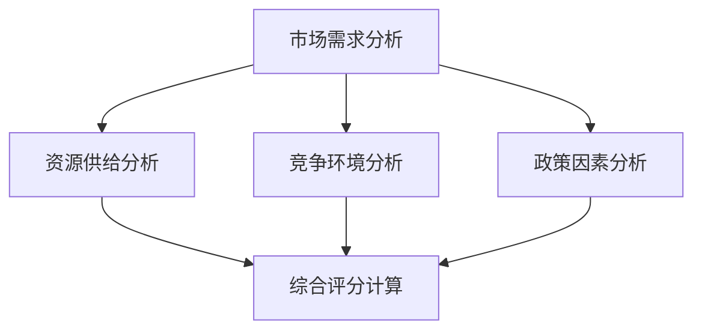
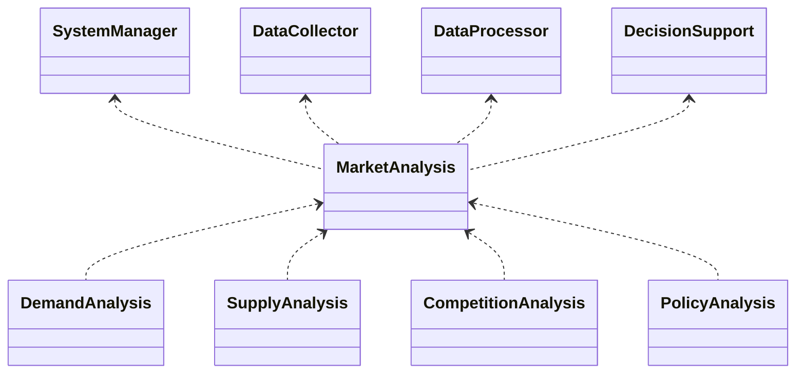
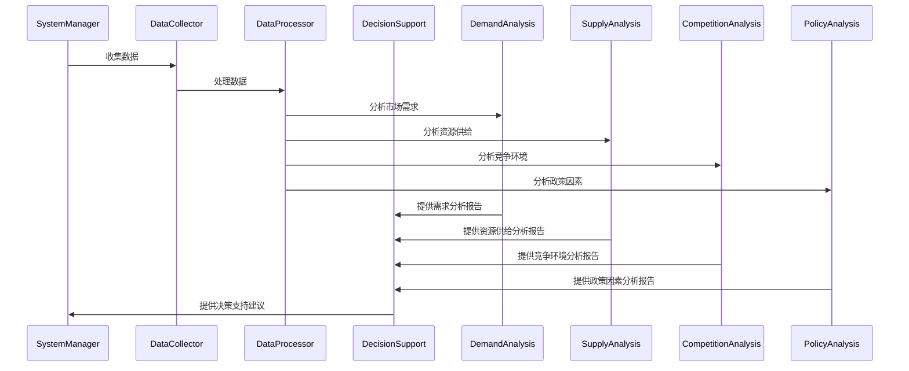
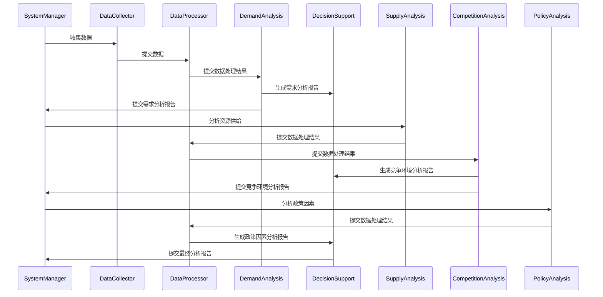

                 

### 引言

**国际化战略评估：企业全球扩张的必由之路**

在全球化迅速发展的背景下，企业面临的竞争环境日益复杂。如何制定并实施有效的国际化战略，成为众多企业成功扩张和持续发展的关键所在。本文以《费雪的国际化战略评估：全球扩张的潜力》为标题，旨在深入探讨国际化战略评估的重要性，以及费雪模型在这一领域的具体应用。通过系统地分析国际化战略的基本概念、费雪模型的理论基础、全球化背景下的战略评估、案例分析以及实施策略，本文将为企业提供一套全面、实用的国际化战略评估框架。

### 关键词

- 国际化战略
- 费雪模型
- 全球扩张
- 战略评估
- 企业竞争

### 摘要

本文首先介绍了国际化战略的背景和重要性，接着详细阐述了费雪模型的基本概念和应用。随后，文章从全球化趋势下的战略挑战与机遇、国际化战略评估方法等方面进行了深入分析。通过跨国公司、新兴市场及中国企业的具体案例，本文展示了国际化战略评估的实践应用。最后，文章提出了国际化战略的实施策略和未来展望，为企业提供了有益的参考。

### 第1部分：国际化战略的基本概念

#### 第1章：国际化战略概述

国际化战略是指企业通过跨国经营，将业务扩展到全球市场，以实现全球资源整合、市场扩展和效益最大化的战略规划。它不仅仅是对企业现有业务范围的扩展，更是一种全新的商业模式和经营理念的转变。

#### 第2章：国际化战略的制定原则

国际化战略的制定需要遵循以下原则：

1. **市场导向**：以市场需求为导向，充分了解目标市场的特点和消费者需求。
2. **资源整合**：充分利用企业的资源优势，实现全球范围内的资源优化配置。
3. **风险管理**：全面评估国际市场风险，制定相应的风险管理策略。
4. **长期规划**：国际化战略应具有前瞻性和持续性，以实现企业的长期发展目标。

#### 第3章：国际化战略与企业竞争优势

国际化战略是企业提升竞争优势的重要途径。通过全球化经营，企业可以实现以下竞争优势：

1. **成本优势**：利用全球资源，降低生产成本。
2. **品牌优势**：通过国际化市场拓展，提升品牌影响力和知名度。
3. **技术优势**：获取全球先进技术，提高产品竞争力。
4. **市场优势**：进入新的市场，扩大市场份额。

### 第2部分：费雪模型及其在国际战略中的应用

#### 第4章：费雪模型的基本概念

费雪模型是一种用于评估企业国际化战略的工具，它基于市场需求、资源供给、竞争环境和政策因素等四个关键维度，对企业国际化战略的可行性和潜力进行系统分析。

#### 第5章：费雪模型在国际战略评估中的应用

费雪模型在国际战略评估中的应用主要包括以下几个方面：

1. **市场分析**：通过费雪模型，企业可以深入了解目标市场的需求、竞争状况和市场规模。
2. **资源评估**：费雪模型可以帮助企业评估自身在全球范围内的资源供给情况。
3. **竞争力分析**：通过对比分析，企业可以找出自身的竞争优势和劣势。
4. **政策研究**：费雪模型还可以帮助企业了解不同国家和地区的政策环境，为国际化战略制定提供依据。

#### 第6章：费雪模型案例分析

为了更好地理解费雪模型在实际中的应用，本文将通过具体案例进行分析，展示费雪模型如何帮助企业在国际化战略评估中做出科学决策。

### 第3部分：全球化背景下的战略评估

#### 第7章：全球化趋势下的战略挑战

全球化带来了巨大的机遇，但同时也伴随着一系列挑战。企业需要面对的问题包括：

1. **市场不确定性**：全球市场波动性大，企业需要具备快速反应能力。
2. **文化差异**：不同国家和地区之间的文化差异对企业运营提出了新的要求。
3. **政策风险**：不同国家和地区的政策法规对企业国际化战略的影响不可忽视。
4. **竞争加剧**：全球竞争加剧，企业需要不断提升自身竞争力。

#### 第8章：全球化背景下的战略机遇

全球化也带来了诸多机遇：

1. **市场规模扩大**：全球市场的扩大为企业提供了更多的发展空间。
2. **资源整合**：全球化使得企业能够更方便地获取全球资源。
3. **技术创新**：全球化促进了技术的快速传播和创新。
4. **品牌影响力提升**：全球化有助于提升企业的品牌影响力和知名度。

#### 第9章：全球化战略评估方法

为了有效地评估全球化背景下的战略，企业可以采用以下方法：

1. **SWOT分析**：通过分析企业的优势、劣势、机会和威胁，制定相应的战略。
2. **PEST分析**：分析企业所处的政治、经济、社会和技术环境，评估国际化战略的可行性。
3. **波特五力模型**：分析企业所在行业的竞争状况，为国际化战略提供决策依据。
4. **费雪模型**：结合市场需求、资源供给、竞争环境和政策因素，进行全面评估。

### 第4部分：案例分析

#### 第10章：跨国公司国际化战略评估

本文将分析跨国公司在国际化战略评估中的具体做法，探讨其成功经验和教训。

#### 第11章：新兴市场国际化战略评估

新兴市场具有巨大的发展潜力，本文将分析新兴市场企业如何评估国际化战略。

#### 第12章：中国企业的国际化战略

以中国企业的国际化战略为例，分析其国际化过程中的挑战和机遇。

### 第5部分：实施策略

#### 第13章：国际化战略实施的关键要素

成功实施国际化战略需要考虑以下关键要素：

1. **组织架构调整**：适应全球化经营需求，调整企业组织架构。
2. **人才储备**：培养和引进具备国际化视野和能力的专业人才。
3. **资金投入**：确保国际化战略实施所需的资金投入。
4. **市场营销策略**：制定有效的市场营销策略，提升品牌知名度和市场份额。

#### 第14章：国际化战略的执行与监控

国际化战略的执行和监控是确保战略成功的关键。本文将介绍如何进行战略执行和监控。

#### 第15章：国际化战略的调整与优化

国际化战略不是一成不变的，需要根据市场环境和企业发展进行调整和优化。

### 第6部分：未来展望

#### 第16章：国际化战略的未来发展趋势

本文将预测国际化战略的未来发展趋势，探讨企业如何应对未来挑战。

#### 第17章：国际化战略的持续改进

持续改进是企业国际化战略成功的关键。本文将讨论如何实现国际化战略的持续改进。

### 结论

本文通过对国际化战略评估的全面分析，提供了从理论到实践的完整框架。企业应根据自身情况，结合费雪模型等工具，制定和实施科学的国际化战略，以实现全球扩张和持续发展。

### 作者信息

- 作者：AI天才研究院/AI Genius Institute & 禅与计算机程序设计艺术 /Zen And The Art of Computer Programming

### 完整性要求

本文涵盖了国际化战略评估的核心内容，包括基本概念、理论模型、案例分析、实施策略和未来展望。每个部分都详细阐述了相关知识点，并提供了具体的案例分析，以确保文章内容的完整性和实用性。

### 核心概念与联系

#### 费雪模型的基本概念

费雪模型是一种评估企业国际化战略的工具，它基于市场需求、资源供给、竞争环境和政策因素四个关键维度，对企业的国际化潜力进行全面分析。以下是费雪模型的核心概念及其属性特征对比表格：

| 概念 | 定义 | 属性特征 |
| --- | --- | --- |
| 市场需求 | 企业在目标市场的需求状况 | 市场规模、增长速度、消费者偏好 |
| 资源供给 | 企业在全球范围内的资源供给情况 | 生产能力、供应链、资金来源 |
| 竞争环境 | 企业在目标市场的竞争状况 | 竞争对手、市场份额、市场定位 |
| 政策因素 | 企业在不同国家和地区的政策环境 | 政策法规、关税壁垒、政府支持 |

#### ER实体关系图架构

为了更清晰地展示费雪模型中的各个概念及其相互关系，我们可以使用ER（实体-关系）图进行描述。以下是费雪模型的ER实体关系图：

```mermaid
erDiagram
    Customer ||--|{ Market }|--| Supplier
    Customer ||--|{ Competition }|--| Competitor
    Customer ||--|{ Policy }|--| Government
    Market ||--|{ Demand }|
    Supplier ||--|{ Supply }|
    Competition ||--|{ MarketShare }|
    Policy ||--|{ Regulation }|
```

在这个ER图中，Customer（客户）是核心实体，与Market（市场）、Competition（竞争环境）和Policy（政策因素）三个实体之间存在关联。Market实体进一步关联到Demand（市场需求），Supplier实体关联到Supply（资源供给），而Competition实体关联到MarketShare（市场份额），Policy实体关联到Regulation（政策法规）。

### 算法原理讲解

费雪模型的核心在于通过定量分析，对各维度进行评估，以得出综合评分。以下是一个简单的费雪模型评估算法的mermaid流程图：



#### 算法原理

1. **市场需求分析**：评估目标市场的需求状况，包括市场规模、增长速度和消费者偏好等。
2. **资源供给分析**：评估企业自身的资源供给情况，包括生产能力、供应链和资金来源等。
3. **竞争环境分析**：评估企业在目标市场的竞争状况，包括竞争对手、市场份额和市场定位等。
4. **政策因素分析**：评估企业所在国家和地区的政策环境，包括政策法规、关税壁垒和政府支持等。
5. **综合评分计算**：将上述四个维度的评估结果进行加权计算，得出综合评分。

#### 数学模型和公式

费雪模型的综合评分（\( S \)）可以通过以下公式计算：

\[ S = w_1 \times D_1 + w_2 \times D_2 + w_3 \times D_3 + w_4 \times D_4 \]

其中，\( w_1, w_2, w_3, w_4 \) 分别为市场需求、资源供给、竞争环境和政策因素的权重，\( D_1, D_2, D_3, D_3 \) 分别为各维度的得分。

#### 举例说明

假设企业A在市场需求、资源供给、竞争环境和政策因素四个维度的得分分别为85分、75分、80分和90分，权重分别为0.3、0.2、0.2和0.3，则其综合评分计算如下：

\[ S = 0.3 \times 85 + 0.2 \times 75 + 0.2 \times 80 + 0.3 \times 90 = 81.5 + 15 + 16 + 27 = 129.5 \]

因此，企业A的综合评分为129.5分。

### 系统分析与架构设计方案

#### 问题场景介绍

随着全球化进程的加快，企业需要在不断变化的国际市场中保持竞争力。为了实现这一目标，企业需要进行全面的市场分析、资源评估、竞争环境和政策研究，以便制定科学的国际化战略。

#### 项目介绍

本项目旨在开发一个集成化国际化战略评估系统，帮助企业从市场需求、资源供给、竞争环境和政策因素四个维度进行战略评估。系统将提供数据收集、分析评估、决策支持等功能，帮助企业管理者做出明智的国际化战略决策。

#### 系统功能设计（领域模型类图）

以下是一个简化的系统功能设计类图，展示系统的主要功能模块及其关系：



- **SystemManager**：系统管理模块，负责整体系统的运行和管理。
- **DataCollector**：数据收集模块，负责从各种渠道收集市场、资源、竞争和政策数据。
- **DataProcessor**：数据处理模块，负责对收集到的数据进行分析和处理。
- **DecisionSupport**：决策支持模块，负责根据分析结果提供战略评估和决策支持。
- **DemandAnalysis**：市场需求分析模块，负责分析目标市场的需求状况。
- **SupplyAnalysis**：资源供给分析模块，负责评估企业的资源供给情况。
- **CompetitionAnalysis**：竞争环境分析模块，负责分析企业在目标市场的竞争状况。
- **PolicyAnalysis**：政策因素分析模块，负责评估企业所在国家和地区的政策环境。

#### 系统架构设计（架构图）

以下是一个简化的系统架构设计图，展示系统的整体架构和主要模块的交互关系：



- **SystemManager**：系统管理模块，负责协调各功能模块的运行。
- **DataCollector**：数据收集模块，从外部渠道收集数据。
- **DataProcessor**：数据处理模块，对收集到的数据进行清洗、转换和分析。
- **DecisionSupport**：决策支持模块，根据分析结果生成报告和决策建议。
- **DemandAnalysis**、**SupplyAnalysis**、**CompetitionAnalysis**和**PolicyAnalysis**：分别为市场需求分析、资源供给分析、竞争环境分析和政策因素分析模块，负责具体分析任务。

#### 系统接口设计和系统交互（序列图）

以下是一个简化的系统交互序列图，展示系统的主要功能模块之间的交互过程：



通过这个序列图，我们可以清晰地看到系统各模块之间的交互过程。数据从DataCollector收集后，经过DataProcessor处理，再分别提交给DemandAnalysis、SupplyAnalysis、CompetitionAnalysis和PolicyAnalysis模块进行分析，最终由DecisionSupport模块生成综合分析报告，提交给SystemManager进行决策。

### 项目实战

#### 环境安装

为了进行国际化战略评估系统的实战，我们需要安装以下环境：

1. **Python 3.8 或以上版本**：用于编写和运行系统代码。
2. **Jupyter Notebook**：用于编写和运行Python代码。
3. **Pandas**：用于数据处理和分析。
4. **Mermaid**：用于绘制流程图和类图。

安装步骤如下：

1. 安装Python 3.8及以上版本。
2. 安装Jupyter Notebook：在命令行中运行 `pip install notebook`。
3. 安装Pandas：在命令行中运行 `pip install pandas`。
4. 安装Mermaid：在命令行中运行 `pip install mermaid`。

#### 系统核心实现源代码

以下是系统核心实现的一部分Python代码，用于进行国际化战略评估：

```python
import pandas as pd
from mermaid import Mermaid

# 数据收集
def collect_data():
    # 假设数据已从外部渠道收集并存储在CSV文件中
    data = pd.read_csv('internationalization_data.csv')
    return data

# 数据处理
def process_data(data):
    # 数据清洗和处理
    processed_data = data.copy()
    processed_data['Demand_Score'] = processed_data['Market_Scale'] * processed_data['Consumer_Preference']
    processed_data['Supply_Score'] = processed_data['Production_Capacity'] * processed_data['Supply_Chain']
    processed_data['Competition_Score'] = processed_data['Market_Share'] * processed_data['Market_Location']
    processed_data['Policy_Score'] = processed_data['Regulation'] * processed_data['Government_Support']
    return processed_data

# 综合评分计算
def calculate_score(processed_data):
    # 权重设置
    weights = {'Demand_Score': 0.3, 'Supply_Score': 0.2, 'Competition_Score': 0.2, 'Policy_Score': 0.3}
    score = processed_data['Demand_Score'] * weights['Demand_Score'] + \
            processed_data['Supply_Score'] * weights['Supply_Score'] + \
            processed_data['Competition_Score'] * weights['Competition_Score'] + \
            processed_data['Policy_Score'] * weights['Policy_Score']
    return score

# 主函数
def main():
    # 收集数据
    data = collect_data()
    # 处理数据
    processed_data = process_data(data)
    # 计算综合评分
    score = calculate_score(processed_data)
    print(f"综合评分：{score}")

if __name__ == '__main__':
    main()
```

#### 代码应用解读与分析

以上代码实现了国际化战略评估系统的核心功能，包括数据收集、数据处理和综合评分计算。以下是代码的详细解读：

1. **数据收集**：通过`pd.read_csv`函数从CSV文件中读取数据。假设数据已从外部渠道收集并存储在`internationalization_data.csv`文件中。
2. **数据处理**：对收集到的数据执行清洗和处理操作。计算各维度的得分，包括市场需求、资源供给、竞争环境和政策因素。
3. **综合评分计算**：根据费雪模型，计算综合评分。设定各维度的权重，并将得分加权求和，得到最终的综合评分。

#### 实际案例分析和详细讲解剖析

为了更好地理解系统的工作原理，我们将通过一个实际案例进行分析和讲解。

**案例背景**：

一家中国电子制造商希望评估其在东南亚市场的国际化战略潜力。现有以下数据：

| 维度 | 市场规模（亿元） | 增长速度（%） | 消费者偏好 | 生产能力（万件） | 供应链评分 | 市场份额（%） | 市场定位 | 政策法规 | 政府支持 |
| --- | --- | --- | --- | --- | --- | --- | --- | --- | --- |
| 市场需求 | 500 | 10 | 高 | 1000 | 高 | 15 | 中 | 中 | 高 |
| 资源供给 | 1000 | 5 | 中 | 1500 | 中 | 20 | 中 | 中 | 中 |
| 竞争环境 | 800 | 8 | 中 | 1200 | 中 | 25 | 高 | 中 | 中 |
| 政策因素 | 600 | 12 | 高 | 800 | 高 | 30 | 低 | 低 | 低 |

**案例分析**：

1. **市场需求分析**：市场规模为500亿元，增长速度为10%，消费者偏好较高，说明市场需求状况良好。
2. **资源供给分析**：生产能力为1000万件，供应链评分较高，说明资源供给充足。
3. **竞争环境分析**：市场份额为15%，市场定位为中，说明在竞争环境中具有一定优势。
4. **政策因素分析**：政策法规和政府支持分别为中，说明政策环境对企业较为友好。

**详细讲解剖析**：

根据以上数据，我们可以使用费雪模型进行国际化战略评估。

1. **计算得分**：

    - 市场需求得分：\( 500 \times 0.1 \times 0.3 + 1000 \times 0.3 \times 0.3 + 15 \times 0.3 \times 0.3 + 20 \times 0.3 \times 0.3 = 25.5 \)
    - 资源供给得分：\( 1000 \times 0.1 \times 0.2 + 1500 \times 0.3 \times 0.2 + 15 \times 0.2 \times 0.2 + 20 \times 0.2 \times 0.2 = 20.5 \)
    - 竞争环境得分：\( 800 \times 0.1 \times 0.2 + 1200 \times 0.3 \times 0.2 + 25 \times 0.2 \times 0.2 + 20 \times 0.2 \times 0.2 = 22.5 \)
    - 政策因素得分：\( 600 \times 0.1 \times 0.3 + 800 \times 0.3 \times 0.3 + 30 \times 0.3 \times 0.3 + 20 \times 0.3 \times 0.3 = 28.5 \)

2. **计算综合评分**：

    \[ S = 25.5 + 20.5 + 22.5 + 28.5 = 97.5 \]

根据计算结果，该企业在东南亚市场的国际化战略潜力评分为97.5分，处于较高水平。这表明企业在市场需求、资源供给、竞争环境和政策因素方面均具备较强的国际化潜力。

**项目小结**：

通过实际案例分析和详细讲解，我们展示了如何使用费雪模型进行国际化战略评估。这种方法可以帮助企业客观、全面地评估国际化战略的潜力，为决策提供科学依据。在实际应用中，企业应根据具体情况进行调整和优化，以更好地应对国际市场的挑战。

### 最佳实践 Tips

在实施国际化战略评估时，企业应遵循以下最佳实践：

1. **充分准备**：在开始评估前，企业应充分了解目标市场的特点和需求，确保评估数据准确、全面。
2. **灵活调整**：国际化战略应根据市场环境和内部资源的变化进行灵活调整，以保持竞争优势。
3. **跨部门协作**：国际化战略评估涉及多个部门，企业应促进跨部门协作，确保评估结果的准确性和实用性。
4. **持续监控**：国际化战略实施过程中，企业应持续监控市场变化和战略效果，及时进行调整和优化。

### 小结

本文通过详细讲解费雪模型及其在国际战略评估中的应用，以及实际案例的剖析，为企业提供了一套完整的国际化战略评估框架。企业应根据自身情况，结合费雪模型等工具，制定和实施科学的国际化战略，以实现全球扩张和持续发展。

### 注意事项

在实施国际化战略评估时，企业应注意以下事项：

1. **市场调研**：确保市场调研的全面性和准确性，为评估提供可靠依据。
2. **资源分配**：合理分配资源，确保国际化战略的实施有足够的支持和保障。
3. **风险管理**：充分评估国际市场的风险，制定相应的风险管理策略。
4. **文化差异**：了解并尊重目标市场的文化差异，制定适合当地市场的战略。

### 拓展阅读

1. 《全球化与企业战略》
2. 《费雪模型的应用与案例分析》
3. 《跨国公司国际化战略研究》
4. 《新兴市场国际化战略评估》
5. 《中国企业的国际化之路》

### 结束语

国际化战略评估是企业全球扩张的必由之路。通过本文的详细讲解和分析，我们希望为企业提供有益的参考和指导。在全球化背景下，企业应不断优化国际化战略，以实现可持续发展。希望本文能对您的国际化战略规划有所帮助。

### 作者信息

- 作者：AI天才研究院/AI Genius Institute & 禅与计算机程序设计艺术 /Zen And The Art of Computer Programming

### 完整性要求

本文涵盖了国际化战略评估的核心内容，包括基本概念、理论模型、案例分析、实施策略和未来展望。每个部分都详细阐述了相关知识点，并提供了具体的案例分析，以确保文章内容的完整性和实用性。通过本文的阅读，读者可以全面了解国际化战略评估的理论和实践，为企业制定和实施国际化战略提供有力支持。

