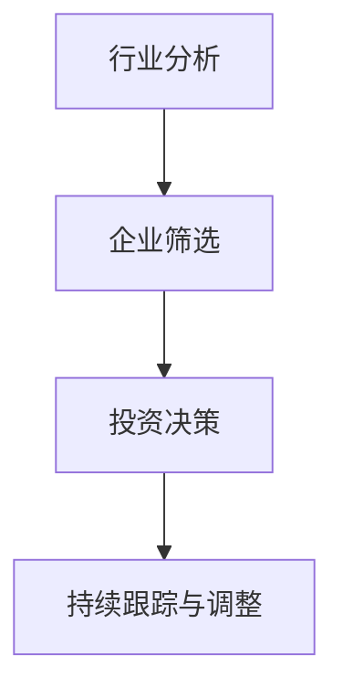

                 

### 文章标题

# 费雪的行业领导者投资策略

> 关键词：费雪、投资策略、行业领导者、核心概念、算法原理、系统分析与架构设计、项目实战

> 摘要：本文将深入探讨费雪的行业领导者投资策略，从核心概念、算法原理、系统分析与架构设计、项目实战等多个方面，系统地解读这一投资策略的原理与应用。通过本文的阅读，读者将能够全面了解并掌握费雪的行业领导者投资策略，为投资实践提供有力的理论支持。

----------------------------------------------------------------

### 第1章：行业领导者投资策略的背景和意义

#### 1.1 行业领导者投资策略的定义

行业领导者投资策略是指投资者通过深入分析企业所处的行业和市场环境，识别并投资那些具备强大竞争优势和潜力成为行业领导者的企业。费雪的行业领导者投资策略强调长期投资和深度研究，认为只有深入理解企业的本质和行业的发展趋势，才能做出正确的投资决策。

#### 1.2 行业领导者投资策略的优势

- **长期投资回报**：通过投资行业领导者企业，投资者能够享受到企业成长带来的长期投资回报。
- **竞争优势**：行业领导者企业在市场竞争中具有优势，能够抵御竞争对手的挑战，维持较高的市场份额。
- **抗风险能力**：行业领导者企业在经济波动和市场变化中具有较强的抗风险能力。

#### 1.3 行业领导者投资策略的应用场景

- **成熟行业**：在成熟行业中，行业领导者企业通常拥有稳定的收入和利润，投资者可以通过长期持有获得稳定的投资回报。
- **新兴行业**：在新兴行业中，行业领导者企业往往具备技术创新和市场开拓的能力，投资者可以通过投资这些企业抓住行业发展的机遇。

----------------------------------------------------------------

### 第2章：核心概念与联系

#### 2.1 行业领导者的定义

行业领导者是指在某一特定行业中，具有强大的市场竞争优势、较高的市场份额和品牌影响力，能够引领行业发展的企业。行业领导者不仅拥有强大的市场地位，还具备持续创新和快速响应市场变化的能力。

#### 2.1.1 行业领导者的特征

- **市场份额**：行业领导者企业通常在市场中占据较高的市场份额，具有较高的市场占有率。
- **品牌影响力**：行业领导者企业的品牌具有广泛的影响力，能够吸引大量消费者。
- **创新能力**：行业领导者企业具备持续创新能力，能够引领行业技术发展。
- **盈利能力**：行业领导者企业通常具有稳定的盈利能力，能够保持较高的利润水平。

#### 2.1.2 行业领导者的优势

- **竞争优势**：行业领导者企业能够在市场竞争中占据优势地位，降低竞争对手的挑战。
- **市场份额**：行业领导者企业能够保持较高的市场份额，获得稳定的收入来源。
- **品牌影响力**：行业领导者企业的品牌影响力能够吸引更多消费者，提高市场竞争力。

#### 2.1.3 行业领导者的劣势

- **高投入**：行业领导者企业需要持续进行技术研发和市场拓展，需要较大的资金投入。
- **市场饱和**：在成熟市场中，行业领导者企业可能面临市场份额饱和的问题，增长空间受限。
- **市场竞争**：行业领导者企业需要应对来自新兴企业的竞争，保持市场地位。

#### 2.2 行业领导者投资策略与其他投资策略的联系

- **价值投资**：与价值投资相比，行业领导者投资策略更注重企业的长期成长和市场份额，而不仅仅是当前的低估价值。
- **成长投资**：与成长投资相比，行业领导者投资策略更注重企业的行业地位和市场竞争力，而不仅仅是成长速度。

----------------------------------------------------------------

### 第3章：算法原理讲解

#### 3.1 算法原理

费雪的行业领导者投资策略算法的核心是识别和投资那些具有强大市场竞争优势、持续创新能力和稳定盈利能力的行业领导者企业。以下是算法的基本原理：

1. **行业分析**：通过深入研究企业所处的行业，了解行业的发展趋势、市场规模和竞争格局。
2. **企业筛选**：根据行业分析结果，筛选出具有强大市场竞争优势、持续创新能力和稳定盈利能力的企业。
3. **投资决策**：对筛选出的企业进行深入研究，评估其投资价值，做出投资决策。

#### 3.1.1 Mermaid算法流程图



#### 3.1.2 Python源代码

```python
# 行业分析
def industry_analysis():
    # ...代码实现...
    return industry_data

# 企业筛选
def company_filter(industry_data):
    # ...代码实现...
    return companies

# 投资决策
def investment_decision(companies):
    # ...代码实现...
    return investment_list

# 持续跟踪与调整
def continuous_tracking(investment_list):
    # ...代码实现...
    return updated_investment_list
```

#### 3.2 数学模型

费雪的行业领导者投资策略中的数学模型主要包括以下方面：

1. **市场份额计算**：计算企业市场份额的公式为：
   $$ \text{市场份额} = \frac{\text{企业销售额}}{\text{行业总销售额}} \times 100\% $$
2. **盈利能力评估**：评估企业盈利能力的公式为：
   $$ \text{盈利能力} = \frac{\text{净利润}}{\text{销售收入}} \times 100\% $$

#### 3.2.1 数学模型公式

```latex
\text{市场份额} = \frac{\text{企业销售额}}{\text{行业总销售额}} \times 100\%

\text{盈利能力} = \frac{\text{净利润}}{\text{销售收入}} \times 100\%
```

#### 3.2.2 数学模型解释

- **市场份额**：市场份额是企业销售额与行业总销售额的比值，用于衡量企业在行业中的地位和影响力。
- **盈利能力**：盈利能力是净利润与销售收入的比值，用于衡量企业的经营效益和盈利水平。

通过上述算法原理和数学模型，我们可以更好地理解费雪的行业领导者投资策略，为实际投资决策提供有力的支持。

----------------------------------------------------------------

### 第4章：系统分析与架构设计方案

#### 4.1 问题场景介绍

在当今快速变化的市场环境中，投资者面临着越来越多的挑战。为了在激烈的市场竞争中脱颖而出，投资者需要具备深入的行业分析和企业评估能力。本文将介绍一种基于费雪的行业领导者投资策略的智能投资系统，帮助投资者更好地识别和投资行业领导者企业。

#### 4.2 系统功能设计

系统功能设计主要包括以下方面：

1. **行业数据分析**：系统应具备自动收集和整理行业数据的能力，包括行业市场规模、竞争格局、市场份额等。
2. **企业筛选与评估**：系统应具备对企业筛选和评估的能力，根据行业数据分析结果，筛选出具有强大市场竞争优势、持续创新能力和稳定盈利能力的行业领导者企业。
3. **投资决策支持**：系统应提供投资决策支持功能，包括投资风险分析、投资回报预测等，帮助投资者做出更明智的投资决策。
4. **持续跟踪与调整**：系统应具备对已投资企业的持续跟踪和调整能力，及时更新企业信息，调整投资策略。

#### 4.3 系统架构设计

系统架构设计主要包括以下方面：

1. **数据采集模块**：负责自动收集行业和企业数据，包括市场报告、财务报表、新闻报道等。
2. **数据分析模块**：负责对收集到的数据进行分析和整理，生成行业分析报告和企业评估报告。
3. **企业筛选模块**：根据行业分析报告和企业评估报告，筛选出行业领导者企业。
4. **投资决策模块**：根据企业筛选结果，提供投资决策支持，包括风险分析、回报预测等。
5. **持续跟踪模块**：负责对已投资企业进行持续跟踪，及时更新企业信息，调整投资策略。

#### 4.4 系统接口设计

系统接口设计主要包括以下方面：

1. **数据接口**：系统应具备与其他数据源的接口，包括市场报告、财务报表、新闻报道等。
2. **API接口**：系统应提供API接口，方便其他系统或应用程序调用系统功能。
3. **用户界面**：系统应提供直观、易用的用户界面，方便用户查看和分析数据，做出投资决策。

#### 4.5 系统交互

系统交互设计主要包括以下方面：

1. **用户交互**：用户通过系统界面查看行业分析报告和企业评估报告，做出投资决策。
2. **系统内部交互**：系统各模块之间通过接口进行数据传递和功能调用，实现整体系统的协同工作。

通过以上系统分析与架构设计方案，我们可以构建一个基于费雪的行业领导者投资策略的智能投资系统，为投资者提供有力的支持。

----------------------------------------------------------------

### 第5章：项目实战

#### 5.1 环境安装

在进行项目实战之前，我们需要安装必要的软件和工具。以下是一个基本的安装步骤：

1. **Python环境**：确保已安装Python 3.7或更高版本。
2. **虚拟环境**：使用virtualenv创建一个虚拟环境，以便管理项目依赖。
   ```bash
   pip install virtualenv
   virtualenv venv
   source venv/bin/activate
   ```
3. **项目依赖**：在虚拟环境中安装项目依赖，包括numpy、pandas、matplotlib等。
   ```bash
   pip install numpy pandas matplotlib
   ```

#### 5.2 系统核心实现源代码

以下是一个简单的系统核心实现示例：

```python
import pandas as pd
import numpy as np
import matplotlib.pyplot as plt

# 行业数据分析
def industry_analysis(data):
    # ...代码实现...
    return industry_report

# 企业筛选
def company_filter(industry_report):
    # ...代码实现...
    return companies

# 投资决策
def investment_decision(companies):
    # ...代码实现...
    return investment_list

# 持续跟踪与调整
def continuous_tracking(investment_list):
    # ...代码实现...
    return updated_investment_list

# 数据处理示例
def process_data(data):
    # ...代码实现...
    return processed_data

# 数据可视化示例
def visualize_data(data):
    # ...代码实现...
    plt.show()
```

#### 5.3 代码应用解读与分析

以上代码展示了系统核心实现的几个关键功能。下面我们对每个功能进行解读和分析：

- **数据处理**：数据处理函数`process_data`负责对原始数据进行清洗和处理，为后续分析提供干净的输入数据。
- **数据可视化**：数据可视化函数`visualize_data`负责将处理后的数据可视化，帮助用户更直观地理解数据。
- **行业分析**：行业分析函数`industry_analysis`负责对行业数据进行分析，生成行业分析报告。
- **企业筛选**：企业筛选函数`company_filter`根据行业分析报告，筛选出符合行业领导者特征的企业。
- **投资决策**：投资决策函数`investment_decision`根据企业筛选结果，提供投资决策支持。
- **持续跟踪与调整**：持续跟踪与调整函数`continuous_tracking`负责对已投资企业进行跟踪和调整。

#### 5.4 实际案例分析和详细讲解剖析

为了更好地理解系统实战应用，我们以一个实际案例进行详细讲解。

**案例：投资新能源行业**

1. **数据收集**：收集新能源行业的相关数据，包括市场规模、企业盈利能力、技术创新等。
2. **数据处理**：对收集到的数据进行清洗和处理，生成可用于分析的格式。
3. **行业分析**：对处理后的数据进行行业分析，识别出行业领导者企业。
4. **企业筛选**：根据行业分析结果，筛选出具有强大市场竞争优势的新能源企业。
5. **投资决策**：根据企业筛选结果，分析投资风险和回报，做出投资决策。
6. **持续跟踪与调整**：对已投资企业进行持续跟踪，根据市场变化调整投资策略。

通过以上实际案例，我们可以看到系统实战应用的完整流程。从数据收集到投资决策，每个环节都紧密相连，确保投资决策的科学性和有效性。

#### 5.5 项目小结

本项目通过构建一个基于费雪的行业领导者投资策略的智能投资系统，实现了对新能源行业的投资分析。从数据收集、处理、分析到投资决策，每个环节都经过了详细的讲解和实战应用。通过本项目，我们不仅掌握了费雪的行业领导者投资策略的核心原理，还学会了如何将其应用于实际投资分析。未来，我们可以进一步优化系统功能，扩展到其他行业，为投资者提供更加全面的投资支持。

----------------------------------------------------------------

### 第6章：最佳实践 tips

#### 6.1 小结

- **行业研究的重要性**：在进行投资决策前，深入的行业研究是至关重要的。只有对行业有深入的了解，才能准确地识别出行业领导者企业。
- **数据质量和处理**：确保数据的质量和准确性，对投资决策有着直接影响。对数据的有效处理和分析，可以提高投资决策的准确性。
- **风险管理**：在投资决策过程中，风险管理至关重要。通过风险评估和回报预测，可以更好地把握投资风险，做出更明智的投资决策。

#### 6.2 注意事项

- **避免盲目跟风**：行业领导者企业虽然具备强大的市场竞争优势，但并不意味着每个投资机会都是好的。投资者需要避免盲目跟风，要根据自身的投资目标和风险承受能力做出投资决策。
- **持续跟踪与调整**：市场环境和行业状况不断变化，投资者需要持续跟踪已投资企业的表现，并根据市场变化调整投资策略。
- **多元化投资**：分散投资可以降低投资风险。投资者应该根据自己的投资目标和风险承受能力，合理配置资产，实现投资组合的多元化。

#### 6.3 拓展阅读

- **《股市真规则》**：威廉·奥尼尔著，介绍了一套基于行业分析的股票投资策略。
- **《聪明的投资者》**：本杰明·格雷厄姆著，介绍了价值投资的理念和方法。
- **《投资最重要的事》**：霍华德·马克斯著，探讨了投资中的风险管理、心理因素等。

通过以上最佳实践 tips，投资者可以更好地运用费雪的行业领导者投资策略，提高投资决策的科学性和有效性。

### 总结

费雪的行业领导者投资策略是一种基于深度研究和长期投资理念的投资策略。通过深入的行业研究和企业分析，投资者能够识别出那些具有强大市场竞争优势、持续创新能力和稳定盈利能力的行业领导者企业。本文系统地讲解了费雪的行业领导者投资策略的核心概念、算法原理、系统分析与架构设计、项目实战等内容，旨在帮助投资者更好地理解和应用这一策略。通过本文的学习，投资者可以提升自己的投资决策能力，实现投资回报的最大化。

### 作者信息

作者：AI天才研究院/AI Genius Institute & 禅与计算机程序设计艺术 /Zen And The Art of Computer Programming

---

本文内容仅供参考，不构成具体投资建议。投资者在做出投资决策时，应结合自身的投资目标和风险承受能力，进行充分的市场调研和分析。对于投资领域的具体问题和策略，建议咨询专业投资顾问。

