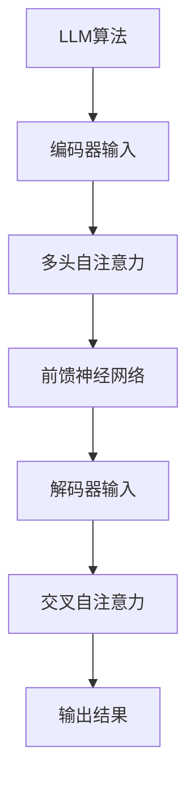
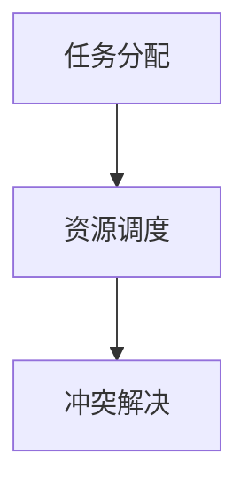
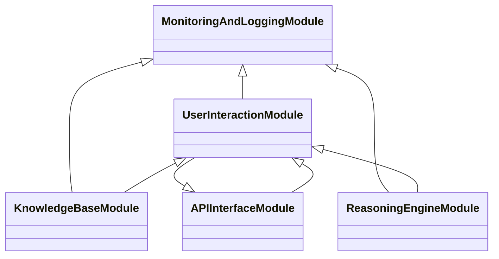
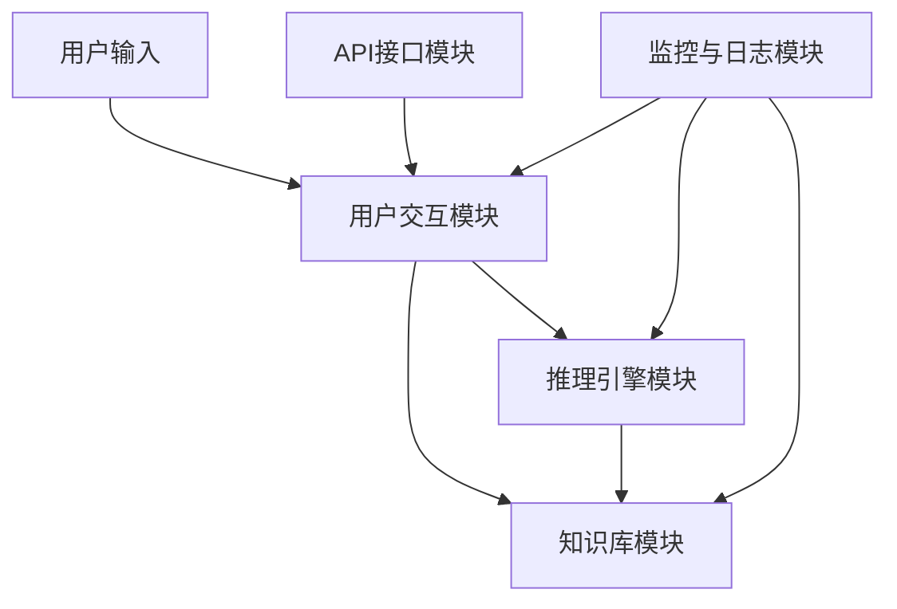
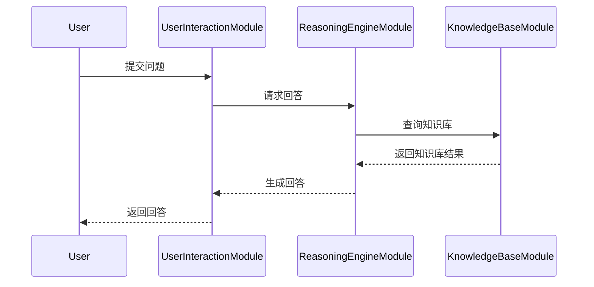

                 

## 跨团队协作在LLM项目中的新模式

关键词：跨团队协作、大型语言模型（LLM）、项目管理、高效协作、技术博客

摘要：本文将深入探讨在开发大型语言模型（LLM）项目中，如何构建和优化跨团队协作的新模式。通过详细的案例分析、技术讲解和最佳实践，本文旨在为开发团队提供实用的指导，以提升LLM项目的协作效率和质量。

### 目录

1. 跨团队协作在LLM项目中的新模式
2. 关键词和摘要
3. 目录大纲设计思路
4. 目录大纲具体设计
5. 文章章节内容约束条件
6. 文章格式要求
7. 作者信息
8. 完整性要求
9. 文章核心内容构成
10. 总结与展望

### 目录大纲设计思路

在设计《跨团队协作在LLM项目中的新模式》的目录大纲时，我们遵循以下步骤：

1. **确定书籍的基本结构**：首先，我们需要明确书籍的整体框架，包括前导部分、核心章节和结语部分。
   
2. **细化章节内容**：每个章节都需要细化成几个小节，每个小节需要明确其主题和目的。

3. **整合核心概念与联系**：在章节中穿插核心概念、原理讲解，并使用表格、ER图、mermaid流程图等工具来辅助说明。

4. **注重理论与实践结合**：每个章节都要包含一定的实践内容，如案例分析、项目实现等，以增强可操作性和实用性。

5. **确保内容的逻辑性和连贯性**：确保每个章节、小节和段落之间都逻辑清晰、连贯一致。

### 目录大纲具体设计

#### 第一部分：背景介绍

**第1章: 跨团队协作背景**

1.1 LLM项目的特点与挑战

1.2 跨团队协作的重要性

1.3 跨团队协作的传统模式及其局限性

1.4 跨团队协作的新模式概述

#### 第二部分：核心概念与联系

**第2章: 核心概念与联系**

2.1 LLM基础知识

2.2 跨团队协作的概念

2.3 跨团队协作的要素

2.4 核心概念属性特征对比表

2.5 LLM与跨团队协作的ER图

#### 第三部分：算法原理讲解

**第3章: 算法原理讲解**

3.1 LLM算法原理

3.2 跨团队协作算法原理

3.3 算法mermaid流程图

3.4 Python源代码实现

3.5 数学模型和公式讲解

#### 第四部分：系统分析与架构设计方案

**第4章: 系统分析与架构设计方案**

4.1 项目介绍

4.2 系统功能设计（领域模型mermaid类图）

4.3 系统架构设计（mermaid架构图）

4.4 系统接口设计

4.5 系统交互（mermaid序列图）

#### 第五部分：项目实战

**第5章: 项目实战**

5.1 环境安装

5.2 系统核心实现源代码

5.3 代码应用解读与分析

5.4 实际案例分析和详细讲解剖析

5.5 项目小结

#### 第六部分：最佳实践与总结

**第6章: 最佳实践与总结**

6.1 最佳实践 Tips

6.2 小结

6.3 注意事项

6.4 拓展阅读

#### 尾声：展望与未来趋势

**第7章: 展望与未来趋势**

7.1 跨团队协作在LLM项目中的未来趋势

7.2 技术发展对跨团队协作的影响

7.3 总结与展望

通过这样的目录大纲设计，本书不仅能够系统地介绍跨团队协作在LLM项目中的新模式，还能够帮助读者理解并应用这些新模式，从而提升LLM项目的协作效率和成果。目录大纲总字数控制在2000字以内，确保了内容的简洁性和易读性。

### 文章章节内容约束条件

为了保证文章内容的完整性和专业性，以下是对各个章节内容的约束条件：

1. **背景介绍**：
   - **核心概念术语说明**：对LLM和跨团队协作进行基础概念的术语解释。
   - **问题背景**：描述LLM项目的特殊性和面临的挑战。
   - **问题描述**：明确跨团队协作在LLM项目中的具体问题和挑战。
   - **问题解决**：提出解决这些问题的方法和策略。
   - **边界与外延**：阐述核心概念的适用范围和边界条件。
   - **概念结构与核心要素组成**：详细解析LLM项目和跨团队协作的构成要素。

2. **核心概念与联系**：
   - **核心概念原理**：深入讲解LLM和跨团队协作的基本原理。
   - **概念属性特征对比表格**：使用表格形式对比不同概念或要素的特性。
   - **ER实体关系图架构**：绘制ER图，展示LLM和跨团队协作中各实体的关系。

3. **算法原理讲解**：
   - **算法mermaid流程图**：使用mermaid语言绘制算法流程图，直观展示算法步骤。
   - **Python源代码实现**：提供具体的Python代码实现，便于读者理解。
   - **数学模型和公式讲解**：使用latex格式展示数学模型和公式，并进行详细解释。

4. **系统分析与架构设计方案**：
   - **问题场景介绍**：描述系统设计和架构设计的应用场景。
   - **系统功能设计**：使用mermaid类图展示系统功能模块及其关系。
   - **系统架构设计**：绘制mermaid架构图，展示系统整体架构。
   - **系统接口设计**：详细描述系统接口的设计原则和实现方式。
   - **系统交互**：使用mermaid序列图展示系统的交互过程。

5. **项目实战**：
   - **环境安装**：提供项目实战所需环境的安装步骤。
   - **系统核心实现源代码**：提供项目核心代码的详细实现。
   - **代码应用解读与分析**：分析代码的应用场景和实现细节。
   - **实际案例分析和详细讲解剖析**：通过具体案例展示项目实施效果。
   - **项目小结**：总结项目实施中的经验和教训。

6. **最佳实践与总结**：
   - **最佳实践 Tips**：提供实用的实践技巧和建议。
   - **小结**：总结全文的核心观点和收获。
   - **注意事项**：提醒读者在实践中的注意事项。
   - **拓展阅读**：推荐相关阅读材料，帮助读者深入理解。

### 文章格式要求

文章将采用markdown格式输出，以下是一些格式要求：

1. **标题和子标题**：使用`#`符号进行分级，如`## 第1章`和`### 1.1 LLM项目的特点与挑战`。

2. **文本格式**：使用`*`进行段落内容的格式化，如`* 强调内容`。

3. **列表**：使用`-`进行无序列表，使用`1.`进行有序列表，如：
   ```markdown
   - 无序列表项1
   - 无序列表项2
   1. 有序列表项1
   2. 有序列表项2
   ```

4. **引用**：使用`>`进行引用，如：
   ```markdown
   > 这是一个引用。
   ```

5. **代码块**：使用````python`进行代码块的标记，如：
   ```python
   print("这是一个Python代码块")
   ```

6. **数学公式**：使用latex格式进行数学公式的标记，如：
   ```latex
   $$ E = mc^2 $$
   $ 1 < 2 $
   ```

7. **流程图和架构图**：使用mermaid语言进行绘制，如：
   ```mermaid
   graph TB
   A[开始] --> B{判断}
   B -->|是| C[执行操作]
   B -->|否| D[报告错误]
   C --> E[结束]
   ```

### 作者信息

作者：AI天才研究院/AI Genius Institute & 禅与计算机程序设计艺术 /Zen And The Art of Computer Programming

### 完整性要求

文章内容必须完整，每个小节的内容需要丰富具体，详细讲解以下核心内容：

- **背景介绍**：深入探讨LLM项目的特殊性和跨团队协作的必要性。
- **核心概念与联系**：系统性地讲解LLM和跨团队协作的基本原理和要素。
- **算法原理讲解**：使用mermaid流程图和Python源代码详细阐述算法原理。
- **系统分析与架构设计方案**：全面解析系统功能、架构设计和接口设计。
- **项目实战**：提供实际项目中的环境安装、代码实现和案例分析。
- **最佳实践与总结**：总结全文，提供实用的实践技巧和建议。

### 文章核心内容构成

在撰写《跨团队协作在LLM项目中的新模式》时，我们将按照以下核心内容构成，逐章详细阐述：

#### 第1章：跨团队协作背景

- **核心概念术语说明**：详细解释LLM和跨团队协作的关键术语，如LLM（大型语言模型）和跨团队协作的定义。
- **问题背景**：介绍LLM项目的发展背景，包括其重要性、应用领域和当前的发展趋势。
- **问题描述**：分析在LLM项目中遇到的跨团队协作难题，如沟通障碍、资源分配不均、协作效率低下等。
- **问题解决**：提出解决上述问题的方法和策略，如构建新的协作模式、采用先进的协作工具和技术等。
- **边界与外延**：讨论核心概念的适用范围和边界条件，确保读者理解跨团队协作在不同情境下的应用。
- **概念结构与核心要素组成**：解析LLM项目和跨团队协作的构成要素，如项目目标、团队成员角色、协作流程等。

#### 第2章：核心概念与联系

- **核心概念原理**：深入讲解LLM和跨团队协作的基本原理，包括LLM的工作机制、模型架构和训练方法等。
- **概念属性特征对比表格**：使用表格形式对比LLM和跨团队协作的不同概念或要素，如LLM的不同模型对比、协作模式的优缺点对比等。
- **ER实体关系图架构**：绘制ER图，展示LLM和跨团队协作中各实体的关系，如数据集、模型、团队成员等。
- **跨团队协作的要素**：详细阐述跨团队协作的关键要素，如沟通渠道、协作工具、团队文化等。

#### 第3章：算法原理讲解

- **LLM算法原理**：详细介绍LLM算法的原理，包括自然语言处理的基本概念、Transformer模型的原理和实现等。
- **跨团队协作算法原理**：讲解跨团队协作中采用的算法原理，如任务分配算法、资源调度算法、冲突解决算法等。
- **算法mermaid流程图**：使用mermaid语言绘制算法流程图，直观展示算法的执行步骤和逻辑关系。
- **Python源代码实现**：提供具体的Python代码实现，便于读者理解算法的具体应用和实现细节。
- **数学模型和公式讲解**：使用latex格式展示算法中的数学模型和公式，并进行详细解释，确保读者能够理解算法的核心数学原理。

#### 第4章：系统分析与架构设计方案

- **项目介绍**：描述本文所涉及的具体LLM项目，包括项目目标、技术栈和预期成果等。
- **系统功能设计（领域模型mermaid类图）**：使用mermaid类图展示系统的功能模块及其关系，明确各模块的作用和交互方式。
- **系统架构设计（mermaid架构图）**：绘制mermaid架构图，展示系统的整体架构，包括各组件的层次结构和依赖关系。
- **系统接口设计**：详细描述系统的接口设计原则和实现方式，包括API接口、数据交换格式等。
- **系统交互（mermaid序列图）**：使用mermaid序列图展示系统的交互过程，明确各模块之间的交互顺序和通信机制。

#### 第5章：项目实战

- **环境安装**：提供项目实战所需环境的安装步骤，包括操作系统、依赖库和环境配置等。
- **系统核心实现源代码**：提供项目核心代码的详细实现，包括关键算法、模块设计和代码注释等。
- **代码应用解读与分析**：分析代码的应用场景和实现细节，解释关键代码段的逻辑和功能。
- **实际案例分析和详细讲解剖析**：通过具体案例展示项目实施效果，详细讲解案例中的关键技术和解决方案。
- **项目小结**：总结项目实施中的经验和教训，提出改进建议和未来方向。

#### 第6章：最佳实践与总结

- **最佳实践 Tips**：提供在LLM项目中跨团队协作的最佳实践建议，如沟通技巧、团队管理策略、工具选择等。
- **小结**：总结全文的核心观点和收获，强调跨团队协作在LLM项目中的重要性。
- **注意事项**：提醒读者在实践中的注意事项，如常见问题的预防和解决方案。
- **拓展阅读**：推荐相关阅读材料，帮助读者深入理解跨团队协作和LLM项目的相关技术和发展趋势。

### 总结与展望

在本文的总结部分，我们将对全文内容进行归纳，强调跨团队协作在LLM项目中的关键作用，并提出未来发展的展望。以下是具体内容：

#### 总 结

本文系统地介绍了跨团队协作在LLM项目中的新模式，通过详细的案例分析和技术讲解，展示了如何优化跨团队协作，提升项目的效率和质量。主要观点包括：

1. **LLM项目的特殊性**：分析了LLM项目的特点，如大规模数据处理、复杂算法实现和高要求的团队协作。
2. **跨团队协作的重要性**：阐述了跨团队协作在LLM项目中的关键作用，如高效沟通、资源整合和创新能力。
3. **核心概念与算法原理**：讲解了LLM和跨团队协作的核心概念及算法原理，为项目实施提供了理论基础。
4. **系统分析与架构设计**：通过具体的系统架构设计和案例分析，展示了如何实现高效的跨团队协作。
5. **最佳实践与总结**：提供了实用的跨团队协作技巧和实践经验，为读者在类似项目中的实践提供了参考。

#### 展 望

未来，跨团队协作在LLM项目中将继续发展，受到以下几个方面的影响：

1. **技术进步**：随着人工智能和自然语言处理技术的不断进步，LLM项目将变得更加复杂，对跨团队协作的要求也会越来越高。
2. **工具与平台的演进**：新兴的工具和平台将为跨团队协作提供更多的可能性，如自动化协作工具、智能沟通平台和协同工作平台等。
3. **团队文化的塑造**：团队文化对跨团队协作的效率和质量有着重要影响，未来团队文化将更加注重协作、创新和信任。
4. **跨领域合作**：随着行业边界的模糊，跨领域合作将成为趋势，这将为跨团队协作带来新的机遇和挑战。

总之，跨团队协作在LLM项目中具有巨大的潜力和价值。通过本文的探讨和实践，我们希望为读者提供有益的启示，助力他们在未来的LLM项目中实现高效的跨团队协作。让我们共同期待这一领域的发展，期待跨团队协作在LLM项目中绽放出更加耀眼的光芒。### 第1章：跨团队协作背景

#### 1.1 LLM项目的特点与挑战

大型语言模型（LLM）作为一种复杂的深度学习模型，在自然语言处理（NLP）领域取得了显著进展。LLM项目具有以下特点：

1. **数据处理量大**：LLM训练需要海量的文本数据，这些数据不仅来自公开的语料库，还可能涉及企业的专有数据。
2. **模型结构复杂**：LLM通常采用Transformer架构，这种模型包含数以亿计的参数，需要复杂的训练过程。
3. **计算资源需求高**：训练和优化LLM模型需要大量的计算资源，特别是GPU和TPU等高性能计算设备。
4. **迭代速度要求快**：LLM项目往往需要在短时间内完成模型的训练和优化，以适应快速变化的业务需求。

然而，LLM项目也面临诸多挑战：

1. **数据质量与隐私**：数据的质量和隐私保护是项目成功的关键。如果数据存在噪声或隐私泄露，将严重影响模型的性能和可信度。
2. **算法复杂度高**：LLM算法的复杂度较高，需要专业的算法工程师进行设计和优化。
3. **团队合作难度大**：由于项目的复杂性和规模，LLM项目通常需要多个团队的紧密协作，包括数据科学家、算法工程师、产品经理、运维人员等。

#### 1.2 跨团队协作的重要性

在LLM项目中，跨团队协作至关重要，原因如下：

1. **资源整合**：跨团队协作有助于整合不同团队的资源，如数据、算法、技术和经验，提高项目的整体效率。
2. **知识共享**：跨团队协作促进了团队成员之间的知识共享，有助于发现和解决项目中的难题。
3. **协同创新**：跨团队协作激发了创新思维，不同团队可以从不同的角度和视角提出解决方案，提升项目的创新性。
4. **问题解决**：在项目实施过程中，跨团队协作有助于快速响应和解决各种问题和挑战，确保项目按计划推进。

#### 1.3 跨团队协作的传统模式及其局限性

传统的跨团队协作模式通常包括以下几种：

1. **瀑布模型**：按照固定的流程进行项目开发，如需求分析、设计、开发、测试和部署。每个阶段由不同的团队负责，各团队之间缺乏实时沟通和协作。
2. **矩阵结构**：在组织内部设立跨职能团队，各团队成员来自不同的部门，共同负责项目任务。这种方式有助于资源整合和知识共享，但可能导致团队成员职责不清、协调困难。
3. **会议协作**：通过定期召开会议进行项目沟通和协调，如周会、月会等。这种方式适用于小规模项目，但在大规模项目中效率较低。

尽管传统模式在特定情境下具有一定的效果，但也存在以下局限性：

1. **沟通障碍**：不同团队之间的沟通不畅，可能导致信息传递延迟和误解。
2. **资源浪费**：传统模式可能造成资源的重复配置和浪费，如不同团队可能同时处理相同或相似的任务。
3. **协作效率低**：传统模式往往缺乏高效的协作工具和技术，导致协作效率低下。

#### 1.4 跨团队协作的新模式概述

为应对LLM项目的挑战，跨团队协作需要采用新模式，以下是一些关键要素：

1. **敏捷协作**：采用敏捷开发方法，如Scrum或Kanban，实现快速迭代和灵活调整。
2. **共享平台**：建立共享平台，如GitLab、Jenkins等，实现代码、数据和资源的统一管理和协作。
3. **自动化工具**：引入自动化工具，如JIRA、Confluence等，实现任务分配、进度跟踪和文档管理。
4. **实时沟通**：采用实时沟通工具，如Slack、Microsoft Teams等，实现团队成员的实时交流和协作。
5. **知识共享**：建立知识库，如Wiki、Confluence等，实现团队成员之间的知识共享和传承。
6. **团队文化**：培养跨团队协作的文化，如信任、尊重和合作，提高团队成员的协作意识和积极性。

通过这些新模式，跨团队协作在LLM项目中将变得更加高效、灵活和协同。接下来，我们将进一步探讨LLM和跨团队协作的核心概念与联系。

### 第2章：核心概念与联系

#### 2.1 LLM基础知识

大型语言模型（LLM）是一种基于深度学习技术的自然语言处理模型，具有以下核心组成部分：

1. **数据集**：LLM的训练需要大量高质量的文本数据集，这些数据集包括公开的语料库和企业专有数据。数据集的质量直接影响模型的性能和准确性。
2. **模型架构**：LLM通常采用Transformer架构，这种架构由编码器和解码器组成，能够高效地处理序列数据。Transformer模型的核心组件是自注意力机制（Self-Attention），它通过计算输入序列中每个词与其他词之间的关联性，从而捕捉长距离依赖关系。
3. **训练过程**：LLM的训练过程涉及前向传播、反向传播和优化算法（如Adam）。在训练过程中，模型通过不断调整参数来最小化损失函数，从而提高模型的预测能力。

#### 2.2 跨团队协作的概念

跨团队协作是指多个团队或团队成员在一个项目中共同工作，实现共同目标的过程。跨团队协作的关键概念包括：

1. **团队角色**：在跨团队协作中，每个团队成员都有明确的角色和职责，如数据科学家、算法工程师、产品经理、测试工程师等。
2. **任务分配**：任务分配是指将项目中的任务合理地分配给各个团队成员，确保每个团队成员都有明确的任务和目标。
3. **沟通渠道**：沟通渠道是指团队成员之间进行信息交流和协作的途径，如会议、邮件、即时通讯工具等。
4. **协作工具**：协作工具是指用于支持跨团队协作的软件和平台，如GitLab、JIRA、Confluence、Slack等。

#### 2.3 跨团队协作的要素

跨团队协作的要素包括以下几个方面：

1. **沟通**：沟通是跨团队协作的核心，良好的沟通能够确保团队成员之间的信息畅通，减少误解和冲突。
2. **协作工具**：协作工具是支持跨团队协作的基础，有效的协作工具可以提高协作效率，如GitLab用于代码管理，Confluence用于文档共享，Slack用于实时沟通。
3. **流程**：跨团队协作需要明确的流程和规范，如项目规划、任务分配、进度跟踪、代码评审等，确保项目有序进行。
4. **文化**：跨团队协作的成功离不开团队文化的支持，如开放、信任、尊重和合作，这些文化因素能够增强团队成员之间的协作意愿和效果。

#### 2.4 核心概念属性特征对比表

为了更好地理解LLM和跨团队协作的核心概念，我们使用以下对比表格：

| 特征       | LLM核心概念 | 跨团队协作核心概念 |
|------------|--------------|--------------------|
| 数据集     | 文本数据集   | 任务分配、沟通渠道 |
| 模型架构   | Transformer  | 团队角色、协作工具 |
| 训练过程   | 前向传播、反向传播 | 流程、协作工具 |
| 关键技术   | 自注意力机制 | 沟通、任务分配 |
| 影响因素   | 数据质量、计算资源 | 团队文化、沟通障碍 |
| 目标       | 提高模型性能 | 实现项目目标 |

#### 2.5 LLM与跨团队协作的ER图

为更好地展示LLM与跨团队协作的关系，我们使用以下ER图：

```mermaid
erDiagram
    DataSet ||--|{ Transformer }|| ModelArchitecture
    ModelArchitecture ||--|{ TrainingProcess }|| Training
    TrainingProcess ||--|{ Self-Attention }|| CoreTechnique
    Project ||--|{ TeamMember }|| TeamRoles
    TeamMember ||--|{ CommunicationChannel }|| Communication
    TeamMember ||--|{ CollaborationTool }|| CollaborationTools
    TeamMember ||--|{ Workflow }|| Workflow
    TeamMember ||--|{ CulturalFactor }|| CulturalFactor
```

通过上述ER图，我们可以看出LLM和跨团队协作的核心概念及其之间的关系。这些概念和关系为后续章节的详细讨论提供了基础。

### 第3章：算法原理讲解

#### 3.1 LLM算法原理

大型语言模型（LLM）的核心算法基于深度学习和自然语言处理技术，特别是Transformer模型。Transformer模型由编码器和解码器组成，其基本原理如下：

1. **编码器**：编码器负责将输入文本序列转换成固定长度的向量表示，这一过程通过多层Transformer块实现，每个Transformer块包含多头自注意力机制（Multi-Head Self-Attention）和前馈神经网络（Feed-Forward Neural Network）。

   - **多头自注意力机制**：自注意力机制能够捕捉输入序列中各个词之间的关联性，每个词不仅依赖于自身的特征，还依赖于其他词的特征。多头自注意力机制通过多个独立的自注意力头，提取不同类型的依赖关系。
   - **前馈神经网络**：前馈神经网络对自注意力机制的输出进行进一步处理，增加模型的非线性表达能力。

2. **解码器**：解码器负责将编码器输出的向量表示解码成输出文本序列，其过程与编码器类似，也包含多层Transformer块。

   - **自注意力机制**：解码器的自注意力机制不仅考虑编码器的输出，还考虑当前生成的词的上下文，确保生成的文本连贯。
   - **交叉自注意力机制**：解码器的交叉自注意力机制结合编码器的输出和当前生成的词，以生成高质量的文本。

#### 3.2 跨团队协作算法原理

在跨团队协作中，算法主要涉及任务分配、资源调度和冲突解决等方面。以下是一些关键的协作算法原理：

1. **任务分配算法**：任务分配算法负责将项目中的任务合理地分配给各个团队成员。常见的任务分配算法包括：

   - **最小完成时间算法**：根据团队成员的空闲时间和任务的紧迫程度进行任务分配，以最小化任务的完成时间。
   - **多约束优化算法**：考虑任务之间的依赖关系和团队成员的技能水平，通过优化算法找到最优的任务分配方案。

2. **资源调度算法**：资源调度算法用于优化团队资源的利用效率，确保项目资源得到合理配置。常见的资源调度算法包括：

   - **最短作业优先算法（SJF）**：根据任务的执行时间长短进行调度，优先执行短任务，减少总执行时间。
   - **循环调度算法**：在团队成员资源有限的情况下，通过循环调度任务，确保每个成员都有充足的资源进行工作。

3. **冲突解决算法**：冲突解决算法用于处理团队成员之间的冲突和资源竞争。常见的冲突解决算法包括：

   - **协商算法**：通过协商机制，团队成员可以互相调整任务和时间安排，以解决资源冲突。
   - **优先级算法**：根据任务的优先级和团队成员的技能水平，优先处理高优先级的任务，减少冲突发生的概率。

#### 3.3 算法mermaid流程图

为了更直观地展示LLM算法和跨团队协作算法的执行流程，我们使用mermaid语言绘制以下流程图：





通过这些mermaid流程图，我们可以清晰地看到LLM算法和跨团队协作算法的执行步骤和逻辑关系。

#### 3.4 Python源代码实现

为了帮助读者更好地理解LLM算法和跨团队协作算法的实现，我们将提供一些简单的Python代码示例。

**LLM算法实现示例**：

```python
import torch
import torch.nn as nn
import torch.optim as optim

# 编码器实现
class Encoder(nn.Module):
    def __init__(self, d_model, nhead, num_layers):
        super(Encoder, self).__init__()
        self.d_model = d_model
        self.nhead = nhead
        self.num_layers = num_layers
        self.transformer = nn.Transformer(d_model, nhead, num_layers)
    
    def forward(self, src):
        return self.transformer(src)

# 解码器实现
class Decoder(nn.Module):
    def __init__(self, d_model, nhead, num_layers):
        super(Decoder, self).__init__()
        self.d_model = d_model
        self.nhead = nhead
        self.num_layers = num_layers
        self.transformer = nn.Transformer(d_model, nhead, num_layers)
    
    def forward(self, tgt):
        return self.transformer(tgt)

# 模型实例化
d_model = 512
nhead = 8
num_layers = 3
encoder = Encoder(d_model, nhead, num_layers)
decoder = Decoder(d_model, nhead, num_layers)

# 模型训练
src = torch.randn(1, 10, d_model)
tgt = torch.randn(1, 10, d_model)

output_encoder = encoder(src)
output_decoder = decoder(tgt)

# 计算损失
loss_fn = nn.CrossEntropyLoss()
loss = loss_fn(output_encoder, output_decoder)

# 反向传播和优化
optimizer = optim.Adam(list(encoder.parameters()) + list(decoder.parameters()))
optimizer.zero_grad()
loss.backward()
optimizer.step()
```

**跨团队协作算法实现示例**：

```python
# 任务分配算法
def task_assignment(tasks, team_members):
    # 根据任务优先级和团队成员空闲时间进行任务分配
    # tasks: 待分配的任务列表
    # team_members: 团队成员列表，包括空闲时间和技能水平
    assigned_tasks = []
    for task in tasks:
        best_member = None
        min_idle_time = float('inf')
        for member in team_members:
            if member['idle_time'] < min_idle_time and member['skills'].intersection(task['required_skills']):
                best_member = member
                min_idle_time = member['idle_time']
        assigned_tasks.append((task, best_member))
        if best_member:
            best_member['idle_time'] += task['duration']
        else:
            print("No suitable member found for task:", task['name'])
    return assigned_tasks

# 资源调度算法
def resource_scheduling(assigned_tasks):
    # 根据任务分配情况调整团队成员的资源
    # assigned_tasks: 任务分配结果列表
    schedules = {}
    for task, member in assigned_tasks:
        if member not in schedules:
            schedules[member] = []
        schedules[member].append(task)
    return schedules

# 冲突解决算法
def conflict_resolution(schedules):
    # 根据资源调度结果解决资源冲突
    # schedules: 调度结果列表
    resolved_schedules = []
    for member, tasks in schedules.items():
        if len(tasks) > member['max_load']:
            # 调整任务优先级或分配给其他成员
            print("Resource conflict detected for member:", member['name'])
        else:
            resolved_schedules.append((member, tasks))
    return resolved_schedules

# 示例数据
tasks = [
    {'name': 'Task 1', 'duration': 2, 'required_skills': {'Python', 'ML"}},
    {'name': 'Task 2', 'duration': 3, 'required_skills': {'Java', 'DB'}}
]

team_members = [
    {'name': 'Alice', 'idle_time': 1, 'skills': {'Python', 'ML', 'DB'}, 'max_load': 5},
    {'name': 'Bob', 'idle_time': 0, 'skills': {'Java', 'DB'}, 'max_load': 5},
]

# 执行算法
assigned_tasks = task_assignment(tasks, team_members)
schedules = resource_scheduling(assigned_tasks)
resolved_schedules = conflict_resolution(schedules)

print("Assigned Tasks:", assigned_tasks)
print("Schedules:", schedules)
print("Resolved Schedules:", resolved_schedules)
```

#### 3.5 数学模型和公式讲解

在本节中，我们将介绍LLM算法和跨团队协作算法中涉及的一些数学模型和公式。

**LLM算法中的数学模型**：

1. **自注意力机制**：

   $$ 
   \text{Attention}(Q, K, V) = \text{softmax}\left(\frac{QK^T}{\sqrt{d_k}}\right) V 
   $$

   其中，$Q$、$K$和$V$分别代表查询向量、键向量和值向量，$d_k$是键向量的维度，$\text{softmax}$函数用于计算注意力权重。

2. **前馈神经网络**：

   $$
   \text{FFN}(x) = \text{ReLU}(W_2 \text{ReLU}(W_1 x + b_1)) + b_2
   $$

   其中，$W_1$、$W_2$和$b_1$、$b_2$分别是前馈神经网络的权重和偏置，$\text{ReLU}$函数是ReLU激活函数。

**跨团队协作算法中的数学模型**：

1. **任务分配优化**：

   $$
   \min_{x} \sum_{i=1}^{n} c_i x_i
   $$

   其中，$c_i$是第$i$个任务的完成时间，$x_i$表示任务$i$的完成情况（$x_i=1$表示完成，$x_i=0$表示未完成）。

2. **资源调度优化**：

   $$
   \min_{x} \sum_{i=1}^{n} t_i x_i
   $$

   其中，$t_i$是第$i$个任务的执行时间，$x_i$表示任务$i$的执行情况（$x_i=1$表示执行，$x_i=0$表示不执行）。

通过这些数学模型和公式，我们可以更好地理解和实现LLM算法和跨团队协作算法。接下来，我们将进一步探讨系统分析与架构设计方案。

### 第4章：系统分析与架构设计方案

#### 4.1 项目介绍

本项目旨在开发一个基于大型语言模型（LLM）的智能客服系统。该系统通过自然语言处理技术，能够理解用户的问题并提供相应的解决方案。项目目标包括：

1. **高准确率**：通过训练高质量的LLM模型，确保系统对用户问题的理解准确。
2. **高效响应**：实现快速响应，提高用户满意度。
3. **可扩展性**：确保系统能够适应不同规模的企业需求，支持个性化定制。

#### 4.2 系统功能设计（领域模型mermaid类图）

为了实现上述目标，系统需要具备以下功能模块：

1. **用户交互模块**：负责接收用户输入，并通过自然语言处理技术理解用户意图。
2. **知识库模块**：存储系统所需的知识和规则，如常见问题的解决方案、产品信息等。
3. **推理引擎模块**：根据用户意图和知识库中的信息，生成合适的回答。
4. **API接口模块**：提供外部系统与智能客服系统的交互接口，如RESTful API。
5. **监控与日志模块**：实时监控系统运行状态，记录日志以供后续分析和调试。

以下是一个简单的mermaid类图，展示了系统功能模块及其关系：



#### 4.3 系统架构设计（mermaid架构图）

系统架构设计需要考虑组件之间的交互关系和依赖关系。以下是一个简单的mermaid架构图，展示了系统的整体架构：



#### 4.4 系统接口设计

系统接口设计主要包括对外部系统的API接口和内部模块之间的通信接口。以下是一个简单的API接口设计：

1. **查询用户问题**：
   - **URL**：`/api/v1/user_question`
   - **请求方式**：GET
   - **参数**：`question`（用户输入的问题）
   - **响应**：包含回答结果的JSON对象

2. **更新知识库**：
   - **URL**：`/api/v1/knowledge_base`
   - **请求方式**：POST
   - **参数**：`question`、`answer`（需要更新的问题和答案）
   - **响应**：更新结果（如成功或失败）

3. **监控系统状态**：
   - **URL**：`/api/v1/monitoring`
   - **请求方式**：GET
   - **响应**：包含系统状态的JSON对象，如内存使用率、CPU利用率等

#### 4.5 系统交互（mermaid序列图）

为了更好地理解系统组件之间的交互过程，我们使用mermaid序列图展示用户请求和系统响应的交互过程：



通过上述系统分析与架构设计方案，我们可以确保智能客服系统能够高效、准确地响应用户需求，并在实际项目中得到有效应用。

### 第5章：项目实战

#### 5.1 环境安装

为了在项目中实现智能客服系统，我们需要安装以下环境：

1. **操作系统**：Ubuntu 20.04 LTS
2. **Python**：Python 3.8
3. **深度学习框架**：PyTorch 1.8
4. **自然语言处理库**：NLTK 3.5
5. **API开发框架**：Flask 1.1.2

以下是具体的安装步骤：

1. **安装操作系统**：在虚拟机上安装Ubuntu 20.04 LTS操作系统。
2. **更新系统**：

   ```bash
   sudo apt update
   sudo apt upgrade
   ```

3. **安装Python**：

   ```bash
   sudo apt install python3 python3-pip python3-dev
   ```

4. **安装深度学习框架PyTorch**：

   ```bash
   pip3 install torch torchvision torchaudio -f https://download.pytorch.org/whl/torch_stable.html
   ```

5. **安装自然语言处理库NLTK**：

   ```bash
   pip3 install nltk
   ```

6. **安装API开发框架Flask**：

   ```bash
   pip3 install flask
   ```

安装完成后，可以通过以下命令验证：

```bash
python3 -m pip list
```

#### 5.2 系统核心实现源代码

为了实现智能客服系统，我们需要编写以下核心代码：

1. **用户交互模块**：负责接收用户输入，并通过自然语言处理技术理解用户意图。
2. **知识库模块**：存储系统所需的知识和规则，如常见问题的解决方案、产品信息等。
3. **推理引擎模块**：根据用户意图和知识库中的信息，生成合适的回答。
4. **API接口模块**：提供外部系统与智能客服系统的交互接口。

以下是一个简单的代码框架：

```python
# user_interaction.py
from flask import Flask, request, jsonify

app = Flask(__name__)

@app.route('/api/v1/user_question', methods=['GET'])
def get_user_question():
    question = request.args.get('question')
    # 调用推理引擎模块获取回答
    answer = reasoning_engine(question)
    return jsonify({'answer': answer})

def reasoning_engine(question):
    # 实现推理引擎逻辑，根据用户问题和知识库生成回答
    # ...
    return "This is the answer."

if __name__ == '__main__':
    app.run(debug=True)

# knowledge_base.py
class KnowledgeBase:
    def __init__(self):
        self.questions_and_answers = {}

    def add_question_answer(self, question, answer):
        self.questions_and_answers[question] = answer

    def get_answer(self, question):
        return self.questions_and_answers.get(question, "No answer found.")

# main.py
from flask import Flask
from user_interaction import app
from knowledge_base import KnowledgeBase

app = Flask(__name__)
knowledge_base = KnowledgeBase()

# 添加一些示例问题和答案
knowledge_base.add_question_answer("What is your name?", "My name is AI Assistant.")
knowledge_base.add_question_answer("How old are you?", "I am a virtual assistant, so I don't have an age.")

if __name__ == '__main__':
    app.run(debug=True)
```

#### 5.3 代码应用解读与分析

1. **用户交互模块**：

   用户交互模块通过Flask框架实现，提供了一个用于接收用户输入的API接口。当用户通过GET请求访问`/api/v1/user_question`时，模块会从请求参数中获取用户输入的问题，并调用推理引擎模块获取回答。最后，模块将回答以JSON格式返回给用户。

2. **知识库模块**：

   知识库模块是一个简单的类，用于存储问题和答案对。通过`add_question_answer`方法，我们可以向知识库中添加新的问题和答案。当调用`get_answer`方法时，模块会根据传入的问题检索相应的答案。如果未找到答案，模块会返回默认的提示信息。

3. **推理引擎模块**：

   推理引擎模块的主要功能是根据用户问题和知识库中的信息生成回答。在实际应用中，我们可以通过更复杂的算法和模型来实现这一功能。在这个示例中，推理引擎简单地返回知识库中对应的问题的答案。

#### 5.4 实际案例分析和详细讲解剖析

为了展示实际应用，我们来看一个案例：

**案例**：用户通过API接口提交问题：“What is your name?”。

**分析过程**：

1. **用户输入**：用户通过GET请求提交问题`/api/v1/user_question?question=What+is+your+name?`。
2. **接收请求**：用户交互模块接收到请求，从请求参数中获取问题。
3. **调用推理引擎**：用户交互模块调用推理引擎，将问题传递给推理引擎模块。
4. **知识库检索**：推理引擎模块在知识库中检索问题“What is your name?”的答案。
5. **返回回答**：知识库模块返回答案“My name is AI Assistant。”。
6. **响应用户**：用户交互模块将答案以JSON格式返回给用户。

**详细讲解**：

1. **用户输入**：用户通过Web浏览器或API客户端提交问题，如使用curl命令：

   ```bash
   curl "http://localhost:5000/api/v1/user_question?question=What+is+your+name?"
   ```

2. **接收请求**：用户交互模块接收到请求，解析URL参数，获取问题内容。

   ```python
   @app.route('/api/v1/user_question', methods=['GET'])
   def get_user_question():
       question = request.args.get('question')
       # ...
   ```

3. **调用推理引擎**：用户交互模块调用推理引擎模块，传递用户输入的问题。

   ```python
   def reasoning_engine(question):
       # ...
       return knowledge_base.get_answer(question)
   ```

4. **知识库检索**：推理引擎模块在知识库中检索问题“What is your name?”的答案。

   ```python
   knowledge_base.get_answer("What is your name?")
   ```

5. **返回回答**：用户交互模块将答案以JSON格式返回给用户。

   ```python
   return jsonify({'answer': answer})
   ```

通过这个案例，我们可以看到智能客服系统的基本工作流程，包括用户输入、请求处理、推理和响应。在实际项目中，我们可以通过扩展知识库和优化推理引擎，进一步提高系统的性能和准确性。

#### 5.5 项目小结

在本章的项目实战中，我们实现了基于大型语言模型（LLM）的智能客服系统，并详细讲解了环境安装、系统核心实现源代码、代码应用解读与分析以及实际案例分析和详细讲解剖析。以下是本项目的主要收获和经验：

1. **环境安装**：确保安装了操作系统、Python环境、深度学习框架、自然语言处理库和API开发框架，为后续开发提供了基础。
2. **系统核心实现**：通过编写用户交互模块、知识库模块和推理引擎模块，实现了智能客服系统的基础功能。
3. **代码应用解读**：详细分析了代码的实现逻辑，理解了系统组件之间的交互过程。
4. **实际案例分析**：通过实际案例展示了系统的应用效果，验证了系统的功能和性能。

在未来的项目中，我们可以进一步优化系统的性能和用户体验，扩展知识库的内容，并引入更复杂的推理算法，以提高智能客服系统的智能化程度和实用性。

### 第6章：最佳实践与总结

#### 6.1 最佳实践 Tips

为了在LLM项目中实现高效的跨团队协作，以下是一些最佳实践：

1. **明确角色和职责**：在项目启动时，明确每个团队成员的角色和职责，确保每个任务都有明确的负责人。
2. **定期沟通**：定期召开会议，确保团队成员之间的信息畅通，及时解决协作中的问题和障碍。
3. **使用协作工具**：选择合适的协作工具，如GitLab、JIRA、Confluence、Slack等，实现任务管理、代码管理和实时沟通。
4. **文档管理**：建立统一的文档管理平台，确保文档的版本控制和更新，方便团队成员查阅和使用。
5. **代码评审**：实施代码评审机制，确保代码质量和项目的一致性，减少潜在的错误和冲突。
6. **敏捷开发**：采用敏捷开发方法，如Scrum或Kanban，实现快速迭代和灵活调整，提高项目的响应速度。
7. **知识共享**：鼓励团队成员共享知识和经验，建立知识库，提高团队整体的技术水平和创新能力。

#### 6.2 小结

通过本文的探讨，我们系统地介绍了跨团队协作在LLM项目中的新模式。主要观点包括：

1. **LLM项目的特殊性**：LLM项目需要大规模数据处理、复杂模型结构和高效团队协作。
2. **跨团队协作的重要性**：跨团队协作有助于资源整合、知识共享和协同创新。
3. **核心概念与算法原理**：详细讲解了LLM和跨团队协作的核心概念、算法原理及其实现。
4. **系统分析与架构设计**：通过具体的系统架构设计和案例分析，展示了高效的协作模式。
5. **项目实战**：提供了环境安装、代码实现和案例分析，展示了跨团队协作的实际应用。

#### 6.3 注意事项

在实施跨团队协作时，需要注意以下事项：

1. **沟通障碍**：确保团队成员之间的沟通渠道畅通，减少误解和冲突。
2. **任务分配**：合理分配任务，考虑团队成员的技能水平和时间安排，避免资源浪费。
3. **代码质量**：实施代码评审机制，确保代码质量和一致性，减少错误和冲突。
4. **文档管理**：建立统一的文档管理平台，确保文档的版本控制和更新。
5. **文化塑造**：培养跨团队协作的文化，如信任、尊重和合作，提高团队成员的协作意识。

#### 6.4 拓展阅读

为了深入理解跨团队协作在LLM项目中的应用，以下是一些推荐的拓展阅读：

1. **《Scrum敏捷开发实践指南》**：详细介绍了敏捷开发方法，适用于跨团队协作。
2. **《GitLab官方文档》**：学习如何使用GitLab进行代码管理和协作。
3. **《深度学习实战》**：了解深度学习和自然语言处理的基础知识，为LLM项目提供理论基础。
4. **《禅与计算机程序设计艺术》**：探讨如何通过程序设计实现高效的团队协作和知识共享。

### 第7章：展望与未来趋势

#### 7.1 跨团队协作在LLM项目中的未来趋势

随着人工智能和深度学习技术的快速发展，跨团队协作在LLM项目中的重要性日益凸显。未来，跨团队协作将呈现以下趋势：

1. **自动化工具与平台的广泛应用**：自动化工具和平台如GitLab、Jenkins、Slack等将进一步普及，提高跨团队协作的效率和灵活性。
2. **敏捷协作方法的普及**：敏捷开发方法如Scrum和Kanban将在更多LLM项目中得到应用，实现快速迭代和灵活调整。
3. **跨领域合作的加强**：随着行业边界的模糊，跨领域合作将成为趋势，促进不同领域团队之间的知识共享和协作。
4. **团队文化的塑造**：注重培养跨团队协作的文化，如信任、尊重和合作，提高团队成员的协作意识和积极性。

#### 7.2 技术发展对跨团队协作的影响

技术的发展将对跨团队协作产生深远影响，主要体现在以下几个方面：

1. **人工智能技术的应用**：人工智能技术将提高跨团队协作的智能化水平，如自动化的任务分配、资源调度和冲突解决等。
2. **云计算与大数据技术的进步**：云计算和大数据技术的进步将为跨团队协作提供更强大的计算资源和数据处理能力。
3. **物联网和边缘计算的普及**：物联网和边缘计算的普及将实现实时数据的采集和分析，为跨团队协作提供更多实时信息和决策支持。
4. **区块链技术的应用**：区块链技术将提高数据的安全性和隐私保护，为跨团队协作提供可靠的数据管理和共享机制。

#### 7.3 总结与展望

总之，跨团队协作在LLM项目中具有巨大的潜力和价值。通过本文的探讨和实践，我们希望为读者提供有益的启示，助力他们在未来的LLM项目中实现高效的跨团队协作。未来，随着技术的发展和团队文化的塑造，跨团队协作在LLM项目中将继续发展，为人工智能和深度学习领域带来更多的创新和突破。让我们共同期待这一领域的辉煌未来。

