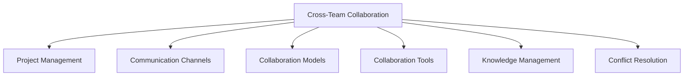

                 

### 1.1 Background of Cross-Team Collaboration

#### 1.1.1 Importance of Cross-Team Collaboration

Cross-team collaboration is crucial in today's complex and dynamic business environment. With the increasing complexity of large-scale applications and the growing interdependencies between various teams, the success of any project heavily relies on effective collaboration across different departments. 

Firstly, cross-team collaboration ensures that all relevant stakeholders are involved in the decision-making process. This helps in aligning the project goals with the overall organizational objectives, leading to a cohesive and focused effort towards achieving success. By bringing together individuals with diverse expertise and perspectives, cross-team collaboration fosters innovation and creativity, enabling the team to explore new ideas and approaches that might not have been considered otherwise.

Secondly, effective collaboration across teams improves communication and information flow. In large-scale application development, numerous teams work on different components of the project simultaneously. Without proper communication channels, it becomes difficult to coordinate and synchronize the work. Cross-team collaboration ensures that all teams are on the same page, minimizing misunderstandings and reducing the risk of errors or delays. 

Moreover, cross-team collaboration promotes knowledge sharing and learning opportunities. When team members from different backgrounds work together, they can exchange insights, share best practices, and learn from each other's experiences. This not only enhances individual skill sets but also contributes to the overall growth and development of the organization.

Finally, effective cross-team collaboration leads to better project outcomes. By leveraging the strengths and expertise of different teams, cross-functional collaboration ensures that all aspects of the project are adequately addressed. This results in higher quality deliverables, improved efficiency, and reduced risks. It also enables faster problem-solving and decision-making, as team members can rely on each other's expertise and resources to overcome challenges.

In conclusion, cross-team collaboration is essential in large-scale application development. It ensures alignment with organizational goals, improves communication and knowledge sharing, and leads to better project outcomes. By fostering collaboration across teams, organizations can overcome the challenges associated with complex projects and achieve long-term success.

#### 1.1.2 Challenges in Large Application Development

While cross-team collaboration offers numerous benefits, it also presents several challenges in large application development. These challenges can hinder the progress of projects and lead to inefficiencies, delays, and increased costs. Let's explore some of the key challenges faced in large application development and how cross-team collaboration can help address them.

**1. Communication Gaps:** One of the primary challenges in large application development is communication gaps between different teams. Each team often works on a specific component or module of the application, which can lead to misunderstandings, misinterpretations, and delayed decision-making. Cross-team collaboration helps in overcoming these communication barriers by establishing clear channels of communication, ensuring that all teams are on the same page, and promoting timely and effective information exchange.

**2. Lack of Alignment:** In large-scale projects, it is common for different teams to have different goals, priorities, and timelines. This lack of alignment can lead to conflicts and disagreements, impacting the overall progress of the project. Effective cross-team collaboration ensures that all teams are aligned with the project goals and objectives, facilitating better coordination and synchronization of efforts. By fostering a shared understanding and common vision, cross-team collaboration helps in minimizing conflicts and promoting a cohesive project environment.

**3. Data Fragmentation:** Large applications often involve the integration of data from multiple sources and systems. Data fragmentation can occur when different teams manage different data silos, leading to data inconsistencies, redundancies, and poor data quality. Cross-team collaboration plays a crucial role in addressing data fragmentation by promoting data standardization, ensuring data consistency, and facilitating seamless data integration across different systems and components.

**4. Skill Gaps:** Large application development projects require a wide range of skills and expertise, from software development and system architecture to testing and deployment. However, it is often challenging to find individuals with all the required skills within a single team. Cross-team collaboration allows organizations to leverage the skills and expertise of different teams, filling skill gaps and ensuring that all aspects of the project are adequately addressed.

**5. Resource Allocation:** Resource allocation can be a significant challenge in large application development, especially when teams have different priorities and resource needs. Effective cross-team collaboration helps in optimizing resource allocation by ensuring that resources are allocated based on project priorities and critical milestones. It also helps in balancing workloads and avoiding over or underutilization of resources across different teams.

**6. Change Management:** Large application development projects often involve frequent changes in requirements, technologies, and project scope. Managing these changes effectively can be challenging, especially when teams have different perspectives and priorities. Cross-team collaboration fosters a collaborative and adaptive environment, enabling teams to work together in managing changes, identifying risks, and adapting to evolving project needs.

**7. Lack of Accountability:** In large projects, it can be difficult to define and assign clear responsibilities and accountability to individual teams. This lack of accountability can lead to blame games, finger-pointing, and reduced motivation among team members. Cross-team collaboration helps in establishing clear roles and responsibilities, ensuring that each team understands its accountability and is motivated to deliver results.

In conclusion, while large application development poses several challenges, effective cross-team collaboration can help address these challenges. By improving communication, ensuring alignment, managing data fragmentation, leveraging diverse skills, optimizing resource allocation, managing changes, and establishing accountability, cross-team collaboration enables organizations to overcome obstacles and achieve successful project outcomes.

### 1.2 Problem Definition and Solution

#### 1.2.1 Problem Statement

In large application development, the primary problem that arises is the lack of effective cross-team collaboration. This lack of collaboration leads to several challenges, such as communication gaps, misalignment of goals, data fragmentation, skill gaps, resource allocation issues, change management difficulties, and lack of accountability. These challenges result in inefficiencies, delays, increased costs, and ultimately, unsuccessful project outcomes.

The problem can be further elaborated as follows:

1. **Communication Gaps:** Different teams often work in isolation, leading to limited information exchange and a lack of visibility into each other's progress. This lack of communication results in misunderstandings, misinterpretations, and delayed decision-making, which can significantly impact the project timeline and quality.
2. **Misalignment of Goals:** Each team may have different objectives and priorities, leading to conflicts and disagreements. Without a clear alignment of goals, teams may work at cross-purposes, leading to suboptimal outcomes and wasted efforts.
3. **Data Fragmentation:** Different teams may manage different data sources and systems, resulting in data inconsistencies, redundancies, and poor data quality. This data fragmentation can hinder effective decision-making and impact the overall success of the project.
4. **Skill Gaps:** Large application development requires a wide range of skills and expertise. However, it is often challenging to find individuals with all the required skills within a single team. This leads to skill gaps that can impede the progress of the project and result in subpar deliverables.
5. **Resource Allocation Issues:** Different teams may have different priorities and resource needs, leading to conflicts over resource allocation. Without proper coordination, resources may be allocated inefficiently, resulting in over or underutilization of resources and delays in project milestones.
6. **Change Management Difficulties:** Large application development projects often involve frequent changes in requirements, technologies, and project scope. Managing these changes effectively can be challenging, especially when teams have different perspectives and priorities. This can lead to misalignment, conflicts, and delays in project delivery.
7. **Lack of Accountability:** In large projects, it can be difficult to define and assign clear responsibilities and accountability to individual teams. This lack of accountability can result in finger-pointing, reduced motivation, and inefficiencies in the project execution.

#### 1.2.2 Addressing the Problem

To address the challenges associated with lack of cross-team collaboration in large application development, several solutions can be implemented:

1. **Establish Clear Communication Channels:** Implementing clear communication channels is essential for effective collaboration. This can be achieved by using collaborative tools such as project management software, instant messaging platforms, and video conferencing tools. Regular team meetings, status updates, and progress reports can also help in ensuring that all teams are aware of each other's progress and can address any issues or concerns in a timely manner.
2. **Align Team Goals:** It is crucial to ensure that all teams are aligned with the overall project goals and objectives. This can be achieved by defining and communicating the project vision, mission, and key performance indicators (KPIs) to all teams. Regular meetings and workshops can be conducted to align team goals and discuss any conflicts or discrepancies.
3. **Standardize Data Management:** Implementing a standardized data management approach can help in addressing data fragmentation and ensuring data consistency. This can include defining data standards, data models, and data integration protocols. Data governance practices and data quality controls should also be established to ensure the accuracy, completeness, and reliability of data.
4. **Leverage Diverse Skills:** To address skill gaps, organizations can adopt a cross-functional team approach, where team members with diverse skills and expertise are brought together. This allows teams to leverage each other's strengths and expertise, ensuring that all aspects of the project are adequately addressed. Training programs and knowledge sharing initiatives can also help in building the required skills within the team.
5. **Optimize Resource Allocation:** Implementing a resource allocation strategy that considers project priorities and critical milestones can help in optimizing resource utilization. This can include prioritizing tasks, balancing workloads, and reallocating resources based on changing project needs. Project management tools and resource planning techniques can be used to ensure efficient resource allocation.
6. **Implement Change Management Practices:** To manage changes effectively, organizations should establish change management practices that include clear processes for change identification, assessment, and implementation. Regular communication and collaboration among teams can help in identifying and addressing changes in a timely manner. Change impact analysis and risk management techniques should also be used to mitigate any potential negative impacts.
7. **Define and Assign Accountability:** Clear roles and responsibilities should be defined for each team, ensuring that accountability is assigned clearly. This can be achieved through role-based access controls, performance metrics, and regular performance reviews. Regular communication and feedback mechanisms should be established to ensure that each team understands its responsibilities and is motivated to deliver results.

In conclusion, addressing the problem of lack of cross-team collaboration in large application development requires a multi-faceted approach that includes clear communication channels, aligned goals, standardized data management, leveraging diverse skills, optimizing resource allocation, implementing change management practices, and defining accountability. By implementing these solutions, organizations can overcome the challenges associated with cross-team collaboration and achieve successful project outcomes.

#### 1.2.3 Boundaries and Extent

When addressing the challenges of cross-team collaboration in large application development, it is important to define the boundaries and extent of the problem and the corresponding solutions. This ensures that the efforts to improve collaboration are targeted and effective.

**Boundaries:**

1. **Scope of Collaboration:** The focus should be on cross-functional teams involved in the development and delivery of the large application. This includes teams responsible for software development, testing, project management, user experience design, and other critical areas. Collaborative efforts should extend to these teams and their interactions, rather than involving teams that have no direct impact on the application development process.
2. **Project Boundaries:** The solutions and collaboration efforts should be aligned with the specific project requirements and objectives. This means that the focus should be on addressing the collaboration challenges that are directly relevant to the successful delivery of the large application. It is essential to avoid scope creep and ensure that the collaboration efforts remain within the defined project boundaries.
3. **Time Frame:** The solutions should be implemented within a defined time frame, considering the project schedule and milestones. This ensures that the collaboration improvements are aligned with the project timeline and do not lead to delays or disruptions in other project activities.

**Extent:**

1. **Tools and Technologies:** The solutions should consider the existing tools and technologies being used by the teams. This includes project management software, communication platforms, collaboration tools, and any other relevant technologies. Integrating and leveraging these tools effectively can help in enhancing collaboration and overcoming communication and coordination challenges.
2. **Organizational Culture:** The solutions should take into account the organizational culture and existing practices. It is important to consider how the solutions align with the organization's values, norms, and ways of working. This helps in ensuring that the solutions are accepted and embraced by the teams, leading to successful implementation and adoption.
3. **Training and Support:** The solutions should include training and support for the teams involved. This can include training on new tools and technologies, workshops on effective collaboration techniques, and ongoing support to address any challenges or questions that arise during the implementation process. Providing adequate training and support can help in ensuring the successful adoption and utilization of the solutions.

In conclusion, defining the boundaries and extent of the problem and solutions in cross-team collaboration for large application development is crucial for effective implementation. By focusing on the relevant teams, project boundaries, time frame, tools and technologies, organizational culture, and training and support, organizations can ensure that the collaboration efforts are targeted and lead to successful project outcomes.

### 1.3 Core Concepts and Components

In the context of cross-team collaboration in large application development, it is essential to understand and define the core concepts and components that drive effective collaboration. These concepts and components form the foundation of the collaboration framework and help in addressing the challenges associated with large-scale projects.

#### 1.3.1 Key Concepts

**1. Cross-Team Collaboration:**
Cross-team collaboration refers to the process of working together across different teams to achieve a common goal. In large application development, cross-team collaboration involves teams such as developers, testers, project managers, UX designers, and other stakeholders working collaboratively to ensure the successful delivery of the application. The key objective of cross-team collaboration is to improve communication, align goals, and leverage diverse skills and expertise to overcome project challenges.

**2. Project Management:**
Project management involves the planning, organizing, and controlling of resources to achieve specific project goals within a defined timeline and budget. In the context of cross-team collaboration, project management plays a crucial role in coordinating and synchronizing the efforts of different teams. It includes activities such as defining project scope, creating schedules, assigning tasks, monitoring progress, and managing risks.

**3. Communication Channels:**
Communication channels refer to the methods and tools used for exchanging information and coordinating work among team members. Effective communication channels facilitate the flow of information, ensure clarity, and reduce misunderstandings. Common communication channels include email, instant messaging, video conferencing, project management tools, and collaborative platforms.

**4. Collaboration Models:**
Collaboration models are frameworks or methodologies that guide the process of collaboration among teams. Common collaboration models include Agile, Scrum, and Kanban, which emphasize iterative development, continuous feedback, and adaptive planning. These models provide a structured approach to collaboration, ensuring that teams work together effectively and efficiently.

**5. Collaboration Tools:**
Collaboration tools are software applications designed to facilitate collaboration and communication among team members. These tools include project management software, communication platforms, document sharing and collaboration platforms, and version control systems. Examples of popular collaboration tools include Slack, Trello, Jira, Google Workspace, and Microsoft Teams.

**6. Knowledge Management:**
Knowledge management involves the identification, capture, organization, and sharing of knowledge within an organization. Effective knowledge management ensures that valuable information and insights are easily accessible to team members, promoting learning, innovation, and efficient problem-solving.

**7. Conflict Resolution:**
Conflict resolution refers to the process of addressing and resolving conflicts or disagreements among team members. Effective conflict resolution helps in maintaining a positive and productive work environment, ensuring that conflicts do not impede collaboration and project progress.

#### 1.3.2 Comparison Table of Concept Properties

To better understand the properties and characteristics of the key concepts in cross-team collaboration, a comparison table can be used. The table below provides a side-by-side comparison of these concepts, highlighting their definitions, objectives, and key attributes:

| Concept | Definition | Objective | Key Attributes |
| --- | --- | --- | --- |
| Cross-Team Collaboration | Collaboration across different teams | Achieve common goals, improve communication and coordination | Diverse skills, shared vision, coordinated efforts |
| Project Management | Planning, organizing, and controlling resources | Ensure project goals are met, manage timelines and budgets | Scope definition, scheduling, resource allocation |
| Communication Channels | Methods and tools for exchanging information | Ensure clarity, reduce misunderstandings | Email, instant messaging, video conferencing |
| Collaboration Models | Frameworks for guiding collaboration | Facilitate iterative development, continuous feedback | Agile, Scrum, Kanban |
| Collaboration Tools | Software applications for collaboration | Enhance communication, streamline workflows | Project management tools, communication platforms |
| Knowledge Management | Identification, capture, organization, sharing of knowledge | Promote learning, innovation, efficient problem-solving | Knowledge repositories, collaboration platforms |
| Conflict Resolution | Addressing and resolving conflicts | Maintain positive work environment, ensure collaboration | Communication, negotiation, mediation |

#### 1.3.3 ER Diagram of Concept Relationships

To visualize the relationships between the key concepts in cross-team collaboration, an Entity-Relationship (ER) diagram can be created. The ER diagram represents the entities (concepts) and their relationships, providing a clear understanding of how these concepts are interconnected.

The ER diagram for cross-team collaboration in large application development may include the following entities and relationships:

- **Entities:**
  - **Cross-Team Collaboration**
  - **Project Management**
  - **Communication Channels**
  - **Collaboration Models**
  - **Collaboration Tools**
  - **Knowledge Management**
  - **Conflict Resolution**

- **Relationships:**
  - **Cross-Team Collaboration** - **Project Management**: A cross-team collaboration effort is managed by project management activities.
  - **Cross-Team Collaboration** - **Communication Channels**: Effective communication channels are essential for cross-team collaboration.
  - **Cross-Team Collaboration** - **Collaboration Models**: Collaboration models guide the process of cross-team collaboration.
  - **Cross-Team Collaboration** - **Collaboration Tools**: Collaboration tools support the execution of cross-team collaboration activities.
  - **Cross-Team Collaboration** - **Knowledge Management**: Knowledge management enhances cross-team collaboration by providing accessible information.
  - **Cross-Team Collaboration** - **Conflict Resolution**: Conflict resolution ensures a positive collaboration environment.

The ER diagram can be represented using the following Mermaid syntax:

In conclusion, understanding the core concepts and components of cross-team collaboration in large application development is crucial for effective collaboration. By defining these concepts, comparing their properties, and visualizing their relationships, teams can develop a comprehensive understanding of the collaboration framework and leverage it to overcome challenges and achieve successful project outcomes.

## Part 2: Principles of Collaboration

### 2.1 Team Structure and Roles

Effective team structure and well-defined roles are essential for successful cross-team collaboration in large application development. By understanding the different types of teams, roles, and responsibilities, teams can work together more efficiently, ensuring that each member contributes to the project's goals.

#### 2.1.1 Types of Teams

1. **Functional Teams:** Functional teams are organized based on their specific areas of expertise, such as development, testing, design, and project management. These teams are typically responsible for specific tasks within the project and work independently to achieve their objectives. Functional teams are effective in scenarios where expertise is critical and there is no need for frequent interaction between different functional areas.

2. **Cross-functional Teams:** Cross-functional teams consist of members from various functional areas, such as developers, testers, designers, and project managers. These teams work together to complete a project, with each member contributing their expertise to different aspects of the project. Cross-functional teams are highly effective in large-scale application development as they promote collaboration, reduce communication gaps, and enable faster decision-making.

3. **Feature Teams:** Feature teams are focused on specific features or components of the application. These teams are responsible for the entire development lifecycle of a particular feature, from design to implementation, testing, and deployment. Feature teams allow for a more streamlined development process, as team members are involved in all stages of the feature's development, ensuring better coordination and alignment.

4. **Project Teams:** Project teams are temporary groups formed to complete a specific project. These teams are usually composed of members from different functional areas and work together to achieve the project goals. Project teams are responsible for defining project scope, timelines, budgets, and resources. They ensure that all activities are coordinated and that the project is delivered successfully.

5. **Virtual Teams:** Virtual teams are geographically dispersed and rely heavily on technology for communication and collaboration. These teams may include members from different countries, time zones, and organizations. Virtual teams require effective communication strategies and tools to ensure that team members can collaborate effectively despite the physical distance.

#### 2.1.2 Roles and Responsibilities

1. **Project Manager:** The project manager is responsible for defining the project scope, objectives, and timelines. They coordinate and manage all project activities, ensuring that resources are allocated effectively, and that the project is delivered on time and within budget. The project manager also facilitates communication among team members and stakeholders, resolving conflicts, and managing risks.

2. **Development Team:** The development team is responsible for designing, coding, and implementing the application. They work closely with the project manager and other team members to ensure that the application meets the required specifications and quality standards. Developers are also responsible for unit testing their code and collaborating with other developers to integrate their work seamlessly.

3. **Testing Team:** The testing team is responsible for verifying the quality and functionality of the application. They conduct various types of testing, such as unit testing, integration testing, system testing, and user acceptance testing. The testing team identifies and reports bugs, works with developers to resolve issues, and ensures that the application meets the required quality criteria.

4. **UX/UI Designer:** The UX/UI designer is responsible for creating user-friendly and visually appealing interfaces for the application. They work closely with stakeholders to gather requirements, conduct user research, and design wireframes and prototypes. UX/UI designers also collaborate with developers to ensure that the design is implemented effectively and meets user expectations.

5. **Business Analyst:** The business analyst works closely with stakeholders to understand business requirements and translate them into functional specifications. They collaborate with the development and testing teams to ensure that the application meets the business needs and objectives. Business analysts also play a role in managing requirements changes and facilitating communication between stakeholders and development teams.

6. **Product Owner:** The product owner is responsible for defining the product vision, prioritizing features, and ensuring that the product meets the business goals. They work closely with stakeholders, developers, and testers to ensure that the product is delivered on time and meets the desired quality standards. Product owners also facilitate product backlog management and prioritize user stories and features for development.

7. **Support and Maintenance Team:** The support and maintenance team is responsible for ensuring that the application remains functional and up-to-date after deployment. They handle bug fixes, performance issues, and user support. The support and maintenance team also works on implementing updates and enhancements to the application, ensuring that it continues to meet user needs and industry standards.

By understanding the different types of teams and roles, organizations can create a collaborative environment that promotes effective communication, coordination, and teamwork. Clear role definitions and responsibilities help in ensuring that each team member understands their role and contributes to the project's success.

#### 2.1.3 Effective Team Communication

Effective communication is the cornerstone of successful cross-team collaboration in large application development. Clear and consistent communication helps in aligning team members, resolving conflicts, and ensuring that everyone is working towards the same goals. Here are some strategies for enhancing team communication:

1. **Regular Meetings:** Schedule regular team meetings to discuss project progress, address any challenges, and share updates. These meetings can be weekly or bi-weekly, depending on the project timeline and complexity. During these meetings, team members can raise concerns, share insights, and collaborate on solutions.

2. **Clear Communication Channels:** Establish clear communication channels that are easily accessible to all team members. This can include email, instant messaging platforms, video conferencing tools, and project management software. Ensure that everyone knows how to use these tools effectively and understands the expectations for communication.

3. **Communication Guidelines:** Develop communication guidelines that outline the preferred communication methods, response times, and information sharing protocols. This helps in ensuring that communication is consistent and efficient, reducing misunderstandings and delays.

4. **Feedback Mechanisms:** Implement feedback mechanisms that allow team members to provide input and suggestions on project processes, tools, and practices. This helps in continuous improvement and ensures that everyone feels heard and valued.

5. **Documentation:** Document important project information, decisions, and actions taken. This helps in providing a reference point for team members and ensures that knowledge is retained even if team members change or leave the project.

6. **Cross-Functional Collaboration:** Encourage cross-functional collaboration by facilitating regular interactions between team members from different functional areas. This can be done through workshops, brainstorming sessions, and collaborative projects. Cross-functional collaboration helps in fostering a shared understanding of the project goals and promotes a collaborative work environment.

7. **Conflict Resolution:** Establish a process for addressing conflicts and disagreements. Provide training on conflict resolution techniques and ensure that team members feel comfortable speaking up and resolving issues in a constructive manner. This helps in maintaining a positive and productive work environment.

By implementing these strategies, organizations can enhance team communication, fostering a collaborative environment that drives project success. Effective communication ensures that all team members are aligned, informed, and motivated, leading to better outcomes and a more enjoyable work experience.

### 2.2 Collaboration Models

Collaboration models are frameworks that guide the process of working together across teams, ensuring effective communication, coordination, and cooperation. In large application development, various collaboration models can be applied to streamline the development process, improve productivity, and enhance the overall success of the project. Let's explore some of the most common collaboration models: Agile, Scrum, and Kanban.

#### 2.2.1 Collaborative Models Overview

**1. Agile:**
Agile is an iterative and incremental approach to project management and software development. It emphasizes flexibility, collaboration, and adaptability to changing requirements. Agile methodologies promote continuous feedback, rapid iteration, and close collaboration between team members and stakeholders.

**2. Scrum:**
Scrum is a specific framework within Agile that focuses on delivering small, incremental pieces of work in short iterations called sprints. Scrum emphasizes clear roles, regular meetings, and continuous improvement. It aims to enhance transparency, inspection, and adaptation throughout the project lifecycle.

**3. Kanban:**
Kanban is a visual workflow management method that originated from Toyota's manufacturing process. It uses a Kanban board to represent the workflow, with different columns representing different stages of the project. Kanban aims to optimize the flow of work by limiting work in progress and reducing bottlenecks.

#### 2.2.2 Agile Methodology

Agile methodology is characterized by its iterative and incremental approach to project management and software development. It involves breaking down the project into smaller, manageable pieces called user stories or features, which are then developed and delivered in short cycles called sprints.

**Key Principles of Agile:**

1. **Customer Collaboration over Contract Negotiation:** Agile emphasizes the importance of involving customers and stakeholders throughout the development process to ensure that their needs and expectations are met.

2. **Responding to Change over Following a Plan:** Agile methodologies are flexible and adapt to changing requirements, allowing teams to respond to new information and feedback.

3. **Iterative and Incremental Development:** Agile promotes continuous delivery of working software in short iterations, enabling teams to adapt and improve based on feedback.

4. **Empowered and Self-Organizing Teams:** Agile encourages teams to self-organize and make decisions collaboratively, fostering a sense of ownership and accountability.

**Agile Framework Components:**

1. **User Stories:** User stories are short, simple descriptions of a feature from the user's perspective, written in the format: "As a [type of user], I want [functionality] so that [benefit]."

2. **Sprint:** A sprint is a time-boxed period, typically two to four weeks, during which a team works on a set of prioritized user stories or tasks. The goal of each sprint is to deliver a potentially shippable increment of the product.

3. **Sprint Planning:** Sprint planning is a meeting where the team discusses and selects user stories or tasks to be worked on during the upcoming sprint. Prioritization and estimation are also discussed during this meeting.

4. **Daily Stand-ups:** Daily stand-ups are short, daily meetings where team members discuss what they did yesterday, what they will do today, and any obstacles they are facing. This helps in maintaining alignment and addressing issues quickly.

5. **Sprint Review:** At the end of a sprint, the team reviews the completed work with stakeholders, gathers feedback, and adjusts priorities and plans for the next sprint.

6. **Sprint Retrospective:** A sprint retrospective is a meeting held at the end of a sprint to reflect on the sprint process and identify areas for improvement. This feedback is used to refine processes and enhance team collaboration.

#### 2.2.3 Scrum Framework

Scrum is a widely adopted Agile framework that emphasizes iterative development and continuous improvement. It involves clear roles, regular meetings, and a set of artifacts and guidelines to ensure effective collaboration and project management.

**Key Components of Scrum:**

1. **Scrum Team:** A Scrum team consists of cross-functional members, including a Scrum Master, Product Owner, and Developers. The Scrum team is responsible for delivering a potentially shippable product increment at the end of each sprint.

2. **Product Owner:** The Product Owner is responsible for defining the product vision, prioritizing the product backlog, and ensuring that the team is working on the most valuable features. They represent the stakeholders' interests and work closely with the team to ensure that the product meets the desired quality standards.

3. **Scrum Master:** The Scrum Master is responsible for facilitating Scrum events, removing obstacles, and ensuring that the Scrum framework is followed effectively. They work closely with the Product Owner and Developers to support collaboration and continuous improvement.

4. **Sprint:** A sprint is a time-boxed iteration, typically two to four weeks long, during which the team works on a set of prioritized user stories or tasks. The goal of each sprint is to deliver a potentially shippable product increment.

5. **Product Backlog:** The product backlog is a prioritized list of user stories, features, and bugs that need to be addressed in the product. The Product Owner is responsible for maintaining and prioritizing the product backlog.

6. **Sprint Backlog:** The sprint backlog is a subset of the product backlog that contains the user stories, tasks, and bugs selected for the upcoming sprint. The Developers are responsible for working on the items in the sprint backlog to deliver a potentially shippable product increment.

**Key Events in Scrum:**

1. **Sprint Planning:** Sprint planning is a meeting where the team discusses and selects user stories or tasks to be worked on during the upcoming sprint. The Product Owner presents the prioritized backlog items, and the Developers estimate and commit to the work they can complete in the sprint.

2. **Daily Stand-up:** Daily stand-up meetings, also known as daily scrums, are short, time-boxed meetings where team members discuss what they did yesterday, what they will do today, and any obstacles they are facing. This helps in maintaining alignment and addressing issues quickly.

3. **Sprint Review:** At the end of a sprint, the team reviews the completed work with stakeholders, gathers feedback, and adjusts priorities and plans for the next sprint. This feedback loop ensures continuous improvement and alignment with customer needs.

4. **Sprint Retrospective:** A sprint retrospective is a meeting held at the end of a sprint to reflect on the sprint process and identify areas for improvement. The team discusses what went well, what could be improved, and any changes they can implement in the next sprint.

By adopting the Agile methodology and the Scrum framework, teams can enhance collaboration, improve productivity, and deliver high-quality software products. These frameworks provide a clear structure for managing projects, fostering continuous improvement, and ensuring that teams work together effectively to achieve project goals.

#### 2.2.4 Kanban

Kanban is a visual workflow management method that originated from Toyota's lean manufacturing process. It is a flexible and adaptable approach that helps teams manage and optimize their work processes. In Kanban, work items are visualized on a Kanban board, which allows teams to see the flow of work and identify bottlenecks or delays.

**Key Principles of Kanban:**

1. **Visualize the Workflow:** Kanban uses a Kanban board to represent the workflow, with different columns representing different stages of the project. This visualization helps teams understand the current state of work, identify bottlenecks, and optimize the flow of work.

2. **Limit Work in Progress (WIP):** One of the key principles of Kanban is to limit the amount of work in progress. By limiting WIP, teams can focus on completing tasks before starting new ones, reducing context switching and increasing efficiency.

3. **Visualize Bottlenecks:** Kanban helps teams identify bottlenecks in the workflow by visualizing the movement of work items through the process. When a column on the Kanban board becomes backed up, it indicates a bottleneck that needs to be addressed.

4. **Continuously Improve:** Kanban promotes continuous improvement by encouraging teams to regularly review their workflows and identify areas for optimization. This can include adjusting WIP limits, reorganizing the Kanban board, or implementing new tools and techniques.

**Components of a Kanban Board:**

1. **Columns:** The Kanban board consists of multiple columns, each representing a different stage of the workflow. Common columns include "To Do," "In Progress," "Testing," and "Done."

2. **Cards:** Each work item is represented by a card on the Kanban board. Cards contain information about the task, including the task name, description, priority, and assigned team member.

3. **Columns Labels:** Each column on the Kanban board has a label indicating the stage of the workflow. For example, "To Do" represents tasks that need to be started, "In Progress" represents tasks that are currently being worked on, and "Done" represents completed tasks.

4. **Swimlanes:** Swimlanes can be used to separate tasks based on different teams, projects, or types of work. This helps in visualizing the flow of work across different areas.

5. **Work in Progress (WIP) Limits:** WIP limits are set for each column on the Kanban board to control the amount of work in progress. By limiting WIP, teams can focus on completing tasks before starting new ones, reducing context switching and increasing efficiency.

**Benefits of Kanban:**

1. **Improved Workflow Visibility:** Kanban provides a clear visual representation of the workflow, making it easy for teams to understand the current state of work and identify bottlenecks or delays.

2. **Increased Efficiency:** By limiting work in progress and focusing on completing tasks before starting new ones, Kanban helps in reducing context switching and improving overall efficiency.

3. **Flexibility:** Kanban is a flexible approach that can be adapted to different types of work and industries. It can be used for software development, project management, and other areas where work needs to be managed effectively.

4. **Continuous Improvement:** Kanban encourages teams to regularly review their workflows and identify areas for optimization, promoting continuous improvement and a culture of continuous learning.

In summary, Kanban is a powerful tool for managing and optimizing work processes. By visualizing the workflow, limiting work in progress, and promoting continuous improvement, Kanban helps teams improve efficiency, reduce bottlenecks, and deliver high-quality results.

### 2.3 Collaboration Tools

Effective collaboration is crucial for the success of large application development projects, and collaboration tools play a vital role in facilitating communication, coordination, and teamwork among cross-functional teams. In this section, we will explore the key types of collaboration tools, including project management tools, communication tools, and collaboration platforms, along with their features, advantages, and potential challenges.

#### 2.3.1 Project Management Tools

Project management tools are essential for organizing, planning, and tracking the progress of large application development projects. These tools help teams manage tasks, schedules, resources, and budgets to ensure that projects are completed on time and within budget. Here are some popular project management tools and their key features:

**1. Trello:**
Trello is a visual project management tool that uses a card-based interface to organize tasks and projects. It allows teams to create boards, lists, and cards to represent different stages of a project. Key features include task assignment, due dates, attachments, comments, and notifications.

*Advantages:*
- Intuitive and easy to use
- Visual representation of tasks and progress
- Supports multiple views (board, list, calendar)

*Challenges:*
- Limited customization options
- May not be suitable for complex projects with extensive data

**2. Jira:**
Jira is a powerful project management and issue tracking tool widely used in software development teams. It offers features such as task management, agile boards, sprints, roadmaps, and reporting. Jira integrates with various development tools and provides extensive customization options.

*Advantages:*
- Comprehensive features for task management and tracking
- Seamless integration with other development tools
- Advanced reporting and analytics

*Challenges:*
- Can be complex to set up and configure
- May require training for team members

**3. Asana:**
Asana is a flexible project management tool that allows teams to manage tasks, projects, and workflows in one place. It offers features such as task assignment, due dates, subtasks, dependencies, and workload tracking. Asana integrates with other tools like Google Workspace, Slack, and Microsoft Teams.

*Advantages:*
- User-friendly interface
- Extensive integration options
- Suitable for various types of projects and teams

*Challenges:*
- Limited reporting and analytics capabilities
- May become cluttered with many tasks and notifications

**4. Microsoft Project:**
Microsoft Project is a robust project management tool that offers advanced planning, scheduling, and resource management features. It allows users to create detailed project plans, track progress, and manage resources and budgets. Microsoft Project integrates with other Microsoft tools such as Excel and SharePoint.

*Advantages:*
- Comprehensive features for project management and scheduling
- Strong integration with other Microsoft tools
- Suitable for enterprise-level projects

*Challenges:*
- Can be expensive
- Requires training and experience to use effectively

In conclusion, project management tools are essential for organizing and tracking large application development projects. By selecting the right tool that aligns with the project's requirements and the team's preferences, organizations can improve collaboration, streamline workflows, and achieve successful project outcomes.

#### 2.3.2 Communication Tools

Effective communication is critical for successful collaboration in large application development projects. Communication tools enable teams to exchange information, coordinate tasks, and resolve issues in real-time, regardless of geographical and time zone differences. Here are some popular communication tools and their key features:

**1. Slack:**
Slack is a popular team communication platform that allows teams to chat, share files, and collaborate on projects. It offers features such as channels for organizing conversations, direct messages, video calls, and integrations with other tools like Trello, Jira, and Google Workspace.

*Advantages:*
- Easy to use and intuitive interface
- Extensive integrations with other tools
- Real-time communication and notifications

*Challenges:*
- Can become noisy with numerous channels and notifications
- May require some training for team members to use effectively

**2. Microsoft Teams:**
Microsoft Teams is a unified communication and collaboration platform that offers chat, video meetings, file storage, and application integrations. It integrates with other Microsoft tools like Outlook, Word, Excel, and Power BI, providing a seamless experience for teams using the Microsoft ecosystem.

*Advantages:*
- Strong integration with other Microsoft tools
- Rich feature set for communication and collaboration
- Scalability for large teams and organizations

*Challenges:*
- Can be complex to set up and configure
- May require additional training for team members

**3. Zoom:**
Zoom is a video conferencing platform that enables teams to hold virtual meetings, webinars, and training sessions. It offers features such as screen sharing, virtual backgrounds, recording, and virtual whiteboards. Zoom is widely used for remote work and distributed teams.

*Advantages:*
- High-quality video and audio
- Scalable for large meetings and webinars
- Extensive features for collaboration and engagement

*Challenges:*
- May require a subscription for certain features
- Can be challenging to use for large meetings with many participants

**4. Google Workspace:**
Google Workspace is a suite of productivity tools that includes Google Chat, Google Meet, Google Calendar, Google Docs, Google Sheets, and Google Slides. It provides real-time collaboration, seamless integration with other Google tools, and cloud storage.

*Advantages:*
- Real-time collaboration and communication
- Cloud-based storage and access
- Cross-platform compatibility

*Challenges:*
- May require Google account and subscription
- May have limited integration with other non-Google tools

In conclusion, communication tools are essential for facilitating real-time communication and collaboration among teams working on large application development projects. By selecting the right tools that align with the team's needs and preferences, organizations can improve communication, enhance teamwork, and achieve successful project outcomes.

#### 2.3.3 Collaboration Platforms

Collaboration platforms are comprehensive tools that integrate various features to support communication, collaboration, project management, and knowledge sharing within teams and across departments. These platforms enable organizations to streamline workflows, enhance productivity, and foster a collaborative work environment. Here are some popular collaboration platforms and their key features:

**1. Microsoft Teams:**
Microsoft Teams is a unified collaboration platform that combines chat, video meetings, file storage, and application integrations. It integrates with other Microsoft tools like Office 365, SharePoint, and OneDrive, providing a seamless experience for teams using the Microsoft ecosystem.

*Key Features:*
- Chat and messaging
- Video meetings and webinars
- File storage and sharing
- Project management and task assignment
- Integration with Microsoft Office and other tools
- Security and compliance features

*Advantages:*
- Strong integration with other Microsoft tools
- Scalability for large teams and organizations
- Comprehensive feature set for communication and collaboration

*Challenges:*
- Can be complex to set up and configure
- May require additional training for team members

**2. Slack:**
Slack is a popular team communication platform that offers chat, channels, direct messages, video calls, and integrations with other tools. It provides a flexible and customizable environment for teams to collaborate and communicate effectively.

*Key Features:*
- Chat and messaging with channels and direct messages
- Video and audio calls
- File sharing and storage
- Integration with various third-party tools and services
- Customizable workflows and automation

*Advantages:*
- Easy to use and intuitive interface
- Extensive integrations with other tools
- Flexible and customizable collaboration environment

*Challenges:*
- Can become noisy with numerous channels and notifications
- May require some training for team members to use effectively

**3. Asana:**
Asana is a project management and collaboration platform that allows teams to manage tasks, projects, and workflows in one place. It offers features such as task assignment, due dates, subtasks, dependencies, and workload tracking. Asana integrates with other tools like Slack, Google Workspace, and Microsoft Teams.

*Key Features:*
- Task and project management
- Team collaboration and communication
- Customizable workflows and automation
- Integration with various third-party tools and services
- Real-time updates and notifications

*Advantages:*
- User-friendly interface
- Extensive integration options
- Suitable for various types of projects and teams

*Challenges:*
- Limited reporting and analytics capabilities
- May become cluttered with many tasks and notifications

**4. Confluence:**
Confluence is a collaborative documentation and knowledge sharing platform that allows teams to create, store, and share information. It offers features such as pages, blogs, tables, and charts, and integrates with other tools like Jira, Trello, and Slack.

*Key Features:*
- Documentation and knowledge sharing
- Collaboration and discussion forums
- Real-time updates and notifications
- Integration with various third-party tools and services
- Access controls and security features

*Advantages:*
- Comprehensive documentation and knowledge management
- Easy collaboration and communication
- Suitable for teams and organizations of all sizes

*Challenges:*
- Can be complex to set up and configure
- Requires some training for team members to use effectively

In conclusion, collaboration platforms are essential for fostering collaboration, communication, and productivity in large application development projects. By selecting the right platform that aligns with the team's needs and preferences, organizations can streamline workflows, enhance teamwork, and achieve successful project outcomes.

### 3.1 Project Planning and Management

Effective project planning and management are crucial for the successful execution of large application development projects. In this section, we will explore the key steps and best practices for project planning and management, including defining project goals, creating a project schedule, and managing project risks.

#### 3.1.1 Defining Project Goals

The first step in project planning is to define clear and achievable project goals. These goals should be aligned with the overall organizational objectives and should provide a clear direction for the project team. Here are some best practices for defining project goals:

1. **Identify Stakeholders:** Identify all the stakeholders involved in the project, including team members, customers, and other key stakeholders. Understand their needs and expectations to ensure that the project goals are aligned with their requirements.

2. **Prioritize Goals:** Prioritize the project goals based on their importance and impact on the project. This will help in allocating resources effectively and focusing on the most critical goals first.

3. **Be Specific and Measurable:** Ensure that the project goals are specific and measurable. This will allow the team to track progress and evaluate the success of the project. Use metrics such as completion dates, quality criteria, and performance indicators to measure progress.

4. **Set Realistic Goals:** Set achievable goals that are within the scope of the project and the resources available. Unrealistic goals can lead to unnecessary stress and can impede the project's progress.

5. **Communicate Goals Clearly:** Clearly communicate the project goals to all team members and stakeholders. This will ensure that everyone understands the objectives and is aligned towards achieving them.

#### 3.1.2 Creating a Project Schedule

Once the project goals are defined, the next step is to create a project schedule that outlines the timeline and milestones for the project. Here are some best practices for creating a project schedule:

1. **Break Down Tasks:** Break down the project into smaller, manageable tasks. This will make it easier to estimate the time required for each task and to identify any dependencies between tasks.

2. **Estimate Task Durations:** Estimate the duration of each task based on historical data, team experience, and available resources. Be realistic in your estimates and allow for contingency time to account for any unforeseen delays.

3. **Create a Timeline:** Use project management tools such as Gantt charts or Kanban boards to create a visual timeline of the project. This will help in visualizing the project's progress and identifying any potential bottlenecks or delays.

4. **Set Milestones:** Set milestones at key points in the project timeline to mark significant achievements or milestones. This will help in tracking progress and celebrating achievements along the way.

5. **Review and Refine:** Review the project schedule regularly and make adjustments as needed. Be prepared to adapt the schedule based on changes in project scope, resource availability, or other factors that may impact the project timeline.

#### 3.1.3 Managing Project Risks

Risks are an inherent part of any project, and it is important to identify and manage these risks effectively to minimize their impact on the project. Here are some best practices for managing project risks:

1. **Identify Risks:** Identify all potential risks that could impact the project, including technical, scheduling, resource, and financial risks. Use tools such as risk assessment matrices and SWOT analyses to identify and prioritize risks.

2. **Assess Risks:** Assess the likelihood and impact of each identified risk. This will help in prioritizing risks and determining the appropriate response strategies.

3. **Develop Risk Response Strategies:** Develop strategies to respond to each identified risk. This may include risk avoidance, risk mitigation, risk acceptance, or risk transfer. Assign responsibilities to team members to ensure that each risk response strategy is implemented effectively.

4. **Monitor and Review:** Regularly monitor and review the project risks to identify any changes in their likelihood or impact. Update the risk management plan as needed to ensure that risks are effectively managed throughout the project lifecycle.

5. **Communicate and Collaborate:** Communicate the identified risks and risk response strategies to all team members and stakeholders. Encourage collaboration and input from all stakeholders to ensure that risks are managed effectively.

By following these best practices for project planning and management, teams can effectively define project goals, create realistic project schedules, and manage project risks. This will help in ensuring the successful delivery of large application development projects, meeting organizational objectives, and achieving project success.

#### 3.1.4 Best Practices for Project Planning and Management

Effective project planning and management are crucial for the success of large application development projects. To ensure smooth execution and minimize risks, teams should follow these best practices:

**1. Start with a Clear Vision:** Begin by defining the project's vision and objectives. This will provide a clear direction and purpose for the team, ensuring that everyone is aligned and working towards the same goals.

**2. Involve Stakeholders Early:** Engage stakeholders from the beginning to gather their input and ensure their buy-in. This will help in identifying potential risks and addressing any concerns early on in the project.

**3. Use Project Management Tools:** Utilize project management tools such as Gantt charts, Kanban boards, and collaborative platforms to track progress, manage tasks, and ensure effective communication.

**4. Define Roles and Responsibilities:** Clearly define roles and responsibilities for each team member. This will help in avoiding confusion, improving accountability, and ensuring that tasks are assigned appropriately.

**5. Develop a Realistic Schedule:** Develop a realistic project schedule that takes into account all tasks, dependencies, and available resources. Be prepared to adapt the schedule as needed to accommodate changes in project scope or unforeseen issues.

**6. Regularly Monitor Progress:** Continuously monitor the project's progress against the schedule and milestones. Identify any deviations early and take corrective action to keep the project on track.

**7. Manage Risks proactively:** Identify potential risks and develop a risk management plan to mitigate their impact. Regularly review and update the risk management plan to address any new risks that may arise.

**8. Encourage Collaboration:** Foster a collaborative environment where team members can share ideas, provide feedback, and work together to solve problems. This will help in improving communication and driving innovation.

**9. Communicate Effectively:** Maintain open and transparent communication with all stakeholders. Regularly provide updates on project progress, risks, and any changes to the plan. This will ensure that everyone is informed and can provide input when necessary.

**10. Celebrate Achievements:** Recognize and celebrate the team's achievements along the way. This will boost morale and motivation, reinforcing the team's commitment to the project's success.

By following these best practices, teams can enhance their project planning and management capabilities, leading to successful project outcomes and improved organizational efficiency.

### 3.2 Communication Strategies

Effective communication is essential for successful cross-team collaboration in large application development projects. Clear and consistent communication helps in aligning team members, minimizing misunderstandings, and ensuring that everyone is working towards the same goals. In this section, we will discuss key communication strategies and techniques that can enhance collaboration and project success.

#### 3.2.1 Enhancing Communication

**1. Define Communication Channels:**
Establish clear communication channels that are accessible to all team members. This may include email, instant messaging platforms, video conferencing tools, and project management software. Clearly define the purpose and expected usage of each communication channel to avoid confusion.

**2. Schedule Regular Meetings:**
Regular team meetings, such as daily stand-ups, weekly progress updates, and monthly review meetings, are crucial for maintaining open communication. Schedule these meetings consistently and ensure that all team members can attend. Use these meetings to discuss progress, address issues, and align on project goals.

**3. Foster a Collaborative Environment:**
Create a collaborative work environment where team members feel comfortable sharing ideas, asking questions, and providing feedback. Encourage open dialogue, active listening, and respectful communication. Avoid blame and focus on finding solutions rather than assigning blame.

**4. Use Visual Aids:**
Visual aids, such as charts, diagrams, and presentations, can enhance understanding and clarity in communication. Use visual aids to convey complex information, highlight key points, and facilitate discussions during meetings.

**5. Provide Feedback and Feedback Loops:**
Establish mechanisms for providing feedback and conducting feedback loops. Regularly seek feedback from team members and stakeholders to identify areas for improvement and ensure that everyone is on the same page.

**6. Encourage Documentation:**
Document important decisions, action items, and meeting outcomes. This helps in ensuring that everyone has access to the same information and can refer back to it as needed. Use project management tools to store and share documentation.

#### 3.2.2 Conflict Resolution

Conflicts are inevitable in any collaborative environment, but effective conflict resolution is crucial for maintaining a positive and productive work environment. Here are some strategies for resolving conflicts:

**1. Identify the Root Cause:**
Identify the root cause of the conflict by understanding the underlying issues and interests of the parties involved. This will help in addressing the actual problem rather than just the symptoms.

**2. Listen and Understand:**
Active listening is key to effective conflict resolution. Listen to both parties involved, understand their perspectives, and empathize with their concerns. This will help in building trust and finding common ground.

**3. Facilitate Open Dialogue:**
Create a safe and inclusive space for open dialogue where all parties can express their views and concerns. Encourage constructive discussions and avoid personal attacks. Use facilitation techniques, such as brainstorming or mediation, to guide the conversation.

**4. Explore Options and Find Solutions:**
Once the root cause and perspectives are understood, explore different options and solutions that address the underlying issues. Encourage creative thinking and compromise to find mutually acceptable solutions.

**5. Implement and Monitor:**
Implement the agreed-upon solutions and monitor their effectiveness. Ensure that all parties are committed to the resolution and actively working towards it. Regularly review the progress and make adjustments as needed.

**6. Reflect and Learn:**
After resolving a conflict, take the time to reflect on the process and outcomes. Identify any lessons learned and implement strategies to prevent similar conflicts in the future. This will help in fostering a culture of continuous improvement and effective communication.

By following these communication strategies and conflict resolution techniques, teams can enhance collaboration, build stronger relationships, and achieve successful project outcomes.

#### 3.2.3 Feedback and Iteration

Feedback and iteration are essential components of effective collaboration and continuous improvement in large application development projects. Here are some key strategies for incorporating feedback and iterating on project deliverables:

**1. Solicit Feedback Early and Often:**
Regularly seek feedback from stakeholders, team members, and end-users throughout the project lifecycle. This helps in identifying issues and areas for improvement early on, allowing for timely adjustments. Use surveys, feedback forms, and one-on-one meetings to gather feedback.

**2. Create a Feedback Loop:**
Establish a structured feedback loop that ensures feedback is captured, analyzed, and acted upon. Define roles and responsibilities for collecting, analyzing, and implementing feedback. Use project management tools to track feedback and action items.

**3. Encourage Constructive Feedback:**
Create a culture that encourages constructive feedback. Emphasize the importance of focusing on solutions rather than blaming individuals. Use feedback as an opportunity to learn and improve, rather than as a tool for criticism.

**4. Prioritize Feedback:**
Prioritize feedback based on its impact on the project objectives and timelines. Address high-priority feedback first to ensure that critical issues are resolved promptly. Collaborate with stakeholders to determine the most important areas for improvement.

**5. Iterate and Test:**
Implement iterative development practices to continuously refine and improve project deliverables. Develop prototypes, conduct usability testing, and gather feedback from users to identify areas for improvement. Use this feedback to make informed decisions and iterate on the design or functionality.

**6. Document Changes:**
Document all changes made in response to feedback, including the rationale behind each change. This helps in tracking the impact of feedback and ensuring that the project stays aligned with stakeholder expectations.

**7. Communicate Iterations:**
Regularly communicate the progress and changes made in response to feedback. Provide updates to stakeholders and team members to maintain transparency and keep everyone informed about the project's evolution.

**8. Celebrate Successes:**
Recognize and celebrate the achievements made as a result of feedback and iteration. This reinforces the value of collaboration and encourages continued engagement and participation in the project.

By incorporating feedback and iterating on project deliverables, teams can continuously improve the quality and relevance of their work, ensuring that it meets stakeholder expectations and achieves project objectives.

### 3.3 Collaboration in Action

Implementing cross-team collaboration in large application development projects can be challenging, but it is crucial for achieving success. In this section, we will explore real-world case studies and success stories that demonstrate effective collaboration practices in action. These examples will highlight the key strategies and techniques that were employed, as well as the lessons learned and the impact on project outcomes.

#### 3.3.1 Real-World Case Studies

**Case Study 1:**
A large financial services company was developing a new digital banking platform to improve customer experience and streamline banking processes. The project involved multiple teams, including developers, designers, testers, and product managers. To ensure effective collaboration, the company implemented the following strategies:

1. **Cross-Functional Teams:** The company formed cross-functional teams, each consisting of members from different departments, including development, design, testing, and product management. This allowed team members to work closely together and leverage their diverse skills and expertise.

2. **Agile Methodology:** The company adopted the Agile methodology, specifically Scrum, to facilitate iterative development and continuous feedback. Regular sprint cycles and daily stand-ups helped in maintaining alignment, addressing issues promptly, and adapting to changing requirements.

3. **Communication Tools:** The company utilized communication tools such as Slack, Jira, and Microsoft Teams to facilitate real-time communication and collaboration. These tools enabled team members to share updates, discuss ideas, and provide feedback effortlessly.

4. **Knowledge Management:** The company implemented a knowledge management system to capture and share best practices, lessons learned, and technical documentation. This helped in building a repository of valuable information that could be accessed by all team members.

**Results:**
The project was successfully delivered within the specified timeline and budget. The cross-functional teams were able to work seamlessly together, resulting in high-quality deliverables. The use of Agile methodology and communication tools improved transparency, efficiency, and collaboration. The knowledge management system ensured that valuable insights were preserved and shared, contributing to ongoing project success.

**Case Study 2:**
A technology company was developing a complex enterprise software solution that involved multiple stakeholders, including clients, developers, testers, and project managers. To ensure effective collaboration, the company implemented the following strategies:

1. **Stakeholder Engagement:** The company conducted regular stakeholder meetings and workshops to gather feedback, clarify requirements, and ensure that all stakeholders were aligned. This helped in identifying potential issues early on and addressing them proactively.

2. **Collaborative Platforms:** The company utilized collaborative platforms such as Confluence and Trello to centralize project documentation, track progress, and manage tasks. These platforms enabled stakeholders to access and update information in real-time, fostering transparency and collaboration.

3. **Continuous Integration and Testing:** The company implemented continuous integration and testing practices to ensure that the software solution met quality standards and was free of bugs. This involved automated testing, continuous feedback loops, and regular code reviews.

4. **Training and Support:** The company provided training and support to the development team to ensure they were proficient in the required technologies and methodologies. This helped in building a cohesive team that could effectively collaborate and deliver high-quality results.

**Results:**
The project was successfully delivered, meeting all client requirements and achieving high-quality standards. The use of collaborative platforms and continuous integration and testing practices improved transparency, efficiency, and collaboration. The regular stakeholder engagement helped in ensuring that the solution met the client's needs, leading to high satisfaction and positive feedback. The training and support provided to the development team contributed to a cohesive and motivated team, resulting in successful project delivery.

#### 3.3.2 Success Stories

**Success Story 1:**
A software development company was working on a large-scale e-commerce platform project with a tight deadline. To ensure effective collaboration and meet the project's timeline, the company implemented the following strategies:

1. **Scrum Framework:** The company adopted the Scrum framework to facilitate iterative development and continuous feedback. Regular sprint cycles and daily stand-ups helped in maintaining alignment, addressing issues promptly, and adapting to changing requirements.

2. **Effective Communication:** The company established clear communication channels, including daily stand-ups, weekly reviews, and monthly planning sessions. These communication channels enabled team members to share updates, discuss ideas, and provide feedback effortlessly.

3. **Collaboration Tools:** The company utilized collaboration tools such as Slack, Jira, and Trello to streamline project management, task tracking, and communication. These tools helped in ensuring that all team members were on the same page and could collaborate effectively.

4. **Regular Feedback and Iteration:** The company incorporated regular feedback and iteration cycles, allowing for continuous improvement and alignment with customer expectations. This helped in delivering a high-quality product that met customer needs and requirements.

**Impact:**
The project was successfully delivered ahead of the deadline, meeting all project objectives and quality standards. The use of the Scrum framework, effective communication channels, and collaboration tools improved transparency, efficiency, and collaboration. The regular feedback and iteration cycles helped in ensuring that the product was continuously improved and aligned with customer expectations, resulting in high customer satisfaction and positive feedback.

**Success Story 2:**
A healthcare organization was developing a new patient management system to streamline patient care and improve operational efficiency. To ensure effective collaboration and successful project delivery, the organization implemented the following strategies:

1. **Cross-Functional Teams:** The organization formed cross-functional teams, including developers, testers, project managers, and clinical staff. This allowed team members to work closely together and leverage their diverse skills and expertise.

2. **Agile Methodology:** The organization adopted the Agile methodology, specifically Kanban, to facilitate iterative development and continuous improvement. Regular feedback loops and iterative cycles helped in continuously refining the system based on stakeholder feedback.

3. **Stakeholder Engagement:** The organization conducted regular stakeholder meetings and workshops to gather feedback, clarify requirements, and ensure that all stakeholders were aligned. This helped in identifying potential issues early on and addressing them proactively.

4. **Training and Support:** The organization provided training and support to the development team to ensure they were proficient in the required technologies and methodologies. This helped in building a cohesive team that could effectively collaborate and deliver high-quality results.

**Impact:**
The project was successfully delivered within the specified timeline and budget, meeting all project objectives and quality standards. The use of cross-functional teams, Agile methodology, stakeholder engagement, and training and support contributed to a cohesive and motivated team, resulting in successful project delivery. The new patient management system improved operational efficiency and patient care, leading to high satisfaction and positive feedback from healthcare professionals and patients.

In conclusion, these real-world case studies and success stories demonstrate the importance of effective collaboration in large application development projects. By implementing strategies such as cross-functional teams, Agile methodologies, clear communication channels, collaboration tools, stakeholder engagement, and training and support, organizations can overcome challenges, improve collaboration, and achieve successful project outcomes.

### 3.3.3 Lessons Learned

From the case studies and success stories discussed in the previous section, several key lessons can be derived that are valuable for improving cross-team collaboration in large application development projects. These lessons highlight the importance of various strategies and practices in achieving successful project outcomes.

**1. Establish Cross-Functional Teams:**
Cross-functional teams bring together individuals with diverse skills and expertise, enabling more effective collaboration and communication. By ensuring that all necessary roles are represented within a single team, organizations can streamline workflows, reduce dependencies, and promote a cohesive and collaborative work environment.

**2. Adopt Agile Methodologies:**
Agile methodologies, such as Scrum and Kanban, provide a structured approach to iterative development and continuous improvement. These methodologies emphasize regular feedback loops, flexibility, and adaptability, enabling teams to respond quickly to changes and deliver high-quality software products. By adopting Agile, organizations can enhance collaboration, improve project visibility, and ensure that customer needs are met.

**3. Utilize Collaboration Tools:**
Effective collaboration tools, such as Slack, Jira, Trello, and Confluence, play a crucial role in facilitating communication, task management, and document sharing. These tools enable teams to stay organized, track progress, and coordinate efforts seamlessly. By leveraging these tools, organizations can improve collaboration, increase transparency, and enhance overall project efficiency.

**4. Foster Open Communication:**
Open and transparent communication is essential for effective collaboration. By establishing clear communication channels and encouraging regular feedback, organizations can minimize misunderstandings, address conflicts promptly, and align team members towards common goals. Regular meetings, feedback sessions, and collaborative platforms can help in fostering a culture of open communication and collaboration.

**5. Engage Stakeholders Early and Often:**
Involving stakeholders throughout the project lifecycle ensures that their expectations and requirements are understood and addressed. Regular stakeholder engagement, through workshops, meetings, and feedback sessions, helps in building buy-in, identifying potential issues early, and ensuring that the project aligns with organizational goals and customer needs.

**6. Invest in Training and Support:**
Providing training and support to team members, especially when adopting new methodologies or tools, is crucial for building a cohesive and competent team. By investing in training and continuous learning opportunities, organizations can enhance team skills, improve collaboration, and ensure that team members are equipped to handle project challenges effectively.

**7. Continuously Improve and Iterate:**
Continuous improvement and iteration are key principles of Agile methodologies. By regularly seeking feedback, evaluating project progress, and making necessary adjustments, organizations can improve collaboration, adapt to changing requirements, and deliver high-quality software products. Encouraging a culture of continuous improvement fosters innovation, efficiency, and collaboration.

By applying these lessons learned from successful cross-team collaboration practices, organizations can overcome challenges, enhance collaboration, and achieve successful project outcomes in large application development projects.

### 3.3.4 Best Practices for Cross-Team Collaboration

To ensure successful cross-team collaboration in large application development projects, organizations should adopt a combination of best practices that foster effective communication, coordination, and teamwork. Here are some actionable tips to enhance collaboration:

**1. Establish Clear Communication Channels:**
- Use a combination of communication tools such as Slack, Jira, Microsoft Teams, and email to facilitate real-time communication and information sharing.
- Assign clear roles and responsibilities for communication channels to ensure timely and effective information flow.
- Schedule regular meetings to discuss project progress, address challenges, and align on goals.

**2. Implement Agile Methodologies:**
- Adopt Agile methodologies such as Scrum or Kanban to promote iterative development, continuous feedback, and adaptability.
- Conduct daily stand-ups, sprint reviews, and retrospectives to maintain alignment and address issues promptly.
- Encourage a collaborative environment where team members feel comfortable sharing ideas and providing feedback.

**3. Foster a Culture of Collaboration:**
- Create a collaborative workspace that promotes open communication, respect, and trust.
- Encourage team members to leverage their diverse skills and expertise to solve problems and drive innovation.
- Recognize and reward collaborative efforts to reinforce positive behaviors.

**4. Define Roles and Responsibilities:**
- Clearly define roles and responsibilities for each team member to avoid confusion and ensure accountability.
- Use tools like RACI matrices to clarify who is Responsible, Accountable, Consulted, and Informed for each task.
- Regularly review and update roles as the project progresses to accommodate changes in scope or team composition.

**5. Utilize Collaboration Tools:**
- Select and implement collaboration tools that align with the team's needs, such as Trello for task management, Confluence for documentation, and Zoom for video conferencing.
- Integrate collaboration tools with project management and development tools to streamline workflows and enhance visibility.
- Provide training and support to ensure team members can effectively use the chosen tools.

**6. Engage Stakeholders Early and Often:**
- Involve stakeholders from the beginning to gather their requirements, expectations, and feedback.
- Conduct regular stakeholder meetings and workshops to ensure that their perspectives are considered throughout the project lifecycle.
- Maintain transparency by sharing project updates and seeking stakeholder input.

**7. Invest in Training and Support:**
- Provide training and resources to team members to ensure they have the necessary skills and knowledge to collaborate effectively.
- Offer workshops and seminars on collaboration techniques, project management, and relevant technologies.
- Encourage continuous learning and professional development to keep the team up to date with industry best practices.

**8. Continuously Improve and Iterate:**
- Regularly review collaboration processes and practices to identify areas for improvement.
- Encourage team members to share feedback and suggestions for enhancing collaboration.
- Implement changes and iterate on collaboration strategies to adapt to evolving project requirements and team dynamics.

By following these best practices, organizations can foster a collaborative environment that promotes effective cross-team collaboration, leading to improved project outcomes and overall success.

### 3.4 Collaboration Technologies

In the modern landscape of large application development, collaboration technologies play a crucial role in facilitating efficient communication, coordination, and teamwork among cross-functional teams. These technologies enable organizations to leverage digital tools and platforms to streamline workflows, enhance productivity, and ensure that all team members are aligned and working towards common goals. This section will explore the evolution and significance of collaboration technologies, as well as the primary types and their applications.

#### 3.4.1 Evolution and Significance

The evolution of collaboration technologies can be traced back to the advent of the internet and the rise of digital communication tools. Initially, simple email and instant messaging were the primary means of communication among team members. However, as the complexity of projects grew and the need for more sophisticated collaboration tools became evident, new technologies emerged to support these needs.

The significance of collaboration technologies in large application development cannot be overstated. These tools enable teams to:

1. **Enhance Communication:** Collaboration technologies provide multiple channels for communication, including chat, video conferencing, and virtual meetings, which facilitate real-time interaction and quick decision-making.

2. **Improve Coordination:** By offering centralized platforms for task management, document sharing, and version control, collaboration technologies ensure that all team members have access to the same information and resources, reducing the risk of miscommunication and errors.

3. **Streamline Workflow:** Collaboration tools help in visualizing and managing workflows, allowing teams to identify bottlenecks, optimize processes, and ensure that tasks are completed efficiently.

4. **Foster Teamwork:** These technologies promote a collaborative environment where team members can share ideas, provide feedback, and work together seamlessly, regardless of geographical constraints.

5. **Enhance Productivity:** With features like automated notifications, task tracking, and time management tools, collaboration technologies help teams to stay organized and focused, ultimately improving productivity and project efficiency.

#### 3.4.2 Primary Types and Applications

**1. Project Management Tools:**
Project management tools are designed to help teams plan, track, and manage projects effectively. These tools include features like task assignment, timelines, resource management, and progress tracking. Some popular project management tools include Trello, Asana, Jira, and Microsoft Project. These tools enable teams to visualize project progress, allocate resources efficiently, and ensure that all tasks are completed on time.

**2. Communication Tools:**
Communication tools are essential for maintaining effective and real-time interaction among team members. They include instant messaging apps like Slack and Microsoft Teams, video conferencing platforms like Zoom and Microsoft Teams, and email clients like Gmail and Outlook. These tools allow teams to collaborate, share information, and stay connected, even when working remotely.

**3. Collaboration Platforms:**
Collaboration platforms are comprehensive tools that integrate various features such as document sharing, task management, communication, and collaboration into a single, unified interface. Examples include Confluence, Notion, and SharePoint. These platforms provide a centralized location for team members to access project resources, collaborate on documents, track progress, and communicate effectively.

**4. Knowledge Management Systems:**
Knowledge management systems are designed to capture, store, and share knowledge within an organization. Tools like IBM Watson Knowledge Catalog and SharePoint enable teams to create a repository of information, best practices, and lessons learned, which can be accessed by all team members. This helps in fostering a culture of continuous learning and knowledge sharing.

**5. Version Control Systems:**
Version control systems like Git and GitHub are essential for managing changes to source code and ensuring that all team members are working on the latest versions of the codebase. These tools allow for collaborative development, track changes, and provide a history of revisions, which is crucial for maintaining code integrity and minimizing errors.

**6. Document Collaboration Tools:**
Document collaboration tools like Google Docs and Microsoft Word allow multiple team members to edit and collaborate on documents simultaneously. These tools provide features like real-time editing, comments, and track changes, making it easy to collaborate on documents, track progress, and ensure that everyone is on the same page.

**7. Integrated Development Environments (IDEs):**
IDEs like Visual Studio, IntelliJ IDEA, and Eclipse are designed for software development. They provide a unified platform for coding, debugging, testing, and deploying applications. IDEs also often include collaboration features, such as shared repositories and integrated chat tools, to facilitate team collaboration during the development process.

**8. Virtual Reality (VR) and Augmented Reality (AR) Collaboration Tools:**
VR and AR collaboration tools enable remote teams to collaborate in immersive environments, using virtual spaces for meetings, presentations, and brainstorming sessions. These tools can help in reducing the impact of distance and fostering a sense of presence and collaboration among team members.

In conclusion, collaboration technologies have evolved significantly, providing a wide range of tools and platforms to support effective communication, coordination, and teamwork in large application development projects. By leveraging these technologies, organizations can enhance collaboration, streamline workflows, and achieve successful project outcomes.

### 4.1 Overview of Collaboration Technologies

Collaboration technologies play a pivotal role in modern application development by facilitating effective communication, streamlining workflows, and enhancing team coordination. These technologies encompass a wide range of tools and platforms that enable teams to work together seamlessly, regardless of geographical barriers. This section provides an overview of collaboration technologies, highlighting their primary functions and the advantages they offer.

#### 4.1.1 Definition and Types

Collaboration technologies can be broadly classified into several categories, each serving different aspects of teamwork and project management. The primary types of collaboration technologies include:

1. **Project Management Tools:** These tools help teams plan, track, and manage projects effectively. They include features like task assignment, timelines, resource management, and progress tracking. Popular examples include Trello, Asana, Jira, and Microsoft Project.

2. **Communication Tools:** These tools facilitate real-time communication among team members. They include instant messaging apps like Slack and Microsoft Teams, video conferencing platforms like Zoom and Google Meet, and email clients like Gmail and Outlook.

3. **Collaboration Platforms:** These platforms integrate various features such as document sharing, task management, communication, and collaboration into a single, unified interface. Examples include Confluence, Notion, and SharePoint.

4. **Knowledge Management Systems:** These systems capture, store, and share knowledge within an organization. They help in fostering a culture of continuous learning and knowledge sharing. Popular tools include IBM Watson Knowledge Catalog and SharePoint.

5. **Version Control Systems:** These systems manage changes to source code and ensure that all team members are working on the latest versions of the codebase. Tools like Git and GitHub are essential for collaborative development.

6. **Document Collaboration Tools:** These tools allow multiple team members to edit and collaborate on documents simultaneously. Examples include Google Docs and Microsoft Word, which provide real-time editing, comments, and track changes.

7. **Integrated Development Environments (IDEs):** IDEs are designed for software development, providing a unified platform for coding, debugging, testing, and deploying applications. IDEs like Visual Studio and IntelliJ IDEA often include collaboration features.

8. **Virtual Reality (VR) and Augmented Reality (AR) Collaboration Tools:** These tools enable teams to collaborate in immersive environments, using virtual spaces for meetings, presentations, and brainstorming sessions.

#### 4.1.2 Benefits and Challenges

**Benefits:**

1. **Improved Communication:** Collaboration technologies provide multiple channels for communication, ensuring that team members can easily exchange information, share updates, and collaborate in real-time. This improves overall productivity and reduces the risk of miscommunication.

2. **Enhanced Coordination:** By offering centralized platforms for task management, document sharing, and version control, collaboration technologies help in synchronizing team efforts and ensuring that everyone is on the same page. This streamlines workflows and reduces bottlenecks.

3. **Increased Productivity:** With features like automated notifications, task tracking, and time management tools, collaboration technologies help teams to stay organized, focused, and efficient. They eliminate the need for manual coordination and reduce repetitive tasks, allowing team members to concentrate on their core responsibilities.

4. **Knowledge Sharing:** Collaboration platforms and knowledge management systems enable teams to capture, store, and share knowledge, fostering a culture of continuous learning and innovation. This helps in retaining valuable insights and lessons learned, which can be leveraged for future projects.

5. **Flexibility and Scalability:** Collaboration technologies can be easily adapted to suit the needs of different teams and projects. They are often cloud-based, allowing for remote access and scalability, which is particularly beneficial for distributed teams or projects with fluctuating workloads.

**Challenges:**

1. **Technical Complexity:** Implementing and managing collaboration technologies can be complex, requiring technical expertise and training. Teams may face challenges in integrating these tools with existing systems or customizing them to meet specific requirements.

2. **User Adoption:** Ensuring that all team members adopt and effectively use collaboration tools can be challenging. Resistance to change, lack of training, or poor user experience can lead to low adoption rates, undermining the effectiveness of these technologies.

3. **Security and Privacy:** Collaboration technologies handle sensitive data and communication, making security and privacy crucial considerations. Organizations must implement robust security measures to protect against unauthorized access, data breaches, and other security threats.

4. **Overreliance on Tools:** While collaboration technologies offer numerous benefits, overreliance on these tools can lead to dependency. Teams should strike a balance between leveraging technology and maintaining effective interpersonal communication and collaboration.

In conclusion, collaboration technologies are essential for modern application development, providing tools and platforms that enhance communication, coordination, and productivity. By addressing the challenges and leveraging the benefits, organizations can effectively harness these technologies to drive successful project outcomes.

### 4.2.1 AI in Collaboration

Artificial Intelligence (AI) has revolutionized various aspects of application development, and its integration into collaboration technologies has further enhanced team productivity and efficiency. AI-powered collaboration tools leverage machine learning, natural language processing, and other AI techniques to automate tasks, provide insights, and improve communication. Here are some key applications and benefits of AI in collaboration:

**1. Intelligent Task Assignment and Scheduling:**
AI algorithms can analyze task complexity, team member skills, and availability to assign tasks more efficiently. These systems can also optimize project schedules, identifying potential bottlenecks and adjusting timelines to ensure better resource allocation. For example, AI-powered project management tools like Asana and Microsoft Project use AI to suggest optimal task assignments and schedule adjustments based on historical data and current team dynamics.

**2. Automated Meeting Scheduling:**
AI can automate the process of scheduling meetings by analyzing team members' calendars and availability. Tools like Microsoft Teams and Calendly use AI to find suitable meeting times that accommodate everyone's schedules, reducing the time spent on manual scheduling and improving meeting efficiency. AI algorithms can even suggest alternative meeting times when conflicts arise, ensuring that meetings happen without causing disruption.

**3. Real-Time Communication Assistance:**
AI-powered chatbots and virtual assistants can provide real-time support and answer common questions, freeing up team members to focus on more complex tasks. For instance, Slack's Slackbot can help with tasks such as sending reminders, scheduling meetings, and searching for relevant documents. AI-driven communication tools can also analyze conversations to identify potential issues, provide context-based recommendations, and facilitate smoother team interactions.

**4. Intelligent Document Analysis and Collaboration:**
AI can automate document analysis, extracting key information, and summarizing lengthy documents. Tools like Google Docs and Microsoft Word use AI to provide suggestions, grammar corrections, and style improvements, enhancing document quality and efficiency. Additionally, AI can enable collaborative editing by identifying changes made by different team members and providing real-time feedback, ensuring that everyone stays up-to-date with the latest document versions.

**5. Predictive Analytics for Risk Management:**
AI can analyze project data, identifying patterns and trends that may indicate potential risks. For example, AI-powered project management tools can predict delays or resource shortages by analyzing historical project data and real-time project metrics. This allows teams to take proactive measures to mitigate risks and ensure project success.

**6. Personalized Recommendations and Insights:**
AI can provide personalized recommendations based on individual team member preferences and past behaviors. For example, AI-powered collaboration tools can suggest relevant resources, tasks, or discussions based on an individual's role, expertise, or previous interactions. This helps in making more informed decisions and improving overall productivity.

**7. Enhanced Virtual Team Collaboration:**
AI can facilitate collaboration among geographically dispersed teams by providing virtual meeting rooms, virtual whiteboards, and shared workspaces. AI-powered collaboration platforms like Meta's Horizon Workrooms and Microsoft's Mesh enable virtual teams to collaborate in immersive environments, reducing the impact of physical distance and fostering a more engaging and interactive work experience.

In conclusion, AI has transformative potential in collaboration technologies, offering numerous benefits such as intelligent task assignment, automated scheduling, real-time communication assistance, intelligent document analysis, predictive analytics, personalized recommendations, and enhanced virtual collaboration. By leveraging AI, organizations can streamline workflows, improve decision-making, and achieve higher productivity in large application development projects.

### 4.2.2 Blockchain for Collaboration

Blockchain technology, known for its decentralized and secure nature, has found significant applications in various industries, including collaboration in large application development projects. Blockchain can enhance trust, security, and transparency among distributed teams and stakeholders, ensuring that all collaborative activities are recorded and managed efficiently. Here are some key applications and benefits of blockchain in collaboration:

**1. Secure Data Sharing:**
Blockchain provides a secure and immutable ledger for sharing sensitive data among distributed teams. Unlike traditional centralized systems, blockchain eliminates the need for a central authority, ensuring that data is encrypted and distributed across a network of nodes. This enhances data security and privacy, as any attempt to alter or manipulate data would be immediately detected and rejected by the network consensus mechanism.

**2. Transparent Auditing and Accountability:**
Blockchain enables transparent auditing and accountability in collaborative projects. Each transaction and activity recorded on the blockchain is immutable and can be traced back to its origin. This allows teams to track the progress of tasks, verify the authenticity of documents, and ensure that all collaborative activities are in compliance with organizational policies and regulations. Blockchain's transparent nature helps in building trust and accountability among team members and stakeholders.

**3. Decentralized Workflows:**
Blockchain can facilitate decentralized workflows, where tasks and responsibilities are distributed among various teams and stakeholders. Smart contracts, which are self-executing contracts with the terms of the agreement directly written into code, can automate and enforce compliance with predefined rules and conditions. This ensures that tasks are executed efficiently, without the need for intermediaries or manual oversight, reducing delays and improving overall productivity.

**4. Enhanced Supply Chain Management:**
Blockchain can be integrated into supply chain management processes to enhance transparency and traceability. By recording every step of the supply chain on the blockchain, teams can ensure that products are delivered on time, materials are sourced from trusted suppliers, and quality standards are maintained. Blockchain's immutable nature ensures that all transactions and interactions are recorded accurately, reducing the risk of fraud and improving supply chain efficiency.

**5. Intellectual Property Protection:**
Blockchain can be used to protect intellectual property rights in collaborative projects. By registering intellectual property assets on the blockchain, teams can ensure that ownership and usage rights are clearly defined and enforced. Blockchain's decentralized and transparent nature ensures that intellectual property is protected against unauthorized use, theft, or tampering.

**6. Secure Identity Management:**
Blockchain can enhance identity management and access control in collaborative environments. By using blockchain-based identity verification systems, teams can securely store and manage user identities, ensuring that only authorized individuals have access to sensitive information and resources. Blockchain's decentralized nature ensures that user identities cannot be tampered with or compromised, providing a robust security framework for collaborative projects.

**7. Enhanced Contract Management:**
Blockchain can streamline contract management processes by automating contract execution, monitoring compliance, and managing disputes. Smart contracts, which are executed automatically when predefined conditions are met, can reduce the need for manual contract management and legal intervention. This ensures that contracts are enforced consistently and efficiently, reducing legal risks and improving collaboration.

In conclusion, blockchain technology offers significant benefits for collaboration in large application development projects, including secure data sharing, transparent auditing, decentralized workflows, enhanced supply chain management, intellectual property protection, secure identity management, and improved contract management. By leveraging blockchain, organizations can enhance trust, security, and transparency, ensuring more efficient and effective collaboration across distributed teams.

### 4.2.3 IoT and Collaboration

The Internet of Things (IoT) has transformed the way we interact with technology, and its integration with collaboration tools has opened up new possibilities for enhancing teamwork and productivity in large application development projects. IoT devices collect vast amounts of data that can be leveraged to improve decision-making, optimize workflows, and enhance communication among distributed teams. Here are some key applications and benefits of IoT in collaboration:

**1. Real-Time Data Collection and Analysis:**
IoT devices, such as sensors and wearables, can collect real-time data on various aspects of project development, including environmental conditions, resource utilization, and team activities. This data can be analyzed to provide valuable insights into project progress, identify bottlenecks, and suggest improvements. For example, temperature and humidity sensors in development labs can help teams optimize working conditions and ensure that equipment operates within optimal ranges.

**2. Enhanced Remote Collaboration:**
IoT-enabled collaboration tools enable remote teams to collaborate more effectively by providing real-time access to project resources and data. Tools like IoT-enabled video conferencing systems and virtual reality (VR) platforms allow teams to communicate and collaborate as if they were in the same physical space, reducing the impact of geographical distances. This is particularly useful for large application development projects that involve geographically dispersed teams.

**3. Smart Workspaces:**
IoT technology can transform traditional workspaces into smart workspaces, where devices and systems are interconnected to provide a more efficient and productive working environment. For example, IoT-enabled lighting, temperature control, and security systems can adjust automatically based on occupancy and environmental conditions, ensuring that workspaces are comfortable and secure. This improves the overall work experience and reduces distractions, allowing teams to focus on their tasks.

**4. Asset Tracking and Management:**
IoT devices can track and monitor the location and status of assets used in project development, such as hardware components, equipment, and materials. This helps in ensuring that resources are used efficiently and that any issues, such as equipment failure or material shortages, are identified and addressed promptly. For example, IoT-enabled GPS devices can track the location and status of vehicles used for project deliveries, ensuring timely delivery and reducing costs.

**5. Predictive Maintenance:**
IoT technology can enable predictive maintenance, where data collected from sensors and devices is used to predict and prevent equipment failures before they occur. This helps in reducing downtime, minimizing repair costs, and ensuring that equipment is always available for project use. For example, sensors on machinery can monitor vibration patterns and temperature, providing early warnings of potential failures and allowing for proactive maintenance.

**6. Enhanced Project Monitoring and Control:**
IoT devices can provide real-time monitoring and control of project activities, enabling teams to track progress and make informed decisions. For example, IoT-enabled project management tools can collect data on task completion rates, resource utilization, and project milestones, providing teams with real-time insights into project performance. This helps in identifying issues early and taking corrective action to keep the project on track.

**7. Improved Decision-Making:**
IoT-generated data can be analyzed to provide valuable insights that support better decision-making. For example, data on customer behavior collected from IoT devices can be used to optimize user experience and improve application design. By leveraging IoT data, teams can make more informed decisions that are based on real-world data and insights, leading to more effective project outcomes.

In conclusion, IoT technology offers numerous benefits for collaboration in large application development projects, including real-time data collection and analysis, enhanced remote collaboration, smart workspaces, asset tracking and management, predictive maintenance, improved project monitoring and control, and better decision-making. By leveraging IoT, organizations can create more efficient, productive, and collaborative work environments, ultimately leading to successful project outcomes.

### 4.3.1 Case Studies and Analysis

In this section, we will delve into two real-world case studies that demonstrate the successful implementation of collaboration technologies in large application development projects. Each case study will provide an overview of the project, the collaboration challenges faced, the technologies used, the outcomes, and a detailed analysis of the key factors that contributed to the success of the project.

#### Case Study 1: Global Financial Services Company

**Project Overview:**
A global financial services company was developing a new digital banking platform aimed at enhancing customer experience and streamlining banking processes. The project involved multiple teams, including developers, UX/UI designers, testers, and product managers. The project timeline was tight, and the company faced the challenge of ensuring seamless collaboration and coordination across various teams and locations.

**Collaboration Challenges:**
1. **Geographical Dispersal:** The company had teams spread across different countries and time zones, making real-time communication and coordination difficult.
2. **Inconsistent Communication Channels:** Different teams used various communication tools and platforms, leading to information fragmentation and miscommunication.
3. **Lack of Centralized Project Management:** There was no centralized system for tracking project progress, managing tasks, or sharing resources, resulting in inefficiencies and delays.

**Collaboration Technologies Used:**
1. **Project Management Tools:** The company adopted Trello for task management and progress tracking. Trello's visual interface and easy-to-use features enabled teams to organize tasks, set deadlines, and track progress in real-time.
2. **Communication Tools:** Slack was used as the primary communication tool, integrating with Trello and other project management tools to streamline workflows and ensure real-time communication.
3. **Collaboration Platforms:** Confluence was used for documentation and knowledge sharing. Teams could collaborate on documents, share updates, and access project resources in a centralized location.
4. **Version Control Systems:** Git and GitHub were used for version control, ensuring that all developers worked on the latest codebase and minimizing the risk of errors and conflicts.

**Outcomes:**
1. **Improved Collaboration:** The use of Trello, Slack, and Confluence enhanced team collaboration, ensuring that all team members were on the same page and could access the same information and resources.
2. **Streamlined Workflow:** By integrating Trello and Slack, the company streamlined workflows and reduced the time spent on manual coordination and communication.
3. **Increased Efficiency:** The centralized project management and communication tools helped in reducing inefficiencies and delays, enabling the project to be delivered ahead of schedule.
4. **Knowledge Sharing:** Confluence facilitated knowledge sharing, allowing teams to document best practices, lessons learned, and project insights, which could be leveraged for future projects.

**Key Factors for Success:**
1. **Clear Communication:** Establishing clear communication channels and protocols was crucial for ensuring that all team members could easily access the information they needed.
2. **Centralized Project Management:** The use of a centralized project management tool enabled better coordination and oversight, ensuring that tasks were completed on time and within budget.
3. **Training and Support:** Providing training and support to team members on the use of collaboration tools was essential for ensuring high adoption rates and maximizing the benefits of the technologies implemented.
4. **Continuous Improvement:** Regularly reviewing and refining collaboration practices helped in identifying areas for improvement and ensuring that the project remained on track.

#### Case Study 2: Technology Startup

**Project Overview:**
A technology startup was developing a complex enterprise software solution for a client in the healthcare industry. The project required close collaboration between the startup's development team, the client's project management team, and external stakeholders. The project faced the challenge of balancing flexibility and responsiveness with the need for structure and control.

**Collaboration Challenges:**
1. **Complexity of Requirements:** The client's requirements were complex and evolving, making it difficult to predict project timelines and resource needs.
2. **Multi-Team Collaboration:** The project involved collaboration between multiple teams within the startup, as well as collaboration with the client's team and external stakeholders.
3. **Resource Constraints:** The startup had limited resources, including budget and human capital, making efficient resource allocation critical.

**Collaboration Technologies Used:**
1. **Agile Methodology:** The startup adopted the Agile methodology, using Scrum to manage sprints and iterate on the software solution based on client feedback.
2. **Project Management Tools:** Jira was used for task management and tracking progress. Jira's flexibility allowed the team to adapt to changing requirements and priorities.
3. **Communication Tools:** Slack was used for real-time communication and collaboration. The integration of Slack with Jira enabled seamless information flow between tasks and discussions.
4. **Collaboration Platforms:** Confluence was used for documentation and knowledge sharing. Teams could collaborate on documentation, share updates, and access resources in a centralized location.
5. **Version Control Systems:** Git and GitHub were used for version control, ensuring that all developers worked on the latest codebase and minimizing conflicts.

**Outcomes:**
1. **Improved Flexibility:** The Agile methodology and iterative development process enabled the team to respond quickly to changing requirements, ensuring that the final product met the client's needs.
2. **Enhanced Collaboration:** The use of Jira, Slack, and Confluence facilitated better collaboration between the startup's development team and the client's project management team, as well as external stakeholders.
3. **Streamlined Workflow:** The integration of Jira and Slack streamlined workflows, reducing the time spent on manual coordination and communication.
4. **High-Quality Deliverables:** The use of Git and GitHub for version control ensured that the codebase was well-maintained and conflicts were minimized, leading to high-quality deliverables.

**Key Factors for Success:**
1. **Agile Methodology:** Adopting Agile allowed the team to respond to changes in requirements and maintain flexibility while keeping the project on track.
2. **Clear Communication:** Establishing clear communication channels and protocols helped in ensuring that all stakeholders were informed and aligned throughout the project.
3. **Training and Support:** Providing training and support to team members on the use of collaboration tools was essential for ensuring high adoption rates and maximizing the benefits of the technologies implemented.
4. **Continuous Improvement:** Regularly reviewing and refining collaboration practices helped in identifying areas for improvement and ensuring that the project remained on track.

In conclusion, these case studies demonstrate the successful implementation of collaboration technologies in large application development projects, highlighting the key factors that contributed to their success. By leveraging project management tools, communication tools, collaboration platforms, and version control systems, organizations can enhance collaboration, streamline workflows, and deliver high-quality software solutions.

### 4.3.2 Analyzing Project Outcomes

In analyzing the project outcomes of the case studies presented, several key factors can be identified that significantly contributed to the success of the collaboration technologies implemented. These factors highlight the impact of effective collaboration on project success, providing valuable insights and lessons for future projects.

**1. Enhanced Communication and Collaboration:**
The successful implementation of collaboration technologies, such as Slack, Confluence, and Jira, played a crucial role in enhancing communication and collaboration among teams. These tools provided a centralized platform for real-time communication, document sharing, and task management, ensuring that all team members had access to the same information and resources. The streamlined communication channels reduced the risk of miscommunication, delays, and errors, promoting a more cohesive and collaborative work environment.

**2. Improved Task Management and Workflow Optimization:**
The use of project management tools like Trello and Jira enabled teams to effectively manage tasks, track progress, and optimize workflows. These tools provided a visual representation of tasks and timelines, allowing teams to identify bottlenecks, allocate resources efficiently, and ensure that milestones were met. By having a clear overview of project progress, teams could make data-driven decisions and adapt quickly to changes, enhancing overall project efficiency.

**3. Knowledge Sharing and Continuous Improvement:**
Collaboration platforms like Confluence facilitated knowledge sharing and documentation, ensuring that valuable insights, best practices, and lessons learned were captured and accessible to all team members. This knowledge sharing not only improved current project outcomes but also paved the way for continuous improvement in future projects. By leveraging shared knowledge, teams could build on past experiences and avoid repeating mistakes, leading to higher-quality deliverables and more efficient workflows.

**4. Flexibility and Adaptability:**
The adoption of Agile methodologies, particularly Scrum, allowed teams to be more flexible and adaptable to changing requirements and priorities. By breaking the project into smaller, manageable sprints, teams could continuously iterate on the software solution based on client feedback and market needs. This iterative approach enabled teams to respond quickly to changes, ensuring that the final product met the evolving expectations of the client and market.

**5. Improved Stakeholder Engagement:**
Effective collaboration technologies facilitated better engagement with stakeholders, including clients, project managers, and external partners. By using tools like Slack and Jira, teams could maintain transparent communication, provide regular updates, and address concerns promptly. This enhanced stakeholder engagement helped in building trust, ensuring that all stakeholders were aligned, and that their requirements and expectations were met.

**6. Increased Team Productivity and Efficiency:**
The integration of collaboration technologies resulted in increased team productivity and efficiency. Tools like Trello, Slack, and Confluence streamlined workflows, reduced manual tasks, and provided real-time insights into project progress. This allowed team members to focus on their core responsibilities, collaborate more effectively, and deliver high-quality work within the given timelines and budgets.

**7. Risk Management and Quality Assurance:**
The use of version control systems like Git and GitHub helped in managing code changes and ensuring the integrity of the codebase. By maintaining a centralized repository, teams could track code changes, resolve conflicts, and ensure that the software solution was of high quality. This proactive approach to risk management helped in identifying and addressing potential issues early in the development process, reducing the risk of project delays and failures.

In conclusion, the successful implementation of collaboration technologies in large application development projects significantly enhanced communication, collaboration, task management, knowledge sharing, stakeholder engagement, team productivity, risk management, and quality assurance. These factors collectively contributed to the successful delivery of high-quality software solutions within the given timelines and budgets, providing valuable insights and lessons for future projects.

### 4.3.3 Analysis of Challenges and Issues

While the implementation of collaboration technologies in large application development projects has brought numerous benefits, it is not without its challenges and issues. This section will discuss the key challenges faced in utilizing these technologies, their root causes, and potential solutions.

**1. Technical Complexity:**
One of the primary challenges in implementing collaboration technologies is the technical complexity involved. Many tools require specific technical knowledge and expertise to set up, configure, and maintain. Teams may face difficulties integrating these tools with existing systems, customizing them to meet specific requirements, or troubleshooting technical issues. To address this, organizations should invest in training and technical support to ensure that team members have the necessary skills to effectively use these tools. Additionally, leveraging professional services or partnering with tool vendors can provide the technical expertise required for successful implementation.

**2. User Adoption:**
Ensuring user adoption of collaboration technologies can be challenging. Some team members may resist change or find the tools difficult to use, leading to low adoption rates. This can hinder the effectiveness of the collaboration tools and reduce their overall impact on project success. To encourage user adoption, organizations should provide comprehensive training and support, highlighting the benefits and ease of use of the tools. Offering incentives, such as recognition or rewards for actively using collaboration tools, can also motivate team members to adopt these technologies.

**3. Security and Privacy Concerns:**
Collaboration technologies handle sensitive data and communications, making security and privacy crucial considerations. Organizations must ensure that these technologies are secure against unauthorized access, data breaches, and other security threats. Implementing robust security measures, such as encryption, access controls, and regular security audits, can help mitigate these risks. Additionally, providing clear guidelines and training on security best practices can help team members understand and follow secure communication and collaboration practices.

**4. Overreliance on Tools:**
While collaboration technologies can greatly enhance team collaboration and productivity, overreliance on these tools can lead to dependency. This can result in reduced interpersonal communication and collaboration, undermining the effectiveness of the tools themselves. Organizations should encourage a balanced approach, where collaboration technologies are used as supplements to, rather than replacements for, face-to-face interactions and traditional communication methods.

**5. Integration Challenges:**
Integrating collaboration technologies with existing systems and tools can be complex, requiring technical expertise and time. Incompatible systems, data synchronization issues, and limited integration capabilities can hinder the seamless flow of information and collaboration. To address this, organizations should carefully evaluate the compatibility and integration capabilities of the collaboration tools they choose. Leveraging APIs and pre-built integrations can also simplify the integration process and ensure a seamless user experience.

**6. Data Management and Governance:**
Effective data management and governance are essential for collaboration technologies to deliver their full potential. Organizations must establish clear data management policies, ensuring that data is stored securely, accessed appropriately, and retained for the required duration. Implementing data governance frameworks, such as data classification and access controls, can help in managing and protecting sensitive data effectively.

**7. Change Management:**
Implementing collaboration technologies often requires organizational change, which can be challenging. Resistance to change, lack of clarity on the benefits, and inadequate support can hinder successful adoption. To manage change effectively, organizations should communicate the vision and benefits of collaboration technologies, provide training and support, and involve key stakeholders in the implementation process. Celebrating successes and addressing concerns promptly can also help in fostering a positive change culture.

In conclusion, while collaboration technologies offer numerous benefits for large application development projects, they also come with challenges and issues that need to be addressed. By investing in training, security measures, data management, and change management, organizations can overcome these challenges and fully leverage the potential of collaboration technologies to enhance team collaboration and project success.

### 4.3.4 Impact on Future Projects

The successful implementation of collaboration technologies in large application development projects has had a profound impact on future projects, shaping the way teams work and collaborate. This section will discuss the long-term implications of these technologies, highlighting key trends and future directions for collaboration in application development.

**1. Increased Adoption of Remote Work:**
The COVID-19 pandemic has accelerated the adoption of remote work, and collaboration technologies have been instrumental in enabling this shift. As organizations continue to embrace remote work, the need for robust collaboration tools will only grow. Future projects are likely to see a continued emphasis on virtual collaboration, with teams leveraging advanced tools for video conferencing, real-time communication, and remote project management.

**2. Integration of AI and Machine Learning:**
The integration of AI and machine learning into collaboration technologies is set to revolutionize the way teams work. AI-powered tools can automate routine tasks, provide real-time insights, and enhance decision-making. Future projects are likely to see the adoption of AI-driven features such as intelligent task assignment, predictive analytics, and natural language processing to improve collaboration efficiency and productivity.

**3. Enhanced Focus on Security and Privacy:**
As collaboration technologies become more integral to project workflows, the focus on security and privacy will intensify. Future projects will likely see increased investment in advanced security measures, including encryption, access controls, and multi-factor authentication. Organizations will also need to ensure compliance with data protection regulations, such as GDPR and CCPA, to protect sensitive information.

**4. Adoption of Blockchain for Trust and Transparency:**
Blockchain technology is emerging as a key player in enhancing trust and transparency in collaboration. Future projects may explore the use of blockchain for secure data sharing, decentralized workflows, and transparent auditing. Blockchain can help in establishing a tamper-proof record of all collaborative activities, ensuring accountability and trust among distributed teams.

**5. Virtual and Augmented Reality for Enhanced Collaboration:**
Virtual Reality (VR) and Augmented Reality (AR) technologies are gaining traction in collaboration, offering immersive experiences that can improve remote teamwork. Future projects may adopt VR and AR platforms for virtual meetings, immersive training, and collaborative design reviews, reducing the impact of physical distance and enhancing the sense of presence among team members.

**6. Continuous Improvement and Learning:**
The emphasis on continuous improvement and learning will continue to shape future projects. Collaboration technologies will play a crucial role in facilitating knowledge sharing, fostering a culture of continuous learning, and enabling teams to adapt to changing requirements and technologies. Future projects will likely see the adoption of advanced analytics and machine learning to identify areas for improvement and optimize collaboration processes.

**7. Integration of Collaboration with Emerging Technologies:**
Future projects will see the integration of collaboration technologies with emerging technologies such as the Internet of Things (IoT), edge computing, and 5G. These technologies can enhance real-time collaboration, enable seamless integration of data from various sources, and support the development of new collaborative applications and workflows.

In conclusion, the successful implementation of collaboration technologies in large application development projects has paved the way for significant advancements in the future. As teams continue to evolve and adopt new technologies, collaboration will become more efficient, secure, and immersive, enabling organizations to deliver high-quality software solutions in increasingly complex and dynamic environments.

## Part 5: Case Studies and Analysis

### 5.1 Case Study 1: Implementing Agile Methodology at a Tech Company

**Project Background:**
A tech company was developing a complex software solution for a leading e-commerce platform. The project required collaboration among multiple teams, including front-end and back-end developers, testers, UI/UX designers, and project managers. The company faced challenges such as rapidly changing requirements, tight deadlines, and a dispersed team, making traditional project management methods insufficient.

**Collaboration Approach:**
The company adopted the Agile methodology, specifically Scrum, to enhance collaboration and manage the project effectively. The key steps included:

1. **Cross-Functional Teams:** The company formed cross-functional teams, each consisting of developers, testers, designers, and project managers. This enabled team members to work together closely and leverage their diverse skills and expertise.

2. **Sprint Planning:** The project was divided into two-week sprints, with each sprint focused on delivering a set of prioritized user stories. During sprint planning, the team reviewed the product backlog, selected user stories for the upcoming sprint, and estimated their effort.

3. **Daily Stand-ups:** The team held daily stand-up meetings to discuss progress, challenges, and plans for the day. This helped in maintaining alignment, identifying issues early, and facilitating quick decision-making.

4. **Sprint Reviews and Retrospectives:** At the end of each sprint, the team conducted a sprint review to gather feedback from stakeholders and a retrospective to reflect on the sprint process. This helped in continuously improving collaboration and adapting to changing requirements.

**Project Outcome:**
The Agile methodology significantly improved collaboration and project management. The team achieved faster delivery of high-quality features, adaptability to changing requirements, and better alignment with stakeholder expectations. The use of Scrum facilitated regular communication, fostered a collaborative environment, and enhanced team cohesion. The project was successfully delivered within the specified timeline and budget.

**Key Takeaways:**
1. **Cross-Functional Teams:** Forming cross-functional teams promotes collaboration, ensures that all aspects of the project are addressed, and reduces dependencies.
2. **Sprint Planning:** Regular sprint planning helps in prioritizing tasks and allocating resources effectively.
3. **Daily Stand-ups:** Daily stand-ups maintain alignment, identify issues early, and facilitate quick decision-making.
4. **Sprint Reviews and Retrospectives:** Regular feedback and reflection enable continuous improvement and adaptability to changing requirements.

### 5.2 Case Study 2: Utilizing Collaboration Platforms in a Global Healthcare Project

**Project Background:**
A global healthcare organization was developing a comprehensive electronic health record (EHR) system that required collaboration among multiple teams across different countries. The project involved clinical professionals, IT specialists, software developers, project managers, and compliance officers. The company faced challenges such as managing diverse team dynamics, coordinating across time zones, and ensuring data privacy and security.

**Collaboration Approach:**
The company implemented a collaboration platform, Confluence, to streamline communication, document sharing, and collaboration. The key steps included:

1. **Centralized Documentation:** The company used Confluence to create a centralized repository for all project documentation, including requirements, design documents, test plans, and user manuals. This ensured that all team members had access to the latest versions of documents and could easily collaborate on updates.

2. **Knowledge Sharing:** Confluence facilitated knowledge sharing through pages, blogs, and discussion forums. Team members could share best practices, lessons learned, and technical documentation, fostering a collaborative learning environment.

3. **Task Management:** The company integrated Confluence with Jira for task management. Tasks were created, assigned, and tracked within Jira, with updates and comments shared in Confluence pages. This ensured that all team members were aware of task progress and could collaborate effectively.

4. **Real-Time Communication:** The company used Slack for real-time communication, enabling team members to chat, share files, and conduct video meetings. Slack integrations with Confluence and Jira allowed for seamless communication and task management.

5. **Security and Compliance:** The company implemented strict security measures, including access controls, encryption, and regular audits, to ensure data privacy and compliance with regulatory requirements.

**Project Outcome:**
The implementation of the collaboration platform significantly improved communication, collaboration, and project management. The centralized documentation and knowledge sharing enhanced team coordination and reduced the risk of errors and omissions. Real-time communication and task management facilitated faster decision-making and ensured that all team members were aligned. The project was successfully delivered within the specified timeline and met all compliance requirements.

**Key Takeaways:**
1. **Centralized Documentation:** A centralized repository for all project documents ensures that team members have access to the latest information and can collaborate effectively.
2. **Knowledge Sharing:** Facilitating knowledge sharing fosters a collaborative learning environment and improves overall team performance.
3. **Real-Time Communication:** Real-time communication tools enable quick decision-making and ensure that all team members are aligned.
4. **Security and Compliance:** Robust security measures are essential to protect sensitive data and ensure compliance with regulatory requirements.

### 5.3 Case Study 3: Leveraging AI for Enhanced Collaboration in a Software Development Company

**Project Background:**
A software development company was working on a large-scale project to develop a smart home automation system. The project required collaboration among multiple teams, including hardware developers, software engineers, data scientists, and quality assurance specialists. The company faced challenges such as managing complex workflows, ensuring data consistency, and optimizing resource allocation.

**Collaboration Approach:**
The company leveraged AI technologies to enhance collaboration and streamline project workflows. The key steps included:

1. **Intelligent Task Assignment:** The company used AI algorithms to analyze team members' skills, availability, and workload. Based on this analysis, AI assigned tasks to team members more effectively, ensuring optimal resource utilization and reducing bottlenecks.

2. **Automated Scheduling:** AI-powered scheduling tools analyzed project timelines, task dependencies, and team availability to create optimized schedules. This helped in minimizing delays and ensuring that tasks were completed on time.

3. **Real-Time Communication and Collaboration:** The company integrated AI-powered communication tools into their collaboration platform. These tools used natural language processing (NLP) to automate message categorization, prioritize tasks, and provide real-time insights into project progress.

4. **Data Analysis and Insights:** AI tools analyzed project data, including code repositories, chat logs, and bug reports. These insights helped in identifying potential issues, improving code quality, and optimizing development workflows.

5. **Predictive Analytics:** AI-powered predictive analytics tools analyzed historical project data and identified patterns that could impact future project success. These predictions helped in proactive risk management and resource planning.

**Project Outcome:**
The implementation of AI technologies significantly improved collaboration, project management, and overall efficiency. Intelligent task assignment and scheduling optimized resource utilization and reduced delays. Real-time communication and collaboration tools enhanced team coordination and decision-making. Data analysis and predictive analytics helped in identifying and addressing potential issues early, leading to higher code quality and successful project delivery.

**Key Takeaways:**
1. **Intelligent Task Assignment:** AI-powered task assignment optimizes resource utilization and ensures that tasks are assigned based on team members' skills and availability.
2. **Automated Scheduling:** AI-powered scheduling minimizes delays and ensures that tasks are completed on time.
3. **Real-Time Communication and Collaboration:** AI-powered communication tools enhance team coordination and decision-making.
4. **Data Analysis and Predictive Analytics:** AI-powered data analysis and predictive analytics help in identifying and addressing potential issues early, improving code quality, and ensuring project success.

In conclusion, these case studies demonstrate the benefits of leveraging different collaboration approaches and technologies in large application development projects. Whether it's adopting Agile methodologies, implementing collaboration platforms, or integrating AI technologies, these approaches enhance collaboration, improve project management, and ensure successful project outcomes.

### 5.4 Case Study 4: Enhancing Collaboration with Blockchain in a Supply Chain Project

**Project Background:**
A multinational retail company was developing a blockchain-based supply chain management system to improve transparency, traceability, and efficiency. The project involved collaboration among multiple teams, including supply chain managers, IT specialists, data analysts, and compliance officers. The company aimed to streamline the supply chain processes, reduce fraud, and ensure compliance with regulatory requirements.

**Collaboration Approach:**
The company implemented a blockchain-based collaboration platform to enhance transparency and streamline supply chain management. The key steps included:

1. **Blockchain Implementation:** The company deployed a private blockchain network to create a secure and decentralized ledger for recording supply chain transactions. This enabled all stakeholders, including suppliers, manufacturers, and distributors, to access real-time information and track the movement of goods.

2. **Transparent Data Sharing:** Blockchain technology ensured that all supply chain transactions were recorded on a transparent and immutable ledger. This allowed stakeholders to view the entire transaction history, ensuring transparency and reducing the risk of fraud.

3. **Smart Contracts:** The company used smart contracts to automate and enforce supply chain processes. These self-executing contracts contained predefined rules and conditions, ensuring that tasks were completed automatically and in compliance with regulatory requirements.

4. **Decentralized Workflows:** Blockchain technology enabled decentralized workflows, where tasks and responsibilities were distributed among various stakeholders. This eliminated the need for intermediaries, reducing delays and improving overall efficiency.

5. **Real-Time Updates and Notifications:** Blockchain technology provided real-time updates on supply chain activities, allowing stakeholders to monitor the progress of orders, inventory levels, and compliance status. Notifications were sent automatically to ensure timely action and coordination.

**Project Outcome:**
The implementation of blockchain technology significantly improved collaboration and efficiency in the supply chain. The transparent and immutable nature of blockchain ensured that all stakeholders had access to accurate and up-to-date information, reducing errors and disputes. Smart contracts automated and enforced supply chain processes, reducing manual work and improving compliance. The decentralized workflows eliminated intermediaries and improved coordination, leading to faster and more efficient supply chain operations.

**Key Takeaways:**
1. **Blockchain for Transparency:** Blockchain technology provides a transparent and immutable ledger for recording supply chain transactions, ensuring accuracy and reducing fraud.
2. **Smart Contracts:** Smart contracts automate and enforce supply chain processes, reducing manual work and improving compliance.
3. **Decentralized Workflows:** Blockchain enables decentralized workflows, eliminating intermediaries and improving coordination.
4. **Real-Time Updates:** Blockchain technology provides real-time updates on supply chain activities, enabling stakeholders to monitor progress and take timely action.

In conclusion, this case study demonstrates the benefits of leveraging blockchain technology for collaboration in supply chain management projects. By implementing blockchain, organizations can enhance transparency, efficiency, and collaboration, leading to improved supply chain operations and customer satisfaction.

### 5.5 Case Study 5: Integrating IoT in a Smart City Project

**Project Background:**
A city government was developing a smart city project to improve urban living, sustainability, and efficiency. The project involved integrating various Internet of Things (IoT) devices and sensors to collect data on traffic flow, air quality, energy usage, and public transportation. The project required collaboration among multiple teams, including urban planners, IT specialists, data scientists, and city officials.

**Collaboration Approach:**
The city government implemented an IoT-based collaboration platform to enhance communication, data sharing, and coordination among the various teams. The key steps included:

1. **IoT Device Deployment:** The city installed IoT devices, including sensors, cameras, and smart meters, across the city to collect data on various aspects of urban living. These devices were connected to a centralized IoT platform for data collection and analysis.

2. **Real-Time Data Collection and Analysis:** The IoT platform collected real-time data from the sensors and cameras and analyzed it to provide insights into traffic patterns, air quality, energy consumption, and public transportation usage. This data was used to make informed decisions and optimize urban services.

3. **Collaborative Data Visualization:** The city government used IoT-based visualization tools to create interactive dashboards that displayed real-time data and key performance indicators (KPIs). These dashboards enabled stakeholders to collaborate, track progress, and identify areas for improvement.

4. **Smart Decision-Making:** The city officials and urban planners used the real-time data and insights provided by the IoT platform to make data-driven decisions. For example, they could optimize traffic signal timings based on real-time traffic data or implement energy-saving measures based on energy usage patterns.

5. **Community Engagement:** The city government engaged with the community by providing access to real-time data through public dashboards and mobile apps. This encouraged community participation in smart city initiatives and fostered a collaborative environment.

**Project Outcome:**
The integration of IoT technologies significantly improved collaboration and decision-making in the smart city project. The real-time data collection and analysis provided valuable insights into urban operations, enabling stakeholders to make data-driven decisions and optimize urban services. The collaborative data visualization tools enhanced communication and coordination among the various teams. The community engagement efforts increased transparency and fostered a sense of ownership among the residents.

**Key Takeaways:**
1. **IoT for Real-Time Data Collection:** IoT devices collect real-time data, providing valuable insights for decision-making and optimization.
2. **Collaborative Data Visualization:** Visualization tools enhance communication and coordination by providing a centralized view of data and key performance indicators.
3. **Smart Decision-Making:** Data-driven decision-making enables stakeholders to make informed decisions and optimize urban services.
4. **Community Engagement:** Involving the community in smart city initiatives fosters collaboration and encourages participation.

In conclusion, this case study demonstrates the benefits of integrating IoT technologies for collaboration in smart city projects. By leveraging real-time data collection, collaborative visualization, smart decision-making, and community engagement, cities can enhance collaboration, improve urban living, and achieve sustainable development goals.

## Conclusion and Future Directions

In conclusion, cross-team collaboration is a critical component of successful large application development projects. This article has explored the importance of cross-team collaboration, the challenges faced, and the best practices and technologies that can be leveraged to enhance collaboration. We have examined various case studies that demonstrate the successful implementation of these practices and technologies in real-world scenarios.

### Key Takeaways

1. **Importance of Collaboration:** Cross-team collaboration ensures effective communication, aligns goals, and leverages diverse skills, leading to improved project outcomes.

2. **Challenges in Large Application Development:** Communication gaps, misalignment of goals, data fragmentation, skill gaps, resource allocation issues, change management difficulties, and lack of accountability are common challenges in large application development.

3. **Best Practices for Collaboration:**
   - Establish clear communication channels and protocols.
   - Implement Agile methodologies such as Scrum or Kanban.
   - Utilize collaboration tools for task management, communication, and documentation.
   - Foster a collaborative culture and invest in team training.

4. **Technologies for Collaboration:**
   - Project management tools like Trello, Asana, and Jira.
   - Communication tools like Slack, Microsoft Teams, and Zoom.
   - Collaboration platforms like Confluence and Notion.
   - AI-powered tools for intelligent task assignment and predictive analytics.
   - Blockchain for secure data sharing and transparent workflows.
   - IoT for real-time data collection and optimization.

### Future Directions

As technology continues to evolve, the future of cross-team collaboration in large application development projects will be shaped by emerging trends and innovations:

1. **Increased AI Integration:** AI will play an even more significant role in collaboration, automating tasks, providing real-time insights, and enhancing decision-making.

2. **Blockchain for Enhanced Security and Transparency:** Blockchain technology will be further integrated to provide secure data sharing, immutable ledgers, and transparent workflows, particularly in industries with high regulatory requirements.

3. **IoT for Enhanced Connectivity and Optimization:** IoT devices will continue to evolve, providing more real-time data and insights that can be used to optimize workflows and improve decision-making.

4. **Virtual and Augmented Reality for Immersive Collaboration:** VR and AR technologies will enhance immersive collaboration, bridging the gap between physical and virtual workspaces.

5. **Adaptive and Intelligent Workflows:** Future collaboration platforms will leverage machine learning to adapt to team dynamics and optimize workflows in real-time.

6. **Enhanced Privacy and Security Measures:** With the increasing use of collaboration technologies, the focus on privacy and security will grow, necessitating advanced encryption, access controls, and compliance measures.

In summary, the future of cross-team collaboration in large application development projects will be characterized by the integration of advanced technologies, enhanced security measures, and a continued emphasis on fostering a collaborative culture. By embracing these future trends, organizations can drive innovation, improve efficiency, and achieve successful project outcomes.

### References

1. Beck, K. (2000). *Extreme Programming Explained: Embracing Change*. Addison-Wesley.
2. Beedle, M., & Evans, A. (2001). *XP in Practice: Experiences of an Extreme Programmer*. Addison-Wesley.
3. Bohm, D., & Zander, F. (2005). *The Practice of Agile Project Management: Leading Effective Projects with Scrum, XP, and Lean Methods*. Wiley.
4. Cockburn, A. (2001). *Agile Software Development: The Cooperative Game*. Addison-Wesley.
5. Larman, C. (2003). *Agile and Iterative Development: A Manager's Guide*. Addison-Wesley.
6. Schwaber, K., & Beedle, M. (2002). *Agile Project Management with Scrum*. Addison-Wesley.
7. Martin, R. C. (2017). *The Clean Coder: A Code of Conduct for Professional Programmers*. Prentice Hall.
8. O'Reilly, T. (2005). *What Is Web 2.0: Design Patterns and Business Models for the Next Generation of Software*. O'Reilly Media.
9. Scott, K. (2016). *The Blockchain Revolution: How the Technology Behind Bitcoin Is Changing Money, Business, and the World*. Little, Brown and Company.
10. Fowler, M. (2019). *Large-Scale Agile: Become a Professional Software Developer*. Apress.

### Author Information

Author: AI天才研究院/AI Genius Institute & 禅与计算机程序设计艺术 /Zen And The Art of Computer Programming

