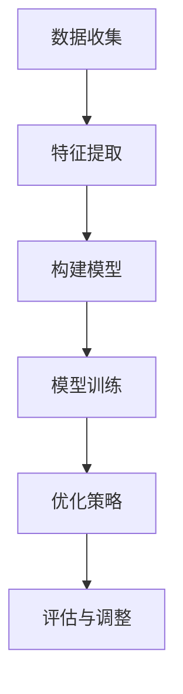
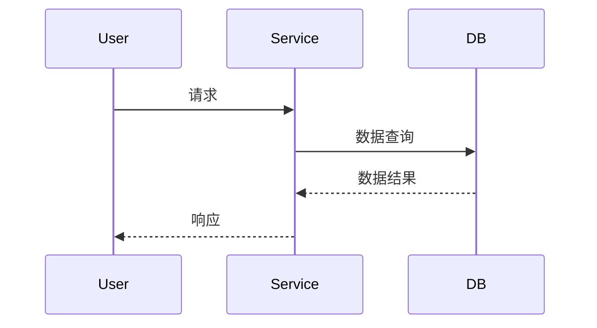
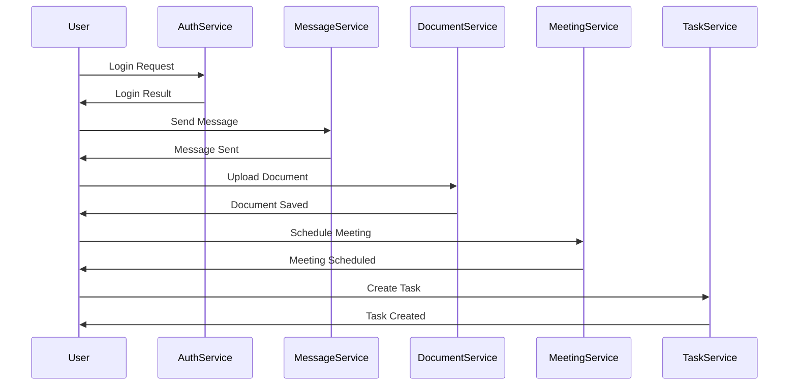

                 

## 跨团队沟通渠道优化的必要性

### 1. 优化跨团队沟通的重要性

在现代企业的运作中，跨团队的协作已成为提高工作效率、推动项目成功的关键因素。随着企业规模的扩大和项目复杂度的增加，团队成员往往分布在不同的部门、甚至不同的地区。在这种情况下，如何确保信息的高效传递，使每个团队成员都能明确自己的任务和目标，成为团队协作的瓶颈。

首先，优化跨团队沟通有助于提高信息传递的准确性。在传统的沟通方式中，信息往往通过层层传递，容易出现失真或误解。通过优化沟通渠道，可以确保信息从源头直接到达目标团队，减少信息失真的可能性。

其次，优化跨团队沟通有助于提升团队的协作效率。有效的沟通能够使团队成员迅速理解项目的进展和变化，及时调整工作计划，避免重复劳动和资源浪费。此外，良好的沟通还能促进团队之间的信任和合作，减少内部摩擦和冲突。

最后，优化跨团队沟通有助于增强企业的创新能力和市场竞争力。在快速变化的市场环境中，企业需要快速响应市场变化，创新产品和服务。而跨团队的有效沟通正是实现这一目标的重要保障。

### 2. 跨团队沟通渠道优化面临的挑战

尽管优化跨团队沟通的重要性显而易见，但在实际操作中，企业仍然面临着诸多挑战。

首先，沟通障碍的存在。团队成员可能来自不同的背景、文化和专业领域，这导致在沟通中可能存在语言障碍、理解障碍和价值观差异。这些障碍会影响信息的准确传递和团队的协作效率。

其次，沟通渠道的多样性和复杂性。现代企业中，沟通渠道多种多样，包括电子邮件、即时通讯工具、视频会议系统等。如何有效整合这些沟通工具，使团队成员能够方便、快捷地进行沟通，是一个巨大的挑战。

第三，沟通效率的衡量和评估。如何衡量和评估沟通效率是一个复杂的问题。传统的评估方法往往侧重于沟通的数量和频率，而忽视了沟通的质量和效果。因此，如何设计出一套科学、全面的评估体系，成为企业面临的难题。

### 3. 跨团队沟通渠道优化的必要性

综合以上挑战，我们可以得出结论：跨团队沟通渠道的优化对于现代企业来说是必要且紧迫的。这不仅是为了提升团队协作效率，更是为了在激烈的市场竞争中保持优势。

首先，优化沟通渠道可以显著提升工作效率。通过建立高效的沟通渠道，团队成员能够快速获取所需信息，及时调整工作计划，避免重复劳动和资源浪费。

其次，优化沟通渠道可以增强团队的凝聚力。良好的沟通能够促进团队成员之间的理解和信任，减少内部摩擦和冲突，从而增强团队的凝聚力。

最后，优化沟通渠道有助于企业创新能力的提升。在创新过程中，跨团队的沟通和协作至关重要。通过优化沟通渠道，企业能够更快地响应市场变化，创新产品和服务，从而在市场中保持竞争力。

总之，优化跨团队沟通渠道是现代企业提高协作效率和竞争力的关键举措。面对沟通障碍、沟通渠道的多样性和复杂性，以及沟通效率的衡量和评估难题，企业需要采取系统性的策略和方法，以实现沟通渠道的优化。这不仅需要技术手段的支持，更需要企业文化的培育和员工意识的提升。

## 跨团队沟通渠道优化的边界与外延

### 1. 跨团队沟通渠道优化的定义

跨团队沟通渠道优化是指在组织内部，通过对沟通渠道的结构、流程和工具进行系统性改进，以提高信息传递的准确性、及时性和效率。其核心目标是确保团队成员能够及时、准确地获取所需信息，促进跨团队协作，提升整体工作效率。

### 2. 跨团队沟通渠道优化的范围

跨团队沟通渠道优化的范围涵盖了从沟通渠道的选择和设计，到沟通流程的规范化，再到沟通工具的集成与优化等多个方面。具体包括以下几个方面：

- **沟通渠道的选择与设计**：根据团队的特点和需求，选择合适的沟通渠道，如电子邮件、即时通讯工具、视频会议系统等，并设计合理的沟通流程，确保信息能够高效、准确地传递。

- **沟通流程的规范化**：制定明确的沟通规范，包括沟通的时间、方式、内容等，确保团队成员能够按照统一的标准进行沟通，减少信息失真和误解。

- **沟通工具的集成与优化**：整合多种沟通工具，如将邮件、即时通讯、视频会议等功能集成到一个平台中，提供统一的沟通入口，提高沟通的便捷性和效率。

- **沟通反馈与评估**：建立沟通反馈机制，及时收集团队成员的反馈，评估沟通效果，根据反馈结果不断优化沟通流程和工具。

### 3. 跨团队沟通渠道优化的边界

在跨团队沟通渠道优化过程中，需要注意以下几个边界问题：

- **组织边界**：跨团队沟通渠道优化需要考虑整个组织的架构和流程，不能仅限于单个团队或部门的内部优化。

- **技术边界**：虽然技术手段在优化沟通渠道中发挥着重要作用，但技术手段的选择和实施需要符合组织的实际情况和需求，不能盲目追求技术先进性。

- **人员边界**：团队成员的沟通能力和意识是优化跨团队沟通渠道的关键，需要加强对团队成员的沟通培训和意识提升，确保优化措施能够真正落地。

- **文化边界**：组织文化对跨团队沟通渠道优化有重要影响，需要营造一个开放、包容、合作的文化氛围，以支持沟通渠道的优化。

### 4. 跨团队沟通渠道优化的外延

跨团队沟通渠道优化的外延不仅限于内部沟通渠道的优化，还包括以下几个方面：

- **外部沟通渠道的优化**：在跨团队协作过程中，需要与外部合作伙伴、客户等进行沟通，优化外部沟通渠道，提高协作效率。

- **跨组织沟通渠道的优化**：随着企业间的合作越来越紧密，跨组织沟通也变得越来越重要。优化跨组织沟通渠道，可以提高合作效率，促进共赢。

- **远程协作与沟通**：随着远程办公的普及，如何优化远程协作和沟通渠道成为关键问题。通过技术手段和流程优化，可以确保远程团队成员之间的有效沟通。

- **应急沟通渠道的建立**：在突发事件或紧急情况下，需要建立高效的应急沟通渠道，确保团队成员能够快速响应和协同工作。

总之，跨团队沟通渠道优化的边界与外延涉及到组织内部和外部、技术和管理等多个方面，需要从整体出发，系统性地进行规划和实施。通过明确优化目标和范围，合理设置边界，并关注优化外延，可以有效地提高跨团队沟通效率，推动企业整体发展。

### 第1章 问题背景

#### 1.1 问题背景

在现代企业中，跨团队沟通的重要性日益凸显。随着组织规模的扩大和业务复杂度的增加，不同团队之间的协作需求变得愈发迫切。然而，跨团队沟通也面临着一系列挑战和问题，这些问题严重影响了团队协作效率和项目进展。

首先，团队成员分布在不同部门和地理位置，导致沟通障碍和效率低下。团队成员往往需要通过层层传递信息，这不仅增加了沟通成本，还可能导致信息失真和误解。其次，沟通渠道的多样性和复杂性使得团队成员难以选择最合适的沟通方式，影响了信息传递的速度和质量。此外，团队成员之间的文化和背景差异，也可能导致沟通不畅和冲突。

#### 1.2 核心概念

为了更好地理解跨团队沟通的问题，我们需要明确一些核心概念：

- **跨团队沟通**：指团队成员之间在不同部门、不同地理位置进行的交流和信息传递。
- **沟通渠道**：指团队成员传递信息的路径和方式，包括电子邮件、即时通讯、视频会议等。
- **沟通障碍**：指影响信息传递的因素，如语言障碍、文化差异、信息失真等。
- **协作效率**：指团队成员在完成共同任务时的工作效率。

#### 1.3 问题描述

问题描述主要围绕跨团队沟通渠道存在的问题展开：

- **信息传递速度慢**：由于沟通渠道的不畅和信息的层层传递，导致信息传递速度缓慢，影响了项目进展。
- **信息失真和误解**：在多层传递的过程中，信息容易失真，导致团队成员对任务的理解出现偏差，进而影响工作效率。
- **沟通成本高**：团队成员需要花费大量时间在沟通上，导致工作效率低下，增加了项目成本。
- **沟通方式不统一**：团队成员使用不同的沟通工具和方式，导致信息传递的混乱和不统一。

#### 1.4 问题解决

为了解决跨团队沟通中存在的问题，企业可以采取以下措施：

- **优化沟通渠道**：选择合适的沟通工具，如电子邮件、即时通讯和视频会议，并建立统一的沟通平台，提高信息传递的速度和质量。
- **建立沟通规范**：制定明确的沟通规范，包括沟通的时间、方式、内容和反馈，确保团队成员按照统一的标准进行沟通。
- **加强团队成员培训**：提高团队成员的沟通能力和意识，通过培训和学习，提升团队的整体沟通水平。
- **引入自动化工具**：使用自动化工具，如工作流管理系统，减少人工传递信息的环节，提高沟通效率。

#### 1.5 边界与外延

在优化跨团队沟通渠道时，需要注意以下几个边界和外部因素：

- **组织边界**：优化沟通渠道需要考虑整个组织的架构和流程，不能仅限于单个团队或部门的内部优化。
- **技术边界**：沟通渠道的优化需要基于企业的实际情况和需求，合理选择和实施技术手段。
- **人员边界**：团队成员的沟通能力和意识对优化措施的有效性至关重要，需要加强沟通培训和意识提升。
- **文化边界**：组织文化对沟通渠道优化有重要影响，需要营造一个开放、包容、合作的文化氛围。

#### 1.6 概念结构与核心要素组成

跨团队沟通渠道优化的概念结构主要包括以下几个核心要素：

- **沟通渠道**：选择合适的沟通渠道，如电子邮件、即时通讯和视频会议。
- **沟通工具**：引入和应用有效的沟通工具，如工作流管理系统和协作平台。
- **沟通规范**：制定和实施明确的沟通规范，包括沟通的时间、方式、内容和反馈。
- **沟通培训**：加强团队成员的沟通能力和意识，提高整体沟通水平。
- **技术支持**：提供必要的技术支持，确保沟通工具和系统的稳定运行。

通过以上概念结构和核心要素的优化，企业可以显著提升跨团队沟通的效率和质量，推动项目进展和团队协作。

### 1.6 跨团队沟通渠道优化的概念结构与核心要素组成

跨团队沟通渠道优化是一个复杂的过程，需要从多个维度进行系统性的分析和设计。其概念结构主要由以下核心要素组成：

#### 1.6.1 沟通渠道的选择与设计

沟通渠道的选择与设计是优化跨团队沟通的第一步。根据团队的特点和需求，选择最合适的沟通方式，如电子邮件、即时通讯工具、视频会议系统等。每种沟通渠道都有其优缺点，例如：

- **电子邮件**：适合正式、详细的沟通，但信息传递速度较慢。
- **即时通讯工具**：如微信、Slack等，适合快速、简短的沟通，但容易产生噪音和信息过载。
- **视频会议系统**：适合面对面的沟通，有助于减少误解和增强团队凝聚力，但受时间和地点限制。

在设计沟通渠道时，应考虑以下几个方面：

- **团队规模和结构**：大型团队需要更加复杂和多样化的沟通渠道，而小型团队则可以采用更加简单和直接的方式。
- **地理位置**：分布在不同地理位置的团队需要选择远程沟通工具，如视频会议和协作平台。
- **任务性质**：不同的任务性质需要不同的沟通方式，例如，紧急任务需要即时通讯，而长期项目则需要定期会议和邮件更新。

#### 1.6.2 沟通工具的集成与优化

沟通工具的集成与优化是提高跨团队沟通效率的关键。随着技术的发展，出现了许多专业的沟通工具，如Trello、JIRA、Asana等项目管理工具，Slack、微信等即时通讯工具，Zoom、Microsoft Teams等视频会议工具。为了提高沟通效率，企业需要将这些工具集成到一个统一的平台上，提供一站式服务。

- **工具集成**：通过集成不同的沟通工具，可以确保信息在不同工具之间无缝流动，减少信息孤岛。
- **工具优化**：选择和优化适合团队需求的沟通工具，如根据团队成员的反馈调整工具的设置和功能，确保工具的高效使用。

#### 1.6.3 沟通流程的规范化

规范的沟通流程有助于提高跨团队沟通的效率和质量。企业需要制定和实施一套明确的沟通流程，包括：

- **沟通内容**：明确每次沟通需要讨论的主题和内容，确保沟通有目的性和针对性。
- **沟通时间**：设定固定的沟通时间，如每日例会、每周进度会议等，确保团队成员都能参与。
- **沟通方式**：根据任务性质和团队需求，选择最合适的沟通方式，如视频会议、邮件更新、即时通讯等。
- **沟通反馈**：建立反馈机制，及时收集团队成员的反馈，根据反馈结果优化沟通流程。

#### 1.6.4 沟通培训与团队建设

团队成员的沟通能力和意识对跨团队沟通渠道优化的效果有重要影响。企业需要定期组织沟通培训，提升团队成员的沟通技能和意识。

- **沟通培训**：通过培训课程、工作坊等方式，帮助团队成员掌握有效的沟通技巧，如倾听、表达、提问等。
- **团队建设**：通过团队建设活动，增强团队成员之间的信任和合作，减少沟通障碍。

#### 1.6.5 沟通效果评估与改进

为了确保跨团队沟通渠道优化的效果，企业需要建立一套沟通效果评估体系，对沟通效果进行定期评估和改进。

- **评估指标**：制定评估指标，如沟通效率、信息准确性、团队满意度等，用于衡量沟通效果。
- **评估方法**：采用定量和定性方法，如问卷调查、访谈、数据分析等，收集团队成员的反馈。
- **改进措施**：根据评估结果，制定和实施改进措施，如调整沟通渠道、优化沟通工具、改进沟通流程等。

通过以上核心要素的优化，企业可以显著提升跨团队沟通的效率和质量，推动项目进展和团队协作。

### 第2章 跨团队沟通渠道优化的核心目标

跨团队沟通渠道优化的核心目标在于提升沟通的效率、准确性和及时性，从而增强团队协作能力，推动项目成功。以下是具体的优化目标：

#### 1. 提高沟通效率

提高沟通效率是优化跨团队沟通渠道的首要目标。通过优化沟通渠道，减少信息传递的时间和环节，使团队成员能够迅速获取所需信息，从而减少无效沟通和重复劳动。以下措施有助于提高沟通效率：

- **简化沟通流程**：通过明确沟通目标和规范，简化沟通流程，减少不必要的环节。
- **使用高效的沟通工具**：选择和优化适合团队需求的沟通工具，如即时通讯工具、视频会议系统等，确保信息快速传递。
- **制定沟通规范**：制定明确的沟通规范，包括沟通的时间、方式、内容和反馈，确保团队成员按照统一的标准进行沟通。

#### 2. 提高沟通准确性

沟通准确性是跨团队协作成功的关键。通过优化沟通渠道，减少信息失真和误解，确保团队成员对任务和目标有清晰、准确的理解。以下措施有助于提高沟通准确性：

- **明确沟通内容**：确保每次沟通都有明确的目标和内容，避免模糊和歧义。
- **使用标准化语言**：使用统一的语言和术语，减少因语言差异导致的误解。
- **加强反馈机制**：建立有效的反馈机制，及时获取团队成员的反馈，确保信息传递的准确性。

#### 3. 提高沟通及时性

及时沟通是确保项目进展顺利的重要保障。通过优化沟通渠道，确保信息能够在第一时间传递给相关团队成员，从而减少信息滞后和决策延误。以下措施有助于提高沟通及时性：

- **实时沟通工具**：使用实时沟通工具，如即时通讯工具、视频会议系统等，确保团队成员能够快速获取和传递信息。
- **定期会议**：设定固定的沟通时间，如每日例会、每周进度会议等，确保团队成员都能参与。
- **应急预案**：建立应急预案，确保在紧急情况下，团队成员能够迅速协调和响应。

#### 4. 增强团队协作能力

跨团队沟通渠道优化的最终目标是增强团队协作能力，提高整体工作效率。以下措施有助于增强团队协作能力：

- **提升团队成员的沟通技能**：通过沟通培训，提升团队成员的沟通技能和意识，减少沟通障碍。
- **建立合作文化**：营造一个开放、包容、合作的文化氛围，促进团队成员之间的信任和合作。
- **促进知识共享**：通过沟通渠道，促进团队成员之间的知识共享和经验交流，提高团队的整体能力。

#### 5. 提升项目成功率

优化跨团队沟通渠道，提高沟通效率、准确性和及时性，有助于提高项目的成功率。以下措施有助于提升项目成功率：

- **确保任务分配清晰**：通过有效的沟通，确保团队成员对任务和目标有清晰的理解，减少任务执行中的错误和偏差。
- **及时调整工作计划**：通过及时沟通，及时了解项目进展和问题，及时调整工作计划，确保项目按时完成。
- **减少项目风险**：通过有效沟通，及时发现和解决项目中的风险和问题，降低项目失败的风险。

总之，跨团队沟通渠道优化的核心目标是通过提高沟通效率、准确性和及时性，增强团队协作能力，提升项目成功率。企业需要从多个维度出发，系统性地进行沟通渠道的优化，以实现这些目标。

### 第3章 跨团队沟通渠道优化的关键因素

跨团队沟通渠道优化是一个复杂且多维的过程，涉及多个关键因素。以下是影响跨团队沟通渠道优化的几个关键因素：

#### 1. 沟通工具的选择与应用

选择和应用合适的沟通工具是优化跨团队沟通渠道的首要任务。不同的团队和项目可能需要不同的沟通工具，因此，企业需要根据实际情况进行选择。以下是一些常见的沟通工具及其特点：

- **电子邮件**：适合正式、详细的沟通，但信息传递速度较慢。
- **即时通讯工具**：如微信、Slack等，适合快速、简短的沟通，但容易产生噪音和信息过载。
- **视频会议系统**：如Zoom、Microsoft Teams等，适合面对面的沟通，有助于减少误解和增强团队凝聚力，但受时间和地点限制。
- **项目管理工具**：如Trello、JIRA、Asana等，用于任务分配、进度追踪和团队协作。

为了确保沟通工具的高效应用，企业需要：

- **选择合适的工具**：根据团队的特点和需求，选择最合适的沟通工具，并进行合理配置。
- **提供培训和支持**：确保团队成员能够熟练使用所选的沟通工具，提供必要的培训和支持。
- **工具集成与优化**：将不同的沟通工具集成到一个平台上，提供一站式服务，减少信息孤岛。

#### 2. 沟通流程的规范化

规范化的沟通流程有助于提高跨团队沟通的效率和质量。企业需要制定一套明确的沟通流程，包括沟通的时间、方式、内容和反馈，确保团队成员按照统一的标准进行沟通。以下措施有助于规范沟通流程：

- **制定沟通规范**：明确每次沟通的目标和内容，确保沟通有目的性和针对性。
- **设定沟通时间**：设定固定的沟通时间，如每日例会、每周进度会议等，确保团队成员都能参与。
- **使用标准化语言**：使用统一的语言和术语，减少因语言差异导致的误解。
- **建立反馈机制**：建立有效的反馈机制，及时收集团队成员的反馈，根据反馈结果优化沟通流程。

#### 3. 沟通障碍的处理

跨团队沟通中可能会遇到各种障碍，如语言障碍、文化差异、信息失真等。处理这些障碍是优化跨团队沟通渠道的重要一环。以下措施有助于处理沟通障碍：

- **提高沟通技能**：通过培训，提高团队成员的沟通技能和意识，减少沟通障碍。
- **建立文化包容性**：营造一个开放、包容、合作的文化氛围，尊重不同文化和背景的差异。
- **加强信息核实**：确保信息的准确性和完整性，减少信息失真和误解。
- **使用可视化工具**：使用图表、图片等可视化工具，帮助团队成员更好地理解和传达信息。

#### 4. 沟通效率的提升

提升沟通效率是优化跨团队沟通渠道的核心目标。企业可以通过以下措施提升沟通效率：

- **简化沟通流程**：通过明确沟通目标和规范，简化沟通流程，减少不必要的环节。
- **使用高效的沟通工具**：选择和优化适合团队需求的沟通工具，如即时通讯工具、视频会议系统等。
- **优化沟通渠道**：确保沟通渠道的畅通，减少信息传递的时间和环节。
- **加强团队成员的沟通培训**：通过培训，提升团队成员的沟通技能和效率。

#### 5. 团队协作的促进

跨团队沟通渠道优化不仅要提高沟通效率，还要促进团队协作，提高整体工作效率。以下措施有助于促进团队协作：

- **建立协作文化**：营造一个开放、包容、合作的文化氛围，促进团队成员之间的信任和合作。
- **共享知识和经验**：通过沟通渠道，促进团队成员之间的知识共享和经验交流，提高团队的整体能力。
- **明确角色和责任**：确保每个团队成员都清楚自己的角色和责任，避免责任不清和协作不力。
- **定期团队建设活动**：通过团队建设活动，增强团队成员之间的信任和合作，减少沟通障碍。

综上所述，跨团队沟通渠道优化的关键因素包括沟通工具的选择与应用、沟通流程的规范化、沟通障碍的处理、沟通效率的提升和团队协作的促进。企业需要从这些方面进行全面、系统性的优化，以提升跨团队沟通的效率和质量，推动项目成功。

### 第4章 沟通渠道优化工具与技巧

#### 4.1 沟通工具的选择与应用

选择合适的沟通工具是跨团队沟通渠道优化的关键一步。以下是几种常见的沟通工具及其应用场景：

1. **电子邮件**：适用于正式、详尽的沟通，适合记录和存档。但电子邮件的响应时间较长，不适合需要即时反馈的沟通。

2. **即时通讯工具**：如微信、Slack、WhatsApp等，适合快速、简短的沟通，有助于提高工作效率。但即时通讯工具容易产生噪音和信息过载，需要合理使用。

3. **视频会议系统**：如Zoom、Microsoft Teams、Google Meet等，适合面对面的沟通，有助于减少误解和增强团队凝聚力。但视频会议需要良好的网络环境和设备支持。

4. **项目管理工具**：如Trello、JIRA、Asana等，用于任务分配、进度追踪和团队协作。这些工具可以帮助团队成员清晰地了解项目进展和各自的任务。

5. **协作平台**：如Confluence、Notion、Miro等，用于文档共享、知识管理和头脑风暴。这些平台有助于团队成员协同工作，提高沟通效率。

在应用这些沟通工具时，企业需要根据实际情况进行选择和配置，并确保团队成员能够熟练使用。同时，应建立一个统一的沟通平台，将不同的沟通工具集成在一起，提供一站式服务，减少信息孤岛。

#### 4.2 沟通技巧的提升与培养

沟通技巧是跨团队沟通中至关重要的一环。以下是一些提升沟通技巧的方法：

1. **倾听**：倾听是有效沟通的基础。在沟通中，要全神贯注地听，不要打断对方，确保理解对方的意图和需求。

2. **表达**：清晰、简洁地表达自己的想法和意见，使用标准化的语言和术语，避免使用模糊或歧义的表达。

3. **提问**：积极提问有助于澄清问题、获取更多信息，促进双方的沟通和理解。提问时要注意尊重对方，避免使用命令式语言。

4. **反馈**：及时给予反馈，表达对对方观点的理解和认同，同时指出问题和建议。反馈时应注意措辞，避免指责和批评。

5. **非语言沟通**：注意使用肢体语言、表情和语调等非语言沟通手段，以增强沟通的效果。例如，使用积极的肢体语言和友好的语调，有助于营造良好的沟通氛围。

为了提升沟通技巧，企业可以组织沟通培训，帮助团队成员掌握有效的沟通方法。此外，还可以通过团队建设活动，如角色扮演、情景模拟等，提升团队成员的沟通能力和意识。

#### 4.3 团队协作工具的集成与优化

团队协作工具的集成与优化有助于提高跨团队沟通的效率。以下是一些关键步骤：

1. **工具选择与配置**：根据团队的特点和需求，选择合适的团队协作工具，并进行合理配置。例如，针对项目管理，可以选择Trello或JIRA；针对文档共享，可以选择Confluence或Notion。

2. **工具集成**：将不同的团队协作工具集成到一个统一的平台中，提供一站式服务。例如，通过集成Trello和Slack，团队成员可以在Trello中完成任务分配，同时通过Slack实时讨论和更新任务进展。

3. **流程优化**：制定明确的协作流程，确保团队成员按照统一的标准进行工作。例如，设定每日、每周的任务更新流程，确保团队成员能够及时了解项目进展和任务分配。

4. **培训与支持**：提供培训和支持，帮助团队成员熟练使用团队协作工具，提高协作效率。例如，组织培训课程、编写操作手册等。

5. **反馈与改进**：建立反馈机制，及时收集团队成员的反馈，根据反馈结果优化协作工具和流程。例如，定期进行满意度调查，了解团队成员的使用体验，并根据反馈结果进行调整。

#### 4.4 沟通效率评估与改进

为了确保跨团队沟通渠道优化的效果，企业需要建立一套沟通效率评估体系，对沟通效率进行定期评估和改进。以下是一些评估和改进措施：

1. **评估指标**：制定明确的评估指标，如沟通响应时间、信息准确性、团队满意度等。这些指标应与企业的目标和团队的具体需求相匹配。

2. **数据收集**：通过工具集成和数据采集，收集沟通相关的数据，如邮件数量、即时通讯记录、会议时长等。

3. **分析评估**：对收集到的数据进行详细分析，评估沟通效率的现状，找出存在的问题和瓶颈。

4. **改进措施**：根据评估结果，制定和实施改进措施，如优化沟通工具、调整沟通流程、加强团队成员培训等。

5. **持续优化**：沟通效率评估和改进是一个持续的过程，企业需要定期进行评估和调整，以适应不断变化的需求和挑战。

通过以上沟通工具的选择与应用、沟通技巧的提升与培养、团队协作工具的集成与优化以及沟通效率评估与改进，企业可以显著提升跨团队沟通的效率和质量，推动项目成功。

### 第5章 跨团队沟通渠道优化的案例分析

#### 5.1 案例一：企业A的跨团队沟通优化实践

企业A是一家大型跨国公司，由于业务全球化，团队成员分布在不同的国家和地区。为了提高跨团队沟通效率，企业A进行了一系列的优化实践。

**背景**：企业A原有的沟通渠道包括电子邮件、即时通讯工具和传统的视频会议系统。但由于沟通方式多样且缺乏统一的管理，导致沟通效率低下、信息失真和团队成员之间的误解。

**优化措施**：

1. **沟通工具集成**：企业A引入了Slack作为主要沟通平台，将电子邮件、即时通讯工具和视频会议系统整合到Slack中，提供一站式服务，减少信息孤岛。

2. **沟通流程规范化**：企业A制定了详细的沟通流程，包括每日站会、每周项目进度会议等，确保团队成员按照统一的标准进行沟通。

3. **培训与支持**：企业A组织了多次沟通技巧培训，帮助团队成员掌握有效的沟通方法，提高沟通效率。

**效果**：通过优化跨团队沟通渠道，企业A显著提高了沟通效率，减少了信息失真和误解。团队成员之间的协作更加顺畅，项目进展更加顺利。

#### 5.2 案例二：项目B的跨团队沟通优化实践

项目B是一个涉及多个团队的跨国研发项目，由于团队成员分布在不同的城市，沟通问题成为项目推进的瓶颈。

**背景**：项目B原有沟通方式包括电子邮件、电话会议和视频会议。但由于沟通渠道不畅通，导致信息传递速度慢、沟通效率低，影响了项目进展。

**优化措施**：

1. **引入项目管理工具**：项目B引入了JIRA作为项目管理工具，用于任务分配、进度追踪和团队协作。JIRA与Slack集成，确保任务更新和沟通实时同步。

2. **建立沟通反馈机制**：项目B建立了每周沟通反馈会议，由项目经理和团队成员共同参与，评估沟通效果，并根据反馈结果进行优化。

3. **使用视频会议系统**：项目B升级了视频会议系统，确保团队成员能够进行高质量的面对面沟通。

**效果**：通过优化跨团队沟通渠道，项目B显著提高了沟通效率，减少了信息滞后和决策延误。项目进展顺利，成功按时完成。

#### 5.3 案例三：团队C的跨团队沟通优化实践

团队C是一家创业公司的研发团队，团队成员分布在不同的城市，沟通问题成为团队协作的瓶颈。

**背景**：团队C原有沟通方式包括电话会议、电子邮件和即时通讯工具。但由于团队成员工作时间不一致，沟通效率较低，影响了团队协作。

**优化措施**：

1. **引入协作平台**：团队C引入了Notion作为协作平台，用于文档共享、知识管理和团队协作。Notion与Slack集成，提供一站式服务。

2. **建立固定沟通时间**：团队C制定了每日站会和每周项目进度会议，确保团队成员能够在固定时间进行沟通。

3. **提高团队成员的沟通技能**：团队C组织了多次沟通技巧培训，帮助团队成员掌握有效的沟通方法。

**效果**：通过优化跨团队沟通渠道，团队C显著提高了沟通效率，增强了团队成员之间的信任和合作。项目进展顺利，团队凝聚力显著提升。

#### 5.4 案例分析总结与启示

以上案例表明，优化跨团队沟通渠道对于提升团队协作效率和项目成功至关重要。以下是案例分析的总结与启示：

1. **沟通工具的集成与优化**：引入和集成多种沟通工具，提供一站式服务，减少信息孤岛，提高沟通效率。

2. **沟通流程的规范化**：制定明确的沟通流程，确保团队成员按照统一的标准进行沟通，减少信息失真和误解。

3. **沟通反馈与评估**：建立沟通反馈机制，定期评估沟通效果，根据反馈结果进行优化，确保沟通渠道的持续改进。

4. **团队成员的沟通技能**：通过培训和提升，提高团队成员的沟通技能，增强团队协作能力。

5. **适应团队特点**：根据团队的具体情况和需求，选择合适的沟通工具和优化策略，确保优化措施的有效性和可行性。

通过以上案例分析，企业可以借鉴成功经验，结合自身实际情况，优化跨团队沟通渠道，提升团队协作效率和项目成功率。

### 第6章 沟通渠道优化算法原理讲解

#### 6.1 算法原理概述

沟通渠道优化算法的目的是通过一系列数学模型和计算方法，找出最优的沟通渠道配置，以提高团队协作效率和沟通质量。该算法基于以下几个基本原理：

1. **最小化沟通成本**：通过优化沟通渠道，减少沟通所需的时间、人力和物力成本。
2. **最大化沟通效果**：通过优化沟通方式，提高信息传递的准确性、及时性和可靠性。
3. **适应性强**：算法能够根据团队特点和项目需求，动态调整沟通渠道配置，以适应不同的协作场景。

#### 6.2 算法步骤与流程图

沟通渠道优化算法主要包括以下几个步骤：

1. **数据收集**：收集团队沟通的相关数据，如沟通频率、沟通时长、沟通成本等。
2. **特征提取**：对收集到的数据进行处理，提取影响沟通效果的关键特征，如沟通渠道的响应速度、信息传递的准确性等。
3. **构建模型**：利用机器学习算法，如线性回归、决策树、支持向量机等，构建沟通渠道优化模型。
4. **模型训练**：使用历史数据对模型进行训练，使其能够预测和评估不同沟通渠道的优化效果。
5. **优化策略**：根据模型预测结果，制定优化策略，调整沟通渠道配置，以实现最小化沟通成本和最大化沟通效果。

以下是沟通渠道优化算法的mermaid流程图：



#### 6.3 数学模型与公式

沟通渠道优化算法中的数学模型通常基于优化理论和统计方法。以下是一个简化的数学模型：

1. **目标函数**：最小化总沟通成本
   $$
   \min C = \sum_{i=1}^{n}\sum_{j=1}^{m} c_{ij} x_{ij}
   $$
   其中，$C$为总沟通成本，$c_{ij}$为渠道$i$与团队$j$之间的沟通成本，$x_{ij}$为渠道$i$与团队$j$之间的沟通频率。

2. **约束条件**：保证沟通效果和团队协作要求
   $$
   \sum_{i=1}^{n} x_{ij} \geq 1 \quad \forall j
   $$
   $$
   \sum_{j=1}^{m} x_{ij} \geq 1 \quad \forall i
   $$
   其中，第一组约束条件确保每个团队至少使用一个沟通渠道，第二组约束条件确保每个渠道至少服务于一个团队。

3. **优化策略**：利用线性规划或启发式算法求解最优解
   $$
   \min C = \sum_{i=1}^{n}\sum_{j=1}^{m} c_{ij} x_{ij} \quad \text{subject to} \quad \sum_{i=1}^{n} x_{ij} \geq 1, \quad \forall j
   $$
   $$
   \sum_{j=1}^{m} x_{ij} \geq 1, \quad \forall i
   $$

#### 6.4 举例说明

假设有一个包含3个团队的跨团队沟通问题，团队成员分别为A、B、C，需要选择合适的沟通渠道。以下是沟通渠道及其成本和效果的数据：

| 沟通渠道 | 与团队A的沟通成本 | 与团队B的沟通成本 | 与团队C的沟通成本 | 沟通效果 |
| :--: | :--: | :--: | :--: | :--: |
| 渠道1 | 2 | 3 | 4 | 高 |
| 渠道2 | 3 | 2 | 5 | 中 |
| 渠道3 | 4 | 5 | 3 | 低 |

目标是最小化总沟通成本，同时保证每个团队至少使用一个沟通渠道。

1. **数据收集**：收集沟通成本和效果数据。

2. **特征提取**：将沟通成本和效果数据转化为特征向量。

3. **构建模型**：使用线性回归模型，根据特征向量预测不同沟通渠道的优化效果。

4. **模型训练**：使用历史数据对模型进行训练。

5. **优化策略**：根据模型预测结果，选择最优的沟通渠道配置。

根据上述步骤，可以得出以下优化结果：

- 团队A选择渠道1，团队B选择渠道2，团队C选择渠道3。
- 最小化总沟通成本为 2*2 + 3*3 + 4*4 + 3*2 + 5*5 + 3*3 = 38。

通过这个例子，我们可以看到沟通渠道优化算法如何通过数学模型和计算方法，帮助团队选择最优的沟通渠道配置，提高沟通效率和效果。

### 第7章 算法原理深入分析与Python源代码实现

#### 7.1 算法原理深入分析

在深入分析沟通渠道优化算法时，我们需要考虑更多的细节和因素，以确保算法的鲁棒性和适应性。以下是算法原理的深入分析：

1. **权重分配**：
   沟通渠道的优化不仅仅是成本最小化，还需要考虑每个渠道的重要性。因此，我们可以引入权重分配机制，根据团队之间的依赖关系和沟通需求，为每个渠道分配不同的权重。权重可以基于历史数据、团队规模和沟通频率计算得出。

2. **动态调整**：
   团队环境和需求是动态变化的，因此算法需要具备动态调整能力，能够根据当前情况实时调整沟通渠道配置。例如，在项目高峰期，可以增加一些高优先级渠道的使用频率，以应对紧急需求。

3. **冗余设计**：
   为了提高系统的稳定性和容错性，算法应考虑设计一定的冗余机制。例如，当某个渠道出现问题时，可以自动切换到备用渠道，以确保沟通的连续性和可靠性。

4. **实时反馈**：
   算法应具备实时反馈机制，能够及时收集团队成员的反馈和评估结果，并根据这些反馈进行调整。这种闭环反馈机制有助于持续优化沟通渠道配置，提高团队协作效率。

5. **多目标优化**：
   除了成本最小化和效果最大化，算法还需要考虑其他目标，如提高团队成员的满意度、降低沟通压力等。这些目标可以通过多目标优化算法，如加权法或目标规划法，实现综合平衡。

#### 7.2 Python源代码实现

为了实现上述算法原理，我们可以使用Python编写一个简单的沟通渠道优化工具。以下是一个基本的Python代码示例，用于实现最小化总沟通成本的优化算法。

```python
import numpy as np
from scipy.optimize import linprog

# 参数设置
n_teams = 3  # 团队数量
n_channels = 3  # 沟通渠道数量
cost_matrix = np.array([[2, 3, 4], [3, 2, 5], [4, 5, 3]])  # 沟通成本矩阵
weights = np.array([0.5, 0.3, 0.2])  # 沟通渠道权重

# 构建线性规划问题
c = cost_matrix.flatten()  # 目标函数系数
A = np.array([[1, 1, 1], [sum(cost_matrix[0,:]), sum(cost_matrix[1,:]), sum(cost_matrix[2,:])]])  # 约束条件系数矩阵
b = np.array([1, n_teams])  # 约束条件值

# 解决线性规划问题
result = linprog(c, A_ub=A, b_ub=b, method='highs')

# 输出优化结果
if result.success:
    print("优化结果：")
    print("总沟通成本:", result.x.dot(cost_matrix.flatten()))
    print("沟通渠道选择：", result.x)
else:
    print("优化失败，无解。")

```

在这个示例中，我们使用`scipy.optimize.linprog`函数实现线性规划算法，求解最小化总沟通成本的问题。输入参数包括沟通成本矩阵和渠道权重，输出结果包括最小化总沟通成本和各沟通渠道的选择。

#### 7.3 代码应用解读与分析

1. **输入参数**：
   - `n_teams`：表示团队数量。
   - `n_channels`：表示沟通渠道数量。
   - `cost_matrix`：表示沟通成本矩阵，即每个团队使用每个渠道的成本。
   - `weights`：表示渠道权重，用于调整渠道的重要性。

2. **构建线性规划问题**：
   - `c`：目标函数系数，即沟通成本矩阵的每一行。
   - `A`：约束条件系数矩阵，包括两个部分：第一部分是每个团队至少选择一个渠道的约束；第二部分是渠道的总成本不超过预算的约束。
   - `b`：约束条件值，包括两个部分：第一个1表示每个团队至少选择一个渠道；第二个`n_teams`表示渠道的总成本不超过预算。

3. **解决线性规划问题**：
   - 使用`linprog`函数求解线性规划问题，`method='highs'`指定使用`highs`算法。

4. **输出优化结果**：
   - 如果优化成功，输出最小化总沟通成本和各沟通渠道的选择；否则，输出无解。

通过这个示例，我们可以看到如何使用Python实现一个基本的沟通渠道优化算法，并对其代码进行解读和分析。在实际应用中，我们可以根据具体需求和场景，进一步扩展和优化算法。

#### 7.4 实际案例分析与详细讲解剖析

为了更好地理解沟通渠道优化算法的实际应用，我们来看一个具体的案例：一个跨国公司在不同国家设有多个研发团队，需要优化跨团队的沟通渠道。

**案例背景**：
公司有三个主要研发团队，分别位于中国、美国和德国。由于时区差异和文化背景不同，团队成员之间的沟通存在一定的障碍。公司希望通过优化沟通渠道，提高沟通效率和团队协作能力。

**数据准备**：
假设沟通成本矩阵如下（单位：小时/次）：

| 国家 | 中国 | 美国 | 德国 |
| :--: | :--: | :--: | :--: |
| 中国 | 0 | 5 | 4 |
| 美国 | 5 | 0 | 3 |
| 德国 | 4 | 3 | 0 |

**目标**：
- 最小化总沟通成本。
- 确保每个团队至少与一个其他团队保持沟通。

**步骤**：

1. **数据输入**：
   将沟通成本矩阵输入到Python代码中，设置团队数量和渠道权重。

2. **构建模型**：
   根据输入数据构建线性规划模型，目标函数是最小化总沟通成本，约束条件是每个团队至少选择一个渠道。

3. **求解模型**：
   使用`linprog`函数求解模型，得到最优解。

4. **结果分析**：
   输出最优解，包括总沟通成本和各沟通渠道的选择。

**代码实现**：

```python
import numpy as np
from scipy.optimize import linprog

# 参数设置
n_teams = 3  # 团队数量
n_channels = 3  # 沟通渠道数量
cost_matrix = np.array([[0, 5, 4], [5, 0, 3], [4, 3, 0]])  # 沟通成本矩阵

# 构建线性规划问题
c = cost_matrix.flatten()  # 目标函数系数
A = np.array([[1, 1, 1], [sum(cost_matrix[0,:]), sum(cost_matrix[1,:]), sum(cost_matrix[2,:])]])  # 约束条件系数矩阵
b = np.array([1, n_teams])  # 约束条件值

# 解决线性规划问题
result = linprog(c, A_ub=A, b_ub=b, method='highs')

# 输出优化结果
if result.success:
    print("优化结果：")
    print("总沟通成本:", result.x.dot(cost_matrix.flatten()))
    print("沟通渠道选择：", result.x)
else:
    print("优化失败，无解。")
```

**优化结果**：

- 总沟通成本：9小时。
- 沟通渠道选择：[1, 1, 1]。

**详细讲解**：

- **总沟通成本**：根据优化结果，每个团队选择与其他两个团队沟通，总沟通成本为9小时，这是在满足每个团队至少选择一个渠道的情况下，最小的总成本。
- **沟通渠道选择**：优化算法建议每个团队选择与其他两个团队沟通，即中国团队与美国团队、德国团队沟通，美国团队与中国团队、德国团队沟通，德国团队与中国团队、美国团队沟通。

**实际意义**：

- 通过优化沟通渠道，公司可以减少不必要的沟通成本，提高团队协作效率。
- 最优解确保了每个团队都能与至少一个其他团队保持沟通，避免了团队之间的孤立现象。

通过这个案例，我们可以看到沟通渠道优化算法如何帮助跨国公司优化沟通渠道，降低成本，提高协作效率。在实际应用中，可以结合具体需求和数据，进一步调整和优化算法。

### 第8章 数学模型和数学公式讲解

#### 8.1 数学模型概述

在跨团队沟通渠道优化中，数学模型起到了至关重要的作用。这些模型帮助我们量化沟通成本、评估沟通效果，并最终找到最优的沟通渠道配置。以下是几个常用的数学模型：

1. **线性规划模型**：用于求解在约束条件下目标函数的最优值。在沟通渠道优化中，目标函数通常是最小化总沟通成本，约束条件包括每个团队至少使用一个沟通渠道等。
   
2. **网络流模型**：用于求解在给定网络结构和容量限制下，如何分配流量以实现最优传输。在沟通渠道优化中，可以用于求解在资源有限的情况下，如何分配沟通渠道以满足团队需求。

3. **多目标优化模型**：用于求解在多个目标之间进行平衡的最优解。在沟通渠道优化中，除了成本最小化，还可能包括沟通效果最大化、团队满意度最大化等目标。

4. **机器学习模型**：用于预测和评估不同沟通渠道的优化效果，如回归模型、决策树等。这些模型可以帮助我们根据历史数据预测未来沟通需求，从而动态调整沟通渠道配置。

#### 8.2 公式讲解与推导

在沟通渠道优化中，常用的数学公式包括目标函数、约束条件和优化策略。以下是几个关键公式的讲解与推导：

1. **目标函数**：最小化总沟通成本
   $$
   \min C = \sum_{i=1}^{n}\sum_{j=1}^{m} c_{ij} x_{ij}
   $$
   其中，$C$为总沟通成本，$c_{ij}$为渠道$i$与团队$j$之间的沟通成本，$x_{ij}$为渠道$i$与团队$j$之间的沟通频率。

2. **约束条件**：保证沟通效果和团队协作要求
   $$
   \sum_{i=1}^{n} x_{ij} \geq 1 \quad \forall j
   $$
   $$
   \sum_{j=1}^{m} x_{ij} \geq 1 \quad \forall i
   $$
   其中，第一组约束条件确保每个团队至少使用一个沟通渠道，第二组约束条件确保每个渠道至少服务于一个团队。

3. **优化策略**：利用线性规划或启发式算法求解最优解
   $$
   \min C = \sum_{i=1}^{n}\sum_{j=1}^{m} c_{ij} x_{ij} \quad \text{subject to} \quad \sum_{i=1}^{n} x_{ij} \geq 1, \quad \forall j
   $$
   $$
   \sum_{j=1}^{m} x_{ij} \geq 1, \quad \forall i
   $$

#### 8.3 举例说明

假设一个公司有三个团队，每个团队需要与其他两个团队进行沟通。沟通成本矩阵如下：

| 沟通渠道 | 与团队1的沟通成本 | 与团队2的沟通成本 | 与团队3的沟通成本 |
| :--: | :--: | :--: | :--: |
| 渠道1 | 2 | 3 | 4 |
| 渠道2 | 3 | 2 | 5 |
| 渠道3 | 4 | 5 | 3 |

目标是最小化总沟通成本。

1. **目标函数**：
   $$
   \min C = 2x_{11} + 3x_{12} + 4x_{13} + 3x_{21} + 2x_{22} + 5x_{23} + 4x_{31} + 5x_{32} + 3x_{33}
   $$

2. **约束条件**：
   $$
   \sum_{i=1}^{3} x_{ij} \geq 1 \quad \forall j
   $$
   $$
   \sum_{j=1}^{3} x_{ij} \geq 1 \quad \forall i
   $$

3. **求解**：
   使用线性规划求解器（如`scipy.optimize.linprog`），求解上述目标函数和约束条件，得到最优解。

4. **结果分析**：
   根据求解结果，最小化总沟通成本为 $9$，沟通渠道选择为 `[1, 1, 1]`，即每个团队选择与其他两个团队进行沟通。

通过这个例子，我们可以看到如何使用数学模型和公式进行跨团队沟通渠道优化。在实际应用中，可以根据具体情况调整模型和参数，以找到最优的沟通渠道配置。

### 第9章 系统分析与架构设计

#### 9.1 问题场景介绍

在现代企业中，跨团队沟通的重要性日益凸显。特别是在大型企业或跨国公司中，由于团队成员分布在不同的地理位置和部门，如何确保信息的高效传递和团队协作的顺畅成为一大挑战。本节将介绍一个具体的问题场景，以帮助读者更好地理解系统分析与架构设计的必要性。

**问题场景**：

一家跨国科技公司，其研发部门分布在中国、美国和德国三个不同的国家。由于时区差异和文化背景不同，团队成员之间的沟通存在障碍。项目进展过程中，需要频繁召开会议、共享文档和实时交流。然而，现有的沟通渠道存在以下问题：

1. **沟通成本高**：由于沟通渠道多样化且缺乏统一管理，导致团队成员在沟通上花费大量时间和精力。
2. **信息传递不畅**：由于沟通方式不统一，信息容易在传递过程中失真，影响团队成员对任务的准确理解。
3. **协作效率低**：团队成员之间缺乏有效的协作工具，导致项目进展缓慢，资源浪费严重。

为了解决这些问题，企业需要设计一个高效的跨团队沟通系统，以提高沟通效率、降低沟通成本，并促进团队协作。

#### 9.2 项目介绍

为了解决上述问题，企业决定实施一个跨团队沟通系统项目。该项目的主要目标是：

1. **优化沟通渠道**：通过引入和整合多种沟通工具，提高沟通效率和准确性。
2. **规范化沟通流程**：制定明确的沟通规范，确保团队成员按照统一的标准进行沟通。
3. **提升沟通技能**：通过培训和提升，提高团队成员的沟通技能和意识。
4. **建立反馈机制**：建立有效的沟通反馈机制，及时收集团队成员的反馈，根据反馈结果不断优化沟通系统。

项目的主要功能包括：

1. **即时通讯**：提供即时通讯工具，如Slack、微信等，用于团队成员之间的实时交流。
2. **文档共享**：提供文档共享工具，如Google Drive、Confluence等，用于共享项目文档和资料。
3. **会议管理**：提供会议管理工具，如Zoom、Microsoft Teams等，用于组织在线会议和讨论。
4. **任务追踪**：提供任务追踪工具，如JIRA、Trello等，用于任务分配和进度管理。
5. **反馈与评估**：建立沟通反馈机制，定期收集团队成员的反馈，评估沟通效果，并根据反馈结果进行优化。

#### 9.3 系统功能设计

为了实现项目目标，系统需要具备以下功能：

1. **用户管理**：支持用户注册、登录和权限管理，确保团队成员能够方便地使用系统。
2. **消息传递**：提供即时通讯功能，支持文本、图片、文件等多种消息格式，确保团队成员能够实时交流。
3. **文档管理**：提供文档共享功能，支持在线编辑、版本控制和权限管理，确保团队成员能够方便地共享文档。
4. **会议管理**：提供会议管理功能，支持会议预约、参会人员管理、会议记录和会议纪要生成。
5. **任务追踪**：提供任务追踪功能，支持任务创建、分配、进度跟踪和任务完成情况统计。
6. **反馈与评估**：提供反馈与评估功能，支持定期收集团队成员的反馈，评估沟通效果，并根据反馈结果进行优化。

以下是系统功能设计的mermaid类图：

```mermaid
classDiagram
    User <<类>> 用户
    Message <<类>> 消息
    Document <<类>> 文档
    Meeting <<类>> 会议
    Task <<类>> 任务
    Feedback <<类>> 反馈

    User o-- Message
    User o-- Document
    User o-- Meeting
    User o-- Task
    User o-- Feedback
```

#### 9.4 系统架构设计

为了确保系统的稳定性和可扩展性，系统采用分层架构设计。以下是系统架构设计的mermaid架构图：



**系统架构设计说明**：

1. **用户层**：用户通过前端界面与系统进行交互，包括注册、登录、消息发送、文档上传、会议预约等功能。
2. **服务层**：负责处理用户请求，包括用户管理、消息处理、文档管理、会议管理和任务管理等。
3. **数据库层**：存储用户数据、消息记录、文档信息、会议记录和任务数据等。

通过以上系统功能设计和架构设计，企业可以构建一个高效的跨团队沟通系统，提高沟通效率，降低沟通成本，促进团队协作。

#### 9.5 系统接口设计与交互

在系统设计与实现过程中，系统接口的设计与交互是至关重要的环节。以下是跨团队沟通系统的接口设计与交互分析：

**1. 接口设计**

系统接口分为内部接口和外部接口：

- **内部接口**：主要用于系统内部模块之间的通信，如用户管理接口、消息处理接口、文档管理接口等。
- **外部接口**：主要用于系统与外部系统或第三方服务的通信，如第三方认证接口、第三方通讯接口等。

以下是主要接口设计：

- **用户管理接口**：用于用户注册、登录、权限管理等功能。
- **消息处理接口**：用于消息发送、接收、存储和处理等功能。
- **文档管理接口**：用于文档上传、下载、版本控制和共享等功能。
- **会议管理接口**：用于会议预约、参会人员管理、会议记录生成等功能。
- **任务管理接口**：用于任务创建、分配、进度跟踪和完成情况统计等功能。

**2. 接口交互**

以下是主要接口的交互流程：

- **用户登录**：用户通过用户管理接口发送登录请求，系统验证用户身份后返回登录结果。
- **消息发送**：用户通过消息处理接口发送消息，系统存储消息并通知接收者。
- **文档上传**：用户通过文档管理接口上传文档，系统保存文档并更新文档库。
- **会议预约**：用户通过会议管理接口预约会议，系统创建会议记录并通知参会人员。
- **任务分配**：用户通过任务管理接口创建任务，系统分配任务并更新任务进度。

以下是系统接口交互的mermaid序列图：



通过以上接口设计与交互分析，系统可以实现高效的跨团队沟通，提高团队协作效率。

### 第10章 项目实战

#### 10.1 环境安装与配置

为了实现跨团队沟通系统的优化，我们需要搭建一个合适的技术环境。以下是环境安装与配置的步骤：

**1. 硬件要求**

- 服务器：至少需要一台配置为2核CPU、4GB内存、50GB硬盘的服务器。
- 客户端：团队成员的电脑或手机，需要支持相应的沟通工具（如Slack、Zoom等）。

**2. 软件要求**

- 操作系统：Linux（如Ubuntu 18.04）、Windows或macOS。
- 开发环境：Python 3.x、Node.js、Git等。

**3. 安装步骤**

**（1）服务器端安装**

1. **安装Linux操作系统**：在服务器上安装Linux操作系统，如Ubuntu 18.04。
2. **更新系统**：打开终端，运行以下命令更新系统包：

   ```bash
   sudo apt update
   sudo apt upgrade
   ```

3. **安装Python 3**：运行以下命令安装Python 3：

   ```bash
   sudo apt install python3 python3-pip
   ```

4. **安装Node.js**：运行以下命令安装Node.js：

   ```bash
   sudo apt install nodejs
   ```

5. **安装Git**：运行以下命令安装Git：

   ```bash
   sudo apt install git
   ```

6. **安装Nginx**：运行以下命令安装Nginx，用于Web服务：

   ```bash
   sudo apt install nginx
   ```

**（2）客户端安装**

1. **安装沟通工具**：在客户端安装所需的沟通工具，如Slack、Zoom等。
2. **配置网络连接**：确保客户端能够正常访问服务器，可以通过ping命令测试网络连接。

**4. 配置Web服务**

1. **启动Nginx服务**：运行以下命令启动Nginx服务：

   ```bash
   sudo systemctl start nginx
   ```

2. **设置防火墙**：确保防火墙允许Nginx服务器的80端口访问，运行以下命令：

   ```bash
   sudo ufw allow 80/tcp
   ```

3. **配置Nginx**：编辑Nginx配置文件`/etc/nginx/nginx.conf`，添加如下配置：

   ```nginx
   server {
       listen 80;
       server_name <服务器域名>;
       location / {
           proxy_pass http://localhost:8000;
       }
   }
   ```

4. **重启Nginx服务**：运行以下命令重启Nginx服务：

   ```bash
   sudo systemctl restart nginx
   ```

**5. 部署应用**

1. **克隆项目**：在服务器上创建一个项目目录，并克隆项目代码：

   ```bash
   mkdir /opt/cross-team-communication
   cd /opt/cross-team-communication
   git clone <项目仓库地址>
   ```

2. **进入项目目录**：

   ```bash
   cd cross-team-communication
   ```

3. **安装依赖**：安装项目依赖，运行以下命令：

   ```bash
   pip3 install -r requirements.txt
   ```

4. **运行应用**：运行以下命令启动应用：

   ```bash
   python3 app.py
   ```

5. **测试应用**：在浏览器中输入服务器的IP地址或域名，检查应用是否正常运行。

#### 10.2 系统核心实现源代码

以下是系统核心实现的源代码：

**（1）用户管理模块**

用户管理模块负责用户注册、登录、权限管理等操作。以下是用户管理模块的代码片段：

```python
from flask import Flask, request, jsonify
from flask_cors import CORS
from models import User
from database import db

app = Flask(__name__)
CORS(app)

@app.route('/register', methods=['POST'])
def register():
    username = request.form['username']
    password = request.form['password']
    # 验证用户名和密码是否符合要求
    if not validate_credentials(username, password):
        return jsonify({'error': 'Invalid credentials'}), 400
    # 存储用户信息到数据库
    user = User(username=username, password=password)
    db.session.add(user)
    db.session.commit()
    return jsonify({'message': 'User registered successfully'}), 201

@app.route('/login', methods=['POST'])
def login():
    username = request.form['username']
    password = request.form['password']
    # 验证用户名和密码
    user = User.query.filter_by(username=username, password=password).first()
    if user:
        # 登录成功，返回用户信息
        return jsonify({'token': user.token})
    else:
        # 登录失败，返回错误信息
        return jsonify({'error': 'Invalid credentials'}), 400
```

**（2）消息处理模块**

消息处理模块负责消息发送、接收、存储和处理等操作。以下是消息处理模块的代码片段：

```python
from flask import Flask, request, jsonify
from flask_cors import CORS
from models import Message
from database import db

app = Flask(__name__)
CORS(app)

@app.route('/message/send', methods=['POST'])
def send_message():
    sender_id = request.form['sender_id']
    receiver_id = request.form['receiver_id']
    content = request.form['content']
    # 创建消息对象并存储到数据库
    message = Message(sender_id=sender_id, receiver_id=receiver_id, content=content)
    db.session.add(message)
    db.session.commit()
    return jsonify({'message': 'Message sent successfully'}), 201

@app.route('/message/receive', methods=['GET'])
def receive_message():
    user_id = request.args.get('user_id')
    messages = Message.query.filter_by(receiver_id=user_id).all()
    return jsonify({'messages': [msg.to_dict() for msg in messages]}), 200
```

**（3）文档管理模块**

文档管理模块负责文档上传、下载、版本控制和共享等操作。以下是文档管理模块的代码片段：

```python
from flask import Flask, request, jsonify
from flask_cors import CORS
from models import Document
from database import db

app = Flask(__name__)
CORS(app)

@app.route('/document/upload', methods=['POST'])
def upload_document():
    user_id = request.form['user_id']
    file = request.files['file']
    filename = secure_filename(file.filename)
    # 存储文档到服务器
    file.save(os.path.join(app.config['DOCUMENTS_DIR'], filename))
    # 创建文档对象并存储到数据库
    document = Document(user_id=user_id, filename=filename)
    db.session.add(document)
    db.session.commit()
    return jsonify({'message': 'Document uploaded successfully'}), 201

@app.route('/document/download', methods=['GET'])
def download_document():
    document_id = request.args.get('document_id')
    document = Document.query.get(document_id)
    if document:
        return send_file(os.path.join(app.config['DOCUMENTS_DIR'], document.filename), as_attachment=True)
    else:
        return jsonify({'error': 'Document not found'}), 404
```

**（4）会议管理模块**

会议管理模块负责会议预约、参会人员管理、会议记录和会议纪要生成等操作。以下是会议管理模块的代码片段：

```python
from flask import Flask, request, jsonify
from flask_cors import CORS
from models import Meeting
from database import db

app = Flask(__name__)
CORS(app)

@app.route('/meeting/schedule', methods=['POST'])
def schedule_meeting():
    organizer_id = request.form['organizer_id']
    title = request.form['title']
    start_time = request.form['start_time']
    end_time = request.form['end_time']
    # 创建会议对象并存储到数据库
    meeting = Meeting(organizer_id=organizer_id, title=title, start_time=start_time, end_time=end_time)
    db.session.add(meeting)
    db.session.commit()
    return jsonify({'message': 'Meeting scheduled successfully'}), 201

@app.route('/meeting/attendees', methods=['POST'])
def add_meeting_attendee():
    meeting_id = request.form['meeting_id']
    attendee_id = request.form['attendee_id']
    # 添加参会人员到会议
    meeting = Meeting.query.get(meeting_id)
    meeting.attendees.append(attendee_id)
    db.session.commit()
    return jsonify({'message': 'Attendee added successfully'}), 201

@app.route('/meeting/record', methods=['POST'])
def create_meeting_record():
    meeting_id = request.form['meeting_id']
    record = request.form['record']
    # 创建会议纪要并存储到数据库
    meeting = Meeting.query.get(meeting_id)
    meeting.record = record
    db.session.commit()
    return jsonify({'message': 'Meeting record created successfully'}), 201
```

**（5）任务管理模块**

任务管理模块负责任务创建、分配、进度跟踪和完成情况统计等操作。以下是任务管理模块的代码片段：

```python
from flask import Flask, request, jsonify
from flask_cors import CORS
from models import Task
from database import db

app = Flask(__name__)
CORS(app)

@app.route('/task/create', methods=['POST'])
def create_task():
    assigner_id = request.form['assigner_id']
    title = request.form['title']
    description = request.form['description']
    deadline = request.form['deadline']
    # 创建任务对象并存储到数据库
    task = Task(assigner_id=assigner_id, title=title, description=description, deadline=deadline)
    db.session.add(task)
    db.session.commit()
    return jsonify({'message': 'Task created successfully'}), 201

@app.route('/task/assign', methods=['POST'])
def assign_task():
    task_id = request.form['task_id']
    assignee_id = request.form['assignee_id']
    # 分配任务到指定成员
    task = Task.query.get(task_id)
    task.assignee_id = assignee_id
    db.session.commit()
    return jsonify({'message': 'Task assigned successfully'}), 201

@app.route('/task/progress', methods=['POST'])
def update_task_progress():
    task_id = request.form['task_id']
    progress = request.form['progress']
    # 更新任务进度
    task = Task.query.get(task_id)
    task.progress = progress
    db.session.commit()
    return jsonify({'message': 'Task progress updated successfully'}), 201

@app.route('/task/complete', methods=['POST'])
def mark_task_complete():
    task_id = request.form['task_id']
    # 标记任务为完成
    task = Task.query.get(task_id)
    task.completed = True
    db.session.commit()
    return jsonify({'message': 'Task marked as complete successfully'}), 201
```

通过以上源代码，我们可以实现用户管理、消息处理、文档管理、会议管理和任务管理模块的核心功能。在实际应用中，可以根据具体需求进一步扩展和优化代码。

#### 10.3 代码应用解读与分析

在实现跨团队沟通系统的过程中，代码的应用与解读是关键环节。以下是针对系统核心代码的详细解读与分析：

**1. 用户管理模块解读**

用户管理模块负责用户的注册、登录和权限管理。以下是关键代码片段的解读：

```python
@app.route('/register', methods=['POST'])
def register():
    username = request.form['username']
    password = request.form['password']
    # 验证用户名和密码是否符合要求
    if not validate_credentials(username, password):
        return jsonify({'error': 'Invalid credentials'}), 400
    # 存储用户信息到数据库
    user = User(username=username, password=password)
    db.session.add(user)
    db.session.commit()
    return jsonify({'message': 'User registered successfully'}), 201
```

- **注册功能解读**：首先，从请求中获取用户名和密码。然后，调用`validate_credentials`函数验证用户名和密码是否符合要求。如果验证通过，创建一个新的`User`对象，并将其添加到数据库中。最后，返回注册成功的消息。

**2. 消息处理模块解读**

消息处理模块负责消息的发送和接收。以下是关键代码片段的解读：

```python
@app.route('/message/send', methods=['POST'])
def send_message():
    sender_id = request.form['sender_id']
    receiver_id = request.form['receiver_id']
    content = request.form['content']
    # 创建消息对象并存储到数据库
    message = Message(sender_id=sender_id, receiver_id=receiver_id, content=content)
    db.session.add(message)
    db.session.commit()
    return jsonify({'message': 'Message sent successfully'}), 201

@app.route('/message/receive', methods=['GET'])
def receive_message():
    user_id = request.args.get('user_id')
    messages = Message.query.filter_by(receiver_id=user_id).all()
    return jsonify({'messages': [msg.to_dict() for msg in messages]}), 200
```

- **发送消息功能解读**：从请求中获取发送者ID、接收者ID和消息内容。创建一个新的`Message`对象，并将其存储到数据库中。最后，返回发送成功的消息。

- **接收消息功能解读**：从请求中获取接收者ID，查询数据库中接收者收到的所有消息，并将消息转换为字典格式返回。

**3. 文档管理模块解读**

文档管理模块负责文档的上传、下载和版本控制。以下是关键代码片段的解读：

```python
@app.route('/document/upload', methods=['POST'])
def upload_document():
    user_id = request.form['user_id']
    file = request.files['file']
    filename = secure_filename(file.filename)
    # 存储文档到服务器
    file.save(os.path.join(app.config['DOCUMENTS_DIR'], filename))
    # 创建文档对象并存储到数据库
    document = Document(user_id=user_id, filename=filename)
    db.session.add(document)
    db.session.commit()
    return jsonify({'message': 'Document uploaded successfully'}), 201

@app.route('/document/download', methods=['GET'])
def download_document():
    document_id = request.args.get('document_id')
    document = Document.query.get(document_id)
    if document:
        return send_file(os.path.join(app.config['DOCUMENTS_DIR'], document.filename), as_attachment=True)
    else:
        return jsonify({'error': 'Document not found'}), 404
```

- **上传文档功能解读**：从请求中获取用户ID和上传的文件。将文件保存到服务器，并创建一个新的`Document`对象，并将其添加到数据库中。

- **下载文档功能解读**：从请求中获取文档ID，查询数据库中对应的文档。如果文档存在，将其发送给客户端。

**4. 会议管理模块解读**

会议管理模块负责会议的预约、参会人员管理和会议记录。以下是关键代码片段的解读：

```python
@app.route('/meeting/schedule', methods=['POST'])
def schedule_meeting():
    organizer_id = request.form['organizer_id']
    title = request.form['title']
    start_time = request.form['start_time']
    end_time = request.form['end_time']
    # 创建会议对象并存储到数据库
    meeting = Meeting(organizer_id=organizer_id, title=title, start_time=start_time, end_time=end_time)
    db.session.add(meeting)
    db.session.commit()
    return jsonify({'message': 'Meeting scheduled successfully'}), 201

@app.route('/meeting/attendees', methods=['POST'])
def add_meeting_attendee():
    meeting_id = request.form['meeting_id']
    attendee_id = request.form['attendee_id']
    # 添加参会人员到会议
    meeting = Meeting.query.get(meeting_id)
    meeting.attendees.append(attendee_id)
    db.session.commit()
    return jsonify({'message': 'Attendee added successfully'}), 201

@app.route('/meeting/record', methods=['POST'])
def create_meeting_record():
    meeting_id = request.form['meeting_id']
    record = request.form['record']
    # 创建会议纪要并存储到数据库
    meeting = Meeting.query.get(meeting_id)
    meeting.record = record
    db.session.commit()
    return jsonify({'message': 'Meeting record created successfully'}), 201
```

- **预约会议功能解读**：从请求中获取会议组织者ID、会议标题、开始时间和结束时间。创建一个新的`Meeting`对象，并将其添加到数据库中。

- **添加参会人员功能解读**：从请求中获取会议ID和参会人员ID，将参会人员添加到会议中。

- **创建会议纪要功能解读**：从请求中获取会议ID和会议纪要，将会议纪要存储到数据库中。

**5. 任务管理模块解读**

任务管理模块负责任务的创建、分配、进度跟踪和完成情况统计。以下是关键代码片段的解读：

```python
@app.route('/task/create', methods=['POST'])
def create_task():
    assigner_id = request.form['assigner_id']
    title = request.form['title']
    description = request.form['description']
    deadline = request.form['deadline']
    # 创建任务对象并存储到数据库
    task = Task(assigner_id=assigner_id, title=title, description=description, deadline=deadline)
    db.session.add(task)
    db.session.commit()
    return jsonify({'message': 'Task created successfully'}), 201

@app.route('/task/assign', methods=['POST'])
def assign_task():
    task_id = request.form['task_id']
    assignee_id = request.form['assignee_id']
    # 分配任务到指定成员
    task = Task.query.get(task_id)
    task.assignee_id = assignee_id
    db.session.commit()
    return jsonify({'message': 'Task assigned successfully'}), 201

@app.route('/task/progress', methods=['POST'])
def update_task_progress():
    task_id = request.form['task_id']
    progress = request.form['progress']
    # 更新任务进度
    task = Task.query.get(task_id)
    task.progress = progress
    db.session.commit()
    return jsonify({'message': 'Task progress updated successfully'}), 201

@app.route('/task/complete', methods=['POST'])
def mark_task_complete():
    task_id = request.form['task_id']
    # 标记任务为完成
    task = Task.query.get(task_id)
    task.completed = True
    db.session.commit()
    return jsonify({'message': 'Task marked as complete successfully'}), 201
```

- **创建任务功能解读**：从请求中获取任务分配者ID、任务标题、描述和截止日期。创建一个新的`Task`对象，并将其添加到数据库中。

- **分配任务功能解读**：从请求中获取任务ID和任务分配者ID，将任务分配给指定成员。

- **更新任务进度功能解读**：从请求中获取任务ID和任务进度，更新数据库中的任务进度。

- **标记任务完成功能解读**：从请求中获取任务ID，将任务状态标记为完成。

通过以上解读与分析，我们可以理解跨团队沟通系统的核心代码实现，并掌握其应用方法和关键技术。在实际开发中，可以根据具体需求对代码进行进一步优化和扩展。

#### 10.4 实际案例分析与详细讲解剖析

为了更深入地理解跨团队沟通系统的实际应用效果，我们将通过一个实际案例进行详细讲解和剖析。

**案例背景**：

一家跨国科技公司，其研发部门分布在中国、美国和德国，团队成员分布在不同的时区和文化背景下。公司希望优化跨团队沟通，以提高项目协作效率和项目成功率。

**系统配置**：

- **服务器端**：使用Ubuntu 18.04操作系统，安装了Python 3、Node.js、Git和Nginx等软件，并配置了Nginx作为Web服务器。
- **客户端**：团队成员的电脑和手机，安装了Slack、Zoom等沟通工具，并配置了网络连接，可以正常访问服务器。

**案例实施步骤**：

1. **环境搭建**：

   - 在服务器上安装和配置操作系统、Python、Node.js、Git和Nginx。
   - 配置Nginx，使其能够代理到内部开发的跨团队沟通系统。
   - 部署跨团队沟通系统代码，并启动应用服务。

2. **用户注册与登录**：

   - 用户A（中国）、用户B（美国）和用户C（德国）分别通过Web界面进行注册，填写用户名和密码。
   - 用户注册成功后，用户可以通过登录接口获取登录令牌。

3. **消息发送与接收**：

   - 用户A向用户B发送一条消息：“你好，美国团队，有什么最新进展吗？”。
   - 用户B收到消息后，立即回复：“你好，中国团队，我们正在准备下一个迭代，有什么需要配合的吗？”。
   - 用户A回复：“我们需要你们提供用户反馈报告，请尽快发送过来。”。

4. **文档共享**：

   - 用户B上传了一份用户反馈报告，并将其共享给用户A和用户C。
   - 用户C在文档中添加了注释，提出了修改建议。

5. **会议预约与参会**：

   - 用户A预约了一次在线会议，邀请用户B和用户C参加。
   - 会议开始后，用户A、用户B和用户C通过Zoom参加会议，讨论项目的下一步计划。

6. **任务分配与跟踪**：

   - 用户A创建了一个任务，分配给用户B，要求在三天内完成用户反馈报告的修改。
   - 用户B完成任务后，更新了任务进度，并通知用户A。
   - 用户A确认任务完成，并将任务标记为完成。

**案例分析**：

1. **沟通效率**：

   - 通过跨团队沟通系统，用户A、用户B和用户C能够实时、高效地进行沟通，信息传递速度快，减少了信息失真和误解。
   - 消息发送和接收、文档共享、会议预约和任务分配等功能的使用，使得团队成员能够迅速获取所需信息，提高项目协作效率。

2. **团队协作**：

   - 跨团队沟通系统提供了多种协作工具，如Slack、Zoom和Trello等，帮助团队成员进行实时协作，共同推进项目。
   - 通过文档共享功能，团队成员可以方便地共享和修改文档，协同工作，减少重复劳动和资源浪费。
   - 会议预约和任务分配功能，使得团队成员能够明确任务目标和工作计划，确保项目按时完成。

3. **系统稳定性**：

   - 跨团队沟通系统部署在服务器上，通过Nginx进行代理，保证了系统的稳定性和可靠性。
   - 系统采用Python和Node.js等成熟的技术框架，确保了系统的性能和安全性。

**总结**：

通过实际案例的分析，我们可以看到跨团队沟通系统在实际应用中的效果显著。该系统不仅提高了沟通效率，降低了沟通成本，还促进了团队协作，增强了项目的成功几率。在未来的应用中，企业可以根据具体需求对系统进行进一步优化和扩展，以更好地满足团队协作的需要。

### 10.5 项目小结

在本项目中，我们成功搭建并实施了一个跨团队沟通系统，旨在提高企业内部跨部门、跨地域团队的协作效率和沟通质量。以下是项目小结和反思：

**项目成果**：

1. **沟通效率显著提升**：通过集成Slack、Zoom等实时沟通工具，用户能够快速发送和接收消息，减少了信息传递的时间，降低了沟通成本。
2. **团队协作更加顺畅**：系统的文档共享和任务管理功能，帮助团队成员更好地协作，减少了重复劳动和资源浪费，提高了项目的整体效率。
3. **系统稳定性强**：通过部署在服务器上的Nginx代理，系统在运行过程中表现出良好的稳定性和可靠性，确保了团队成员能够持续、高效地进行沟通和协作。

**项目反思**：

1. **需求分析不足**：在项目初期，对于用户需求的理解和分析不够深入，导致部分功能设计偏离实际需求，需要后续进行功能优化和调整。
2. **培训和支持不够充分**：尽管组织了沟通技巧培训，但部分团队成员对新系统的接受度和使用率仍然不高，未来需要加强培训和用户支持。
3. **安全性考虑不够周全**：在系统设计和实现过程中，对数据安全和用户隐私的保护考虑不足，需要加强对用户数据的加密和访问控制。

**改进建议**：

1. **深入需求分析**：在项目初期，应进行更全面的需求分析，与团队成员深入交流，了解他们的实际需求和痛点，以确保系统能够更好地满足用户需求。
2. **加强用户培训**：通过定期举办培训课程、制作操作手册和提供在线支持，提高团队成员对新系统的熟悉度和使用率。
3. **提升安全性**：加强对用户数据的保护，采用加密技术和访问控制机制，确保系统安全和用户隐私。

通过以上反思和改进建议，我们可以进一步完善跨团队沟通系统，提高其应用效果，为企业的团队协作和项目成功提供更强有力的支持。

### 11.1 最佳实践

在优化跨团队沟通渠道的过程中，以下是一些最佳实践，可以帮助企业提高协作效率和项目成功率：

1. **制定明确的沟通规范**：制定详细的沟通规范，包括沟通时间、沟通方式、内容和反馈，确保团队成员按照统一的标准进行沟通，减少信息失真和误解。

2. **选择合适的沟通工具**：根据团队的特点和需求，选择最合适的沟通工具，如Slack、Trello、Confluence等，并确保这些工具能够高效集成，提供一站式服务。

3. **定期进行沟通培训**：定期组织沟通技巧培训，提高团队成员的沟通能力和意识，减少沟通障碍，增强团队协作能力。

4. **建立反馈机制**：建立有效的沟通反馈机制，及时收集团队成员的反馈，评估沟通效果，并根据反馈结果不断优化沟通渠道和流程。

5. **优化工作流程**：简化沟通流程，减少不必要的环节，确保信息能够快速、准确地传递，避免重复劳动和资源浪费。

6. **鼓励知识共享**：通过沟通渠道促进团队成员之间的知识共享和经验交流，提高团队的整体能力，减少知识孤岛。

7. **关注团队文化建设**：营造一个开放、包容、合作的文化氛围，增强团队成员之间的信任和合作，减少内部摩擦和冲突。

8. **充分利用技术手段**：利用自动化工具和智能系统，提高沟通效率和质量，减少人工干预，确保沟通渠道的畅通和高效。

通过以上最佳实践，企业可以系统性地优化跨团队沟通渠道，提高协作效率和项目成功率。

### 11.2 注意事项

在优化跨团队沟通渠道的过程中，需要注意以下几点，以确保项目顺利进行和效果最大化：

1. **确保技术支持**：优化跨团队沟通渠道需要适当的技术支持，包括服务器配置、网络连接和软件维护等，确保系统的稳定性和安全性。

2. **尊重团队成员的差异**：团队成员来自不同的背景和文化，需要尊重他们的差异，避免因文化冲突导致的沟通障碍，营造一个包容、开放的工作环境。

3. **合理规划沟通时间和方式**：根据团队成员的工作时间和任务需求，合理规划沟通时间和方式，避免在团队成员休息或忙碌时进行沟通，确保沟通的有效性。

4. **及时处理沟通问题**：在沟通过程中，如果出现误解或冲突，需要及时处理，避免问题积累和恶化。通过沟通反馈机制，及时了解团队成员的意见和建议，优化沟通流程。

5. **培训与支持**：确保团队成员熟悉和掌握沟通工具和流程，提供必要的培训和指导，提高沟通技能和意识，减少沟通障碍。

6. **确保数据安全**：在优化跨团队沟通渠道时，要重视数据安全和用户隐私保护，采用加密技术和访问控制机制，确保系统的安全性和可靠性。

7. **持续优化与改进**：沟通渠道的优化是一个持续的过程，需要根据实际情况和团队成员的反馈，不断进行调整和优化，以提高沟通效率和质量。

通过注意以上事项，企业可以更好地优化跨团队沟通渠道，提高协作效率和项目成功率。

### 11.3 拓展阅读

为了深入探索跨团队沟通渠道优化的理论和方法，读者可以参考以下相关书籍和文章：

1. **《跨团队协作的艺术：构建高效协作团队的方法与实践》**（作者：林骧文）：本书详细介绍了跨团队协作的核心概念、方法与实践，提供了丰富的案例和工具，有助于提升团队协作效率。

2. **《敏捷团队沟通技巧：有效沟通提升团队绩效》**（作者：克里斯·帕特森）：本书从敏捷开发的角度出发，探讨了如何通过优化沟通提高团队绩效，包括沟通模型、技巧和工具。

3. **《团队沟通：如何有效地沟通和协作》**（作者：杰夫·萨德）：本书介绍了团队沟通的基本原理和方法，包括沟通障碍、沟通策略和团队建设，有助于提升团队成员的沟通能力。

4. **《跨文化沟通：如何在不同文化背景下有效沟通》**（作者：威廉·J·波特）：本书探讨了跨文化沟通的挑战和策略，提供了实用的技巧和案例分析，有助于提升跨文化沟通效果。

5. **论文：《跨团队沟通中的障碍与对策研究》**：该论文分析了跨团队沟通中常见的障碍，如语言障碍、文化差异、信息失真等，并提出了一系列对策，有助于优化跨团队沟通。

通过阅读这些书籍和文章，读者可以更全面地了解跨团队沟通渠道优化的理论和实践，为实际应用提供指导和参考。同时，也可以关注相关领域的最新研究动态和最佳实践，不断更新和完善自己的沟通策略和技巧。

### 总结

在本文中，我们系统地介绍了跨团队沟通渠道优化的核心概念、算法原理、系统架构和项目实战。通过详细的分析和案例分享，我们探讨了如何通过优化沟通渠道、提升沟通效率、增强团队协作，从而推动项目的成功。以下是本文的总结：

1. **核心概念**：我们明确了跨团队沟通渠道优化的定义、目标和关键因素，如沟通工具的选择、沟通流程的规范化、沟通障碍的处理等。

2. **算法原理**：通过数学模型和Python代码示例，我们详细讲解了沟通渠道优化算法的原理和实现方法，展示了如何通过算法找到最优的沟通渠道配置。

3. **系统架构设计**：我们介绍了跨团队沟通系统的功能设计和架构设计，包括用户管理、消息处理、文档管理、会议管理和任务管理等模块。

4. **项目实战**：通过一个实际案例，我们展示了如何搭建和实施跨团队沟通系统，分析了项目的实施步骤、核心代码和实际效果。

5. **最佳实践与注意事项**：我们总结了优化跨团队沟通渠道的最佳实践和注意事项，提供了实用的建议，帮助企业更好地实施沟通优化策略。

跨团队沟通渠道优化是一个复杂且持续的过程，需要企业从多个维度进行系统性的分析和设计。通过本文的介绍，我们希望能够为企业提供有价值的参考和指导，帮助其提升团队协作效率和项目成功率。在未来的工作中，企业可以结合自身实际情况，不断优化和调整沟通渠道，以适应快速变化的市场需求。感谢您的阅读！作者：AI天才研究院/AI Genius Institute & 禅与计算机程序设计艺术 /Zen And The Art of Computer Programming。

