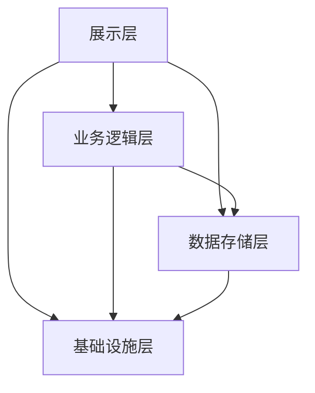

                 

### 跨团队知识共享的背景与重要性

在现代大型应用开发环境中，跨团队知识共享已成为提高团队协作效率、保证项目质量和降低成本的关键因素。随着软件开发项目的复杂度不断增加，团队成员之间的信息传递和知识交流变得尤为重要。

#### **1.1 问题背景**

大型应用开发项目通常涉及多个部门或团队，每个团队负责不同的功能模块或任务。这种分散化的工作方式导致知识分布不均，部分团队可能拥有关键知识，而其他团队则可能缺乏这些知识。知识分散使得团队之间的协作效率低下，沟通成本增加，容易产生知识孤岛和信息过载问题。

**知识孤岛**指的是在组织内部，不同团队或部门之间缺乏有效的知识共享机制，导致信息不畅、沟通困难的现象。这会使得团队成员难以获取到其他团队的关键知识，从而影响项目的整体进度和质量。

**信息过载**则是指团队成员在大量的信息中难以找到所需的信息，或者信息过于冗杂，导致处理效率低下。信息过载会使得团队成员在寻找和筛选信息上花费大量时间，从而降低了整体工作效率。

#### **1.2 问题描述**

跨团队知识共享的问题主要集中在以下几个方面：

1. **信息不畅**：团队成员之间的信息传递不畅，缺乏统一的交流平台，导致关键信息无法及时共享。
   
2. **知识分散**：知识分布在各个团队或部门，缺乏统一的知识管理机制，导致知识难以被充分利用。

3. **沟通成本高**：由于缺乏有效的沟通机制，团队成员需要通过多次会议或单独沟通来传递信息，沟通成本高。

4. **效率低下**：团队成员在寻找和筛选信息上花费大量时间，降低了整体工作效率。

#### **1.3 问题解决**

为了解决上述问题，跨团队知识共享显得尤为重要。通过建立有效的知识共享平台和机制，可以促进团队成员之间的信息传递和知识交流，提高协作效率。

**目标与原则**：

- **目标**：提高团队协作效率，降低沟通成本，实现知识最大化利用。

- **原则**：

  - **开放性**：知识共享平台应具备开放性，使得所有团队成员都能方便地访问和使用。

  - **共享性**：知识共享应注重共享，鼓励团队成员贡献和分享知识。

  - **多样性**：知识共享平台应支持多种形式的知识，如图文、文档、视频等。

  - **安全性**：保障知识的安全性，防止重要知识泄露。

**最佳实践**：

- **建立知识共享平台**：选择合适的知识共享工具，搭建一个方便团队成员访问和使用的平台。

- **明确知识共享流程**：制定知识共享的流程和规范，确保知识共享的顺利进行。

- **培训与激励**：对团队成员进行知识共享的培训和激励，提高他们的知识共享意识和能力。

- **持续优化**：根据实际应用情况，不断优化知识共享平台和机制，提高其效果。

#### **1.4 边界与外延**

跨团队知识共享的范围不仅限于技术知识，还包括项目管理、业务知识、客户需求等各个方面。知识共享不仅仅是在团队内部进行，还可以扩展到与其他部门或外部合作伙伴之间的知识交流。

- **内部知识共享**：主要指团队内部的知识传递和共享，包括技术文档、代码库、经验总结等。

- **外部知识共享**：与外部合作伙伴或客户之间的知识交流，如需求调研、市场分析等。

#### **1.5 概念结构与核心要素组成**

跨团队知识共享涉及多个核心概念，包括知识管理、知识共享、协同工作等。以下是一个简要的ER实体关系图，展示了这些核心概念之间的关系：

```mermaid
erDiagram
  KnowledgeManagement ||--|{ KnowledgeSharing } : implemented_by
  KnowledgeSharing ||--|{ CollaborativeWork } : enabled_by
  KnowledgeSharing ||--|{ KnowledgeManagement } : supported_by
```

- **知识管理**（KnowledgeManagement）：负责对知识进行收集、整理、存储和利用，为知识共享提供支持。

- **知识共享**（KnowledgeSharing）：实现知识的传递和共享，促进团队成员之间的协作。

- **协同工作**（CollaborativeWork）：基于知识共享，实现团队成员的高效合作和任务协同。

这些核心概念共同构成了跨团队知识共享的概念结构与核心要素组成，为后续章节的详细讨论提供了基础。

### **第2章：跨团队知识共享的核心概念与联系**

#### **2.1 核心概念**

跨团队知识共享涉及多个核心概念，每个概念在知识共享过程中扮演着不同的角色。以下是这些核心概念的定义与联系：

- **知识管理**（Knowledge Management）：知识管理是一种系统化的过程，旨在通过识别、获取、创造、存储、共享和利用知识来提升组织的效率和竞争力。知识管理不仅关注技术手段，还涉及组织文化、流程设计和管理策略。

- **知识共享**（Knowledge Sharing）：知识共享是指个体或团队通过交流和合作将知识传递给他人的过程。它包括知识的生产、传递和应用，是知识管理和协同工作的关键环节。

- **协同工作**（Collaborative Work）：协同工作是指团队成员通过共享知识和资源，共同完成任务的过程。协同工作强调团队之间的互动和协作，以提高工作效率和质量。

- **信息传递**（Information Transmission）：信息传递是知识共享的基础，涉及信息的收集、处理、传输和反馈。有效的信息传递是确保知识共享顺利进行的关键。

- **团队协作**（Team Collaboration）：团队协作是指团队成员为了共同目标而进行的有目的的互动和合作。团队协作是知识共享的必要条件，有助于增强团队成员之间的信任和默契。

- **知识库**（Knowledge Base）：知识库是一个存储和管理知识的系统，用于支持知识共享和协同工作。知识库可以包含各种形式的知识，如图文、文档、视频、音频等。

#### **2.2 概念属性特征对比表格**

以下是一个对比表格，展示了上述核心概念的属性特征：

| 概念       | 定义                                                         | 属性特征                                                                                           |
|------------|--------------------------------------------------------------|--------------------------------------------------------------------------------------------------|
| 知识管理   | 系统化过程，旨在提升组织效率和竞争力                           | - 目标：知识获取、共享、利用<br>- 方法：流程设计、技术支持、组织文化                                     |
| 知识共享   | 知识传递和共享过程                                       | - 方式：交流、合作<br>- 目标：提高工作效率和质量                                                   |
| 协同工作   | 团队成员共同完成任务的过程                                 | - 形式：互动、合作<br>- 目标：增强团队凝聚力、提升工作效率                                           |
| 信息传递   | 信息收集、处理、传输和反馈过程                             | - 方式：沟通、传递<br>- 目标：确保知识共享顺利进行                                                   |
| 团队协作   | 有目的的互动和合作                                       | - 形式：互动、合作<br>- 目标：共同目标实现、团队凝聚力增强                                             |
| 知识库     | 存储和管理知识的系统                                     | - 内容：图文、文档、视频、音频等<br>- 目标：支持知识共享和协同工作                                       |

#### **2.3 ER实体关系图架构**

为了更好地理解这些核心概念之间的关系，我们可以使用ER（实体关系）图来展示。以下是跨团队知识共享的ER实体关系图：

```mermaid
erDiagram
  Class1 ||--|{ Class2 } : "has_a"
  Class1 ||--|{ Class3 } : "is_a"
  Class2 ||--|{ Class4 } : "is_related_to"
  Class3 ||--|{ Class5 } : "part_of"
  Class4 ||--|{ Class6 } : "includes"
  Class5 ||--|{ Class7 } : "uses"
```

- **知识管理**（Class1）是知识共享（Class2）、协同工作（Class3）的基础，同时也是其他概念的核心。

- **知识共享**（Class2）是知识管理的一种实现方式，它依赖于信息传递（Class4）和团队协作（Class6）。

- **协同工作**（Class3）是实现知识共享（Class2）的手段，它依赖于知识库（Class7）的支持。

- **信息传递**（Class4）和团队协作（Class6）是知识共享（Class2）的必要条件。

- **知识库**（Class7）是知识共享（Class2）和协同工作（Class3）的重要资源。

通过这个ER实体关系图，我们可以清晰地看到跨团队知识共享中的核心概念及其相互关系，为后续章节的深入讨论提供了基础。

### **第3章：知识共享平台的设计与实现**

#### **3.1 知识共享平台的概念**

知识共享平台是一个集知识收集、存储、共享、利用于一体的系统，旨在为团队成员提供便捷的知识获取和交流环境。知识共享平台不仅是知识管理的工具，更是团队协作的重要支撑。

知识共享平台的核心功能包括：

1. **知识收集**：通过多种方式收集团队成员的知识，如图文、文档、视频、音频等，确保知识的多样性和全面性。

2. **知识存储**：建立高效的知识存储系统，保证知识的安全性和可访问性。

3. **知识共享**：提供便捷的知识共享机制，如文档共享、协作编辑、问答社区等，促进团队成员之间的知识交流。

4. **知识利用**：通过检索、推荐和数据分析等技术手段，帮助团队成员快速获取所需的知识，提高工作效率。

#### **3.2 知识共享平台的架构设计**

知识共享平台的架构设计是确保其功能实现和性能优化的重要环节。一个典型的知识共享平台架构包括以下几个层次：

1. **展示层**：负责用户界面和交互体验的设计，提供友好易用的操作界面，方便团队成员进行知识操作。

2. **业务逻辑层**：处理知识共享的核心业务逻辑，包括知识收集、存储、共享和利用等功能。这一层通常使用微服务架构来实现，以确保系统的灵活性和可扩展性。

3. **数据存储层**：负责存储和管理知识数据，包括知识库、用户数据、日志数据等。数据存储层可以选择关系数据库、NoSQL数据库、文件存储等方式，根据具体需求进行选择。

4. **基础设施层**：提供知识共享平台运行所需的基础设施支持，如服务器、网络、存储、安全等。基础设施层需要确保平台的稳定运行和安全性。

以下是知识共享平台的架构设计：



**技术选型**：

1. **前端技术**：使用React或Vue.js等现代前端框架，提供丰富的交互体验。

2. **后端技术**：选择Spring Boot等微服务框架，实现业务逻辑层的功能。

3. **数据库技术**：结合关系数据库（如MySQL）和NoSQL数据库（如MongoDB），满足不同类型数据存储需求。

4. **消息队列**：使用Kafka等消息队列技术，实现异步消息传递，提高系统的性能和稳定性。

5. **缓存技术**：使用Redis等缓存技术，提高数据访问速度和系统性能。

#### **3.3 知识共享平台的功能模块**

知识共享平台的功能模块是实现其核心功能的关键，以下是几个主要的功能模块：

1. **内容管理模块**：负责知识的收集、存储、检索和管理。内容管理模块应支持多种文件格式，如图文、文档、视频、音频等，并提供便捷的上传、下载和预览功能。

2. **用户管理模块**：负责用户注册、登录、权限管理和用户信息管理。用户管理模块应确保用户信息的保密性和安全性，并提供用户角色和权限设置。

3. **知识共享模块**：提供知识共享的多种方式，如文档共享、协作编辑、问答社区等。协作编辑功能可以使用WebRTC等技术实现实时协作。

4. **权限控制模块**：负责对知识资源的访问权限控制，确保知识的保密性和安全性。权限控制模块应根据用户的角色和权限，设置不同的访问权限。

5. **数据分析模块**：通过对知识数据的分析，发现知识共享的热点、趋势和问题，为平台的优化提供数据支持。

6. **通知和提醒模块**：通过邮件、短信、消息推送等方式，通知用户有关知识共享的通知和提醒，提高知识共享的效率和效果。

#### **3.4 知识共享平台的设计实现步骤**

知识共享平台的设计与实现可以按照以下步骤进行：

1. **需求分析**：明确知识共享平台的需求，包括功能需求、性能需求、安全需求等。

2. **架构设计**：根据需求分析结果，设计知识共享平台的整体架构，包括展示层、业务逻辑层、数据存储层和基础设施层。

3. **功能开发**：根据架构设计，逐步开发各个功能模块，如内容管理模块、用户管理模块、知识共享模块等。

4. **系统集成**：将各个功能模块进行集成，确保平台的整体功能实现和性能优化。

5. **测试与部署**：对知识共享平台进行全面的测试，包括功能测试、性能测试和安全测试，确保平台的稳定运行。

6. **上线与运维**：将知识共享平台部署到生产环境，并进行日常运维，确保平台的持续稳定运行。

7. **持续优化**：根据用户反馈和平台运行情况，持续优化平台的性能和用户体验。

通过上述步骤，可以设计和实现一个高效、稳定、安全的知识共享平台，为团队成员提供便捷的知识共享和交流环境，促进跨团队协作和项目成功。

### **第4章：知识共享工具的选择与应用**

#### **4.1 知识共享工具的类型**

知识共享工具是支持跨团队知识共享的关键，不同类型的知识共享工具适用于不同的场景和需求。以下是几种常见的知识共享工具类型及其特点：

1. **文档共享工具**：文档共享工具如Google Docs、Microsoft Office 365等，提供在线协作编辑功能，团队成员可以实时修改和评论文档，提高工作效率。

2. **知识库工具**：知识库工具如Confluence、Wiki等，用于存储和管理知识文档，支持分类、标签、搜索等功能，方便团队成员快速查找和获取所需知识。

3. **协作编辑工具**：协作编辑工具如Notepad++、Visual Studio Code等，支持多人实时协作编写代码或文档，提高团队开发效率。

4. **问答社区工具**：问答社区工具如Stack Overflow、GitHub Issue等，提供问答和讨论平台，团队成员可以提问、回答问题，分享经验和解决难题。

5. **视频会议工具**：视频会议工具如Zoom、Microsoft Teams等，支持实时语音、视频通信和屏幕共享，用于远程团队之间的沟通和协作。

6. **项目管理工具**：项目管理工具如JIRA、Trello等，用于任务分配、进度跟踪和团队协作，帮助团队成员更好地管理项目。

7. **邮件和即时通讯工具**：邮件和即时通讯工具如Outlook、Slack等，提供实时消息传递和文件传输功能，方便团队成员之间的沟通和协作。

#### **4.2 知识共享工具的选择标准**

选择合适的知识共享工具对于提高团队协作效率和知识共享效果至关重要。以下是一些选择标准：

1. **适用性**：工具是否适用于团队的工作流程和需求，是否能够满足团队成员的使用习惯。

2. **易用性**：工具的界面设计是否直观、易用，是否能够快速上手和使用。

3. **安全性**：工具的数据存储和传输是否安全，是否提供权限控制和数据加密等功能。

4. **扩展性**：工具是否支持扩展和定制，是否能够根据团队需求进行功能扩展。

5. **性能和稳定性**：工具的性能是否稳定，是否能够处理大量用户和数据的并发访问。

6. **成本**：工具的费用是否合理，是否在预算范围内。

7. **用户评价**：工具的用户评价和口碑如何，是否有大量的用户案例和成功实践。

#### **4.3 知识共享工具的应用案例**

以下是几个知识共享工具的应用案例，展示了它们在实际工作中的应用场景和效果：

1. **Google Docs**：某互联网公司使用Google Docs进行文档协作，团队成员可以实时编辑和评论文档，提高了文档的编辑效率和准确性。

2. **Confluence**：某软件公司使用Confluence建立内部知识库，方便团队成员快速查找和获取公司内部知识，提高了团队协作效率和知识利用率。

3. **Visual Studio Code**：某开发团队使用Visual Studio Code进行代码协作，多人可以实时编辑和评论代码，提高了开发效率和代码质量。

4. **Stack Overflow**：某技术社区使用Stack Overflow作为问答社区，团队成员可以提问和回答技术问题，共享经验和解决难题。

5. **Zoom**：某远程办公团队使用Zoom进行视频会议，实时语音、视频通信和屏幕共享功能，提高了团队沟通和协作效率。

6. **JIRA**：某软件开发团队使用JIRA进行项目管理，任务分配、进度跟踪和团队协作功能，提高了项目管理和团队协作效率。

7. **Slack**：某公司使用Slack进行即时通讯，团队成员可以实时消息传递和文件传输，提高了团队沟通和协作效率。

通过这些应用案例，我们可以看到不同的知识共享工具在不同场景中的实际应用效果，为团队选择合适的知识共享工具提供了参考。

### **第5章：跨团队知识共享的激励机制**

#### **5.1 激励机制的设计原则**

跨团队知识共享的激励机制是促进团队成员积极参与知识共享、提高知识共享效果的重要手段。有效的激励机制应遵循以下设计原则：

1. **公平性**：激励机制应确保所有团队成员在知识共享过程中都能获得公平的待遇和机会，避免因为不公平导致的不满和抵触情绪。

2. **透明性**：激励机制的设计和实施过程应保持透明，使团队成员了解激励机制的规则和标准，增强其对激励机制的信任感和接受度。

3. **激励效果**：激励机制应能够有效地激发团队成员的知识共享积极性，提高知识共享的频率和质量，从而提升团队整体协作效率。

4. **适应性**：激励机制应根据团队的具体情况和外部环境的变化进行调整，以适应不同阶段的团队需求和目标。

5. **长期性**：激励机制不应仅仅关注短期效果，还应考虑长期激励，培养团队成员的持续知识共享意识和习惯。

6. **多样性**：激励机制应采用多种形式，如物质奖励、精神激励、晋升机会等，满足不同团队成员的多样化需求。

#### **5.2 激励机制的实施策略**

为了确保激励机制的有效实施，可以采取以下策略：

1. **制定明确的激励机制**：明确激励机制的规则和标准，包括激励对象、激励条件、激励形式和激励额度等，使团队成员对激励机制有清晰的了解。

2. **设置合理的激励条件**：根据团队的工作目标和实际情况，设定合理的激励条件，使团队成员通过努力能够实现激励目标。

3. **建立反馈机制**：建立激励效果的反馈机制，及时收集团队成员的反馈意见，对激励机制进行评估和调整，确保其适应性和有效性。

4. **组织培训与宣传**：对团队成员进行激励机制相关的培训，提高其对激励机制的理解和认同。同时，通过内部宣传和表彰，营造知识共享的良好氛围。

5. **结合绩效考核**：将知识共享情况纳入绩效考核指标，与团队成员的绩效奖金、晋升机会等挂钩，形成长效激励机制。

6. **注重长期激励**：通过职业发展、晋升机会等长期激励手段，培养团队成员的持续知识共享意识和习惯。

#### **5.3 激励机制的评估与调整**

激励机制的评估与调整是确保其有效性和适应性的关键。以下是一些评估与调整的方法：

1. **定期评估**：定期对激励机制的效果进行评估，包括激励对象的满意度、知识共享的频率和质量等指标。

2. **收集反馈**：通过问卷调查、访谈等方式收集团队成员对激励机制的意见和建议，了解其存在的问题和改进方向。

3. **数据分析**：利用数据分析工具，对知识共享的数据进行分析，发现激励机制中的不足和改进点。

4. **调整激励机制**：根据评估结果和反馈意见，对激励机制进行调整，优化其内容和形式，提高其适应性和有效性。

5. **持续改进**：将激励机制的实施纳入团队管理的常规流程，持续跟踪和改进，确保其持续发挥积极作用。

通过以上评估与调整方法，可以确保跨团队知识共享激励机制的有效性和适应性，促进团队协作和项目成功。

### **第6章：跨团队知识共享在软件开发中的应用**

#### **6.1 软件开发中的知识共享需求**

在软件开发过程中，知识共享的需求贯穿于项目的整个生命周期。不同阶段对知识共享的需求各有特点：

1. **需求分析阶段**：在需求分析阶段，团队成员需要共享业务需求、用户需求、市场分析等相关信息。通过知识共享，可以确保所有成员对项目需求有统一的理解，减少因信息不对称导致的误解和错误。

2. **设计阶段**：在软件设计阶段，知识共享的需求主要涉及系统架构、模块设计、接口定义等方面。设计文档、架构图、原型图等设计资源的共享，有助于团队成员之间的沟通和协作，确保设计的一致性和准确性。

3. **编码阶段**：在编码阶段，知识共享的需求包括代码规范、编程最佳实践、技术难点和解决方案等。通过知识共享，可以避免重复造轮子，提高开发效率，同时也有助于新成员快速融入团队。

4. **测试阶段**：在测试阶段，知识共享的需求主要集中在测试用例、测试报告、bug修复等方面。测试团队的测试结果和反馈需要与其他团队共享，以便及时解决问题，保证软件质量。

5. **部署和维护阶段**：在软件部署和维护阶段，知识共享的需求涉及部署流程、维护策略、故障排除等。通过知识共享，可以确保团队成员了解软件的运行状态和维护方法，提高系统的稳定性和可维护性。

#### **6.2 跨团队知识共享在软件开发中的实践**

在实际软件开发过程中，跨团队知识共享的实践包括以下几个方面：

1. **文档共享**：使用文档共享工具如Google Docs、Confluence等，建立项目文档库，团队成员可以随时查看和编辑文档，确保信息的一致性和更新。

2. **代码管理**：使用代码管理工具如Git、SVN等，实现代码的集中管理和版本控制。团队成员可以通过代码仓库查看代码变更历史、提交代码注释，提高代码的可追溯性和协作性。

3. **协作编辑**：在编码和设计阶段，使用协作编辑工具如Visual Studio Code、Google Docs等，实现多人实时协作。团队成员可以同时编辑同一份文档或代码，实时看到其他人的修改和评论。

4. **问答社区**：建立内部问答社区，如内部论坛、GitHub Issue等，团队成员可以提问和回答技术问题，分享经验和解决难题。

5. **视频会议**：使用视频会议工具如Zoom、Microsoft Teams等，召开在线会议，实时讨论项目进展、解决方案和问题，提高团队沟通和协作效率。

6. **项目管理工具**：使用项目管理工具如JIRA、Trello等，实现任务分配、进度跟踪和团队协作。项目经理可以随时查看项目进度、成员任务完成情况，确保项目按时交付。

#### **6.3 软件开发中知识共享的挑战与解决方案**

在软件开发过程中，跨团队知识共享面临着一些挑战，以下是一些常见的挑战及其解决方案：

1. **信息过载**：团队成员在大量的信息中难以找到所需的信息，导致工作效率降低。解决方案：通过知识分类、标签、搜索等功能，提高知识检索效率。

2. **知识孤岛**：知识分布在各个团队或部门，缺乏统一的知识共享平台，导致信息不畅。解决方案：建立统一的知识共享平台，提供便捷的知识获取和交流环境。

3. **沟通成本高**：团队成员需要通过多次会议或单独沟通来传递信息，导致沟通成本高。解决方案：利用协作工具和自动化流程，减少沟通环节，提高沟通效率。

4. **知识更新不及时**：知识文档和资料更新不及时，导致信息过时和错误。解决方案：建立自动化的知识更新机制，确保知识文档的及时更新。

5. **权限控制不足**：知识共享过程中，权限控制不足可能导致重要知识泄露。解决方案：加强权限控制，确保知识资源的保密性和安全性。

通过以上实践和解决方案，可以有效应对软件开发中跨团队知识共享的挑战，提高团队协作效率，确保项目成功。

### **第7章：跨团队知识共享在项目管理中的应用**

#### **7.1 项目管理中的知识共享需求**

在项目管理过程中，跨团队知识共享的需求尤为重要。知识共享能够提高项目的透明度、协作效率和决策质量，以下是项目管理中的主要知识共享需求：

1. **项目目标与需求**：在项目启动阶段，项目目标、需求和预期成果的共享至关重要。通过知识共享，项目团队成员可以明确项目方向，确保团队成员对项目有统一的认知。

2. **项目计划与进度**：项目计划的制定和进度的跟踪需要团队成员之间的密切合作。通过知识共享，项目管理者可以及时更新项目计划、任务分配和进度信息，确保团队成员了解项目进展。

3. **风险评估与应对策略**：项目风险管理需要团队成员共享风险信息、识别潜在问题和制定应对策略。通过知识共享，项目团队可以更好地预见和应对项目中的风险。

4. **资源分配与协调**：项目资源（如人力、物资、资金等）的合理分配和协调需要团队成员的共同努力。通过知识共享，项目管理者可以更好地了解团队资源状况，确保资源的高效利用。

5. **沟通与协作**：项目沟通和协作是确保项目顺利进行的关键。通过知识共享，团队成员可以了解项目的最新动态、交流意见和建议，提高项目协作效率。

6. **项目评估与总结**：项目完成后，对项目进行评估和总结，分享项目经验教训，有助于团队积累知识，为未来的项目提供参考。

#### **7.2 跨团队知识共享在项目管理中的实践**

在项目管理中，跨团队知识共享的实际应用包括以下几个方面：

1. **项目文档管理**：使用文档管理工具（如Confluence、SharePoint）建立项目文档库，项目成员可以查看、编辑和共享项目计划、需求文档、设计文档等。

2. **任务协作平台**：使用任务协作平台（如JIRA、Trello）进行任务分配、进度跟踪和协作。项目经理可以实时查看任务进展，团队成员可以协作完成任务。

3. **沟通与会议**：使用视频会议工具（如Zoom、Microsoft Teams）召开在线会议，项目团队成员可以实时讨论项目问题、交流意见和建议。

4. **知识库建设**：建立项目知识库，收集和整理项目过程中的经验、教训、最佳实践和工具，为团队成员提供知识支持。

5. **项目报告与总结**：定期生成项目报告，总结项目执行情况、问题及改进措施。项目报告可以包含项目进展、风险评估、资源使用等详细信息，为团队提供参考。

6. **实时信息共享**：使用即时通讯工具（如Slack、钉钉）进行实时信息共享，团队成员可以快速交流项目相关问题和信息。

#### **7.3 项目管理中知识共享的挑战与解决方案**

在项目管理中，跨团队知识共享面临着一些挑战，以下是一些常见的挑战及其解决方案：

1. **信息不对称**：团队成员之间缺乏有效的沟通和共享，导致信息不对称。解决方案：建立透明的知识共享平台，确保项目信息的一致性和可访问性。

2. **知识孤岛**：知识分散在各个团队或部门，缺乏统一的知识管理机制。解决方案：建立统一的知识共享平台，集成各团队的知识资源，实现知识共享。

3. **沟通成本高**：团队成员需要通过多次会议或单独沟通来传递信息，导致沟通成本高。解决方案：采用协作工具和自动化流程，减少沟通环节，提高沟通效率。

4. **知识更新不及时**：知识文档和资料更新不及时，导致信息过时和错误。解决方案：建立自动化的知识更新机制，确保知识文档的及时更新。

5. **权限控制不足**：知识共享过程中，权限控制不足可能导致重要知识泄露。解决方案：加强权限控制，确保知识资源的保密性和安全性。

通过以上实践和解决方案，可以有效应对项目管理中跨团队知识共享的挑战，提高项目管理的效率和效果，确保项目成功。

### **第8章：跨团队知识共享的最佳实践**

#### **8.1 成功案例分析**

在跨团队知识共享的实践中，有许多成功的案例可以借鉴。以下是一个具体的项目案例分析：

**项目背景**：某大型互联网公司正在开发一款全新的在线购物平台，项目涉及多个团队，包括前端开发、后端开发、测试、UI设计、项目管理等。项目团队成员分布在全球不同地区，沟通和协作的难度较大。

**问题与挑战**：由于团队成员分布广泛，项目面临信息不对称、沟通成本高、知识孤岛等问题，严重影响了项目的进展和效率。

**解决方案**：

1. **建立统一的知识共享平台**：公司选择Confluence作为知识共享平台，用于存储和管理项目文档、设计稿、技术文档等。所有团队成员都可以访问和编辑平台上的内容。

2. **定期召开在线会议**：项目经理定期使用Zoom组织在线会议，讨论项目进展、问题解决和决策。会议记录和重要文件会同步更新到知识共享平台上，确保团队成员随时查看。

3. **采用敏捷开发方法**：项目团队采用敏捷开发方法，使用JIRA进行任务管理，确保任务分配和进度跟踪。团队成员可以实时查看任务状态，及时调整工作计划。

4. **建立内部问答社区**：在内部问答社区（如内部论坛）上，团队成员可以提问和回答技术问题，共享经验和解决难题。问答社区成为团队成员之间的知识共享平台。

**效果**：

1. **提高沟通效率**：通过统一的知识共享平台和在线会议，团队成员之间的沟通变得更加顺畅，信息传递速度加快，沟通成本大幅降低。

2. **减少知识孤岛**：知识共享平台和内部问答社区的使用，使得知识得以更好地传递和共享，知识孤岛问题得到有效缓解。

3. **提升团队协作效率**：任务管理和敏捷开发方法的实施，使得项目进度更加透明，团队成员之间的协作更加紧密，项目效率显著提高。

**小结**：通过这个成功案例，我们可以看到跨团队知识共享在项目管理中的应用效果显著。有效的知识共享平台和协作工具，可以帮助团队克服沟通和协作的障碍，提高项目管理的效率和质量。

#### **8.2 小结与建议**

跨团队知识共享的最佳实践包括以下几个方面：

1. **选择合适的知识共享工具**：根据团队的具体需求和场景，选择合适的知识共享工具，如文档管理工具、任务协作平台、视频会议工具等。

2. **建立透明的知识共享平台**：建立统一的知识共享平台，确保项目信息的一致性和可访问性，减少信息不对称。

3. **定期召开在线会议**：定期召开在线会议，讨论项目进展、问题解决和决策，确保团队成员之间的沟通和协作。

4. **采用敏捷开发方法**：采用敏捷开发方法，如Scrum或Kanban，确保项目进度透明，团队成员之间的协作高效。

5. **建立内部问答社区**：建立内部问答社区，鼓励团队成员提问和回答技术问题，共享经验和解决难题。

6. **加强培训与宣传**：对团队成员进行知识共享的培训，提高其对知识共享工具和平台的使用能力。同时，通过内部宣传，营造知识共享的良好氛围。

通过以上最佳实践，可以有效提高跨团队知识共享的效果，促进团队协作和项目成功。

### **第9章：跨团队知识共享的未来发展趋势**

#### **9.1 技术发展趋势**

随着技术的不断进步，跨团队知识共享也在不断演进。以下是几个关键的技术发展趋势：

1. **人工智能与大数据**：人工智能和大数据技术的应用，使得知识共享更加智能化和个性化。通过大数据分析，可以了解团队成员的知识需求和使用习惯，从而提供更加精准的知识推荐和服务。

2. **区块链技术**：区块链技术的引入，可以增强知识共享系统的安全性和可信度。通过区块链，知识共享过程可以记录在不可篡改的分布式账本上，确保知识的完整性和可信度。

3. **云计算与边缘计算**：云计算和边缘计算的发展，为知识共享平台提供了强大的计算和存储能力。通过云计算，知识共享平台可以实现全球范围内的无缝访问和协作。边缘计算则可以在数据产生的地方进行处理，降低延迟，提高用户体验。

4. **虚拟现实（VR）与增强现实（AR）**：VR和AR技术的应用，可以为知识共享带来更加沉浸式的体验。通过VR/AR，团队成员可以在线上模拟真实的工作环境，进行虚拟协作和知识共享。

#### **9.2 应用前景展望**

跨团队知识共享在未来的应用前景广阔，以下是几个可能的场景：

1. **远程办公与分布式团队**：随着远程办公的普及，跨团队知识共享将成为分布式团队的必备工具。通过知识共享平台，团队成员可以随时随地访问和共享知识，提高协作效率。

2. **敏捷开发与DevOps**：敏捷开发和DevOps的推广，使得项目开发更加注重团队合作和知识共享。跨团队知识共享平台将有助于实现敏捷开发和DevOps的最佳实践，提高项目交付速度和质量。

3. **智能工厂与智能制造**：在智能工厂和智能制造领域，跨团队知识共享可以促进生产过程的知识传递和协作，提高生产效率和质量。通过知识共享平台，工程师、技术人员和操作人员可以共享技术文档、故障排除指南等知识。

4. **教育与培训**：跨团队知识共享平台可以应用于教育和培训领域，为学习者提供丰富的学习资源和知识分享机会。通过知识共享平台，教师和学生可以共享课程资料、学习心得和答疑解惑。

#### **9.3 面临的挑战与对策**

尽管跨团队知识共享具有巨大的潜力，但在实际应用过程中仍面临一些挑战：

1. **知识隐私与安全性**：知识共享过程中，如何保障知识的隐私和安全是一个重要问题。对策：采用区块链技术、数据加密和权限控制等措施，确保知识的安全性和可信度。

2. **知识质量与准确性**：知识共享平台上的知识质量参差不齐，如何保证知识的准确性和可靠性是一个挑战。对策：建立严格的知识审核机制、引入用户评分和反馈机制，提高知识质量。

3. **用户参与度与接受度**：用户对知识共享工具和平台的接受度和参与度直接影响知识共享的效果。对策：通过培训、宣传和激励机制，提高用户的知识共享意识和参与度。

4. **知识管理复杂性**：知识管理是一个复杂的过程，涉及多个方面，如知识收集、存储、共享、利用等。对策：采用智能化的知识管理工具和平台，简化知识管理流程，提高管理效率。

通过应对上述挑战，跨团队知识共享将在未来发挥更大的作用，为各种应用场景提供有效的支持。

