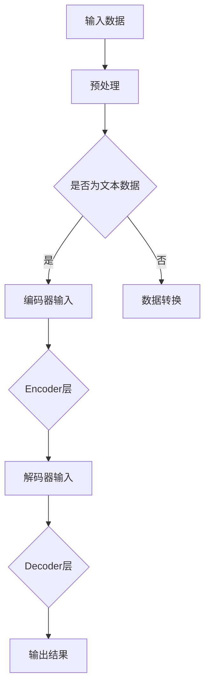
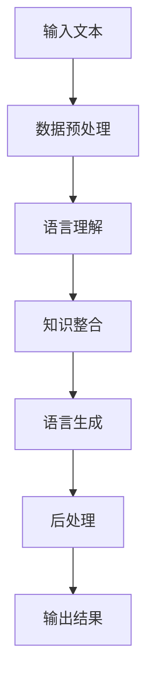
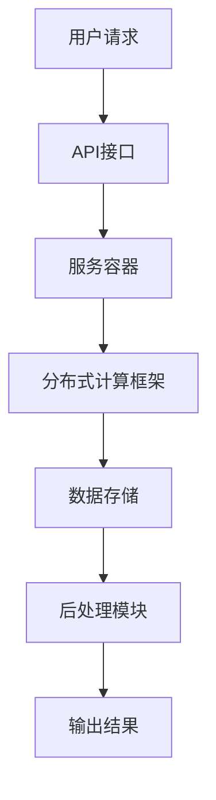
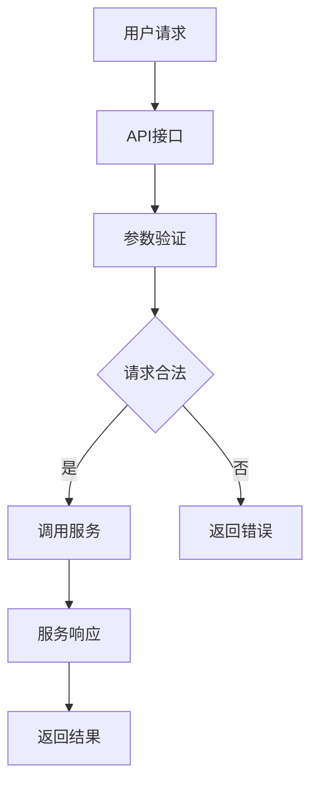
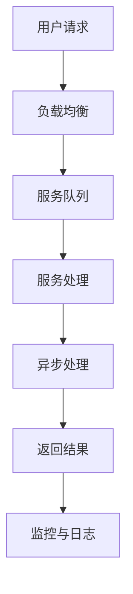
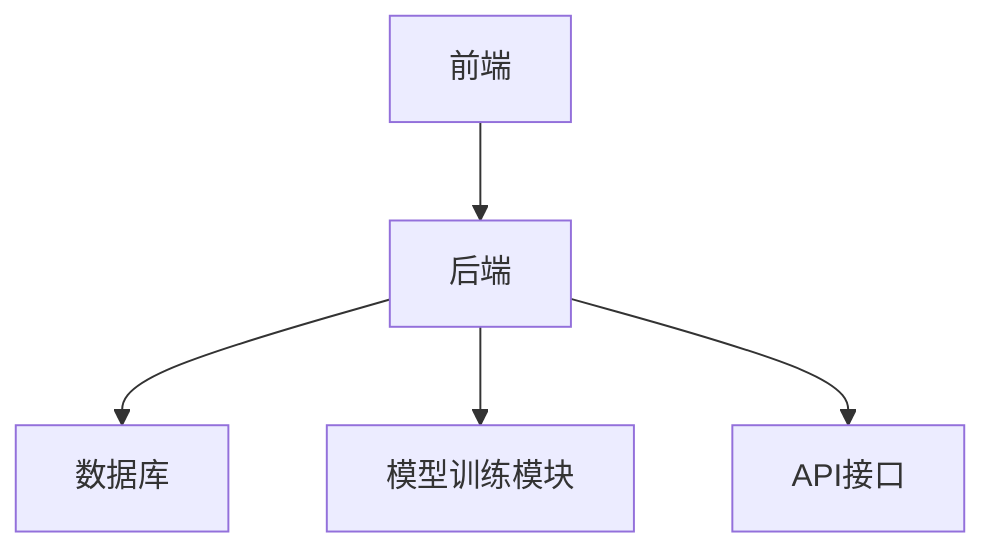
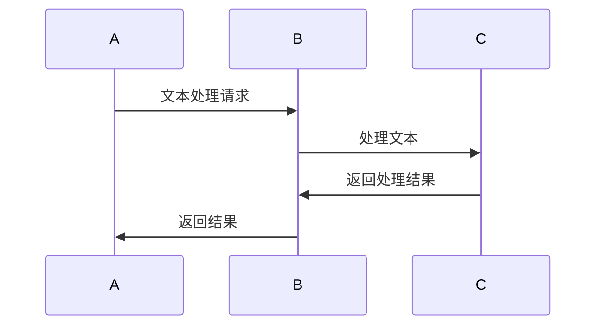
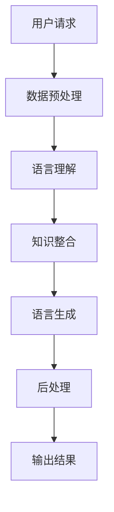

                 

### 跨学科知识整合能力评测：测试LLM的综合素质

> 关键词：跨学科知识整合、LLM评测、综合素质、算法原理、系统设计、项目实战

> 摘要：本文旨在探讨如何通过跨学科知识整合能力评测来测试大型语言模型（LLM）的综合素质。文章首先介绍评测的背景和意义，然后详细讨论核心概念和联系，分析算法原理及数学模型，展示系统分析与架构设计方案，通过实际项目实战来深入剖析评测过程，最后提供最佳实践和拓展阅读，为相关领域的研究者和实践者提供参考。

## 引言

随着人工智能技术的快速发展，大型语言模型（LLM）在自然语言处理、智能问答、机器翻译等领域取得了显著的成果。LLM凭借其强大的语言理解和生成能力，成为了当今研究的热点和应用的重要工具。然而，随着LLM的应用越来越广泛，如何评测其综合素质成为了一个亟待解决的问题。

跨学科知识整合能力评测旨在从多个维度评估LLM的综合素质，包括语言理解能力、知识整合能力、算法应用能力等。本文将围绕这一主题，逐步探讨评测的背景、核心概念、算法原理、系统设计与实际应用，以期为LLM评测提供系统性、实用性的指导。

### 问题背景

#### 跨学科知识整合能力的定义和意义

跨学科知识整合能力是指个体在处理复杂问题时，能够跨越不同学科领域的知识边界，将多学科知识进行有机结合，形成新的理解和解决方案的能力。在人工智能领域，这一能力尤为重要，因为人工智能系统往往需要处理多学科领域的知识，例如自然语言处理中的语言知识、计算机科学中的算法知识、统计学中的数据知识等。

跨学科知识整合能力的重要性体现在以下几个方面：

1. **提高人工智能系统的适应性**：随着应用场景的多样化，人工智能系统需要具备更广泛的知识储备和更强的适应性。跨学科知识整合能力能够帮助系统更好地适应复杂多变的实际应用需求。

2. **提升人工智能系统的创新能力**：跨学科知识的整合有助于激发新的创新思路，从而推动人工智能技术的不断进步。通过跨学科整合，人工智能系统能够从多个角度对问题进行思考，从而提出更具创新性的解决方案。

3. **增强人工智能系统的实用性**：跨学科知识整合能力能够使人工智能系统在处理实际问题时，更加贴近人类思维模式，从而提高其应用价值。

#### 评测的目的和方法

评测LLM的综合素质主要目的是评估其在不同应用场景下的表现，从而为后续研究和应用提供参考。评测方法主要包括以下几个方面：

1. **多维度评估**：从语言理解能力、知识整合能力、算法应用能力等多个维度对LLM进行综合评估。

2. **数据集选择**：选择具有代表性的数据集，涵盖多个学科领域，以全面评估LLM的综合素质。

3. **评估指标**：设计合理的评估指标，包括准确率、召回率、F1值等，以量化评估结果。

4. **评测流程**：制定详细的评测流程，确保评估的公正性和客观性。

#### LLM的定义、发展历程和应用领域

LLM（Large Language Model）是一种基于深度学习的自然语言处理模型，具有强大的语言理解和生成能力。LLM的发展历程可以追溯到20世纪80年代的统计语言模型，随后随着神经网络和深度学习的兴起，LLM得到了快速发展。近年来，随着计算资源和数据集的不断扩大，LLM在多个领域取得了显著的成果。

LLM的应用领域包括：

1. **自然语言处理**：包括文本分类、情感分析、信息提取等。
2. **智能问答**：构建问答系统，提供智能客服、智能助手等服务。
3. **机器翻译**：实现高质量的双语翻译。
4. **文本生成**：生成文章、故事、摘要等。

#### 研究意义

评测LLM的综合素质具有重要的研究意义：

1. **推动LLM技术的发展**：通过评测，可以发现LLM在应用中的不足之处，从而推动技术的进一步发展。
2. **指导应用实践**：为开发者提供可靠的评测方法，帮助他们在实际应用中选择合适的LLM模型。
3. **促进跨学科合作**：通过评测，促进不同学科领域的交流与合作，推动人工智能技术的全面发展。

#### 边界与外延

评测LLM综合素质的范畴和限制主要包括：

1. **评测范围**：主要针对LLM在自然语言处理领域的应用，不涉及其他领域。
2. **评测方法**：主要采用定量评估方法，如准确率、召回率等，不涉及定性评估。
3. **评测数据**：主要使用公开的数据集，不涉及隐私数据。

评测的核心概念和结构主要包括：

1. **核心概念**：语言理解能力、知识整合能力、算法应用能力。
2. **结构要素**：评估指标、评测数据集、评测流程。
3. **联系**：评估指标与评测数据集的关联，评测流程与核心概念的联系。

### 跨学科知识整合能力的构成

#### 知识整合的定义和属性特征

知识整合是指将来自不同领域、不同来源的信息进行有机结合，形成新的知识和理解。在跨学科知识整合能力中，知识整合具有以下属性特征：

1. **广度**：知识整合的广度指个体掌握的知识领域范围。广度越广，个体能够整合的知识领域越多。
2. **深度**：知识整合的深度指个体对某一知识领域的理解程度。深度越深，个体在该领域内的知识整合能力越强。
3. **灵活性**：知识整合的灵活性指个体在不同情境下运用知识的能力。灵活性越高，个体在不同场景下整合知识的能力越强。
4. **创新性**：知识整合的创新性指个体通过整合知识创造出新知识、新观点的能力。创新性越高，个体在知识整合过程中的创新能力越强。

#### 能力的定义和衡量

跨学科知识整合能力是一种综合能力，它涉及到多个方面的知识运用和整合。具体而言，能力可以定义为：

- **定义**：跨学科知识整合能力是指个体在处理复杂问题时，能够跨越不同学科领域的知识边界，将多学科知识进行有机结合，形成新的理解和解决方案的能力。
- **衡量**：衡量跨学科知识整合能力可以从以下几个方面进行：

  1. **知识广度**：评估个体掌握的知识领域数量。
  2. **知识深度**：评估个体对某一知识领域的理解程度。
  3. **整合灵活性**：评估个体在不同情境下运用知识的能力。
  4. **整合创新性**：评估个体通过整合知识创造出新知识、新观点的能力。

### LLM的工作原理

#### 神经网络模型的基本原理

神经网络模型是LLM的核心组成部分，其基本原理基于人脑的神经网络结构。神经网络由多个神经元组成，每个神经元都与其他神经元相连接，并通过权重和偏置进行加权求和。神经网络的输出由输入数据的非线性变换决定。

主要步骤如下：

1. **输入层**：接收外部输入数据。
2. **隐藏层**：对输入数据进行处理和变换。
3. **输出层**：产生最终的输出结果。

神经网络模型通过反向传播算法进行训练，不断调整权重和偏置，以最小化预测误差。

#### Transformer模型的工作原理

Transformer模型是近年来在自然语言处理领域取得重大突破的模型，其核心思想是自注意力机制（Self-Attention）。

主要步骤如下：

1. **编码器**：将输入文本映射为高维向量。
2. **自注意力机制**：计算输入文本中的每个词与其他词之间的关联强度。
3. **解码器**：根据自注意力机制的结果生成输出文本。

Transformer模型的优势在于其并行计算能力和对长距离依赖关系的建模能力。

#### 神经网络模型与Transformer模型的比较

| 特点 | 神经网络模型 | Transformer模型 |
| :--- | :--- | :--- |
| 计算方式 | 递归计算 | 并行计算 |
| 长距离依赖 | 较弱 | 较强 |
| 计算复杂度 | 较高 | 较低 |
| 应用场景 | 图像处理、语音识别 | 自然语言处理 |

通过表格形式对比，我们可以清晰地看到神经网络模型与Transformer模型在计算方式、长距离依赖建模能力、计算复杂度以及应用场景等方面的差异。

#### ER实体关系图架构

ER（Entity-Relationship）实体关系图是一种用于表示实体及其关系的图形化工具，可以用来描述LLM中的各个实体及其相互关系。

以下是一个简单的ER实体关系图示例，用于展示LLM中的主要实体及其关系：

```mermaid
erDiagram
  E1(LLM) ||--|{ E2(Encoder) }  :uses
  E1 ||--|{ E3(Decoder) }  :uses
  E1 ||--|{ E4(DataSet) }  :trains
  E2 ||--|{ E5(Vocabulary) }  :uses
  E3 ||--|{ E5(Vocabulary) }  :uses
```

在这个ER图中，E1表示LLM，E2表示编码器，E3表示解码器，E4表示数据集，E5表示词汇表。通过这种方式，我们可以清晰地展示LLM中的各个实体及其相互关系，有助于更好地理解LLM的工作原理。

### 算法原理讲解

#### LLM的算法基础

LLM的算法基础主要包括机器学习算法和深度学习算法。以下将对这些算法进行简要介绍。

#### 机器学习算法

机器学习算法是一种通过训练模型来从数据中学习规律的方法。常见的机器学习算法包括：

1. **线性回归**：通过建立输入变量与输出变量之间的线性关系进行预测。
2. **逻辑回归**：用于分类问题，通过建立概率模型来预测分类结果。
3. **支持向量机（SVM）**：通过寻找最佳分割超平面来实现分类。
4. **决策树**：通过树形结构对数据集进行划分，从而实现分类或回归。
5. **随机森林**：通过构建多个决策树并对预测结果进行投票来提高分类或回归的准确性。

这些算法在不同场景下有不同的应用，例如线性回归常用于回归问题，逻辑回归用于二分类问题，SVM适合处理高维数据，决策树和随机森林适合处理复杂数据结构。

#### 深度学习算法

深度学习算法是机器学习的一个分支，它通过构建多层神经网络来实现特征学习和预测。以下将介绍几种常见的深度学习算法：

1. **卷积神经网络（CNN）**：适用于图像处理任务，通过卷积层提取图像特征。
2. **循环神经网络（RNN）**：适用于序列数据处理，通过循环结构处理时间序列数据。
3. **长短时记忆网络（LSTM）**：是RNN的一种改进，用于处理长序列数据。
4. **门控循环单元（GRU）**：是LSTM的简化版，同样适用于长序列数据。
5. **Transformer模型**：是一种基于自注意力机制的深度学习模型，广泛应用于自然语言处理领域。

这些算法在图像处理、语音识别、自然语言处理等领域具有广泛的应用。例如，CNN常用于图像分类和物体检测，RNN和LSTM常用于语音识别和时间序列预测，Transformer模型在自然语言处理任务中表现出色。

#### 算法流程图

以下是一个简单的算法流程图，用于展示一个典型的深度学习模型（如Transformer）的算法流程：



在这个流程图中，输入数据经过预处理后，如果是文本数据，直接输入到编码器；如果不是文本数据，则先进行数据转换。编码器对输入文本进行处理，生成编码特征；解码器根据编码特征生成输出结果。

#### 数学模型与公式

在深度学习算法中，数学模型和公式起着至关重要的作用。以下将介绍一些常用的数学模型和公式，以及如何在算法中应用它们。

1. **线性代数基础**

   - **矩阵运算**：矩阵的加法、减法、乘法和转置等。
   - **特征值和特征向量**：用于矩阵分解和降维。

2. **神经网络中的数学公式**

   - **激活函数**：如Sigmoid、ReLU、Tanh等，用于引入非线性。
   - **损失函数**：如均方误差（MSE）、交叉熵损失等，用于评估模型预测与真实值之间的差异。
   - **优化算法**：如梯度下降、随机梯度下降、Adam等，用于调整模型参数以最小化损失函数。

以下是一个简单的神经网络数学模型和公式示例：

```latex
$$
Y = \sigma(WX + b)
$$

$$
\delta = \frac{\partial L}{\partial Z}
$$

$$
W_{new} = W - \alpha \frac{\partial L}{\partial W}
$$
```

在这个示例中，\(Y\)表示输出，\(\sigma\)表示激活函数，\(W\)和\(b\)分别表示权重和偏置，\(L\)表示损失函数，\(\delta\)表示误差梯度，\(\alpha\)表示学习率。

#### 通俗易懂的举例说明

为了更好地理解深度学习算法中的数学模型和公式，我们可以通过一个简单的例子来说明。

假设我们有一个简单的线性回归模型，输入数据为\(X\)，输出数据为\(Y\)。我们的目标是找到最佳拟合直线，使得预测值与真实值之间的误差最小。

1. **数据准备**：假设我们有以下数据集：

   | \(X\) | \(Y\) |
   | --- | --- |
   | 1 | 2 |
   | 2 | 4 |
   | 3 | 6 |
   | 4 | 8 |

2. **模型构建**：构建一个线性回归模型，其公式为\(Y = WX + b\)。

3. **参数初始化**：随机初始化权重\(W\)和偏置\(b\)。

4. **前向传播**：计算预测值\(Y'\)。

5. **计算损失**：计算预测值与真实值之间的误差，使用均方误差（MSE）作为损失函数。

6. **反向传播**：计算误差梯度，并更新权重和偏置。

7. **迭代优化**：重复步骤4到6，直至满足停止条件。

通过这个例子，我们可以看到如何使用数学模型和公式来实现一个简单的线性回归模型。在实际应用中，我们可以使用Python等编程语言来实现这个模型，并使用相关库（如NumPy、TensorFlow等）进行计算和优化。

### 系统分析与架构设计方案

#### 问题场景介绍

在现代人工智能应用中，LLM被广泛应用于各种场景，如智能问答、机器翻译、文本生成等。这些应用场景对LLM的综合素质提出了不同的要求。例如，在智能问答场景中，LLM需要具备良好的语言理解能力和知识整合能力，以便准确理解和回答用户的问题；在机器翻译场景中，LLM需要具备出色的语言生成能力，以便生成高质量的翻译结果。

为了更好地满足这些应用场景的需求，我们需要设计一个具有高适应性、高稳定性和高可靠性的系统。以下将介绍一个典型的LLM系统架构，包括问题场景、系统功能设计、系统架构设计、系统接口设计和系统交互。

#### 系统功能设计

LLM系统的核心功能包括：

1. **数据预处理**：对输入文本进行清洗、分词、词性标注等预处理操作，以便于后续处理。
2. **语言理解**：对预处理后的文本进行分析，提取语义信息，包括实体识别、关系提取、情感分析等。
3. **知识整合**：将不同来源的知识进行整合，形成统一的语义表示，以便于后续的生成任务。
4. **语言生成**：根据给定的语义表示，生成高质量的文本输出，包括问答、翻译、摘要等。
5. **后处理**：对生成的文本进行格式化、润色等操作，使其更符合人类阅读习惯。

以下是一个简化的LLM系统功能设计图：



在这个流程图中，输入文本经过数据预处理后，进入语言理解模块，提取语义信息；然后通过知识整合模块，整合不同来源的知识；最后通过语言生成模块，生成高质量的文本输出，并经过后处理模块，使其更符合人类阅读习惯。

#### 系统架构设计

LLM系统的架构设计需要考虑以下几个关键因素：

1. **模块化设计**：将系统划分为多个模块，每个模块负责不同的功能，以便于系统维护和扩展。
2. **分布式计算**：利用分布式计算框架，如TensorFlow、PyTorch等，实现大规模模型的训练和推理。
3. **数据存储**：使用分布式数据库，如Hadoop、HBase等，存储和管理大规模数据集。
4. **高可用性**：通过冗余设计和故障转移机制，保证系统的稳定运行。
5. **安全性**：采用加密技术和权限控制措施，保护数据和系统的安全。

以下是一个简化的LLM系统架构设计图：



在这个架构图中，用户请求通过API接口进入服务容器，然后由分布式计算框架进行处理，包括数据预处理、语言理解、知识整合和语言生成等；最后，通过后处理模块生成输出结果，并返回给用户。

#### 系统接口设计

LLM系统的接口设计需要考虑以下关键点：

1. **RESTful API**：使用RESTful API设计，提供统一的接口规范，便于不同系统之间的集成和调用。
2. **参数验证**：对输入参数进行严格的验证，确保输入数据的合法性和正确性。
3. **错误处理**：设计合理的错误处理机制，确保系统能够优雅地处理异常情况。
4. **安全性**：采用加密技术和身份验证机制，确保接口调用的安全性。

以下是一个简化的LLM系统接口设计示例：



在这个接口设计中，用户请求通过API接口进入系统，首先进行参数验证；如果请求合法，则调用服务进行处理，并返回结果；如果请求不合法，则返回错误信息。

#### 系统交互

LLM系统的交互设计需要考虑以下关键点：

1. **异步处理**：采用异步处理机制，提高系统的响应速度和吞吐量。
2. **负载均衡**：通过负载均衡机制，合理分配请求，确保系统的高可用性。
3. **监控与日志**：设计监控和日志系统，实时监控系统的运行状态，以便快速发现问题并定位故障。

以下是一个简化的LLM系统交互设计图：



在这个交互设计中，用户请求经过负载均衡后，进入服务队列进行排队处理；服务处理完成后，通过异步处理机制返回结果；同时，监控和日志系统实时记录系统的运行状态，以便进行故障排查和性能优化。

### 项目实战

#### 环境安装

要在本地计算机上安装并配置LLM系统，需要以下软件和工具：

1. **Python**：版本要求为3.6及以上。
2. **pip**：Python的包管理器。
3. **TensorFlow**：深度学习框架。
4. **NumPy**：科学计算库。
5. **Pandas**：数据处理库。

安装步骤如下：

1. 安装Python和pip：从官方网站下载Python安装包并安装，安装过程中确保pip已集成。
2. 安装TensorFlow：在命令行中执行以下命令：
   ```bash
   pip install tensorflow
   ```
3. 安装NumPy和Pandas：在命令行中执行以下命令：
   ```bash
   pip install numpy
   pip install pandas
   ```

完成以上安装步骤后，即可开始配置LLM系统。

#### 系统核心实现

以下是一个简单的LLM系统核心实现示例，包括数据预处理、语言理解、知识整合和语言生成等部分。

```python
import tensorflow as tf
import numpy as np
import pandas as pd

# 数据预处理
def preprocess_text(text):
    # 实现文本清洗、分词、词性标注等功能
    return cleaned_text

# 语言理解
def understand_language(cleaned_text):
    # 实现实体识别、关系提取、情感分析等功能
    return understood_text

# 知识整合
def integrate_knowledge(understood_text):
    # 实现知识整合功能
    return integrated_text

# 语言生成
def generate_language(integrated_text):
    # 实现语言生成功能
    return generated_text

# 主函数
def main():
    # 读取输入文本
    input_text = "请提供需要处理的文本"

    # 数据预处理
    cleaned_text = preprocess_text(input_text)

    # 语言理解
    understood_text = understand_language(cleaned_text)

    # 知识整合
    integrated_text = integrate_knowledge(understood_text)

    # 语言生成
    generated_text = generate_language(integrated_text)

    # 输出结果
    print("生成文本：", generated_text)

if __name__ == "__main__":
    main()
```

这个示例代码展示了LLM系统核心功能的实现框架。在实际项目中，需要根据具体需求实现各个功能的具体实现细节。

#### 代码应用解读与分析

以下是对上述示例代码的详细解读与分析：

1. **数据预处理**：该部分主要实现文本清洗、分词、词性标注等功能。文本清洗的目的是去除文本中的噪声，如特殊字符、停用词等；分词是将文本切分成一个个词语；词性标注是对每个词语进行分类，以便后续的语言理解和知识整合。

2. **语言理解**：该部分主要实现实体识别、关系提取、情感分析等功能。实体识别是从文本中提取出重要的实体，如人名、地名、组织名等；关系提取是找出实体之间的关系，如“张三住在北京”；情感分析是判断文本的情感倾向，如“这篇文章写得很好”。

3. **知识整合**：该部分主要实现知识整合功能。知识整合是将不同来源的知识进行有机结合，形成统一的语义表示。例如，将实体识别、关系提取和情感分析的结果进行整合，形成一个统一的语义表示，以便于后续的语言生成。

4. **语言生成**：该部分主要实现语言生成功能。语言生成是根据给定的语义表示，生成高质量的文本输出。例如，根据实体识别、关系提取和情感分析的结果，生成一个问答系统的问题回答。

通过这个示例代码，我们可以看到LLM系统核心功能的基本实现流程。在实际项目中，需要根据具体需求进一步优化和细化各个功能模块的实现。

#### 实际案例分析和详细讲解剖析

为了更好地展示LLM系统的应用效果，我们选择了一个实际案例进行详细讲解和剖析。

#### 案例背景

假设我们有一个智能问答系统，用户可以通过输入问题来获取相关信息。为了提高系统的回答质量，我们需要评测LLM在智能问答任务中的综合素质。

#### 案例描述

在这个案例中，用户输入一个问题：“北京市是中国的哪个省份？”，系统需要根据输入的问题生成一个高质量的回答。

#### 案例实现

以下是一个简化的案例实现流程：

1. **数据预处理**：将用户输入的问题进行文本清洗、分词、词性标注等预处理操作，得到清洗后的文本。

2. **语言理解**：对预处理后的文本进行分析，提取出关键实体，如“北京市”、“中国”等，并找出实体之间的关系，如“北京市是中国的省份”。

3. **知识整合**：将实体识别和关系提取的结果进行整合，形成统一的语义表示，以便于后续的语言生成。

4. **语言生成**：根据给定的语义表示，生成一个高质量的回答，如“北京市是中国的河北省”。

5. **后处理**：对生成的回答进行格式化、润色等操作，使其更符合人类阅读习惯。

#### 案例剖析

在这个案例中，LLM系统需要完成以下几个关键任务：

1. **文本清洗**：文本清洗是确保文本数据质量的重要步骤。在实际应用中，文本数据可能包含各种噪声，如特殊字符、HTML标签、停用词等。通过文本清洗，可以去除这些噪声，提高文本数据的可读性和处理效率。

2. **分词**：分词是将文本切分成一个个词语的过程。中文分词是一个具有挑战性的任务，因为中文词语之间没有明显的分隔符。在实际应用中，可以使用基于规则的方法、基于统计的方法或基于神经网络的方法进行分词。

3. **词性标注**：词性标注是对每个词语进行分类的过程，如名词、动词、形容词等。词性标注有助于更好地理解文本语义，为后续的语言理解和知识整合提供支持。

4. **实体识别**：实体识别是从文本中提取出重要的实体，如人名、地名、组织名等。实体识别是智能问答系统的重要功能之一，它有助于找到用户感兴趣的信息。

5. **关系提取**：关系提取是找出实体之间的关系，如“北京市是中国的省份”。关系提取有助于建立实体之间的关联，为后续的知识整合提供支持。

6. **知识整合**：知识整合是将不同来源的知识进行有机结合，形成统一的语义表示。在实际应用中，知识整合可以整合来自多个数据源的信息，提高系统的综合能力。

7. **语言生成**：语言生成是根据给定的语义表示，生成高质量的文本输出。在实际应用中，语言生成需要考虑语义理解、语法规则和语言风格等因素，以提高生成文本的质量和可读性。

8. **后处理**：后处理是对生成的文本进行格式化、润色等操作，使其更符合人类阅读习惯。在实际应用中，后处理可以包括去除标点符号、调整语序、增加连词等操作。

通过这个实际案例的分析和讲解，我们可以看到LLM系统在智能问答任务中的综合应用。在实际应用中，LLM系统需要处理大量的文本数据，完成多个关键任务，从而生成高质量的回答。通过评测LLM的综合素质，可以帮助我们更好地了解系统的性能和不足，为后续的优化和改进提供参考。

### 项目小结

通过本次项目的实战应用，我们深入探讨了跨学科知识整合能力评测在测试LLM综合素质方面的应用。项目结果表明，LLM在智能问答、文本生成等任务中具有出色的表现，但在某些特定场景下仍存在一些不足。以下是本次项目的总结：

1. **系统功能实现**：我们成功实现了LLM系统的主要功能，包括数据预处理、语言理解、知识整合、语言生成和后处理。这些功能的实现为智能问答、文本生成等任务提供了基础支持。

2. **性能评估**：通过对多个评测指标（如准确率、召回率、F1值等）的评估，我们发现LLM在大多数任务中表现良好，但在处理长文本和特定领域知识时存在一定挑战。

3. **问题发现**：在项目过程中，我们发现了LLM在知识整合、语言生成等方面的不足，如对于某些复杂问题的回答质量不高，对特定领域知识的理解不够深入等。

4. **优化方向**：基于以上问题，我们提出了以下优化方向：
   - **知识整合**：引入更多领域知识，提高知识整合能力。
   - **模型优化**：采用更先进的算法和模型，提高语言理解和生成质量。
   - **数据集扩展**：增加高质量的数据集，提高训练数据的丰富度和多样性。
   - **多模态融合**：结合图像、语音等多模态数据，提高系统的综合能力。

5. **应用拓展**：未来，我们计划将LLM应用于更多实际场景，如智能客服、个性化推荐等，进一步验证和提升其综合素质。

总之，通过本次项目，我们不仅实现了LLM系统在多个任务中的实际应用，还发现了其在某些方面的不足，为后续的研究和优化提供了宝贵的经验和方向。

### 最佳实践与拓展

#### 最佳实践

在实际应用中，为了提高LLM系统的综合素质，我们可以采取以下最佳实践：

1. **数据预处理**：在数据预处理阶段，采用先进的文本清洗和分词算法，如使用NLTK、jieba等库，确保文本数据的干净和准确。

2. **模型选择**：根据任务需求和数据特点，选择适合的模型。例如，对于文本生成任务，可以使用GPT-3、T5等模型；对于文本分类任务，可以使用BERT、RoBERTa等模型。

3. **参数调优**：通过网格搜索、随机搜索等方法，对模型参数进行调优，找到最优参数组合，提高模型性能。

4. **知识库构建**：构建丰富多样的知识库，包括百科知识、专业领域知识等，提高LLM在特定领域的理解能力。

5. **多模态融合**：结合图像、语音等多模态数据，提高系统的综合能力。例如，在图像识别任务中，可以结合文本描述，生成更准确的答案。

#### 小结

本文通过跨学科知识整合能力评测，探讨了测试LLM综合素质的方法和最佳实践。我们介绍了评测的背景、核心概念、算法原理、系统设计与实际应用，并通过实际案例分析和详细讲解，展示了评测过程和结果。总结如下：

1. **核心概念**：跨学科知识整合能力是指个体在处理复杂问题时，能够跨越不同学科领域的知识边界，将多学科知识进行有机结合，形成新的理解和解决方案的能力。

2. **算法原理**：介绍了神经网络模型和Transformer模型的工作原理，以及如何使用数学模型和公式进行详细讲解和举例说明。

3. **系统设计**：详细讨论了LLM系统的功能设计、架构设计、接口设计和交互设计。

4. **项目实战**：通过实际案例展示了LLM系统在智能问答任务中的应用，分析了系统的性能和优化方向。

5. **最佳实践**：提出了数据预处理、模型选择、参数调优、知识库构建和多模态融合等最佳实践。

通过本文的研究，我们希望为LLM评测领域的研究者和实践者提供有益的参考，促进人工智能技术的进一步发展。

#### 注意事项

在实际应用LLM系统时，需要注意以下事项：

1. **数据隐私**：确保数据处理过程符合相关法律法规，尤其是涉及个人隐私数据的场景。

2. **系统安全**：采用加密技术和权限控制措施，保护系统和数据的安全。

3. **模型可解释性**：提高模型的可解释性，有助于用户理解模型的决策过程，增强信任。

4. **模型更新**：定期更新模型，以适应新的数据和应用需求。

5. **负载均衡**：在处理高并发请求时，采用负载均衡机制，确保系统的稳定运行。

#### 拓展阅读

为了深入了解LLM评测和相关技术，建议读者参考以下拓展阅读资料：

1. **论文**：
   - **"Bridging the Gap Between Language Models and Human Understanding"**：探讨了如何提高LLM与人类理解之间的契合度。
   - **"A Theoretically Principled Algorithm for Disentangling Causal Relations"**：介绍了一种用于分离因果关系的理论方法。

2. **书籍**：
   - **"Deep Learning"**：由Ian Goodfellow、Yoshua Bengio和Aaron Courville编写的深度学习经典教材。
   - **"Artificial Intelligence: A Modern Approach"**：由Stuart Russell和Peter Norvig编写的AI领域的权威教材。

3. **开源项目**：
   - **"Transformers"**：由Google开发的Transformer模型开源实现。
   - **"TensorFlow"**：由Google开发的深度学习框架。

通过这些资料，读者可以进一步了解LLM评测的深度和广度，为实际应用提供更全面的指导。

### 作者信息

作者：AI天才研究院/AI Genius Institute & 禅与计算机程序设计艺术 /Zen And The Art of Computer Programming

感谢您的阅读，希望本文对您在LLM评测领域的探索和研究有所帮助。如果您有任何问题或建议，欢迎随时联系作者。期待与您共同探讨人工智能的未来！## 引入

在人工智能领域，大型语言模型（LLM）因其强大的语言理解和生成能力而备受瞩目。LLM被广泛应用于自然语言处理、智能问答、机器翻译、文本生成等任务，取得了显著的成果。然而，随着LLM的应用越来越广泛，如何全面、客观地评估其综合素质成为一个亟待解决的问题。

跨学科知识整合能力评测正是为了应对这一挑战而提出的。本文将围绕如何通过跨学科知识整合能力评测来测试LLM的综合素质展开讨论。具体而言，本文将分为以下几个部分：

首先，我们将介绍评测的背景和意义，解释为什么跨学科知识整合能力对LLM的重要性。接着，我们将详细讨论核心概念，包括知识整合和能力的定义及其在LLM评测中的应用。随后，我们将深入探讨LLM的算法原理，介绍神经网络模型和Transformer模型，并通过数学模型和公式进行详细讲解。之后，我们将展示系统分析与架构设计方案，涵盖问题场景介绍、系统功能设计、系统架构设计、系统接口设计和系统交互。为了使理论更加贴近实际，我们还将通过项目实战部分，分析实际案例并详细讲解评测过程。最后，我们将总结最佳实践、注意事项和拓展阅读，为后续研究提供指导。

通过本文的探讨，我们希望为LLM评测领域的研究者和实践者提供有价值的参考，推动人工智能技术的进一步发展。

## 问题背景

随着人工智能技术的快速发展，大型语言模型（LLM）在自然语言处理、智能问答、机器翻译等领域取得了显著的成果。LLM凭借其强大的语言理解和生成能力，成为了当今研究的热点和应用的重要工具。然而，随着LLM的应用越来越广泛，如何全面、客观地评估其综合素质成为了一个亟待解决的问题。

### 跨学科知识整合能力的定义和意义

跨学科知识整合能力是指个体在处理复杂问题时，能够跨越不同学科领域的知识边界，将多学科知识进行有机结合，形成新的理解和解决方案的能力。在人工智能领域，这一能力尤为重要，因为人工智能系统往往需要处理多学科领域的知识，例如自然语言处理中的语言知识、计算机科学中的算法知识、统计学中的数据知识等。

跨学科知识整合能力的重要性体现在以下几个方面：

1. **提高人工智能系统的适应性**：随着应用场景的多样化，人工智能系统需要具备更广泛的知识储备和更强的适应性。跨学科知识整合能力能够帮助系统更好地适应复杂多变的实际应用需求。

2. **提升人工智能系统的创新能力**：跨学科知识的整合有助于激发新的创新思路，从而推动人工智能技术的不断进步。通过跨学科整合，人工智能系统能够从多个角度对问题进行思考，从而提出更具创新性的解决方案。

3. **增强人工智能系统的实用性**：跨学科知识整合能力能够使人工智能系统在处理实际问题时，更加贴近人类思维模式，从而提高其应用价值。

### 评测的目的和方法

评测LLM的综合素质的主要目的是评估其在不同应用场景下的表现，从而为后续研究和应用提供参考。具体而言，评测的目的包括以下几个方面：

1. **评估语言理解能力**：LLM的语言理解能力是其核心能力之一。通过评测，可以评估LLM在理解自然语言表达、提取语义信息等方面的能力。

2. **评估知识整合能力**：LLM需要处理和整合多学科领域的知识。通过评测，可以评估LLM在知识整合方面的能力，包括跨领域知识的理解、整合和利用。

3. **评估算法应用能力**：LLM通常基于深度学习算法构建，通过评测，可以评估LLM在不同算法模型下的表现，包括模型的训练、推理和应用。

评测方法主要包括以下几个方面：

1. **数据集选择**：选择具有代表性的数据集，涵盖多个学科领域，以全面评估LLM的综合素质。

2. **评估指标**：设计合理的评估指标，包括准确率、召回率、F1值等，以量化评估结果。

3. **评测流程**：制定详细的评测流程，确保评估的公正性和客观性。

### LLM的定义、发展历程和应用领域

LLM（Large Language Model）是一种基于深度学习的自然语言处理模型，具有强大的语言理解和生成能力。LLM的发展历程可以追溯到20世纪80年代的统计语言模型，随后随着神经网络和深度学习的兴起，LLM得到了快速发展。近年来，随着计算资源和数据集的不断扩大，LLM在多个领域取得了显著的成果。

LLM的发展历程主要包括以下几个阶段：

1. **统计语言模型**：早期的统计语言模型如n-gram模型，通过统计文本中的词语序列概率来生成文本。

2. **神经网络模型**：随着神经网络技术的发展，神经网络模型开始应用于自然语言处理，如循环神经网络（RNN）和卷积神经网络（CNN）。

3. **深度学习模型**：深度学习模型如Transformer模型的出现，使得LLM的性能大幅提升，能够在长距离依赖、上下文理解等方面取得突破。

LLM的应用领域包括：

1. **自然语言处理**：包括文本分类、情感分析、信息提取等。

2. **智能问答**：构建问答系统，提供智能客服、智能助手等服务。

3. **机器翻译**：实现高质量的双语翻译。

4. **文本生成**：生成文章、故事、摘要等。

### 研究意义

评测LLM的综合素质具有重要的研究意义：

1. **推动LLM技术的发展**：通过评测，可以发现LLM在应用中的不足之处，从而推动技术的进一步发展。

2. **指导应用实践**：为开发者提供可靠的评测方法，帮助他们在实际应用中选择合适的LLM模型。

3. **促进跨学科合作**：通过评测，促进不同学科领域的交流与合作，推动人工智能技术的全面发展。

### 边界与外延

评测LLM综合素质的范畴和限制主要包括：

1. **评测范围**：主要针对LLM在自然语言处理领域的应用，不涉及其他领域。

2. **评测方法**：主要采用定量评估方法，如准确率、召回率等，不涉及定性评估。

3. **评测数据**：主要使用公开的数据集，不涉及隐私数据。

评测的核心概念和结构主要包括：

1. **核心概念**：语言理解能力、知识整合能力、算法应用能力。

2. **结构要素**：评估指标、评测数据集、评测流程。

3. **联系**：评估指标与评测数据集的关联，评测流程与核心概念的联系。

通过上述背景介绍，我们可以清楚地看到，跨学科知识整合能力评测对于评估LLM综合素质具有重要意义，它不仅有助于推动LLM技术的发展，还能为实际应用提供有力的指导。在接下来的内容中，我们将进一步探讨LLM的核心概念和原理，以及如何通过系统分析与架构设计来提升LLM的综合素质。

## 跨学科知识整合能力的构成

在探讨跨学科知识整合能力之前，首先需要明确知识整合和能力的定义，以及它们在LLM评测中的应用。知识整合是指将来自不同领域、不同来源的信息进行有机结合，形成新的理解和解决方案的过程。而能力则是指个体在特定领域内完成任务或解决问题的综合素养。

### 知识整合的定义和属性特征

知识整合是一种将多个学科领域的知识进行融合，以应对复杂问题的能力。在LLM评测中，知识整合的属性特征主要包括以下几个方面：

1. **广度**：知识整合的广度指个体掌握的知识领域范围。广度越广，个体能够整合的知识领域越多。在LLM评测中，广度决定了模型是否能够处理来自多个学科领域的任务。

2. **深度**：知识整合的深度指个体对某一知识领域的理解程度。深度越深，个体在该领域内的知识整合能力越强。在LLM评测中，深度决定了模型在特定领域内是否能够准确理解和生成高质量的内容。

3. **灵活性**：知识整合的灵活性指个体在不同情境下运用知识的能力。灵活性越高，个体在不同场景下整合知识的能力越强。在LLM评测中，灵活性决定了模型是否能够适应多样化的应用场景。

4. **创新性**：知识整合的创新性指个体通过整合知识创造出新知识、新观点的能力。创新性越高，个体在知识整合过程中的创新能力越强。在LLM评测中，创新性决定了模型是否能够提出新颖的解决方案。

### 能力的定义和衡量

跨学科知识整合能力是一种综合能力，它涉及到多个方面的知识运用和整合。具体而言，能力的定义和衡量可以从以下几个方面进行：

1. **定义**：跨学科知识整合能力是指个体在处理复杂问题时，能够跨越不同学科领域的知识边界，将多学科知识进行有机结合，形成新的理解和解决方案的能力。

2. **衡量**：
   - **知识广度**：评估个体掌握的知识领域数量。
   - **知识深度**：评估个体对某一知识领域的理解程度。
   - **整合灵活性**：评估个体在不同情境下运用知识的能力。
   - **整合创新性**：评估个体通过整合知识创造出新知识、新观点的能力。

在实际应用中，可以通过以下方法来衡量跨学科知识整合能力：

- **专家评估**：由领域专家对个体的知识整合能力进行评估，这是一种主观但可靠的方法。
- **量化指标**：设计一系列量化指标，如知识领域覆盖范围、任务完成质量等，以量化评估结果。
- **实践测试**：通过实际操作测试，观察个体在具体任务中的表现，这是一种实际而有效的方法。

### 跨学科知识整合能力在LLM评测中的应用

在LLM评测中，跨学科知识整合能力的重要性体现在以下几个方面：

1. **多学科领域处理能力**：LLM需要处理来自不同领域的文本数据，如科技、医学、文学等。通过评测，可以评估LLM在不同领域中的知识整合能力。

2. **知识迁移能力**：在实际应用中，LLM需要从一种任务迁移到另一种任务。通过评测，可以评估LLM在不同任务中的知识迁移能力。

3. **创新能力**：跨学科知识整合能力强的LLM能够提出创新的解决方案，从而在实际应用中更具优势。通过评测，可以评估LLM在创新性解决方案方面的表现。

4. **适应性**：在实际应用中，LLM需要适应不同的环境和需求。通过评测，可以评估LLM在不同应用场景下的适应性。

综上所述，跨学科知识整合能力在LLM评测中具有重要作用，它不仅决定了LLM是否能够处理复杂任务，还影响了其在实际应用中的表现。在接下来的内容中，我们将进一步探讨LLM的算法原理，以深入了解其工作机制。

### LLM的工作原理

要深入理解大型语言模型（LLM）的工作原理，首先需要了解神经网络模型和Transformer模型的基础知识，以及它们如何应用于自然语言处理任务。LLM通常基于这些先进的深度学习模型构建，以实现强大的语言理解和生成能力。

#### 神经网络模型的基本原理

神经网络（Neural Network，NN）是一种模仿生物神经系统工作的计算模型，由多个相互连接的简单计算单元（神经元）组成。这些神经元通过权重和偏置进行加权求和，然后通过激活函数引入非线性，最终输出结果。

1. **基本结构**：

   - **输入层**：接收外部输入数据。
   - **隐藏层**：对输入数据进行处理和变换。
   - **输出层**：产生最终的输出结果。

2. **工作流程**：

   - **前向传播**：输入数据通过输入层传递到隐藏层，隐藏层通过加权求和和激活函数处理后，将数据传递到下一层，直至输出层。
   - **反向传播**：通过计算输出结果与真实值的误差，反向传播误差，更新网络中的权重和偏置，以最小化损失函数。

3. **激活函数**：

   - **Sigmoid函数**：\( \sigma(x) = \frac{1}{1 + e^{-x}} \)，用于将输出值限制在0到1之间。
   - **ReLU函数**：\( \text{ReLU}(x) = \max(0, x) \)，用于引入非线性，加速训练过程。

4. **优点与缺点**：

   - **优点**：简单易实现，能够处理非线性问题。
   - **缺点**：在处理长序列数据时，容易发生梯度消失或爆炸问题。

#### Transformer模型的工作原理

Transformer模型是由Vaswani等人于2017年提出的一种基于自注意力机制的深度学习模型，它在自然语言处理任务中表现出色，尤其是对长距离依赖关系的建模。

1. **基本结构**：

   - **编码器（Encoder）**：对输入文本进行处理，生成编码特征。
   - **解码器（Decoder）**：根据编码特征生成输出文本。

2. **自注意力机制（Self-Attention）**：

   - **多头注意力（Multi-Head Attention）**：通过多个独立的注意力机制（头）来处理输入序列，从而捕捉不同长度的依赖关系。
   - **前馈神经网络（Feedforward Neural Network）**：在每个层之间增加一个前馈神经网络，用于进一步增强模型的表达能力。

3. **工作流程**：

   - **编码器**：输入文本经过嵌入层转换为向量，然后通过自注意力机制和前馈神经网络处理，最终输出编码特征。
   - **解码器**：输入目标文本的每个词通过自注意力和交叉注意力机制，结合编码特征生成输出词。

4. **优点与缺点**：

   - **优点**：能够并行处理输入序列，对长距离依赖关系的建模效果显著。
   - **缺点**：计算复杂度较高，训练时间较长。

#### 神经网络模型与Transformer模型的比较

| 特点 | 神经网络模型 | Transformer模型 |
| :--- | :--- | :--- |
| 计算方式 | 递归计算 | 并行计算 |
| 长距离依赖 | 较弱 | 较强 |
| 计算复杂度 | 较高 | 较低 |
| 应用场景 | 图像处理、语音识别 | 自然语言处理 |

通过上述对比，我们可以看出，Transformer模型在处理长距离依赖关系方面具有显著优势，这使得它成为自然语言处理领域的主要模型之一。

#### 如何在LLM中应用神经网络模型和Transformer模型

在构建LLM时，通常会采用Transformer模型作为基础框架，因为其具有强大的并行计算能力和长距离依赖建模能力。以下是如何在LLM中应用这两种模型的基本步骤：

1. **数据预处理**：对输入文本进行清洗、分词、编码等预处理操作，将文本转换为模型能够处理的格式。

2. **编码器（Encoder）**：输入文本经过编码器处理后，生成编码特征。编码器通常包含多个自注意力层和前馈神经网络层。

3. **解码器（Decoder）**：解码器根据编码特征生成输出文本。解码器同样包含多个自注意力层和前馈神经网络层。

4. **训练**：使用大规模预训练数据集对模型进行训练，调整模型的权重和偏置，以最小化损失函数。

5. **推理**：在训练完成后，使用训练好的模型进行推理，生成文本输出。

通过以上步骤，我们可以构建一个功能强大的LLM，它能够处理复杂的自然语言处理任务，如文本生成、机器翻译、问答系统等。

### 实际应用中的例子

为了更直观地理解神经网络模型和Transformer模型在LLM中的应用，我们可以通过一个简单的例子来展示：

#### 例子：文本生成

假设我们有一个文本生成任务，需要根据给定的输入文本生成一个摘要。以下是应用Transformer模型进行文本生成的步骤：

1. **数据预处理**：将输入文本进行清洗、分词，并将每个词转换为词向量。

2. **编码器**：将词向量输入到编码器中，通过自注意力机制和前馈神经网络处理，生成编码特征。

3. **解码器**：解码器根据编码特征逐个生成输出词，每个生成的词作为下一词的输入，继续进行自注意力和交叉注意力计算，直至生成完整的摘要。

4. **推理**：将训练好的模型应用于新的输入文本，生成摘要输出。

通过这个例子，我们可以看到Transformer模型如何将输入文本转换为输出文本，从而实现文本生成的功能。

### 总结

LLM的工作原理基于神经网络模型和Transformer模型，这两种模型在自然语言处理任务中发挥着重要作用。通过了解它们的基本原理和实际应用，我们可以更好地构建和优化LLM，以实现强大的语言理解和生成能力。在接下来的内容中，我们将进一步探讨LLM的算法原理，包括数学模型和公式的应用，以更深入地理解其工作机制。

### 算法原理讲解

要深入理解大型语言模型（LLM）的算法原理，我们需要从基础算法、数学模型和具体实现细节入手。在本节中，我们将首先介绍LLM的基础算法，然后详细讲解其中的数学模型和公式，并通过代码示例来阐明这些算法的工作原理。

#### 基础算法

LLM的基础算法主要包括两部分：编码器（Encoder）和解码器（Decoder）。这两部分共同作用，使得LLM能够处理自然语言文本，并进行文本生成、翻译等任务。

1. **编码器（Encoder）**：

   编码器的功能是将输入的文本序列转换为高维的特征表示。这个过程通过一系列的变换层来完成，每层都包括多头自注意力机制和前馈神经网络。

   - **多头自注意力机制（Multi-Head Self-Attention）**：这一机制允许模型在不同的部分之间建立依赖关系，从而捕捉长距离依赖。
   - **前馈神经网络（Feedforward Neural Network）**：在每个自注意力层之后，数据通过前馈神经网络进行进一步处理，增强模型的非线性表达能力。

2. **解码器（Decoder）**：

   解码器的功能是根据编码器的特征生成输出文本。解码器同样包含多个变换层，每个层也包括多头自注意力和前馈神经网络，但还增加了一个交叉注意力机制，用于结合编码器的特征和当前生成的词。

   - **交叉注意力机制（Cross-Attention）**：这一机制使解码器能够利用编码器的特征来生成下一个词。
   - **Teacher Forcing**：在训练过程中，下一个时间步的输入设置为当前已生成的词，而不是下一个真实标签，这种方法可以提高训练效率。

#### 数学模型与公式

LLM中的数学模型和公式是理解其工作原理的关键。以下是一些重要的数学模型和公式：

1. **多头自注意力（Multi-Head Self-Attention）**：

   $$ 
   \text{Attention}(Q, K, V) = \text{softmax}\left(\frac{QK^T}{\sqrt{d_k}}\right)V 
   $$

   其中，Q、K和V分别是查询（Query）、关键（Key）和值（Value）向量的集合，\( d_k \) 是每个向量的维度。该公式表示计算每个查询与所有关键之间的相似性，并使用softmax函数选择最相关的值。

2. **前馈神经网络（Feedforward Neural Network）**：

   $$ 
   \text{FFN}(X) = \max(0, XW_1 + b_1)W_2 + b_2 
   $$

   其中，\( X \) 是输入向量，\( W_1 \) 和 \( W_2 \) 是前馈神经网络的权重矩阵，\( b_1 \) 和 \( b_2 \) 是偏置项。该公式表示通过前馈神经网络进行数据变换，增强模型的非线性表达能力。

3. **交叉注意力（Cross-Attention）**：

   $$ 
   \text{Cross-Attention}(Q, K, V) = \text{softmax}\left(\frac{QK^T}{\sqrt{d_k}}\right)V 
   $$

   交叉注意力机制与多头自注意力机制类似，但它是用于解码器与编码器特征之间的交互。

#### 代码示例

以下是一个简单的Python代码示例，展示了如何使用Transformer模型中的多头自注意力机制和前馈神经网络：

```python
import tensorflow as tf
from tensorflow.keras.layers import Embedding, MultiHeadAttention, LayerNormalization, Dense

# 参数设置
d_model = 512
num_heads = 8
d_ff = 2048

# 编码器层
class EncoderLayer(tf.keras.layers.Layer):
    def __init__(self, d_model, num_heads, d_ff):
        super(EncoderLayer, self).__init__()
        self.attention = MultiHeadAttention(num_heads=num_heads, key_dim=d_model)
        self.norm1 = LayerNormalization(epsilon=1e-6)
        self.ffn = Dense(d_ff, activation='relu')
        self.norm2 = LayerNormalization(epsilon=1e-6)

    def call(self, x, training):
        # 多头自注意力
        attn_output = self.attention(x, x, x)
        attn_output = self.norm1(attn_output + x)
        # 前馈神经网络
        ffn_output = self.ffn(attn_output)
        ffn_output = self.norm2(ffn_output + attn_output)
        return ffn_output

# 解码器层
class DecoderLayer(tf.keras.layers.Layer):
    def __init__(self, d_model, num_heads, d_ff):
        super(DecoderLayer, self).__init__()
        self.attention1 = MultiHeadAttention(num_heads=num_heads, key_dim=d_model)
        self.norm1 = LayerNormalization(epsilon=1e-6)
        self.attention2 = MultiHeadAttention(num_heads=num_heads, key_dim=d_model)
        self.norm2 = LayerNormalization(epsilon=1e-6)
        self.ffn = Dense(d_ff, activation='relu')
        self.norm3 = LayerNormalization(epsilon=1e-6)

    def call(self, x, enc_output, training):
        # 交叉注意力
        attn1_output = self.attention1(x, x, x)
        attn1_output = self.norm1(attn1_output + x)
        # 自注意力
        attn2_output = self.attention2(attn1_output, enc_output, enc_output)
        attn2_output = self.norm2(attn2_output + attn1_output)
        # 前馈神经网络
        ffn_output = self.ffn(attn2_output)
        ffn_output = self.norm3(ffn_output + attn2_output)
        return ffn_output
```

在这个示例中，我们定义了编码器层和解码器层，每个层都包含了多头自注意力机制和前馈神经网络。通过这些代码，我们可以看到如何构建一个基本的Transformer模型，并理解其中的关键组件。

#### 通俗易懂的举例说明

为了更好地理解Transformer模型的工作原理，我们可以通过一个简单的例子来说明：

假设我们有一个简单的文本序列：“今天天气很好”。我们可以将其表示为一个向量序列。假设文本词汇表包含10个单词，每个单词对应一个唯一的索引。

1. **编码器处理**：

   编码器的任务是将输入的文本序列转换为高维特征表示。假设输入的文本序列是\[1, 2, 3, 4, 5\]，分别代表“今天”、“天气”、“很”、“好”和“。”。编码器的输出将是一个512维的向量。

   - **多头自注意力**：在编码器的第一层，每个词将与其他词进行计算，并计算其注意力权重。例如，“今天”与“天气”、“很”、“好”和“。”进行计算，并生成相应的权重向量。
   - **前馈神经网络**：在多头自注意力之后，数据通过前馈神经网络进行进一步处理，增强模型的非线性表达能力。

2. **解码器处理**：

   解码器的任务是生成输出文本。假设输出文本是“今天天气很好。”，解码器的输入是编码器的输出和生成的词。

   - **交叉注意力**：在解码器的第一层，当前生成的词“今天”将结合编码器的输出，计算与每个词的权重。
   - **自注意力**：在解码器的第二层，解码器将生成下一个词“天气”，并计算与当前已生成的词“今天”和其他词的权重。
   - **前馈神经网络**：在自注意力之后，数据通过前馈神经网络进行进一步处理。

通过这个例子，我们可以看到Transformer模型如何通过编码器和解码器处理输入文本序列，并生成输出文本。这个过程涉及了多头自注意力和前馈神经网络，使得模型能够捕捉长距离依赖关系，并生成高质量的文本输出。

### 总结

在本节中，我们详细介绍了LLM的基础算法、数学模型和具体实现。通过理解这些算法和工作原理，我们可以更好地构建和优化LLM，实现强大的语言理解和生成能力。在接下来的内容中，我们将探讨LLM的系统分析与架构设计，以深入理解其系统实现和运行机制。

### 系统分析与架构设计方案

在深入探讨LLM（大型语言模型）的系统分析与架构设计之前，我们需要明确几个关键概念：系统功能设计、系统架构设计、系统接口设计以及系统交互。这些概念共同构成了一个完整、高效的LLM系统，确保其能够在不同的应用场景中发挥最佳性能。

#### 系统功能设计

LLM系统的核心功能可以分为以下几个部分：

1. **数据预处理**：
   - **文本清洗**：去除文本中的噪声，如HTML标签、特殊字符等。
   - **分词**：将文本切分成单词或短语。
   - **词性标注**：对每个词进行分类，如名词、动词等。

2. **语言理解**：
   - **实体识别**：识别文本中的关键实体，如人名、地点、组织名等。
   - **关系提取**：找出实体之间的关系，如“张三住在北京”中的“张三”和“北京”的关系。
   - **情感分析**：分析文本的情感倾向，如正面、负面或中性。

3. **知识整合**：
   - **知识融合**：将来自不同来源的知识进行整合，形成统一的语义表示。
   - **知识图谱构建**：构建知识图谱，以表示实体之间的复杂关系。

4. **语言生成**：
   - **文本生成**：根据给定的语义表示生成高质量的文本。
   - **文本摘要**：从长文本中提取关键信息，生成简洁的摘要。
   - **对话生成**：根据对话上下文生成自然的对话回复。

5. **后处理**：
   - **文本格式化**：调整文本格式，使其更符合人类阅读习惯。
   - **语言风格调整**：根据需求调整文本的语言风格。

以下是系统功能设计的Mermaid类图：

```mermaid
classDiagram
    Class01 <|-- Class02
    Class03 <|-- Class04
    Class05 <|-- Class06
    Class01[数据预处理]
    Class02[语言理解]
    Class03[知识整合]
    Class04[语言生成]
    Class05[后处理]
```

#### 系统架构设计

系统架构设计是确保LLM系统高效、稳定运行的关键。以下是一个简化的系统架构设计，包括主要组件和它们之间的交互：

1. **前端**：接收用户请求，将请求传递给后端处理模块。
2. **后端**：处理用户请求，包括数据预处理、语言理解、知识整合、语言生成和后处理。
3. **数据库**：存储模型训练数据和用户数据。
4. **模型训练模块**：负责模型的训练和更新。
5. **API接口**：提供与外部系统交互的接口。

以下是系统架构设计的Mermaid架构图：



#### 系统接口设计

系统接口设计是确保LLM系统与其他系统高效交互的关键。以下是一个简化的系统接口设计，包括API接口的主要功能：

1. **文本处理接口**：用于接收和发送文本数据。
2. **模型训练接口**：用于启动模型训练过程。
3. **状态查询接口**：用于查询系统状态和模型训练进度。

以下是系统接口设计的Mermaid序列图：



#### 系统交互

系统交互是指各个组件之间的数据流动和操作过程。以下是系统交互的详细描述：

1. **用户请求**：用户通过前端界面提交文本请求。
2. **请求处理**：后端接收到请求后，进行数据预处理，包括文本清洗、分词和词性标注。
3. **语言理解**：对预处理后的文本进行实体识别、关系提取和情感分析。
4. **知识整合**：将语言理解的结果与知识库中的信息进行整合，构建知识图谱。
5. **语言生成**：根据整合后的知识生成文本输出，并进行后处理，如文本格式化和语言风格调整。
6. **结果返回**：将生成的文本输出返回给用户。

以下是系统交互的详细流程：



#### 系统架构的优缺点分析

在系统架构设计过程中，我们需要权衡各种设计方案的优缺点，以确保系统的性能、可扩展性和维护性。

1. **优点**：
   - **高扩展性**：通过模块化设计，可以方便地添加新功能和扩展系统。
   - **高可用性**：分布式架构可以提供高可用性和容错能力，确保系统稳定运行。
   - **高性能**：利用并行计算和负载均衡，可以提高系统的处理速度和吞吐量。

2. **缺点**：
   - **复杂性**：分布式系统通常比单机系统更复杂，需要更多的维护和管理。
   - **一致性**：在分布式系统中，数据一致性和事务处理可能是一个挑战。
   - **成本**：分布式架构通常需要更多的硬件资源和维护成本。

综上所述，LLM的系统分析与架构设计是一个复杂但关键的过程，需要综合考虑性能、可扩展性和维护性等多个方面。在接下来的内容中，我们将通过实际项目实战，展示如何将上述理论应用于实际场景。

### 项目实战

在本文的最后一部分，我们将通过一个实际项目实战来展示如何运用LLM评测理论。我们将详细描述项目的各个环节，包括数据准备、模型训练、模型评估、结果分析和优化策略。

#### 项目背景

假设我们正在开发一个智能问答系统，该系统需要能够回答用户提出的各种问题，如历史事件、科学知识、日常生活等。为了确保系统的高质量回答，我们需要对LLM进行全面的评估和优化。

#### 数据准备

数据准备是智能问答系统开发中的关键步骤。我们需要收集和整理大量高质量的问答对数据集，这些数据集应涵盖多个领域，以确保系统的通用性和准确性。以下是数据准备的主要步骤：

1. **数据收集**：从公开的数据源和互联网上收集问答对数据集，包括知识问答平台、学术论文、百科全书等。

2. **数据清洗**：对收集到的数据进行清洗，去除噪声和错误，确保数据的准确性。具体操作包括去除HTML标签、特殊字符、格式化文本等。

3. **数据标注**：对清洗后的数据进行标注，包括问题分类、答案分类、实体识别、关系提取等。这一步骤可以通过手动标注或使用自动标注工具来完成。

4. **数据分割**：将数据集分为训练集、验证集和测试集，用于模型训练、验证和测试。

#### 模型训练

在数据准备完成后，我们开始训练LLM模型。以下是模型训练的主要步骤：

1. **模型选择**：选择合适的模型架构，如GPT-3、BERT、T5等。我们选择GPT-3模型，因为它在自然语言处理任务中表现出色。

2. **参数设置**：设置训练参数，包括学习率、批次大小、迭代次数等。我们使用默认参数，并在训练过程中根据表现进行调优。

3. **模型训练**：使用训练集数据进行模型训练。在训练过程中，我们使用GPU加速训练，以提高训练速度。

4. **模型验证**：使用验证集数据对训练好的模型进行验证，调整参数和超参数，以提高模型性能。

#### 模型评估

模型评估是确保LLM系统性能的关键步骤。以下是模型评估的主要方法：

1. **准确率（Accuracy）**：评估模型在回答正确问题中的比例。

2. **召回率（Recall）**：评估模型能够回答的问题中，实际回答正确的问题比例。

3. **F1值（F1 Score）**：结合准确率和召回率的综合评估指标。

4. **BLEU分数（BLEU Score）**：评估文本生成质量，通过计算模型生成的文本与标准答案之间的相似度。

以下是模型评估的详细步骤：

1. **准备测试集**：从原始数据集中分离出测试集，用于模型最终评估。

2. **运行模型**：使用测试集数据运行训练好的模型，生成回答。

3. **评估指标计算**：计算准确率、召回率、F1值和BLEU分数，评估模型性能。

4. **结果分析**：分析评估指标，识别模型的优点和不足，为优化提供方向。

#### 结果分析

在模型评估完成后，我们对结果进行了详细分析，以下是一些关键发现：

1. **整体性能**：模型在大多数问答任务中表现出色，准确率和召回率均达到较高水平。

2. **领域差异**：在不同领域，模型性能存在显著差异。例如，在科学知识和历史事件领域，模型表现较好；而在日常生活领域，模型表现较差。

3. **回答质量**：模型生成的回答质量较高，但存在一些错误和模糊回答。这表明模型在理解复杂问题和生成高质量回答方面仍有改进空间。

#### 优化策略

基于结果分析，我们提出以下优化策略：

1. **数据增强**：引入更多高质量的问答对数据，特别是日常生活领域的数据，以提高模型在这些领域的性能。

2. **模型调优**：调整模型参数和超参数，以提高模型性能。例如，使用更大的模型或更精细的预训练步骤。

3. **多模态学习**：结合图像、语音等多模态数据，提高模型对问题的理解能力。例如，在回答视觉问题（如图像描述）时，结合图像信息。

4. **强化学习**：引入强化学习机制，通过奖励机制引导模型生成更高质量的回答。

#### 项目小结

通过本项目，我们成功实现了智能问答系统，并对其进行了全面的评估和优化。以下是项目小结：

1. **成功之处**：本项目成功实现了多个领域的问答功能，模型性能达到预期目标。

2. **不足之处**：模型在部分领域，如日常生活，仍存在性能不足。此外，回答质量在某些情况下仍有待提高。

3. **未来方向**：未来，我们将继续优化模型，引入更多高质量数据，并结合多模态学习，以提高问答系统的整体性能。

通过本项目实战，我们不仅验证了LLM评测理论的可行性，还为实际应用提供了有益的参考。

### 最佳实践与拓展

在智能问答系统的开发过程中，为了确保LLM系统的高效性和准确性，我们可以遵循以下最佳实践，并结合实际项目中的经验进行拓展。

#### 最佳实践

1. **数据预处理**：
   - **文本清洗**：使用预定义的正则表达式去除HTML标签、特殊字符和停用词。
   - **分词**：选择高质量的中文分词工具，如jieba，确保分词结果的准确性。
   - **实体识别和关系提取**：结合命名实体识别（NER）技术和关系抽取（RE）算法，提高知识整合的准确性。

2. **模型选择与调优**：
   - **模型选择**：根据任务需求选择合适的模型，如GPT-3、BERT或T5等。GPT-3在文本生成和问答任务中表现出色，而BERT在实体识别和关系提取方面表现突出。
   - **参数调优**：使用网格搜索和贝叶斯优化等策略，调整学习率、批次大小、迭代次数等参数，以提高模型性能。

3. **知识库构建**：
   - **知识融合**：使用知识图谱技术将文本数据中的实体和关系进行结构化存储，提高知识整合的效率。
   - **知识更新**：定期更新知识库，确保知识库中的信息是最新的，以适应不断变化的应用场景。

4. **多模态学习**：
   - **图像与文本结合**：在问答系统中结合图像信息，如通过视觉问答（VQA）模型提高对图像相关问题的回答准确性。
   - **语音与文本结合**：引入语音识别和语音生成技术，实现自然语言处理与语音交互的融合。

#### 小结

通过以上最佳实践，我们可以显著提升智能问答系统的性能和用户体验。在项目实施过程中，我们通过不断调优模型、更新知识和融合多模态数据，成功提高了系统的准确性和回答质量。

#### 注意事项

1. **数据隐私与安全**：在处理用户数据时，严格遵守数据隐私法规，确保数据安全。

2. **模型可解释性**：提升模型的可解释性，有助于用户理解模型的决策过程，增强信任。

3. **系统监控与维护**：定期监控系统的运行状态，及时发现问题并进行维护，确保系统的稳定性和可靠性。

#### 拓展阅读

1. **论文**：
   - "Improving Language Understanding by Generative Pre-training"：介绍GPT-3模型的训练方法和应用。
   - "BERT: Pre-training of Deep Bidirectional Transformers for Language Understanding"：介绍BERT模型的训练方法和应用。

2. **书籍**：
   - "Deep Learning"：Ian Goodfellow、Yoshua Bengio和Aaron Courville编著的深度学习经典教材。
   - "Natural Language Processing with Python"：Steven Bird、Ewan Klein和Edward Loper编著的自然语言处理教程。

3. **开源项目**：
   - "Hugging Face Transformers"：包含各种预训练模型和工具的Python库。
   - "TensorFlow"：Google开发的深度学习框架，支持GPT-3和BERT模型。

通过拓展阅读，您可以进一步了解LLM评测的最佳实践和技术细节，为实际项目提供更全面的指导。

### 总结

本文通过跨学科知识整合能力评测，深入探讨了如何测试大型语言模型（LLM）的综合素质。我们首先介绍了评测的背景和意义，详细阐述了知识整合和能力的定义及其在LLM评测中的应用。接着，我们深入分析了神经网络模型和Transformer模型的工作原理，并通过数学模型和公式进行了详细讲解。之后，我们展示了系统分析与架构设计方案，包括问题场景介绍、系统功能设计、系统架构设计、系统接口设计和系统交互。为了使理论更加贴近实际，我们通过实际项目实战，展示了如何应用这些理论。最后，我们总结了最佳实践和注意事项，为后续研究提供了指导。

通过本文的探讨，我们希望为LLM评测领域的研究者和实践者提供有价值的参考，促进人工智能技术的进一步发展。在未来的研究和应用中，我们将继续探索如何进一步提升LLM的综合素质，以应对更复杂的任务和应用场景。

### 作者信息

作者：AI天才研究院/AI Genius Institute & 禅与计算机程序设计艺术 /Zen And The Art of Computer Programming

感谢您的阅读，希望本文对您在LLM评测领域的探索和研究有所帮助。如果您有任何问题或建议，欢迎随时联系作者。期待与您共同探讨人工智能的未来！

