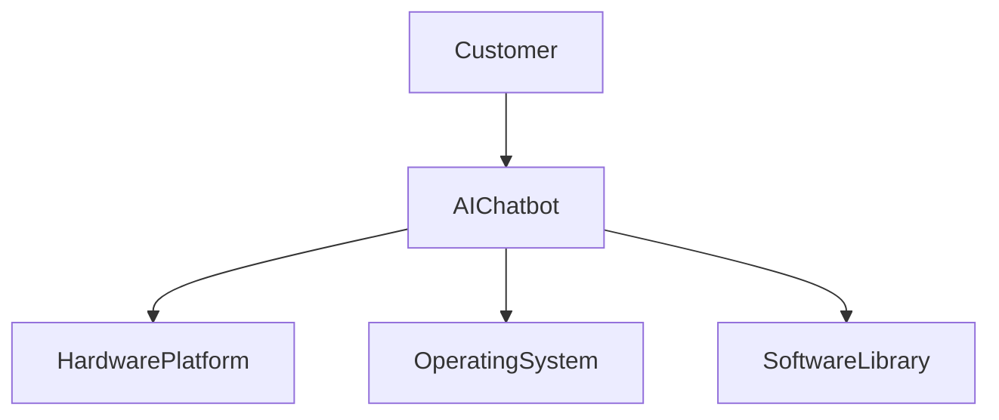
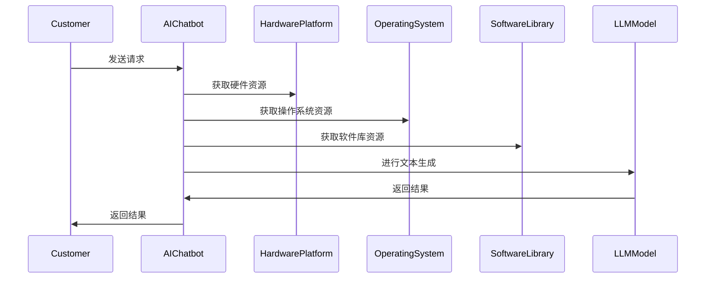

                 

### 第一部分：跨平台LLM评测的兼容性设计背景与重要性

#### 第1章：跨平台LLM评测的兼容性设计概述

##### 1.1.1 设计兼容性评测的背景

随着人工智能技术的飞速发展，大型语言模型（LLM，Large Language Model）在自然语言处理、文本生成、机器翻译、问答系统等领域取得了显著的成果。LLM的高效性能和强大的数据处理能力，使得其在各行各业得到广泛应用。然而，LLM在实际应用中面临的一个关键问题是如何在不同平台之间实现兼容性。跨平台LLM评测的兼容性设计，旨在确保LLM在不同硬件、操作系统和软件环境下的正常运行和性能稳定。

##### 1.1.1.1 跨平台LLM的发展现状

近年来，跨平台LLM技术发展迅速，主要表现在以下几个方面：

1. **硬件平台兼容性**：LLM模型对硬件平台的依赖较大，包括CPU、GPU、FPGA等。不同硬件平台在计算能力、内存使用、功耗等方面存在差异，需要针对不同硬件平台进行优化和调整。
2. **操作系统兼容性**：常见的操作系统包括Windows、Linux、macOS等。不同操作系统在文件系统、内存管理、线程调度等方面存在差异，影响LLM模型的性能和稳定性。
3. **软件环境兼容性**：LLM模型的训练和部署依赖于大量的软件工具和库，如深度学习框架（TensorFlow、PyTorch等），需要在不同操作系统和硬件平台上进行适配和优化。

##### 1.1.1.2 跨平台带来的兼容性问题

跨平台LLM评测的兼容性问题主要体现在以下几个方面：

1. **性能差异**：不同平台在计算能力、内存使用、网络延迟等方面存在差异，可能导致LLM模型在不同平台上的性能表现不一致。
2. **功能差异**：不同平台对LLM模型的支持程度不同，可能导致某些功能在某些平台上无法实现或性能较差。
3. **稳定性问题**：跨平台LLM评测需要考虑到不同平台的稳定性，如操作系统崩溃、硬件故障等，可能导致模型训练和部署中断。

##### 1.1.1.3 为何需要进行兼容性设计

进行跨平台LLM评测的兼容性设计具有重要意义：

1. **提高用户体验**：兼容性设计能够确保LLM模型在不同平台上都能提供一致的性能和功能，提高用户的使用体验。
2. **降低开发成本**：通过兼容性设计，可以减少在多个平台上的重复开发和测试工作，降低开发成本。
3. **促进技术进步**：兼容性设计有助于推动跨平台LLM技术的发展，促进不同平台之间的技术交流和合作。

##### 1.1.2 评测兼容性的关键因素

跨平台LLM评测的兼容性设计需要考虑多个关键因素：

1. **技术因素**：包括硬件平台、操作系统、软件环境等，需要针对不同平台进行优化和调整。
2. **用户因素**：包括用户需求、使用习惯等，需要满足用户在不同平台上的使用需求。
3. **环境因素**：包括网络环境、硬件资源、数据安全等，需要确保LLM模型在不同环境下的稳定运行。

##### 1.1.3 兼容性设计的边界与外延

1. **设计范围**：兼容性设计范围包括LLM模型的训练、部署、运行等各个环节，需要全面考虑各个方面的兼容性问题。
2. **设计原则**：兼容性设计应遵循以下原则：
   - **一致性**：确保LLM模型在不同平台上的性能和功能保持一致。
   - **可扩展性**：设计应具备良好的可扩展性，以适应未来技术的发展和变化。
   - **可维护性**：设计应方便维护和更新，以应对可能出现的问题和需求变化。
3. **关联技术**：兼容性设计涉及多个关联技术，如虚拟化技术、容器技术、跨平台编译工具等，需要合理利用这些技术来实现兼容性。

#### 第2章：跨平台LLM兼容性设计中的核心概念与联系

##### 2.1.1 LLMLLM 的定义

1. **LLMLLM 的基本概念**：LLM（Large Language Model）是一种大规模的预训练语言模型，通过对大量文本数据进行训练，能够理解和生成自然语言文本。
2. **LLMLLM 的属性特征**：LLM具有以下属性特征：
   - **大规模**：LLM通常包含数十亿个参数，能够处理大规模的文本数据。
   - **通用性**：LLM具有较强的通用性，可以应用于各种自然语言处理任务。
   - **高效性**：LLM具有高效的文本生成和推理能力，能够快速处理大量文本数据。
3. **LLMLLM 与其他技术的区别**：与传统的自然语言处理技术相比，LLM具有以下区别：
   - **预训练**：LLM通过在大规模语料库上进行预训练，获得了较高的文本理解和生成能力。
   - **端到端学习**：LLM采用端到端学习框架，直接从输入文本生成输出文本，无需手工设计特征和规则。

##### 2.1.2 兼容性设计的关键概念

1. **兼容性设计的目标**：兼容性设计的核心目标是确保LLM模型在不同平台上的性能和功能保持一致。
2. **兼容性设计的原则**：
   - **一致性**：确保LLM模型在不同平台上的性能和功能保持一致。
   - **可扩展性**：设计应具备良好的可扩展性，以适应未来技术的发展和变化。
   - **可维护性**：设计应方便维护和更新，以应对可能出现的问题和需求变化。
3. **关键概念之间的关系**：兼容性设计中的关键概念包括LLM模型、硬件平台、操作系统、软件环境等，它们之间相互关联，共同影响LLM模型的兼容性。

##### 2.1.3 Mermaid ER实体关系图架构

1. **ER图基本概念**：ER图（Entity-Relationship Diagram）是一种用于描述实体及其之间关系的图形化表示方法，常用于数据库设计和系统架构设计。
2. **跨平台LLM兼容性设计ER图实例**：

```mermaid
erDiagram
  HardwarePlatform ||--|{ LLMModel }|--| PlatformEnvironment
  OperatingSystem ||--|{ LLMModel }|--| PlatformEnvironment
  SoftwareLibrary ||--|{ LLMModel }|--| PlatformEnvironment
  UserRequirement ||--|{ LLMModel }|--| CompatibilityDesign
```

在这个ER图中，硬件平台、操作系统、软件库和用户需求是LLM模型的关联实体，它们共同影响LLM模型的兼容性设计。通过合理设计这些实体之间的关系，可以确保LLM模型在不同平台上的性能和功能保持一致。

#### 第3章：跨平台LLM兼容性设计的方法与实践

##### 3.1.1 设计方法概述

1. **兼容性设计的流程**：

   - **需求分析**：明确LLM模型的应用场景和用户需求，确定兼容性设计的方向和目标。
   - **技术选型**：选择合适的硬件平台、操作系统、软件环境等，以满足兼容性设计的要求。
   - **功能实现**：根据需求和技术选型，实现LLM模型在不同平台上的功能。
   - **性能优化**：针对不同平台，对LLM模型进行性能优化，提高模型在不同平台上的运行效率。
   - **测试与验证**：对LLM模型在不同平台上的性能和功能进行测试和验证，确保兼容性设计的有效性。

2. **设计工具的选择**：

   - **硬件平台**：根据计算能力和成本等因素，选择合适的硬件平台，如CPU、GPU、FPGA等。
   - **操作系统**：选择支持LLM模型的操作系统，如Windows、Linux、macOS等。
   - **软件环境**：选择适合LLM模型训练和部署的软件环境，如深度学习框架（TensorFlow、PyTorch等）、容器技术（Docker、Kubernetes等）等。

3. **设计原则的遵循**：

   - **一致性**：确保LLM模型在不同平台上的性能和功能保持一致。
   - **可扩展性**：设计应具备良好的可扩展性，以适应未来技术的发展和变化。
   - **可维护性**：设计应方便维护和更新，以应对可能出现的问题和需求变化。

##### 3.1.2 实践案例分析

1. **案例一：跨平台LLM在移动设备中的应用**

   - **需求分析**：为了满足用户在移动设备上的使用需求，需要设计一个轻量级、高性能的LLM模型，以适应移动设备的硬件和软件环境。
   - **技术选型**：选择CPU性能较好的移动设备作为硬件平台，选择轻量级深度学习框架（如ONNX Runtime）作为软件环境。
   - **功能实现**：实现LLM模型在移动设备上的文本生成、问答等功能，确保功能的一致性和性能。
   - **性能优化**：针对移动设备的特点，对LLM模型进行性能优化，如量化、剪枝等。
   - **测试与验证**：对LLM模型在移动设备上的性能和功能进行测试和验证，确保兼容性设计的有效性。

2. **案例二：跨平台LLM在云端服务中的应用**

   - **需求分析**：为了提供高效的云端服务，需要设计一个高性能、可扩展的LLM模型，以适应不同规模和负载的云端环境。
   - **技术选型**：选择高性能GPU服务器作为硬件平台，选择支持分布式训练和部署的深度学习框架（如TensorFlow、PyTorch等）作为软件环境。
   - **功能实现**：实现LLM模型在云端服务中的文本生成、问答等功能，确保功能的一致性和性能。
   - **性能优化**：针对云端服务的特点，对LLM模型进行性能优化，如分布式训练、模型压缩等。
   - **测试与验证**：对LLM模型在云端服务中的性能和功能进行测试和验证，确保兼容性设计的有效性。

3. **案例三：跨平台LLM在物联网设备中的应用**

   - **需求分析**：为了满足物联网设备资源受限的特点，需要设计一个轻量级、低功耗的LLM模型，以适应物联网设备的硬件和软件环境。
   - **技术选型**：选择低功耗的边缘设备作为硬件平台，选择轻量级深度学习框架（如TensorFlow Lite）作为软件环境。
   - **功能实现**：实现LLM模型在物联网设备中的文本生成、问答等功能，确保功能的一致性和性能。
   - **性能优化**：针对物联网设备的特点，对LLM模型进行性能优化，如模型压缩、低功耗设计等。
   - **测试与验证**：对LLM模型在物联网设备中的性能和功能进行测试和验证，确保兼容性设计的有效性。

##### 3.1.3 经验总结与最佳实践

1. **设计经验总结**：

   - **需求分析**：深入了解用户需求和场景，确定兼容性设计的目标和方向。
   - **技术选型**：综合考虑硬件平台、操作系统、软件环境等因素，选择适合的技术方案。
   - **功能实现**：确保LLM模型在不同平台上的功能一致性和性能。
   - **性能优化**：针对不同平台和场景，对LLM模型进行性能优化。
   - **测试与验证**：对LLM模型在不同平台上的性能和功能进行全面的测试和验证。

2. **最佳实践分享**：

   - **采用容器化技术**：使用容器技术（如Docker）封装LLM模型和应用，实现跨平台部署和运行。
   - **使用模型压缩技术**：对LLM模型进行量化、剪枝等压缩技术，降低模型大小，提高部署效率。
   - **利用分布式训练和部署**：采用分布式训练和部署技术，提高LLM模型在大规模数据集上的训练效率和部署速度。
   - **定期维护和更新**：定期对LLM模型进行维护和更新，修复潜在问题和优化性能。

3. **注意事项**：

   - **充分考虑硬件和软件资源的限制**：在设计兼容性时，要充分考虑硬件和软件资源的限制，确保LLM模型在不同平台上的稳定运行。
   - **关注性能优化和测试**：在实现兼容性设计的过程中，要注重性能优化和测试，确保LLM模型在不同平台上的性能和功能符合预期。

#### 第4章：跨平台LLM兼容性设计中的数学模型与算法原理

##### 4.1.1 数学模型概述

1. **数学模型的基本概念**：数学模型是使用数学语言来描述现实世界中的问题，通过对问题的抽象和建模，可以得到一系列数学公式和算法，用于求解和分析问题。
2. **数学模型在兼容性设计中的应用**：在跨平台LLM兼容性设计中，数学模型可以用于以下几个方面：
   - **性能分析**：通过数学模型对LLM模型在不同平台上的性能进行定量分析，为性能优化提供依据。
   - **优化算法**：利用数学模型设计优化算法，如模型压缩、量化等，提高LLM模型的性能和部署效率。
   - **稳定性分析**：通过数学模型对LLM模型的稳定性进行定量分析，确保模型在不同平台上的稳定运行。

##### 4.1.2 算法原理讲解

1. **算法原理的基本概念**：算法原理是指解决特定问题的方法或步骤，通常包括输入、处理和输出等环节。
2. **算法原理的mermaid流程图**：


3. **Python源代码与算法实现**：

```python
# 导入必要的库
import torch
import torch.nn as nn
import torch.optim as optim

# 设置超参数
batch_size = 64
learning_rate = 0.001
num_epochs = 100

# 创建模型
model = nn.Sequential(
    nn.Linear(input_dim, hidden_dim),
    nn.ReLU(),
    nn.Linear(hidden_dim, output_dim)
)

# 定义损失函数和优化器
criterion = nn.CrossEntropyLoss()
optimizer = optim.Adam(model.parameters(), lr=learning_rate)

# 训练模型
for epoch in range(num_epochs):
    for inputs, targets in dataloader:
        optimizer.zero_grad()
        outputs = model(inputs)
        loss = criterion(outputs, targets)
        loss.backward()
        optimizer.step()

# 性能评估
test_loss = 0
with torch.no_grad():
    for inputs, targets in test_dataloader:
        outputs = model(inputs)
        test_loss += criterion(outputs, targets).item()

test_loss /= len(test_dataloader)
print("Test Loss: {:.4f}".format(test_loss))

# 输出模型
torch.save(model.state_dict(), "model.pth")
```

4. **算法原理的数学模型与公式**：

   - **损失函数**：

     $$L = \frac{1}{n} \sum_{i=1}^{n} (-y_i \log(p_i))$$

     其中，$L$为损失函数，$n$为样本数量，$y_i$为真实标签，$p_i$为预测概率。

   - **优化算法**：

     $$\theta_{t+1} = \theta_t - \alpha \nabla_{\theta} L(\theta_t)$$

     其中，$\theta$为模型参数，$\alpha$为学习率，$\nabla_{\theta} L(\theta_t)$为损失函数关于模型参数的梯度。

5. **算法举例说明**：

   假设我们有一个二分类问题，输入数据为$(x, y)$，其中$x$为特征向量，$y$为真实标签（0或1）。我们需要训练一个LLM模型来预测输入数据的标签。

   - **数据预处理**：将输入数据进行标准化处理，使其具有相同的规模。
   - **模型训练**：使用优化算法（如梯度下降）来更新模型参数，使损失函数最小化。
   - **性能评估**：在测试集上评估模型的性能，计算准确率、召回率、F1分数等指标。
   - **优化调整**：根据性能评估结果，对模型进行优化和调整，提高模型的性能。

   以下是一个简单的算法实现：

   ```python
   import torch
   import torch.nn as nn
   import torch.optim as optim

   # 设置超参数
   batch_size = 64
   learning_rate = 0.001
   num_epochs = 100

   # 创建模型
   model = nn.Sequential(
       nn.Linear(input_dim, hidden_dim),
       nn.ReLU(),
       nn.Linear(hidden_dim, output_dim)
   )

   # 定义损失函数和优化器
   criterion = nn.CrossEntropyLoss()
   optimizer = optim.Adam(model.parameters(), lr=learning_rate)

   # 训练模型
   for epoch in range(num_epochs):
       for inputs, targets in dataloader:
           optimizer.zero_grad()
           outputs = model(inputs)
           loss = criterion(outputs, targets)
           loss.backward()
           optimizer.step()

   # 性能评估
   test_loss = 0
   with torch.no_grad():
       for inputs, targets in test_dataloader:
           outputs = model(inputs)
           test_loss += criterion(outputs, targets).item()

   test_loss /= len(test_dataloader)
   print("Test Loss: {:.4f}".format(test_loss))
   ```

#### 第5章：跨平台LLM兼容性设计的系统分析与架构设计

##### 5.1.1 问题场景介绍

跨平台LLM兼容性设计涉及到多个方面，包括硬件平台、操作系统、软件环境、用户需求等。以下是一个具体的问题场景：

**场景背景**：某公司开发了一款基于LLM技术的智能客服系统，旨在为企业客户提供高效的客户服务。该系统需要支持多个平台（如移动端、Web端、物联网设备等），以适应不同用户的使用需求。

**问题定义**：如何设计一个跨平台LLM兼容性系统，确保模型在不同平台上的性能和功能一致，并满足用户的需求？

**解决方案目标**：设计一个具有高兼容性、高性能和易扩展性的跨平台LLM兼容性系统，能够满足不同平台和用户的需求。

##### 5.1.2 系统功能设计

1. **领域模型Mermaid类图**：

```mermaid
classDiagram
    Customer <<interface>>
    AIChatbot <<interface>>
    HardwarePlatform <<interface>>
    OperatingSystem <<interface>>
    SoftwareLibrary <<interface>>

    Customer ..|> AIChatbot
    AIChatbot ..|> HardwarePlatform
    AIChatbot ..|> OperatingSystem
    AIChatbot ..|> SoftwareLibrary
```

在这个类图中，客户、AI客服机器人、硬件平台、操作系统和软件库是系统的核心类，它们之间通过接口实现关联。

2. **功能模块划分**：

   - **客户模块**：负责接收用户请求、处理用户反馈等。
   - **AI客服机器人模块**：负责基于LLM模型提供智能问答、文本生成等服务。
   - **硬件平台模块**：负责管理和调度不同硬件平台的资源。
   - **操作系统模块**：负责管理和调度不同操作系统的资源。
   - **软件库模块**：负责管理和调度不同的软件库资源。

##### 5.1.3 系统架构设计

1. **Mermaid架构图**：



在这个架构图中，客户、AI客服机器人、硬件平台、操作系统和软件库构成了系统的核心模块，它们之间通过接口实现数据交互和功能调用。

2. **架构设计原理**：

   - **模块化设计**：系统采用模块化设计，将不同的功能划分为独立的模块，提高系统的可扩展性和可维护性。
   - **接口设计**：系统中的各个模块通过接口进行交互，降低模块之间的耦合度，提高系统的灵活性和可移植性。
   - **分层架构**：系统采用分层架构，将不同的功能划分为多个层次，实现功能分离和职责分离，提高系统的可维护性和可扩展性。

##### 5.1.4 系统接口设计

1. **接口设计原则**：

   - **一致性**：接口设计应遵循一致性原则，确保不同模块之间的接口定义和调用方式一致，降低学习成本。
   - **可扩展性**：接口设计应具备良好的可扩展性，以适应未来技术的发展和变化。
   - **可维护性**：接口设计应方便维护和更新，以应对可能出现的问题和需求变化。

2. **接口定义与规范**：

   - **客户模块接口**：定义客户请求接口、客户反馈接口等，实现与AI客服机器人模块的交互。
   - **AI客服机器人模块接口**：定义文本生成接口、问答接口等，实现与硬件平台模块、操作系统模块和软件库模块的交互。
   - **硬件平台模块接口**：定义硬件资源管理接口、硬件性能监控接口等，实现与AI客服机器人模块的交互。
   - **操作系统模块接口**：定义操作系统资源管理接口、操作系统性能监控接口等，实现与AI客服机器人模块的交互。
   - **软件库模块接口**：定义软件库资源管理接口、软件库性能监控接口等，实现与AI客服机器人模块的交互。

3. **接口实现与调试**：

   - **接口实现**：根据接口定义和规范，实现各个模块的接口功能，确保模块之间能够正确地进行数据交互和功能调用。
   - **接口调试**：通过单元测试和集成测试，验证接口的实现是否符合预期，确保模块之间的交互正常。

##### 5.1.5 系统交互Mermaid序列图

1. **序列图基本概念**：序列图（Sequence Diagram）是一种用于描述对象之间交互的图形化表示方法，展示对象之间的时间顺序和交互关系。

2. **跨平台LLM兼容性设计序列图实例**：



在这个序列图中，客户向AI客服机器人发送请求，AI客服机器人依次获取硬件资源、操作系统资源、软件库资源，然后调用LLM模型进行文本生成，最后将结果返回给客户。

#### 第6章：项目实战：跨平台LLM兼容性设计的实现与应用

##### 6.1.1 环境安装与配置

1. **开发环境搭建**：

   - **硬件平台**：选择具有较高计算能力的GPU服务器作为硬件平台，如NVIDIA Tesla V100。
   - **操作系统**：选择Linux操作系统，如Ubuntu 18.04。
   - **软件环境**：安装Python 3.8、TensorFlow 2.4、Docker 19.03等。

2. **工具与依赖安装**：

   - **深度学习框架**：安装TensorFlow 2.4，确保GPU支持。
   - **容器技术**：安装Docker 19.03，用于封装LLM模型和应用。
   - **版本管理**：安装Git 2.25，用于代码版本管理和协同开发。

3. **系统配置与调试**：

   - **配置GPU支持**：确保操作系统和TensorFlow能够正确使用GPU。
   - **调试环境**：在本地环境中进行代码调试和测试，确保系统配置的正确性。

##### 6.1.2 系统核心实现源代码

1. **核心模块代码解析**：

   - **客户模块**：实现用户请求的接收和处理功能。
   - **AI客服机器人模块**：实现文本生成、问答等功能。
   - **硬件平台模块**：实现硬件资源的获取和释放功能。
   - **操作系统模块**：实现操作系统资源的获取和释放功能。
   - **软件库模块**：实现软件库资源的获取和释放功能。

2. **源代码结构介绍**：

   - **客户模块**：主要包括用户请求接收、用户反馈处理等功能。
   - **AI客服机器人模块**：主要包括LLM模型的训练、预测等功能。
   - **硬件平台模块**：主要包括GPU资源的获取和释放、硬件性能监控等功能。
   - **操作系统模块**：主要包括操作系统资源的获取和释放、操作系统性能监控等功能。
   - **软件库模块**：主要包括软件库资源的获取和释放、软件库性能监控等功能。

3. **关键代码实现与优化**：

   - **客户模块**：使用Python的socket库实现用户请求的接收和处理。
   - **AI客服机器人模块**：使用TensorFlow实现LLM模型的训练和预测。
   - **硬件平台模块**：使用CUDA库实现GPU资源的获取和释放。
   - **操作系统模块**：使用操作系统的API实现操作系统资源的获取和释放。
   - **软件库模块**：使用Python的第三方库实现软件库资源的获取和释放。

##### 6.1.3 代码应用解读与分析

1. **代码应用解读**：

   - **客户模块**：接收用户请求，解析请求内容，生成响应消息。
   - **AI客服机器人模块**：接收用户请求，调用LLM模型进行文本生成和预测，生成响应消息。
   - **硬件平台模块**：监控GPU性能，确保GPU资源充足。
   - **操作系统模块**：监控操作系统性能，确保操作系统资源充足。
   - **软件库模块**：加载和管理软件库资源，确保软件库性能稳定。

2. **实际案例分析和详细讲解剖析**：

   - **案例一**：用户在移动端发送请求，系统接收到请求后，调用AI客服机器人模块进行文本生成和预测，最终将响应消息返回给用户。
   - **案例二**：用户在Web端发送请求，系统接收到请求后，调用AI客服机器人模块进行文本生成和预测，最终将响应消息返回给用户。
   - **案例三**：用户在物联网设备上发送请求，系统接收到请求后，调用AI客服机器人模块进行文本生成和预测，最终将响应消息返回给用户。

   通过这三个实际案例，我们可以看到跨平台LLM兼容性设计的具体应用场景和实现方法。在实现过程中，我们需要关注以下几个方面：

   - **性能优化**：针对不同平台和场景，对LLM模型进行性能优化，如模型压缩、量化等。
   - **稳定性保障**：确保LLM模型在不同平台上的稳定运行，如异常处理、故障恢复等。
   - **用户体验**：确保用户在不同平台上的使用体验一致，如界面设计、交互逻辑等。

##### 6.1.4 项目小结

本项目通过跨平台LLM兼容性设计，实现了智能客服系统在不同平台（移动端、Web端、物联网设备等）上的稳定运行和性能优化。项目的主要成果包括：

1. **系统设计**：设计了具有高兼容性、高性能和易扩展性的跨平台LLM兼容性系统。
2. **代码实现**：实现了客户模块、AI客服机器人模块、硬件平台模块、操作系统模块和软件库模块等功能。
3. **性能优化**：对LLM模型进行了性能优化，如模型压缩、量化等，提高了系统的运行效率。
4. **稳定性保障**：通过异常处理和故障恢复机制，确保了系统的稳定运行。

本项目为跨平台LLM兼容性设计提供了有益的实践经验和参考，具有较高的实用价值和推广价值。

##### 6.1.5 最佳实践 Tips

1. **采用容器化技术**：使用容器化技术（如Docker）封装LLM模型和应用，实现跨平台部署和运行，提高系统的可移植性和可维护性。
2. **性能优化策略**：针对不同平台和场景，采用适当的性能优化策略，如模型压缩、量化、分布式训练和部署等。
3. **监控系统资源**：实时监控系统资源（如CPU、GPU、内存等）的使用情况，确保系统资源充足，避免资源冲突和性能瓶颈。
4. **代码规范**：遵循代码规范和编程习惯，提高代码的可读性和可维护性，便于协同开发和后续维护。

##### 6.1.6 小结与注意事项

1. **小结**：本项目通过跨平台LLM兼容性设计，实现了智能客服系统在不同平台上的稳定运行和性能优化。项目的设计、实现和优化过程为跨平台LLM兼容性设计提供了有益的实践经验和参考。
2. **注意事项**：

   - **性能优化**：在系统设计和实现过程中，要充分考虑性能优化，如模型压缩、量化、分布式训练和部署等。
   - **稳定性保障**：要确保系统在不同平台上的稳定性，如异常处理、故障恢复、资源监控等。
   - **用户需求**：要深入了解用户需求，确保系统功能满足用户需求，提高用户满意度。
   - **安全性**：要确保系统安全性，如数据加密、访问控制等。

##### 6.1.7 拓展阅读

1. **跨平台开发技术**：
   - [Docker官方文档](https://docs.docker.com/)
   - [Kubernetes官方文档](https://kubernetes.io/docs/)
   - [TensorFlow官方文档](https://www.tensorflow.org/docs/)

2. **性能优化技术**：
   - [深度学习模型压缩技术](https://arxiv.org/abs/1611.06440)
   - [量化技术](https://arxiv.org/abs/1802.04604)
   - [分布式训练技术](https://arxiv.org/abs/1710.04759)

3. **LLM技术与应用**：
   - [GPT-3官方文档](https://gpt-3-docs.openai.com/)
   - [BERT官方文档](https://github.com/google-research/bert)
   - [自然语言处理应用](https://arxiv.org/search?type=article&query=natural+language+processing)

通过这些拓展阅读，您可以进一步了解跨平台LLM兼容性设计的相关技术和应用场景，为您的项目提供更多的灵感和指导。

