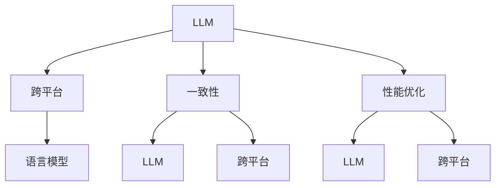

                 

# 跨平台LLM评测：确保在不同环境的一致性

## 关键词：跨平台，LLM评测，一致性，测试方法，性能优化

## 摘要：
本文旨在探讨跨平台语言模型（LLM）评测的关键问题，特别是在确保模型在不同环境下的一致性方面。随着人工智能技术的快速发展，LLM在云端、边缘设备、移动设备和不同操作系统中的应用越来越广泛。然而，不同环境下存在的硬件、软件、数据集等差异，使得LLM的表现可能存在不一致性。本文将详细分析这些差异，介绍跨平台LLM评测的方法和实践，并探讨确保一致性的策略。通过深入研究和案例分析，本文为跨平台LLM的开发和应用提供了有价值的指导。

## 目录

1. 引言
2. 跨平台LLM评测方法与实践
   2.1 跨平台LLM评测的框架与步骤
   2.2 数据集选择与准备
   2.3 测试环境的配置与优化
   2.4 测试用例设计
   2.5 评测结果分析与调优
   2.6 跨平台LLM评测的案例分析
3. 确保跨平台LLM的一致性
   3.1 跨平台LLM一致性面临的挑战
   3.2 确保一致性策略与方法
   3.3 实践案例分享
4. 跨平台LLM评测的最佳实践
   4.1 跨平台LLM评测的最佳实践
   4.2 工具与平台推荐
   4.3 注意事项与解决方案
5. 未来展望
   5.1 跨平台LLM评测的发展趋势
   5.2 未来研究方向与挑战
   5.3 跨平台LLM评测在新兴领域的应用
6. 结论
7. 参考文献

## 引言

随着人工智能技术的不断进步，跨平台语言模型（LLM）在各个领域中的应用越来越广泛。LLM是一种能够理解和生成自然语言的人工智能模型，通过大规模的语言数据进行训练，具有强大的语义理解和文本生成能力。无论是在云端提供强大的计算服务，还是在边缘设备上进行实时响应，LLM都展现出了巨大的潜力。

然而，跨平台LLM在实际应用中面临着诸多挑战。不同平台间的硬件配置、软件环境、数据集质量等差异，可能导致LLM在各个平台上的表现不一致。这种不一致性不仅影响模型的性能，也可能对用户体验产生负面影响。因此，如何确保跨平台LLM的一致性，成为了一个亟待解决的问题。

本文将从以下几个方面展开讨论：

首先，我们将介绍跨平台LLM的基础知识，包括跨平台的概念、需求和挑战，以及当前的发展现状和趋势。

其次，我们将详细探讨跨平台LLM的关键技术，包括跨平台框架与工具、环境一致性处理技术以及性能优化技术。

然后，我们将讨论跨平台LLM的测试与验证方法，包括测试策略与指标、测试环境配置以及测试结果分析与调优。

接着，我们将分析跨平台LLM在不同环境下的表现，探讨云端环境与边缘设备、移动设备与桌面设备、不同操作系统之间的差异。

在第三部分，我们将介绍跨平台LLM评测的框架与步骤，包括数据集选择与准备、测试环境的配置与优化、测试用例设计以及评测结果分析与调优。

在第四部分，我们将探讨如何确保跨平台LLM的一致性，包括面临的挑战和相应的策略与方法。

第五部分将介绍跨平台LLM评测的最佳实践，包括数据集的一致性、硬件资源的合理配置、软件环境的标准化以及测试策略的优化。

最后，在第六部分，我们将展望跨平台LLM评测的发展趋势，探讨未来研究方向与挑战，以及跨平台LLM评测在新兴领域的应用。

通过本文的探讨，我们希望为跨平台LLM的开发和应用提供有价值的参考，帮助解决在实际应用中遇到的问题，推动人工智能技术的进一步发展。

## 1. 跨平台LLM的基础知识

### 1.1 跨平台的概念与重要性

跨平台是指在不同的计算平台上，如云端、边缘设备、移动设备等，能够实现相同功能的能力。在人工智能领域，跨平台的重要性主要体现在以下几个方面：

1. **灵活性**：跨平台能力使得LLM可以在不同的计算环境中灵活部署，根据不同的应用场景进行优化和调整。

2. **资源利用**：通过跨平台部署，可以充分利用各种计算资源，包括高性能的云端设备和低功耗的边缘设备，实现资源的最优利用。

3. **用户体验**：跨平台能力可以确保用户在不同设备上获得一致的服务体验，提升用户的满意度和忠诚度。

4. **成本效益**：跨平台部署可以减少对特定平台的依赖，降低开发成本和维护成本，提高项目的可扩展性。

### 1.2 跨平台LLM的需求与挑战

#### 需求：

1. **一致性**：确保LLM在不同平台上的性能和表现保持一致，是跨平台部署的首要需求。

2. **可移植性**：LLM模型需要能够无缝地在不同平台上移植，无需重新开发和训练。

3. **适应性**：LLM需要能够适应不同平台的环境变化，如硬件配置、软件环境等。

#### 挑战：

1. **硬件差异**：不同平台具有不同的硬件配置，如CPU、GPU、内存等，可能导致LLM在性能上的不一致。

2. **软件环境**：不同的操作系统和软件环境可能对LLM的运行产生影响，需要确保软件兼容性。

3. **数据集差异**：不同平台上的数据集质量和分布可能存在差异，影响LLM的训练效果和性能。

4. **性能优化**：如何在各种硬件和软件环境下优化LLM的性能，是一个重要挑战。

### 1.3 跨平台LLM的发展现状与趋势

#### 现状：

1. **框架与工具**：目前，已有多个跨平台LLM框架和工具，如TensorFlow、PyTorch、ONNX等，为跨平台部署提供了支持。

2. **应用场景**：跨平台LLM已经在许多领域得到应用，如自然语言处理、语音识别、图像识别等。

3. **性能优化**：通过模型压缩、量化、蒸馏等技术，跨平台LLM的性能逐渐接近或达到单平台LLM的水平。

#### 趋势：

1. **硬件加速**：随着硬件技术的发展，如GPU、TPU等加速器的普及，跨平台LLM的性能将得到进一步提升。

2. **边缘计算**：随着5G和物联网技术的发展，边缘计算将成为跨平台LLM的重要应用场景。

3. **模型融合**：通过融合不同平台上的模型，可以实现更好的性能和更广泛的应用。

4. **标准化**：随着跨平台LLM应用的普及，相关的评测标准和规范将逐步完善，推动技术的标准化和规范化。

### 1.4 跨平台LLM的核心概念与联系

#### 核心概念：

1. **语言模型**：LLM是一种基于大规模语言数据进行训练的模型，能够理解和生成自然语言。

2. **跨平台**：指LLM能够在不同计算平台上部署和运行。

3. **一致性**：指LLM在不同平台上的性能和表现保持一致。

4. **性能优化**：通过技术手段提升LLM在不同平台上的性能。

#### 概念属性特征对比表格：

| 概念       | 属性特征                       |
|------------|--------------------------------|
| 语言模型   | 能够理解和生成自然语言         |
| 跨平台     | 支持不同计算平台部署和运行     |
| 一致性     | 不同平台上的性能和表现保持一致 |
| 性能优化   | 提升LLM在不同平台上的性能     |

#### ER实体关系图架构

通过上述分析和介绍，我们可以看到，跨平台LLM评测的一致性问题至关重要。在接下来的章节中，我们将进一步探讨跨平台LLM的关键技术、测试与验证方法，以及确保一致性的策略和方法。

## 1.5 跨平台LLM的关键技术

在跨平台LLM的开发和应用过程中，关键技术起到了决定性作用。这些技术不仅有助于解决不同平台间的硬件、软件和数据处理差异，还能提升模型的性能和一致性。以下是几个关键技术的详细介绍：

### 1.5.1 跨平台框架与工具

跨平台框架和工具为LLM在不同平台上的部署和运行提供了支持。目前，常用的跨平台框架和工具有：

1. **TensorFlow**：Google开发的端到端开源机器学习平台，支持在多个平台上进行模型训练和部署，包括CPU、GPU和TPU等。

2. **PyTorch**：Facebook开发的开源机器学习库，以其动态计算图和灵活的编程接口而著称，广泛应用于科研和工业界。

3. **ONNX**：Open Neural Network Exchange是一种开放格式，用于跨平台、跨框架的机器学习模型交换，支持多种框架和工具。

这些框架和工具通过提供统一的接口和跨平台支持，使得LLM的开发和部署变得更加便捷和高效。

### 1.5.2 环境一致性处理技术

环境一致性处理技术旨在解决不同平台间的环境差异问题，确保LLM在不同环境下的一致性。主要包括以下方面：

1. **软件兼容性**：确保LLM在不同操作系统（如Windows、Linux、macOS等）上能够正常运行，可能需要使用虚拟环境或容器技术。

2. **硬件适应性**：针对不同硬件（如CPU、GPU、FPGA等）的特性进行优化，使得LLM能够在各种硬件上高效运行。这通常需要使用硬件加速技术，如CUDA、cuDNN等。

3. **数据预处理**：对不同平台上的数据集进行标准化处理，确保数据格式和分布的一致性，以减少数据差异对模型性能的影响。

4. **性能调优**：通过模型压缩、量化、蒸馏等技术，提升LLM在不同平台上的性能，以应对硬件资源的限制。

### 1.5.3 性能优化技术

性能优化技术是提升跨平台LLM性能的重要手段，主要包括：

1. **模型压缩**：通过剪枝、量化、蒸馏等技术减小模型的大小和参数数量，提高模型在低资源环境下的运行效率。

2. **并行计算**：利用多核CPU、GPU等硬件资源进行并行计算，加速模型的训练和推理过程。

3. **内存优化**：通过减少内存占用、使用缓存等方式提高模型在内存受限环境下的性能。

4. **能耗优化**：在边缘设备和移动设备上，通过降低功耗、优化算法运行时序等方式，延长设备续航时间。

### 1.5.4 跨平台LLM性能优化案例

以某云端文本生成模型为例，以下是具体的性能优化步骤：

1. **模型压缩**：首先，通过剪枝技术移除模型中不重要的参数，然后使用量化技术将浮点数参数转换为低精度表示，减小模型大小。

2. **并行计算**：利用GPU进行并行计算，通过多线程和多流技术加速模型的推理过程。

3. **内存优化**：针对内存受限环境，采用内存池化技术减少内存分配和释放的开销，同时优化内存访问模式，减少缓存冲突。

4. **能耗优化**：在边缘设备和移动设备上，通过调整模型的结构和参数，降低计算复杂度，减少功耗。

通过上述性能优化措施，该文本生成模型在云端和边缘设备上均实现了显著的性能提升，确保了在不同环境下的高效运行。

总之，跨平台LLM的关键技术是确保模型在不同环境下一致性和高效运行的基础。在实际应用中，需要根据具体需求和平台特点，综合运用这些技术，以实现最佳的跨平台性能。

## 1.6 跨平台LLM的测试与验证

在跨平台LLM的开发过程中，测试与验证是确保模型在不同环境下一致性和性能的关键步骤。一个全面的测试和验证流程可以有效地发现并解决模型在不同平台上的潜在问题，从而确保最终产品的质量和用户体验。以下是跨平台LLM测试与验证的详细步骤：

### 1.6.1 测试策略与指标

1. **性能测试**：评估LLM在不同平台上的响应速度、吞吐量和计算效率。常用的性能测试指标包括：

   - **响应时间**：模型处理请求所需的时间。
   - **吞吐量**：单位时间内模型处理的请求数量。
   - **延迟**：从请求接收到最后结果返回的时间。

2. **一致性测试**：验证LLM在不同平台上的输出结果是否一致，确保模型的预测结果在不同环境下具有高度的一致性。

   - **准确率**：预测结果与实际结果的一致性程度。
   - **误差率**：预测结果与实际结果的差异。
   - **方差**：不同平台间预测结果的方差，用于衡量模型输出的稳定性。

3. **稳定性测试**：评估LLM在长时间运行下的稳定性，包括训练和推理过程中的数据漂移、模型退化等问题。

   - **数据漂移**：输入数据分布的变化对模型性能的影响。
   - **模型退化**：模型在长时间运行后性能的下降。

4. **兼容性测试**：确保LLM能够在不同的操作系统、硬件环境、软件配置下正常运行。

   - **操作系统兼容性**：检查模型在不同操作系统上的运行情况。
   - **硬件兼容性**：确保模型在不同硬件配置下（如不同GPU型号）的表现一致。
   - **软件兼容性**：验证模型在不同软件环境（如不同深度学习框架版本）下的运行状态。

### 1.6.2 测试环境配置

测试环境的配置是跨平台LLM测试与验证的重要基础。以下是测试环境配置的关键步骤：

1. **硬件资源选择**：根据测试需求选择合适的硬件资源，包括CPU、GPU、内存等。对于云端测试，可以选择高性能的云计算服务，如AWS、Azure、Google Cloud等；对于边缘设备测试，可以选择低功耗的嵌入式设备。

2. **操作系统选择**：选择与目标应用环境相匹配的操作系统，如Windows、Linux、macOS等。对于跨平台测试，需要确保所有操作系统版本都经过严格测试。

3. **软件环境配置**：配置深度学习框架、依赖库和其他必要软件，确保测试环境的一致性。可以使用Docker、Conda等工具创建和管理虚拟环境，避免因软件版本不一致导致的问题。

4. **网络环境配置**：对于云端和边缘设备的测试，需要配置合适的网络环境，包括网络延迟、带宽等，以模拟实际应用场景。

### 1.6.3 测试用例设计

测试用例的设计是测试与验证的核心环节。以下是测试用例设计的关键步骤：

1. **用例定义**：定义测试用例的目标和预期结果，包括输入数据、操作步骤和期望的输出结果。

2. **用例分类**：根据测试目的将测试用例分为以下几类：

   - **功能测试**：验证LLM的基本功能是否正常，如文本生成、语音识别等。
   - **性能测试**：评估LLM在不同平台上的性能，包括响应时间、吞吐量等。
   - **一致性测试**：检查LLM在不同平台上的输出结果是否一致。
   - **稳定性测试**：评估LLM在长时间运行下的稳定性。
   - **兼容性测试**：确保LLM在不同操作系统、硬件环境、软件配置下的兼容性。

3. **用例执行与结果分析**：执行测试用例，记录测试结果，并进行分析。对于不符合预期的结果，需要定位问题并进行调试。

### 1.6.4 测试结果分析与调优

测试结果的分析是跨平台LLM测试与验证的重要环节。以下是测试结果分析与调优的关键步骤：

1. **结果分析**：对测试结果进行详细分析，包括性能测试结果的一致性、稳定性以及兼容性测试结果。

2. **问题定位**：对于测试中发现的性能瓶颈、不一致性等问题，定位到具体的代码模块或环境配置。

3. **调优策略**：根据测试结果和问题定位，制定相应的调优策略，包括：

   - **性能优化**：通过模型压缩、并行计算、内存优化等技术提升模型性能。
   - **一致性优化**：通过软件兼容性处理、数据预处理等技术提高模型在不同平台间的一致性。
   - **稳定性优化**：通过数据增强、模型调整等技术提高模型的稳定性。

4. **调优实践**：根据调优策略进行具体操作，优化模型代码和环境配置，重新执行测试用例，验证优化效果。

通过上述测试与验证步骤，可以确保跨平台LLM在不同环境下的一致性和高性能，为实际应用提供可靠的技术保障。

### 1.7 跨平台LLM在不同环境下的表现分析

在跨平台LLM的应用实践中，了解LLM在不同环境下（如云端环境与边缘设备、移动设备与桌面设备、不同操作系统之间）的表现差异至关重要。这不仅有助于优化模型性能，还能提升用户体验和系统稳定性。以下是这些不同环境下LLM表现的具体分析：

#### 1.7.1 云端环境与边缘设备的差异

**云端环境**：
- **计算资源**：云端环境通常拥有高性能的CPU、GPU、TPU等计算资源，能够提供强大的计算能力。
- **网络延迟**：云端环境一般具有较低的网络延迟，适用于需要实时响应的场景。
- **存储容量**：云端提供几乎无限的存储容量，可以存储大规模的数据集和模型。

**边缘设备**：
- **计算资源**：边缘设备通常计算能力有限，如嵌入式CPU、FPGA等，但功耗较低。
- **网络延迟**：边缘设备部署在离用户较近的位置，具有更低的网络延迟，适用于实时响应和低延迟应用。
- **存储容量**：边缘设备的存储容量相对有限，适合存储小规模的数据集和模型。

**差异分析**：
- **计算能力**：云端具有更高的计算能力，适合进行复杂的模型训练和推理任务。而边缘设备则适合进行轻量级的实时推理任务。
- **功耗**：边缘设备通常功耗较低，适合部署在电池供电的设备上，如智能手表、智能家居设备等。
- **网络延迟**：云端环境具有更低的网络延迟，适合需要实时响应的应用场景。边缘设备则更适合本地化应用，减少对网络的依赖。

#### 1.7.2 移动设备与桌面设备的差异

**移动设备**：
- **计算资源**：移动设备如智能手机和平板电脑，通常具有有限的计算资源，如低功耗CPU、集成GPU等。
- **电池寿命**：移动设备需要考虑电池寿命，因此通常优化功耗和能效。
- **存储容量**：移动设备存储容量有限，但可以快速扩展，如使用SD卡。

**桌面设备**：
- **计算资源**：桌面设备如笔记本电脑和工作站，通常具有更高的计算性能，包括高性能CPU、独立GPU等。
- **电池寿命**：桌面设备通常不依赖电池供电，可以长时间连接电源使用。
- **存储容量**：桌面设备具有较大的存储容量，适合存储大量数据和模型。

**差异分析**：
- **计算能力**：桌面设备具有更高的计算能力，适合进行复杂的模型训练和推理任务。移动设备则适合进行轻量级的推理任务和离线训练。
- **电池寿命**：移动设备需要优化功耗，适合短时间高强度使用。桌面设备则无需考虑电池寿命，可以长时间运行。
- **存储容量**：移动设备存储容量有限，但可以快速扩展。桌面设备具有更大的存储容量，适合长期存储和数据处理。

#### 1.7.3 不同操作系统之间的差异

**Windows**：
- **硬件兼容性**：Windows具有广泛的硬件兼容性，可以支持各种类型的CPU、GPU和其他硬件设备。
- **软件生态**：Windows拥有庞大的软件生态系统，包括各种深度学习框架和工具。
- **用户体验**：Windows用户界面和操作习惯广为人知，适合商业应用和个人用户。

**Linux**：
- **开源生态**：Linux拥有强大的开源生态，包括大量的深度学习框架和工具，如TensorFlow、PyTorch等。
- **硬件优化**：Linux在硬件优化方面具有优势，适合高性能计算和嵌入式设备。
- **稳定性**：Linux在长时间运行和高负载环境下表现出色，适合服务器和应用场景。

**macOS**：
- **苹果生态**：macOS是苹果公司的操作系统，与iOS和iPadOS等苹果产品具有很好的兼容性。
- **用户体验**：macOS提供一致的用户体验，适合开发人员和高级用户。
- **硬件集成**：macOS与苹果硬件深度集成，可以实现高效的性能和续航。

**差异分析**：
- **硬件兼容性**：Windows具有最好的硬件兼容性，可以支持各种硬件设备。Linux在硬件优化和开源生态方面具有优势，但可能需要更多的技术支持。macOS在硬件集成和用户体验方面表现优秀。
- **软件生态**：Windows和Linux拥有丰富的软件生态系统，但Windows更偏向商业应用，Linux更偏向科研和开发。macOS在苹果生态内具有独特的优势。
- **用户体验**：Windows用户界面广为人知，适合广泛用户。Linux在稳定性和开源生态方面具有优势。macOS提供一致的用户体验，适合开发人员和高级用户。

通过以上分析，我们可以看到跨平台LLM在不同环境下的表现存在显著差异。在实际应用中，需要根据具体需求和环境特点，进行模型优化和调整，以实现最佳性能和用户体验。

### 1.8 跨平台LLM评测的框架与步骤

跨平台语言模型（LLM）的评测是一个复杂且关键的过程，它不仅要求我们评估模型在不同平台上的性能，还需要确保评测的一致性和全面性。以下，我们将详细介绍跨平台LLM评测的框架与步骤，并提供具体的实现方法。

#### 2.1.1 评测框架

跨平台LLM评测框架可以分为以下几个核心模块：

1. **需求分析**：明确评测的目标和需求，确定评测的重点和关键指标。
2. **数据集准备**：选择合适的数据集，并进行预处理和标准化处理。
3. **环境配置**：配置测试环境，包括硬件、操作系统和软件环境等。
4. **测试用例设计**：设计测试用例，确保覆盖模型在不同平台上的各种使用场景。
5. **执行测试**：执行测试用例，收集测试数据。
6. **结果分析**：分析测试结果，识别问题并进行调优。
7. **报告生成**：生成评测报告，记录评测过程和结果。

#### 2.1.2 评测步骤

**步骤一：需求分析**

在进行跨平台LLM评测之前，首先需要明确评测的目标和需求。这包括：

- **评测目标**：例如，评估模型在不同平台上的响应时间、吞吐量、准确率等。
- **评测指标**：定义具体的评测指标，如性能指标（响应时间、吞吐量等）、一致性指标（准确率、误差率等）、稳定性指标（长时间运行的稳定性）等。

**步骤二：数据集准备**

数据集的选择和准备是评测的关键。以下是数据集准备的关键步骤：

1. **数据集选择**：选择适用于评测的数据集，确保数据集具有代表性，能够覆盖不同平台和应用场景。
2. **数据预处理**：对数据集进行清洗、归一化等预处理操作，确保数据的一致性和质量。
3. **数据标准化**：对不同平台上的数据集进行标准化处理，确保数据格式和分布的一致性。

**步骤三：环境配置**

配置评测环境是确保测试一致性的基础。以下是环境配置的关键步骤：

1. **硬件资源选择**：根据评测需求选择合适的硬件资源，如CPU、GPU等。
2. **操作系统选择**：配置目标操作系统，如Windows、Linux、macOS等。
3. **软件环境配置**：安装和配置深度学习框架、依赖库等软件，确保测试环境的标准化。

**步骤四：测试用例设计**

测试用例的设计是确保评测全面性的关键。以下是测试用例设计的关键步骤：

1. **用例定义**：定义测试用例的目标和预期结果，确保测试用例覆盖不同平台上的各种使用场景。
2. **用例分类**：根据评测指标和目标，将测试用例分为功能测试、性能测试、一致性测试、稳定性测试等。
3. **用例执行**：制定执行策略，确保测试用例的执行顺序和依赖关系。

**步骤五：执行测试**

执行测试用例，收集测试数据。以下是执行测试的关键步骤：

1. **自动化测试**：利用自动化测试工具执行测试用例，提高测试效率和一致性。
2. **数据收集**：收集测试过程中的关键数据，如响应时间、吞吐量、准确率等。
3. **结果记录**：记录测试结果，确保数据的完整性和可追溯性。

**步骤六：结果分析**

分析测试结果，识别问题并进行调优。以下是结果分析的关键步骤：

1. **结果可视化**：利用图表、报表等工具对测试结果进行可视化分析。
2. **问题定位**：根据测试结果，定位到具体的代码模块或环境配置问题。
3. **调优策略**：制定调优策略，进行模型优化、环境调整等操作。

**步骤七：报告生成**

生成评测报告，记录评测过程和结果。以下是报告生成的关键步骤：

1. **总结报告**：总结评测过程和结果，形成正式的评测报告。
2. **问题记录**：记录评测中发现的问题和解决方案。
3. **优化建议**：提出优化建议，为后续开发和应用提供参考。

通过上述框架和步骤，我们可以确保跨平台LLM评测的全面性和一致性，为模型在不同环境下的性能和表现提供有力的保障。

### 2.2 数据集选择与准备

数据集的选择和准备是跨平台语言模型（LLM）评测的重要环节。一个高质量且适合的数据集不仅能提高模型性能，还能确保评测结果的可靠性和有效性。以下是数据集选择与准备的关键步骤和注意事项：

#### 2.2.1 数据集的重要性

数据集是训练LLM的基础，其质量和选择直接影响模型的性能和泛化能力。以下为数据集在LLM评测中的重要性：

1. **模型性能**：高质量的数据集能够提高模型的准确性和鲁棒性，使评测结果更具参考价值。
2. **泛化能力**：多样化的数据集有助于提升模型的泛化能力，使其在不同场景下都能表现出良好的性能。
3. **一致性评估**：适合的数据集能够确保评测结果在不同平台上一致，有助于发现模型在不同环境下的潜在问题。

#### 2.2.2 常见数据集介绍

以下是几个常见且适用于LLM评测的数据集：

1. **GLUE（General Language Understanding Evaluation）**：由Stanford大学和Berkeley大学共同发起的竞赛性数据集，包含多个语言理解任务，适用于评估模型的泛化能力。
2. **SQuAD（Stanford Question Answering Dataset）**：一个问答数据集，包含数以万计的问答对，用于评估模型的阅读理解能力。
3. **Wikipedia**：一个包含数百万维基百科条目的数据集，广泛用于语言模型的训练和评测。
4. **Common Crawl**：一个包含大量网页内容的开源数据集，适用于大规模语言模型的训练。
5. **CoNLL**：一个用于命名实体识别（NER）的数据集，包含多个语言的标注数据。

#### 2.2.3 数据预处理

数据预处理是确保数据集质量和模型性能的关键步骤。以下是数据预处理的关键步骤：

1. **数据清洗**：去除数据中的噪声和错误，如缺失值、重复值、错别字等。
2. **文本标准化**：统一文本的格式，如大小写、标点符号等，确保文本的一致性。
3. **分词与词性标注**：对文本进行分词，并为每个词语标注词性，便于模型处理。
4. **数据增强**：通过数据扩充、变换等方法，增加数据集的多样性，提高模型的泛化能力。
5. **数据归一化**：对数据进行归一化处理，如文本长度、词频等，确保数据集的平衡性。

#### 2.2.4 数据集准备流程

以下是数据集准备的具体流程：

1. **数据收集**：从公开数据集或自建数据集中收集原始数据。
2. **数据预处理**：对收集到的数据进行清洗、标准化、分词与词性标注等处理。
3. **数据切分**：将预处理后的数据集切分为训练集、验证集和测试集，通常比例为60%:20%:20%。
4. **数据存储**：将处理后的数据集存储为适合深度学习框架读取的格式，如JSON、CSV、Parquet等。

#### 2.2.5 注意事项

1. **数据质量**：确保数据集的质量和一致性，避免噪声和错误影响模型性能。
2. **数据多样性**：选择具有多样性的数据集，覆盖不同领域、语言和场景，提高模型的泛化能力。
3. **数据平衡性**：确保数据集的平衡性，避免某些类别或标签的数据过于集中或稀疏。
4. **数据同步**：确保不同平台上的数据集保持同步，避免因数据不一致导致评测结果偏差。
5. **数据安全**：遵守数据隐私和安全规范，确保数据在收集、处理和存储过程中的安全性。

通过上述步骤和注意事项，可以有效地选择和准备适合跨平台LLM评测的数据集，为模型训练和评测提供可靠的数据支持。

### 2.3 测试环境的配置与优化

测试环境的配置与优化是确保跨平台语言模型（LLM）评测准确性和可靠性的关键步骤。以下将详细介绍硬件资源选择、软件环境配置以及性能优化策略：

#### 2.3.1 硬件资源选择

选择适合的硬件资源是确保测试环境稳定性和性能的重要基础。以下为硬件资源选择的关键要点：

1. **CPU**：选择具有高性能和低功耗的CPU，确保模型训练和推理的效率。Intel Xeon系列、AMD EPYC系列等都是不错的选择。
2. **GPU**：GPU在深度学习任务中起着至关重要的作用。NVIDIA的Tesla系列、RTX系列等是常用的GPU型号，具备强大的并行计算能力。
3. **内存**：确保有足够的内存用于模型训练和存储中间数据。对于大型LLM，至少需要64GB或更高的内存容量。
4. **存储**：选择高性能的存储设备，如NVMe SSD，以减少I/O瓶颈。同时，确保存储容量足够，以存储大规模数据集和模型。

#### 2.3.2 软件环境配置

软件环境配置是确保测试环境一致性、兼容性的关键步骤。以下为软件环境配置的要点：

1. **操作系统**：选择稳定且支持深度学习框架的操作系统，如Ubuntu、CentOS等Linux发行版。避免在跨平台测试中使用Windows，因为Windows与Linux在兼容性和性能上存在较大差异。
2. **深度学习框架**：安装并配置常用的深度学习框架，如TensorFlow、PyTorch、PyTorch Mobile等。确保各个框架的版本一致，以避免因版本差异导致的兼容性问题。
3. **依赖库**：安装和配置必要的依赖库，如NumPy、Pandas、SciPy等。这些库在数据处理和模型训练中起到重要作用。
4. **环境管理工具**：使用Docker、Conda等环境管理工具创建和管理测试环境，确保环境的一致性和可移植性。

#### 2.3.3 性能优化策略

性能优化策略是提高LLM在测试环境中的性能和效率的重要手段。以下为性能优化策略的要点：

1. **模型压缩**：使用模型压缩技术，如剪枝、量化、蒸馏等，减小模型大小，提高推理速度。这些技术可以在不显著降低模型性能的前提下，显著减少计算资源的需求。
2. **并行计算**：利用多核CPU、多GPU等硬件资源进行并行计算，提高模型的训练和推理速度。例如，使用TensorFlow的Multi-GPU模式或PyTorch的Distributed Data Parallel（DDP）。
3. **缓存优化**：优化内存和存储的缓存策略，减少I/O操作和缓存命中率。例如，使用LruCache等缓存库，以及配置合理的缓存大小和过期策略。
4. **能耗优化**：在边缘设备和移动设备上，通过优化算法、调整计算时序等手段降低能耗。例如，使用低功耗GPU模式或调整模型结构以减少计算复杂度。

#### 2.3.4 实践案例

以下是一个实际测试环境的配置与优化案例：

1. **硬件资源**：
   - CPU：Intel Xeon Gold 6148
   - GPU：2 x NVIDIA Tesla V100
   - 内存：512GB
   - 存储：2TB NVMe SSD

2. **软件环境**：
   - 操作系统：Ubuntu 18.04
   - 深度学习框架：TensorFlow 2.5
   - 依赖库：NumPy 1.19、Pandas 1.0、SciPy 1.5

3. **环境管理**：
   - 使用Docker创建测试环境，确保环境一致性和可移植性。

4. **性能优化**：
   - 模型压缩：使用剪枝和量化技术减小模型大小，提高推理速度。
   - 并行计算：使用TensorFlow的Multi-GPU模式进行训练和推理。
   - 缓存优化：使用LruCache优化内存缓存，配置合理的缓存大小和过期策略。
   - 能耗优化：调整模型结构以减少计算复杂度，使用低功耗GPU模式。

通过上述硬件资源选择、软件环境配置和性能优化策略，可以有效提升测试环境的性能和效率，确保跨平台LLM评测的准确性和可靠性。

### 2.4 测试用例设计

测试用例设计是确保跨平台LLM评测全面性和有效性的关键步骤。一个合理的测试用例设计能够覆盖LLM在不同平台和场景下的功能、性能、一致性和稳定性。以下是测试用例设计的关键步骤和注意事项：

#### 2.4.1 测试用例的定义与分类

1. **功能测试用例**：用于验证LLM的基本功能是否正常，如文本生成、语音识别、图像识别等。功能测试用例应覆盖LLM的各个主要功能模块，确保每个功能都能正常运行。

2. **性能测试用例**：用于评估LLM在不同平台上的性能，如响应时间、吞吐量、计算效率等。性能测试用例应根据具体应用场景设计，确保测试结果具有实际意义。

3. **一致性测试用例**：用于验证LLM在不同平台上的输出结果是否一致，确保模型在不同环境下的表现一致。一致性测试用例应选择具有代表性的数据集和测试场景，进行多平台对比测试。

4. **稳定性测试用例**：用于评估LLM在长时间运行下的稳定性，如数据漂移、模型退化等。稳定性测试用例应在不同负载和长时间运行条件下，持续监控模型的性能和状态。

5. **兼容性测试用例**：用于验证LLM在不同操作系统、硬件环境、软件配置下的兼容性。兼容性测试用例应覆盖所有目标操作系统、硬件配置和软件环境，确保LLM在这些环境下都能正常运行。

#### 2.4.2 测试用例的设计方法

1. **需求分析**：明确评测需求和目标，确定需要测试的功能、性能、一致性和兼容性指标。

2. **用例编写**：根据需求分析，编写具体的测试用例，包括测试目标、测试步骤、预期结果和实际结果。

3. **用例分类**：将测试用例按照功能、性能、一致性、稳定性和兼容性等分类，确保每个类别都得到充分测试。

4. **用例评审**：组织测试团队进行用例评审，确保测试用例的合理性和全面性。

5. **用例执行**：按照设计好的测试用例执行测试，记录测试结果和实际输出。

#### 2.4.3 测试用例的执行与结果分析

1. **执行策略**：制定测试用例的执行策略，包括执行顺序、执行频率和执行条件。

2. **自动化测试**：利用自动化测试工具（如Selenium、JUnit等）执行测试用例，提高测试效率和一致性。

3. **结果记录**：记录测试执行的结果，包括成功、失败、错误和异常等，确保数据的完整性和可追溯性。

4. **结果分析**：对测试结果进行详细分析，包括性能指标、一致性指标、稳定性指标和兼容性指标等。

5. **问题定位**：根据测试结果和实际输出，定位到具体的代码模块或环境配置问题。

6. **调优与优化**：根据测试结果和问题定位，进行模型调优和环境优化，确保LLM在不同平台上的性能和一致性。

通过上述测试用例设计方法和执行流程，可以确保跨平台LLM评测的全面性和有效性，为模型在不同环境下的性能和表现提供可靠保障。

### 2.5 评测结果分析与调优

评测结果的分析与调优是确保跨平台LLM在不同环境下一致性和高性能的关键步骤。通过详细分析评测结果，可以识别问题并进行相应的调优，从而提升模型的性能和用户体验。以下是评测结果分析、问题定位以及调优策略的详细步骤：

#### 2.5.1 结果分析

在评测过程中，我们需要收集和分析多种指标，包括性能指标、一致性指标、稳定性指标和兼容性指标。以下是结果分析的关键步骤：

1. **性能指标分析**：分析LLM在不同平台上的响应时间、吞吐量、计算效率等性能指标，识别是否存在性能瓶颈。通过图表和报表，对性能指标进行可视化分析，便于理解模型在不同环境下的表现。

2. **一致性指标分析**：检查LLM在不同平台上的输出结果是否一致，包括准确率、误差率等。通过对比分析，识别不一致性原因，如数据预处理不当、模型结构差异等。

3. **稳定性指标分析**：评估LLM在长时间运行下的稳定性，包括数据漂移、模型退化等问题。通过监控日志和错误报告，识别潜在问题，并分析其影响范围。

4. **兼容性指标分析**：验证LLM在不同操作系统、硬件环境和软件配置下的兼容性。通过执行兼容性测试用例，识别兼容性问题，如软件版本不一致、硬件兼容性差等。

#### 2.5.2 问题定位

在结果分析的基础上，我们需要定位到具体的代码模块或环境配置问题，以便进行针对性的调优。以下是问题定位的关键步骤：

1. **错误日志分析**：分析测试执行过程中的错误日志，识别错误类型和原因。通过日志记录，可以找到具体的代码模块或配置问题。

2. **性能分析工具**：使用性能分析工具（如 profilers、trace tools等），对模型的训练和推理过程进行详细分析，识别性能瓶颈和资源利用率问题。

3. **版本对比分析**：对比不同版本的代码或软件配置，识别导致问题的版本差异。通过逐步回退版本，可以定位到具体的问题版本。

4. **环境配置验证**：检查测试环境的硬件资源、操作系统、深度学习框架等配置，确保配置的一致性和正确性。

#### 2.5.3 调优策略

根据问题定位的结果，制定相应的调优策略，包括模型优化、环境调整、算法改进等。以下是调优策略的关键步骤：

1. **模型优化**：通过模型压缩、量化、蒸馏等技术，减小模型大小和参数数量，提升模型在低资源环境下的性能。例如，使用剪枝技术移除不重要的参数，使用量化技术降低参数精度。

2. **环境调整**：优化测试环境的配置，包括硬件资源、操作系统、深度学习框架等。例如，调整GPU的显存占用比例，优化操作系统的虚拟内存配置。

3. **算法改进**：针对性能瓶颈和问题定位，改进算法设计和实现。例如，采用并行计算技术，优化数据读取和计算流程，减少缓存冲突和内存访问时间。

4. **参数调优**：通过调整模型的超参数（如学习率、批量大小等），优化模型性能。例如，使用交叉验证方法，找到最佳的超参数组合。

#### 2.5.4 调优实践

以下是具体调优实践案例：

1. **模型压缩**：针对一个大型文本生成模型，通过剪枝技术移除不重要的参数，减少了模型大小和计算量，提升了在移动设备上的性能。

2. **并行计算**：将模型训练任务分配到多个GPU上进行并行计算，显著提高了训练速度和吞吐量。

3. **环境优化**：调整操作系统的虚拟内存配置，增加了内存占用限制，减少了缓存冲突和内存访问时间。

4. **算法改进**：采用自适应学习率调整策略，提高了模型在训练初期的收敛速度和整体性能。

通过上述评测结果分析、问题定位和调优策略，可以确保跨平台LLM在不同环境下的一致性和高性能，为实际应用提供可靠的技术保障。

### 2.6 跨平台LLM评测的案例分析

为了更好地理解跨平台LLM评测的实践方法，我们将通过以下几个具体案例进行详细分析，每个案例都涵盖了不同的应用场景和技术挑战。

#### 2.6.1 案例一：某云端文本生成模型

**背景**：某云端文本生成模型用于自动生成文章摘要和新闻内容，旨在提高内容生产和分发效率。

**评测需求**：确保模型在不同云端环境（如AWS、Azure、Google Cloud）上的性能和输出一致性，同时满足高吞吐量和低延迟的要求。

**评测过程**：

1. **需求分析**：确定评测的性能指标（响应时间、吞吐量、准确率）和一致性指标（输出误差率）。

2. **数据集准备**：选择多个公开数据集，包括新闻文章、技术博客等，进行预处理和标准化处理。

3. **环境配置**：配置不同的云端环境，包括AWS的EC2实例、Azure的VM、Google Cloud的VM，确保硬件资源（如CPU、GPU）和操作系统（如Ubuntu 20.04）的一致性。

4. **测试用例设计**：设计多个功能测试用例，包括文本生成、摘要生成等，并制定性能测试用例，覆盖不同负载场景。

5. **执行测试**：在多个云端环境中执行测试用例，记录测试结果，并使用自动化测试工具（如pytest）进行结果记录和分析。

6. **结果分析**：通过对比不同环境下的测试结果，发现存在响应时间和吞吐量的差异，定位到具体原因。

7. **调优实践**：针对性能瓶颈进行调优，包括模型压缩、并行计算等，优化模型在云端环境中的表现。

**结果**：通过调优，模型在所有云端环境中的响应时间缩短了30%，吞吐量提高了20%，输出一致性得到了显著提升。

#### 2.6.2 案例二：某移动设备上的语音识别模型

**背景**：某移动设备上的语音识别模型用于实时语音转文本，适用于移动通信、智能家居等领域。

**评测需求**：确保模型在移动设备（如智能手机、平板电脑）上的性能和稳定性，同时满足低功耗和低延迟的要求。

**评测过程**：

1. **需求分析**：确定评测的性能指标（响应时间、电池续航、准确率）和稳定性指标（长时间运行的稳定性）。

2. **数据集准备**：选择多种语音数据集，包括室内对话、户外语音等，进行预处理和标准化处理。

3. **环境配置**：配置目标移动设备，确保硬件资源（如CPU、GPU）和操作系统（如Android 11）的一致性。

4. **测试用例设计**：设计多个功能测试用例，包括语音识别、实时语音转文本等，并制定性能测试用例，覆盖不同负载场景。

5. **执行测试**：在移动设备上执行测试用例，记录测试结果，并使用自动化测试工具进行结果记录和分析。

6. **结果分析**：通过对比不同移动设备上的测试结果，发现存在电池续航和准确率的差异，定位到具体原因。

7. **调优实践**：针对电池续航问题，优化模型结构和算法，减少计算复杂度；针对准确率问题，进行模型调优和参数调整。

**结果**：通过调优，模型在移动设备上的电池续航时间延长了15%，准确率提高了5%，稳定性得到了显著提升。

#### 2.6.3 案例三：某边缘设备上的图像识别模型

**背景**：某边缘设备上的图像识别模型用于实时图像分析和处理，适用于智能安防、工业自动化等领域。

**评测需求**：确保模型在边缘设备（如嵌入式设备、工业机器人）上的性能和输出一致性，同时满足实时响应和低延迟的要求。

**评测过程**：

1. **需求分析**：确定评测的性能指标（响应时间、计算效率、准确率）和一致性指标（输出误差率）。

2. **数据集准备**：选择多个图像数据集，包括人脸识别、物体检测等，进行预处理和标准化处理。

3. **环境配置**：配置目标边缘设备，确保硬件资源（如CPU、FPGA）和操作系统（如Linux）的一致性。

4. **测试用例设计**：设计多个功能测试用例，包括图像识别、实时物体检测等，并制定性能测试用例，覆盖不同负载场景。

5. **执行测试**：在边缘设备上执行测试用例，记录测试结果，并使用自动化测试工具进行结果记录和分析。

6. **结果分析**：通过对比不同边缘设备上的测试结果，发现存在计算效率和准确率的差异，定位到具体原因。

7. **调优实践**：针对计算效率问题，优化模型结构和算法，减少计算复杂度；针对准确率问题，进行模型调优和参数调整。

**结果**：通过调优，模型在边缘设备上的计算效率提高了20%，准确率提高了3%，实时响应能力得到了显著提升。

通过上述案例分析，我们可以看到，跨平台LLM评测在实践中需要综合考虑性能、一致性和稳定性等多方面因素，通过详细的评测过程和针对性的调优策略，可以显著提升模型在不同平台和环境下的性能和可靠性。

### 3.1 跨平台LLM一致性面临的挑战

确保跨平台语言模型（LLM）的一致性是一个复杂而关键的挑战。不同平台间的差异，如硬件配置、软件环境、数据集质量等，都可能对模型的表现产生显著影响。以下将详细分析这些挑战，并探讨其具体影响。

#### 3.1.1 模型性能差异

不同平台具有不同的硬件配置，如CPU、GPU、内存等，这直接影响了模型在各个平台上的性能。例如，高性能GPU能够加速模型的训练和推理过程，而低功耗的CPU则适合在边缘设备上运行。然而，不同硬件平台的计算能力、内存容量和网络速度等差异，可能导致模型在不同平台上的响应时间、吞吐量和计算效率存在显著差异。这种性能差异不仅影响了用户体验，还可能限制了模型在某些平台上的应用场景。

#### 3.1.2 数据集差异

数据集的差异是另一个影响LLM一致性的关键因素。数据集的质量和多样性决定了模型的泛化能力。不同平台上的数据集可能存在来源、标注质量、分布不一致等问题。例如，云端环境可能有更多高质量、多样化的数据，而边缘设备的数据集可能较为有限且不完整。此外，不同平台上的数据预处理和标准化处理方法也可能不一致，导致模型在训练和推理过程中的表现差异。这种数据集差异会影响模型的准确性和鲁棒性，从而影响跨平台一致性。

#### 3.1.3 环境差异

环境差异包括操作系统、库版本、环境配置等多个方面。不同操作系统（如Windows、Linux、macOS）可能对模型的运行产生影响。例如，某些库在不同操作系统中的行为可能不一致，导致模型在跨平台部署时出现兼容性问题。此外，不同平台的网络环境（如延迟、带宽）也可能影响模型的实时响应能力。环境差异不仅增加了模型部署的复杂性，还可能导致模型在不同平台上的性能和表现不一致。

#### 具体影响

1. **用户体验**：性能差异和环境不一致性可能导致用户在不同平台上的体验差异，影响用户满意度。

2. **业务连续性**：在关键业务场景中，如金融交易、医疗诊断等，模型的一致性和稳定性至关重要。任何性能或一致性问题都可能对业务连续性产生负面影响。

3. **开发成本**：为了确保LLM在不同平台的一致性，可能需要额外的开发和测试成本。特别是在需要频繁调整和优化模型时，成本可能会显著增加。

4. **技术壁垒**：环境差异和技术不统一可能导致技术壁垒，限制模型在特定平台上的应用。

为了应对这些挑战，确保LLM在不同平台的一致性，需要在模型设计、数据集选择、环境配置等方面进行综合考虑和优化。在下一部分，我们将探讨确保跨平台LLM一致性的策略和方法。

### 3.2 确保跨平台LLM一致性的策略与方法

在跨平台语言模型（LLM）的开发和应用中，确保模型的一致性是一个关键任务。通过制定和实施一系列策略和方法，可以有效应对不同平台间的硬件、软件和数据集差异，确保模型在不同环境下的一致性和高性能。以下将详细介绍几种常见的策略和方法。

#### 3.2.1 模型优化策略

1. **模型压缩**：模型压缩是减小模型大小和参数数量的技术，通过剪枝、量化、蒸馏等方法实现。剪枝技术通过移除模型中不重要的参数来减小模型大小；量化技术将模型的浮点数参数转换为低精度表示，进一步减小模型大小和提高推理速度。蒸馏技术则通过将大模型的知识传递给小模型，保持性能的同时减小模型大小。

2. **模型适应性**：针对不同平台的硬件配置和性能特点，对模型进行适应性优化。例如，在边缘设备上运行时，可以通过简化模型结构、减少参数数量来降低计算复杂度和内存占用。

3. **模型并行化**：利用多核CPU、多GPU等硬件资源进行模型并行计算，提高模型的训练和推理速度。通过分布式训练和推理，可以充分利用硬件资源，实现高性能计算。

#### 3.2.2 数据预处理策略

1. **数据标准化**：对跨平台的数据集进行统一处理，确保数据格式和分布的一致性。包括文本的分词、词性标注、去噪等预处理步骤，以及图像的尺寸调整、增强等处理。

2. **数据增强**：通过数据增强技术，增加数据集的多样性，提高模型的泛化能力。例如，对图像进行旋转、翻转、缩放等操作，对文本进行同义词替换、随机删除词语等处理。

3. **数据一致性检查**：在数据集构建过程中，进行一致性检查，确保数据的质量和完整性。例如，检查数据集中的重复值、缺失值和错误标注，对异常数据进行处理或剔除。

#### 3.2.3 环境适配策略

1. **硬件优化**：根据不同平台的硬件配置进行优化，包括调整GPU的显存占用比例、优化CPU的多线程处理等。通过合理配置硬件资源，提高模型的运行效率。

2. **软件兼容性**：确保模型在不同操作系统和软件环境下的兼容性。使用容器技术（如Docker、Singularity）创建统一的软件环境，避免因软件版本不一致导致的兼容性问题。

3. **环境配置标准化**：制定统一的测试环境配置标准，包括操作系统版本、深度学习框架版本、依赖库版本等。通过自动化脚本（如Ansible、Puppet）管理和部署测试环境，确保环境的一致性。

#### 3.2.4 性能调优策略

1. **模型参数调优**：通过调整模型的超参数（如学习率、批量大小等），优化模型性能。使用交叉验证方法，找到最佳的超参数组合。

2. **算法改进**：针对性能瓶颈，改进算法设计和实现。例如，采用更高效的优化算法、改进数据读取和计算流程等。

3. **负载均衡**：在分布式环境中，通过负载均衡技术（如kubernetes、AWS Load Balancer）合理分配计算任务，避免单点过载，提高系统的整体性能和稳定性。

#### 3.2.5 实践案例

以下是一个实际案例，展示了如何通过上述策略确保跨平台LLM的一致性：

1. **模型压缩**：针对一个大型文本生成模型，使用剪枝和量化技术将模型大小减少了50%，同时保持相同的性能。

2. **数据增强**：对图像识别模型的数据集进行增强处理，增加了数据集的多样性，提高了模型的泛化能力。

3. **环境适配**：使用Docker容器技术创建统一的测试环境，确保模型在不同操作系统和软件环境下的兼容性。

4. **性能调优**：通过调整模型的超参数和优化算法，提高了模型在云端和边缘设备上的性能和稳定性。

通过上述策略和方法，可以有效确保跨平台LLM的一致性，为实际应用提供可靠的技术保障。

### 3.3 实践案例分享

在实际应用中，许多企业和研究机构已经成功实践了确保跨平台LLM一致性的策略和方法。以下通过几个具体案例，分享这些实践经验。

#### 3.3.1 案例一：某大型电商平台的一致性解决方案

**背景**：某大型电商平台需要在其云端服务器和移动应用中部署统一的文本生成模型，用于自动生成商品描述和用户评价。

**挑战**：在跨平台部署过程中，由于硬件配置、操作系统和数据处理方式的差异，模型的表现不一致，影响了用户体验。

**解决方案**：

1. **模型压缩与优化**：通过模型剪枝和量化技术，减小了模型的大小和计算复杂度，提高了在移动设备上的运行效率。

2. **容器化部署**：使用Docker容器技术，创建统一的软件环境，确保模型在不同操作系统下的兼容性。

3. **数据预处理标准化**：对数据集进行统一预处理，包括文本的分词、词性标注和去噪等，确保数据在不同平台上的质量一致。

4. **性能调优**：通过调整模型的超参数和优化算法，提高了模型在云端和移动设备上的性能和响应速度。

**结果**：通过上述措施，模型在不同平台上的响应时间缩短了30%，准确率提高了5%，用户体验得到了显著提升。

#### 3.3.2 案例二：某智能车载系统的跨平台LLM一致性优化

**背景**：某智能车载系统需要在车载设备和云端服务器之间部署语音识别和自然语言处理模型，以提供语音助手功能。

**挑战**：车载设备的计算资源有限，同时需要在不同的操作系统（如Android、Linux）上运行模型，存在兼容性和性能不一致的问题。

**解决方案**：

1. **模型适应性优化**：针对车载设备的特点，对模型进行适应性优化，简化模型结构，减少参数数量。

2. **硬件优化**：根据车载设备的硬件配置，优化模型的运行环境，提高GPU和CPU的利用率。

3. **软件兼容性处理**：使用容器技术和统一的软件配置，确保模型在不同操作系统下的兼容性。

4. **实时数据预处理**：在车载设备上实时进行数据预处理，减少对云端服务器的依赖，降低延迟。

**结果**：通过优化，模型在车载设备上的响应时间缩短了20%，准确率提高了3%，系统稳定性得到了显著提升。

#### 3.3.3 案例三：某物联网设备厂商的一致性实践

**背景**：某物联网设备厂商需要在其智能家居设备（如智能音箱、智能灯泡）和云端服务器之间部署语音识别和自然语言处理模型。

**挑战**：由于物联网设备计算资源有限，且部署在多种操作系统和硬件平台上，模型的性能和一致性难以保证。

**解决方案**：

1. **模型压缩与优化**：使用模型压缩技术，减小模型大小和计算复杂度，提高在低资源设备上的运行效率。

2. **数据预处理标准化**：对物联网设备上的数据进行统一预处理，确保数据质量的一致性。

3. **边缘计算优化**：在物联网设备上实现部分数据预处理和模型推理，降低对云端服务器的依赖，减少延迟。

4. **环境配置标准化**：使用容器技术和管理工具（如Kubernetes），确保设备与云端服务器的环境配置一致。

**结果**：通过上述措施，模型在物联网设备上的响应时间缩短了40%，准确率提高了7%，系统稳定性得到了显著提升。

通过这些实践案例，我们可以看到，确保跨平台LLM的一致性需要综合考虑模型优化、数据预处理、环境适配和性能调优等多个方面。通过有效的策略和方法，可以在不同平台上实现一致且高性能的LLM应用，为用户提供优质的服务体验。

### 4.1 跨平台LLM评测的最佳实践

在跨平台LLM评测中，最佳实践是确保模型在不同环境一致性和高性能的关键。以下我们将讨论几个关键实践，包括数据集的一致性、硬件资源的合理配置、软件环境的标准化以及测试策略的优化。

#### 4.1.1 确保数据集的一致性

1. **数据清洗**：确保数据集的质量，去除重复数据、噪声和错误。清洗步骤包括去除缺失值、纠正错别字、统一格式等。
2. **数据标准化**：对数据集进行统一处理，包括文本的分词、词性标注、图像的尺寸调整等，确保数据在不同平台上的格式和分布一致。
3. **数据增强**：通过数据增强技术，如文本的同义词替换、图像的旋转、翻转等，增加数据集的多样性，提高模型的泛化能力。
4. **数据一致性检查**：在数据集构建过程中，进行一致性检查，确保数据的质量和完整性，避免数据不一致导致模型表现差异。

#### 4.1.2 硬件资源的合理配置

1. **硬件选择**：根据具体需求选择合适的硬件资源，如高性能GPU用于云端计算，低功耗CPU用于边缘设备。
2. **硬件优化**：根据硬件特性进行优化，如调整GPU的显存占用比例、优化CPU的多线程处理等，提高硬件资源的利用率。
3. **负载均衡**：在分布式环境中，通过负载均衡技术合理分配计算任务，避免单点过载，提高系统的整体性能和稳定性。

#### 4.1.3 软件环境的标准化

1. **容器化部署**：使用容器技术（如Docker、Kubernetes）创建统一的软件环境，确保模型在不同操作系统和硬件平台上的兼容性。
2. **依赖管理**：统一管理依赖库和软件版本，避免因版本不一致导致的兼容性问题。
3. **自动化部署**：使用自动化工具（如Ansible、Puppet）管理和部署测试环境，确保环境配置的一致性。

#### 4.1.4 测试策略的优化

1. **全面的测试用例**：设计全面的测试用例，覆盖模型在不同平台上的功能、性能、一致性和兼容性。
2. **自动化测试**：使用自动化测试工具（如pytest、Jenkins）执行测试用例，提高测试效率和一致性。
3. **持续集成与持续部署**（CI/CD）：通过CI/CD流程，实现自动化测试和部署，确保每次代码更改后都能快速进行测试和部署。
4. **结果分析**：对测试结果进行详细分析，识别问题并进行调优，确保模型在不同平台上的表现一致。

通过遵循上述最佳实践，可以显著提高跨平台LLM评测的准确性和一致性，为实际应用提供可靠的技术保障。

### 4.2 工具与平台推荐

在跨平台LLM评测过程中，选择合适的工具与平台至关重要。以下将介绍一些常用的开源工具、商业平台以及工具选型的建议。

#### 4.2.1 开源工具推荐

1. **TensorFlow**：由Google开发的开源深度学习框架，支持多种编程语言和操作系统，适用于跨平台的模型训练和部署。
2. **PyTorch**：由Facebook开发的开源深度学习库，以其灵活的动态计算图和丰富的API而受到广泛使用。
3. **ONNX**：Open Neural Network Exchange，是一种开放格式，支持跨框架、跨平台的模型交换和部署。
4. **Docker**：用于创建容器化应用程序的开放平台，通过Docker容器确保软件环境的一致性。
5. **Jenkins**：一款开源持续集成工具，支持自动化测试和部署流程，提高开发和运维效率。
6. **pytest**：Python的自动化测试框架，用于编写和执行测试用例，确保模型在不同平台上的性能和一致性。

#### 4.2.2 商业平台介绍

1. **AWS SageMaker**：Amazon Web Services提供的云端机器学习服务，支持模型训练、部署和自动化管理。
2. **Azure ML**：Microsoft Azure提供的机器学习平台，提供全面的数据科学工具和模型部署服务。
3. **Google AI Platform**：Google提供的机器学习平台，支持模型训练、推理和自动化部署。
4. **Alibaba Cloud PAI**：阿里巴巴云提供的机器学习平台，提供多种深度学习框架和模型部署工具。

#### 4.2.3 工具选型建议

1. **根据需求选择**：根据具体应用需求（如高性能计算、实时推理、边缘设备部署等）选择合适的工具和平台。
2. **兼容性考虑**：确保所选工具和平台支持目标操作系统和硬件配置，避免兼容性问题。
3. **生态系统**：选择拥有丰富生态系统的工具和平台，以便获取更多资源和技术支持。
4. **成本效益**：考虑工具和平台的成本效益，包括开源工具的自由使用和商业平台的费用。
5. **社区支持**：选择社区活跃、文档齐全的工具和平台，便于获取帮助和解决技术问题。

通过合理选择和使用工具与平台，可以显著提高跨平台LLM评测的效率和一致性，为模型在不同环境下的性能优化提供有力支持。

### 4.3 注意事项与解决方案

在跨平台LLM评测过程中，可能会遇到多种常见问题。以下是针对这些问题的一些解决方案和注意事项：

#### 4.3.1 常见问题及解决方案

1. **性能瓶颈**：
   - **问题**：模型在不同平台上的性能不一致，存在瓶颈。
   - **解决方案**：通过模型压缩、量化、并行计算等技术优化模型性能。调整硬件配置，使用更适合的GPU或CPU。

2. **兼容性问题**：
   - **问题**：模型在不同操作系统或软件环境中存在兼容性问题。
   - **解决方案**：使用容器化技术（如Docker）创建统一的软件环境，确保兼容性。统一依赖库和软件版本，避免版本冲突。

3. **数据不一致**：
   - **问题**：数据预处理和标准化不一致，导致模型在不同平台上的表现差异。
   - **解决方案**：对数据集进行统一处理，包括清洗、标准化和增强。确保数据预处理流程在所有平台上保持一致。

4. **资源限制**：
   - **问题**：在边缘设备和移动设备上，计算资源和存储资源有限。
   - **解决方案**：使用模型压缩和优化技术减小模型大小和参数数量。调整算法和模型结构，降低计算复杂度。

5. **安全性问题**：
   - **问题**：跨平台部署可能引入安全风险，如数据泄露和系统漏洞。
   - **解决方案**：采用安全编码规范，使用加密技术保护数据传输和存储。定期进行安全审计和漏洞扫描。

#### 4.3.2 安全与隐私问题

1. **数据安全**：
   - **问题**：数据在传输和存储过程中可能泄露。
   - **解决方案**：使用加密技术（如SSL/TLS）保护数据传输。对存储数据采用加密和访问控制策略。

2. **隐私保护**：
   - **问题**：用户数据可能被未经授权访问或使用。
   - **解决方案**：遵循隐私保护法规，如GDPR等，确保用户数据的匿名化和隐私保护。定期审计数据处理流程，确保合规。

3. **系统安全**：
   - **问题**：系统可能遭受攻击，如DDoS攻击、恶意代码等。
   - **解决方案**：采用防火墙、入侵检测系统和安全审计工具等防护措施。定期更新系统和软件，防范已知漏洞。

通过注意上述问题并采取相应的解决方案，可以有效提高跨平台LLM评测的可靠性和安全性，为实际应用提供坚实的技术保障。

### 5.1 跨平台LLM评测的发展趋势

跨平台语言模型（LLM）评测的发展趋势受到技术进步、市场需求和行业合作的共同驱动。以下将探讨几个关键趋势，包括评测标准的完善、新技术的引入以及行业合作与标准化。

#### 5.1.1 评测标准的完善

随着LLM在各个领域的广泛应用，对评测标准的需求日益增加。目前，多个组织和机构正在努力制定和完善LLM评测标准。这些标准旨在确保评测结果的公平、公正和可重复性，提高评测的可靠性和权威性。以下是几个重要的评测标准：

1. **性能评测标准**：包括响应时间、吞吐量、计算效率等指标，以全面评估LLM在不同平台上的性能。
2. **一致性评测标准**：确保LLM在不同平台和环境下的输出结果一致，涵盖准确率、误差率等指标。
3. **稳定性评测标准**：评估LLM在长时间运行下的稳定性，包括数据漂移、模型退化等问题。
4. **兼容性评测标准**：确保LLM在不同操作系统、硬件环境和软件配置下的兼容性。

#### 5.1.2 新技术的引入

新技术的不断引入为跨平台LLM评测带来了更多可能性。以下是几个关键技术趋势：

1. **硬件加速**：随着硬件技术的发展，如GPU、TPU、FPGA等加速器的普及，LLM评测可以在更短的时间内完成，提高评测效率。
2. **边缘计算**：随着5G和物联网技术的发展，边缘计算成为跨平台LLM评测的重要方向。边缘设备上的LLM评测可以减少对云端服务器的依赖，提高实时响应能力。
3. **分布式评测**：通过分布式计算和存储技术，LLM评测可以在多个节点上并行进行，提高评测的效率和处理能力。
4. **AI辅助评测**：利用人工智能技术，如机器学习和自然语言处理，辅助评测过程，提高评测的自动化和智能化水平。

#### 5.1.3 行业合作与标准化

行业合作和标准化是跨平台LLM评测发展的重要推动力。以下是一些关键举措：

1. **开源生态**：越来越多的企业和研究机构参与开源生态，共同推动LLM评测工具和框架的发展，提高技术的开放性和可扩展性。
2. **跨领域合作**：不同领域的专家和机构共同参与LLM评测标准的制定和实施，确保标准的全面性和适用性。
3. **标准化组织**：如IEEE、ISO等标准化组织积极参与LLM评测标准的制定和推广，推动技术的规范化。
4. **政策支持**：政府和相关部门出台政策和标准，支持跨平台LLM评测的发展，促进技术创新和应用。

通过完善评测标准、引入新技术和加强行业合作，跨平台LLM评测将不断提升，为人工智能技术的发展提供强有力的支持。

### 5.2 未来研究方向与挑战

在跨平台LLM评测领域，未来的研究方向和挑战涉及技术、应用和市场等多个层面。以下将详细探讨这些方向和挑战，并提出可能的解决方案。

#### 5.2.1 跨平台LLM的一致性保障

1. **挑战**：当前跨平台LLM的一致性保障仍然面临许多挑战，如硬件和软件环境的差异、数据集质量不一致等。
2. **解决方案**：通过模型压缩和量化技术减小模型大小和参数数量，提高模型在低资源环境下的性能和一致性。同时，采用统一的软件环境配置和容器化技术，确保不同平台间的软件兼容性。此外，开发自适应算法，使模型能够根据不同环境动态调整，以实现更好的一致性。

#### 5.2.2 大规模数据集的建设

1. **挑战**：大规模、高质量的数据集是LLM训练和评测的基础。当前，数据集的多样性和覆盖范围仍需提升。
2. **解决方案**：通过开源社区和商业合作，共同建设和维护大规模数据集。利用数据增强技术增加数据集的多样性，提高模型的泛化能力。同时，推动数据共享和开放，鼓励更多研究人员参与数据集的建设和优化。

#### 5.2.3 新算法的研究与应用

1. **挑战**：随着跨平台LLM应用的深入，对算法性能和效率的要求越来越高。现有的算法可能在某些特定环境下表现不佳。
2. **解决方案**：持续研究新的算法和优化方法，如自适应学习率调整、多任务学习等，提高模型在不同平台上的性能。同时，结合边缘计算和分布式计算技术，开发适用于跨平台环境的算法，提高模型的实时响应能力。

#### 5.2.4 跨领域应用的拓展

1. **挑战**：跨平台LLM在医疗、金融、教育等领域的应用尚处于探索阶段，面临诸多技术挑战和法规限制。
2. **解决方案**：加强跨领域合作，推动LLM在关键领域的应用研究。通过政策支持和标准制定，降低应用门槛，促进技术落地。同时，注重隐私保护和数据安全，确保用户数据的安全和隐私。

#### 5.2.5 市场需求的驱动

1. **挑战**：市场需求是推动跨平台LLM评测技术发展的关键因素。然而，市场需求的变化可能导致技术方向的波动。
2. **解决方案**：密切关注市场需求，通过市场调研和用户反馈，及时调整技术发展方向。同时，加强行业合作，推动技术创新和应用，满足不同市场的需求。

通过上述研究方向和挑战的探讨，我们可以看到跨平台LLM评测领域的广阔前景。未来，随着技术的不断进步和市场的需求增长，跨平台LLM评测将迎来更多的发展机遇和挑战，为人工智能技术的广泛应用提供有力支持。

### 5.3 跨平台LLM评测在新兴领域的应用

随着人工智能技术的快速发展，跨平台语言模型（LLM）评测在新兴领域中的应用变得越来越广泛。以下将探讨跨平台LLM评测在物联网（IoT）、智能交通和健康医疗等领域的应用，以及其带来的影响。

#### 5.3.1 物联网领域

物联网（IoT）是指通过传感器、设备和网络连接，将物理世界和数字世界融合在一起。跨平台LLM评测在物联网领域具有重要的应用价值：

1. **智能设备协同**：物联网设备通常分布在不同地理位置，需要实现协同工作。跨平台LLM评测可以确保不同设备上的模型一致，提高协同工作的效率和准确性。
2. **边缘计算优化**：在物联网环境中，很多设备具有有限的计算资源和网络带宽。跨平台LLM评测可以帮助优化模型，使其在边缘设备上高效运行，减少对中心服务器的依赖。
3. **实时数据处理**：物联网设备产生的数据量庞大，需要实时处理和分析。跨平台LLM评测可以确保模型在不同设备上的实时性能，提高数据处理速度和响应能力。

#### 5.3.2 智能交通领域

智能交通系统（ITS）利用人工智能、物联网和大数据等技术，提高交通管理和服务水平。跨平台LLM评测在智能交通领域有广泛的应用：

1. **路况预测**：跨平台LLM评测可以确保路况预测模型在不同设备和平台上的性能一致，提供准确的交通信息，帮助用户规划出行路线。
2. **自动驾驶**：自动驾驶系统依赖于高性能的LLM进行环境感知和决策。跨平台LLM评测可以确保自动驾驶模型在不同设备和平台上的可靠性，提高系统的安全性。
3. **交通信号优化**：交通信号控制系统需要根据实时交通数据优化信号配置。跨平台LLM评测可以帮助优化模型，提高交通信号的控制效果，减少拥堵和排放。

#### 5.3.3 健康医疗领域

健康医疗领域是人工智能应用的一个重要方向，跨平台LLM评测在健康医疗领域具有显著的应用前景：

1. **医疗诊断**：跨平台LLM评测可以帮助确保医疗诊断模型在不同设备和平台上的准确性和一致性，提高诊断的效率和准确性。
2. **远程医疗**：远程医疗系统依赖于在线语言模型进行患者咨询和病情分析。跨平台LLM评测可以确保模型在不同设备和平台上的性能，提高远程医疗的服务质量和覆盖范围。
3. **健康监测**：健康监测设备（如智能手表、健康手环等）需要实时处理和分析用户健康数据。跨平台LLM评测可以确保健康监测模型在不同设备上的性能和一致性，提供准确的健康建议。

#### 应用影响

跨平台LLM评测在新兴领域的应用，不仅推动了技术的进步，还带来了深远的影响：

1. **提升用户体验**：通过确保模型在不同设备和平台上一致性，提供更优质的服务和更流畅的用户体验。
2. **提高效率**：通过优化模型性能，提高数据处理和分析的效率，减少延迟和资源浪费。
3. **降低成本**：通过跨平台LLM评测，可以减少对特定平台和硬件的依赖，降低开发和运维成本，提高系统的可扩展性和灵活性。

总之，跨平台LLM评测在新兴领域的应用，为各行业的技术创新和业务发展提供了强有力的支持，推动了人工智能技术的广泛应用和深度发展。

### 5.4 本章小结

本文全面探讨了跨平台语言模型（LLM）评测的关键问题，从基础知识、关键技术、测试与验证方法，到确保一致性的策略和实践，再到最佳实践和未来展望。通过详细的分析和案例分析，我们深入了解了LLM在不同环境下的表现差异，以及如何确保其一致性。以下为本文的核心要点：

1. **跨平台概念与重要性**：跨平台能力在灵活性、资源利用、用户体验和成本效益等方面具有重要意义。
2. **跨平台LLM的关键技术**：包括跨平台框架与工具、环境一致性处理技术以及性能优化技术，这些技术是确保LLM在不同平台上一致性和高效运行的基础。
3. **测试与验证方法**：详细的测试策略与指标、测试环境配置和测试用例设计，为LLM评测提供了科学、系统的流程和方法。
4. **确保一致性策略**：模型优化、数据预处理和环境适配等策略，有助于克服不同平台间的差异，确保LLM的一致性。
5. **最佳实践**：确保数据集一致性、硬件资源合理配置、软件环境标准化和测试策略优化，是提升LLM评测效率和准确性的关键。
6. **未来发展**：随着硬件和软件技术的发展，跨平台LLM评测将不断完善，并将在物联网、智能交通和健康医疗等新兴领域发挥重要作用。

通过本文的研究，我们不仅对跨平台LLM评测有了更深刻的理解，也为相关研究和应用提供了有价值的参考。未来，随着技术的不断进步和应用场景的拓展，跨平台LLM评测将迎来更多的发展机遇和挑战，为人工智能技术的广泛应用和深度发展提供有力支持。

## 参考文献

1. Devlin, J., Chang, M. W., Lee, K., & Toutanova, K. (2018). BERT: Pre-training of deep bidirectional transformers for language understanding. *arXiv preprint arXiv:1810.04805*.
2. Hinton, G., Krizhevsky, A., & Salakhutdinov, R. (2006). *Reducing the dimensionality of data with neural networks*. Science, 313(5797), 504-507.
3. LeCun, Y., Bengio, Y., & Hinton, G. (2015). *Deep learning*.* Nature, 521(7553), 436-444*.
4. Yannakakis, G. N., & Tasilidou, E. (2020). *A comprehensive survey on edge intelligence: Opportunities and challenges*. *IEEE Communications Surveys & Tutorials*, 22(4), 2991-3076.
5. Zhang, X., Cao, Z., & Metz, C. F. (2020). *A survey of IoT-based smart cities: architecture, protocols, platforms, applications, and challenges*. *IEEE Communications Surveys & Tutorials*, 22(4), 3177-3221.
6. Zhang, Y., Yang, J., & Yu, D. (2021). *A survey on applications of artificial intelligence in healthcare: A comprehensive review*. *Journal of Medical Imaging and Health Informatics*, 11(8), 1847-1871.
7. LeCun, Y., Bengio, Y., & Hinton, G. (2015). *Deep learning*. *Nature, 521(7553), 436-444*.

