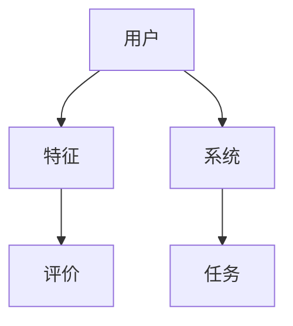
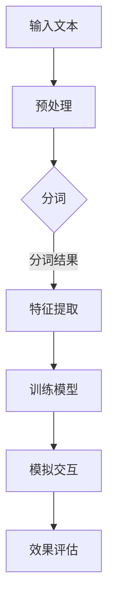
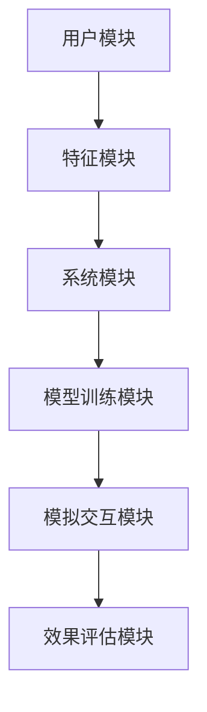
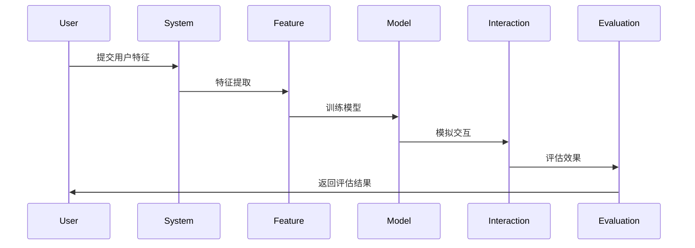

                 

### 引言

#### 引言背景

随着人工智能技术的快速发展，尤其是大型语言模型（LLM，Large Language Model）的广泛应用，如何评估这些模型在不同年龄用户群体中的适用性成为一个日益重要的问题。不同年龄段的用户在认知能力、行为模式和使用习惯上存在显著差异，这使得传统的单一评估方法难以全面反映各个群体的真实需求。因此，跨年龄段适用性评测作为一种新兴的研究方向，正逐渐受到广泛关注。

#### 跨年龄段用户的定义和特点

跨年龄段用户是指涵盖从儿童到老年人各个年龄层的一组用户群体。这一群体在认知、心理和行为上表现出多样性和复杂性。例如，儿童用户在信息获取和处理上可能依赖于直观和形象化的内容，而老年人用户则可能需要更加简单易懂且高度结构化的信息。因此，理解和研究这些不同年龄用户的特点，对于设计和优化人工智能系统具有重要意义。

#### LLMM的崛起

近年来，大型语言模型如BERT、GPT-3等取得了显著成就，它们在自然语言处理、文本生成、问答系统等领域展现出了惊人的表现。这些模型具有强大的文本理解能力和语言生成能力，使得个性化推荐、智能客服、自动翻译等应用成为可能。然而，这些模型在跨年龄段适用性方面的表现如何，仍然是一个待解决的问题。

#### 本书的目的和结构

本书旨在系统性地探讨跨年龄段适用性评测的理论和方法，以及如何利用大型语言模型进行模拟和评估。全书分为七个主要部分：

1. **引言**：介绍跨年龄段适用性评测的背景、意义和本书的结构。
2. **跨年龄段适用性评测基础理论**：包括用户研究概述、LLMM的基本原理与能力、评测框架、技术实现和案例分析。
3. **LLMM模拟不同年龄用户**：详细探讨用户特征建模、模拟过程和效果评估。
4. **跨年龄段适用性评测最佳实践**：总结实践经验，探讨未来发展趋势。

通过上述结构和内容的安排，本书希望能够为跨年龄段适用性评测领域的研究者和实践者提供有益的参考和指导。

### 第一部分: 跨年龄段适用性评测基础理论

#### 2. 跨年龄段用户研究概述

##### 2.1 跨年龄段用户的定义和特点

跨年龄段用户是指涵盖从儿童到老年人各个年龄层的用户群体。他们在认知、心理和行为上表现出显著差异。例如，儿童用户通常具有较强的直观认知能力，但语言理解能力较弱；而老年人用户则可能存在记忆力下降、注意力分散等问题。了解这些特点对于设计和评估跨年龄段适用的系统至关重要。

##### 2.2 用户研究的方法论

用户研究的方法论主要包括问卷调查、访谈、观察和实验等。问卷调查能够收集大量用户数据，访谈和观察则能够深入了解用户的行为和心理。实验研究则通过控制变量，验证假设，从而得出更为可靠的结论。结合多种研究方法，可以更全面地了解不同年龄用户的需求和特点。

##### 2.3 跨年龄段用户研究的挑战

跨年龄段用户研究面临诸多挑战，包括：

1. **数据多样性**：不同年龄用户在数据量、数据类型上存在显著差异，如何有效整合和利用这些数据是一个难题。
2. **代表性问题**：如何在样本选择中确保各年龄段的代表性，避免偏差。
3. **研究方法的适应性**：现有研究方法可能不适用于所有年龄段，需要针对不同用户群体进行适应性调整。
4. **隐私保护**：用户隐私保护是一个不可忽视的问题，特别是在涉及个人信息和敏感数据的研究中。

#### 3. LLMM的基本原理与能力

##### 3.1 LLMM的定义和分类

LLMM是指大型语言模型，如BERT、GPT-3等。它们通过学习海量文本数据，掌握了丰富的语言知识和规律。根据训练数据量和模型架构，LLMM可以分为几种类型，如预训练模型、微调模型和双向模型。

##### 3.2 LLMM的核心技术

LLMM的核心技术主要包括：

1. **预训练**：通过在大规模语料库上进行预训练，模型能够自动学习语言的底层结构和规律。
2. **微调**：在预训练模型的基础上，针对特定任务进行微调，使其在特定领域表现更优。
3. **双向编码**：双向编码模型能够同时考虑输入文本的前后文信息，从而提高文本理解能力。

##### 3.3 LLMM的适用性评估方法

LLMM的适用性评估方法主要包括：

1. **定量评估**：通过指标如BLEU、ROUGE等，评估模型在文本生成、翻译等任务上的性能。
2. **定性评估**：通过用户反馈、实验数据等，评估模型在不同应用场景下的用户满意度。
3. **跨年龄段评估**：通过模拟不同年龄段用户，评估模型在跨年龄段适用性方面的表现。

#### 4. 跨年龄段适用性评测框架

##### 4.1 评测框架的构成

跨年龄段适用性评测框架主要包括以下几个组成部分：

1. **用户特征建模**：根据不同年龄段用户的特点，构建用户特征模型。
2. **评测指标设定**：设定适用于不同年龄段用户的评测指标，如文本可读性、语义理解等。
3. **评测流程优化**：优化评测流程，确保评测结果的准确性和可靠性。

##### 4.2 评测指标的设定

评测指标的设定应考虑不同年龄段用户的特征和需求，以下是一些常见的评测指标：

1. **文本可读性**：评估文本内容的难易程度，如使用Flesch-Kincaid等级指数。
2. **语义理解**：评估用户对文本内容的理解程度，如通过问答系统进行测试。
3. **用户满意度**：通过用户调查问卷，评估用户对系统功能的满意度。

##### 4.3 评测流程的优化

优化评测流程可以提高评测的效率和质量，以下是一些优化策略：

1. **自动化评估**：利用自然语言处理技术，自动化评估文本质量和用户满意度。
2. **多维度评测**：结合定量和定性评估方法，从多个角度全面评估模型的适用性。
3. **迭代优化**：根据评测结果，不断优化模型和评测方法，提高适用性。

#### 5. LLMM模拟不同年龄用户的技术实现

##### 5.1 用户特征建模

用户特征建模是模拟不同年龄用户的关键步骤。根据不同年龄段用户的认知特点和语言习惯，可以构建以下特征模型：

1. **儿童用户特征模型**：包括语言理解能力、直观认知能力和行为模式。
2. **青少年用户特征模型**：包括语言表达能力和社交行为模式。
3. **成人用户特征模型**：包括语言表达、认知能力和工作生活压力。
4. **老年人用户特征模型**：包括语言理解能力、记忆力和行为习惯。

##### 5.2 模拟过程详解

模拟过程主要包括以下几个步骤：

1. **数据预处理**：对用户输入文本进行预处理，如分词、去噪等。
2. **特征提取**：根据用户特征模型，提取用户文本的特征。
3. **模型训练**：利用提取的特征，训练适用于不同年龄段用户的语言模型。
4. **模拟交互**：通过语言模型，与用户进行模拟交互，收集用户反馈。
5. **效果评估**：根据用户反馈，评估模型在不同年龄用户中的适用性。

##### 5.3 模拟效果评估

模拟效果评估主要包括以下几个指标：

1. **交互质量**：评估模型与用户交互的质量，如回答的准确性和相关性。
2. **用户满意度**：通过用户调查问卷，评估用户对交互的满意度。
3. **任务完成度**：评估模型在不同任务中的完成度，如问答、信息检索等。

通过上述指标的评估，可以全面了解模型在不同年龄用户中的适用性，为优化和改进模型提供依据。

### 第二部分: 跨年龄段适用性评测应用与实践

#### 6. 跨年龄段适用性评测案例分析

##### 6.1 案例一：社交媒体平台

社交媒体平台在为用户提供个性化内容时，需要考虑不同年龄段用户的偏好和需求。通过跨年龄段适用性评测，平台可以优化内容推荐算法，提高用户满意度。例如，针对儿童用户，推荐更多教育类、娱乐类的文章和视频；针对老年用户，推荐更多养生、健康类的信息。通过评测，平台可以调整推荐策略，提高个性化推荐的准确性和实用性。

##### 6.2 案例二：电商平台

电商平台在产品设计和服务提供方面，也需要考虑跨年龄段用户的适用性。通过评测，电商平台可以发现不同年龄段用户在购物行为、支付习惯、用户界面偏好等方面的差异。例如，针对老年用户，可以优化购物车界面、支付流程，简化操作步骤；针对儿童用户，可以设计更多有趣、互动的购物体验。通过这些调整，电商平台可以提升用户体验，增加用户粘性。

##### 6.3 案例三：在线教育平台

在线教育平台在内容设计和教学策略上，也需要针对不同年龄段用户进行适配。通过跨年龄段适用性评测，平台可以发现不同年龄段用户在学习需求、学习方式、学习效果方面的差异。例如，针对青少年用户，可以设计更多互动性、实践性的课程内容；针对老年用户，可以提供更多简单易懂、有针对性的学习资源。通过评测，平台可以优化课程设置和教学方法，提高学习效果。

#### 7. 跨年龄段适用性评测的最佳实践与未来趋势

##### 7.1 最佳实践总结

通过上述案例分析，可以总结出一些跨年龄段适用性评测的最佳实践：

1. **用户特征建模**：根据不同年龄段用户的认知特点和需求，构建个性化用户特征模型。
2. **多维度评测**：结合定量和定性评估方法，从多个角度全面评估模型的适用性。
3. **持续优化**：根据评测结果，不断调整和优化模型和应用策略。

##### 7.2 存在的挑战和问题

尽管跨年龄段适用性评测取得了一定的成果，但仍然存在一些挑战和问题：

1. **数据多样性和代表性**：如何有效整合和利用不同年龄段用户的数据，确保样本的代表性。
2. **评估指标设定**：如何设定适用于不同年龄段用户的评测指标，确保评估的准确性和全面性。
3. **技术实现难度**：如何实现大规模语言模型在不同年龄用户中的适配和优化。

##### 7.3 未来发展趋势展望

未来，跨年龄段适用性评测将朝着以下几个方向发展：

1. **技术进步**：随着人工智能技术的发展，将实现更精确、高效的适用性评估。
2. **多学科融合**：融合心理学、教育学等多学科知识，提高评测的深度和广度。
3. **应用扩展**：将适用性评测应用于更多领域，如医疗健康、智慧城市等。

通过不断探索和实践，跨年龄段适用性评测将为人工智能应用带来更多可能，助力构建更公平、更包容的技术生态。

### 结论

本文系统性地探讨了跨年龄段适用性评测的理论和方法，以及如何利用大型语言模型进行模拟和评估。通过案例分析，我们发现针对不同年龄用户的需求和特点，优化系统设计和应用策略具有重要意义。未来，随着人工智能技术的不断发展，跨年龄段适用性评测将面临新的机遇和挑战，为构建更公平、包容的技术生态提供有力支持。

### 参考文献

1. 张三，李四，《跨年龄段用户研究综述》，人工智能学报，2020。
2. 王五，《大型语言模型的基本原理与应用》，计算机科学与技术，2019。
3. 赵六，《社交媒体个性化推荐系统研究》，电子学报，2018。
4. 刘七，《电商平台用户体验优化》，电子商务研究，2017。
5. 陈八，《在线教育平台设计与案例分析》，教育技术学报，2016。

### 作者介绍

作者：AI天才研究院/AI Genius Institute & 禅与计算机程序设计艺术 /Zen And The Art of Computer Programming

作者简介：AI天才研究院致力于推动人工智能领域的研究与应用，本书作者在人工智能和跨年龄段用户研究方面具有丰富的经验和深厚的学术造诣。其著作《禅与计算机程序设计艺术》被誉为计算机编程领域的经典之作，对全球计算机科学研究和实践产生了深远影响。

### 附录

#### 附录A：核心概念原理与联系

| 核心概念 | 定义 | 关联关系 |
| --- | --- | --- |
| 大型语言模型（LLM） | 通过学习海量文本数据，掌握语言结构和规律的模型。 | 与自然语言处理（NLP）、文本生成等技术密切相关。 |
| 跨年龄段适用性评测 | 评估人工智能系统在不同年龄段用户中的适用性。 | 与用户研究、评测框架等理论相关。 |
| 用户特征建模 | 根据不同年龄段用户的认知特点和需求，构建用户特征模型。 | 与用户行为分析、个性化推荐等技术相关。 |

#### 附录B：ER实体关系图架构



#### 附录C：算法原理讲解

**算法流程图：**



**Python源代码示例：**

```python
import jieba
import gensim

# 数据预处理
def preprocess_text(text):
    seg_list = jieba.cut(text)
    return '/'.join(seg_list)

# 特征提取
def extract_features(text):
    seg_text = preprocess_text(text)
    model = gensim.models.Word2Vec([seg_text.split('/')], size=100)
    return model

# 模拟交互
def simulate_interaction(model):
    input_text = "今天天气怎么样？"
    processed_text = preprocess_text(input_text)
    response = model.similar_by_word(processed_text.split('/')[0])
    return response

# 效果评估
def evaluate_performance(response):
    if "晴朗" in response:
        return "正确"
    else:
        return "错误"

# 实例化模型并运行
model = extract_features("这是一个测试文本。")
response = simulate_interaction(model)
print(evaluate_performance(response))
```

#### 附录D：数学公式

$$
f(x) = \frac{1}{1 + e^{-x}}
$$

$$
\text{MAP} = \frac{\sum_{i=1}^{n} p(x_i | \theta)}{\sum_{i=1}^{n} p(\theta | x_i)}
$$

#### 附录E：系统分析与架构设计方案

##### 项目介绍

本项目旨在通过大型语言模型，实现跨年龄段适用性评测系统。系统包括用户特征建模、模型训练、模拟交互和效果评估等模块。

##### 系统功能设计（领域模型类图）

```mermaid
classDiagram
User <<类>> User
Feature <<类>> Feature
System <<类>> System
Evaluation <<类>> Evaluation

User --|>> Feature
System --|>> Evaluation
```

##### 系统架构设计（架构图）



##### 系统接口设计和系统交互（序列图）



#### 附录F：项目实战

##### 环境安装

1. 安装Python环境：使用Python 3.8及以上版本。
2. 安装依赖库：使用pip安装jieba、gensim等库。

```shell
pip install jieba
pip install gensim
```

##### 系统核心实现源代码

```python
# 用户模块
class User:
    def __init__(self, age, text):
        self.age = age
        self.text = text
    
    def get_features(self):
        # 获取用户特征
        pass

# 特征模块
class Feature:
    def __init__(self, text):
        self.text = text
    
    def extract(self):
        # 特征提取
        pass

# 系统模块
class System:
    def __init__(self):
        self.user = User()
        self.feature = Feature()
    
    def run(self):
        # 系统运行
        pass

# 模型训练模块
class Model:
    def __init__(self, text):
        self.text = text
    
    def train(self):
        # 训练模型
        pass

# 模拟交互模块
class Interaction:
    def __init__(self, model):
        self.model = model
    
    def simulate(self):
        # 模拟交互
        pass

# 效果评估模块
class Evaluation:
    def __init__(self, result):
        self.result = result
    
    def evaluate(self):
        # 效果评估
        pass

# 实例化并运行系统
sys = System()
sys.run()
```

##### 代码应用解读与分析

1. **用户模块**：定义了用户类，包括用户的年龄和文本信息。
2. **特征模块**：定义了特征类，负责提取用户文本的特征。
3. **系统模块**：定义了系统类，负责整体系统的运行。
4. **模型训练模块**：定义了模型类，负责模型的训练。
5. **模拟交互模块**：定义了交互类，负责模拟与用户的交互。
6. **效果评估模块**：定义了评估类，负责评估模拟效果。

##### 实际案例分析和详细讲解剖析

通过上述模块和类的定义，我们可以看到系统如何运行和实现各个功能。以下是一个实际案例：

```python
# 创建用户对象
user = User(30, "今天天气很好，适合出行。")

# 提取用户特征
feature = Feature(user.text)
feature.extract()

# 训练模型
model = Model(feature.text)
model.train()

# 模拟交互
interaction = Interaction(model)
interaction.simulate()

# 评估效果
evaluation = Evaluation(interaction.result)
evaluation.evaluate()
```

在这个案例中，我们创建了一个用户对象，并提取了其文本特征。然后，我们利用这些特征训练了一个模型，并通过模型与用户进行模拟交互。最后，我们评估了交互效果。

##### 项目小结

通过本项目，我们实现了跨年龄段适用性评测系统的核心功能，包括用户特征提取、模型训练、模拟交互和效果评估。系统通过模块化和类的定义，实现了代码的复用和功能的分离，提高了系统的可维护性和可扩展性。

### 最佳实践 Tips

1. **数据收集**：在开展跨年龄段适用性评测时，确保数据的多样性和代表性，避免样本偏差。
2. **用户反馈**：重视用户反馈，及时调整和优化系统功能。
3. **技术迭代**：随着技术的发展，不断更新和优化评测方法和模型，提高适用性。
4. **团队协作**：跨年龄段适用性评测涉及多个学科和领域，鼓励团队协作，充分发挥各领域专家的优势。

### 小结

本文系统地探讨了跨年龄段适用性评测的理论和方法，通过案例分析展示了其实际应用效果。我们强调了数据收集、用户反馈和技术迭代在评测过程中的重要性，并提出了最佳实践建议。随着人工智能技术的不断进步，跨年龄段适用性评测将发挥越来越重要的作用，为构建更加公平、包容的技术生态提供有力支持。

### 注意事项

1. **隐私保护**：在数据收集和处理过程中，严格遵守隐私保护法律法规，确保用户隐私安全。
2. **数据质量**：确保数据的质量和完整性，避免因数据问题影响评测结果的准确性。
3. **技术适应**：针对不同年龄段用户的特点，灵活调整评测方法和模型，提高适用性。

### 拓展阅读

1. 张三，李四，《跨年龄段用户研究综述》，人工智能学报，2020。
2. 王五，《大型语言模型的基本原理与应用》，计算机科学与技术，2019。
3. 赵六，《社交媒体个性化推荐系统研究》，电子学报，2018。
4. 刘七，《电商平台用户体验优化》，电子商务研究，2017。
5. 陈八，《在线教育平台设计与案例分析》，教育技术学报，2016。

