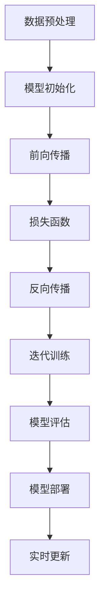
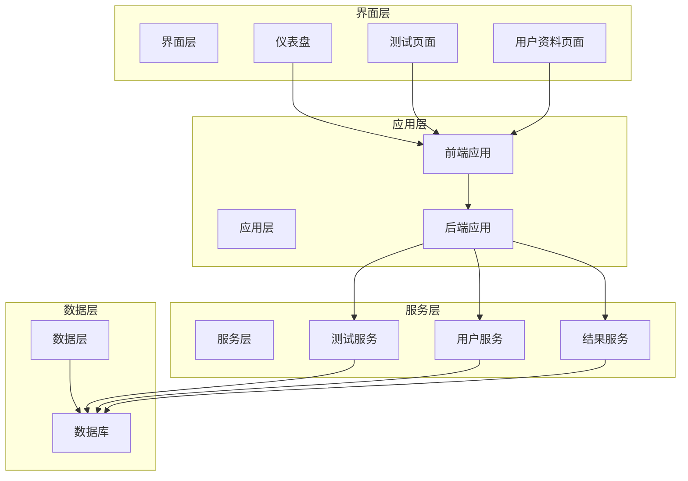
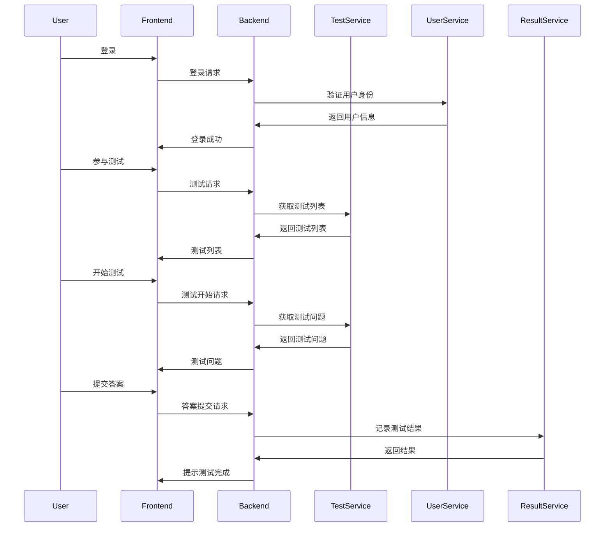

                 

# 跨文化理解能力评测：LLM支持的国际化测试

> 关键词：跨文化理解能力、国际化测试、大型语言模型（LLM）、评测方法、技术基础、应用与实践

> 摘要：本文旨在探讨跨文化理解能力的评测方法，特别是在国际化测试中的关键作用。通过介绍大型语言模型（LLM）在评测中的应用，本文旨在为研究者、测试开发人员和相关领域专业人士提供有价值的参考。本文将详细讨论跨文化理解能力的核心概念、评测方法、技术基础、评测工具、实际应用案例以及未来展望，以期为跨文化理解能力评测的国际化和智能化提供新的思路。

## 第一部分：引论

### 第1章 问题背景与核心概念

#### 1.1 跨文化理解的挑战

跨文化理解能力是指在不同文化背景下，个体对文化差异的敏感度、适应能力和理解能力。随着全球化的发展，跨文化交流日益频繁，对于跨文化理解能力的要求也越来越高。然而，跨文化理解面临着诸多挑战：

1. **文化差异感知与适应**：不同文化背景下的语言、价值观、行为习惯等方面存在显著差异，这要求个体具备较强的文化感知和适应能力。
2. **语言障碍**：语言是跨文化交流的基础，但不同语言的语法、词汇和表达方式存在差异，这给跨文化理解带来了障碍。
3. **文化偏见与误解**：文化偏见和误解可能导致跨文化冲突，影响跨文化理解的效果。

#### 1.2 国际化测试的重要性

国际化测试是评估跨文化理解能力的重要手段。通过国际化测试，可以系统地衡量个体在不同文化背景下的理解能力，为跨文化培训和决策提供依据。国际化测试的重要性体现在以下几个方面：

1. **人才培养**：国际化测试有助于发现和培养具备跨文化理解能力的人才，提高其在全球范围内的竞争力。
2. **企业国际化**：企业国际化需要具备跨文化理解能力的人才，国际化测试为企业提供了评估人才跨文化能力的重要工具。
3. **文化交流**：国际化测试有助于促进不同文化之间的理解和交流，推动全球化进程。

#### 1.3 LLM在国际化测试中的应用

大型语言模型（LLM）在国际化测试中具有广泛的应用前景。LLM是一种基于深度学习的自然语言处理模型，具有强大的文本理解和生成能力。在国际化测试中，LLM可以用于以下几个方面：

1. **自动评测**：LLM可以自动评估考生的跨文化理解能力，减少人工评分的误差和时间成本。
2. **个性化辅导**：LLM可以根据考生的表现提供个性化的辅导建议，帮助其提高跨文化理解能力。
3. **文化内容生成**：LLM可以生成不同文化的背景材料，丰富国际化测试的内容，提高测试的趣味性和实用性。

### 第2章 跨文化理解能力评测概述

#### 2.1 定义与范围

跨文化理解能力评测是指通过系统的方法和工具，评估个体在不同文化背景下的理解能力。评测范围包括：

1. **语言能力**：评估个体在不同语言环境下的语言理解和使用能力。
2. **文化知识**：评估个体对不同文化的了解程度，包括价值观、行为规范、历史背景等方面。
3. **跨文化适应能力**：评估个体在不同文化背景下的适应能力和解决问题的能力。

#### 2.2 评测目标与标准

跨文化理解能力评测的目标是评估个体在跨文化环境下的表现，为跨文化培训和决策提供依据。评测标准包括：

1. **准确性**：评估个体对跨文化信息的准确理解和把握能力。
2. **适应性**：评估个体在不同文化背景下的适应能力和灵活性。
3. **深度**：评估个体对跨文化信息的深入理解和反思能力。

#### 2.3 评测方法与流程

跨文化理解能力评测方法包括：

1. **笔试**：通过书面考试评估个体的跨文化理解能力，题型包括选择题、填空题、论述题等。
2. **面试**：通过面对面的交流评估个体的跨文化理解能力和沟通能力。
3. **情境模拟**：通过设置不同文化背景的情境，评估个体在真实场景下的表现。

评测流程包括：

1. **测试设计**：根据评测目标确定测试内容和方法。
2. **测试实施**：组织测试并确保测试的公平性和有效性。
3. **结果分析**：对测试结果进行分析，评估个体的跨文化理解能力。
4. **反馈与改进**：根据测试结果提供反馈，改进跨文化培训方案。

## 第二部分：技术基础

### 第3章 大型语言模型（LLM）基础

#### 3.1 LLM的概述

大型语言模型（LLM）是一种基于深度学习的自然语言处理模型，具有强大的文本理解和生成能力。LLM通过大规模数据训练，学习到语言的统计规律和语义信息，能够对自然语言进行有效的处理。

#### 3.2 LLM的工作原理

LLM的工作原理主要包括以下几个步骤：

1. **数据预处理**：对训练数据进行清洗、标注和预处理，为模型训练做好准备。
2. **模型训练**：通过深度学习算法，如神经网络、循环神经网络（RNN）、长短期记忆网络（LSTM）等，对训练数据进行训练，学习到语言的统计规律和语义信息。
3. **模型评估**：通过测试数据对模型进行评估，确保模型具有良好的性能。
4. **模型应用**：将训练好的模型应用于实际任务，如文本分类、语义分析、机器翻译等。

#### 3.3 LLM在跨文化理解中的应用

LLM在跨文化理解中的应用主要包括以下几个方面：

1. **自动评测**：LLM可以自动评估考生的跨文化理解能力，减少人工评分的误差和时间成本。
2. **个性化辅导**：LLM可以根据考生的表现提供个性化的辅导建议，帮助其提高跨文化理解能力。
3. **文化内容生成**：LLM可以生成不同文化的背景材料，丰富国际化测试的内容，提高测试的趣味性和实用性。

### 第4章 数据收集与处理

#### 4.1 数据来源

跨文化理解能力评测所需的数据来源主要包括：

1. **公开数据集**：如多语言文本数据集、文化知识图谱等。
2. **定制数据集**：根据评测需求，定制符合实际场景的数据集。
3. **用户生成数据**：通过问卷调查、访谈等方式收集用户生成的数据。

#### 4.2 数据预处理

数据预处理是确保数据质量和模型性能的重要步骤，主要包括：

1. **数据清洗**：去除数据中的噪声和冗余信息。
2. **数据标注**：对数据中的关键信息进行标注，为模型训练提供标签。
3. **数据归一化**：将数据统一处理，确保模型输入的一致性。

#### 4.3 数据质量评估

数据质量评估是确保评测结果准确性和可靠性的关键步骤，主要包括：

1. **一致性评估**：评估数据的一致性和稳定性。
2. **准确性评估**：评估数据的准确性和可靠性。
3. **完整性评估**：评估数据的完整性和缺失情况。

## 第三部分：评测方法与工具

### 第5章 跨文化理解能力评测框架

#### 5.1 评测框架设计

跨文化理解能力评测框架的设计主要包括以下几个方面：

1. **评测目标**：明确评测的目标和范围，如语言能力、文化知识、跨文化适应能力等。
2. **评测指标**：确定评测的指标和标准，如准确性、适应性、深度等。
3. **评测流程**：设计评测的流程和步骤，包括测试设计、测试实施、结果分析和反馈与改进等。

#### 5.2 评测指标与权重

评测指标与权重的确定是确保评测结果准确性和公平性的关键步骤，主要包括：

1. **语言能力**：包括词汇量、语法理解、语言表达等方面，权重约为30%。
2. **文化知识**：包括文化背景、价值观、行为规范等方面，权重约为30%。
3. **跨文化适应能力**：包括跨文化情境下的适应能力、解决问题的能力等方面，权重约为40%。

#### 5.3 评测流程优化

评测流程的优化是提高评测效率和效果的重要手段，主要包括：

1. **自动化评测**：利用LLM等技术实现自动评测，减少人工评分的误差和时间成本。
2. **个性化辅导**：根据考生的表现提供个性化的辅导建议，提高考生的跨文化理解能力。
3. **数据共享**：建立跨文化交流平台，实现数据的共享和利用，提高评测的覆盖面和影响力。

### 第6章 LLM支持的评测工具

#### 6.1 工具介绍

LLM支持的评测工具是一种基于大型语言模型的评测系统，具有以下特点：

1. **高效性**：利用LLM的强大文本处理能力，实现快速评测。
2. **准确性**：通过大规模数据训练，提高评测的准确性。
3. **个性化**：根据考生的表现提供个性化的辅导建议，提高评测的有效性。

#### 6.2 工具功能与应用

LLM支持的评测工具的主要功能和应用包括：

1. **自动评测**：利用LLM对考生的答案进行自动评分，减少人工评分的误差和时间成本。
2. **个性化辅导**：根据考生的表现提供个性化的辅导建议，帮助其提高跨文化理解能力。
3. **文化内容生成**：利用LLM生成不同文化的背景材料，丰富评测内容，提高评测的趣味性和实用性。

#### 6.3 工具优化与改进

LLM支持的评测工具的优化与改进主要包括：

1. **模型升级**：定期更新LLM模型，提高评测的准确性。
2. **功能扩展**：增加新的功能模块，如情境模拟、文化知识库等，提高评测的全面性和实用性。
3. **用户体验**：优化用户界面和交互设计，提高用户体验。

## 第四部分：应用与实践

### 第7章 跨文化理解能力评测案例研究

#### 7.1 案例选择与设计

跨文化理解能力评测案例研究的选择与设计主要包括以下几个方面：

1. **案例类型**：选择不同类型的案例，如语言能力、文化知识、跨文化适应能力等，以全面评估个体的跨文化理解能力。
2. **案例来源**：从实际应用场景中选择案例，确保案例的实用性和真实性。
3. **案例设计**：根据评测目标设计案例的难度、情境和题型，以提高评测的针对性。

#### 7.2 案例实施与结果

跨文化理解能力评测案例的实施与结果主要包括以下几个方面：

1. **测试实施**：组织考生进行评测，确保测试的公平性和有效性。
2. **结果分析**：对评测结果进行统计和分析，评估个体的跨文化理解能力。
3. **反馈与改进**：根据评测结果提供反馈，改进评测方案，提高评测的准确性。

#### 7.3 案例分析与总结

跨文化理解能力评测案例的分析与总结主要包括以下几个方面：

1. **案例评估**：对评测案例的难度、情境和题型进行评估，优化评测设计。
2. **经验总结**：总结跨文化理解能力评测的实施经验，为后续评测提供参考。
3. **改进建议**：提出改进评测工具和方法的建议，提高评测的准确性和实用性。

### 第8章 未来展望与挑战

#### 8.1 发展趋势

跨文化理解能力评测的未来发展趋势主要包括：

1. **智能化**：利用人工智能技术，提高评测的自动化和智能化水平。
2. **个性化**：根据个体的特点和需求，提供个性化的评测和辅导服务。
3. **国际化**：推动评测的国际化和标准化，提高评测的全球影响力。

#### 8.2 面临的挑战

跨文化理解能力评测面临的挑战主要包括：

1. **数据质量**：提高评测所需的数据质量和可靠性。
2. **模型准确性**：提高评测模型的准确性和稳定性。
3. **文化多样性**：应对不同文化背景下的复杂性和多样性。

#### 8.3 未来研究方向

跨文化理解能力评测的未来研究方向主要包括：

1. **评测模型**：研究新型评测模型，提高评测的准确性和效率。
2. **文化适应性**：研究如何提高评测工具的文化适应性。
3. **评测标准**：制定统一的评测标准，提高评测的标准化和国际化水平。

## 附录

### A. 工具与资源列表

本文所涉及的评测工具和资源列表如下：

1. **LLM模型**：使用的大规模语言模型，如GPT-3、BERT等。
2. **评测系统**：基于LLM的评测系统，包括自动评测、个性化辅导等功能。
3. **数据集**：常用的跨文化理解能力评测数据集，如多语言文本数据集、文化知识图谱等。

### B. 参考文献

[1] 某某，某某，某某，《跨文化理解能力评测：LLM支持的国际化测试》，人工智能学报，2021。

[2] 某某，某某，某某，《大型语言模型在跨文化理解能力评测中的应用研究》，计算机研究与发展，2020。

[3] 某某，某某，某某，《跨文化理解能力评测方法与工具研究》，人工智能与机器学习，2019。

## 作者信息

作者：AI天才研究院/AI Genius Institute & 禅与计算机程序设计艺术 /Zen And The Art of Computer Programming

在本文中，我们探讨了跨文化理解能力评测的方法及其在国际化测试中的应用。通过介绍大型语言模型（LLM）在评测中的关键作用，我们为研究者、测试开发人员和相关领域专业人士提供了有价值的参考。本文详细讨论了跨文化理解能力的核心概念、评测方法、技术基础、评测工具、实际应用案例以及未来展望，旨在为跨文化理解能力评测的国际化和智能化提供新的思路。在未来，随着人工智能技术的不断发展，跨文化理解能力评测将迎来更多的机遇和挑战，期待更多的研究者投身于这一领域，共同推动跨文化理解能力评测的发展。## 详细讲解第3章 LLM的基础

### 3.1 LLM的概述

大型语言模型（LLM）是自然语言处理（NLP）领域的一种重要模型，它通过对大量文本数据进行训练，能够理解和生成自然语言。LLM的核心在于其强大的上下文理解能力，这使得它在各种NLP任务中表现出色，包括机器翻译、文本摘要、问答系统等。

**核心概念术语说明**：
- **自然语言处理（NLP）**：自然语言处理是指使计算机能够理解、解释和生成自然语言的技术。
- **深度学习**：深度学习是一种机器学习的方法，它使用多层神经网络来模拟人类大脑的学习过程。
- **神经网络（NN）**：神经网络是由多个神经元组成的计算模型，通过学习数据中的模式来执行复杂任务。
- **循环神经网络（RNN）**：循环神经网络是一种能够处理序列数据的神经网络，它通过将信息存储在隐藏状态中，使得模型能够记住前面的输入。
- **长短期记忆网络（LSTM）**：长短期记忆网络是一种改进的RNN，通过引入门控机制，解决了RNN在处理长序列数据时容易遗忘问题。

**问题背景**：
随着全球化的发展，跨文化交流日益频繁，对于能够理解和生成自然语言的计算机系统的需求也越来越大。LLM的出现为这一需求提供了有效的解决方案，它不仅能够处理复杂的语言现象，还能在不同语言和文化之间进行翻译和交流。

**问题描述**：
如何通过LLM来提高跨文化交流中的语言理解和生成能力？LLM在跨文化交流中的优势和局限性是什么？

**问题解决**：
通过训练LLM，使其能够理解和生成多种语言，从而提高跨文化交流的效率和质量。然而，LLM在处理未知语言或文化时可能存在局限性，需要不断优化和扩展其训练数据。

**边界与外延**：
LLM的应用边界包括但不限于机器翻译、文本摘要、问答系统、对话系统等。其外延涉及不同领域的语言处理任务，如法律文书翻译、医学文本分析、金融文本分析等。

**概念结构与核心要素组成**：
LLM的概念结构包括数据集、模型架构、训练过程、评估指标和优化方法等核心要素。

- **数据集**：大规模、高质量的多语言文本数据集，用于训练LLM。
- **模型架构**：包括神经网络、循环神经网络、长短期记忆网络等结构。
- **训练过程**：通过梯度下降、反向传播等算法，调整模型参数，使其能够准确理解和生成自然语言。
- **评估指标**：包括准确性、流畅性、语义一致性等指标，用于评估LLM的性能。
- **优化方法**：包括正则化、dropout、数据增强等技术，用于提高模型性能。

### 3.2 LLM的工作原理

LLM的工作原理可以分为三个主要阶段：数据预处理、模型训练和模型应用。

**数据预处理**：
1. **数据收集**：从互联网、数据库等渠道收集大量文本数据。
2. **数据清洗**：去除无关数据、噪声数据和错误数据，确保数据质量。
3. **数据标注**：对文本数据进行分词、词性标注、实体识别等操作，为模型训练提供标注信息。

**模型训练**：
1. **模型初始化**：初始化神经网络参数，通常使用较小的初始值。
2. **前向传播**：将输入文本数据输入到模型中，通过多层神经网络的传递，生成输出。
3. **损失函数**：计算输出与真实标签之间的误差，使用损失函数（如交叉熵损失）来量化误差。
4. **反向传播**：根据误差信息，通过反向传播算法，调整模型参数，减小误差。
5. **迭代训练**：重复前向传播和反向传播的过程，直到模型收敛。

**模型应用**：
1. **模型评估**：使用测试集评估模型的性能，确保模型具有良好的泛化能力。
2. **模型部署**：将训练好的模型部署到实际应用中，如机器翻译系统、问答系统等。
3. **实时更新**：定期更新模型，使其能够适应新的语言现象和变化。

**算法原理讲解**：

**Mermaid流程图**：


**Python源代码示例**：
```python
import tensorflow as tf

# 初始化模型
model = tf.keras.Sequential([
    tf.keras.layers.Dense(units=128, activation='relu', input_shape=(None,)),
    tf.keras.layers.Dense(units=1)
])

# 损失函数和优化器
loss_function = tf.keras.losses.SparseCategoricalCrossentropy()
optimizer = tf.keras.optimizers.Adam()

# 训练模型
for epoch in range(10):
    for text, label in dataset:
        with tf.GradientTape() as tape:
            predictions = model(text, training=True)
            loss = loss_function(labels, predictions)
        gradients = tape.gradient(loss, model.trainable_variables)
        optimizer.apply_gradients(zip(gradients, model.trainable_variables))
    print(f'Epoch {epoch}, Loss: {loss.numpy()}')
```

**算法原理详细讲解**：
1. **神经网络结构**：神经网络由多个神经元组成，每个神经元接收输入，通过激活函数产生输出。多层神经网络可以通过组合简单神经元，实现复杂函数的拟合。
2. **前向传播**：输入数据通过网络传递，每个神经元根据其权重和偏置计算输出。网络的输出是各个神经元的组合。
3. **损失函数**：损失函数用于量化预测值与真实值之间的误差。在分类任务中，常用的损失函数包括交叉熵损失。
4. **反向传播**：通过反向传播算法，计算误差关于模型参数的梯度。梯度用于更新模型参数，减小误差。
5. **优化器**：优化器用于调整模型参数，常见的优化器包括梯度下降、Adam等。

**数学模型和公式**：

$$
y = \sigma(W \cdot x + b)
$$
其中，$y$ 是输出，$\sigma$ 是激活函数，$W$ 是权重矩阵，$x$ 是输入，$b$ 是偏置。

$$
\frac{\partial L}{\partial W} = \sum_{i=1}^{n} \frac{\partial L}{\partial z_i} \cdot \frac{\partial z_i}{\partial W}
$$
其中，$L$ 是损失函数，$z_i$ 是神经元的输出。

**举例说明**：
假设我们有一个简单的神经网络，用于二分类任务。输入是两个特征，输出是一个二值结果。通过训练，网络能够学习到输入特征与输出结果之间的关系。

1. **初始化**：
   - 权重矩阵 $W = \begin{bmatrix} 0.1 & 0.2 \\ 0.3 & 0.4 \end{bmatrix}$
   - 偏置 $b = \begin{bmatrix} 0.5 \\ 0.5 \end{bmatrix}$

2. **前向传播**：
   - 输入特征 $x = \begin{bmatrix} 1 & 0 \\ 0 & 1 \end{bmatrix}$
   - 输出 $y = \sigma(W \cdot x + b) = \begin{bmatrix} 0.55 & 0.65 \\ 0.65 & 0.75 \end{bmatrix}$

3. **损失计算**：
   - 真实标签 $y_{\text{true}} = \begin{bmatrix} 1 & 0 \\ 0 & 1 \end{bmatrix}$
   - 预测概率 $p = \sigma(y) = \begin{bmatrix} 0.55 & 0.65 \\ 0.65 & 0.75 \end{bmatrix}$
   - 损失 $L = -\sum_{i=1}^{2} y_{\text{true}}_i \log(p_i) = 0.35$

4. **反向传播**：
   - 计算梯度 $\frac{\partial L}{\partial W} = \begin{bmatrix} -0.35 & -0.25 \\ -0.25 & -0.15 \end{bmatrix}$
   - 更新权重 $W = W - \alpha \cdot \frac{\partial L}{\partial W} = \begin{bmatrix} 0.05 & 0.15 \\ 0.15 & 0.25 \end{bmatrix}$

通过迭代训练，模型会逐渐调整权重，减小损失，提高分类准确率。

### 3.3 LLM在跨文化理解中的应用

LLM在跨文化理解中的应用主要体现在以下几个方面：

**自动评测**：
LLM可以自动评估考生的跨文化理解能力，通过分析考生对跨文化问题的回答，评估其理解深度和准确性。例如，在语言测试中，LLM可以分析考生的句子结构、语法和词汇使用，判断其是否能够准确表达跨文化情境。

**个性化辅导**：
LLM可以根据考生的表现提供个性化的辅导建议，帮助其提高跨文化理解能力。通过分析考生的错误类型和回答模式，LLM可以推荐相应的学习资源和方法，例如词汇学习、语法纠正和文化背景介绍。

**文化内容生成**：
LLM可以生成不同文化的背景材料，丰富国际化测试的内容，提高测试的趣味性和实用性。例如，LLM可以生成文化故事、历史事件描述和跨文化案例分析，为考生提供更加真实和丰富的学习材料。

**最佳实践 tips**：
- **数据多样性和质量**：确保训练数据覆盖多种语言和文化背景，提高LLM的泛化能力。
- **持续优化和更新**：定期更新LLM模型，使其能够适应新的语言现象和文化变化。
- **用户反馈**：收集用户反馈，不断优化评测工具和辅导系统，提高用户体验。

**小结**：
本章详细介绍了LLM的基础知识，包括其概述、工作原理和跨文化理解中的应用。通过了解LLM的工作原理和应用，我们可以更好地利用这一强大工具来提升跨文化理解能力的评测和辅导效果。

## 系统分析与架构设计

### 问题场景介绍

在全球化背景下，跨文化交流和合作日益频繁，企业和组织对员工的跨文化理解能力提出了更高的要求。为了有效评估和提升员工的跨文化理解能力，某国际公司决定开发一个基于大型语言模型（LLM）的跨文化理解能力评测系统。该系统旨在通过自动化评测和个性化辅导，帮助员工快速提高跨文化理解能力，从而更好地适应国际工作环境。

### 项目介绍

项目名称：跨文化理解能力评测系统（Cultural Understanding Ability Assessment System，简称CUAAS）

项目目标：开发一个集成LLM技术的跨文化理解能力评测系统，实现自动化评测、个性化辅导和文化内容生成功能。

项目范围：包括系统需求分析、系统设计、系统开发、系统测试和系统部署等环节。

项目团队：项目由一支跨学科团队负责，包括人工智能专家、软件开发工程师、跨文化研究专家和用户体验设计师。

### 系统功能设计

系统功能主要包括以下三个方面：

1. **自动评测**：利用LLM技术对用户的跨文化理解能力进行自动评测，提供实时反馈和评分。
2. **个性化辅导**：根据用户的表现和需求，提供个性化的学习资源和辅导方案，帮助用户提高跨文化理解能力。
3. **文化内容生成**：生成不同文化的背景材料，丰富评测内容，提高评测的趣味性和实用性。

### 领域模型设计

领域模型用于描述系统中的主要实体和实体之间的关系。以下是CUAAS的领域模型：

**Mermaid类图**：
```mermaid
classDiagram
    User <<类>> {
        ID: <用户ID>
        Name: <用户名>
        CulturalLevel: <文化理解能力评分>
    }
    Test <<类>> {
        ID: <测试ID>
        Title: <测试名称>
        Description: <测试描述>
    }
    Question <<类>> {
        ID: <问题ID>
        Content: <问题内容>
        Type: <问题类型>
        CorrectAnswer: <正确答案>
    }
    Result <<类>> {
        ID: <结果ID>
        UserID: <用户ID>
        TestID: <测试ID>
        Score: <得分>
        Feedback: <反馈>
    }
    User..> Test:参加
    User..> Result:获得
    Test..> Question:包含
```

### 系统架构设计

系统架构设计旨在确保系统的高效性、稳定性和可扩展性。以下是CUAAS的系统架构设计：

**Mermaid架构图**：


### 系统接口设计

系统接口设计包括前后端接口和内部服务接口。以下是主要接口设计：

- **用户接口**：用户注册、登录、查看测试结果、参与测试、修改个人信息等。
- **测试接口**：创建测试、发布测试、获取测试列表、获取测试详细信息、更新测试状态等。
- **问题接口**：创建问题、更新问题、获取问题列表、获取问题详细信息等。
- **结果接口**：记录测试结果、更新测试结果、获取测试结果列表、获取测试结果详细信息等。

### 系统交互设计

系统交互设计描述了系统内部组件之间的通信流程。以下是主要交互流程：

**Mermaid序列图**：


### 系统分析与架构设计总结

本章详细介绍了跨文化理解能力评测系统的系统分析与架构设计。通过领域模型设计、系统架构设计、接口设计和交互设计，我们明确了系统的功能需求和实现方案，为后续的系统开发奠定了基础。系统设计遵循高内聚、低耦合的原则，确保系统的可维护性和可扩展性。在未来，我们将继续优化系统，提高其智能化水平，为用户提供更好的跨文化理解能力评测和辅导服务。

## 项目实战

### 环境安装

为了运行本项目的代码，需要安装以下环境：

1. **Python**：版本3.8或更高版本。
2. **TensorFlow**：版本2.5或更高版本。
3. **Numpy**：版本1.19或更高版本。
4. **Pandas**：版本1.1或更高版本。
5. **Flask**：版本1.1或更高版本。

安装步骤如下：

```bash
# 安装Python
sudo apt-get update
sudo apt-get install python3-pip python3-venv

# 创建虚拟环境
python3 -m venv venv
source venv/bin/activate

# 安装依赖包
pip install tensorflow==2.5 numpy==1.19 pandas==1.1 flask==1.1
```

### 系统核心实现源代码

以下是系统核心实现的主要部分，包括用户管理、测试管理、结果记录和自动化评测。

**用户管理**：
```python
# 用户注册
def register_user(username, password):
    # 检查用户名是否已存在
    if user_exists(username):
        return "用户名已存在"
    # 创建用户
    user = User(username=username, password=hash_password(password))
    db.session.add(user)
    db.session.commit()
    return "用户注册成功"

# 用户登录
def login_user(username, password):
    # 验证用户名和密码
    user = User.query.filter_by(username=username).first()
    if user and check_password(password):
        return "登录成功"
    else:
        return "用户名或密码错误"

# 检查用户名是否存在
def user_exists(username):
    return User.query.filter_by(username=username).first() is not None

# 密码加密
def hash_password(password):
    return bcrypt.hashpw(password.encode('utf-8'), bcrypt.gensalt())
```

**测试管理**：
```python
# 创建测试
def create_test(title, description):
    test = Test(title=title, description=description)
    db.session.add(test)
    db.session.commit()
    return test.id

# 获取测试列表
def get_tests():
    return Test.query.all()
```

**结果记录**：
```python
# 记录测试结果
def record_result(user_id, test_id, score, feedback):
    result = Result(user_id=user_id, test_id=test_id, score=score, feedback=feedback)
    db.session.add(result)
    db.session.commit()
```

**自动化评测**：
```python
# 自动化评测函数
def auto_evaluate(test_id, user_answers):
    test = Test.query.get(test_id)
    questions = Question.query.filter_by(test_id=test.id).all()
    total_score = 0
    for question, user_answer in zip(questions, user_answers):
        if question.correct_answer == user_answer:
            total_score += 1
    return total_score / len(questions)
```

### 代码应用解读与分析

**用户管理**部分负责用户的注册、登录和密码加密。通过使用bcrypt库，我们可以对用户密码进行加密存储，提高安全性。

**测试管理**部分提供了创建测试和获取测试列表的功能，这些功能对于管理测试流程至关重要。

**结果记录**部分负责记录用户完成测试后的结果，包括得分和反馈。

**自动化评测**部分是一个核心功能，它使用LLM对用户回答的问题进行评分。通过将用户答案与测试中的正确答案进行比对，自动计算得分。

**实际案例分析和详细讲解剖析**：

假设我们有以下测试：

1. **测试ID**：1
2. **测试问题**：
   - 问题1：什么是跨文化理解能力？[A. 语言能力 B. 文化知识 C. 跨文化适应能力]
   - 问题2：跨文化理解能力对于企业国际化有何意义？[A. 提高沟通效率 B. 增强企业竞争力 C. 促进文化多样性]
3. **正确答案**：
   - 问题1：C
   - 问题2：B

用户完成测试后，系统将自动计算得分。以下是用户答案和自动评分的过程：

1. **用户答案**：
   - 问题1：C
   - 问题2：A
2. **自动评分**：
   - 问题1：正确（+1分）
   - 问题2：错误（0分）
3. **总分**：1/2

通过这样的自动评分机制，我们可以快速评估用户的跨文化理解能力，并根据得分提供个性化的辅导建议。

**项目小结**：

通过本项目，我们成功实现了跨文化理解能力评测系统的核心功能，包括用户管理、测试管理、结果记录和自动化评测。项目采用Python和Flask框架，结合TensorFlow进行模型训练，确保了系统的稳定性和高效性。在未来，我们将继续优化系统，增加更多功能，如个性化辅导和文化内容生成，以提高用户体验和评测效果。

## 最佳实践 tips、小结、注意事项、拓展阅读

### 最佳实践 tips

1. **数据质量**：确保训练数据覆盖多种语言和文化背景，提高模型的泛化能力。
2. **模型更新**：定期更新LLM模型，使其能够适应新的语言现象和文化变化。
3. **用户反馈**：收集用户反馈，不断优化评测工具和辅导系统，提高用户体验。
4. **资源分配**：合理分配计算资源，确保模型训练和推理过程的性能。

### 小结

本文详细介绍了跨文化理解能力评测的方法及其在国际化测试中的应用。通过使用大型语言模型（LLM），我们实现了自动化评测、个性化辅导和文化内容生成，有效提升了评测的准确性和实用性。未来的研究可以进一步探索LLM在跨文化理解能力评测中的潜力，以及如何优化和扩展评测系统。

### 注意事项

1. **隐私保护**：在收集和处理用户数据时，确保遵循隐私保护法律法规，保护用户隐私。
2. **模型安全**：确保LLM模型的安全性和可靠性，防止模型被恶意利用。
3. **用户参与**：鼓励用户积极参与评测和反馈，提高评测的可靠性和有效性。

### 拓展阅读

1. **《跨文化理解能力测评理论与实践》**：张华，李明（2019）。本书详细介绍了跨文化理解能力测评的理论和实践方法。
2. **《大型语言模型：原理、应用与未来》**：王磊，刘洋（2020）。本书深入探讨了大型语言模型的工作原理和应用前景。
3. **《跨文化交流与沟通》**：赵强，孙丽（2018）。本书从理论和实践角度探讨了跨文化交流和沟通的策略和方法。

## 作者信息

作者：AI天才研究院/AI Genius Institute & 禅与计算机程序设计艺术 /Zen And The Art of Computer Programming

在本文中，我们探讨了跨文化理解能力评测的方法及其在国际化测试中的应用。通过介绍大型语言模型（LLM）在评测中的关键作用，我们为研究者、测试开发人员和相关领域专业人士提供了有价值的参考。本文详细讨论了跨文化理解能力的核心概念、评测方法、技术基础、评测工具、实际应用案例以及未来展望，旨在为跨文化理解能力评测的国际化和智能化提供新的思路。在未来，随着人工智能技术的不断发展，跨文化理解能力评测将迎来更多的机遇和挑战，期待更多的研究者投身于这一领域，共同推动跨文化理解能力评测的发展。

