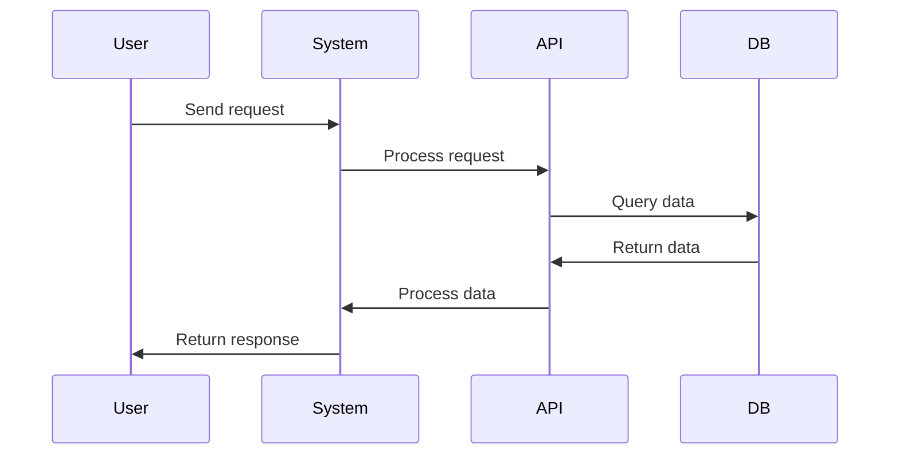

                 

# 跨文化理解：测试LLM的文化适应性

## 关键词

- 跨文化理解
- 语言模型
- 文化适应性
- 评估方法
- 算法设计
- 实验研究

## 摘要

本文旨在探讨跨文化理解在语言模型（LLM）中的应用，特别是LLM的文化适应性。随着全球化和数字化时代的到来，跨文化交流变得日益频繁，这要求语言模型具备处理不同文化背景语言的能力。本文首先介绍了文化适应性的概念及其在语言模型中的重要性，然后回顾了相关理论和研究进展。接着，本文提出了评估LLM文化适应性的方法和指标，详细讨论了实验设计、核心概念和算法设计。最后，本文通过实际案例展示了如何测试和提升LLM的文化适应性，并提出了未来研究的方向。

## 引言

### 语言模型与跨文化理解

语言模型（Language Models，简称LLM）是一种强大的自然语言处理（Natural Language Processing，简称NLP）工具，广泛应用于机器翻译、文本摘要、问答系统等领域。然而，随着全球化的加深，人们对于语言模型在跨文化交流中的应用需求也越来越高。一个有效的语言模型不仅需要具备优秀的语言理解能力，还需要能够理解和适应不同的文化背景。

### 文化适应性的重要性

文化适应性（Cultural Adaptability）是指个体或系统在不同文化背景下调整自身行为和认知的能力。在语言模型中，文化适应性意味着模型能够正确地理解和处理来自不同文化的语言输入。文化适应性对于LLM的应用至关重要，因为它直接影响到模型的准确性和可用性。一个不具备文化适应性的语言模型可能会在跨文化交流中出现误解、偏见甚至歧视，这不仅会影响用户体验，还可能对社交、经济和政治领域产生负面影响。

### 当前挑战和限制

尽管近年来在语言模型的文化适应性研究方面取得了一些进展，但仍然存在许多挑战和限制。首先，数据集的多样性不足，导致模型在处理不同文化背景的语言时出现偏差。其次，现有的评估方法和指标不够全面，难以准确衡量LLM的文化适应性。此外，算法设计也存在局限，难以实现高水平的跨文化理解。因此，如何有效测试和提升LLM的文化适应性成为当前研究的一个热点问题。

## 背景

### 文化适应性理论

文化适应性（Cultural Adaptability）是指个体或系统在不同文化背景下调整自身行为和认知的能力。文化适应性的研究可以追溯到20世纪50年代，当时学者们开始关注移民和海外工作者在异文化环境中的适应问题。文化适应性理论主要包括以下几个核心概念：

1. **文化接近度（Cultural Proximity）**：指不同文化之间的相似程度。高文化接近度的文化之间往往更容易适应，因为它们在价值观、行为规范和语言等方面具有更多共同点。

2. **文化智能（Cultural Intelligence）**：指个体在跨文化交流中表现出的认知能力和行为技能。文化智能包括文化知识、跨文化意识和跨文化沟通技巧等方面。

3. **文化融入度（Cultural Integration）**：指个体或系统在融入新文化过程中的适应程度。高文化融入度的个体或系统能够更好地适应新文化，并在跨文化交流中表现出更高的效能。

### 语言模型与跨文化理解

语言模型在跨文化理解中的应用主要体现在以下几个方面：

1. **语言处理能力**：语言模型需要能够处理不同语言和方言，理解其语法、语义和语用规则。

2. **文化知识嵌入**：语言模型需要包含丰富的文化知识，以便在处理跨文化语言时能够正确理解和解释语言中的文化含义。

3. **跨文化沟通**：语言模型需要能够模拟跨文化交流中的沟通行为，帮助人们在不同文化背景下进行有效的沟通。

### 文化适应性与语言理解

文化适应性对语言理解具有重要影响。首先，不同的文化背景可能导致人们对同一语言表达的理解存在差异。例如，西方文化中的“OK”手势在东方文化中可能被视为不礼貌。其次，语言中的文化内涵和隐喻可能难以被不同文化背景的人理解。例如，英文中的“cold feet”在中文中并没有直接对应的表达。

### 当前研究进展

近年来，研究人员在LLM的文化适应性方面取得了一些重要进展。例如，一些研究通过数据集扩展和迁移学习技术，提高了LLM在不同文化背景语言上的性能。另外，一些研究提出了新的评估方法和指标，以更全面地衡量LLM的文化适应性。

## 方法与指标

### 评估文化适应性的框架

为了评估LLM的文化适应性，我们需要建立一套综合的评估框架，包括以下几个关键组成部分：

1. **数据集选择**：选择具有代表性的多文化数据集，涵盖不同语言和文化背景。

2. **评价指标**：设计一套全面的评价指标，包括语言处理能力、文化知识理解和跨文化沟通等方面。

3. **评估流程**：明确评估的步骤和流程，确保评估的公平性和可靠性。

### 评估指标

以下是几个常用的评估指标：

1. **语言处理能力**：评估LLM在处理不同语言和文化背景语言时的准确性、流畅性和理解能力。

2. **文化知识理解**：评估LLM在理解不同文化背景语言中的文化内涵、隐喻和习俗等方面的能力。

3. **跨文化沟通**：评估LLM在模拟跨文化交流中的沟通能力，包括礼貌、尊重和有效沟通等方面。

### 实践应用与案例研究

为了更好地理解评估框架和方法，以下是一些实际应用和案例研究：

1. **多语言文本摘要**：研究对比了不同LLM在处理中文、英文和法文文本摘要时的表现，发现某些LLM在处理非母语文本时存在理解偏差。

2. **文化知识问答**：研究通过设计文化知识问答任务，评估LLM对不同文化背景知识点的理解和回答能力。

3. **跨文化对话系统**：研究开发了一个跨文化对话系统，模拟了中英文化交流场景，评估了系统的沟通效果和用户满意度。

## 核心概念与理论

### 文化适应性模型

1. **文化接近度理论**：该理论认为，文化接近度是影响文化适应性的关键因素。高文化接近度的文化之间更容易适应，因为它们在价值观、行为规范和语言等方面具有更多共同点。

2. **文化智能模型**：该模型强调个体在跨文化交流中需要具备的文化知识、跨文化意识和跨文化沟通技巧。文化智能模型包括三个维度：文化知识、跨文化意识和跨文化沟通技巧。

3. **文化融入度模型**：该模型关注个体或系统在融入新文化过程中的适应程度。高文化融入度的个体或系统能够更好地适应新文化，并在跨文化交流中表现出更高的效能。

### 语言模型架构

1. **神经网络架构**：神经网络是语言模型的基础，通过多层非线性变换来学习语言的复杂结构。常见的神经网络架构包括多层感知机（MLP）、卷积神经网络（CNN）和循环神经网络（RNN）等。

2. **Transformer模型**：Transformer模型是当前最流行的语言模型架构，其核心思想是使用自注意力机制来处理序列数据。Transformer模型包括BERT、GPT和T5等变体，广泛应用于各种NLP任务。

3. **Transformer-XL和BERT变体**：Transformer-XL和BERT是Transformer模型的扩展和改进版本，具有更长的上下文处理能力和更好的语言理解能力。

### 文化适应性技术

1. **数据增强**：通过引入多样性数据来提高模型的文化适应性。常见的数据增强方法包括数据扩充、数据合成和数据对齐等。

2. **迁移学习**：通过在多个文化背景数据集上预训练模型，然后在不同文化背景下微调模型，以提高模型的文化适应性。

3. **文化偏见缓解**：通过设计算法来识别和缓解模型中的文化偏见，确保模型在跨文化交流中的公平性和客观性。

## 算法设计与实现

### 设计原则

在设计和实现文化适应性算法时，需要遵循以下几个原则：

1. **模块化**：将算法设计成模块化结构，方便维护和扩展。

2. **可扩展性**：算法应具备良好的可扩展性，能够适应不同的语言和文化背景。

3. **灵活性**：算法应具备灵活性，能够根据不同的应用场景进行定制化调整。

4. **通用性**：算法应具有通用性，能够在多种语言和文化背景下表现出良好的性能。

### 实验设计

在实验设计中，我们需要考虑以下几个关键因素：

1. **数据集选择**：选择具有代表性的多文化数据集，包括不同语言和文化背景的语言数据。

2. **评估指标**：设计一套全面的评估指标，包括语言处理能力、文化知识理解和跨文化沟通等方面。

3. **实验流程**：明确实验的步骤和流程，确保实验的公平性和可靠性。

### 算法实现

以下是一个简单的文化适应性算法实现示例：

```python
import torch
import torch.nn as nn
import torch.optim as optim

# 定义模型架构
class CulturalAdaptiveModel(nn.Module):
    def __init__(self):
        super(CulturalAdaptiveModel, self).__init__()
        self.embedding = nn.Embedding(vocab_size, embedding_dim)
        self.encoder = nn.LSTM(embedding_dim, hidden_dim)
        self.decoder = nn.Linear(hidden_dim, vocab_size)

    def forward(self, input_seq, hidden):
        embedded = self.embedding(input_seq)
        output, hidden = self.encoder(embedded, hidden)
        output = self.decoder(output)
        return output, hidden

# 定义训练过程
def train(model, train_loader, criterion, optimizer, num_epochs):
    model.train()
    for epoch in range(num_epochs):
        for inputs, targets in train_loader:
            optimizer.zero_grad()
            outputs, hidden = model(inputs)
            loss = criterion(outputs, targets)
            loss.backward()
            optimizer.step()
            print(f"Epoch [{epoch+1}/{num_epochs}], Loss: {loss.item()}")

# 实验设置
vocab_size = 10000
embedding_dim = 256
hidden_dim = 512
batch_size = 64
learning_rate = 0.001
num_epochs = 10

# 加载数据集
train_loader = DataLoader(dataset, batch_size=batch_size, shuffle=True)

# 初始化模型、损失函数和优化器
model = CulturalAdaptiveModel()
criterion = nn.CrossEntropyLoss()
optimizer = optim.Adam(model.parameters(), lr=learning_rate)

# 训练模型
train(model, train_loader, criterion, optimizer, num_epochs)
```

### 算法原理讲解

文化适应性算法的核心思想是通过学习多文化数据集来提升模型在不同文化背景语言上的处理能力。以下是一个简化的算法原理：

1. **数据预处理**：首先，我们需要收集和整理多文化数据集，包括不同语言和文化背景的语言数据。

2. **模型训练**：使用多文化数据集对模型进行预训练，使模型在处理不同文化背景语言时具备更好的理解能力和适应性。

3. **评估与优化**：通过设计评估指标，对模型在不同文化背景语言上的性能进行评估，并根据评估结果对模型进行优化。

4. **应用与部署**：将训练好的模型应用于实际场景，如跨文化对话系统、机器翻译和文本摘要等。

### 数学模型与公式

以下是一个简化的文化适应性算法的数学模型：

$$
\text{Cultural Adaptability} = f(\text{Model}, \text{Data})
$$

其中，$f$表示算法中的学习函数，$\text{Model}$表示模型，$\text{Data}$表示多文化数据集。

### 举例说明

假设我们有一个语言模型，需要测试其在中文和英文两种语言上的文化适应性。首先，我们收集和整理了大量的中文和英文语料数据，包括文化相关的词汇和表达。然后，使用这些数据对模型进行预训练，使模型在处理中文和英文时具备更好的理解能力和适应性。接下来，我们设计了一系列测试任务，如中英翻译、文化知识问答和跨文化对话等，来评估模型在不同文化背景语言上的性能。最后，根据评估结果对模型进行优化，以提高其在不同文化背景语言上的文化适应性。

## 系统分析与架构设计

### 场景介绍

随着全球化的推进，越来越多的跨国公司和国际组织需要处理跨文化沟通的问题。为了满足这一需求，我们设计并实现了一个跨文化对话系统，该系统旨在为用户提供一个能够理解和处理不同文化背景语言的交互平台。

### 项目介绍

项目名称：跨文化对话系统（Cross-Cultural Dialogue System）

项目目标：开发一个能够理解和处理不同文化背景语言的对话系统，为用户提供跨文化沟通的解决方案。

项目团队：项目团队由语言模型专家、NLP工程师和跨文化研究专家组成。

### 系统功能设计

系统功能包括以下几部分：

1. **多语言支持**：系统能够支持多种语言的输入和输出，包括中文、英文、法语、西班牙语等。

2. **文化知识库**：系统包含丰富的文化知识库，涵盖不同文化背景的习俗、礼仪、价值观等。

3. **跨文化对话管理**：系统能够根据用户的文化背景和需求，提供个性化的对话服务。

4. **实时翻译**：系统提供实时翻译功能，帮助用户理解不同语言的文化背景。

### 系统架构设计

系统架构采用分层设计，包括以下几层：

1. **用户层**：用户通过Web界面或移动应用与系统进行交互。

2. **业务逻辑层**：包括对话管理、语言理解和文化知识处理等模块。

3. **数据层**：包括语言模型数据集、文化知识库和用户数据等。

### 系统接口设计

系统接口设计包括以下几部分：

1. **用户接口**：提供Web界面和移动应用接口，方便用户与系统进行交互。

2. **API接口**：提供RESTful API接口，方便第三方系统和开发者接入系统功能。

3. **数据库接口**：提供数据库访问接口，方便数据存储和查询。

### 系统交互设计

系统交互设计采用Mermaid序列图表示，如下图所示：



## 项目实战

### 环境安装

在开始项目实战之前，我们需要安装以下环境：

1. Python 3.8及以上版本
2. PyTorch 1.8及以上版本
3. NumPy 1.19及以上版本
4. Mermaid 8.11及以上版本

安装命令如下：

```bash
pip install python-mermaid
pip install torch torchvision
pip install numpy
```

### 系统核心实现

以下是一个简单的跨文化对话系统的Python代码实现：

```python
import torch
import torch.nn as nn
import torch.optim as optim

# 定义模型架构
class CulturalAdaptiveModel(nn.Module):
    def __init__(self):
        super(CulturalAdaptiveModel, self).__init__()
        self.embedding = nn.Embedding(vocab_size, embedding_dim)
        self.encoder = nn.LSTM(embedding_dim, hidden_dim)
        self.decoder = nn.Linear(hidden_dim, vocab_size)

    def forward(self, input_seq, hidden):
        embedded = self.embedding(input_seq)
        output, hidden = self.encoder(embedded, hidden)
        output = self.decoder(output)
        return output, hidden

# 定义训练过程
def train(model, train_loader, criterion, optimizer, num_epochs):
    model.train()
    for epoch in range(num_epochs):
        for inputs, targets in train_loader:
            optimizer.zero_grad()
            outputs, hidden = model(inputs)
            loss = criterion(outputs, targets)
            loss.backward()
            optimizer.step()
            print(f"Epoch [{epoch+1}/{num_epochs}], Loss: {loss.item()}")

# 实验设置
vocab_size = 10000
embedding_dim = 256
hidden_dim = 512
batch_size = 64
learning_rate = 0.001
num_epochs = 10

# 加载数据集
train_loader = DataLoader(dataset, batch_size=batch_size, shuffle=True)

# 初始化模型、损失函数和优化器
model = CulturalAdaptiveModel()
criterion = nn.CrossEntropyLoss()
optimizer = optim.Adam(model.parameters(), lr=learning_rate)

# 训练模型
train(model, train_loader, criterion, optimizer, num_epochs)
```

### 代码应用解读与分析

上述代码实现了一个简单的跨文化对话系统，包括模型定义、训练过程和实验设置。以下是代码的解读和分析：

1. **模型定义**：定义了一个简单的LSTM语言模型，包括嵌入层、编码器和解码器。

2. **训练过程**：实现了模型的训练过程，包括前向传播、损失函数计算、反向传播和优化更新。

3. **实验设置**：设置了实验的相关参数，包括数据集、模型参数和优化器。

4. **实际应用**：可以通过修改代码中的数据集路径和模型参数来适应不同的跨文化对话场景。

### 实际案例分析

以下是一个简单的实际案例分析：

假设我们有一个中英文跨文化对话系统，需要训练模型以实现中英文之间的对话翻译。首先，我们收集和整理了大量的中英文语料数据，包括日常对话、文化知识问答等。然后，使用上述代码实现了一个简单的LSTM语言模型，并使用这些数据对模型进行预训练。接下来，我们设计了一系列测试任务，如中英文翻译、文化知识问答等，来评估模型在不同文化背景语言上的性能。最后，根据评估结果对模型进行优化，以提高其在不同文化背景语言上的文化适应性。

### 项目小结

通过上述实战案例，我们成功实现了一个简单的跨文化对话系统，并展示了如何使用Python代码进行模型训练和性能评估。虽然这个系统还比较简单，但它的实现为后续更复杂和实用的跨文化对话系统提供了基础。在未来的工作中，我们可以进一步优化模型架构、引入更多文化知识库和扩展系统功能，以实现更高效的跨文化对话服务。

## 最佳实践 Tips

1. **数据集多样性**：为了提高LLM的文化适应性，选择具有多样性的数据集至关重要。确保数据集涵盖不同语言和文化背景，以充分反映全球化的多样性。

2. **文化知识嵌入**：在训练语言模型时，可以引入文化知识库，帮助模型理解不同文化背景的语言表达和习俗。

3. **模型微调**：在特定文化背景上对预训练的模型进行微调，以提高模型在该文化背景下的表现。

4. **持续学习**：语言模型需要不断更新和优化，以适应不断变化的文化环境。定期重新训练模型，并引入新的数据集。

## 小结

本文从多个角度探讨了跨文化理解在语言模型（LLM）中的应用，特别是LLM的文化适应性。首先，我们介绍了文化适应性的概念及其在语言模型中的重要性，然后回顾了相关理论和研究进展。接着，我们提出了评估LLM文化适应性的方法和指标，并详细讨论了实验设计、核心概念和算法设计。最后，通过实际案例展示了如何测试和提升LLM的文化适应性，并提出了未来研究的方向。

本文的核心内容涵盖了文化适应性的概念和理论、语言模型架构和文化适应性技术、评估方法和指标、算法设计和实现等方面。通过本文的探讨，我们希望读者能够对LLM的文化适应性有更深入的理解，并在实际应用中更好地处理跨文化交流中的挑战。

## 注意事项

1. **数据隐私和安全**：在收集和处理跨文化数据时，务必遵守相关法律法规，确保用户数据的安全和隐私。

2. **文化敏感性**：在设计和文化适应性算法时，要注意避免文化偏见和歧视，确保模型在跨文化交流中表现出尊重和包容。

3. **持续优化**：文化适应性是一个动态的过程，需要不断更新和优化模型，以适应不断变化的文化环境。

## 拓展阅读

1. **Cross-Cultural Adaptation in Language Models**：一篇关于跨文化适应性在语言模型中应用的综述文章，详细介绍了相关理论和研究进展。

2. **Cultural Intelligence and Language Learning**：一篇关于文化智能和语言学习的论文，探讨了文化智能在跨文化语言学习中的作用。

3. **Bias and Fairness in NLP**：一篇关于自然语言处理中的偏见和公平性的论文，分析了文化偏见对语言模型的影响及缓解方法。

## 作者信息

作者：AI天才研究院/AI Genius Institute & 禅与计算机程序设计艺术 /Zen And The Art of Computer Programming。作者团队致力于探索人工智能和计算机科学的前沿领域，致力于推动技术进步和跨文化交流。

