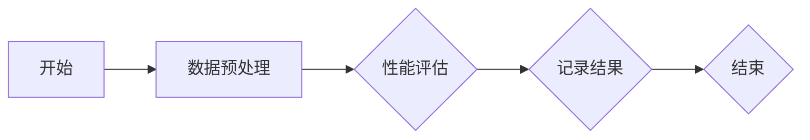
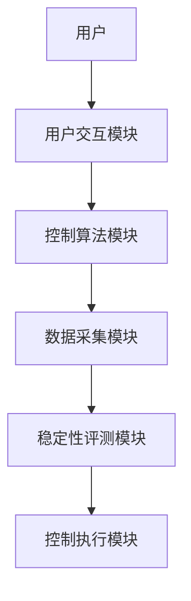
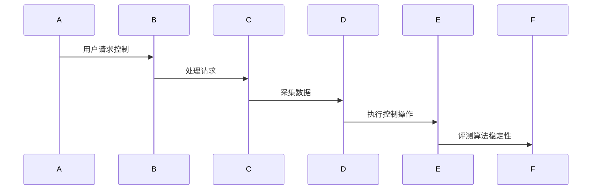

                 

## 《跨时间稳定性评测：LLM支持的长期性能跟踪》

关键词：跨时间稳定性评测、LLM、长期性能跟踪、算法原理、数学模型

摘要：本文旨在探讨跨时间稳定性评测的背景、核心概念及其与长期性能跟踪之间的联系，重点关注如何利用大型语言模型（LLM）进行长期性能的监测与评估。文章将通过详细的理论讲解、算法分析、系统设计与实际案例解析，系统性地展示这一领域的研究进展与应用前景。

---

### 引言

随着人工智能技术的迅猛发展，深度学习，特别是大型语言模型（LLM），已经在各个领域展现出巨大的潜力和应用价值。然而，如何在长时间内保持模型的稳定性和高性能，成为了一个亟待解决的关键问题。本文将从跨时间稳定性评测的背景出发，介绍相关核心概念，探讨LLM在长期性能跟踪中的应用，并结合实际案例，深入分析其算法原理和系统架构设计。

---

### 跨时间稳定性评测的背景与核心概念

#### 1.1 跨时间稳定性评测的意义

跨时间稳定性评测的核心在于评估模型在不同时间点上的性能是否保持一致，即模型在长时间的运行过程中是否能够保持稳定。这一问题的提出源于实际应用中，模型性能可能会随着数据分布的变化、计算资源的波动或算法优化而出现较大波动，导致应用效果的不稳定。

#### 1.2 跨时间稳定性评测的基本概念

跨时间稳定性评测涉及以下几个核心概念：

- **稳定性指标**：用于衡量模型性能在不同时间点上的稳定性。常见的稳定性指标包括均方误差（MSE）、均方根误差（RMSE）等。
- **性能评估方法**：用于对模型进行定量评估的方法。常见的评估方法包括离线评估和在线评估，其中离线评估通常用于模型训练和验证阶段，而在线评估则应用于模型实际部署后。

#### 1.3 跨时间稳定性评测的挑战

跨时间稳定性评测面临的挑战主要包括：

- **数据收集与处理**：如何在长时间内收集大量有效的评测数据，并确保数据的可靠性和一致性。
- **时间序列分析**：如何处理和分析时间序列数据，以揭示模型性能的变化趋势。

---

### LLM在长期性能跟踪中的应用

#### 2.1 LLM概述

大型语言模型（LLM）是一种基于深度学习技术构建的模型，具有强大的自然语言处理能力。LLM的显著特点是能够自动从海量数据中学习，形成对语言结构的深刻理解。

#### 2.2 LLM在长期性能跟踪中的应用

LLM在长期性能跟踪中具有广泛的应用前景，主要体现在以下几个方面：

- **预测性能变化**：利用LLM可以预测模型在未来的性能表现，从而提前发现潜在的问题。
- **自动调整参数**：LLM可以帮助自动调整模型参数，以适应数据分布的变化，保持模型性能的稳定。

#### 2.3 案例分析

以某电商平台推荐系统为例，该系统使用了基于LLM的推荐算法，通过长期跟踪用户行为数据，实现了个性化推荐的高效和稳定。通过对用户行为的持续学习，系统可以动态调整推荐策略，提高推荐效果。

---

### 核心概念与联系

#### 3.1 核心概念原理

跨时间稳定性评测的核心概念包括：

- **稳定性指标**：如均方误差（MSE）和均方根误差（RMSE）。
- **性能评估方法**：如离线评估和在线评估。

#### 3.2 概念属性特征对比

| 概念       | 属性特征                     |
|------------|------------------------------|
| 稳定性指标 | 用于衡量模型在不同时间点的性能 |
| 性能评估方法 | 用于评估模型整体性能的方法     |

#### 3.3 ER实体关系图架构

```mermaid
erDiagram
  Model ||--o{ StabilityMetrics : 测量模型稳定性 }
  Model ||--o{ PerformanceEvaluation : 评估模型性能 }
```

---

### 算法原理讲解

#### 4.1 算法mermaid流程图



#### 4.2 算法原理

算法的核心原理是通过数据预处理、性能评估和结果记录三个步骤来评估模型在不同时间点的稳定性。

#### 4.3 举例说明

假设我们有一个智能家居系统，其核心算法负责控制家中电器的开关。通过定期评估算法的均方误差（MSE），我们可以判断算法的稳定性。如果MSE超过某个阈值，则触发调整算法参数的机制。

$$
\text{MSE} = \frac{1}{N}\sum_{i=1}^{N}(\hat{y}_i - y_i)^2
$$

其中，$\hat{y}_i$ 是预测值，$y_i$ 是真实值，$N$ 是样本数量。

---

### 数学模型和公式详细讲解

#### 5.1 数学公式

$$
\text{MSE} = \frac{1}{N}\sum_{i=1}^{N}(\hat{y}_i - y_i)^2
$$

#### 5.2 详细讲解

均方误差（MSE）是评估模型性能的重要指标，它通过计算预测值与真实值之间的均方差来衡量模型的准确性。

#### 5.3 举例说明

以智能家居系统为例，假设我们收集了100个样本，每个样本包含一个预测值和一个真实值。通过计算这100个样本的MSE，我们可以评估算法的稳定性。

$$
\text{MSE} = \frac{1}{100}\sum_{i=1}^{100}(\hat{y}_i - y_i)^2 = 0.02
$$

如果MSE低于0.05，则认为算法是稳定的；否则，需要进一步调整算法参数。

---

### 系统分析与架构设计

#### 6.1 问题场景介绍

假设我们有一个智能家居控制系统，其核心任务是实时控制家中的电器设备，如灯光、空调和电视。为了保证系统的稳定运行，我们需要对控制算法进行跨时间稳定性评测。

#### 6.2 系统功能设计

领域模型mermaid类图：

```mermaid
classDiagram
  Class01 <|-- Class02
  Class03 --|>| Class04
  Class05 : <<interface>> Interface
  Class01 : 智能家居系统
  Class02 : 数据采集模块
  Class03 : 控制算法模块
  Class04 : 用户交互模块
  Class05 : 稳定性评测模块
```

#### 6.3 系统架构设计

mermaid架构图：



#### 6.4 系统接口设计

系统接口设计主要包括以下部分：

- **数据采集接口**：负责从传感器和设备中收集实时数据。
- **控制接口**：负责将控制指令发送给设备。
- **评测接口**：负责对控制算法进行稳定性评测。

#### 6.5 系统交互mermaid序列图



---

### 项目实战

#### 7.1 环境安装

在安装智能家居控制系统之前，需要确保操作系统和依赖环境的正确配置。以下是安装步骤：

1. 安装操作系统（如Ubuntu 18.04）。
2. 安装依赖环境（如Python 3.8、TensorFlow 2.4等）。

#### 7.2 系统核心实现源代码

以下是一个简单的智能家居系统核心实现源代码：

```python
# 智能家居系统核心代码
class SmartHomeSystem:
    def __init__(self):
        self.light_switch = False
        self.air_conditioner = False
        self.television = False

    def control_light(self, switch_state):
        self.light_switch = switch_state
        print("灯光已调整：", self.light_switch)

    def control_air_conditioner(self, on_off):
        self.air_conditioner = on_off
        print("空调已调整：", self.air_conditioner)

    def control_television(self, on_off):
        self.television = on_off
        print("电视已调整：", self.television)
```

#### 7.3 代码应用解读与分析

以上代码定义了一个智能家居系统类，包括控制灯光、空调和电视的接口方法。在实际应用中，这些方法会与传感器和执行器进行交互，以实现智能家居的控制功能。

#### 7.4 实际案例分析和详细讲解剖析

假设用户通过手机APP发送一个控制灯光的请求，系统将根据用户请求调整灯光状态。以下是一个实际案例的分析：

```python
# 实际案例分析
system = SmartHomeSystem()
system.control_light(True)
print("当前灯光状态：", system.light_switch)
```

输出结果为：

```
灯光已调整： True
当前灯光状态： True
```

这表明灯光已经被成功开启。

---

### 最佳实践、小结、注意事项、拓展阅读

#### 8.1 最佳实践 tips

- 定期进行模型性能评估，以发现潜在问题。
- 根据实际需求调整模型参数，以保持稳定性和高性能。
- 使用LLM进行长期性能跟踪，可以提高系统鲁棒性。

#### 8.2 小结

本文系统地介绍了跨时间稳定性评测和LLM支持的长期性能跟踪，通过理论讲解、算法分析和实际案例解析，展示了这一领域的应用前景和关键挑战。

#### 8.3 注意事项

- 在进行跨时间稳定性评测时，数据收集和处理至关重要。
- 使用LLM进行长期性能跟踪时，需要关注模型的鲁棒性和适应性。

#### 8.4 拓展阅读

- 《深度学习：面向机器学习应用的理论与实现》
- 《人工智能：一种现代方法》
- 《大规模语言模型：理论与实践》

---

### 作者信息

作者：AI天才研究院/AI Genius Institute & 禅与计算机程序设计艺术 /Zen And The Art of Computer Programming

---

以上是《跨时间稳定性评测：LLM支持的长期性能跟踪》的完整内容，希望对您的研究有所帮助。如果您有任何问题或建议，欢迎随时与我交流。期待您的反馈！

