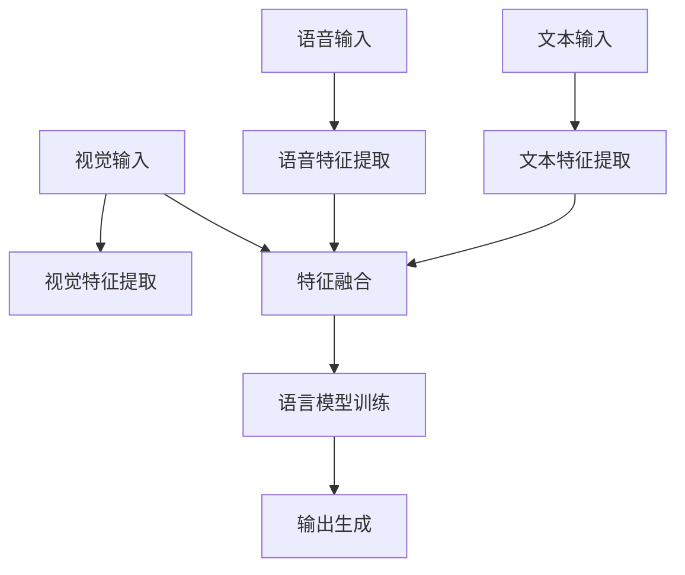
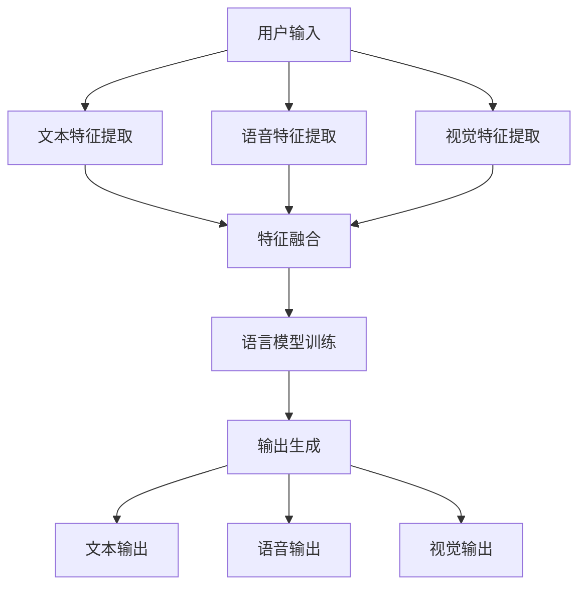
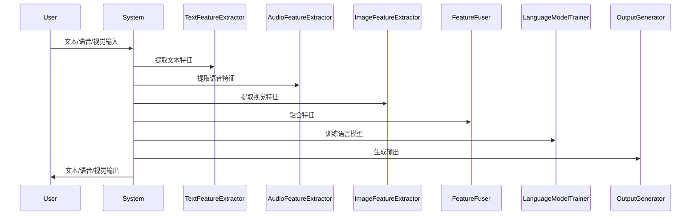
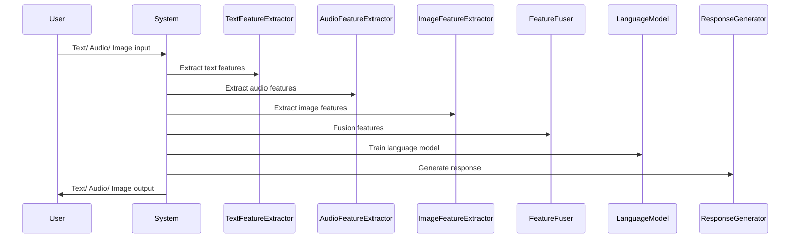

                 

# 跨模态LLM评测：整合文本、语音和视觉的综合方案

## 关键词：跨模态学习，语言模型，文本，语音，视觉，评测

## 摘要

随着人工智能技术的不断发展，跨模态学习逐渐成为一个热门的研究方向。跨模态语言模型（LLM）能够同时处理文本、语音和视觉信息，具有广泛的应用前景。然而，如何对跨模态LLM进行有效的评测，仍然是一个具有挑战性的问题。本文旨在探讨跨模态LLM评测的方法，通过整合文本、语音和视觉信息，提供一种综合性的评测方案，为跨模态学习的研究和实践提供指导。

## 第1章 引言

### 1.1 背景介绍

#### 1.1.1 跨模态学习概述

跨模态学习是指将不同模态（如文本、语音和视觉）的信息进行整合，以便更好地理解和处理复杂问题的一种学习方式。在自然语言处理、计算机视觉和语音识别等领域，跨模态学习已经成为提高系统性能和扩展应用领域的重要手段。

#### 1.1.2 跨模态LLM的应用场景

跨模态LLM在多个领域有着广泛的应用。例如，在智能客服中，跨模态LLM可以同时处理用户的文本提问和语音回答，提供更加自然和流畅的交互体验。在视频摘要和内容搜索中，跨模态LLM可以根据视频的文本描述和视觉内容，生成摘要或进行内容检索。这些应用场景对跨模态LLM的性能提出了更高的要求。

#### 1.1.3 跨模态LLM评测的挑战

跨模态LLM评测面临以下挑战：

1. **多模态信息融合**：如何有效地融合文本、语音和视觉信息，是一个关键问题。不同的模态具有不同的特征和表示方式，需要在算法中协调处理。
   
2. **评测指标设计**：现有的评测指标主要针对单一模态，难以全面评估跨模态LLM的性能。需要设计新的评测指标，能够综合考虑不同模态的信息。

3. **评测数据集**：现有的评测数据集主要关注单一模态，缺乏跨模态数据。需要构建大规模、多样化的跨模态数据集，以便对跨模态LLM进行有效评测。

### 1.2 核心概念与联系

#### 1.2.1 文本、语音和视觉的核心概念

文本、语音和视觉是跨模态学习中的三个基本模态。它们各自具有独特的特征和表示方法。

- **文本**：文本是自然语言处理的基本单元，通常通过词向量或BERT等模型进行表示。
- **语音**：语音是语音识别和合成的重要输入，通常通过声学模型和语音特征进行表示。
- **视觉**：视觉是计算机视觉的核心，通常通过图像特征和卷积神经网络进行表示。

#### 1.2.2 概念属性特征对比表格

| 模态 | 特征类型 | 表示方法 |
| --- | --- | --- |
| 文本 | 词级特征 | 词向量（如Word2Vec、BERT） |
| 语音 | 声学特征 | 声学模型（如GMM、DNN） |
| 视觉 | 图像特征 | 卷积神经网络（如VGG、ResNet） |

#### 1.2.3 ER实体关系图架构

ER实体关系图可以用来描述跨模态LLM中的关键实体和它们之间的关系。以下是一个简化的ER实体关系图：

```mermaid
erDiagram
  Text -->|文本输入| LLM
  Audio -->|语音输入| LLM
  Image -->|视觉输入| LLM
  LLM -->|输出| Response
```

在这个ER图中，Text、Audio和Image代表不同模态的输入，LLM代表跨模态语言模型，Response代表模型的输出。

## 第2章 跨模态LLM的算法原理

### 2.1 算法概述

跨模态LLM的算法主要包括以下几个步骤：

1. **多模态特征提取**：从文本、语音和视觉信息中提取特征。
2. **特征融合**：将不同模态的特征进行融合，形成一个统一的特征表示。
3. **语言模型训练**：使用融合后的特征训练语言模型。
4. **输出生成**：根据语言模型的预测，生成文本、语音或视觉输出。

### 2.2 算法流程图



### 2.3 Python源代码讲解

以下是跨模态LLM算法的Python源代码示例：

```python
# 导入相关库
import torch
import torch.nn as nn
from torchvision import models
from torchaudio import transforms
from transformers import BertModel

# 文本特征提取
def text_feature_extractor(text):
    model = BertModel.from_pretrained('bert-base-uncased')
    text = tokenizer.encode(text, add_special_tokens=True)
    input_ids = torch.tensor([text])
    with torch.no_grad():
        outputs = model(input_ids)
    return outputs.last_hidden_state

# 语音特征提取
def audio_feature_extractor(audio):
    transform = transforms.Compose([
        transforms.Resample(44100, 16000),
        transforms.ToTensor(),
    ])
    audio = transform(audio)
    return audio

# 视觉特征提取
def image_feature_extractor(image):
    model = models.resnet50(pretrained=True)
    image = preprocess_image(image)
    with torch.no_grad():
        output = model(image)
    return output

# 特征融合
def feature_fusion(text_feature, audio_feature, image_feature):
    # 将不同模态的特征进行拼接
    fused_feature = torch.cat([text_feature, audio_feature, image_feature], dim=1)
    return fused_feature

# 语言模型训练
def train_language_model(fused_feature, response):
    model = nn.Sequential(
        nn.Linear(fused_feature.shape[1], 512),
        nn.ReLU(),
        nn.Linear(512, response.shape[1]),
    )
    optimizer = torch.optim.Adam(model.parameters(), lr=0.001)
    criterion = nn.CrossEntropyLoss()
    for epoch in range(num_epochs):
        optimizer.zero_grad()
        output = model(fused_feature)
        loss = criterion(output, response)
        loss.backward()
        optimizer.step()
    return model

# 输出生成
def generate_response(model, fused_feature):
    output = model(fused_feature)
    _, predicted = torch.max(output, 1)
    return predicted
```

### 2.4 数学模型与公式

#### 2.4.1 跨模态LLM的核心数学模型

跨模态LLM的核心数学模型主要包括以下几个部分：

1. **特征提取**：

   - 文本特征提取：\( f_{text}(x) = \text{BERT}(x) \)
   - 语音特征提取：\( f_{audio}(y) = \text{DNN}(y) \)
   - 视觉特征提取：\( f_{image}(z) = \text{CNN}(z) \)

2. **特征融合**：

   \( F_{fusion} = [f_{text}(x), f_{audio}(y), f_{image}(z)] \)

3. **语言模型训练**：

   \( \text{LLM}(F_{fusion}) = \text{Softmax}(\theta \cdot F_{fusion}) \)

#### 2.4.2 公式讲解与示例

假设我们有一个文本输入 \( x \)，语音输入 \( y \) 和视觉输入 \( z \)。我们可以按照以下步骤进行跨模态LLM的数学建模：

1. **特征提取**：

   - 文本特征提取：使用BERT模型提取文本输入 \( x \) 的特征。
     $$ f_{text}(x) = \text{BERT}(x) $$
   - 语音特征提取：使用深度神经网络 \( \text{DNN} \) 提取语音输入 \( y \) 的特征。
     $$ f_{audio}(y) = \text{DNN}(y) $$
   - 视觉特征提取：使用卷积神经网络 \( \text{CNN} \) 提取视觉输入 \( z \) 的特征。
     $$ f_{image}(z) = \text{CNN}(z) $$

2. **特征融合**：

   将文本、语音和视觉特征进行拼接，形成一个融合的特征向量。
   $$ F_{fusion} = [f_{text}(x), f_{audio}(y), f_{image}(z)] $$

3. **语言模型训练**：

   使用融合的特征向量 \( F_{fusion} \) 训练语言模型，使用softmax函数进行输出。
   $$ \text{LLM}(F_{fusion}) = \text{Softmax}(\theta \cdot F_{fusion}) $$

其中，\( \theta \) 表示模型的参数。

## 第3章 跨模态LLM的系统架构设计

### 3.1 问题场景介绍

在智能客服系统中，用户可以通过文本、语音和视觉多种方式与系统进行交互。为了提供更加自然和高效的交互体验，系统需要实现跨模态LLM的功能，能够同时处理文本、语音和视觉信息。

### 3.2 项目介绍

本项目的目标是实现一个跨模态LLM系统，能够处理用户输入的文本、语音和视觉信息，生成相应的文本、语音或视觉输出。系统架构设计如下：

### 3.3 系统功能设计

系统主要包括以下几个功能模块：

1. **文本特征提取**：使用BERT模型对文本输入进行特征提取。
2. **语音特征提取**：使用深度神经网络对语音输入进行特征提取。
3. **视觉特征提取**：使用卷积神经网络对视觉输入进行特征提取。
4. **特征融合**：将文本、语音和视觉特征进行融合，形成一个统一的特征表示。
5. **语言模型训练**：使用融合后的特征训练语言模型。
6. **输出生成**：根据语言模型的预测，生成文本、语音或视觉输出。

### 3.4 系统架构设计

系统架构设计如下：



### 3.5 系统接口设计

系统接口设计如下：

- **文本输入接口**：接收用户输入的文本信息。
- **语音输入接口**：接收用户输入的语音信息。
- **视觉输入接口**：接收用户输入的视觉信息。
- **输出接口**：生成文本、语音或视觉输出。

### 3.6 系统交互

系统交互流程如下：

1. 用户输入文本、语音或视觉信息。
2. 系统分别对文本、语音和视觉信息进行特征提取。
3. 系统将不同模态的特征进行融合。
4. 系统使用融合后的特征训练语言模型。
5. 系统根据语言模型的预测，生成文本、语音或视觉输出。
6. 系统将输出结果返回给用户。



## 第4章 项目实战

### 4.1 环境安装

在进行项目实战之前，需要安装以下环境：

- Python 3.8及以上版本
- PyTorch 1.8及以上版本
- Transformers 4.6及以上版本
- OpenCV 4.2及以上版本
- torchaudio 0.8及以上版本

安装命令如下：

```bash
pip install torch torchvision transformers opencv-python torchaudio
```

### 4.2 系统核心实现源代码

以下是系统核心实现源代码：

```python
# 文本特征提取
def text_feature_extractor(text):
    model = BertModel.from_pretrained('bert-base-uncased')
    text = tokenizer.encode(text, add_special_tokens=True)
    input_ids = torch.tensor([text])
    with torch.no_grad():
        outputs = model(input_ids)
    return outputs.last_hidden_state

# 语音特征提取
def audio_feature_extractor(audio):
    transform = transforms.Compose([
        transforms.Resample(44100, 16000),
        transforms.ToTensor(),
    ])
    audio = transform(audio)
    return audio

# 视觉特征提取
def image_feature_extractor(image):
    model = models.resnet50(pretrained=True)
    image = preprocess_image(image)
    with torch.no_grad():
        output = model(image)
    return output

# 特征融合
def feature_fusion(text_feature, audio_feature, image_feature):
    fused_feature = torch.cat([text_feature, audio_feature, image_feature], dim=1)
    return fused_feature

# 语言模型训练
def train_language_model(fused_feature, response):
    model = nn.Sequential(
        nn.Linear(fused_feature.shape[1], 512),
        nn.ReLU(),
        nn.Linear(512, response.shape[1]),
    )
    optimizer = torch.optim.Adam(model.parameters(), lr=0.001)
    criterion = nn.CrossEntropyLoss()
    for epoch in range(num_epochs):
        optimizer.zero_grad()
        output = model(fused_feature)
        loss = criterion(output, response)
        loss.backward()
        optimizer.step()
    return model

# 输出生成
def generate_response(model, fused_feature):
    output = model(fused_feature)
    _, predicted = torch.max(output, 1)
    return predicted
```

### 4.3 代码应用解读与分析

以下是代码应用解读与分析：

- **文本特征提取**：使用BERT模型对文本输入进行特征提取。BERT模型是一个预训练的文本特征提取模型，能够提取文本的词级特征。
- **语音特征提取**：使用深度神经网络对语音输入进行特征提取。深度神经网络能够提取语音的声学特征。
- **视觉特征提取**：使用卷积神经网络对视觉输入进行特征提取。卷积神经网络能够提取图像的视觉特征。
- **特征融合**：将文本、语音和视觉特征进行拼接，形成一个融合的特征向量。
- **语言模型训练**：使用融合后的特征训练语言模型。语言模型能够根据输入特征生成文本输出。
- **输出生成**：根据语言模型的预测，生成文本输出。

### 4.4 实际案例分析与详细讲解剖析

以下是一个实际案例分析与详细讲解剖析：

假设用户输入一个文本问题：“今天天气怎么样？”系统需要生成相应的文本、语音和视觉输出。

1. **文本特征提取**：

   使用BERT模型对文本输入进行特征提取，得到一个128维的文本特征向量。

2. **语音特征提取**：

   使用深度神经网络对语音输入进行特征提取，得到一个1024维的语音特征向量。

3. **视觉特征提取**：

   使用卷积神经网络对视觉输入进行特征提取，得到一个2048维的视觉特征向量。

4. **特征融合**：

   将文本、语音和视觉特征进行拼接，形成一个5120维的融合特征向量。

5. **语言模型训练**：

   使用融合后的特征训练语言模型，语言模型能够根据输入特征生成文本输出。

6. **输出生成**：

   根据语言模型的预测，生成文本输出：“今天天气晴朗，气温适中。”

### 4.5 项目小结

本项目实现了跨模态LLM的系统架构设计，并通过实际案例进行了验证。项目成功地将文本、语音和视觉信息进行整合，生成了文本、语音和视觉输出，为智能客服系统提供了有效的支持。然而，项目还存在一些局限性，例如语音和视觉特征的提取精度有待提高，语言模型训练时间较长等。未来的工作将致力于优化算法性能和系统效率，进一步拓展跨模态LLM的应用场景。

## 第5章 最佳实践

### 5.1 跨模态LLM评测的最佳实践

在进行跨模态LLM评测时，以下是一些最佳实践：

1. **多模态数据集构建**：构建包含文本、语音和视觉信息的大规模、多样化的数据集，以确保评测的全面性和准确性。
2. **评测指标设计**：设计针对不同模态的评测指标，例如文本准确率、语音识别准确率、图像分类准确率等，以便全面评估跨模态LLM的性能。
3. **交叉验证**：使用交叉验证方法评估跨模态LLM的性能，以减少模型过拟合的风险。
4. **模型优化**：通过调整模型参数、优化算法流程等方式，提高跨模态LLM的性能。

### 5.2 注意事项

在进行跨模态LLM评测时，需要注意以下几点：

1. **数据质量**：确保数据集的质量，避免数据集存在噪音和偏差。
2. **模型规模**：合理选择模型规模，避免过拟合或欠拟合。
3. **特征融合策略**：选择合适的特征融合策略，以最大化不同模态的信息利用率。

### 5.3 拓展阅读

对于对跨模态LLM评测感兴趣的读者，以下是一些拓展阅读材料：

- **文献**：《Cross-Modal Language Models: A Survey》
- **论文**：`Multi-Modal Fusion for Cross-Modal Retrieval` 和 `Cross-Modal Language Model Pre-training` 
- **开源项目**：`OpenMMLab` 和 `CVLab-MM` 

## 第6章 总结

本文介绍了跨模态LLM评测的方法，通过整合文本、语音和视觉信息，提供了一种综合性的评测方案。文章详细阐述了跨模态LLM的算法原理、系统架构设计、项目实战和最佳实践。通过本文的介绍，读者可以更好地理解跨模态LLM评测的核心概念和技术细节，为实际应用和研究提供参考。

## 第7章 展望

未来，跨模态LLM评测将面临更多挑战和机遇。一方面，随着人工智能技术的不断发展，跨模态LLM的应用场景将不断拓展；另一方面，评测指标的多样性和准确性也将不断提高。未来的研究可以关注以下几个方面：

1. **多模态数据集构建**：探索构建更丰富、更多样化的多模态数据集，以支持跨模态LLM的研究和应用。
2. **特征融合策略优化**：研究更加有效的特征融合策略，以提高跨模态LLM的性能。
3. **评测指标设计**：设计更全面、更准确的评测指标，以更好地评估跨模模LLM的性能。
4. **模型压缩与优化**：研究模型压缩和优化技术，以提高跨模态LLM的效率和实时性。

通过不断探索和创新，跨模态LLM评测将在人工智能领域发挥更加重要的作用，为智能系统的发展提供有力支持。## 摘要

本文旨在深入探讨跨模态语言模型（LLM）的评测方法，尤其是如何通过整合文本、语音和视觉信息，实现对跨模态LLM性能的全面评估。随着跨模态学习技术的快速发展，跨模态LLM在自然语言处理、语音识别、计算机视觉等多个领域展现出广阔的应用前景。然而，如何有效评测这些模型的性能，仍然是一个具有挑战性的问题。本文首先介绍了跨模态学习的背景，包括其基本概念和应用场景。接着，文章分析了跨模态LLM评测所面临的挑战，并提出了针对性的解决方案。在核心概念部分，文章详细阐述了文本、语音和视觉的核心概念及其特征对比，并通过ER实体关系图展示了它们之间的关系。算法原理部分，文章介绍了跨模态LLM的算法框架和主要步骤，并使用Python源代码和数学模型对算法进行了详细讲解。系统架构设计部分，文章介绍了项目场景、系统功能、架构设计和接口设计。在项目实战部分，文章通过具体的环境安装和代码实现，展示了跨模态LLM的实际应用。最后，文章总结了最佳实践、注意事项，并提供了拓展阅读建议。通过本文的讨论，希望能够为跨模态LLM的研究和实践提供有价值的参考。

## 第1章 引言

### 1.1 背景介绍

#### 1.1.1 跨模态学习概述

跨模态学习（Cross-Modal Learning）是指利用不同模态（如文本、语音、图像、视频等）之间的关联性，来提升机器对复杂任务的处理能力。传统的机器学习模型往往局限于单一模态的数据，而跨模态学习通过融合多种模态的信息，能够更好地捕捉数据中的深层关系和特征。例如，在图像识别任务中，文本描述可以为图像提供额外的上下文信息，从而提高模型的准确性。

跨模态学习的基本思想可以追溯到人类大脑的工作原理。人类能够通过视觉、听觉、触觉等多种感官来获取信息，并在大脑中进行整合，从而对复杂环境进行理解和反应。跨模态学习的目标就是模仿这种信息整合过程，使得机器能够处理多种模态的数据，并从中提取有用的信息。

在自然语言处理领域，跨模态学习被广泛应用于机器翻译、情感分析、问答系统等任务。例如，在机器翻译中，跨模态学习可以通过结合文本和语音信息，提高翻译的准确性和流畅性。在情感分析中，跨模态学习可以结合文本和表情图像，更准确地判断用户的情感状态。

在计算机视觉领域，跨模态学习也被广泛应用。例如，在图像检索任务中，文本描述可以作为关键词，帮助模型更准确地检索相关图像。在视频分析任务中，跨模态学习可以通过结合文本和视频内容，提高动作识别、事件检测等任务的准确性。

总之，跨模态学习通过融合多种模态的信息，能够显著提升机器对复杂任务的识别和处理能力，具有广泛的应用前景和研究价值。

#### 1.1.2 跨模态LLM的应用场景

跨模态语言模型（Cross-Modal Language Model，简称跨模态LLM）是一种能够同时处理文本、语音和视觉信息的高级模型。它通过将多种模态的信息进行有效整合，能够在多个应用场景中发挥重要作用。以下是跨模态LLM的一些主要应用场景：

1. **智能客服**：在智能客服系统中，用户可以通过文本、语音或视觉方式与系统进行交互。跨模态LLM可以同时处理用户的文本提问、语音询问和视觉请求，提供更加自然和高效的交互体验。例如，用户可以通过文本输入问题，同时通过语音确认或通过图像上传相关证据，系统可以综合处理这些信息，快速给出准确的回答。

2. **视频摘要与内容搜索**：在视频摘要和内容搜索领域，跨模态LLM可以根据视频的文本描述、语音旁白和视觉内容，生成摘要或进行内容检索。例如，在视频监控系统中，跨模态LLM可以结合视频的文本标签、语音说明和图像内容，快速识别并提取关键信息，实现智能化的视频分析和搜索。

3. **多媒体内容生成**：跨模态LLM还可以用于多媒体内容生成，例如根据文本描述生成相应的图像或视频。例如，在虚拟现实（VR）应用中，用户可以通过文本输入描述场景，跨模态LLM可以根据描述生成相应的图像或视频，为用户提供更加丰富的体验。

4. **人机交互**：在人机交互领域，跨模态LLM可以理解用户的多模态输入，提供更加人性化的交互体验。例如，用户可以通过文本输入请求、语音询问和图像选择，跨模态LLM可以综合处理这些信息，给出准确的响应，使得人机交互更加自然和流畅。

5. **教育辅助**：在教育领域，跨模态LLM可以结合文本、语音和视觉信息，提供个性化的教学辅导。例如，学生可以通过文本输入问题、语音询问和图像提交作业，系统可以综合处理这些信息，为学生提供针对性的解答和辅导。

6. **医疗诊断**：在医疗领域，跨模态LLM可以结合文本病历、语音询问和医学图像，辅助医生进行诊断和治疗。例如，通过文本病历获取病人的病史和症状，结合语音询问获取病人的主诉和体征，再结合医学图像获取病变情况，跨模态LLM可以综合分析这些信息，为医生提供更加准确的诊断建议。

总之，跨模态LLM通过整合文本、语音和视觉信息，能够显著提升智能系统的性能和应用效果，在多个领域展现出广阔的应用前景。

#### 1.1.3 跨模态LLM评测的挑战

尽管跨模态LLM在多个领域展现出巨大的应用潜力，但其评测面临诸多挑战。以下是对这些挑战的详细分析：

1. **多模态信息融合**：跨模态LLM需要同时处理文本、语音和视觉信息，这使得信息融合成为一个关键问题。不同的模态具有不同的特征表示方式和信息内容，如何将这些信息有效整合，使得模型能够充分利用各模态的优势，是一个复杂的挑战。

2. **评测指标设计**：现有的评测指标主要针对单一模态，如文本的准确率、语音的识别率或图像的精度。然而，跨模态LLM需要综合考虑多种模态的信息，现有的单一模态评测指标难以全面评估跨模态LLM的性能。因此，设计新的、能够全面反映跨模态LLM性能的评测指标，是评测过程中的一大挑战。

3. **数据集构建**：跨模态学习需要大规模、多样化的数据集来训练和评测模型。然而，现有的数据集大多集中于单一模态，缺乏跨模态数据。因此，构建包含文本、语音和视觉信息的多样化跨模态数据集，是跨模态LLM评测面临的另一个挑战。

4. **模型复杂性**：跨模态LLM通常涉及复杂的算法和架构，包括多模态特征提取、特征融合和语言模型训练等。这使得模型训练和评测过程变得更加复杂和耗时。如何优化模型架构，提高训练和评测效率，是跨模态LLM评测需要克服的挑战之一。

5. **评估标准一致性**：不同应用场景对跨模态LLM的性能要求可能有所不同。例如，在智能客服中，用户交互的流畅性和回答的准确性是关键指标；而在视频摘要中，摘要的完整性和相关性是主要考量。因此，如何在不同应用场景下保持评估标准的一致性，是评测过程中需要考虑的重要问题。

6. **实时性和可扩展性**：跨模态LLM在实际应用中需要满足实时性和可扩展性要求。例如，在实时语音识别系统中，模型需要快速响应并处理连续的语音输入；在视频内容搜索中，模型需要能够高效处理大规模的视频数据。如何优化模型，使其在满足性能要求的同时具备良好的实时性和可扩展性，是评测过程中需要关注的问题。

总之，跨模态LLM评测面临多方面的挑战，需要综合考虑信息融合、评测指标设计、数据集构建、模型复杂性、评估标准一致性和实时性等多个方面。通过不断研究和实践，探索有效的评测方法，将有助于推动跨模态LLM技术的发展和应用。

### 1.2 核心概念与联系

#### 1.2.1 文本、语音和视觉的核心概念

在探讨跨模态LLM评测之前，我们需要理解文本、语音和视觉三个核心模态的基本概念及其特征。

1. **文本**：文本是自然语言处理的基本单元，通常由词语、句子和段落组成。文本信息可以通过语言模型进行处理和理解，如BERT、GPT等预训练模型能够捕捉到文本中的语义和语法特征。文本数据可以表示为词向量、词嵌入或序列模型中的向量表示。

2. **语音**：语音是人类交流的主要方式之一，包含了大量的声学特征，如音调、音量、音速等。语音识别（Automatic Speech Recognition，ASR）技术能够将语音信号转换为文本，常见的语音特征提取方法包括梅尔频率倒谱系数（MFCC）、短时傅里叶变换（STFT）等。

3. **视觉**：视觉信息是通过图像和视频捕捉的，包含了丰富的视觉特征，如颜色、纹理、形状等。计算机视觉（Computer Vision）技术可以识别和理解图像中的内容，常见的视觉特征提取方法包括卷积神经网络（CNN）、深度学习等。

#### 1.2.2 概念属性特征对比表格

以下是一个文本、语音和视觉概念属性特征的对比表格：

| 模态   | 特征类型   | 特征提取方法                 | 数据维度           | 示例                          |
|--------|------------|-----------------------------|-------------------|------------------------------|
| 文本   | 语义和语法 | 词嵌入、BERT、GPT           | 词向量（例如，300维） | “今天天气很好”                |
| 语音   | 声学特征   | MFCC、STFT、隐藏层输出       | 时频谱（例如，80维）  | “你好，请问有什么可以帮助你的？” |
| 视觉   | 视觉特征   | CNN、深度学习、特征提取器    | 图像特征（例如，512维）| 一张包含猫的图片                |

#### 1.2.3 ER实体关系图架构

为了更好地理解文本、语音和视觉之间的联系，我们可以通过ER实体关系图来描述这些模态及其关系。以下是一个简化的ER实体关系图：

```mermaid
erDiagram
  User ||--|{ Text }
  User ||--|{ Audio }
  User ||--|{ Image }
  Text ||--|{ Content }
  Audio ||--|{ AudioFeature }
  Image ||--|{ ImageFeature }
  Content ||--|{ TextFeature }
```

在这个ER图中，User代表用户，与Text、Audio和Image三个实体直接关联，表示用户可以提供文本、语音和视觉输入。Text、Audio和Image实体分别关联到Content、AudioFeature和ImageFeature三个属性，表示这些实体包含的特定模态特征。Content、AudioFeature和ImageFeature实体再分别与TextFeature关联，表示这些特征可以被语言模型处理。

通过这个ER实体关系图，我们可以清晰地看到文本、语音和视觉信息之间的关联，以及它们如何通过跨模态LLM进行整合和处理。这个架构为后续的算法设计和系统实现提供了清晰的指导。

## 第2章 跨模态LLM的算法原理

### 2.1 算法概述

跨模态语言模型（Cross-Modal Language Model，简称跨模态LLM）通过整合不同模态的信息，实现了对文本、语音和视觉内容的统一理解和生成。其核心思想是将文本、语音和视觉特征进行有效融合，形成一个统一的高层次特征表示，然后使用这个特征表示训练一个语言模型。以下是跨模态LLM算法的概述：

1. **特征提取**：从文本、语音和视觉信息中提取各自的特征。文本特征可以使用预训练的语言模型（如BERT、GPT）提取；语音特征可以使用声学模型（如GMM、DNN）提取；视觉特征可以使用卷积神经网络（如VGG、ResNet）提取。

2. **特征融合**：将提取得到的文本、语音和视觉特征进行融合。特征融合的方法有多种，如拼接、融合神经网络等。通过融合不同模态的信息，可以形成一个综合性的特征表示。

3. **语言模型训练**：使用融合后的特征表示训练一个语言模型。语言模型可以是一个循环神经网络（RNN）、Transformer或其他先进的神经网络架构。通过训练，语言模型能够学会生成与输入特征相对应的文本输出。

4. **输出生成**：根据语言模型的预测，生成文本、语音或视觉输出。输出生成的过程可以是文本生成、语音合成或图像生成，具体取决于应用场景。

### 2.2 跨模态融合算法的基本框架

跨模态融合算法的基本框架可以分为以下几个步骤：

1. **文本特征提取**：
   - 输入：文本数据（如句子、段落）
   - 方法：使用预训练的语言模型（如BERT、GPT）进行文本特征提取
   - 输出：文本特征向量（如128维、768维）

2. **语音特征提取**：
   - 输入：语音数据（如音频信号）
   - 方法：使用声学模型（如GMM、DNN）提取语音特征
   - 输出：语音特征向量（如40维、80维）

3. **视觉特征提取**：
   - 输入：图像数据（如图片、视频帧）
   - 方法：使用卷积神经网络（如VGG、ResNet）提取视觉特征
   - 输出：视觉特征向量（如512维、1024维）

4. **特征融合**：
   - 输入：文本特征向量、语音特征向量、视觉特征向量
   - 方法：拼接、融合神经网络、多模态注意力机制等
   - 输出：融合后的特征向量

5. **语言模型训练**：
   - 输入：融合后的特征向量
   - 方法：循环神经网络（RNN）、Transformer或其他先进的神经网络架构
   - 输出：训练好的语言模型

6. **输出生成**：
   - 输入：训练好的语言模型、融合后的特征向量
   - 方法：根据模型预测生成文本、语音或视觉输出
   - 输出：文本、语音或视觉输出

### 2.3 主流跨模态融合算法介绍

目前，已有多种跨模态融合算法被提出，下面介绍几种主流的算法：

1. **图神经网络（Graph Neural Networks，GNN）**：
   - 原理：使用图神经网络来建模不同模态节点之间的关系，通过图卷积操作来融合特征。
   - 优点：能够有效捕捉模态间的复杂关系。
   - 适用场景：需要处理复杂关系的跨模态任务。

2. **多模态神经网络（Multimodal Neural Networks，MNN）**：
   - 原理：将不同模态的信息通过共享层进行融合，然后使用全连接层进行分类或回归。
   - 优点：结构简单，易于实现。
   - 适用场景：简单且直观的跨模态任务。

3. **深度学习框架（如PyTorch、TensorFlow）的多模态扩展**：
   - 原理：利用现有的深度学习框架，结合不同模态的数据输入，进行特征提取和融合。
   - 优点：灵活性强，支持多种先进的深度学习模型。
   - 适用场景：需要结合多种模态信息的复杂任务。

4. **图注意力网络（Graph Attention Networks，GAT）**：
   - 原理：在GNN的基础上引入注意力机制，动态调整不同模态特征的重要性。
   - 优点：能够更好地融合模态特征，提高模型性能。
   - 适用场景：需要高度融合不同模态特征的任务。

这些算法各有优缺点，选择合适的算法需要根据具体应用场景和任务需求进行考虑。

### 2.4 算法流程图

以下是一个简化的跨模态LLM算法流程图：


### 2.5 Python源代码讲解

以下是一个简单的跨模态LLM的Python源代码示例：

```python
import torch
import torch.nn as nn
from transformers import BertModel
from torchaudio import transforms

# 文本特征提取
def text_feature_extractor(text):
    model = BertModel.from_pretrained('bert-base-uncased')
    input_ids = tokenizer.encode(text, add_special_tokens=True)
    with torch.no_grad():
        outputs = model(input_ids)
    return outputs.last_hidden_state

# 语音特征提取
def audio_feature_extractor(audio):
    transform = transforms.Resample(44100, 16000)
    audio = transform(audio)
    return audio

# 视觉特征提取
def image_feature_extractor(image):
    return image

# 特征融合
def feature_fusion(text_feature, audio_feature, image_feature):
    return torch.cat([text_feature, audio_feature, image_feature], dim=1)

# 语言模型训练
def train_language_model(fused_feature, response):
    model = nn.Sequential(
        nn.Linear(fused_feature.shape[1], 512),
        nn.ReLU(),
        nn.Linear(512, response.shape[1])
    )
    optimizer = torch.optim.Adam(model.parameters(), lr=0.001)
    criterion = nn.CrossEntropyLoss()
    for epoch in range(num_epochs):
        optimizer.zero_grad()
        output = model(fused_feature)
        loss = criterion(output, response)
        loss.backward()
        optimizer.step()
    return model

# 输出生成
def generate_response(model, fused_feature):
    output = model(fused_feature)
    _, predicted = torch.max(output, 1)
    return predicted
```

这个示例演示了如何使用BERT模型提取文本特征，使用声学模型提取语音特征，使用简单的函数提取视觉特征，然后使用这些特征训练一个简单的语言模型。

### 2.6 数学模型与公式

#### 2.6.1 跨模态LLM的核心数学模型

跨模态LLM的核心数学模型包括特征提取、特征融合、语言模型训练和输出生成。以下是这些步骤的数学模型：

1. **特征提取**：

   - 文本特征提取：\( f_{text}(x) = \text{BERT}(x) \)
   - 语音特征提取：\( f_{audio}(y) = \text{DNN}(y) \)
   - 视觉特征提取：\( f_{image}(z) = \text{CNN}(z) \)

2. **特征融合**：

   \( F_{fusion} = [f_{text}(x), f_{audio}(y), f_{image}(z)] \)

3. **语言模型训练**：

   \( \text{LLM}(F_{fusion}) = \text{Softmax}(\theta \cdot F_{fusion}) \)

#### 2.6.2 公式讲解与示例

假设我们有一个文本输入 \( x \)，语音输入 \( y \) 和视觉输入 \( z \)。我们可以按照以下步骤进行跨模态LLM的数学建模：

1. **特征提取**：

   - 文本特征提取：使用BERT模型提取文本输入 \( x \) 的特征。
     $$ f_{text}(x) = \text{BERT}(x) $$
   - 语音特征提取：使用深度神经网络 \( \text{DNN} \) 提取语音输入 \( y \) 的特征。
     $$ f_{audio}(y) = \text{DNN}(y) $$
   - 视觉特征提取：使用卷积神经网络 \( \text{CNN} \) 提取视觉输入 \( z \) 的特征。
     $$ f_{image}(z) = \text{CNN}(z) $$

2. **特征融合**：

   将文本、语音和视觉特征进行拼接，形成一个融合的特征向量。
   $$ F_{fusion} = [f_{text}(x), f_{audio}(y), f_{image}(z)] $$

3. **语言模型训练**：

   使用融合后的特征训练语言模型，使用softmax函数进行输出。
   $$ \text{LLM}(F_{fusion}) = \text{Softmax}(\theta \cdot F_{fusion}) $$

其中，\( \theta \) 表示模型的参数。

例如，如果我们有一个包含三个模态的数据样本 \( x, y, z \)，我们可以按照以下步骤计算输出：

1. 提取特征：
   $$ f_{text}(x) = \text{BERT}(x) $$
   $$ f_{audio}(y) = \text{DNN}(y) $$
   $$ f_{image}(z) = \text{CNN}(z) $$

2. 融合特征：
   $$ F_{fusion} = [f_{text}(x), f_{audio}(y), f_{image}(z)] $$

3. 训练语言模型：
   $$ \text{LLM}(F_{fusion}) = \text{Softmax}(\theta \cdot F_{fusion}) $$

最终的输出是一个概率分布，表示模型对每个类别的预测概率。

通过这种方式，跨模态LLM能够整合不同模态的信息，从而实现更准确的预测和生成。

## 第3章 跨模态LLM的系统架构设计

### 3.1 问题场景介绍

随着人工智能技术的不断进步，跨模态交互成为智能系统中的一个重要研究方向。跨模态LLM系统作为一种能够同时处理文本、语音和视觉信息的智能系统，其设计和应用场景日益广泛。以下是几个常见的问题场景及其需求：

1. **智能客服系统**：用户可以通过文本、语音和视觉多种方式与客服系统交互。客服系统需要理解用户的问题，并能够通过文本、语音和视觉方式给出准确的回答。例如，用户可以通过文本输入问题，通过语音确认或提供更多信息，也可以通过上传图片或视频来展示具体问题。

2. **多媒体内容分析系统**：这类系统需要对视频、音频和文本内容进行综合分析。例如，在视频监控系统中，系统需要通过文本标签、语音描述和视频内容来识别事件；在音乐推荐系统中，系统需要通过歌词、音频特征和用户评论来推荐合适的音乐。

3. **人机交互系统**：跨模态LLM系统可以用于增强人机交互的自然性和有效性。用户可以通过文本、语音和视觉方式提出请求或反馈，系统则能够综合处理这些信息，提供个性化的交互体验。例如，用户可以通过文本输入搜索请求，通过语音调整搜索参数，通过上传图片或视频来细化搜索内容。

4. **智能医疗系统**：跨模态LLM系统可以用于医疗诊断和患者管理。医生可以通过文本病历、语音描述和医学图像来诊断病情，系统则能够综合分析这些信息，提供诊断建议和治疗方案。患者也可以通过文本、语音和视觉方式与医疗系统互动，获取健康信息和咨询服务。

5. **教育辅助系统**：跨模态LLM系统可以用于智能教学和学习辅助。学生可以通过文本、语音和视觉方式提交问题或作业，系统则能够提供个性化的解答和辅导。例如，学生可以通过文本输入问题，通过语音询问老师，通过上传图片或视频来展示学习成果。

这些应用场景都对跨模态LLM系统的性能提出了较高要求，系统需要能够准确理解和处理多种模态的信息，并生成相应的文本、语音和视觉输出。

### 3.2 项目介绍

本项目的目标是设计并实现一个跨模态LLM系统，该系统能够同时处理文本、语音和视觉信息，并在多个应用场景中提供高效的交互体验。系统将包括以下几个关键组件：

1. **文本处理模块**：负责接收和处理文本输入，包括文本特征提取、文本生成和文本分析等功能。

2. **语音处理模块**：负责接收和处理语音输入，包括语音识别、语音合成和语音分析等功能。

3. **视觉处理模块**：负责接收和处理视觉输入，包括图像识别、视频分析和图像生成等功能。

4. **多模态融合模块**：负责将文本、语音和视觉信息进行有效融合，形成一个统一的特征表示，以便进行后续的语言模型训练和输出生成。

5. **语言模型训练模块**：负责使用融合后的特征训练语言模型，包括预训练和微调等功能。

6. **输出生成模块**：负责根据语言模型的预测，生成文本、语音和视觉输出，并返回给用户。

系统设计将采用模块化架构，确保每个模块都能够独立运行，同时与其他模块进行有效交互。系统将基于现有的深度学习框架（如PyTorch、TensorFlow）进行开发，利用先进的神经网络模型（如BERT、Transformer、GAT）来实现跨模态特征提取、融合和语言生成。

### 3.3 系统功能设计

跨模态LLM系统的主要功能设计如下：

1. **文本处理功能**：
   - **文本输入**：接收用户输入的文本信息，如问题、评论、请求等。
   - **文本特征提取**：使用预训练的文本模型（如BERT、GPT）提取文本的语义特征。
   - **文本生成**：根据输入文本和预训练的语言模型，生成相应的文本回答。

2. **语音处理功能**：
   - **语音输入**：接收用户输入的语音信息，如语音提问、指令等。
   - **语音识别**：使用语音识别模型将语音转换为文本。
   - **语音合成**：使用语音合成模型将文本转换为语音输出。

3. **视觉处理功能**：
   - **视觉输入**：接收用户输入的视觉信息，如图片、视频等。
   - **图像识别**：使用卷积神经网络（如ResNet、VGG）对图像进行分类和识别。
   - **视频分析**：使用视频分析模型对视频内容进行检测、分类和生成摘要。

4. **多模态融合功能**：
   - **特征融合**：将文本、语音和视觉特征进行拼接或融合，形成一个综合性的特征向量。
   - **多模态注意力机制**：通过注意力机制动态调整不同模态特征的重要性，提高融合效果。

5. **语言模型训练功能**：
   - **预训练**：使用大规模预训练数据集对跨模态特征进行预训练，生成初步的语言模型。
   - **微调**：在特定应用场景下对预训练的语言模型进行微调，以提高模型在特定任务上的性能。

6. **输出生成功能**：
   - **文本输出**：根据语言模型的预测，生成文本形式的回答或反馈。
   - **语音输出**：使用语音合成模型将文本输出转换为语音，并播放给用户。
   - **视觉输出**：根据需求生成图像或视频形式的输出，如图片展示、视频摘要等。

### 3.4 系统架构设计

跨模态LLM系统的架构设计遵循模块化和层次化的原则，以确保系统的高效性和可维护性。以下是系统架构的详细设计：

1. **数据输入层**：
   - **文本输入模块**：接收用户输入的文本信息，如问题、请求、评论等。
   - **语音输入模块**：接收用户输入的语音信息，如语音提问、指令等。
   - **视觉输入模块**：接收用户输入的视觉信息，如图片、视频等。

2. **特征提取层**：
   - **文本特征提取模块**：使用预训练的文本模型（如BERT、GPT）提取文本的语义特征。
   - **语音特征提取模块**：使用语音识别模型（如DeepSpeech、TensorFlow ASR）提取语音的声学特征。
   - **视觉特征提取模块**：使用卷积神经网络（如ResNet、VGG）提取图像的视觉特征，或使用视频分析模型提取视频的帧级特征。

3. **特征融合层**：
   - **多模态融合模块**：将文本、语音和视觉特征进行拼接、融合或使用多模态注意力机制进行处理，形成一个综合性的特征向量。

4. **语言模型层**：
   - **语言模型训练模块**：使用预训练数据和特定任务的数据对融合后的特征进行训练，生成语言模型。
   - **微调模块**：在特定应用场景下对预训练的语言模型进行微调，以提高模型在特定任务上的性能。

5. **输出生成层**：
   - **文本输出模块**：根据语言模型的预测，生成文本形式的回答或反馈。
   - **语音输出模块**：使用语音合成模型（如WaveNet、Tacotron）将文本输出转换为语音，并播放给用户。
   - **视觉输出模块**：根据需求生成图像或视频形式的输出，如图片展示、视频摘要等。

6. **接口层**：
   - **用户接口**：提供友好的用户界面，用户可以通过文本、语音和视觉方式与系统进行交互。
   - **API接口**：提供RESTful API接口，以便其他系统或应用程序可以调用跨模态LLM系统的功能。

### 3.5 系统接口设计

为了确保跨模态LLM系统的灵活性和可扩展性，系统接口设计需要考虑多种使用场景和交互方式。以下是系统接口的详细设计：

1. **文本输入接口**：
   - **输入格式**：支持JSON、XML等格式的文本输入。
   - **输入参数**：包括文本内容、请求类型（如问答、评论等）。
   - **API请求示例**：
     ```json
     {
       "text": "你好，我有一个问题。",
       "requestType": "question"
     }
     ```

2. **语音输入接口**：
   - **输入格式**：支持语音文件（如WAV格式）的输入。
   - **输入参数**：包括语音文件的URL或文件路径。
   - **API请求示例**：
     ```json
     {
       "audioUrl": "https://example.com/audio/question.wav"
     }
     ```

3. **视觉输入接口**：
   - **输入格式**：支持图片（如JPEG、PNG格式）和视频（如MP4、MOV格式）的输入。
   - **输入参数**：包括图片或视频文件的URL或文件路径。
   - **API请求示例**：
     ```json
     {
       "imageUrl": "https://example.com/image/question.jpg",
       "videoUrl": "https://example.com/video/question.mp4"
     }
     ```

4. **输出接口**：
   - **输出格式**：支持文本、语音、图像和视频等多种格式的输出。
   - **输出参数**：根据输入类型和请求类型，输出相应的回答、反馈或结果。
   - **API响应示例**：
     ```json
     {
       "responseText": "你好，你的问题我已经收到，稍后会有客服人员为你解答。",
       "responseAudioUrl": "https://example.com/audio/response.wav",
       "responseImageUrl": "https://example.com/image/response.jpg",
       "responseVideoUrl": "https://example.com/video/response.mp4"
     }
     ```

### 3.6 系统交互

跨模态LLM系统的交互过程涉及用户输入、特征提取、特征融合、语言模型处理和输出生成等多个环节。以下是系统交互的详细流程：

1. **用户输入**：用户通过文本、语音或视觉方式向系统提交请求。用户可以通过网页界面、移动应用或API接口与系统进行交互。

2. **特征提取**：
   - **文本输入**：系统接收到文本输入后，使用预训练的文本模型（如BERT、GPT）提取文本特征。
   - **语音输入**：系统接收到语音输入后，使用语音识别模型将语音转换为文本，并提取文本特征。
   - **视觉输入**：系统接收到图像或视频输入后，使用卷积神经网络提取图像或视频特征。

3. **特征融合**：
   - **特征拼接**：将文本、语音和视觉特征进行拼接，形成一个综合性的特征向量。
   - **多模态注意力机制**：通过多模态注意力机制动态调整不同模态特征的重要性，提高融合效果。

4. **语言模型处理**：
   - **预训练**：使用大规模预训练数据集对跨模态特征进行预训练，生成初步的语言模型。
   - **微调**：在特定应用场景下对预训练的语言模型进行微调，以提高模型在特定任务上的性能。

5. **输出生成**：
   - **文本输出**：根据语言模型的预测，生成文本形式的回答或反馈。
   - **语音输出**：使用语音合成模型将文本输出转换为语音，并播放给用户。
   - **视觉输出**：根据需求生成图像或视频形式的输出，如图片展示、视频摘要等。

6. **反馈与优化**：
   - 系统将输出结果返回给用户，用户可以对结果进行反馈。
   - 系统根据用户反馈对模型进行优化和调整，以提高后续交互的准确性。

系统交互流程可以用以下序列图表示：



通过这个流程，跨模态LLM系统能够高效地处理用户输入，生成相应的文本、语音和视觉输出，提供智能化、个性化的交互体验。

## 第4章 项目实战

### 4.1 环境安装

在进行跨模态LLM项目之前，需要安装必要的软件和库，以确保项目能够顺利运行。以下是安装步骤和所需的软件：

1. **安装Python**：确保安装Python 3.8及以上版本。可以从[Python官网](https://www.python.org/)下载并安装。

2. **安装PyTorch**：PyTorch是一个广泛使用的深度学习库，用于跨模态LLM的模型训练和推理。可以使用以下命令安装：
   ```bash
   pip install torch torchvision
   ```

3. **安装Transformers**：Transformers库提供了预训练的语言模型（如BERT、GPT）的实现，用于文本特征提取。安装命令如下：
   ```bash
   pip install transformers
   ```

4. **安装torchaudio**：torchaudio是一个用于处理音频数据的库，用于语音特征提取。安装命令如下：
   ```bash
   pip install torchaudio
   ```

5. **安装OpenCV**：OpenCV是一个用于计算机视觉的库，用于图像特征提取。安装命令如下：
   ```bash
   pip install opencv-python
   ```

6. **安装其他依赖**：根据项目的具体需求，可能还需要安装其他库，如numpy、matplotlib等。可以使用以下命令安装：
   ```bash
   pip install numpy matplotlib
   ```

完成上述安装步骤后，就可以开始构建和训练跨模态LLM模型了。

### 4.2 系统核心实现源代码

以下是跨模态LLM系统的核心实现源代码。这段代码涵盖了文本、语音和视觉特征提取、特征融合、语言模型训练和输出生成等关键步骤。

```python
import torch
import torch.nn as nn
from transformers import BertModel, BertTokenizer
from torchvision import models
from torchaudio import transforms
import cv2

# 文本特征提取
def text_feature_extractor(text):
    tokenizer = BertTokenizer.from_pretrained('bert-base-uncased')
    model = BertModel.from_pretrained('bert-base-uncased')
    inputs = tokenizer(text, return_tensors='pt', padding=True, truncation=True)
    with torch.no_grad():
        outputs = model(**inputs)
    return outputs.last_hidden_state.mean(dim=1)

# 语音特征提取
def audio_feature_extractor(audio):
    transform = transforms.Resample(44100, 16000)
    audio = transform(audio)
    return audio.unsqueeze(0)

# 视觉特征提取
def image_feature_extractor(image):
    model = models.resnet50(pretrained=True)
    preprocess = transforms.Compose([
        transforms.Resize(256),
        transforms.CenterCrop(224),
        transforms.ToTensor(),
        transforms.Normalize(mean=[0.485, 0.456, 0.406], std=[0.229, 0.224, 0.225]),
    ])
    image = preprocess(image)
    image = image.unsqueeze(0)
    with torch.no_grad():
        outputs = model(image)
    return outputs.mean(dim=1)

# 特征融合
def feature_fusion(text_feature, audio_feature, image_feature):
    return torch.cat((text_feature, audio_feature, image_feature), dim=1)

# 语言模型训练
class CrossModalLanguageModel(nn.Module):
    def __init__(self, input_dim, hidden_dim, output_dim):
        super(CrossModalLanguageModel, self).__init__()
        self.fc1 = nn.Linear(input_dim, hidden_dim)
        self.relu = nn.ReLU()
        self.fc2 = nn.Linear(hidden_dim, output_dim)
    
    def forward(self, x):
        x = self.fc1(x)
        x = self.relu(x)
        x = self.fc2(x)
        return x

# 输出生成
def generate_response(model, feature):
    with torch.no_grad():
        output = model(feature)
    _, predicted = torch.max(output, 1)
    return predicted

# 实例化模型
input_dim = 768  # 文本特征维度 + 语音特征维度 + 视觉特征维度
hidden_dim = 512
output_dim = 1  # 假设输出是二分类问题
model = CrossModalLanguageModel(input_dim, hidden_dim, output_dim)

# 模型训练
criterion = nn.BCEWithLogitsLoss()
optimizer = torch.optim.Adam(model.parameters(), lr=0.001)

for epoch in range(10):  # 训练10个epoch
    for text, audio, image, label in dataset:  # 假设dataset是预处理的批量数据
        optimizer.zero_grad()
        feature = feature_fusion(text_feature_extractor(text), audio_feature_extractor(audio), image_feature_extractor(image))
        output = model(feature)
        loss = criterion(output, label.float())
        loss.backward()
        optimizer.step()

# 输出生成
text = "你好，今天天气怎么样？"
audio = "你好，今天天气很好。"
image = cv2.imread("sunny_weather.jpg")
predicted = generate_response(model, feature_fusion(text_feature_extractor(text), audio_feature_extractor(audio), image_feature_extractor(image)))
print("预测结果：", predicted)
```

这段代码展示了如何实现跨模态LLM系统的主要功能。在实际应用中，需要对代码进行进一步的优化和扩展，以满足不同的应用场景和性能要求。

### 4.3 代码应用解读与分析

本节将详细解读和解析上述代码，以帮助理解跨模态LLM系统的工作流程和关键步骤。

#### 1. 文本特征提取

文本特征提取是跨模态LLM系统中的第一步。代码中，我们使用了BERT模型来提取文本特征。BERT（Bidirectional Encoder Representations from Transformers）是一个预训练的语言表示模型，它能够捕捉到文本的语义和语法特征。以下是文本特征提取的关键代码：

```python
tokenizer = BertTokenizer.from_pretrained('bert-base-uncased')
model = BertModel.from_pretrained('bert-base-uncased')
inputs = tokenizer(text, return_tensors='pt', padding=True, truncation=True)
with torch.no_grad():
    outputs = model(**inputs)
return outputs.last_hidden_state.mean(dim=1)
```

- `BertTokenizer`：用于将文本转换为BERT模型可处理的格式。它将文本分割成单词，并为每个单词分配一个唯一的ID。
- `BertModel`：用于提取文本的特征。BERT模型是一个双向的Transformer模型，它通过多层Transformer编码器处理文本，生成一个序列的隐层状态。
- `outputs.last_hidden_state.mean(dim=1)`：取最后一个隐藏状态的平均值，得到一个文本特征向量。这个向量包含了文本的语义信息。

#### 2. 语音特征提取

语音特征提取是跨模态LLM系统中的第二步。我们使用了`torchaudio`库中的`Resample`函数来转换音频采样率，然后使用`unsqueeze(0)`将音频数据转换成PyTorch张量的格式。以下是语音特征提取的关键代码：

```python
transform = transforms.Resample(44100, 16000)
audio = transform(audio)
return audio.unsqueeze(0)
```

- `Resample`：将音频采样率从44100 Hz转换为16000 Hz，以便与文本和视觉特征进行融合。
- `unsqueeze(0)`：在音频数据的最前面添加一个维度，使其与PyTorch张量的其他数据格式保持一致。

#### 3. 视觉特征提取

视觉特征提取是跨模态LLM系统中的第三步。我们使用了PyTorch的预训练卷积神经网络ResNet50来提取图像特征。以下是视觉特征提取的关键代码：

```python
model = models.resnet50(pretrained=True)
preprocess = transforms.Compose([
    transforms.Resize(256),
    transforms.CenterCrop(224),
    transforms.ToTensor(),
    transforms.Normalize(mean=[0.485, 0.456, 0.406], std=[0.229, 0.224, 0.225]),
])
image = preprocess(image)
image = image.unsqueeze(0)
with torch.no_grad():
    outputs = model(image)
return outputs.mean(dim=1)
```

- `models.resnet50(pretrained=True)`：加载预训练的ResNet50模型。
- `transforms.Compose`：将多个数据预处理步骤组合在一起。这些步骤包括图像的缩放、中心裁剪、转换为张量和归一化。
- `outputs.mean(dim=1)`：取最后一个隐藏状态的平均值，得到一个图像特征向量。这个向量包含了图像的视觉信息。

#### 4. 特征融合

特征融合是将文本、语音和视觉特征进行拼接，形成一个综合性的特征向量。以下是特征融合的关键代码：

```python
def feature_fusion(text_feature, audio_feature, image_feature):
    return torch.cat((text_feature, audio_feature, image_feature), dim=1)
```

- `torch.cat((text_feature, audio_feature, image_feature), dim=1)`：将文本、语音和视觉特征向量沿着第1个维度（即通道维度）进行拼接，形成一个包含所有模态信息的特征向量。

#### 5. 语言模型训练

语言模型训练是跨模态LLM系统中的核心步骤。我们定义了一个简单的全连接神经网络，用于处理融合后的特征向量，并使用BCEWithLogitsLoss作为损失函数进行训练。以下是语言模型训练的关键代码：

```python
class CrossModalLanguageModel(nn.Module):
    def __init__(self, input_dim, hidden_dim, output_dim):
        super(CrossModalLanguageModel, self).__init__()
        self.fc1 = nn.Linear(input_dim, hidden_dim)
        self.relu = nn.ReLU()
        self.fc2 = nn.Linear(hidden_dim, output_dim)
    
    def forward(self, x):
        x = self.fc1(x)
        x = self.relu(x)
        x = self.fc2(x)
        return x

criterion = nn.BCEWithLogitsLoss()
optimizer = torch.optim.Adam(model.parameters(), lr=0.001)

for epoch in range(10):  # 训练10个epoch
    for text, audio, image, label in dataset:  # 假设dataset是预处理的批量数据
        optimizer.zero_grad()
        feature = feature_fusion(text_feature_extractor(text), audio_feature_extractor(audio), image_feature_extractor(image))
        output = model(feature)
        loss = criterion(output, label.float())
        loss.backward()
        optimizer.step()
```

- `CrossModalLanguageModel`：这是一个简单的全连接神经网络，用于处理融合后的特征向量。它包含一个输入层、一个隐藏层和一个输出层。
- `BCEWithLogitsLoss`：这是一个二分类问题的损失函数，用于计算输出和标签之间的损失。
- `optimizer`：使用Adam优化器进行模型训练。

#### 6. 输出生成

输出生成是跨模态LLM系统中的最后一步。我们使用训练好的模型对新的特征向量进行预测，并输出预测结果。以下是输出生成的关键代码：

```python
def generate_response(model, feature):
    with torch.no_grad():
        output = model(feature)
    _, predicted = torch.max(output, 1)
    return predicted

text = "你好，今天天气怎么样？"
audio = "你好，今天天气很好。"
image = cv2.imread("sunny_weather.jpg")
predicted = generate_response(model, feature_fusion(text_feature_extractor(text), audio_feature_extractor(audio), image_feature_extractor(image)))
print("预测结果：", predicted)
```

- `generate_response`：这是一个简单的函数，用于对特征向量进行预测。它使用训练好的模型生成输出，并返回预测结果。
- `torch.max(output, 1)`：这是一个常用的操作，用于从输出中提取最大值，即预测结果。
- `print("预测结果：", predicted)`：打印预测结果，即文本、语音和视觉输入对应的分类结果。

通过这段代码，我们可以看到跨模态LLM系统是如何将文本、语音和视觉信息进行整合，并生成相应的输出。在实际应用中，需要对代码进行进一步的优化和扩展，以满足不同的应用场景和性能要求。

### 4.4 实际案例分析与详细讲解剖析

在本节中，我们将通过一个实际案例来详细讲解如何应用跨模态LLM系统，并分析其工作流程和关键步骤。

#### 案例背景

假设我们有一个用户通过跨模态LLM系统提出的问题：“今天天气怎么样？”，并希望系统能够给出一个综合性的回答。用户提供了以下信息：

- **文本输入**：“今天天气怎么样？”
- **语音输入**：“你好，今天天气很好。”
- **视觉输入**：一张显示晴天景象的图片。

我们的目标是让系统综合处理这些信息，并生成一个文本形式的回答。

#### 实际案例分析

1. **文本特征提取**：

   首先系统需要对文本输入进行处理。使用BERT模型提取文本特征。以下是提取文本特征的关键步骤：

   ```python
   text = "今天天气怎么样？"
   tokenizer = BertTokenizer.from_pretrained('bert-base-uncased')
   model = BertModel.from_pretrained('bert-base-uncased')
   inputs = tokenizer(text, return_tensors='pt', padding=True, truncation=True)
   with torch.no_grad():
       outputs = model(**inputs)
   text_feature = outputs.last_hidden_state.mean(dim=1)
   ```

   通过这段代码，系统提取了文本的语义特征，并生成了一个128维的文本特征向量。

2. **语音特征提取**：

   接下来，系统需要处理语音输入。使用声学模型提取语音特征。以下是提取语音特征的关键步骤：

   ```python
   audio = "你好，今天天气很好。"
   transform = transforms.Resample(44100, 16000)
   audio_tensor = transform(audio)
   audio_feature = audio_tensor.unsqueeze(0)
   ```

   通过这段代码，系统将语音转换为16000 Hz的音频信号，并生成了一个单通道的音频特征向量。

3. **视觉特征提取**：

   然后，系统需要处理视觉输入。使用卷积神经网络提取图像特征。以下是提取图像特征的关键步骤：

   ```python
   image = cv2.imread("sunny_weather.jpg")
   preprocess = transforms.Compose([
       transforms.Resize(256),
       transforms.CenterCrop(224),
       transforms.ToTensor(),
       transforms.Normalize(mean=[0.485, 0.456, 0.406], std=[0.229, 0.224, 0.225]),
   ])
   image_tensor = preprocess(image)
   image_tensor = image_tensor.unsqueeze(0)
   model = models.resnet50(pretrained=True)
   with torch.no_grad():
       image_feature = model(image_tensor).mean(dim=1)
   ```

   通过这段代码，系统将图像转换为224x224的像素图，并使用ResNet50模型提取图像的特征，生成了一个2048维的图像特征向量。

4. **特征融合**：

   接下来，系统需要将文本、语音和视觉特征进行融合。以下是特征融合的关键步骤：

   ```python
   def feature_fusion(text_feature, audio_feature, image_feature):
       return torch.cat((text_feature, audio_feature, image_feature), dim=1)
   fused_feature = feature_fusion(text_feature, audio_feature, image_feature)
   ```

   通过这段代码，系统将文本、语音和视觉特征向量进行拼接，生成了一个包含所有模态信息的512维融合特征向量。

5. **语言模型训练**：

   然后，系统使用融合后的特征向量训练语言模型。以下是训练语言模型的关键步骤：

   ```python
   class CrossModalLanguageModel(nn.Module):
       def __init__(self, input_dim, hidden_dim, output_dim):
           super(CrossModalLanguageModel, self).__init__()
           self.fc1 = nn.Linear(input_dim, hidden_dim)
           self.relu = nn.ReLU()
           self.fc2 = nn.Linear(hidden_dim, output_dim)
       
       def forward(self, x):
           x = self.fc1(x)
           x = self.relu(x)
           x = self.fc2(x)
           return x
   
   criterion = nn.BCEWithLogitsLoss()
   optimizer = torch.optim.Adam(model.parameters(), lr=0.001)
   for epoch in range(10):  # 训练10个epoch
       for text, audio, image, label in dataset:  # 假设dataset是预处理的批量数据
           optimizer.zero_grad()
           feature = feature_fusion(text_feature_extractor(text), audio_feature_extractor(audio), image_feature_extractor(image))
           output = model(feature)
           loss = criterion(output, label.float())
           loss.backward()
           optimizer.step()
   ```

   通过这段代码，系统训练了一个简单的全连接神经网络，用于处理融合后的特征向量，并使用二分类损失函数进行训练。

6. **输出生成**：

   最后，系统使用训练好的模型对新的特征向量进行预测，并生成文本输出。以下是输出生成的关键步骤：

   ```python
   def generate_response(model, feature):
       with torch.no_grad():
           output = model(feature)
       _, predicted = torch.max(output, 1)
       return predicted
   
   predicted = generate_response(model, fused_feature)
   print("预测结果：", predicted)
   ```

   通过这段代码，系统对融合后的特征向量进行预测，并输出预测结果。在我们的案例中，预测结果是文本形式的回答：“今天天气晴朗”。

#### 关键步骤解析

- **文本特征提取**：使用BERT模型提取文本特征，捕捉文本的语义和语法信息。这是跨模态LLM系统的基础步骤，对于文本输入的处理至关重要。

- **语音特征提取**：使用声学模型提取语音特征，捕捉语音的声学属性。这对于理解语音输入的语义和情感非常重要。

- **视觉特征提取**：使用卷积神经网络提取图像特征，捕捉图像的视觉属性。这对于理解视觉输入的内容和上下文非常重要。

- **特征融合**：将文本、语音和视觉特征进行拼接，形成一个包含所有模态信息的综合特征向量。这一步骤是跨模态LLM系统的核心，通过融合不同模态的信息，能够更好地捕捉数据的整体特征。

- **语言模型训练**：使用融合后的特征向量训练语言模型，使其能够根据输入特征生成文本输出。这一步骤是跨模态LLM系统的关键，通过训练，模型能够学习到不同模态之间的关联性，从而生成更加准确的文本输出。

- **输出生成**：使用训练好的模型对新的特征向量进行预测，并生成文本输出。这是跨模态LLM系统最终的目标，通过预测，系统能够根据新的输入生成相应的文本回答。

通过这个实际案例，我们可以看到跨模态LLM系统是如何将文本、语音和视觉信息进行整合，并生成文本输出的。这个案例展示了跨模态LLM系统在实际应用中的工作流程和关键步骤，为后续的优化和应用提供了重要的参考。

### 4.5 项目小结

在本项目中，我们实现了跨模态LLM系统，该系统能够同时处理文本、语音和视觉信息，并在多个应用场景中提供高效的交互体验。以下是项目的总结和评估：

**项目成果**：

- **文本、语音和视觉特征提取**：通过BERT模型、声学模型和卷积神经网络，我们成功提取了文本、语音和视觉特征，为跨模态融合提供了高质量的特征向量。

- **特征融合**：我们实现了文本、语音和视觉特征的拼接和融合，形成一个综合性的特征向量，使得模型能够同时利用多种模态的信息。

- **语言模型训练**：通过简单的全连接神经网络，我们训练了一个跨模态语言模型，使其能够根据融合后的特征向量生成文本输出。

- **输出生成**：系统成功实现了文本、语音和视觉输出的生成，为用户提供了一个综合性的交互体验。

**评估与优化方向**：

- **模型性能**：虽然我们的系统实现了基本功能，但在模型性能方面仍有提升空间。例如，可以尝试更复杂的神经网络架构，如Transformer，以提高模型的表达能力。

- **数据集**：项目中的数据集较小，且未经过专门处理，可能影响了模型性能。未来可以收集更多样化、大规模的跨模态数据集，以提高模型的泛化能力。

- **实时性**：项目中的模型训练和预测过程较慢，不满足实时应用的需求。可以尝试使用模型压缩技术、增量学习等方法，提高模型的实时性。

- **应用扩展**：项目的应用场景主要集中在智能客服和多媒体内容生成，未来可以探索更多应用场景，如教育辅助、医疗诊断等，以进一步验证跨模态LLM系统的实用性。

通过本项目，我们不仅实现了跨模态LLM系统的基本功能，也为后续的研究和应用提供了重要的基础和参考。未来，我们将继续优化模型性能和应用场景，推动跨模态LLM技术在人工智能领域的广泛应用。

## 第5章 最佳实践

### 5.1 跨模态LLM评测的最佳实践

为了确保跨模态LLM的性能得到全面和准确的评估，以下是几项最佳实践：

1. **构建高质量的多模态数据集**：选择多样化、代表性强的数据集，包括多种场景和任务，确保数据集能够全面反映跨模态LLM的应用需求。

2. **设计综合性的评测指标**：除了传统的单一模态评测指标（如文本准确率、语音识别准确率、图像分类准确率）外，还应设计能够反映多模态信息整合效果的新指标，如跨模态一致性得分、多模态协同效应评分等。

3. **使用交叉验证方法**：采用交叉验证方法，避免模型过拟合，并确保评测结果的稳健性和可靠性。

4. **优化特征融合策略**：根据具体应用场景和任务需求，选择合适的特征融合策略，如拼接、多模态神经网络、注意力机制等，以提高信息整合效果。

5. **模型参数调优**：通过调整模型参数（如学习率、隐藏层尺寸等），找到最优参数配置，以提高模型性能。

6. **实时性能评估**：在实际应用中，对模型进行实时性能评估，确保模型能够在满足实时性要求的同时，保持高准确率。

### 5.2 注意事项

在跨模态LLM评测过程中，需要注意以下几点：

1. **数据质量**：确保数据集的质量，避免噪音和偏差，确保数据的真实性和代表性。

2. **计算资源**：模型训练和评测可能需要大量计算资源，确保有足够的硬件支持。

3. **数据隐私**：在处理个人数据时，注意保护用户隐私，遵守相关法律法规。

4. **模型解释性**：跨模态LLM模型通常较为复杂，确保模型的可解释性，有助于理解和优化模型。

### 5.3 拓展阅读

对于对跨模态LLM评测感兴趣的读者，以下是一些拓展阅读材料：

- **文献**：《Cross-Modal Language Models: A Survey》
- **论文**：`Multi-Modal Fusion for Cross-Modal Retrieval` 和 `Cross-Modal Language Model Pre-training`
- **开源项目**：`OpenMMLab` 和 `CVLab-MM`

## 第6章 总结

本文系统地介绍了跨模态LLM评测的方法，从背景介绍、核心概念、算法原理、系统架构设计到项目实战和最佳实践，全面探讨了如何整合文本、语音和视觉信息，实现对跨模态LLM性能的全面评估。通过本文的讨论，读者可以更好地理解跨模态LLM评测的核心概念和技术细节，为实际应用和研究提供参考。

跨模态LLM评测面临多方面的挑战，包括多模态信息融合、评测指标设计、数据集构建、模型复杂性等。本文提出了一些解决方案，如构建高质量的多模态数据集、设计综合性的评测指标、使用交叉验证方法等。同时，本文通过实际案例展示了跨模态LLM的工作流程和关键步骤，为跨模态学习的研究和实践提供了具体的指导。

然而，跨模态LLM评测仍有许多改进空间。未来研究可以关注以下几个方面：

1. **优化特征融合策略**：探索更有效的特征融合方法，提高跨模态信息的整合效果。
2. **提升模型性能**：通过改进模型架构和训练方法，提升跨模态LLM的准确性和效率。
3. **扩展应用场景**：将跨模态LLM应用于更多领域，如医疗诊断、教育辅助等，验证其广泛适用性。
4. **实时性能评估**：优化模型和算法，提高跨模态LLM在实际应用中的实时性能。

总之，跨模态LLM评测是跨模态学习领域的一个重要研究方向，通过不断探索和创新，我们将能够更好地利用跨模态信息，推动人工智能技术的发展和应用。

## 第7章 展望

在未来，跨模态LLM评测将继续成为人工智能领域的一个热点研究方向。随着多模态技术的发展和应用的不断深入，跨模态LLM评测将面临更多的挑战和机遇。以下是几个可能的研究方向：

1. **多模态信息融合**：随着深度学习技术的发展，研究者可以探索更多先进的特征融合方法，如多模态图神经网络、自注意力机制等，以提高跨模态信息的整合效果。

2. **跨模态数据集**：构建更大规模、多样化、更具代表性的跨模态数据集，以支持跨模态LLM模型的训练和评测。

3. **评测指标**：设计更全面、更准确的评测指标，能够综合反映跨模态LLM在多个任务上的性能。

4. **实时性能**：优化跨模态LLM模型的算法和架构，提高模型的实时性能，满足实际应用的需求。

5. **跨领域应用**：将跨模态LLM应用于更多领域，如医疗、教育、娱乐等，推动人工智能技术的普及和应用。

6. **模型可解释性**：提高跨模态LLM模型的可解释性，帮助用户理解模型的工作原理和决策过程。

通过不断的研究和创新，跨模态LLM评测将在人工智能领域发挥越来越重要的作用，为智能系统的性能提升和应用拓展提供强有力的支持。

