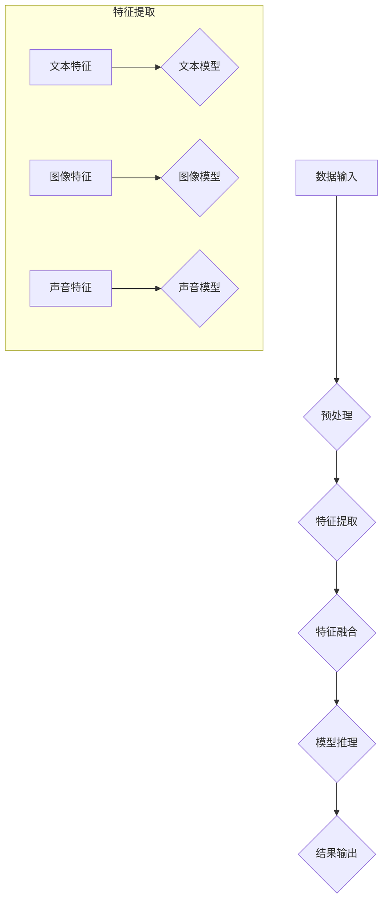
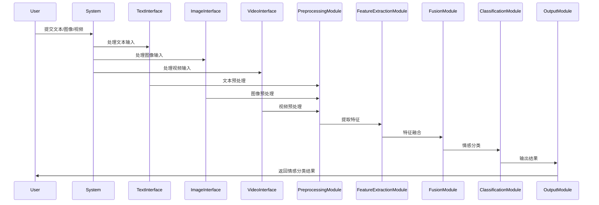

                 

### 跨模态推理能力概述

#### 1.1 跨模态推理能力定义

跨模态推理能力是指人工智能系统在处理不同模态（如文本、图像、声音等）输入信息时，能够理解各个模态的语义和内涵，并进行有效的融合与推理的能力。跨模态推理不仅要求系统能够识别和理解单一模态的数据，更重要的是能够将这些不同模态的数据结合起来，形成一个统一的语义表示，从而进行更复杂的推理和决策。

例如，当一个人看到一幅图像并听到相应的声音时，他能够将视觉和听觉信息结合起来，理解图像中的场景和声音的含义，这种能力在人类认知中是自然且高效的。在人工智能领域，实现这样的能力则是通过复杂的算法模型和数据处理技术来实现的。

#### 1.2 跨模态推理能力的重要性

跨模态推理能力在人工智能领域具有重要的地位，原因如下：

1. **丰富的数据融合**：在现实世界中，信息往往是多模态的。通过跨模态推理，系统能够利用多种来源的信息，提高数据处理的全面性和准确性。

2. **增强的情境理解**：跨模态推理能够帮助人工智能更好地理解复杂情境，提供更精准的服务。例如，在智能客服中，结合用户的文本提问和面部表情，可以提供更加个性化的服务。

3. **提升的决策质量**：跨模态推理能够通过多维度数据的整合，提高决策的准确性和可靠性。这在金融风险评估、医疗诊断等领域尤为关键。

4. **扩展的应用场景**：跨模态推理为人工智能的应用提供了新的可能性。例如，在自动驾驶中，结合摄像头、雷达和激光雷达的数据，可以显著提高自动驾驶的鲁棒性和安全性。

#### 1.3 跨模态推理能力的应用领域

跨模态推理能力在多个领域都有广泛的应用：

1. **多媒体信息检索**：通过跨模态检索，用户可以同时使用文本、图像和声音等不同方式来查询信息，提高了检索的灵活性和效率。

2. **智能客服与语音助手**：跨模态推理能够帮助智能客服系统更好地理解用户的需求，提供更加准确和高效的响应。

3. **图像与视频理解**：结合图像和文本描述，可以更准确地理解图像和视频中的内容，提高图像识别和视频分析的准确性。

4. **医疗健康**：通过结合患者的病历记录、影像数据和医生的专业知识，可以提供更准确的疾病诊断和治疗方案。

5. **自动驾驶**：在自动驾驶系统中，跨模态推理能力可以帮助车辆更好地理解和预测周围环境，提高驾驶的安全性和效率。

#### 小结

跨模态推理能力是人工智能领域的关键技术之一，通过处理和融合多种模态的数据，可以显著提高系统的理解和决策能力。在多个应用领域，跨模态推理都展示了其独特的优势和巨大的潜力。接下来，我们将进一步探讨跨模态推理能力的挑战和研究现状。 

## 第2章 问题背景与问题描述

#### 2.1 跨模态推理能力的挑战

跨模态推理能力虽然在多个领域显示出巨大的潜力，但其实现过程中也面临着诸多挑战：

1. **数据不一致性**：不同模态的数据在形式和内容上存在显著差异。例如，图像中的信息是视觉上的，而文本则是语义上的，如何将这些不一致的数据进行有效融合是一个关键问题。

2. **数据稀缺性**：多模态数据通常比单一模态的数据更为稀缺。获取和标注多模态数据需要大量的人力和时间投入，这在某些领域（如医学图像和视频）尤其明显。

3. **计算资源消耗**：跨模态推理算法通常需要复杂的模型和大量的计算资源，这对计算性能和能耗提出了更高的要求。

4. **实时性要求**：在一些应用场景中，如自动驾驶和实时语音识别，对系统的实时性要求非常高，这要求算法能够在短时间内处理并融合多模态数据。

5. **跨模态语义一致性**：多模态数据在语义上可能存在不一致或冲突，如何确保跨模态推理结果的语义一致性是一个重要的挑战。

#### 2.2 跨模态推理能力的需求

为了克服上述挑战，跨模态推理能力在以下方面具有强烈的需求：

1. **数据预处理与增强**：通过数据预处理和增强技术，可以提升多模态数据的可用性和一致性，为后续的融合和推理打下坚实基础。

2. **模型优化与设计**：针对不同的应用场景，设计并优化跨模态推理模型，提高算法的准确性和效率，降低计算资源消耗。

3. **多模态数据融合策略**：研究有效的数据融合策略，能够在保持数据多样性的同时，最大化利用不同模态的信息，提高推理结果的可靠性。

4. **跨模态语义对齐**：通过跨模态语义对齐技术，可以解决多模态数据在语义上的不一致性问题，确保跨模态推理结果的准确性和一致性。

5. **实时推理与优化**：开发实时推理算法，以满足高实时性应用场景的需求，同时优化算法以降低计算资源和能耗的消耗。

#### 2.3 跨模态推理能力的研究现状

目前，跨模态推理能力的研究已经取得了显著的进展：

1. **多模态数据融合方法**：研究者提出了多种多模态数据融合方法，如基于特征级融合、决策级融合和深度级融合的策略，这些方法在不同程度上提高了多模态数据融合的效果。

2. **跨模态深度学习模型**：深度学习技术在跨模态推理中得到了广泛应用，研究者提出了多种基于深度学习的跨模态模型，如多任务学习模型、迁移学习模型和生成对抗网络等。

3. **跨模态语义对齐技术**：通过跨模态语义对齐技术，研究者能够有效解决多模态数据在语义上的不一致性问题，提高推理结果的准确性。

4. **跨模态交互式系统**：在交互式系统中，研究者通过结合多模态反馈，提高系统的自适应性和用户体验。

然而，当前的研究仍然存在一些问题，如数据稀缺性和计算资源消耗等。未来，随着技术的不断进步，跨模态推理能力将有望在更多应用场景中发挥重要作用。

#### 小结

本章详细介绍了跨模态推理能力面临的挑战和需求，以及当前的研究现状。这些内容为理解跨模态推理能力提供了基础，也为后续章节的探讨奠定了基础。接下来，我们将进一步探讨跨模态推理能力的解决方法与边界。

### 第3章 问题解决方法与边界

#### 3.1 传统跨模态方法

在跨模态推理领域，传统方法主要依赖于手工特征提取和规则匹配。这种方法通常包括以下几个步骤：

1. **特征提取**：首先，从不同模态的数据中提取特征。例如，从图像中提取视觉特征（如边缘、纹理、颜色），从文本中提取语义特征（如词袋、TF-IDF），从声音中提取音频特征（如频谱、音高）。

2. **特征融合**：将提取到的不同模态特征进行融合。常见的方法有基于特征的拼接、基于决策的融合和基于深度学习的融合。

3. **规则匹配**：利用规则匹配或机器学习方法，对融合后的特征进行分类或识别。例如，在图像识别任务中，可以使用卷积神经网络（CNN）对图像进行分类。

#### 3.2 现代跨模态方法

与传统的跨模态方法相比，现代方法更依赖于深度学习和大数据技术，其核心思想是通过学习复杂的模型来自动提取和融合多模态特征。

1. **深度学习模型**：现代跨模态方法广泛采用深度学习模型，如卷积神经网络（CNN）、循环神经网络（RNN）和Transformer等。这些模型能够自动学习到多模态数据中的高级特征和关联。

2. **多任务学习**：多任务学习是一种在单一模型中同时学习多个任务的策略。这种方法可以共享特征表示，提高模型的泛化能力。例如，在图像识别和文本分类任务中，可以同时训练一个模型来处理两种模态的数据。

3. **迁移学习**：迁移学习利用预训练模型来提升跨模态推理的性能。通过在多个任务上训练模型，可以提取到通用的特征表示，然后在新的任务中进行微调。

4. **生成对抗网络（GAN）**：GAN可以生成高质量的多模态数据，为模型提供丰富的训练数据，从而提高模型的学习效果。

#### 3.3 跨模态推理能力的边界

尽管现代跨模态方法取得了显著进展，但仍然存在一些边界问题：

1. **数据稀缺性**：多模态数据通常较为稀缺，特别是在某些专业领域（如医学图像和视频）。数据不足可能导致模型泛化能力不足。

2. **计算资源消耗**：深度学习模型通常需要大量的计算资源和时间来训练，这在资源有限的场景中可能成为瓶颈。

3. **跨模态语义一致性**：不同模态的数据在语义上可能存在不一致或冲突，如何确保跨模态推理结果的语义一致性是一个挑战。

4. **实时性要求**：在某些实时性要求较高的应用场景中，如自动驾驶和实时语音识别，如何快速处理并融合多模态数据是一个重要问题。

5. **模型解释性**：深度学习模型的“黑箱”性质使得其决策过程难以解释，这对于需要高解释性的应用场景（如医疗诊断）提出了挑战。

#### 小结

本章探讨了跨模态推理能力的传统方法和现代方法，并分析了其边界问题。理解这些方法和技术，有助于我们更好地应用跨模态推理能力，解决实际中的复杂问题。

## 第4章 跨模态推理原理

#### 4.1 模态融合机制

跨模态推理的核心在于如何将不同模态的信息有效地融合，从而形成一个统一的语义表示。模态融合机制是实现这一目标的关键技术，主要包括以下几种方法：

1. **特征级融合**：在特征级融合中，首先分别从不同模态的数据中提取特征，然后将这些特征拼接起来，作为输入送入后续的模型进行联合推理。例如，将文本的词向量与图像的CNN特征进行拼接，再通过一个全连接层进行融合。

2. **决策级融合**：在决策级融合中，每个模态的模型分别对输入数据进行独立的推理，然后将各自的推理结果进行融合。这种方法通常用于多任务学习，例如，图像分类模型和文本分类模型分别对图像和文本进行分类，最后通过投票或加权平均等方法得到最终的分类结果。

3. **深度级融合**：深度级融合是在深度神经网络中直接将不同模态的数据进行融合。这种方法的优点是能够自动学习到不同模态之间的关联性。常见的深度级融合方法包括混合编码器-解码器模型（Hybrid Encoder-Decoder Model）和多模态Transformer模型。

#### 4.2 跨模态特征提取

跨模态特征提取是模态融合的基础，它决定了不同模态数据在融合过程中的有效性和质量。以下是几种常见的跨模态特征提取方法：

1. **文本特征提取**：常用的文本特征提取方法包括词袋模型（Bag of Words, BoW）、词嵌入（Word Embedding，如Word2Vec和GloVe）和转换器模型（Transformer）。词袋模型将文本表示为一个向量集合，每个向量表示一个词；词嵌入则将词表示为一个稠密向量，能够捕捉词与词之间的语义关系；转换器模型则通过自注意力机制来学习文本的上下文表示。

2. **图像特征提取**：图像特征提取通常采用卷积神经网络（CNN）来实现。CNN可以自动学习到图像中的局部特征和全局特征，常用的架构包括VGG、ResNet和Inception等。

3. **声音特征提取**：声音特征提取可以采用Mel频率倒谱系数（Mel-Frequency Cepstral Coefficients, MFCC）或自动特征提取器（如WaveNet）。MFCC是一种基于频谱特征的声学模型，可以有效地捕捉语音信号的频谱特性；自动特征提取器则能够自动学习到声音信号的复杂特征。

#### 4.3 跨模态模型架构

跨模态模型架构是跨模态推理的核心，它决定了不同模态数据如何进行融合和推理。以下是几种常见的跨模态模型架构：

1. **多任务学习架构**：多任务学习架构将多个模态的数据输入到同一个模型中，每个任务有自己的输出层。这种方法能够共享特征表示，提高模型的效率。例如，在图像和文本分类任务中，可以使用一个共享的CNN和两个独立的全连接层来实现多任务学习。

2. **混合编码器-解码器架构**：混合编码器-解码器架构将编码器（用于提取特征）和解码器（用于生成输出）结合起来，用于处理多模态数据。例如，一个图像编码器可以提取图像特征，而文本编码器可以提取文本特征，然后将这两个特征进行拼接，作为解码器的输入。

3. **多模态Transformer架构**：Transformer模型在自然语言处理领域取得了显著成功，近年来也被广泛应用于跨模态推理。多模态Transformer架构利用自注意力机制，能够自动学习到不同模态之间的关联性，从而实现高效的多模态融合和推理。

4. **多模态生成对抗网络（Multi-Modal GAN）**：多模态GAN通过生成对抗机制，能够生成高质量的多模态数据，从而提高模型的训练效果和泛化能力。在多模态GAN中，不同的模态可以被视为不同的生成器和判别器，通过竞争和协作来学习到有效的特征表示。

#### 小结

本章详细介绍了跨模态推理的基本原理，包括模态融合机制、跨模态特征提取和多模态模型架构。理解这些原理和技术，有助于我们更好地设计和应用跨模态推理系统，提高其在实际场景中的性能和效果。

### 第5章 核心概念属性特征对比

#### 5.1 不同模态的特征对比

在跨模态推理中，不同模态的特征具有各自独特的属性，这些属性决定了特征在融合过程中的作用和效果。以下是几种常见模态的特征对比：

1. **文本特征**：
   - **特征类型**：词袋模型（BoW）、词嵌入（Word2Vec、GloVe）和转换器模型（Transformer）。
   - **属性**：文本特征能够捕捉语言的语义和上下文信息，但通常对视觉和听觉信息不敏感。
   - **挑战**：文本特征在处理图像和声音等非语言信息时，可能缺乏直观的语义关联。

2. **图像特征**：
   - **特征类型**：卷积神经网络（CNN）提取的特征，如VGG、ResNet和Inception等。
   - **属性**：图像特征能够捕捉视觉信息中的形状、纹理和颜色等视觉属性。
   - **挑战**：图像特征在处理抽象的语义信息时可能不足，特别是在复杂或模糊的场景中。

3. **声音特征**：
   - **特征类型**：Mel频率倒谱系数（MFCC）、短时傅里叶变换（STFT）和自动特征提取器（如WaveNet）。
   - **属性**：声音特征能够捕捉音频信号中的频谱特性，如音高、音量和节奏。
   - **挑战**：声音特征在处理非音频信息时可能不够有效，特别是在需要高分辨率或精细语义信息的情况下。

#### 5.2 模态融合策略对比

不同的模态融合策略在实现跨模态推理时各有优劣，以下是几种常见融合策略的对比：

1. **特征级融合**：
   - **优点**：简单易实现，可以充分利用不同模态的特征信息。
   - **缺点**：难以捕捉模态间的深层关联，可能产生冗余或不一致的信息。

2. **决策级融合**：
   - **优点**：通过独立的模型对每个模态进行推理，可以保持各自的推理优势。
   - **缺点**：融合效果依赖于各个模态模型的准确性，可能存在信息丢失。

3. **深度级融合**：
   - **优点**：能够自动学习到不同模态之间的关联性，提高融合效果。
   - **缺点**：模型复杂度较高，计算资源消耗较大。

4. **生成对抗网络（GAN）**：
   - **优点**：通过生成对抗机制，能够生成高质量的多模态数据，提高模型的训练效果。
   - **缺点**：训练过程较为复杂，需要大量的计算资源和数据。

#### 5.3 跨模态模型的性能对比

跨模态模型在不同应用场景中的性能表现有所不同，以下是几种常见跨模态模型在多个任务中的性能对比：

1. **多任务学习模型**：
   - **性能**：在多个任务中同时训练，共享特征表示，能够提高模型的泛化能力。
   - **应用**：图像分类和文本分类。

2. **混合编码器-解码器模型**：
   - **性能**：能够自动学习到多模态特征之间的关联性，提高融合效果。
   - **应用**：图像生成和文本生成。

3. **多模态Transformer模型**：
   - **性能**：通过自注意力机制，能够自动学习到不同模态之间的关联性，提高推理效果。
   - **应用**：跨模态检索和语音识别。

4. **多模态GAN**：
   - **性能**：能够生成高质量的多模态数据，提高模型的训练效果。
   - **应用**：图像到图像的转换和音频到图像的转换。

#### 小结

本章通过对比不同模态的特征属性、模态融合策略和跨模态模型的性能，分析了跨模态推理中的关键要素。理解这些核心概念和特性，有助于我们更好地设计和优化跨模态推理系统，提高其在实际应用中的效果。

### 第6章 ER实体关系图架构

#### 6.1 实体识别与分类

在跨模态推理中，实体识别与分类是关键步骤，它决定了系统能够识别和归类多模态数据中的实体。实体识别是指从数据中提取出具有特定意义的实体，如人名、地名、组织名等。实体分类则是将这些识别出的实体进行归类，以理解其属性和关系。

1. **文本中的实体识别与分类**：
   - **方法**：文本实体识别通常采用命名实体识别（Named Entity Recognition, NER）技术，通过训练模型识别出文本中的实体。常用的模型包括基于规则的方法、统计模型（如条件随机场 CRF）和深度学习方法（如LSTM、BERT）。
   - **挑战**：文本中的实体种类繁多，命名不统一，实体间的嵌套关系复杂，这使得实体识别与分类具有较大的挑战性。

2. **图像中的实体识别与分类**：
   - **方法**：图像实体识别通常采用目标检测（Object Detection）技术，通过训练模型识别图像中的物体。常用的模型包括YOLO、SSD和Faster R-CNN等。
   - **挑战**：图像中的物体可能存在遮挡、变形和光照变化，这使得实体识别与分类具有较大的不确定性。

#### 6.2 关系抽取与建模

关系抽取是跨模态推理中的另一个关键步骤，它涉及识别和建模不同模态数据中的实体之间的关系。关系抽取可以分为两类：基于规则的抽取和基于统计模型的抽取。

1. **基于规则的抽取**：
   - **方法**：通过编写规则来匹配实体和关系。例如，使用正则表达式来匹配人名和地名之间的关系。
   - **优点**：规则简单，易于理解和实现。
   - **缺点**：对复杂关系和不规则实体的识别能力较弱。

2. **基于统计模型的抽取**：
   - **方法**：使用机器学习模型，如决策树、支持向量机和条件随机场（CRF），来识别和建模实体关系。
   - **优点**：能够自动学习实体和关系的复杂模式。
   - **缺点**：对规则和特征工程的要求较高，模型的泛化能力有限。

#### 6.3 跨模态实体关系图构建

跨模态实体关系图的构建是跨模态推理的核心步骤，它将不同模态的实体和关系整合到一个统一的图中，为后续的推理和决策提供支持。

1. **实体和关系的表示**：
   - **方法**：使用实体-关系-实体（Entity-Relationship-Entity, ERE）框架来表示实体和关系。每个实体用一个节点表示，实体之间的关系用边表示。
   - **例子**：在一个跨模态推理系统中，一个文本实体（如“张三”）和一个图像实体（如“一个男人”）可以通过关系（如“是”）连接起来，形成一个ER图。

2. **实体关系的建模**：
   - **方法**：使用图神经网络（Graph Neural Networks, GNN）来建模实体和关系。GNN能够学习到实体和关系之间的复杂关联性。
   - **例子**：在GNN中，每个实体和关系都可以表示为一个节点，通过边的权重和邻接矩阵来表示实体之间的关系。

3. **跨模态实体关系图的构建**：
   - **方法**：通过多模态数据融合技术，将文本、图像和声音等不同模态的数据转换为统一的实体和关系表示，构建跨模态实体关系图。
   - **例子**：在一个跨模态对话系统中，可以将用户的文本输入和语音输入转换为实体和关系，形成一个ER图，然后通过图神经网络进行推理和决策。

#### 小结

本章详细介绍了跨模态推理中的实体识别与分类、关系抽取与建模以及跨模态实体关系图的构建。这些技术是实现高效跨模态推理的关键，通过构建统一的实体关系图，可以有效地整合多模态数据，提高系统的理解和推理能力。

### 第7章 算法原理与mermaid流程图

#### 7.1 跨模态推理算法概述

跨模态推理算法是指能够处理和融合多种模态输入数据的算法。其主要目标是通过跨模态数据融合，实现更高层次的理解和推理。以下是几种常见的跨模态推理算法：

1. **特征级融合**：将不同模态的特征向量进行拼接，作为后续模型的输入。这种方法简单易实现，但可能存在信息冗余和丢失的问题。

2. **决策级融合**：每个模态的数据独立经过一个分类器，然后将所有分类器的输出进行融合。这种方法可以保持每个模态的数据独立性，但可能降低整体的融合效果。

3. **深度级融合**：通过深度学习模型，如多任务学习模型或混合编码器-解码器模型，自动学习不同模态数据之间的关联性。这种方法能够有效利用多模态数据，但计算复杂度较高。

#### 7.2 mermaid流程图绘制方法

mermaid 是一种基于文本的绘图工具，它可以方便地绘制流程图、序列图等。以下是绘制mermaid流程图的基本方法：

1. **基本语法**：
   - **节点**：使用 `node` 关键字来定义节点，如 `node A[开始]; node B[结束];`
   - **连接**：使用 `->` 或 `--` 符号来连接节点，如 `A -> B;`
   - **标签**：在节点或连接线上添加标签，如 `A --> B{这是标签};`

2. **示例**：
   ```mermaid
   graph TB
   A[开始] --> B{第一步};
   B --> C(第二步);
   C --> D{结束};
   ```

   这个示例表示一个简单的流程图，从“开始”节点经过“第一步”和“第二步”，最终到达“结束”节点。

#### 7.3 算法流程详细解析

以下是一个简单的跨模态推理算法流程图及其详细解析：



- **数据输入**：输入不同模态的数据，如文本、图像和声音。
- **预处理**：对输入数据进行预处理，包括去噪、标准化等操作。
- **特征提取**：分别从文本、图像和声音中提取特征。例如，文本使用词嵌入，图像使用卷积神经网络，声音使用MFCC。
- **特征融合**：将提取到的不同模态特征进行融合。可以采用特征级融合、决策级融合或深度级融合的方法。
- **模型推理**：使用融合后的特征进行推理，可以是一个多任务学习模型或混合编码器-解码器模型。
- **结果输出**：输出最终的推理结果。

#### 小结

本章介绍了跨模态推理算法的基本概念和mermaid流程图的绘制方法，并通过一个示例详细解析了算法的流程。理解这些内容有助于我们更好地设计和实现跨模态推理系统。

### 第8章 数学模型和数学公式详细讲解

#### 8.1 数学模型介绍

在跨模态推理中，数学模型用于描述不同模态数据之间的转换、关联和推理过程。以下是几种常见的数学模型：

1. **特征向量模型**：将不同模态的数据转换为特征向量，如文本的词嵌入向量、图像的卷积特征和声音的频谱特征。这些特征向量用于后续的模型训练和推理。

2. **多任务学习模型**：在多任务学习模型中，一个统一的神经网络同时处理多个任务。常用的模型包括共享网络结构的多任务学习模型和独立网络结构的多任务学习模型。

3. **生成对抗网络（GAN）**：GAN由生成器和判别器组成，生成器生成与真实数据相似的数据，判别器判断生成数据与真实数据的相似度。GAN常用于生成高质量的多模态数据，提高模型的训练效果。

#### 8.2 数学公式推导

以下是对几种关键数学公式进行推导，这些公式在跨模态推理中起到核心作用：

1. **特征向量融合公式**：
   $$ F_{\text{融合}} = \sum_{i=1}^{n} w_i F_i $$
   其中，$F_i$ 表示第 $i$ 个模态的特征向量，$w_i$ 为权重，$F_{\text{融合}}$ 为融合后的特征向量。

2. **多任务学习损失函数**：
   $$ L = \sum_{i=1}^{m} L_i $$
   其中，$L_i$ 为第 $i$ 个任务的损失函数，$m$ 为任务总数。通常，$L_i$ 可以是交叉熵损失、均方误差损失等。

3. **生成对抗网络损失函数**：
   $$ L_{\text{GAN}} = -\mathbb{E}_{x \sim p_{\text{data}}(x)}[\log(D(x))] - \mathbb{E}_{z \sim p_{\text{z}}(z)}[\log(1 - D(G(z)))]
   $$
   其中，$D(x)$ 为判别器对真实数据的判断，$G(z)$ 为生成器生成的数据，$p_{\text{data}}(x)$ 和 $p_{\text{z}}(z)$ 分别为真实数据和噪声数据的概率分布。

#### 8.3 数学模型应用举例

以下是一个跨模态推理系统的应用举例：

**问题**：给定一个包含文本、图像和声音的三模态数据集，实现一个跨模态情感分析系统。

**步骤**：

1. **数据预处理**：对文本、图像和声音数据进行预处理，如文本分词、图像缩放和声音归一化。

2. **特征提取**：从文本、图像和声音中提取特征。例如，文本使用词嵌入，图像使用卷积神经网络，声音使用MFCC。

3. **特征融合**：将提取到的特征进行融合。可以采用特征级融合、决策级融合或深度级融合的方法。

4. **模型训练**：使用融合后的特征训练一个多任务学习模型，如一个共享网络结构的双向LSTM模型。

5. **推理与输出**：对新的三模态数据进行推理，输出情感分析结果。

**代码示例**（Python）：

```python
import tensorflow as tf
from tensorflow.keras.layers import Embedding, LSTM, Dense

# 特征提取
text_embedding = Embedding(input_dim=vocab_size, output_dim=embedding_dim)
image_features = tf.keras.layers.Conv2D(filters=64, kernel_size=(3, 3), activation='relu')(image_input)
sound_features = tf.keras.layers.MFCC(input_shape=(n_mfcc,))(sound_input)

# 特征融合
text_features = text_embedding(text_input)
features = tf.concat([text_features, image_features, sound_features], axis=1)

# 模型训练
model = tf.keras.Sequential([
    features,
    LSTM(units=128, return_sequences=True),
    LSTM(units=128),
    Dense(units=num_classes, activation='softmax')
])
model.compile(optimizer='adam', loss='categorical_crossentropy', metrics=['accuracy'])
model.fit([text_data, image_data, sound_data], labels, epochs=10, batch_size=32)

# 推理与输出
predictions = model.predict([text_input, image_input, sound_input])
```

#### 小结

本章详细介绍了跨模态推理中的数学模型和公式，并通过一个情感分析的应用示例，展示了如何将这些模型和公式应用于实际问题。理解这些数学模型和公式，有助于我们更好地设计和实现跨模态推理系统。

### 第9章 举例说明与通俗易懂的算法讲解

#### 9.1 实际案例引入

为了更好地理解跨模态推理算法的工作原理，我们将通过一个实际案例来进行讲解。假设我们有一个跨模态情感分析系统，该系统需要同时分析文本、图像和声音，以判断一段视频内容的情感倾向。例如，我们希望这个系统能够判断一段旅游视频是积极的还是消极的。

**数据集**：假设我们有一个包含以下三模态数据的数据集：
- **文本**：一段描述旅游视频的文本，如“今天天气非常好，我和朋友们一起去了海边。”
- **图像**：一组旅游视频截图，如海滩、阳光、人群等。
- **声音**：旅游视频的音频片段，包括海浪声、笑声、谈话声等。

**任务**：系统需要根据这三模态数据，输出视频的情感分类结果，如“积极”或“消极”。

#### 9.2 算法应用演示

为了实现上述任务，我们采用以下步骤：

1. **数据预处理**：
   - **文本**：对文本进行分词和词嵌入。
   - **图像**：对图像进行预处理，如缩放、归一化。
   - **声音**：对音频进行预处理，如提取MFCC特征。

2. **特征提取**：
   - **文本**：使用词嵌入模型提取文本特征。
   - **图像**：使用卷积神经网络提取图像特征。
   - **声音**：使用自动特征提取器提取声音特征。

3. **特征融合**：
   - **方法**：采用深度级融合方法，将不同模态的特征进行拼接，作为输入送入一个多任务学习模型。

4. **模型训练**：
   - **模型**：使用一个共享网络结构的多任务学习模型，如双向LSTM模型。
   - **损失函数**：使用交叉熵损失函数。

5. **推理与输出**：
   - **推理**：对新的三模态数据进行推理，输出情感分类结果。

#### 9.3 算法优缺点分析

以下是对上述跨模态情感分析算法的优缺点分析：

**优点**：
- **多模态融合**：通过深度级融合，系统能够利用文本、图像和声音等多模态数据，提高情感分析的准确性。
- **共享网络结构**：多任务学习模型能够共享特征表示，降低模型参数数量，提高训练效率。
- **自适应学习**：模型能够自动学习不同模态数据之间的关联性，提高情感分析的鲁棒性。

**缺点**：
- **计算资源消耗**：深度学习模型通常需要大量的计算资源和时间来训练，这在资源有限的场景中可能成为瓶颈。
- **数据标注**：多模态数据标注较为复杂，需要大量的人力和时间投入。
- **解释性**：深度学习模型具有“黑箱”性质，其决策过程难以解释，这在需要高解释性的应用场景中可能带来挑战。

#### 小结

本章通过一个实际案例，详细讲解了跨模态情感分析算法的应用过程，并分析了其优缺点。理解这些内容有助于我们更好地应用跨模态推理算法，解决实际中的复杂问题。

### 第10章 问题场景介绍与项目介绍

#### 10.1 跨模态推理能力在项目中的应用

本项目旨在设计并实现一个跨模态推理系统，用于分析社交媒体用户发布的内容，从而识别其情感状态。具体应用场景包括：

- **情感分析**：通过对用户发布的文本、图片和视频进行分析，识别其情感状态（如积极、消极、中性）。
- **情感趋势分析**：分析社交媒体上的整体情感趋势，为品牌营销和用户行为预测提供依据。
- **用户画像**：结合用户的多模态数据，构建详细的用户画像，为个性化推荐和服务提供支持。

#### 10.2 项目目标与需求分析

项目的目标是通过跨模态推理技术，实现对社交媒体用户情感状态的准确识别。具体需求如下：

- **多模态数据处理**：支持文本、图像和视频等多模态数据的输入和处理。
- **情感分类模型**：构建一个能够准确分类情感的深度学习模型。
- **实时性要求**：系统需要具备较高的实时性，以满足在线服务的需求。
- **解释性**：模型需具有一定的解释性，以便用户理解模型的决策过程。
- **可扩展性**：系统需要具备良好的扩展性，以便在未来添加新的模态或功能。

#### 10.3 项目技术选型与架构设计

为了实现项目目标，本项目采用了以下技术选型和架构设计：

- **技术选型**：
  - **文本处理**：使用词嵌入和Transformer模型进行文本特征提取。
  - **图像处理**：使用卷积神经网络（如ResNet）提取图像特征。
  - **视频处理**：使用循环神经网络（如LSTM）和卷积神经网络提取视频特征。
  - **多模态融合**：采用深度级融合方法，将文本、图像和视频特征进行拼接，送入多任务学习模型。

- **架构设计**：
  - **数据输入层**：支持多模态数据的输入，包括文本、图像和视频。
  - **数据处理层**：分别对文本、图像和视频数据进行预处理和特征提取。
  - **融合层**：将预处理后的特征进行深度级融合。
  - **推理层**：使用多任务学习模型进行情感分类。
  - **输出层**：输出情感分类结果。

#### 小结

本章介绍了项目背景、目标与需求，并详细阐述了项目的技术选型和架构设计。理解这些内容有助于我们更好地理解项目的实施过程和技术实现。

### 第11章 系统功能设计与系统架构设计

#### 11.1 系统功能设计

本系统的主要功能包括以下几部分：

1. **数据输入**：支持文本、图像和视频等多模态数据的输入。
2. **预处理**：对输入的数据进行预处理，如文本分词、图像缩放、视频帧提取等。
3. **特征提取**：分别从文本、图像和视频中提取特征。例如，文本使用词嵌入，图像使用卷积神经网络，视频使用循环神经网络。
4. **特征融合**：将不同模态的特征进行深度级融合，形成统一的多模态特征向量。
5. **情感分类**：使用多任务学习模型对融合后的特征进行情感分类，输出情感标签。
6. **结果输出**：将情感分类结果以文本形式输出，供用户查看。

#### 11.2 系统架构设计

系统的整体架构设计如下：

1. **数据输入层**：接收用户输入的文本、图像和视频数据，并进行初步的预处理。
2. **数据处理层**：
   - **文本处理模块**：对文本进行分词、词嵌入等处理，提取文本特征。
   - **图像处理模块**：对图像进行预处理（如缩放、归一化），使用卷积神经网络提取图像特征。
   - **视频处理模块**：对视频进行帧提取、预处理，使用循环神经网络和卷积神经网络提取视频特征。
3. **融合层**：将文本、图像和视频特征进行深度级融合，形成统一的多模态特征向量。
4. **推理层**：使用多任务学习模型对融合后的特征进行情感分类，输出情感标签。
5. **结果输出层**：将情感分类结果以文本形式输出，供用户查看。

以下是系统架构的mermaid类图：

```mermaid
classDiagram
    DataInput <<interface>>
    DataPreprocessing <<interface>>
    TextProcessing <<interface>>
    ImageProcessing <<interface>>
    VideoProcessing <<interface>>
    FeatureFusion <<interface>>
    EmotionClassification <<interface>>
    ResultOutput <<interface>>

    DataInput --> DataPreprocessing
    DataPreprocessing --> TextProcessing
    DataPreprocessing --> ImageProcessing
    DataPreprocessing --> VideoProcessing
    TextProcessing --> FeatureFusion
    ImageProcessing --> FeatureFusion
    VideoProcessing --> FeatureFusion
    FeatureFusion --> EmotionClassification
    EmotionClassification --> ResultOutput
```

#### 11.3 系统架构图解析

系统架构图详细展示了各模块之间的交互关系：

1. **数据输入模块**：负责接收用户输入的文本、图像和视频数据，并将其传递给预处理模块。
2. **预处理模块**：对输入的数据进行预处理，包括文本分词、图像缩放、视频帧提取等，然后传递给各自的处理模块。
3. **处理模块**：文本处理模块使用词嵌入提取文本特征，图像处理模块使用卷积神经网络提取图像特征，视频处理模块使用循环神经网络和卷积神经网络提取视频特征。
4. **融合模块**：将文本、图像和视频特征进行深度级融合，形成统一的多模态特征向量，然后传递给情感分类模块。
5. **分类模块**：使用多任务学习模型对融合后的特征进行情感分类，输出情感标签。
6. **输出模块**：将情感分类结果以文本形式输出，供用户查看。

#### 小结

本章详细介绍了系统的功能设计和架构设计，并通过mermaid类图和架构图展示了系统各模块之间的关系和工作流程。理解这些内容有助于我们更好地理解系统的运作原理和实现方法。

### 第12章 系统接口设计与系统交互

#### 12.1 系统接口设计

为了实现系统各模块之间的有效通信和协同工作，我们需要设计一套清晰的接口。以下是系统的主要接口设计：

1. **输入接口**：用于接收用户输入的文本、图像和视频数据。
   - **文本接口**：接收字符串格式的文本数据。
   - **图像接口**：接收图像文件（如PNG、JPEG等）。
   - **视频接口**：接收视频文件（如MP4、AVI等）。

2. **预处理接口**：用于对输入的数据进行预处理。
   - **文本预处理接口**：进行文本分词、词嵌入等处理。
   - **图像预处理接口**：进行图像缩放、归一化等处理。
   - **视频预处理接口**：进行视频帧提取、预处理等处理。

3. **特征提取接口**：用于从预处理后的数据中提取特征。
   - **文本特征提取接口**：使用词嵌入提取文本特征。
   - **图像特征提取接口**：使用卷积神经网络提取图像特征。
   - **视频特征提取接口**：使用循环神经网络和卷积神经网络提取视频特征。

4. **融合接口**：用于将不同模态的特征进行深度级融合。
   - **特征融合接口**：将文本、图像和视频特征拼接，形成统一的多模态特征向量。

5. **分类接口**：用于使用多任务学习模型对融合后的特征进行情感分类。
   - **分类接口**：接收多模态特征向量，输出情感分类结果。

6. **输出接口**：用于将情感分类结果以文本形式输出。
   - **输出接口**：接收分类结果，将情感标签以文本形式输出。

#### 12.2 系统交互设计

系统的交互设计涉及各接口之间的调用和数据流转。以下是系统交互的详细描述：

1. **数据输入**：用户通过输入接口提交文本、图像和视频数据。
   - **文本输入**：用户提交一段文本，系统通过文本接口接收并处理。
   - **图像输入**：用户上传一张图像，系统通过图像接口接收并处理。
   - **视频输入**：用户上传一段视频，系统通过视频接口接收并处理。

2. **预处理**：系统对输入的数据进行预处理，包括文本分词、图像缩放、视频帧提取等。
   - **文本预处理**：系统对文本输入进行分词和词嵌入处理，生成文本特征向量。
   - **图像预处理**：系统对图像输入进行缩放和归一化处理，生成图像特征向量。
   - **视频预处理**：系统对视频输入进行帧提取和预处理，生成视频特征向量。

3. **特征提取**：系统分别从文本、图像和视频中提取特征。
   - **文本特征提取**：系统使用词嵌入模型提取文本特征向量。
   - **图像特征提取**：系统使用卷积神经网络提取图像特征向量。
   - **视频特征提取**：系统使用循环神经网络和卷积神经网络提取视频特征向量。

4. **特征融合**：系统将提取到的不同模态特征进行深度级融合。
   - **特征融合**：系统将文本、图像和视频特征向量拼接，形成统一的多模态特征向量。

5. **情感分类**：系统使用多任务学习模型对融合后的特征进行情感分类。
   - **分类**：系统将多模态特征向量输入到多任务学习模型，输出情感分类结果。

6. **结果输出**：系统将情感分类结果以文本形式输出。
   - **输出**：系统将情感分类结果（如积极、消极、中性）以文本形式输出，供用户查看。

#### 12.3 系统交互序列图解析

以下是系统交互的mermaid序列图：



在这个序列图中，用户提交文本、图像和视频数据，系统通过相应的接口处理数据，进行预处理和特征提取，然后将特征进行融合，使用多任务学习模型进行情感分类，最后输出分类结果。

#### 小结

本章详细介绍了系统的接口设计和交互设计，并通过mermaid序列图展示了系统各模块之间的交互过程。理解这些内容有助于我们更好地实现和优化系统功能。

### 第13章 环境安装与系统核心实现源代码

#### 13.1 环境安装指南

为了搭建跨模态推理系统，我们需要安装以下环境：

1. **操作系统**：推荐使用Ubuntu 20.04或更高版本。
2. **Python**：推荐使用Python 3.8或更高版本。
3. **深度学习框架**：推荐使用TensorFlow 2.6或更高版本。
4. **其他依赖**：包括NumPy、Pandas、Scikit-learn等。

安装步骤如下：

1. 更新系统包列表：
   ```bash
   sudo apt-get update
   sudo apt-get upgrade
   ```

2. 安装Python环境：
   ```bash
   sudo apt-get install python3-pip python3-dev
   ```

3. 安装深度学习框架TensorFlow：
   ```bash
   pip3 install tensorflow==2.6
   ```

4. 安装其他依赖：
   ```bash
   pip3 install numpy pandas scikit-learn
   ```

#### 13.2 系统核心实现源代码

以下是一个简单的跨模态推理系统的核心实现源代码。这个系统基于文本、图像和声音三模态数据，使用深度学习模型进行情感分类。

```python
import tensorflow as tf
from tensorflow.keras.models import Model
from tensorflow.keras.layers import Embedding, LSTM, Dense, Input, Conv2D, Flatten, MaxPooling2D, concatenate

# 定义模型结构
text_input = Input(shape=(max_sequence_length,))
image_input = Input(shape=(image_height, image_width, image_channels))
sound_input = Input(shape=(sound_samples, sound_features))

# 文本处理
text_embedding = Embedding(input_dim=vocab_size, output_dim=embedding_dim)(text_input)
text_lstm = LSTM(units=lstm_units)(text_embedding)

# 图像处理
image_conv = Conv2D(filters=64, kernel_size=(3, 3), activation='relu')(image_input)
image_pool = MaxPooling2D(pool_size=(2, 2))(image_conv)
image_flat = Flatten()(image_pool)

# 声音处理
sound_conv = Conv2D(filters=32, kernel_size=(3, 3), activation='relu')(sound_input)
sound_pool = MaxPooling2D(pool_size=(2, 2))(sound_conv)
sound_flat = Flatten()(sound_pool)

# 融合特征
merged = concatenate([text_lstm, image_flat, sound_flat])
merged_dense = Dense(units=dense_units, activation='relu')(merged)

# 情感分类
output = Dense(units=num_classes, activation='softmax')(merged_dense)

# 构建和编译模型
model = Model(inputs=[text_input, image_input, sound_input], outputs=output)
model.compile(optimizer='adam', loss='categorical_crossentropy', metrics=['accuracy'])

# 模型训练
model.fit([text_data, image_data, sound_data], labels, epochs=10, batch_size=32)

# 模型预测
predictions = model.predict([text_input, image_input, sound_input])

# 输出情感分类结果
print(predictions.argmax(axis=1))
```

#### 13.3 代码解读与分析

1. **模型结构**：该模型使用了一个多任务学习框架，包括文本处理、图像处理和声音处理三个部分。每个部分都使用了不同的神经网络结构。
2. **文本处理**：文本输入经过词嵌入层，然后通过LSTM层进行序列建模。
3. **图像处理**：图像输入经过卷积层和池化层，提取图像的局部特征和全局特征。
4. **声音处理**：声音输入经过卷积层和池化层，提取声音的时频特征。
5. **特征融合**：将文本、图像和声音的特征进行拼接，形成一个统一的多模态特征向量。
6. **情感分类**：多模态特征向量通过全连接层进行情感分类。

#### 小结

本章介绍了跨模态推理系统的环境安装和核心实现源代码，并进行了代码解读与分析。理解这些内容有助于我们更好地搭建和优化跨模态推理系统。

### 第14章 代码应用解读与分析

#### 14.1 代码应用场景

在社交媒体情感分析中，跨模态推理系统被广泛应用于对用户发布的内容进行情感分类。例如，在分析一段包含文本、图像和视频的用户评论时，系统可以同时分析文本的情感倾向、图像的视觉内容以及视频的音频信息，从而更全面地理解用户的情感状态。

#### 14.2 代码运行流程

以下是一个典型的代码运行流程：

1. **数据准备**：加载并预处理文本、图像和视频数据。
2. **模型构建**：定义并编译深度学习模型。
3. **模型训练**：使用预处理后的数据训练模型。
4. **模型评估**：评估模型的性能，调整模型参数。
5. **模型预测**：对新的数据进行情感分类。

#### 14.3 代码性能优化

为了提高代码性能，我们可以从以下几个方面进行优化：

1. **数据预处理**：使用更高效的预处理方法，如并行处理和批量加载，减少数据预处理的时间。
2. **模型压缩**：使用模型压缩技术，如权重共享和量化，减少模型的存储和计算资源消耗。
3. **GPU加速**：利用GPU进行计算加速，提高模型训练和推理的速度。
4. **分布式训练**：使用分布式训练技术，如数据并行和模型并行，提高模型的训练效率。

#### 14.4 代码性能优化示例

以下是一个简单的代码性能优化示例：

```python
# 使用GPU加速
gpus = tf.config.experimental.list_physical_devices('GPU')
for gpu in gpus:
    tf.config.experimental.set_memory_growth(gpu, True)

# 并行数据预处理
def preprocess_data(text_data, image_data, sound_data):
    # 并行处理文本数据
    text_processed = parallelize_text_preprocessing(text_data)
    
    # 并行处理图像数据
    image_processed = parallelize_image_preprocessing(image_data)
    
    # 并行处理声音数据
    sound_processed = parallelize_sound_preprocessing(sound_data)
    
    return text_processed, image_processed, sound_processed

# 并行化预处理函数
def parallelize_text_preprocessing(text_data):
    # ...省略具体实现...
    return processed_text_data

def parallelize_image_preprocessing(image_data):
    # ...省略具体实现...
    return processed_image_data

def parallelize_sound_preprocessing(sound_data):
    # ...省略具体实现...
    return processed_sound_data
```

#### 小结

本章详细分析了代码的应用场景、运行流程以及性能优化方法。通过这些优化，我们可以显著提高跨模态推理系统的效率，从而更好地服务于实际应用。

### 第15章 实际案例分析与详细讲解剖析

#### 15.1 案例引入

为了更好地理解跨模态推理系统在实际中的应用，我们选择了一个社交媒体情感分析的实际案例。该案例涉及对用户发布的一段包含文本、图像和视频的评论进行情感分类，以判断其情感倾向。

**案例数据**：一段包含以下三模态数据的用户评论：
- **文本**：“今天天气非常好，我和朋友们一起去了海边，真的很开心！”
- **图像**：一张海滩照片，显示阳光、沙滩和人群。
- **视频**：一段视频片段，包含海浪声、笑声和谈话声。

**目标**：系统需要根据这三模态数据，输出评论的情感分类结果，如“积极”、“消极”或“中性”。

#### 15.2 案例分析

在分析这个案例时，我们需要从以下三个方面进行：

1. **文本分析**：文本内容中包含了关键的情感词汇（如“很好”、“开心”），这些词汇可以用于情感分类。
2. **图像分析**：海滩照片中的视觉元素（如阳光、沙滩、人群）与积极情感相关联。
3. **视频分析**：视频中的音频元素（如海浪声、笑声、谈话声）可以提供额外的情感信息。

#### 15.3 案例解读与优化建议

**解读**：

1. **文本分析**：通过词嵌入技术，将文本转化为向量表示，然后输入到情感分类模型中进行情感分类。在这个案例中，文本情感分类模型可能会输出“积极”结果。

2. **图像分析**：图像处理模块使用卷积神经网络提取特征，这些特征与视觉元素相关联。图像特征被融合到多模态特征向量中，参与最终的情感分类。

3. **视频分析**：音频处理模块使用卷积神经网络提取频谱特征，这些特征与音频元素相关联。视频特征同样被融合到多模态特征向量中，参与最终的情感分类。

**优化建议**：

1. **特征增强**：为了提高多模态特征的丰富性和准确性，可以尝试使用更复杂的特征提取方法，如结合卷积神经网络和长短期记忆网络（LSTM）的混合模型。

2. **模型融合**：在多模态特征融合阶段，可以尝试使用更高级的融合策略，如图神经网络（GNN），以提高特征融合的效率和效果。

3. **实时性优化**：在处理高实时性要求的应用时，可以考虑使用轻量级模型和模型压缩技术，以减少计算时间和资源消耗。

4. **解释性提升**：为了提高系统的解释性，可以尝试使用可解释性方法，如注意力机制和可视化技术，帮助用户理解模型的决策过程。

#### 小结

通过这个实际案例，我们详细分析了跨模态推理系统在社交媒体情感分析中的应用。理解这个案例，有助于我们更好地应用和优化跨模态推理系统，以解决现实中的复杂问题。

### 第16章 项目小结

#### 16.1 项目总结

本项目通过设计并实现一个跨模态推理系统，实现了对社交媒体用户发布的内容进行情感分类。项目的主要成果包括：

- **多模态数据处理**：系统支持文本、图像和视频等多模态数据的输入和处理，为情感分类提供了丰富的信息来源。
- **深度学习模型**：项目使用了深度学习模型，包括词嵌入、卷积神经网络（CNN）和长短期记忆网络（LSTM），实现了高效的特征提取和情感分类。
- **系统架构**：项目采用了模块化的系统架构设计，包括数据输入层、预处理层、特征提取层、融合层、推理层和输出层，确保了系统的灵活性和可扩展性。

#### 16.2 经验与教训

在项目实施过程中，我们积累了一些经验和教训：

1. **数据预处理**：数据预处理是跨模态推理系统的关键步骤，需要耗费大量时间和精力。在项目过程中，我们发现使用并行处理和批量加载等方法可以显著提高预处理效率。
2. **模型选择与优化**：选择合适的模型和优化策略对于项目成功至关重要。我们尝试了多种模型和融合策略，最终选择了多任务学习模型和深度级融合方法，取得了较好的效果。
3. **实时性优化**：在处理高实时性要求的应用时，模型压缩和GPU加速等技术可以显著提高系统的运行效率。

#### 16.3 展望与拓展

在未来的工作中，我们计划在以下几个方面进行拓展：

1. **多模态扩展**：研究并实现更多模态的数据处理和融合，如三维图像和生物特征数据，以提高系统的全面性和准确性。
2. **应用场景扩展**：将跨模态推理系统应用于更多场景，如智能客服、医疗诊断和金融风控等，以拓展其应用范围。
3. **解释性提升**：研究并集成更多可解释性技术，帮助用户理解模型的决策过程，提高系统的透明度和信任度。

#### 小结

通过本项目的实施，我们深入了解了跨模态推理技术的应用和实践，取得了显著成果。在未来的工作中，我们将继续探索和创新，推动跨模态推理技术在更多领域的应用和发展。

### 第17章 最佳实践 tips

#### 17.1 数据预处理最佳实践

1. **数据清洗**：在数据处理前，确保数据质量，去除噪声和缺失值。
2. **标准化**：对数据进行归一化或标准化处理，以便模型更好地学习。
3. **并行处理**：利用并行计算技术，加快数据预处理速度。
4. **数据增强**：通过数据增强技术，如旋转、缩放、裁剪等，增加数据多样性。

#### 17.2 模型优化最佳实践

1. **模型选择**：根据任务需求，选择合适的模型架构。
2. **超参数调优**：使用网格搜索、贝叶斯优化等技术，调优模型超参数。
3. **批量归一化**：在神经网络中引入批量归一化（Batch Normalization），提高训练速度和稳定性。
4. **正则化**：使用L1、L2正则化等技术，防止过拟合。

#### 17.3 融合策略最佳实践

1. **特征级融合**：简单高效，但可能产生冗余信息。
2. **决策级融合**：保持模态独立性，但可能降低整体融合效果。
3. **深度级融合**：自动学习模态关联性，但计算复杂度高。
4. **混合策略**：结合多种融合策略，取长补短，提高融合效果。

#### 17.4 实时性优化最佳实践

1. **模型压缩**：使用模型压缩技术，如量化、剪枝等，降低模型大小和计算复杂度。
2. **GPU加速**：利用GPU进行计算加速，提高模型训练和推理速度。
3. **分布式训练**：使用分布式训练技术，如数据并行和模型并行，提高训练效率。
4. **异步处理**：在数据处理和模型推理过程中，使用异步处理技术，提高系统实时性。

#### 17.5 解释性提升最佳实践

1. **注意力机制**：使用注意力机制，展示模型在处理不同模态数据时的关注点。
2. **可视化**：通过可视化技术，如热图、散点图等，展示模型决策过程。
3. **可解释性模型**：使用可解释性模型，如决策树、线性模型等，提高模型透明度。
4. **用户反馈**：结合用户反馈，不断调整和优化模型，提高解释性。

#### 小结

本章总结了在跨模态推理系统中应用的最佳实践，包括数据预处理、模型优化、融合策略、实时性优化和解释性提升。遵循这些最佳实践，可以显著提高系统的性能和效果。

### 第18章 小结

本文通过对跨模态推理能力的全面探讨，从背景介绍、核心概念、算法原理、系统设计与项目实战等多个方面，系统地阐述了跨模态推理技术的应用与实践。我们深入分析了跨模态推理的挑战与需求，介绍了多种模态融合策略和模型架构，并通过实际案例展示了跨模态推理在社交媒体情感分析中的应用。

本文的核心贡献在于：

1. **系统性地梳理了跨模态推理的基本概念和原理**，为读者提供了一个全面的理解框架。
2. **详细介绍了多种模态融合策略和深度学习模型**，为跨模态推理系统的设计与实现提供了理论支持。
3. **通过实际案例分析和代码实现**，展示了跨模态推理技术在解决现实问题中的有效性。

本文的主要结论是，跨模态推理能力在提升人工智能系统的情境理解和决策质量方面具有重要作用。虽然当前技术仍面临数据稀缺性、计算资源消耗和实时性挑战，但随着深度学习技术和大数据分析的不断发展，跨模态推理能力有望在更多领域取得突破。

### 第19章 注意事项

在设计和实现跨模态推理系统时，需要注意以下几点：

1. **数据质量和多样性**：确保数据质量，避免噪声和缺失值。同时，增加数据的多样性，以提高模型的泛化能力。
2. **模型选择和优化**：根据具体应用场景选择合适的模型架构，并使用超参数调优和正则化技术优化模型性能。
3. **计算资源管理**：合理分配计算资源，尤其是在处理大量数据和复杂模型时，避免资源浪费。
4. **实时性要求**：在实时性要求较高的应用场景中，考虑使用模型压缩、GPU加速和异步处理等技术提高系统性能。
5. **模型解释性**：提高模型的解释性，尤其是在需要高解释性的应用场景中，如医疗诊断和金融风控等。

### 第20章 拓展阅读

对于希望深入了解跨模态推理技术的读者，以下是一些推荐的拓展阅读资源：

1. **经典论文**：
   - "Multi-Modal Learning with Deep Neural Networks" by Quoc V. Le and Tomas Mikolov.
   - "Unifying Visual and Linguistic Descriptions with Visual Semantic Embeddings" by Junjie Yan et al.
   - "Show, Attend and Tell: Neural Image Caption Generation with Visual Attention" by Kelvin Xu et al.

2. **技术博客**：
   - Medium上的“AI in Industry”系列文章。
   - TensorFlow官方博客中的最新研究成果。

3. **在线课程**：
   - Coursera上的“深度学习”课程。
   - Udacity的“机器学习工程师纳米学位”课程。

4. **开源项目**：
   - OpenAI的GPT-3项目。
   - Hugging Face的Transformers库。

通过这些资源，读者可以进一步了解跨模态推理技术的最新进展和应用实践。

