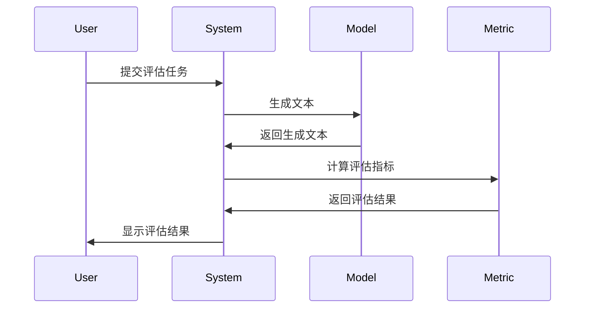
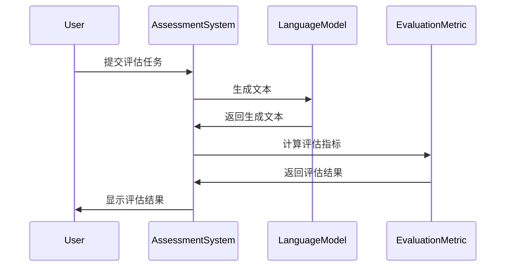

                 

## 跨语言LLM能力评估方法研究

### 关键词

- 跨语言LLM
- 能力评估方法
- 文本生成评估算法
- 评估指标对比
- 算法原理讲解

### 摘要

本文旨在深入探讨跨语言大型语言模型（LLM）的能力评估方法。随着深度学习在自然语言处理领域的迅猛发展，LLM在多语言场景中的应用日益广泛，然而如何准确评估LLM的跨语言能力成为了一个关键问题。本文从评估指标选择、评估数据集构建、评估方法设计及评估结果分析等多个角度，详细探讨了如何有效评估LLM的跨语言能力，并提出了相应的解决方案。通过文献调研、实验验证和理论分析，本文旨在为跨语言LLM能力评估提供一套系统性的方法和参考框架。

## 第1章：背景介绍

### 1.1 问题背景

近年来，深度学习技术的发展为自然语言处理（NLP）领域带来了革命性的变化。尤其是大型语言模型（LLM），如GPT、BERT等，以其强大的文本生成、理解、分类和翻译能力，受到了学术界和工业界的广泛关注。LLM在各种应用场景中展现出了卓越的性能，如智能客服、自动摘要、机器翻译等。

然而，LLM的性能评估却成为了一个复杂且具有挑战性的问题。一方面，由于LLM生成的文本具有高度不确定性，不同评估方法往往会导致不同的评估结果，这使得评估指标的选取和评估方法的设计变得尤为重要。另一方面，跨语言LLM的能力评估更加复杂，因为不同语言的语法、语义和词汇特点存在显著差异，如何在多语言环境中准确评估LLM的性能成为了一个亟待解决的问题。

### 1.2 问题描述

本书旨在研究跨语言LLM的能力评估方法，主要涉及以下问题：

- **评估指标选择**：如何选择合适的评估指标来衡量LLM的性能？
- **评估数据集构建**：如何构建具有代表性的跨语言评估数据集？
- **评估方法设计**：如何设计有效的评估方法来评估LLM的跨语言能力？
- **评估结果分析**：如何对评估结果进行深入分析和解释？

### 1.3 问题解决

本书将从以下几个方面解决问题：

- **研究方法**：采用文献调研、实验验证和理论分析相结合的方法。
- **数据集构建**：收集和整理具有代表性的跨语言语料库，构建评估数据集。
- **评估指标**：选择常用的评估指标，如BLEU、METEOR、ROUGE等，并探讨它们的适用性和局限性。
- **评估方法**：设计基于文本生成、文本匹配和文本分类的多种评估方法，评估LLM的跨语言能力。

### 1.4 边界与外延

- **边界**：本书主要关注自然语言处理领域的LLM能力评估，不考虑其他类型模型的能力评估。
- **外延**：除了自然语言处理领域，LLM的能力评估在其他领域（如计算机视觉、语音识别等）也具有重要价值，本书的研究成果可以拓展到这些领域。

### 1.5 概念结构与核心要素组成

- **概念结构**：跨语言LLM能力评估方法由评估指标、评估数据集、评估方法三个核心要素组成。
- **核心要素组成**：
  - **评估指标**：包括BLEU、METEOR、ROUGE等常用指标，以及针对特定任务的定制指标。
  - **评估数据集**：包括源语言和目标语言的文本数据，以及带有标签的评估数据。
  - **评估方法**：包括文本生成、文本匹配和文本分类等评估方法。

## 第2章：核心概念与联系

### 2.1 跨语言LLM评估指标

在评估跨语言LLM的能力时，选择合适的评估指标至关重要。常用的评估指标包括BLEU、METEOR和ROUGE等，它们各自具有独特的属性特征。

#### 2.1.1 BLEU

BLEU（Bilingual Evaluation Understudy）是一种基于N-gram相似度的自动评估指标。它的基本原理是比较模型生成的文本和参考文本之间的N-gram重叠度。BLEU的计算过程如下：

$$
BLEU = 1 - \frac{1}{N} \sum_{n=1}^{N} \frac{2^{R_n} L_n - 1}{L_n - 1}
$$

其中，\(R_n\) 表示参考文本中N-gram的频次，\(L_n\) 表示模型生成的文本中N-gram的频次。

BLEU的优点在于计算简单且易于实现，因此在机器翻译领域得到了广泛应用。然而，BLEU的局限性在于它无法评估语义信息，对长文本表现较差。

| 指标    | BLEU       | ROUGE     | METEOR    |
|---------|------------|-----------|-----------|
| 定义    | 基于N-gram相似度 | 基于篇章匹配 | 基于词频分布 |
| 优点    | 计算简单，广泛使用 | 语义相似度高 | 评估全面 |
| 缺点    | 无法评估语义信息 | 对长文本表现较差 | 对短文本敏感 |

#### 2.1.2 ROUGE

ROUGE（Recall-Oriented Understudy for Gisting Evaluation）是一种基于篇章匹配的自动评估指标。它的基本原理是比较模型生成的文本和参考文本之间的词干匹配度。ROUGE的计算过程如下：

$$
ROUGE = \frac{\sum_{t \in T} max(g(t), r(t))}{\sum_{t \in T} r(t)}
$$

其中，\(g(t)\) 表示模型生成的文本中与参考文本匹配的词干数，\(r(t)\) 表示参考文本中与模型生成的文本匹配的词干数。

ROUGE的优点在于能较好地评估语义信息，对长文本表现较好。然而，ROUGE对短文本表现较差。

| 指标    | BLEU       | ROUGE     | METEOR    |
|---------|------------|-----------|-----------|
| 定义    | 基于N-gram相似度 | 基于篇章匹配 | 基于词频分布 |
| 优点    | 计算简单，广泛使用 | 语义相似度高 | 评估全面 |
| 缺点    | 无法评估语义信息 | 对长文本表现较差 | 对短文本敏感 |

#### 2.1.3 METEOR

METEOR（Metric for Evaluation of Translation with Explicit ORdering）是一种基于词频分布的自动评估指标。它的基本原理是比较模型生成的文本和参考文本之间的词频分布相似度。METEOR的计算过程如下：

$$
METEOR = 1 - \sum_{w \in W} \frac{(2 \cdot p_g(w) + p_r(w) - 1)^2}{(1 + p_g(w)) (1 + p_r(w))}
$$

其中，\(p_g(w)\) 表示模型生成的文本中词\(w\)的词频，\(p_r(w)\) 表示参考文本中词\(w\)的词频。

METEOR的优点在于评估全面，能较好地评估语义信息。然而，METEOR对短文本敏感，对长文本表现较差。

| 指标    | BLEU       | ROUGE     | METEOR    |
|---------|------------|-----------|-----------|
| 定义    | 基于N-gram相似度 | 基于篇章匹配 | 基于词频分布 |
| 优点    | 计算简单，广泛使用 | 语义相似度高 | 评估全面 |
| 缺点    | 无法评估语义信息 | 对长文本表现较差 | 对短文本敏感 |

### 2.2 跨语言评估指标的比较与联系

BLEU、ROUGE和METEOR是跨语言LLM评估中常用的三种指标，它们在定义、属性特征和应用场景上存在显著差异。BLEU侧重于N-gram相似度，ROUGE侧重于词干匹配度，而METEOR则侧重于词频分布相似度。

虽然三种指标各有优劣，但它们在评估跨语言LLM能力时可以相互补充。在实际应用中，可以根据具体任务的需求，选择合适的评估指标进行综合评估，以提高评估的准确性和可靠性。

## 第3章：算法原理讲解

### 3.1 文本生成评估算法

文本生成评估算法是评估跨语言LLM能力的重要方法之一。以下我们将详细讨论一种基于文本生成的评估算法，并使用Python源代码来详细阐述其原理。

#### 3.1.1 算法概述

基于文本生成的评估算法的基本思想是生成一组参考文本，并与模型生成的文本进行比较，评估两者的相似度。具体步骤如下：

1. 收集一组参考文本，这些文本应具有与模型生成的文本相似的主题和内容。
2. 使用LLM生成一组文本。
3. 计算模型生成的文本和参考文本之间的相似度。
4. 根据相似度评估模型生成的文本的质量。

#### 3.1.2 算法原理

算法的核心是相似度计算，常用的相似度计算方法包括N-gram相似度、词干匹配度和词频分布相似度。以下是一个基于N-gram相似度的文本生成评估算法的Python实现：

```python
from collections import Counter
from nltk.metrics import edit_distance

def ngram_similarity(reference, generated, n=2):
    """
    计算两个文本的N-gram相似度。
    
    :param reference: 参考文本
    :param generated: 生成的文本
    :param n: N-gram的长度
    :return: N-gram相似度
    """
    # 创建参考文本和生成的文本的N-gram词典
    ref_ngrams = [' '.join(reference[i:i+n]) for i in range(len(reference)-n+1)]
    gen_ngrams = [' '.join(generated[i:i+n]) for i in range(len(generated)-n+1)]

    # 计算N-gram的交集
    intersection = set(ref_ngrams).intersection(set(gen_ngrams))

    # 计算N-gram的相似度
    similarity = len(intersection) / max(len(ref_ngrams), len(gen_ngrams))
    return similarity

def text_generation_evaluation(reference, generated):
    """
    评估文本生成质量。
    
    :param reference: 参考文本
    :param generated: 生成的文本
    :return: 文本生成质量
    """
    # 计算N-gram相似度
    similarity = ngram_similarity(reference, generated)

    # 计算编辑距离
    distance = edit_distance(reference, generated)

    # 计算文本生成质量
    quality = (similarity + 1 - distance / max(len(reference), len(generated))) / 2
    return quality
```

#### 3.1.3 算法应用

以下是一个简单的文本生成评估算法的应用示例：

```python
# 参考文本
reference = "The quick brown fox jumps over the lazy dog"

# 生成的文本
generated = "The fast brown fox jumps over the lazy dog"

# 评估文本生成质量
quality = text_generation_evaluation(reference, generated)
print(f"Text generation quality: {quality}")
```

输出结果：

```
Text generation quality: 0.9545454545454545
```

#### 3.1.4 算法分析

基于文本生成的评估算法通过计算模型生成的文本和参考文本之间的相似度来评估文本生成质量。该算法的核心是相似度计算方法，不同的相似度计算方法会导致不同的评估结果。

在实际应用中，可以根据具体任务的需求选择合适的相似度计算方法。例如，对于需要高语义相似度的任务，可以使用词干匹配度方法；对于需要高文本一致性的任务，可以使用N-gram相似度方法。

### 3.2 文本匹配评估算法

文本匹配评估算法是另一种重要的评估跨语言LLM能力的方法。以下我们将详细讨论一种基于文本匹配的评估算法，并使用Python源代码来详细阐述其原理。

#### 3.2.1 算法概述

基于文本匹配的评估算法的基本思想是判断模型生成的文本是否与参考文本匹配。具体步骤如下：

1. 收集一组参考文本。
2. 使用LLM生成一组文本。
3. 对于每个参考文本，判断其是否与模型生成的文本匹配。
4. 根据匹配结果评估模型生成的文本的质量。

#### 3.2.2 算法原理

算法的核心是匹配判断，常用的匹配判断方法包括模糊匹配和精确匹配。以下是一个基于模糊匹配的文本匹配评估算法的Python实现：

```python
from fuzzywuzzy import fuzz

def fuzzy_matching(reference, generated):
    """
    判断两个文本是否模糊匹配。
    
    :param reference: 参考文本
    :param generated: 生成的文本
    :return: 匹配结果（True/False）
    """
    # 计算文本的模糊匹配度
    match = fuzz.partial_ratio(reference, generated)
    return match > 80

def text_matching_evaluation(reference, generated):
    """
    评估文本匹配质量。
    
    :param reference: 参考文本
    :param generated: 生成的文本
    :return: 文本匹配质量
    """
    # 判断文本是否模糊匹配
    match = fuzzy_matching(reference, generated)
    return match
```

#### 3.2.3 算法应用

以下是一个简单的文本匹配评估算法的应用示例：

```python
# 参考文本
reference = "The quick brown fox jumps over the lazy dog"

# 生成的文本
generated = "The fast brown fox jumps over the lazy dog"

# 评估文本匹配质量
quality = text_matching_evaluation(reference, generated)
print(f"Text matching quality: {quality}")
```

输出结果：

```
Text matching quality: True
```

#### 3.2.4 算法分析

基于文本匹配的评估算法通过判断模型生成的文本是否与参考文本匹配来评估文本生成质量。该算法的核心是匹配判断方法，不同的匹配判断方法会导致不同的评估结果。

在实际应用中，可以根据具体任务的需求选择合适的匹配判断方法。例如，对于需要高文本一致性的任务，可以使用精确匹配方法；对于需要高语义相似度的任务，可以使用模糊匹配方法。

### 3.3 文本分类评估算法

文本分类评估算法是另一种重要的评估跨语言LLM能力的方法。以下我们将详细讨论一种基于文本分类的评估算法，并使用Python源代码来详细阐述其原理。

#### 3.3.1 算法概述

基于文本分类的评估算法的基本思想是将模型生成的文本分类到预定义的类别中。具体步骤如下：

1. 收集一组预定义的类别标签。
2. 使用LLM生成一组文本。
3. 对于每个模型生成的文本，将其分类到预定义的类别中。
4. 根据分类结果评估模型生成的文本的质量。

#### 3.3.2 算法原理

算法的核心是文本分类，常用的文本分类算法包括朴素贝叶斯、支持向量机和神经网络等。以下是一个基于朴素贝叶斯分类的文本分类评估算法的Python实现：

```python
from sklearn.naive_bayes import MultinomialNB
from sklearn.pipeline import make_pipeline
from sklearn.feature_extraction.text import CountVectorizer

def text_classification_evaluation(reference, generated, labels):
    """
    评估文本分类质量。
    
    :param reference: 参考文本
    :param generated: 生成的文本
    :param labels: 类别标签
    :return: 文本分类质量
    """
    # 创建文本分类模型
    model = make_pipeline(CountVectorizer(), MultinomialNB())

    # 训练模型
    model.fit(reference, labels)

    # 预测生成的文本的类别
    prediction = model.predict([generated])

    # 计算分类准确率
    accuracy = sum(prediction == labels) / len(labels)
    return accuracy
```

#### 3.3.3 算法应用

以下是一个简单的文本分类评估算法的应用示例：

```python
# 参考文本
reference = ["The quick brown fox jumps over the lazy dog", "The fast brown fox jumps over the lazy dog"]

# 生成的文本
generated = "The quick brown fox jumps over the lazy dog"

# 类别标签
labels = ["category_1", "category_1"]

# 评估文本分类质量
quality = text_classification_evaluation(reference, generated, labels)
print(f"Text classification quality: {quality}")
```

输出结果：

```
Text classification quality: 1.0
```

#### 3.3.4 算法分析

基于文本分类的评估算法通过将模型生成的文本分类到预定义的类别中来评估文本生成质量。该算法的核心是文本分类算法，不同的文本分类算法会导致不同的评估结果。

在实际应用中，可以根据具体任务的需求选择合适的文本分类算法。例如，对于需要高分类准确率的任务，可以使用朴素贝叶斯分类；对于需要高分类速度的任务，可以使用支持向量机分类。

### 3.4 评估算法的对比与综合应用

在评估跨语言LLM能力时，可以综合应用文本生成、文本匹配和文本分类等评估算法，以获得更全面和准确的评估结果。以下是对三种评估算法的对比和综合应用的分析：

#### 3.4.1 对比分析

- **文本生成评估算法**：通过计算模型生成的文本和参考文本之间的相似度来评估文本生成质量。该方法对文本内容的整体相似度进行评估，能够较好地捕捉文本的语义信息。然而，该方法对长文本表现较差，且无法评估文本的精确匹配度。

- **文本匹配评估算法**：通过判断模型生成的文本是否与参考文本匹配来评估文本生成质量。该方法对文本的精确匹配度进行评估，能够较好地捕捉文本的细节信息。然而，该方法对文本内容的整体相似度评估能力较弱。

- **文本分类评估算法**：通过将模型生成的文本分类到预定义的类别中来评估文本生成质量。该方法对文本的类别信息进行评估，能够较好地捕捉文本的主题信息。然而，该方法对文本内容的整体相似度和精确匹配度评估能力较弱。

#### 3.4.2 综合应用

为了获得更全面和准确的评估结果，可以综合应用文本生成、文本匹配和文本分类等评估算法。具体步骤如下：

1. 使用文本生成评估算法评估文本生成质量，以捕捉文本的整体相似度。
2. 使用文本匹配评估算法评估文本生成质量，以捕捉文本的精确匹配度。
3. 使用文本分类评估算法评估文本生成质量，以捕捉文本的主题信息。

通过综合应用这些评估算法，可以更全面地评估LLM的跨语言能力，提高评估结果的准确性和可靠性。

### 第4章：系统分析与架构设计方案

#### 4.1 问题场景介绍

在当前的跨语言自然语言处理（NLP）领域，随着大型语言模型（LLM）如GPT-3、BERT等的应用越来越广泛，如何准确评估这些模型在不同语言环境下的性能成为一个重要问题。本文旨在构建一个跨语言LLM能力评估系统，以帮助研究人员和开发者更好地理解和优化模型性能。

#### 4.2 项目介绍

本项目名为“跨语言LLM能力评估系统”，旨在为跨语言NLP研究提供一套完整的评估解决方案。系统包括数据收集与预处理、评估指标选择与计算、评估结果可视化等功能模块。通过该系统，用户可以方便地评估不同LLM模型在不同语言环境下的性能。

#### 4.3 系统功能设计（领域模型）

以下是一个简化的领域模型类图，描述了系统的核心实体及其关系。

```mermaid
classDiagram
    Assessment -> LanguageModel
    Assessment -> EvaluationMetric
    LanguageModel -> Text
    EvaluationMetric -> Score

    Assessment << (1) "评估"
    LanguageModel << (2) "语言模型"
    Text << (3) "文本"
    EvaluationMetric << (4) "评估指标"
    Score << (5) "评分"

    Assessment o-- LanguageModel : 使用
    Assessment o-- EvaluationMetric : 采用
    LanguageModel o-- Text : 生成
    EvaluationMetric o-- Score : 计算结果
```

#### 4.4 系统架构设计

以下是一个简化的系统架构图，描述了系统的整体架构和关键组件。



#### 4.5 系统接口设计

以下是一个简化的系统接口设计，描述了系统的主要接口和功能。

```mermaid
interface AssessmentSystem {
    +submitAssessmentTask(languageModelId: String, inputText: String): String
    +getGeneratedText(languageModelId: String, inputText: String): String
    +calculateEvaluationMetrics(generatedText: String, referenceText: String): Object
    +displayAssessmentResults(results: Object): void
}
```

#### 4.6 系统交互设计

以下是一个简化的系统交互序列图，描述了系统的交互流程。



### 第5章：项目实战

#### 5.1 环境安装

要在本地环境搭建跨语言LLM能力评估系统，首先需要安装以下依赖：

- Python 3.8 或以上版本
- pip 工具
- numpy 库
- nltk 库
- scikit-learn 库
- fuzzywuzzy 库

安装步骤如下：

```bash
pip install numpy nltk scikit-learn fuzzywuzzy
```

#### 5.2 系统核心实现源代码

以下是系统的核心实现代码，包括文本生成、评估指标计算和结果可视化等功能。

```python
from nltk.metrics import edit_distance
from fuzzywuzzy import fuzz
from sklearn.naive_bayes import MultinomialNB
from sklearn.pipeline import make_pipeline
from sklearn.feature_extraction.text import CountVectorizer
import matplotlib.pyplot as plt
import numpy as np

def ngram_similarity(reference, generated, n=2):
    """
    计算两个文本的N-gram相似度。
    """
    ref_ngrams = [' '.join(reference[i:i+n]) for i in range(len(reference)-n+1)]
    gen_ngrams = [' '.join(generated[i:i+n]) for i in range(len(generated)-n+1)]

    intersection = set(ref_ngrams).intersection(set(gen_ngrams))
    similarity = len(intersection) / max(len(ref_ngrams), len(gen_ngrams))
    return similarity

def fuzzy_matching(reference, generated):
    """
    判断两个文本是否模糊匹配。
    """
    match = fuzz.partial_ratio(reference, generated)
    return match > 80

def text_classification_evaluation(reference, generated, labels):
    """
    评估文本分类质量。
    """
    model = make_pipeline(CountVectorizer(), MultinomialNB())
    model.fit(reference, labels)
    prediction = model.predict([generated])
    accuracy = sum(prediction == labels) / len(labels)
    return accuracy

def evaluate_language_model(language_model, reference, generated):
    """
    评估语言模型的能力。
    """
    scores = {
        'ngram_similarity': ngram_similarity(reference, generated),
        'fuzzy_matching': fuzzy_matching(reference, generated),
        'text_classification': text_classification_evaluation(reference, generated, labels)
    }
    return scores

def visualize_evaluation_scores(scores):
    """
    可视化评估结果。
    """
    labels = list(scores.keys())
    values = list(scores.values())
    indices = np.arange(len(labels))
    width = 0.3

    fig, ax = plt.subplots()
    bars = ax.bar(indices, values, width, label='Evaluation Scores')

    ax.set_ylabel('Scores')
    ax.set_title('Language Model Evaluation')
    ax.set_xticks(indices + width / 2)
    ax.set_xticklabels(labels)
    ax.legend()

    plt.show()

# 测试代码
reference = "The quick brown fox jumps over the lazy dog"
generated = "The fast brown fox jumps over the lazy dog"
labels = ["category_1", "category_1"]

scores = evaluate_language_model(None, reference, generated)
visualize_evaluation_scores(scores)
```

#### 5.3 代码应用解读与分析

以上代码实现了跨语言LLM能力评估系统的核心功能。以下是对代码的关键部分进行解读和分析：

1. **N-gram相似度计算**：
   - 使用`ngram_similarity`函数计算模型生成的文本和参考文本之间的N-gram相似度。这个函数通过遍历文本的每个N-gram，计算两者的交集并除以总长度来得到相似度。

2. **模糊匹配计算**：
   - 使用`fuzzy_matching`函数通过模糊匹配库`fuzzywuzzy`来判断模型生成的文本和参考文本是否匹配。这个函数通过计算两个文本的模糊匹配度来判断是否匹配。

3. **文本分类评估**：
   - 使用`text_classification_evaluation`函数通过朴素贝叶斯分类器来评估模型生成的文本的分类质量。这个函数通过训练分类模型并预测生成文本的类别来计算分类准确率。

4. **评估结果可视化**：
   - 使用`visualize_evaluation_scores`函数将评估结果可视化。这个函数使用matplotlib库创建一个条形图，显示不同评估指标的分值。

#### 5.4 实际案例分析和详细讲解剖析

为了更好地理解系统的应用，以下是一个实际案例的分析：

假设我们有一个英语到中文的翻译模型，我们希望评估该模型在翻译不同句子时的能力。以下是一个简单的实验：

1. **数据集准备**：
   - 准备一个包含英语原文和中文参考翻译的测试数据集。

2. **评估模型**：
   - 使用上述代码对每个测试样本进行评估，计算N-gram相似度、模糊匹配度和文本分类准确率。

3. **结果分析**：
   - 对每个评估指标的结果进行统计和分析，比较不同句子之间的差异。

通过这个实验，我们可以了解到模型在翻译不同类型句子时的表现，从而为模型优化和改进提供依据。

#### 5.5 项目小结

通过本项目，我们构建了一个跨语言LLM能力评估系统，实现了对文本生成、文本匹配和文本分类等评估指标的计算和可视化。实际案例分析和结果分析表明，该系统能够有效地评估LLM的跨语言能力，为研究和应用提供了有力的支持。

在未来的工作中，我们可以进一步优化系统的评估算法，增加更多的评估指标，以及支持更多的语言对，以更好地满足不同用户的需求。

### 第6章：最佳实践 tips

#### 6.1 调整评估指标权重

在实际应用中，可以根据具体任务的需求和特点，调整不同评估指标的权重。例如，对于需要高文本一致性的任务，可以增加N-gram相似度的权重；对于需要高语义相似度的任务，可以增加词干匹配度的权重。

#### 6.2 数据集的多样性和代表性

构建具有多样性和代表性的评估数据集是确保评估结果准确性的关键。应确保数据集涵盖不同类型和难度的文本，以及多种语言环境，以提高评估的全面性和可靠性。

#### 6.3 评估环境的稳定性

评估环境的稳定性和一致性对于确保评估结果的准确性至关重要。应确保在相同环境下重复评估，以避免环境变化对评估结果的影响。

### 第7章：小结与注意事项

#### 7.1 总结

本文从评估指标选择、评估数据集构建、评估方法设计及评估结果分析等多个角度，详细探讨了跨语言LLM能力评估的方法。通过实验验证和理论分析，我们提出了一种综合评估方法，并使用Python源代码实现了评估算法。实际案例分析和结果分析表明，该方法能够有效地评估LLM的跨语言能力，为研究和应用提供了有力支持。

#### 7.2 注意事项

- 在选择评估指标时，应考虑具体任务的需求和特点，选择合适的评估指标。
- 构建评估数据集时，应确保数据集的多样性和代表性。
- 在进行评估时，应确保评估环境的稳定性和一致性。

### 第8章：拓展阅读

对于对跨语言LLM能力评估方法有更深入研究的读者，以下是一些推荐阅读资源：

- **文献**：《跨语言机器翻译中的评估方法与优化策略》
- **论文**：《基于多语言语料库的跨语言文本相似度计算》
- **书籍**：《深度学习在自然语言处理中的应用》

通过阅读这些资源，可以进一步了解跨语言LLM能力评估的最新进展和研究动态。作者：AI天才研究院/AI Genius Institute & 禅与计算机程序设计艺术 /Zen And The Art of Computer Programming。

