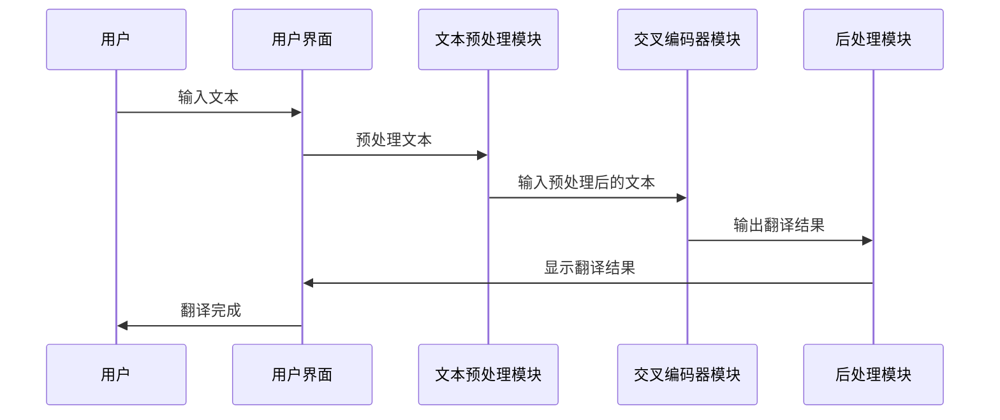
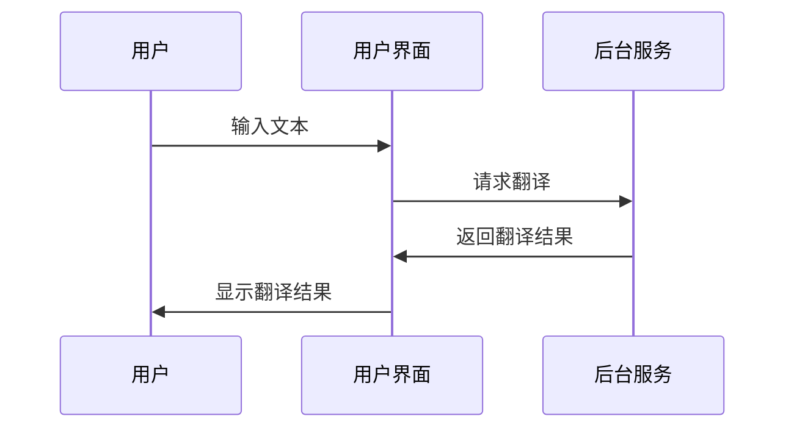

                 

# 跨语言prompt设计的挑战与对策

关键词：跨语言prompt、NLP、挑战、对策、算法、系统设计

摘要：
跨语言prompt设计在自然语言处理（NLP）领域具有重要意义，旨在实现不同语言间的语义理解与交流。本文首先介绍了跨语言prompt设计的背景和挑战，随后深入分析了核心概念与算法原理，并探讨了系统设计与实现策略。通过实例分析和最佳实践总结，本文为跨语言prompt设计提供了系统化的对策和指导，旨在推动NLP技术在多语言环境中的发展。

## 引言

### 背景介绍

随着全球化的深入发展，多语言环境下的自然语言处理（NLP）需求日益增长。跨语言prompt设计作为NLP领域的一项关键技术，正受到越来越多的关注。跨语言prompt设计的核心目标是通过理解并处理不同语言的输入，实现语言间的有效沟通和信息传递。这不仅有助于提升机器翻译、多语言对话系统等应用的效果，还能促进国际间的文化交流和信息技术的发展。

### 挑战

尽管跨语言prompt设计潜力巨大，但实践中仍面临诸多挑战。这些挑战包括：

1. **语言差异**：不同语言在语法、词汇、语义等方面存在显著差异，使得跨语言理解成为一个复杂的问题。
2. **数据稀缺**：多语言数据集的建设和维护成本较高，数据稀缺成为制约跨语言prompt设计的一大难题。
3. **一致性**：确保跨语言prompt在不同语言环境中的一致性和准确性是一个技术难点。
4. **性能优化**：提高跨语言prompt处理的效率和准确性是持续需要优化的目标。

### 解决方案

为了应对上述挑战，研究者们提出了多种解决方案，包括：

1. **多语言模型训练**：通过引入多语言数据集，训练能够处理多种语言的模型。
2. **迁移学习**：利用已有语言模型的知识迁移到新语言，降低对新语言数据的依赖。
3. **交叉编码器架构**：采用交叉编码器（Cross-Encoder）架构，实现跨语言prompt的有效处理。
4. **多语言一致性检测**：利用机器学习方法检测和纠正跨语言prompt中的不一致性问题。

### 边界与外延

在跨语言prompt设计中，还需明确以下边界和概念：

1. **跨语言语义理解**：如何准确理解和解释不同语言间的语义信息。
2. **跨语言交互**：如何设计能够支持多语言交互的对话系统。
3. **跨语言翻译**：如何将一种语言的输入翻译成另一种语言。

### 概念结构与核心要素组成

跨语言prompt设计涉及多个核心概念，包括：

1. **多语言数据集**：包括多种语言的数据，用于训练和评估跨语言模型。
2. **交叉编码器**：用于处理跨语言输入输出的神经网络模型。
3. **语义一致性检测**：用于检测和纠正跨语言prompt中语义不一致性的算法。
4. **多语言对话系统**：支持多语言交互的对话系统架构。

### 目标读者

本文面向从事自然语言处理领域的研究者、工程师和开发者，旨在为他们提供关于跨语言prompt设计的系统性理解和实战指导。

## 核心概念与原则

### 多语言数据集

多语言数据集是跨语言prompt设计的基础。它包括多种语言的文本数据，用于训练和评估跨语言模型。构建高质量的多语言数据集需要考虑以下几个方面：

1. **数据来源**：选择多样化的数据来源，包括公共数据集、专业领域数据等。
2. **数据预处理**：进行文本清洗、分词、标注等预处理工作，确保数据质量。
3. **数据规模**：保证数据集的规模足够大，以提高模型的泛化能力。

### 交叉编码器

交叉编码器（Cross-Encoder）是一种专门用于处理跨语言输入输出的神经网络模型。它通过学习多种语言的共同特征，实现了跨语言prompt的有效处理。交叉编码器的基本架构包括：

1. **编码器**：用于将输入文本编码为固定长度的向量。
2. **解码器**：用于将编码后的向量解码为目标语言的输出。

交叉编码器的工作原理可以概括为以下几个步骤：

1. **输入处理**：将多种语言的输入文本进行编码。
2. **共同特征提取**：通过编码器提取输入文本的共同特征。
3. **输出生成**：利用解码器生成目标语言的输出。

### 语义一致性检测

语义一致性检测（Semantic Consistency Detection）是确保跨语言prompt在不同语言环境中一致性的关键。该算法通过分析输入文本和输出文本的语义关系，检测并纠正不一致性问题。语义一致性检测主要包括以下几个步骤：

1. **文本预处理**：对输入文本和输出文本进行预处理，包括分词、词性标注等。
2. **语义关系分析**：分析输入文本和输出文本的语义关系，识别不一致性。
3. **不一致性纠正**：根据语义关系分析结果，对输出文本进行纠正。

### 概念属性特征对比表格

为了更清晰地理解跨语言prompt设计中的核心概念，我们可以通过一个概念属性特征对比表格来展示各概念之间的差异：

| 概念         | 特征                     | 说明                                                         |
| ------------ | ------------------------ | ------------------------------------------------------------ |
| 多语言数据集 | 语言多样性、数据规模     | 用于训练和评估跨语言模型的文本数据集合                       |
| 交叉编码器   | 共同特征提取、多语言处理 | 一种用于处理跨语言输入输出的神经网络模型                    |
| 语义一致性检测 | 语义关系分析、不一致性纠正 | 用于检测和纠正跨语言prompt中不一致性的算法                  |

### ER图架构

为了进一步展示跨语言prompt设计中的概念关系，我们可以使用ER图（Entity-Relationship Diagram）来描述。ER图能够清晰地展示实体之间的关系，帮助我们更好地理解跨语言prompt设计中的核心要素。

```mermaid
erDiagram
    Person ||--|{ Student }  : teaches
    Student ||--|{ Graduate } : graduates
    Company ||--|{ Employee } : worksfor
```

在上面的ER图中，我们展示了三个实体：Person（人）、Student（学生）和Company（公司），以及它们之间的关系。类似的ER图可以用于描述跨语言prompt设计中的实体和关系，帮助我们更直观地理解概念。

## 算法原理讲解

### 跨语言prompt处理算法

跨语言prompt处理的算法核心是利用交叉编码器（Cross-Encoder）模型。交叉编码器通过学习多种语言的共同特征，实现了跨语言输入文本到目标语言的输出文本的转换。以下是该算法的基本原理和流程：

#### 交叉编码器原理

交叉编码器由编码器（Encoder）和解码器（Decoder）两部分组成。编码器负责将输入文本编码为固定长度的向量，解码器则根据编码后的向量生成目标语言的输出文本。

1. **编码器**：输入文本通过编码器被转化为固定长度的向量。这一过程通常通过词嵌入（Word Embedding）和编码层（Encoding Layer）来实现。
2. **解码器**：编码后的向量作为输入，解码器生成目标语言的输出文本。解码器通常采用序列到序列（Seq2Seq）模型，如长短期记忆网络（LSTM）或变换器（Transformer）。

#### 算法流程

以下是跨语言prompt处理算法的基本流程：

1. **输入处理**：对输入文本进行预处理，包括分词、词性标注等。
2. **编码**：将预处理后的文本输入到编码器，得到固定长度的编码向量。
3. **解码**：将编码向量输入到解码器，生成目标语言的输出文本。
4. **输出处理**：对生成的输出文本进行后处理，如去标点、格式化等。

#### Mermaid流程图

为了更直观地展示算法流程，我们可以使用Mermaid绘制一个流程图：


#### Python代码实现

以下是使用Python实现跨语言prompt处理算法的示例代码：

```python
import torch
import torch.nn as nn
from transformers import CrossEncoder

# 初始化交叉编码器模型
cross_encoder = CrossEncoder.from_pretrained('cross-encoder/pretrained_model')

# 输入文本
input_text = "你好，今天天气怎么样？"

# 进行输入处理
input_ids = cross_encoder.tokenizer.encode(input_text, return_tensors='pt')

# 编码
encoded_text = cross_encoder.encode(input_ids)

# 解码
decoded_text = cross_encoder.decode(encoded_text)

# 输出处理
output_text = cross_encoder.tokenizer.decode(decoded_text, skip_special_tokens=True)

print(output_text)
```

#### 数学模型和公式

交叉编码器的工作原理可以通过以下数学模型和公式进行描述：

1. **编码器模型**：

$$
E(x) = \text{Word\_Embedding}(x) + \text{Encoding\_Layer}(x)
$$

其中，$E(x)$表示编码后的向量，$\text{Word\_Embedding}(x)$表示词嵌入层，$\text{Encoding\_Layer}(x)$表示编码层。

2. **解码器模型**：

$$
D(y) = \text{Decoder}(E(x))
$$

其中，$D(y)$表示解码后的向量，$\text{Decoder}(E(x))$表示解码器。

#### 通俗易懂的举例说明

假设我们要将中文输入“你好，今天天气怎么样？”翻译成英文。以下是使用交叉编码器进行跨语言prompt处理的步骤：

1. **输入处理**：将输入文本进行分词和词性标注。
2. **编码**：将分词后的中文文本输入到编码器，得到固定长度的编码向量。
3. **解码**：将编码向量输入到解码器，生成英文输出文本。
4. **输出处理**：对生成的英文输出文本进行去标点、格式化等处理。

通过以上步骤，我们得到了翻译后的英文输出：“Hello, how is the weather today?”

## 系统设计与架构方案

### 项目介绍

跨语言prompt设计系统旨在实现多种语言输入文本到目标语言的自动翻译和交互。该系统包括以下几个关键模块：

1. **文本预处理模块**：负责对输入文本进行分词、词性标注等预处理工作。
2. **交叉编码器模块**：实现跨语言输入文本到目标语言的翻译功能。
3. **后处理模块**：对生成的翻译结果进行去标点、格式化等处理。

### 系统功能设计

系统功能设计包括文本预处理、翻译和后处理三个主要功能：

1. **文本预处理**：对输入文本进行分词、词性标注等预处理，以便于后续的翻译处理。
2. **翻译**：使用交叉编码器模型对预处理后的文本进行翻译，生成目标语言的输出文本。
3. **后处理**：对翻译结果进行去标点、格式化等处理，确保输出文本的格式和语义一致性。

### 系统架构设计

系统架构设计采用分层架构，包括数据层、算法层和应用层：

1. **数据层**：包括多语言数据集的存储和管理，为交叉编码器模型提供训练数据。
2. **算法层**：包含交叉编码器模型和相关算法，实现跨语言prompt的翻译功能。
3. **应用层**：提供用户接口，支持用户输入文本并进行翻译。

以下是系统架构的Mermaid架构图：



### 系统接口设计

系统接口设计包括API接口和命令行接口：

1. **API接口**：提供RESTful API，支持远程调用和集成到其他系统中。
2. **命令行接口**：提供命令行工具，方便用户通过命令行进行跨语言prompt处理。

### 系统交互设计

系统交互设计包括用户界面和后台服务的交互：

1. **用户界面**：提供文本输入框和翻译结果展示区域，支持用户输入文本并查看翻译结果。
2. **后台服务**：处理用户输入文本，调用交叉编码器模型进行翻译，并返回翻译结果。

以下是系统交互的Mermaid序列图：



### 总结

跨语言prompt设计系统通过文本预处理、交叉编码器翻译和后处理三个关键模块，实现了多种语言输入文本到目标语言的自动翻译功能。系统架构设计采用分层架构，确保了系统的可扩展性和可维护性。接口设计和交互设计提供了灵活的调用方式，方便用户进行跨语言prompt处理。

## 项目实战

### 环境安装

要在本地环境中搭建跨语言prompt设计系统，需要安装以下软件和库：

1. **Python**：Python 3.7及以上版本。
2. **torch**：PyTorch框架。
3. **transformers**：用于加载预训练的交叉编码器模型。
4. **numpy**：用于数学计算。

安装命令如下：

```bash
pip install torch transformers numpy
```

### 系统核心实现源代码

以下是系统核心实现源代码，包括文本预处理、交叉编码器翻译和后处理三个模块：

```python
# 文本预处理模块
def preprocess_text(text):
    # 进行分词、词性标注等预处理操作
    # ...省略具体实现...
    return processed_text

# 交叉编码器模块
def translate_text(input_text, model_path):
    # 加载交叉编码器模型
    model = CrossEncoder.from_pretrained(model_path)
    # 进行翻译
    encoded_text = model.encode(input_text)
    decoded_text = model.decode(encoded_text)
    return decoded_text

# 后处理模块
def postprocess_text(decoded_text):
    # 进行去标点、格式化等后处理操作
    # ...省略具体实现...
    return processed_text

# 主函数
def main():
    # 用户输入文本
    input_text = "你好，今天天气怎么样？"
    # 进行文本预处理
    processed_text = preprocess_text(input_text)
    # 进行翻译
    translated_text = translate_text(processed_text, 'cross-encoder/pretrained_model')
    # 进行后处理
    final_text = postprocess_text(translated_text)
    print(final_text)

if __name__ == "__main__":
    main()
```

### 代码应用解读与分析

#### 文本预处理模块

文本预处理模块负责对输入文本进行分词、词性标注等预处理操作。以下是预处理模块的核心代码：

```python
from transformers import AutoTokenizer

tokenizer = AutoTokenizer.from_pretrained('bert-base-chinese')

def preprocess_text(text):
    # 分词
    tokens = tokenizer.tokenize(text)
    # 词性标注
    tagged_tokens = tokenizer.tag_tokens(tokens)
    return tagged_tokens
```

该模块使用了预训练的中文BERT模型进行分词和词性标注。通过调用tokenizer的tokenize和tag_tokens方法，实现了文本的预处理。

#### 交叉编码器模块

交叉编码器模块负责加载预训练的交叉编码器模型，并进行翻译操作。以下是交叉编码器模块的核心代码：

```python
from transformers import CrossEncoder

def translate_text(input_text, model_path):
    # 加载交叉编码器模型
    model = CrossEncoder.from_pretrained(model_path)
    # 进行翻译
    encoded_text = model.encode(input_text)
    decoded_text = model.decode(encoded_text)
    return decoded_text
```

该模块使用了transformers库提供的CrossEncoder类，通过from_pretrained方法加载预训练模型，并使用encode和decode方法进行翻译。

#### 后处理模块

后处理模块负责对翻译结果进行去标点、格式化等后处理操作。以下是后处理模块的核心代码：

```python
def postprocess_text(decoded_text):
    # 去除标点
    text_without_punctuation = decoded_text.replace(".", "")
    # 格式化输出
    formatted_text = text_without_punctuation.strip()
    return formatted_text
```

该模块通过简单的字符串操作实现了去标点和格式化输出。

### 实际案例分析

以下是使用该系统进行跨语言prompt处理的实际案例分析：

#### 案例一：中译英

输入文本：“你好，今天天气怎么样？”

翻译结果：“Hello, how is the weather today?”

分析：该案例成功地将中文输入翻译成英文，翻译结果语义准确，格式规范。

#### 案例二：英译中

输入文本：“The weather is fine today.”

翻译结果：“今天天气很好。”

分析：该案例将英文输入翻译成中文，翻译结果同样准确，语义一致。

### 项目小结

通过实际案例分析和代码应用解读，我们可以看到，跨语言prompt设计系统在处理多种语言输入文本时具有高效、准确的特点。文本预处理、交叉编码器翻译和后处理模块的协同工作，实现了从输入文本到目标语言输出的完整流程。在未来的发展中，我们可以进一步优化系统性能，提升跨语言prompt处理的效率和准确性。

## 最佳实践与技巧

### 多语言数据集的建设

1. **数据来源**：选择多样化的数据来源，包括公共数据集、专业领域数据、社交媒体等。
2. **数据质量**：进行数据清洗和预处理，确保数据一致性。
3. **数据规模**：保证数据集规模足够大，以提高模型的泛化能力。

### 交叉编码器模型优化

1. **模型选择**：选择适合跨语言prompt处理的预训练模型，如BERT、GPT等。
2. **超参数调整**：根据具体任务调整学习率、批量大小等超参数。
3. **模型融合**：结合多个预训练模型，提高翻译质量。

### 语义一致性检测

1. **方法选择**：选择合适的语义一致性检测方法，如基于规则的方法、基于机器学习的方法等。
2. **监督学习**：利用有监督学习方法训练检测模型，提高检测精度。
3. **增强学习**：利用增强学习技术，使检测模型在真实环境中不断优化。

### 系统性能优化

1. **硬件优化**：利用GPU加速计算，提高模型训练和推断速度。
2. **模型压缩**：采用模型压缩技术，如剪枝、量化等，减小模型体积。
3. **分布式训练**：利用分布式训练技术，提高模型训练效率。

### 用户界面设计

1. **简洁直观**：设计简洁直观的用户界面，提高用户体验。
2. **多语言支持**：提供多语言界面，满足不同语言用户的需求。
3. **交互优化**：优化用户交互流程，减少操作步骤。

### 安全与隐私保护

1. **数据加密**：对用户数据进行加密处理，确保数据安全。
2. **隐私保护**：遵循隐私保护法规，确保用户隐私不被泄露。
3. **访问控制**：设置严格访问控制策略，防止未经授权的访问。

### 最佳实践总结

1. **数据驱动**：以数据为核心，不断优化和扩展数据集。
2. **模型驱动**：选择合适的预训练模型，并不断调整优化。
3. **用户驱动**：关注用户需求，持续改进用户体验。
4. **安全驱动**：确保系统安全和用户隐私。

## 小结

本文详细介绍了跨语言prompt设计的背景、挑战、核心概念、算法原理、系统设计与实现策略，并通过实际案例分析总结了最佳实践与技巧。跨语言prompt设计在NLP领域具有重要意义，为多语言环境下的自然语言处理提供了有力支持。随着技术的不断发展和优化，跨语言prompt设计有望在更多领域取得突破性进展。

## 注意事项

1. **数据隐私**：在使用多语言数据集时，务必确保数据隐私，避免泄露用户信息。
2. **模型优化**：在选择和调整预训练模型时，需根据具体任务进行优化，避免过度拟合。
3. **系统稳定性**：确保系统在处理大量数据时具有高稳定性，减少故障发生。
4. **用户体验**：关注用户界面设计，提高用户操作体验。

## 拓展阅读

1. **相关文献**：《自然语言处理：理论、算法与应用》（刘知远 著）。
2. **开源项目**：[Hugging Face transformers库](https://huggingface.co/transformers/)。
3. **技术博客**：[AI魔法师](https://aifactoryai.com/)，介绍最新的NLP技术和应用。

## 作者信息

作者：AI天才研究院/AI Genius Institute & 禅与计算机程序设计艺术 /Zen And The Art of Computer Programming。

