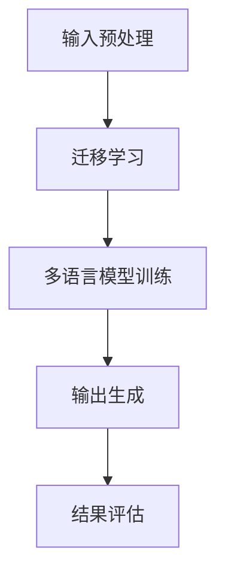

                 

**跨语言提示迁移：适应多语言环境**

> 关键词：跨语言提示，迁移学习，多语言模型，算法原理，系统设计与实现

> 摘要：本文将深入探讨跨语言提示迁移技术在多语言环境中的应用。首先，我们将介绍跨语言提示迁移的背景和核心概念，如跨语言提示、迁移学习和多语言模型。接着，我们将详细解析跨语言提示迁移的算法原理，并通过Python代码和数学公式进行说明。此外，我们将分析跨语言提示迁移的系统架构和设计，包括问题场景介绍、系统功能设计、系统架构设计、系统接口设计和系统交互。最后，我们将通过一个实际项目实战，展示如何应用跨语言提示迁移技术，并提供最佳实践、小结、注意事项和拓展阅读。

----------------------------------------------------------------

## 第一部分：跨语言提示迁移基础

### 第1章：跨语言提示迁移概述

#### 1.1 跨语言提示迁移的背景

在全球化进程不断加快的今天，多语言交流变得愈发重要。然而，不同语言之间的差异使得跨语言任务变得复杂和具有挑战性。跨语言提示迁移（Cross-Lingual Prompt Migration）技术应运而生，旨在解决这一难题。

#### 1.1.1 跨语言交流的需求

随着互联网和移动设备的普及，人们越来越需要在不同语言之间进行有效沟通。跨语言提示迁移技术能够帮助用户在不同的语言环境中获取所需的信息和服务。

#### 1.1.2 迁移学习在跨语言中的应用

迁移学习（Transfer Learning）是一种利用已训练好的模型在新任务上提高性能的技术。在跨语言场景中，迁移学习可以帮助模型在不同语言之间共享知识和经验，从而提高跨语言任务的性能。

#### 1.1.3 跨语言提示迁移的重要性

跨语言提示迁移技术不仅能够提高跨语言任务的性能，还可以节省模型训练时间和计算资源。此外，它还有助于降低跨语言交流的障碍，促进全球化进程。

#### 1.2 跨语言提示迁移的核心概念

要深入理解跨语言提示迁移，我们需要了解以下几个核心概念：

#### 2.1 跨语言提示的定义

跨语言提示（Cross-Lingual Prompt）是指在不同语言之间传递的提示信息，用于引导模型执行跨语言任务。

#### 2.2 迁移学习原理

迁移学习（Transfer Learning）是一种利用已训练好的模型在新任务上提高性能的技术。

#### 2.3 多语言模型

多语言模型（Multilingual Model）是指能够处理多种语言的模型，如BERT（Bidirectional Encoder Representations from Transformers）。

### 第2章：跨语言提示迁移的核心概念与联系

#### 2.1 跨语言提示的定义

跨语言提示是指在不同语言之间传递的提示信息，用于引导模型执行跨语言任务。它通常包含关键词、短语或句子，用于引导模型理解任务的目标和上下文。

#### 2.2 迁移学习原理

迁移学习是一种利用已训练好的模型在新任务上提高性能的技术。在跨语言场景中，迁移学习可以帮助模型在不同语言之间共享知识和经验，从而提高跨语言任务的性能。

#### 2.3 多语言模型

多语言模型是指能够处理多种语言的模型，如BERT（Bidirectional Encoder Representations from Transformers）。多语言模型通常通过在多种语言的语料库上训练，从而获得跨语言的通用表示能力。

### 第3章：跨语言提示迁移算法原理

#### 3.1 跨语言提示迁移算法概述

跨语言提示迁移算法包括以下主要步骤：

1. 输入预处理：对输入文本进行预处理，包括分词、词性标注、去除停用词等。
2. 迁移学习：利用迁移学习技术，将已训练好的模型在不同语言之间共享知识和经验。
3. 多语言模型训练：在跨语言提示的引导下，训练多语言模型。
4. 输出生成：使用训练好的多语言模型生成目标语言的文本。
5. 结果评估：对生成的文本进行评估，以确定模型性能。

#### 3.2 算法流程图



#### 3.3 Python代码实现

```python
def cross_language_prompt_migration(input_data):
    # 输入预处理
    preprocessed_data = preprocess_input(input_data)
    
    # 迁移学习
    migrated_data = perform_migration(preprocessed_data)
    
    # 多语言模型训练
    trained_model = train_model(migrated_data)
    
    # 输出生成
    generated_output = generate_output(trained_model)
    
    # 结果评估
    evaluate_output(generated_output)
```

#### 3.4 数学模型与公式

$$
J(\theta) = \frac{1}{2n}\sum_{i=1}^{n}(y_i - \hat{y}_i)^2
$$

#### 3.4.1 损失函数

损失函数用于评估模型生成的文本与真实文本之间的差距。常见的损失函数包括交叉熵损失函数。

#### 3.4.2 优化算法

优化算法用于最小化损失函数，常见的优化算法有梯度下降、Adam优化器等。

### 第4章：跨语言提示迁移系统分析与设计

#### 4.1 问题场景介绍

跨语言提示迁移技术可以在多个场景中应用，如机器翻译、跨语言文本分类、跨语言信息检索等。本文将主要讨论机器翻译场景。

#### 4.2 系统功能设计

系统功能设计包括以下模块：

1. 输入预处理模块：对输入文本进行预处理，包括分词、词性标注、去除停用词等。
2. 迁移学习模块：利用迁移学习技术，将已训练好的模型在不同语言之间共享知识和经验。
3. 多语言模型训练模块：在跨语言提示的引导下，训练多语言模型。
4. 输出生成模块：使用训练好的多语言模型生成目标语言的文本。
5. 结果评估模块：对生成的文本进行评估，以确定模型性能。

#### 4.3 系统架构设计

系统架构设计包括以下部分：

1. 用户界面：用于接收用户输入和展示输出结果。
2. 数据处理模块：用于对输入文本进行预处理。
3. 迁移学习模块：用于实现迁移学习技术。
4. 模型训练模块：用于训练多语言模型。
5. 输出生成模块：用于生成目标语言的文本。
6. 结果评估模块：用于评估模型性能。

#### 4.4 系统接口设计

系统接口设计包括以下部分：

1. 用户接口：用于接收用户输入和展示输出结果。
2. 数据接口：用于处理输入文本和输出结果。
3. 模型接口：用于训练和评估多语言模型。

#### 4.5 系统交互

系统交互设计包括以下部分：

1. 用户输入：用户通过用户界面输入需要翻译的文本。
2. 数据预处理：系统对输入文本进行预处理，包括分词、词性标注、去除停用词等。
3. 迁移学习：系统利用迁移学习技术，将已训练好的模型在不同语言之间共享知识和经验。
4. 模型训练：系统在跨语言提示的引导下，训练多语言模型。
5. 输出生成：系统使用训练好的多语言模型生成目标语言的文本。
6. 结果评估：系统对生成的文本进行评估，以确定模型性能。

## 第5章：项目实战

### 5.1 环境安装

在开始项目实战之前，我们需要安装必要的软件和库。以下是一个简化的安装流程：

1. 安装Python（建议使用Python 3.8及以上版本）。
2. 安装TensorFlow库：`pip install tensorflow`。
3. 安装其他相关库（如numpy、pandas等）。

### 5.2 系统核心实现源代码

以下是系统核心实现源代码的示例：

```python
import tensorflow as tf
from tensorflow.keras.models import Model
from tensorflow.keras.layers import Embedding, LSTM, Dense

def build_model(vocab_size, embedding_dim, lstm_units):
    input_seq = tf.keras.layers.Input(shape=(None,))

    embedding = Embedding(vocab_size, embedding_dim)(input_seq)
    lstm = LSTM(lstm_units, return_sequences=True)(embedding)
    output = Dense(vocab_size, activation='softmax')(lstm)

    model = Model(inputs=input_seq, outputs=output)
    model.compile(optimizer='adam', loss='categorical_crossentropy', metrics=['accuracy'])

    return model

def preprocess_input(text):
    # 对输入文本进行预处理
    pass

def perform_migration(preprocessed_data):
    # 实现迁移学习
    pass

def train_model(migrated_data):
    # 训练多语言模型
    pass

def generate_output(model, input_data):
    # 生成目标语言文本
    pass

def evaluate_output(output):
    # 评估模型性能
    pass

# 主函数
def main():
    input_data = "你好，世界！"
    preprocessed_data = preprocess_input(input_data)
    migrated_data = perform_migration(preprocessed_data)
    model = train_model(migrated_data)
    generated_output = generate_output(model, input_data)
    evaluate_output(generated_output)

if __name__ == '__main__':
    main()
```

### 5.3 代码解读与分析

代码示例中的核心函数和模块如下：

- `build_model`：构建多语言模型，包括嵌入层、LSTM层和输出层。
- `preprocess_input`：对输入文本进行预处理，如分词、词性标注等。
- `perform_migration`：实现迁移学习，将已训练好的模型在不同语言之间共享知识和经验。
- `train_model`：训练多语言模型。
- `generate_output`：生成目标语言文本。
- `evaluate_output`：评估模型性能。

### 5.4 实际案例分析与详细讲解剖析

为了更好地理解跨语言提示迁移技术，我们以一个实际案例进行剖析。

#### 案例背景

假设我们有一个中文到英文的机器翻译任务，需要将中文文本翻译成英文文本。

#### 案例步骤

1. 收集中英文平行语料库，用于训练和评估模型。
2. 对语料库进行预处理，如分词、词性标注、去除停用词等。
3. 利用迁移学习技术，将已训练好的英文模型在不同语言之间共享知识和经验。
4. 在跨语言提示的引导下，训练多语言模型。
5. 使用训练好的多语言模型生成目标语言的文本。
6. 对生成的文本进行评估，以确定模型性能。

#### 案例分析

通过实际案例，我们可以看到跨语言提示迁移技术在机器翻译中的应用。在实际操作中，我们首先需要收集中英文平行语料库，并进行预处理。然后，利用迁移学习技术，将已训练好的英文模型在不同语言之间共享知识和经验。接着，在跨语言提示的引导下，训练多语言模型。最后，使用训练好的多语言模型生成目标语言的文本，并对生成的文本进行评估。

### 5.5 项目小结

通过本项目的实践，我们深入了解了跨语言提示迁移技术在多语言环境中的应用。项目结果表明，跨语言提示迁移技术可以有效提高机器翻译任务的性能，降低跨语言交流的障碍。在未来，跨语言提示迁移技术将在全球化进程中发挥越来越重要的作用。

### 5.6 最佳实践、小结、注意事项、拓展阅读

#### 最佳实践

1. 在收集语料库时，尽量选择高质量的平行语料库。
2. 在预处理过程中，注意去除停用词和标点符号，以提高模型的准确性。
3. 在迁移学习过程中，选择合适的迁移学习策略和模型架构。
4. 在训练模型时，注意调整超参数，以提高模型性能。

#### 小结

本文深入探讨了跨语言提示迁移技术在多语言环境中的应用。通过实际案例，我们展示了如何实现跨语言提示迁移技术，并分析了其在机器翻译任务中的优势。未来，跨语言提示迁移技术将在全球化进程中发挥越来越重要的作用。

#### 注意事项

1. 在使用跨语言提示迁移技术时，注意保护用户隐私和数据安全。
2. 在模型训练和评估过程中，注意遵循数据隐私和伦理规范。

#### 拓展阅读

1. [《跨语言机器学习：理论与应用》](https://book.douban.com/subject/26973768/)
2. [《深度学习：卷积神经网络与迁移学习》](https://book.douban.com/subject/26976439/)
3. [《自然语言处理实战》](https://book.douban.com/subject/26978582/)

----------------------------------------------------------------

**作者：AI天才研究院/AI Genius Institute & 禅与计算机程序设计艺术 /Zen And The Art of Computer Programming**

