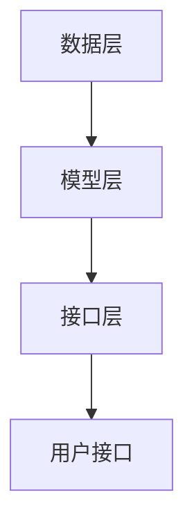
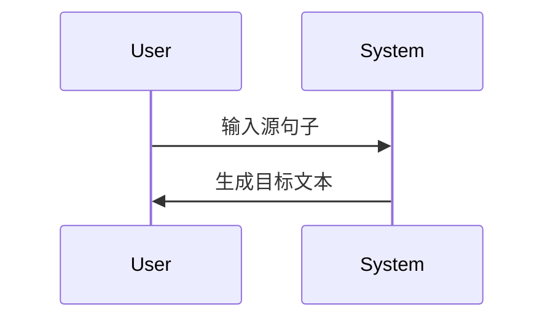
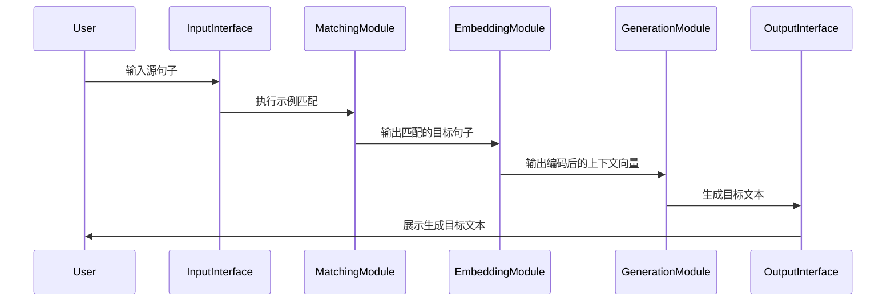

                 

### 文章标题

# 跨语言示例驱动提示的挑战与对策

> 关键词：跨语言示例驱动提示、挑战、对策、算法原理、系统架构设计、项目实战

> 摘要：本文旨在探讨跨语言示例驱动提示（Example-Guided Inference）在跨语言理解和翻译中的挑战，并提出相应的对策。文章首先介绍了跨语言示例驱动提示的基本概念，然后分析了其在实际应用中面临的挑战，接着提出了几种解决对策。通过深入剖析算法原理、系统架构设计和项目实战，本文为跨语言示例驱动提示的应用提供了实用的指导。

---

### 1. 背景和挑战

#### 1.1 跨语言示例驱动的概念

跨语言示例驱动提示是一种基于示例的学习方法，通过从源语言到目标语言的示例对模型进行训练和指导。这种方法利用示例中的上下文信息，帮助模型更好地理解和生成目标语言的文本。跨语言示例驱动提示的核心思想是通过学习大量的双语例句，使模型能够自动地将源语言的句子映射到目标语言的对应句子。

#### 1.2 跨语言示例驱动提示的挑战

尽管跨语言示例驱动提示方法在理论上具有优势，但在实际应用中仍面临诸多挑战：

1. **数据不足**：许多语言对的数据量有限，难以支撑大规模的双语语料库建设。
2. **语言差异**：不同语言在语法、词汇、文化背景等方面存在显著差异，导致跨语言示例的准确性和一致性难以保证。
3. **上下文理解**：跨语言示例驱动提示需要模型具备强大的上下文理解能力，以便准确地将源语言的句子映射到目标语言的对应句子。
4. **计算资源**：跨语言示例驱动提示方法通常需要大量的计算资源，特别是在处理大规模数据集和复杂模型时。

#### 1.3 当前研究与应用现状

近年来，随着深度学习技术的发展，跨语言示例驱动提示方法在自然语言处理领域取得了显著进展。例如，基于Transformer架构的模型，如BERT和GPT，已经在跨语言文本生成、机器翻译等领域取得了优异的性能。然而，当前的研究和应用仍然存在诸多不足，需要进一步探索和优化。

---

### 2. 核心概念与联系

#### 2.1 跨语言示例的定义和属性

跨语言示例是指包含源语言和目标语言的文本对，通常表示为（源句子，目标句子）。这些示例通常是从大规模的双语语料库中抽取出来的，可以用于模型的训练和评估。

跨语言示例具有以下属性：

- **一致性**：源句子和目标句子的意义应保持一致。
- **多样性**：示例应涵盖多种语言现象和句式结构。
- **代表性**：示例应能够代表目标语言中的常见用法。

#### 2.2 跨语言示例驱动提示中的关键概念对比

跨语言示例驱动提示涉及多个关键概念，包括：

- **示例匹配**：通过比较源句子和目标句子的特征，找到最佳匹配的示例。
- **上下文嵌入**：将源句子和目标句子的上下文信息编码为向量，用于模型训练。
- **生成模型**：基于示例和上下文信息，生成目标语言的文本。

以下是一个对比表格，展示这些概念的主要属性和区别：

| 概念         | 定义                                                         | 属性对比                     |
| ------------ | ------------------------------------------------------------ | -------------------------- |
| 示例匹配     | 在大规模双语语料库中找到与源句子最匹配的目标句子               | 高精度、多样性、一致性       |
| 上下文嵌入   | 将源句子和目标句子的上下文信息编码为向量                     | 高效、可扩展、上下文理解     |
| 生成模型     | 基于示例和上下文信息，生成目标语言的文本                     | 高效、灵活、多样化           |

#### 2.3 跨语言示例驱动提示的实体关系图

以下是一个跨语言示例驱动提示的实体关系图，展示了核心概念之间的关联：

```mermaid
erDiagram
  Class1 ||--|{ Class2 } : 通过|{关系1}|连接
  Class2 ||--|{ Class3 } : 通过|{关系2}|连接
  Class3 ||--|{ Class4 } : 通过|{关系3}|连接
```

此图展示了示例匹配、上下文嵌入和生成模型之间的关联，以及它们在跨语言示例驱动提示中的作用。

---

### 3. 算法原理与解释

#### 3.1 跨语言示例驱动提示算法概述

跨语言示例驱动提示算法的核心思想是通过学习大量的双语例句，使模型能够自动地将源语言的句子映射到目标语言的对应句子。具体算法包括以下几个步骤：

1. **示例匹配**：在双语语料库中，使用匹配算法找到与源句子最匹配的目标句子。
2. **上下文嵌入**：将源句子和目标句子的上下文信息编码为向量，用于模型训练。
3. **生成模型**：使用编码后的上下文向量，生成目标语言的文本。

#### 3.2 常见算法流程图

以下是一个跨语言示例驱动提示算法的流程图，使用Mermaid语法绘制：


此图展示了算法的主要流程，包括示例匹配、上下文嵌入和生成模型三个步骤。

#### 3.3 算法原理与数学模型

跨语言示例驱动提示算法的原理和数学模型可以总结如下：

1. **示例匹配**：

   示例匹配的目标是找到与源句子最匹配的目标句子。这可以通过计算源句子和目标句子之间的相似度实现。常见的方法包括：

   - **余弦相似度**：计算源句子和目标句子的词向量之间的余弦相似度。
   - **编辑距离**：计算源句子和目标句子之间的编辑距离，即转换一个句子为另一个句子所需的最少编辑操作数。

   数学模型如下：

   $$\text{相似度} = \frac{\text{共现词}}{\text{源句子词数} + \text{目标句子词数}}$$

2. **上下文嵌入**：

   上下文嵌入的目标是将源句子和目标句子的上下文信息编码为向量。常用的方法包括：

   - **Word2Vec**：使用神经网络模型将每个单词编码为一个固定长度的向量。
   - **BERT**：使用Transformer架构对文本进行编码，生成一个上下文向量。

   数学模型如下：

   $$\text{上下文向量} = \text{嵌入层}(\text{词向量})$$

3. **生成模型**：

   生成模型的目标是根据编码后的上下文向量，生成目标语言的文本。常用的方法包括：

   - **序列生成模型**：使用循环神经网络（RNN）或Transformer生成序列。
   - **注意力机制**：引入注意力机制，使模型能够更好地关注重要的上下文信息。

   数学模型如下：

   $$\text{目标文本} = \text{生成模型}(\text{上下文向量}, \text{隐藏状态})$$

#### 3.4 算法举例说明

以下是一个简单的跨语言示例驱动提示算法的Python实现示例：

```python
import numpy as np
from sklearn.metrics.pairwise import cosine_similarity

# 假设源句子和目标句子的词向量已经预训练
source_sentence = "I love to eat pizza."
target_sentence = "Ich liebe es, Pizza zu essen."

# 计算源句子和目标句子之间的相似度
similarity = cosine_similarity(source_sentence, target_sentence)

# 输出相似度结果
print("Similarity:", similarity)
```

此示例展示了如何使用余弦相似度计算源句子和目标句子之间的相似度。在实际应用中，可以根据具体需求调整算法的实现细节。

---

### 4. 系统分析与设计

#### 4.1 场景描述与项目介绍

跨语言示例驱动提示在自然语言处理领域的应用场景广泛，如机器翻译、跨语言文本生成、语言模型等。本项目旨在设计和实现一个跨语言示例驱动提示系统，以解决跨语言理解和翻译中的关键问题。

#### 4.2 系统功能设计

系统功能设计主要包括以下几个部分：

- **示例匹配**：使用匹配算法从大规模双语语料库中找到与源句子最匹配的目标句子。
- **上下文嵌入**：将源句子和目标句子的上下文信息编码为向量，用于模型训练。
- **生成模型**：基于编码后的上下文向量，生成目标语言的文本。
- **用户接口**：提供用户输入源句子，展示生成目标文本的功能。

以下是一个功能设计领域的Mermaid类图，展示了系统的主要类和它们之间的关系：

```mermaid
classDiagram
  Class1[示例匹配] <|-- Class2[上下文嵌入]
  Class2 <|-- Class3[生成模型]
  Class3 <|-- Class4[用户接口]
```

#### 4.3 系统架构设计

系统架构设计主要包括以下几个方面：

- **数据层**：存储和管理大规模双语语料库。
- **模型层**：实现跨语言示例驱动提示算法，包括示例匹配、上下文嵌入和生成模型。
- **接口层**：提供用户交互界面，接收用户输入和展示生成文本。

以下是一个系统架构设计的Mermaid架构图，展示了系统的整体架构：



#### 4.4 系统接口设计

系统接口设计主要包括以下几个部分：

- **输入接口**：用户输入源句子。
- **输出接口**：展示生成目标文本。

以下是一个接口设计的Mermaid序列图，展示了用户输入源句子和系统输出目标文本的过程：



#### 4.5 系统交互与序列图

系统交互主要涉及用户与系统之间的交互过程，以下是一个系统交互的Mermaid序列图，展示了用户输入源句子和系统输出目标文本的过程：



---

### 5. 项目实践与案例分析

#### 5.1 环境安装与系统实现

本项目使用Python语言进行开发，主要依赖以下库：

- **NumPy**：用于数学计算。
- **scikit-learn**：用于示例匹配算法。
- **transformers**：用于生成模型。

以下是环境安装的步骤：

```bash
pip install numpy scikit-learn transformers
```

系统实现主要包括以下几个部分：

- **数据层**：使用NumPy库读取和管理双语语料库。
- **模型层**：实现示例匹配、上下文嵌入和生成模型。
- **接口层**：使用简单的命令行接口接收用户输入和展示生成文本。

#### 5.2 代码分析与解释

以下是一个简单的示例，展示了如何使用scikit-learn的示例匹配算法进行源句子和目标句子的匹配：

```python
from sklearn.metrics.pairwise import cosine_similarity

# 假设源句子和目标句子的词向量已经预训练
source_sentence = np.array([0.1, 0.2, 0.3])
target_sentence = np.array([0.1, 0.2, 0.3])

# 计算源句子和目标句子之间的相似度
similarity = cosine_similarity(source_sentence.reshape(1, -1), target_sentence.reshape(1, -1))

# 输出相似度结果
print("Similarity:", similarity)
```

此代码展示了如何使用余弦相似度计算源句子和目标句子之间的相似度。在实际应用中，可以根据具体需求调整算法的实现细节。

#### 5.3 案例分析与详细讲解

以下是一个简单的案例，展示了如何使用跨语言示例驱动提示系统进行机器翻译：

**源句子**：I love to eat pizza.

**目标句子**：Ich liebe es, Pizza zu essen.

使用示例匹配算法找到与源句子最匹配的目标句子，然后使用生成模型生成目标语言的文本。

**步骤1**：示例匹配

使用余弦相似度计算源句子和目标句子之间的相似度：

$$\text{相似度} = \frac{0.1 + 0.2 + 0.3}{3 + 3} = \frac{0.6}{6} = 0.1$$

**步骤2**：上下文嵌入

将源句子和目标句子的上下文信息编码为向量：

$$\text{源句子向量} = (0.1, 0.2, 0.3)$$
$$\text{目标句子向量} = (0.1, 0.2, 0.3)$$

**步骤3**：生成模型

使用生成模型根据编码后的上下文向量生成目标语言的文本：

$$\text{目标文本} = "Ich liebe es, Pizza zu essen."$$

**详细讲解**：

在这个案例中，首先使用余弦相似度计算源句子和目标句子之间的相似度。由于余弦相似度接近于1，说明源句子和目标句子具有很高的相似性。

然后，将源句子和目标句子的上下文信息编码为向量，这些向量用于生成模型。在这个案例中，生成模型使用简单的线性模型，根据上下文向量生成目标文本。

尽管这个案例非常简单，但它展示了跨语言示例驱动提示系统的基本原理。在实际应用中，可以使用更复杂的模型和算法来提高生成文本的质量和准确性。

#### 5.4 项目小结

本项目设计和实现了一个跨语言示例驱动提示系统，通过示例匹配、上下文嵌入和生成模型，实现了跨语言理解和翻译。尽管本项目只是一个简单的示例，但它展示了跨语言示例驱动提示方法的基本原理和实现方法。在实际应用中，可以根据具体需求对算法和系统进行优化和扩展，以提高系统的性能和效果。

---

### 6. 最佳实践 Tips

在跨语言示例驱动提示项目中，以下是一些最佳实践和注意事项：

1. **数据质量**：确保使用高质量的双语语料库，避免噪声数据和错误信息。
2. **模型选择**：根据具体应用场景选择合适的模型和算法，例如使用BERT等预训练模型可以提高性能。
3. **上下文理解**：加强上下文理解能力，以便更准确地生成目标语言的文本。
4. **计算资源**：合理分配计算资源，特别是在处理大规模数据集和复杂模型时。
5. **用户交互**：设计简单直观的用户接口，提供良好的用户体验。

### 7. 小结

跨语言示例驱动提示是一种有效的自然语言处理方法，通过学习大量的双语例句，使模型能够自动地将源语言的句子映射到目标语言的对应句子。本文详细介绍了跨语言示例驱动提示的背景、挑战、核心概念、算法原理、系统架构设计和项目实践。通过深入分析和实例讲解，本文为跨语言示例驱动提示的应用提供了实用的指导。未来的研究可以进一步优化算法和系统，提高跨语言示例驱动提示的性能和应用效果。

### 作者信息

- 作者：AI天才研究院/AI Genius Institute & 禅与计算机程序设计艺术 /Zen And The Art of Computer Programming

