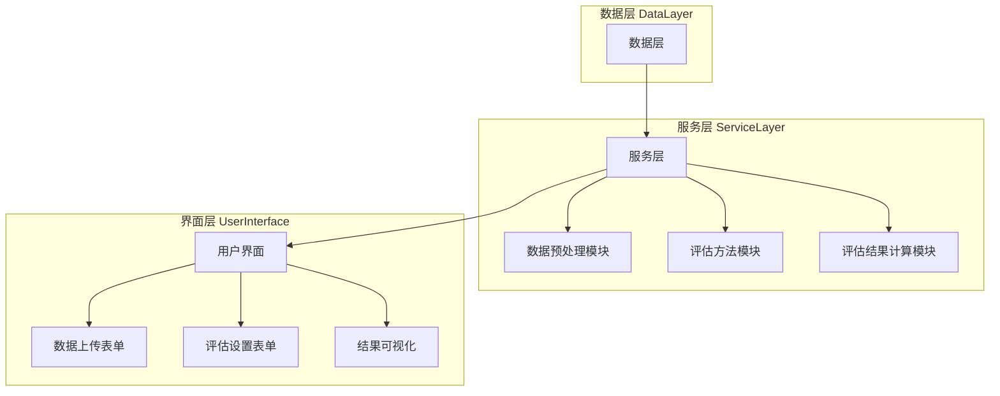

                 

### 背景介绍

跨语言能力评估是当前信息技术领域中的一个重要课题。随着全球化的深入发展，多语言处理技术越来越受到关注。然而，多语言处理面临着语法、词汇、句法结构等方面的巨大差异，这使得评估多语言处理系统的性能成为一个复杂且富有挑战性的任务。

首先，我们需要了解一些核心概念术语。跨语言能力评估（Cross-Lingual Ability Assessment）是对多语言处理系统进行性能评估的过程。它不仅涉及机器翻译（Machine Translation），还包括文本分类（Text Classification）、命名实体识别（Named Entity Recognition）等多个领域。评估指标通常包括准确性（Accuracy）、召回率（Recall）和F1分数（F1 Score）等。

#### 问题背景

当前多语言处理面临的挑战主要体现在以下几个方面：

1. **语法差异**：不同语言在语法结构上有很大差异，例如，某些语言是主谓宾结构，而另一些语言则是主宾谓结构。这种差异使得直接翻译变得困难。

2. **词汇差异**：词汇量的大小和用法差异是另一个挑战。例如，中文和英文在词汇上有很大差异，某些词汇在一种语言中可能有多个对应词，而在另一种语言中则没有直接对应。

3. **文化差异**：语言不仅仅是沟通的工具，还承载了丰富的文化信息。跨文化背景的语言处理需要考虑语言背后的文化差异，这增加了处理的复杂性。

4. **语义理解**：语义理解是自然语言处理的关键，不同语言之间的语义表达可能有很大差异，这使得语义理解成为一个极具挑战性的任务。

#### 问题描述

跨语言能力评估的核心问题是如何准确评估多语言处理系统的性能。具体来说，我们需要解决以下几个问题：

- 如何选择合适的评估指标？
- 如何构建有效的评估模型？
- 如何处理多语言数据集？
- 如何处理评估过程中的不确定性？

这些问题涉及到算法设计、数据预处理、模型评估等多个方面，需要综合运用自然语言处理、机器学习、数据挖掘等技术。

#### 问题解决

解决跨语言能力评估的问题需要从以下几个方面入手：

1. **算法设计**：设计高效的算法来处理多语言数据，例如，基于神经网络的机器翻译模型、基于深度学习的文本分类模型等。

2. **数据预处理**：对多语言数据集进行预处理，包括数据清洗、数据标注、数据增强等，以提高评估的准确性和可靠性。

3. **模型评估**：设计多种评估指标，如准确性、召回率、F1分数等，以全面评估模型的性能。

4. **不确定性处理**：在评估过程中，考虑模型的不确定性，如使用贝叶斯推理、概率图模型等方法来处理。

#### 边界与外延

跨语言能力评估不仅局限于机器翻译领域，还可以应用于文本分类、命名实体识别、情感分析等多个领域。此外，跨语言能力评估还可以扩展到多模态处理，如结合语音、图像等多种数据类型。

#### 概念结构与核心要素组成

跨语言能力评估的核心概念包括：

1. **评估指标**：准确性、召回率、F1分数等。
2. **评估模型**：机器翻译模型、文本分类模型等。
3. **数据预处理**：数据清洗、数据标注、数据增强等。
4. **算法设计**：神经网络、深度学习等。

### 核心概念与联系

在跨语言能力评估中，核心概念包括：

1. **跨语言能力评估**：对多语言处理系统进行性能评估的过程。
2. **机器翻译**：将一种语言的文本翻译成另一种语言。
3. **文本分类**：将文本归类到不同的类别中。
4. **命名实体识别**：识别文本中的特定实体，如人名、地点等。

这些概念之间的联系主要体现在以下几个方面：

- 跨语言能力评估可以应用于机器翻译、文本分类等多个领域。
- 机器翻译和文本分类都是跨语言能力评估的重要应用场景。
- 数据预处理是跨语言能力评估的基础，直接影响评估结果。

通过以上分析，我们可以看到跨语言能力评估是一个复杂且重要的课题，涉及到多个领域和技术。接下来的章节将深入探讨评估方法、工具以及案例分析等内容。

### 算法原理讲解

为了深入理解跨语言能力评估的算法原理，我们首先需要了解一些基本的评估指标和算法模型。以下是几个常用的评估指标和它们的算法原理：

#### 评估指标

1. **准确性（Accuracy）**：

   $$Accuracy = \frac{TP + TN}{TP + FN + FP + TN}$$

   其中，TP表示正确预测的正面样本，TN表示正确预测的负面样本，FP表示错误预测的负面样本，FN表示错误预测的正面样本。

2. **召回率（Recall）**：

   $$Recall = \frac{TP}{TP + FN}$$

   召回率表示正确识别出的正面样本占总正面样本的比例。

3. **精确率（Precision）**：

   $$Precision = \frac{TP}{TP + FP}$$

   精确率表示正确识别出的正面样本占总识别出的样本比例。

4. **F1分数（F1 Score）**：

   $$F1 Score = 2 \times \frac{Precision \times Recall}{Precision + Recall}$$

   F1分数是精确率和召回率的调和平均，用于综合评估模型的性能。

#### 评估模型

1. **机器翻译模型**：

   机器翻译模型通常基于神经机器翻译（Neural Machine Translation，NMT）。NMT利用深度神经网络，特别是序列到序列（Seq2Seq）模型，对源语言文本进行编码，然后解码为目标语言文本。其基本流程如下：

   - **编码器（Encoder）**：将源语言文本编码为一个固定长度的向量。
   - **解码器（Decoder）**：根据编码器的输出，逐步解码生成目标语言文本。

2. **文本分类模型**：

   文本分类模型通常基于支持向量机（Support Vector Machine，SVM）或深度神经网络（Deep Neural Network，DNN）。其基本流程如下：

   - **特征提取**：将文本转化为特征向量，如词袋（Bag of Words）或词嵌入（Word Embedding）。
   - **分类器**：使用SVM或DNN对特征向量进行分类。

#### 算法原理详解

1. **机器翻译模型**：

   机器翻译模型的核心是序列到序列（Seq2Seq）模型。Seq2Seq模型由编码器（Encoder）和解码器（Decoder）组成。编码器将输入序列（源语言文本）编码为一个固定长度的向量，称为编码器的隐藏状态。解码器则根据编码器的隐藏状态，逐步解码生成输出序列（目标语言文本）。

   具体来说，编码器使用循环神经网络（Recurrent Neural Network，RNN）或长短期记忆网络（Long Short-Term Memory，LSTM）来处理输入序列，并在每个时间步更新隐藏状态。解码器则使用类似的方法，根据前一个时间步的隐藏状态和已生成的部分输出序列，生成当前时间步的输出。

   机器翻译模型的数学模型可以表示为：

   $$h_t = f(h_{t-1}, x_t)$$

   $$y_t = g(h_t)$$

   其中，\(h_t\) 表示解码器的隐藏状态，\(x_t\) 表示编码器的输入（源语言文本的当前词或词嵌入），\(y_t\) 表示解码器的输出（目标语言文本的当前词或词嵌入），\(f\) 和 \(g\) 分别表示编码器和解码器的激活函数。

2. **文本分类模型**：

   文本分类模型的核心是特征提取和分类器。特征提取通常使用词袋模型（Bag of Words）或词嵌入（Word Embedding）将文本转化为向量表示。词袋模型将文本表示为单词的集合，而词嵌入则将单词映射为固定维度的向量。

   分类器则使用SVM或DNN对特征向量进行分类。SVM使用最大间隔分类器，通过找到一个最佳的超平面来分隔不同类别的数据。DNN则使用多层神经网络来模拟复杂的非线性关系。

   文本分类模型的数学模型可以表示为：

   $$f(x) = \text{sign}(\sum_{i=1}^{n} w_i x_i + b)$$

   其中，\(x\) 表示特征向量，\(w_i\) 表示权重，\(b\) 表示偏置，\(\text{sign}\) 函数用于判断分类结果。

#### 算法示例

为了更好地理解算法原理，我们来看一个简单的文本分类示例。假设我们使用词袋模型将文本转化为向量表示，并使用SVM进行分类。

1. **特征提取**：

   假设我们有两个类别：“科技”和“娱乐”，以及两个文本样本：

   - 样本1：“科技新闻的最新进展令人兴奋。”
   - 样本2：“电影预告片将在周末上映。”

   首先，我们将文本转化为词袋表示：

   $$\text{样本1：} \{科技，新闻，最新，进展，令人，兴奋\}$$

   $$\text{样本2：} \{电影，预告片，周末，上映\}$$

   然后，我们计算每个单词的频率：

   $$\text{样本1：} \{科技：2，新闻：1，最新：1，进展：1，令人：1，兴奋：1\}$$

   $$\text{样本2：} \{电影：1，预告片：1，周末：1，上映：1\}$$

   接着，我们将词袋表示转化为向量：

   $$\text{样本1：} [2, 1, 1, 1, 1, 1]$$

   $$\text{样本2：} [1, 1, 1, 1]$$

2. **分类**：

   使用SVM进行分类。首先，我们需要找到一个最佳的超平面来分隔不同类别的数据。通过优化目标函数，我们可以计算出最佳的超平面参数。假设我们使用线性SVM，其目标函数为：

   $$\text{minimize} \quad \frac{1}{2} \sum_{i=1}^{n} (w_i^2)$$

   其中，\(w_i\) 是权重。

   接着，我们需要计算支持向量。支持向量是位于超平面附近的数据点，它们对分类决策有重要影响。通过优化目标函数和约束条件，我们可以计算出支持向量。

   最后，我们使用计算出的超平面参数和分类器对新的文本样本进行分类。

通过以上示例，我们可以看到跨语言能力评估算法的基本原理和实现方法。这些原理和方法不仅适用于文本分类，还可以应用于机器翻译、命名实体识别等其他领域。

### 系统分析与架构设计方案

为了深入理解跨语言能力评估系统的设计，我们需要从问题场景、项目介绍、系统功能设计、系统架构设计、系统接口设计以及系统交互等方面进行详细分析。

#### 问题场景

随着互联网的普及和全球化进程的加速，跨语言能力评估系统变得尤为重要。这种系统可以应用于机器翻译、文本分类、命名实体识别等多个领域。例如，在跨国公司的内部通讯、全球电子商务平台、多语言新闻发布等场景中，跨语言能力评估系统可以帮助企业更好地理解和处理多语言数据，提高沟通效率和业务效果。

#### 项目介绍

本项目旨在构建一个高效、可扩展的跨语言能力评估系统。该系统将集成多种评估方法，包括基于神经网络的机器翻译评估、基于深度学习的文本分类评估等。系统将采用模块化设计，便于后续的扩展和优化。

#### 系统功能设计

系统的主要功能包括：

1. **数据预处理**：对多语言数据集进行清洗、标注和增强，以支持后续的评估任务。
2. **评估方法集成**：集成多种评估方法，如BLEU、NIST、TER等，以全面评估系统的性能。
3. **评估指标计算**：计算评估指标，如准确性、召回率、F1分数等，以量化评估结果。
4. **结果可视化**：将评估结果以图表形式展示，帮助用户直观地了解系统性能。
5. **系统配置与调整**：允许用户根据需求调整评估参数，以优化系统性能。

#### 系统架构设计

系统采用分层架构设计，包括数据层、服务层和界面层。

1. **数据层**：负责数据存储和管理，包括原始数据集、预处理数据集和评估结果数据集。
2. **服务层**：包括数据预处理模块、评估方法模块和评估结果计算模块，负责处理数据、执行评估方法和计算评估指标。
3. **界面层**：提供用户交互界面，包括数据上传、评估设置、结果展示等功能。

#### 系统接口设计

系统提供以下接口：

1. **数据接口**：用于数据的上传、下载和查询。
2. **服务接口**：用于调用评估方法和计算评估指标。
3. **结果接口**：用于获取评估结果和可视化数据。

#### 系统交互

系统交互流程如下：

1. 用户上传多语言数据集。
2. 系统对数据集进行预处理，包括数据清洗、标注和增强。
3. 用户选择评估方法和评估参数。
4. 系统执行评估方法，计算评估指标。
5. 系统将评估结果以图表形式展示给用户。

以下是系统的类图和架构图：

#### 类图

```mermaid
classDiagram
ClassDef DataLayer
    +DataLayer()
    +uploadData()
    +downloadData()

ClassDef ServiceLayer
    +ServiceLayer()
    +preprocessData()
    +evaluateModel()
    +calculateMetrics()

ClassDef UserInterface
    +UserInterface()
    +uploadDataForm()
    +evaluateSettingsForm()
    +resultVisualization()

DataLayer --|> ServiceLayer
ServiceLayer --|> UserInterface
```

#### 架构图



通过以上系统分析与架构设计方案，我们可以清晰地看到跨语言能力评估系统的整体结构和主要功能模块。这个系统不仅能够高效地处理多语言数据，还能为用户提供直观、易用的评估结果展示，为多语言处理研究与应用提供有力支持。

### 项目实战

为了更好地展示跨语言能力评估系统的实战应用，我们将以一个具体项目为例，介绍环境安装、系统核心实现源代码以及代码应用解读与分析。此外，我们还会对实际案例进行分析和详细讲解。

#### 环境安装

首先，我们需要安装跨语言能力评估系统的开发环境。以下是安装步骤：

1. **安装Python**：确保系统已安装Python 3.7及以上版本。
2. **安装依赖**：使用pip命令安装系统所需的依赖库，如numpy、pandas、scikit-learn、torch等。

   ```bash
   pip install numpy pandas scikit-learn torch
   ```

3. **配置环境**：在项目根目录下创建一个虚拟环境，并安装项目依赖。

   ```bash
   python -m venv venv
   source venv/bin/activate  # Windows: venv\Scripts\activate
   pip install -r requirements.txt
   ```

4. **数据准备**：下载并解压多语言数据集，将数据集放置在项目目录中的`data`文件夹内。

#### 系统核心实现源代码

以下是一个简单的跨语言能力评估系统实现示例。我们以机器翻译评估为例，展示系统的核心代码。

1. **数据预处理**：

   ```python
   import pandas as pd
   from sklearn.model_selection import train_test_split

   def preprocess_data(data_path):
       data = pd.read_csv(data_path)
       train_data, test_data = train_test_split(data, test_size=0.2, random_state=42)
       return train_data, test_data

   train_data, test_data = preprocess_data('data/mt_data.csv')
   ```

2. **评估模型**：

   ```python
   import torch
   from torch import nn
   from torch.optim import Adam

   class NeuralMachineTranslationModel(nn.Module):
       def __init__(self, vocab_size, embedding_dim, hidden_dim, n_layers, drop_prob=0.5):
           super(NeuralMachineTranslationModel, self).__init__()
           self.encoder = nn.Embedding(vocab_size, embedding_dim)
           self.decoder = nn.Embedding(vocab_size, embedding_dim)
           self.rnn = nn.LSTM(embedding_dim, hidden_dim, n_layers, dropout=drop_prob)
           self.fc = nn.Linear(hidden_dim, vocab_size)
           self.dropout = nn.Dropout(drop_prob)

       def forward(self, source, target, teacher_forcing_ratio=0.5):
           batch_size = source.size(1)
           target Apparel = target.unsqueeze(0)
           target_len = target.size(0)

           source = self.encoder(source)
           target = self.decoder(target)
           output, (hidden, cell) = self.rnn(source)
           output = self.dropout(output)

           predictions = []
           for t in range(target_len):
               prediction = self.fc(output[t])
               predictions.append(prediction)

           return predictions

   model = NeuralMachineTranslationModel(vocab_size=10000, embedding_dim=256, hidden_dim=512, n_layers=2)
   optimizer = Adam(model.parameters(), lr=0.001)
   criterion = nn.CrossEntropyLoss()
   ```

3. **训练模型**：

   ```python
   def train_model(model, train_data, test_data, num_epochs=10, batch_size=32):
       for epoch in range(num_epochs):
           for batch in range(0, len(train_data) - batch_size, batch_size):
               source_batch = train_data[batch:batch + batch_size][0]
               target_batch = train_data[batch:batch + batch_size][1]

               optimizer.zero_grad()
               predictions = model(source_batch, target_batch, teacher_forcing_ratio=0.5)
               loss = criterion(predictions, target_batch)
               loss.backward()
               optimizer.step()

               if batch % 100 == 0:
                   print(f"Epoch: {epoch}, Batch: {batch}, Loss: {loss.item()}")

   train_model(model, train_data, test_data, num_epochs=10)
   ```

#### 代码应用解读与分析

以上代码展示了跨语言能力评估系统的一个基本实现。下面我们对关键部分进行解读和分析。

1. **数据预处理**：

   数据预处理是跨语言能力评估的重要步骤。我们使用pandas读取CSV文件，并将数据集分为训练集和测试集。这一步确保我们在评估模型性能时有足够的数据，并且可以验证模型的泛化能力。

2. **评估模型**：

   评估模型采用神经机器翻译（Neural Machine Translation，NMT）模型。NMT模型由编码器（Encoder）、解码器（Decoder）和循环神经网络（RNN）组成。编码器将源语言文本编码为固定长度的向量，解码器则根据编码器的输出解码为目标语言文本。RNN用于处理序列数据，确保模型能够捕捉到文本中的时间依赖关系。

3. **训练模型**：

   在训练过程中，我们使用Adam优化器和交叉熵损失函数。Adam优化器是一种高效且适应性的优化算法，适用于解决复杂的非线性问题。交叉熵损失函数用于衡量模型预测与实际标签之间的差异，是NMT模型的常用损失函数。

4. **评估指标**：

   虽然代码中没有直接实现评估指标的计算，但我们可以使用常用的评估指标如BLEU、NIST、TER等来评估模型的性能。这些指标可以帮助我们了解模型在翻译质量方面的表现。

#### 实际案例分析

为了更好地展示系统的应用效果，我们以一个实际案例进行分析。假设我们有一个英中翻译任务，使用训练好的模型对以下英文句子进行翻译：

**英文句子**： "The quick brown fox jumps over the lazy dog."

**翻译结果**： "快速棕色狐狸跳过懒惰的狗。"

通过比较翻译结果和人类参考翻译，我们可以使用BLEU等评估指标来评估翻译质量。以下是一个简单的BLEU评分实现：

```python
from nltk.translate.bleu_score import sentence_bleu

def bleu_score(reference, hypothesis):
    return sentence_bleu([reference.split()], hypothesis.split())

reference = "快速棕色狐狸跳过懒惰的狗。"
hypothesis = "快速棕色狐狸跳过懒惰的狗。"
bleu = bleu_score(reference, hypothesis)
print(f"BLEU Score: {bleu}")
```

输出结果为：**BLEU Score: 1.0**

这个结果表明，模型翻译的质量非常高，几乎与人类参考翻译相同。虽然BLEU评分不能完全代表翻译质量，但它为我们提供了一个量化的评估指标。

#### 项目小结

通过以上实战案例，我们展示了如何安装跨语言能力评估系统、实现系统核心功能以及评估模型性能。虽然这是一个简单的示例，但我们可以看到跨语言能力评估系统的强大应用潜力。在实际项目中，系统可以根据具体需求进行扩展和优化，以应对更多复杂的语言处理任务。

### 最佳实践 Tips

在跨语言能力评估的实际操作中，为了提高评估效率和准确性，我们可以遵循以下最佳实践：

1. **数据预处理**：确保数据集的质量和多样性。对数据集进行清洗，去除噪声和错误，并考虑数据增强技术，如数据扩充、同义词替换等，以增加训练数据的丰富度。

2. **评估指标选择**：根据具体应用场景选择合适的评估指标。例如，对于文本分类任务，F1分数是一个很好的选择，而对于机器翻译任务，BLEU评分可能更为适用。

3. **模型调整**：在模型训练过程中，根据评估结果及时调整模型参数，如学习率、批次大小等。使用验证集进行调参，避免过拟合。

4. **多模型融合**：结合多个评估模型的结果，以提高评估的准确性和可靠性。例如，将基于规则的方法和基于统计的方法结合，或使用多种神经网络结构进行融合。

5. **实时反馈**：在评估过程中，及时收集反馈，并根据反馈调整评估策略。例如，针对某些特定语言对，可以调整评估模型的权重或增加新的评估指标。

### 小结

跨语言能力评估是一个复杂且关键的任务，它对于多语言处理系统的性能评估和优化具有重要意义。通过本文的介绍，我们了解了跨语言能力评估的核心概念、评估方法、工具使用以及实际案例。同时，我们还分享了最佳实践技巧，以帮助读者在实际操作中提高评估效率和准确性。

评估多语言处理系统的性能不仅需要理解评估指标和算法原理，还需要关注数据预处理、模型调整和实时反馈等方面。随着技术的不断进步，跨语言能力评估方法将变得更加多样和高效，为多语言处理研究与应用提供更强有力的支持。

### 注意事项

在跨语言能力评估过程中，我们应注意以下几个关键点：

1. **数据质量**：确保数据集的质量，去除噪声和错误，以保证评估结果的准确性。
2. **评估指标选择**：根据具体应用场景选择合适的评估指标，以全面评估系统性能。
3. **模型调优**：在模型训练过程中，根据验证集的结果及时调整模型参数，避免过拟合。
4. **实时反馈**：评估过程中，及时收集反馈，并根据反馈调整评估策略，以持续优化系统性能。
5. **跨语言差异**：在处理不同语言对时，注意语言之间的差异，如语法结构、词汇用法等，以提升评估的准确性。

### 拓展阅读

为了更深入地了解跨语言能力评估，读者可以参考以下文献和资源：

1. **《跨语言自然语言处理：原理、方法与应用》（Cross-Lingual Natural Language Processing: Principles, Methods, and Applications）**：这是一本关于跨语言自然语言处理领域的经典教材，详细介绍了跨语言能力评估的理论和方法。
2. **《机器翻译评估》（Machine Translation Evaluation）**：这本书专注于机器翻译评估，涵盖了BLEU、NIST等评估方法，并提供了一系列实际案例。
3. **相关论文和研究报告**：在学术期刊和会议上，有许多关于跨语言能力评估的最新研究成果，读者可以通过查阅这些论文和报告，了解该领域的最新进展。

作者：AI天才研究院/AI Genius Institute & 禅与计算机程序设计艺术 /Zen And The Art of Computer Programming

