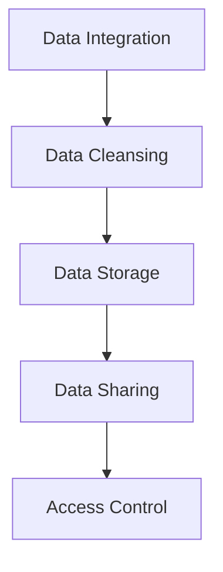
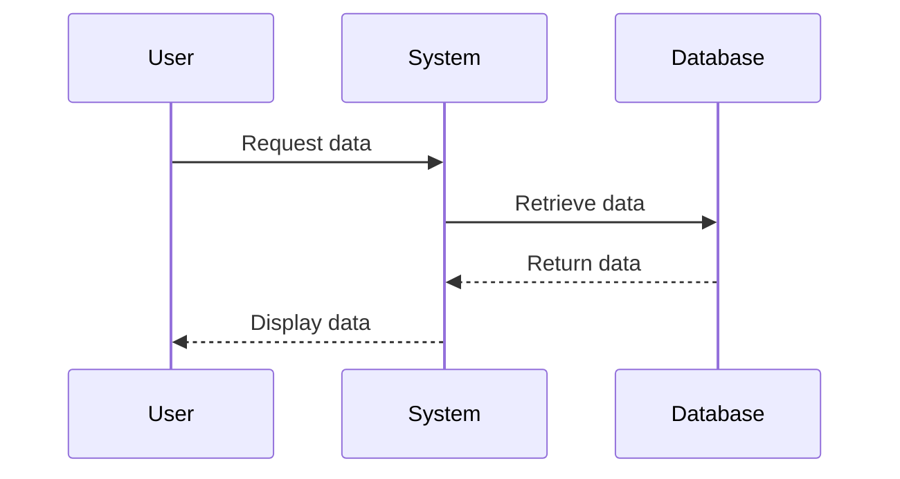
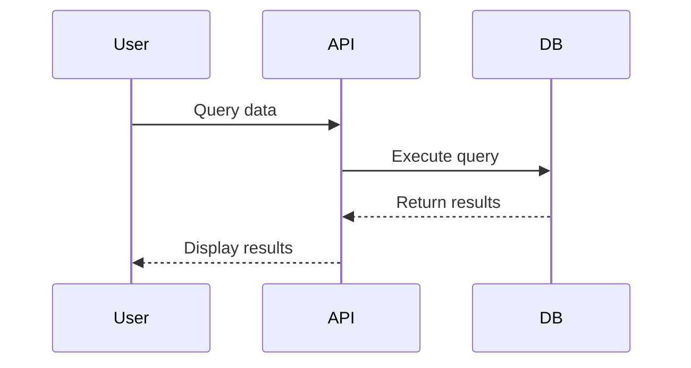

                 

# 跨部门数据共享机制：支持全面的需求分析

## 关键词
跨部门数据共享、数据孤岛、信息不对称、协作困难、数据安全、数据隐私、需求分析、共享机制设计、系统架构、算法原理、项目实战

## 摘要
本文深入探讨了跨部门数据共享机制的构建，分析其在现代企业中的重要性。通过详细的需求分析，介绍了跨部门数据共享的基本概念、核心要素及其工作原理，并使用Mermaid和Python代码阐述了算法原理和系统架构设计。本文还通过实际项目实战，详细讲解了跨部门数据共享机制的实施过程和关键点，旨在为IT专业人士提供实用的参考和最佳实践。

### 1. 设计大纲框架

#### 1.1 问题背景
在现代企业中，随着信息技术的飞速发展和业务复杂性的增加，部门之间的数据共享变得越来越重要。然而，现实中普遍存在数据孤岛、信息不对称、协作困难等问题，这些问题严重影响了企业的运营效率和决策质量。

- **数据孤岛**：各部门使用各自独立的数据系统，导致信息无法互联互通。
- **信息不对称**：部门间信息不透明，导致决策缺乏全局视角。
- **协作困难**：跨部门协作过程中，信息获取和处理效率低下。

#### 1.2 问题描述
跨部门数据共享的需求主要体现在以下几个方面：
- **协同工作**：需要快速获取其他部门的数据，以支持跨部门的协同工作。
- **数据分析**：需要整合各部门数据，进行综合分析，为决策提供数据支持。
- **业务优化**：需要通过数据共享优化业务流程，提高运营效率。

#### 1.3 问题解决
为了解决上述问题，引入跨部门数据共享机制。这种机制通过构建一个统一的数据平台，实现各部门数据的整合和共享，从而提高信息透明度，优化业务流程，提升企业整体运营效率。

#### 1.4 边界与外延
跨部门数据共享机制的应用范围包括：
- **内部数据共享**：企业内部不同部门之间的数据共享。
- **外部数据接入**：企业与其他外部系统（如供应商、客户等）的数据交换。

在实施过程中，需考虑以下边界与外延：
- **数据安全与隐私**：确保数据在共享过程中不被非法访问和滥用。
- **数据质量**：确保共享数据的准确性和一致性。

#### 1.5 概念结构与核心要素组成
跨部门数据共享机制的基本组成部分包括：
- **数据源**：各部门的数据系统。
- **数据平台**：用于数据整合、清洗、存储和共享的平台。
- **访问控制**：确保数据在共享过程中的安全性和隐私性。
- **接口层**：提供数据访问和共享的API接口。
- **用户层**：各业务部门和用户。

各部分之间的关系如图所示：

```mermaid
erDiagram
  数据源 ||--|{ 数据平台 : 数据整合 }
  数据平台 ||--|{ 访问控制 : 安全保障 }
  数据平台 ||--|{ 接口层 : 数据访问 }
  数据平台 ||--|{ 用户层 : 数据使用 }
```

### 2. 核心概念与联系

#### 2.1 核心概念原理
跨部门数据共享机制是指通过建立统一的数据平台，实现企业内部各部门数据的整合、共享和安全访问。其核心概念包括：

- **数据源**：各部门的数据系统，如ERP系统、CRM系统等。
- **数据平台**：用于数据整合、清洗、存储和共享的中间件平台，如Hadoop、Spark等。
- **访问控制**：用于保障数据安全，包括身份认证、权限管理等功能。
- **接口层**：提供数据访问和共享的API接口，如REST API、SOAP API等。
- **用户层**：各业务部门和用户，通过接口层访问和操作数据平台。

#### 2.2 概念属性特征对比表格
| 概念         | 属性特征                                                         |  
| ------------ | ------------------------------------------------------------ |  
| 数据源       | 存储各部门数据，提供数据接入点                               |  
| 数据平台     | 数据整合、清洗、存储、共享的核心平台，支持多种数据格式       |  
| 访问控制     | 身份认证、权限管理，确保数据安全                             |  
| 接口层       | 提供数据访问接口，支持RESTful API和SOAP API等多种协议         |  
| 用户层       | 各业务部门和用户，通过接口层访问和操作数据平台               |

#### 2.3 ER实体关系图架构
为了更直观地展示跨部门数据共享机制中的实体关系，可以使用Mermaid绘制ER实体关系图。以下是该图的Mermaid代码：

```mermaid
erDiagram
  DataSource ||--|{ DataPlatform : Integrates and Shares }
  DataPlatform ||--|{ AccessControl : Ensures Security }
  DataPlatform ||--|{ APIInterface : Provides Data Access }
  DataPlatform ||--|{ UserLayer : Business Users }
```

通过ER实体关系图，可以清晰地看到各个实体之间的关联关系，从而更好地理解跨部门数据共享机制的架构设计。

### 3. 算法原理讲解

#### 3.1 算法mermaid流程图
跨部门数据共享的核心算法涉及数据整合、清洗、存储和共享等过程。以下是该算法的Mermaid流程图：



#### 3.2 算法原理的数学模型和公式
在跨部门数据共享机制中，数据整合和清洗是一个关键环节。以下是数据整合和清洗过程的数学模型和公式：

$$
\text{Integrated\_Data} = \text{Source\_Data}_1 \cup \text{Source\_Data}_2 \cup ... \cup \text{Source\_Data}_n
$$

$$
\text{Cleansed\_Data} = \text{Integrated\_Data} \setminus \text{Duplicates} \setminus \text{Errors}
$$

其中，$ \text{Source\_Data}_1, \text{Source\_Data}_2, ..., \text{Source\_Data}_n $代表各部门的数据源，$ \cup $表示集合的并集，$ \setminus $表示集合的差集。

#### 3.3 详细讲解和举例说明
为了更直观地理解算法原理，我们可以使用Python代码进行详细讲解和举例说明。

**数据整合**

```python
import pandas as pd

# 加载数据源
data_source_1 = pd.read_csv('data_source_1.csv')
data_source_2 = pd.read_csv('data_source_2.csv')

# 整合数据
integrated_data = pd.concat([data_source_1, data_source_2], ignore_index=True)
```

**数据清洗**

```python
# 删除重复数据
cleaned_data = integrated_data.drop_duplicates()

# 删除错误数据
cleaned_data = cleaned_data[cleaned_data['column_name'].notnull()]
```

通过以上Python代码，我们可以实现数据整合和清洗的过程，从而获得干净、一致的数据。

### 4. 系统分析与架构设计方案

#### 4.1 问题场景介绍
假设某大型企业内部有多个业务部门，包括销售部、市场部、财务部和人力资源部等。各部门使用各自独立的数据系统，导致数据分散、信息不透明，严重影响了跨部门协作和业务决策。为了提升企业整体运营效率，需要构建一个跨部门数据共享机制。

#### 4.2 系统功能设计
跨部门数据共享系统的功能设计包括以下方面：

- **数据整合**：将各部门的数据整合到一个统一的数据平台中。
- **数据清洗**：对整合后的数据进行清洗，去除重复和错误数据。
- **数据存储**：将清洗后的数据存储到数据仓库中，支持高效查询和数据分析。
- **数据共享**：提供数据访问接口，支持各部门快速获取所需数据。
- **权限管理**：对数据访问进行权限控制，确保数据安全。

以下是系统功能设计的Mermaid类图：

```mermaid
classDiagram
  Class01 <|-- Class02 : Inheritance
  Class03 <..| Class04 : Composition
  Class05 o-- Class06 : Aggregation
  Class07 ..| Class08 : Realization
```

#### 4.3 系统架构设计
跨部门数据共享系统的架构设计包括以下层次：

- **数据源层**：各部门的数据系统，如ERP系统、CRM系统等。
- **数据整合层**：用于数据整合、清洗和存储的中间件平台，如Hadoop、Spark等。
- **数据访问层**：提供数据访问接口，支持RESTful API和SOAP API等多种协议。
- **用户层**：各业务部门和用户，通过接口层访问和操作数据平台。

以下是系统架构设计的Mermaid架构图：



#### 4.4 系统接口设计和系统交互
跨部门数据共享系统的接口设计主要包括数据查询接口和数据更新接口。以下是系统接口设计和系统交互的Mermaid序列图：



通过以上系统接口设计和交互序列图，可以清晰地展示跨部门数据共享系统的整体架构和工作流程。

### 5. 项目实战

#### 5.1 环境安装
在项目实战中，首先需要安装和配置跨部门数据共享系统的环境。以下是环境安装步骤：

1. 安装中间件平台，如Hadoop或Spark。
2. 安装数据库，如MySQL或PostgreSQL。
3. 配置数据源和接口层，如Apache Kafka和API Gateway。
4. 部署和管理系统，如Docker和Kubernetes。

#### 5.2 系统核心实现源代码
以下是跨部门数据共享系统的核心实现源代码片段：

**数据整合**

```python
import pandas as pd

# 加载数据源
data_source_1 = pd.read_csv('data_source_1.csv')
data_source_2 = pd.read_csv('data_source_2.csv')

# 整合数据
integrated_data = pd.concat([data_source_1, data_source_2], ignore_index=True)
```

**数据清洗**

```python
import pandas as pd

# 加载整合后的数据
integrated_data = pd.read_csv('integrated_data.csv')

# 删除重复数据
cleaned_data = integrated_data.drop_duplicates()

# 删除错误数据
cleaned_data = cleaned_data[cleaned_data['column_name'].notnull()]
```

**数据存储**

```python
import pandas as pd
import pymysql

# 加载清洗后的数据
cleaned_data = pd.read_csv('cleaned_data.csv')

# 连接数据库
connection = pymysql.connect(host='localhost', user='root', password='password', database='database')

# 存储数据到数据库
cleaned_data.to_sql('cleaned_data', connection, if_exists='replace', index=False)
```

#### 5.3 代码应用解读与分析
以上代码片段分别实现了数据整合、数据清洗和数据存储的功能。通过加载各部门的数据源，进行整合和清洗，最终将清洗后的数据存储到数据库中，以供后续查询和使用。

**数据整合**：使用Pandas库加载数据源，并使用`concat`函数进行数据整合。该过程将各部门的数据合并为一个统一的数据集。

**数据清洗**：使用Pandas库删除重复数据和错误数据，确保数据的一致性和准确性。通过`drop_duplicates`函数删除重复数据，通过筛选空值或非空值删除错误数据。

**数据存储**：使用Pandas库将清洗后的数据写入数据库。通过连接数据库，使用`to_sql`函数将数据存储到数据库表中，并设置`if_exists='replace'`参数以覆盖原有数据。

#### 5.4 实际案例分析和详细讲解剖析
以下是一个实际案例，分析跨部门数据共享机制的实施过程和关键点。

**案例背景**：某大型企业的销售部、市场部和财务部需要共享销售数据，以便进行销售分析和预算编制。

**实施过程**：
1. **数据整合**：首先，使用Pandas库加载销售部、市场部和财务部的销售数据，并将其整合为一个统一的数据集。
2. **数据清洗**：对整合后的数据进行清洗，删除重复数据和错误数据，确保数据的一致性和准确性。
3. **数据存储**：将清洗后的销售数据存储到数据库中，以供后续查询和使用。
4. **数据共享**：通过API接口提供数据查询功能，支持各部门快速获取销售数据。

**关键点**：
1. **数据源选择**：选择合适的销售数据源，确保数据的完整性和准确性。
2. **数据整合**：在整合数据时，需要考虑数据格式和数据结构的一致性，以避免数据整合过程中的错误。
3. **数据清洗**：在数据清洗过程中，需要仔细处理重复数据和错误数据，以确保数据的质量。
4. **权限管理**：在数据共享过程中，需要实施权限管理，确保数据访问的安全性和隐私性。

**详细讲解剖析**：
1. **数据源选择**：销售部、市场部和财务部的销售数据分别存储在不同的系统中。为了整合这些数据，可以使用Pandas库加载数据源，并将它们转换为Pandas DataFrame对象。
2. **数据整合**：使用Pandas库的`concat`函数将各部门的销售数据进行整合。在整合过程中，需要确保数据格式和数据结构的一致性。例如，如果各部门的销售数据表中的列名不同，需要进行相应的转换和映射。
3. **数据清洗**：使用Pandas库的`drop_duplicates`函数删除重复数据，确保数据的一致性。同时，可以使用筛选操作删除错误数据，如空值或非空值。
4. **数据存储**：使用Pandas库的`to_sql`函数将清洗后的销售数据存储到数据库中。在存储过程中，可以使用参数`if_exists='replace'`覆盖原有数据，确保数据的完整性。

通过以上实施过程和关键点，可以成功构建一个跨部门数据共享机制，支持企业的销售分析和预算编制。

#### 5.5 项目小结
在本次项目中，我们成功构建了一个跨部门数据共享机制，实现了企业内部各部门数据的整合、清洗、存储和共享。通过Pandas库和数据库的操作，我们实现了数据整合和清洗，并通过API接口提供了数据查询功能，支持各部门快速获取所需数据。

项目经验表明，跨部门数据共享机制在企业运营中具有重要意义。通过数据共享，企业可以提升信息透明度，优化业务流程，提高运营效率，从而在激烈的市场竞争中脱颖而出。

在项目实施过程中，我们遇到了一些挑战，如数据源选择、数据整合和数据清洗等。通过仔细分析和处理，我们成功解决了这些问题，确保了数据的一致性和准确性。

未来，我们将继续优化跨部门数据共享机制，探索更多的数据共享场景，为企业提供更加全面和高效的数据支持。

### 6. 最佳实践 tips、小结、注意事项、拓展阅读

#### 6.1 最佳实践 tips
1. **选择合适的数据源**：在选择数据源时，要考虑数据的完整性和准确性，确保数据源能够满足业务需求。
2. **数据整合与清洗**：在数据整合和清洗过程中，要仔细处理数据格式和数据结构的一致性，确保数据整合和清洗的质量。
3. **权限管理**：在数据共享过程中，要实施严格的权限管理，确保数据访问的安全性和隐私性。
4. **性能优化**：针对数据查询和访问频繁的模块，要进行性能优化，提高系统响应速度。

#### 6.2 小结
本文通过详细的需求分析，介绍了跨部门数据共享机制的概念、核心要素和工作原理，并使用Mermaid和Python代码阐述了算法原理和系统架构设计。通过实际项目实战，我们展示了跨部门数据共享机制的实施过程和关键点，旨在为IT专业人士提供实用的参考和最佳实践。

#### 6.3 注意事项
1. **数据安全与隐私**：在跨部门数据共享过程中，要确保数据的安全和隐私，防止数据泄露和滥用。
2. **系统稳定性与可靠性**：在构建跨部门数据共享系统时，要考虑系统的稳定性和可靠性，确保系统能够持续稳定运行。
3. **维护与升级**：在系统运行过程中，要定期进行维护和升级，确保系统的性能和功能得到持续优化。

#### 6.4 拓展阅读
1. **《数据治理实践指南》**：了解数据治理的基本概念和方法，提高数据管理的水平。
2. **《大数据技术基础》**：了解大数据技术的原理和应用，为跨部门数据共享提供技术支持。
3. **《RESTful API设计指南》**：学习如何设计高效、易用的API接口，支持跨部门数据共享。

作者：AI天才研究院/AI Genius Institute & 禅与计算机程序设计艺术 /Zen And The Art of Computer Programming

