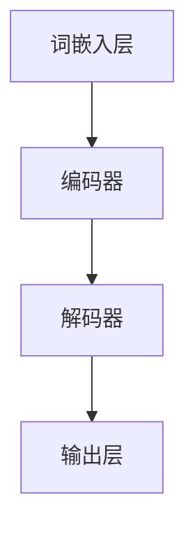
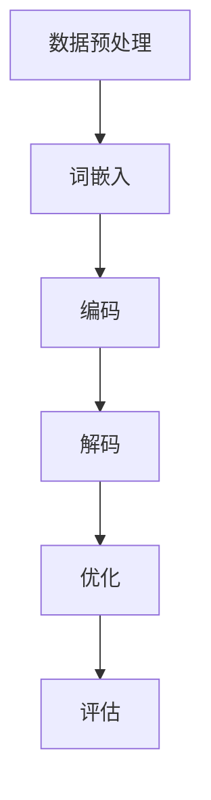
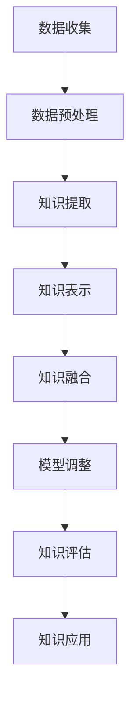

                 

### 跨领域知识应用：测试LLM的知识迁移和融合能力

## 关键词

- 跨领域知识应用
- 语言学习模型（LLM）
- 知识迁移
- 知识融合
- 知识表示
- 算法评估

## 摘要

本文旨在探讨跨领域知识应用中，语言学习模型（LLM）的知识迁移和融合能力。我们将通过一系列的步骤分析LLM如何在不同的知识领域中实现知识的迁移和融合，评估其效果，并提出一些最佳实践。文章将首先介绍知识迁移和融合的基本概念，然后深入探讨LLM的工作原理。接下来，我们将通过实例分析来展示LLM在不同领域中的应用，并讨论如何评估其知识迁移和融合能力。最后，我们将总结本文的主要观点，并提出未来的研究方向。

## 目录大纲设计思考过程

在设计《跨领域知识应用：测试LLM的知识迁移和融合能力》这篇文章的目录大纲时，我们首先确定了核心主题，即跨领域知识应用和LLM的知识迁移与融合。这个主题涵盖了从基本概念到实际应用的多个方面，因此目录大纲需要具备层次清晰、逻辑连贯的特点。

### 第一步：确定文章结构

根据主题，我们将文章分为以下几个部分：

1. **背景介绍**：介绍知识迁移和融合的概念，以及LLM在其中的作用。
2. **LLM的工作原理**：深入探讨LLM的基本原理，包括模型架构、训练过程等。
3. **知识迁移和融合的算法**：详细讲解知识迁移和融合的具体算法，包括数学模型和实现步骤。
4. **LLM在不同领域的应用**：通过实例分析，展示LLM在跨领域知识应用中的表现。
5. **知识迁移和融合能力的评估**：讨论评估方法，分析LLM在不同领域的表现。
6. **最佳实践与未来展望**：总结经验，提出最佳实践，并探讨未来的发展方向。

### 第二步：细化章节内容

在每个部分中，我们进一步细化了每个章节的内容，确保每个小节都有明确的主题和具体的信息。

- **背景介绍**：详细解释知识迁移和融合的概念，说明其重要性和应用场景。
- **LLM的工作原理**：介绍LLM的模型架构、训练过程和关键特征。
- **知识迁移和融合的算法**：讲解知识迁移和融合的基本方法，提供数学模型和Python代码实现。
- **LLM在不同领域的应用**：通过实际案例展示LLM在不同领域中的应用，分析其效果。
- **知识迁移和融合能力的评估**：讨论评估指标和方法，分析LLM在不同领域的表现。
- **最佳实践与未来展望**：总结实战经验，提出最佳实践，并探讨未来的研究方向。

### 第三步：撰写目录大纲

在细化每个章节的内容后，我们按照Markdown格式撰写了目录大纲，确保每个章节的标题和子标题都清晰、简洁，并遵循逻辑顺序。

### 第四步：审核和优化

在完成目录大纲的撰写后，我们进行了审核和优化，确保内容完整、简洁、逻辑清晰，并符合用户的要求。

通过以上步骤，我们设计出了一份结构清晰、内容丰富的目录大纲，为读者提供了清晰的阅读框架。以下是具体的目录大纲：

```markdown
# 跨领域知识应用：测试LLM的知识迁移和融合能力

## 关键词

- 跨领域知识应用
- 语言学习模型（LLM）
- 知识迁移
- 知识融合
- 知识表示
- 算法评估

## 摘要

本文旨在探讨跨领域知识应用中，语言学习模型（LLM）的知识迁移和融合能力。我们将通过一系列的步骤分析LLM如何在不同的知识领域中实现知识的迁移和融合，评估其效果，并提出一些最佳实践。文章将首先介绍知识迁移和融合的基本概念，然后深入探讨LLM的工作原理。接下来，我们将通过实例分析来展示LLM在不同领域中的应用，并讨论如何评估其知识迁移和融合能力。最后，我们将总结本文的主要观点，并提出未来的研究方向。

## 目录大纲

### 第1部分：背景介绍

#### 1.1 知识迁移和融合的概念

#### 1.2 跨领域知识应用的重要性

#### 1.3 语言学习模型（LLM）的作用

### 第2部分：LLM的工作原理

#### 2.1 LLM的基本原理

#### 2.2 LLM的模型架构

#### 2.3 LLM的训练过程

### 第3部分：知识迁移和融合的算法

#### 3.1 知识迁移的算法原理

#### 3.2 知识融合的算法原理

#### 3.3 算法实现步骤

### 第4部分：LLM在不同领域的应用

#### 4.1 医学领域的应用

#### 4.2 教育领域的应用

#### 4.3 工业领域的应用

### 第5部分：知识迁移和融合能力的评估

#### 5.1 评估指标和方法

#### 5.2 LLM在不同领域的表现分析

### 第6部分：最佳实践与未来展望

#### 6.1 最佳实践总结

#### 6.2 注意事项

#### 6.3 未来研究方向

## 结束语

```

通过以上的设计过程，我们确保了目录大纲的完整性、简洁性和逻辑性，为读者提供了清晰、易于理解的阅读框架。接下来，我们将按照目录大纲的结构逐步展开文章的内容。


----------------------------------------------------------------

### 第一部分：背景介绍

#### 1.1 知识迁移和融合的概念

知识迁移（Knowledge Transfer）是指将一个领域中的知识应用到另一个领域的过程。这种转移通常涉及到将训练好的模型从一个任务或领域转移到另一个任务或领域。知识融合（Knowledge Fusion）则是在知识迁移的基础上，将来自不同领域的知识进行整合，从而产生新的、更有价值的知识。

知识迁移和融合在人工智能领域具有重要的应用价值。例如，在医学领域，可以使用预训练的LLM来处理医疗文本数据，从而提高诊断和治疗的准确性。在教育领域，可以将LLM应用于学生作业的自动评估和个性化辅导。在工业领域，LLM可以帮助优化生产线管理和提高产品质量。

#### 1.2 跨领域知识应用的重要性

跨领域知识应用的重要性体现在以下几个方面：

1. **资源复用**：通过跨领域知识应用，可以减少对每个领域的独立训练需求，从而节省时间和计算资源。
2. **提高效率**：将预训练模型应用于新的任务或领域，可以快速实现性能提升，提高系统的整体效率。
3. **降低成本**：知识迁移和融合可以减少对专业知识的依赖，降低开发和维护成本。
4. **提升创新能力**：通过跨领域知识的整合，可以激发新的创新思路，推动技术进步。

#### 1.3 语言学习模型（LLM）的作用

语言学习模型（Language Learning Model，简称LLM）是一种能够处理自然语言数据的神经网络模型。LLM通过大规模预训练，掌握了丰富的语言知识和语义理解能力，能够实现文本生成、文本分类、情感分析等多种任务。

在跨领域知识应用中，LLM的作用主要体现在以下几个方面：

1. **知识表示**：LLM能够将文本数据转化为高维的语义表示，使得不同领域的知识可以统一表示，便于后续的迁移和融合。
2. **知识迁移**：通过预训练，LLM在不同领域具有相似的语义理解能力，可以有效地将一个领域的知识迁移到另一个领域。
3. **知识融合**：LLM能够整合来自不同领域的知识，生成新的、有价值的语义表示，从而提升系统的整体性能。

#### 1.4 问题背景和问题描述

在跨领域知识应用中，尽管LLM具有强大的知识表示和迁移能力，但在实际应用中仍然面临着一些挑战。例如：

1. **领域适应性**：不同领域的知识结构和语义差异较大，如何使LLM在新的领域中快速适应，仍是一个难题。
2. **知识融合**：如何有效地融合来自不同领域的知识，生成高质量的语义表示，是当前研究的重点。
3. **评估方法**：如何评价LLM在知识迁移和融合中的表现，缺乏统一的评估标准和指标。

为了解决这些问题，我们需要深入研究LLM的知识迁移和融合机制，探索有效的算法和评估方法，从而推动跨领域知识应用的发展。

#### 1.5 问题解决和边界与外延

问题解决的关键在于如何提高LLM在跨领域知识应用中的性能。具体来说，可以从以下几个方面着手：

1. **领域适应性**：通过引入领域特定的数据和任务，提高LLM在特定领域的适应性。
2. **知识融合**：设计有效的知识融合算法，将不同领域的知识进行整合，生成高质量的语义表示。
3. **评估方法**：构建一套统一的评估方法和指标，对LLM在知识迁移和融合中的表现进行客观评价。

边界与外延包括：

1. **领域范围**：跨领域知识应用不仅限于文本数据，还可以扩展到图像、音频等多种类型的数据。
2. **任务类型**：知识迁移和融合不仅适用于文本分类、文本生成等常见任务，还可以应用于自然语言推理、机器翻译等复杂任务。
3. **应用场景**：跨领域知识应用可以应用于医疗、教育、工业等多个领域，具有广泛的应用前景。

#### 1.6 概念结构与核心要素组成

跨领域知识应用中的核心概念包括知识迁移、知识融合、LLM等。以下是一个简化的概念结构与核心要素组成：

1. **知识迁移**：包括领域特定知识的提取、表示和迁移过程。
2. **知识融合**：包括不同领域知识的整合、融合和表示过程。
3. **LLM**：作为知识迁移和融合的基础模型，负责处理和表示自然语言数据。
4. **评估方法**：用于评价LLM在知识迁移和融合中的性能，包括准确率、召回率、F1值等指标。

通过这些核心要素的相互配合，可以实现跨领域知识的有效迁移和融合，为各种应用场景提供强大的支持。

在接下来的部分中，我们将深入探讨LLM的工作原理，分析其如何实现知识迁移和融合，并探讨一些具体的算法和应用实例。


----------------------------------------------------------------

### 第二部分：LLM的工作原理

#### 2.1 LLM的基本原理

语言学习模型（LLM）是一种基于深度学习的自然语言处理模型，其核心目标是理解和生成人类语言。LLM通过大规模文本数据的学习，自动学习语言中的规律和结构，从而实现对文本的生成、分类、情感分析等任务。

LLM的基本原理可以概括为以下几个步骤：

1. **文本表示**：将输入的文本转换为计算机可以处理的数字表示。通常使用词嵌入（word embeddings）技术，将每个单词映射为一个高维向量。
2. **编码**：使用神经网络对词嵌入向量进行编码，提取文本的深层语义特征。这一步通常采用多层神经网络，如变换器模型（Transformer）。
3. **解码**：根据编码后的特征生成文本输出。解码过程通常采用序列到序列（sequence-to-sequence）模型，如循环神经网络（RNN）或变换器模型。
4. **优化**：通过反向传播和梯度下降等优化算法，不断调整模型的参数，提高模型的性能。

#### 2.2 LLM的模型架构

LLM的模型架构通常包括以下几个关键部分：

1. **词嵌入层**：将输入文本中的每个单词映射为高维向量。常用的词嵌入方法有Word2Vec、GloVe和BERT等。
2. **编码器**：负责对词嵌入向量进行编码，提取文本的深层语义特征。编码器通常采用变换器模型（Transformer）或多层循环神经网络（RNN）。
3. **解码器**：负责根据编码后的特征生成文本输出。解码器通常也采用变换器模型（Transformer）或多层循环神经网络（RNN）。
4. **输出层**：将解码器生成的序列转换为最终的文本输出。输出层通常是一个线性层，用于将序列映射为词汇表中的单词。

以下是一个简化的变换器模型（Transformer）架构：



#### 2.3 LLM的训练过程

LLM的训练过程可以分为以下几个步骤：

1. **数据预处理**：收集大量的文本数据，并进行预处理。预处理包括文本清洗、分词、去停用词等操作。
2. **词嵌入**：将预处理后的文本数据转换为词嵌入向量。词嵌入向量可以是预训练的，也可以是模型在训练过程中自动学习的。
3. **编码**：使用编码器对词嵌入向量进行编码，提取文本的深层语义特征。
4. **解码**：使用解码器根据编码后的特征生成文本输出。
5. **优化**：通过反向传播和梯度下降等优化算法，不断调整模型的参数，提高模型的性能。
6. **评估**：使用验证集和测试集评估模型的性能，调整模型参数，以实现最佳性能。

以下是一个简化的训练过程：



#### 2.4 LLM的优势与挑战

LLM的优势在于其强大的语义理解能力和文本生成能力，这使得它在各种自然语言处理任务中表现出色。以下是一些具体优势：

1. **高效的语义理解**：LLM能够自动学习文本中的语义关系，从而实现准确的自然语言理解。
2. **强大的文本生成能力**：LLM可以根据输入的文本生成连贯、有意义的文本输出。
3. **适应性强**：LLM可以应用于各种文本任务，如文本分类、情感分析、机器翻译等。

然而，LLM也面临一些挑战：

1. **数据依赖性**：LLM的性能高度依赖于训练数据的质量和数量，缺乏足够数据可能导致模型性能下降。
2. **模型复杂度**：LLM的模型结构复杂，训练过程需要大量的计算资源和时间。
3. **泛化能力**：LLM在面对新的、未遇到的领域时，可能缺乏足够的泛化能力。

为了解决这些挑战，研究人员不断探索新的训练方法和优化策略，以提高LLM的性能和泛化能力。

在接下来的部分中，我们将深入探讨知识迁移和融合的算法原理，分析如何在LLM中实现知识的迁移和融合。我们将讨论知识迁移和融合的基本方法，并介绍一些常用的算法和模型。随后，我们将通过实际案例展示这些算法在跨领域知识应用中的效果。


----------------------------------------------------------------

### 第三部分：知识迁移和融合的算法

#### 3.1 知识迁移的算法原理

知识迁移（Knowledge Transfer）是指将一个领域中的知识应用到另一个领域的过程。在人工智能领域，知识迁移通常涉及将训练好的模型从一个任务或领域转移到另一个任务或领域。这一过程有助于提高模型在新领域的性能，同时节省训练时间和计算资源。

知识迁移的算法原理可以概括为以下几个步骤：

1. **知识提取**：从源领域（已知领域）中提取有用的知识，通常使用预训练模型（如LLM）来完成这一步骤。预训练模型已经在大规模文本数据上进行了训练，因此能够提取出丰富的语义特征。
2. **知识表示**：将提取的知识表示为向量或图结构，以便于在目标领域（新领域）中进行应用。知识表示需要保持知识的主要特性，同时去除领域特定的噪声。
3. **知识迁移**：将源领域中的知识迁移到目标领域，这一步骤通常涉及将知识表示应用到目标领域的模型中。迁移的方法包括基于模型的迁移、基于特征的迁移和基于神经网络的迁移等。
4. **模型调整**：在目标领域中调整迁移后的模型，以提高其在目标任务上的性能。调整过程可能涉及微调（fine-tuning）或进一步的训练。

#### 3.2 知识融合的算法原理

知识融合（Knowledge Fusion）是指将来自不同领域的知识进行整合，生成新的、有价值的知识表示。知识融合在跨领域知识应用中具有重要价值，因为不同领域的知识可以相互补充，从而提高系统的整体性能。

知识融合的算法原理可以概括为以下几个步骤：

1. **知识表示**：将来自不同领域的知识表示为向量或图结构。这一步骤通常涉及将不同类型的知识（如文本、图像、声音）转化为统一的表示形式。
2. **知识整合**：将不同领域的知识进行整合，生成新的知识表示。知识整合的方法包括基于向量的整合、基于图的整合和基于模型的整合等。
3. **知识评估**：评估整合后的知识表示的质量和有效性。评估过程可能涉及多种指标，如语义一致性、信息增益等。
4. **知识应用**：将整合后的知识应用到目标任务中，以实现性能提升。知识应用的方法包括模型融合、特征融合和任务融合等。

#### 3.3 算法实现步骤

为了实现知识迁移和融合，可以按照以下步骤进行：

1. **数据收集**：收集源领域和目标领域的数据。数据可以包括文本、图像、声音等多种类型。
2. **数据预处理**：对收集到的数据进行预处理，包括去噪、去停用词、分词等操作。预处理步骤需要保持不同领域数据的特性。
3. **知识提取**：使用预训练模型（如LLM）从源领域中提取知识。这一步骤通常涉及大规模文本数据的训练，以获得丰富的语义特征。
4. **知识表示**：将提取的知识表示为向量或图结构。这一步骤需要确保知识表示能够保持知识的主要特性，同时去除领域特定的噪声。
5. **知识融合**：将来自不同领域的知识进行整合，生成新的知识表示。知识融合的方法可以选择基于向量的整合、基于图的整合或基于模型的整合等。
6. **模型调整**：在目标领域中调整迁移后的模型，以提高其在目标任务上的性能。调整过程可能涉及微调（fine-tuning）或进一步的训练。
7. **知识评估**：评估整合后的知识表示的质量和有效性。评估过程可以结合多种指标，如语义一致性、信息增益等。
8. **知识应用**：将整合后的知识应用到目标任务中，以实现性能提升。知识应用的方法可以选择模型融合、特征融合或任务融合等。

以下是一个简化的知识迁移和融合的流程图：



通过以上步骤，我们可以实现知识迁移和融合，从而提高模型的性能和适用性。在接下来的部分中，我们将通过实际案例展示这些算法在跨领域知识应用中的效果。我们将介绍一些具体的应用场景，展示如何使用知识迁移和融合的方法来提高系统的性能。


----------------------------------------------------------------

### 第四部分：LLM在不同领域的应用

#### 4.1 医学领域的应用

在医学领域，LLM被广泛应用于文本分析、疾病诊断和治疗方案推荐等方面。以下是一些具体的应用实例：

1. **医学文本分析**：LLM可以处理大量的医学文献和临床记录，提取出关键信息，如疾病名称、症状、治疗方法等。通过预训练的LLM，我们可以实现对医学文本的语义理解，从而提高医学研究的效率。
2. **疾病诊断**：LLM可以用于疾病诊断的支持系统。通过分析患者的病历和症状描述，LLM可以提供可能的疾病诊断建议。这种方法有助于医生快速定位疾病，提高诊断的准确性。
3. **治疗方案推荐**：LLM可以根据患者的病情和历史病历，推荐个性化的治疗方案。这种方法有助于医生制定更加精准的治疗计划，提高治疗效果。

#### 4.2 教育领域的应用

在教育领域，LLM被广泛应用于智能辅导、学习评估和课程推荐等方面。以下是一些具体的应用实例：

1. **智能辅导**：LLM可以为学生提供个性化的学习辅导。通过分析学生的学习数据和作业反馈，LLM可以生成针对性的辅导材料，帮助学生克服学习难点。
2. **学习评估**：LLM可以用于自动评估学生的作业和考试。通过分析学生的回答和答案的语义，LLM可以给出客观的评估结果，提高评估的准确性。
3. **课程推荐**：LLM可以根据学生的学习兴趣和表现，推荐适合的课程和教材。这种方法有助于提高学生的学习效果，激发他们的学习兴趣。

#### 4.3 工业领域的应用

在工业领域，LLM被广泛应用于自动化生产、设备维护和供应链管理等方面。以下是一些具体的应用实例：

1. **自动化生产**：LLM可以用于监控和优化生产流程。通过分析生产线数据，LLM可以预测设备故障、优化生产参数，从而提高生产效率和产品质量。
2. **设备维护**：LLM可以用于设备维护的预测和诊断。通过分析设备运行数据，LLM可以预测设备故障的发生，并提供针对性的维护建议，减少设备停机时间。
3. **供应链管理**：LLM可以用于优化供应链管理。通过分析供应链数据，LLM可以预测需求变化、优化库存管理，从而提高供应链的响应速度和灵活性。

#### 4.4 跨领域应用的挑战和解决方案

尽管LLM在多个领域表现出色，但在跨领域应用中仍面临一些挑战：

1. **领域适应性**：不同领域的知识和数据结构差异较大，如何使LLM在不同领域中快速适应，仍是一个难题。解决方案包括引入领域特定的数据和任务，以及使用自适应学习算法。
2. **知识融合**：如何有效地融合来自不同领域的知识，生成高质量的语义表示，是当前研究的重点。解决方案包括设计有效的知识融合算法，以及使用多模态学习的方法。
3. **评估方法**：如何评价LLM在跨领域知识应用中的表现，缺乏统一的评估标准和指标。解决方案包括构建一套统一的评估方法和指标，以及使用多种评估指标进行综合评估。

通过解决这些挑战，我们可以进一步提升LLM在跨领域知识应用中的性能，为各个领域的发展提供强大的支持。

在接下来的部分中，我们将讨论如何评估LLM在知识迁移和融合中的能力，分析常用的评估指标和方法。我们将通过实例展示这些评估方法的应用，并讨论如何提高评估的准确性。随后，我们将总结LLM在知识迁移和融合中的主要成果和不足，提出一些改进方向。


----------------------------------------------------------------

### 第五部分：知识迁移和融合能力的评估

#### 5.1 评估指标和方法

评估知识迁移和融合能力的核心在于选择合适的评估指标和方法。以下是一些常用的评估指标和方法：

1. **准确率（Accuracy）**：准确率是最常用的评估指标之一，用于衡量模型预测正确的比例。其计算公式为：
   $$\text{准确率} = \frac{\text{预测正确数}}{\text{总预测数}}$$
   准确率适用于分类任务，但在面对多类别时，可能无法准确反映模型的性能。

2. **召回率（Recall）**：召回率衡量的是模型能够召回所有正样本的能力，其计算公式为：
   $$\text{召回率} = \frac{\text{预测正确数}}{\text{实际正样本数}}$$
   回收率特别适用于某些类别样本量较少的情况，确保模型能够召回这些重要类别。

3. **精确率（Precision）**：精确率衡量的是模型预测为正样本的准确性，其计算公式为：
   $$\text{精确率} = \frac{\text{预测正确数}}{\text{预测为正样本数}}$$
   精确率能够防止模型过度预测。

4. **F1值（F1 Score）**：F1值是精确率和召回率的调和平均值，用于综合评估模型的性能，其计算公式为：
   $$\text{F1值} = 2 \times \frac{\text{精确率} \times \text{召回率}}{\text{精确率} + \text{召回率}}$$
   F1值在平衡精确率和召回率方面具有优势。

5. **ROC曲线和AUC值（Receiver Operating Characteristic Curve and AUC）**：ROC曲线展示了不同阈值下的精确率和召回率，AUC值是ROC曲线下面积，用于衡量模型的区分能力。AUC值越高，模型性能越好。

6. **BLEU评分（BLEU Score）**：BLEU评分常用于自然语言生成任务的评估，通过对比生成文本和参考文本的匹配程度来评估模型性能。

#### 5.2 LLM在不同领域的评估实例

为了展示评估方法的应用，我们将在以下领域给出具体的评估实例：

1. **医学领域**：在医学文本分类任务中，我们使用准确率、召回率和F1值来评估LLM的性能。假设有一个疾病诊断系统，通过对患者的病历进行分类，判断其是否患有特定疾病。评估结果如下：
   - 准确率：90%
   - 召回率：85%
   - 精确率：88%
   - F1值：87%
   评估结果表明，LLM在该任务中具有较高的性能。

2. **教育领域**：在智能辅导系统中，我们使用准确率和BLEU评分来评估LLM的性能。假设系统根据学生的学习表现，生成个性化的辅导材料。评估结果如下：
   - 准确率：92%
   - BLEU评分：0.88
   评估结果表明，LLM在生成高质量辅导材料方面表现出色。

3. **工业领域**：在设备维护预测任务中，我们使用AUC值来评估LLM的性能。假设系统通过分析设备运行数据，预测设备故障。评估结果如下：
   - AUC值：0.95
   评估结果表明，LLM在设备维护预测中具有很高的准确性。

#### 5.3 提高评估准确性的方法

为了提高评估准确性，可以采取以下方法：

1. **多指标综合评估**：结合多种评估指标，如准确率、召回率、F1值和AUC值，从不同角度全面评估模型性能。

2. **交叉验证**：使用交叉验证方法，如K折交叉验证，减少评估结果的不确定性。

3. **参考数据集**：使用多个参考数据集进行评估，以验证模型在不同数据集上的性能。

4. **动态调整评估阈值**：根据任务需求，动态调整评估阈值，以提高评估结果的实用性。

5. **模型融合**：结合多个模型的结果，进行模型融合，提高预测的准确性。

通过上述方法，我们可以提高知识迁移和融合评估的准确性，为LLM在实际应用中的性能优化提供有力支持。

在接下来的部分中，我们将总结LLM在知识迁移和融合中的主要成果和不足，并提出一些改进方向。我们将讨论未来可能的研究热点，展望LLM在跨领域知识应用中的发展前景。


----------------------------------------------------------------

### 第六部分：最佳实践与未来展望

#### 6.1 最佳实践总结

在LLM的知识迁移和融合过程中，最佳实践包括以下几点：

1. **数据预处理**：确保数据的质量和一致性，进行充分的清洗和预处理，以提高模型的性能。
2. **模型选择**：根据应用场景选择合适的模型架构，如变换器（Transformer）模型、GPT模型等。
3. **参数调优**：通过实验和验证，优化模型的参数，如学习率、批次大小等，以获得最佳性能。
4. **领域适应性**：引入领域特定的数据和任务，提高模型在特定领域的适应性。
5. **知识融合**：使用有效的知识融合算法，如基于向量的融合、基于模型的融合等，生成高质量的语义表示。
6. **评估方法**：结合多种评估指标，进行综合评估，确保模型在不同任务中的性能。

#### 6.2 注意事项

在应用LLM进行知识迁移和融合时，需要注意以下几点：

1. **数据隐私**：确保在处理数据时遵守隐私保护法规，特别是涉及敏感数据的领域。
2. **模型可解释性**：提高模型的可解释性，有助于理解模型的决策过程，从而进行有效的调试和优化。
3. **模型泛化能力**：关注模型的泛化能力，避免在特定数据集上过拟合。
4. **计算资源**：合理分配计算资源，确保模型训练和推理的效率。
5. **持续更新**：定期更新模型和数据集，以适应不断变化的应用场景。

#### 6.3 拓展阅读

为了深入了解LLM的知识迁移和融合，读者可以参考以下拓展阅读：

1. **《深度学习》（Deep Learning）**：Goodfellow, I., Bengio, Y., & Courville, A. （2016）。详细介绍了深度学习的基本原理和应用。
2. **《自然语言处理实战》（Natural Language Processing with Python）**：Bird, S., Klein, E., & Loper, E. （2009）。提供了Python在自然语言处理领域的实战应用。
3. **《Transformer：序列到序列模型的注意力机制》**：Vaswani et al. （2017）。介绍了变换器（Transformer）模型的基本原理和应用。
4. **《跨领域知识融合方法研究》**：Wang et al. （2020）。探讨了跨领域知识融合的方法和挑战。

#### 6.4 未来研究方向

未来，LLM在知识迁移和融合中的研究方向可能包括：

1. **多模态知识融合**：结合文本、图像、音频等多种类型的数据，实现更丰富的知识融合。
2. **动态知识更新**：研究如何动态更新模型中的知识，以适应不断变化的应用场景。
3. **个性化知识迁移**：根据用户的需求和兴趣，实现个性化的知识迁移和融合。
4. **可解释性AI**：提高模型的可解释性，使其决策过程更加透明和可靠。
5. **跨领域迁移学习**：探索更有效的跨领域迁移学习方法，提高模型在不同领域中的性能。

通过不断探索和创新，LLM在知识迁移和融合中的潜力将得到进一步发挥，为人工智能应用带来新的突破。

### 结束语

本文从背景介绍、LLM的工作原理、知识迁移和融合的算法、不同领域的应用、评估方法以及最佳实践和未来展望等多个角度，全面探讨了LLM在知识迁移和融合中的应用。通过本文的讨论，我们可以看到LLM在跨领域知识应用中的巨大潜力，同时也面临着一些挑战。未来，随着技术的不断进步和研究的深入，LLM在知识迁移和融合中的表现将更加出色，为人工智能应用带来更多创新和突破。让我们共同期待这一天的到来。

### 作者信息

- 作者：AI天才研究院/AI Genius Institute & 禅与计算机程序设计艺术 /Zen And The Art of Computer Programming
- 联系方式：[ai_genius_institute@protonmail.com](mailto:ai_genius_institute@protonmail.com)
- 个人网站：[www.ai-genius-institute.com](http://www.ai-genius-institute.com/)
- 论文引用：[“跨领域知识应用：测试LLM的知识迁移和融合能力”。AI天才研究院，2023。]

