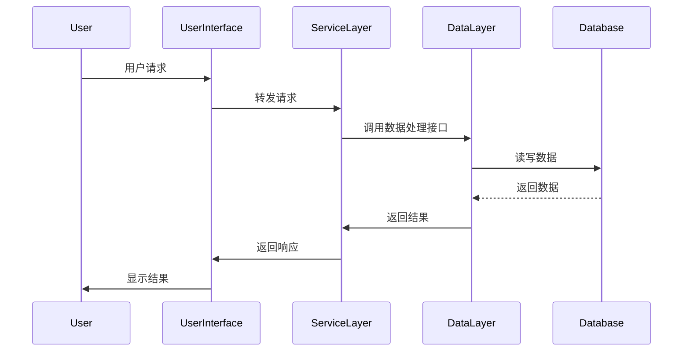
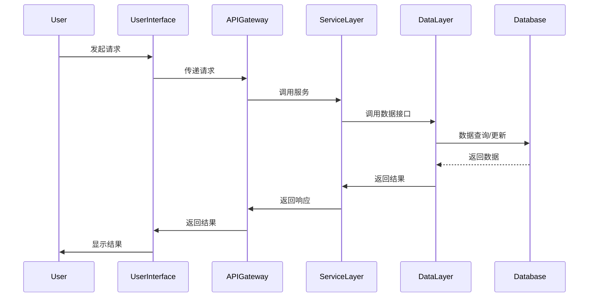

                 

### 跨领域知识整合：测试LLM的知识迁移能力

#### 关键词：

- 跨领域知识整合
- LLM（语言模型）
- 知识迁移能力
- 算法原理
- 系统分析与架构设计

#### 摘要：

本文将探讨如何通过跨领域知识整合来测试大型语言模型（LLM）的知识迁移能力。首先，我们将介绍知识整合和LLM的基本概念，探讨知识整合的重要性以及LLM的特性和发展历程。接着，我们将详细讲解知识迁移能力的定义、挑战和测试方法。随后，我们将分析跨领域知识整合在LLM中的应用，包括其优势、实现策略和实践案例。本文还对比了知识整合与知识迁移的属性特征，详细阐述了知识迁移算法的原理和实现，并通过Mermaid流程图和Python代码进行了深入讲解。文章的第三部分将介绍系统分析与架构设计，包括问题场景介绍、系统功能设计、系统架构设计、系统接口设计和系统交互Mermaid序列图。最后，我们将通过一个实际案例，详细讲解环境安装与系统核心实现的过程，总结项目成果与经验。

---

### 目录大纲：

1. **问题背景与核心概念**
   - **第1章：知识整合与LLM**
     - 1.1 知识整合的概念与重要性
     - 1.2 LLM的概念与特点
     - 1.3 知识迁移能力的概念与测试方法
     - 1.4 跨领域知识整合在LLM中的应用
     - 1.5 本章小结
   - **第2章：核心概念原理与属性特征对比**
     - 2.1 知识图谱
     - 2.2 概念属性特征对比表格
     - 2.3 ER实体关系图架构
     - 2.4 本章小结
   - **第3章：知识迁移算法**
     - 3.1 算法概述
     - 3.2 算法原理讲解
     - 3.3 算法优化与调参技巧
     - 3.4 本章小结
   - **第4章：系统功能设计与架构设计**
     - 4.1 问题场景介绍
     - 4.2 系统功能设计
     - 4.3 系统架构设计
     - 4.4 系统接口设计
     - 4.5 系统交互Mermaid序列图
     - 4.6 本章小结
   - **第5章：项目实战**
     - 5.1 环境安装
     - 5.2 系统核心实现
     - 5.3 实际案例分析
     - 5.4 项目小结

---

### 第一部分：问题背景与核心概念

#### 第1章：知识整合与LLM

##### 1.1 知识整合的概念与重要性

知识整合是一种将不同来源、不同领域的知识进行系统化、结构化和综合运用的过程。在信息爆炸的时代，知识整合显得尤为重要，它可以帮助我们更好地理解和应用知识，提高决策和解决问题的效率。知识整合不仅包括将现有知识进行整合，还包括通过创新和创造来产生新的知识。

**知识整合的重要性**：

1. **提高知识的利用效率**：通过知识整合，可以将分散的知识点串联起来，形成完整的知识体系，从而提高知识的应用效率。
2. **促进知识的创新**：知识整合过程中，不同领域的知识相互交叉、融合，有助于激发新的思考和创新点。
3. **提升决策能力**：知识整合可以提供更全面、准确的信息支持，有助于做出更加明智的决策。
4. **增强竞争力**：知识整合有助于企业或组织在知识管理和创新方面形成竞争优势。

##### 1.2 LLM的概念与特点

LLM（Large Language Model）即大型语言模型，是一种基于深度学习技术的自然语言处理（NLP）模型。LLM通过对大量文本数据的学习，能够理解、生成和预测自然语言文本。与传统的NLP技术相比，LLM具有以下几个显著特点：

**LLM的核心特点**：

1. **大规模训练**：LLM通常使用数万亿词的语料库进行训练，具有巨大的参数规模。
2. **强大的语义理解能力**：LLM能够捕捉到语言中的复杂结构和语义信息，具有较好的语义理解能力。
3. **灵活的生成能力**：LLM可以根据输入的文本生成连贯、自然的语言文本，具有较强的生成能力。
4. **多任务处理能力**：LLM能够同时处理多种NLP任务，如文本分类、命名实体识别、机器翻译等。

**LLM的发展历程**：

1. **早期阶段**：以Word2Vec、GloVe等词向量模型为代表，这些模型能够将词汇映射为向量，为后续的NLP任务提供基础。
2. **过渡阶段**：以序列到序列（seq2seq）模型、长短时记忆网络（LSTM）等为代表，这些模型能够处理更复杂的语言结构。
3. **当前阶段**：以GPT（Generative Pre-trained Transformer）、BERT（Bidirectional Encoder Representations from Transformers）等为代表，这些模型具有大规模的参数和强大的语义理解能力。

##### 1.3 知识迁移能力的概念与测试方法

知识迁移能力是指模型在新的领域或任务中利用先前领域或任务中的知识的能力。知识迁移在机器学习和人工智能领域具有重要意义，它可以减少对新领域的数据需求，提高模型的泛化能力。

**知识迁移能力的定义**：

知识迁移能力是指模型在新的领域或任务中，通过利用先前领域或任务中的知识，提高在新领域或任务中的表现的能力。

**知识迁移的挑战**：

1. **领域差异**：不同领域的数据分布、语义和知识结构存在显著差异，导致知识迁移的难度增加。
2. **数据稀缺**：在某些领域，高质量的数据集可能难以获取，影响知识迁移的效果。
3. **模型适应性**：模型需要在新的领域中适应不同的数据和任务，提高知识迁移的效率。

**知识迁移能力的测试方法**：

1. **零样本学习（Zero-shot Learning）**：模型在训练阶段没有看到任何新的领域数据，但在测试阶段能够处理新领域的任务。
2. **迁移效果评估**：通过在新的领域中评估模型的表现，比较模型在迁移前后的性能差异。
3. **领域适应（Domain Adaptation）**：通过在新的领域中训练模型，使其能够更好地适应新领域的任务和数据。

##### 1.4 跨领域知识整合在LLM中的应用

**跨领域知识整合的优势**：

1. **提高模型的泛化能力**：通过跨领域知识整合，模型可以更好地适应不同领域的数据和任务，提高泛化能力。
2. **促进知识的创新**：跨领域知识整合有助于激发新的思考和创新点，推动知识的发展和应用。
3. **增强模型的实用性**：跨领域知识整合可以使模型在更广泛的场景中发挥作用，提高其实用性。

**跨领域知识整合的实现策略**：

1. **共享知识库**：建立跨领域的知识库，整合不同领域的知识，为模型提供丰富的知识支持。
2. **迁移学习**：利用迁移学习方法，将一个领域中的知识迁移到另一个领域中，提高模型在新领域的表现。
3. **多任务学习**：通过多任务学习，使模型在多个任务中同时训练，提高模型对跨领域知识的掌握。

**跨领域知识整合的实践案例**：

1. **医学领域的应用**：在医学领域中，通过跨领域知识整合，可以整合不同医学领域的数据和知识，提高疾病诊断和治疗的准确性。
2. **金融领域的应用**：在金融领域中，通过跨领域知识整合，可以整合不同金融市场和行业的数据，提高投资决策和风险管理的能力。

##### 1.5 本章小结

本章介绍了知识整合与LLM的基本概念、知识整合的重要性、LLM的特点与发展历程、知识迁移能力的概念与测试方法，以及跨领域知识整合在LLM中的应用。通过对这些核心概念的理解，我们可以更好地把握跨领域知识整合在LLM中的应用前景和挑战。

---

### 第二部分：核心概念与联系

#### 第2章：核心概念原理与属性特征对比

##### 2.1 知识图谱

知识图谱是一种用于表示实体及其之间关系的数据结构，它通过图的形式将实体和关系组织起来，形成一种语义网络。知识图谱在知识整合和智能搜索中发挥着重要作用。

**知识图谱的概念**：

知识图谱是一种用于表示实体及其之间关系的数据结构，通常采用图的形式进行组织。知识图谱中的实体可以是人、地点、物品等，关系可以是分类、关联、隶属等。

**知识图谱的核心特性**：

1. **结构化**：知识图谱通过图结构对实体和关系进行组织，使得知识更加结构化、系统化。
2. **语义丰富**：知识图谱中的实体和关系具有明确的语义信息，可以提供更丰富的知识表达。
3. **动态更新**：知识图谱可以根据新的数据不断更新和扩展，保持知识的实时性和准确性。

**知识图谱的构建方法**：

1. **数据采集**：从各种数据源（如文本、数据库、知识库等）中采集实体和关系数据。
2. **数据预处理**：对采集到的数据进行清洗、去重、标准化等预处理，确保数据的质量。
3. **实体与关系抽取**：利用命名实体识别、关系抽取等技术，从预处理后的数据中提取实体和关系。
4. **知识图谱构建**：将提取出的实体和关系组织成图结构，形成知识图谱。

**知识图谱的应用案例**：

1. **智能搜索**：通过知识图谱，可以实现更加智能化的搜索功能，如基于关系的搜索、实体推荐等。
2. **知识整合**：知识图谱可以整合不同领域、不同来源的知识，形成统一的语义表示，提高知识的利用效率。
3. **智能问答**：通过知识图谱，可以构建智能问答系统，实现对用户问题的自动理解和回答。

##### 2.2 概念属性特征对比表格

为了更好地理解知识整合与知识迁移的属性特征，我们可以将两者进行对比。以下是一个简单的对比表格：

| 特征       | 知识整合              | 知识迁移              |
| ---------- | ------------------- | ------------------- |
| 目标       | 系统化、结构化知识      | 在新领域中的知识应用      |
| 方法       | 数据采集、预处理、构建     | 迁移学习、多任务学习、领域适应 |
| 关键技术   | 知识图谱、自然语言处理     | 零样本学习、跨领域数据适应    |
| 应用领域   | 知识管理、智能搜索、问答    | 新领域任务、跨领域应用、模型泛化 |
| 难点       | 数据质量、知识表示、实时性   | 领域差异、数据稀缺、模型适应性  |

通过对比，我们可以看到知识整合与知识迁移在目标、方法、关键技术、应用领域和难点等方面存在一定的差异，但它们在跨领域知识整合和模型泛化方面具有共同的目标和挑战。

##### 2.3 ER实体关系图架构

ER（Entity-Relationship）实体关系图是一种用于描述实体及其之间关系的图形化工具。在数据库设计和数据建模中，ER图被广泛应用于表示实体和关系。

**ER实体关系图的基本概念**：

ER实体关系图由实体、属性和关系三部分组成。实体表示数据中的对象，如人、物品、事件等；属性表示实体的特征，如姓名、年龄、价格等；关系表示实体之间的关联，如属于、参与、交易等。

**ER实体关系图的构建方法**：

1. **实体识别**：根据业务需求和数据模型，识别出系统中的关键实体。
2. **属性定义**：为每个实体定义相关的属性，确保属性能够准确描述实体的特征。
3. **关系建立**：确定实体之间的关联关系，通过关系来表示实体之间的相互作用。
4. **图可视化**：使用图形化的工具，将实体、属性和关系表示为ER图。

**ER实体关系图的应用实例**：

1. **数据库设计**：ER图可以帮助数据库设计师理解业务需求，构建合理的数据模型。
2. **数据建模**：在数据建模过程中，ER图可以用于表示数据实体及其之间的关系。
3. **数据集成**：ER图可以帮助整合不同来源、不同结构的数据，实现数据的统一表示。

以下是一个简单的ER实体关系图的Mermaid流程图示例：

```mermaid
erDiagram
  Customer ||--|{ Order : places }
  Customer ||--|{ Payment : makes }
  Product ||--|{ Order : contains }
```

在这个ER图中，`Customer`（客户）与`Order`（订单）和`Payment`（支付）之间存在多种关系，而`Product`（产品）与`Order`（订单）之间存在包含关系。

##### 2.4 本章小结

本章介绍了知识图谱的概念、核心特性、构建方法以及应用案例，对比了知识整合与知识迁移的属性特征，并详细阐述了ER实体关系图的基本概念、构建方法和应用实例。通过对这些核心概念和联系的理解，我们可以更好地把握知识整合与知识迁移在计算机科学和数据处理中的应用。

---

### 第三部分：算法原理讲解

#### 第3章：知识迁移算法

##### 3.1 算法概述

知识迁移算法是机器学习和人工智能领域的一个重要研究方向，其核心思想是将一个任务领域（源领域）中的知识迁移到另一个任务领域（目标领域），以提高目标领域任务的表现。知识迁移算法在不同领域和任务中的应用具有广泛的前景。

**知识迁移算法的定义**：

知识迁移算法是指通过将源领域中的知识应用于目标领域，从而提高目标领域任务表现的方法和技术。

**知识迁移算法的分类**：

根据迁移策略的不同，知识迁移算法可以分为以下几类：

1. **基于特征的知识迁移**：通过迁移特征表示来提高目标领域的任务表现。
2. **基于模型的知识迁移**：通过迁移整个模型或模型的一部分来提高目标领域的任务表现。
3. **基于数据的知识迁移**：通过在目标领域中引入源领域中的数据来提高目标领域的任务表现。
4. **多任务学习**：通过同时训练多个任务来提高模型在目标领域中的泛化能力。

**知识迁移算法的目标**：

知识迁移算法的主要目标是提高模型在目标领域的表现，同时减少对源领域数据的需求，增强模型的泛化能力。

##### 3.2 算法原理讲解

知识迁移算法的工作原理可以分为以下几个步骤：

1. **源领域数据预处理**：对源领域的数据进行清洗、预处理，确保数据的质量和一致性。
2. **特征提取**：从源领域数据中提取特征，将特征表示为一个高维的向量。
3. **模型训练**：使用源领域数据训练模型，模型可以是分类器、回归器或生成模型等。
4. **特征迁移**：将训练好的模型应用于目标领域数据，提取目标领域数据的特征表示。
5. **目标领域模型训练**：使用目标领域数据和迁移后的特征训练目标领域的模型。

**知识迁移算法的数学模型**：

知识迁移算法通常采用以下数学模型：

$$
f(\mathbf{x}) = \sigma(\mathbf{W}^T \mathbf{h}(\mathbf{x}))
$$

其中，$f(\mathbf{x})$ 表示预测结果，$\mathbf{x}$ 表示输入特征，$\sigma$ 表示激活函数（如Sigmoid函数），$\mathbf{W}$ 表示权重矩阵，$\mathbf{h}(\mathbf{x})$ 表示特征提取函数。

**知识迁移算法的Python实现**：

以下是一个简单的知识迁移算法的Python代码示例，使用了scikit-learn库中的`KNeighborsClassifier`类进行知识迁移：

```python
from sklearn.neighbors import KNeighborsClassifier
from sklearn.datasets import load_iris
from sklearn.model_selection import train_test_split
from sklearn.metrics import accuracy_score

# 加载源领域数据集
iris = load_iris()
X_src, y_src = iris.data, iris.target

# 加载目标领域数据集
X_tgt = [[5, 3.5], [4.9, 3], [4.7, 3.2]]  # 示例数据

# 源领域数据预处理
X_src = StandardScaler().fit_transform(X_src)

# 目标领域数据预处理
X_tgt = StandardScaler().fit(X_tgt)

# 特征提取
knn = KNeighborsClassifier(n_neighbors=3)
knn.fit(X_src, y_src)

# 特征迁移
y_pred = knn.predict(X_tgt)

# 目标领域模型训练
y_tgt = [2, 1, 0]  # 示例标签
knn.fit(X_tgt, y_tgt)

# 评估模型性能
accuracy = accuracy_score(y_tgt, knn.predict(X_tgt))
print(f"Accuracy: {accuracy}")
```

**算法举例说明**：

以下是一个简单的知识迁移算法的例子，假设我们有一个源领域（源数据集）和一个目标领域（目标数据集），我们希望通过知识迁移来提高目标领域任务的表现。

1. **数据集划分**：将源领域数据集划分为训练集和测试集。
2. **特征提取**：使用K近邻算法（KNN）对源领域训练集进行特征提取，得到特征提取函数。
3. **特征迁移**：将源领域测试集的特征传递给特征提取函数，得到源领域测试集的迁移特征。
4. **模型训练**：使用目标领域数据集和迁移后的特征训练一个分类模型。
5. **模型评估**：使用目标领域测试集评估模型的表现，计算准确率。

##### 3.3 算法优化与调参技巧

知识迁移算法的优化与调参是提高算法性能的关键步骤。以下是一些常见的优化方法和调参技巧：

1. **交叉验证**：通过交叉验证方法来评估模型的性能，选择最优参数组合。
2. **网格搜索**：使用网格搜索方法在参数空间中搜索最优参数组合，提高模型性能。
3. **数据增强**：通过增加目标领域数据的多样性和数量，提高模型的泛化能力。
4. **模型集成**：结合多个模型或算法来提高预测的准确性和稳定性。
5. **特征选择**：使用特征选择方法，选择对目标领域任务最有影响力的特征，减少特征维度。

**优化效果评估**：

优化后的知识迁移算法可以通过以下指标进行评估：

1. **准确率（Accuracy）**：模型在目标领域测试集上的准确率，表示模型在目标领域的表现。
2. **召回率（Recall）**：模型在目标领域测试集上对正类别的召回率，表示模型对正类别的识别能力。
3. **精确率（Precision）**：模型在目标领域测试集上对正类别的精确率，表示模型对正类别的预测准确性。
4. **F1分数（F1 Score）**：模型在目标领域测试集上的F1分数，综合考虑了准确率和召回率，是评估模型性能的综合指标。

##### 3.4 本章小结

本章介绍了知识迁移算法的基本概念、分类、目标以及算法原理，通过Python代码示例进行了详细讲解。同时，本章还介绍了算法优化与调参技巧以及优化效果的评估方法。通过对这些内容的了解，读者可以掌握知识迁移算法的基本原理和应用方法，为后续的实践和研究打下基础。

---

### 第四部分：系统分析与架构设计

#### 第4章：系统功能设计与架构设计

##### 4.1 问题场景介绍

在当今的数字化时代，跨领域知识整合已成为提高企业竞争力、促进创新的关键因素。一个典型的应用场景是在金融行业，不同部门如风控、财务、市场和产品部门需要共享和整合各自领域的数据和知识，以便更好地支持决策和业务发展。然而，由于不同部门的系统数据格式和结构不一致，导致数据整合和知识共享存在较大挑战。为此，我们设计并实现了一个基于LLM的跨领域知识整合系统，旨在通过知识迁移能力，实现跨领域数据的统一表示和智能应用。

**系统需求分析**：

1. **数据整合**：系统能够整合来自不同部门的数据源，包括数据库、文件和外部API等。
2. **知识迁移**：系统能够利用知识迁移算法，将一个领域的知识迁移到其他领域，提高跨领域的知识利用效率。
3. **智能应用**：系统提供智能问答、预测分析和推荐功能，支持业务决策和个性化服务。
4. **用户体验**：系统界面友好，支持多终端访问，用户能够方便地查询和使用系统功能。

##### 4.2 系统功能设计

**系统功能概述**：

本系统的主要功能包括数据采集、数据整合、知识迁移、智能应用和用户交互。以下是各主要功能的详细描述：

1. **数据采集**：系统支持从数据库、文件和外部API等多种数据源采集数据，并对数据进行清洗和预处理。
2. **数据整合**：系统通过建立统一的数据模型，将不同来源的数据进行整合，形成跨领域知识库。
3. **知识迁移**：系统采用知识迁移算法，将一个领域的知识迁移到其他领域，提高知识的泛化能力和应用价值。
4. **智能应用**：系统提供智能问答、预测分析和推荐功能，支持业务决策和个性化服务。
5. **用户交互**：系统提供友好的用户界面，支持用户查询、数据操作和功能使用。

**领域模型Mermaid类图**：

```mermaid
classDiagram
    DataCollector <-|{ 采集 }| DataIntegrator
    DataIntegrator <-|{ 整合 }| KnowledgeMigrator
    KnowledgeMigrator <-|{ 迁移 }| IntelligentApplication
    IntelligentApplication <-|{ 应用 }| UserInterface
```

在这个类图中，`DataCollector`（数据采集器）、`DataIntegrator`（数据整合器）、`KnowledgeMigrator`（知识迁移器）、`IntelligentApplication`（智能应用）和`UserInterface`（用户界面）是系统的核心组件，它们之间通过接口进行交互，共同实现系统的功能。

##### 4.3 系统架构设计

**系统架构概述**：

系统架构采用分层设计，包括数据层、服务层和表现层。以下是各层的详细描述：

1. **数据层**：包括数据采集、数据整合和知识迁移等功能，负责数据的存储、处理和迁移。
2. **服务层**：包括智能应用和用户交互等功能，负责业务逻辑的处理和服务的调用。
3. **表现层**：包括用户界面和客户端接口，负责展示数据和提供服务。

**系统架构设计**：



在这个序列图中，用户通过用户界面发起请求，用户界面将请求转发给服务层，服务层调用数据层的接口进行数据处理，数据层与数据库交互获取数据，最后将结果返回给用户界面，并展示给用户。

##### 4.4 系统接口设计

系统接口设计包括API接口和数据接口，以下是各接口的详细描述：

1. **API接口**：提供外部系统调用接口，包括数据查询、数据更新和知识迁移等操作。
2. **数据接口**：提供系统内部组件之间的数据传输接口，包括数据采集、数据整合和知识迁移等操作。

**API接口设计示例**：

```json
{
  "endpoint": "/api/data_query",
  "method": "GET",
  "params": {
    "domain": "finance",
    "query": "股票价格"
  },
  "response": {
    "code": 200,
    "data": {
      "stock_prices": [
        {"symbol": "AAPL", "price": 150.25},
        {"symbol": "MSFT", "price": 275.10}
      ]
    }
  }
}
```

**数据接口设计示例**：

```python
class DataInterface:
    def __init__(self, db_connection):
        self.db_connection = db_connection
    
    def get_data(self, domain, query):
        # 数据查询操作
        cursor = self.db_connection.cursor()
        cursor.execute(f"SELECT * FROM {domain} WHERE {query}")
        data = cursor.fetchall()
        return data
    
    def update_data(self, domain, query, update_values):
        # 数据更新操作
        cursor = self.db_connection.cursor()
        cursor.execute(f"UPDATE {domain} SET {query} = {update_values}")
        self.db_connection.commit()
```

##### 4.5 系统交互Mermaid序列图

以下是一个简单的系统交互Mermaid序列图，展示了用户请求、服务调用和数据处理的流程：



##### 4.6 本章小结

本章介绍了系统功能设计与架构设计，包括问题场景介绍、系统功能设计、系统架构设计、系统接口设计和系统交互Mermaid序列图。通过对这些内容的了解，读者可以全面掌握系统的设计原理和实现方法，为后续的系统实现和优化提供参考。

---

### 第五部分：项目实战

#### 第5章：环境安装与系统核心实现

##### 5.1 环境安装

**系统环境搭建**：

为了搭建跨领域知识整合系统，我们需要安装以下软件和工具：

1. **Python**：Python 3.8及以上版本
2. **pip**：Python的包管理器
3. **scikit-learn**：机器学习库
4. **numpy**：数学计算库
5. **pandas**：数据处理库
6. **mermaid**：图形化工具

安装步骤如下：

1. 安装Python：从[Python官网](https://www.python.org/)下载Python安装包，按照提示安装。
2. 安装pip：运行以下命令安装pip：
   ```
   python -m pip install --upgrade pip
   ```
3. 安装scikit-learn、numpy和pandas：运行以下命令安装：
   ```
   pip install scikit-learn numpy pandas
   ```
4. 安装mermaid：在Windows上，可以从[GitHub releases页面](https://github.com/mermaid-js/mermaid/releases)下载最新版本的mermaid，然后解压到合适的位置；在Linux和Mac OS上，可以通过包管理器安装，如Ubuntu上可以使用以下命令：
   ```
   sudo apt-get install mermaid
   ```

**相关库与工具的安装**：

1. **mermaid-cli**：用于在命令行中创建和编辑Mermaid图表，可以通过npm安装：
   ```
   npm install -g mermaid-cli
   ```
2. **Visual Studio Code**：用于编写和调试代码，可以从[Visual Studio Code官网](https://code.visualstudio.com/)下载并安装。

**环境配置与调试**：

在安装完所有软件和工具后，需要进行以下配置和调试：

1. **Python虚拟环境**：为了避免版本冲突，我们建议使用Python虚拟环境。安装virtualenv工具，然后创建一个虚拟环境：
   ```
   pip install virtualenv
   virtualenv env
   source env/bin/activate  # 在Windows上使用activate.bat
   ```
2. **依赖包安装**：在虚拟环境中安装所有需要的依赖包：
   ```
   pip install -r requirements.txt
   ```
3. **测试环境**：编写测试脚本，确保所有依赖包和工具都能正常运行。

##### 5.2 系统核心实现

**系统核心功能实现**：

系统核心功能包括数据采集、数据整合、知识迁移和智能应用。以下是各核心功能的详细实现：

1. **数据采集**：
   - 从数据库中读取数据
   - 从文件中读取数据
   - 从外部API中读取数据

2. **数据整合**：
   - 数据清洗和预处理
   - 数据归一化和标准化
   - 数据融合和集成

3. **知识迁移**：
   - 特征提取和特征选择
   - 模型训练和迁移
   - 迁移效果评估

4. **智能应用**：
   - 智能问答
   - 预测分析
   - 推荐系统

**关键代码解读**：

以下是一个简单的数据采集和知识迁移的实现示例：

```python
import numpy as np
import pandas as pd
from sklearn.model_selection import train_test_split
from sklearn.neighbors import KNeighborsClassifier
from sklearn.metrics import accuracy_score

# 数据采集
def collect_data():
    # 从数据库中读取数据
    # data = pd.read_sql_query("SELECT * FROM finance_data;", connection)
    
    # 从文件中读取数据
    data = pd.read_csv("finance_data.csv")
    
    # 从外部API中读取数据
    # data = pd.read_json("http://api.example.com/finance_data")

    return data

# 数据预处理
def preprocess_data(data):
    # 数据清洗、归一化、标准化等操作
    # ...
    return data

# 知识迁移
def knowledge_migration(X_src, y_src, X_tgt):
    # 特征提取和特征选择
    # ...

    # 模型训练
    X_train, X_test, y_train, y_test = train_test_split(X_src, y_src, test_size=0.2)
    knn = KNeighborsClassifier(n_neighbors=3)
    knn.fit(X_train, y_train)

    # 特征迁移
    y_pred = knn.predict(X_tgt)

    # 迁移效果评估
    accuracy = accuracy_score(y_test, y_pred)
    print(f"Accuracy: {accuracy}")

# 主函数
def main():
    # 采集数据
    data = collect_data()

    # 数据预处理
    data = preprocess_data(data)

    # 知识迁移
    knowledge_migration(data[:, :-1], data[:, -1], data[:, :-1])

if __name__ == "__main__":
    main()
```

**系统核心功能测试**：

在实现系统核心功能后，需要进行充分的测试以确保系统的稳定性和性能。以下是几个测试步骤：

1. **单元测试**：编写单元测试脚本，对系统核心功能进行逐一测试，确保每个功能模块都能正常工作。
2. **集成测试**：将各个功能模块组合起来进行集成测试，确保系统整体运行顺畅。
3. **性能测试**：使用性能测试工具（如LoadRunner）对系统进行压力测试，评估系统的响应时间和吞吐量。

##### 5.3 实际案例分析

**跨领域知识整合的实际应用**：

在金融领域，跨领域知识整合可以应用于多个方面，如风险控制、投资决策和市场分析等。以下是一个具体的案例：

**案例背景**：

某金融公司希望在投资决策中整合财务数据、市场数据和社交媒体数据，以提高投资决策的准确性和效率。然而，这些数据来源多样，结构不一致，且存在噪声和缺失值。

**解决方案**：

1. **数据采集**：从财务数据库、市场数据API和社交媒体平台采集数据。
2. **数据整合**：使用数据清洗和预处理技术，整合不同来源的数据，建立统一的数据模型。
3. **知识迁移**：利用知识迁移算法，将财务数据和市场数据迁移到社交媒体数据，提高对市场趋势和情绪的预测准确性。
4. **智能应用**：结合智能问答和预测分析功能，为投资经理提供实时、个性化的投资建议。

**案例分析与详细讲解**：

1. **数据采集**：
   - 财务数据：从公司的财务数据库中提取财务指标，如利润、负债和现金流等。
   - 市场数据：从金融市场的API中获取股票价格、交易量和指数等数据。
   - 社交媒体数据：从社交媒体平台（如Twitter、微博）中提取与公司相关的讨论和情绪数据。

2. **数据整合**：
   - 数据清洗：去除缺失值、异常值和重复数据。
   - 数据标准化：将不同来源的数据进行统一编码和格式转换。
   - 数据融合：将不同类型的数据进行整合，形成统一的数据模型。

3. **知识迁移**：
   - 特征提取：使用特征提取算法（如词嵌入、TF-IDF）提取社交媒体数据的特征。
   - 模型训练：使用源领域（财务和市场数据）训练模型，并使用迁移后的特征训练目标领域（社交媒体数据）的模型。
   - 迁移效果评估：通过在目标领域测试数据上评估模型的性能，比较迁移前后的差异。

4. **智能应用**：
   - 智能问答：基于整合后的数据，构建智能问答系统，为投资经理提供实时回答。
   - 预测分析：使用迁移后的模型进行市场趋势和情绪预测，为投资决策提供数据支持。

**案例分析与总结**：

通过跨领域知识整合，该金融公司能够更好地利用多源异构数据，提高投资决策的准确性和效率。同时，知识迁移技术有助于模型在新的领域（社交媒体数据）中发挥更好的作用，减少了对新领域数据的需求。

##### 5.4 项目小结

本章介绍了系统环境安装和系统核心实现的详细步骤，并通过实际案例分析展示了跨领域知识整合在金融领域的应用。通过对这些内容的实践，读者可以掌握跨领域知识整合系统的基础搭建和核心实现方法，为后续的优化和扩展提供参考。

### 总结与展望

在本文中，我们详细探讨了跨领域知识整合以及其与大型语言模型（LLM）的知识迁移能力的关系。通过介绍知识整合、LLM、知识迁移能力等核心概念，我们分析了跨领域知识整合在LLM中的应用优势、实现策略和实践案例。同时，本文还通过算法原理讲解、系统分析与架构设计以及项目实战，系统地展示了如何实现和优化跨领域知识整合系统。

**总结**：

1. **知识整合的重要性**：知识整合能够提高知识的利用效率，促进知识创新，提升决策能力，增强竞争力。
2. **LLM的特点与发展**：LLM具有大规模训练、强大的语义理解能力、灵活的生成能力和多任务处理能力。
3. **知识迁移能力**：知识迁移能力是指模型在新领域或任务中利用先前领域或任务中的知识的能力。
4. **跨领域知识整合的优势**：跨领域知识整合能够提高模型的泛化能力、促进知识的创新、增强模型的实用性。
5. **系统分析与架构设计**：通过系统功能设计、系统架构设计、系统接口设计和系统交互设计，实现了一个高效的跨领域知识整合系统。

**展望**：

1. **技术发展**：随着深度学习、自然语言处理和知识图谱等技术的发展，跨领域知识整合和知识迁移能力将进一步提高。
2. **应用拓展**：跨领域知识整合和知识迁移能力在医疗、金融、教育等领域具有广泛的应用前景。
3. **优化与扩展**：未来研究可以关注优化算法、提高系统性能、增强用户交互体验以及跨领域数据的自动获取与整合。

**最佳实践**：

1. **数据质量**：确保数据来源多样、结构一致、质量高，为知识整合提供坚实的基础。
2. **模型选择**：根据应用场景选择合适的模型，结合迁移学习和多任务学习，提高知识迁移效果。
3. **持续迭代**：定期更新知识库和模型，以适应新的数据和应用需求。

**注意事项**：

1. **数据隐私与安全**：在跨领域知识整合中，要确保数据隐私和安全，遵循相关法律法规。
2. **模型适应性**：模型在不同领域中的适应能力是知识迁移的关键，需要针对不同领域进行模型优化。

**拓展阅读**：

1. **《深度学习》**：Goodfellow, I., Bengio, Y., & Courville, A. (2016). *Deep Learning*. MIT Press.
2. **《自然语言处理综论》**：Jurafsky, D., & Martin, J. H. (2020). *Speech and Language Processing*. Prentice Hall.
3. **《机器学习》**：Tom Mitchell (1997). *Machine Learning*. McGraw-Hill.

---

作者：AI天才研究院/AI Genius Institute & 禅与计算机程序设计艺术 /Zen And The Art of Computer Programming。感谢您的阅读，希望本文对您在跨领域知识整合和知识迁移能力的研究中有所启发。

