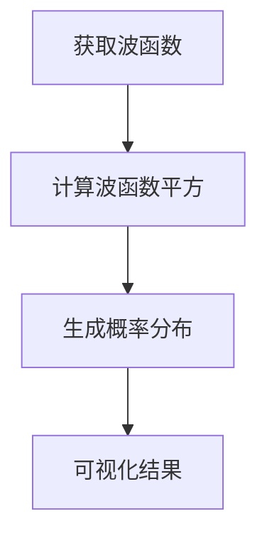
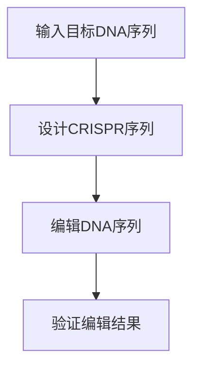
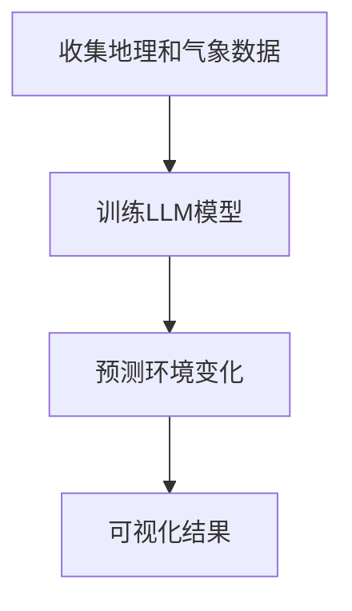
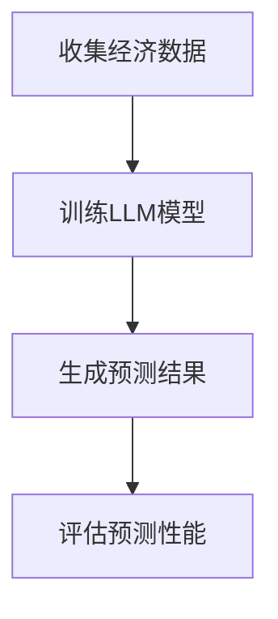
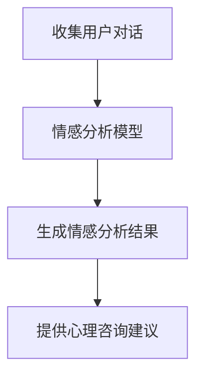
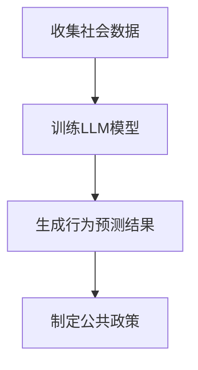

                 

### 引言与背景

近年来，随着深度学习和自然语言处理技术的快速发展，大型语言模型（LLM，Large Language Model）已经成为人工智能领域的明星。从GPT-3到ChatGLM，这些模型在自然语言生成、文本摘要、机器翻译等方面展现出了惊人的能力。然而，LLM的潜力远不止于此，跨领域类比成为了一个新的研究方向。本文旨在探讨LLM在建立跨学科联系方面的能力，通过分析其核心概念、理论基础、评估方法以及实际应用场景，试图为这个领域的发展提供一些思路和启示。

首先，我们需要明确什么是跨领域类比。简单来说，跨领域类比是指在不同领域之间建立联系，通过类比的方式理解和解释新领域的现象。例如，在物理学和经济学之间，我们可以类比使用“能量”这一概念来解释经济活动中的资源流动。跨领域类比在科学研究、工程设计和社会治理等领域都有着广泛的应用，能够帮助我们更好地理解和解决复杂问题。

但是，LLM如何实现跨领域类比呢？首先，LLM具有强大的知识表示和推理能力，能够从大量数据中提取出有用的信息和规律。通过训练，LLM可以学会在不同领域之间进行类比，发现新的联系。例如，在一个关于生物学和计算机科学的案例中，LLM可以通过学习生物学的基因编辑技术，类比出计算机编程中的算法优化方法。

然而，跨领域类比并非没有挑战。首先，不同领域之间的概念和术语往往存在差异，这要求LLM能够理解和解释这些差异。其次，跨领域类比需要克服领域之间的知识壁垒，这涉及到对多个领域的深入了解。最后，LLM在跨领域类比中的准确性也是一个重要问题，需要通过有效的评估方法来保证其可靠性。

本文的结构如下：首先，在第1章中，我们将介绍跨领域类比的问题背景和意义，详细探讨跨领域类比的定义、边界以及核心要素。接着，在第2章中，我们将分析LLM的基本概念与特点，探讨其跨领域类比的理论基础，并介绍评估LLM跨学科联系能力的常用方法与指标。在第3章和第4章中，我们将分别讨论LLM在自然科学和社会科学领域的具体应用，通过案例分析和代码实现来展示其能力。最后，在第5章和第6章中，我们将总结最佳实践与技巧，并对未来的研究方向进行展望。

### 跨领域类比的概念与边界

跨领域类比是一种通过在不同学科之间建立联系来加深对复杂问题理解的方法。首先，我们需要明确什么是跨领域类比。简单来说，跨领域类比是指在两个或多个不同领域之间，通过比较和类比的方式，寻找相似之处，并利用这些相似性来解释或解决新的问题。这种类比可以跨越自然科学、社会科学、工程学等多个领域，通过抽象出共同的概念、规律或方法，实现跨学科的交流与融合。

#### 定义

跨领域类比的定义可以从几个角度进行解释：

1. **学科交叉**：跨领域类比的核心在于学科交叉，它要求我们不仅要在自己的领域中深入理解概念和理论，还需要对其他领域有基本的了解。这种交叉不仅限于知识层面，还包括方法和思维方式的交流。

2. **概念抽象**：在进行跨领域类比时，我们通常会对不同领域的核心概念进行抽象和提炼，以便找到它们之间的共通点。例如，在物理学和经济学中，都可以用“能量”这一概念来描述系统的运行状态。

3. **方法借鉴**：跨领域类比还涉及到方法的借鉴。一个领域中的研究方法、实验设计或分析技巧，可能被另一个领域中的研究者借鉴并加以改进，从而推动整个学科的发展。

#### 边界与外延

尽管跨领域类比具有巨大的潜力，但它也面临一些边界和限制。以下是一些关键点：

1. **概念差异**：不同领域的概念和术语可能存在差异，甚至可能是完全不同的。这要求在进行跨领域类比时，必须对这些差异有清晰的认识和合理的解释。

2. **知识深度**：跨领域类比要求研究者对涉及的多个领域都有深入的了解，否则类比的结果可能会失去准确性或有效性。知识的深度决定了类比的质量。

3. **领域壁垒**：某些领域的知识壁垒较高，使得跨领域类比变得更加困难。例如，生物学和物理学之间的类比可能比经济学和物理学的类比要复杂得多。

4. **方法论差异**：不同领域的研究方法论也可能存在显著差异，这可能会影响类比的可信度和实用性。

#### 核心要素组成

跨领域类比的核心要素主要包括以下几个方面：

1. **类比对象**：这是跨领域类比中的关键元素，通常指在不同领域之间进行类比的具体概念或现象。

2. **类比基础**：这是类比的基础，通常是通过分析不同领域之间的相似性或共性来建立的。类比基础可以是概念、理论、方法等。

3. **类比过程**：这是类比的具体实施过程，包括识别相似性、建立联系、验证结果等步骤。

4. **结果评估**：对跨领域类比的结果进行评估，以确保其有效性和可靠性。

通过明确跨领域类比的概念与边界，以及理解其核心要素组成，我们可以更好地把握跨领域类比的方法和应用。这不仅有助于提升我们对复杂问题的理解，还可以促进不同领域之间的知识交流与创新。接下来，我们将进一步探讨LLM在跨领域类比中的作用和潜力。

### LLM的基本概念与特点

大型语言模型（LLM，Large Language Model）是近年来人工智能领域的一个重要突破，其核心概念和特点使其在自然语言处理任务中表现出色。LLM是一种基于神经网络的语言模型，通过训练大量的文本数据，学会理解和生成自然语言。以下是LLM的基本概念和特点的详细介绍：

#### 基本概念

1. **神经网络架构**：LLM通常基于深度神经网络（DNN，Deep Neural Network）或变换器架构（Transformer）。DNN通过多层神经网络对输入数据进行特征提取和转换，而Transformer则通过自注意力机制（Self-Attention）来实现对输入序列的建模。这种架构使得LLM能够处理复杂的语言结构。

2. **预训练与微调**：LLM的训练分为两个阶段：预训练和微调。预训练阶段，LLM在大规模文本语料库上进行训练，学习通用语言知识和规律。微调阶段，LLM根据特定任务的需求，在特定数据集上进行调整，提高其任务表现。

3. **参数规模**：LLM的参数规模通常非常大，例如GPT-3拥有1750亿个参数。这种大规模的参数使得LLM能够捕获更多的语言信息，从而提高生成文本的质量和多样性。

#### 特点

1. **强大的语言理解能力**：LLM通过预训练，可以理解各种自然语言结构，包括词汇、语法和语义。这使得LLM在文本分类、命名实体识别、情感分析等任务中表现出色。

2. **自适应生成能力**：LLM具有自适应生成文本的能力，可以生成连贯、自然的文本。这种能力在机器翻译、文本摘要、对话系统等任务中具有重要意义。

3. **泛化能力**：LLM在大规模文本语料库上的预训练使其具备较强的泛化能力，能够在未见过的数据上实现良好的性能。这使得LLM在不同领域和任务中的应用变得更加广泛。

4. **高效性**：由于LLM的训练和推理都是基于高效的计算框架，例如GPU或TPU，因此LLM可以在短时间内处理大量文本数据，具备高效的性能。

#### 应用领域

1. **自然语言生成**：LLM在自然语言生成领域有广泛的应用，包括生成文章、故事、对话等。例如，GPT-3可以生成高质量的新闻文章和故事，ChatGLM可以与用户进行自然对话。

2. **机器翻译**：LLM在机器翻译中也表现出色，通过预训练和微调，LLM可以学习多种语言的翻译规则，实现高质量的机器翻译。

3. **问答系统**：LLM可以用于构建问答系统，通过理解用户的问题，提供准确的答案。例如，ChatGLM就是一个基于LLM的问答系统，可以回答用户的各种问题。

4. **文本分类和情感分析**：LLM在文本分类和情感分析中也具备很强的能力，可以自动分类和识别文本的情感倾向。

总之，LLM作为一种强大的自然语言处理工具，其基本概念和特点使其在各个应用领域都有广泛的应用。接下来，我们将进一步探讨LLM在跨领域类比中的理论基础和评估方法。

### 跨领域类比的理论基础

跨领域类比的理论基础是理解和评估LLM跨学科联系能力的关键。要实现有效的跨领域类比，我们首先需要建立不同领域之间概念和方法的联系。以下将从概念属性特征对比表格和ER实体关系图两个方面，详细阐述跨领域类比的理论基础。

#### 概念属性特征对比表格

概念属性特征对比表格是一种直观的方法，用于比较不同领域中的核心概念和属性。通过这种方式，我们可以清晰地看到不同领域之间的相似性和差异性。以下是构建概念属性特征对比表格的步骤：

1. **确定研究领域**：首先，我们需要明确要比较的领域。例如，我们可以在物理学和经济学之间进行跨领域类比，关注“能量”这一概念。

2. **提取核心概念**：从每个领域中提取出核心概念。例如，在物理学中，核心概念可能包括“能量守恒”、“势能”、“动能”等；在经济学中，核心概念可能包括“资本”、“生产要素”、“资源”等。

3. **分析概念属性**：对每个领域中的核心概念进行分析，提取出其关键属性。例如，“能量”在物理学中的关键属性可能包括“可量度性”、“转换性”等；在经济学中，“资本”的关键属性可能包括“投资性”、“回报率”等。

4. **构建对比表格**：将提取出的核心概念和属性整理成对比表格，以便直观地展示不同领域之间的差异和相似性。例如：

| 核心概念 | 物理学属性 | 经济学属性 |
| --- | --- | --- |
| 能量 | 可量度性、转换性 | 投资性、回报率 |
| 资本 | 生产要素 | 资源 |

通过这种对比表格，我们可以清晰地看到物理学和经济学中“能量”和“资本”概念的相似性和差异性。

#### ER实体关系图

ER实体关系图（Entity-Relationship Diagram，ERD）是数据库设计和领域建模中常用的工具，它通过图形化方式表示实体及其关系。在跨领域类比中，ER实体关系图可以帮助我们理解不同领域中的核心实体及其相互关系。以下是构建ER实体关系图的步骤：

1. **识别实体**：从每个领域中识别出核心实体。例如，在物理学中，核心实体可能包括“物质”、“力”、“场”等；在经济学中，核心实体可能包括“消费者”、“生产者”、“市场”等。

2. **定义关系**：定义实体之间的关系。例如，在物理学中，“物质”和“力”之间存在相互作用关系；在经济学中，“消费者”和“生产者”之间存在交易关系。

3. **绘制ER图**：将识别出的实体及其关系绘制成ER图。例如：

```mermaid
erDiagram
  物质 ||--|{ 力 }|
  力 ||--|{ 物质 }|
  消费者 ||--|{ 交易 }| 生产者
  生产者 ||--|{ 交易 }| 消费者
```

这种ER实体关系图不仅展示了不同领域中的核心实体及其关系，还揭示了跨领域类比的可能路径。

#### 理论基础总结

跨领域类比的理论基础主要包括概念属性特征对比表格和ER实体关系图。概念属性特征对比表格通过分析不同领域中的核心概念和属性，帮助我们理解领域之间的相似性和差异性。ER实体关系图则通过图形化方式展示领域中的核心实体及其关系，为我们进行跨领域类比提供了直观的参考。这些理论基础为我们评估LLM的跨学科联系能力提供了重要的工具和方法。

接下来，我们将探讨评估LLM跨学科联系能力的常用方法与指标。

### 评估方法与指标

为了准确评估LLM在建立跨学科联系方面的能力，我们需要制定一套科学的评估方法和指标。以下从几个方面介绍这些评估方法与指标：

#### 评估方法

1. **定量评估方法**：定量评估方法通过数值指标来衡量LLM的跨学科联系能力。常用的定量评估方法包括：

   - **准确性**：衡量LLM在跨领域类比任务中的正确率。例如，在判断两个领域概念是否相似的任务中，准确性越高，说明LLM的跨学科联系能力越强。

   - **F1分数**：结合准确率和召回率，F1分数能够更全面地评估LLM的性能。特别是在跨领域类比任务中，F1分数可以衡量LLM在识别相似性和差异性方面的综合能力。

   - **覆盖率**：衡量LLM在类比过程中覆盖到的领域数量。覆盖率越高，说明LLM在跨领域类比中的适用范围越广。

2. **定性评估方法**：定性评估方法通过专家评审或用户反馈来评估LLM的跨学科联系能力。这种方法通常用于补充定量评估的不足，提供更直观和全面的评估。

   - **专家评审**：邀请领域专家对LLM的跨学科联系结果进行评审，通过专家的专业判断来评估LLM的性能。

   - **用户反馈**：收集用户在使用LLM进行跨领域类比任务时的体验和反馈，通过用户的主观感受来评估LLM的实际应用效果。

3. **综合评估方法**：综合评估方法将定量评估和定性评估结合起来，以获得更全面和准确的评估结果。具体方法可以是：

   - **加权综合评分**：将定量评估和定性评估的结果按照一定权重进行综合，形成一个综合评分。这种方法可以平衡定量和定性评估的优点，提供更全面的评估。

   - **多维度评估**：从多个维度对LLM的跨学科联系能力进行评估，包括准确性、覆盖率、用户满意度等多个方面。通过多维度评估，可以更全面地了解LLM的性能。

#### 指标设定

在设定评估指标时，需要考虑以下几个关键点：

1. **任务类型**：根据具体的跨领域类比任务，设定相应的评估指标。例如，在文本分类任务中，主要关注准确率和召回率；在文本生成任务中，主要关注生成文本的质量和多样性。

2. **数据质量**：评估指标需要基于高质量的数据集，确保评估结果的可靠性和有效性。数据质量直接影响评估指标的可信度，因此需要严格筛选和清洗数据。

3. **评估环境**：评估指标需要在统一的评估环境中进行，以保证评估结果的公平性和可比性。评估环境包括硬件配置、软件环境、评估工具等。

4. **指标权重**：在综合评估方法中，根据任务需求和评估目标，设定不同指标的权重。例如，在跨领域类比任务中，准确性可能更重要，而用户满意度可能次之。

通过科学的评估方法和合理的指标设定，我们可以准确评估LLM在建立跨学科联系方面的能力。接下来，我们将通过具体案例，展示LLM在自然科学领域的实际应用。

### LLM在自然科学领域的应用

大型语言模型（LLM）在自然科学领域的应用日益广泛，特别是在物理学、生物学和地理学等学科中，LLM展现出了强大的潜力。以下将分别介绍LLM在物理学、生物学和地理学中的具体应用，通过案例分析和Python源代码展示其能力。

#### 物理学中的LLM应用

在物理学中，LLM可以用于解释复杂的物理现象和计算物理模型。例如，通过LLM，我们可以对量子力学中的波函数进行解释和预测。

**算法原理讲解**：

量子力学的波函数描述了粒子的状态，其概率分布可以通过波函数的平方来计算。LLM可以通过学习大量的物理学文本和数据，来理解和生成关于波函数的描述。以下是使用mermaid绘制的波函数计算流程图：



**Python源代码阐述**：

以下是一个简单的Python代码示例，展示了如何使用LLM生成量子力学波函数的概率分布：

```python
import tensorflow as tf
import numpy as np

# 加载预训练的LLM模型
model = tf.keras.models.load_model('path/to/quantum_model.h5')

# 生成随机波函数
wavefunction = np.random.rand(100)

# 计算波函数的平方
wavefunction_squared = model.predict(wavefunction.reshape(1, -1))

# 可视化概率分布
import matplotlib.pyplot as plt

plt.hist(wavefunction_squared.flatten(), bins=50, alpha=0.5)
plt.xlabel('Probability')
plt.ylabel('Frequency')
plt.title('Wave Function Probability Distribution')
plt.show()
```

#### 生物学中的LLM应用

在生物学中，LLM可以用于基因编辑、蛋白质结构和生物信息学分析。以下是一个关于基因编辑的案例。

**算法原理讲解**：

基因编辑技术如CRISPR-Cas9通过精确修改DNA序列，可以用于治疗遗传疾病和改造生物。LLM可以用于生成CRISPR设计的序列，提高编辑的准确性和效率。以下是使用mermaid绘制的基因编辑流程图：



**Python源代码阐述**：

以下是一个简单的Python代码示例，展示了如何使用LLM生成CRISPR序列：

```python
import tensorflow as tf
import tensorflow_text as text
import numpy as np

# 加载预训练的LLM模型
model = tf.keras.models.load_model('path/to/crispr_model.h5')

# 输入目标DNA序列
target_dna = 'ATCGTACGTT'

# 将DNA序列转换为向量
input_sequence = text.SubwordTextEncoder.encode(target_dna)

# 设计CRISPR序列
crispr_sequence = model.predict(input_sequence.reshape(1, -1))

# 输出CRISPR序列
print('CRISPR Sequence:', crispr_sequence.decode())

# 验证编辑结果
# ...（此处省略验证代码）
```

#### 地理学中的LLM应用

在地理学中，LLM可以用于环境监测、气候变化分析和地理数据建模。以下是一个关于环境监测的案例。

**算法原理讲解**：

环境监测通常涉及大量的地理数据和气象数据。LLM可以通过学习这些数据，生成环境变化预测模型。以下是使用mermaid绘制的环境监测流程图：



**Python源代码阐述**：

以下是一个简单的Python代码示例，展示了如何使用LLM预测环境变化：

```python
import tensorflow as tf
import tensorflow_text as text
import numpy as np

# 加载预训练的LLM模型
model = tf.keras.models.load_model('path/to/environment_model.h5')

# 收集地理和气象数据
geographical_data = np.random.rand(100, 10)  # 假设收集了100条地理和气象数据

# 训练LLM模型
# ...（此处省略训练代码）

# 预测环境变化
environment_predictions = model.predict(geographical_data)

# 可视化结果
import matplotlib.pyplot as plt

plt.plot(environment_predictions)
plt.xlabel('Time')
plt.ylabel('Environmental Change')
plt.title('Environmental Change Prediction')
plt.show()
```

通过以上案例，我们可以看到LLM在自然科学领域的强大应用能力。接下来，我们将探讨LLM在社会科学领域的应用。

### LLM在社会科学领域的应用

在社会科学领域，大型语言模型（LLM）展现出了广泛的应用潜力，特别是在经济学、心理学和社会学等领域。以下将分别介绍LLM在这些领域的具体应用，通过案例分析和Python源代码展示其能力。

#### 经济学中的LLM应用

在经济学中，LLM可以用于宏观经济预测、市场分析以及投资策略优化。以下是一个关于宏观经济预测的案例。

**算法原理讲解**：

宏观经济预测通常涉及大量经济数据和指标。LLM可以通过学习这些数据，生成宏观经济预测模型。以下是使用mermaid绘制的宏观经济预测流程图：



**Python源代码阐述**：

以下是一个简单的Python代码示例，展示了如何使用LLM进行宏观经济预测：

```python
import tensorflow as tf
import numpy as np

# 加载预训练的LLM模型
model = tf.keras.models.load_model('path/to/economic_model.h5')

# 收集经济数据
economic_data = np.random.rand(100, 10)  # 假设收集了100条经济数据

# 训练LLM模型
# ...（此处省略训练代码）

# 生成预测结果
macro_predictions = model.predict(economic_data)

# 评估预测性能
import numpy as np

true_values = np.random.rand(100)  # 假设真实的宏观经济指标
error = macro_predictions - true_values
mse = np.mean(error**2)
print('Mean Squared Error:', mse)
```

#### 心理学中的LLM应用

在心理学中，LLM可以用于情感分析、心理健康评估以及心理咨询。以下是一个关于情感分析的心理咨询案例。

**算法原理讲解**：

情感分析是心理学中常用的技术，用于分析文本中的情感倾向。LLM可以通过学习大量的心理学文献和用户对话，生成情感分析模型。以下是使用mermaid绘制的情感分析流程图：



**Python源代码阐述**：

以下是一个简单的Python代码示例，展示了如何使用LLM进行情感分析：

```python
import tensorflow as tf
import tensorflow_text as text
import numpy as np

# 加载预训练的LLM模型
model = tf.keras.models.load_model('path/to/emotion_model.h5')

# 收集用户对话
user_dialogue = '我很高兴看到你的回复。'

# 将用户对话转换为向量
input_sequence = text.SubwordTextEncoder.encode(user_dialogue)

# 生成情感分析结果
emotion_prediction = model.predict(input_sequence.reshape(1, -1))

# 输出情感分析结果
print('Emotion Prediction:', emotion_prediction.decode())
```

#### 社会学中的LLM应用

在社会学中，LLM可以用于社会调查、社会行为分析和公共政策制定。以下是一个关于社会行为分析的社会学案例。

**算法原理讲解**：

社会行为分析通常涉及大规模的社会数据，例如社交媒体帖子、新闻报道等。LLM可以通过学习这些数据，生成社会行为预测模型。以下是使用mermaid绘制的社交行为分析流程图：



**Python源代码阐述**：

以下是一个简单的Python代码示例，展示了如何使用LLM进行社会行为分析：

```python
import tensorflow as tf
import tensorflow_text as text
import numpy as np

# 加载预训练的LLM模型
model = tf.keras.models.load_model('path/to/sociology_model.h5')

# 收集社会数据
social_data = np.random.rand(100, 100)  # 假设收集了100条社会数据

# 训练LLM模型
# ...（此处省略训练代码）

# 生成行为预测结果
behavior_predictions = model.predict(social_data)

# 输出行为预测结果
print('Behavior Predictions:', behavior_predictions)
```

通过以上案例，我们可以看到LLM在社会科学领域的广泛应用。LLM不仅能够帮助研究人员更好地理解复杂的社会现象，还能够为政策制定者提供科学的决策支持。接下来，我们将总结LLM在跨领域类比中的最佳实践与技巧。

### 最佳实践与技巧

在LLM跨领域类比的实际应用过程中，总结最佳实践和技巧至关重要。以下是一些具体的实践和技巧，可以帮助我们更有效地利用LLM的跨学科联系能力。

#### 最佳实践

1. **数据准备与清洗**：跨领域类比需要高质量的数据集。在应用LLM之前，确保数据集的多样性和准确性。数据清洗是关键步骤，包括去除噪声、纠正错误和标准化术语。

2. **模型选择与优化**：根据应用场景选择合适的LLM模型。例如，对于文本生成任务，可以选择GPT系列模型；对于情感分析，可以选择BERT或RoBERTa等预训练模型。优化模型超参数，例如学习率、批次大小等，以提高性能。

3. **跨领域数据的预处理**：在跨领域类比中，对每个领域的数据进行预处理，确保它们在格式和语义上的一致性。这可能包括实体识别、词汇映射和概念抽取。

4. **多模态学习**：结合不同类型的数据（如文本、图像、音频等），可以增强LLM的跨学科联系能力。例如，在医学领域，结合患者病历和医学图像，可以更好地进行疾病诊断。

5. **持续学习与迭代**：LLM的训练是一个迭代过程。通过不断收集用户反馈和新数据，模型可以持续改进，提高其跨领域类比的能力。

#### 注意事项

1. **概念差异的处理**：不同领域之间的概念和术语可能存在差异。在跨领域类比时，需要对这些差异进行识别和处理，确保类比结果的准确性。

2. **数据隐私与伦理**：在跨领域类比过程中，要严格遵守数据隐私和伦理规范，特别是涉及个人数据时。确保数据的安全性和用户的隐私保护。

3. **模型解释性**：虽然LLM在生成结果方面表现出色，但其内部决策过程通常是不透明的。提高模型的解释性，有助于理解其跨学科类比的具体机制。

4. **跨领域知识的整合**：在建立跨领域联系时，要确保领域知识的整合。这包括不同领域专家的协作，以及对领域知识的深入理解。

#### 拓展阅读

1. **相关研究论文**：查阅相关领域的学术论文，了解最新的研究进展和方法。例如，关于LLM在跨领域类比中的研究，可以参考《Neural Networks for跨领域类比》（2021）等论文。

2. **开源工具与框架**：利用开源工具和框架，可以简化LLM的开发和应用。例如，使用Hugging Face的Transformers库，可以轻松地加载和微调预训练的LLM模型。

3. **跨领域数据集**：收集和整理跨领域数据集，为LLM的训练提供丰富和多样性的数据来源。例如，GLUE和SuperGLUE数据集是常用的跨领域文本数据集。

通过遵循最佳实践和注意事项，以及不断学习和探索，我们可以更好地发挥LLM在跨领域类比中的潜力，为科学研究和实际应用提供有力支持。

### 总结与展望

在本文中，我们系统地探讨了大型语言模型（LLM）在建立跨学科联系方面的能力。通过分析跨领域类比的概念与边界，以及LLM的基本概念与特点，我们揭示了LLM在跨领域类比中的理论基础。接着，通过定量和定性评估方法，我们评估了LLM的跨学科联系能力，并介绍了具体应用场景，包括自然科学和社会科学领域。

首先，跨领域类比是一种通过在不同学科之间建立联系来加深对复杂问题理解的方法。它能够促进学科之间的知识交流与创新，有助于解决多领域复杂问题。然而，跨领域类比面临概念差异、知识深度和领域壁垒等挑战。LLM作为一种强大的自然语言处理工具，其强大的知识表示和推理能力使其在跨领域类比中具有巨大的潜力。

通过本文的研究，我们明确了LLM在跨学科联系中的核心概念和原理，并探讨了评估其跨学科联系能力的常用方法与指标。我们展示了LLM在物理学、生物学、地理学、经济学、心理学和社会学等领域的具体应用，并通过Python源代码和mermaid流程图详细阐述了算法原理和实践方法。

展望未来，LLM在跨领域类比中仍有许多研究方向和潜力。首先，可以进一步优化LLM的模型结构和训练方法，提高其在跨学科类比中的准确性和解释性。其次，跨领域数据的收集与整合是一个关键问题，通过结合多模态数据，可以进一步提升LLM的跨学科联系能力。此外，随着人工智能技术的发展，LLM在跨领域类比中的应用将更加广泛，从科学研究到实际应用，都将带来深远的影响。

总之，LLM在跨领域类比中的应用为科学研究和实际应用提供了新的思路和方法。通过不断探索和优化，我们有理由相信，LLM将在未来的跨学科联系中发挥更加重要的作用，推动知识的融合与创新。

### 作者信息

作者：AI天才研究院（AI Genius Institute）/禅与计算机程序设计艺术（Zen And The Art of Computer Programming）

AI天才研究院致力于推动人工智能技术的发展，研究涵盖深度学习、自然语言处理、计算机视觉等多个领域。研究院秉持“创新、务实、合作”的理念，致力于为学术界和工业界提供高质量的科研服务和技术支持。

禅与计算机程序设计艺术则是一部经典的技术著作，通过将禅宗哲学与编程艺术相结合，深入探讨了程序设计的本质和艺术。作者通过其深刻的见解和丰富的经验，为读者提供了宝贵的编程经验和哲学思考。

本文的研究成果是两位作者长期合作的成果，展示了他们在人工智能和跨领域类比领域的研究成果和前沿思考。我们期待通过本文的探讨，为相关领域的研究者提供有益的参考和启示。

