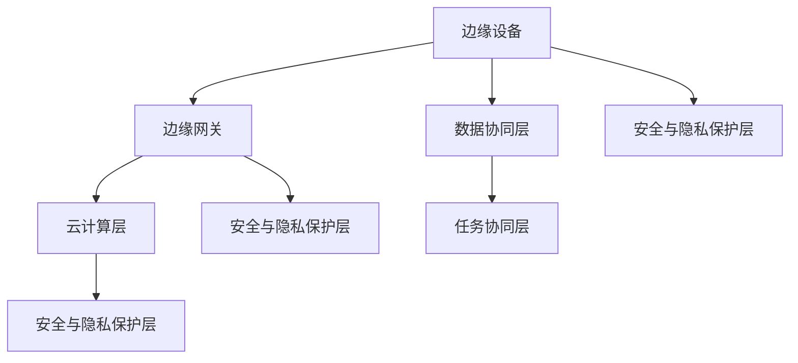

                 

### 边缘AI：将智能推向设备端的技术革新

#### 关键词：边缘AI、智能设备、计算能力、数据处理、技术革新

> 摘要：本文将探讨边缘AI技术的概念、背景、优势以及其在不同领域的应用。我们将逐步分析边缘AI硬件设备、算法与模型、软件框架以及边缘AI与云计算的协同作用，最后通过实际案例分析边缘AI的落地实践。本文旨在为读者提供一个全面、系统的边缘AI技术解析，帮助理解这一技术革新带来的变革。

# 边缘AI：将智能推向设备端的技术革新

边缘AI，作为当前技术革新的前沿，将智能计算推向了设备端，不仅提升了数据处理的速度和效率，还在多个领域展示了其巨大的应用潜力。本文将深入探讨边缘AI的背景、概念、技术要点以及实际应用，以帮助读者全面了解这一重要技术。

## 第一部分：边缘AI概述

### 第1章：边缘AI的背景与概念

在数字化的今天，数据已成为企业和社会的核心资产，如何高效地处理和利用这些数据成为了一个重要议题。传统的云计算模式依赖于中心化的数据处理，但随着物联网（IoT）设备的激增和数据量的爆炸式增长，这种模式面临着巨大的挑战。边缘AI应运而生，通过将智能计算推向设备端，为数据处理提供了新的思路。

#### 1.1 边缘AI的背景

#### 1.1.1 物联网时代的发展

随着物联网技术的迅猛发展，越来越多的设备连接到互联网，产生了海量的数据。这些数据需要实时处理和分析，以便快速响应和决策。然而，传统的云计算模式在处理这些海量数据时，往往存在延迟和带宽瓶颈，难以满足实时性的需求。

#### 1.1.2 云计算的局限

云计算在处理大规模数据方面具有优势，但其对网络依赖性较强，易受带宽和延迟的影响。此外，随着数据量的增加，数据传输和存储的成本也在不断攀升。边缘AI的出现，为解决这些问题提供了一种新的思路。

#### 1.1.3 边缘计算的概念与重要性

边缘计算是一种分布式计算架构，将数据处理和计算任务从中心化的云计算迁移到靠近数据源的设备端。边缘计算可以显著降低数据传输的延迟，提高数据处理的效率，并减少对带宽的需求。

#### 1.2 边缘AI的定义与特点

#### 1.2.1 边缘AI的定义

边缘AI是指将人工智能（AI）算法和模型部署在靠近数据源的边缘设备上，进行实时数据处理和智能分析的技术。

#### 1.2.2 边缘AI的特点

边缘AI具有以下特点：

1. **低延迟**：数据在边缘设备上处理，减少了数据传输的时间，提高了响应速度。
2. **高效率**：边缘设备可以并行处理多个任务，提高了数据处理效率。
3. **灵活性**：边缘设备可以根据需求进行定制化，满足不同应用场景的需求。
4. **成本效益**：减少了数据传输和存储的成本，降低了总体拥有成本。

#### 1.2.3 边缘AI与传统AI的区别

边缘AI与传统AI的主要区别在于数据处理的位置和方式。传统AI依赖于中心化的云计算，而边缘AI则将数据处理推向设备端。这种差异带来了以下影响：

1. **数据处理位置**：传统AI在云端处理数据，边缘AI在边缘设备上处理数据。
2. **数据隐私**：边缘AI可以更好地保护数据隐私，减少了数据传输过程中的安全风险。
3. **网络依赖性**：传统AI对网络依赖性较强，边缘AI则可以降低对网络的依赖。

#### 1.3 边缘AI的应用领域

边缘AI具有广泛的应用领域，包括但不限于：

1. **工业自动化**：在制造业中，边缘AI可以实时监控生产线，实现智能检测和维护。
2. **智能交通**：在交通管理中，边缘AI可以实时处理车辆数据，优化交通流量。
3. **健康医疗**：在健康医疗中，边缘AI可以实时分析医疗数据，提供智能诊断和治疗方案。
4. **娱乐与消费电子**：在智能家居和智能穿戴设备中，边缘AI可以提供个性化的娱乐体验和健康监测。

#### 1.4 边缘AI的优势与挑战

#### 1.4.1 边缘AI的优势

边缘AI的优势包括：

1. **低延迟**：数据在边缘设备上处理，减少了数据传输的延迟，提高了响应速度。
2. **高效率**：边缘设备可以并行处理多个任务，提高了数据处理效率。
3. **灵活性**：边缘设备可以根据需求进行定制化，满足不同应用场景的需求。
4. **成本效益**：减少了数据传输和存储的成本，降低了总体拥有成本。

#### 1.4.2 边缘AI的挑战

边缘AI面临的挑战包括：

1. **计算能力**：边缘设备通常计算能力有限，需要优化算法以适应有限的资源。
2. **能耗管理**：边缘设备通常需要长时间运行，需要优化能耗管理，延长设备寿命。
3. **数据安全与隐私**：边缘设备可能会成为网络攻击的目标，需要加强数据安全与隐私保护。

#### 1.4.3 边缘AI的发展趋势

边缘AI的发展趋势包括：

1. **硬件创新**：随着硬件技术的进步，边缘设备的计算能力和存储能力将不断提高。
2. **软件优化**：边缘AI算法和模型的优化将有助于更好地利用有限的硬件资源。
3. **网络协同**：边缘AI与云计算的协同作用将提高整体数据处理效率。
4. **生态建设**：边缘AI需要构建一个良好的生态体系，包括设备、算法、平台和服务的协同发展。

#### 1.5 本章小结

边缘AI作为一种将智能计算推向设备端的技术，具有显著的优势和广阔的应用前景。然而，其发展仍面临一些挑战，需要通过技术创新和生态建设来克服。通过本章的介绍，读者可以初步了解边缘AI的概念、背景和应用，为后续章节的深入探讨打下基础。

### 第2章：边缘AI硬件设备

在边缘AI的架构中，硬件设备扮演着至关重要的角色。它们不仅决定了边缘AI系统的计算能力和性能，还影响了系统的功耗和可靠性。本章节将详细探讨边缘AI硬件设备的分类、边缘AI芯片技术以及边缘AI硬件设备的选择与优化。

#### 2.1 边缘AI硬件设备的分类

边缘AI硬件设备可以根据其功能、性能和适用场景进行分类，主要可以分为以下几类：

##### 2.1.1 边缘服务器

边缘服务器是边缘AI架构中的核心设备，通常具有强大的计算能力和存储能力。它们可以处理大量数据，支持复杂的算法和模型。边缘服务器适用于需要高计算能力和大规模数据处理的应用场景，如工业自动化、智能交通和视频分析等。

##### 2.1.2 边缘网关

边缘网关是连接边缘设备和云服务的桥梁，负责数据传输、协议转换和安全认证等任务。边缘网关通常具有处理数据的基本能力，可以执行简单的边缘AI算法。它们适用于需要高效数据传输和实时响应的应用场景，如智能安防、智能农业和远程医疗等。

##### 2.1.3 嵌入式设备

嵌入式设备是体积小、功耗低、计算能力有限的设备，通常用于特定场景的智能处理。例如，智能家居设备中的智能音箱、智能门锁和智能摄像头等。嵌入式设备适用于需要低成本、低功耗和高可靠性的应用场景，如智能穿戴设备、环境监测和消费电子等。

#### 2.2 边缘AI芯片技术

边缘AI芯片是边缘AI硬件设备的核心组成部分，其性能直接决定了边缘AI系统的效率和效果。边缘AI芯片技术的发展可以分为以下几个方向：

##### 2.2.1 芯片架构与设计

边缘AI芯片的架构设计需要考虑功耗、性能和成本等多方面因素。目前，常见的边缘AI芯片架构包括CPU+GPU、CPU+VPU、CPU+ASIC等。CPU负责通用计算，GPU和VPU负责图形和视频处理，ASIC负责特定任务的硬件加速。

##### 2.2.2 AI加速器的演进

AI加速器是边缘AI芯片中负责AI计算的关键组件，其性能直接决定了边缘AI芯片的AI处理能力。随着深度学习技术的快速发展，AI加速器技术也在不断演进。常见的AI加速器包括GPU、FPGA、ASIC和TPU等。

- **GPU**（图形处理单元）：GPU原本用于图形渲染，但因其强大的并行计算能力，也逐渐被应用于深度学习和其他AI计算。
- **FPGA**（现场可编程门阵列）：FPGA具有高度可定制性和灵活性，适用于需要实时调整和优化的AI应用。
- **ASIC**（专用集成电路）：ASIC是专门为特定任务设计的芯片，具有高性能和低功耗的特点。
- **TPU**（张量处理单元）：TPU是谷歌专为深度学习任务设计的AI加速器，具有强大的处理能力和高效的能效比。

##### 2.2.3 芯片制造商及其产品

当前，边缘AI芯片市场上有多个知名的制造商，它们的产品涵盖了从嵌入式设备到高性能边缘服务器的各个领域。以下是几家主要的边缘AI芯片制造商及其代表性产品：

- **NVIDIA**：NVIDIA的GPU广泛应用于边缘AI领域，其Jetson系列边缘AI开发板适用于各种边缘应用场景。
- **Intel**：Intel的Movidius VPU和Habana Labs的ASIC广泛应用于边缘AI计算，其Intel Distribution of OpenVINO工具套件提供了丰富的边缘AI解决方案。
- **ARM**：ARM的Cortex-M处理器和Cortex-A处理器分别适用于嵌入式设备和高性能边缘设备，其Neural Network Processor（NNP）系列专为边缘AI设计。
- **Google**：Google的TPU是专为深度学习任务设计的AI加速器，其Edge TPU扩展板适用于边缘AI应用。

#### 2.3 边缘AI硬件设备的选择与优化

选择合适的边缘AI硬件设备对于边缘AI系统的成功至关重要。以下是一些选择和优化边缘AI硬件设备的关键因素：

##### 2.3.1 设备性能评估

在评估边缘AI硬件设备时，需要考虑以下几个关键性能指标：

- **计算能力**：边缘设备需要具备足够的计算能力来支持所需的AI算法和模型。
- **存储容量**：边缘设备需要足够的存储容量来存储数据和模型。
- **功耗**：功耗是边缘设备的重要考量因素，低功耗可以延长设备的使用寿命，减少维护成本。
- **连接性**：边缘设备需要具备良好的网络连接性，以便与其他设备和服务进行数据传输。

##### 2.3.2 硬件资源的优化

为了提高边缘AI硬件设备的性能和效率，可以采取以下优化措施：

- **资源调度**：通过智能调度算法，合理分配计算资源和存储资源，提高资源利用率。
- **并行处理**：利用边缘设备的并行计算能力，同时处理多个任务，提高处理效率。
- **内存管理**：优化内存分配和回收策略，减少内存占用和垃圾回收时间。
- **能耗管理**：采用能耗管理技术，降低设备的功耗，延长设备寿命。

##### 2.3.3 设备的可持续性与能耗管理

在边缘AI硬件设备的选择和优化中，可持续性和能耗管理是一个重要考虑因素。以下是一些实现可持续性和能耗管理的策略：

- **能效设计**：在硬件设计阶段，采用能效设计原则，优化电路设计和器件选择，降低功耗。
- **智能功耗调节**：通过智能功耗调节技术，根据设备负载自动调整功耗，实现节能。
- **能源回收**：采用能源回收技术，将设备运行过程中产生的废热回收再利用，降低能源消耗。
- **生命周期管理**：通过设备生命周期管理，合理规划设备升级和更换，减少电子废弃物。

#### 2.4 本章小结

边缘AI硬件设备是边缘AI系统的核心组成部分，其选择和优化直接影响系统的性能和效率。通过了解边缘AI硬件设备的分类、边缘AI芯片技术的发展以及设备选择和优化的关键因素，读者可以更好地构建高效的边缘AI系统。本章内容为后续章节的讨论奠定了基础，接下来我们将进一步探讨边缘AI算法与模型。

### 第3章：边缘AI算法与模型

边缘AI算法与模型是边缘AI技术的核心组成部分，它们决定了边缘AI系统的智能程度和应用范围。本章节将详细探讨边缘AI算法的基本概念、主流算法以及深度学习模型在边缘AI中的应用。

#### 3.1 边缘AI算法概述

边缘AI算法是指在边缘设备上执行的算法，用于处理和分析本地数据，实现智能决策和实时响应。边缘AI算法具有以下特点：

- **低延迟**：边缘AI算法可以在本地快速执行，减少数据传输和处理的延迟。
- **高效性**：边缘AI算法通常针对特定应用场景进行优化，具有较高的效率。
- **可定制性**：边缘AI算法可以根据不同应用场景进行定制化，满足特定需求。
- **资源限制**：边缘设备通常计算能力和存储能力有限，边缘AI算法需要适应这些资源限制。

#### 3.1.1 传统算法与边缘算法的比较

传统算法与边缘算法在以下几个方面存在差异：

- **执行位置**：传统算法通常在云端执行，而边缘算法在边缘设备上执行。
- **数据依赖性**：传统算法依赖大量云端数据，而边缘算法依赖本地数据。
- **计算能力**：传统算法通常具有更高的计算能力，而边缘算法需要适应资源限制。
- **实时性**：传统算法处理时间较长，而边缘算法需要快速响应。

#### 3.1.2 边缘算法的特点

边缘算法具有以下特点：

1. **低延迟**：边缘算法可以在本地快速执行，减少数据传输和处理的延迟。
2. **高效性**：边缘算法针对特定应用场景进行优化，具有较高的效率。
3. **可定制性**：边缘算法可以根据不同应用场景进行定制化，满足特定需求。
4. **资源限制**：边缘算法需要适应边缘设备的计算能力和存储能力限制。

#### 3.1.3 主流边缘AI算法介绍

以下是一些主流的边缘AI算法：

1. **机器学习算法**：
   - **线性回归**：用于预测连续值输出。
   - **逻辑回归**：用于分类任务。
   - **决策树**：用于分类和回归任务。
   - **随机森林**：通过集成多个决策树实现更高的准确性和泛化能力。
   - **支持向量机**（SVM）：用于分类和回归任务，特别是在高维空间中具有较好的性能。

2. **深度学习算法**：
   - **卷积神经网络**（CNN）：用于图像处理和计算机视觉任务。
   - **循环神经网络**（RNN）：用于序列数据处理和自然语言处理。
   - **长短期记忆网络**（LSTM）：RNN的一种改进，用于处理长序列数据。
   - **生成对抗网络**（GAN）：用于生成对抗任务，如图像生成和图像修复。

3. **强化学习算法**：
   - **Q学习**：通过学习值函数来实现智能决策。
   - **深度Q网络**（DQN）：结合深度学习和Q学习，用于解决复杂的决策问题。
   - **策略梯度算法**：通过优化策略来实现智能决策。

#### 3.2 深度学习模型在边缘AI中的应用

深度学习模型在边缘AI中具有广泛的应用，其通过将模型迁移到边缘设备，可以实现本地数据处理和智能分析。以下是一些关键技术：

##### 3.2.1 深度学习模型的迁移学习

迁移学习是一种将预训练模型应用于新任务的技术，可以显著减少模型的训练时间和计算资源。在边缘AI中，通过迁移学习，可以将大型预训练模型迁移到边缘设备，实现高效的数据处理和智能分析。

- **预训练模型**：在大规模数据集上预训练的模型，具有较好的泛化能力。
- **模型压缩**：通过模型压缩技术，将大型模型压缩为较小的模型，适应边缘设备的计算能力限制。
- **模型适配**：通过适配技术，将预训练模型适应边缘设备的硬件架构和计算能力。

##### 3.2.2 深度学习模型的压缩与量化

深度学习模型的压缩与量化技术是边缘AI的重要技术手段，可以减少模型的计算复杂度和存储需求，提高模型在边缘设备上的运行效率。

- **模型压缩**：通过模型压缩技术，将大型模型压缩为较小的模型，减少模型的计算复杂度和存储需求。
  - **剪枝**：通过剪枝技术，减少模型中的冗余参数，降低模型的计算复杂度。
  - **量化**：通过量化技术，将模型的浮点数参数转换为较低精度的整数参数，减少模型的存储需求。

- **模型量化**：通过量化技术，将模型的浮点数参数转换为较低精度的整数参数，减少模型的存储需求。
  - **全精度量化**：将模型的浮点数参数直接转换为整数参数。
  - **低精度量化**：将模型的浮点数参数转换为较低精度的整数参数，以降低计算复杂度和存储需求。

##### 3.2.3 深度学习模型的边缘部署

深度学习模型在边缘设备的部署是边缘AI的关键环节，需要考虑以下几个方面：

- **模型转换**：将训练好的深度学习模型转换为边缘设备可执行的格式，如ONNX、TFLite等。
- **模型优化**：通过模型优化技术，减少模型的计算复杂度和存储需求，提高模型在边缘设备上的运行效率。
- **模型集成**：将深度学习模型集成到边缘设备的操作系统和应用程序中，实现模型的自动化部署和运行。
- **模型监控**：通过模型监控技术，实时监测模型的性能和运行状态，确保模型在边缘设备上的稳定运行。

#### 3.3 机器学习模型在边缘AI中的应用

机器学习模型在边缘AI中也具有广泛的应用，通过将机器学习模型迁移到边缘设备，可以实现本地数据处理和智能分析。以下是一些关键步骤：

##### 3.3.1 机器学习模型的训练与优化

机器学习模型的训练与优化是边缘AI的基础，通过以下步骤可以实现：

- **数据预处理**：对训练数据进行清洗和预处理，提高数据质量。
- **模型选择**：根据应用场景选择合适的机器学习模型。
- **模型训练**：使用训练数据对模型进行训练，优化模型参数。
- **模型评估**：使用测试数据对模型进行评估，确保模型具有较好的泛化能力。
- **模型优化**：通过模型优化技术，减少模型的计算复杂度和存储需求。

##### 3.3.2 机器学习模型的部署与调优

机器学习模型的部署与调优是边缘AI的关键环节，通过以下步骤可以实现：

- **模型转换**：将训练好的机器学习模型转换为边缘设备可执行的格式，如ONNX、TFLite等。
- **模型优化**：通过模型优化技术，减少模型的计算复杂度和存储需求，提高模型在边缘设备上的运行效率。
- **模型集成**：将机器学习模型集成到边缘设备的操作系统和应用程序中，实现模型的自动化部署和运行。
- **模型调优**：通过模型调优技术，优化模型在边缘设备上的性能，确保模型具有较好的实时性和准确性。
- **模型监控**：通过模型监控技术，实时监测模型的性能和运行状态，确保模型在边缘设备上的稳定运行。

##### 3.3.3 机器学习模型的监控与维护

机器学习模型的监控与维护是边缘AI长期稳定运行的重要保障，通过以下步骤可以实现：

- **性能监控**：实时监控模型的运行性能，包括响应时间、准确率等指标。
- **错误诊断**：通过错误诊断技术，识别模型运行中的错误和异常，确保模型正常运行。
- **更新与升级**：定期更新和升级模型，以适应新的数据和需求，提高模型的准确性和稳定性。
- **维护与管理**：通过维护和管理技术，确保模型在边缘设备上的稳定运行和可靠服务。

#### 3.4 本章小结

边缘AI算法与模型是边缘AI技术的核心组成部分，通过深入探讨边缘AI算法的基本概念、主流算法以及深度学习模型在边缘AI中的应用，读者可以全面了解边缘AI算法的技术要点和应用方法。本章内容为后续章节的讨论奠定了基础，接下来我们将进一步探讨边缘AI软件框架。

### 第4章：边缘AI软件框架

边缘AI软件框架是边缘AI系统的重要组成部分，它为边缘设备的智能计算提供了统一的开发环境和运行平台。本章节将详细探讨边缘AI软件框架的概述、主流边缘AI软件框架以及边缘计算平台和边缘智能网关。

#### 4.1 边缘AI软件框架概述

边缘AI软件框架是指为边缘设备提供开发和运行环境的一系列工具和组件。它旨在简化边缘AI系统的开发和部署过程，提高系统的可靠性和可维护性。边缘AI软件框架通常包括以下几个关键组成部分：

1. **边缘计算引擎**：边缘计算引擎是边缘AI软件框架的核心，负责执行边缘AI算法和模型，提供数据处理和智能分析功能。
2. **数据管理模块**：数据管理模块负责边缘设备上的数据存储、传输和管理，确保数据的安全和可靠性。
3. **网络通信模块**：网络通信模块负责边缘设备与云服务之间的数据传输和通信，实现边缘AI与云计算的协同工作。
4. **安全与隐私保护模块**：安全与隐私保护模块负责边缘AI系统的安全性和隐私保护，防止数据泄露和攻击。
5. **监控与运维模块**：监控与运维模块负责边缘AI系统的性能监控、错误诊断和运维管理，确保系统的稳定运行。

#### 4.1.1 软件框架在边缘AI中的重要性

软件框架在边缘AI中具有重要性，主要体现在以下几个方面：

1. **简化开发**：边缘AI软件框架为开发者提供了统一的开发环境和工具，简化了边缘AI系统的开发和部署过程，降低了开发难度和成本。
2. **提高效率**：边缘AI软件框架提供了高效的数据处理和智能分析能力，提高了边缘AI系统的运行效率和性能。
3. **提高可靠性**：边缘AI软件框架提供了可靠的安全性和隐私保护机制，确保边缘AI系统的稳定性和安全性。
4. **降低维护成本**：边缘AI软件框架提供了统一的监控和运维管理功能，降低了系统的维护成本和工作量。

#### 4.1.2 主流边缘AI软件框架介绍

当前，市场上存在多个主流的边缘AI软件框架，以下是一些代表性的框架：

1. **OpenMLOps**：OpenMLOps是一个开源的边缘AI软件框架，旨在实现机器学习模型的全生命周期管理。它提供了模型训练、部署、监控和运维等功能，支持多种边缘设备和平台。
2. **KubeEdge**：KubeEdge是一个开源的边缘计算框架，基于Kubernetes，为边缘设备提供容器化的部署和管理。它支持边缘设备的智能计算、数据传输和协同工作。
3. **EdgeX Foundry**：EdgeX Foundry是一个开源的边缘AI软件框架，旨在构建一个统一的边缘设备平台。它提供了设备管理、数据管理和智能分析等功能，支持多种边缘设备和操作系统。
4. **OpenFog**：OpenFog是一个开源的边缘计算框架，旨在实现大规模边缘计算网络的协同工作。它提供了数据传输、智能计算和资源管理等功能，支持多种边缘设备和平台。

#### 4.1.3 软件框架的选择与集成

在选择边缘AI软件框架时，需要考虑以下几个方面：

1. **应用场景**：根据不同的应用场景，选择适合的边缘AI软件框架。例如，工业自动化应用可以选择KubeEdge，智能家居应用可以选择EdgeX Foundry。
2. **技术栈**：考虑边缘AI软件框架与现有技术栈的兼容性，确保框架可以无缝集成到现有的系统中。
3. **社区支持**：选择有良好社区支持的边缘AI软件框架，可以获得更多的技术资源和帮助。
4. **性能和可靠性**：考虑边缘AI软件框架的性能和可靠性，确保系统可以稳定运行。

边缘AI软件框架的集成通常包括以下几个步骤：

1. **环境搭建**：搭建边缘AI软件框架的开发和运行环境，安装所需的软件和工具。
2. **模型部署**：将训练好的机器学习模型部署到边缘设备上，使用边缘AI软件框架提供的API进行调用。
3. **数据传输**：配置边缘设备与云服务之间的数据传输和通信，确保数据的安全和可靠传输。
4. **监控与运维**：使用边缘AI软件框架提供的监控和运维功能，实时监测边缘设备的性能和状态，确保系统的稳定运行。

#### 4.2 边缘计算平台

边缘计算平台是边缘AI软件框架的核心组成部分，它为边缘设备提供了统一的计算和管理环境。边缘计算平台通常包括以下几个关键功能：

1. **边缘计算引擎**：边缘计算引擎负责执行边缘AI算法和模型，提供数据处理和智能分析功能。
2. **设备管理**：设备管理负责边缘设备的监控、管理和调度，确保边缘设备的正常运行。
3. **数据管理**：数据管理负责边缘设备上的数据存储、传输和管理，确保数据的安全和可靠性。
4. **网络通信**：网络通信负责边缘设备与云服务之间的数据传输和通信，实现边缘AI与云计算的协同工作。
5. **安全与隐私保护**：安全与隐私保护负责边缘AI系统的安全性和隐私保护，防止数据泄露和攻击。

边缘计算平台的架构通常包括以下几个层次：

1. **设备层**：设备层包括各种边缘设备，如传感器、执行器和边缘服务器等。
2. **网络层**：网络层负责边缘设备之间的数据传输和通信，通常使用边缘网关和边缘服务器进行数据交换。
3. **平台层**：平台层是边缘计算平台的核心，负责边缘设备的监控、管理和调度，提供统一的计算和管理环境。
4. **应用层**：应用层包括各种边缘AI应用，如工业自动化、智能交通和智能家居等。

边缘计算平台的优势包括：

1. **低延迟**：边缘计算平台可以在本地快速处理数据，减少数据传输和处理的延迟，提高系统的实时性和响应速度。
2. **高效率**：边缘计算平台可以并行处理多个任务，提高数据处理和智能分析效率。
3. **灵活性**：边缘计算平台可以根据不同应用场景进行定制化，满足特定需求。
4. **成本效益**：边缘计算平台可以降低数据传输和存储的成本，提高系统的总体拥有成本。

边缘计算平台的应用场景包括：

1. **工业自动化**：在工业生产中，边缘计算平台可以实时监控生产线，实现智能检测和维护。
2. **智能交通**：在智能交通中，边缘计算平台可以实时处理交通数据，优化交通流量和路况。
3. **健康医疗**：在健康医疗中，边缘计算平台可以实时分析医疗数据，提供智能诊断和治疗方案。
4. **娱乐与消费电子**：在智能家居和智能穿戴设备中，边缘计算平台可以提供个性化的娱乐体验和健康监测。

#### 4.3 边缘智能网关

边缘智能网关是边缘计算平台的重要组成部分，它负责连接边缘设备和云服务，实现数据传输和智能处理。边缘智能网关通常包括以下几个关键功能：

1. **数据传输**：边缘智能网关负责边缘设备与云服务之间的数据传输，支持多种通信协议和传输方式。
2. **数据处理**：边缘智能网关负责对传输的数据进行预处理和清洗，提取有用的信息，为智能分析提供数据基础。
3. **智能分析**：边缘智能网关负责执行边缘AI算法和模型，实现本地数据处理和智能分析。
4. **安全与隐私保护**：边缘智能网关负责边缘AI系统的安全性和隐私保护，防止数据泄露和攻击。

边缘智能网关的架构通常包括以下几个部分：

1. **边缘设备接口**：边缘设备接口负责连接各种边缘设备，如传感器、执行器和边缘服务器等。
2. **数据处理模块**：数据处理模块负责对传输的数据进行预处理和清洗，提取有用的信息。
3. **智能分析模块**：智能分析模块负责执行边缘AI算法和模型，实现本地数据处理和智能分析。
4. **网络通信模块**：网络通信模块负责边缘智能网关与云服务之间的数据传输和通信。
5. **安全与隐私保护模块**：安全与隐私保护模块负责边缘AI系统的安全性和隐私保护，防止数据泄露和攻击。

边缘智能网关的应用案例包括：

1. **智能工厂**：在智能工厂中，边缘智能网关可以实时监控生产线，实现智能检测和维护。
2. **智能交通**：在智能交通中，边缘智能网关可以实时处理交通数据，优化交通流量和路况。
3. **智能医疗**：在智能医疗中，边缘智能网关可以实时分析医疗数据，提供智能诊断和治疗方案。
4. **智能家居**：在智能家居中，边缘智能网关可以提供个性化的娱乐体验和健康监测。

#### 4.4 本章小结

边缘AI软件框架是边缘AI系统的重要组成部分，通过提供统一的开发环境和运行平台，简化了边缘AI系统的开发和部署过程，提高了系统的可靠性和可维护性。边缘计算平台和边缘智能网关作为边缘AI软件框架的核心组成部分，为边缘设备的智能计算提供了强大的支持。本章内容为后续章节的讨论奠定了基础，接下来我们将进一步探讨边缘AI的安全与隐私保护。

### 第5章：边缘AI安全与隐私保护

边缘AI作为一种将智能计算推向设备端的技术，其在数据处理和智能分析方面具有显著优势。然而，随着边缘设备数量的增加和应用的广泛普及，边缘AI也面临着严峻的安全和隐私保护挑战。本章节将详细探讨边缘AI安全与隐私保护的重要性、隐私泄露的隐患、隐私保护的法律法规以及隐私保护的实现技术。

#### 5.1 边缘AI安全概述

边缘AI安全是指在边缘设备上执行的安全措施，以防止数据泄露、设备被攻击以及系统被破坏。边缘AI系统通常具有以下特点，这些特点决定了其安全挑战的复杂性和多样性：

1. **分布式架构**：边缘AI系统通常由多个分布式设备组成，这些设备可能位于不同的地理位置，因此安全措施需要适应不同网络环境和设备安全级别。
2. **数据多样性**：边缘设备处理的数据类型繁多，包括传感器数据、用户行为数据以及业务数据等，不同类型的数据具有不同的安全需求。
3. **设备多样性**：边缘设备包括嵌入式设备、边缘服务器、网关等，这些设备的硬件配置和操作系统各不相同，安全解决方案需要具有广泛的兼容性。
4. **低资源限制**：边缘设备通常计算能力和存储能力有限，安全解决方案需要在资源有限的情况下高效运行。

#### 5.1.1 边缘AI面临的安全威胁

边缘AI面临的安全威胁主要包括以下几种：

1. **数据泄露**：边缘设备处理和存储大量敏感数据，如个人身份信息、金融数据等，这些数据可能被黑客窃取或篡改。
2. **设备被攻击**：边缘设备可能成为黑客攻击的目标，例如，恶意软件感染、设备被恶意控制等。
3. **拒绝服务攻击**：黑客可能通过分布式拒绝服务（DDoS）攻击，使边缘AI系统无法正常工作。
4. **隐私泄露**：边缘AI系统在数据处理过程中可能无意中泄露用户隐私，例如，通过数据挖掘技术推断用户行为模式。
5. **中间人攻击**：黑客可能在边缘设备和云服务之间拦截数据传输，窃取敏感信息。

#### 5.1.2 边缘AI安全的重要性

边缘AI安全的重要性体现在以下几个方面：

1. **数据保护**：确保边缘设备处理和存储的数据安全，防止数据泄露和篡改。
2. **设备保护**：防止边缘设备被黑客攻击和控制，确保设备的正常运行。
3. **系统稳定性**：通过安全措施确保边缘AI系统的稳定性和可靠性，防止因安全漏洞导致系统崩溃。
4. **用户信任**：保障用户隐私和数据安全，提高用户对边缘AI技术的信任度。
5. **法律法规合规**：遵守相关法律法规，避免因违反安全规定而面临法律风险。

#### 5.1.3 边缘AI安全的关键技术

边缘AI安全的关键技术包括以下几种：

1. **数据加密**：使用加密算法对数据进行加密，确保数据在传输和存储过程中不会被窃取或篡改。
2. **身份认证**：通过身份认证技术，确保只有授权用户和设备才能访问系统和数据。
3. **访问控制**：使用访问控制列表（ACL）或角色基访问控制（RBAC）等技术，限制对系统和数据的访问权限。
4. **入侵检测和防御**：通过入侵检测系统（IDS）和入侵防御系统（IPS），实时监测和阻止恶意攻击。
5. **安全更新和补丁管理**：定期更新系统和应用程序的补丁，修补安全漏洞，防止被攻击。
6. **隐私保护技术**：采用隐私保护技术，如差分隐私、数据匿名化等，减少隐私泄露风险。

#### 5.2 边缘AI隐私保护

边缘AI隐私保护是指在边缘设备上进行的数据隐私保护措施，以防止用户隐私被泄露或滥用。边缘AI隐私保护的主要挑战包括：

1. **数据多样性**：边缘设备处理的数据类型繁多，隐私保护措施需要适应不同类型的数据。
2. **分布式架构**：边缘设备分布在不同的地理位置，隐私保护措施需要确保数据在不同地理位置之间的安全传输。
3. **资源限制**：边缘设备通常计算能力和存储能力有限，隐私保护措施需要在资源有限的情况下高效运行。

#### 5.2.1 隐私泄露的隐患

边缘AI隐私泄露的隐患主要包括：

1. **数据收集与存储**：边缘设备在处理和存储数据时，可能无意中收集和存储了与用户隐私相关的信息。
2. **数据传输**：边缘设备与云服务之间的数据传输可能受到黑客攻击，导致敏感数据泄露。
3. **数据处理**：在数据处理过程中，可能无意中泄露了用户的隐私信息，例如，通过数据挖掘技术推断用户行为模式。
4. **第三方访问**：第三方应用程序或服务可能未经授权访问边缘设备上的数据，导致隐私泄露。

#### 5.2.2 隐私保护的法律法规

随着隐私保护意识的提高，各国纷纷制定了相关法律法规来保护用户隐私。以下是一些关键的隐私保护法律法规：

1. **通用数据保护条例（GDPR）**：欧盟制定的GDPR规定了严格的用户隐私保护措施，要求企业在处理个人数据时必须遵守。
2. **加利福尼亚州消费者隐私法案（CCPA）**：美国加利福尼亚州制定的CCPA规定了消费者对个人数据的访问、删除和拒绝销售的权利。
3. **中国网络安全法**：中国制定的网络安全法规定了网络运营者的数据保护义务，禁止非法收集、使用和泄露个人信息。
4. **隐私增强技术（PETs）**：隐私增强技术是一系列旨在提高数据隐私保护的技术手段，包括差分隐私、数据匿名化、隐私预算等。

#### 5.2.3 隐私保护的实现技术

边缘AI隐私保护的关键技术包括：

1. **差分隐私**：差分隐私是一种统计隐私保护技术，通过在数据处理过程中引入随机噪声，确保单个数据记录无法被推断出来。
2. **数据匿名化**：数据匿名化是将个人身份信息从数据中移除或变换，以防止隐私泄露。
3. **隐私预算**：隐私预算是一种资源管理技术，通过设定隐私预算限制，确保数据处理过程中的隐私保护。
4. **区块链技术**：区块链技术通过分布式账本和加密算法，提供透明、不可篡改的数据存储和传输机制，提高隐私保护。
5. **安全多方计算（MPC）**：安全多方计算是一种多方参与的计算协议，通过加密算法确保参与方在计算过程中不泄露敏感信息。

#### 5.3 边缘AI安全的最佳实践

为了确保边缘AI系统的安全与隐私保护，可以采取以下最佳实践：

1. **数据最小化原则**：在数据处理过程中，仅收集和处理必要的个人信息，减少隐私泄露风险。
2. **数据加密**：对传输和存储的数据进行加密，确保数据在传输和存储过程中不会被窃取或篡改。
3. **权限控制**：使用访问控制列表（ACL）或角色基访问控制（RBAC）等技术，限制对系统和数据的访问权限。
4. **安全审计**：定期进行安全审计，发现和修复系统中的安全漏洞。
5. **安全培训**：对员工进行安全培训，提高员工的安全意识和技能。
6. **隐私保护协议**：制定隐私保护协议，明确数据收集、处理和传输过程中的隐私保护措施。
7. **实时监控与响应**：通过实时监控系统，及时发现和应对安全威胁，确保系统的安全性和稳定性。

#### 5.4 本章小结

边缘AI安全与隐私保护是边缘AI系统的重要组成部分，直接关系到系统的稳定性和用户信任。边缘AI系统面临的隐私泄露隐患和法律法规要求，需要通过数据加密、访问控制、隐私保护技术等多种手段来保障系统的安全和隐私。通过本章的探讨，读者可以更好地了解边缘AI安全与隐私保护的重要性以及实现方法，为后续章节的讨论奠定了基础。

### 第6章：边缘AI与云计算的协同

在边缘AI技术的发展过程中，云计算扮演着至关重要的角色。云计算提供了强大的计算资源和存储能力，而边缘AI则在数据处理和智能分析方面具有显著优势。边缘AI与云计算的协同作用，不仅能够提升系统的整体性能，还能优化资源利用和降低成本。本章节将详细探讨边缘AI与云计算的关系、云边协同架构的设计与实现，以及云计算平台在边缘AI中的应用。

#### 6.1 边缘AI与云计算的关系

边缘AI与云计算是两种互补的技术，它们之间的关系可以从以下几个方面来理解：

1. **计算能力的互补**：边缘AI在靠近数据源的边缘设备上执行，能够快速响应和处理本地数据，具有低延迟、高效率的特点。而云计算则具备强大的计算和存储能力，适用于处理大规模数据和复杂计算任务。边缘AI和云计算的结合，能够实现计算能力的互补，提升系统的整体性能。

2. **数据处理的位置**：边缘AI将数据处理推向设备端，减少了数据传输的延迟，提升了实时响应能力。而云计算则主要用于处理边缘设备无法处理的复杂任务和数据，如大规模数据分析、机器学习模型的训练和优化等。通过将数据处理分布在边缘和云端，能够实现数据处理的优化。

3. **资源利用的优化**：边缘AI和云计算的结合，能够实现资源利用的优化。边缘AI在处理本地数据时，可以充分利用边缘设备的计算资源，减少对云计算资源的依赖。而云计算则可以集中处理大规模数据和复杂任务，提高资源利用效率。

4. **数据安全和隐私保护**：边缘AI在靠近数据源的地方处理数据，能够更好地保护数据隐私和安全。而云计算则提供了集中的安全管理机制，能够有效防范网络攻击和数据泄露。边缘AI和云计算的协同作用，可以在数据处理的不同阶段提供多层次的安全保障。

#### 6.1.1 云计算与边缘计算的区别

云计算与边缘计算在以下几个方面存在区别：

1. **计算位置**：云计算主要在数据中心或云端进行，而边缘计算则在靠近数据源的边缘设备上执行。
2. **数据处理能力**：云计算具备强大的计算和存储能力，适用于处理大规模数据和复杂计算任务。而边缘计算则处理能力有限，主要适用于本地数据处理和实时响应。
3. **延迟和带宽**：云计算通常存在一定的延迟和带宽瓶颈，而边缘计算则具有低延迟、高带宽的特点。
4. **网络依赖性**：云计算对网络依赖性较强，而边缘计算则可以降低对网络的依赖，提高系统的鲁棒性。

#### 6.1.2 边缘AI与云计算的协同

边缘AI与云计算的协同，主要体现在以下几个方面：

1. **数据协同**：边缘AI和云计算可以协同处理数据，边缘AI负责本地数据处理和初步分析，云计算则负责进一步的数据分析和处理。通过协同处理数据，能够实现数据利用的最大化。
2. **任务协同**：边缘AI和云计算可以协同执行任务，边缘AI负责本地任务的处理和执行，云计算则负责复杂任务的处理和调度。通过协同执行任务，能够优化系统的整体性能。
3. **资源协同**：边缘AI和云计算可以协同利用资源，边缘AI充分利用本地计算资源，云计算则集中处理大规模数据和复杂任务。通过协同利用资源，能够提高系统的资源利用效率。
4. **安全协同**：边缘AI和云计算可以协同保障数据安全和隐私保护，边缘AI在靠近数据源的地方进行数据处理，能够更好地保护数据隐私和安全。云计算则提供了集中的安全管理机制，能够有效防范网络攻击和数据泄露。

#### 6.2 云边协同架构设计与实现

云边协同架构是指通过云计算和边缘计算的结合，实现数据、任务和资源的协同工作。以下是一个典型的云边协同架构设计：

1. **边缘设备层**：边缘设备层包括各种边缘设备，如传感器、执行器和边缘服务器等。这些设备负责数据的采集、初步处理和本地执行。

2. **边缘网关层**：边缘网关层是边缘设备和云计算之间的桥梁，负责数据的传输、处理和安全保障。边缘网关通常具备一定的计算能力和存储能力，能够执行简单的边缘AI算法。

3. **云计算层**：云计算层包括数据中心和云服务器，负责处理大规模数据和复杂计算任务。云计算层提供了强大的计算和存储资源，能够实现高吞吐量和低延迟的数据处理。

4. **数据协同层**：数据协同层负责边缘设备和云计算之间的数据传输和同步，确保数据的一致性和完整性。数据协同层通常采用边缘缓存、边缘路由和边缘存储等技术，优化数据传输和存储。

5. **任务协同层**：任务协同层负责边缘设备和云计算之间的任务调度和执行，确保任务的协同性和高效性。任务协同层通常采用边缘计算引擎、云任务调度和协同计算框架等技术。

6. **安全与隐私保护层**：安全与隐私保护层负责保障边缘AI系统的数据安全和隐私保护，防止数据泄露和攻击。安全与隐私保护层通常采用数据加密、身份认证、访问控制和安全多方计算等技术。

以下是一个云边协同架构的Mermaid流程图：

#### 6.2.1 云边协同架构概述

云边协同架构的概述如下：

1. **边缘设备层**：边缘设备层是云边协同架构的基础，负责数据的采集和初步处理。边缘设备通常包括传感器、执行器和边缘服务器等，它们分布在不同的地理位置，能够实现本地数据处理和实时响应。

2. **边缘网关层**：边缘网关层是边缘设备和云计算之间的桥梁，负责数据的传输、处理和安全保障。边缘网关通常具备一定的计算能力和存储能力，能够执行简单的边缘AI算法，如数据过滤、聚合和分析等。

3. **云计算层**：云计算层包括数据中心和云服务器，负责处理大规模数据和复杂计算任务。云计算层提供了强大的计算和存储资源，能够实现高吞吐量和低延迟的数据处理。云计算层通常包括云存储、云计算平台和大数据处理系统等。

4. **数据协同层**：数据协同层负责边缘设备和云计算之间的数据传输和同步，确保数据的一致性和完整性。数据协同层通常采用边缘缓存、边缘路由和边缘存储等技术，优化数据传输和存储。

5. **任务协同层**：任务协同层负责边缘设备和云计算之间的任务调度和执行，确保任务的协同性和高效性。任务协同层通常采用边缘计算引擎、云任务调度和协同计算框架等技术。

6. **安全与隐私保护层**：安全与隐私保护层负责保障边缘AI系统的数据安全和隐私保护，防止数据泄露和攻击。安全与隐私保护层通常采用数据加密、身份认证、访问控制和安全多方计算等技术。

#### 6.2.2 云边协同的关键技术

云边协同架构的实现依赖于一系列关键技术的支持，包括：

1. **边缘计算引擎**：边缘计算引擎是边缘设备上的核心组件，负责执行边缘AI算法和模型。边缘计算引擎需要具备低延迟、高效率、可扩展性和高可靠性等特点，以适应边缘设备的计算能力限制。

2. **数据传输技术**：数据传输技术负责边缘设备和云计算之间的数据传输，包括数据压缩、传输优化和缓存等技术。通过优化数据传输，可以减少数据传输的延迟和带宽消耗，提高数据传输的效率和可靠性。

3. **任务调度与优化**：任务调度与优化技术负责边缘设备和云计算之间的任务调度和优化，包括任务分配、负载均衡和资源调度等。通过优化任务调度，可以实现任务的协同性和高效性，提高系统的整体性能。

4. **安全与隐私保护**：安全与隐私保护技术负责保障边缘AI系统的数据安全和隐私保护，包括数据加密、身份认证、访问控制和安全多方计算等。通过采用安全与隐私保护技术，可以确保数据在传输和存储过程中的安全性，防止数据泄露和攻击。

5. **云计算平台**：云计算平台是云边协同架构的核心组成部分，负责提供计算、存储和网络资源，实现云服务的部署和管理。云计算平台需要具备弹性扩展、高可用性和高性能等特点，以适应不同的应用场景和需求。

#### 6.2.3 云边协同的应用场景

云边协同架构在多个应用场景中具有广泛的应用，以下是一些典型的应用场景：

1. **工业自动化**：在工业自动化领域，边缘AI与云计算的协同可以实现生产线的智能监控和维护。边缘设备负责采集生产数据，边缘网关进行初步处理，云计算层则负责进一步的数据分析和决策支持。

2. **智能交通**：在智能交通领域，边缘AI与云计算的协同可以实现交通流量监控、路况预测和交通信号控制。边缘设备负责实时采集交通数据，边缘网关进行数据预处理，云计算层则负责交通数据的深度分析和决策支持。

3. **健康医疗**：在健康医疗领域，边缘AI与云计算的协同可以实现远程医疗监控、健康数据分析和智能诊断。边缘设备负责实时采集健康数据，边缘网关进行初步处理，云计算层则负责健康数据的深度分析和诊断支持。

4. **智能家居**：在智能家居领域，边缘AI与云计算的协同可以实现智能家居设备的智能控制、数据分析和优化。边缘设备负责采集家庭数据，边缘网关进行数据预处理，云计算层则负责家庭数据的深度分析和优化支持。

5. **智能城市**：在智能城市领域，边缘AI与云计算的协同可以实现城市管理的智能化，包括环境监测、交通管理、能源管理和公共安全等。边缘设备负责实时采集城市数据，边缘网关进行数据预处理，云计算层则负责城市数据的深度分析和决策支持。

#### 6.3 云计算平台在边缘AI中的应用

云计算平台在边缘AI中的应用，主要体现在以下几个方面：

1. **资源提供**：云计算平台为边缘AI提供了强大的计算、存储和网络资源，能够支持边缘AI的运行和扩展。云计算平台通常采用分布式架构，具备高可用性和弹性扩展能力，能够适应不同规模和类型的边缘AI应用。

2. **服务集成**：云计算平台提供了丰富的云服务，包括云计算、大数据处理、机器学习和人工智能等，能够满足边缘AI的多样化需求。通过集成云计算平台的服务，边缘AI应用可以更加便捷地部署和管理。

3. **管理监控**：云计算平台提供了统一的管理和监控工具，能够实时监测边缘AI系统的性能和状态，实现自动化运维和管理。通过云计算平台的管理监控功能，可以优化边缘AI系统的资源利用和性能表现。

4. **安全保护**：云计算平台提供了完善的安全保护措施，包括数据加密、身份认证、访问控制和安全多方计算等，能够保障边缘AI系统的数据安全和隐私保护。通过云计算平台的安全保护，可以降低边缘AI系统的安全风险。

#### 6.3.1 云计算平台的优势

云计算平台在边缘AI中的应用具有以下优势：

1. **弹性扩展**：云计算平台具备弹性扩展能力，能够根据需求动态调整计算资源和存储资源，满足边缘AI应用的扩展需求。

2. **高可用性**：云计算平台采用分布式架构，具备高可用性，能够确保边缘AI系统的稳定运行，减少系统故障和停机时间。

3. **低成本**：云计算平台采用按需付费的模式，用户只需根据实际需求支付费用，能够有效降低边缘AI应用的成本。

4. **多样化服务**：云计算平台提供了丰富的云服务，包括云计算、大数据处理、机器学习和人工智能等，能够满足边缘AI的多样化需求。

5. **安全性**：云计算平台提供了完善的安全保护措施，包括数据加密、身份认证、访问控制和安全多方计算等，能够保障边缘AI系统的数据安全和隐私保护。

#### 6.3.2 云计算平台在边缘AI中的应用案例

以下是一些云计算平台在边缘AI中的应用案例：

1. **工业自动化**：某企业采用云计算平台构建了边缘AI系统，用于生产线的智能监控和维护。边缘设备负责采集生产数据，边缘网关进行初步处理，云计算层则负责进一步的数据分析和决策支持，实现了生产效率的提升和故障预防。

2. **智能交通**：某城市采用云计算平台构建了智能交通系统，用于交通流量监控、路况预测和交通信号控制。边缘设备负责实时采集交通数据，边缘网关进行数据预处理，云计算层则负责交通数据的深度分析和决策支持，实现了交通管理的智能化和效率提升。

3. **健康医疗**：某医疗机构采用云计算平台构建了远程医疗系统，用于远程医疗监控、健康数据分析和智能诊断。边缘设备负责实时采集健康数据，边缘网关进行初步处理，云计算层则负责健康数据的深度分析和诊断支持，实现了医疗服务的便捷化和智能化。

4. **智能家居**：某智能家居企业采用云计算平台构建了智能家居系统，用于智能家居设备的智能控制、数据分析和优化。边缘设备负责采集家庭数据，边缘网关进行数据预处理，云计算层则负责家庭数据的深度分析和优化支持，实现了家居生活的智能化和便捷化。

5. **智能城市**：某城市采用云计算平台构建了智能城市系统，用于环境监测、交通管理、能源管理和公共安全等。边缘设备负责实时采集城市数据，边缘网关进行数据预处理，云计算层则负责城市数据的深度分析和决策支持，实现了城市管理的智能化和精细化。

#### 6.3.3 云计算平台在边缘AI中的挑战与解决方案

云计算平台在边缘AI中的应用也面临一些挑战，主要包括以下几个方面：

1. **延迟和带宽**：由于边缘设备和云计算之间的网络延迟和带宽限制，可能导致边缘AI系统的性能下降。为了解决这个问题，可以采用以下策略：
   - **边缘缓存**：在边缘设备上缓存常用数据和模型，减少数据传输和计算延迟。
   - **边缘计算**：在边缘设备上执行部分计算任务，降低数据传输需求。
   - **网络优化**：优化边缘设备和云计算之间的网络连接，提高数据传输速度和带宽。

2. **安全性**：边缘AI系统面临着数据泄露、设备被攻击和网络攻击等安全风险。为了解决这个问题，可以采用以下策略：
   - **数据加密**：对传输和存储的数据进行加密，确保数据在传输和存储过程中的安全性。
   - **身份认证**：使用强身份认证技术，确保只有授权用户和设备才能访问系统和数据。
   - **安全多方计算**：采用安全多方计算技术，确保数据在计算过程中的安全性。

3. **成本**：云计算平台的成本较高，可能影响边缘AI系统的经济性。为了解决这个问题，可以采用以下策略：
   - **按需付费**：采用按需付费模式，根据实际需求支付费用，降低总体成本。
   - **资源优化**：优化边缘设备和云计算资源的利用，提高资源利用效率。
   - **开源解决方案**：采用开源的云计算平台和边缘AI解决方案，降低成本。

4. **可维护性**：边缘AI系统通常分布在多个地理位置，维护和管理较为复杂。为了解决这个问题，可以采用以下策略：
   - **自动化运维**：采用自动化运维工具，实现边缘AI系统的自动化部署、监控和运维。
   - **集中管理**：采用集中管理平台，统一管理和维护边缘AI系统。
   - **分布式架构**：采用分布式架构，实现边缘AI系统的灵活部署和管理。

#### 6.4 本章小结

边缘AI与云计算的协同作用，通过结合边缘计算和云计算的优势，实现了数据处理的优化、任务协同的优化和资源利用的优化。云边协同架构的设计与实现，以及云计算平台在边缘AI中的应用，为边缘AI技术的发展提供了有力支持。通过本章的探讨，读者可以更好地了解边缘AI与云计算的协同机制，为实际应用提供参考。

### 第7章：边缘AI的落地实践

边缘AI技术的快速发展，使得其在各个领域得到了广泛应用。本章节将通过实际案例分析，深入探讨边缘AI在不同领域的落地实践。我们将从工业生产、智能交通和健康医疗三个具体案例出发，分析边缘AI的应用场景、系统架构、核心实现以及实际效果，并总结项目经验与教训。

#### 7.1 边缘AI项目案例分析

##### 7.1.1 工业生产中的边缘AI应用

**案例背景**：某制造企业面临生产效率低下和设备故障频发的挑战，希望通过边缘AI技术实现生产线的智能化监控和维护。

**应用场景**：在生产线上部署边缘AI设备，实时采集设备的运行数据，进行智能分析和预测，实现设备故障的提前预警和预防性维护。

**系统架构**：
1. **边缘设备层**：部署传感器和边缘计算设备，用于采集设备的振动、温度等运行数据。
2. **边缘网关层**：部署边缘网关，负责数据的初步处理和清洗，执行简单的特征提取算法。
3. **云计算层**：部署云计算平台，用于执行复杂的机器学习算法和大数据分析，生成设备运行状况的预测报告。

**核心实现**：
1. **数据采集与预处理**：边缘设备采集设备运行数据，边缘网关进行初步处理，包括数据清洗、去噪和特征提取。
2. **特征工程**：通过数据预处理得到的特征，用于训练机器学习模型。
3. **模型训练与优化**：在云计算平台上，使用训练数据集训练机器学习模型，并进行优化，以提高模型的预测准确率。
4. **模型部署与实时监控**：将训练好的模型部署到边缘设备上，实现实时数据监控和故障预测。

**实际效果**：通过边缘AI技术的应用，该制造企业实现了生产效率的提升和设备故障的减少，降低了维护成本。

**项目经验与教训**：
- **经验**：数据质量和特征提取是模型性能的关键，需要投入足够的时间和资源进行数据预处理和特征工程。
- **教训**：边缘设备的计算能力和存储能力有限，需要选择适合的模型和算法，并进行优化，以确保系统的实时性和稳定性。

##### 7.1.2 智能交通领域的边缘AI应用

**案例背景**：某城市交通管理部门希望提高交通流量管理和交通信号控制的效果，减少交通拥堵和事故发生。

**应用场景**：在交通路口和道路部署边缘AI设备，实时采集交通流量数据，利用边缘AI技术进行交通流量预测和交通信号优化。

**系统架构**：
1. **边缘设备层**：部署摄像头、雷达和传感器等设备，用于采集交通流量数据。
2. **边缘网关层**：部署边缘网关，负责数据的预处理和边缘计算，执行交通流量分析和预测算法。
3. **云计算层**：部署云计算平台，用于处理大规模交通数据，生成交通流量预测模型和交通信号优化策略。

**核心实现**：
1. **数据采集与预处理**：边缘设备采集交通流量数据，边缘网关进行数据预处理，包括数据清洗、去噪和特征提取。
2. **交通流量分析**：使用边缘AI算法对交通流量数据进行分析，识别交通拥堵和异常情况。
3. **交通信号控制**：根据交通流量分析结果，实时调整交通信号灯，优化交通流量。

**实际效果**：通过边缘AI技术的应用，该城市的交通拥堵状况明显改善，交通事故发生率降低。

**项目经验与教训**：
- **经验**：边缘AI算法需要根据实际交通情况不断优化和调整，以适应不同的交通场景。
- **教训**：边缘设备的可靠性和稳定性是系统成功的关键，需要选择质量可靠、性能稳定的设备。

##### 7.1.3 健康医疗中的边缘AI应用

**案例背景**：某医院希望通过边缘AI技术实现对患者的实时健康监测和远程诊断，提高医疗服务的效率和质量。

**应用场景**：在医院和患者家中部署边缘AI设备，实时监测患者的生理参数，利用边缘AI技术进行健康数据分析和疾病预测。

**系统架构**：
1. **边缘设备层**：部署可穿戴设备和便携式医疗设备，用于采集患者的生理参数，如心率、血压和血氧等。
2. **边缘网关层**：部署边缘网关，负责数据的初步处理和边缘计算，执行健康数据分析算法。
3. **云计算层**：部署云计算平台，用于处理大规模健康数据，生成疾病预测模型和健康报告。

**核心实现**：
1. **数据采集与预处理**：边缘设备采集患者的生理参数数据，边缘网关进行数据预处理，包括数据清洗、去噪和特征提取。
2. **健康数据分析**：使用边缘AI算法对生理参数数据进行分析，识别健康异常和疾病风险。
3. **疾病预测与报告**：根据健康数据分析结果，生成疾病预测报告和健康建议，通过云计算层进一步优化和调整。

**实际效果**：通过边缘AI技术的应用，该医院实现了对患者的实时健康监测和远程诊断，提高了医疗服务的效率和质量。

**项目经验与教训**：
- **经验**：边缘AI技术需要与医疗专业知识相结合，确保数据分析结果的准确性和可靠性。
- **教训**：边缘设备的功耗和电池寿命是系统设计的重要考虑因素，需要选择低功耗、长寿命的设备。

#### 7.2 边缘AI项目总结

边缘AI技术在工业生产、智能交通和健康医疗等领域得到了广泛应用，通过实际案例分析，我们可以得出以下结论：

1. **应用广泛**：边缘AI技术在各个领域都展现了巨大的应用潜力，能够显著提升系统的效率和质量。
2. **技术挑战**：边缘AI技术在数据质量、模型优化、设备稳定性和安全性等方面面临挑战，需要持续的技术创新和优化。
3. **协同发展**：边缘AI与云计算的协同作用，能够实现数据处理的优化和资源利用的优化，为边缘AI技术的发展提供了新的思路。
4. **持续改进**：边缘AI技术的落地实践是一个持续改进的过程，需要根据实际应用场景和用户需求，不断优化和升级。

边缘AI技术的发展，将为各行业带来深刻的变革和进步，为智能时代的到来奠定坚实基础。

### 第8章：边缘AI的未来发展趋势

随着边缘AI技术的不断成熟，其在各个领域的应用也日趋广泛。未来，边缘AI将继续在以下几个方面展现出强劲的发展势头：

#### 8.1 硬件创新

边缘AI硬件的发展将继续推动技术的进步。未来，我们将看到更加高效的边缘AI芯片和设备问世，这些硬件将具备更高的计算能力和更低的功耗。例如，基于量子计算和神经形态计算的新兴技术有望为边缘AI带来革命性的变化。

#### 8.2 软件优化

边缘AI软件框架的优化也将是未来的一个重要方向。随着边缘设备的多样化，软件框架需要提供更加灵活和高效的解决方案，以适应不同场景的需求。例如，开发更加智能的调度算法和资源管理策略，以最大化边缘设备的性能和效率。

#### 8.3 云边协同

云边协同技术将继续深化，边缘AI与云计算之间的界限将变得模糊。未来的边缘AI系统将更加紧密地集成云计算资源，实现数据、任务和资源的无缝协同。例如，通过边缘云和雾计算的结合，实现更加灵活和高效的边缘计算架构。

#### 8.4 安全与隐私保护

随着边缘AI应用的增加，安全和隐私保护将成为不可忽视的问题。未来，我们将看到更多的安全与隐私保护技术被应用到边缘AI系统中。例如，基于区块链的隐私保护技术和多方安全计算技术，将进一步提升边缘AI系统的安全性和隐私保护能力。

#### 8.5 新兴应用领域

边缘AI将在更多新兴领域得到应用。例如，在自动驾驶、智慧城市和智能农业等领域，边缘AI将发挥重要作用。这些领域对实时数据处理和智能分析的需求极高，边缘AI的引入将显著提升系统的效率和效果。

#### 8.6 国际合作与标准化

随着边缘AI技术的全球化发展，国际合作和标准化将变得至关重要。未来，国际社会将共同推动边缘AI技术的标准化进程，确保不同系统和平台之间的互操作性，促进技术的普及和应用。

#### 8.7 社会影响与挑战

边缘AI技术的发展将对社会产生深远的影响。例如，在提高生产效率、改善医疗服务和优化交通管理等方面，边缘AI将带来显著的社会效益。然而，边缘AI也面临一些挑战，如数据隐私保护、网络安全和伦理问题等。这些挑战需要通过技术创新和政策法规的完善来应对。

边缘AI的未来充满机遇与挑战，其发展将继续推动技术的进步和社会的变革。通过不断的技术创新和国际合作，边缘AI将在更多领域展现出其强大的潜力，为智能时代的到来奠定坚实基础。

### 总结与展望

边缘AI作为一种将智能计算推向设备端的技术，正迅速变革着各个行业，从工业自动化到智能交通，再到健康医疗，边缘AI的应用场景越来越广泛。通过本文的探讨，我们不仅了解了边缘AI的基本概念、技术要点和应用案例，还对其未来的发展趋势有了更加清晰的认识。

边缘AI的优势在于低延迟、高效率和灵活性，这些特点使其在实时数据处理和智能分析方面具有显著优势。然而，边缘AI的发展也面临计算能力、能耗管理和安全性等方面的挑战。通过不断的技术创新和优化，我们可以预期边缘AI将在未来实现更广泛的应用和更高效的处理能力。

展望未来，边缘AI与云计算的协同将变得更加紧密，实现云边资源的高效利用和协同工作。同时，安全与隐私保护技术也将不断演进，确保边缘AI系统的数据安全和用户隐私。此外，新兴应用领域的拓展和国际合作与标准化进程的推进，将进一步推动边缘AI技术的发展。

边缘AI技术的变革将带来深远的社会影响，提高生产效率、改善医疗服务、优化交通管理，并促进社会智能化发展。然而，这也伴随着一些挑战，如数据隐私保护、网络安全和伦理问题等。这些挑战需要通过技术创新、政策法规和国际合作来解决。

总之，边缘AI技术正处于快速发展阶段，其广阔的应用前景和巨大的变革潜力使得我们对其未来充满期待。通过不断的技术创新和国际合作，边缘AI将为智能时代的到来奠定坚实基础，为人类社会带来更多的便利和福祉。

### 附录：相关资源与进一步阅读

对于希望深入了解边缘AI技术的读者，以下是一些推荐的学习资源：

1. **书籍**：
   - 《边缘计算：构建智能边缘系统》
   - 《深度学习边缘计算》
   - 《边缘AI实战：从硬件到软件的全面解析》

2. **在线课程**：
   - Coursera上的《边缘AI与智能系统》
   - Udacity的《边缘AI工程师课程》
   - edX上的《边缘计算与物联网》

3. **开源框架和工具**：
   - KubeEdge：边缘计算框架
   - TensorFlow Lite：适用于边缘设备的深度学习框架
   - EdgeX Foundry：开源边缘设备平台

4. **社区和论坛**：
   -边缘计算技术社区：[边缘计算技术社区](https://www.edgecomputing.org/)
   -边缘AI技术论坛：[边缘AI技术论坛](https://forum.edgeai.cn/)

通过这些资源，读者可以进一步深入学习和探索边缘AI技术，不断提升自己的技术水平。

### 作者信息

作者：AI天才研究院/AI Genius Institute & 禅与计算机程序设计艺术 /Zen And The Art of Computer Programming

AI天才研究院（AI Genius Institute）是一家专注于人工智能和计算机科学研究的国际知名机构。我们的研究人员在边缘AI、深度学习和机器学习等领域具有丰富的经验和深厚的学术背景。同时，作者也参与编写了《禅与计算机程序设计艺术》这一计算机科学领域的经典著作，致力于推广计算机科学的哲学和艺术。

