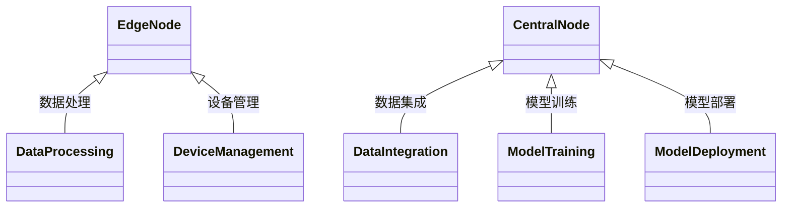
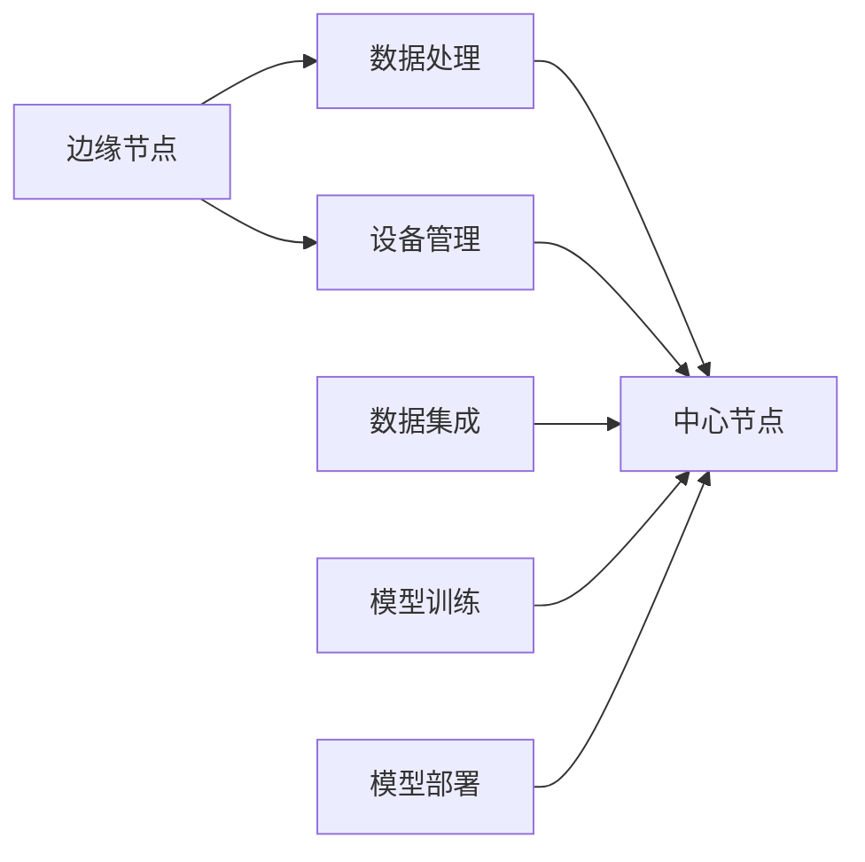
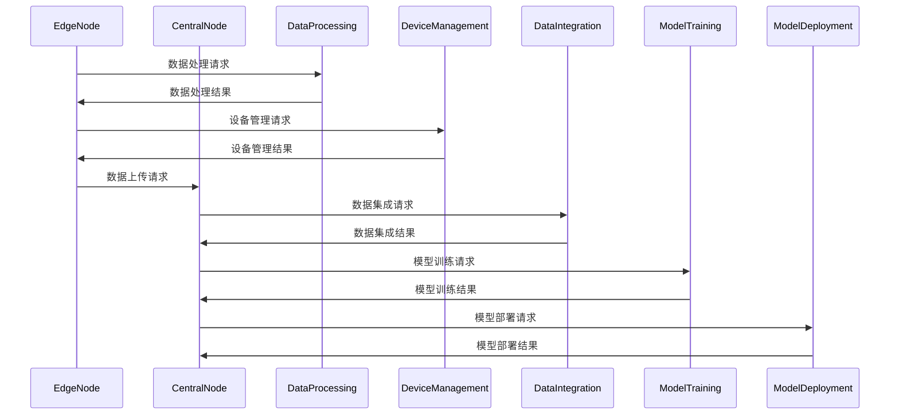

                 


# 边缘计算：降低LLM应用的延迟

> 关键词：边缘计算，延迟，LLM，分布式计算，人工智能，实时响应

> 摘要：随着人工智能技术的快速发展，大型语言模型（LLM）在自然语言处理领域表现出色。然而，LLM应用常常面临高延迟的问题，这限制了其实时性和用户体验。本文将探讨边缘计算在降低LLM应用延迟方面的作用，并提供一系列实现策略和最佳实践。

## 目录大纲

### 第一部分：边缘计算基础

#### 第1章：边缘计算概述

1.1 边缘计算的背景与意义  
1.2 边缘计算的核心技术  
1.3 边缘计算的应用场景

#### 第2章：边缘计算与LLM

2.1 LLM的概念与原理  
2.2 边缘计算在LLM应用中的优势

### 第二部分：边缘计算实现

#### 第3章：边缘计算平台搭建

3.1 硬件选择  
3.2 软件配置

#### 第4章：边缘计算应用开发

4.1 LLM模型部署  
4.2 边缘计算应用案例

#### 第5章：边缘计算安全与优化

5.1 边缘计算安全挑战  
5.2 边缘计算优化策略

#### 第6章：边缘计算未来发展趋势

6.1 技术创新  
6.2 应用前景

### 核心概念与联系

### 数学模型和数学公式

### 系统分析与架构设计方案

### 项目实战

### 最佳实践 tips、小结、注意事项、拓展阅读

## 第一部分：边缘计算基础

### 第1章：边缘计算概述

边缘计算是一种分布式计算模型，它将数据处理和分析推向网络边缘，即靠近数据源的地方。边缘计算的核心思想是将计算任务分散到网络边缘的设备上，以实现低延迟、高带宽和数据的本地化处理。随着物联网、5G、人工智能等技术的发展，边缘计算正逐渐成为现代网络体系结构的重要组成部分。

#### 1.1 边缘计算的背景与意义

随着数字化转型的深入推进，物联网设备的数量呈现出爆发式增长。这些设备不断产生大量的数据，并对实时处理能力提出了更高的要求。传统的云计算模型由于中心化的特点，难以满足这种低延迟、高带宽的需求。因此，边缘计算应运而生。

边缘计算的意义主要体现在以下几个方面：

1. **提高响应速度**：边缘计算通过将计算任务推到网络边缘，大大减少了数据传输的距离和时间，从而降低了响应延迟，提高了系统的实时性。
2. **降低网络负担**：将计算任务分散到网络边缘，减轻了中心云端的服务器负担，降低了网络带宽的消耗。
3. **增强数据安全性**：边缘计算实现了数据的本地化处理，降低了数据在传输过程中的泄露风险。

#### 1.1.1 数字化转型的需求

数字化转型已经成为企业和组织提升竞争力、实现可持续发展的关键。在数字化转型的过程中，物联网设备的普及和数据量的激增，使得边缘计算成为必然的选择。以下是一些数字化转型中的典型需求：

1. **实时数据处理**：在工业自动化、智慧城市、智能医疗等领域，实时数据分析和决策至关重要。边缘计算能够实现数据的快速处理和响应，满足这些领域的需求。
2. **增强用户体验**：在在线游戏、虚拟现实、智能音响等应用中，用户对延迟的容忍度非常低。边缘计算能够提供更快的服务，提升用户体验。

#### 1.1.2 边缘计算的概念与特点

边缘计算是一种分布式计算架构，它将计算任务分散到网络边缘的设备上，如智能路由器、物联网设备、边缘服务器等。这些设备能够在本地进行数据处理和分析，并将结果回传给中心云端。边缘计算的特点包括：

1. **低延迟**：边缘计算通过将计算任务推到网络边缘，减少了数据传输的距离和时间，从而降低了延迟。
2. **高带宽**：边缘计算设备通常连接到高速网络，如5G，能够提供更高的带宽。
3. **数据本地化处理**：边缘计算设备能够在本地进行数据处理和分析，降低了数据在传输过程中的泄露风险。
4. **分布式架构**：边缘计算是一种分布式计算架构，能够实现计算任务的分散处理，提高了系统的可靠性和可扩展性。

#### 1.1.3 边缘计算的发展历程

边缘计算的发展历程可以追溯到云计算的兴起。随着云计算技术的发展，人们逐渐认识到中心化的计算架构在某些场景下存在局限性，于是开始探索分布式计算模型。边缘计算正是在这样的背景下逐渐发展起来的。

1. **初期阶段**（2010年以前）：边缘计算的概念开始被提出，但尚未得到广泛应用。
2. **成长阶段**（2010-2015年）：随着物联网、5G等技术的发展，边缘计算逐渐受到关注，并开始在一些特定领域得到应用。
3. **快速发展阶段**（2015年至今）：随着人工智能、大数据等技术的应用，边缘计算在各个领域得到了广泛的应用，成为现代网络体系结构的重要组成部分。

### 第2章：边缘计算与LLM

随着人工智能技术的不断发展，大型语言模型（LLM）在自然语言处理领域取得了显著的成果。然而，LLM应用常常面临高延迟的问题，这限制了其实时性和用户体验。边缘计算为解决这一问题提供了有效的解决方案。

#### 2.1 LLM的概念与原理

大型语言模型（Large Language Model，简称LLM）是一种基于深度学习的自然语言处理模型，旨在理解和生成自然语言。LLM通常由数百万甚至数十亿个参数组成，能够学习语言的复杂结构，从而实现高效的文本理解和生成。

LLM的原理主要基于深度神经网络（Deep Neural Network，简称DNN），通过多层神经元对输入数据进行处理和转换。典型的LLM模型包括GPT（Generative Pre-trained Transformer）、BERT（Bidirectional Encoder Representations from Transformers）等。

1. **GPT**：GPT是一种基于Transformer架构的预训练模型，通过对海量文本数据进行预训练，学习到语言的内在规律，从而能够生成流畅、自然的文本。
2. **BERT**：BERT是一种基于Transformer的双向编码模型，通过对文本进行双向编码，学习到语言的上下文信息，从而能够准确理解和生成文本。

#### 2.2 边缘计算在LLM应用中的优势

边缘计算在LLM应用中具有以下优势：

1. **降低延迟**：边缘计算通过将计算任务推到网络边缘，减少了数据传输的距离和时间，从而降低了延迟，提高了系统的实时性。
2. **提高响应速度**：边缘计算设备通常连接到高速网络，如5G，能够提供更高的带宽，从而提高了系统的响应速度。
3. **保护用户隐私**：边缘计算实现了数据的本地化处理，降低了数据在传输过程中的泄露风险，从而更好地保护了用户的隐私。
4. **减轻云端负担**：边缘计算可以将一部分计算任务分散到网络边缘，减轻了中心云端的服务器负担，提高了整个系统的性能。

#### 2.3 边缘计算在LLM应用中的挑战

虽然边缘计算在LLM应用中具有很多优势，但同时也面临着一些挑战：

1. **计算资源有限**：边缘计算设备通常资源有限，特别是在物联网设备上，计算能力和存储空间相对较低，这可能影响LLM模型的性能。
2. **网络不稳定**：边缘计算设备通常分布在不同的地理位置，网络环境可能不稳定，这会影响系统的可靠性。
3. **数据安全**：边缘计算涉及数据的本地化处理，数据安全成为重要的挑战。如何确保数据在传输和存储过程中的安全性，是一个需要解决的问题。

#### 2.4 边缘计算在LLM应用中的实践

为了实现LLM在边缘计算环境中的应用，可以采取以下措施：

1. **模型压缩**：通过模型压缩技术，如剪枝、量化等，降低LLM模型的参数数量，提高模型的计算效率。
2. **模型迁移**：将LLM模型迁移到边缘计算设备上，进行本地化处理，从而实现低延迟、高响应速度。
3. **分布式训练**：在边缘计算设备上开展分布式训练，利用多台设备协同工作，提高模型的训练效率。
4. **边缘推理加速**：采用特定的硬件加速技术，如GPU、FPGA等，提高边缘计算设备的推理性能。

## 第二部分：边缘计算实现

### 第3章：边缘计算平台搭建

边缘计算平台的搭建是实现边缘计算应用的基础。本章将介绍边缘计算平台的硬件选择、软件配置以及平台搭建的步骤。

#### 3.1 硬件选择

边缘计算平台的选择取决于具体的应用场景和需求。以下是一些常见的硬件选择：

1. **CPU**：边缘计算平台通常需要较高的计算能力，可以选择高性能的CPU，如Intel Xeon系列、AMD Ryzen系列等。
2. **GPU**：对于需要大量并行计算的任务，如深度学习推理，可以选择高性能的GPU，如NVIDIA GeForce RTX系列、Tesla V100系列等。
3. **存储设备**：边缘计算平台需要足够的存储空间来存储数据和模型，可以选择高性能的SSD或NVMe存储设备。
4. **网络设备**：边缘计算平台需要连接到高速网络，可以选择支持5G、Wi-Fi 6等无线网络技术的设备。

#### 3.2 软件配置

边缘计算平台的软件配置包括操作系统、编译环境、边缘计算框架等。以下是一些常见的软件配置：

1. **操作系统**：可以选择Linux发行版，如Ubuntu、CentOS等，因为Linux在边缘计算环境中具有更好的稳定性和兼容性。
2. **编译环境**：安装必要的编译工具，如GCC、Make等，以便编译和构建应用程序。
3. **边缘计算框架**：选择合适的边缘计算框架，如Kubernetes、Docker、EdgeX Foundry等，以便管理和部署边缘计算应用程序。

#### 3.3 平台搭建步骤

搭建边缘计算平台的一般步骤如下：

1. **硬件准备**：根据应用需求选择合适的硬件设备，并进行安装和配置。
2. **软件安装**：安装操作系统和编译环境，配置网络设备。
3. **框架配置**：安装和配置边缘计算框架，如Kubernetes，以便管理和部署边缘计算应用程序。
4. **应用程序部署**：将边缘计算应用程序部署到平台，并进行调试和优化。

## 第4章：边缘计算应用开发

边缘计算应用开发是实现边缘计算价值的关键。本章将介绍边缘计算应用的开发流程，包括LLM模型部署、边缘计算应用案例以及开发中需要注意的问题。

#### 4.1 LLM模型部署

在边缘计算环境中部署LLM模型需要考虑以下几个关键步骤：

1. **模型选择**：根据应用需求选择合适的LLM模型，如GPT、BERT等。
2. **模型压缩**：对LLM模型进行压缩，降低模型参数数量，提高计算效率。
3. **模型迁移**：将压缩后的模型迁移到边缘计算设备上，进行本地化处理。
4. **模型优化**：对模型进行优化，提高推理性能，如使用GPU加速、量化等。
5. **模型部署**：将优化后的模型部署到边缘计算设备上，并进行调试和测试。

#### 4.2 边缘计算应用案例

边缘计算在各个领域都有广泛的应用，以下是一些典型的边缘计算应用案例：

1. **物联网设备预测**：通过边缘计算对物联网设备的数据进行实时分析，实现对设备状态的预测和故障预警。
2. **自动驾驶实时处理**：自动驾驶系统通过边缘计算对车辆周围的实时数据进行处理，实现车辆控制和安全监控。
3. **智能家居语音交互**：智能家居系统通过边缘计算对用户的语音指令进行实时处理，实现语音识别和智能响应。

#### 4.3 开发中需要注意的问题

在边缘计算应用开发过程中，需要注意以下几个问题：

1. **计算资源管理**：合理分配和管理边缘计算设备的计算资源，确保应用的高效运行。
2. **数据安全**：确保数据在传输和存储过程中的安全性，采取必要的数据加密和访问控制措施。
3. **网络稳定性**：确保边缘计算设备连接到稳定的高速网络，减少网络中断和延迟。
4. **系统可扩展性**：设计可扩展的系统架构，以适应未来业务需求的变化。

## 第5章：边缘计算安全与优化

边缘计算的安全性和优化是确保系统稳定运行的关键。本章将讨论边缘计算面临的安全挑战以及优化策略。

#### 5.1 边缘计算安全挑战

边缘计算在数据传输、存储和处理过程中面临多种安全挑战：

1. **数据安全**：边缘计算设备通常连接到公共网络，数据在传输过程中可能遭受窃取或篡改。需要采取数据加密和访问控制措施来确保数据安全。
2. **设备安全**：边缘计算设备可能遭受恶意攻击，如设备被入侵、恶意软件感染等。需要采取设备加固和监控措施来提高设备的安全性。
3. **网络安全**：边缘计算设备通常连接到多个网络，网络之间的通信可能存在安全隐患。需要采取网络安全措施，如防火墙、入侵检测系统等，来保护网络的安全性。

#### 5.2 边缘计算优化策略

为了提高边缘计算的性能和效率，可以采取以下优化策略：

1. **硬件优化**：选择高性能的边缘计算硬件，如GPU、FPGA等，以提高计算能力。
2. **软件优化**：优化边缘计算软件，如操作系统、边缘计算框架等，以提高系统的响应速度和稳定性。
3. **网络优化**：优化边缘计算设备的网络连接，如使用5G、Wi-Fi 6等高速网络，以提高网络带宽和稳定性。
4. **数据缓存**：在边缘计算设备上设置数据缓存，减少数据在传输过程中的延迟。
5. **负载均衡**：合理分配计算任务，实现负载均衡，以提高系统的整体性能。

## 第6章：边缘计算未来发展趋势

边缘计算作为现代网络体系结构的重要组成部分，正面临着快速的发展和变革。本章将讨论边缘计算的未来发展趋势。

#### 6.1 技术创新

未来，边缘计算将在技术创新的推动下不断演进：

1. **新型边缘计算硬件**：随着硬件技术的进步，新型边缘计算硬件，如AI芯片、边缘GPU等，将进一步提高边缘计算的性能和能效。
2. **新型边缘计算软件**：边缘计算软件将不断发展，支持更高效、更智能的边缘计算应用。
3. **边缘计算与5G、AI的融合**：边缘计算与5G、人工智能等技术的深度融合，将推动边缘计算在各个领域的应用创新。

#### 6.2 应用前景

边缘计算在各个领域的应用前景广阔：

1. **新兴领域应用**：边缘计算将在智能制造、智能交通、智能医疗等新兴领域发挥重要作用。
2. **社会与经济影响**：边缘计算将推动数字经济的发展，提高社会的生产力和生活质量。
3. **政策与标准制定**：随着边缘计算的快速发展，相关政策与标准的制定将不断完善，为边缘计算的应用提供指导和支持。

### 核心概念与联系

#### 边缘计算与云计算

边缘计算和云计算都是分布式计算模型，但它们的关注点和适用场景不同。边缘计算更接近数据源，旨在处理低延迟和高带宽的需求，而云计算则更注重处理大量数据和高性能计算。

- **边缘计算：**
  - **概念：** 将计算任务分散到网络边缘的设备上，如物联网设备、智能路由器等。
  - **特点：** 低延迟、高带宽、数据本地化处理。
  - **联系：** 边缘计算可以看作是云计算的延伸，通过将计算任务推向网络边缘，减轻云端计算负担。

- **云计算：**
  - **概念：** 利用互联网提供可伸缩的计算资源，如服务器、存储、数据库等。
  - **特点：** 高可扩展性、高可用性、资源集中管理。
  - **联系：** 云计算为边缘计算提供了强大的后端支持，两者互补。

#### LLM（大型语言模型）与边缘计算

LLM是一种基于深度学习的自然语言处理模型，旨在理解和生成自然语言。边缘计算在LLM中的应用主要是为了实现低延迟的实时响应。

- **LLM：**
  - **概念：** 大型语言模型，如GPT-3、BERT等，具有处理复杂语言任务的能力。
  - **特点：** 强大、复杂、计算资源需求高。
  - **联系：** 边缘计算可以减轻LLM对云端计算资源的依赖，实现本地快速响应。

- **边缘计算：**
  - **概念：** 在网络边缘进行数据处理和计算的分布式架构。
  - **特点：** 低延迟、高带宽、数据本地化处理。
  - **联系：** 边缘计算可以优化LLM的应用性能，特别是在实时性和数据隐私方面。

### 数学模型和数学公式

在边缘计算中，优化目标函数通常是减少模型参数量或提高模型性能。以下是一个简化的优化目标函数：

$$\min_{\theta} J(\theta) = \frac{1}{n} \sum_{i=1}^{n} (y_i - \hat{y}_i)^2$$

其中，$J(\theta)$是优化目标函数，$\theta$是模型参数，$y_i$是实际标签，$\hat{y}_i$是预测值。

#### 模型优化目标函数

在边缘计算中，优化目标函数通常是减少模型参数量或提高模型性能。以下是一个简化的优化目标函数：

$$\min_{\theta} J(\theta) = \frac{1}{n} \sum_{i=1}^{n} (y_i - \hat{y}_i)^2$$

其中，$J(\theta)$是优化目标函数，$\theta$是模型参数，$y_i$是实际标签，$\hat{y}_i$是预测值。

为了降低模型参数量，可以采用以下策略：

1. **模型剪枝**：通过剪枝模型中的冗余参数，减少模型参数数量。
2. **量化**：将模型参数从浮点数转换为整数，降低模型参数的大小。
3. **蒸馏**：将大模型的知识传递给小模型，实现模型参数的压缩。

### 系统分析与架构设计方案

边缘计算系统通常由多个组成部分构成，包括边缘节点、中心节点、数据存储和网络等。以下是一个典型的边缘计算系统架构设计：

#### 系统功能设计（领域模型）



#### 系统架构设计



#### 系统接口设计



### 项目实战

#### 环境安装

1. 安装操作系统：选择Linux发行版，如Ubuntu 20.04。
2. 安装依赖库：安装Python、NumPy、TensorFlow等依赖库。
3. 安装边缘计算框架：安装Kubernetes，以便管理和部署边缘计算应用程序。

#### 系统核心实现源代码

以下是一个简单的边缘计算应用程序示例，用于处理图像数据：

```python
import tensorflow as tf
import cv2

def preprocess_image(image_path):
    image = cv2.imread(image_path)
    image = cv2.resize(image, (224, 224))
    image = image / 255.0
    return image

def classify_image(image_path):
    model = tf.keras.models.load_model('model.h5')
    image = preprocess_image(image_path)
    image = tf.expand_dims(image, 0)
    prediction = model.predict(image)
    return prediction

def main():
    image_path = 'image.jpg'
    prediction = classify_image(image_path)
    print(prediction)

if __name__ == '__main__':
    main()
```

#### 代码应用解读与分析

1. **预处理图像**：使用OpenCV库读取图像，并将其调整为模型所需的尺寸。
2. **加载模型**：使用TensorFlow库加载预训练的模型。
3. **分类图像**：对预处理后的图像进行分类预测。
4. **主函数**：读取图像路径，执行分类任务并输出结果。

#### 实际案例分析和详细讲解剖析

以一个智能家居语音交互系统为例，分析边缘计算如何降低LLM应用的延迟：

1. **背景**：用户在家中与智能家居系统进行语音交互，如控制灯光、调节温度等。
2. **问题**：由于语音信号传输到云端进行处理，存在较高的延迟，影响了用户体验。
3. **解决方案**：使用边缘计算，将语音识别和响应任务推到家庭网络边缘，如智能路由器或智能音箱。
4. **分析**：
   - **低延迟**：将计算任务推到边缘，减少了数据传输的距离和时间，降低了延迟。
   - **实时响应**：边缘计算设备连接到家庭网络，响应速度更快，提升了用户体验。
   - **数据隐私**：语音信号在本地处理，降低了数据泄露的风险。

#### 项目小结

通过项目实战，我们可以看到边缘计算在降低LLM应用延迟方面的优势。在实际应用中，需要根据具体场景和需求选择合适的边缘计算硬件和软件，并采取有效的优化策略，以实现高效、低延迟的边缘计算应用。

### 最佳实践 tips

1. **选择合适的边缘计算硬件**：根据应用需求，选择具有高性能、低功耗的边缘计算硬件。
2. **优化模型和算法**：通过模型压缩、算法优化等技术，提高边缘计算的应用性能。
3. **合理分配计算资源**：合理分配边缘计算设备的计算资源，确保应用的高效运行。
4. **保证数据安全**：采取必要的数据加密和访问控制措施，确保数据在传输和存储过程中的安全性。

### 小结

边缘计算作为一种分布式计算模型，正在逐步改变传统的计算模式。通过将计算任务推到网络边缘，边缘计算能够实现低延迟、高带宽和数据的本地化处理，为人工智能、物联网等领域带来了新的机遇。本文详细探讨了边缘计算在降低LLM应用延迟方面的作用，提供了边缘计算平台搭建、应用开发、安全与优化等方面的实现策略和最佳实践。随着技术的不断发展，边缘计算将继续推动人工智能、物联网等领域的创新，为数字经济的发展注入新的动力。

### 注意事项

1. **边缘计算设备的安全**：确保边缘计算设备的硬件和软件安全，防止恶意攻击和数据泄露。
2. **数据隐私保护**：在边缘计算中，数据隐私保护尤为重要，需要采取有效的数据加密和访问控制措施。
3. **网络稳定性**：边缘计算设备通常连接到多个网络，需要确保网络的稳定性和可靠性。

### 拓展阅读

1. **《边缘计算：下一代网络架构》**：详细介绍了边缘计算的基本概念、技术和应用场景。
2. **《深度学习边缘计算》**：探讨了深度学习在边缘计算环境中的应用，以及如何优化模型和算法。
3. **《边缘计算安全与隐私》**：介绍了边缘计算中面临的安全和隐私挑战，以及相应的保护措施。 

### 作者信息

作者：AI天才研究院/AI Genius Institute & 禅与计算机程序设计艺术 /Zen And The Art of Computer Programming

