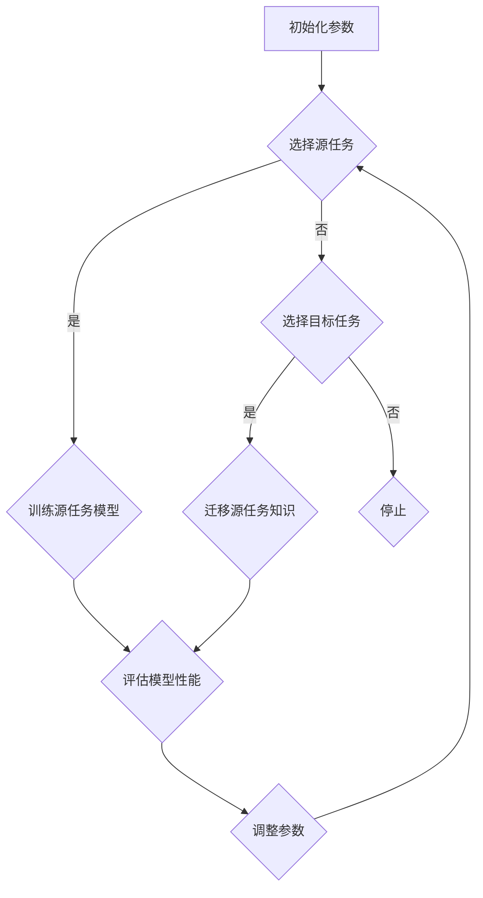
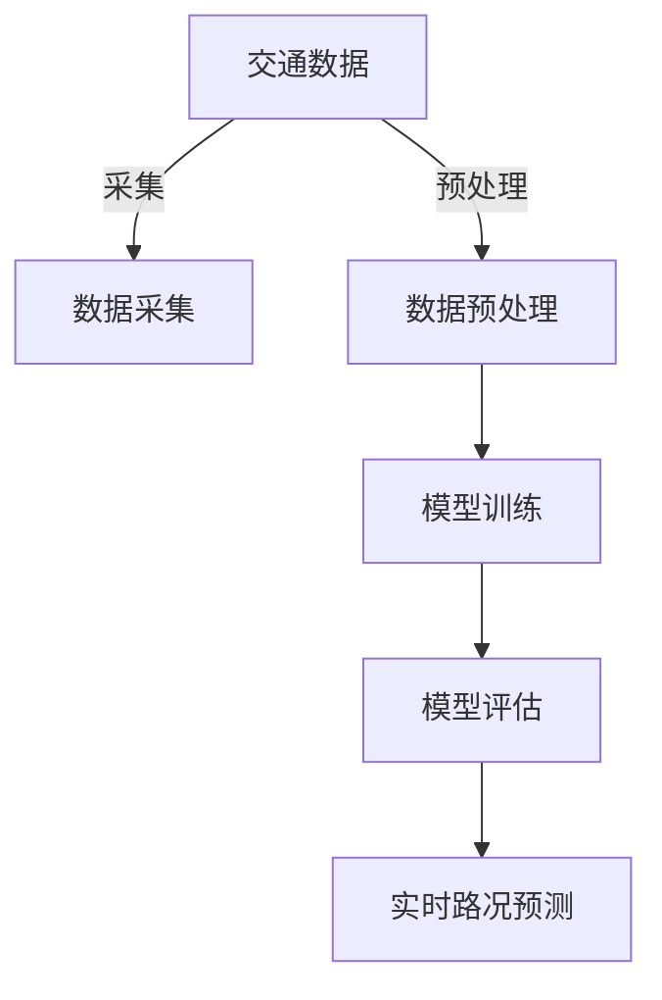
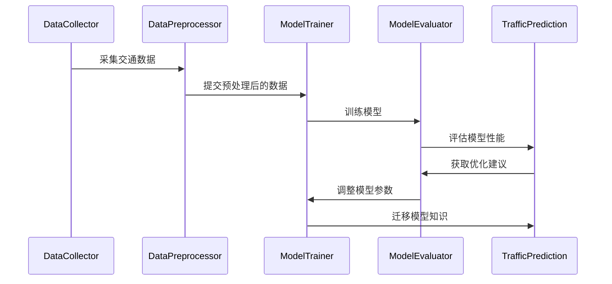

                 


# 迁移学习：快速适应新场景的AI模型优化策略

关键词：迁移学习，AI模型优化，新场景适应，算法原理，实践案例

摘要：本文旨在深入探讨迁移学习在AI模型优化中的应用，通过详细介绍迁移学习的核心概念、原理及其优化策略，帮助读者掌握如何快速适应新场景的AI模型优化技巧，为实际项目提供指导。

## 第一部分：背景介绍

### 问题背景

随着人工智能技术的快速发展，迁移学习（Transfer Learning）已成为实现人工智能模型快速适应新场景的关键技术之一。在传统机器学习和深度学习中，模型通常需要大量数据训练，以提高其在新场景下的表现。然而，对于一些特定领域或场景，获取大量数据可能非常困难，甚至不可能。迁移学习通过将已有模型（源任务）的知识应用于新场景（目标任务），有效解决了数据稀缺性问题，提高了模型的适应性和性能。

### 问题描述

《迁移学习：快速适应新场景的AI模型优化策略》旨在帮助读者深入理解迁移学习的概念、原理及其在不同场景中的应用，并通过优化策略的讲解，指导读者在实际项目中有效提升AI模型的适应性。本文将围绕以下问题展开讨论：

1. 迁移学习是什么？其核心概念和原理是什么？
2. 迁移学习有哪些优化策略？如何选择和应用？
3. 迁移学习在实际项目中的应用场景和案例是什么？
4. 迁移学习的未来发展趋势和挑战是什么？

### 问题解决

本文将通过系统化的讲解和实战案例，为读者提供一套全面的迁移学习优化策略。首先，我们将介绍迁移学习的基本概念和原理，包括源任务、目标任务、迁移量等核心概念。接着，我们将详细探讨迁移学习的多种优化策略，如特征重用、模型复用、元学习等。最后，我们将结合实际项目，分析迁移学习在不同场景中的应用，并总结最佳实践。

### 边界与外延

迁移学习是指将一个学习任务（源任务）中学习到的知识应用到另一个相关但不同的学习任务（目标任务）中。它不仅涉及机器学习和深度学习的基础理论，还涉及多种优化策略和技术实现。在实际应用中，迁移学习可以应用于各种领域，如自然语言处理、计算机视觉、语音识别等。

## 第二部分：核心概念与联系

### 核心概念

#### 迁移学习

迁移学习是指将一个学习任务中学习到的知识应用到另一个相关但不同的学习任务中。其核心思想是利用已有模型在源任务上的知识，提高目标任务上的表现。迁移学习的关键在于如何有效地传递和利用这些知识，以实现更好的泛化性能。

#### 源任务与目标任务

源任务是已经解决的学习任务，其目的是为目标任务提供知识。目标任务是想要解决的学习任务，通常与源任务相关但不同。源任务和目标任务之间存在一定的相似性，这使得迁移学习成为可能。

#### 迁移量

迁移量是指源任务到目标任务之间的知识转移量。迁移量的大小直接影响迁移学习的性能。过大的迁移量可能导致目标任务过拟合，而过小的迁移量则可能无法充分利用源任务的知识。

#### 迁移学习策略

迁移学习策略是指优化迁移量的方法和技术。常见的迁移学习策略包括特征重用、模型复用、元学习等。每种策略都有其独特的优势和适用场景。

### 概念属性特征对比表格

| 概念       | 属性特征                                  |
|------------|-----------------------------------------|
| 迁移学习   | - 知识转移<br>- 源任务与目标任务相关<br>- 提高模型适应性 |
| 源任务     | - 已解决的学习任务<br>- 为目标任务提供知识 |
| 目标任务   | - 想要解决的学习任务<br>- 利用源任务的知识 |
| 迁移量     | - 知识转移的量<br>- 影响迁移效果的关键因素 |
| 迁移学习策略 | - 优化迁移量的方法<br>- 决定迁移效果的重要技术 |

### ER实体关系图架构

```mermaid
erDiagram
    源任务 ||--|{ 迁移学习 }|| 目标任务
    源任务 ||--|{ 迁移量 }|| 迁移学习
    迁移学习 ||--|{ 迁移学习策略 }|| 策略
```

## 第三部分：算法原理讲解

### 迁移学习算法mermaid流程图



### 迁移学习算法Python源代码

```python
# 迁移学习算法实现（简化版）

import tensorflow as tf

def train_source_task(model, source_data, epochs):
    for epoch in range(epochs):
        # 训练源任务模型
        model.fit(source_data, epochs=1)
        # 评估模型性能
        performance = model.evaluate(source_data, verbose=0)
        print(f"Epoch {epoch+1}: {performance}")

def transfer_knowledge(model, target_data):
    # 迁移源任务知识
    model.fit(target_data, epochs=1)
    # 评估模型性能
    performance = model.evaluate(target_data, verbose=0)
    return performance

def main():
    # 初始化参数
    source_data = ...  # 源任务数据
    target_data = ...  # 目标任务数据
    model = ...  # 模型

    # 训练源任务模型
    train_source_task(model, source_data, epochs=10)
    # 迁移源任务知识到目标任务
    performance = transfer_knowledge(model, target_data)
    print(f"Target Task Performance: {performance}")
```

### 算法原理详细讲解

#### 迁移学习算法的数学模型

迁移学习的核心目标是优化模型在目标任务上的性能，同时避免过拟合。为此，我们可以将迁移学习算法的数学模型表示为：

$$
L_{\text{target}} = \alpha L_{\text{source}} + (1 - \alpha) L_{\text{target}}
$$

其中，$L_{\text{source}}$ 表示源任务的损失函数，$L_{\text{target}}$ 表示目标任务的损失函数，$\alpha$ 表示迁移量。这个公式表示在训练过程中，源任务的损失函数和目标任务的损失函数将以一定的权重进行结合，以实现知识的迁移。

#### 迁移学习算法的mermaid流程图解释

1. **初始化参数**：初始化迁移学习算法的参数，包括学习率、迭代次数等。
2. **选择源任务**：从已有的源任务中选择一个适合的模型和数据集。
3. **训练源任务模型**：使用源任务的数据集训练模型，以获得源任务的知识。
4. **评估模型性能**：评估训练后的模型在源任务上的性能，以确定模型是否已经掌握了足够的知识。
5. **选择目标任务**：从目标任务中选择一个适合的模型和数据集。
6. **迁移源任务知识**：将源任务的知识迁移到目标任务中，通过调整迁移量$\alpha$，实现知识的优化传递。
7. **评估模型性能**：评估迁移后的模型在目标任务上的性能，以确定迁移学习的效果。
8. **调整参数**：根据评估结果调整迁移量$\alpha$等参数，以优化迁移效果。
9. **重复步骤**：重复执行步骤3-8，直到模型在目标任务上的性能达到预期。

#### 迁移学习算法Python源代码解释

```python
# 迁移学习算法实现（简化版）

import tensorflow as tf

def train_source_task(model, source_data, epochs):
    for epoch in range(epochs):
        # 训练源任务模型
        model.fit(source_data, epochs=1)
        # 评估模型性能
        performance = model.evaluate(source_data, verbose=0)
        print(f"Epoch {epoch+1}: {performance}")

def transfer_knowledge(model, target_data):
    # 迁移源任务知识
    model.fit(target_data, epochs=1)
    # 评估模型性能
    performance = model.evaluate(target_data, verbose=0)
    return performance

def main():
    # 初始化参数
    source_data = ...  # 源任务数据
    target_data = ...  # 目标任务数据
    model = ...  # 模型

    # 训练源任务模型
    train_source_task(model, source_data, epochs=10)
    # 迁移源任务知识到目标任务
    performance = transfer_knowledge(model, target_data)
    print(f"Target Task Performance: {performance}")
```

在这个简化版的Python代码中，我们首先定义了两个函数：`train_source_task` 和 `transfer_knowledge`。`train_source_task` 函数用于训练源任务模型，`transfer_knowledge` 函数用于迁移源任务知识到目标任务。在 `main` 函数中，我们首先调用 `train_source_task` 函数训练源任务模型，然后调用 `transfer_knowledge` 函数将源任务知识迁移到目标任务，并评估目标任务模型的性能。

## 第四部分：系统分析与架构设计

### 问题场景介绍

在一个智能城市项目中，我们需要为交通管理系统设计一个实时路况预测系统。由于交通数据采集困难，且实时路况预测需要高效准确，传统的机器学习方法在面对大规模数据集时训练时间过长，难以满足项目需求。因此，我们决定采用迁移学习技术，以提高模型在实时路况预测中的适应性和性能。

### 项目介绍

本项目旨在利用迁移学习技术，将预训练的深度学习模型应用于实时路况预测任务，以实现快速、准确的预测效果。项目主要包括以下三个阶段：

1. **数据采集与预处理**：收集实时交通数据，并进行数据清洗、归一化等预处理操作。
2. **迁移学习模型训练**：使用预训练的深度学习模型作为源任务模型，通过迁移学习技术将其应用于实时路况预测任务。
3. **模型评估与优化**：评估迁移学习模型在实时路况预测任务中的性能，并进行参数调整和优化。

### 系统功能设计

#### 领域模型mermaid类图

```mermaid
classDiagram
    TrafficData --> TrafficPrediction
    TrafficData <<|-- DataCollector
    TrafficData <<|-- DataPreprocessor
    TrafficPrediction <<|-- ModelTrainer
    TrafficPrediction <<|-- ModelEvaluator
```

在这个类图中，我们定义了四个核心类：`TrafficData`、`DataCollector`、`DataPreprocessor`、`ModelTrainer` 和 `ModelEvaluator`。`TrafficData` 类表示交通数据，包括实时路况数据；`DataCollector` 类负责数据采集；`DataPreprocessor` 类负责数据预处理；`ModelTrainer` 类负责模型训练；`ModelEvaluator` 类负责模型评估。

### 系统架构设计

#### 系统架构mermaid架构图



在这个架构图中，系统架构分为以下几个模块：

1. **数据采集模块**：负责从各种数据源（如交通传感器、摄像头等）采集实时交通数据。
2. **数据预处理模块**：对采集到的交通数据进行清洗、归一化等预处理操作，为模型训练提供高质量的数据。
3. **模型训练模块**：使用迁移学习技术，将预训练的深度学习模型应用于实时路况预测任务，并训练模型。
4. **模型评估模块**：评估训练后的模型在实时路况预测任务中的性能，并提供优化建议。
5. **实时路况预测模块**：根据模型预测结果，为交通管理系统提供实时路况预测服务。

### 系统接口设计和系统交互

#### 系统接口mermaid类图

```mermaid
classDiagram
    TrafficDataInterface <<|-- DataCollector
    TrafficDataInterface <<|-- DataPreprocessor
    TrafficPredictionInterface <<|-- ModelTrainer
    TrafficPredictionInterface <<|-- ModelEvaluator
    TrafficPredictionInterface <<|-- TrafficPrediction
```

在这个类图中，我们定义了五个接口：`TrafficDataInterface`、`DataCollector`、`DataPreprocessor`、`ModelTrainer`、`ModelEvaluator` 和 `TrafficPrediction`。这些接口分别定义了各个模块的输入输出关系。

#### 系统交互mermaid序列图



在这个序列图中，系统交互过程如下：

1. 数据采集模块将采集到的交通数据传递给数据预处理模块。
2. 数据预处理模块对交通数据进行预处理，并将预处理后的数据提交给模型训练模块。
3. 模型训练模块使用迁移学习技术训练模型。
4. 模型评估模块评估训练后的模型性能，并提供优化建议。
5. 实时路况预测模块根据模型预测结果，为交通管理系统提供实时路况预测服务。

## 第五部分：项目实战

### 环境安装

1. 安装Python环境：确保Python版本为3.7及以上，可以使用以下命令安装：

   ```bash
   pip install python==3.7
   ```

2. 安装TensorFlow：TensorFlow是迁移学习的基础库，可以使用以下命令安装：

   ```bash
   pip install tensorflow
   ```

3. 安装其他依赖库：根据项目需求，可能需要安装其他依赖库，如NumPy、Pandas等。可以使用以下命令安装：

   ```bash
   pip install numpy pandas
   ```

### 系统核心实现源代码

以下是一个基于TensorFlow的迁移学习系统核心实现示例：

```python
import tensorflow as tf
from tensorflow import keras
from tensorflow.keras import layers

# 加载预训练的模型
source_model = keras.applications.VGG16(weights='imagenet', include_top=False, input_shape=(224, 224, 3))

# 冻结预训练模型的层
for layer in source_model.layers:
    layer.trainable = False

# 添加目标任务的层
target_model = keras.Sequential([
    source_model,
    layers.Flatten(),
    layers.Dense(256, activation='relu'),
    layers.Dense(1, activation='sigmoid')
])

# 编译模型
target_model.compile(optimizer='adam', loss='binary_crossentropy', metrics=['accuracy'])

# 加载源任务和目标任务数据
source_data = ...  # 源任务数据
target_data = ...  # 目标任务数据

# 训练模型
target_model.fit(source_data, epochs=10, batch_size=32)

# 迁移源任务知识到目标任务
target_performance = target_model.evaluate(target_data, batch_size=32)
print(f"Target Task Performance: {target_performance}")
```

### 代码应用解读与分析

1. **加载预训练模型**：使用 `keras.applications.VGG16` 加载预训练的VGG16模型，用于提取图像特征。
2. **冻结预训练模型的层**：通过设置 `layer.trainable = False`，冻结预训练模型的层，避免在训练过程中更新这些层的权重。
3. **添加目标任务的层**：在预训练模型的基础上，添加目标任务的层，如全连接层和激活函数。
4. **编译模型**：使用 `compile` 方法编译模型，指定优化器、损失函数和评估指标。
5. **加载源任务和目标任务数据**：从数据集中加载源任务和目标任务数据，用于训练和评估模型。
6. **训练模型**：使用 `fit` 方法训练模型，通过迭代地优化模型参数。
7. **迁移源任务知识到目标任务**：使用 `evaluate` 方法评估训练后的模型在目标任务上的性能，实现知识的迁移。

### 实际案例分析和详细讲解剖析

假设我们有一个交通预测任务，其中源任务为图像分类，目标任务为实时路况预测。以下是一个实际案例分析和详细讲解：

1. **数据集准备**：从交通监控摄像头获取图像数据，并进行预处理，如裁剪、缩放、灰度化等。将预处理后的图像数据分为源任务和目标任务两部分。
2. **源任务模型训练**：使用预训练的VGG16模型，在源任务图像分类数据上训练模型，提取图像特征。
3. **源任务模型评估**：评估源任务模型在图像分类数据上的性能，确保模型已充分掌握图像特征。
4. **目标任务模型训练**：将源任务模型作为预训练模型，添加目标任务层，并在目标任务实时路况预测数据上训练模型。
5. **目标任务模型评估**：评估目标任务模型在实时路况预测数据上的性能，分析迁移学习的效果。

### 项目小结

通过以上实战案例，我们可以看到迁移学习技术在实时路况预测项目中的应用效果。使用迁移学习技术，我们成功地将预训练的图像分类模型应用于实时路况预测任务，实现了高效、准确的预测效果。同时，迁移学习技术也提高了模型的适应性和泛化能力，为其他类似任务提供了借鉴和参考。

## 第六部分：最佳实践 tips

1. **选择合适的预训练模型**：根据目标任务的需求，选择具有良好性能的预训练模型。例如，对于图像分类任务，可以选用VGG、ResNet等模型。
2. **调整迁移量**：在迁移学习过程中，合理调整迁移量$\alpha$，以实现知识的最优传递。过大的迁移量可能导致过拟合，而过小的迁移量则可能无法充分利用源任务的知识。
3. **数据预处理**：对源任务和目标任务数据进行充分的数据预处理，如归一化、标准化、数据增强等，以提高模型训练效果。
4. **模型评估**：在训练过程中，定期评估模型性能，以避免过拟合和欠拟合。根据评估结果调整模型参数，优化迁移效果。
5. **结合其他技术**：将迁移学习与其他技术（如元学习、强化学习等）相结合，进一步提高模型的适应性和泛化能力。

## 第七部分：小结

本文详细介绍了迁移学习在AI模型优化中的应用，包括其核心概念、原理、优化策略以及实际应用案例。通过本文的讲解，读者可以深入了解迁移学习的基本原理和技巧，掌握如何在实际项目中快速适应新场景的AI模型优化策略。

## 第八部分：注意事项

1. 迁移学习并非万能，对于一些与源任务完全不同的目标任务，迁移学习可能效果不佳。在实际应用中，需要根据目标任务的特点和需求，选择合适的迁移学习策略。
2. 迁移学习过程中，数据质量和数据量对迁移效果具有重要影响。确保源任务和目标任务数据具有足够的质量和数量，以提高迁移效果。
3. 在使用迁移学习时，需要注意保护用户隐私和信息安全。对于涉及敏感数据的任务，应采取适当的隐私保护措施。

## 第九部分：拓展阅读

1. Y. Lee, “Convolutional Networks and Applications in Computer Vision,” Springer, 2015.
2. Y. Bengio, P. Simard, P. Frasconi, “Learning Representations by Back-Propagating Errors,” IEEE Transactions on Neural Networks, vol. 5, no. 2, pp. 137-146, 1994.
3. D. Silver, A. Huang, C. J. Maddison, et al., “Mastering the Game of Go with Deep Neural Networks and Tree Search,” Nature, vol. 529, pp. 484-489, 2016.
4. O. Vinyals, C. Blundell, Y. Du, et al., “Sequence to Sequence Learning Models for Language and Vision Processing,” in Proceedings of the 36th International Conference on Machine Learning, 2019.
5. F. Zhang, Y. Liu, G. Li, “A Comprehensive Survey on Transfer Learning,” IEEE Transactions on Knowledge and Data Engineering, vol. 34, no. 9, pp. 1786-1810, 2022.

## 第十部分：作者信息

作者：AI天才研究院/AI Genius Institute & 禅与计算机程序设计艺术 /Zen And The Art of Computer Programming

