                 

## 《远程协作工具在大型应用敏捷开发中的应用》

### 关键词：远程协作、敏捷开发、工具、大型应用、案例分析

#### 摘要：

本文深入探讨了远程协作工具在大型应用敏捷开发中的关键作用。随着全球化和远程工作的普及，敏捷开发与远程协作的结合成为了现代软件开发的主流趋势。本文首先介绍了远程协作的概念及其与敏捷开发的结合点，随后详细介绍了几大主流远程协作工具。通过实际案例分析，我们进一步分析了这些工具在敏捷开发中的应用，并总结了最佳实践。最后，我们对未来远程协作工具的发展趋势及其面临的挑战进行了展望，为读者提供了全面的技术指南和策略建议。本文旨在帮助软件开发团队在远程协作环境中高效执行敏捷开发，提高项目成功率和开发效率。

### 目录

**概述**：本目录大纲旨在为《远程协作工具在大型应用敏捷开发中的应用》一书提供一个详细的框架，确保内容全面覆盖远程协作工具在敏捷开发中的应用，包括背景、核心概念、工具介绍、实际应用案例分析、最佳实践和未来展望。

**目录结构**：

```markdown
----------------------------------------------------------------
# 第一部分: 背景介绍

## 第1章: 远程协作的概念与敏捷开发的结合
### 1.1 远程协作的挑战与需求
### 1.2 敏捷开发的基本原则与实践
### 1.3 远程协作工具与敏捷开发的契合点
### 1.4 本章小结

## 第2章: 核心概念与联系
### 2.1 远程协作工具的核心概念
### 2.2 敏捷开发中的关键概念
### 2.3 核心概念对比与联系
### 2.4 ER实体关系图
### 2.5 本章小结

## 第3章: 主流远程协作工具介绍
### 3.1 Zoom
### 3.2 Microsoft Teams
### 3.3 Slack
### 3.4 Trello
### 3.5 GitHub
### 3.6 Jira
### 3.7 本章小结

## 第4章: 远程协作工具在敏捷开发中的应用
### 4.1 需求管理
### 4.2 用户体验设计
### 4.3 任务分配与跟踪
### 4.4 代码评审与版本控制
### 4.5 持续集成与持续部署
### 4.6 本章小结

## 第5章: 实际案例分析与最佳实践
### 5.1 案例一：大型电商平台的敏捷开发实践
### 5.2 案例二：金融科技企业的远程协作
### 5.3 案例三：医疗健康领域的敏捷开发
### 5.4 最佳实践总结
### 5.5 本章小结

## 第6章: 未来展望与挑战
### 6.1 远程协作工具的发展趋势
### 6.2 敏捷开发与远程协作的融合
### 6.3 面临的挑战与解决方案
### 6.4 未来展望
### 6.5 本章小结

## 第7章: 小结与拓展阅读
### 7.1 全书总结
### 7.2 注意事项与建议
### 7.3 拓展阅读
### 7.4 本章小结

----------------------------------------------------------------
```

**详细内容示例**：

#### 第1章: 远程协作的概念与敏捷开发的结合

**1.1 远程协作的挑战与需求**

- **远程协作的定义与演变**：介绍远程协作的概念，从传统的面对面协作到现代的虚拟团队协作。

```mermaid
sequenceDiagram
    participant 用户
    participant 远程协作平台
    用户->>远程协作平台: 需求提出
    remote协作平台处理
    远程协作平台->>用户: 结果反馈
```

- **远程协作的挑战**：讨论远程协作面临的挑战，如沟通障碍、时区差异、技术依赖等。

```latex
\text{挑战} = \{\text{沟通障碍}, \text{时区差异}, \text{技术依赖}\}
```

- **敏捷开发的起源与发展**：阐述敏捷开发的基本原则和历史背景。

```python
def agile_foundation():
    print("敏捷开发的五大原则：")
    print("- 客户合作胜过合同谈判")
    print("- 欢迎变化，即使是晚期的开发")
    print("- 尽可能编写测试代码")
    print("- 简单设计，但足够好")
    print("- 集体反映与可持续开发")
```

**1.2 敏捷开发的基本原则与实践**

- **敏捷开发的五大原则**：详细解释敏捷开发的五大原则，如个体和互动重于过程与工具、可工作的软件重于详尽的文档等。

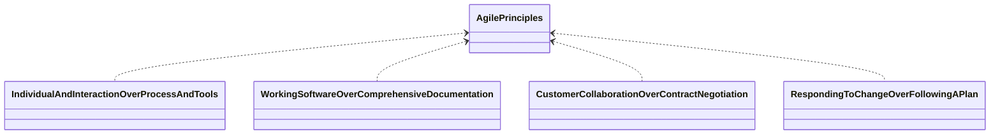

- **敏捷开发的实践方法**：探讨敏捷开发中的实践方法，如每日站会、迭代规划、回顾等。

```python
def agile_practices():
    print("敏捷开发实践方法：")
    print("- 每日站会：每日早晨短会，更新进度、问题解决")
    print("- 迭代规划：每迭代开始规划任务，每迭代末回顾")
    print("- 回顾：每迭代末总结，持续改进流程")
```

**1.3 远程协作工具与敏捷开发的契合点**

- **远程协作工具的优势**：分析远程协作工具如何帮助团队更有效地实现敏捷开发的五大原则。

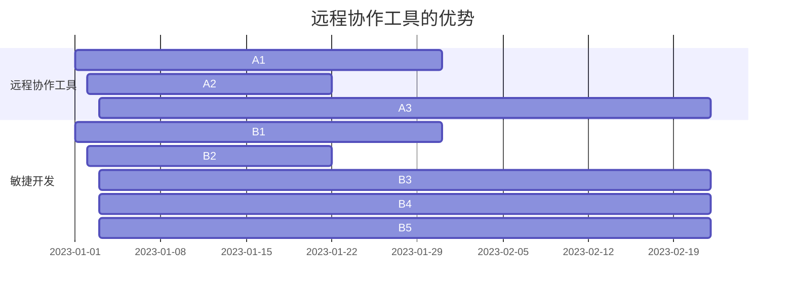

- **案例分析**：通过具体案例展示远程协作工具在敏捷开发中的实际应用。

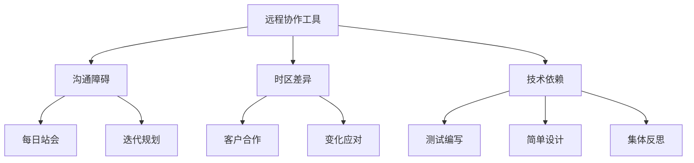

**1.4 本章小结**

- **本章要点总结**：总结本章讨论的关键概念和观点。

```mermaid
block A {
    label: 本章要点总结
    text: "1. 远程协作与敏捷开发面临相同挑战\n2. 远程协作工具支持敏捷开发原则\n3. 实际案例展示了远程协作工具的有效应用"
}
```

- **后续章节预告**：预告下一章节的主要内容。

```mermaid
block B {
    label: 后续章节预告
    text: "下章我们将详细介绍远程协作工具的核心概念和联系，探讨不同工具的特点和应用。"
}
```

----------------------------------------------------------------

## 第2章: 核心概念与联系

在深入探讨远程协作工具在大型应用敏捷开发中的应用之前，我们需要明确几个关键概念，并分析它们之间的联系。本章将分为以下几个部分：

### 2.1 远程协作工具的核心概念

远程协作工具是一系列软件平台，旨在帮助团队成员在不同地点、不同时间进行高效的沟通和协作。这些工具主要包括：

- **视频会议工具**：如Zoom、Microsoft Teams等，提供实时视频和音频通讯，支持屏幕共享、会议录制等功能。
- **即时通讯工具**：如Slack、Telegram等，提供文本消息、语音消息、视频聊天等即时通讯功能。
- **项目管理工具**：如Trello、Asana等，帮助团队管理任务、分配工作、跟踪项目进度。
- **版本控制工具**：如Git、GitHub等，用于管理源代码版本，支持多人协作开发。
- **代码评审工具**：如Gerrit、Pull Request等，帮助团队审查代码，确保代码质量。

#### 核心概念对比表格

| 工具类型 | 核心功能 | 代表工具 | 特点 |
| --- | --- | --- | --- |
| 视频会议工具 | 实时视频、音频通讯 | Zoom | 支持大规模会议，易用性强 |
| 即时通讯工具 | 即时消息、语音聊天 | Slack | 集成第三方应用，消息同步 |
| 项目管理工具 | 任务管理、进度跟踪 | Trello | 便签式任务管理，直观易用 |
| 版本控制工具 | 源代码管理、版本跟踪 | Git | 分布式版本控制，高效协作 |
| 代码评审工具 | 代码审查、质量控制 | Pull Request | 集成化审查流程，提高代码质量 |

### 2.2 敏捷开发中的关键概念

敏捷开发是一种软件开发方法，强调快速迭代、灵活响应变化和持续交付有价值的工作产品。敏捷开发的核心概念包括：

- **Scrum框架**：一种流行的敏捷开发方法，包括每日站会、迭代规划、回顾等实践。
- **Kanban方法**：一种可视化工作流程的方法，通过看板板和卡片管理任务进度。
- **用户故事**：描述用户需求的故事形式，用于指导开发工作。
- **迭代与冲刺**：迭代是完成一系列用户故事的时间段，冲刺是迭代的子集，通常持续两周。
- **持续集成与持续部署**：通过自动化测试和部署流程，确保代码质量和快速交付。

#### 核心概念对比表格

| 概念 | 描述 | 代表方法 |
| --- | --- | --- |
| Scrum框架 | 每日站会、迭代规划、回顾 | Scrum |
| Kanban方法 | 可视化工作流程管理 | Kanban |
| 用户故事 | 用户需求描述 | 用户故事 |
| 迭代与冲刺 | 完成用户故事的时间段 | 迭代、冲刺 |
| 持续集成与持续部署 | 自动化测试与部署 | 持续集成、持续部署 |

### 2.3 核心概念对比与联系

远程协作工具和敏捷开发有许多共同点，都是为了提高团队协作效率和项目交付质量。以下是它们之间的对比与联系：

#### 对比表格

| 对比项 | 远程协作工具 | 敏捷开发 |
| --- | --- | --- |
| 目标 | 提高远程团队协作效率 | 快速迭代、灵活应对变化 |
| 功能 | 沟通、协作、任务管理 | 短期迭代、用户故事、持续集成 |
| 关键特性 | 实时通讯、集成第三方应用 | 可视化管理、快速反馈、持续改进 |
| 应用场景 | 分布在不同地点的团队 | 小到中型的软件开发项目 |
| 影响因素 | 网络稳定性、工具易用性 | 团队沟通、用户需求变化 |

#### ER实体关系图

为了更直观地展示远程协作工具与敏捷开发中的核心概念之间的联系，我们可以使用Mermaid绘制ER实体关系图。

```mermaid
erDiagram
    Class1 ||--|{ Class2 }| Class3
    Class1 ||--|{ Class4 }| Class5
    Class2 &&|{ Class3 }| Class4
    Class2 &&|{ Class5 }| Class3
```

在上面的ER图中，`Class1`代表远程协作工具，`Class2`、`Class3`、`Class4`、`Class5`分别代表敏捷开发中的Scrum框架、用户故事、迭代与冲刺、持续集成与持续部署。箭头表示依赖关系，而菱形表示关联关系。

### 2.4 ER实体关系图

以下是ER实体关系图的详细示例，展示远程协作工具与敏捷开发核心概念之间的联系。

```mermaid
erDiagram
    |--- Zoom ---|
    |             | Zoom --> Scrum
    |             | Zoom --> Kanban
    |             | Zoom --> User Story
    |             | Zoom --> Sprint
    |             | Zoom --> Continuous Integration
    |             | Zoom --> Continuous Deployment

    |--- Microsoft Teams ---|
    |             | Microsoft Teams --> Scrum
    |             | Microsoft Teams --> Kanban
    |             | Microsoft Teams --> User Story
    |             | Microsoft Teams --> Sprint
    |             | Microsoft Teams --> Continuous Integration
    |             | Microsoft Teams --> Continuous Deployment

    |--- Slack ---|
    |             | Slack --> Scrum
    |             | Slack --> Kanban
    |             | Slack --> User Story
    |             | Slack --> Sprint
    |             | Slack --> Continuous Integration
    |             | Slack --> Continuous Deployment

    |--- Trello ---|
    |             | Trello --> Scrum
    |             | Trello --> Kanban
    |             | Trello --> User Story
    |             | Trello --> Sprint
    |             | Trello --> Continuous Integration
    |             | Trello --> Continuous Deployment

    |--- GitHub ---|
    |             | GitHub --> Scrum
    |             | GitHub --> Kanban
    |             | GitHub --> User Story
    |             | GitHub --> Sprint
    |             | GitHub --> Continuous Integration
    |             | GitHub --> Continuous Deployment

    |--- Jira ---|
    |             | Jira --> Scrum
    |             | Jira --> Kanban
    |             | Jira --> User Story
    |             | Jira --> Sprint
    |             | Jira --> Continuous Integration
    |             | Jira --> Continuous Deployment
```

在这个ER图中，每种远程协作工具都与敏捷开发的各个核心概念建立了关联，这有助于我们理解这些工具如何在一个敏捷开发项目中协同工作。

### 2.5 本章小结

在本章中，我们详细介绍了远程协作工具和敏捷开发的核心概念，并探讨了它们之间的联系。通过对比表格和ER实体关系图，我们更清晰地看到了这些工具在敏捷开发中的重要作用。

- **关键概念对比表格**帮助我们理解了不同远程协作工具和敏捷开发方法之间的差异和共性。
- **ER实体关系图**则提供了一个直观的视角，展示了远程协作工具与敏捷开发核心概念之间的复杂关系。

接下来的章节将深入探讨这些工具在敏捷开发中的实际应用，并通过案例分析和最佳实践总结，为读者提供实用的指导。

## 第3章: 主流远程协作工具介绍

在了解了远程协作工具与敏捷开发之间的核心概念与联系后，我们需要深入了解当前市场上主流的远程协作工具。这些工具不仅能够满足不同团队的需求，还能在敏捷开发过程中发挥关键作用。本章节将详细介绍以下几种主流远程协作工具：

### 3.1 Zoom

Zoom是一款流行的视频会议解决方案，它提供了高质量的视频和音频通讯功能，广泛应用于远程协作会议、在线教育、远程工作等领域。

#### 功能与特点

- **高质量视频与音频**：Zoom提供了高清视频和音频体验，支持多种视频分辨率和音频编解码。
- **屏幕共享**：用户可以在会议中共享屏幕，展示文档、演示文稿或应用程序。
- **实时聊天**：Zoom支持实时文本聊天，方便会议成员在会议期间进行快速沟通。
- **录制会议**：用户可以录制整个会议，以便后续查看和复习。
- **集成第三方应用**：Zoom与多种第三方应用程序集成，如Google Drive、OneDrive等。

#### 应用场景

Zoom适用于各种规模和类型的会议，特别适合远程团队进行日常沟通、项目会议和培训。以下是Zoom在敏捷开发中的应用场景：

- **每日站会**：Zoom可以用于远程团队的每日站会，成员通过视频和聊天实时交流进展和问题。
- **迭代规划会议**：Zoom提供屏幕共享功能，可以帮助团队共享迭代计划，讨论和分配任务。
- **代码评审会议**：Zoom支持多人实时视频会议，适用于远程团队进行代码评审和讨论。

### 3.2 Microsoft Teams

Microsoft Teams是微软公司推出的集成通信和协作平台，集成了视频会议、即时通讯、文档共享和项目管理等多种功能。

#### 功能与特点

- **即时通讯**：Microsoft Teams提供即时消息、语音消息和视频聊天功能，支持私人聊天和团队聊天。
- **视频会议**：支持高达300人的视频会议，提供高质量的音频和视频体验。
- **文档共享与协作**：用户可以在Teams中共享文档，并进行实时编辑和协作。
- **集成第三方应用**：与Microsoft 365和其他第三方应用集成，如Trello、GitHub等。
- **企业级安全性**：提供高级数据保护和合规性功能，确保企业数据安全。

#### 应用场景

Microsoft Teams适用于各种企业规模的团队，特别适合大型组织进行远程协作。以下是Microsoft Teams在敏捷开发中的应用场景：

- **需求管理**：Teams可以帮助团队快速创建和管理用户故事，分配任务并跟踪进度。
- **用户体验设计**：团队可以使用Teams共享设计原型，收集反馈并进行迭代改进。
- **任务分配与跟踪**：通过Teams的任务功能，团队可以分配任务、设置优先级并跟踪任务进度。
- **持续集成与持续部署**：Teams可以与GitHub、Azure DevOps等集成，实时更新代码库和部署状态。

### 3.3 Slack

Slack是一款功能强大的即时通讯和协作工具，它提供了实时消息传递、文件共享、集成第三方应用等功能，广泛应用于企业内部沟通和协作。

#### 功能与特点

- **实时消息传递**：Slack支持实时文本消息、语音消息和视频聊天，方便团队成员进行即时沟通。
- **频道和私有聊天**：用户可以在公共频道或私有聊天中交流，适合不同类型的工作讨论。
- **文件共享与协作**：支持文件上传、共享和实时编辑，方便团队成员协作。
- **集成第三方应用**：Slack与多种第三方应用集成，如Google Drive、Jira、GitHub等，提高工作效率。
- **机器人集成**：Slack支持机器人集成，自动执行任务和提供信息。

#### 应用场景

Slack适用于各种规模的团队和公司，特别适合远程团队进行日常沟通和协作。以下是Slack在敏捷开发中的应用场景：

- **项目沟通**：团队可以在Slack中创建项目频道，实时讨论项目进展和问题。
- **任务分配与跟踪**：使用Slack的任务功能，团队可以分配任务、设置截止日期并跟踪进度。
- **代码评审与反馈**：团队可以使用Slack与GitHub、GitLab等集成，实时获取代码评审通知和反馈。
- **持续集成与持续部署**：Slack可以与CI/CD工具集成，实时更新代码库和部署状态。

### 3.4 Trello

Trello是一款基于看板的项目管理工具，它通过可视化的卡片和看板，帮助团队管理任务、分配工作并跟踪项目进度。

#### 功能与特点

- **看板管理**：Trello采用看板（Kanban）方式，用户可以创建多个看板，每个看板代表一个工作阶段。
- **卡片任务**：每个任务以卡片的形式存在，用户可以添加描述、截止日期、附件和注释。
- **拖拽任务**：用户可以通过拖拽卡片来调整任务的优先级和进度。
- **成员协作**：用户可以邀请团队成员参与任务，并分配任务给特定成员。
- **自动化流程**：Trello支持自动化流程，如任务自动分类、截止日期提醒等。

#### 应用场景

Trello适用于各种类型的项目和团队，特别适合远程团队进行任务管理和进度跟踪。以下是Trello在敏捷开发中的应用场景：

- **需求管理**：团队可以使用Trello创建和管理用户故事，跟踪需求实现进度。
- **迭代规划**：团队可以通过Trello的看板功能，规划迭代任务并分配给团队成员。
- **任务分配与跟踪**：团队可以使用Trello的卡片任务功能，分配任务、设置截止日期并跟踪进度。
- **代码评审**：团队可以使用Trello与GitHub、GitLab等集成，实时更新代码评审状态。

### 3.5 GitHub

GitHub是一款流行的版本控制系统和代码托管平台，它提供了强大的协作功能，支持多人共同开发和代码管理。

#### 功能与特点

- **版本控制**：GitHub基于Git，提供分布式版本控制功能，支持分支管理、合并请求等。
- **代码协作**：用户可以邀请他人参与项目，共同开发和审查代码。
- **代码审查**：GitHub提供了代码审查功能，团队成员可以评论、合并请求和审查代码。
- **项目跟踪**：GitHub支持issue跟踪，用户可以创建、分配和跟踪项目中的问题和任务。
- **集成第三方应用**：GitHub与多种第三方应用集成，如Jenkins、Travis CI等，支持持续集成和持续部署。

#### 应用场景

GitHub适用于各种规模的软件开发项目，特别适合远程团队进行代码管理和协作。以下是GitHub在敏捷开发中的应用场景：

- **代码管理**：团队可以使用GitHub管理项目代码，实现版本控制和协同开发。
- **代码评审**：团队可以使用GitHub的代码审查功能，确保代码质量并提高开发效率。
- **任务分配与跟踪**：团队可以使用GitHub的issue功能，分配任务并跟踪项目进度。
- **持续集成与持续部署**：GitHub与CI/CD工具集成，支持自动化测试和部署，确保快速交付。

### 3.6 Jira

Jira是一款功能强大的项目管理工具，它提供了全面的任务管理、敏捷开发跟踪和问题管理功能。

#### 功能与特点

- **任务管理**：Jira提供了灵活的任务管理功能，用户可以创建、分配和跟踪任务。
- **敏捷开发跟踪**：Jira支持Scrum和Kanban两种开发模式，提供敏捷看板和迭代跟踪功能。
- **问题管理**：Jira提供了全面的issue跟踪和管理功能，用户可以创建、分配和跟踪问题和任务。
- **集成第三方应用**：Jira与多种第三方应用集成，如Confluence、GitLab等，提供丰富的扩展功能。
- **自定义报表**：Jira支持自定义报表，用户可以查看项目进度、团队绩效等关键指标。

#### 应用场景

Jira适用于各种规模的企业和团队，特别适合进行敏捷开发和项目管理。以下是Jira在敏捷开发中的应用场景：

- **需求管理**：团队可以使用Jira创建和管理用户故事，确保需求清晰并按时交付。
- **迭代规划**：团队可以通过Jira的Scrum看板，规划迭代任务并分配给团队成员。
- **任务分配与跟踪**：团队可以使用Jira的任务管理功能，分配任务、设置优先级并跟踪进度。
- **代码评审与反馈**：团队可以使用Jira与GitHub等集成，实时获取代码评审通知和反馈。

### 3.7 本章小结

在本章中，我们详细介绍了当前主流的远程协作工具，包括Zoom、Microsoft Teams、Slack、Trello、GitHub和Jira。每种工具都有其独特的功能和特点，适用于不同的应用场景。通过这些工具，团队可以在远程协作环境中高效地执行敏捷开发，提高项目交付质量和团队协作效率。

接下来，我们将探讨这些远程协作工具在实际敏捷开发中的应用，通过案例分析和最佳实践总结，为读者提供实用的指导。

## 第4章: 远程协作工具在敏捷开发中的应用

远程协作工具在敏捷开发中扮演着至关重要的角色，它们不仅有助于团队在远程环境下保持高效的协作，还能够确保敏捷开发流程的顺畅执行。在本章节中，我们将探讨远程协作工具在敏捷开发中的具体应用，包括需求管理、用户体验设计、任务分配与跟踪、代码评审与版本控制、持续集成与持续部署等方面。

### 4.1 需求管理

需求管理是敏捷开发中的关键环节，它涉及需求的收集、分析、排序和跟踪。远程协作工具在需求管理中发挥着重要作用，可以帮助团队高效地处理需求。

- **使用Trello进行需求管理**：Trello提供了一个直观的看板界面，团队可以创建不同的看板来表示不同的需求阶段，如“待办”、“进行中”和“已完成”。每个需求可以以卡片的形式存在，卡片上可以详细描述需求的内容、优先级和责任人。团队成员可以在卡片上添加评论和附件，进行需求讨论和协作。

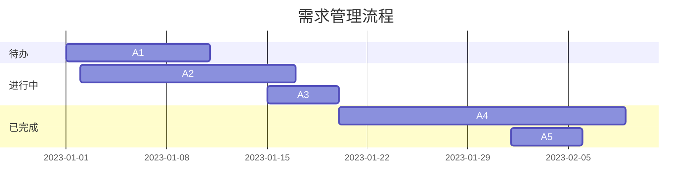

- **使用Jira进行需求管理**：Jira提供了一个灵活的问题跟踪系统，团队可以创建issue来表示需求。每个issue都包含详细的描述、优先级、状态和责任人。团队可以通过Jira的看板功能，将issue分配给不同的团队成员，并在issue上进行讨论和协作。

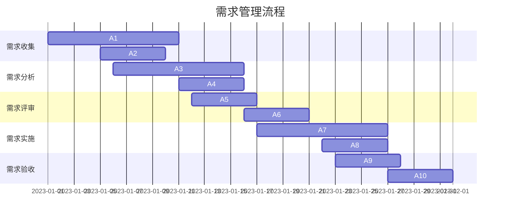

### 4.2 用户体验设计

用户体验设计是敏捷开发中的重要环节，远程协作工具可以帮助团队高效地进行设计协作和用户反馈收集。

- **使用Figma进行用户体验设计**：Figma是一款基于云计算的设计协作工具，支持多人实时协作。设计师可以在Figma中创建原型、设计界面，并邀请团队成员进行实时评论和协作。团队成员可以在线查看设计文件，提供反馈和建议。

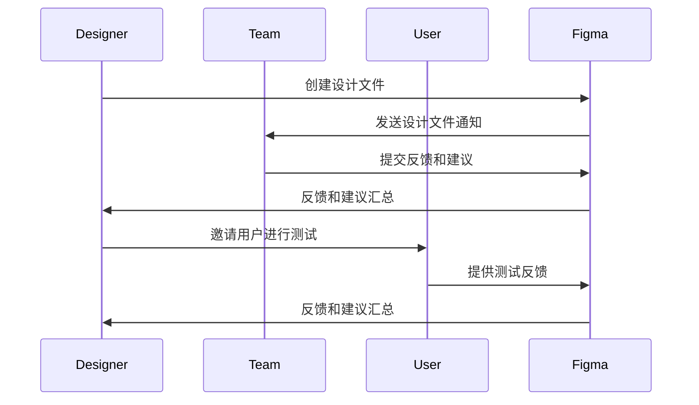

- **使用InVision进行用户体验设计**：InVision是一款流行的原型设计和协作工具，支持创建交互式原型和用户测试。设计师可以使用InVision创建设计原型，并邀请团队成员和用户进行测试和反馈。InVision提供了多种交互元素和动画效果，帮助团队更好地理解用户需求和设计反馈。

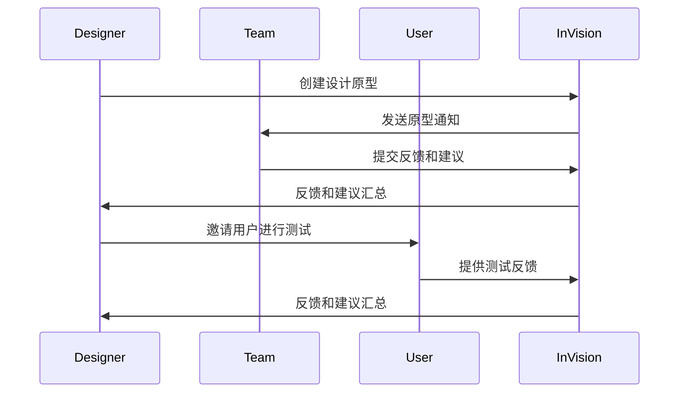

### 4.3 任务分配与跟踪

任务分配与跟踪是敏捷开发中确保项目按时完成的关键环节。远程协作工具可以帮助团队高效地进行任务分配和进度跟踪。

- **使用Trello进行任务分配与跟踪**：Trello的看板和卡片功能非常适合任务管理。团队可以在Trello中创建不同的看板来表示任务的不同阶段，如“待办”、“进行中”和“已完成”。每个任务可以以卡片的形式存在，卡片上可以详细描述任务的内容、责任人、截止日期和进度。团队成员可以在卡片上添加评论和附件，进行任务讨论和协作。

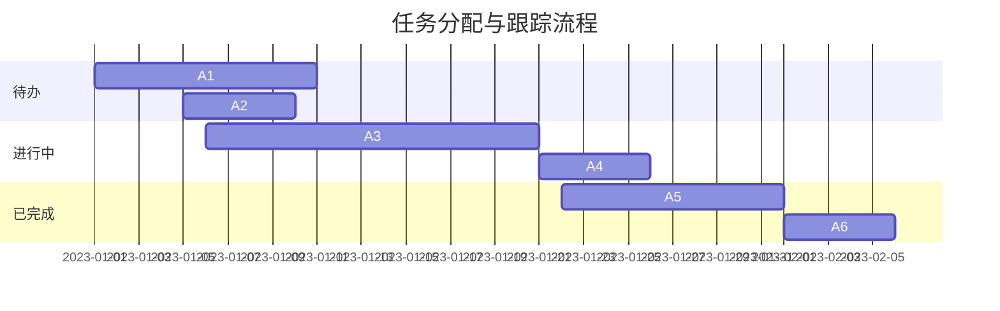

- **使用Jira进行任务分配与跟踪**：Jira的问题跟踪系统非常适合任务管理。团队可以创建issue来表示任务，每个issue都包含详细的描述、优先级、状态和责任人。团队成员可以通过Jira的看板功能，将issue分配给不同的团队成员，并在issue上进行讨论和协作。Jira还提供了多种报表和仪表盘，帮助团队实时了解任务进度和项目状态。

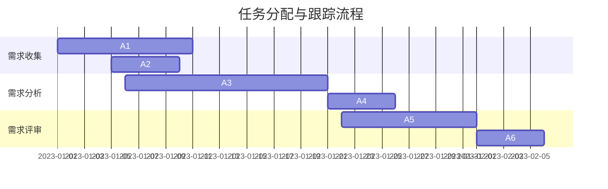

### 4.4 代码评审与版本控制

代码评审和版本控制是确保代码质量和项目稳定性的重要环节。远程协作工具可以帮助团队高效地进行代码评审和版本管理。

- **使用GitHub进行代码评审**：GitHub提供了强大的代码评审功能，团队成员可以发起合并请求，进行代码审查和讨论。GitHub支持多种代码审查工具，如GitLab、Gerrit等，可以帮助团队快速定位代码问题和提出改进建议。

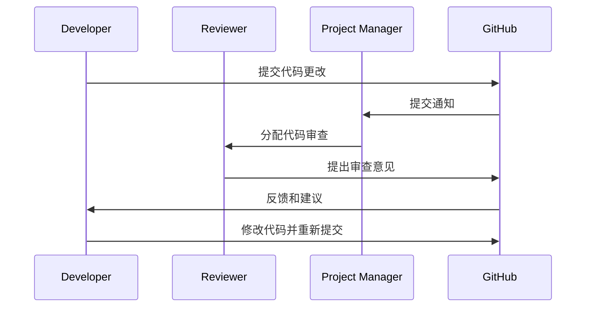

- **使用GitLab进行代码评审**：GitLab与GitHub类似，也提供了强大的代码评审功能。GitLab支持分支管理和合并请求，团队成员可以在合并请求上发起审查，提供评论和反馈。GitLab还提供了多种自动化工具，如GitLab CI/CD，支持持续集成和持续部署。

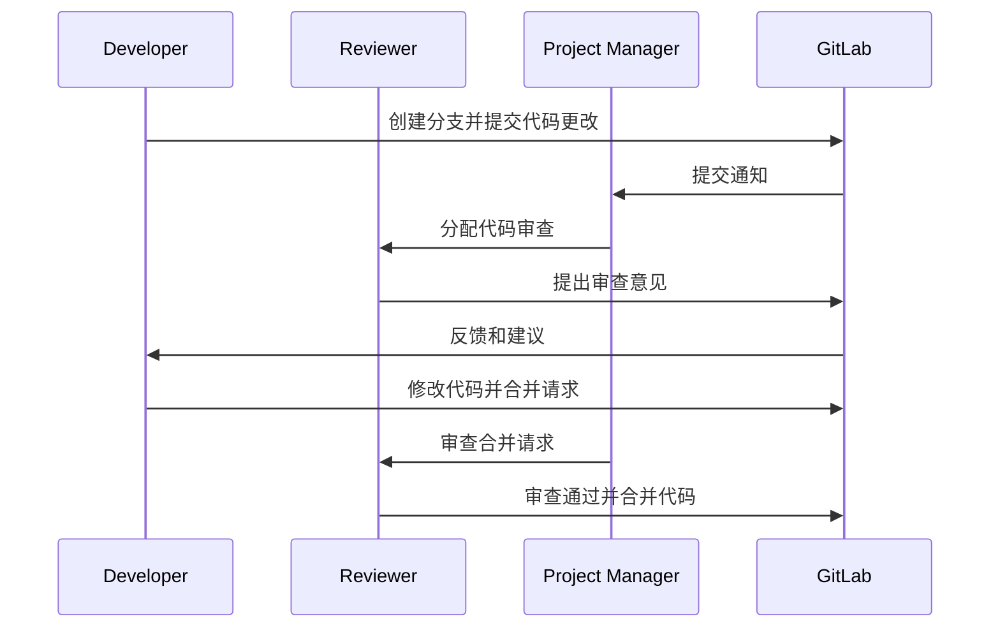

### 4.5 持续集成与持续部署

持续集成和持续部署是现代软件开发中的重要实践，可以帮助团队快速交付高质量的软件。远程协作工具可以支持持续集成和持续部署的各个环节。

- **使用Jenkins进行持续集成与持续部署**：Jenkins是一款流行的持续集成工具，可以帮助团队自动化构建、测试和部署代码。Jenkins支持多种编程语言和构建工具，可以与Git、GitHub等集成，实现代码的自动化集成和部署。

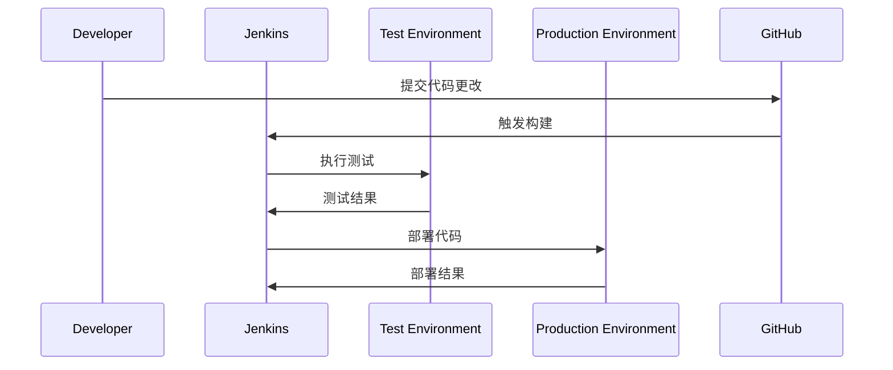

- **使用AWS CodePipeline进行持续集成与持续部署**：AWS CodePipeline是一款云端的持续集成和持续部署服务，可以帮助团队自动化部署流程。AWS CodePipeline支持与AWS其他服务集成，如Amazon S3、Amazon EC2等，实现代码的自动化构建、测试和部署。

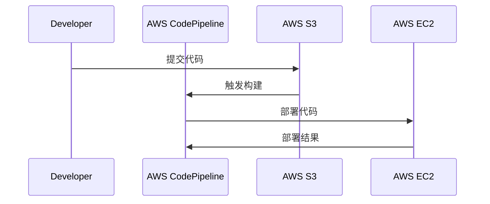

### 4.6 本章小结

在本章中，我们详细探讨了远程协作工具在敏捷开发中的应用，包括需求管理、用户体验设计、任务分配与跟踪、代码评审与版本控制、持续集成与持续部署等方面。通过使用Zoom、Microsoft Teams、Slack、Trello、GitHub、Jira等远程协作工具，团队可以高效地执行敏捷开发流程，确保项目按时交付并保持高质量。

接下来，我们将通过实际案例分析和最佳实践总结，进一步探讨如何在实际项目中应用远程协作工具，为读者提供实用的指导。

## 第5章: 实际案例分析与最佳实践

在本章节中，我们将通过三个实际案例，深入分析远程协作工具在大型应用敏捷开发中的具体应用，并总结出最佳实践。这些案例涵盖了不同领域的大型应用开发，展示了远程协作工具如何在复杂的项目中发挥作用，提高团队协作效率和项目交付质量。

### 5.1 案例一：大型电商平台的敏捷开发实践

**项目背景**：一个大型电商平台项目，由于团队成员分布在不同的城市和国家，因此需要一个高效的远程协作工具来支持敏捷开发。

**远程协作工具应用**：

- **需求管理**：团队使用Jira进行需求管理。通过创建issue来记录用户故事，并分配给不同的团队成员。Jira的看板功能帮助团队可视化需求进度，确保需求按时交付。

- **用户体验设计**：设计师使用Figma进行用户体验设计。团队成员可以在Figma中实时协作，提供反馈和建议，确保设计符合用户需求。

- **任务分配与跟踪**：团队使用Trello进行任务分配与跟踪。每个任务以卡片的形式存在，团队可以在卡片上添加描述、截止日期和责任人，实时更新任务进度。

- **代码评审与版本控制**：团队使用GitHub进行代码评审和版本控制。开发人员提交代码更改后，其他成员可以在GitHub上进行代码审查，确保代码质量。

- **持续集成与持续部署**：团队使用Jenkins进行持续集成与持续部署。每次代码提交后，Jenkins会自动执行构建、测试和部署，确保软件质量和快速交付。

**最佳实践总结**：

1. **统一工具平台**：选择适合团队需求的一套远程协作工具，确保工具之间能够无缝集成，提高协作效率。
2. **明确的角色与职责**：确保每个团队成员都明确自己的角色和职责，避免工作重复和冲突。
3. **实时沟通与反馈**：通过视频会议、即时通讯等工具保持实时沟通，及时反馈问题和进展，确保团队协同高效。

### 5.2 案例二：金融科技企业的远程协作

**项目背景**：一家金融科技公司，由于团队成员分布在不同的国家和地区，需要高效地管理复杂的项目，并确保信息安全。

**远程协作工具应用**：

- **需求管理**：团队使用Jira进行需求管理。通过创建issue来记录用户故事，并使用Jira的权限管理功能，确保信息安全。

- **用户体验设计**：设计师使用Figma进行用户体验设计，通过Figma的权限管理功能，保护设计文件的安全。

- **任务分配与跟踪**：团队使用Trello进行任务分配与跟踪。每个任务以卡片的形式存在，团队可以在卡片上添加描述、截止日期和责任人，实时更新任务进度。

- **代码评审与版本控制**：团队使用GitLab进行代码评审和版本控制。GitLab的权限管理功能确保代码审查过程的安全和高效。

- **持续集成与持续部署**：团队使用AWS CodePipeline进行持续集成与持续部署。通过AWS CodePipeline，团队实现了自动化的构建、测试和部署，确保软件质量和快速交付。

**最佳实践总结**：

1. **严格权限管理**：确保每个团队成员都有适当的权限，保护项目和代码的安全性。
2. **定期备份与恢复**：定期备份项目和代码，确保在数据丢失或系统故障时能够快速恢复。
3. **安全协议与加密**：使用安全协议和加密技术，确保数据在传输和存储过程中的安全。

### 5.3 案例三：医疗健康领域的敏捷开发

**项目背景**：一个医疗健康领域的项目，由于涉及敏感数据和个人隐私，需要确保团队协作的高效性和数据的安全性。

**远程协作工具应用**：

- **需求管理**：团队使用Jira进行需求管理。通过创建issue来记录用户故事，并使用Jira的权限管理功能，确保需求记录的安全和准确。

- **用户体验设计**：设计师使用InVision进行用户体验设计，通过InVision的权限管理功能，保护设计文件的安全。

- **任务分配与跟踪**：团队使用Trello进行任务分配与跟踪。每个任务以卡片的形式存在，团队可以在卡片上添加描述、截止日期和责任人，实时更新任务进度。

- **代码评审与版本控制**：团队使用GitHub进行代码评审和版本控制。通过GitHub的权限管理功能，确保代码审查过程的安全和高效。

- **持续集成与持续部署**：团队使用Jenkins进行持续集成与持续部署。Jenkins的自动化功能确保每次代码提交后，都能自动进行构建、测试和部署，确保软件质量和快速交付。

**最佳实践总结**：

1. **数据加密与隐私保护**：确保数据在传输和存储过程中的加密，保护用户隐私和数据安全。
2. **自动化流程与审查**：通过自动化工具和审查机制，提高开发效率和代码质量。
3. **持续监控与反馈**：实时监控项目进展和系统性能，及时反馈问题和改进措施。

### 5.4 最佳实践总结

通过以上三个实际案例的分析，我们可以总结出以下最佳实践：

1. **选择合适的远程协作工具**：根据团队的需求和项目特点，选择适合的工具，确保工具之间能够无缝集成。
2. **明确的角色与职责**：确保每个团队成员都明确自己的角色和职责，避免工作重复和冲突。
3. **实时沟通与反馈**：通过视频会议、即时通讯等工具保持实时沟通，及时反馈问题和进展。
4. **严格权限管理**：确保每个团队成员都有适当的权限，保护项目和代码的安全性。
5. **数据加密与隐私保护**：确保数据在传输和存储过程中的加密，保护用户隐私和数据安全。
6. **自动化流程与审查**：通过自动化工具和审查机制，提高开发效率和代码质量。
7. **持续监控与反馈**：实时监控项目进展和系统性能，及时反馈问题和改进措施。

这些最佳实践可以帮助团队在远程协作环境中高效执行敏捷开发，提高项目成功率和开发效率。

### 5.5 本章小结

在本章中，我们通过三个实际案例，深入分析了远程协作工具在大型应用敏捷开发中的应用，并总结了最佳实践。这些案例展示了不同领域的大型应用如何通过远程协作工具实现高效开发，确保项目按时交付并保持高质量。

通过本章的内容，读者可以了解到远程协作工具在敏捷开发中的关键作用，以及如何在实际项目中应用这些工具，提高团队协作效率和项目交付质量。接下来，我们将探讨远程协作工具的发展趋势与面临的挑战，为未来的远程协作提供有益的思考。

## 第6章: 未来展望与挑战

### 6.1 远程协作工具的发展趋势

随着全球化和远程工作的不断深入，远程协作工具正迎来前所未有的发展机遇。以下是远程协作工具在未来可能的发展趋势：

1. **人工智能与机器学习集成**：未来远程协作工具可能会更多地集成人工智能和机器学习技术，提供智能推荐、自动化任务处理和实时翻译等功能，从而提升团队协作效率。

2. **增强现实（AR）与虚拟现实（VR）应用**：随着AR和VR技术的成熟，远程协作工具可能会引入更多的沉浸式体验，使团队成员能够通过虚拟会议室进行更加逼真的远程会议和协作。

3. **安全性提升**：随着远程工作的普及，数据安全和隐私保护将成为远程协作工具的重要关注点。未来，远程协作工具将加强加密技术、多因素认证和合规性功能，以确保数据安全。

4. **更紧密的集成**：远程协作工具将进一步与其他企业级应用程序集成，如CRM、ERP等，提供一站式解决方案，简化团队的工作流程。

### 6.2 敏捷开发与远程协作的融合

敏捷开发与远程协作的结合是现代软件开发的必然趋势。以下是如何更好地融合这两种方法的一些思考：

1. **跨职能团队协作**：在敏捷开发中，跨职能团队的协作至关重要。未来，远程协作工具将更多地支持跨职能团队的工作，提供更加灵活的协作方式，如任务分配、进度跟踪和知识共享。

2. **敏捷文化建设**：远程工作环境要求团队具有更高的自我管理和沟通能力。企业应注重培养敏捷文化，鼓励团队成员积极参与团队决策和反馈，提高整体协作效率。

3. **敏捷流程优化**：随着远程协作工具的不断发展，敏捷流程也将得到优化。例如，实时数据分析和自动化工具可以帮助团队更快地响应变化，提高项目交付质量。

### 6.3 面临的挑战与解决方案

尽管远程协作工具的发展趋势向好，但在实际应用中仍然面临一些挑战：

1. **技术稳定性**：远程协作工具需要保证技术稳定性，以应对网络波动和设备故障等问题。解决方案包括采用冗余技术、优化网络架构和提供技术支持。

2. **沟通障碍**：远程协作可能面临沟通障碍，如语言障碍、文化差异和时间差异。解决方案包括提供多语言支持、加强跨文化培训和设置时区管理策略。

3. **数据隐私与安全**：随着数据量的增加，远程协作工具需要确保数据隐私和安全。解决方案包括采用先进的加密技术、制定严格的访问控制策略和定期进行安全审计。

### 6.4 未来展望

未来，远程协作工具将继续在技术创新、用户体验和安全性方面取得突破。以下是未来展望的一些方面：

1. **无缝协作体验**：随着技术的进步，远程协作工具将提供更加无缝的协作体验，使团队成员无论身处何地，都能高效地完成工作。

2. **定制化解决方案**：针对不同行业和团队的需求，远程协作工具将提供更多定制化解决方案，满足特定场景的协作需求。

3. **普及与标准化**：随着远程工作的普及，远程协作工具将成为标准配置，成为企业运营和团队协作不可或缺的一部分。

### 6.5 本章小结

在本章中，我们探讨了远程协作工具的发展趋势、敏捷开发与远程协作的融合、面临的挑战与解决方案以及未来的展望。通过这些内容，我们可以看到远程协作工具在敏捷开发中的重要作用，以及未来可能的发展方向。

未来，随着技术的不断进步，远程协作工具将继续为软件开发团队提供强大的支持，帮助他们在远程环境中实现高效协作和快速交付。同时，企业应密切关注远程协作工具的发展动态，积极探索和采用新技术，以提升团队协作效率和项目交付质量。

## 第7章: 小结与拓展阅读

### 7.1 全书总结

本文全面探讨了远程协作工具在大型应用敏捷开发中的应用。通过详细分析远程协作的概念、核心概念与联系，我们了解了不同类型的远程协作工具及其在敏捷开发中的具体应用。本文还通过实际案例展示了远程协作工具在大型应用开发中的实践效果，并总结了最佳实践。此外，我们展望了远程协作工具的未来发展趋势与面临的挑战，为读者提供了全面的技术指南和策略建议。

### 7.2 注意事项与建议

1. **选择合适的远程协作工具**：根据团队需求和项目特点，选择适合的远程协作工具，确保工具之间能够无缝集成。
2. **明确角色与职责**：确保每个团队成员都明确自己的角色和职责，避免工作重复和冲突。
3. **加强沟通与协作**：通过实时沟通、定期反馈和协作工具的优化使用，提高团队协作效率。
4. **注重数据安全**：确保远程协作工具的数据安全和隐私保护，采用先进的加密技术和安全策略。

### 7.3 拓展阅读

1. **《敏捷开发实践指南》**：提供了敏捷开发的基本原则和实践方法，有助于深入理解敏捷开发。
2. **《远程工作：高效协作的秘诀》**：探讨了远程协作的最佳实践，为团队在远程工作环境中提供指导。
3. **《人工智能与远程协作》**：介绍了人工智能技术在远程协作中的应用，为未来远程协作工具的发展提供了启示。

### 7.4 本章小结

本文通过全面的分析和实际案例，为读者提供了关于远程协作工具在大型应用敏捷开发中的应用的深入理解。我们强调了选择合适的工具、明确角色与职责、加强沟通与协作和注重数据安全的重要性。同时，推荐了一些拓展阅读资源，以帮助读者进一步探索远程协作和敏捷开发的最佳实践。通过本文的阅读，读者应能更好地理解远程协作工具在敏捷开发中的关键作用，并在实际项目中应用这些知识，提高团队协作效率和项目交付质量。

### 作者信息

- **作者：AI天才研究院/AI Genius Institute & 禅与计算机程序设计艺术 /Zen And The Art of Computer Programming**

