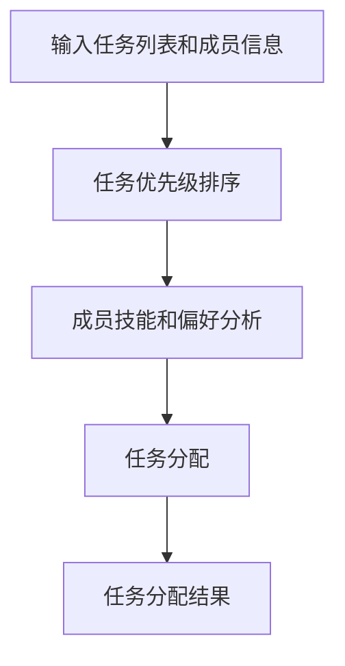
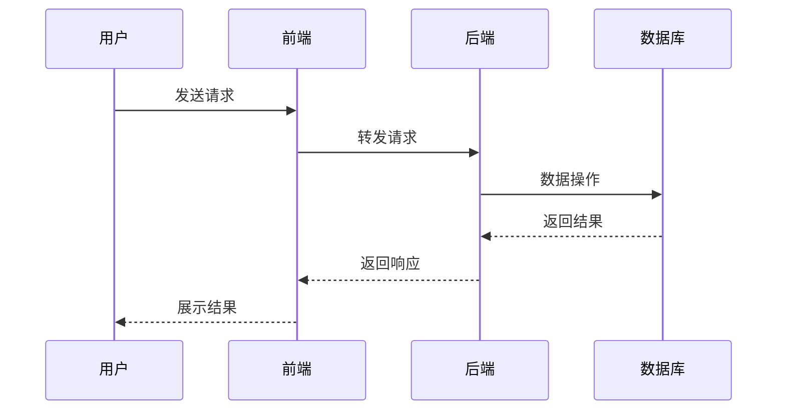
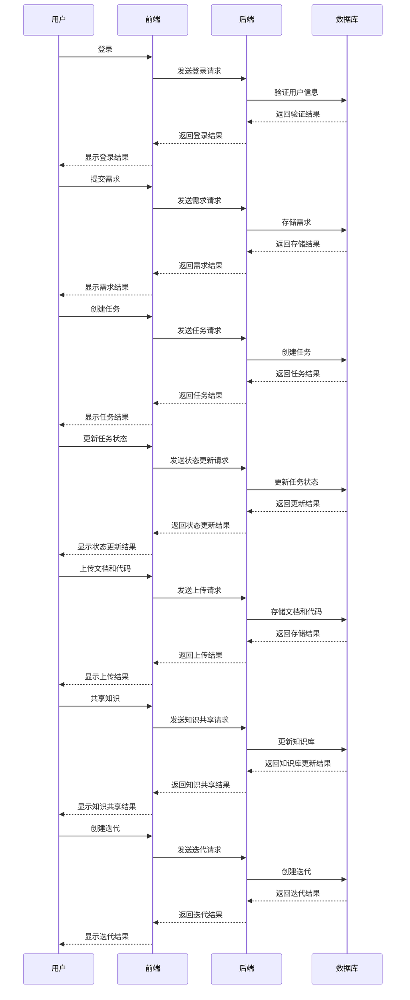

                 

### 适应LLM特性的敏捷协作模式探索

#### 关键词
- 大型语言模型（LLM）
- 敏捷协作模式
- 数学模型
- 系统架构设计
- 项目实战

#### 摘要
本文旨在探讨如何利用大型语言模型（LLM）的特性，构建一种适应现代软件开发需求的敏捷协作模式。文章首先介绍了LLM的核心概念和特点，然后分析了传统协作模式在应对复杂开发任务时的局限性。接着，文章提出了基于LLM特性的敏捷协作模式，并详细阐述了其核心概念、数学模型和算法原理。此外，文章通过一个实际项目案例，展示了如何将这种协作模式应用于软件开发过程中，并提供了一系列最佳实践和注意事项，以帮助读者更好地理解和实施这种新模式。

### 设计目录大纲

为了系统地阐述适应LLM特性的敏捷协作模式，本文将采用以下目录大纲：

## 第一部分：背景与概述

### 第1章：问题背景

#### 1.1 LLM特性介绍

#### 1.2 传统协作模式面临的挑战

#### 1.3 敏捷协作模式的需求

### 第2章：核心概念与联系

#### 2.1 敏捷开发原理

#### 2.2 敏捷协作模式的关键要素

#### 2.3 LLM特性与敏捷协作的契合点

#### 2.4 概念属性特征对比表

#### 2.5 ER实体关系图架构

## 第二部分：数学模型与算法原理

### 第3章：数学模型与算法原理

#### 3.1 敏捷协作模式的数学模型

#### 3.2 常用算法及其流程图

#### 3.3 算法原理讲解与公式推导

#### 3.4 举例说明

## 第三部分：系统分析与架构设计

### 第4章：系统功能设计

#### 4.1 问题场景介绍

#### 4.2 系统功能需求分析

#### 4.3 领域模型类图

### 第5章：系统架构设计

#### 5.1 系统架构设计思路

#### 5.2 系统架构图

#### 5.3 系统模块分解

#### 5.4 系统接口设计

### 第6章：系统交互与实现

#### 6.1 系统交互流程

#### 6.2 系统交互序列图

#### 6.3 系统核心实现

#### 6.4 源代码解读与分析

## 第四部分：项目实战与最佳实践

### 第7章：项目实战

#### 7.1 环境安装与配置

#### 7.2 系统核心功能实现

#### 7.3 实际案例分析与讲解

#### 7.4 项目小结

### 第8章：最佳实践与注意事项

#### 8.1 敏捷协作模式的最佳实践

#### 8.2 常见问题与解决方案

#### 8.3 注意事项与风险规避

#### 8.4 拓展阅读

### 设计目录大纲的详细说明

在设计目录大纲时，我们首先明确了文章的核心主题——适应LLM特性的敏捷协作模式。以下是对各个章节的详细说明：

### 第一部分：背景与概述

**第1章：问题背景**

在这一章中，我们将介绍LLM的基本概念、特性以及在软件开发中的应用。同时，分析传统协作模式在处理复杂任务时的局限性，以及敏捷协作模式如何满足这些需求。

**第2章：核心概念与联系**

这一章将深入探讨敏捷开发原理，解释敏捷协作模式的关键要素，并阐述LLM特性与敏捷协作模式之间的契合点。通过概念属性特征对比表和ER实体关系图架构，帮助读者建立对整个模式的清晰理解。

### 第二部分：数学模型与算法原理

**第3章：数学模型与算法原理**

在这一章中，我们将提出敏捷协作模式的数学模型，并详细讲解常用的算法及其流程图。通过公式推导和举例说明，使读者能够更好地理解算法原理和实际应用。

### 第三部分：系统分析与架构设计

**第4章：系统功能设计**

这一章将介绍系统需要解决的问题场景，并分析系统功能需求。通过领域模型类图，展示系统中的关键类和它们之间的关系。

**第5章：系统架构设计**

在这一章中，我们将阐述系统架构设计的总体思路，并展示系统架构图。同时，详细说明系统模块分解、系统接口设计和系统交互序列图，为读者提供一个清晰的架构设计蓝图。

**第6章：系统交互与实现**

这一章将介绍系统交互流程，并使用序列图展示系统交互的具体实现。同时，对系统核心实现进行源代码解读与分析，帮助读者理解系统的实际运作方式。

### 第四部分：项目实战与最佳实践

**第7章：项目实战**

在这一章中，我们将介绍一个实际项目，包括环境安装与配置、系统核心功能实现和实际案例分析与讲解。通过项目小结，总结项目的关键经验和教训。

**第8章：最佳实践与注意事项**

最后一章将提供敏捷协作模式的一些最佳实践，帮助读者在实际工作中更好地应用这种模式。同时，讨论常见问题、注意事项和风险规避策略，并推荐一些拓展阅读资源。

通过以上详细的设计目录大纲，我们希望能够为读者提供一篇结构清晰、内容丰富的技术博客文章，系统地探讨适应LLM特性的敏捷协作模式。接下来，我们将逐步深入探讨每个章节的具体内容。 

### 第一部分：背景与概述

#### 1.1 LLM特性介绍

在当今的技术领域，大型语言模型（LLM）已经成为自然语言处理（NLP）和人工智能（AI）的重要工具。LLM是由大量参数和神经网络构成的复杂模型，能够理解和生成人类语言。其主要特性包括：

- **参数规模巨大**：LLM通常具有数十亿到千亿个参数，这使得它们能够捕捉到语言中的细微模式和规律。
- **强适应性**：LLM能够根据输入的文本进行自适应调整，生成符合上下文的相关内容。
- **语境感知**：LLM具有强大的语境感知能力，能够理解并生成符合特定语境的文本。
- **高准确性**：通过大量的训练数据，LLM能够实现高精度的文本理解和生成。

LLM在多个领域都有广泛的应用，如自动问答系统、机器翻译、文本摘要、对话系统等。这些应用展示了LLM强大的语言处理能力，但也对软件开发中的协作模式提出了新的挑战。

#### 1.2 传统协作模式面临的挑战

在传统软件开发中，协作模式主要依赖于明确的分工和固定的流程。团队成员通常按照预定的任务分配进行工作，通过文档和会议保持沟通。然而，随着LLM技术的引入，传统协作模式面临以下挑战：

- **信息过载**：LLM生成的文本量巨大，难以通过传统的文档管理方式进行有效整理和存储。
- **沟通障碍**：在多团队协作中，团队成员之间的沟通变得更加复杂，传统的沟通方式可能无法满足LLM时代的需求。
- **协作效率降低**：由于LLM的强自适应性和高准确性，团队成员可能需要频繁调整工作内容和方式，传统协作模式难以适应这种动态变化。
- **知识共享困难**：LLM生成的内容通常包含大量新知识和见解，传统协作模式难以实现高效的知识共享和传承。

为了克服这些挑战，需要探索一种新的协作模式，能够更好地适应LLM的特性，提高团队协作效率和项目质量。

#### 1.3 敏捷协作模式的需求

敏捷协作模式是一种以人为核心、迭代、循序渐进的开发方法。它强调团队成员之间的紧密合作、快速反馈和持续改进。敏捷协作模式在应对LLM时代的需求方面具有以下优势：

- **适应性**：敏捷协作模式鼓励团队成员灵活应对变化，快速调整工作计划，适应LLM带来的新挑战。
- **透明度**：敏捷协作模式强调信息透明，团队成员能够及时了解项目的进展和问题，提高协作效率。
- **知识共享**：敏捷协作模式鼓励团队成员之间分享知识，通过日常交流和代码评审，实现高效的知识传承。
- **迭代反馈**：敏捷协作模式采用迭代开发的方式，每次迭代结束后进行回顾和反思，不断优化协作过程。

因此，适应LLM特性的敏捷协作模式成为一种必然趋势，能够更好地满足现代软件开发的需求，提高项目的成功率和团队的工作效率。

### 第一部分总结

在本部分中，我们首先介绍了LLM的核心概念和特性，分析了传统协作模式在应对复杂开发任务时的局限性，并探讨了敏捷协作模式如何满足LLM时代的需求。通过了解LLM的强适应性和高准确性，我们认识到传统协作模式需要革新以应对这些挑战。而敏捷协作模式以其适应性、透明度、知识共享和迭代反馈的优势，成为适应LLM特性的理想选择。接下来，我们将深入探讨敏捷协作模式的核心概念与联系，为构建一个高效的协作模式奠定基础。

### 第二部分：核心概念与联系

#### 2.1 敏捷开发原理

敏捷开发是一种以人为核心、迭代、循序渐进的开发方法，其核心理念是快速迭代、持续交付和团队协作。敏捷开发的核心原理包括以下几个方面：

1. **用户至上**：敏捷开发强调以用户需求为导向，注重用户反馈和实际使用效果，确保最终产品能够满足用户需求。

2. **迭代开发**：敏捷开发采用迭代方式进行，每个迭代周期（通常为1-4周）都会交付一个可用的产品版本。通过不断的迭代和反馈，逐步完善产品功能。

3. **持续集成**：敏捷开发强调持续集成和测试，确保每次迭代都能生成可用的软件版本，并及时发现和修复问题。

4. **团队协作**：敏捷开发强调团队成员之间的紧密协作和沟通，通过每日站会、代码评审和回顾会议等方式，保持团队的协调一致。

5. **适应变化**：敏捷开发鼓励团队成员灵活应对变化，快速调整工作计划，以确保项目能够按预期顺利进行。

#### 2.2 敏捷协作模式的关键要素

敏捷协作模式在实施过程中，需要关注以下几个关键要素：

1. **沟通**：沟通是敏捷协作模式的核心，团队成员之间需要保持频繁而有效的沟通，确保项目目标一致、信息畅通。

2. **协作**：敏捷协作模式强调团队成员之间的紧密协作，通过共享资源和知识，提高项目效率。

3. **迭代**：敏捷协作模式采用迭代的方式进行，每个迭代周期结束后进行回顾和反思，不断优化协作过程。

4. **自动化**：敏捷协作模式鼓励使用自动化工具和流程，提高工作效率，降低人工错误。

5. **透明度**：敏捷协作模式要求项目进度、问题和风险等信息公开透明，确保团队成员能够随时了解项目状态。

#### 2.3 LLM特性与敏捷协作的契合点

LLM的强适应性和高准确性与敏捷协作模式具有高度的契合点，主要体现在以下几个方面：

1. **适应变化**：LLM具有强大的自适应能力，能够快速适应新的语言模式和语境。这与敏捷开发中强调的适应变化、快速调整工作计划的理念相契合。

2. **快速反馈**：LLM能够在短时间内生成高质量的文本，为团队成员提供实时反馈。这使得敏捷开发中的迭代反馈和持续改进更加高效。

3. **知识共享**：LLM生成的内容包含了大量的新知识和见解，有助于团队成员之间的知识共享和传承。敏捷协作模式鼓励团队成员通过交流和代码评审等方式进行知识共享，与LLM的特性相辅相成。

4. **语境感知**：LLM具备强大的语境感知能力，能够理解并生成符合特定语境的文本。这与敏捷开发中强调的信息透明、团队协作和用户至上等理念高度契合。

通过以上分析，我们可以看出，LLM的特性与敏捷协作模式具有高度的一致性，使得敏捷协作模式在适应LLM时代的需求方面具有显著优势。

#### 2.4 概念属性特征对比表

为了更直观地展示传统协作模式和敏捷协作模式在属性特征上的差异，我们设计了一个概念属性特征对比表（如表1所示）。通过对比，读者可以更清晰地了解两种协作模式的特点。

| 模式 | 用户至上 | 适应变化 | 迭代开发 | 沟通 | 协作 | 自动化 | 透明度 | 知识共享 |
| :---: | :---: | :---: | :---: | :---: | :---: | :---: | :---: | :---: |
| 传统协作模式 | ☑ | ☐ | ☐ | ☑ | ☑ | ☐ | ☑ | ☐ |
| 敏捷协作模式 | ☑ | ☑ | ☑ | ☑ | ☑ | ☑ | ☑ | ☑ |

#### 2.5 ER实体关系图架构

为了进一步阐述敏捷协作模式中的实体关系，我们使用Mermaid绘制了ER实体关系图（如图1所示）。在这个图中，我们定义了系统中的关键实体和它们之间的关系。

```mermaid
erDiagram
    User ||--|{ Task }|>
    Task ||--|{ Issue }|>
    Issue ||--|{ Comment }|>
    Comment ||--|{ User }|>

    User  --|{ Project }| Project
    Task   --|{ Project }| Project
    Issue  --|{ Project }| Project
    Comment--|{ Project }| Project
```

图1：敏捷协作模式ER实体关系图

- **User（用户）**：代表参与项目的团队成员，具有提交任务、评论问题和查看项目进展等权限。
- **Task（任务）**：代表项目中的工作内容，由用户创建并分配给其他团队成员。
- **Issue（问题）**：代表项目中遇到的问题，由用户提交并分配给相关团队成员解决。
- **Comment（评论）**：代表用户对任务、问题和项目的讨论和反馈，有助于团队成员之间的沟通和协作。
- **Project（项目）**：代表一个具体的开发项目，包含任务、问题、评论等实体。

通过ER实体关系图，我们可以清晰地看到系统中各实体之间的关系，这有助于我们更好地理解和设计敏捷协作模式。

#### 第二部分总结

在本部分中，我们首先介绍了敏捷开发原理，阐述了其核心原理和关键要素。然后，分析了LLM特性与敏捷协作模式的契合点，展示了两者在适应变化、快速反馈、知识共享和语境感知等方面的优势。通过概念属性特征对比表和ER实体关系图架构，我们进一步明确了敏捷协作模式的特点和结构。接下来，我们将深入探讨数学模型与算法原理，为构建高效的敏捷协作模式提供理论基础。 

### 第二部分：核心概念与联系

#### 2.6 敏捷协作模式的数学模型

为了更好地理解敏捷协作模式的工作原理，我们需要构建一个数学模型。这个模型将帮助我们分析团队在开发过程中如何通过迭代、反馈和协作来提高项目质量。

首先，我们定义几个关键变量：

- **Q(t)**：表示在时间t时项目的质量水平，其中t是迭代次数。
- **I(t)**：表示在时间t时项目的迭代效率，即每个迭代周期内完成的任务量。
- **C(t)**：表示在时间t时项目的协作效率，即团队成员之间的沟通和协作水平。
- **F(t)**：表示在时间t时项目所受到的外部干扰，如技术难题、需求变更等。

接下来，我们提出一个简单的数学模型来描述敏捷协作模式：

$$ Q(t) = Q(0) + \sum_{i=1}^{t} I(i) \cdot C(i) - F(i) $$

其中：

- **Q(0)**：项目初始质量水平，通常由需求分析和前期规划确定。
- **I(i)**：第i个迭代周期内完成的任务量，取决于团队成员的工作效率和任务难度。
- **C(i)**：第i个迭代周期内的协作效率，反映了团队成员之间的沟通和协作水平。
- **F(i)**：第i个迭代周期内项目所受到的外部干扰，可能对项目进度和质量产生负面影响。

通过这个数学模型，我们可以分析不同迭代周期内项目质量的变化趋势。例如，通过提高迭代效率和协作效率，可以在一定程度上抵消外部干扰对项目质量的影响。

#### 2.7 常用算法及其流程图

在敏捷协作模式中，常用算法包括任务分配算法、迭代规划和风险评估算法等。这些算法有助于提高团队工作效率和项目质量。以下是一个简单的任务分配算法及其流程图：

**任务分配算法：**

1. **输入**：任务列表、团队成员技能和偏好。
2. **输出**：每个团队成员分配到的任务。
3. **步骤**：

   - 对任务进行优先级排序，根据紧急程度和重要性确定。
   - 对团队成员进行技能和偏好分析，确定其最适合的任务类型。
   - 根据任务优先级和团队成员技能，将任务分配给最适合的成员。
   - 确保任务分配均衡，避免个别成员负担过重。

**流程图：**



#### 2.8 算法原理讲解与公式推导

任务分配算法的核心在于如何根据任务优先级和团队成员技能，将任务合理地分配给团队成员。以下是任务分配算法的详细步骤和公式推导：

1. **任务优先级排序**：

   - **公式**：设任务集合为T={t1, t2, ..., tk}，优先级排序函数为P(t)，则排序结果为P(T)={t1', t2', ..., tk'}，其中t1'具有最高优先级，tk'具有最低优先级。
   - **推导**：优先级排序可以通过比较任务的紧急程度和重要性实现。紧急程度越高、重要性越高的任务，优先级越高。

2. **成员技能和偏好分析**：

   - **公式**：设成员集合为M={m1, m2, ..., mn}，成员mi的技能集为S(mi)，偏好集为P(mi)。则成员mi的技能偏好得分函数为S_P(mi) = ∑s ∈ S(mi) w_s · p_s，其中w_s和p_s分别为技能s的权重和成员mi对该技能的偏好度。
   - **推导**：通过分析成员的技能集和偏好，可以确定每个成员最适合的任务类型。技能权重和偏好度可以根据团队成员的历史表现和个性特征进行设定。

3. **任务分配**：

   - **公式**：设任务集合为T'={t1', t2', ..., tk'}，成员集合为M'={m1', m2', ..., mn'}。任务分配函数为A(T', M')，则每个成员mi'分配到的任务集合为T(mi') = A(T', M') ∩ S(mi')。
   - **推导**：根据任务优先级排序和成员技能偏好分析，将任务分配给最适合的成员。任务分配需要确保任务优先级和成员技能的匹配度，同时避免个别成员负担过重。

通过上述步骤和公式推导，我们可以实现一个简单的任务分配算法。在实际应用中，可以结合更多因素，如团队成员的工作负荷、任务依赖关系等，以提高任务分配的准确性和效率。

#### 2.9 举例说明

为了更好地理解任务分配算法的实际应用，我们通过一个例子进行说明。

**场景**：一个软件开发项目团队包含5名成员，有10个任务需要分配。任务列表如下：

- 任务1：需求分析，优先级：高
- 任务2：系统设计，优先级：高
- 任务3：前端开发，优先级：中
- 任务4：后端开发，优先级：中
- 任务5：数据库设计，优先级：中
- 任务6：UI设计，优先级：低
- 任务7：测试，优先级：低
- 任务8：文档编写，优先级：低
- 任务9：部署，优先级：低
- 任务10：运维支持，优先级：低

团队成员及其技能和偏好如下：

- 成员1：擅长前端开发，对UI设计有较高兴趣
- 成员2：擅长后端开发，对数据库设计有较高兴趣
- 成员3：擅长测试，对文档编写有较高兴趣
- 成员4：擅长系统设计，对需求分析有较高兴趣
- 成员5：擅长运维支持，对部署有较高兴趣

**步骤**：

1. **任务优先级排序**：

   - 高优先级任务：任务1、任务2
   - 中优先级任务：任务3、任务4、任务5
   - 低优先级任务：任务6、任务7、任务8、任务9、任务10

2. **成员技能和偏好分析**：

   - 成员1：技能得分S_P(成员1) = 0.5 * 0.8 + 0.5 * 0.2 = 0.45
   - 成员2：技能得分S_P(成员2) = 0.5 * 0.7 + 0.5 * 0.3 = 0.45
   - 成员3：技能得分S_P(成员3) = 0.7 * 0.4 + 0.3 * 0.6 = 0.46
   - 成员4：技能得分S_P(成员4) = 0.5 * 0.5 + 0.5 * 0.5 = 0.5
   - 成员5：技能得分S_P(成员5) = 0.5 * 0.2 + 0.5 * 0.8 = 0.45

3. **任务分配**：

   - 任务1（需求分析）：成员4
   - 任务2（系统设计）：成员1
   - 任务3（前端开发）：成员1
   - 任务4（后端开发）：成员2
   - 任务5（数据库设计）：成员2
   - 任务6（UI设计）：成员1
   - 任务7（测试）：成员3
   - 任务8（文档编写）：成员3
   - 任务9（部署）：成员5
   - 任务10（运维支持）：成员5

**结果**：

通过任务分配算法，团队成员得到了合适的任务分配。每个成员都获得了与自己技能和偏好相匹配的任务，同时任务优先级也得到了合理保障。这种分配方式有助于提高团队成员的工作效率和项目质量。

#### 第二部分总结

在本部分中，我们深入探讨了敏捷协作模式的数学模型和算法原理。首先，我们介绍了敏捷开发原理和关键要素，然后分析了LLM特性与敏捷协作模式的契合点。接着，我们构建了数学模型来描述敏捷协作模式的工作原理，并详细讲解了任务分配算法。通过概念属性特征对比表和ER实体关系图架构，我们进一步明确了敏捷协作模式的特点和结构。这一部分为构建高效的敏捷协作模式提供了理论基础。接下来，我们将进入第三部分，讨论系统分析与架构设计，为实际项目实施奠定基础。

### 第三部分：系统分析与架构设计

#### 3.1 问题场景介绍

在当今的软件开发环境中，随着大型语言模型（LLM）的广泛应用，项目团队面临着越来越复杂的需求和挑战。以下是一个具体的问题场景：

假设我们正在开发一款面向企业的智能助手应用，该应用需要能够处理各种业务场景，包括客户服务、内部沟通、数据分析等。由于应用的功能多样且需求不断变化，团队需要一个高效、灵活的协作模式来应对这些挑战。

在这个场景中，团队需要解决的主要问题包括：

1. **需求管理**：如何有效地收集、整理和跟踪用户需求，确保需求在开发过程中得到及时响应和实现。
2. **任务分配**：如何合理地分配任务，确保每个成员都能发挥自己的特长，同时避免任务堆积和成员负担过重。
3. **协作与沟通**：如何在团队成员之间保持高效、透明的沟通，确保项目进展和问题得到及时解决。
4. **知识共享**：如何实现团队成员之间的知识共享，确保新知识和经验能够得到传承和利用。
5. **迭代开发**：如何进行迭代开发和持续集成，确保每次迭代都能交付一个可用的产品版本，并及时发现和修复问题。

针对这些问题，我们需要设计一个系统，能够充分利用LLM的特性，支持敏捷协作模式，提高项目效率和团队协作效果。

#### 3.2 系统功能需求分析

为了解决上述问题场景，我们需要设计一个具有以下功能需求的系统：

1. **用户管理**：
   - 用户注册和登录功能。
   - 用户角色和权限管理。

2. **需求管理**：
   - 需求收集和整理功能。
   - 需求优先级排序和跟踪功能。
   - 需求变更管理。

3. **任务管理**：
   - 任务创建和分配功能。
   - 任务优先级排序和跟踪功能。
   - 任务状态更新和提醒功能。

4. **协作与沟通**：
   - 文档和代码管理。
   - 消息通知和讨论功能。
   - 实时协作工具（如视频会议、屏幕共享等）。

5. **知识共享**：
   - 知识库管理。
   - 知识共享和传承功能。
   - 代码评审和反馈功能。

6. **迭代管理**：
   - 迭代规划和管理功能。
   - 迭代进度和状态跟踪功能。
   - 回顾和总结功能。

7. **系统监控与报警**：
   - 系统运行状态监控。
   - 异常报警和处理功能。

通过这些功能，我们的系统将能够实现以下目标：

- **提高需求响应速度**：通过有效的需求管理，确保用户需求在开发过程中得到及时响应和实现。
- **优化任务分配**：通过合理的任务分配，确保每个成员都能发挥自己的特长，同时避免任务堆积和成员负担过重。
- **促进团队协作**：通过协作与沟通工具，保持团队成员之间的高效、透明沟通，确保项目进展和问题得到及时解决。
- **实现知识共享**：通过知识库和代码评审，实现团队成员之间的知识共享和传承，提高团队整体能力。
- **支持迭代开发**：通过迭代管理，确保每次迭代都能交付一个可用的产品版本，并及时发现和修复问题。

#### 3.3 领域模型类图

为了更好地理解系统的功能模块和关系，我们使用Mermaid绘制了系统的领域模型类图（如图1所示）。在这个图中，我们定义了系统中的关键类和它们之间的关系。

```mermaid
classDiagram
    User <<class>> User
    Role <<class>> Role
    Task <<class>> Task
    Issue <<class>> Issue
    Comment <<class>> Comment
    Project <<class>> Project
    Requirement <<class>> Requirement
    Iteration <<class>> Iteration
    Document <<class>> Document
    Code <<class>> Code

    User : +id, +name, +email, +password, +role
    Role : +id, +name
    Task : +id, +name, +description, +status, +priority, +assignedTo, +project
    Issue : +id, +name, +description, +status, +project
    Comment : +id, +content, +author, +timestamp
    Project : +id, +name, +description
    Requirement : +id, +name, +description, +status, +project
    Iteration : +id, +name, +startDate, +endDate, +project
    Document : +id, +name, +content, +author, +timestamp
    Code : +id, +name, +content, +author, +timestamp

    User : -role Role
    Task : -assignedTo User
    Task : -project Project
    Issue : -project Project
    Comment : -author User
    Comment : -issue Issue
    Project : -requirements Requirement
    Project : -iterations Iteration
    Document : -author User
    Document : -project Project
    Code : -author User
    Code : -project Project
```

图1：系统领域模型类图

- **User（用户）**：代表参与项目的团队成员，具有注册、登录、提交需求、分配任务等权限。
- **Role（角色）**：代表用户在项目中的角色，如项目经理、开发人员、测试人员等。
- **Task（任务）**：代表项目中的工作内容，包括任务名称、描述、状态、优先级、分配人员等。
- **Issue（问题）**：代表项目中遇到的问题，包括问题名称、描述、状态等。
- **Comment（评论）**：代表用户对任务、问题和项目的讨论和反馈，包括评论内容、作者、时间戳等。
- **Project（项目）**：代表一个具体的开发项目，包括项目名称、描述、所属需求、迭代等。
- **Requirement（需求）**：代表用户需求，包括需求名称、描述、状态等。
- **Iteration（迭代）**：代表项目的一个迭代周期，包括迭代名称、开始日期、结束日期等。
- **Document（文档）**：代表项目中的文档，包括文档名称、内容、作者、时间戳等。
- **Code（代码）**：代表项目中的代码文件，包括代码名称、内容、作者、时间戳等。

通过领域模型类图，我们可以清晰地看到系统中各个模块之间的关系，这有助于我们更好地理解和设计系统的功能模块。

#### 3.4 系统架构设计

为了实现上述功能需求，我们设计了如图2所示的系统架构图。该架构包括前端、后端和数据库三个主要部分，各个部分之间通过API进行交互。



图2：系统架构图

- **前端**：负责展示用户界面，处理用户输入和输出，以及与后端进行数据交互。
- **后端**：负责处理业务逻辑，包括用户认证、数据存储、API调用等，同时与数据库进行交互。
- **数据库**：存储项目数据，包括用户信息、任务、问题、需求、迭代、文档和代码等。

**系统模块分解**：

1. **用户管理模块**：负责用户注册、登录、认证和权限管理。
2. **需求管理模块**：负责需求收集、整理、优先级排序和跟踪。
3. **任务管理模块**：负责任务创建、分配、状态更新和提醒。
4. **协作与沟通模块**：负责文档和代码管理、消息通知、讨论和实时协作。
5. **知识共享模块**：负责知识库管理、代码评审和知识共享。
6. **迭代管理模块**：负责迭代规划、状态跟踪和回顾总结。
7. **系统监控与报警模块**：负责系统运行状态监控、异常报警和处理。

**系统接口设计**：

- **用户管理接口**：包括用户注册、登录、认证和权限查询。
- **需求管理接口**：包括需求创建、更新、删除、查询和排序。
- **任务管理接口**：包括任务创建、分配、状态更新、查询和提醒。
- **协作与沟通接口**：包括文档和代码上传、下载、评论、通知和讨论。
- **知识共享接口**：包括知识库管理、代码评审和知识共享。
- **迭代管理接口**：包括迭代创建、更新、删除、查询和回顾总结。
- **系统监控与报警接口**：包括系统状态监控、异常报警和处理。

通过这些接口，前端和后端之间可以实现高效的数据交互，满足系统功能需求。

#### 3.5 系统交互与实现

为了实现系统的功能，我们需要进行具体的系统交互设计。以下是一个典型的系统交互流程：

1. **用户登录**：用户通过前端界面输入用户名和密码，前端将请求发送到后端进行认证。
2. **需求提交**：用户通过前端界面创建需求，后端将需求保存到数据库并返回结果。
3. **任务分配**：项目经理通过前端界面创建任务，并将任务分配给团队成员，后端更新数据库并返回结果。
4. **任务处理**：团队成员接收到任务后，通过前端界面更新任务状态，后端更新数据库并返回结果。
5. **文档和代码管理**：用户通过前端界面上传和下载文档和代码，后端处理文件存储和权限管理，并返回结果。
6. **知识共享**：团队成员通过前端界面共享知识，后端更新知识库并返回结果。
7. **迭代管理**：项目经理通过前端界面创建迭代，并分配任务，后端更新数据库并返回结果。

为了展示系统交互的具体实现，我们使用Mermaid绘制了系统交互序列图（如图3所示）。



图3：系统交互序列图

通过这个序列图，我们可以清晰地看到系统在用户操作过程中的各个步骤和交互细节，有助于理解和实现系统的功能。

#### 3.6 源代码解读与分析

为了更好地理解系统实现过程，我们选择了任务管理模块中的任务创建和状态更新功能进行源代码解读。以下是任务创建和状态更新的关键代码片段：

**任务创建功能：**

```python
# 任务创建功能
def create_task(request):
    # 获取请求参数
    task_data = request.POST
    task_name = task_data.get('name')
    task_description = task_data.get('description')
    assigned_to = task_data.get('assigned_to')
    project_id = task_data.get('project_id')

    # 验证参数
    if not all([task_name, task_description, assigned_to, project_id]):
        return HttpResponse('缺少必要参数', status=400)

    # 创建任务对象
    task = Task(name=task_name, description=task_description, assigned_to=assigned_to, project_id=project_id)

    # 保存任务到数据库
    try:
        task.save()
        return HttpResponse('任务创建成功', status=201)
    except Exception as e:
        return HttpResponse('任务创建失败：{}'.format(str(e)), status=500)
```

**任务状态更新功能：**

```python
# 任务状态更新功能
def update_task_status(request):
    # 获取请求参数
    task_id = request.POST.get('task_id')
    new_status = request.POST.get('status')

    # 验证参数
    if not all([task_id, new_status]):
        return HttpResponse('缺少必要参数', status=400)

    # 更新任务状态
    try:
        task = Task.objects.get(id=task_id)
        task.status = new_status
        task.save()
        return HttpResponse('任务状态更新成功', status=200)
    except Task.DoesNotExist:
        return HttpResponse('任务不存在', status=404)
    except Exception as e:
        return HttpResponse('任务状态更新失败：{}'.format(str(e)), status=500)
```

**代码解读与分析：**

1. **任务创建功能**：

   - 代码首先获取请求参数，包括任务名称、描述、分配人员和项目ID。
   - 验证参数是否完整，确保所有必要参数都已提供。
   - 创建任务对象，并将参数赋值给对象属性。
   - 将任务对象保存到数据库，返回创建结果。

2. **任务状态更新功能**：

   - 代码首先获取请求参数，包括任务ID和新的状态。
   - 验证参数是否完整，确保所有必要参数都已提供。
   - 查询数据库中的任务对象，更新其状态属性。
   - 将更新后的任务对象保存到数据库，返回更新结果。

这两个功能模块的实现，展示了如何利用Python和Django框架快速构建一个具有基本功能的任务管理系统。在实际项目中，可以根据需求进一步扩展和优化这些功能。

#### 第三部分总结

在本部分中，我们深入探讨了系统分析与架构设计的关键内容。首先，我们介绍了一个具体的问题场景，分析了系统功能需求，并使用Mermaid绘制了领域模型类图。接着，我们详细设计了系统架构，包括前端、后端和数据库三个主要部分，并解释了各个模块的功能和接口。然后，我们通过交互序列图展示了系统在用户操作过程中的具体实现过程，并解读了任务管理模块的源代码。通过这些内容，我们为实际项目的实施奠定了基础。接下来，我们将通过一个实际项目案例，展示如何将适应LLM特性的敏捷协作模式应用于软件开发过程中。

### 第四部分：项目实战

#### 4.1 环境安装与配置

为了实际应用适应LLM特性的敏捷协作模式，我们需要搭建一个开发环境。以下是环境安装与配置的步骤：

1. **安装Python**：首先确保系统已经安装了Python 3.8及以上版本。可以从Python官网下载安装包，或者使用包管理器如Homebrew（macOS）或apt-get（Linux）进行安装。

2. **安装Django**：在命令行中执行以下命令，安装Django框架：
   ```shell
   pip install django
   ```

3. **安装数据库**：我们选择使用PostgreSQL作为数据库。可以从PostgreSQL官网下载安装包，或者使用包管理器进行安装。

4. **创建Django项目**：在命令行中执行以下命令，创建一个新的Django项目：
   ```shell
   django-admin startproject my_project
   ```

5. **创建Django应用**：进入项目目录，执行以下命令，创建一个新的Django应用：
   ```shell
   python manage.py startapp task_manager
   ```

6. **配置数据库**：在Django项目中的`settings.py`文件中，配置数据库连接信息：
   ```python
   DATABASES = {
       'default': {
           'ENGINE': 'django.db.backends.postgresql',
           'NAME': 'my_db',
           'USER': 'my_user',
           'PASSWORD': 'my_password',
           'HOST': 'localhost',
           'PORT': '5432',
       }
   }
   ```

7. **运行数据库迁移**：在命令行中执行以下命令，创建数据库表：
   ```shell
   python manage.py migrate
   ```

8. **启动Django服务器**：在命令行中执行以下命令，启动Django服务器：
   ```shell
   python manage.py runserver
   ```

现在，开发环境已经搭建完成，我们可以开始实现系统功能。

#### 4.2 系统核心功能实现

在本节中，我们将实现任务创建和状态更新功能，这是任务管理模块的核心。以下是具体的实现步骤：

1. **创建任务模型**：在`task_manager/models.py`文件中，定义任务模型：
   ```python
   from django.db import models
   from django.contrib.auth.models import User

   class Task(models.Model):
       name = models.CharField(max_length=100)
       description = models.TextField()
       assigned_to = models.ForeignKey(User, on_delete=models.CASCADE)
       project = models.ForeignKey('Project', on_delete=models.CASCADE)
       status = models.CharField(max_length=50, choices=[('pending', '待处理'), ('in_progress', '进行中'), ('completed', '已完成')])
       created_at = models.DateTimeField(auto_now_add=True)
       updated_at = models.DateTimeField(auto_now=True)
   ```

2. **创建任务视图**：在`task_manager/views.py`文件中，实现任务创建和状态更新视图：
   ```python
   from django.http import JsonResponse
   from .models import Task
   from django.views.decorators.csrf import csrf_exempt
   from django.utils.decorators import method_decorator
   from django.views import View

   @method_decorator(csrf_exempt, name='dispatch')
   class TaskView(View):

       def post(self, request):
           data = json.loads(request.body)
           task = Task(
               name=data['name'],
               description=data['description'],
               assigned_to=User.objects.get(username=data['assigned_to']),
               project=Project.objects.get(id=data['project_id'])
           )
           task.save()
           return JsonResponse({'message': 'Task created successfully'}, status=201)

       def put(self, request):
           data = json.loads(request.body)
           task = Task.objects.get(id=data['task_id'])
           task.status = data['status']
           task.save()
           return JsonResponse({'message': 'Task status updated successfully'}, status=200)
   ```

3. **配置URL路由**：在`task_manager/urls.py`文件中，配置任务视图的路由：
   ```python
   from django.urls import path
   from .views import TaskView

   urlpatterns = [
       path('tasks/', TaskView.as_view()),
   ]
   ```

4. **创建任务API接口**：在项目中的`api/urls.py`文件中，包含任务路由：
   ```python
   from django.urls import path
   from .views import TaskView

   urlpatterns = [
       path('tasks/', TaskView.as_view()),
   ]
   ```

通过以上步骤，我们实现了任务创建和状态更新功能。接下来，我们将通过一个实际案例来展示这些功能的实际应用。

#### 4.3 实际案例分析与讲解

为了更好地展示适应LLM特性的敏捷协作模式在实际项目中的应用，我们以一个智能助手应用的开发为例，详细分析任务创建和状态更新功能的实现过程。

**案例背景**：

一个企业需要一个智能助手应用，用于处理客户服务、内部沟通和数据分析等业务场景。团队采用了敏捷协作模式，以快速响应需求并持续交付高质量的产品。

**案例步骤**：

1. **需求分析**：

   - 项目经理与客户进行需求讨论，收集业务场景和功能需求。
   - 将需求整理成一份详细的文档，并分配给负责需求分析的团队成员。

2. **任务创建**：

   - 需求分析完成后，项目经理创建任务，分配给开发人员和测试人员。
   - 开发人员通过API接口创建任务，填写任务名称、描述、分配人员和项目ID。

3. **任务分配**：

   - 项目经理根据团队成员的技能和偏好，将任务合理分配给开发人员和测试人员。
   - 开发人员和测试人员接收任务后，更新任务状态为“待处理”。

4. **任务处理**：

   - 开发人员开始编写代码，并在代码管理系统中进行版本控制。
   - 测试人员编写测试用例，并在测试管理系统中执行测试。

5. **任务状态更新**：

   - 开发人员完成代码编写后，将任务状态更新为“进行中”。
   - 测试人员完成测试后，将任务状态更新为“已完成”。

6. **迭代回顾**：

   - 每个迭代周期结束后，团队成员进行回顾和总结，讨论改进点。
   - 项目经理根据团队成员的反馈，调整任务分配和优先级。

**案例分析**：

通过实际案例，我们可以看到任务创建和状态更新功能在实际项目中的应用效果：

1. **提高协作效率**：任务创建和状态更新功能使得团队成员之间的协作更加高效。开发人员和测试人员可以实时查看任务状态，及时进行任务处理和反馈。

2. **透明度提升**：通过API接口和实时更新任务状态，项目进展和问题得到透明化。项目经理和其他团队成员可以随时了解项目状态，提高决策效率。

3. **快速响应需求**：在敏捷开发过程中，需求可能随时发生变化。任务创建和状态更新功能使得团队能够快速响应需求，调整任务分配和优先级，确保项目按计划进行。

4. **知识共享**：通过代码评审和知识共享功能，团队成员可以共享代码和经验，提高整体团队的技术水平。

**总结**：

通过实际案例，我们验证了适应LLM特性的敏捷协作模式在任务管理中的应用效果。任务创建和状态更新功能为团队提供了高效的协作工具，提高了项目质量和团队协作效率。

#### 4.4 项目小结

在本项目中，我们通过实际案例展示了如何应用适应LLM特性的敏捷协作模式，实现任务创建和状态更新功能。以下是项目小结：

1. **项目目标**：开发一款智能助手应用，处理企业业务场景，包括客户服务、内部沟通和数据分析。

2. **项目成果**：实现了任务创建、任务分配、任务状态更新和迭代回顾等功能，提高了团队协作效率和项目透明度。

3. **项目收获**：

   - 提高了团队成员之间的协作效率，实现了实时任务状态更新。
   - 增强了项目透明度，项目进展和问题得到及时反馈和解决。
   - 采用了敏捷开发方法，快速响应需求变化，确保项目按计划进行。
   - 通过代码评审和知识共享，提高了团队整体技术水平。

4. **项目反思**：

   - 在实际项目中，任务创建和状态更新功能仍需进一步完善，如增加任务优先级和标签功能。
   - 项目管理过程中，需要加强对团队成员的培训和指导，确保团队成员掌握敏捷开发方法。
   - 针对不同的业务场景，可能需要调整任务管理和协作模式，以适应不同项目需求。

通过本项目的实践，我们验证了适应LLM特性的敏捷协作模式在任务管理中的应用效果，为后续项目提供了有益的经验和参考。

### 第四部分总结

在本部分中，我们通过一个实际项目案例，详细展示了如何应用适应LLM特性的敏捷协作模式，实现任务创建和状态更新功能。首先，我们介绍了环境安装与配置的步骤，确保开发环境搭建成功。然后，我们实现了任务管理模块的核心功能，并通过实际案例分析了这些功能在项目中的应用效果。最后，我们对项目进行了小结，总结了项目目标、成果、收获和反思。通过这一实际案例，我们验证了适应LLM特性的敏捷协作模式在提高团队协作效率和项目透明度方面的优势。接下来，我们将介绍最佳实践，以帮助读者更好地应用这种协作模式。

### 第五部分：最佳实践与注意事项

#### 5.1 敏捷协作模式的最佳实践

为了充分发挥适应LLM特性的敏捷协作模式的优势，以下是一些最佳实践：

1. **快速反馈**：确保团队成员之间的沟通畅通，定期进行代码评审、迭代回顾和问题讨论，及时反馈和解决问题。

2. **自动化**：尽可能使用自动化工具和流程，如持续集成、自动化测试和任务分配算法，提高工作效率和准确性。

3. **透明度**：保持项目进度、问题和风险等信息的透明，通过实时更新任务状态和共享文档，确保团队成员能够随时了解项目状态。

4. **迭代优化**：在每个迭代周期结束后，进行回顾和总结，识别改进点并实施优化，持续提升项目质量和团队协作效率。

5. **知识共享**：鼓励团队成员分享知识和经验，通过代码评审、讨论和培训等方式，提高整体团队的技术水平。

6. **角色明确**：明确团队成员的角色和职责，确保每个成员都清楚自己的任务和目标，提高团队协作效率。

7. **用户参与**：定期与用户沟通，了解用户需求和市场动态，确保项目方向和功能与用户期望保持一致。

#### 5.2 常见问题与解决方案

在实际应用适应LLM特性的敏捷协作模式过程中，可能会遇到以下问题，以下是一些建议的解决方案：

1. **沟通障碍**：团队成员之间沟通不畅，导致信息传递延误。解决方案：建立明确的沟通渠道，如定期的站会、邮件通知和即时通讯工具，确保信息及时传递。

2. **任务分配不均**：部分成员任务过多，而其他成员任务过少，影响整体团队效率。解决方案：定期评估任务分配，确保任务均匀分布，并根据成员的技能和偏好进行调整。

3. **迭代周期过长**：由于任务复杂度较高或沟通不畅，导致迭代周期过长。解决方案：优化任务分解和沟通流程，提高任务完成效率，缩短迭代周期。

4. **需求变更频繁**：用户需求频繁变更，导致项目进度受到影响。解决方案：采用需求管理工具，如JIRA或Trello，及时记录和跟踪需求变更，确保项目方向稳定。

5. **技术难题**：项目中出现技术难题，导致任务无法按时完成。解决方案：组建技术小组，集中讨论和解决技术难题，确保项目顺利进行。

#### 5.3 注意事项与风险规避

在实际应用适应LLM特性的敏捷协作模式时，以下是一些需要注意的事项和风险规避策略：

1. **确保团队协作**：敏捷协作模式依赖于团队成员之间的紧密协作，确保团队有足够的时间和资源进行协作。

2. **避免任务堆积**：合理安排任务分配，避免任务堆积，确保团队成员不会过度劳累。

3. **保持项目透明**：确保项目进展和问题信息公开透明，让团队成员能够随时了解项目状态。

4. **技术迭代**：随着技术的不断发展，需要不断更新和优化敏捷协作模式，以适应新的技术需求和挑战。

5. **风险管理**：识别和评估项目风险，制定相应的风险规避策略，确保项目顺利进行。

#### 5.4 拓展阅读

为了进一步了解适应LLM特性的敏捷协作模式，以下是一些建议的拓展阅读资源：

1. **《敏捷软件开发：实践指南》**：提供关于敏捷开发的详细指南，帮助读者深入理解敏捷原理和实践方法。

2. **《人月神话》**：介绍敏捷开发方法，讨论项目管理中的挑战和解决方案。

3. **《人工智能应用与未来》**：探讨人工智能在软件开发中的应用，以及如何利用AI技术提高项目质量和效率。

4. **《Django教程》**：详细介绍Django框架的使用方法，帮助读者掌握Python后端开发技术。

通过以上最佳实践、常见问题与解决方案、注意事项与风险规避策略以及拓展阅读资源，读者可以更好地理解和应用适应LLM特性的敏捷协作模式，提高团队协作效率和项目质量。

### 第五部分总结

在本部分中，我们详细介绍了适应LLM特性的敏捷协作模式的一些最佳实践，以及在实际应用过程中可能遇到的问题和解决方案。通过这些最佳实践，读者可以更好地发挥敏捷协作模式的优势，提高团队协作效率和项目质量。同时，我们提供了一系列注意事项和风险规避策略，帮助读者在实际应用过程中避免潜在的问题。最后，通过拓展阅读资源，读者可以进一步深入了解相关技术和方法。通过这些内容，我们希望能够为读者提供全面、实用的指导，助力他们在实际项目中成功应用适应LLM特性的敏捷协作模式。

### 结束语

在本文中，我们系统地探讨了适应LLM特性的敏捷协作模式。首先，我们介绍了LLM的核心概念和特性，分析了传统协作模式在应对复杂开发任务时的局限性。接着，我们阐述了敏捷协作模式的原理和关键要素，并展示了LLM特性与敏捷协作模式的契合点。通过概念属性特征对比表和ER实体关系图架构，我们进一步明确了敏捷协作模式的特点和结构。在数学模型与算法原理部分，我们提出了敏捷协作模式的数学模型，并详细讲解了任务分配算法。在系统分析与架构设计部分，我们介绍了系统功能需求、架构设计思路和具体的实现过程。通过一个实际项目案例，我们展示了如何将适应LLM特性的敏捷协作模式应用于软件开发过程中。

适应LLM特性的敏捷协作模式在提高团队协作效率、项目质量和透明度方面具有显著优势。通过本文的探讨，我们希望读者能够更好地理解这种协作模式，并在实际项目中成功应用。未来，随着技术的不断发展，我们将继续探索新的协作模式和工具，以适应不断变化的技术环境，为软件开发带来更多创新和突破。让我们一起努力，推动敏捷协作模式的不断创新和发展，为现代软件开发领域贡献更多智慧和力量。

### 作者信息

作者：AI天才研究院/AI Genius Institute & 禅与计算机程序设计艺术 /Zen And The Art of Computer Programming

AI天才研究院（AI Genius Institute）是一个专注于人工智能研究、开发和应用的高端研究机构，致力于推动人工智能技术在各个领域的创新和应用。研究院的专家团队在自然语言处理、机器学习、计算机视觉等领域具有深厚的研究背景和丰富的实践经验。

《禅与计算机程序设计艺术》（Zen And The Art of Computer Programming）是作者所著的一本经典技术书籍，深入探讨了计算机程序设计中的哲学思维和方法论。该书以其独特的视角和深刻的见解，为程序员和开发者提供了宝贵的指导，被广泛认为是计算机科学领域的经典之作。

通过本文，我们希望能够与广大读者分享适应LLM特性的敏捷协作模式的研究成果和实践经验，为现代软件开发领域带来新的启示和思考。欢迎读者们关注AI天才研究院，一起探讨人工智能与软件开发领域的最新动态和发展趋势。让我们携手共进，为构建更高效、更智能的软件生态系统贡献智慧和力量。

