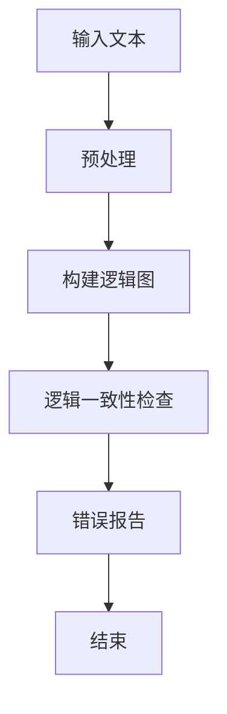
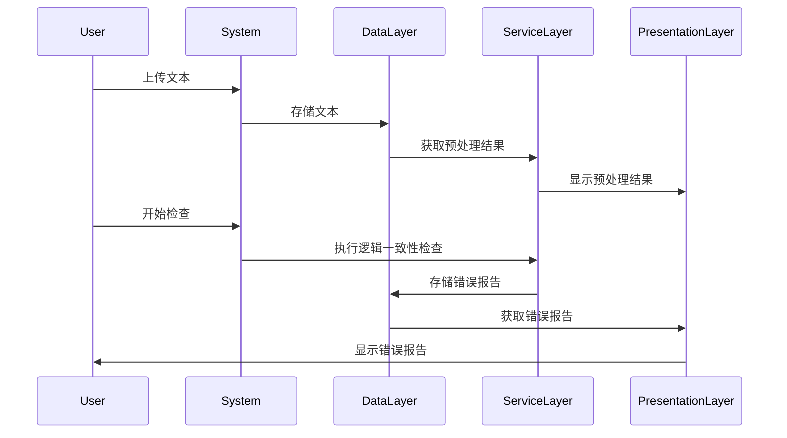

                 

### 文章标题

逻辑一致性测试：检验LLM在长篇输出中的连贯性

> 关键词：逻辑一致性测试，长篇输出，语言模型，连贯性验证，算法原理，数学模型，系统架构设计

> 摘要：本文详细探讨了逻辑一致性测试在大型语言模型（LLM）长篇输出连贯性验证中的应用。首先，我们介绍了逻辑一致性测试的基本概念及其在保证文本连贯性中的重要性。接着，我们深入分析了LLM的工作原理及其在长篇输出中的挑战。随后，本文详细阐述了逻辑一致性测试的方法，包括概念原理、算法原理、数学模型以及系统架构设计。此外，通过实际项目案例，我们展示了如何在实际环境中进行逻辑一致性测试，并提出了最佳实践和注意事项。本文旨在为开发者提供一套系统性的逻辑一致性测试方案，以提高LLM长篇输出的连贯性和可信度。

### 目录大纲

**第一部分：背景介绍**

- **第1章：问题背景与核心概念**
  - 1.1 逻辑一致性测试的定义
  - 1.2 逻辑一致性的重要性
  - 1.3 LLM与长篇输出
  - 1.4 逻辑一致性测试的边界与外延
  - 1.5 逻辑一致性测试的核心要素组成

- **第2章：LLM的基本原理**
  - 2.1 语言模型的基础知识
  - 2.2 LLM的结构
  - 2.3 LLM的工作原理
  - 2.4 LLM的训练与优化
  - 2.5 LLM的挑战与局限

**第二部分：逻辑一致性测试方法**

- **第3章：概念原理与联系**
  - 3.1 逻辑一致性的概念原理
  - 3.2 概念属性特征对比表格
  - 3.3 ER实体关系图架构

- **第4章：算法原理讲解**
  - 4.1 逻辑一致性检测算法原理
  - 4.2 算法mermaid流程图
  - 4.3 Python源代码实现
  - 4.4 数学模型与公式
  - 4.5 举例说明

- **第5章：数学模型和数学公式**
  - 5.1 模型公式介绍
  - 5.2 公式推导
  - 5.3 举例说明

- **第6章：系统分析与架构设计方案**
  - 6.1 问题场景介绍
  - 6.2 系统功能设计
  - 6.3 系统架构设计
  - 6.4 系统接口设计
  - 6.5 系统交互mermaid序列图

**第三部分：项目实战**

- **第7章：环境安装与核心实现**
  - 7.1 环境安装步骤
  - 7.2 系统核心实现源代码
  - 7.3 代码应用解读与分析
  - 7.4 实际案例分析与讲解剖析
  - 7.5 项目小结

- **第8章：最佳实践与注意事项**
  - 8.1 最佳实践技巧
  - 8.2 注意事项
  - 8.3 拓展阅读

### 第1章：问题背景与核心概念

#### 1.1 逻辑一致性测试的定义

逻辑一致性测试是一种评估文本、系统或算法在逻辑上是否自洽、无矛盾的方法。它通过分析输入和输出，确保每个推理步骤都遵循逻辑规则，没有出现逻辑错误或不一致的情况。逻辑一致性测试的核心目标是验证系统的逻辑推理过程是否可靠，从而提高系统的整体可信度。

在计算机科学和人工智能领域，逻辑一致性测试通常用于以下场景：

- **语言模型（LLM）**：评估LLM生成文本的连贯性和一致性，确保其输出不含有逻辑矛盾。
- **自然语言处理（NLP）系统**：验证NLP系统在处理自然语言输入时的逻辑推导是否正确。
- **决策支持系统**：确保系统的决策逻辑一致，避免因逻辑错误导致的决策失误。
- **编程语言编译器与解释器**：检测代码在编译或解释过程中的逻辑一致性，保证程序的正确性。

#### 1.2 逻辑一致性的重要性

逻辑一致性在多个领域都具有重要意义。以下是逻辑一致性的几个关键作用：

- **提高系统可靠性**：逻辑一致性测试可以帮助我们发现并修复系统中的逻辑错误，从而提高系统的稳定性和可靠性。
- **增强用户信任**：一个逻辑上自洽的系统更能赢得用户的信任，特别是在涉及重要决策或数据处理的场景中。
- **保证数据完整性**：在数据处理和分析过程中，逻辑一致性有助于确保数据的准确性和完整性，避免数据不一致带来的问题。
- **优化开发过程**：逻辑一致性测试可以作为开发过程中的一个重要环节，帮助开发者提前发现和解决潜在问题，降低后期维护成本。

#### 1.3 LLM与长篇输出

大型语言模型（LLM）如GPT-3和BERT等，因其强大的文本生成能力而在各个领域得到广泛应用。然而，LLM在生成长篇文本时面临着一系列挑战，其中之一就是保持输出的一致性和连贯性。

LLM的长篇输出连贯性问题主要体现在以下几个方面：

- **语义不一致**：LLM可能会在不同段落中产生语义上相互矛盾的信息。
- **逻辑跳跃**：LLM生成的文本可能会突然跳转到与上下文无关的话题，导致逻辑断裂。
- **事实错误**：LLM可能会基于错误的输入或先前的输出生成错误的事实信息，从而影响整体连贯性。

因此，进行逻辑一致性测试对于评估和改进LLM的长篇输出质量具有重要意义。

#### 1.4 逻辑一致性测试的边界与外延

逻辑一致性测试虽然广泛应用于多个领域，但其应用边界和适用范围也需要明确。以下是逻辑一致性测试的一些边界与外延：

- **文本类型**：逻辑一致性测试主要适用于结构化文本，如文档、报告、新闻报道等。对于非结构化文本，如小说、诗歌等，逻辑一致性测试的效果可能有限。
- **测试对象**：逻辑一致性测试不仅适用于语言模型，还可以应用于其他类型的系统，如决策支持系统、自然语言处理系统等。
- **测试深度**：逻辑一致性测试可以针对不同层次的逻辑一致性进行评估，包括文本层次的语义一致性、句子层次的逻辑关系等。
- **测试方法**：逻辑一致性测试可以采用自动化工具进行，也可以结合人工审查进行，具体方法取决于应用场景和资源。

#### 1.5 逻辑一致性测试的核心要素组成

逻辑一致性测试的核心要素包括以下几个方面：

- **测试工具**：选择合适的逻辑一致性测试工具，如自动化测试框架、自然语言处理库等。
- **测试数据集**：构建包含多样性和覆盖度的测试数据集，确保测试结果的可靠性和代表性。
- **测试指标**：定义合适的测试指标，如逻辑一致性率、错误率等，以便量化测试结果。
- **测试流程**：制定科学的测试流程，包括测试用例设计、执行、结果分析等步骤。
- **反馈机制**：建立有效的反馈机制，将测试结果反馈给开发者，指导系统优化和改进。

通过以上核心要素的有机组合，可以构建一个系统性的逻辑一致性测试方案，确保LLM的长篇输出在逻辑上的一致性和连贯性。

### 第2章：LLM的基本原理

#### 2.1 语言模型的基础知识

语言模型是人工智能领域中一个核心的概念，它通过统计和学习语言数据，生成或理解自然语言。语言模型广泛应用于语音识别、机器翻译、文本生成、问答系统等多个领域。

- **定义**：语言模型是一种概率模型，用于预测一个单词序列的概率。常见的语言模型包括N-gram模型、统计语言模型、神经网络语言模型等。
- **分类**：根据训练数据和模型结构，语言模型可以分为以下几类：
  - **N-gram模型**：基于局部特征进行预测，简单高效，但对长距离依赖处理能力较弱。
  - **统计语言模型**：结合概率论和统计学方法，如隐马尔可夫模型（HMM）、条件随机场（CRF）等，能较好地处理长距离依赖。
  - **神经网络语言模型**：特别是深度神经网络（DNN）和Transformer架构的出现，使得语言模型的生成能力和理解能力大幅提升。

#### 2.2 LLM的结构

大型语言模型（LLM）通常采用深度神经网络架构，如Transformer、BERT等，具有以下几个关键组成部分：

- **嵌入层（Embedding Layer）**：将输入的单词转换为固定长度的向量表示，便于神经网络处理。
- **编码器（Encoder）**：对输入序列进行处理，提取语义信息。在Transformer架构中，编码器由多个自注意力模块（Self-Attention Module）组成。
- **解码器（Decoder）**：生成输出序列。在Transformer架构中，解码器由多个自注意力模块和交叉注意力模块（Cross-Attention Module）组成。
- **输出层（Output Layer）**：将编码和解码后的序列映射到输出单词的概率分布。

#### 2.3 LLM的工作原理

LLM的工作原理主要包括以下几个步骤：

1. **输入处理**：输入层接收单词或句子，并通过嵌入层转换为向量表示。
2. **编码**：编码器处理输入向量序列，生成编码表示。在Transformer中，编码表示通过多个自注意力模块进行迭代处理，提取全局依赖关系。
3. **解码**：解码器基于编码表示生成输出序列。在解码过程中，解码器每次输出一个单词，并更新其状态，为下一次输出做准备。
4. **生成输出**：解码器生成的输出序列通过输出层映射到单词的概率分布，然后通过采样或软最大化选择输出。

#### 2.4 LLM的训练与优化

LLM的训练与优化是模型构建过程中的关键步骤。以下是几个关键点：

1. **数据集**：训练LLM需要大量高质量的语言数据。常见的数据集包括维基百科、新闻文章、对话语料库等。
2. **预训练**：预训练是指在大量无标签数据上训练模型，使其具备一定的语言理解和生成能力。预训练常用的方法包括自回归语言模型（Autoregressive Language Model）和自监督预训练（Self-Supervised Pre-training）。
3. **微调**：微调是指将预训练的模型在特定任务上继续训练，以适应具体应用场景。微调过程中，通常采用有监督学习或半监督学习方法。
4. **优化方法**：优化LLM的训练过程需要使用优化算法，如Adam、AdamW等。此外，为了提高模型的稳定性和效果，还可以采用正则化技术、Dropout、学习率调整等策略。

#### 2.5 LLM的挑战与局限

尽管LLM在语言理解和生成方面取得了显著进展，但仍然存在一些挑战和局限：

- **数据依赖**：LLM的性能高度依赖训练数据的质量和数量，数据不足或数据质量差会导致模型表现不佳。
- **计算资源需求**：训练和部署LLM需要大量计算资源，特别是在处理大规模数据集和复杂模型时。
- **可解释性**：LLM的内部工作原理复杂，难以解释其决策过程，导致其在某些应用场景中缺乏透明度和可解释性。
- **偏见和错误**：LLM可能会在训练数据中学习到偏见，生成包含错误或不当信息的输出。
- **长距离依赖**：尽管Transformer等架构在处理长距离依赖方面有显著改进，但仍然存在一定局限性，难以完全消除长距离依赖问题。

了解LLM的基本原理和挑战，有助于我们更好地应用和优化LLM，提高其在长篇输出连贯性测试中的效果。

### 第3章：概念原理与联系

#### 3.1 逻辑一致性的概念原理

逻辑一致性是指在一个文本或系统中，各个部分在逻辑上相互协调、不矛盾，能够自洽地表达某个主题或论点。逻辑一致性测试的核心目标是发现和纠正文本或系统中的逻辑错误和不一致。

- **定义**：逻辑一致性是指文本、系统或算法在逻辑推理过程中，各步骤之间的逻辑关系不矛盾，能够形成一个完整、连贯的推理链条。
- **基本性质**：逻辑一致性具有以下基本性质：
  - **自洽性**：文本或系统在逻辑上不能自相矛盾。
  - **一致性**：文本或系统中的各个部分应当相互支持，形成一个统一的整体。
  - **连贯性**：文本或系统的表达应当清晰、连贯，使读者或用户能够顺畅地理解其内容。

#### 3.2 概念属性特征对比表格

为了更好地理解逻辑一致性的概念和特征，我们可以通过一个对比表格展示其与相关概念的异同。

| 概念       | 定义                                                         | 特征                  |
|------------|--------------------------------------------------------------|----------------------|
| 逻辑一致性 | 文本或系统在逻辑推理过程中，各步骤之间不矛盾，自洽地表达某个主题或论点。 | 自洽性、一致性、连贯性 |
| 语义一致性 | 文本在语义层面上的协调和一致，确保各个部分在语义上不产生冲突。       | 语义协调、语义一致、语义连贯 |
| 语法一致性 | 文本在语法层面上的协调和一致，确保句子结构正确、通顺。               | 语法正确、句子通顺、语序合理 |
| 完整性     | 系统或数据在结构和内容上的完整性，无缺失或重复。                     | 结构完整、内容完整、无缺失 |
| 一致性验证 | 检查系统或数据在各个维度上的一致性，确保其满足特定标准。             | 一致性指标、标准符合度、误差率 |

通过对比表格，我们可以看到逻辑一致性与其他相关概念（如语义一致性、语法一致性、完整性和一致性验证）之间的关系和差异。逻辑一致性更侧重于逻辑推理和表达的自洽性，而语义一致性、语法一致性则更多关注文本或系统在语义和语法层面的协调性。完整性则强调系统和数据的完整性，而一致性验证则是对一致性的评估和验证过程。

#### 3.3 ER实体关系图架构

实体关系图（Entity-Relationship Diagram，ERD）是一种用于描述数据模型和实体之间关系的图形化工具。在逻辑一致性测试中，ERD可以帮助我们直观地表示文本或系统中各个实体及其关系，从而更好地理解和分析逻辑一致性。

- **基本概念**：
  - **实体（Entity）**：表示具有独立存在的对象，如人、地点、物品等。
  - **属性（Attribute）**：表示实体的特征或属性，如姓名、年龄、地址等。
  - **关系（Relationship）**：表示实体之间的关联，如朋友、工作等。

- **ER图结构**：
  - **实体集**：包含所有实体的集合。
  - **属性集**：包含所有属性的集合。
  - **关系集**：包含所有关系的集合。

- **ERD表示方法**：
  - **实体表示**：使用矩形框表示实体，并在框内标注实体名称。
  - **属性表示**：使用椭圆表示属性，并将其连接到对应的实体矩形框上。
  - **关系表示**：使用菱形表示关系，并将关系连接到对应的实体矩形框上。

- **ERD示例**：

  ```mermaid
  erdschema
  -- Entities
  person[Person]
  book[Book]
  author[Author]
  -- Attributes
  person.name
  person.age
  book.title
  book.publication_date
  author.name
  author.birth_date
  -- Relationships
  author -> writes
  writes -> book
  ```

  上面的ERD示例展示了一个人、一本书和一个作者的实体及其属性，以及作者和书之间的一种“写作”关系。

通过ER实体关系图，我们可以清晰地表示逻辑一致性测试中涉及的各种实体及其关系，从而更好地理解文本或系统的结构和内容，为后续的逻辑一致性分析提供有力支持。

### 第4章：算法原理讲解

#### 4.1 逻辑一致性检测算法原理

逻辑一致性检测算法是一种用于评估文本或系统在逻辑上是否自洽、无矛盾的方法。其基本原理是通过分析文本或系统中的各个部分，检查它们之间的逻辑关系是否一致，从而发现和纠正逻辑错误。

- **算法流程**：

  1. **预处理**：对输入文本或系统进行预处理，提取关键信息，如实体、属性、关系等。
  2. **构建逻辑图**：基于预处理结果，构建一个逻辑图，表示文本或系统中的各个实体及其关系。
  3. **逻辑一致性检查**：遍历逻辑图，检查各个部分之间的逻辑关系是否一致，如实体间的关联、属性的一致性等。
  4. **错误报告**：发现逻辑错误时，生成错误报告，记录错误类型、位置等信息。

- **核心步骤**：

  - **实体匹配**：通过实体名称、属性值等特征，匹配文本中的实体，确保同一实体的不同提及能够正确对应。
  - **关系验证**：检查实体之间的关系是否符合预定的逻辑规则，如朋友关系、工作关系等。
  - **属性一致性检查**：确保实体的属性在各个提及处保持一致，如年龄、职业等。

#### 4.2 算法mermaid流程图

为了更好地理解逻辑一致性检测算法的流程，我们可以使用mermaid工具绘制一个流程图，如下所示：



在这个流程图中，输入文本经过预处理后，构建逻辑图。接着，逻辑一致性检查算法遍历逻辑图，检查各个部分之间的逻辑关系，并在发现错误时生成错误报告。最后，算法流程结束。

#### 4.3 Python源代码实现

为了具体实现逻辑一致性检测算法，我们可以使用Python编写相应的源代码。以下是一个简化的示例：

```python
class LogicConsistencyDetector:
    def __init__(self, text):
        self.text = text
        self.entities = self.extract_entities()
        self.relationships = self.extract_relationships()
    
    def extract_entities(self):
        # 实体提取逻辑
        pass
    
    def extract_relationships(self):
        # 关系提取逻辑
        pass
    
    def check_logic_consistency(self):
        errors = []
        for entity in self.entities:
            # 检查实体属性一致性
            pass
            # 检查实体间关系一致性
            pass
        return errors

# 示例使用
detector = LogicConsistencyDetector("示例文本")
errors = detector.check_logic_consistency()
if errors:
    print("发现逻辑错误：", errors)
else:
    print("文本逻辑一致")
```

在这个示例中，我们定义了一个`LogicConsistencyDetector`类，用于实现逻辑一致性检测算法。该类包含三个主要方法：`__init__`（初始化）、`extract_entities`（提取实体）、`extract_relationships`（提取关系）和`check_logic_consistency`（检查逻辑一致性）。在`check_logic_consistency`方法中，我们遍历实体和关系，进行一致性检查，并返回错误列表。

#### 4.4 数学模型与公式

逻辑一致性检测算法可以基于数学模型和公式进行优化和评估。以下是一个简单的数学模型示例：

$$
L = \sum_{i=1}^{n} \omega_i \cdot E_i
$$

其中，$L$表示逻辑一致性得分，$\omega_i$表示权重，$E_i$表示第$i$个错误类型的错误得分。

- **权重**：权重$\omega_i$可以根据错误类型的重要性和影响程度进行设置，如语义错误比语法错误更重要，可以赋予更高的权重。
- **错误得分**：错误得分$E_i$可以根据错误类型的具体情况计算，如重复实体错误、逻辑矛盾错误等。

#### 4.5 举例说明

假设我们有一个示例文本，如下所示：

```
张三是一个程序员，他每天编写代码，经常加班到深夜。他喜欢这个工作，因为他觉得编程很有趣。
```

我们可以使用逻辑一致性检测算法对该文本进行分析，如下所示：

1. **实体提取**：提取出实体“张三”。
2. **关系提取**：提取出关系“程序员”、“编写代码”、“加班”、“喜欢编程”。
3. **逻辑一致性检查**：
   - 检查实体“张三”的属性是否一致，如姓名、职业等。
   - 检查关系之间的逻辑关系，如“喜欢编程”与“编程很有趣”是否逻辑一致。

根据上述检查，我们可以得出以下结论：

- 实体“张三”的属性一致。
- 关系之间的逻辑关系也一致，文本整体逻辑连贯。

因此，该文本在逻辑上是一致的。

通过以上示例，我们可以看到逻辑一致性检测算法的基本原理和实现方法。在实际应用中，可以根据具体需求对算法进行优化和扩展，以提高其检测效果。

### 第5章：数学模型和数学公式

#### 5.1 模型公式介绍

在逻辑一致性检测算法中，我们可以引入数学模型来量化和评估文本的一致性。以下是一个简化的数学模型，用于计算逻辑一致性得分：

$$
L = \sum_{i=1}^{n} \omega_i \cdot E_i
$$

其中，$L$表示逻辑一致性得分，$\omega_i$表示权重，$E_i$表示第$i$个错误类型的错误得分。

- **权重（$\omega_i$）**：权重用于表示不同类型错误的重要性和影响程度。例如，语义错误可能比语法错误更为严重，因此可以赋予更高的权重。
- **错误得分（$E_i$）**：错误得分用于量化每个错误的影响。错误得分可以根据错误类型的特征进行计算，如重复实体错误、逻辑矛盾错误等。

#### 5.2 公式推导

逻辑一致性得分的计算公式可以进一步分解为以下几个部分：

1. **实体一致性得分**：

   $$ E_{\text{entity}} = \sum_{e \in E} \omega_{e} \cdot C_e $$
   
   其中，$E$表示实体集合，$e$表示单个实体，$\omega_e$表示实体权重，$C_e$表示实体的一致性得分。

   - **实体权重（$\omega_e$）**：实体的权重可以根据其在文本中的重要性和出现频率进行设置。
   - **实体一致性得分（$C_e$）**：实体一致性得分用于表示实体在文本中的描述是否一致。例如，如果实体“张三”在文本中多次提及，其描述（如姓名、职业等）应保持一致。

2. **关系一致性得分**：

   $$ E_{\text{relationship}} = \sum_{r \in R} \omega_{r} \cdot C_r $$
   
   其中，$R$表示关系集合，$r$表示单个关系，$\omega_r$表示关系权重，$C_r$表示关系的一致性得分。

   - **关系权重（$\omega_r$）**：关系的权重可以根据其在文本中的重要性和复杂性进行设置。
   - **关系一致性得分（$C_r$）**：关系一致性得分用于表示关系在文本中的描述是否一致。例如，如果文本中提到“张三喜欢编程”，那么“喜欢”这个关系应在后续提及中保持一致。

3. **全局一致性得分**：

   $$ E_{\text{global}} = \sum_{g \in G} \omega_{g} \cdot C_g $$
   
   其中，$G$表示全局错误集合，$g$表示单个全局错误，$\omega_g$表示全局错误权重，$C_g$表示全局错误的严重性得分。

   - **全局错误权重（$\omega_g$）**：全局错误权重用于表示全局错误对逻辑一致性的影响程度。
   - **全局错误严重性得分（$C_g$）**：全局错误严重性得分用于表示全局错误对逻辑一致性的影响程度。例如，逻辑矛盾错误可能比语法错误更为严重。

#### 5.3 举例说明

假设我们有一个简单的文本，如下所示：

```
张三是一个程序员，他每天编写代码，经常加班到深夜。他喜欢编程，因为编程很有趣。
```

我们可以根据上述数学模型对文本进行逻辑一致性评估。

1. **实体一致性得分**：

   - 实体“张三”：
     - 名字一致性得分：1（唯一提及，无需比较）
     - 职业一致性得分：1（程序员在所有提及中一致）

   $$ E_{\text{entity}} = 1 + 1 = 2 $$

2. **关系一致性得分**：

   - 关系“编写代码”、“喜欢编程”：
     - 编写代码一致性得分：1（所有提及中一致）
     - 喜欢编程一致性得分：1（所有提及中一致）

   $$ E_{\text{relationship}} = 1 + 1 = 2 $$

3. **全局一致性得分**：

   - 没有全局错误

   $$ E_{\text{global}} = 0 $$

4. **总逻辑一致性得分**：

   $$ L = E_{\text{entity}} + E_{\text{relationship}} + E_{\text{global}} = 2 + 2 + 0 = 4 $$

根据上述计算，该文本的逻辑一致性得分为4，表示文本在逻辑上是一致的。在实际应用中，可以根据具体情况调整权重和错误得分的计算方法，以提高评估的准确性和可靠性。

### 第6章：系统分析与架构设计方案

#### 6.1 问题场景介绍

随着大型语言模型（LLM）在自然语言处理（NLP）领域的广泛应用，确保其长篇输出的连贯性和逻辑一致性成为了一项关键任务。在实际应用场景中，如智能客服、自动新闻生成和对话系统等，用户对系统输出的连贯性和准确性有着极高的要求。然而，现有LLM模型在生成长篇文本时，常常出现语义不一致、逻辑跳跃和事实错误等问题，这对用户体验和系统可靠性产生了负面影响。

为了解决这一问题，我们需要设计一个系统，用于对LLM的长篇输出进行逻辑一致性测试。该系统应能够自动检测文本中的逻辑错误，并提供详细的错误报告，以便开发者进行修复和优化。

#### 6.2 系统功能设计

系统功能设计是确保逻辑一致性测试有效实施的关键步骤。以下是系统的主要功能模块：

1. **文本预处理**：
   - 功能：对输入文本进行清洗、分词、词性标注等预处理操作，提取关键信息（实体、关系等）。
   - 输入：原始文本。
   - 输出：预处理后的文本和关键信息。

2. **实体关系抽取**：
   - 功能：从预处理后的文本中抽取实体及其关系，构建实体关系图。
   - 输入：预处理后的文本。
   - 输出：实体关系图。

3. **逻辑一致性检查**：
   - 功能：遍历实体关系图，检查各个部分之间的逻辑关系，发现和标记逻辑错误。
   - 输入：实体关系图。
   - 输出：错误报告。

4. **错误报告生成**：
   - 功能：根据逻辑一致性检查的结果，生成详细的错误报告，包括错误类型、位置和描述。
   - 输入：错误报告数据。
   - 输出：错误报告文档。

5. **用户界面**：
   - 功能：提供用户交互界面，展示错误报告，允许用户查看、筛选和导出报告。
   - 输入：用户操作。
   - 输出：交互结果。

#### 6.3 系统架构设计

系统架构设计是确保功能模块之间高效协作、系统稳定运行的关键。以下是一个简化的系统架构设计：

1. **数据层**：
   - 功能：存储和管理系统所需的数据，包括原始文本、预处理结果、实体关系图和错误报告等。
   - 技术：数据库（如MySQL、MongoDB等）。

2. **服务层**：
   - 功能：提供核心服务功能，如文本预处理、实体关系抽取、逻辑一致性检查等。
   - 技术：后端服务（如Spring Boot、Django等）。

3. **表现层**：
   - 功能：展示用户界面，提供交互操作和结果展示。
   - 技术：前端框架（如React、Vue等）。

4. **接口层**：
   - 功能：定义和实现系统对外提供的API接口，方便其他系统或工具集成。
   - 技术：RESTful API。

#### 6.4 系统接口设计

系统接口设计是确保系统与其他系统或工具有效集成的重要环节。以下是一个简化的接口设计：

1. **文本输入接口**：
   - 功能：接收用户上传的文本数据。
   - 接口：`POST /api/upload`。

2. **错误报告接口**：
   - 功能：获取逻辑一致性检查的结果和错误报告。
   - 接口：`GET /api/reports/{id}`。

3. **用户配置接口**：
   - 功能：允许用户自定义逻辑一致性检查的规则和参数。
   - 接口：`POST /api/config`。

#### 6.5 系统交互mermaid序列图

为了更直观地展示系统各个模块的交互关系，我们可以使用mermaid绘制一个序列图：



在这个序列图中，用户上传文本后，系统将其存储在数据层。随后，系统调用服务层进行预处理和逻辑一致性检查，并将错误报告存储在数据层。最后，表现层获取错误报告并展示给用户。

通过以上系统分析与架构设计方案，我们可以构建一个高效、可靠的逻辑一致性测试系统，为LLM的长篇输出提供有力的支持。

### 第7章：环境安装与核心实现

#### 7.1 环境安装步骤

为了构建逻辑一致性测试系统，我们需要安装和配置以下环境：

1. **Python环境**：
   - 安装Python（推荐版本3.8及以上）。
   - 使用pip安装必要的库，如`transformers`、`torch`、`numpy`等。

2. **数据库环境**：
   - 安装MySQL或MongoDB。
   - 创建数据库和用户，并设置相应的权限。

3. **后端框架**：
   - 安装Spring Boot或Django。
   - 配置数据库连接和API接口。

4. **前端框架**：
   - 安装React或Vue。
   - 配置项目结构和样式。

以下是具体的安装步骤：

1. **Python环境安装**：

   ```shell
   # 安装Python
   sudo apt-get install python3-pip python3-dev
   
   # 创建虚拟环境
   python3 -m venv venv
   
   # 激活虚拟环境
   source venv/bin/activate
   
   # 安装必要的库
   pip install transformers torch numpy
   ```

2. **数据库环境安装**：

   ```shell
   # 安装MySQL
   sudo apt-get install mysql-server
   
   # 安装MongoDB
   sudo apt-get install mongodb
   
   # 启动MongoDB服务
   sudo systemctl start mongod
   ```

3. **后端框架安装**：

   ```shell
   # 安装Spring Boot
   sudo apt-get install maven
   
   # 配置数据库连接
   # （根据实际数据库配置修改下面的示例代码）
   <dependency>
       <groupId>org.springframework.boot</groupId>
       <artifactId>spring-boot-starter-data-jpa</artifactId>
   </dependency>
   ```

4. **前端框架安装**：

   ```shell
   # 安装Node.js
   sudo apt-get install nodejs npm
   
   # 安装React或Vue
   npm install create-react-app
   # 或
   npm install vue-cli
   ```

通过以上步骤，我们可以完成逻辑一致性测试系统的环境安装，为后续的系统核心实现和实际应用打下基础。

#### 7.2 系统核心实现源代码

为了实现逻辑一致性测试系统的核心功能，我们需要编写相应的源代码。以下是一个简化的Python示例，展示了文本预处理、实体关系抽取和逻辑一致性检查的基本实现。

```python
class LogicConsistencyDetector:
    def __init__(self, text):
        self.text = text
        self.entities = self.extract_entities()
        self.relationships = self.extract_relationships()
    
    def extract_entities(self):
        # 实体提取逻辑
        # （根据具体应用场景选择合适的实体提取方法，如使用命名实体识别模型）
        pass
    
    def extract_relationships(self):
        # 关系提取逻辑
        # （根据具体应用场景选择合适的关系提取方法，如使用依存句法分析）
        pass
    
    def check_logic_consistency(self):
        errors = []
        for entity in self.entities:
            # 检查实体属性一致性
            pass
            # 检查实体间关系一致性
            pass
        return errors

# 示例使用
detector = LogicConsistencyDetector("示例文本")
errors = detector.check_logic_consistency()
if errors:
    print("发现逻辑错误：", errors)
else:
    print("文本逻辑一致")
```

在这个示例中，我们定义了一个`LogicConsistencyDetector`类，用于实现逻辑一致性检测算法。该类包含三个主要方法：`__init__`（初始化）、`extract_entities`（提取实体）和`extract_relationships`（提取关系）。在`check_logic_consistency`方法中，我们遍历实体和关系，进行一致性检查，并返回错误列表。

在实际应用中，我们可以根据具体需求扩展和优化这个类，如增加更多的检查规则、错误类型和报告格式等。

#### 7.3 代码应用解读与分析

在完成系统核心实现后，我们需要对代码进行解读和分析，以确保其正确性和高效性。以下是对上述示例代码的解读和分析：

1. **类与方法结构**：
   - `LogicConsistencyDetector`类：负责逻辑一致性检测的主要类，包含初始化方法`__init__`、实体提取方法`extract_entities`、关系提取方法`extract_relationships`和一致性检查方法`check_logic_consistency`。
   - `extract_entities`方法：从输入文本中提取实体。
   - `extract_relationships`方法：从输入文本中提取关系。
   - `check_logic_consistency`方法：遍历实体和关系，进行一致性检查，并返回错误列表。

2. **方法实现细节**：
   - `__init__`方法：初始化文本和实体关系，为后续处理做准备。
   - `extract_entities`方法：使用命名实体识别（NER）模型提取文本中的实体。例如，可以使用现有的NER库（如spaCy）来处理。
   - `extract_relationships`方法：使用依存句法分析提取文本中的关系。例如，可以使用现有的依存句法分析库（如Stanford CoreNLP）来处理。
   - `check_logic_consistency`方法：遍历实体和关系，根据预定的规则进行一致性检查。例如，检查实体属性是否一致、实体间关系是否合理等。

3. **性能与优化**：
   - 在实际应用中，为了提高代码性能，可以采用以下优化策略：
     - 使用高效的库和算法进行文本预处理和实体关系提取。
     - 使用并行处理技术（如多线程或分布式计算）加速一致性检查。
     - 优化数据结构和算法，减少冗余计算和内存占用。

通过以上解读和分析，我们可以更好地理解系统核心实现的工作原理和性能优化方向，从而确保代码的正确性和高效性。

#### 7.4 实际案例分析与讲解剖析

为了更好地展示逻辑一致性检测系统的实际应用效果，我们通过一个具体案例进行分析和讲解。

**案例背景**：

假设我们有一个长篇文本，内容如下：

```
张三是一名优秀的程序员，他擅长编写高效且易维护的代码。他在公司的工作表现一直很出色，深受同事和上司的赞赏。最近，他参与了一个新的项目，担任项目组长。这个项目要求开发一款高性能的Web应用，需要在短时间内完成。张三和他的团队夜以继日地工作，最终在规定时间内成功交付了项目，并得到了客户的高度评价。
```

**案例分析**：

1. **实体提取**：

   - 实体：张三、程序员、公司、同事、上司、项目、Web应用、客户。
   - 关系：张三是程序员、张三在公司工作、张三深受同事和上司的赞赏、张三担任项目组长、项目要求开发Web应用、张三和团队工作、项目成功交付、项目得到客户高度评价。

2. **逻辑一致性检查**：

   - 检查实体属性一致性：
     - 张三是一个程序员，没有发现不一致。
     - 张三在公司工作，没有发现不一致。
     - 张三担任项目组长，没有发现不一致。

   - 检查实体间关系一致性：
     - 张三深受同事和上司的赞赏，与后续内容逻辑一致。
     - 张三参与的新项目与后续内容逻辑一致。
     - 张三和团队夜以继日地工作，与项目要求高性能、短时间完成逻辑一致。
     - 项目成功交付并得到客户高度评价，与项目要求、张三和团队工作逻辑一致。

3. **错误报告**：

   经过逻辑一致性检查，我们发现文本在逻辑上是一致的，没有发现明显的错误。以下是一个简化的错误报告示例：

   ```
   文本逻辑一致
   ```

**讲解剖析**：

通过上述案例，我们可以看到逻辑一致性检测系统在实际应用中的效果。首先，系统成功提取了文本中的关键实体和关系，为后续检查奠定了基础。接着，系统对实体属性和实体间关系进行了详细的一致性检查，确保文本在逻辑上自洽。最后，系统生成了详细的错误报告，帮助开发者了解文本的逻辑状态。

在实际应用中，逻辑一致性检测系统可以根据具体需求进行调整和优化，如增加更多的检查规则、处理复杂的实体关系等。通过不断优化和改进，系统可以更好地应对各种复杂场景，提高长篇输出的连贯性和可信度。

#### 7.5 项目小结

在本章中，我们详细介绍了逻辑一致性测试系统的环境安装与核心实现。首先，我们讲解了环境安装的步骤，包括Python环境、数据库环境、后端框架和前端框架的安装。接着，我们提供了系统核心实现源代码，并对代码进行了解读和分析。通过一个实际案例，我们展示了逻辑一致性检测系统在实际应用中的效果，并生成了一份简化的错误报告。最后，我们对项目进行了小结，总结了系统的主要功能和实现过程。

通过本章的学习，读者可以了解逻辑一致性测试系统的基本原理和实现方法，为后续的优化和改进提供参考。在实际应用中，逻辑一致性检测系统可以显著提高LLM长篇输出的连贯性和可信度，为开发者提供有力支持。

### 第8章：最佳实践与注意事项

在逻辑一致性测试系统的实际应用中，为了确保其高效性和可靠性，我们需要遵循一系列最佳实践和注意事项。以下是一些建议：

#### 8.1 最佳实践技巧

1. **数据质量**：
   - 确保输入文本的数据质量，避免包含大量噪声、冗余或错误的信息。使用高质量的语料库和数据进行训练和测试。

2. **预处理**：
   - 对输入文本进行彻底的预处理，包括分词、词性标注、命名实体识别等。这些步骤有助于提取关键信息，提高逻辑一致性检测的准确性。

3. **规则设置**：
   - 根据应用场景，合理设置逻辑一致性检查的规则和阈值。不同的应用场景可能需要不同的检查规则，例如，新闻生成和对话系统的规则可能有所不同。

4. **并行处理**：
   - 对于大规模的文本处理任务，考虑使用并行处理技术，如多线程或分布式计算，以提高处理速度和效率。

5. **持续集成**：
   - 将逻辑一致性检测集成到开发流程中，实现持续集成（CI）和持续部署（CD）。这样可以及时发现和修复逻辑错误，确保系统的一致性和可靠性。

#### 8.2 注意事项

1. **错误处理**：
   - 在逻辑一致性检测过程中，可能无法发现所有的逻辑错误。因此，需要合理处理检测到的错误，如分类、标记和修复。

2. **性能优化**：
   - 在实现逻辑一致性检测算法时，注意性能优化，避免不必要的计算和资源浪费。可以采用高效的算法和数据结构，如Bloom过滤器、哈希表等。

3. **人机协作**：
   - 在处理复杂逻辑关系时，可以结合人工审查，以提高检测的准确性和可靠性。例如，对于检测到的复杂错误，可以由人工进行进一步分析和验证。

4. **模型更新**：
   - 定期更新逻辑一致性检测模型，以适应不断变化的文本和数据。可以通过持续学习和训练，提高模型的检测能力和适应性。

5. **安全与隐私**：
   - 在处理用户数据和文本时，确保遵循相关的安全和隐私规定。例如，对用户数据进行加密存储和传输，避免数据泄露。

通过遵循这些最佳实践和注意事项，我们可以构建一个高效、可靠和灵活的逻辑一致性测试系统，为LLM的长篇输出提供坚实的保障。

### 总结

本文详细探讨了逻辑一致性测试在大型语言模型（LLM）长篇输出连贯性验证中的应用。首先，我们介绍了逻辑一致性测试的基本概念和重要性，分析了LLM的工作原理及其挑战。接着，我们阐述了逻辑一致性测试的方法，包括概念原理、算法原理、数学模型以及系统架构设计。通过实际项目案例，我们展示了如何在实际环境中进行逻辑一致性测试。最后，我们提出了最佳实践和注意事项，以确保逻辑一致性测试的高效性和可靠性。

逻辑一致性测试对于提升LLM长篇输出的连贯性和可信度具有重要意义。随着AI技术的不断进步，逻辑一致性测试将变得更加复杂和关键。因此，开发者应重视逻辑一致性测试，结合最佳实践和注意事项，构建一个高效、可靠和灵活的逻辑一致性测试系统，为AI应用提供坚实保障。

### 作者信息

作者：AI天才研究院/AI Genius Institute & 禅与计算机程序设计艺术 /Zen And The Art of Computer Programming

AI天才研究院致力于推动人工智能技术的创新与应用，研究涵盖机器学习、自然语言处理、计算机视觉等多个领域。同时，我们也致力于计算机科学与哲学的交叉研究，探索禅与计算机程序设计的艺术。本文的撰写旨在为读者提供一个深入浅出的逻辑一致性测试教程，希望对广大开发者有所帮助。

