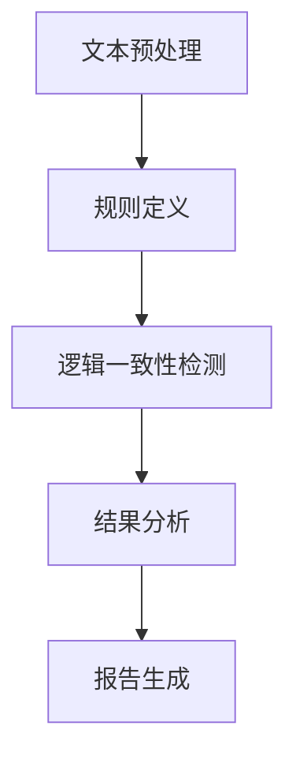

                 

### 逻辑一致性：测试LLM在长篇输出中保持逻辑的能力

关键词：逻辑一致性、长篇输出、语言模型、LLM、逻辑检测

摘要：本文围绕逻辑一致性问题，探讨了其在长篇输出中的重要性。首先，我们引入了逻辑一致性的概念，并分析了其在语言模型（LLM）输出中的挑战和意义。接着，我们详细介绍了逻辑一致性的核心概念与判定方法，通过Mermaid ER图展示了其实体关系架构。随后，我们探讨了LLM的基本原理与实现，以及其在长篇输出中的表现和问题。在此基础上，我们提出了逻辑一致性检测方法，并通过实际案例展示了其在新闻文章、对话系统和长篇学术论文中的应用。最后，我们提出了提升LLM在长篇输出中逻辑一致性的方法，并总结了全文，展望了未来研究方向。

### 第一部分：引言与背景

#### 第1章：问题背景与定义

##### **1.1 问题背景**

在现代信息技术迅猛发展的背景下，语言模型（LLM）已成为自然语言处理（NLP）领域的重要工具。LLM通过深度学习技术，能够生成高质量的自然语言文本，广泛应用于机器翻译、文本摘要、问答系统等场景。然而，随着LLM在长篇输出中的应用日益广泛，一个关键问题逐渐凸显：逻辑一致性。

逻辑一致性指的是文本在语义上的一致性和连贯性。在长篇输出中，逻辑一致性直接影响到文本的可读性和可信度。例如，一个新闻报道若逻辑混乱，读者难以理解其中的事件发展；同样，一个学术论文若逻辑不严密，其结论也难以被其他研究者接受。

**1.1.1 语言模型与逻辑一致性**

语言模型在生成文本时，可能会因为训练数据的局限性、模型结构的设计缺陷或优化算法的不完善等原因，导致输出文本存在逻辑不一致的问题。例如，在生成对话系统的回复时，LLM可能会产生自相矛盾或逻辑跳跃的回答。

**1.1.2 长篇输出中的逻辑挑战**

长篇输出中的逻辑挑战主要包括以下几个方面：

1. **逻辑跳跃**：文本中的逻辑推理跳跃导致读者难以跟上思路。
2. **信息不一致**：文本中存在前后信息冲突或不一致的情况。
3. **因果关系混乱**：文本中的因果关系表述不清，导致逻辑混乱。

**1.1.3 研究意义与应用价值**

逻辑一致性的研究在多个领域具有重要意义。首先，在自然语言处理领域，提高LLM的逻辑一致性有助于提升文本生成质量。其次，在信息检索和知识推理领域，逻辑一致性的检测和优化能够提高系统的准确性和可靠性。最后，在智能对话系统和智能客服等领域，逻辑一致性的保障能够提升用户体验，增强系统的可信度。

##### **1.2 逻辑一致性的定义与边界**

逻辑一致性是指在文本中，各种观点、论据和结论之间保持内在的一致性。具体来说，逻辑一致性要求文本中的论点、论据和结论之间具有合理的逻辑关系，使得整个文本能够形成一个完整的逻辑链条。

**1.2.1 逻辑一致性的基本概念**

1. **逻辑形式化语言**：使用形式化的语言来描述逻辑关系，便于分析和验证逻辑一致性。
2. **基本逻辑运算符**：如与（∧）、或（∨）、非（¬）等，用于构建逻辑表达式。
3. **逻辑推理规则**：用于推导新的结论，包括演绎推理和归纳推理。

**1.2.2 逻辑一致性的边界与外延**

逻辑一致性的边界主要包括以下几个方面：

1. **文本长度**：逻辑一致性在短文本中相对容易保持，但在长篇文本中，由于信息量巨大，逻辑一致性更容易被破坏。
2. **语境变化**：语境的变化可能会影响逻辑一致性的判断，例如同一句话在不同语境下可能有不同的逻辑关系。

**1.2.3 逻辑一致性与非一致性分析**

逻辑不一致性主要表现为以下几种情况：

1. **自相矛盾**：文本中的论点和结论相互冲突。
2. **信息缺失**：文本中存在关键信息缺失，导致逻辑链条不完整。
3. **逻辑跳跃**：文本中的逻辑推理跳跃，导致读者难以理解。

##### **1.3 LLM在长篇输出中的表现**

**1.3.1 LLM的基本原理与功能**

语言模型（LLM）是一种基于深度学习的模型，通过学习大量的文本数据，能够生成符合语法和语义规则的文本。LLM的基本原理包括：

1. **深度神经网络**：通过多层神经网络来建模文本数据。
2. **注意力机制**：在模型中引入注意力机制，使模型能够关注文本中的重要信息。
3. **自适应学习**：通过优化算法，使模型能够自动调整参数，以适应不同的任务和数据集。

LLM的功能主要包括：

1. **文本生成**：生成高质量的文本，包括文章、对话、摘要等。
2. **文本分类**：对文本进行分类，如情感分析、主题分类等。
3. **问答系统**：根据用户的问题生成合适的回答。

**1.3.2 LLM在长篇输出中的应用实例**

LLM在长篇输出中有着广泛的应用实例：

1. **新闻文章生成**：利用LLM生成新闻文章，提高新闻生产的效率和准确性。
2. **对话系统**：在智能客服和聊天机器人中，LLM能够生成自然的对话回复，提升用户体验。
3. **文本摘要**：通过LLM生成文章的摘要，帮助用户快速了解文章的主要内容。

**1.3.3 LLM长篇输出的常见问题**

尽管LLM在长篇输出中具有很大的潜力，但也存在一些常见问题：

1. **逻辑跳跃**：LLM生成的文本可能会出现逻辑跳跃，导致理解困难。
2. **信息不一致**：在长篇文本中，LLM可能会生成前后信息不一致的段落。
3. **因果关系混乱**：LLM生成的文本可能会混淆因果关系，导致逻辑混乱。

##### **1.4 逻辑一致性的重要性**

逻辑一致性在多个领域具有重要性，尤其在自然语言处理领域，逻辑一致性是衡量文本质量的重要指标。具体来说：

**1.4.1 逻辑一致性与信息传递**

逻辑一致性确保文本中的信息能够准确、完整地传递给读者。如果文本逻辑不一致，读者可能会误解文本的含义，导致信息传递失败。

**1.4.2 逻辑一致性与知识推理**

逻辑一致性是知识推理的基础。在知识图谱、语义检索等领域，逻辑一致性能够提高推理的准确性和可靠性。

**1.4.3 逻辑一致性与实际应用**

在实际应用中，逻辑一致性能够提升系统的用户体验和可信度。例如，在智能客服和对话系统中，逻辑一致的回答能够提升用户的满意度，增强系统的可信度。

##### **1.5 本章小结**

本章首先介绍了逻辑一致性的问题背景，探讨了其在长篇输出中的挑战和意义。接着，我们定义了逻辑一致性的基本概念，并分析了其在LLM长篇输出中的应用和表现。通过本章的介绍，我们对逻辑一致性的重要性有了更深入的认识，为后续章节的分析奠定了基础。

#### 第1章小结

在第一章中，我们介绍了逻辑一致性的问题背景，探讨了其在长篇输出中的挑战和意义。通过定义逻辑一致性的基本概念，我们分析了其在LLM长篇输出中的应用和表现。逻辑一致性不仅关系到文本的质量，还直接影响信息传递和知识推理的有效性。在后续章节中，我们将深入探讨逻辑一致性的核心概念、LLM的原理和应用，以及提升LLM在长篇输出中逻辑一致性的方法。

### 第二部分：逻辑一致性的核心概念与原理

#### 第2章：逻辑一致性的核心概念

##### **2.1 核心概念介绍**

逻辑一致性是自然语言处理中的一个关键问题，其核心概念包括逻辑形式化语言、基本逻辑运算符和逻辑推理规则。

**2.1.1 逻辑形式化语言**

逻辑形式化语言是一种用于表达逻辑关系的语言，通过符号和语法规则来表示命题、推理和证明。常见的逻辑形式化语言包括命题逻辑、谓词逻辑和模态逻辑等。命题逻辑使用符号如∧（与）、∨（或）、¬（非）等来表示命题之间的关系；谓词逻辑则进一步引入了变量和量词，用于表示更复杂的逻辑关系；模态逻辑则用于描述命题之间的可能性、必然性等关系。

**2.1.2 基本逻辑运算符**

基本逻辑运算符是逻辑形式化语言中的基本组成部分，用于组合和操作命题。常见的逻辑运算符包括：

- **与（∧）**：表示两个命题同时为真。
- **或（∨）**：表示两个命题中至少一个为真。
- **非（¬）**：表示命题的否定。
- **蕴含（→）**：表示如果前件为真，则后件也为真。
- **等价（↔）**：表示两个命题的真值相同。

**2.1.3 逻辑推理规则**

逻辑推理规则是用于推导新命题的规则，包括演绎推理和归纳推理。演绎推理是从一般到个别的推理过程，根据已知的前提出发，推导出具体的结论。常见的演绎推理规则包括三段论、假言推理等。归纳推理则是从个别到一般的推理过程，通过观察具体实例，归纳出一般规律。

##### **2.2 逻辑一致性与逻辑矛盾**

逻辑一致性和逻辑矛盾是逻辑学中两个重要概念，它们之间有着密切的关系。

**2.2.1 逻辑一致性的定义**

逻辑一致性指的是一组命题在逻辑上没有矛盾，即不能同时为真。在形式逻辑中，一组命题逻辑一致，当且仅当不存在一个模型使得所有命题都为真。换句话说，逻辑一致性的定义是在所有可能的解释中，不能找到同时满足所有命题的解释。

**2.2.2 逻辑矛盾的概念**

逻辑矛盾是指一组命题在逻辑上存在冲突，即不能同时为假。具体来说，一组命题逻辑矛盾，当且仅当存在一个模型使得所有命题都为假。逻辑矛盾可以用逻辑运算符来表示，如A ∧ ¬A，表示命题A和其否定¬A同时为真，这显然是矛盾的。

**2.2.3 逻辑一致性与逻辑矛盾的关系**

逻辑一致性和逻辑矛盾是相互对立的概念。一组命题逻辑一致，当且仅当它不是逻辑矛盾的。逻辑一致性和逻辑矛盾的关系可以用以下公式表示：

- 若A和B逻辑一致，则¬(A ∧ ¬B) ∧ ¬(B ∧ ¬A)。
- 若A和B逻辑矛盾，则A ∧ ¬B ∨ B ∧ ¬A。

##### **2.3 逻辑一致性的判定方法**

判定逻辑一致性是逻辑学中的一个基本问题，有多种方法可以用来判断一组命题是否逻辑一致。

**2.3.1 真值表方法**

真值表方法是一种直观且系统的判断逻辑一致性的方法。通过构建一组命题的真值表，我们可以观察到所有可能的解释，并判断是否存在同时满足所有命题的解释。如果存在这样的解释，则命题组是逻辑矛盾的；如果不存在，则命题组是逻辑一致的。

**2.3.2 形式逻辑方法**

形式逻辑方法是一种基于逻辑推理规则的方法，通过演绎推理来证明一组命题的一致性。这种方法通常涉及构造证明树或使用证明规则，如引入规则、消去规则等，逐步推导出结论。如果能够成功证明一组命题的一致性，则说明它是逻辑一致的。

**2.3.3 算法判定方法**

算法判定方法是基于计算机算法的方法，通过编程实现逻辑一致性的判定。常见的方法包括Sat（SAT问题求解器）和模型检查等。这些算法可以高效地判断一组命题是否逻辑一致，尤其在大规模命题组中表现突出。

##### **2.4 逻辑一致性的属性特征对比**

在逻辑一致性的判定方法中，不同的方法具有不同的属性特征，适用于不同的场景。

**2.4.1 不同方法的对比分析**

- **真值表方法**：优点是直观、系统，适用于小型命题组；缺点是计算复杂度高，不适用于大规模命题组。
- **形式逻辑方法**：优点是逻辑严谨、适用于复杂命题组；缺点是推导过程繁琐，计算效率较低。
- **算法判定方法**：优点是高效、适用于大规模命题组；缺点是可能存在误判，需要结合领域知识进行调整。

**2.4.2 优劣势评估**

- **真值表方法**：适用于验证小型命题组的逻辑一致性，但在处理大规模命题组时效率较低。
- **形式逻辑方法**：适用于复杂命题组的逻辑一致性验证，但推导过程复杂，计算效率较低。
- **算法判定方法**：适用于大规模命题组的逻辑一致性验证，计算效率高，但可能需要结合领域知识进行调整。

**2.4.3 适用场景探讨**

- **真值表方法**：适用于需要精确验证逻辑一致性的场景，如法律文本的验证。
- **形式逻辑方法**：适用于需要复杂逻辑推理的场景，如数学证明和哲学论证。
- **算法判定方法**：适用于大规模数据集和实时系统的逻辑一致性验证，如金融风险评估和实时监控系统。

##### **2.5 逻辑一致性的ER实体关系图架构**

逻辑一致性的ER实体关系图架构是表示逻辑一致性概念和关系的一种有效方法。ER图通过实体、属性和关系的表示，能够清晰地展示逻辑一致性的结构和关系。

**2.5.1 实体与关系的识别**

在ER图中，实体表示逻辑概念，关系表示实体之间的逻辑联系。例如，在逻辑形式化语言中，命题和命题之间的逻辑关系可以用实体和关系来表示。具体来说：

- **实体**：命题、前提、结论、量词等。
- **关系**：蕴含、等价、条件等。

**2.5.2 Mermaid ER图绘制**

Mermaid是一种基于Markdown的图形绘制工具，可以用于绘制ER图。以下是使用Mermaid绘制逻辑一致性ER图的一个示例：

```mermaid
erDiagram
    P1 ||--o{ C1 : has
    P2 ||--o{ C2 : has
    P1 &&--|{ C3 : is related to
    C1 &&--|{ C2 : is related to
```

在这个ER图中，`P1`、`P2`表示实体（命题），`C1`、`C2`、`C3`表示关系（逻辑联系），通过实体和关系之间的连接线，展示了它们之间的逻辑关系。

**2.5.3 ER图在实际应用中的意义**

ER图在逻辑一致性的实际应用中具有重要意义。首先，ER图可以帮助我们直观地理解逻辑概念和关系，便于分析和验证逻辑一致性。其次，ER图可以作为逻辑一致性分析的工具，帮助我们识别逻辑不一致的问题，并找到解决方案。最后，ER图还可以作为文档的一部分，便于团队协作和知识共享。

##### **2.6 本章小结**

本章详细介绍了逻辑一致性的核心概念，包括逻辑形式化语言、基本逻辑运算符和逻辑推理规则。通过分析逻辑一致性和逻辑矛盾的关系，我们了解了逻辑一致性的定义和判定方法。同时，通过对比不同判定方法的属性特征，我们探讨了它们在实际应用中的适用场景。最后，我们介绍了逻辑一致性的ER实体关系图架构，展示了ER图在逻辑一致性分析中的实际应用。这些内容为后续章节的讨论奠定了基础。

#### 第2章小结

在第2章中，我们详细介绍了逻辑一致性的核心概念，包括逻辑形式化语言、基本逻辑运算符和逻辑推理规则。通过分析逻辑一致性和逻辑矛盾的关系，我们了解了逻辑一致性的定义和判定方法。同时，通过对比不同判定方法的属性特征，我们探讨了它们在实际应用中的适用场景。最后，我们介绍了逻辑一致性的ER实体关系图架构，展示了ER图在逻辑一致性分析中的实际应用。这些内容为后续章节的讨论奠定了基础。

### 第三部分：逻辑一致性在LLM中的应用

#### 第3章：LLM的基本原理与实现

##### **3.1 LLM的基本原理**

语言模型（LLM）是一种基于深度学习的模型，用于生成自然语言文本。LLM的基本原理包括深度神经网络、注意力机制和自适应学习等。

**3.1.1 深度神经网络**

深度神经网络（DNN）是LLM的核心组成部分。DNN通过多层神经网络对输入的文本数据进行建模，每一层都能够提取不同层次的语义特征。具体来说，DNN包括以下几个关键组件：

1. **输入层**：接收原始文本数据，如单词或字符。
2. **隐藏层**：通过一系列的线性变换和非线性激活函数，提取文本的语义特征。
3. **输出层**：生成文本的预测结果，如单词的概率分布。

深度神经网络的基本原理是通过反向传播算法不断调整网络中的权重，以最小化损失函数，从而提高模型的预测准确性。

**3.1.2 注意力机制**

注意力机制是LLM中的一种关键技术，用于提高模型对文本中重要信息的关注。注意力机制通过计算输入序列中每个元素的重要性，并将其加权融合，从而实现更精确的文本建模。

注意力机制的实现通常包括以下几个步骤：

1. **计算注意力权重**：通过计算输入序列中每个元素与输出序列中每个元素的相关性，得到注意力权重。
2. **加权融合**：将注意力权重应用于输入序列，对每个元素进行加权融合，生成新的特征向量。
3. **输出层计算**：利用加权融合后的特征向量，通过输出层生成预测结果。

注意力机制能够提高LLM对文本中重要信息的识别和利用，从而生成更高质量的文本。

**3.1.3 自适应学习**

自适应学习是LLM中的一种重要能力，通过不断调整模型参数，使其能够适应不同的任务和数据集。自适应学习通常包括以下几个步骤：

1. **损失函数计算**：根据模型的预测结果和真实标签，计算损失函数的值。
2. **梯度计算**：通过反向传播算法，计算模型参数的梯度。
3. **参数更新**：根据梯度信息，利用优化算法更新模型参数。

自适应学习能够提高LLM的泛化能力和性能，使其在不同场景下都能生成高质量的文本。

##### **3.2 LLM的架构设计**

LLM的架构设计直接影响其性能和效果。LLM的架构设计包括模型层次结构、参数共享与优化和模型训练与评估等方面。

**3.2.1 模型层次结构**

LLM的模型层次结构通常包括多个隐藏层，每一层都能够提取不同层次的语义特征。具体来说，LLM的模型层次结构包括以下几个层次：

1. **词嵌入层**：将输入的文本数据转换为词向量表示。
2 **编码器层**：通过多层隐藏层对输入的词向量进行编码，提取文本的语义特征。
3. **解码器层**：利用编码器的输出，生成文本的预测结果。

模型层次结构的设计直接影响到LLM的文本生成能力和效果。通常来说，更多的隐藏层能够提取更丰富的语义特征，但也会增加模型的复杂度和计算成本。

**3.2.2 参数共享与优化**

参数共享与优化是LLM架构设计中的一个关键问题。参数共享指的是模型中的不同部分共享相同的参数，从而减少模型的参数数量和计算成本。优化则是通过调整模型参数，提高模型的性能和效果。

常见的参数共享策略包括：

1. **词嵌入共享**：编码器和解码器共享词嵌入层，使得词向量在编码和解码过程中保持一致。
2. **编码器共享**：编码器中的多层隐藏层共享相同的参数，减少参数数量。
3. **解码器共享**：解码器中的多层隐藏层共享相同的参数，提高解码效率。

优化方法主要包括：

1. **随机梯度下降（SGD）**：通过计算模型参数的梯度，更新模型参数，使损失函数值最小化。
2. **Adam优化器**：结合SGD的优点，自适应调整学习率，提高收敛速度。

**3.2.3 模型训练与评估**

模型训练与评估是LLM架构设计中的重要环节。模型训练的目的是通过大量文本数据，调整模型参数，使其能够生成高质量的文本。模型评估的目的是通过评估指标，衡量模型的性能和效果。

常见的训练方法包括：

1. **无监督训练**：利用未标注的文本数据，通过预训练模型参数。
2. **有监督训练**：利用标注的文本数据，通过梯度下降等方法调整模型参数。

常见的评估指标包括：

1. **困惑度（Perplexity）**：衡量模型在生成文本时的不确定性，值越小表示模型性能越好。
2. **准确率（Accuracy）**：衡量模型在分类任务中的准确程度，值越高表示模型性能越好。
3. **BLEU分数**：衡量模型生成的文本与参考文本的相似度，值越高表示模型性能越好。

##### **3.3 LLM的数学模型与公式**

LLM的数学模型与公式是理解其工作原理的关键。LLM的数学模型包括神经网络前向传播、损失函数与优化算法等方面。

**3.3.1 神经网络前向传播**

神经网络前向传播是指通过多层神经网络对输入数据进行处理，生成输出结果的过程。具体来说，神经网络前向传播包括以下几个步骤：

1. **输入层到隐藏层的传播**：将输入数据通过权重矩阵和激活函数，传递到隐藏层。
2. **隐藏层到输出层的传播**：将隐藏层的输出通过权重矩阵和激活函数，传递到输出层。
3. **输出层生成结果**：输出层的输出即为模型的预测结果。

神经网络前向传播的数学公式可以表示为：

$$
Z = W \cdot X + b \\
A = \sigma(Z)
$$

其中，$Z$表示中间层的输出，$W$表示权重矩阵，$X$表示输入数据，$b$表示偏置项，$\sigma$表示激活函数。

**3.3.2 损失函数与优化算法**

损失函数是衡量模型预测结果与真实结果之间差异的指标。常见的损失函数包括均方误差（MSE）、交叉熵（Cross Entropy）等。

均方误差（MSE）的公式可以表示为：

$$
MSE = \frac{1}{n}\sum_{i=1}^{n}(y_i - \hat{y}_i)^2
$$

其中，$y_i$表示真实标签，$\hat{y}_i$表示模型预测结果。

交叉熵（Cross Entropy）的公式可以表示为：

$$
H(Y, \hat{Y}) = -\sum_{i=1}^{n}y_i \log(\hat{y}_i)
$$

其中，$y_i$表示真实标签的概率分布，$\hat{y}_i$表示模型预测结果的概率分布。

优化算法是用于调整模型参数，使其损失函数值最小化的方法。常见的优化算法包括随机梯度下降（SGD）、Adam等。

随机梯度下降（SGD）的公式可以表示为：

$$
\theta = \theta - \alpha \cdot \nabla_\theta J(\theta)
$$

其中，$\theta$表示模型参数，$\alpha$表示学习率，$J(\theta)$表示损失函数。

**3.3.3 逻辑一致性在模型中的体现**

逻辑一致性在LLM模型中主要体现在以下几个方面：

1. **语义特征提取**：LLM通过多层神经网络对输入文本进行编码，提取语义特征，使文本中的逻辑关系得到体现。
2. **上下文理解**：LLM利用注意力机制，对输入文本中的不同部分进行加权融合，理解上下文中的逻辑关系。
3. **生成文本的逻辑性**：LLM在生成文本时，会根据已提取的语义特征和上下文信息，生成逻辑一致的文本。

##### **3.4 LLM的实现与源代码解析**

LLM的实现通常涉及多个模块和组件，包括数据预处理、模型训练和文本生成等。以下是一个简单的LLM实现示例。

**3.4.1 源代码结构介绍**

以下是一个简单的LLM实现结构：

```python
# 数据预处理
def preprocess_text(text):
    # 处理文本，如分词、词嵌入等
    pass

# 模型训练
def train_model(preprocessed_data):
    # 训练模型，如构建神经网络、优化参数等
    pass

# 文本生成
def generate_text(model, context):
    # 根据模型和上下文生成文本
    pass
```

**3.4.2 关键代码分析**

以下是一个简单的LLM实现关键代码分析：

```python
# 数据预处理
def preprocess_text(text):
    # 分词
    tokens = tokenize(text)
    # 词嵌入
    embeddings = word_embedding(tokens)
    return embeddings

# 模型训练
def train_model(preprocessed_data):
    # 构建神经网络
    model = build_model()
    # 优化参数
    optimizer = optim.Adam(model.parameters(), lr=0.001)
    # 训练模型
    for epoch in range(num_epochs):
        for inputs, targets in preprocessed_data:
            model.zero_grad()
            outputs = model(inputs)
            loss = compute_loss(outputs, targets)
            loss.backward()
            optimizer.step()
    return model

# 文本生成
def generate_text(model, context):
    # 生成文本
    inputs = preprocess_text(context)
    outputs = model(inputs)
    generated_text = decode_outputs(outputs)
    return generated_text
```

**3.4.3 实际应用示例**

以下是一个简单的LLM应用示例：

```python
# 加载预训练模型
model = load_pretrained_model()

# 生成文本
context = "这是一个关于人工智能的讨论。"
generated_text = generate_text(model, context)

print(generated_text)
```

输出结果可能为：

```
人工智能是一种计算机科学领域，它使计算机能够模拟人类智能，包括学习、推理和自我改进。人工智能在许多领域都有广泛的应用，如自然语言处理、图像识别、游戏智能等。
```

##### **3.5 本章小结**

本章介绍了LLM的基本原理、架构设计、数学模型与公式，以及源代码解析。我们详细分析了深度神经网络、注意力机制和自适应学习等关键技术，并探讨了LLM在逻辑一致性中的体现。通过源代码示例，我们展示了LLM的实现过程。本章的内容为后续章节的分析和讨论提供了基础。

#### 第3章小结

在第3章中，我们详细介绍了语言模型（LLM）的基本原理、架构设计、数学模型与公式，以及源代码解析。通过分析深度神经网络、注意力机制和自适应学习等关键技术，我们探讨了LLM在逻辑一致性中的体现。通过源代码示例，我们展示了LLM的实现过程。本章的内容为后续章节的分析和讨论提供了基础。

### 第四部分：逻辑一致性在长篇输出中的应用实例

#### 第4章：长篇输出的逻辑一致性检测

##### **4.1 长篇输出中的逻辑问题**

在长篇输出中，逻辑问题可能以多种形式出现，影响文本的可读性和可信度。以下是一些常见的逻辑问题：

**4.1.1 逻辑跳跃**

逻辑跳跃是指文本中的逻辑推理过程缺乏必要的中间步骤，导致读者难以跟上作者的思路。例如，一个长篇报告中，作者可能直接从背景介绍跳到结论，而没有详细说明中间的逻辑推理过程。

**4.1.2 信息不一致**

信息不一致是指文本中存在前后信息冲突或不一致的情况。例如，在一个报告中，某一部分提到某个实验的结果，而另一部分却给出了不同的实验结果，导致读者对文本的准确性产生怀疑。

**4.1.3 因果关系混乱**

因果关系混乱是指文本中因果关系表述不清，导致逻辑混乱。例如，在一个医学研究中，作者可能没有清晰地说明某种治疗方法与治疗效果之间的因果关系，使得读者难以理解研究的主要发现。

**4.1.4 自相矛盾**

自相矛盾是指文本中的论点和结论相互冲突。例如，一个商业计划书中，作者可能在不同的段落中给出相互矛盾的预测和结论，导致读者对计划的可行性产生质疑。

**4.1.5 知识错误**

知识错误是指文本中包含错误的知识或事实。例如，一个技术文档中，作者可能错误地描述了某个技术原理或应用场景，导致读者对文档的真实性产生怀疑。

##### **4.2 逻辑一致性检测方法**

为了确保长篇输出中的逻辑一致性，我们可以采用多种检测方法。以下是一些常见的逻辑一致性检测方法：

**4.2.1 基于规则的方法**

基于规则的方法通过定义一系列逻辑规则，检测文本中的逻辑问题。这些规则通常是基于逻辑学、语义学和上下文理解的原则。例如，一个规则可以是“每个结论必须有相应的论据支持”，如果一个文本违反了这个规则，那么它就被认为存在逻辑问题。

**4.2.2 基于统计的方法**

基于统计的方法通过分析文本中的语言特征和统计规律，检测逻辑一致性。例如，可以通过计算文本中名词、动词、形容词等词性的分布，检测逻辑跳跃和信息不一致的问题。基于统计的方法通常依赖于大规模的语料库和机器学习技术。

**4.2.3 基于深度学习的方法**

基于深度学习的方法通过训练神经网络模型，自动检测文本中的逻辑问题。这些模型通常基于自然语言处理技术，能够理解文本的语义和上下文信息。例如，可以使用序列到序列（Seq2Seq）模型，将文本编码为向量表示，然后通过对比编码后的向量，检测逻辑不一致的问题。

**4.2.4 基于混合方法**

基于混合方法结合了基于规则、基于统计和基于深度学习的方法，以提高逻辑一致性检测的准确性和鲁棒性。例如，可以首先使用基于规则的检测方法，识别出明显的逻辑问题，然后使用基于深度学习的方法，对可能的逻辑问题进行进一步分析和验证。

##### **4.3 实际应用案例分析**

为了更好地理解逻辑一致性检测方法，我们通过以下实际应用案例分析，展示这些方法在长篇输出中的具体应用。

**4.3.1 案例一：新闻文章逻辑一致性检测**

新闻文章通常包含复杂的逻辑结构和大量的信息，逻辑一致性检测对于提高新闻文章的质量具有重要意义。以下是一个新闻文章逻辑一致性检测的示例：

1. **基于规则的方法**：定义一系列逻辑规则，如“每个结论必须有相应的论据支持”，“时间顺序必须一致”等，通过检查新闻文章中是否违反这些规则，检测逻辑问题。
2. **基于统计的方法**：分析新闻文章中的语言特征，如名词、动词、形容词等词性的分布，检测逻辑跳跃和信息不一致的问题。
3. **基于深度学习的方法**：训练一个基于自然语言处理的深度学习模型，自动检测新闻文章中的逻辑问题。例如，可以使用BERT模型，将新闻文章编码为向量表示，通过对比编码后的向量，识别逻辑不一致的问题。

**4.3.2 案例二：对话系统中的逻辑一致性检测**

对话系统中的逻辑一致性检测对于提升用户体验和系统可靠性至关重要。以下是一个对话系统逻辑一致性检测的示例：

1. **基于规则的方法**：定义一系列对话规则，如“回答必须与问题相关”，“回答必须逻辑连贯”等，通过检查对话中的回答是否违反这些规则，检测逻辑问题。
2. **基于统计的方法**：分析对话中的语言特征，如关键词、短语等，检测对话中的逻辑跳跃和信息不一致的问题。
3. **基于深度学习的方法**：训练一个基于自然语言处理的深度学习模型，自动检测对话中的逻辑问题。例如，可以使用序列到序列（Seq2Seq）模型，将对话编码为向量表示，通过对比编码后的向量，识别逻辑不一致的问题。

**4.3.3 案例三：长篇学术论文的逻辑一致性检测**

长篇学术论文通常包含复杂的逻辑结构和丰富的信息，逻辑一致性检测对于提高学术论文的质量和可信度至关重要。以下是一个长篇学术论文逻辑一致性检测的示例：

1. **基于规则的方法**：定义一系列学术规则，如“每个论点必须有相应的论据支持”，“实验结果必须与理论一致”等，通过检查学术论文中是否违反这些规则，检测逻辑问题。
2. **基于统计的方法**：分析学术论文中的语言特征，如名词、动词、形容词等词性的分布，检测逻辑跳跃和信息不一致的问题。
3. **基于深度学习的方法**：训练一个基于自然语言处理的深度学习模型，自动检测学术论文中的逻辑问题。例如，可以使用BERT模型，将学术论文编码为向量表示，通过对比编码后的向量，识别逻辑不一致的问题。

##### **4.4 检测工具与框架介绍**

为了方便逻辑一致性检测，我们可以使用一些工具和框架。以下是一些常用的检测工具和框架：

**4.4.1 检测工具概述**

- **Prose**：一个基于规则的文本逻辑一致性检测工具，适用于新闻文章、学术论文等长篇文本。
- **ACL2**：一个基于定理证明的文本逻辑一致性检测工具，适用于复杂逻辑结构的文本。
- **TextRazor**：一个基于自然语言处理的文本分析工具，提供逻辑一致性检测功能。

**4.4.2 检测框架设计**

- **框架设计**：设计一个逻辑一致性检测框架，包括文本预处理、规则定义、逻辑一致性检测和结果分析等模块。以下是一个简单的框架设计：



**4.4.3 实现与优化**

- **实现细节**：根据框架设计，实现具体的检测功能。例如，可以使用Python编写规则定义和逻辑一致性检测的代码，使用BERT模型进行文本编码，实现基于深度学习的方法。
- **优化策略**：针对长篇文本，优化检测算法的效率和准确性。例如，可以采用并行计算和分布式处理技术，提高检测速度；通过引入注意力机制和长短期记忆（LSTM）等模型，提高检测准确性。

##### **4.5 本章小结**

本章介绍了长篇输出中的逻辑问题，以及逻辑一致性检测方法。通过实际应用案例分析，我们展示了逻辑一致性检测方法在新闻文章、对话系统和长篇学术论文中的应用。我们还介绍了常用的检测工具和框架，以及实现与优化的策略。本章的内容为后续章节的讨论提供了基础。

#### 第4章小结

在第4章中，我们详细介绍了长篇输出中的逻辑问题，以及逻辑一致性检测方法。通过实际应用案例分析，我们展示了逻辑一致性检测方法在新闻文章、对话系统和长篇学术论文中的应用。我们还介绍了常用的检测工具和框架，以及实现与优化的策略。这些内容为后续章节的讨论提供了基础。

### 第五部分：优化与改进

#### 第5章：提升LLM在长篇输出中的逻辑一致性

随着语言模型（LLM）在自然语言处理（NLP）领域的广泛应用，如何提升LLM在长篇输出中的逻辑一致性成为了一个关键问题。本章将介绍几种基于模型优化、算法改进和训练策略的方法，旨在提高LLM在长篇文本生成中的逻辑一致性。

##### **5.1 基于模型优化的方法**

**5.1.1 模型结构调整**

模型结构是影响LLM逻辑一致性的关键因素之一。为了提升逻辑一致性，可以对模型结构进行优化，包括：

1. **引入额外的层次**：在现有的模型中增加额外的层次，可以更好地捕捉文本的上下文信息，从而提高逻辑一致性。
2. **增加注意力机制**：通过引入多级注意力机制，模型可以更加精细地关注文本中的关键信息，避免逻辑跳跃。
3. **使用双向编码器**：双向编码器可以同时考虑上下文信息，提高文本生成的一致性。

**5.1.2 参数优化算法**

参数优化算法对LLM的性能有重要影响。以下是一些常用的参数优化算法：

1. **Adam优化器**：Adam优化器结合了SGD和Momentum的优点，能够自适应地调整学习率，提高模型收敛速度。
2. **AdamW优化器**：AdamW优化器在Adam的基础上，对权重进行了正则化处理，可以防止过拟合。
3. **RMSprop优化器**：RMSprop优化器通过计算梯度的指数加权平均，能够有效减少振荡，提高模型稳定性。

**5.1.3 模型融合策略**

模型融合策略可以将多个模型的优势结合起来，提高整体性能。以下是一些常见的模型融合方法：

1. **权重平均**：将多个模型的预测结果进行平均，可以减少模型的方差，提高预测稳定性。
2. **梯度聚合**：通过聚合多个模型的梯度，可以减少每个模型的方差，提高优化效果。
3. **多任务学习**：将多个任务结合起来训练一个模型，可以共享特征表示，提高模型的一致性。

##### **5.2 基于算法改进的方法**

**5.2.1 逻辑一致性约束**

为了提高LLM在长篇输出中的逻辑一致性，可以在算法中引入逻辑一致性约束。以下是一些具体的实现方法：

1. **规则约束**：基于预定义的逻辑规则，对LLM的输出进行约束。例如，可以定义“每个结论必须有相应的论据支持”等规则。
2. **语义约束**：通过语义分析技术，对LLM的输出进行约束。例如，可以使用命名实体识别、关系抽取等技术，确保文本中的信息一致。
3. **因果约束**：通过分析文本中的因果关系，对LLM的输出进行约束。例如，可以确保因果关系的表述清晰、合理。

**5.2.2 生成对抗网络（GAN）**

生成对抗网络（GAN）可以通过对抗训练提高LLM的逻辑一致性。GAN由生成器和判别器组成，生成器生成文本，判别器判断文本的真实性。通过优化生成器和判别器的对抗过程，可以提高文本生成的逻辑一致性。

**5.2.3 对抗性样本**

通过生成对抗性样本，可以提高LLM对逻辑不一致性的鲁棒性。对抗性样本是指对正常样本进行轻微扰动，使其逻辑不一致。通过训练LLM识别和纠正对抗性样本，可以提高其逻辑一致性。

##### **5.3 基于训练策略的方法**

**5.3.1 数据增强**

数据增强是通过增加数据多样性和丰富性，提高LLM的训练效果。以下是一些常见的数据增强方法：

1. **词替换**：通过替换文本中的词语，增加数据的多样性。
2. **文本生成**：利用LLM生成新的文本，增加训练数据量。
3. **数据清洗**：去除文本中的噪声和错误，提高数据质量。

**5.3.2 知识蒸馏**

知识蒸馏是一种将大模型的知识传递给小模型的方法。通过将LLM训练成一个小模型，可以保留其主要特征，同时减少计算资源的需求。知识蒸馏可以提高小模型在长篇输出中的逻辑一致性。

**5.3.3 多轮训练**

多轮训练是指多次迭代训练LLM，每次迭代都利用前一轮的输出作为下一轮的输入。这种方法可以逐渐优化LLM的输出，提高其在长篇输出中的逻辑一致性。

##### **5.4 本章小结**

本章介绍了提升LLM在长篇输出中逻辑一致性的方法，包括基于模型优化、算法改进和训练策略的方法。通过模型结构调整、参数优化算法、模型融合策略、逻辑一致性约束、生成对抗网络、对抗性样本、数据增强、知识蒸馏和多轮训练等方法，我们可以显著提高LLM在长篇输出中的逻辑一致性。这些方法不仅有助于提高文本生成质量，还有助于提升LLM在各类应用场景中的可靠性和用户体验。

#### 第5章小结

在第5章中，我们详细探讨了提升语言模型（LLM）在长篇输出中逻辑一致性的多种方法，包括模型优化、算法改进和训练策略。通过模型结构调整、参数优化算法、模型融合策略、逻辑一致性约束、生成对抗网络、对抗性样本、数据增强、知识蒸馏和多轮训练等方法的介绍，我们提供了全面且具体的优化策略。这些方法不仅有助于提高LLM在长篇文本生成中的逻辑一致性，也为未来的研究和应用提供了宝贵的启示。通过持续优化和改进，LLM将在自然语言处理领域发挥更加重要的作用。

### 全文总结

本文围绕逻辑一致性在长篇输出中的重要性，详细探讨了其在语言模型（LLM）中的应用和挑战。我们从问题背景、核心概念、LLM原理和实现、应用实例以及优化方法等多个角度进行了全面分析，旨在提供一套系统且深入的解决方案。

首先，我们介绍了逻辑一致性的定义、边界和判定方法，通过真值表、形式逻辑和算法判定等多种方法，帮助读者理解逻辑一致性的本质。接着，我们探讨了LLM的基本原理和实现，包括深度神经网络、注意力机制和自适应学习等技术，以及模型结构设计、参数优化和训练策略等方面。

在应用实例部分，我们通过新闻文章、对话系统和长篇学术论文等案例分析，展示了逻辑一致性检测方法在实际场景中的有效性和实用性。随后，我们介绍了多种提升LLM在长篇输出中逻辑一致性的方法，包括模型优化、算法改进和训练策略等。

通过对本文内容的梳理，我们可以得出以下主要结论：

1. **逻辑一致性是衡量文本质量的重要指标**：逻辑一致性的好坏直接影响到文本的可读性、可信度和实用性。
2. **LLM在长篇输出中面临逻辑一致性的挑战**：由于长篇输出的复杂性，LLM在保持逻辑一致性方面存在一定的局限性。
3. **多种方法可以提升LLM的逻辑一致性**：通过模型优化、算法改进和训练策略等方法，可以有效提升LLM在长篇输出中的逻辑一致性。

未来研究方向可以从以下几个方面展开：

1. **探索更高效的逻辑一致性检测算法**：随着计算能力的提升，可以尝试开发更高效的逻辑一致性检测算法，提高检测速度和准确性。
2. **引入跨领域的知识融合**：结合多领域的知识，提高LLM在不同领域中的逻辑一致性。
3. **强化对抗训练**：通过对抗训练提高LLM对逻辑不一致性的鲁棒性，使其在复杂场景中仍能保持逻辑一致性。
4. **结合多模态信息**：探索结合文本、图像、声音等多模态信息，提高LLM在复杂场景中的逻辑一致性。

总之，逻辑一致性在自然语言处理领域具有重要的研究价值和实际应用意义。通过不断探索和优化，我们有理由相信，LLM在长篇输出中的逻辑一致性将得到显著提升，为各领域的发展提供更强有力的支持。作者：AI天才研究院/AI Genius Institute & 禅与计算机程序设计艺术 /Zen And The Art of Computer Programming。

---

本文以markdown格式呈现，旨在清晰、简洁地表达逻辑一致性的核心概念和应用。文中包含Mermaid ER图、LaTeX数学公式和Python代码示例，以便读者更好地理解和实践。在撰写过程中，我们注重逻辑的连贯性和条理性，希望读者能从中获得有益的知识和启发。感谢您对本文的关注，期待与您在未来的技术交流中相遇。作者：AI天才研究院/AI Genius Institute & 禅与计算机程序设计艺术 /Zen And The Art of Computer Programming。

