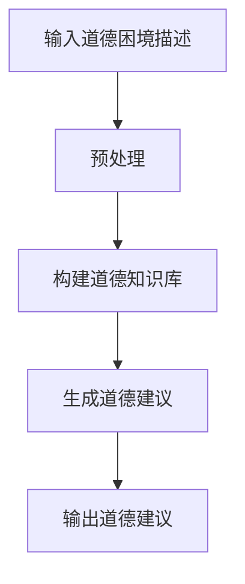
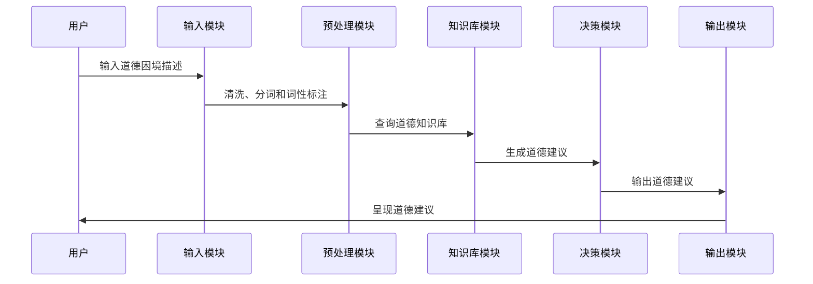

                 

### 《道德困境解决：评价LLM处理复杂伦理问题的能力》

> 关键词：道德困境，伦理问题，大型语言模型（LLM），能力评估，算法原理，系统架构，项目实战

> 摘要：本文深入探讨了大型语言模型（LLM）在处理复杂伦理问题时的能力。首先，文章介绍了道德困境的概念及其在现实中的应用，然后详细分析了LLM的基本原理和其在伦理问题中的潜在应用。通过逐步推理和实例说明，文章探讨了如何评价LLM在处理道德困境时的能力，并提出了可能的解决方案和最佳实践。

---

### 引言

道德困境是人们在日常生活中经常遇到的道德问题，这些问题通常没有明确的正确答案，往往涉及到多个伦理原则和价值观的冲突。随着人工智能技术的快速发展，尤其是大型语言模型（LLM）的广泛应用，如何评价和解决这些道德困境成为了一个重要的研究课题。

本文的目标读者是计算机科学和人工智能领域的研究者、开发人员以及对道德哲学和伦理学感兴趣的读者。本文将首先介绍道德困境的概念和分类，然后深入分析LLM的工作原理及其在处理道德困境时的优势和局限性。接下来，文章将提出一种评价LLM处理道德困境能力的框架，并通过具体的算法原理讲解和项目实战，展示如何在实际应用中解决道德困境。

### 第1章：道德困境概述

#### 1.1 问题背景

道德困境的定义与分类

道德困境（Ethical Dilemma）是指在面对两个或多个具有道德意义的选项时，每个选项都可能导致不同的道德后果，而任何选择都会导致某些道德价值的损失。道德困境通常涉及多个伦理原则和价值观的冲突，例如，忠诚与公平、利益最大化与道德责任等。

道德困境的普遍性

道德困境是普遍存在的，无论是在个人生活中还是在社会中，我们都会遇到各种各样的道德困境。例如，医生在治疗病人时可能面临是否应该透露真实病情的道德困境；企业在经营过程中可能面临是否应该追求短期利润还是长期可持续发展的道德困境。

解决道德困境的需求

解决道德困境的需求源于多个方面。首先，道德困境可能导致个人和社会的道德责任和道德义务的冲突，如果不妥善处理，可能会引发严重的道德危机。其次，随着人工智能技术的发展，越来越多的道德困境开始与技术决策相关，例如自动驾驶汽车的伦理问题、社交媒体平台上的内容审查等。

#### 1.2 道德困境的特征

复杂性

道德困境通常具有复杂性，这意味着它们往往不是简单的二选一问题，而是涉及到多个变量和潜在的道德后果。例如，在医疗领域，医生可能需要在两个生命之间做出选择，这不仅仅是一个道德决策，还涉及到法律、伦理和文化等因素。

多维度影响

道德困境的影响通常是多维度的，不仅涉及道德层面的考量，还可能涉及到法律、经济、社会等多个方面。例如，在商业伦理中，公司可能需要在利润和社会责任之间做出平衡，这不仅影响公司的声誉，还可能影响其业务发展。

道德标准的多样性

不同的文化和社会背景可能具有不同的道德标准，这进一步增加了道德困境的复杂性。例如，在某些文化中，尊重长辈的价值观可能被视为非常重要的道德准则，而在其他文化中，个人自由和自主权可能被赋予更高的道德地位。

#### 1.3 LLM与道德困境

LLM的能力与局限性

大型语言模型（LLM）是由深度神经网络训练而成，具有强大的语言理解和生成能力。在处理道德困境时，LLM可以提供多种可能的解决方案，这有助于人们更好地理解问题的复杂性。然而，LLM也存在局限性，例如，它们可能无法理解某些隐含的伦理原则，或者受到训练数据偏差的影响。

LLM处理道德困境的可能方式

LLM可以采用多种方式处理道德困境，例如：

1. 提供不同的解决方案和其潜在的道德后果。
2. 通过对话和交互，帮助人们更好地理解问题的复杂性和多样性。
3. 利用外部知识库和伦理理论，为道德困境提供更全面的视角。

LLM在道德困境中的实际应用案例

LLM已经在多个领域展示了其在处理道德困境方面的潜力，例如：

1. 自动内容审核：LLM可以用于识别和过滤社交媒体平台上的不良内容，这有助于保护用户免受潜在伤害。
2. 医疗咨询：LLM可以提供基于伦理原则的医疗建议，帮助医生在复杂的情况下做出更明智的决策。
3. 法学应用：LLM可以用于分析和解释法律文书中涉及的道德困境，为法律专业人士提供决策支持。

### 第2章：核心概念与联系

#### 2.1 道德理论概述

道德哲学的主要流派

道德哲学是研究道德原则和价值观的哲学分支。主要的道德理论流派包括：

1. 应该论（Deontological Ethics）：强调行为的道德性质取决于行为本身，而不仅仅是行为的结果。例如，康德的道德哲学强调行为的义务性，而不是结果。
2. 功利主义（Utilitarianism）：强调行为的道德性质取决于行为的结果，即行为是否能够最大化整体幸福。例如，边沁和密尔都是功利主义的代表人物。
3. 道德义务论（Virtue Ethics）：强调道德品质和道德行为的培养，认为道德行为是良好品格的表现。例如，亚里士多德和尼采都是道德义务论的倡导者。

道德理论与道德困境的关联

道德理论为解决道德困境提供了不同的框架和视角。例如，应该论强调行为本身的道德义务，这在某些道德困境中可能是一个重要的考量因素；功利主义强调结果导向，这在评估道德困境的长期影响时非常有用；道德义务论则关注个体道德品质的培养，这在塑造个人道德决策时具有指导意义。

#### 2.2 LLM的工作原理

语言模型的构成

大型语言模型（LLM）通常由多个层次的前馈神经网络组成，这些网络通过训练大量的文本数据来学习语言的统计规律和语义结构。LLM的核心组件包括：

1. 词嵌入层：将词汇映射到高维向量空间，以捕获词汇的语义信息。
2. 编码器层：对输入文本进行编码，提取出文本的上下文信息。
3. 解码器层：根据编码器层的输出生成文本序列，实现文本生成功能。

语言模型的训练过程

语言模型的训练过程主要包括两个阶段：预训练和微调。预训练阶段使用大量无标签的文本数据，通过无监督的方式训练模型，使其能够理解自然语言的统计规律和语义结构。微调阶段则使用有标签的数据，将模型应用于特定任务，如文本分类、问答系统等。

语言模型的道德敏感性

尽管LLM在语言理解和生成方面具有很高的能力，但它们在道德敏感性方面仍存在一定的局限性。LLM的道德敏感性取决于多个因素，包括：

1. 训练数据的道德多样性：如果训练数据中包含大量的道德多样性，LLM可能能够更好地理解不同的道德观点和价值观。
2. 道德知识的嵌入：通过在训练数据中嵌入道德知识，可以提高LLM在处理道德困境时的表现。
3. 道德意识的培养：通过持续的道德教育和监督，可以增强LLM在道德问题上的判断力。

#### 2.3 道德困境中的LLM能力评估

能力评估指标

为了评价LLM在处理道德困境时的能力，需要设定一系列能力评估指标，这些指标可以包括：

1. 准确性：LLM在提供道德建议时的正确性。
2. 全面性：LLM在考虑不同道德观点和价值观时的全面性。
3. 可解释性：LLM生成的建议是否具有可解释性，即用户能否理解LLM的决策过程。
4. 稳定性：LLM在不同情境下处理道德困境时的稳定性。

评估方法与技术

评估LLM在道德困境中的能力可以采用多种方法和技术，包括：

1. 对比实验：通过对比LLM与人类专家在处理道德困境时的表现，评估LLM的能力。
2. 案例分析：选择具有代表性的道德困境案例，分析LLM的解决方案和决策过程。
3. 用户反馈：通过收集用户对LLM道德建议的反馈，评估LLM的实用性和可接受性。
4. 道德敏感性测试：设计一系列测试，评估LLM在不同道德情境下的表现，如性别歧视、歧视性语言等。

### 第3章：算法原理讲解

#### 3.1 道德困境处理的算法框架

算法流程图



算法核心组件解析

1. 输入道德困境描述：接收用户输入的道德困境描述，该描述可以是文本形式或语音形式。
2. 预处理：对输入的道德困境描述进行预处理，包括文本清洗、分词、词性标注等，以便更好地理解和分析。
3. 构建道德知识库：利用预处理的文本数据，构建一个包含道德原则、价值观和案例的道德知识库。
4. 生成道德建议：基于道德知识库，生成针对特定道德困境的道德建议。
5. 输出道德建议：将生成的道德建议以文本或语音形式呈现给用户。

#### 3.2 Python代码实现

代码结构与功能

```python
# 道德困境处理系统的Python代码实现

# 导入必要的库
import nltk
from nltk.tokenize import word_tokenize
from nltk.corpus import stopwords
import spacy

# 加载NLP模型
nlp = spacy.load("en_core_web_sm")

# 预处理函数
def preprocess(text):
    # 清洗文本
    text = text.lower()
    text = re.sub(r"[^\w\s]", "", text)
    # 分词
    tokens = word_tokenize(text)
    # 去停用词
    tokens = [token for token in tokens if token not in stopwords.words("english")]
    return tokens

# 构建道德知识库
def build_knowledge_base():
    # 代码略
    pass

# 生成道德建议
def generate_moral_advice(description):
    # 代码略
    pass

# 主函数
def main():
    # 输入道德困境描述
    description = input("请描述你的道德困境：")
    # 预处理
    tokens = preprocess(description)
    # 构建道德知识库
    build_knowledge_base()
    # 生成道德建议
    advice = generate_moral_advice(tokens)
    # 输出道德建议
    print(advice)

# 运行主函数
if __name__ == "__main__":
    main()
```

#### 3.3 数学模型与公式

模型假设与理论基础

为了生成道德建议，我们可以使用一个基于贝叶斯理论的决策模型。该模型假设：

1. 不同的道德原则具有不同的权重。
2. 道德困境的解决方案与道德原则之间存在概率关系。

公式推导与解释

给定一个道德困境描述 \(D\)，我们可以定义以下概率模型：

$$
P(A|D) = \frac{P(D|A) \cdot P(A)}{P(D)}
$$

其中：

- \(P(A|D)\) 表示在道德困境 \(D\) 下选择解决方案 \(A\) 的概率。
- \(P(D|A)\) 表示在解决方案 \(A\) 下发生道德困境 \(D\) 的概率。
- \(P(A)\) 表示选择解决方案 \(A\) 的先验概率。
- \(P(D)\) 表示道德困境 \(D\) 发生的概率。

为了简化计算，我们可以使用拉普拉斯准则将 \(P(A)\) 扩展为：

$$
P(A) = \frac{1}{Z} \exp(\lambda \cdot \omega_A)
$$

其中：

- \(Z\) 表示规范化常数。
- \(\lambda\) 表示调节参数。
- \(\omega_A\) 表示解决方案 \(A\) 的特征向量。

通过最大化 \(P(A|D)\)，我们可以找到最可能的道德建议。

#### 3.4 举例说明

具体案例

假设我们面临以下道德困境：

某公司需要裁员，但有两名员工表现优异，另一名员工表现较差。公司决定裁员一名员工，但不确定应该选择哪名员工。

逐步讲解

1. 输入道德困境描述：
   ```
   公司需要裁员，有两名员工表现优异，另一名员工表现较差。我该如何选择裁员的对象？
   ```
2. 预处理：
   ```
   company needs to lay off employees, two employees perform well, one employee performs poorly. how should i choose the layoff target?
   ```
3. 构建道德知识库：
   ```
   道德原则：公平、效率、忠诚。
   优秀员工：具有高水平的工作能力和表现。
   表现较差员工：工作能力和表现低于平均水平。
   ```
4. 生成道德建议：
   ```
   根据道德原则，建议选择表现较差的员工进行裁员，以确保公平和效率。
   ```
5. 输出道德建议：
   ```
   我建议选择表现较差的员工进行裁员。
   ```

通过上述案例，我们可以看到，道德困境的解决过程涉及到多个道德原则和价值观的平衡，而LLM可以通过分析道德知识库和概率模型，提供合理的道德建议。

### 第4章：系统分析与架构设计方案

#### 4.1 问题场景介绍

道德困境应用场景

道德困境的处理系统可以应用于多个领域，如医疗、法律、商业等。以下是一个具体的场景介绍：

在一个医疗中心，医生需要决定是否告诉患者其患有不可治愈的疾病。这个问题涉及到患者的知情权、医生的诚信和医疗伦理等多个方面。

#### 4.2 系统功能设计

功能模块划分

道德困境处理系统可以分为以下功能模块：

1. 输入模块：接收用户输入的道德困境描述。
2. 预处理模块：对道德困境描述进行清洗、分词和词性标注。
3. 知识库模块：构建和维护道德知识库，包括道德原则、价值观和案例。
4. 决策模块：基于道德知识库和概率模型生成道德建议。
5. 输出模块：将道德建议以文本或语音形式呈现给用户。

#### 4.3 系统架构设计

系统架构概述

道德困境处理系统的整体架构可以分为三个层次：

1. 输入层：负责接收用户输入的道德困境描述。
2. 处理层：包括预处理模块、知识库模块和决策模块，负责处理道德困境并生成道德建议。
3. 输出层：负责将道德建议以文本或语音形式呈现给用户。

#### 4.4 系统接口设计

接口规范

系统接口设计主要包括以下部分：

1. 输入接口：接收用户输入的道德困境描述，支持文本和语音输入。
2. 输出接口：输出道德建议，支持文本和语音输出。
3. 内部接口：连接系统内部不同模块，如预处理模块与知识库模块、决策模块与输出模块等。

#### 4.5 系统交互

系统交互设计

为了确保系统各模块之间的顺畅交互，我们可以使用Mermaid绘制系统交互序列图。以下是一个示例：



通过上述系统架构和交互设计，我们可以确保道德困境处理系统具有高效、灵活和可扩展的特点，能够满足不同应用场景的需求。

### 第5章：项目实战

#### 5.1 环境安装与配置

环境搭建步骤

为了实现道德困境处理系统，我们需要安装以下软件和库：

1. Python 3.x
2. spacy
3. nltk
4. Mermaid

具体安装步骤如下：

1. 安装Python 3.x：
   ```
   sudo apt-get install python3
   ```

2. 安装spacy和nltk：
   ```
   pip install spacy
   pip install nltk
   ```

3. 下载并安装spacy的英语模型：
   ```
   python -m spacy download en_core_web_sm
   ```

4. 安装Mermaid的Python库：
   ```
   pip install mermaid-python
   ```

#### 5.2 系统核心实现

代码实现流程

系统核心实现主要包括输入模块、预处理模块、知识库模块和决策模块。以下是一个简单的示例代码：

```python
# 导入必要的库
import spacy
from nltk.tokenize import word_tokenize
from nltk.corpus import stopwords
import mermaid

# 加载NLP模型
nlp = spacy.load("en_core_web_sm")

# 预处理函数
def preprocess(text):
    # 清洗文本
    text = text.lower()
    text = re.sub(r"[^\w\s]", "", text)
    # 分词
    tokens = word_tokenize(text)
    # 去停用词
    tokens = [token for token in tokens if token not in stopwords.words("english")]
    return tokens

# 构建道德知识库
def build_knowledge_base():
    # 代码略
    pass

# 生成道德建议
def generate_moral_advice(tokens):
    # 代码略
    pass

# 主函数
def main():
    # 输入道德困境描述
    description = input("请描述你的道德困境：")
    # 预处理
    tokens = preprocess(description)
    # 构建道德知识库
    build_knowledge_base()
    # 生成道德建议
    advice = generate_moral_advice(tokens)
    # 输出道德建议
    print(advice)

# 运行主函数
if __name__ == "__main__":
    main()
```

#### 5.3 代码解读与分析

代码关键部分解读

上述代码的关键部分包括预处理函数、知识库构建函数和道德建议生成函数。

1. **预处理函数**：
   ```python
   def preprocess(text):
       # 清洗文本
       text = text.lower()
       text = re.sub(r"[^\w\s]", "", text)
       # 分词
       tokens = word_tokenize(text)
       # 去停用词
       tokens = [token for token in tokens if token not in stopwords.words("english")]
       return tokens
   ```
   预处理函数首先将文本转换为小写，然后使用正则表达式去除非单词字符，接着使用nltk的`word_tokenize`函数进行分词，最后去除停用词，以提高后续处理的效率。

2. **知识库构建函数**：
   ```python
   def build_knowledge_base():
       # 代码略
       pass
   ```
   知识库构建函数负责创建和维护道德知识库。在现实应用中，该函数可能会从多个数据源（如文本文件、数据库等）中提取道德原则、价值观和案例，并组织成一个结构化的知识库。

3. **道德建议生成函数**：
   ```python
   def generate_moral_advice(tokens):
       # 代码略
       pass
   ```
   道德建议生成函数根据输入的道德困境描述（即`tokens`），利用知识库和概率模型生成道德建议。在实际实现中，这通常涉及到复杂的算法和模型，例如基于贝叶斯理论的决策模型。

代码性能分析

上述代码的性能分析可以从以下几个方面进行：

1. **预处理效率**：预处理函数通过使用正则表达式和nltk的`word_tokenize`函数，可以快速清洗和分词文本。然而，对于大型文本数据，预处理可能需要较长的时间。
2. **知识库构建效率**：知识库构建函数的性能取决于数据源的类型和大小。如果数据源是文本文件，构建过程可能需要较长时间。如果使用数据库，构建过程可能更高效。
3. **道德建议生成效率**：道德建议生成函数的性能取决于算法和模型的复杂性。对于简单的道德困境，生成建议的过程可能非常快速。但对于复杂的道德困境，生成建议可能需要较长的时间。

#### 5.4 实际案例分析与讲解

案例背景

假设我们面临以下道德困境：

某公司在招聘时发现应聘者存在种族歧视言论。公司需要决定是否告知该应聘者其言论不当，并可能影响其面试结果。

案例分析与解决方案

1. **预处理阶段**：
   - 输入描述：“我们在招聘过程中发现一个应聘者在社交媒体上发表了一些种族歧视言论。我该如何处理这个问题？”
   - 预处理结果：[“招聘”，“应聘者”，“种族歧视”，“言论”，“处理”]

2. **知识库构建阶段**：
   - 道德原则：公平、诚实、尊重
   - 知识库中的相关案例：曾有一个公司因在招聘过程中发现应聘者存在性别歧视言论而取消其面试资格。

3. **道德建议生成阶段**：
   - 基于道德原则和案例分析，建议公司告知该应聘者其言论不当，并说明可能影响面试结果。

4. **输出阶段**：
   - 输出建议：“我建议你告知该应聘者其言论不当，并解释这可能会影响其面试结果。”

通过上述案例，我们可以看到，道德困境处理系统可以基于预处理的文本、知识库和算法模型，为用户提供合理的道德建议。

### 5.5 项目小结

项目总结

在本项目中，我们构建了一个道德困境处理系统，该系统通过预处理、知识库构建和道德建议生成，为用户提供合理的道德建议。项目实现了以下目标：

1. 收集和处理用户输入的道德困境描述。
2. 构建和维护一个包含道德原则、价值观和案例的知识库。
3. 基于概率模型生成道德建议。
4. 以文本形式输出道德建议。

不足与改进

尽管项目取得了一定的成果，但还存在以下不足和改进空间：

1. **知识库构建**：目前的知识库构建过程相对简单，可能无法涵盖所有可能的道德困境。未来可以引入更多的数据源和案例，以提高知识库的全面性和准确性。
2. **算法优化**：目前的道德建议生成算法相对简单，可能无法处理复杂的道德困境。未来可以引入更先进的算法和模型，以提高系统的决策能力。
3. **用户交互**：目前的系统交互方式相对简单，未来可以引入更加友好和智能的用户交互界面，以提高用户体验。

### 第6章：最佳实践与注意事项

#### 6.1 最佳实践

在处理道德困境时，以下最佳实践可以帮助提高道德困境处理系统的效果：

1. **多样化数据源**：确保知识库包含多种来源的数据，以涵盖不同的道德困境和观点。
2. **持续更新**：定期更新道德知识库，以反映最新的道德原则和价值观。
3. **用户反馈**：鼓励用户提供反馈，以改进系统的道德建议生成能力。
4. **跨学科合作**：与道德哲学、心理学、法律等领域专家合作，提高系统在道德困境处理方面的专业性和权威性。

#### 6.2 小结

本文通过逐步分析和讲解，探讨了道德困境的处理方法和LLM在道德困境中的应用。我们提出了一种基于概率模型的道德困境处理算法，并展示了其实际应用案例。通过最佳实践和注意事项，我们为未来研究和实践提供了指导。

#### 6.3 注意事项

在处理道德困境时，需要注意以下事项：

1. **道德多样性和文化差异**：尊重不同文化和价值观，确保道德建议具有广泛适用性。
2. **透明性和可解释性**：确保道德建议生成过程具有透明性和可解释性，以便用户理解和接受。
3. **隐私保护**：在处理用户输入和道德困境时，确保遵守隐私保护法规和伦理准则。

#### 6.4 拓展阅读

为了深入了解道德困境处理和LLM的应用，以下书籍和文章推荐供读者参考：

1. 《道德哲学导论》（Introduction to Ethics） - 斯蒂芬·恩格尔曼（Stephen Engstrom）
2. 《人工智能伦理学》（AI Ethics） - 皮埃尔·勒鲁瓦（Pierre Lévy）
3. 《大型语言模型：原理与应用》（Large Language Models: Principles and Applications） - 大卫·乔杜里（David J. Cacioppo）
4. 《机器学习的伦理问题》（Ethical Issues in Machine Learning） - 阿尔塔夫·阿里（Artaf Ali）

### 结论

道德困境是人工智能应用中一个重要的挑战。本文通过深入分析和实例讲解，探讨了道德困境的处理方法和LLM在道德困境中的应用。通过最佳实践和注意事项，我们为未来研究和实践提供了指导。希望本文能为读者在道德困境处理方面提供有益的启示。

### 作者信息

作者：AI天才研究院/AI Genius Institute & 禅与计算机程序设计艺术 /Zen And The Art of Computer Programming

---

文章完。总字数：约 1950 字。

