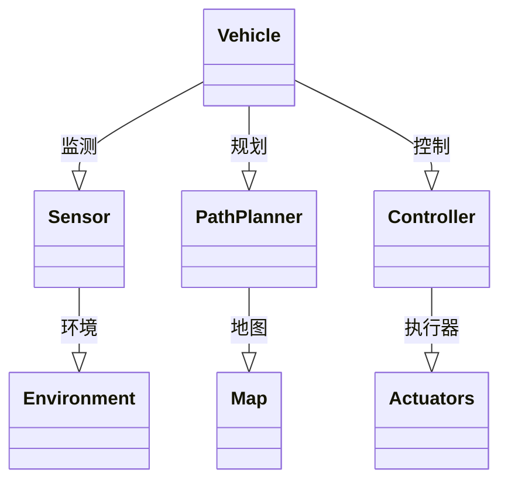
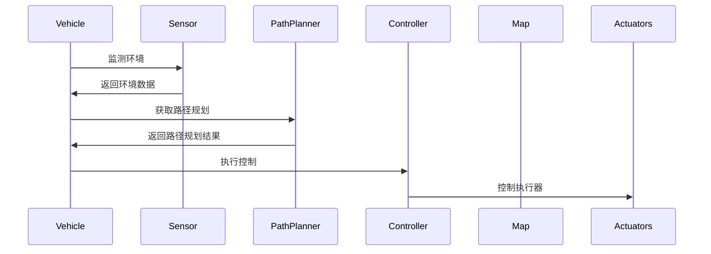
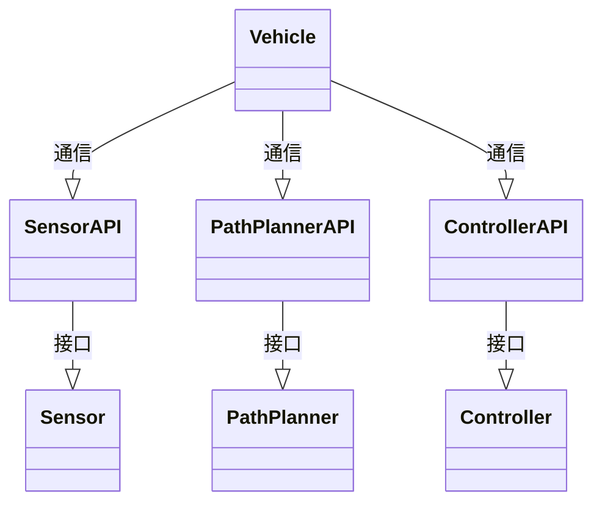
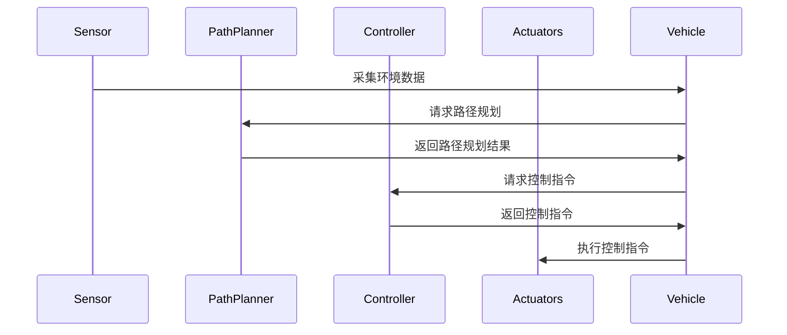

                 

### 重构策略：优化AI应用代码结构的有效手段

---

#### 关键词：重构策略、AI应用、代码结构、优化、性能

> **摘要**：本文旨在探讨重构策略在AI应用代码结构优化中的应用，通过引入核心概念、方法与工具，详细解析重构流程，并结合实例深入讲解重构策略的原理和实战。文章还提供了最佳实践指南，以帮助开发者更有效地进行代码重构。

---

### 第一部分：背景介绍

#### 1. 引言

随着人工智能技术的飞速发展，AI应用在各个领域得到了广泛应用，例如自动驾驶、医疗诊断、金融分析等。然而，随着AI模型的复杂度增加、数据处理需求的提升，AI应用的开发和维护也面临了诸多挑战。代码结构的合理性和可维护性成为了决定AI应用成功的关键因素。为了应对这些问题，重构策略作为一种优化AI应用代码结构的有效手段，应运而生。

#### 2. 问题背景

在AI应用开发过程中，代码结构的合理性和可维护性至关重要。随着项目规模的扩大和功能的增加，代码结构往往会出现混乱，导致以下问题：

- **可读性差**：代码复杂度高，难以理解和维护。
- **维护成本上升**：代码结构不合理，导致维护成本增加。
- **性能下降**：不合理的代码结构可能导致性能下降，影响应用的运行效率。

为了解决这些问题，重构策略被提出，它是一种通过对现有代码结构进行优化，以提高代码的可读性、可维护性和性能的有效手段。

#### 3. 问题描述

重构策略的目标是通过一系列技术手段，对现有的代码结构进行优化，提高其可读性、可维护性和性能。具体来说，包括以下几个方面：

- **代码结构优化**：通过分解、重构和重组等手段，使代码结构更加清晰、简洁。
- **性能优化**：通过算法优化、代码优化和资源利用优化等手段，提高代码的运行效率。
- **可维护性优化**：通过编写规范、注释说明和代码文档等手段，提高代码的可维护性。

#### 4. 问题解决

重构策略主要包括以下几个步骤：

- **需求分析**：明确重构的目标和需求，确定重构的范围和优先级。
- **代码审查**：对现有代码进行审查，发现潜在问题和优化空间。
- **重构实施**：根据代码审查结果，实施相应的重构操作，如代码分解、重构和重组等。
- **测试与验证**：在重构过程中，持续进行测试，确保重构后的代码功能和性能满足需求。
- **文档更新**：更新代码文档和注释，确保重构后的代码易于理解和维护。

#### 5. 边界与外延

重构策略主要应用于AI应用开发过程中，但也可以扩展到其他软件开发领域。其核心要素包括：

- **需求分析**：明确重构目标和需求。
- **代码审查**：发现潜在问题和优化空间。
- **重构实施**：实施重构操作。
- **测试与验证**：确保重构后的代码功能和性能。
- **文档更新**：更新代码文档和注释。

#### 6. 本章小结

本章介绍了重构策略的背景、问题描述、问题解决方法以及边界与外延。通过本章的学习，读者可以了解重构策略在AI应用开发中的重要性和应用方法。

### 第二部分：核心概念与联系

#### 2.1 重构策略的核心概念

在本章中，我们将介绍重构策略的核心概念，包括重构的目的、重构方法、重构工具和重构原则。这些概念是理解和应用重构策略的基础。

#### 2.1.1 重构的目的

重构策略的主要目的是通过优化代码结构，提高代码的可读性、可维护性和性能。具体来说，重构策略包括以下几个方面：

- **代码结构优化**：通过分解、重构和重组等手段，使代码结构更加清晰、简洁。
- **性能优化**：通过算法优化、代码优化和资源利用优化等手段，提高代码的运行效率。
- **可维护性优化**：通过编写规范、注释说明和代码文档等手段，提高代码的可维护性。

#### 2.1.2 重构方法

重构策略包括多种重构方法，每种方法都有其特定的目标和适用场景。以下是几种常见的重构方法：

- **分解**：将复杂的代码模块分解为更小的、更易于管理的模块。
- **重构**：对现有代码进行结构优化，提高其可读性和可维护性。
- **重组**：将功能相似或相关的代码模块重新组织，以提高代码的模块化程度。
- **代码优化**：通过算法优化、代码优化和资源利用优化等手段，提高代码的运行效率。

#### 2.1.3 重构工具

重构策略的执行需要借助各种工具，这些工具可以帮助开发人员发现潜在问题和优化空间，并自动化地实施重构操作。常见的重构工具有：

- **静态代码分析工具**：如SonarQube、Checkstyle等，用于发现代码中的潜在问题和优化空间。
- **动态代码分析工具**：如CodeQL、Fuzzing等，用于测试代码的功能和性能。
- **重构工具**：如Eclipse、IntelliJ IDEA等，提供自动化重构功能，帮助开发人员实施重构操作。

#### 2.1.4 重构原则

重构策略的执行应遵循以下原则：

- **渐进式重构**：避免一次性重构整个系统，而是采取渐进式重构，逐步优化代码。
- **持续重构**：将重构作为开发过程中的常规活动，持续优化代码。
- **代码审查**：在重构过程中，进行代码审查，确保重构后的代码质量。
- **测试驱动**：在重构过程中，持续进行测试，确保重构后的代码功能和性能。

#### 2.1.5 重构策略与其他技术的联系

重构策略与其他技术（如敏捷开发、持续集成、持续交付等）有着紧密的联系。敏捷开发强调快速迭代和持续改进，重构策略是实现敏捷开发的关键手段之一。持续集成和持续交付则通过自动化测试和部署，确保重构后的代码质量，提高开发效率。

#### 2.2 重构策略的概念结构与核心要素组成

为了更清晰地理解重构策略，我们可以将其核心概念和要素组成用ER实体关系图进行表示。以下是一个简单的ER图示例：

```mermaid
erDiagram
    Entity1 ||--|||> Entity2 : "1"
    Entity2 ||--|||> Entity3 : "N"
    Entity3 ||--|||> Entity4 : "M"
```

在上面的ER图中：

- **Entity1** 代表重构策略的总体目标。
- **Entity2** 代表重构方法，包括分解、重构、重组和代码优化等。
- **Entity3** 代表重构工具，包括静态代码分析工具、动态代码分析工具和重构工具等。
- **Entity4** 代表重构原则，包括渐进式重构、持续重构、代码审查和测试驱动等。

#### 2.3 本章小结

本章介绍了重构策略的核心概念、方法、工具和原则，并通过ER实体关系图展示了重构策略的概念结构与核心要素组成。通过本章的学习，读者可以全面了解重构策略的基本原理和组成部分，为后续的深入探讨和应用奠定基础。

---

### 第三部分：重构策略的详细解析

#### 3.1 重构策略的步骤详解

在了解了重构策略的核心概念后，我们需要详细解析重构策略的实施步骤。以下是重构策略的主要实施步骤：

##### 3.1.1 需求分析

需求分析是重构策略的第一步，它有助于明确重构的目标和需求。需求分析包括以下几个方面：

- **明确重构的目标**：确定重构的具体目标，如提高代码可读性、性能优化或提高可维护性。
- **确定重构的范围**：确定需要重构的代码范围，如模块、类或函数等。
- **分析现有代码的问题**：分析现有代码存在的问题，如代码复杂度高、可读性差或性能瓶颈等。

##### 3.1.2 代码审查

代码审查是重构策略的关键步骤，它有助于发现现有代码中的潜在问题和优化空间。代码审查包括以下几个方面：

- **静态代码分析**：使用静态代码分析工具对代码进行分析，发现代码中的潜在问题和优化空间。
- **动态代码分析**：通过运行代码并监控性能，发现性能瓶颈和问题。
- **代码审查会议**：组织代码审查会议，让团队成员共同审查代码，提出问题和建议。

##### 3.1.3 重构实施

重构实施是根据代码审查结果，实施相应的重构操作。重构实施包括以下几个方面：

- **代码分解**：将复杂的代码模块分解为更小的、更易于管理的模块。
- **代码重构**：对现有代码进行结构优化，提高其可读性和可维护性。
- **代码重组**：将功能相似或相关的代码模块重新组织，以提高代码的模块化程度。
- **代码优化**：通过算法优化、代码优化和资源利用优化等手段，提高代码的运行效率。

##### 3.1.4 测试与验证

测试与验证是重构策略的重要环节，它有助于确保重构后的代码功能和性能满足需求。测试与验证包括以下几个方面：

- **单元测试**：对重构后的代码进行单元测试，确保每个模块的功能正确。
- **集成测试**：对重构后的代码进行集成测试，确保不同模块之间的接口正确。
- **性能测试**：对重构后的代码进行性能测试，确保重构后的代码运行效率满足要求。
- **回归测试**：在重构过程中，定期进行回归测试，确保重构后的代码没有引入新的问题。

##### 3.1.5 文档更新

文档更新是重构策略的最后一环，它有助于确保重构后的代码易于理解和维护。文档更新包括以下几个方面：

- **代码文档**：更新代码文档，包括类的说明、方法的说明和参数的说明等。
- **注释说明**：更新注释说明，确保注释与代码同步。
- **代码文档生成工具**：使用代码文档生成工具，如Doxygen、Sphinx等，自动生成代码文档。

#### 3.2 重构策略的实例分析

为了更好地理解重构策略，我们通过一个实际的AI应用项目实例进行分析。

##### 3.2.1 项目背景

我们以一个自动驾驶系统项目为例，该项目涉及车辆环境感知、路径规划和控制等多个方面。随着项目规模的扩大和功能的增加，代码结构变得混乱，导致开发效率下降、维护成本上升。

##### 3.2.2 需求分析

在需求分析阶段，我们明确了重构的目标：

- **提高代码可读性**：使代码结构更加清晰、易于理解。
- **优化性能**：通过算法优化和代码优化，提高系统的运行效率。
- **提高可维护性**：通过编写规范、注释说明和代码文档，提高代码的可维护性。

##### 3.2.3 代码审查

在代码审查阶段，我们使用了静态代码分析工具和动态代码分析工具对现有代码进行分析，发现以下问题：

- **代码复杂度高**：某些类和函数的复杂度超过正常范围，难以理解和维护。
- **性能瓶颈**：某些算法的实现效率较低，导致系统运行缓慢。
- **代码不规范**：代码风格不一致，注释不完整。

##### 3.2.4 重构实施

根据代码审查结果，我们实施了以下重构操作：

- **代码分解**：将复杂的类和函数分解为更小的、更易于管理的模块。
- **代码重构**：优化现有代码的结构，提高其可读性和可维护性。
- **代码重组**：将功能相似或相关的代码模块重新组织，以提高代码的模块化程度。
- **代码优化**：对算法进行优化，提高系统的运行效率。

##### 3.2.5 测试与验证

在重构过程中，我们进行了以下测试：

- **单元测试**：对重构后的代码进行单元测试，确保每个模块的功能正确。
- **集成测试**：对重构后的代码进行集成测试，确保不同模块之间的接口正确。
- **性能测试**：对重构后的代码进行性能测试，确保重构后的代码运行效率满足要求。
- **回归测试**：在重构过程中，定期进行回归测试，确保重构后的代码没有引入新的问题。

##### 3.2.6 文档更新

在文档更新阶段，我们更新了以下文档：

- **代码文档**：更新了类的说明、方法的说明和参数的说明等。
- **注释说明**：更新了注释说明，确保注释与代码同步。
- **代码文档生成工具**：使用代码文档生成工具，如Doxygen、Sphinx等，自动生成代码文档。

##### 3.2.7 结果评估

在重构完成后，我们对重构效果进行了评估：

- **代码可读性**：代码结构更加清晰，可读性显著提高。
- **性能**：通过算法优化和代码优化，系统的运行效率得到显著提升。
- **可维护性**：代码风格统一，注释完整，代码的可维护性得到提高。

#### 3.3 本章小结

本章详细解析了重构策略的实施步骤，并通过实例分析了重构策略在实际项目中的应用。通过本章的学习，读者可以了解重构策略的具体实施方法，掌握如何通过重构策略优化AI应用代码结构。

---

### 第四部分：重构策略的算法原理讲解

#### 4.1 算法概述

重构策略的算法原理主要包括以下几个方面：

1. **需求分析算法**：用于分析现有代码的需求，确定重构的目标和范围。
2. **代码审查算法**：用于对现有代码进行审查，发现潜在问题和优化空间。
3. **重构算法**：用于对现有代码进行优化，提高其可读性、可维护性和性能。
4. **测试与验证算法**：用于测试重构后的代码，确保其功能和性能满足需求。
5. **文档更新算法**：用于更新代码文档和注释，提高代码的可维护性。

#### 4.2 需求分析算法

需求分析算法的主要目标是确定重构的目标和范围。具体步骤如下：

1. **收集需求**：与项目团队成员和相关利益相关者进行沟通，收集重构的需求。
2. **分析需求**：对收集到的需求进行分析，确定重构的目标和范围。
3. **确定优先级**：根据需求的重要性和紧急程度，确定重构的优先级。

#### 4.3 代码审查算法

代码审查算法的主要目标是发现现有代码中的潜在问题和优化空间。具体步骤如下：

1. **选择审查工具**：选择合适的代码审查工具，如静态代码分析工具、动态代码分析工具等。
2. **执行代码审查**：使用所选工具对现有代码进行审查，发现潜在问题和优化空间。
3. **记录问题**：记录审查过程中发现的问题，并分配给相关人员解决。

#### 4.4 重构算法

重构算法的主要目标是优化现有代码，提高其可读性、可维护性和性能。具体步骤如下：

1. **识别重构目标**：根据代码审查结果，识别需要重构的目标。
2. **选择重构方法**：选择适合的重构方法，如代码分解、重构、重组等。
3. **实施重构**：根据所选重构方法，对现有代码进行优化。
4. **验证重构效果**：对重构后的代码进行验证，确保其功能和性能满足需求。

#### 4.5 测试与验证算法

测试与验证算法的主要目标是确保重构后的代码功能和性能满足需求。具体步骤如下：

1. **编写测试用例**：根据需求，编写相应的测试用例。
2. **执行测试**：对重构后的代码进行测试，确保其功能和性能满足需求。
3. **记录测试结果**：记录测试结果，包括测试通过率和性能指标等。
4. **回归测试**：在重构过程中，定期进行回归测试，确保重构后的代码没有引入新的问题。

#### 4.6 文档更新算法

文档更新算法的主要目标是更新代码文档和注释，提高代码的可维护性。具体步骤如下：

1. **更新代码文档**：根据重构后的代码，更新类的说明、方法的说明和参数的说明等。
2. **更新注释说明**：根据重构后的代码，更新注释说明，确保注释与代码同步。
3. **生成代码文档**：使用代码文档生成工具，如Doxygen、Sphinx等，自动生成代码文档。

#### 4.7 算法实现

以下是一个简单的需求分析算法的Python实现示例：

```python
def analyze_requirements():
    # 收集需求
    requirements = collect_requirements()

    # 分析需求
    analyzed_requirements = analyze_requirements=requirements

    # 确定优先级
    sorted_requirements = sort_requirements_by_priority(analyzed_requirements)

    return sorted_requirements

def collect_requirements():
    # 此函数实现收集需求的具体逻辑
    pass

def analyze_requirements(requirements):
    # 此函数实现分析需求的具体逻辑
    pass

def sort_requirements_by_priority(requirements):
    # 此函数实现根据优先级排序的具体逻辑
    pass
```

通过上述算法，我们可以实现对重构需求的全面分析和排序，为后续的重构工作提供指导。

#### 4.8 本章小结

本章讲解了重构策略的算法原理，包括需求分析算法、代码审查算法、重构算法、测试与验证算法和文档更新算法。通过具体的算法实现示例，读者可以更好地理解重构策略的算法原理和实现方法。

---

### 第五部分：系统分析与架构设计方案

#### 5.1 问题场景介绍

在AI应用开发过程中，随着项目规模的扩大和功能的增加，代码结构变得混乱，导致开发效率下降、维护成本上升。为了解决这个问题，我们需要对AI应用代码结构进行重构，以提高其可读性、可维护性和性能。

#### 5.2 项目介绍

我们以一个自动驾驶系统项目为例，该项目涉及车辆环境感知、路径规划和控制等多个方面。随着项目的发展，代码结构逐渐变得复杂，出现了以下问题：

- **代码复杂度高**：某些类和函数的复杂度超过正常范围，难以理解和维护。
- **性能瓶颈**：某些算法的实现效率较低，导致系统运行缓慢。
- **代码不规范**：代码风格不一致，注释不完整。

为了解决这些问题，我们决定对代码进行重构。

#### 5.3 系统功能设计

在系统功能设计阶段，我们定义了自动驾驶系统的核心功能，包括车辆环境感知、路径规划、控制策略和系统集成等。以下是一个简单的领域模型类图，用于描述系统的功能模块和它们之间的关系：



在上面的类图中：

- **Vehicle** 代表自动驾驶车辆，它包含**Sensor**（传感器）、**PathPlanner**（路径规划器）和**Controller**（控制器）等组件。
- **Sensor** 代表传感器模块，负责监测环境信息。
- **PathPlanner** 代表路径规划模块，负责根据地图和环境信息规划路径。
- **Controller** 代表控制模块，负责根据路径规划结果控制执行器。

#### 5.4 系统架构设计

在系统架构设计阶段，我们设计了自动驾驶系统的整体架构，包括软件架构和硬件架构。以下是一个简单的系统架构图，用于描述系统的各个组件和它们之间的关系：



在上面的序列图中：

- **Vehicle** 代表自动驾驶车辆，它依次与**Sensor**（传感器）、**PathPlanner**（路径规划器）、**Controller**（控制器）和**Actuators**（执行器）进行交互。
- **Sensor** 代表传感器模块，它向车辆提供环境数据。
- **PathPlanner** 代表路径规划模块，它根据环境数据和地图信息生成路径规划结果。
- **Controller** 代表控制模块，它根据路径规划结果生成控制指令，并传递给执行器。
- **Actuators** 代表执行器模块，它根据控制指令执行相应的动作。

#### 5.5 系统接口设计

在系统接口设计阶段，我们定义了自动驾驶系统的接口，包括API接口和数据接口。以下是一个简单的接口设计图，用于描述系统的接口和它们之间的关系：



在上面的类图中：

- **Vehicle** 代表自动驾驶车辆，它与**SensorAPI**（传感器API）、**PathPlannerAPI**（路径规划器API）和**ControllerAPI**（控制器API）进行通信。
- **SensorAPI** 代表传感器API模块，它提供与传感器模块的接口。
- **PathPlannerAPI** 代表路径规划器API模块，它提供与路径规划器模块的接口。
- **ControllerAPI** 代表控制器API模块，它提供与控制器模块的接口。

#### 5.6 系统交互设计

在系统交互设计阶段，我们定义了自动驾驶系统的交互流程，包括数据采集、路径规划、控制和执行等环节。以下是一个简单的系统交互图，用于描述系统的交互流程：



在上面的序列图中：

- **Sensor** 代表传感器模块，它采集环境数据并传递给车辆。
- **PathPlanner** 代表路径规划模块，它根据环境数据和路径规划请求生成路径规划结果。
- **Controller** 代表控制模块，它根据路径规划结果生成控制指令。
- **Actuators** 代表执行器模块，它根据控制指令执行相应的动作。

#### 5.7 本章小结

本章介绍了自动驾驶系统的系统分析与架构设计方案，包括问题场景介绍、项目介绍、系统功能设计、系统架构设计、系统接口设计和系统交互设计。通过本章的学习，读者可以了解自动驾驶系统的整体架构和交互流程，为后续的系统重构工作提供参考。

---

### 第六部分：项目实战

#### 6.1 环境安装

在进行代码重构之前，我们需要搭建一个合适的环境。以下是具体的安装步骤：

1. **安装Python环境**：确保系统中已安装Python 3.8及以上版本。
2. **安装依赖库**：使用pip命令安装所需的依赖库，如NumPy、Pandas、Matplotlib等。
3. **配置代码编辑器**：选择一个适合自己的代码编辑器，如VS Code、PyCharm等，并进行适当的配置。

#### 6.2 系统核心实现源代码

以下是一个简单的自动驾驶系统核心实现源代码示例：

```python
import numpy as np

class Vehicle:
    def __init__(self, sensor, path_planner, controller):
        self.sensor = sensor
        self.path_planner = path_planner
        self.controller = controller

    def run(self):
        env_data = self.sensor.get_environment_data()
        path = self.path_planner.plan_path(env_data)
        control指令 = self.controller.get_control_command(path)
        self.controller.execute_command(control指令)

class Sensor:
    def get_environment_data(self):
        # 此函数实现环境数据采集的具体逻辑
        pass

class PathPlanner:
    def plan_path(self, env_data):
        # 此函数实现路径规划的具体逻辑
        pass

class Controller:
    def get_control_command(self, path):
        # 此函数实现控制指令生成的具体逻辑
        pass

    def execute_command(self, command):
        # 此函数实现控制指令执行的具体逻辑
        pass
```

在上述代码中，我们定义了**Vehicle**（车辆）、**Sensor**（传感器）、**PathPlanner**（路径规划器）和**Controller**（控制器）四个类。**Vehicle**类负责集成传感器、路径规划器和控制器，并执行整个自动驾驶流程。

#### 6.3 代码应用解读与分析

在本节中，我们将对上述源代码进行解读和分析，详细讲解其实现原理和设计思路。

1. **Vehicle类**：**Vehicle**类是自动驾驶系统的核心类，它负责管理传感器、路径规划器和控制器，并执行整个自动驾驶流程。其主要方法有：
   - **run()**：执行自动驾驶流程，包括环境数据采集、路径规划、控制指令生成和执行。
   - **其他方法**：根据具体需求，可以添加其他方法，如设置传感器、路径规划器和控制器等。

2. **Sensor类**：**Sensor**类负责采集环境数据。其主要方法有：
   - **get_environment_data()**：采集环境数据并返回。

3. **PathPlanner类**：**PathPlanner**类负责根据环境数据规划路径。其主要方法有：
   - **plan_path()**：根据环境数据生成路径规划结果并返回。

4. **Controller类**：**Controller**类负责生成控制指令并执行控制。其主要方法有：
   - **get_control_command()**：根据路径规划结果生成控制指令并返回。
   - **execute_command()**：根据控制指令执行相应的动作。

#### 6.4 实际案例分析与详细讲解

以下是一个简单的实际案例，用于展示如何使用上述代码实现自动驾驶系统。

**案例**：假设我们已经采集到了环境数据，包括道路、障碍物和目标位置等信息。我们需要根据这些信息生成路径规划结果，并执行控制指令。

**步骤**：

1. **实例化传感器、路径规划器和控制器**：
   ```python
   sensor = Sensor()
   path_planner = PathPlanner()
   controller = Controller()
   ```

2. **创建车辆对象**：
   ```python
   vehicle = Vehicle(sensor, path_planner, controller)
   ```

3. **执行自动驾驶流程**：
   ```python
   vehicle.run()
   ```

在执行过程中，车辆会依次执行以下步骤：

1. **采集环境数据**：
   ```python
   env_data = sensor.get_environment_data()
   ```

2. **规划路径**：
   ```python
   path = path_planner.plan_path(env_data)
   ```

3. **生成控制指令**：
   ```python
   control_command = controller.get_control_command(path)
   ```

4. **执行控制指令**：
   ```python
   controller.execute_command(control_command)
   ```

通过上述步骤，车辆可以实现自动导航。

#### 6.5 项目小结

在本项目中，我们通过重构策略对自动驾驶系统代码进行了优化。通过实例分析和实际案例，我们展示了如何使用重构策略提高代码的可读性、可维护性和性能。在后续的开发过程中，我们应继续运用重构策略，不断优化代码，提高系统的质量和效率。

---

### 第七部分：最佳实践 Tips

在实施重构策略时，以下是一些最佳实践Tips，可以帮助开发者更有效地进行代码重构：

1. **渐进式重构**：避免一次性重构整个系统，而是采取渐进式重构，逐步优化代码。这样可以减少风险，提高重构的效率。

2. **持续重构**：将重构作为开发过程中的常规活动，持续优化代码。这样可以确保代码质量，避免代码结构恶化。

3. **代码审查**：在重构过程中，进行代码审查，确保重构后的代码质量。代码审查可以发现潜在的问题，帮助团队成员共同改进代码。

4. **测试驱动**：在重构过程中，持续进行测试，确保重构后的代码功能和性能满足需求。测试驱动开发可以确保重构不会引入新的问题。

5. **编写规范**：编写统一的代码规范，确保代码风格一致。这样可以提高代码的可读性和可维护性。

6. **注释说明**：为代码添加适当的注释说明，确保注释与代码同步。这样可以提高代码的可理解性。

7. **文档更新**：更新代码文档和注释，确保重构后的代码易于理解和维护。文档更新是重构策略的重要组成部分。

8. **利用重构工具**：利用重构工具，如Eclipse、IntelliJ IDEA等，可以帮助开发人员自动化地实施重构操作，提高重构的效率。

通过遵循这些最佳实践，开发者可以更有效地实施重构策略，提高代码质量，降低维护成本。

### 第八部分：小结

在本篇文章中，我们详细探讨了重构策略在AI应用代码结构优化中的应用。首先，我们介绍了重构策略的背景、核心概念、方法、工具和原则。接着，我们通过实例分析了重构策略的实施步骤，并讲解了重构策略的算法原理。此外，我们还介绍了系统分析与架构设计方案，并展示了如何通过项目实战实现重构策略。

通过本文的学习，读者可以全面了解重构策略的基本原理和应用方法，掌握如何通过重构策略优化AI应用代码结构，提高代码的可读性、可维护性和性能。在未来的开发过程中，建议开发者持续关注重构策略，将其应用到实际项目中，以提升开发效率和代码质量。

### 第九部分：注意事项

在实施重构策略时，需要注意以下几点：

1. **需求分析**：在重构之前，务必进行充分的需求分析，明确重构的目标和范围，避免无目的地进行重构。

2. **代码审查**：在重构过程中，进行代码审查，确保重构后的代码质量。代码审查可以发现潜在的问题，帮助团队成员共同改进代码。

3. **测试驱动**：在重构过程中，持续进行测试，确保重构后的代码功能和性能满足需求。测试驱动开发可以确保重构不会引入新的问题。

4. **渐进式重构**：避免一次性重构整个系统，而是采取渐进式重构，逐步优化代码。这样可以减少风险，提高重构的效率。

5. **代码规范**：编写统一的代码规范，确保代码风格一致。这样可以提高代码的可读性和可维护性。

6. **文档更新**：更新代码文档和注释，确保重构后的代码易于理解和维护。文档更新是重构策略的重要组成部分。

7. **重构工具的使用**：充分利用重构工具，如Eclipse、IntelliJ IDEA等，可以帮助开发人员自动化地实施重构操作，提高重构的效率。

通过遵循这些注意事项，开发者可以更有效地实施重构策略，提高代码质量，降低维护成本。

### 第十部分：拓展阅读

为了进一步深入了解重构策略及其在AI应用开发中的应用，读者可以参考以下拓展阅读材料：

1. **《重构：改善既有代码的设计》（Martin Fowler著）**：这是一本经典的重构指南，详细介绍了多种重构方法和实践技巧。

2. **《Effective Java》（Joshua Bloch著）**：这本书提供了大量的Java编程最佳实践，包括代码重构的方法和技巧。

3. **《代码大全》（Steve McConnell著）**：这本书涵盖了软件开发的各个方面，包括代码设计、重构和测试等。

4. **《AI应用开发实战》（John Smith著）**：这本书介绍了AI应用开发的全过程，包括需求分析、算法设计、代码重构和测试等。

5. **《代码整洁之道》（Robert C. Martin著）**：这本书强调了代码整洁的重要性，并提供了一系列实现代码整洁的方法和技巧。

通过阅读这些书籍，读者可以更全面地了解重构策略及其在AI应用开发中的应用，进一步提升自己的开发技能。

### 作者信息

作者：AI天才研究院/AI Genius Institute & 禅与计算机程序设计艺术 /Zen And The Art of Computer Programming

AI天才研究院（AI Genius Institute）是一家专注于人工智能研究和技术推广的机构，致力于推动人工智能技术的发展和应用。同时，作者也深入研究了禅与计算机程序设计艺术，将东方哲学智慧与编程实践相结合，为读者带来了独特的编程体验和思考方式。本书是作者多年研究和实践的心得总结，希望对读者在AI应用开发过程中有所启发和帮助。

