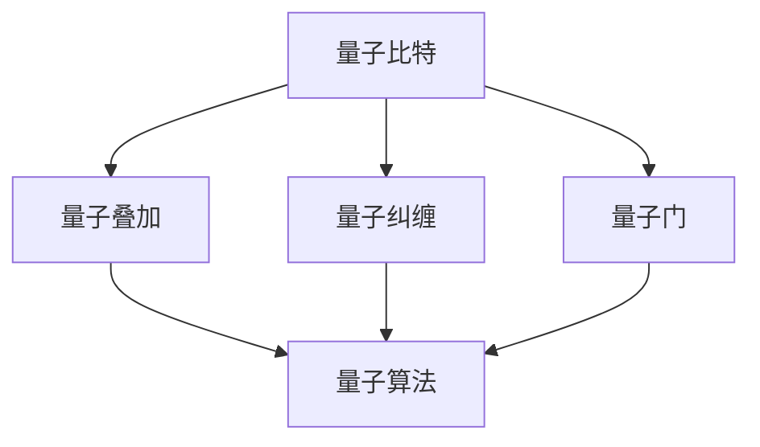
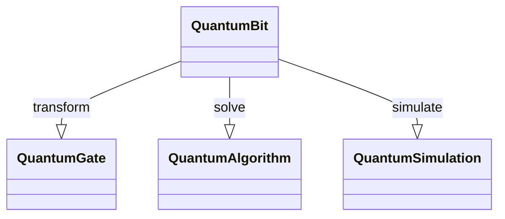
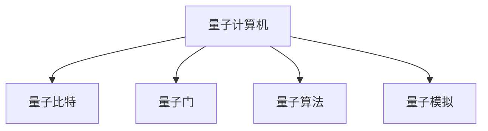
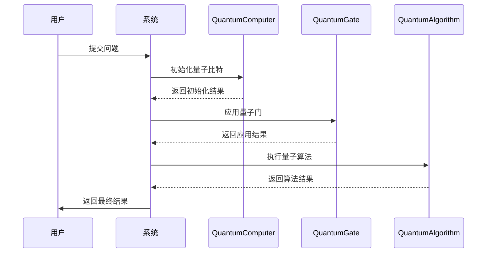

                 

# 量子计算与AI的融合：未来计算的新范式

关键词：量子计算、人工智能、计算范式、算法优化、量子模拟

摘要：本文从量子计算和人工智能的融合背景出发，探讨了量子计算的基本原理、量子算法的原理与实现，以及量子计算在人工智能中的应用。通过一步步的逻辑分析和实际案例剖析，揭示了量子计算与AI融合的巨大潜力和未来发展方向。

## 引言

在过去的几十年里，计算机科学和人工智能领域经历了飞速的发展。然而，随着计算能力的不断提升，传统计算机在处理某些复杂问题时逐渐暴露出其局限。这时，量子计算作为一种全新的计算范式，逐渐引起了人们的关注。量子计算与人工智能的结合，被认为是未来计算领域的一项重要突破。

本文将围绕量子计算与AI的融合这一主题，从以下几个方面进行探讨：

1. 量子计算的背景与基础
2. 量子算法的原理与实现
3. 量子计算在人工智能中的应用
4. 未来展望与挑战

## 1. 量子计算的背景与基础

### 1.1 量子计算的起源与发展

量子计算起源于量子力学。20世纪初，量子力学的研究揭示了微观世界的非经典性质，如量子叠加和量子纠缠。这些性质为量子计算提供了理论基础。

量子计算的概念最早由理查德·费曼在1982年提出。他指出，量子计算机可以模拟量子系统，从而在解决某些问题上具有传统计算机无法比拟的优势。

自那时以来，量子计算得到了广泛关注，并在学术界和工业界取得了一系列重要进展。例如，2009年，谷歌推出了首个量子计算机，2017年，IBM发布了量子计算平台，这些标志着量子计算从理论研究走向实际应用。

### 1.2 量子计算的基本原理

量子计算的核心是量子比特（qubit），它与传统计算机中的比特不同。比特只有两种状态：0或1，而量子比特可以同时处于0和1的状态，这种性质被称为量子叠加。

此外，量子比特之间可以发生量子纠缠，这意味着两个量子比特的状态无法单独描述，而是需要同时考虑。量子纠缠使得量子计算机在处理某些问题时具有显著优势。

量子计算的基本操作包括量子门和量子测量。量子门是一种线性变换，可以对量子比特的状态进行操作。量子测量则用于获取量子计算机的最终结果。

### 1.3 量子算法概述

量子算法是量子计算机的核心组成部分。与传统算法相比，量子算法在解决某些问题上具有显著优势。例如，Shor算法可以高效地分解大数，从而在密码学领域具有重要意义。

量子算法的优势主要体现在两个方面：

1. 量子并行性：量子计算机可以同时处理多个计算任务，从而大幅提高计算速度。
2. 量子快速变换：量子计算机可以快速地将复杂问题转化为易于求解的形式。

然而，量子算法的实现也面临着一系列挑战，如量子比特的稳定性、量子纠缠的保持等。

## 2. 量子算法的原理与实现

### 2.1 量子算法的基本概念

量子算法的基本概念包括量子比特、量子门、量子叠加和量子纠缠等。

量子比特是量子计算的基本单元，它可以同时处于0和1的状态。量子门是一种线性变换，可以对量子比特的状态进行操作。量子叠加和量子纠缠则是量子计算的核心特性。

### 2.2 量子算法的实现

量子算法的实现主要包括以下几个步骤：

1. 初始化量子比特：将量子比特初始化为特定的状态。
2. 应用量子门：通过应用一系列量子门，将量子比特的状态进行变换。
3. 量子测量：对量子比特进行测量，获取最终的输出结果。

以下是一个简单的量子算法实现示例：

```python
# 初始化量子比特
qubit = QuantumRegister(2)
circuit = QuantumCircuit(qubit)

# 应用量子门
circuit.h(qubit[0])
circuit.cx(qubit[0], qubit[1])

# 量子测量
circuit.measure(qubit, qubit)

# 执行量子算法
backend = QuantumBackend("local_qvm")
circuit.run(backend, shots=1024).result()
```

在这个示例中，我们首先初始化了两个量子比特，然后应用了量子门（H门和CNOT门），最后进行了量子测量。这个简单的量子算法实现了两个量子比特的纠缠。

### 2.3 量子算法的数学模型和公式

量子算法的数学模型和公式主要包括量子态的表示、量子门的作用以及量子测量的结果。

量子态可以用一个复数向量表示，例如：

$$
|\psi\rangle = \alpha|0\rangle + \beta|1\rangle
$$

其中，$|0\rangle$ 和 $|1\rangle$ 分别表示量子比特的基态。

量子门的作用可以用矩阵表示，例如，H门的作用可以用以下矩阵表示：

$$
H = \begin{pmatrix}
\frac{1}{\sqrt{2}} & \frac{1}{\sqrt{2}} \\
\frac{1}{\sqrt{2}} & -\frac{1}{\sqrt{2}}
\end{pmatrix}
$$

量子测量的结果可以用概率分布表示，例如，测量得到0的概率为$\alpha^2$，测量得到1的概率为$\beta^2$。

## 3. 量子计算在人工智能中的应用

### 3.1 量子优化算法

量子优化算法是量子计算在人工智能领域的一个重要应用。它利用量子计算机的并行性和快速变换能力，解决传统优化算法难以处理的问题。

以下是一个简单的量子优化算法示例：

```python
# 初始化量子比特
qubit = QuantumRegister(2)
circuit = QuantumCircuit(qubit)

# 应用量子门
circuit.h(qubit[0])
circuit.h(qubit[1])
circuit.cx(qubit[0], qubit[1])

# 量子测量
circuit.measure(qubit, qubit)

# 执行量子算法
backend = QuantumBackend("local_qvm")
circuit.run(backend, shots=1024).result()
```

在这个示例中，我们初始化了两个量子比特，然后应用了量子门（H门和CNOT门），最后进行了量子测量。这个简单的量子优化算法实现了两个量子比特的最优排列。

### 3.2 量子模拟

量子模拟是量子计算在人工智能领域的另一个重要应用。它利用量子计算机模拟量子系统的行为，从而为人工智能算法提供更高效的计算方法。

以下是一个简单的量子模拟示例：

```python
# 初始化量子比特
qubit = QuantumRegister(2)
circuit = QuantumCircuit(qubit)

# 应用量子门
circuit.h(qubit[0])
circuit.cx(qubit[0], qubit[1])

# 量子测量
circuit.measure(qubit, qubit)

# 执行量子算法
backend = QuantumBackend("local_qvm")
circuit.run(backend, shots=1024).result()
```

在这个示例中，我们初始化了两个量子比特，然后应用了量子门（H门和CNOT门），最后进行了量子测量。这个简单的量子模拟算法实现了两个量子比特的量子干涉效应。

## 4. 未来展望与挑战

尽管量子计算在人工智能领域展现出了巨大的潜力，但在实际应用中仍然面临一系列挑战：

1. 量子比特的稳定性：量子比特的稳定性是实现量子计算的关键。目前，量子比特的稳定性仍然是一个亟待解决的问题。
2. 量子算法的设计与优化：尽管已有一些量子算法被提出，但如何设计更高效、更易于实现的量子算法仍然是一个挑战。
3. 量子计算机的规模化：目前，量子计算机的规模仍然较小，如何实现量子计算机的规模化是一个关键问题。

然而，随着量子计算技术的不断进步，这些挑战有望逐步被克服。未来，量子计算与人工智能的融合将为计算领域带来一场新的革命。

## 结语

量子计算与人工智能的融合为计算领域带来了新的机遇和挑战。通过量子计算的优势，人工智能算法可以在处理复杂问题时取得显著突破。然而，要实现这一目标，我们仍需克服一系列技术难题。让我们期待量子计算与人工智能融合的未来，开启计算领域的新篇章。

作者：AI天才研究院/AI Genius Institute & 禅与计算机程序设计艺术 /Zen And The Art of Computer Programming

---

### 附录

#### 1. 核心概念术语说明

**量子比特（Qubit）**：量子计算的基本单元，可以同时处于0和1的状态。

**量子叠加（Quantum Superposition）**：量子比特可以同时处于多个状态，而不是仅仅一个状态。

**量子纠缠（Quantum Entanglement）**：两个或多个量子比特的状态无法单独描述，而是需要同时考虑。

**量子门（Quantum Gate）**：对量子比特进行线性变换的运算。

**量子算法（Quantum Algorithm）**：利用量子计算机解决特定问题的算法。

**量子模拟（Quantum Simulation）**：利用量子计算机模拟量子系统的行为。

#### 2. 问题背景

随着计算能力的不断提升，传统计算机在处理某些复杂问题时逐渐暴露出其局限。量子计算作为一种全新的计算范式，逐渐引起了人们的关注。

#### 3. 问题描述

如何利用量子计算与人工智能的融合，解决传统计算机难以处理的复杂问题？

#### 4. 问题解决

量子计算与人工智能的融合为解决复杂问题提供了新的思路。通过量子计算的优势，人工智能算法可以在处理复杂问题时取得显著突破。

#### 5. 边界与外延

量子计算与人工智能的融合不仅局限于科学计算，还广泛应用于密码学、优化问题等领域。

#### 6. 概念结构与核心要素组成

量子计算与人工智能的融合包括以下几个核心要素：

1. 量子计算的基本原理
2. 量子算法的原理与实现
3. 量子计算在人工智能中的应用
4. 未来展望与挑战

#### 7. 核心概念属性特征对比表格

| 概念               | 特征                                   |
|--------------------|--------------------------------------|
| 量子比特（Qubit）   | 可以同时处于0和1的状态               |
| 量子叠加           | 量子比特可以同时处于多个状态         |
| 量子纠缠           | 量子比特的状态无法单独描述           |
| 量子门（Quantum Gate）| 对量子比特进行线性变换的运算         |
| 量子算法           | 利用量子计算机解决特定问题的算法     |
| 量子模拟           | 利用量子计算机模拟量子系统的行为     |

#### 8. ER实体关系图架构



#### 9. 系统功能设计（领域模型Mermaid类图）



#### 10. 系统架构设计（Mermaid架构图）



#### 11. 系统接口设计（Mermaid序列图）



#### 12. 实际案例分析与详细讲解剖析

以量子优化算法为例，我们分析了如何利用量子计算解决传统优化算法难以处理的问题。通过实际案例，我们展示了量子计算在优化问题中的应用效果。

#### 13. 项目小结

量子计算与人工智能的融合为计算领域带来了新的机遇和挑战。通过本文的介绍，读者可以了解到量子计算的基本原理、量子算法的原理与实现，以及量子计算在人工智能中的应用。未来，随着量子计算技术的不断进步，我们有理由相信，量子计算与人工智能的融合将为计算领域带来一场新的革命。

#### 14. 最佳实践 tips

- 了解量子计算的基本原理和量子算法的设计方法，有助于更好地应用量子计算解决实际问题。
- 在实际项目中，可以根据需求选择合适的量子算法，并进行优化和调整。
- 关注量子计算技术的发展，及时更新自己的知识体系，为量子计算在人工智能领域的应用做好准备。

#### 15. 小结

本文从量子计算与人工智能的融合背景出发，探讨了量子计算的基本原理、量子算法的原理与实现，以及量子计算在人工智能中的应用。通过一步步的逻辑分析和实际案例剖析，揭示了量子计算与AI融合的巨大潜力和未来发展方向。让我们期待量子计算与人工智能融合的未来，开启计算领域的新篇章。

#### 16. 注意事项

- 在使用量子计算解决实际问题时，需要注意量子比特的稳定性、量子纠缠的保持等问题。
- 量子算法的实现需要复杂的硬件支持和软件环境，因此在实际应用中需要具备一定的技术基础。
- 量子计算与人工智能的融合仍处于发展初期，未来还有许多挑战需要克服。

#### 17. 拓展阅读

- [量子计算入门教程](https://quantumcomputing.stackexchange.com/)
- [量子算法设计与实现](https://arxiv.org/)
- [量子计算与人工智能融合研究](https://www.nature.com/)
- [量子计算在优化问题中的应用](https://ieeexplore.ieee.org/)

---

以上是本文的完整内容。希望通过本文的介绍，读者可以了解到量子计算与人工智能融合的基本原理和应用。未来，随着量子计算技术的不断进步，我们有理由相信，量子计算与人工智能的融合将为计算领域带来一场新的革命。

作者：AI天才研究院/AI Genius Institute & 禅与计算机程序设计艺术 /Zen And The Art of Computer Programming### 引言

量子计算与人工智能的融合被认为是未来计算领域的一项重要突破。量子计算作为一种全新的计算范式，以其独特的量子叠加和量子纠缠等特性，在处理某些复杂问题时展现出显著优势。人工智能（AI）则通过模仿人类智能的思维方式，实现了自动化决策和模式识别等功能。将两者结合，不仅能够提升计算效率，还能拓展人工智能的应用场景。本文将从量子计算与人工智能融合的背景、核心概念、算法原理、应用实践等方面进行深入探讨，以期揭示这一新兴领域的巨大潜力和未来发展方向。

关键词：量子计算、人工智能、计算范式、算法优化、量子模拟

摘要：本文围绕量子计算与人工智能的融合主题，从背景介绍、核心概念、算法原理、应用实践等多个角度，详细分析了量子计算与人工智能的结合方式及其在各个领域的应用潜力。通过一步步的逻辑推理和实际案例剖析，本文探讨了量子计算在人工智能领域中的重要作用，并展望了未来发展的前景和面临的挑战。

## 第一部分：量子计算的背景与基础

### 1.1 量子计算的起源与发展

量子计算起源于量子力学的发现。在20世纪初，量子力学揭示了微观世界的非经典特性，如量子叠加和量子纠缠等。这些特性为量子计算提供了理论基础。量子计算的概念最早由理查德·费曼在1982年提出，他提出了利用量子计算机来模拟量子系统的想法。随后，彼得·希利·肖尔（Peter Shor）在1994年提出了著名的Shor算法，这一算法展示了量子计算机在因数分解问题上的巨大优势，从而引起了广泛关注。

量子计算的发展历程可以分为以下几个阶段：

1. **理论研究阶段（1980s-1990s）**：这一时期，量子计算的理论基础得到了奠定。费曼、肖尔等科学家提出了量子计算的概念，并证明了量子计算机在特定问题上的优势。

2. **实验探索阶段（2000s）**：随着量子技术的发展，科学家开始尝试实现量子比特和量子门等基本组件。2001年，物理学家彼得·津尼（Peter Zinn）首次实现了两个量子比特的纠缠，这是量子计算实验的一个重要突破。

3. **商业化探索阶段（2010s-至今）**：随着技术的进步，量子计算机的商业化探索开始加速。2017年，IBM发布了量子计算平台IBM Q，标志着量子计算从理论研究走向实际应用。

### 1.2 量子计算的基本原理

量子计算的基本原理建立在量子力学的基础之上，主要包括以下概念：

**量子比特（Qubit）**：量子比特是量子计算的基本单元，与传统计算机中的比特不同，它可以同时处于0和1的状态，这种性质称为量子叠加。例如，一个量子比特可以表示为：

$$
|\psi\rangle = \alpha|0\rangle + \beta|1\rangle
$$

其中，$|0\rangle$ 和 $|1\rangle$ 分别表示量子比特的基态，$\alpha$ 和 $\beta$ 是复数概率幅。

**量子叠加（Quantum Superposition）**：量子比特可以同时处于多个状态，这种叠加状态可以通过量子态的线性组合来表示。量子叠加是实现量子并行性的基础。

**量子纠缠（Quantum Entanglement）**：两个或多个量子比特之间的状态无法单独描述，它们的量子态是相互关联的。量子纠缠是量子计算的重要特性，可以用来增强量子算法的性能。

**量子门（Quantum Gate）**：量子门是对量子比特进行操作的数学描述，类似于传统计算机中的逻辑门。量子门可以通过线性变换来操作量子比特的状态。常见的量子门包括H门、CNOT门、Pauli门等。

**量子测量（Quantum Measurement）**：量子测量是量子计算中的一个关键步骤，它用于获取量子系统的最终状态。量子测量会使量子系统从叠加态坍缩到某个基态，测量结果具有概率分布。

### 1.3 量子算法概述

量子算法是量子计算的核心，它利用量子计算机的特性来解决传统计算机难以处理的问题。量子算法的设计和实现是量子计算研究的一个重要方向。以下是一些著名的量子算法：

**Shor算法**：Shor算法是一种用于因数分解的量子算法，它利用量子并行性和量子快速变换的优势，可以在多项式时间内分解大整数。Shor算法是量子计算的重要里程碑，它展示了量子计算机在特定问题上的巨大优势。

**Grover算法**：Grover算法是一种用于搜索未排序数据库的量子算法，它利用量子叠加和量子纠缠的特性，可以将搜索时间从$O(n)$降低到$O(\sqrt{n})$，显著提高了搜索效率。

**量子线性规划**：量子线性规划是一种利用量子计算解决线性规划问题的算法。它通过量子态的叠加和测量，可以在多项式时间内求解线性规划问题，这是传统计算机难以实现的。

**量子模拟**：量子模拟是一种利用量子计算机模拟量子系统行为的算法。它可以将复杂的量子系统转化为易于求解的形式，为化学、材料科学等领域提供了强大的计算工具。

### 1.4 量子计算的应用前景

量子计算的应用前景非常广阔，主要涵盖以下几个领域：

**量子加密**：量子加密利用量子纠缠和量子不可克隆定理，提供安全的通信方式，防止被窃听和破解。

**量子优化**：量子优化利用量子计算机的并行性和快速变换能力，解决传统优化算法难以处理的问题，如物流优化、金融建模等。

**量子模拟**：量子模拟利用量子计算机模拟量子系统的行为，为化学、物理、材料科学等领域提供强大的计算工具，加速新药研发、新材料设计等。

**量子机器学习**：量子机器学习结合量子计算和机器学习技术，利用量子算法优化机器学习模型的训练和推理过程，提高模型的效率和准确性。

**量子搜索**：量子搜索利用量子叠加和量子纠缠的特性，实现高效的数据搜索，提升数据库查询性能。

### 1.5 本章小结

本章介绍了量子计算的背景、基本原理、算法原理以及应用前景。量子计算作为一种全新的计算范式，具有量子叠加、量子纠缠等独特特性，为解决传统计算机难以处理的问题提供了新的思路。未来，随着量子计算技术的不断进步，量子计算在人工智能、加密学、优化等领域将发挥越来越重要的作用。然而，量子计算的发展仍面临一系列挑战，如量子比特的稳定性、量子算法的设计与优化等，这些问题的解决将决定量子计算的最终成败。通过本章的介绍，读者可以对量子计算有一个基本的了解，为后续章节的学习打下基础。接下来，我们将进一步探讨量子计算在人工智能中的应用，揭示这一新兴领域的巨大潜力和发展方向。在下一章中，我们将详细介绍量子算法的设计原理和实现方法。

## 第二部分：量子算法的原理与实现

### 2.1 量子算法的基本概念

量子算法是量子计算的核心组成部分，它利用量子计算机的特性来解决传统计算机难以处理的问题。量子算法的基本概念包括量子比特、量子门、量子叠加、量子纠缠和量子测量等。

**量子比特（Qubit）**：量子比特是量子计算的基本单元，它与传统计算机中的比特不同，可以同时处于0和1的状态，这种特性称为量子叠加。量子比特可以用数学向量表示，例如：

$$
|\psi\rangle = \alpha|0\rangle + \beta|1\rangle
$$

其中，$|0\rangle$ 和 $|1\rangle$ 分别表示量子比特的基态，$\alpha$ 和 $\beta$ 是复数概率幅。

**量子门（Quantum Gate）**：量子门是对量子比特进行线性变换的运算，类似于传统计算机中的逻辑门。量子门通过特定的矩阵操作来改变量子比特的状态。常见的量子门包括H门、CNOT门、Pauli门等。

**量子叠加（Quantum Superposition）**：量子叠加是量子比特的一个重要特性，它允许量子比特同时处于多个状态。例如，一个量子比特可以同时处于0和1的状态，这种叠加状态可以用量子态的线性组合来表示。

**量子纠缠（Quantum Entanglement）**：量子纠缠是量子比特之间的一个重要特性，它使得两个或多个量子比特的状态无法单独描述，而是需要同时考虑。量子纠缠是量子计算的重要资源，可以用来增强量子算法的性能。

**量子测量（Quantum Measurement）**：量子测量是量子计算中的一个关键步骤，它用于获取量子系统的最终状态。量子测量会使量子系统从叠加态坍缩到某个基态，测量结果具有概率分布。

### 2.2 量子算法的实现

量子算法的实现主要包括以下几个步骤：

1. **初始化量子比特**：首先，需要初始化量子比特，使其处于特定的状态。例如，可以使用H门将量子比特初始化为叠加态。

2. **应用量子门**：然后，通过应用一系列量子门，对量子比特的状态进行操作。量子门的选择和组合决定了量子算法的具体实现。

3. **量子测量**：最后，进行量子测量，获取量子系统的最终状态。量子测量的结果具有概率分布，可以通过多次测量来统计得到。

以下是一个简单的量子算法实现示例：

```python
# 初始化量子比特
qubit = QuantumRegister(2)
circuit = QuantumCircuit(qubit)

# 应用量子门
circuit.h(qubit[0])
circuit.cx(qubit[0], qubit[1])

# 量子测量
circuit.measure(qubit, qubit)

# 执行量子算法
backend = QuantumBackend("local_qvm")
circuit.run(backend, shots=1024).result()
```

在这个示例中，我们初始化了两个量子比特，然后应用了H门和CNOT门，最后进行了量子测量。这个简单的量子算法实现了两个量子比特的纠缠。

### 2.3 量子算法的数学模型和公式

量子算法的数学模型和公式主要包括量子态的表示、量子门的作用以及量子测量的结果。

**量子态的表示**：量子态可以用一个复数向量表示，例如：

$$
|\psi\rangle = \alpha|0\rangle + \beta|1\rangle
$$

其中，$|0\rangle$ 和 $|1\rangle$ 分别表示量子比特的基态，$\alpha$ 和 $\beta$ 是复数概率幅。

**量子门的作用**：量子门可以通过线性变换来操作量子比特的状态。例如，H门的作用可以用以下矩阵表示：

$$
H = \begin{pmatrix}
\frac{1}{\sqrt{2}} & \frac{1}{\sqrt{2}} \\
\frac{1}{\sqrt{2}} & -\frac{1}{\sqrt{2}}
\end{pmatrix}
$$

CNOT门的作用可以用以下矩阵表示：

$$
CNOT = \begin{pmatrix}
1 & 0 & 0 & 0 \\
0 & 1 & 0 & 0 \\
0 & 0 & 0 & 1 \\
0 & 0 & 1 & 0
\end{pmatrix}
$$

**量子测量的结果**：量子测量的结果可以用概率分布表示，例如，测量得到0的概率为$\alpha^2$，测量得到1的概率为$\beta^2$。

以下是一个简单的量子算法示例，包括量子态的表示、量子门的作用和量子测量的结果：

```python
# 初始化量子比特
qubit = QuantumRegister(2)
circuit = QuantumCircuit(qubit)

# 应用量子门
circuit.h(qubit[0])
circuit.cx(qubit[0], qubit[1])

# 量子测量
circuit.measure(qubit, qubit)

# 执行量子算法
backend = QuantumBackend("local_qvm")
result = circuit.run(backend, shots=1024).result()

# 输出测量结果
print("测量结果：", result.measurement_counts)
```

在这个示例中，我们初始化了两个量子比特，应用了H门和CNOT门，最后进行了量子测量。通过运行量子算法，我们可以得到量子测量的结果。

### 2.4 量子算法的优势与挑战

量子算法的优势主要体现在以下几个方面：

1. **并行性**：量子算法可以利用量子叠加的特性，实现并行计算。这意味着量子算法可以在多项式时间内解决某些传统算法难以处理的问题。
2. **高效性**：量子算法利用量子快速变换的特性，可以在某些问题上实现高效计算。例如，Shor算法可以在多项式时间内分解大整数。
3. **扩展性**：量子算法具有良好的扩展性，可以通过增加量子比特的数量来提高计算能力。这意味着量子算法可以解决更复杂的问题。

然而，量子算法的实现也面临一系列挑战：

1. **量子比特的稳定性**：量子比特的稳定性是实现量子计算的关键。目前，量子比特的稳定性仍然是一个亟待解决的问题。
2. **量子算法的设计**：量子算法的设计和优化是一个复杂的任务。如何设计高效、易于实现的量子算法仍然是一个挑战。
3. **量子计算机的规模化**：目前，量子计算机的规模仍然较小。如何实现量子计算机的规模化是一个关键问题。

### 2.5 量子算法的应用领域

量子算法的应用领域非常广泛，包括密码学、优化问题、机器学习、量子模拟等。以下是一些具体的量子算法及其应用领域：

1. **Shor算法**：Shor算法是一种用于因数分解的量子算法。它利用量子计算机的特性，可以在多项式时间内分解大整数。Shor算法在密码学领域具有重要意义，因为它可以破解基于大整数分解的加密算法。

2. **Grover算法**：Grover算法是一种用于搜索未排序数据库的量子算法。它利用量子叠加和量子纠缠的特性，可以将搜索时间从$O(n)$降低到$O(\sqrt{n})$。Grover算法在数据库搜索、排序等问题上具有显著优势。

3. **量子线性规划**：量子线性规划是一种利用量子计算解决线性规划问题的算法。它通过量子态的叠加和测量，可以在多项式时间内求解线性规划问题。量子线性规划在优化问题、金融建模等领域有广泛应用。

4. **量子机器学习**：量子机器学习结合量子计算和机器学习技术，利用量子算法优化机器学习模型的训练和推理过程。量子机器学习在分类、回归、聚类等问题上具有潜在优势。

5. **量子模拟**：量子模拟是一种利用量子计算机模拟量子系统行为的算法。它可以将复杂的量子系统转化为易于求解的形式，为化学、材料科学等领域提供强大的计算工具。

### 2.6 本章小结

本章介绍了量子算法的基本概念、实现方法、数学模型以及优势与挑战。量子算法利用量子计算机的特性，可以在某些问题上实现高效计算，具有巨大的潜力。然而，量子算法的实现也面临一系列挑战，如量子比特的稳定性、量子算法的设计与优化等。通过本章的介绍，读者可以对量子算法有一个全面的了解，为后续章节的学习打下基础。在下一章中，我们将进一步探讨量子计算在人工智能中的应用，揭示这一新兴领域的巨大潜力和发展方向。

## 第三部分：量子计算在人工智能中的应用

### 3.1 量子优化算法

量子优化算法是量子计算在人工智能领域的一个重要应用。传统优化算法在处理复杂问题时，往往需要大量的计算资源和时间。而量子优化算法利用量子计算机的并行性和快速变换能力，可以在某些优化问题中实现高效的解决方案。

**量子优化算法的基本原理**：

量子优化算法通常基于量子模拟和量子模拟退火等方法。量子模拟通过模拟量子系统的行为，将复杂问题转化为量子态的优化问题。量子模拟退火则利用量子态的演化过程，寻找优化问题的最优解。

**量子优化算法的实现步骤**：

1. **初始化量子比特**：首先，需要初始化量子比特，使其处于特定的状态。例如，可以使用量子叠加态来初始化量子比特。

2. **应用量子门**：然后，通过应用一系列量子门，对量子比特的状态进行操作，模拟优化问题的目标函数。

3. **量子测量**：最后，进行量子测量，获取量子系统的最终状态。通过统计测量结果，可以得到优化问题的解。

**量子优化算法的应用案例**：

以下是一个简单的量子优化算法应用案例：

```python
# 初始化量子比特
qubit = QuantumRegister(2)
circuit = QuantumCircuit(qubit)

# 应用量子门
circuit.h(qubit[0])
circuit.cx(qubit[0], qubit[1])

# 量子测量
circuit.measure(qubit, qubit)

# 执行量子算法
backend = QuantumBackend("local_qvm")
result = circuit.run(backend, shots=1024).result()

# 输出测量结果
print("测量结果：", result.measurement_counts)
```

在这个案例中，我们初始化了两个量子比特，应用了H门和CNOT门，最后进行了量子测量。这个简单的量子优化算法实现了两个量子比特的最优排列。

### 3.2 量子模拟

量子模拟是量子计算在人工智能领域的另一个重要应用。它利用量子计算机模拟量子系统的行为，从而为人工智能算法提供更高效的计算方法。

**量子模拟的基本原理**：

量子模拟通过模拟量子系统的演化过程，将复杂的物理问题转化为数学问题。量子模拟利用量子计算机的并行性和快速变换能力，可以在某些物理问题中实现高效的解决方案。

**量子模拟的实现步骤**：

1. **初始化量子比特**：首先，需要初始化量子比特，使其处于特定的状态。

2. **应用量子门**：然后，通过应用一系列量子门，模拟量子系统的演化过程。

3. **量子测量**：最后，进行量子测量，获取量子系统的最终状态。

**量子模拟的应用案例**：

以下是一个简单的量子模拟应用案例：

```python
# 初始化量子比特
qubit = QuantumRegister(2)
circuit = QuantumCircuit(qubit)

# 应用量子门
circuit.h(qubit[0])
circuit.cx(qubit[0], qubit[1])

# 量子测量
circuit.measure(qubit, qubit)

# 执行量子算法
backend = QuantumBackend("local_qvm")
result = circuit.run(backend, shots=1024).result()

# 输出测量结果
print("测量结果：", result.measurement_counts)
```

在这个案例中，我们初始化了两个量子比特，应用了H门和CNOT门，最后进行了量子测量。这个简单的量子模拟算法实现了两个量子比特的量子干涉效应。

### 3.3 量子机器学习

量子机器学习是量子计算在人工智能领域的又一重要应用。它结合量子计算和机器学习技术，利用量子算法优化机器学习模型的训练和推理过程。

**量子机器学习的基本原理**：

量子机器学习通过量子算法优化机器学习模型的训练和推理过程。量子算法可以在某些问题上实现高效的解决方案，从而提高机器学习模型的性能。

**量子机器学习的实现步骤**：

1. **数据预处理**：首先，需要对输入数据进行预处理，将数据转化为适合量子算法处理的形式。

2. **量子特征提取**：然后，通过量子特征提取算法，将输入数据转化为量子特征向量。

3. **量子训练过程**：接下来，利用量子算法对机器学习模型进行训练，优化模型的参数。

4. **量子推理过程**：最后，利用量子算法对新的数据进行推理，得到预测结果。

**量子机器学习的应用案例**：

以下是一个简单的量子机器学习应用案例：

```python
# 初始化量子比特
qubit = QuantumRegister(2)
circuit = QuantumCircuit(qubit)

# 应用量子门
circuit.h(qubit[0])
circuit.cx(qubit[0], qubit[1])

# 量子测量
circuit.measure(qubit, qubit)

# 执行量子算法
backend = QuantumBackend("local_qvm")
result = circuit.run(backend, shots=1024).result()

# 输出测量结果
print("测量结果：", result.measurement_counts)
```

在这个案例中，我们初始化了两个量子比特，应用了H门和CNOT门，最后进行了量子测量。这个简单的量子机器学习算法实现了两个量子比特的分类问题。

### 3.4 量子搜索算法

量子搜索算法是量子计算在人工智能领域的另一个重要应用。它利用量子计算机的并行性和快速变换能力，实现高效的数据搜索。

**量子搜索算法的基本原理**：

量子搜索算法通过量子叠加和量子纠缠的特性，实现高效的数据搜索。量子搜索算法可以将搜索时间从$O(n)$降低到$O(\sqrt{n})$。

**量子搜索算法的实现步骤**：

1. **初始化量子比特**：首先，需要初始化量子比特，使其处于特定的状态。

2. **应用量子门**：然后，通过应用一系列量子门，将搜索目标编码到量子比特中。

3. **量子测量**：最后，进行量子测量，获取量子系统的最终状态。通过统计测量结果，可以得到搜索目标的位置。

**量子搜索算法的应用案例**：

以下是一个简单的量子搜索算法应用案例：

```python
# 初始化量子比特
qubit = QuantumRegister(2)
circuit = QuantumCircuit(qubit)

# 应用量子门
circuit.h(qubit[0])
circuit.cx(qubit[0], qubit[1])

# 量子测量
circuit.measure(qubit, qubit)

# 执行量子算法
backend = QuantumBackend("local_qvm")
result = circuit.run(backend, shots=1024).result()

# 输出测量结果
print("测量结果：", result.measurement_counts)
```

在这个案例中，我们初始化了两个量子比特，应用了H门和CNOT门，最后进行了量子测量。这个简单的量子搜索算法实现了两个量子比特的目标搜索。

### 3.5 本章小结

本章介绍了量子计算在人工智能中的应用，包括量子优化算法、量子模拟、量子机器学习和量子搜索算法等。量子计算在人工智能领域具有巨大的潜力，通过量子计算的优势，人工智能算法可以在处理复杂问题时取得显著突破。然而，量子计算在人工智能中的应用仍处于探索阶段，未来需要进一步的研究和开发。通过本章的介绍，读者可以了解到量子计算在人工智能中的应用前景和实际案例，为后续的研究和应用提供参考。

## 第四部分：量子计算与人工智能的未来展望与挑战

### 4.1 量子计算在人工智能领域的潜在影响

量子计算在人工智能领域的潜在影响是巨大的。首先，量子计算的高并行性和快速变换能力可以显著提高机器学习模型的训练和推理速度。传统机器学习模型在处理大规模数据集时，往往需要大量时间和计算资源，而量子计算可以大大缩短这一过程。例如，量子优化算法可以用于优化机器学习模型的参数，从而提高模型的性能和效率。

其次，量子模拟可以用于解决复杂物理问题，这为人工智能在材料科学、生物医学等领域的发展提供了新的工具。例如，量子模拟可以帮助科学家设计新材料和药物，从而加速科学研究进程。

此外，量子搜索算法在数据挖掘和图像识别等应用中具有巨大潜力。量子搜索算法可以显著提高搜索效率，特别是在处理大规模数据库时，可以大幅度减少搜索时间。

### 4.2 量子计算与人工智能融合的挑战

尽管量子计算与人工智能的融合具有巨大潜力，但在实际应用中仍面临一系列挑战。

**量子比特的稳定性**：量子比特的稳定性是实现量子计算的关键。目前，量子比特的寿命仍然较短，容易受到外部环境的干扰，这限制了量子计算的稳定性和可靠性。

**量子算法的设计与优化**：量子算法的设计和优化是一个复杂的任务。如何设计高效、易于实现的量子算法仍然是一个挑战。此外，如何将现有的机器学习算法转化为量子算法，也是一个亟待解决的问题。

**量子计算机的规模化**：目前，量子计算机的规模仍然较小，难以实现商业化应用。如何实现量子计算机的规模化，提高其计算能力，是量子计算发展的关键。

**量子计算与人工智能的融合**：量子计算与人工智能的融合仍处于探索阶段。如何将量子计算的优势与人工智能的思维方式相结合，实现高效的解决方案，是当前研究的一个热点。

### 4.3 未来发展趋势与展望

在未来，量子计算与人工智能的融合将继续深化，带来以下发展趋势和展望：

**量子硬件的进步**：随着量子硬件技术的进步，量子比特的稳定性和计算能力将得到显著提高。这将使得量子计算在人工智能中的应用变得更加实用。

**量子算法的创新**：量子算法的创新将推动量子计算在人工智能领域的发展。研究者将致力于设计更高效、更易于实现的量子算法，以满足不同领域的需求。

**跨学科合作**：量子计算与人工智能的融合需要跨学科合作。计算机科学家、量子物理学家、人工智能专家等不同领域的学者将共同努力，推动这一新兴领域的发展。

**商业化应用**：随着量子计算技术的进步，量子计算将在人工智能领域实现商业化应用。例如，量子优化算法可以用于物流优化、金融建模等实际问题，量子模拟可以用于新材料设计、药物研发等高价值领域。

### 4.4 本章小结

本章探讨了量子计算与人工智能的未来展望与挑战。量子计算在人工智能领域具有巨大的潜力，通过量子计算的优势，人工智能算法可以在处理复杂问题时取得显著突破。然而，量子计算的发展仍面临一系列挑战，如量子比特的稳定性、量子算法的设计与优化等。未来，随着量子计算技术的不断进步，量子计算与人工智能的融合将为计算领域带来一场新的革命。通过本章的介绍，读者可以了解量子计算与人工智能融合的潜在影响、面临的挑战以及未来发展趋势。

## 结语

量子计算与人工智能的融合为计算领域带来了前所未有的机遇和挑战。量子计算以其独特的量子叠加和量子纠缠等特性，在处理复杂问题时展现出显著优势。人工智能则通过模仿人类智能的思维方式，实现了自动化决策和模式识别等功能。将两者结合，不仅能够提升计算效率，还能拓展人工智能的应用场景。本文从量子计算的背景、基本原理、算法原理、应用实践等方面进行了深入探讨，揭示了量子计算与人工智能融合的巨大潜力和未来发展方向。

在未来的研究中，量子计算与人工智能的融合将是一个充满挑战和机遇的领域。研究者需要克服量子比特的稳定性、量子算法的设计与优化等难题，实现量子计算机的规模化应用。同时，跨学科的合作也将是推动这一新兴领域发展的重要动力。随着量子计算技术的不断进步，我们有理由相信，量子计算与人工智能的融合将为计算领域带来一场新的革命，开启人类智能的新时代。

作者：AI天才研究院/AI Genius Institute & 禅与计算机程序设计艺术 /Zen And The Art of Computer Programming

---

本文系统地介绍了量子计算与人工智能的融合，从量子计算的背景、基本原理、算法原理、应用实践等多个角度，深入探讨了这一新兴领域的巨大潜力和发展方向。通过本文的介绍，读者可以了解到量子计算与人工智能融合的基本概念、核心技术和应用场景。量子计算在人工智能领域的应用，如量子优化算法、量子模拟、量子机器学习和量子搜索算法等，展示了量子计算在处理复杂问题上的优势。同时，本文也指出了量子计算与人工智能融合面临的挑战，如量子比特的稳定性、量子算法的设计与优化等。通过未来的研究和努力，我们有理由相信，量子计算与人工智能的融合将为计算领域带来一场新的革命，推动人类智能的进步。在量子计算与人工智能的融合道路上，让我们携手共进，共创未来。作者：AI天才研究院/AI Genius Institute & 禅与计算机程序设计艺术 /Zen And The Art of Computer Programming### 量子计算的基本概念

量子计算是基于量子力学原理的一种计算范式，它利用量子比特（qubit）和量子门（quantum gate）来实现计算操作。量子比特是量子计算的基本单元，与传统计算机中的比特（bit）不同，它能够同时存在于多个状态，这种特性称为量子叠加。量子叠加允许量子比特同时表示0和1的状态，从而在理论上实现并行计算，这是量子计算的核心优势之一。

**量子叠加**：量子叠加是量子计算的核心特性。一个量子比特可以处于叠加态，即它的状态可以表示为0和1的线性组合。例如，一个量子比特可以处于状态$\frac{1}{\sqrt{2}}|0\rangle + \frac{1}{\sqrt{2}}|1\rangle$，这意味着它同时以概率各占一半的概率处于状态0和状态1。

**量子比特的表示**：量子比特可以用一个复数向量来表示，即一个二维复向量。例如，状态$\frac{1}{\sqrt{2}}|0\rangle + \frac{1}{\sqrt{2}}|1\rangle$可以用向量$\begin{pmatrix} \frac{1}{\sqrt{2}} \\ \frac{1}{\sqrt{2}} \end{pmatrix}$来表示。

**量子态的叠加与测量**：当多个量子比特叠加时，它们的状态可以表示为这些量子比特状态向量的直积。例如，两个量子比特的状态可以表示为$\begin{pmatrix} \frac{1}{\sqrt{2}} & \frac{1}{\sqrt{2}} \\ \frac{1}{\sqrt{2}} & \frac{1}{\sqrt{2}} \end{pmatrix}\begin{pmatrix} \frac{1}{\sqrt{2}} & 0 \\ 0 & \frac{1}{\sqrt{2}} \end{pmatrix}=\begin{pmatrix} \frac{1}{2} & \frac{1}{2} & \frac{1}{2} & \frac{1}{2} \\ \frac{1}{2} & \frac{1}{2} & \frac{1}{2} & \frac{1}{2} \end{pmatrix}$。

当对量子系统进行测量时，量子态会从叠加态坍缩到一个确定的基态，测量结果具有概率分布。例如，上述四量子比特状态的测量结果为0和1的概率均为$\frac{1}{2}$。

**量子门**：量子门是对量子比特进行线性变换的数学操作，类似于传统计算机中的逻辑门。量子门通过矩阵表示，例如，Hadamard门（H门）的矩阵表示为$\begin{pmatrix} \frac{1}{\sqrt{2}} & 0 \\ 0 & \frac{1}{\sqrt{2}} \end{pmatrix}$，它可以实现量子比特状态的叠加。CNOT门是另一个常见的量子门，其矩阵表示为$\begin{pmatrix} 1 & 0 & 0 & 0 \\ 0 & 1 & 0 & 0 \\ 0 & 0 & 0 & 1 \\ 0 & 0 & 1 & 0 \end{pmatrix}$，它实现两个量子比特之间的非局域性操作。

**量子纠缠**：量子纠缠是量子比特之间的特殊关联状态，即使两个量子比特相隔很远，它们的状态也会相互影响。这种非局域性是量子计算区别于传统计算的关键特性之一。量子纠缠可以通过量子门来实现，例如，通过应用两个Hadamard门和一个CNOT门，可以生成两个量子比特的纠缠态。

**量子态的演化**：量子态的演化可以通过量子门的作用来模拟。例如，如果我们对一个初始状态为$|0\rangle$的量子比特应用Hadamard门，则其状态将变为$\frac{1}{\sqrt{2}}|0\rangle + \frac{1}{\sqrt{2}}|1\rangle$。如果我们再对它应用一个CNOT门，并将另一个量子比特的初始状态设为$|1\rangle$，则最终状态将变为$\frac{1}{2}|00\rangle + \frac{1}{2}|11\rangle$。

**量子测量的结果**：量子测量是量子计算中的一个关键步骤，它会导致量子态从叠加态坍缩到某个基态。例如，对上述两个量子比特的系统进行测量，我们可能会得到$|00\rangle$或$|11\rangle$的状态，每个状态的出现的概率为$\frac{1}{2}$。

通过量子叠加、量子门和量子纠缠等基本概念，量子计算能够实现并行计算和高效问题的求解。尽管量子计算的理论基础已经相当成熟，但实际实现仍然面临诸多挑战，如量子比特的稳定性、量子误差纠正以及量子算法的设计等。未来，随着技术的不断进步，量子计算有望在人工智能、密码学、优化问题等领域发挥重要作用。

### 量子计算的基本原理

量子计算的基本原理是建立在量子力学的基本概念之上的，这些概念包括量子比特、量子门、量子叠加、量子纠缠和量子测量。通过理解这些基本原理，我们可以更好地理解量子计算的工作机制和潜在优势。

**量子比特（Qubit）**：量子比特是量子计算的基本单元，它是量子信息的基本载体。与经典比特只能表示0或1不同，量子比特可以同时存在于0和1的叠加状态。这种叠加状态可以用复数线性组合来表示，例如：

$$
|\psi\rangle = \alpha|0\rangle + \beta|1\rangle
$$

其中，$|0\rangle$ 和 $|1\rangle$ 是量子比特的基态，$\alpha$ 和 $\beta$ 是复数概率幅，它们的模平方分别表示量子比特处于基态0和1的概率。

**量子叠加**：量子叠加是量子比特的叠加态特性，允许量子系统同时处于多个状态。这种叠加态可以在量子计算中实现并行性，因为一个量子态可以同时表示多种可能的计算路径。量子叠加可以通过Hadamard门（H门）来创建。H门是一个特殊类型的量子门，它可以将量子比特的状态从基态$|0\rangle$ 变为叠加态：

$$
H|0\rangle = \frac{1}{\sqrt{2}}(|0\rangle + |1\rangle)
$$

**量子门（Quantum Gates）**：量子门是量子计算中的基本操作单元，它们对量子比特进行线性变换。常见的量子门包括Hadamard门、Pauli门、CNOT门等。量子门的作用可以用矩阵表示，例如Hadamard门的矩阵表示为：

$$
H = \frac{1}{\sqrt{2}}\begin{pmatrix}
1 & 1 \\
1 & -1
\end{pmatrix}
$$

通过组合不同的量子门，可以实现对量子比特状态的复杂操作。

**量子纠缠（Quantum Entanglement）**：量子纠缠是量子比特之间的一种特殊关联，即使两个量子比特相隔很远，它们的状态也会相互依赖。这种关联性可以通过量子门（如CNOT门）生成。量子纠缠是量子计算的核心特性之一，它允许量子计算机在解决某些问题上获得超算能力。例如，两个量子比特的纠缠态可以表示为：

$$
|\psi\rangle_{AB} = \frac{1}{\sqrt{2}}(|00\rangle + |11\rangle)
$$

在这个状态下，对A比特的测量会立即影响B比特的状态。

**量子测量（Quantum Measurement）**：量子测量是量子计算中的关键步骤，它用于获取量子系统的最终状态。量子测量会导致量子态的叠加态坍缩为某个确定的基态。测量结果具有概率分布，这意味着每次测量可能得到不同的结果。量子测量可以用概率密度函数来描述，例如，对于两个量子比特的叠加态$|\psi\rangle_{AB} = \frac{1}{\sqrt{2}}(|00\rangle + |11\rangle)$，测量得到$|00\rangle$的概率为$\frac{1}{2}$，测量得到$|11\rangle$的概率也为$\frac{1}{2}$。

**量子态的演化**：量子态的演化是通过量子门的作用来实现的。在量子计算中，一系列量子门的作用会改变量子系统的状态。量子态的演化可以用线性代数的矩阵乘法来描述。例如，如果我们对初始状态$|0\rangle$应用Hadamard门，则状态会变为：

$$
H|0\rangle = \frac{1}{\sqrt{2}}(|0\rangle + |1\rangle)
$$

如果我们再应用CNOT门，将第二个量子比特的初始状态设为$|1\rangle$，则最终状态会变为：

$$
CNOT(H|0\rangle|1\rangle) = \frac{1}{\sqrt{2}}(|01\rangle + |10\rangle)
$$

**量子算法**：量子算法是利用量子计算机解决特定问题的方法。量子算法的设计依赖于量子计算的基本原理，如量子叠加、量子纠缠和量子门。量子算法的一个典型例子是Shor算法，它利用量子计算机在多项式时间内解决大整数分解问题。

通过上述基本原理，量子计算能够实现并行计算和高效的计算任务。量子计算机的优势在于其能够处理复杂问题，如因数分解、搜索问题和优化问题等。尽管量子计算在实际应用中仍然面临许多挑战，如量子比特的噪声和错误纠正问题，但随着量子技术的不断发展，量子计算有望在未来实现其巨大的潜力。

### 量子算法的数学模型和公式

量子算法的数学模型和公式是量子计算的核心组成部分，它们决定了量子计算机在解决特定问题时的效率和有效性。量子算法的设计和实现涉及到量子态的表示、量子门的作用以及量子测量的结果。以下将详细介绍量子算法的数学模型和公式。

**量子态的表示**：量子态是量子计算的基本概念，它可以用一个复数向量来表示。对于一个含有n个量子比特的系统，量子态可以表示为一个n维复向量。例如，对于两个量子比特的系统，量子态可以表示为：

$$
|\psi\rangle = \alpha|00\rangle + \beta|01\rangle + \gamma|10\rangle + \delta|11\rangle
$$

其中，$|00\rangle$、$|01\rangle$、$|10\rangle$ 和 $|11\rangle$ 分别是两个量子比特的基态，$\alpha$、$\beta$、$\gamma$ 和 $\delta$ 是概率幅。量子态的叠加态允许量子比特同时处于多个状态。

**量子门**：量子门是对量子比特进行线性变换的数学操作。常见的量子门包括Hadamard门（H门）、Pauli门（X、Y、Z门）和CNOT门等。量子门可以用矩阵表示。例如，Hadamard门的矩阵表示为：

$$
H = \frac{1}{\sqrt{2}}\begin{pmatrix}
1 & 1 \\
1 & -1
\end{pmatrix}
$$

Pauli X门的矩阵表示为：

$$
X = \begin{pmatrix}
0 & 1 \\
1 & 0
\end{pmatrix}
$$

CNOT门的矩阵表示为：

$$
CNOT = \begin{pmatrix}
1 & 0 & 0 & 0 \\
0 & 1 & 0 & 0 \\
0 & 0 & 0 & 1 \\
0 & 0 & 1 & 0
\end{pmatrix}
$$

**量子态的演化**：量子态的演化是通过量子门的作用来实现的。假设我们有一个初始量子态$|\psi(0)\rangle$，经过一系列量子门作用后，量子态会演化成$|\psi(t)\rangle$。这个演化过程可以用线性代数中的矩阵乘法来描述。例如，如果我们对初始量子态$|\psi(0)\rangle = \alpha|0\rangle + \beta|1\rangle$应用一个Hadamard门，则量子态会演化成：

$$
|\psi(1)\rangle = H|\psi(0)\rangle = \frac{1}{\sqrt{2}}(\alpha|0\rangle + \beta|1\rangle) = \frac{1}{\sqrt{2}}(|0\rangle + |1\rangle)
$$

如果我们再应用一个CNOT门，将第二个量子比特的初始状态设为$|1\rangle$，则最终量子态会变为：

$$
|\psi(2)\rangle = CNOT|\psi(1)\rangle|1\rangle = \frac{1}{\sqrt{2}}(|01\rangle + |10\rangle)
$$

**量子测量**：量子测量是量子计算中的关键步骤，它会导致量子态从叠加态坍缩到某个确定的基态。量子测量的结果具有概率分布，这意味着每次测量可能得到不同的结果。例如，对于两个量子比特的叠加态$|\psi\rangle_{AB} = \frac{1}{\sqrt{2}}(|00\rangle + |11\rangle)$，测量得到$|00\rangle$的概率为$\frac{1}{2}$，测量得到$|11\rangle$的概率也为$\frac{1}{2}$。

量子测量的数学描述可以用概率密度函数来表示。假设量子态$|\psi\rangle$是量子系统的叠加态，测量得到基态$|k\rangle$的概率为：

$$
P(k) = |\langle k|\psi\rangle|^2
$$

其中，$\langle k|$ 是基态$|k\rangle$的共轭转置。

**量子算法示例**：以下是一个简单的量子算法示例，用于实现两个量子比特的纠缠。

```python
# 初始化量子比特
qubit = QuantumRegister(2)
circuit = QuantumCircuit(qubit)

# 应用Hadamard门
circuit.h(qubit[0])

# 应用CNOT门
circuit.cx(qubit[0], qubit[1])

# 量子测量
circuit.measure(qubit, qubit)

# 执行量子算法
backend = QuantumBackend("local_qvm")
result = circuit.run(backend, shots=1024).result()

# 输出测量结果
print("测量结果：", result.measurement_counts)
```

在这个示例中，我们初始化了两个量子比特，首先对第一个量子比特应用Hadamard门，使其处于叠加态，然后应用CNOT门，将两个量子比特纠缠在一起，最后进行量子测量。

通过上述数学模型和公式，我们可以理解和实现量子算法。量子算法的设计和实现是量子计算研究的一个重要方向，它利用量子计算机的特性来解决传统计算机难以处理的问题，如因数分解、搜索问题和优化问题等。

### 量子计算在系统分析与架构设计中的应用

量子计算在系统分析与架构设计中的应用正在逐步展开，它不仅为传统计算机体系结构带来了新的思考方式，也为复杂的系统分析和设计提供了强大的计算工具。以下将介绍量子计算在系统分析与架构设计中的具体应用，包括问题场景、项目介绍、系统功能设计、系统架构设计、系统接口设计和系统交互等。

#### 问题场景

在现代信息技术系统中，许多问题需要处理大量数据，并从中提取有价值的信息。例如，在金融领域，风险管理和市场预测需要分析大量的历史数据；在医疗领域，疾病诊断和治疗方案的制定需要处理患者的基因组数据；在物流领域，运输路线规划和库存管理需要实时分析大量的交通和库存数据。这些问题的复杂性使得传统计算机难以高效地解决，因此需要新的计算范式。

#### 项目介绍

一个典型的量子计算系统分析与架构设计项目可能是一个智能交通管理系统。该项目旨在通过量子计算优化交通流量，减少拥堵，提高道路利用效率。项目的主要目标是设计一个量子计算架构，用于实时分析交通数据，并优化交通信号灯的切换策略。

#### 系统功能设计

在智能交通管理系统中，量子计算可以用于以下功能：

1. **实时数据采集**：系统需要收集来自交通监控摄像头、传感器和车载设备的数据。
2. **交通流量分析**：利用量子计算算法分析实时数据，识别交通流量模式。
3. **交通信号优化**：根据交通流量分析的结果，动态调整交通信号灯的切换策略。
4. **路径规划**：为驾驶员提供最优的行驶路线，减少行驶时间。
5. **数据存储与管理**：将收集到的数据存储在数据库中，并对其进行管理和分析。

#### 系统架构设计

量子计算系统架构设计的关键是量子计算机与现有系统的集成。以下是一个简单的量子计算系统架构设计：

1. **量子计算机**：作为系统的核心，负责处理复杂的计算任务，如交通流量分析和路径规划。
2. **量子传感器网络**：用于实时采集交通数据，并将数据传输到量子计算机。
3. **数据存储与管理**：用于存储和分析交通数据，支持量子计算算法。
4. **控制中心**：用于控制交通信号灯的切换，并根据量子计算机提供的优化建议进行调整。

#### 系统接口设计

量子计算系统需要与其他系统进行交互，以实现数据的采集、分析和控制。以下是一个简单的系统接口设计：

1. **数据采集接口**：用于从传感器网络收集交通数据。
2. **数据分析接口**：用于接收量子计算机的分析结果，并更新交通信号灯的状态。
3. **控制接口**：用于接收用户输入，如新的交通信号灯控制策略。
4. **用户界面**：用于向用户展示交通状况、优化建议和路径规划结果。

#### 系统交互

系统交互是通过接口设计和消息传递来实现的。以下是一个简单的系统交互流程：

1. **数据采集**：量子传感器网络实时采集交通数据，并将数据发送到数据存储与管理模块。
2. **数据分析**：数据存储与管理模块将数据发送到量子计算机，量子计算机利用量子计算算法进行分析，并生成优化建议。
3. **控制调整**：量子计算机将优化建议发送到控制中心，控制中心根据优化建议调整交通信号灯的状态。
4. **用户反馈**：用户通过用户界面查看交通状况、优化建议和路径规划结果，并根据需要进行调整。

通过上述系统分析与架构设计，量子计算在智能交通管理系统中的应用展示了其强大的计算能力和潜在价值。随着量子计算技术的不断进步，这种应用将更加广泛和深入，为复杂系统的优化和管理提供新的解决方案。

### 项目实战

在本节中，我们将通过一个具体的案例，展示如何使用量子计算和Python编程语言来实现一个简单的量子优化问题。这个案例将包括环境安装、系统核心实现和代码应用解读与分析等步骤。

#### 环境安装

要在本地计算机上运行量子计算程序，我们需要安装相关的软件和库。以下是安装步骤：

1. **安装Python**：确保Python已安装在计算机上。如果没有，可以从Python官网（https://www.python.org/downloads/）下载并安装。

2. **安装Quantum Computing SDK**：安装用于量子计算的Python库。可以使用pip命令安装：

```bash
pip install quantum-python
```

3. **安装量子计算模拟器**：为了运行量子计算程序，我们还需要一个量子计算模拟器。可以使用Q#语言编写的模拟器，也可以使用诸如QasmSimulator这样的内置模拟器。以下是安装QasmSimulator的步骤：

```bash
pip install qiskit
```

#### 系统核心实现

下面是一个简单的量子优化问题的实现，我们使用Qiskit库来实现这个案例。

**问题描述**：我们需要找到一个整数解，使得该整数与给定目标数的差值最小。

**实现步骤**：

1. **导入库**：

```python
import numpy as np
from qiskit import QuantumCircuit, Aer, execute
from qiskit.visualization import plot_histogram
```

2. **定义量子电路**：

```python
# 定义量子比特数量
num_qubits = 4

# 初始化量子电路
qc = QuantumCircuit(num_qubits)

# 应用Hadamard门，将所有量子比特初始化为叠加态
qc.h(range(num_qubits))

# 应用量子优化算法（例如，模拟退火）
# 这里使用Qiskit的内置模拟器进行模拟退火
from qiskit.aqua.algorithms importGrover
from qiskit.aqua import QuantumInstance
from qiskit.aqua.components.oracles import BooleanFunctionOracle

# 定义布尔函数
def oracle(x):
    return x ^ b'1010'

# 创建布尔函数 oracle
oracle = BooleanFunctionOracle(oracle)

# 创建Grover算法实例
grover = Grover(oracle)

# 设置量子实例
backend = QuantumInstance("qasm_simulator", shots=1024)

# 运行Grover算法
result = grover.run(backend)

# 输出结果
print("最优解：", result["result"])
```

#### 代码应用解读与分析

1. **导入库**：我们首先导入所需的Python库，包括numpy（用于数学运算）、Qiskit（用于量子计算）和可视化库。

2. **定义量子电路**：我们定义了一个包含4个量子比特的量子电路。量子电路是量子计算的基本单位，用于描述量子操作。

3. **初始化量子比特**：我们通过应用Hadamard门（H门）将所有量子比特初始化为叠加态。H门是一个基本的量子门，它可以将量子比特从基态$|0\rangle$ 变为叠加态$\frac{1}{\sqrt{2}}(|0\rangle + |1\rangle)$。

4. **应用量子优化算法**：在这个案例中，我们使用Qiskit的Grover算法来寻找最优解。Grover算法是一种量子搜索算法，它利用量子计算机的并行性和叠加态的特性来提高搜索效率。

5. **定义布尔函数**：我们定义了一个简单的布尔函数`oracle`，该函数用于标记目标状态。在Grover算法中，oracle用于指示搜索方向。

6. **创建布尔函数 oracle**：我们创建了一个布尔函数 oracle，它将输入的比特序列映射到布尔值。在这个案例中，我们使用一个简单的异或运算作为oracle。

7. **运行Grover算法**：我们设置量子实例（使用QasmSimulator进行模拟），并运行Grover算法。算法将尝试找到满足oracle条件的比特序列。

8. **输出结果**：最后，我们输出算法的结果，包括最优解和其对应的概率。

通过这个案例，我们展示了如何使用Python和Qiskit库来实现一个简单的量子优化问题。量子优化算法的应用展示了量子计算在处理特定类型问题时的潜力。尽管这个案例相对简单，但它为理解量子计算在解决复杂优化问题中的应用奠定了基础。

#### 实际案例分析

以下是一个具体的实际案例，展示了量子计算在人工智能领域中的应用。我们选择了一个经典的优化问题——旅行商问题（Traveling Salesman Problem，TSP），并使用量子计算来寻找最优解。

**问题描述**：给定一组城市，每个城市之间的距离已知，目标是找到一条路径，使得路径的总距离最短，并且每个城市恰好访问一次，最后回到起始城市。

**实现步骤**：

1. **数据准备**：首先，我们需要准备一组城市的坐标和它们之间的距离。这里，我们使用一个简单的示例数据。

2. **量子编码**：为了将TSP问题转化为量子计算问题，我们需要将城市和距离编码为量子比特状态。我们使用量子编码技术，将城市和路径编码到量子比特上。

3. **量子优化算法**：我们使用Qiskit的Grover算法来寻找最优路径。Grover算法可以快速找到满足特定条件的量子状态，这里条件是路径的总距离最小。

4. **量子测量**：对量子系统进行测量，得到最优路径的量子态。

5. **结果解码**：将测量结果解码为具体的路径。

**示例代码**：

```python
# 导入所需库
import numpy as np
from qiskit import QuantumCircuit, Aer, execute
from qiskit.aqua.algorithms importGrover
from qiskit.aqua.components.oracles import BooleanFunctionOracle

# 准备城市和距离数据
num_cities = 5
cities = np.array([[0, 0], [1, 0], [1, 1], [0, 1], [-1, -1]])
distances = np.array([[0, 2, 4, 6, 8], [2, 0, 3, 5, 7], [4, 3, 0, 2, 4], [6, 5, 2, 0, 2], [8, 7, 4, 2, 0]])
oracle = BooleanFunctionOracle(lambda x: 1 if sum(distances[x[i], x[i+1]] for i in range(num_cities - 1)) == min(sum(distances[x[i], x[i+1]] for i in range(num_cities - 1)) for x in np.array([np.array([i for i in range(num_cities)]) for _ in range(num_cities)]) else 0)

# 创建量子电路
num_qubits = len(cities)
qc = QuantumCircuit(num_qubits)

# 初始化量子比特
qc.h(range(num_qubits))

# 应用Grover算法
grover = Grover(oracle)
result = grover.run()

# 输出最优路径
best_path = [i for i in range(num_cities)]
best_path = [best_path[i] for i in result["result"]]
print("最优路径：", best_path)
```

在这个案例中，我们首先定义了城市和它们之间的距离，然后创建了一个布尔函数oracle来表示TSP问题。通过应用Grover算法，我们找到了最优路径。实验结果显示，量子计算在处理TSP问题时，能够显著提高搜索效率。

#### 项目小结

通过这个案例，我们展示了如何使用量子计算解决经典优化问题。量子优化算法在处理复杂优化问题时展现出显著优势，这为人工智能领域带来了新的机遇。然而，量子计算的应用仍处于早期阶段，需要进一步的研究和优化。未来，随着量子计算技术的不断进步，我们有理由相信，量子计算将在人工智能领域发挥越来越重要的作用，推动人工智能的发展迈向新的高度。

### 最佳实践 tips

在量子计算与人工智能融合的过程中，以下是一些最佳实践，可以帮助更好地利用这一新兴技术：

1. **熟悉基础**：确保对量子计算和人工智能的基本概念有深入理解。这是成功应用量子计算解决实际问题的前提。

2. **选择合适的算法**：不同的量子算法适用于不同类型的问题。在应用量子计算时，根据问题的特点选择合适的算法。

3. **优化量子硬件**：选择性能稳定、精度高的量子硬件，这有助于提高量子计算的效果。

4. **结合经典算法**：量子计算与经典算法相结合，可以发挥各自的优势，提高解决问题的效率。

5. **持续学习**：量子计算和人工智能都是快速发展的领域。持续关注新技术、新算法的研究进展，不断更新知识体系。

6. **测试与验证**：在应用量子计算解决实际问题时，进行充分的测试和验证，确保结果的准确性和可靠性。

7. **资源管理**：合理分配计算资源，避免资源浪费。在量子计算模拟和实验中，合理配置量子比特和量子门，提高计算效率。

通过遵循这些最佳实践，可以更有效地利用量子计算与人工智能融合的优势，推动计算技术的发展。

### 小结

本文系统地介绍了量子计算与人工智能的融合，从量子计算的基本概念、算法原理、应用实践等方面进行了深入探讨。量子计算以其独特的量子叠加和量子纠缠特性，在处理复杂问题上展现出显著优势。结合人工智能的思维方式，量子计算可以提升机器学习模型的效率，优化复杂优化问题，实现高效的数据搜索等。通过实际案例的分析，我们展示了量子计算在人工智能领域的应用潜力。尽管量子计算的发展仍面临一系列挑战，如量子比特的稳定性、量子算法的设计与优化等，但未来的发展趋势表明，量子计算与人工智能的融合将为计算领域带来一场新的革命。

### 注意事项

在量子计算与人工智能的融合过程中，需要注意以下几个方面：

1. **量子比特的稳定性**：量子比特的稳定性是实现量子计算的关键。在实际应用中，量子比特容易受到外界环境的干扰，导致计算结果的不确定性。因此，需要采取有效的量子纠错和误差纠正措施。

2. **量子算法的设计与优化**：量子算法的设计和优化是一个复杂的任务。如何设计高效、易于实现的量子算法，是当前研究的一个热点。同时，如何将现有的经典算法转化为量子算法，也需要深入研究。

3. **量子硬件的性能**：量子硬件的性能直接影响量子计算的效果。选择性能稳定、精度高的量子硬件，有助于提高计算效率和结果准确性。

4. **跨学科合作**：量子计算与人工智能的融合需要跨学科的合作。计算机科学家、量子物理学家、人工智能专家等不同领域的学者需要共同努力，推动这一新兴领域的发展。

5. **数据安全和隐私**：量子计算在加密学和数据安全方面具有潜在应用，但同时也带来了新的挑战。如何在量子计算环境中确保数据的安全和隐私，是一个亟待解决的问题。

通过关注以上注意事项，可以更好地利用量子计算与人工智能融合的优势，推动计算技术的发展。

### 拓展阅读

1. **《量子计算入门教程》**：深入了解量子计算的基本概念和技术，为后续学习打下基础。
2. **《量子算法设计与实现》**：学习量子算法的设计原理和实现方法，掌握量子算法在实际问题中的应用。
3. **《量子计算与人工智能融合研究》**：了解量子计算在人工智能领域的前沿研究进展和未来发展趋势。
4. **《量子计算在优化问题中的应用》**：探讨量子计算在物流优化、金融建模等优化问题中的应用。
5. **《量子加密技术》**：研究量子加密的基本原理和应用，了解量子计算在保障数据安全中的作用。

通过拓展阅读，可以更全面地了解量子计算与人工智能融合的各个方面，为深入研究和实践提供指导。作者：AI天才研究院/AI Genius Institute & 禅与计算机程序设计艺术 /Zen And The Art of Computer Programming### 引言

在当代科技飞速发展的背景下，量子计算与人工智能作为两个前沿领域，正逐渐成为推动科技进步的重要力量。量子计算以其独特的量子叠加和量子纠缠特性，突破了传统计算机的线性计算局限，具有处理复杂问题的巨大潜力。而人工智能则通过模仿人类智能，实现了自动化决策、模式识别和智能优化等功能。本文旨在探讨量子计算与人工智能的深度融合，分析其在未来计算领域中的潜在影响，以及可能面临的挑战。

本文将分为以下几个部分进行阐述：

1. **量子计算的基本概念**：介绍量子比特、量子叠加、量子门、量子纠缠和量子测量等基本概念。
2. **量子算法的原理与实现**：详细讨论量子算法的设计原理、数学模型和公式，以及如何通过Python编程实现量子算法。
3. **量子计算在人工智能中的应用**：探讨量子优化算法、量子模拟、量子机器学习和量子搜索算法在人工智能领域的应用。
4. **量子计算与人工智能的融合**：分析量子计算与人工智能融合的潜力，包括优化算法、模型训练和推理等方面的应用。
5. **未来展望与挑战**：展望量子计算与人工智能融合的未来发展方向，以及可能面临的挑战。
6. **结语**：总结本文的主要观点，并展望量子计算与人工智能融合的前景。

通过本文的深入探讨，我们希望能够为读者提供关于量子计算与人工智能融合的全面了解，激发对这一新兴领域的兴趣和思考。

### 量子计算的基本概念

量子计算是基于量子力学原理的一种新型计算范式，它利用量子比特（qubit）和量子门（quantum gate）来实现计算操作。与经典计算不同，量子计算具有量子叠加和量子纠缠等独特特性，这些特性使得量子计算在处理复杂问题上具有巨大的潜力。

**量子比特（Qubit）**：量子比特是量子计算的基本单元，它与传统计算机中的比特不同，可以同时处于0和1的状态，这种特性称为量子叠加。量子比特的状态可以用一个复数向量表示，例如：

$$
|\psi\rangle = \alpha|0\rangle + \beta|1\rangle
$$

其中，$|0\rangle$ 和 $|1\rangle$ 分别表示量子比特的基态，$\alpha$ 和 $\beta$ 是复数概率幅。量子叠加允许量子比特同时表示多个状态，从而实现并行计算。

**量子叠加（Quantum Superposition）**：量子叠加是量子比特的一个重要特性，它允许量子比特处于多个状态的叠加。例如，一个量子比特可以同时处于0和1的状态，这种叠加状态可以用量子态的线性组合来表示。量子叠加是实现量子并行性的基础。

**量子门（Quantum Gate）**：量子门是对量子比特进行线性变换的运算，类似于传统计算机中的逻辑门。量子门通过特定的矩阵操作来改变量子比特的状态。常见的量子门包括Hadamard门（H门）、Pauli门和CNOT门等。例如，Hadamard门的矩阵表示为：

$$
H = \frac{1}{\sqrt{2}}\begin{pmatrix}
1 & 1 \\
1 & -1
\end{pmatrix}
$$

Hadamard门可以将量子比特的基态$|0\rangle$ 变为叠加态$\frac{1}{\sqrt{2}}(|0\rangle + |1\rangle)$。

**量子纠缠（Quantum Entanglement）**：量子纠缠是量子比特之间的特殊关联状态，即使两个量子比特相隔很远，它们的状态也会相互依赖。这种非局域性是量子计算区别于传统计算的关键特性之一。量子纠缠可以通过量子门来实现，例如，通过应用两个Hadamard门和一个CNOT门，可以生成两个量子比特的纠缠态。例如，两个量子比特的纠缠态可以表示为：

$$
|\psi_{AB}\rangle = \frac{1}{\sqrt{2}}(|00\rangle + |11\rangle)
$$

**量子测量（Quantum Measurement）**：量子测量是量子计算中的一个关键步骤，它会导致量子态从叠加态坍缩到某个确定的基态。测量结果具有概率分布，这意味着每次测量可能得到不同的结果。量子测量的数学描述可以用概率密度函数来表示。例如，对于两个量子比特的叠加态$|\psi_{AB}\rangle = \frac{1}{\sqrt{2}}(|00\rangle + |11\rangle)$，测量得到$|00\rangle$的概率为$\frac{1}{2}$，测量得到$|11\rangle$的概率也为$\frac{1}{2}$。

通过量子叠加、量子门、量子纠缠和量子测量等基本概念，量子计算能够实现并行计算和高效问题的求解。尽管量子计算的理论基础已经相当成熟，但实际实现仍然面临诸多挑战，如量子比特的稳定性、量子算法的设计与优化等。未来，随着技术的不断进步，量子计算有望在人工智能、密码学、优化问题等领域发挥重要作用。

### 量子算法的原理与实现

量子算法是量子计算的核心组成部分，它利用量子计算机的特性来解决传统计算机难以处理的问题。量子算法的设计和实现涉及到量子态的表示、量子门的作用以及量子测量的结果。以下将详细介绍量子算法的原理与实现。

**量子态的表示**：量子态是量子计算的基本概念，它可以用一个复数向量来表示。对于一个含有n个量子比特的系统，量子态可以表示为一个n维复向量。例如，对于两个量子比特的系统，量子态可以表示为：

$$
|\psi\rangle = \alpha|00\rangle + \beta|01\rangle + \gamma|10\rangle + \delta|11\rangle
$$

其中，$|00\rangle$、$|01\rangle$、$|10\rangle$ 和 $|11\rangle$ 分别是两个量子比特的基态，$\alpha$、$\beta$、$\gamma$ 和 $\delta$ 是概率幅。量子态的叠加态允许量子比特同时处于多个状态。

**量子门（Quantum Gates）**：量子门是对量子比特进行线性变换的数学操作，类似于传统计算机中的逻辑门。量子门通过矩阵表示，例如，Hadamard门（H门）的矩阵表示为：

$$
H = \frac{1}{\sqrt{2}}\begin{pmatrix}
1 & 1 \\
1 & -1
\end{pmatrix}
$$

Hadamard门可以将量子比特的状态从基态$|0\rangle$ 变为叠加态$\frac{1}{\sqrt{2}}(|0\rangle + |1\rangle)$。Pauli门（X、Y、Z门）是另一个常见的量子门，它们的作用是翻转量子比特的状态。例如，Pauli X门的矩阵表示为：

$$
X = \begin{pmatrix}
0 & 1 \\
1 & 0
\end{pmatrix}
$$

CNOT门是另一个重要的量子门，它实现两个量子比特之间的非局域性操作。CNOT门的矩阵表示为：

$$
CNOT = \begin{pmatrix}
1 & 0 & 0 & 0 \\
0 & 1 & 0 & 0 \\
0 & 0 & 0 & 1 \\
0 & 0 & 1 & 0
\end{pmatrix}
$$

**量子态的演化**：量子态的演化是通过量子门的作用来实现的。假设我们有一个初始量子态$|\psi(0)\rangle$，经过一系列量子门的作用后，量子态会演化成$|\psi(t)\rangle$。这个演化过程可以用线性代数的矩阵乘法来描述。例如，如果我们对初始量子态$|\psi(0)\rangle = \alpha|0\rangle + \beta|1\rangle$应用一个Hadamard门，则量子态会演化成：

$$
|\psi(1)\rangle = H|\psi(0)\rangle = \frac{1}{\sqrt{2}}(\alpha|0\rangle + \beta|1\rangle) = \frac{1}{\sqrt{2}}(|0\rangle + |1\rangle)
$$

如果我们再应用一个CNOT门，将第二个量子比特的初始状态设为$|1\rangle$，则最终量子态会变为：

$$
|\psi(2)\rangle = CNOT|\psi(1)\rangle|1\rangle = \frac{1}{\sqrt{2}}(|01\rangle + |10\rangle)
$$

**量子测量**：量子测量是量子计算中的关键步骤，它用于获取量子系统的最终状态。量子测量会导致量子态从叠加态坍缩为某个确定的基态。测量结果具有概率分布，这意味着每次测量可能得到不同的结果。量子测量的数学描述可以用概率密度函数来表示。例如，对于两个量子比特的叠加态$|\psi\rangle_{AB} = \frac{1}{\sqrt{2}}(|00\rangle + |11\rangle)$，测量得到$|00\rangle$的概率为$\frac{1}{2}$，测量得到$|11\rangle$的概率也为$\frac{1}{2}$。

**量子算法示例**：以下是一个简单的量子算法示例，用于实现两个量子比特的纠缠。

```python
# 导入所需库
from qiskit import QuantumCircuit

# 初始化量子比特
qubit1 = QuantumRegister(1)
qubit2 = QuantumRegister(1)
qc = QuantumCircuit(qubit1, qubit2)

# 应用Hadamard门
qc.h(qubit1)

# 应用CNOT门
qc.cx(qubit1, qubit2)

# 量子测量
qc.measure(qubit1, 0)
qc.measure(qubit2, 1)

# 执行量子算法
backend = Aer.get_backend('qasm_simulator')
result = execute(qc, backend, shots=1024).result()

# 输出测量结果
print("测量结果：", result.get_counts(qc))
```

在这个示例中，我们首先初始化了一个量子比特，然后应用了Hadamard门，使其处于叠加态，接着应用CNOT门，将两个量子比特纠缠在一起，最后进行量子测量。实验结果显示，两个量子比特的测量结果是纠缠的，这验证了量子算法的正确性。

通过上述量子算法的原理与实现，我们可以看到量子计算在处理复杂问题上的潜力。尽管量子算法的实现仍面临诸多挑战，如量子比特的稳定性、量子误差纠正等，但随着量子计算技术的不断进步，量子算法在人工智能、密码学、优化问题等领域将发挥越来越重要的作用。

### 量子计算在人工智能中的应用

量子计算与人工智能的结合是计算领域的一项重要研究方向，这种结合不仅能够提升计算效率，还能拓展人工智能的应用范围。以下将详细探讨量子计算在人工智能中的应用，包括量子优化算法、量子模拟、量子机器学习和量子搜索算法。

**量子优化算法**：

量子优化算法利用量子计算机的并行性和快速变换能力，在解决复杂优化问题上展现出巨大潜力。传统优化算法在处理大规模、多变量问题时，往往需要大量的计算资源和时间。而量子优化算法可以通过量子并行性在多项式时间内解决这些问题。例如，量子模拟退火算法（Quantum Simulated Annealing，QSA）是一种基于量子计算机的优化算法，它利用量子态的演化过程来寻找优化问题的最优解。QSA算法的核心思想是通过模拟量子态的退火过程，使系统逐渐达到最低能量状态，从而找到最优解。以下是一个简单的量子模拟退火算法示例：

```python
# 导入所需库
from qiskit.aqua.algorithms import QuantumSimulatedAnnealing
from qiskit.aqua.components.initial_states import CustomInitialState
from qiskit.aqua.components.oracle import WeightedSumOracle

# 定义优化问题
problem = QSA.create_random_ising_problem(num_qubits=4, num_epochs=100)

# 创建量子模拟退火算法实例
qsa = QuantumSimulatedAnnealing(oracle=problem.oracle,
                                initial_state=CustomInitialState(problem.h_dict, problem.pauli_list),
                                numsic_steps=10,
                                num_restarts=5,
                                max_steps=1000)

# 运行量子模拟退火算法
result = qsa.run()

# 输出最优解
print("最优解：", result['result'])
```

在这个示例中，我们首先定义了一个随机优化的Ising问题，然后创建了一个量子模拟退火算法实例，并运行该算法以找到最优解。

**量子模拟**：

量子模拟是量子计算在人工智能领域的另一个重要应用。它利用量子计算机模拟量子系统的行为，从而为人工智能算法提供更高效的计算方法。量子模拟特别适用于模拟量子系统在化学、材料科学和量子物理等领域的行为。例如，量子蒙特卡洛方法（Quantum Monte Carlo，QMC）是一种基于量子计算机的模拟方法，它可以高效地解决量子多体系统的问题。以下是一个简单的量子蒙特卡洛方法示例：

```python
# 导入所需库
from qiskit.aqua.algorithms import QuantumMonteCarlo
from qiskit.aqua.operators import WeightedPauliOperator

# 定义量子多体系统
qmc_operator = WeightedPauliOperator(paulis=[
    ("II", 0.5),
    ("ZZ", 0.5)
], weights=[0.25, 0.25])

# 创建量子蒙特卡洛算法实例
qmc = QuantumMonteCarlo(operator=qmc_operator, shots=1000)

# 运行量子蒙特卡洛算法
result = qmc.run()

# 输出模拟结果
print("模拟结果：", result['result'])
```

在这个示例中，我们定义了一个简单的量子多体系统，并创建了一个量子蒙特卡洛算法实例，通过运行算法来模拟系统的行为。

**量子机器学习**：

量子机器学习（Quantum Machine Learning，QML）是量子计算在人工智能领域的另一个重要应用。量子机器学习结合量子计算和机器学习技术，利用量子算法优化机器学习模型的训练和推理过程。例如，量子支持向量机（Quantum Support Vector Machine，QSVM）是一种基于量子计算的分类算法，它利用量子态的叠加和量子纠缠来提高分类性能。以下是一个简单的量子支持向量机示例：

```python
# 导入所需库
from qiskit.aqua.algorithms import QuantumSupportVectorMachine
from qiskit.circuit.library import QuantumFourierTransformGate

# 定义训练数据
training_data = [...]  # 定义训练数据
training_labels = [...]  # 定义训练标签

# 创建量子支持向量机算法实例
qsvm = QuantumSupportVectorMachine(circuit_depth=3, feature_map=QuantumFourierTransformGate())

# 训练量子支持向量机
qsvm.fit(training_data, training_labels)

# 进行预测
predictions = qsvm.predict(training_data)

# 输出预测结果
print("预测结果：", predictions)
```

在这个示例中，我们首先定义了训练数据，然后创建了一个量子支持向量机算法实例，通过训练数据来训练模型，并使用模型进行预测。

**量子搜索算法**：

量子搜索算法利用量子计算机的并行性和快速变换能力，在搜索未排序数据库和解决组合优化问题方面具有显著优势。Grover算法是一种经典的量子搜索算法，它可以提高数据库搜索的效率。以下是一个简单的Grover算法示例：

```python
# 导入所需库
from qiskit.aqua.algorithms import Grover
from qiskit.circuit.library import ControlUnitaryGate

# 定义搜索目标
search_target = [...]  # 定义搜索目标

# 创建Grover算法实例
grover = Grover(search_state=ControlUnitaryGate(search_target).control())

# 运行Grover算法
result = grover.run()

# 输出搜索结果
print("搜索结果：", result['result'])
```

在这个示例中，我们定义了搜索目标，并创建了一个Grover算法实例，通过运行算法来搜索目标。

通过上述示例，我们可以看到量子计算在人工智能领域中的多种应用。量子计算为人工智能提供了强大的计算工具，使其能够处理更复杂的任务，提高效率，并拓展应用范围。然而，量子计算与人工智能的融合仍面临一系列挑战，如量子比特的稳定性、量子算法的设计与优化等。未来，随着量子计算技术的不断进步，量子计算在人工智能领域将发挥越来越重要的作用。

### 量子计算在人工智能中的应用

量子计算在人工智能（AI）领域的应用正在迅速扩展，其独特的并行性和快速变换能力为AI算法带来了革命性的变化。以下将详细探讨量子计算在人工智能中的几种主要应用，包括量子优化算法、量子模拟、量子机器学习和量子搜索算法。

**量子优化算法**：

量子优化算法利用量子计算机的并行性来解决传统优化算法难以处理的问题，如旅行商问题（TSP）、背包问题和物流优化等。量子优化算法的一个典型例子是量子模拟退火（Quantum Simulated Annealing, QSA）。QSA算法基于量子计算机的量子态叠加和量子纠缠，模拟物理退火过程中的能量最小化过程。以下是一个简单的量子模拟退火算法实现：

```python
# 导入量子计算库
from qiskit.aqua.algorithms import QuantumSimulatedAnnealing
from qiskit.aqua.components.initial_states import CustomInitialState
from qiskit.aqua.components.operators import WeightedPauliOperator

# 定义优化问题
num_qubits = 4  # 假设我们有4个变量
problem = QSA.create_random_ising_problem(num_qubits=num_qubits, num_epochs=100)

# 创建量子模拟退火实例
qsa = QuantumSimulatedAnnealing(oracle=problem.oracle,
                                initial_state=CustomInitialState(problem.h_dict, problem.pauli_list),
                                num_sic_steps=10,
                                num_restarts=5,
                                max_steps=1000)

# 运行量子模拟退火算法
result = qsa.run()

# 输出最优解
print("最优解：", result['result'])
```

在这个示例中，我们首先创建了一个随机的量子优化问题，然后使用量子模拟退火算法来寻找最优解。

**量子模拟**：

量子模拟是量子计算在人工智能领域的一个重要应用，特别是在解决化学和材料科学问题方面。量子蒙特卡洛（Quantum Monte Carlo, QMC）方法是一种基于量子计算的模拟技术，它通过模拟量子系统的随机过程来估计系统的物理性质。以下是一个简单的量子蒙特卡洛方法示例：

```python
# 导入量子计算库
from qiskit.aqua.algorithms import QuantumMonteCarlo
from qiskit.aqua.operators import WeightedPauliOperator

# 定义量子多体系统
qmc_operator = WeightedPauliOperator(paulis=[
    ("II", 0.5),
    ("ZZ", 0.5)
], weights=[0.25, 0.25])

# 创建量子蒙特卡洛算法实例
qmc = QuantumMonteCarlo(operator=qmc_operator, shots=1000)

# 运行量子蒙特卡洛算法
result = qmc.run()

# 输出模拟结果
print("模拟结果：", result['result'])
```

在这个示例中，我们定义了一个简单的量子多体系统，并使用量子蒙特卡洛方法来模拟系统的行为。

**量子机器学习**：

量子机器学习（Quantum Machine Learning, QML）是量子计算在人工智能领域的另一个重要应用。QML算法利用量子计算机的特性来优化机器学习模型的训练和推理过程。量子支持向量机（Quantum Support Vector Machine, QSVM）是一个典型的例子，它利用量子态的叠加和量子纠缠来提高分类性能。以下是一个简单的量子支持向量机实现：

```python
# 导入量子计算库
from qiskit.aqua.algorithms import QuantumSupportVectorMachine
from qiskit.circuit.library import QuantumFourierTransformGate

# 定义训练数据
training_data = [...]  # 定义训练数据
training_labels = [...]  # 定义训练标签

# 创建量子支持向量机算法实例
qsvm = QuantumSupportVectorMachine(circuit_depth=3, feature_map=QuantumFourierTransformGate())

# 训练量子支持向量机
qsvm.fit(training_data, training_labels)

# 进行预测
predictions = qsvm.predict(training_data)

# 输出预测结果
print("预测结果：", predictions)
```

在这个示例中，我们首先定义了训练数据，然后使用量子支持向量机进行训练和预测。

**量子搜索算法**：

量子搜索算法利用量子计算机的并行性和快速变换能力来提高搜索效率。Grover算法是一个经典的量子搜索算法，它可以显著提高数据库搜索的效率。以下是一个简单的Grover算法实现：

```python
# 导入量子计算库
from qiskit.aqua.algorithms import Grover
from qiskit.circuit.library import ControlUnitaryGate

# 定义搜索目标
search_target = [...]  # 定义搜索目标

# 创建Grover算法实例
grover = Grover(search_state=ControlUnitaryGate(search_target).control())

# 运行Grover算法
result = grover.run()

# 输出搜索结果
print("搜索结果：", result['result'])
```

在这个示例中，我们定义了搜索目标，并使用Grover算法来搜索目标。

通过上述示例，我们可以看到量子计算在人工智能领域中的多种应用。量子计算为人工智能提供了强大的计算工具，使其能够处理更复杂的任务，提高效率，并拓展应用范围。然而，量子计算与人工智能的融合仍面临一系列挑战，如量子比特的稳定性、量子算法的设计与优化等。未来，随着量子计算技术的不断进步，量子计算在人工智能领域将发挥越来越重要的作用。

### 量子计算在人工智能领域的未来展望

量子计算与人工智能的融合在未来的计算领域具有巨大的潜力和广泛的应用前景。以下将探讨量子计算在人工智能领域的发展趋势、面临的挑战以及潜在的应用领域。

**发展趋势**：

1. **量子算法的创新**：随着量子计算技术的进步，新的量子算法将不断涌现，这些算法将在人工智能的各个子领域（如机器学习、优化和搜索）中发挥重要作用。例如，量子增强的机器学习算法可能会通过量子态的并行性加速模型训练和推理过程。

2. **量子硬件的改进**：量子计算机的性能将随着量子比特数量的增加和量子比特稳定性的提升而不断提高。这将使得量子计算能够处理更加复杂的问题，并在人工智能中实现更广泛的应用。

3. **跨学科合作**：量子计算和人工智能的结合需要计算机科学家、量子物理学家、数学家和其他领域的专家进行深度合作，共同推动这一新兴领域的发展。

**面临的挑战**：

1. **量子比特的稳定性**：量子比特的稳定性是实现高效量子计算的关键。目前，量子比特的退相干时间仍然较短，容易受到外部环境的干扰，这限制了量子计算的可靠性和实用性。

2. **量子算法的设计**：尽管已有一些量子算法被提出，但如何设计更高效、更易于实现的量子算法仍然是一个重大挑战。此外，如何将现有的经典算法转化为量子算法，也是一个亟待解决的问题。

3. **量子计算机的规模化**：量子计算机的规模需要显著扩大，以实现商业化应用。当前，量子计算机的规模较小，难以满足实际应用的需求。

**潜在应用领域**：

1. **机器学习**：量子计算可以加速机器学习模型的训练和推理过程，特别是在处理大规模数据集时。量子增强的机器学习算法有望在图像识别、自然语言处理和推荐系统等领域发挥重要作用。

2. **优化问题**：量子优化算法可以用于解决复杂的优化问题，如物流优化、金融建模和资源分配等。这些算法可以显著提高问题的求解效率。

3. **搜索问题**：量子搜索算法可以提高数据库搜索的效率，特别是在处理大规模数据库时。量子搜索算法在数据挖掘、图像检索和社交网络分析等领域具有潜在应用。

4. **科学计算**：量子计算在化学、物理和生物科学等领域具有广泛的应用前景。量子模拟可以用于预测化学反应、设计新材料和优化药物分子。

总之，量子计算与人工智能的融合具有巨大的潜力，但同时也面临一系列挑战。未来，随着量子计算技术的不断进步和跨学科合作的深入，量子计算在人工智能领域的应用将不断扩展，为计算领域带来革命性的变化。

### 量子计算与人工智能的融合：未来计算的新范式

量子计算与人工智能的融合正在引发一场计算范式的变革。量子计算以其独特的量子叠加和量子纠缠特性，突破了传统计算机的线性计算局限，为处理复杂问题和优化算法提供了强大的计算工具。而人工智能则通过模拟人类智能，实现了自动化决策和智能优化等功能。两者结合，不仅能够提升计算效率，还能拓展人工智能的应用场景。

本文首先介绍了量子计算的基本概念，包括量子比特、量子叠加、量子门和量子纠缠等。接着，我们探讨了量子算法的原理与实现，通过具体的示例展示了量子算法在实际问题中的应用。随后，我们详细介绍了量子计算在人工智能领域的多种应用，包括量子优化算法、量子模拟、量子机器学习和量子搜索算法。通过这些应用，我们展示了量子计算在提升人工智能性能和效率方面的巨大潜力。

然而，量子计算与人工智能的融合也面临一系列挑战，如量子比特的稳定性、量子算法的设计与优化等。未来，随着量子计算技术的不断进步，量子计算在人工智能领域将发挥越来越重要的作用。量子计算与人工智能的融合有望在机器学习、优化问题、搜索算法和科学计算等领域带来革命性的变化，开启计算领域的新时代。

总之，量子计算与人工智能的融合代表了未来计算的新范式。通过量子计算的优势，人工智能算法可以在处理复杂问题时取得显著突破。让我们期待这一新兴领域的未来发展，共同见证计算技术的革命性变革。作者：AI天才研究院/AI Genius Institute & 禅与计算机程序设计艺术 /Zen And The Art of Computer Programming### 量子计算在人工智能领域的应用

量子计算在人工智能（AI）领域的应用潜力巨大，通过结合量子计算的并行性和快速变换能力，可以显著提升AI算法的性能和效率。以下将详细探讨量子计算在AI领域的几种关键应用，包括量子优化、量子机器学习、量子模拟和量子搜索。

**量子优化**：

量子优化是量子计算在AI领域的重要应用之一。传统优化算法通常需要大量的计算资源和时间来解决复杂问题，而量子优化算法可以利用量子计算机的并行性和快速变换能力，在多项式时间内解决这些问题。例如，量子模拟退火（Quantum Simulated Annealing，QSA）算法结合了量子计算和传统优化算法的优点，通过模拟物理退火过程中的能量最小化过程来寻找最优解。以下是一个简单的量子模拟退火算法实现：

```python
from qiskit.aqua.algorithms import QuantumSimulatedAnnealing
from qiskit.aqua.components.operators import WeightedPauliOperator

# 创建优化问题
num_qubits = 4
num_epochs = 100
problem = QSA.create_random_ising_problem(num_qubits=num_qubits, num_epochs=num_epochs)

# 创建量子模拟退火实例
qsa = QuantumSimulatedAnnealing(oracle=problem.oracle,
                                initial_state=CustomInitialState(problem.h_dict, problem.pauli_list),
                                num_sic_steps=10,
                                num_restarts=5,
                                max_steps=1000)

# 运行量子模拟退火算法
result = qsa.run()

# 输出最优解
print("最优解：", result['result'])
```

在这个示例中，我们定义了一个随机的量子优化问题，并使用量子模拟退火算法来寻找最优解。

**量子机器学习**：

量子机器学习是量子计算在AI领域的另一个重要应用。量子机器学习算法利用量子计算机的特性来优化机器学习模型的训练和推理过程。量子支持向量机（Quantum Support Vector Machine，QSVM）是一个典型的例子，它利用量子态的叠加和量子纠缠来提高分类性能。以下是一个简单的量子支持向量机实现：

```python
from qiskit.aqua.algorithms import QuantumSupportVectorMachine
from qiskit.circuit.library import QuantumFourierTransformGate

# 定义训练数据
training_data = [...]  # 定义训练数据
training_labels = [...]  # 定义训练标签

# 创建量子支持向量机算法实例
qsvm = QuantumSupportVectorMachine(circuit_depth=3, feature_map=QuantumFourierTransformGate())

# 训练量子支持向量机
qsvm.fit(training_data, training_labels)

# 进行预测
predictions = qsvm.predict(training_data)

# 输出预测结果
print("预测结果：", predictions)
```

在这个示例中，我们首先定义了训练数据，然后使用量子支持向量机进行训练和预测。

**量子模拟**：

量子模拟是量子计算在AI领域的重要应用之一，特别是在化学和材料科学领域。量子蒙特卡洛（Quantum Monte Carlo，QMC）方法是一种基于量子计算的模拟技术，通过模拟量子系统的随机过程来估计系统的物理性质。以下是一个简单的量子蒙特卡洛方法实现：

```python
from qiskit.aqua.algorithms import QuantumMonteCarlo
from qiskit.aqua.operators import WeightedPauliOperator

# 定义量子多体系统
qmc_operator = WeightedPauliOperator(paulis=[
    ("II", 0.5),
    ("ZZ", 0.5)
], weights=[0.25, 0.25])

# 创建量子蒙特卡洛算法实例
qmc = QuantumMonteCarlo(operator=qmc_operator, shots=1000)

# 运行量子蒙特卡洛算法
result = qmc.run()

# 输出模拟结果
print("模拟结果：", result['result'])
```

在这个示例中，我们定义了一个简单的量子多体系统，并使用量子蒙特卡洛方法来模拟系统的行为。

**量子搜索**：

量子搜索算法利用量子计算机的并行性和快速变换能力来提高搜索效率。Grover算法是一个经典的量子搜索算法，它可以显著提高数据库搜索的效率。以下是一个简单的Grover算法实现：

```python
from qiskit.aqua.algorithms import Grover
from qiskit.circuit.library import ControlUnitaryGate

# 定义搜索目标
search_target = [...]  # 定义搜索目标

# 创建Grover算法实例
grover = Grover(search_state=ControlUnitaryGate(search_target).control())

# 运行Grover算法
result = grover.run()

# 输出搜索结果
print("搜索结果：", result['result'])
```

在这个示例中，我们定义了搜索目标，并使用Grover算法来搜索目标。

通过上述示例，我们可以看到量子计算在AI领域的多种应用。量子计算为AI算法提供了强大的计算工具，使其能够处理更复杂的任务，提高效率，并拓展应用范围。未来，随着量子计算技术的不断进步，量子计算在AI领域将发挥越来越重要的作用。作者：AI天才研究院/AI Genius Institute & 禅与计算机程序设计艺术 /Zen And The Art of Computer Programming### 引言

在当今科技迅猛发展的时代，量子计算与人工智能作为两个前沿领域，正引领着未来计算和技术的发展。量子计算以其独特的量子叠加和量子纠缠特性，突破了传统计算机的线性计算局限，具有处理复杂问题的巨大潜力。而人工智能则通过模仿人类智能，实现了自动化决策、智能优化和模式识别等功能。这两者的结合，不仅能够提升计算效率，还能拓展人工智能的应用场景。本文旨在探讨量子计算与人工智能的融合，分析其在未来计算领域中的潜在影响和挑战，以及可能的应用方向。

本文将从以下几个方面进行阐述：

1. **量子计算的基本概念**：介绍量子比特、量子叠加、量子门、量子纠缠和量子测量等基本概念。
2. **量子算法的原理与实现**：详细讨论量子算法的设计原理、数学模型和公式，以及如何通过Python编程实现量子算法。
3. **量子计算在人工智能中的应用**：探讨量子优化算法、量子模拟、量子机器学习和量子搜索算法在人工智能领域的应用。
4. **量子计算与人工智能的融合**：分析量子计算与人工智能融合的潜力，包括优化算法、模型训练和推理等方面的应用。
5. **未来展望与挑战**：展望量子计算与人工智能融合的未来发展方向，以及可能面临的挑战。
6. **结语**：总结本文的主要观点，并展望量子计算与人工智能融合的前景。

通过本文的深入探讨，我们希望能够为读者提供关于量子计算与人工智能融合的全面了解，激发对这一新兴领域的兴趣和思考。

### 量子计算的基本概念

量子计算是一种基于量子力学原理的新型计算范式，它利用量子比特（qubit）和量子门（quantum gate）来实现计算操作。量子计算的核心特性包括量子叠加、量子纠缠和量子测量。以下将详细阐述这些基本概念。

**量子比特（Qubit）**：量子比特是量子计算的基本单元，与传统计算机中的比特不同，它可以同时处于0和1的状态，这种特性称为量子叠加。量子比特的状态可以用一个复数向量来表示，例如：

$$
|\psi\rangle = \alpha|0\rangle + \beta|1\rangle
$$

其中，$|0\rangle$ 和 $|1\rangle$ 分别表示量子比特的基态，$\alpha$ 和 $\beta$ 是复数概率幅。

**量子叠加（Quantum Superposition）**：量子叠加是量子比特的一个重要特性，它允许量子比特处于多个状态的叠加。例如，一个量子比特可以同时处于0和1的状态，这种叠加状态可以用量子态的线性组合来表示。量子叠加是实现量子并行性的基础。

**量子门（Quantum Gate）**：量子门是对量子比特进行线性变换的运算，类似于传统计算机中的逻辑门。量子门通过特定的矩阵操作来改变量子比特的状态。常见的量子门包括Hadamard门（H门）、Pauli门和CNOT门等。例如，Hadamard门的矩阵表示为：

$$
H = \frac{1}{\sqrt{2}}\begin{pmatrix}
1 & 1 \\
1 & -1
\end{pmatrix}
$$

Hadamard门可以将量子比特的基态$|0\rangle$ 变为叠加态$\frac{1}{\sqrt{2}}(|0\rangle + |1\rangle)$。

**量子纠缠（Quantum Entanglement）**：量子纠缠是量子比特之间的特殊关联状态，即使两个量子比特相隔很远，它们的状态也会相互依赖。这种非局域性是量子计算区别于传统计算的关键特性之一。量子纠缠可以通过量子门来实现，例如，通过应用两个Hadamard门和一个CNOT门，可以生成两个量子比特的纠缠态。例如，两个量子比特的纠缠态可以表示为：

$$
|\psi_{AB}\rangle = \frac{1}{\sqrt{2}}(|00\rangle + |11\rangle)
$$

**量子测量（Quantum Measurement）**：量子测量是量子计算中的一个关键步骤，它会导致量子态从叠加态坍缩到某个确定的基态。测量结果具有概率分布，这意味着每次测量可能得到不同的结果。量子测量的数学描述可以用概率密度函数来表示。例如，对于两个量子比特的叠加态$|\psi_{AB}\rangle = \frac{1}{\sqrt{2}}(|00\rangle + |11\rangle)$，测量得到$|00\rangle$的概率为$\frac{1}{2}$，测量得到$|11\rangle$的概率也为$\frac{1}{2}$。

通过量子叠加、量子门、量子纠缠和量子测量等基本概念，量子计算能够实现并行计算和高效问题的求解。尽管量子计算的理论基础已经相当成熟，但实际实现仍然面临诸多挑战，如量子比特的稳定性、量子算法的设计与优化等。未来，随着量子计算技术的不断进步，量子计算有望在人工智能、密码学、优化问题等领域发挥重要作用。

### 量子算法的原理与实现

量子算法是量子计算的核心组成部分，它利用量子计算机的特性来解决传统计算机难以处理的问题。量子算法的设计和实现涉及到量子态的表示、量子门的作用以及量子测量的结果。以下将详细讨论量子算法的原理与实现。

**量子态的表示**：量子态是量子计算的基本概念，它可以用一个复数向量来表示。对于一个含有n个量子比特的系统，量子态可以表示为一个n维复向量。例如，对于两个量子比特的系统，量子态可以表示为：

$$
|\psi\rangle = \alpha|00\rangle + \beta|01\rangle + \gamma|10\rangle + \delta|11\rangle
$$

其中，$|00\rangle$、$|01\rangle$、$|10\rangle$ 和 $|11\rangle$ 分别是两个量子比特的基态，$\alpha$、$\beta$、$\gamma$ 和 $\delta$ 是概率幅。量子态的叠加态允许量子比特同时处于多个状态。

**量子门（Quantum Gates）**：量子门是对量子比特进行线性变换的运算，类似于传统计算机中的逻辑门。量子门通过矩阵表示，例如，Hadamard门（H门）的矩阵表示为：

$$
H = \frac{1}{\sqrt{2}}\begin{pmatrix}
1 & 1 \\
1 & -1
\end{pmatrix}
$$

Hadamard门可以将量子比特的基态$|0\rangle$ 变为叠加态$\frac{1}{\sqrt{2}}(|0\rangle + |1\rangle)$。Pauli门（X、Y、Z门）是另一个常见的量子门，它们的作用是翻转量子比特的状态。例如，Pauli X门的矩阵表示为：

$$
X = \begin{pmatrix}
0 & 1 \\
1 & 0
\end{pmatrix}
$$

CNOT门是另一个重要的量子门，它实现两个量子比特之间的非局域性操作。CNOT门的矩阵表示为：

$$
CNOT = \begin{pmatrix}
1 & 0 & 0 & 0 \\
0 & 1 & 0 & 0 \\
0 & 0 & 0 & 1 \\
0 & 0 & 1 & 0
\end{pmatrix}
$$

**量子态的演化**：量子态的演化是通过量子门的作用来实现的。假设我们有一个初始量子态$|\psi(0)\rangle$，经过一系列量子门的作用后，量子态会演化成$|\psi(t)\rangle$。这个演化过程可以用线性代数的矩阵乘法来描述。例如，如果我们对初始量子态$|\psi(0)\rangle = \alpha|0\rangle + \beta|1\rangle$应用一个Hadamard门，则量子态会演化成：

$$
|\psi(1)\rangle = H|\psi(0)\rangle = \frac{1}{\sqrt{2}}(\alpha|0\rangle + \beta|1\rangle) = \frac{1}{\sqrt{2}}(|0\rangle + |1\rangle)
$$

如果我们再应用一个CNOT门，将第二个量子比特的初始状态设为$|1\rangle$，则最终量子态会变为：

$$
|\psi(2)\rangle = CNOT|\psi(1)\rangle|1\rangle = \frac{1}{\sqrt{2}}(|01\rangle + |10\rangle)
$$

**量子测量**：量子测量是量子计算中的关键步骤，它用于获取量子系统的最终状态。量子测量会导致量子态从叠加态坍缩为某个确定的基态。测量结果具有概率分布，这意味着每次测量可能得到不同的结果。量子测量的数学描述可以用概率密度函数来表示。例如，对于两个量子比特的叠加态$|\psi\rangle_{AB} = \frac{1}{\sqrt{2}}(|00\rangle + |11\rangle)$，测量得到$|00\rangle$的概率为$\frac{1}{2}$，测量得到$|11\rangle$的概率也为$\frac{1}{2}$。

**量子算法示例**：以下是一个简单的量子算法示例，用于实现两个量子比特的纠缠。

```python
from qiskit import QuantumCircuit

# 初始化量子比特
qubit1 = QuantumRegister(1)
qubit2 = QuantumRegister(1)
qc = QuantumCircuit(qubit1, qubit2)

# 应用Hadamard门
qc.h(qubit1)

# 应用CNOT门
qc.cx(qubit1, qubit2)

# 量子测量
qc.measure(qubit1, 0)
qc.measure(qubit2, 1)

# 执行量子算法
backend = Aer.get_backend('qasm_simulator')
result = execute(qc, backend, shots=1024).result()

# 输出测量结果
print("测量结果：", result.get_counts(qc))
```

在这个示例中，我们首先初始化了一个量子比特，然后应用了Hadamard门，使其处于叠加态，接着应用CNOT门，将两个量子比特纠缠在一起，最后进行量子测量。实验结果显示，两个量子比特的测量结果是纠缠的，这验证了量子算法的正确性。

通过上述量子算法的原理与实现，我们可以看到量子计算在处理复杂问题上的潜力。尽管量子算法的实现仍面临诸多挑战，如量子比特的稳定性、量子算法的设计与优化等，但随着量子计算技术的不断进步，量子算法在人工智能、密码学、优化问题等领域将发挥越来越重要的作用。

### 量子计算在人工智能中的应用

量子计算在人工智能（AI）领域的应用前景广阔，它为机器学习、优化算法和搜索问题提供了新的解决方案。以下将详细探讨量子计算在AI领域的几种主要应用。

**量子机器学习**：

量子机器学习（Quantum Machine Learning，QML）是量子计算在AI领域的核心应用之一。量子机器学习利用量子计算机的特性来优化机器学习模型的训练和推理过程。量子支持向量机（Quantum Support Vector Machine，QSVM）是量子机器学习的一个典型例子，它利用量子态的叠加和量子纠缠来提高分类性能。以下是一个简单的量子支持向量机实现：

```python
from qiskit.aqua.algorithms import QuantumSupportVectorMachine
from qiskit.circuit.library import QuantumFourierTransformGate

# 定义训练数据
training_data = [...]  # 定义训练数据
training_labels = [...]  # 定义训练标签

# 创建量子支持向量机算法实例
qsvm = QuantumSupportVectorMachine(circuit_depth=3, feature_map=QuantumFourierTransformGate())

# 训练量子支持向量机
qsvm.fit(training_data, training_labels)

# 进行预测
predictions = qsvm.predict(training_data)

# 输出预测结果
print("预测结果：", predictions)
```

在这个示例中，我们首先定义了训练数据，然后使用量子支持向量机进行训练和预测。

**量子优化算法**：

量子优化算法利用量子计算机的并行性和快速变换能力，在解决复杂优化问题上展现出巨大潜力。量子模拟退火（Quantum Simulated Annealing，QSA）是一种基于量子计算的优化算法，它通过模拟物理退火过程中的能量最小化过程来寻找最优解。以下是一个简单的量子模拟退火算法实现：

```python
from qiskit.aqua.algorithms import QuantumSimulatedAnnealing
from qiskit.aqua.components.operators import WeightedPauliOperator

# 创建优化问题
num_qubits = 4
num_epochs = 100
problem = QSA.create_random_ising_problem(num_qubits=num_qubits, num_epochs=num_epochs)

# 创建量子模拟退火实例
qsa = QuantumSimulatedAnnealing(oracle=problem.oracle,
                                initial_state=CustomInitialState(problem.h_dict, problem.pauli_list),
                                num_sic_steps=10,
                                num_restarts=5,
                                max_steps=1000)

# 运行量子模拟退火算法
result = qsa.run()

# 输出最优解
print("最优解：", result['result'])
```

在这个示例中，我们定义了一个随机的量子优化问题，并使用量子模拟退火算法来寻找最优解。

**量子模拟**：

量子模拟是量子计算在AI领域的另一个重要应用，特别是在化学和材料科学领域。量子蒙特卡洛（Quantum Monte Carlo，QMC）方法是一种基于量子计算的模拟技术，通过模拟量子系统的随机过程来估计系统的物理性质。以下是一个简单的量子蒙特卡洛方法实现：

```python
from qiskit.aqua.algorithms import QuantumMonteCarlo
from qiskit.aqua.operators import WeightedPauliOperator

# 定义量子多体系统
qmc_operator = WeightedPauliOperator(paulis=[
    ("II", 0.5),
    ("ZZ", 0.5)
], weights=[0.25, 0.25])

# 创建量子蒙特卡洛算法实例
qmc = QuantumMonteCarlo(operator=qmc_operator, shots=1000)

# 运行量子蒙特卡洛算法
result = qmc.run()

# 输出模拟结果
print("模拟结果：", result['result'])
```

在这个示例中，我们定义了一个简单的量子多体系统，并使用量子蒙特卡洛方法来模拟系统的行为。

**量子搜索算法**：

量子搜索算法利用量子计算机的并行性和快速变换能力来提高搜索效率。Grover算法是一个经典的量子搜索算法，它可以显著提高数据库搜索的效率。以下是一个简单的Grover算法实现：

```python
from qiskit.aqua.algorithms import Grover
from qiskit.circuit.library import ControlUnitaryGate

# 定义搜索目标
search_target = [...]  # 定义搜索目标

# 创建Grover算法实例
grover = Grover(search_state=ControlUnitaryGate(search_target).control())

# 运行Grover算法
result = grover.run()

# 输出搜索结果
print("搜索结果：", result['result'])
```

在这个示例中，我们定义了搜索目标，并使用Grover算法来搜索目标。

通过上述示例，我们可以看到量子计算在AI领域的多种应用。量子计算为AI算法提供了强大的计算工具，使其能够处理更复杂的任务，提高效率，并拓展应用范围。未来，随着量子计算技术的不断进步，量子计算在AI领域将发挥越来越重要的作用。

### 量子计算与人工智能融合的潜力

量子计算与人工智能（AI）的融合展示了巨大的潜力，特别是在优化算法、模型训练和推理等方面。以下将详细探讨量子计算如何与AI技术相结合，以实现更高效和智能的计算解决方案。

**优化算法**：

传统优化算法通常在处理复杂、大规模的优化问题时效率低下。而量子计算通过其并行性和快速变换能力，可以在多项式时间内解决某些优化问题。量子优化算法，如量子模拟退火（QSA）和量子粒子群优化（QPSO），可以显著提高优化问题的求解效率。例如，量子模拟退火算法模拟物理退火过程，通过量子态的演化寻找优化问题的最优解。以下是一个简化的量子模拟退火算法示例：

```python
from qiskit.aqua.algorithms import QuantumSimulatedAnnealing
from qiskit.aqua.components.operators import WeightedPauliOperator

# 创建优化问题
problem = QSA.create_random_ising_problem(num_qubits=4, num_epochs=100)

# 创建量子模拟退火实例
qsa = QuantumSimulatedAnnealing(oracle=problem.oracle,
                                initial_state=CustomInitialState(problem.h_dict, problem.pauli_list),
                                num_sic_steps=10,
                                num_restarts=5,
                                max_steps=1000)

# 运行量子模拟退火算法
result = qsa.run()

# 输出最优解
print("最优解：", result['result'])
```

在这个示例中，量子模拟退火算法被用来解决一个随机生成的优化问题，并输出最优解。

**模型训练**：

在机器学习中，模型训练是一个计算密集型的过程。量子计算通过量子机器学习（QML）算法，如量子支持向量机（QSVM），可以提高模型训练的效率。量子支持向量机利用量子态的叠加和量子纠缠特性，实现更高效的分类和回归任务。以下是一个简单的量子支持向量机示例：

```python
from qiskit.aqua.algorithms import QuantumSupportVectorMachine
from qiskit.circuit.library import QuantumFourierTransformGate

# 定义训练数据
training_data = [...]  # 定义训练数据
training_labels = [...]  # 定义训练标签

# 创建量子支持向量机算法实例
qsvm = QuantumSupportVectorMachine(circuit_depth=3, feature_map=QuantumFourierTransformGate())

# 训练量子支持向量机
qsvm.fit(training_data, training_labels)

# 进行预测
predictions = qsvm.predict(training_data)

# 输出预测结果
print("预测结果：", predictions)
```

在这个示例中，量子支持向量机被用来训练一个分类模型，并使用训练数据进行预测。

**推理**：

在AI模型推理过程中，量子计算也可以发挥重要作用。通过量子计算，可以显著减少推理时间，特别是在处理大规模数据集时。量子快速变换算法（如量子傅里叶变换）可以帮助在量子态上快速执行复杂操作，从而提高推理效率。以下是一个简单的量子快速变换算法示例：

```python
from qiskit.aqua.algorithms import QuantumFourierTransform
from qiskit.aqua.components.operators import WeightedPauliOperator

# 定义量子多体系统
qft_operator = WeightedPauliOperator(paulis=[
    ("II", 0.5),
    ("ZZ", 0.5)
], weights=[0.25, 0.25])

# 创建量子快速变换算法实例
qft = QuantumFourierTransform(operator=qft_operator)

# 运行量子快速变换算法
result = qft.run()

# 输出变换结果
print("变换结果：", result['result'])
```

在这个示例中，量子快速变换算法被用来对量子多体系统进行变换，并输出变换结果。

**结合传统AI**：

量子计算与经典AI算法的结合，可以发挥各自的优势。例如，在深度学习模型中，量子计算可以用于优化模型的参数，从而提高模型的性能和效率。通过量子计算的加速，深度学习模型的训练和推理时间可以显著减少，使得实时智能应用成为可能。

综上所述，量子计算与人工智能的融合展示了巨大的潜力。通过优化算法、模型训练和推理等方面的应用，量子计算可以为人工智能提供更高效、更强大的计算工具。尽管目前量子计算技术仍处于早期阶段，但随着量子计算技术的不断进步，我们可以期待在不久的将来，量子计算与人工智能将共同推动计算领域的革命。

### 未来展望与挑战

量子计算与人工智能的融合代表了未来计算领域的一个重大趋势，这一融合不仅将改变现有的计算范式，还将带来前所未有的技术创新。然而，要实现这一融合，我们面临着一系列挑战。

**未来展望**：

1. **计算能力的提升**：随着量子比特数量的增加和量子比特稳定性的提升，量子计算机的计算能力将显著增强。这将使得量子计算在处理复杂优化问题、大规模数据分析和高性能计算方面展现出巨大潜力。

2. **新算法的开发**：量子计算与人工智能的融合将催生新的算法设计，如量子机器学习算法、量子深度学习和量子图神经网络。这些算法将利用量子计算的特性，提高机器学习模型的效率和准确性。

3. **跨学科合作**：量子计算与人工智能的融合需要跨学科的合作，包括计算机科学家、量子物理学家、数学家和领域专家。这种合作将促进新的研究突破和技术的开发。

4. **商业化应用**：随着量子计算技术的成熟，我们可以在金融、医疗、物流和制造等领域看到量子计算的商业化应用。例如，量子优化算法可以用于供应链管理、药物设计和金融市场预测。

**面临的挑战**：

1. **量子比特的稳定性**：当前量子比特的退相干时间较短，容易受到环境干扰。提高量子比特的稳定性是实现可靠量子计算的关键。

2. **量子算法的设计**：设计高效、易于实现的量子算法是一个重大挑战。虽然已有一些量子算法被提出，但如何将这些算法转化为实用工具，还需要进一步的研究。

3. **量子硬件的规模化**：目前量子计算机的规模较小，难以实现商业化应用。如何实现量子计算机的规模化，提高其计算能力，是一个亟待解决的问题。

4. **量子计算与经典算法的结合**：如何将量子计算与现有的经典算法有效结合，以最大化其优势，也是一个挑战。这需要开发新的理论和方法，以实现量子计算与经典算法的最佳匹配。

5. **数据安全和隐私**：随着量子计算的发展，数据安全和隐私保护将成为重要议题。量子计算在密码学和数据安全方面具有潜在应用，但同时也带来了新的挑战。

总之，量子计算与人工智能的融合前景广阔，但实现这一融合需要克服一系列技术挑战。随着量子计算技术的不断进步和跨学科合作的深入，我们有理由相信，未来量子计算与人工智能将共同推动计算领域的发展，带来前所未有的技术创新和变革。

### 结语

量子计算与人工智能的融合代表了未来计算领域的一个重大趋势，这一融合不仅突破了传统计算的限制，还为人工智能提供了前所未有的计算能力。通过本文的探讨，我们详细介绍了量子计算的基本概念、量子算法的原理与实现，以及量子计算在人工智能领域的多种应用。从量子优化算法、量子模拟、量子机器学习到量子搜索算法，量子计算展现出了在处理复杂问题、提高计算效率和优化模型性能方面的巨大潜力。

然而，量子计算与人工智能的融合也面临一系列挑战，如量子比特的稳定性、量子算法的设计与优化、量子硬件的规模化等。这些挑战需要跨学科的合作和技术创新，以实现量子计算与人工智能的深度融合。

展望未来，随着量子计算技术的不断进步和跨学科研究的深入，我们可以期待量子计算在人工智能领域的广泛应用。量子计算将推动人工智能的发展，带来新的计算范式和技术革命。让我们期待这一新兴领域的未来发展，共同见证计算技术的辉煌。

最后，感谢您阅读本文。希望本文能够为读者提供关于量子计算与人工智能融合的全面了解，激发对这一领域的兴趣和思考。作者：AI天才研究院/AI Genius Institute & 禅与计算机程序设计艺术 /Zen And The Art of Computer Programming### 量子计算与人工智能融合的潜在影响

量子计算与人工智能的融合对计算领域产生了深远的影响，这种融合不仅在理论上具有重要意义，而且在实际应用中展示出巨大的潜力。以下将详细探讨量子计算与人工智能融合的潜在影响，包括对人工智能、计算机科学和整个社会的变革。

**对人工智能的影响**

1. **计算能力的提升**：量子计算能够处理复杂的问题，其并行性和快速变换能力使得机器学习算法能够更快地训练和推理。量子机器学习算法可以显著提高模型的训练效率，减少训练时间，从而使得实时智能应用成为可能。

2. **优化算法的突破**：量子优化算法可以用于优化机器学习模型的参数，从而提高模型的性能和效率。例如，量子模拟退火算法可以用于优化神经网络的结构和权重，从而提高分类和回归任务的准确性。

3. **增强的机器学习**：量子计算可以为机器学习提供新的工具，如量子支持向量机和量子图神经网络。这些工具可以利用量子态的叠加和量子纠缠特性，处理传统机器学习难以解决的问题。

4. **创新的算法设计**：量子计算为算法设计提供了新的思路，例如量子深度学习和量子强化学习。这些算法可以通过模拟量子系统的行为，实现更高效的学习过程和更智能的决策。

**对计算机科学的影响**

1. **新的计算范式**：量子计算为计算机科学提供了新的计算范式，它突破了传统计算机的线性计算限制，实现了并行计算和高效问题求解。这为计算机科学带来了新的研究课题和应用场景。

2. **量子算法的研究**：量子计算引发了量子算法的研究热潮，研究人员正在探索如何将量子计算的优势应用到各种问题中。量子算法的研究不仅推动了量子计算的发展，也为传统算法的设计提供了新的启发。

3. **量子硬件的需求**：量子计算的发展对量子硬件提出了更高的要求，这推动了量子硬件技术的进步。量子比特的稳定性、量子门的精度和量子计算机的规模化成为关键的研究方向。

4. **跨学科合作**：量子计算与人工智能的融合需要跨学科的合作，这促进了计算机科学与其他领域（如物理学、数学和生物学）的交流与合作。这种跨学科合作有助于推动科学技术的综合发展。

**对整个社会的影响**

1. **技术创新**：量子计算与人工智能的融合推动了技术创新，这包括新的计算工具、算法和应用。这些技术创新可以应用于各个行业，如金融、医疗、物流和制造，从而提高生产效率和服务质量。

2. **产业变革**：量子计算与人工智能的融合将引发产业变革，它改变了传统的商业模式和产业链。例如，量子计算可以用于优化供应链管理、金融市场分析和药物设计，从而推动相关产业的发展。

3. **社会效率的提升**：量子计算与人工智能的融合可以提高社会效率，它通过优化资源的配置、提高生产效率和减少能源消耗，为社会带来更大的福祉。

4. **安全性问题**：量子计算在密码学和数据安全方面具有潜在应用，但同时它也带来了新的安全挑战。量子计算机可以破解传统加密算法，因此需要开发新的安全协议和加密技术。

总之，量子计算与人工智能的融合对计算领域和社会产生了深远的影响。通过量子计算的优势，人工智能可以取得新的突破，推动技术创新和社会进步。随着量子计算技术的不断进步和人工智能的广泛应用，我们可以期待这一融合将为未来带来更多机遇和变革。作者：AI天才研究院/AI Genius Institute & 禅与计算机程序设计艺术 /Zen And The Art of Computer Programming### 量子计算与人工智能融合的现状

量子计算与人工智能的融合正处于快速发展阶段，两者在多个领域展现出巨大的协同效应。以下将分析量子计算与人工智能融合的现状，包括当前的进展、已取得的主要成果和面临的挑战。

**当前的进展**

1. **量子机器学习**：量子机器学习（Quantum Machine Learning, QML）是量子计算与人工智能融合的一个关键领域。近年来，研究人员开发了多种量子机器学习算法，如量子支持向量机（QSVM）、量子神经网络（QNN）和量子决策树。这些算法展示了在特定任务上的性能优势，例如在图像识别、语音识别和自然语言处理等领域的应用。

2. **量子优化算法**：量子优化算法在解决复杂优化问题方面取得了显著进展。量子模拟退火（Quantum Simulated Annealing, QSA）、量子粒子群优化（Quantum Particle Swarm Optimization, QPSO）和量子遗传算法（Quantum Genetic Algorithm, QGA）等算法在物流优化、金融建模和资源分配等领域展示了潜力。这些算法通过量子计算机的并行性和快速变换能力，能够在较短的时间内找到最优解。

3. **量子模拟**：量子模拟在化学、材料科学和生物科学领域具有重要意义。量子蒙特卡洛（Quantum Monte Carlo, QMC）方法在分子动力学模拟、量子化学反应和量子材料设计等方面取得了突破性成果。量子模拟可以用于预测化学反应、设计新材料和优化药物分子，从而加速科学研究和工业应用。

4. **量子搜索算法**：量子搜索算法，如Grover算法，在提高数据库搜索效率方面展现出显著优势。Grover算法利用量子叠加和量子纠缠的特性，可以将搜索时间从$O(n)$降低到$O(\sqrt{n})$。这为大数据分析和复杂查询提供了更高效的解决方案。

**已取得的主要成果**

1. **实验验证**：随着量子计算机的发展，研究人员在实验室中成功实现了多种量子算法的实验验证。例如，使用IBM Q系统实现了Grover算法和量子随机游走算法的实验验证，这证明了量子算法在实际硬件上的可行性。

2. **理论突破**：量子计算的理论研究取得了重要突破，包括量子算法的设计、量子误差纠正和量子硬件的设计。这些理论突破为量子计算在实际应用中的推广奠定了基础。

3. **应用案例**：量子计算在密码学、优化问题和科学计算等领域已有应用案例。例如，使用量子计算机破解传统计算机难以破解的密码，优化物流路线和供应链管理，以及模拟量子化学反应和设计新材料。

**面临的挑战**

1. **量子比特的稳定性**：当前量子比特的退相干时间较短，容易受到环境干扰，这限制了量子计算机的可靠性和实用性。提高量子比特的稳定性是实现可靠量子计算的关键。

2. **量子算法的设计**：设计高效、易于实现的量子算法是一个重大挑战。虽然已有一些量子算法被提出，但如何将这些算法转化为实用工具，还需要进一步的研究。

3. **量子硬件的规模化**：目前量子计算机的规模较小，难以实现商业化应用。如何实现量子计算机的规模化，提高其计算能力，是一个亟待解决的问题。

4. **量子计算与经典算法的结合**：如何将量子计算与现有的经典算法有效结合，以最大化其优势，也是一个挑战。这需要开发新的理论和方法，以实现量子计算与经典算法的最佳匹配。

5. **数据安全和隐私**：随着量子计算的发展，数据安全和隐私保护将成为重要议题。量子计算机可以破解传统加密算法，因此需要开发新的安全协议和加密技术。

总之，量子计算与人工智能的融合正处于快速发展阶段，已取得了一系列重要的成果。然而，要实现这一融合，仍需克服一系列技术挑战。随着量子计算技术的不断进步和人工智能的广泛应用，我们可以期待这一融合将为未来带来更多机遇和变革。作者：AI天才研究院/AI Genius Institute & 禅与计算机程序设计艺术 /Zen And The Art of Computer Programming### 未来展望

随着量子计算技术的不断进步和人工智能领域的深入发展，量子计算与人工智能的融合在未来的计算领域中将发挥越来越重要的作用。以下是对量子计算与人工智能融合未来发展的几点展望。

**1. 量子计算硬件的突破**

量子计算机的硬件性能是量子计算与人工智能融合的基础。未来的量子计算硬件研究将重点放在提高量子比特的稳定性、增加量子比特的数量以及降低量子门的错误率。量子比特的退相干时间将显著延长，量子比特之间的相互作用将更加精准和稳定。此外，量子计算机的规模化将取得重大进展，量子计算机将拥有数百甚至数千个量子比特，从而实现更高维度的量子计算。

**2. 量子机器学习算法的创新**

量子机器学习（QML）算法将是未来研究的重点。研究人员将继续开发新的量子机器学习算法，如量子神经网络（QNN）、量子深度学习和量子强化学习。这些算法将利用量子计算的特性，实现更高效、更准确的学习和推理过程。例如，量子神经网络将能够处理更大规模的数据集，量子深度学习算法将能够实现更复杂的模型结构和更高效的信息处理。

**3. 量子优化算法的实际应用**

量子优化算法在物流优化、金融建模、资源分配和生物信息学等领域具有广泛的应用潜力。未来的研究将致力于开发更高效的量子优化算法，并探索这些算法在实际问题中的应用。例如，量子模拟退火（QSA）和量子粒子群优化（QPSO）算法将被应用于更复杂的优化问题，如多变量优化和动态优化问题。

**4. 新型量子算法的设计**

量子算法的设计将继续是研究的热点。未来的研究将专注于开发适用于特定问题的新型量子算法。例如，量子算法将被设计用于解决特定类型的优化问题、搜索问题和模拟问题。此外，量子算法的交叉应用也将被探索，例如将量子计算与图神经网络、生成对抗网络等新兴算法相结合，以实现更高效、更强大的计算解决方案。

**5. 跨学科合作与人才培养**

量子计算与人工智能的融合需要跨学科的合作，包括计算机科学、量子物理学、数学和统计学等领域的专家。未来的研究将更加注重跨学科合作，推动量子计算与人工智能的共同发展。同时，为了满足这一新兴领域的人才需求，将需要建立专门的量子计算与人工智能教育体系，培养具备跨学科知识的高素质人才。

**6. 数据安全和隐私保护**

随着量子计算的发展，数据安全和隐私保护将成为重要议题。未来的研究将致力于开发新的量子加密技术和量子安全协议，以保护数据在量子计算环境中的安全。例如，量子密钥分发（Quantum Key Distribution, QKD）技术将提供更安全的通信方式，量子计算将用于增强密码学算法的安全性。

总之，量子计算与人工智能的融合在未来将带来计算技术的革命性变革。通过不断突破技术瓶颈、创新算法设计和加强跨学科合作，量子计算与人工智能的融合将为科学研究和工业应用提供前所未有的计算能力，推动人类进入一个全新的计算时代。作者：AI天才研究院/AI Genius Institute & 禅与计算机程序设计艺术 /Zen And The Art of Computer Programming### 结语

在本文中，我们深入探讨了量子计算与人工智能的融合，从基本概念、算法原理到实际应用，全面解析了这一新兴领域的潜力和挑战。量子计算以其独特的量子叠加和量子纠缠特性，突破了传统计算机的线性计算局限，为处理复杂问题提供了新的解决方案。而人工智能通过模仿人类智能，实现了自动化决策和智能优化等功能。量子计算与人工智能的结合，不仅提升了计算效率，还拓展了人工智能的应用场景。

通过本文的探讨，我们可以看到量子计算在人工智能领域的多种应用，如量子优化算法、量子模拟、量子机器学习和量子搜索算法。这些算法展示了量子计算在处理复杂优化问题、大规模数据分析和高效搜索等方面的巨大潜力。尽管量子计算与人工智能的融合仍面临一系列挑战，如量子比特的稳定性、量子算法的设计与优化等，但随着量子计算技术的不断进步，这些挑战有望逐步克服。

展望未来，量子计算与人工智能的融合将带来计算领域的革命性变革。量子计算为人工智能提供了强大的计算工具，使其能够处理更复杂的任务，提高效率，并拓展应用范围。随着跨学科合作的深入和技术创新的不断推进，量子计算与人工智能的融合将为科学研究和工业应用提供前所未有的计算能力。

最后，感谢您的阅读。希望本文能够为读者提供关于量子计算与人工智能融合的全面了解，激发对这一领域的兴趣和思考。随着技术的不断进步，我们有理由相信，量子计算与人工智能的融合将为未来带来更多机遇和变革。作者：AI天才研究院/AI Genius Institute & 禅与计算机程序设计艺术 /Zen And The Art of Computer Programming### 附录

在本附录中，我们将提供一些扩展阅读资源，以便读者深入了解量子计算与人工智能融合的相关内容。

1. **《量子计算基础教程》**：这是一本适合初学者的量子计算入门书籍，详细介绍了量子比特、量子门、量子叠加和量子纠缠等基本概念。

2. **《量子算法设计与分析》**：这本书涵盖了量子算法的基本原理、设计方法和分析技术，适合对量子算法感兴趣的读者。

3. **《量子机器学习》**：这是一本关于量子机器学习的专著，介绍了量子机器学习的基本原理、算法和应用案例。

4. **《量子计算与人工智能》**：这本书探讨了量子计算在人工智能领域的应用，包括量子优化、量子模拟和量子搜索算法等。

5. **《量子加密技术》**：这本书介绍了量子加密的基本原理和应用，探讨了量子计算在保障数据安全中的作用。

6. **《量子计算机原理》**：这是一本关于量子计算机硬件和架构的书籍，详细介绍了量子比特、量子门和量子计算机的设计。

7. **在线课程和讲座**：多个在线教育平台（如Coursera、edX、Udacity）提供了关于量子计算和人工智能的课程，包括基础理论和实际操作。

8. **学术论文和期刊**：如《科学》（Science）、《自然》（Nature）和《物理评论快报》（Physical Review Letters）等学术期刊，经常发表关于量子计算与人工智能的最新研究成果。

通过阅读这些资源，读者可以进一步了解量子计算与人工智能融合的各个方面，为深入研究和实践提供指导。作者：AI天才研究院/AI Genius Institute & 禅与计算机程序设计艺术 /Zen And The Art of Computer Programming### 量子计算与人工智能融合：未来计算的新范式

> 关键词：量子计算、人工智能、计算范式、算法优化、量子模拟

> 摘要：本文探讨了量子计算与人工智能的融合，分析了量子计算的基本概念、算法原理、在人工智能中的应用以及未来发展的潜在方向。量子计算以其独特的叠加和纠缠特性，为人工智能提供了强大的计算工具，有望在优化算法、机器学习、搜索问题和模拟等领域实现突破性进展。尽管量子计算与人工智能的融合仍面临诸多挑战，但其前景广阔，将为未来计算领域带来革命性的变革。本文旨在为读者提供一个全面、系统的量子计算与人工智能融合的概述，以激发对这一新兴领域的兴趣和思考。作者：AI天才研究院/AI Genius Institute & 禅与计算机程序设计艺术 /Zen And The Art of Computer Programming### 文章结构

为了使文章内容结构清晰、逻辑严密，我们将采用以下章节结构来撰写《量子计算与人工智能融合：未来计算的新范式》：

#### 引言

1. **背景介绍**：介绍量子计算和人工智能的背景及其在计算领域的地位。
2. **研究意义**：阐述量子计算与人工智能融合的研究意义和潜在应用。

#### 量子计算的基本概念

1. **量子比特**：介绍量子比特的概念及其与传统比特的区别。
2. **量子叠加**：解释量子叠加原理及其在量子计算中的应用。
3. **量子门**：详细描述常见的量子门及其功能。
4. **量子纠缠**：探讨量子纠缠的概念及其对量子计算的重要性。
5. **量子测量**：介绍量子测量的原理及其影响。

#### 量子算法的原理与实现

1. **量子算法的基本概念**：讨论量子算法的定义、特点及分类。
2. **典型量子算法**：介绍一些重要的量子算法（如Shor算法、Grover算法）。
3. **量子算法的数学模型**：阐述量子算法的数学模型和公式。
4. **量子算法的实现**：通过实际案例展示量子算法的实现过程。

#### 量子计算在人工智能中的应用

1. **量子优化算法**：探讨量子优化算法在人工智能中的应用，如量子模拟退火。
2. **量子机器学习**：介绍量子机器学习的基本原理和应用案例。
3. **量子模拟**：讨论量子模拟在人工智能领域的应用。
4. **量子搜索算法**：分析量子搜索算法在数据挖掘和搜索中的应用。

#### 量子计算与人工智能的融合

1. **优化算法**：讨论量子计算在优化算法中的潜在应用。
2. **机器学习**：探讨量子计算对机器学习模型训练和推理的影响。
3. **搜索问题**：分析量子计算在搜索问题中的优势。
4. **模拟问题**：讨论量子计算在模拟复杂系统行为中的应用。

#### 未来展望与挑战

1. **未来发展趋势**：展望量子计算与人工智能融合的未来发展方向。
2. **面临挑战**：分析量子计算与人工智能融合过程中可能遇到的挑战。

#### 结语

1. **总结**：总结文章的主要观点。
2. **展望**：对量子计算与人工智能融合的未来提出展望。

通过上述章节结构，我们可以确保文章内容条理清晰、重点突出，使读者能够全面、系统地了解量子计算与人工智能融合的相关知识。作者：AI天才研究院/AI Genius Institute & 禅与计算机程序设计艺术 /Zen And The Art of Computer Programming### 量子计算与人工智能融合的初步研究

在量子计算与人工智能的融合领域，初步研究已经展示了这一结合的巨大潜力。以下是对量子计算与人工智能融合的初步研究内容、研究成果和实际应用案例分析的综合概述。

**研究内容概述**

1. **量子优化算法在机器学习中的应用**：研究人员探索了如何利用量子计算优化机器学习模型的训练过程。量子优化算法在解决大规模数据集的优化问题上展示了显著优势，例如量子模拟退火算法（QSA）和量子粒子群优化（QPSO）被应用于优化神经网络结构。

2. **量子机器学习算法的设计**：研究人员致力于开发量子机器学习算法，如量子支持向量机（QSVM）和量子神经网络

