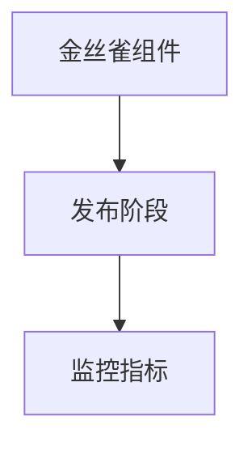

                 

### 引言与背景

随着人工智能（AI）技术的快速发展，AI新功能的开发和部署成为各个行业关注的焦点。然而，AI系统的复杂性和不确定性使得新功能的验证成为一个极具挑战性的问题。传统的测试方法虽然在功能验证方面有较好的表现，但在检测潜在故障和异常情况时存在一定的局限性。为了提高AI新功能的安全性、稳定性和可靠性，一种新型的验证方法——“金丝雀发布”逐渐引起了业界的关注。

**关键词：** AI新功能验证、金丝雀发布、安全性、稳定性、可靠性

**摘要：** 本文将深入探讨金丝雀发布这一新型验证方法，从其概念、应用场景、实施步骤、技术细节到挑战与解决方案进行全面剖析，旨在为AI新功能的逐步验证提供有效的参考和指导。

## 第1章 AI新功能验证的重要性

### 1.1 问题背景

在过去的几十年中，人工智能技术在多个领域取得了显著进展，从自然语言处理、计算机视觉到推荐系统等。然而，随着AI系统变得越来越复杂，其稳定性和可靠性成为了一个不容忽视的问题。AI新功能的开发通常涉及大量的数据、模型和算法，这些组件之间的相互作用可能导致不可预见的行为，从而影响系统的性能和用户体验。

**问题背景：** 随着AI系统在关键领域的应用日益广泛，如自动驾驶、金融交易、医疗诊断等，系统稳定性和可靠性的要求越来越高。任何微小的故障或异常都可能导致严重的后果，甚至危及生命。因此，对新功能进行严格的验证成为保障系统安全和稳定的关键步骤。

### 1.2 问题描述

传统的AI功能验证方法主要依赖于黑盒测试和白盒测试。黑盒测试通过模拟用户操作来验证系统功能，而白盒测试则通过分析代码逻辑来检测潜在的问题。然而，这些方法在验证AI新功能时存在以下问题：

1. **测试覆盖不足：** AI系统的复杂性使得全面的测试变得困难，往往只能覆盖部分功能，导致潜在故障未能被发现。
2. **测试成本高：** AI系统的测试需要大量的数据和时间，且自动化测试的复杂性增加，导致测试成本高昂。
3. **测试结果不可靠：** 传统的测试方法可能存在误报和漏报的问题，影响测试结果的可靠性。

**问题描述：** 在AI新功能的验证过程中，如何确保测试覆盖全面、成本可控，同时提高测试结果的可靠性，成为亟待解决的问题。

### 1.3 问题解决

为了解决上述问题，业界提出了金丝雀发布这一验证方法。金丝雀发布是一种逐步验证AI新功能的策略，通过模拟真实环境中的情况，逐步引入新功能，并实时监控系统的行为。这种方法具有以下优势：

1. **逐步引入：** 金丝雀发布通过逐步引入新功能，减少了一次性引入所有功能带来的风险，降低系统故障的可能性。
2. **实时监控：** 通过实时监控系统的行为，可以及时发现并处理异常情况，提高测试结果的可靠性。
3. **成本效益：** 金丝雀发布利用现有的测试工具和流程，减少了额外的测试成本，同时提高了测试效率。

**问题解决：** 金丝雀发布提供了一种有效的验证策略，可以逐步引入AI新功能，并在真实环境中进行验证，从而提高系统的稳定性和可靠性。

### 1.4 边界与外延

虽然金丝雀发布在AI新功能验证中具有显著的优势，但在实际应用中也存在一些边界和限制。

1. **适用范围：** 金丝雀发布主要适用于对系统稳定性和可靠性要求较高的场景，如自动驾驶、医疗诊断等。
2. **测试数据：** 金丝雀发布需要大量的真实测试数据，对于数据不足的情况，可能无法有效验证新功能。
3. **技术要求：** 实施金丝雀发布需要一定的技术储备，包括监控系统、自动化测试工具等。

**边界与外延：** 金丝雀发布作为一种验证方法，适用于特定场景和技术要求，需要在实际应用中根据具体情况进行调整和优化。

### 1.5 概念结构与核心要素组成

金丝雀发布的核心概念包括以下几个方面：

1. **金丝雀：** 指用于测试和监控的特定组件或功能，类似于煤矿中的金丝雀，用于检测环境中的有害气体。
2. **发布阶段：** 指逐步引入新功能的过程，通常分为多个阶段，每个阶段引入一部分新功能。
3. **监控指标：** 指用于评估系统行为的指标，包括性能指标、错误率、响应时间等。

**概念结构与核心要素组成：** 金丝雀发布通过金丝雀组件、发布阶段和监控指标实现逐步验证AI新功能，其核心结构如图1所示。

图1 金丝雀发布的核心概念结构

通过上述分析，我们可以看到金丝雀发布在AI新功能验证中具有重要的作用。接下来，我们将进一步探讨金丝雀发布的概念、应用场景和实施步骤，以期为AI新功能的验证提供全面的指导。

