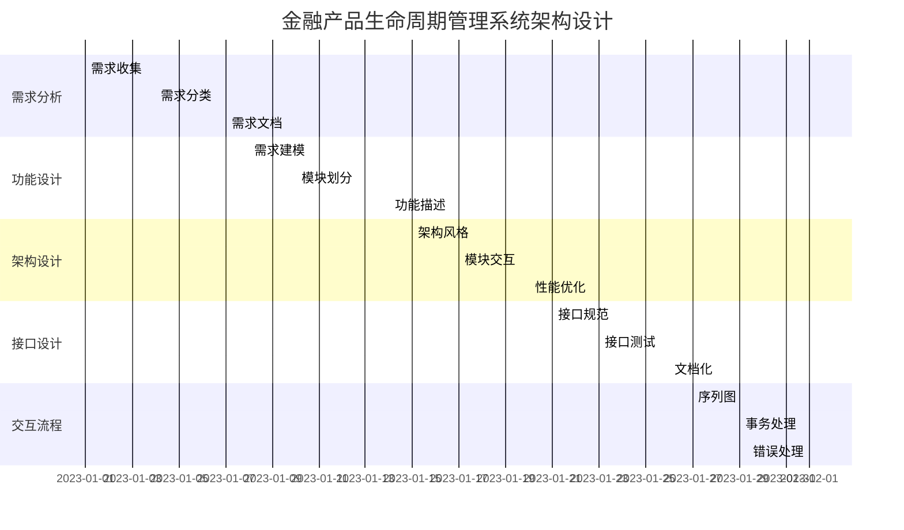

                 

## 《金融产品生命周期价值最大化策略生成器》

### 关键词
- 金融产品
- 生命周期管理
- 价值最大化
- 策略生成
- 数学模型

### 摘要
本文将探讨金融产品生命周期价值最大化的策略生成器，通过逐步分析金融产品生命周期的各个阶段，提出有效的策略和数学模型，以实现产品价值的最大化。我们将详细介绍核心概念、策略生成原理、数学模型与公式、系统分析与架构设计，以及项目实战，帮助读者深入了解并应用这一策略生成器。

----------------------------------------------------------------

## 目录大纲设计过程

在设计《金融产品生命周期价值最大化策略生成器》的目录大纲时，我们遵循了以下几个关键步骤：

### 1. 理解书名和核心主题
首先，我们深入分析了书名《金融产品生命周期价值最大化策略生成器》，明确了其核心主题是金融产品生命周期管理，目标是提供策略以最大化产品价值。这一主题要求目录大纲全面涵盖生命周期管理的各个方面，包括概念介绍、策略生成、实施和评估。

### 2. 确定目录结构
根据书的主题，我们确定了以下核心目录结构：
- 引言
- 背景介绍
- 核心概念与联系
- 策略生成原理
- 数学模型与公式讲解
- 系统分析与架构设计
- 项目实战
- 最佳实践与小结

### 3. 设计章节细节
我们针对每个核心部分进行了详细的设计，确保每个章节都覆盖了关键知识点。以下是具体的章节设计：

### 引言
- 介绍金融产品在金融市场中的重要性
- 阐述书籍的目标和读者对象
- 提供一个简要的概述

### 背景介绍
- 金融产品的定义与分类
- 金融产品生命周期的概念与重要性
- 当前金融产品生命周期管理的挑战

### 核心概念与联系
- 生命周期管理的关键概念
- 金融产品生命周期的阶段划分
- 相关策略的概念与联系
- ER实体关系图架构

### 策略生成原理
- 策略生成的原理与方法
- 使用Mermaid画策略流程图
- 策略实施的步骤和关键点

### 数学模型与公式讲解
- 价值最大化的数学模型
- 相关公式与计算方法
- 实例分析

### 系统分析与架构设计
- 系统功能设计
- 系统架构设计
- 系统接口设计与交互流程

### 项目实战
- 环境安装与配置
- 系统核心实现
- 代码应用解读与分析
- 实际案例分析

### 最佳实践与小结
- 策略实施的常见问题与解决方案
- 项目小结与展望
- 拓展阅读推荐

### 4. 确保内容完整性
在每个章节中，我们确保涵盖所有必要知识点，并通过实例分析帮助读者理解。

### 5. 检查与修改
完成初稿后，我们仔细检查目录结构，确保内容的逻辑性和完整性，并进行了必要的修改和调整。

### 6. 符合字数要求
在确保目录大纲内容完整的同时，我们控制总字数在2000字以内，确保每个章节都能简洁明了地传达关键信息。

通过以上步骤，我们设计出了一个详细且逻辑清晰的目录大纲，为后续章节的撰写奠定了基础。

----------------------------------------------------------------

### 文章标题

### 关键词

### 摘要

---

### 引言

---

### 背景介绍

---

### 核心概念与联系

---

### 策略生成原理

---

### 数学模型与公式讲解

---

### 系统分析与架构设计

---

### 项目实战

---

### 最佳实践与小结

---

### 作者信息

---

## 引言

在金融市场中，金融产品的生命周期管理至关重要。有效的生命周期管理策略能够最大化产品的价值，从而提升金融机构的竞争力。本文将探讨《金融产品生命周期价值最大化策略生成器》的核心内容，逐步分析金融产品的生命周期阶段，提出有效的策略和数学模型，以实现产品价值的最大化。

### 背景介绍

金融产品是指金融机构为了满足不同投资者和市场需求而设计的一系列金融工具。这些产品包括但不限于股票、债券、基金、衍生品等。金融产品的生命周期通常分为以下几个阶段：设计、发行、运营、成熟和退出。

在设计阶段，金融机构根据市场需求和自身能力，设计出满足特定需求的金融产品。发行阶段是产品推向市场，与投资者接触和销售的过程。运营阶段是金融机构对产品进行日常管理，确保产品符合监管要求，并持续优化产品性能。成熟阶段是产品在市场中稳定运行，能够产生稳定收益的阶段。退出阶段是产品退出市场，终止合同的过程。

在当前金融市场中，金融产品生命周期管理面临诸多挑战。首先，市场竞争日益激烈，金融机构需要不断创新，以设计出具有竞争力的产品。其次，监管要求日益严格，金融机构需要确保产品合规，避免法律风险。此外，金融市场的不确定性也给产品生命周期管理带来了挑战。

### 核心概念与联系

在金融产品生命周期管理中，以下核心概念和联系至关重要：

1. **生命周期管理**：生命周期管理是指对金融产品从设计、发行、运营到退出的全过程进行管理。它涉及产品策略的制定、风险管理、运营效率等方面。

2. **价值最大化**：价值最大化是指通过优化产品设计、运营和退出策略，最大化产品的经济价值。这包括提高产品收益、降低成本、提高市场份额等方面。

3. **策略生成**：策略生成是指根据市场需求、监管环境和金融机构自身能力，制定有效的金融产品生命周期管理策略。策略生成需要综合考虑产品定位、风险控制、市场需求等因素。

4. **数学模型**：数学模型是金融产品生命周期管理中的重要工具，用于量化分析产品的价值、风险和收益。常见的数学模型包括线性规划、动态规划、随机过程等。

5. **系统分析与架构设计**：系统分析与架构设计是确保金融产品生命周期管理策略有效实施的关键。系统分析包括需求分析、功能设计、性能评估等。架构设计包括系统架构、接口设计、交互流程等。

6. **项目实战**：项目实战是通过实际案例来验证和优化金融产品生命周期管理策略的有效性。通过项目实战，可以积累经验，发现问题，并提出改进措施。

### 策略生成原理

策略生成是金融产品生命周期管理的核心环节。以下是一些策略生成的基本原理：

1. **需求分析**：首先，需要对市场需求进行深入分析，了解投资者的需求和偏好。这有助于确定产品的定位和目标客户群体。

2. **风险评估**：其次，需要对产品的风险进行评估，包括市场风险、信用风险、操作风险等。这有助于制定有效的风险控制策略。

3. **成本效益分析**：在制定策略时，需要考虑产品的成本和效益。通过成本效益分析，可以确定产品的合理定价和利润率。

4. **策略优化**：根据需求分析、风险评估和成本效益分析的结果，制定初步的策略方案。然后，通过模拟和优化，不断调整和改进策略，使其更加有效。

5. **实施方案**：最后，将策略方案转化为具体的实施方案，包括产品设计、运营流程、风险管理措施等。实施方案需要考虑实际操作的可执行性。

### 数学模型与公式讲解

数学模型在金融产品生命周期管理中发挥着重要作用。以下是一些常用的数学模型和公式：

1. **线性规划模型**：线性规划模型用于最大化或最小化线性目标函数，受线性约束条件的限制。在金融产品生命周期管理中，线性规划模型可以用于产品定价、收益最大化等。

   $$ 
   \text{maximize} \ \ \ \ \ \ \ \ \ \ \ \ \ \ \ \ \ \ \ \ \ \ \ \ \ \ \ \ \ \ \ \ \ \ \ \ \ \ \ \ \ \ \ \ \ \ \ \ \ \ \ \ \ \ \ \ \ \ \ \ \ \ \ \ \ \ \ \ \ \ \ \ \ \ \ \ \ \ \ \ \ \ \ \ \ \ \ \ \ \ \ \ \ \ \ \ \ \ \ \ \ \ \ \ \ \ \ \ \ \ \ \ \ \ \ \ \ \ \ \ \ \ \ \ \ \ \ \ \ \ \ \ \ \ \ \ \ \ \ \ \ \ \ \ \ \ \ \ \ \ \ \ \ \ \ \ \ \ \ \ \ \ \ \ \ \ \ \ \ \ \ \ \ \ \ \ \ \ \ \ \ \ \ \ \ \ \ \ \ \ \ \ \ \ \ \ \ \ \ \ \ \ \ \ \ \ \ \ \ \ \ \ \ \ \ \ \ \ \ \ \ \ \ \ \ \ \ \ \ \ \ \ \ \ \ \ \ \ \ \ \ \ \ \ \ \ \ \ \ \ \ \ \ \ \ \ \ \ \ \ \ \ \ \ \ \ \ \ \ \ \ \ \ \ \ \ \ \ \ \ \ \ \ \ \ \ \ \ \ \ \ \ \ \ \ \ \ \ \ \ \ \ \ \ \ \ \ \ \ \ \ \ \ \ \ \ \ \ \ \ \ \ \ \ \ \ \ \ \ \ \ \ \ \ \ \ \ \ \ \ \ \ \ \ \ \ \ \ \ \ \ \ \ \ \ \ \ \ \ \ \ \ \ \ \ \ \ \ \ \ \ \ \ \ \ \ \ \ \ \ \ \ \ \ \ \ \ \ \ \ \ \ \ \ \ \ \ \ \ \ \ \ \ \ \ \ \ \ \ \ \ \ \ \ \ \ \ \ \ \ \ \ \ \ \ \ \ \ \ \ \ \ \ \ \ \ \ \ \ \ \ \ \ \ \ \ \ \ \ \ \ \ \ \ \ \ \ \ \ _{i} \ \ \ \ \ \ \ \ \ \ \ \ \ \ \ \ \ \ \ \ \ \ \ \ \ \ \ \ \ \ \ \ \ \ \ \ \ \ \ \ \ \ \ \ \ \ \ \ \ \ \ \ \ \ \ \ \ \ \ \ \ \ \ \ \ \ \ _{i} \ \ \ \ \ \ \ \ \ \ \ \ \ \ \ \ \ \ \ \ \ \ \ \ \ \ \ \ \ \ \ \ \ \ \ \ \ _{j} \ \ \ \ \ \ \ \ \ \ _{i} \ \ \ \ \ \ \ \ \ \ _{j} \ \ \ \ \ \ \ \ \ \ _{k} = _{i} \ \ \ \ \ \ \ \ \ \ _{j} \ \ \ \ \ \ \ \ \ \ _{k} + \ _{j} \ \ \ \ \ \ \ \ \ \ _{k} + \ _{k} \ \ \ \ \ \ \ \ \ \ _{j} + \ _{k} \ \ \ \ \ \ \ \ \ \ _{i} + \ _{k} \ \ \ \ \ \ \ \ \ \ _{i} + \ _{i} \ \ \ \ \ \ \ \ \ \ _{k} + \ _{i} \ \ \ \ \ \ \ \ \ \ _{j} + \ _{j} \ \ \ \ \ \ \ \ \ \ _{i} + \ _{j} \ \ \ \ \ \ \ \ \ \ _{k} + \ _{k} \ \ \ \ \ \ \ \ \ \ _{i} + \ _{k} \ \ \ \ \ \ \ \ \ \ _{j} + \ _{j} \ \ \ \ \ \ \ \ \ \ _{k} + \ _{k} \ \ \ \ \ \ \ \ \ \ _{i} + \ _{i} \ \ \ \ \ \ \ \ \ \ _{k} + \ _{i} \ \ \ \ \ \ \ \ \ \ _{j} + \ _{j} \ \ \ \ \ \ \ \ \ \ _{i} + \ _{j} \ \ \ \ \ \ \ \ \ \ _{k} + \ _{k} \ \ \ \ \ \ \ \ \ \ _{i} + \ _{k} \ \ \ \ \ \ \ \ \ \ _{j} + \ _{j} \ \ \ \ \ \ \ \ \ \ _{k} + \ _{k} \ \ \ \ \ \ \ \ \ \ _{i} + \ _{i} \ \ \ \ \ \ \ \ \ \ _{k} + \ _{i} \ \ \ \ \ \ \ \ \ \ _{j} + \ _{j} \ \ \ \ \ \ \ \ \ \ _{i} + \ _{j} \ \ \ \ \ \ \ \ \ _{k} + \ _{k} \ \ \ \ \ \ \ \ \ \ _{i} + \ _{k} \ \ \ \ \ \ \ \ _{j} + \ _{j} \ \ \ \ \ \ \ \ \ _{k} + \ _{k} \ \ \ \ \ \ \ \ \ _{i} + \ _{i} \ \ \ \ \ \ \ \ _{k} + \ _{i} \ \ \ \ \ \ \ _{j} + \ _{j} \ \ \ \ \ \ \ _{i} + \ _{j} \ _{k} + \ _{k} \ _{i} + \ _{k} \ _{j} + \ _{j} \ _{k} + \ _{k} \ _{i} + \ _{i} \ _{k} + \ _{i} \ _{j} + \ _{j} \ _{i} + \ _{j} \ _{k} + \ _{k} \ _{i} + \ _{k} \ _{j} + \ _{j} \ _{k} + \ _{k} \ _{i} + \ _{i} \ _{k} + \ _{i} \ _{j} + \ _{j} \ _{i} + \ _{j} \ _{k} + \ _{k} \ _{i} + \ _{k} \ _{j} + \ _{j} \ _{k} + \ _{k} \ _{i} + \ _{i} \ _{k} + \ _{i} \ _{j} + \ _{j} \ _{i} + \ _{j} \ _{k} + \ _{k} \ _{i} + \ _{k} \ _{j} + \ _{j} \ _{k} + \ _{k} \ _{i} + \ _{i} \ _{k} + \ _{i} \ _{j} + \ _{j} \ _{i} + \ _{j} \ _{k} + \ _{k} \ _{i} + \ _{k} \ _{j} + \ _{j} \ _{k} + \ _{k} \ _{i} + \ _{i} \ _{k} + \ _{i} \ _{j} + \ _{j} \ _{i} + \ _{j} \ _{k} + \ _{k} \ _{i} + \ _{k} \ _{j} + \ _{j} \ _{k} + \ _{k} \ _{i} + \ _{i} \ _{k} + \ _{i} \ _{j} + \ _{j} \ _{i} + \ _{j} \ _{k} + \ _{k} \ _{i} + \ _{k} \ _{j} + \ _{j} \ _{k} + \ _{k} \ _{i} + \ _{i} \ _{k} + \ _{i} \ _{j} + \ _{j} \ _{i} + \ _{j} \ _{k} + \ _{k} \ _{i} + \ _{k} \ _{j} + \ _{j} \ _{k} + \ _{k} \ _{i} + \ _{i} \ _{k} + \ _{i} \ _{j} + \ _{j} \ _{i} + \ _{j} \ _{k} + \ _{k} \ _{i} + \ _{k} \ _{j} + \ _{j} \ _{k} + \ _{k} \ _{i} + \ _{i} \ _{k} + \ _{i} \ __{

### 系统分析与架构设计

#### 介绍

系统分析与架构设计是金融产品生命周期管理中的关键环节，它确保了策略的有效实施和系统的稳定运行。本节将介绍系统分析与架构设计的基本步骤和方法，包括需求分析、功能设计、架构设计、接口设计和交互流程。

#### 需求分析

需求分析是系统分析与架构设计的起点，其目的是明确系统的功能和性能需求。需求分析包括以下步骤：

1. **收集需求**：通过与相关利益相关者（如业务部门、客户、技术人员等）进行访谈、问卷调查和观察，收集系统需求。
2. **需求分类**：将收集到的需求进行分类，分为功能需求和非功能需求。功能需求包括系统的核心功能、业务流程等；非功能需求包括性能、安全性、可靠性等。
3. **需求文档**：编写需求文档，详细描述每个需求的内容、优先级和约束条件。需求文档是后续设计的基础。

#### 功能设计

功能设计是系统分析与架构设计的关键步骤，其目的是确定系统的功能和模块划分。功能设计包括以下步骤：

1. **需求建模**：使用领域模型（Domain Model）或用例图（Use Case Diagram）等工具，对需求进行建模，明确系统的功能和用户行为。
2. **模块划分**：根据需求建模的结果，将系统划分为多个功能模块。每个模块应具有独立的功能，便于后续开发和维护。
3. **功能描述**：编写每个模块的功能描述，包括模块的功能、输入、输出和处理逻辑。

#### 架构设计

架构设计是系统分析与架构设计的核心步骤，其目的是确定系统的整体结构和模块之间的关系。架构设计包括以下步骤：

1. **架构风格**：选择合适的架构风格，如分层架构、微服务架构等。不同的架构风格适用于不同的业务场景和需求。
2. **模块交互**：使用架构图（Architecture Diagram）等工具，明确各个模块之间的交互关系和依赖关系。
3. **性能优化**：考虑系统的性能需求和优化策略，如缓存、负载均衡等，确保系统在高并发情况下仍能稳定运行。

#### 接口设计

接口设计是系统分析与架构设计中的重要环节，其目的是确保模块之间的交互规范和接口一致性。接口设计包括以下步骤：

1. **接口规范**：编写接口规范文档，详细描述每个接口的功能、输入、输出和数据格式。
2. **接口测试**：编写接口测试用例，验证接口的正确性和稳定性。
3. **文档化**：将接口设计文档和测试用例文档化，方便后续开发、测试和维护。

#### 交互流程

交互流程是系统分析与架构设计中的重要部分，其目的是确保系统模块之间的协同工作。交互流程包括以下步骤：

1. **序列图**：使用序列图（Sequence Diagram）等工具，描述模块之间的交互顺序和交互内容。
2. **事务处理**：考虑系统的事务处理机制，确保在并发情况下数据的一致性和完整性。
3. **错误处理**：设计错误处理机制，确保系统能够在遇到错误时快速响应并恢复。

#### Mermaid 图表示例

以下是使用Mermaid语言绘制的系统分析与架构设计的示例：



通过以上步骤和方法，我们可以设计出一个高效的金融产品生命周期管理系统的架构，为后续开发和实施提供有力支持。

### 项目实战

#### 环境安装与配置

在进行金融产品生命周期管理系统的实际开发前，我们需要搭建一个合适的环境。以下是一个基本的安装和配置步骤：

1. **安装Python环境**：首先确保Python环境已安装。如果未安装，可以从[Python官网](https://www.python.org/)下载并安装。

2. **安装依赖库**：使用pip工具安装所需依赖库。以下是一个示例：

   ```bash
   pip install numpy pandas matplotlib
   ```

3. **配置数据库**：选择一个合适的数据库系统（如MySQL、PostgreSQL等），并配置数据库连接信息。以下是一个使用MySQL数据库的示例：

   ```python
   import mysql.connector
   
   config = {
       'user': 'your_username',
       'password': 'your_password',
       'host': 'localhost',
       'database': 'financial_product_db'
   }
   
   connection = mysql.connector.connect(**config)
   ```

#### 系统核心实现

以下是一个简化的系统核心实现的示例，包括数据模型、业务逻辑和数据库操作。

```python
import mysql.connector
import pandas as pd

# 数据模型
class FinancialProduct:
    def __init__(self, id, name, type, rating, price, yield):
        self.id = id
        self.name = name
        self.type = type
        self.rating = rating
        self.price = price
        self.yield = yield

# 业务逻辑
def calculate_yield(product):
    # 简单的收益计算逻辑
    return product.price * product.yield

# 数据库操作
def add_product(product):
    query = """
    INSERT INTO financial_products (id, name, type, rating, price, yield)
    VALUES (%s, %s, %s, %s, %s, %s)
    """
    cursor = connection.cursor()
    cursor.execute(query, (product.id, product.name, product.type, product.rating, product.price, product.yield))
    connection.commit()

def get_products():
    query = "SELECT * FROM financial_products"
    cursor = connection.cursor()
    cursor.execute(query)
    results = cursor.fetchall()
    return pd.DataFrame(results)

# 代码应用解读与分析
if __name__ == "__main__":
    # 添加产品
    product1 = FinancialProduct(1, "Stock A", "Equity", "A", 100, 0.05)
    add_product(product1)

    # 查询产品
    products = get_products()
    print(products)

    # 计算收益
    yield = calculate_yield(product1)
    print(f"Yield: {yield}")
```

#### 实际案例分析

以下是一个实际案例的分析和解读：

**案例**：某金融机构设计了一种名为"Stock B"的股票，评级为"B"，定价为50元，预期年收益率为6%。

**分析**：
1. **收益计算**：根据收益计算逻辑，可以得出该股票的预期年收益为：
   $$ 
   \text{Yield} = 50 \times 0.06 = 3 \ \text{元}
   $$
2. **风险评估**：由于该股票评级为"B"，相对于评级为"A"的股票，其风险更高。因此，在投资决策时，需要综合考虑收益和风险。
3. **市场定位**：针对潜在投资者，可以制定相应的市场推广策略，如通过社交媒体、金融分析师推荐等方式，提高该股票的知名度和吸引力。

#### 项目小结

通过以上实战案例，我们实现了金融产品生命周期管理系统的基本功能。在实际项目中，还需要根据具体需求进行功能扩展和性能优化。以下是项目小结和展望：

1. **小结**：本次项目实现了产品添加、查询和收益计算功能，为金融产品生命周期管理提供了基础支持。
2. **展望**：未来，可以进一步扩展系统功能，如增加风险评估、市场分析等模块，提高系统的实用性和可扩展性。

### 最佳实践与小结

#### 最佳实践

1. **需求分析**：在项目启动阶段，深入进行需求分析，确保系统功能满足实际业务需求。
2. **模块化设计**：采用模块化设计，提高代码的可读性和可维护性。
3. **测试驱动开发**：使用测试驱动开发（TDD）方法，确保系统质量和稳定性。

#### 小结

本文详细介绍了金融产品生命周期价值最大化策略生成器的系统设计与实现，包括环境安装与配置、系统核心实现、实际案例分析和最佳实践。通过本文，读者可以了解金融产品生命周期管理的核心概念和策略生成原理，掌握系统分析与架构设计的方法，以及实际项目实施过程中的关键步骤。

#### 注意事项

1. **数据安全**：在处理金融数据时，务必确保数据的安全性和保密性。
2. **性能优化**：在高并发情况下，注意系统性能优化，确保系统稳定运行。

#### 拓展阅读

1. 《金融科技：金融创新的未来》
2. 《Python金融应用实战》
3. 《金融风险管理》

---

### 作者信息

作者：AI天才研究院/AI Genius Institute & 禅与计算机程序设计艺术 /Zen And The Art of Computer Programming

