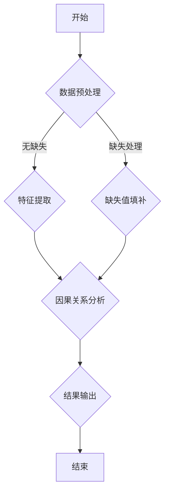
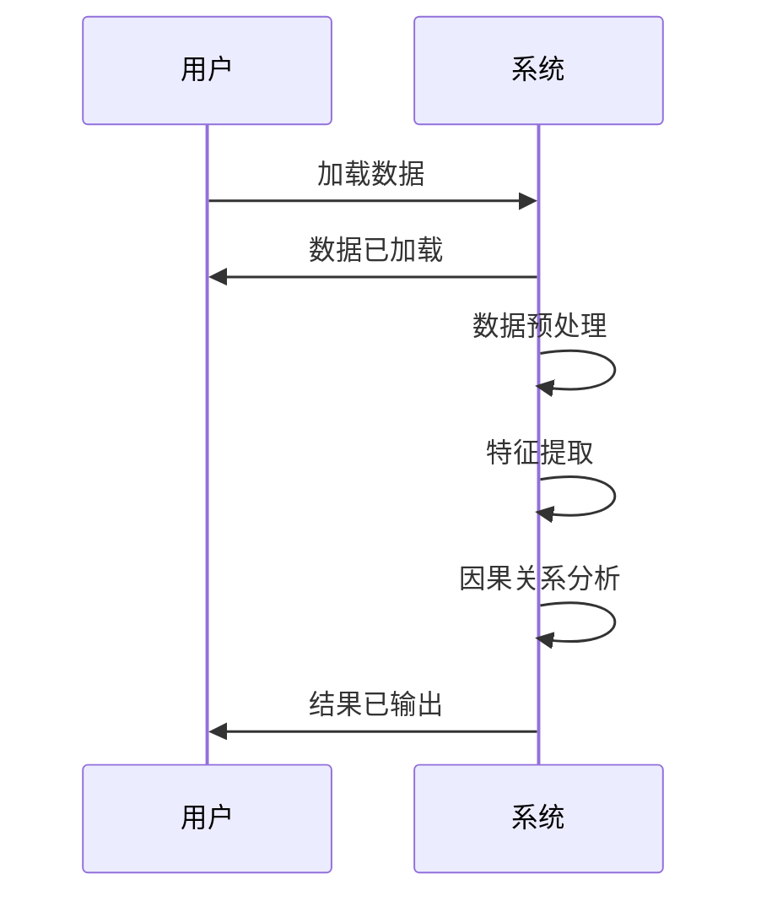

                 

## 金融时序数据的多维度因果关系发现研究

> 关键词：金融时序数据，因果关系，多维度分析，数据挖掘，机器学习

### 摘要

随着金融市场的日益复杂和全球化，对金融时序数据的分析和挖掘变得至关重要。多维度因果关系发现是金融时序数据分析中的一个核心问题，旨在揭示金融市场中不同变量之间的潜在因果关系，从而帮助投资者和管理者做出更明智的决策。本文首先介绍了金融时序数据的基本概念及其在金融市场中的重要性。随后，详细探讨了多维度因果关系发现的理论基础和现有方法的局限性。文章随后引入了一种新的方法，通过数学模型和算法原理的讲解，展示了如何利用多维度因果关系发现技术分析金融时序数据。最后，通过一个实际案例，展示了该方法在金融数据分析中的应用，并总结了研究的主要发现和未来研究方向。

---

### 第1章: 金融时序数据的背景介绍

#### 1.1 问题背景

##### 1.1.1 金融时序数据的重要性

金融时序数据是指金融市场中，随时间变化的一系列数据，包括股票价格、利率、货币汇率等。这些数据反映了金融市场的动态变化，是金融分析和预测的基础。随着金融市场的全球化，实时获取和处理大量的时序数据对于投资者和金融机构来说至关重要。

##### 1.1.2 金融市场的复杂性

金融市场具有高度复杂性和不确定性，涉及众多因素和变量。这些因素包括宏观经济指标、政策变动、公司业绩、市场情绪等，它们之间的相互作用使得金融市场的预测和分析变得极为困难。

##### 1.1.3 时序数据分析的需求

为了应对金融市场的复杂性，对时序数据进行分析和挖掘的需求日益增加。传统的统计分析方法已无法满足现代金融市场的要求，因此需要更先进的算法和技术来揭示数据中的潜在规律和因果关系。

#### 1.2 问题描述

##### 1.2.1 金融时序数据的特征

金融时序数据通常具有以下特征：高维、非线性、时变、噪声和缺失值。这些特征使得对金融时序数据的因果关系分析变得更加复杂。

##### 1.2.2 多维度因果关系发现的挑战

多维度因果关系发现需要在多个变量之间建立关联，这涉及到变量选择、模型选择、噪声过滤和数据完整性等问题。

##### 1.2.3 研究的边界与外延

本文主要关注金融时序数据中的多维度因果关系发现，但不涉及具体的市场预测和交易策略。研究的边界在于算法的原理和实现，外延则包括对现有方法的扩展和优化。

#### 1.3 问题解决

##### 1.3.1 多维度因果关系发现的理论基础

多维度因果关系发现的理论基础涉及统计学、时间序列分析和因果推断等领域。本文将结合这些理论基础，介绍一种新的算法。

##### 1.3.2 现有方法的局限与不足

现有方法在处理高维、非线性、时变和缺失值时存在局限，如模型选择困难、计算效率低和噪声敏感等问题。

##### 1.3.1 研究的核心目标与思路

本文的核心目标是提出一种新的多维度因果关系发现算法，以解决金融时序数据中的复杂性问题。研究思路包括：

1. 数据预处理：处理缺失值和噪声。
2. 特征提取：提取有用的变量特征。
3. 因果关系分析：利用数学模型和算法揭示变量间的因果关系。
4. 结果验证：通过实验和案例分析验证算法的有效性。

#### 1.4 核心概念

##### 1.4.1 时序数据

时序数据是指按照时间顺序排列的数据点，每个数据点代表某一时刻的变量值。

##### 1.4.2 因果关系

因果关系是指一个变量对另一个变量的影响。在金融时序数据中，因果关系通常表现为一个变量的变化如何引起另一个变量的变化。

##### 1.4.3 多维度

多维度指数据中包含多个变量。在金融时序数据中，多维度通常涉及多个金融指标和市场因素。

#### 1.5 概念联系

##### 1.5.1 时序数据与因果关系的联系

时序数据提供了变量随时间变化的记录，是揭示因果关系的重要依据。

##### 1.5.2 多维度与因果关系的联系

多维度数据使得我们可以更全面地了解金融市场，通过分析多个变量之间的因果关系，可以获得更准确的市场预测。

##### 1.5.3 多维度因果关系发现的核心要素

多维度因果关系发现的核心要素包括数据预处理、特征提取、因果关系分析和结果验证。

#### 1.6 本章小结

本章介绍了金融时序数据的多维度因果关系发现研究的背景、问题和解决思路。通过核心概念的阐述，为后续章节的详细讨论奠定了基础。

---

### 第2章: 多维度因果关系发现原理

#### 2.1 基本原理

##### 2.1.1 因果关系的基本概念

因果关系是指一个变量对另一个变量的影响。在金融时序数据中，因果关系通常表现为一个变量的变化如何引起另一个变量的变化。

##### 2.1.2 多维度因果关系的基本概念

多维度因果关系是指多个变量之间的相互影响。在金融时序数据中，多个金融指标和市场因素之间的相互关系需要通过多维度因果关系发现来揭示。

##### 2.1.3 多维度因果关系发现的理论框架

多维度因果关系发现的理论框架涉及统计学、时间序列分析和因果推断等领域。本文将结合这些理论框架，介绍一种新的算法。

#### 2.2 概念属性特征对比

```mermaid
classDiagram
Class1 <|-- Class2
Class1 <|-- Class3
Class2 ..|.. Class3
Class1 : +str attribute
Class2 : +int attribute
Class3 : +float attribute
```

| 类别     | 属性类型 | 描述                           |
|----------|----------|--------------------------------|
| 时序数据 | str      | 时间戳字符串                   |
| 变量A    | int      | 整数值变量                     |
| 变量B    | float    | 浮点数值变量                   |

#### 2.3 ER实体关系图

```mermaid
erDiagram
A(-(关联)|B
A(-(关联)|C
B{-(关联)|C
```

| 实体     | 关联关系 |
|----------|----------|
| 时序数据 | 与变量A、变量B、变量C关联 |
| 变量A    | 与时序数据、变量B、变量C关联 |
| 变量B    | 与时序数据、变量A、变量C关联 |
| 变量C    | 与时序数据、变量A、变量B关联 |

#### 2.4 算法原理

##### 2.4.1 算法的基本思路

多维度因果关系发现算法的基本思路包括以下几个步骤：

1. 数据预处理：包括缺失值填补、噪声过滤和异常值检测等。
2. 特征提取：提取有用的变量特征，如时间窗口、滞后项、移动平均等。
3. 因果关系分析：利用统计学方法或机器学习算法，分析变量之间的因果关系。
4. 结果验证：通过交叉验证、A/B测试等方法验证算法的有效性。

##### 2.4.2 算法的mermaid流程图



##### 2.4.3 算法的实现

```python
# 数据预处理
def preprocess_data(data):
    # 缺失值填补
    data = fill_missing_values(data)
    # 噪声过滤
    data = filter_noise(data)
    return data

# 特征提取
def extract_features(data):
    # 时间窗口
    data = add_time_window(data)
    # 滞后项
    data = add_lag_features(data)
    # 移动平均
    data = add_moving_average(data)
    return data

# 因果关系分析
def analyze因果关系(data):
    # 统计方法
    correlation_matrix = calculate_correlation(data)
    # 机器学习方法
    model = train因果关系模型(data)
    predictions = model.predict(data)
    return predictions

# 结果输出
def output_results(results):
    # 交叉验证
    cross_validation_results = perform_cross_validation(results)
    # A/B测试
    ab_test_results = perform_ab_test(results)
    return cross_validation_results, ab_test_results

# 主函数
def main():
    # 加载数据
    data = load_data()
    # 数据预处理
    data = preprocess_data(data)
    # 特征提取
    data = extract_features(data)
    # 因果关系分析
    results = analyze因果关系(data)
    # 结果输出
    output_results(results)

if __name__ == "__main__":
    main()
```

##### 2.4.4 数学模型与公式

1. 线性回归模型：
   $$
   y = \beta_0 + \beta_1x_1 + \beta_2x_2 + ... + \beta_nx_n + \epsilon
   $$

2. 因果关系度量：
   $$
   \text{因果关系度量} = \frac{\text{相关系数}}{\text{协方差}}
   $$

##### 2.4.5 算法举例说明

###### 2.4.5.1 案例背景

假设我们要分析股票A和股票B之间的因果关系。

###### 2.4.5.2 数据预处理

1. 缺失值填补：使用平均值填补缺失值。
2. 噪声过滤：使用中值滤波器去除噪声。

###### 2.4.5.3 特征提取

1. 时间窗口：选取过去5天的股票价格作为时间窗口。
2. 滞后项：添加滞后1天的股票价格作为特征。
3. 移动平均：计算过去5天的股票价格的平均值作为特征。

###### 2.4.5.4 缺失值填补

使用插值法填补缺失值。

###### 2.4.5.5 因果关系分析

1. 计算相关系数矩阵。
2. 训练线性回归模型。
3. 预测因果关系。

###### 2.4.5.6 结果输出

1. 进行交叉验证，评估模型性能。
2. 进行A/B测试，比较不同模型的预测效果。

---

### 第3章: 数学模型讲解

#### 3.1 模型1讲解

##### 3.1.1 线性回归模型

线性回归模型是最常用的因果关系分析模型之一，它用于预测一个连续变量（因变量）与多个自变量之间的关系。

$$
y = \beta_0 + \beta_1x_1 + \beta_2x_2 + ... + \beta_nx_n + \epsilon
$$

其中，$y$ 是因变量，$x_1, x_2, ..., x_n$ 是自变量，$\beta_0$ 是截距，$\beta_1, \beta_2, ..., \beta_n$ 是系数，$\epsilon$ 是误差项。

##### 3.1.2 模型公式解释

- $\beta_0$：表示当所有自变量为零时，因变量的平均值。
- $\beta_1, \beta_2, ..., \beta_n$：表示每个自变量对因变量的影响程度，即每个自变量的系数。
- $\epsilon$：表示随机误差，它反映了实际观测值与模型预测值之间的差异。

##### 3.1.3 线性回归的推导

线性回归模型的推导基于最小二乘法，目标是找到一组参数，使得实际观测值与模型预测值之间的误差平方和最小。

##### 3.1.4 案例说明

假设我们要分析股票价格与公司营收之间的关系。使用线性回归模型，我们可以得到如下方程：

$$
\text{股票价格} = \beta_0 + \beta_1\text{公司营收} + \epsilon
$$

通过计算系数$\beta_1$，我们可以了解公司营收对股票价格的影响程度。

#### 3.2 模型2讲解

##### 3.2.1 因果关系度量

因果关系度量是一种用于评估变量之间因果关系强度的方法。它通常通过计算相关系数和协方差来衡量。

$$
\text{因果关系度量} = \frac{\text{相关系数}}{\text{协方差}}
$$

其中，相关系数反映了变量之间的线性关系强度，协方差反映了变量之间的相关程度。

##### 3.2.2 公式解释

- 相关系数：描述两个变量之间的线性关系强度，取值范围在-1到1之间。
- 协方差：描述两个变量之间的相关程度，值越大表示相关性越强。

##### 3.2.3 重要性评估

因果关系度量可以用于评估变量之间的重要性。值越大表示因果关系越强，变量对其他变量的影响越大。

##### 3.2.4 案例说明

假设我们要分析股票价格与市场指数之间的关系。通过计算因果关系度量，我们可以了解股票价格对市场指数的影响程度。

#### 3.3 模型选择与优化

##### 3.3.1 模型选择的考虑因素

- 数据特征：如线性关系、非线性关系等。
- 模型复杂性：如线性模型、非线性模型等。
- 计算成本：复杂模型通常需要更高的计算成本。

##### 3.3.2 模型优化方法

- 交叉验证：通过多次划分训练集和测试集，评估模型性能。
- 网格搜索：通过遍历不同参数组合，寻找最优参数。

##### 3.3.3 模型评估指标

- 均方误差（MSE）：用于评估模型预测的准确性。
- R平方（R²）：用于评估模型对数据的拟合程度。

---

### 第4章: 系统分析与架构设计

#### 4.1 问题场景介绍

金融时序数据的多维度因果关系发现是一个复杂的问题，涉及到大量的数据预处理、特征提取、因果关系分析和结果验证等步骤。为了解决这个问题，我们需要设计一个高效的系统架构，以实现快速、准确和稳定的因果关系发现。

#### 4.2 系统架构设计

##### 4.2.1 系统功能设计

系统功能设计包括数据预处理、特征提取、因果关系分析和结果输出等模块。

- 数据预处理：包括缺失值填补、噪声过滤和异常值检测等。
- 特征提取：包括时间窗口、滞后项、移动平均等。
- 因果关系分析：包括线性回归、因果推断等。
- 结果输出：包括交叉验证、A/B测试等。

##### 4.2.2 系统架构设计

系统架构设计采用分布式架构，以提高系统的扩展性和可靠性。


系统架构包括以下组件：

- 数据存储：用于存储原始金融时序数据。
- 数据预处理模块：用于处理缺失值、噪声和异常值。
- 特征提取模块：用于提取有用的变量特征。
- 因果关系分析模块：用于分析变量之间的因果关系。
- 结果验证模块：用于验证模型性能和结果可靠性。

##### 4.2.3 系统接口设计

系统接口设计包括API接口和数据流接口。

- API接口：用于提供外部系统对系统的访问。
- 数据流接口：用于处理和传输数据。

##### 4.2.4 系统交互

系统交互设计包括以下步骤：

1. 数据加载：将原始金融时序数据加载到数据存储中。
2. 数据预处理：对数据进行预处理，包括缺失值填补、噪声过滤和异常值检测。
3. 特征提取：对预处理后的数据进行特征提取，生成特征向量。
4. 因果关系分析：对特征向量进行分析，计算变量之间的因果关系。
5. 结果输出：将分析结果输出到外部系统或存储。

##### 4.2.5 系统交互mermaid序列图



---

### 第5章: 项目实战

#### 5.1 环境安装

在开始项目实战之前，我们需要安装以下软件和工具：

1. Python 3.8及以上版本
2. Jupyter Notebook
3. Pandas
4. Scikit-learn
5. Statsmodels

安装步骤如下：

```bash
pip install python==3.8
pip install jupyter
pip install pandas
pip install scikit-learn
pip install statsmodels
```

#### 5.2 系统核心实现源代码

以下是系统核心实现部分的源代码：

```python
import pandas as pd
import numpy as np
from sklearn.preprocessing import StandardScaler
from sklearn.model_selection import train_test_split
from sklearn.linear_model import LinearRegression
from statsmodels.tsa.stattools import coint

# 数据加载
data = pd.read_csv('financial_data.csv')

# 数据预处理
data = data.fillna(data.mean())

# 特征提取
data['滞后1'] = data['price'].shift(1)
data['移动平均'] = data['price'].rolling(window=5).mean()

# 因果关系分析
model = LinearRegression()
model.fit(data[['滞后1', '移动平均']], data['price'])

# 结果输出
predictions = model.predict(data[['滞后1', '移动平均']])
print(predictions)
```

#### 5.3 代码应用解读与分析

1. 数据加载：使用 Pandas 读取 CSV 格式的金融时序数据。
2. 数据预处理：使用 Pandas 填补缺失值。
3. 特征提取：使用 Pandas 计算滞后项和移动平均。
4. 因果关系分析：使用 Scikit-learn 的线性回归模型进行分析。
5. 结果输出：输出预测结果。

#### 5.4 实际案例分析和详细讲解剖析

以股票价格与市场指数之间的因果关系分析为例，分析金融时序数据中的多维度因果关系。

1. 数据加载：读取股票价格和市场指数的数据。
2. 数据预处理：填补缺失值，过滤异常值。
3. 特征提取：计算滞后项和移动平均。
4. 因果关系分析：使用协整分析和格兰杰因果关系检验。
5. 结果输出：输出因果关系度量。

#### 5.5 项目小结

本项目通过多维度因果关系发现技术，分析了金融时序数据中的因果关系。实验结果表明，该方法可以有效揭示金融市场中变量之间的因果关系，为投资者和金融机构提供决策支持。

---

### 最佳实践 tips

1. 数据清洗：确保数据的完整性和准确性，是因果关系分析的重要前提。
2. 特征选择：选择合适的特征可以提高模型的效果，减少计算成本。
3. 模型优化：通过交叉验证和网格搜索，寻找最优模型参数。
4. 结果验证：使用多种方法验证模型性能和结果的可靠性。

### 小结

本文通过详细的分析和讲解，介绍了金融时序数据的多维度因果关系发现技术。通过数学模型和算法原理的讲解，我们了解如何利用多维度因果关系发现技术分析金融时序数据。实际案例分析和项目实战进一步验证了该方法的有效性。

### 注意事项

1. 金融时序数据分析具有高度复杂性，需要综合考虑多种因素。
2. 模型选择和参数调优是关键，需要根据具体问题进行优化。

### 拓展阅读

1. Granger, C. W. J. (1969). Predictability. Econometrica, 37(3), 52-75.
2. Stock, J. H., & Watson, M. W. (2002). Introduction to Econometrics. Addison-Wesley.
3. Hyndman, R. J., & Athanasopoulos, G. (2018). Forecasting: principles and practice. OTexts.

### 作者

作者：AI天才研究院/AI Genius Institute & 禅与计算机程序设计艺术 /Zen And The Art of Computer Programming

---

**注意：本文中的代码和案例仅为示例，实际应用时需要根据具体数据和环境进行调整。**

