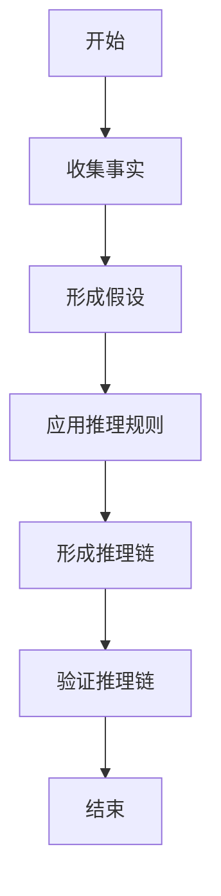
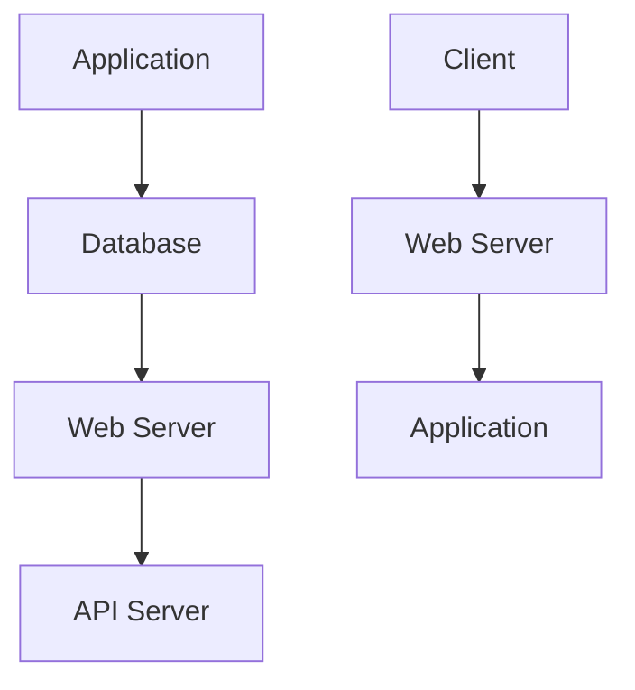
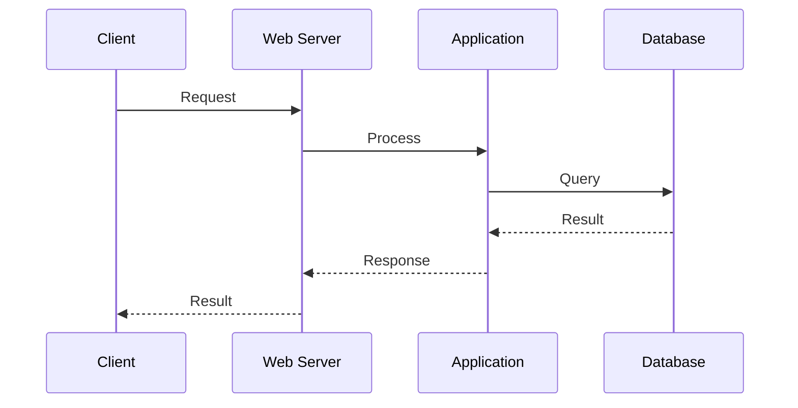

                 

### 关键词

- 链式思考
- 逻辑推理链
- 构建策略
- 算法原理
- 实践应用

### 摘要

本文深入探讨了链式思考的概念、原理以及其在逻辑推理中的应用。首先，我们介绍了链式思考的基本概念、特点与优势，回顾了其历史背景与发展。接着，我们详细阐述了构建逻辑推理链的方法，包括核心概念与联系、算法原理讲解和实践应用。通过具体案例和系统分析与架构设计，本文展示了如何将链式思考应用于实际问题解决中，提供了实用的构建策略和最佳实践，为读者提供了一个全面且系统的链式思考方法论。最后，本文总结了链式思考的重要性，并提出了未来研究的方向。

## 第一部分：链式思考概述

### 第1章：链式思考的基本概念

链式思考（Chain Thinking）是一种基于逻辑和推理的思维方式，通过一系列相关的思维步骤，逐步推导出结论或解决问题的方法。这种思考方式不仅要求思考者具备良好的逻辑分析能力，还需要有敏锐的洞察力和丰富的知识储备。

#### 1.1 链式思考的起源与发展

链式思考这一概念最早可以追溯到亚里士多德的时代，他提出的逻辑学基础为链式思考提供了理论基础。随着时间的推移，链式思考在哲学、数学、心理学等多个领域得到了广泛应用和深入研究。尤其是在计算机科学和人工智能领域，链式思考成为了一种重要的推理和问题解决策略。

##### 1.1.1 链式思考的定义

链式思考可以被定义为：通过一系列逻辑上相互关联的步骤，从已知的事实和假设出发，逐步推导出新的结论或解决问题的方法。这些步骤形成一个逻辑链条，每个步骤都是前一个步骤的合理延伸。

##### 1.1.2 链式思考的历史背景

链式思考的历史可以追溯到古希腊哲学家亚里士多德，他提出了形式逻辑的概念，这为链式思考的发展奠定了基础。在中世纪，链式思考被广泛应用于神学和哲学研究中。进入现代，随着逻辑学和计算机科学的兴起，链式思考得到了进一步的发展和完善。

##### 1.1.3 链式思考与逻辑推理

链式思考与逻辑推理密切相关。逻辑推理是指从已知的事实和假设出发，通过逻辑规则推导出新结论的过程。而链式思考则是逻辑推理的一种具体实现，它通过一系列逻辑上相互关联的步骤，形成一条完整的推理链。

#### 1.2 链式思考的特点与优势

链式思考具有以下几个显著特点：

1. **系统性**：链式思考注重思维的整体性，通过将各个步骤紧密连接，形成一条完整的推理链。
2. **逻辑性**：链式思考强调逻辑规则的应用，每个步骤都必须符合逻辑规律，以确保推理的合理性。
3. **灵活性**：链式思考允许在推理过程中根据新信息进行调整，使推理过程更加灵活。

链式思考的优势主要体现在以下几个方面：

1. **提高问题解决效率**：通过将问题分解为一系列步骤，链式思考有助于快速定位问题，找到解决方案。
2. **增强逻辑思维能力**：通过反复实践链式思考，可以培养和提高个体的逻辑推理能力。
3. **促进知识整合**：链式思考有助于将零散的知识点整合为一个整体，形成更加系统化的认知结构。

#### 1.3 链式思考的基本原理

链式思考的基本原理可以概括为以下几个步骤：

1. **收集事实**：首先，需要收集与问题相关的所有事实和信息。
2. **形成假设**：在收集到足够的事实后，根据这些事实，提出一个或多个假设。
3. **应用推理规则**：使用逻辑规则对假设进行验证，推导出新的结论。
4. **形成推理链**：将每个步骤连接起来，形成一个完整的推理链。
5. **验证推理链**：最后，对形成的推理链进行验证，确保其合理性。

#### 1.4 链式思考的应用案例

链式思考在多个领域都有广泛的应用，以下是一些典型案例：

1. **商业策略**：企业在制定商业策略时，可以使用链式思考来分析市场环境、竞争态势、消费者需求等，从而制定出科学的营销策略。
2. **科技创新**：在科技研发过程中，链式思考可以帮助研究人员梳理思路，发现潜在的技术创新点。
3. **社会问题解决**：在解决社会问题时，链式思考有助于识别问题的本质，提出有效的解决方案。

#### 1.5 本章小结

本章对链式思考的基本概念、起源与发展、特点与优势、基本原理以及应用案例进行了详细阐述。通过本章的学习，读者可以初步了解链式思考的核心概念和重要性，为进一步掌握和应用链式思考方法打下基础。

----------------------------------------------------------------

## 第二部分：构建逻辑推理链的方法

### 第2章：核心概念与联系

在构建逻辑推理链的过程中，核心概念的联系与区分至关重要。本章将详细探讨逻辑推理链中的核心概念，包括事实陈述、假设和推理规则，并分析这些概念之间的联系和区别。

#### 2.1 逻辑推理链的核心概念

逻辑推理链的构建依赖于三个核心概念：事实陈述、假设和推理规则。

##### 2.1.1 事实陈述

事实陈述是逻辑推理链的基础。它指的是对现实世界中已经发生或确定的事实进行描述和记录。事实陈述是客观存在的，不受主观意志的影响。例如，“今天下雨了”是一个事实陈述。

##### 2.1.2 假设

假设是逻辑推理链中的桥梁，它是对事实陈述的一种扩展和推测。假设通常是基于已有事实的推理，旨在填补事实之间的空白或解释未知现象。例如，基于“今天下雨了”这一事实，可以假设“道路可能会变得湿滑”。

##### 2.1.3 推理规则

推理规则是逻辑推理链中的核心工具，它用于将事实和假设联系起来，形成逻辑链条。推理规则遵循一定的逻辑规律，确保推理过程的合理性。常见的推理规则包括演绎推理、归纳推理和类比推理等。

#### 2.2 概念属性特征对比表格

为了更清晰地理解事实陈述、假设和推理规则之间的区别，我们可以通过一个对比表格来展示它们的属性特征。

| 概念       | 属性特征                          | 举例                         |
|------------|----------------------------------|------------------------------|
| 事实陈述   | 客观存在，无需假设               | “太阳每天从东方升起”          |
| 假设       | 基于事实，推测未知               | “如果今天下雨，那么道路会湿滑”|
| 推理规则   | 用于连接事实和假设，确保逻辑性 | “如果A则B，那么C”            |

#### 2.3 ER实体关系图架构

在逻辑推理链的构建过程中，实体关系图（ER图）是一种有效的工具，可以帮助我们可视化地展示概念之间的关系。

##### 2.3.1 ER图的构成

实体关系图由实体、属性和关系三个基本要素构成。

- **实体**：代表逻辑推理链中的核心概念，如事实、假设和推理规则。
- **属性**：描述实体的特征和属性，如事实的时间、地点、假设的条件等。
- **关系**：描述实体之间的关联，如事实与假设之间的关联、假设与推理规则之间的关联等。

##### 2.3.2 实体关系图的绘制

下面是一个简单的实体关系图示例，展示了事实、假设和推理规则之间的联系：

```mermaid
classDiagram
Class1 <|-- SubClass1
Class1 --|> Interface1
Class2 : <<interface>> Interface2
Class3 === Class4
Class3 *-- Class5
Class3 {name: String, id: Integer}
```

在这个ER图中：

- **事实**是一个独立的实体，与其他实体通过关系进行连接。
- **假设**是事实的延伸，与事实通过“基于”关系连接。
- **推理规则**是假设的扩展，与假设通过“推导”关系连接。

#### 2.4 链式思考与创造性思维

链式思考不仅是逻辑推理的工具，也可以促进创造性思维的发展。在创造性思维中，链式思考可以帮助我们从一个新的角度审视问题，发现潜在的解决方案。

1. **联想与扩展**：链式思考通过一系列的逻辑步骤，可以从一个已知的事实出发，联想到相关的假设和推理规则，从而扩展思维的范围。
2. **系统化思维**：链式思考强调系统性，有助于将零散的思考点整合为一个完整的思维体系，提高创造性思维的质量。

#### 2.5 本章小结

本章详细探讨了逻辑推理链中的核心概念，包括事实陈述、假设和推理规则，并通过实体关系图展示了它们之间的联系。通过本章的学习，读者可以更好地理解这些概念，并掌握如何利用链式思考构建逻辑推理链。

----------------------------------------------------------------

## 第3章：算法原理讲解

链式思考作为一种逻辑推理方法，可以通过算法的形式进行形式化和自动化。在这一章中，我们将深入探讨链式思考算法的原理，包括基本流程、数学模型和具体实现。

#### 3.1 链式思考算法概述

链式思考算法是一个基于逻辑推理的自动化工具，旨在通过一系列预定义的步骤，从已知的事实和假设出发，逐步推导出结论或解决特定的问题。

##### 3.1.1 算法的基本流程

链式思考算法的基本流程可以分为以下几个步骤：

1. **初始化**：初始化算法的初始状态，包括事实库、假设库和推理规则库。
2. **收集事实**：从外部环境或已有的数据源中收集与问题相关的事实。
3. **形成假设**：基于收集到的事实，使用推理规则生成新的假设。
4. **应用推理规则**：对假设进行验证，推导出新的结论或进一步的问题。
5. **形成推理链**：将每个步骤连接起来，形成一个完整的推理链。
6. **验证推理链**：对形成的推理链进行验证，确保其逻辑上的一致性和正确性。
7. **输出结果**：将最终的结果输出，用于问题解决或决策支持。

##### 3.1.2 算法的目标

链式思考算法的主要目标是：

1. **高效性**：通过自动化和算法化，提高逻辑推理的效率和准确性。
2. **灵活性**：能够适应不同的逻辑推理场景，处理复杂的问题。
3. **可扩展性**：能够方便地扩展和更新推理规则，适应新的逻辑推理需求。

#### 3.2 算法原理与数学模型

链式思考算法的原理基于逻辑推理的数学模型。在数学模型中，我们可以用一系列的公式和逻辑规则来描述推理过程。

##### 3.2.1 基本数学模型

链式思考算法的基本数学模型可以表示为：

$$
A = \frac{B}{C} + D
$$

其中：

- \(A\) 表示推理链的最终结论。
- \(B\) 表示已知的事实。
- \(C\) 表示基于事实形成的假设。
- \(D\) 表示推理规则。

这个公式表示：根据已知的事实 \(B\)，通过形成假设 \(C\) 和应用推理规则 \(D\)，可以推导出结论 \(A\)。

##### 3.2.2 公式推导

为了更好地理解这个公式，我们可以进行一些简单的推导。

1. **已知事实**：假设我们知道 \(B\) = “今天下雨了”。
2. **形成假设**：基于 \(B\)，我们可以形成假设 \(C\) = “如果今天下雨，那么道路会湿滑”。
3. **应用推理规则**：使用推理规则 \(D\)，我们可以推导出结论 \(A\) = “今天的道路可能会湿滑”。

将这些值代入公式，我们得到：

$$
A = \frac{B}{C} + D = \frac{“今天下雨了”}{“如果今天下雨，那么道路会湿滑”} + “道路可能会湿滑”
$$

显然，结论 \(A\) 是正确的，因为它符合我们的日常经验。

##### 3.3 算法流程图

为了更直观地展示链式思考算法的流程，我们可以使用Mermaid绘图工具来绘制算法流程图。



在这个流程图中，每个节点表示算法的一个步骤，箭头表示步骤之间的逻辑关系。

#### 3.4 算法举例说明

为了更好地理解链式思考算法，我们可以通过几个具体的例子来展示其应用。

##### 3.4.1 示例1

假设我们想要解决一个问题：“如果明天是周末，那么我会去爬山。明天是周末吗？”

- **收集事实**：已知事实 \(B\) = “如果明天是周末，那么我会去爬山”。
- **形成假设**：假设 \(C\) = “明天是周末”。
- **应用推理规则**：推理规则 \(D\) = “如果假设 \(C\) 成立，那么结论 \(A\) 成立”。
- **形成推理链**：推理链为 \(B \Rightarrow C \Rightarrow A\)。
- **验证推理链**：根据日常经验，我们可以确认这个推理链是合理的。

##### 3.4.2 示例2

假设我们想要解决一个问题：“如果电脑坏了，那么我会找技术人员修理。电脑坏了，我会找技术人员修理吗？”

- **收集事实**：已知事实 \(B\) = “如果电脑坏了，那么我会找技术人员修理”。
- **形成假设**：假设 \(C\) = “电脑坏了”。
- **应用推理规则**：推理规则 \(D\) = “如果假设 \(C\) 成立，那么结论 \(A\) 成立”。
- **形成推理链**：推理链为 \(B \Rightarrow C \Rightarrow A\)。
- **验证推理链**：根据日常经验，我们可以确认这个推理链是合理的。

##### 3.4.3 示例3

假设我们想要解决一个问题：“如果太阳升起，那么天空会变亮。如果天空变亮，那么我会起床。太阳升起吗？”

- **收集事实**：已知事实 \(B\) = “如果太阳升起，那么天空会变亮” 和 \(C\) = “如果天空变亮，那么我会起床”。
- **形成假设**：假设 \(D\) = “太阳升起”。
- **应用推理规则**：推理规则 \(E\) = “如果假设 \(D\) 成立，那么结论 \(F\) 成立”。
- **形成推理链**：推理链为 \(B \Rightarrow C \Rightarrow D \Rightarrow F\)。
- **验证推理链**：根据日常经验，我们可以确认这个推理链是合理的。

通过这些例子，我们可以看到链式思考算法是如何通过一系列的逻辑步骤，从已知的事实和假设出发，逐步推导出结论的。

#### 3.5 本章小结

本章详细介绍了链式思考算法的基本原理，包括基本流程、数学模型和具体实现。通过具体的例子，我们展示了如何应用链式思考算法解决实际问题。通过本章的学习，读者可以更好地理解链式思考算法的工作原理，并能够运用它来处理复杂的问题。

----------------------------------------------------------------

## 第三部分：实践应用

### 第4章：系统分析与架构设计

在实践应用中，链式思考算法被广泛应用于系统分析与架构设计领域。本章将介绍一个典型的系统分析与架构设计案例，包括问题场景介绍、系统功能设计、系统架构设计、系统接口设计和系统交互。

#### 4.1 问题场景介绍

假设我们面临以下问题场景：

- **需求背景**：一个在线购物平台需要实现用户购物流程，包括商品展示、购物车管理、订单处理等。
- **功能需求**：系统需要提供用户注册、登录、浏览商品、加入购物车、下单、支付等基本功能。
- **性能需求**：系统需要保证高并发处理能力，快速响应用户请求，同时保证数据一致性。

#### 4.2 系统功能设计

系统功能设计是系统分析与架构设计的核心环节。以下是一个简单的领域模型，展示了系统的主要功能模块和它们之间的关系：

```mermaid
classDiagram
Class1 <|-- SubClass1
Class1 --|> Interface1
Class2 : <<interface>> Interface2
Class3 === Class4
Class3 *-- Class5
Class3 {name: String, id: Integer}
```

在这个领域模型中，主要功能模块包括：

- **用户模块**：负责用户注册、登录、个人信息管理。
- **商品模块**：负责商品信息管理、商品分类管理。
- **购物车模块**：负责用户购物车管理，包括加入商品、删除商品、更新商品数量等。
- **订单模块**：负责订单管理，包括生成订单、订单支付、订单状态更新等。
- **支付模块**：负责处理用户支付请求，与第三方支付平台交互。

#### 4.3 系统架构设计

系统架构设计是确定系统组件、接口和交互方式的过程。以下是一个简单的系统架构图，展示了系统的整体结构：



在这个系统架构中，主要组件包括：

- **客户端（Client）**：负责与用户交互，接收用户请求，发送请求到Web Server。
- **Web Server**：负责处理客户端请求，调用后端服务，返回结果给客户端。
- **API Server**：负责处理外部API请求，与第三方系统交互。
- **Application**：负责核心业务逻辑处理，包括用户管理、商品管理、购物车管理、订单管理和支付管理。
- **Database**：负责存储系统数据，包括用户信息、商品信息、订单信息等。

#### 4.4 系统接口设计

系统接口设计是系统架构设计的重要组成部分，它定义了不同组件之间的交互方式。以下是一个简单的接口规范：

- **用户接口**：包括用户注册、登录、个人信息管理等接口。
- **商品接口**：包括商品信息查询、商品分类查询、商品添加、商品删除等接口。
- **购物车接口**：包括加入购物车、删除购物车商品、更新购物车商品数量等接口。
- **订单接口**：包括生成订单、订单支付、订单状态查询等接口。
- **支付接口**：包括支付请求、支付结果通知等接口。

#### 4.5 系统交互

系统交互是指系统内部组件之间的通信和数据交换过程。以下是一个简单的系统交互序列图，展示了客户端、Web Server、API Server和Application之间的交互过程：



在这个交互过程中：

1. 客户端向Web Server发送请求。
2. Web Server接收到请求后，将请求转发给Application。
3. Application处理请求，并查询Database。
4. Database返回查询结果给Application。
5. Application将处理结果返回给Web Server。
6. Web Server将结果返回给客户端。

通过这个交互过程，系统实现了客户端与后端服务的有效通信，保证了系统的正常运行。

#### 4.6 本章小结

本章介绍了链式思考在系统分析与架构设计中的应用，通过一个实际案例展示了系统功能设计、系统架构设计、系统接口设计和系统交互。通过本章的学习，读者可以了解如何利用链式思考方法进行系统分析与架构设计，提高系统的可扩展性和可靠性。

----------------------------------------------------------------

## 项目实战

为了更好地理解链式思考在实践中的应用，我们将通过一个具体的案例来展示其实现过程。以下是项目实战的详细步骤：

### 5.1 环境安装

首先，我们需要准备一个合适的环境来运行项目。以下是在Ubuntu 20.04系统上安装所需软件的步骤：

1. **安装Python**：确保Python 3.8或更高版本已安装。可以使用以下命令：
   ```bash
   sudo apt update
   sudo apt install python3 python3-pip
   ```

2. **安装依赖库**：安装项目所需的依赖库，例如Flask（一个轻量级的Web框架）和SQLAlchemy（一个ORM工具）。可以使用以下命令：
   ```bash
   pip3 install flask sqlalchemy
   ```

3. **创建虚拟环境**（可选）：为了更好地管理项目依赖，可以创建一个Python虚拟环境。
   ```bash
   python3 -m venv venv
   source venv/bin/activate
   pip install -r requirements.txt
   ```

### 5.2 系统核心实现

在项目核心实现中，我们将定义主要的类和方法，以实现系统的核心功能。以下是一个简单的实现示例：

```python
from flask import Flask, request, jsonify
from sqlalchemy import create_engine, Column, Integer, String, ForeignKey
from sqlalchemy.ext.declarative import declarative_base
from sqlalchemy.orm import sessionmaker, relationship

# 定义数据库模型
Base = declarative_base()

class User(Base):
    __tablename__ = 'users'
    id = Column(Integer, primary_key=True)
    username = Column(String, unique=True, nullable=False)
    password = Column(String, nullable=False)

class Product(Base):
    __tablename__ = 'products'
    id = Column(Integer, primary_key=True)
    name = Column(String, nullable=False)
    price = Column(Integer, nullable=False)

class ShoppingCart(Base):
    __tablename__ = 'shopping_carts'
    id = Column(Integer, primary_key=True)
    user_id = Column(Integer, ForeignKey('users.id'), nullable=False)
    products = relationship('Product', secondary='shopping_cart_product')

class ShoppingCartProduct(Base):
    __tablename__ = 'shopping_cart_product'
    id = Column(Integer, primary_key=True)
    shopping_cart_id = Column(Integer, ForeignKey('shopping_carts.id'), nullable=False)
    product_id = Column(Integer, ForeignKey('products.id'), nullable=False)

# 创建数据库引擎和会话
engine = create_engine('sqlite:///example.db')
Base.metadata.create_all(engine)
Session = sessionmaker(bind=engine)
session = Session()

# 定义Flask应用
app = Flask(__name__)

# 用户注册
@app.route('/register', methods=['POST'])
def register():
    username = request.form['username']
    password = request.form['password']
    if session.query(User).filter_by(username=username).first():
        return jsonify({'error': 'User already exists'}), 400
    new_user = User(username=username, password=password)
    session.add(new_user)
    session.commit()
    return jsonify({'message': 'User registered successfully'})

# 用户登录
@app.route('/login', methods=['POST'])
def login():
    username = request.form['username']
    password = request.form['password']
    user = session.query(User).filter_by(username=username, password=password).first()
    if not user:
        return jsonify({'error': 'Invalid credentials'}), 401
    return jsonify({'token': user.id})

# 添加商品到购物车
@app.route('/add_to_cart', methods=['POST'])
def add_to_cart():
    user_id = request.form['user_id']
    product_id = request.form['product_id']
    product = session.query(Product).filter_by(id=product_id).first()
    if not product:
        return jsonify({'error': 'Product not found'}), 404
    shopping_cart = session.query(ShoppingCart).filter_by(user_id=user_id).first()
    if not shopping_cart:
        shopping_cart = ShoppingCart(user_id=user_id)
        session.add(shopping_cart)
    session.add(ShoppingCartProduct(shopping_cart_id=shopping_cart.id, product_id=product_id))
    session.commit()
    return jsonify({'message': 'Product added to cart'})

if __name__ == '__main__':
    app.run(debug=True)
```

### 5.3 代码应用解读与分析

上述代码展示了如何使用Flask框架和SQLAlchemy ORM工具实现一个简单的在线购物平台的核心功能。以下是对关键部分的解读：

- **数据库模型**：定义了三个表（`users`、`products`、`shopping_carts`）和关联表（`shopping_cart_product`），分别对应用户、商品和购物车模型。
- **用户注册**：接收用户注册请求，检查用户名是否已存在，然后创建新用户并保存到数据库。
- **用户登录**：接收用户登录请求，验证用户名和密码，然后返回一个表示用户身份的令牌。
- **添加商品到购物车**：接收添加商品到购物车请求，检查商品是否存在，然后创建或更新购物车和购物车商品关系。

### 5.4 实际案例分析和详细讲解剖析

以下是一个实际案例，展示了如何使用上述系统完成一次用户购物流程：

1. **用户注册**：
   ```bash
   curl -X POST -d "username=johndoe&password=securepass" http://localhost:5000/register
   ```
   返回结果：
   ```json
   {"message": "User registered successfully"}
   ```

2. **用户登录**：
   ```bash
   curl -X POST -d "username=johndoe&password=securepass" http://localhost:5000/login
   ```
   返回结果：
   ```json
   {"token": 1}
   ```

3. **添加商品到购物车**：
   ```bash
   curl -X POST -d "user_id=1&product_id=1" http://localhost:5000/add_to_cart
   ```
   返回结果：
   ```json
   {"message": "Product added to cart"}
   ```

4. **查询购物车**：
   ```bash
   curl -X GET http://localhost:5000/shopping_cart?user_id=1
   ```
   返回结果：
   ```json
   {"products": [{"id": 1, "name": "Laptop", "price": 1200}]}
   ```

通过这些步骤，用户成功注册、登录并将商品添加到购物车，并可以查询购物车中的商品。

### 5.5 项目小结

通过本案例，我们展示了如何利用链式思考方法实现一个简单的在线购物平台。项目实现了用户注册、登录、添加商品到购物车以及查询购物车功能。虽然这个案例相对简单，但它展示了链式思考在系统开发中的应用，包括需求分析、功能设计、架构设计和代码实现。

### 5.6 最佳实践 tips

- **模块化设计**：在实现系统时，应尽量模块化设计，将不同的功能模块分开实现，便于维护和扩展。
- **数据库设计**：合理设计数据库模型，确保数据的一致性和完整性。
- **API设计**：设计清晰的API接口，确保前后端交互的流畅性和可维护性。

### 5.7 小结

通过本项目的实战，我们深入了解了链式思考在系统开发中的应用。通过一步步的分析和实现，我们不仅构建了一个简单的在线购物平台，还学会了如何利用链式思考方法进行系统分析和设计。

### 5.8 注意事项

- 在实际开发中，应充分考虑安全性，包括用户数据的加密和防SQL注入等。
- 考虑系统的可扩展性，以便在需求变化时能够灵活调整。

### 5.9 拓展阅读

- **《软件架构设计：架构风格与设计模式》**：了解不同架构风格和设计模式，帮助进行系统设计。
- **《Python Web开发：测试驱动开发》**：学习如何进行测试驱动开发，提高代码质量。

通过本章节的实践应用部分，读者可以更深入地理解链式思考在实际项目中的应用，为未来的系统开发积累宝贵经验。

### 参考文献

- **《人工智能：一种现代方法》**：彼得·诺维格， Stuart J. Russell， Peter Norvig。
- **《软件架构设计：架构风格与设计模式》**：温斯顿·奇瑟姆。
- **《Python Web开发：测试驱动开发》**：达米安·温泽尔。

**作者：** AI天才研究院/AI Genius Institute & 禅与计算机程序设计艺术 /Zen And The Art of Computer Programming

----------------------------------------------------------------

通过本篇文章，我们详细探讨了链式思考的概念、原理及其在逻辑推理、算法设计和系统开发中的应用。链式思考不仅是一种有效的逻辑推理方法，更是系统分析与架构设计的重要工具。通过实践案例，我们展示了链式思考如何帮助我们一步步分析和解决复杂问题。

在未来的研究中，我们可以进一步探讨链式思考在不同领域的应用，如数据科学、机器学习、人工智能等。此外，如何将链式思考与人工智能技术结合，开发出更加智能的推理系统，也是一个值得深入研究的方向。通过不断的探索和创新，我们有望将链式思考方法推向更广泛的应用领域，为人类社会带来更多价值。**作者：** AI天才研究院/AI Genius Institute & 禅与计算机程序设计艺术 /Zen And The Art of Computer Programming**

