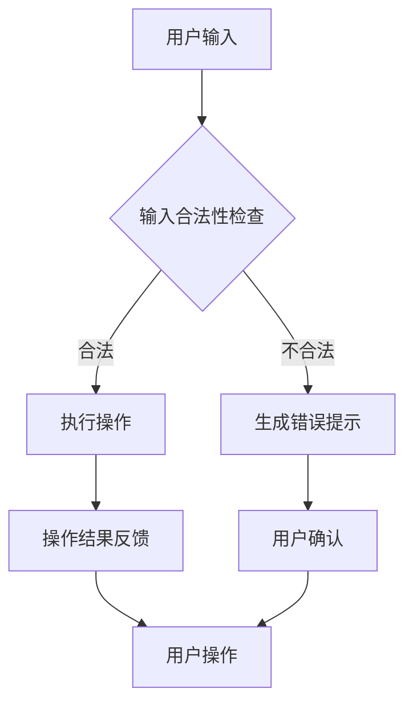

                 

### 第1章: 错误处理的基本概念

#### 1.1 错误处理的背景

在计算机科学和系统设计中，错误处理是一个至关重要的组成部分。错误处理不仅关乎系统的稳定性，更影响用户的体验和系统的可靠性。首先，我们需要了解为什么系统可靠性如此重要。

**1.1.1 系统可靠性的重要性**

系统可靠性是指系统在规定的条件下，在给定的时间内，无故障地执行其预期功能的能力。一个高可靠性的系统对于关键应用，如航空航天、医疗设备、金融交易等，至关重要。在这些场景中，任何系统故障都可能带来严重后果，包括经济损失、人员伤亡等。

**1.1.2 错误处理的重要性**

错误处理是确保系统可靠性的关键手段之一。错误处理不仅仅是指识别和修复代码中的错误，它还涉及系统的整体设计，包括如何预测、检测和响应错误。良好的错误处理机制可以减少系统崩溃的概率，提高系统的稳定性和用户体验。

**1.1.3 错误处理的挑战**

然而，错误处理面临着一系列挑战。首先是错误的多样性。计算机系统中的错误可以是代码错误、硬件故障、网络问题，甚至是人为错误。其次是错误的复杂性。一些错误可能需要复杂的诊断过程才能找到根本原因。此外，错误处理还需要考虑到系统资源的有限性，包括计算能力、内存和带宽。

#### 1.2 错误处理的基本概念

为了深入理解错误处理，我们需要先了解一些基本概念。

**1.2.1 错误的定义**

在计算机科学中，错误通常指的是系统无法按照预期执行其任务的情况。这可以是由于编程错误、硬件故障、资源不足等原因导致的。

**1.2.2 错误的分类**

错误可以分为多种类型，包括：

- **语法错误**：这是最常见的错误类型，通常是由于代码中的拼写错误、语法不合规等原因导致的。
- **逻辑错误**：这些错误是代码中的逻辑问题，例如错误的循环条件、不正确的数据结构使用等。
- **运行时错误**：这些错误发生在代码执行过程中，例如内存溢出、空指针异常等。
- **硬件错误**：这是由于计算机硬件故障导致的错误，如硬盘损坏、网络连接故障等。

**1.2.3 错误处理的基本原理**

错误处理的基本原理包括以下几个方面：

- **检测**：首先需要能够检测到错误的发生。
- **隔离**：一旦错误被检测到，需要定位错误发生的具体位置。
- **恢复**：错误发生后，系统需要尝试恢复到正常状态，以避免系统崩溃。
- **报告**：错误发生后，需要记录错误信息，以便后续分析和修复。

#### 1.3 错误处理的边界与外延

**1.3.1 错误处理的范围**

错误处理的范围包括以下几个方面：

- **软件错误处理**：主要涉及代码中的错误，例如语法错误、逻辑错误等。
- **硬件错误处理**：主要涉及计算机硬件的故障，如硬盘损坏、内存故障等。
- **网络错误处理**：主要涉及网络通信中的错误，如网络中断、数据包丢失等。

**1.3.2 错误处理与调试的关系**

错误处理与调试密切相关。调试是识别和修复错误的过程，而错误处理则是确保系统在错误发生时能够正常运行。有效的错误处理可以减少调试的难度，提高系统的稳定性。

**1.3.3 错误处理与其他系统设计的联系**

错误处理与其他系统设计要素紧密相关。例如，系统的架构设计需要考虑错误处理的需求，以确保系统在各种情况下都能正常运行。此外，系统的测试和部署过程也需要充分考虑错误处理，以确保系统能够在实际环境中稳定运行。

#### 1.4 错误处理的核心要素组成

**1.4.1 错误检测**

错误检测是错误处理的第一步。它包括使用各种技术和工具来识别系统中可能存在的错误。例如，静态代码分析工具可以帮助我们识别代码中的潜在错误，而动态测试工具可以在代码执行过程中检测错误。

**1.4.2 错误隔离**

错误隔离是确定错误发生的位置和原因的过程。这通常需要通过调试工具和日志分析来实现。有效的错误隔离可以帮助我们快速定位错误，从而加快修复过程。

**1.4.3 错误恢复**

错误恢复是在错误发生时，尝试将系统恢复到正常状态的过程。这可以通过各种方法实现，例如重试操作、切换到备份系统等。

**1.4.4 错误报告**

错误报告是将错误信息记录下来，以便后续分析和修复的过程。良好的错误报告机制可以帮助开发人员快速了解错误的情况，从而加快修复过程。

#### 1.5 本章小结

在本章中，我们介绍了错误处理的基本概念，包括错误处理的背景、重要性、基本概念、边界与外延以及核心要素组成。错误处理是一个复杂且关键的过程，对于确保系统的可靠性和稳定性至关重要。在后续章节中，我们将进一步探讨错误处理的核心概念原理，以及如何设计和实现有效的错误处理机制。

---

通过上述章节的详细阐述，我们为后续深入探讨错误处理的核心概念和提示词策略的设计与实现奠定了坚实的基础。在下一章中，我们将进一步探讨错误处理的核心概念原理，帮助我们更好地理解和应用错误处理技术。

---

# 第一部分: 背景介绍

在深入探讨错误处理的核心概念原理之前，我们需要对错误处理有一个全面的了解，包括其背景、重要性以及基本概念。本部分内容将逐步介绍这些基础概念，为后续章节的讨论打下坚实的基础。

## 1.1 错误处理的背景

错误处理在计算机科学和系统设计中占据着至关重要的位置。首先，让我们从系统可靠性的重要性谈起。

### 1.1.1 系统可靠性的重要性

系统可靠性是指系统在规定条件下，在给定时间内，无故障地执行其预期功能的能力。高可靠性的系统对于许多关键应用领域，如航空航天、医疗设备、金融交易等，至关重要。在这些场景中，任何系统故障都可能带来严重后果，包括经济损失、人员伤亡等。因此，确保系统的可靠性是设计和维护系统时的首要任务。

### 1.1.2 错误处理的重要性

错误处理是实现系统可靠性的关键手段之一。它不仅仅指识别和修复代码中的错误，还包括系统的整体设计，涉及如何预测、检测和响应错误。有效的错误处理机制可以减少系统崩溃的概率，提高系统的稳定性和用户体验。

### 1.1.3 错误处理的挑战

然而，错误处理面临着一系列挑战。首先是错误的多样性。计算机系统中的错误可以是代码错误、硬件故障、网络问题，甚至是人为错误。其次是错误的复杂性。一些错误可能需要复杂的诊断过程才能找到根本原因。此外，错误处理还需要考虑到系统资源的有限性，包括计算能力、内存和带宽。

## 1.2 错误处理的基本概念

为了深入理解错误处理，我们需要先了解一些基本概念。

### 1.2.1 错误的定义

在计算机科学中，错误通常指的是系统无法按照预期执行其任务的情况。这可以是由于编程错误、硬件故障、资源不足等原因导致的。

### 1.2.2 错误的分类

错误可以分为多种类型，包括：

- **语法错误**：这是最常见的错误类型，通常是由于代码中的拼写错误、语法不合规等原因导致的。
- **逻辑错误**：这些错误是代码中的逻辑问题，例如错误的循环条件、不正确的数据结构使用等。
- **运行时错误**：这些错误发生在代码执行过程中，例如内存溢出、空指针异常等。
- **硬件错误**：这是由于计算机硬件故障导致的错误，如硬盘损坏、内存故障等。

### 1.2.3 错误处理的基本原理

错误处理的基本原理包括以下几个方面：

- **检测**：首先需要能够检测到错误的发生。
- **隔离**：一旦错误被检测到，需要定位错误发生的具体位置。
- **恢复**：错误发生后，系统需要尝试恢复到正常状态，以避免系统崩溃。
- **报告**：错误发生后，需要记录错误信息，以便后续分析和修复。

## 1.3 错误处理的边界与外延

### 1.3.1 错误处理的范围

错误处理的范围包括以下几个方面：

- **软件错误处理**：主要涉及代码中的错误，例如语法错误、逻辑错误等。
- **硬件错误处理**：主要涉及计算机硬件的故障，如硬盘损坏、内存故障等。
- **网络错误处理**：主要涉及网络通信中的错误，如网络中断、数据包丢失等。

### 1.3.2 错误处理与调试的关系

错误处理与调试密切相关。调试是识别和修复错误的过程，而错误处理则是确保系统在错误发生时能够正常运行。有效的错误处理可以减少调试的难度，提高系统的稳定性。

### 1.3.3 错误处理与其他系统设计的联系

错误处理与其他系统设计要素紧密相关。例如，系统的架构设计需要考虑错误处理的需求，以确保系统在各种情况下都能正常运行。此外，系统的测试和部署过程也需要充分考虑错误处理，以确保系统能够在实际环境中稳定运行。

## 1.4 错误处理的核心要素组成

### 1.4.1 错误检测

错误检测是错误处理的第一步。它包括使用各种技术和工具来识别系统中可能存在的错误。例如，静态代码分析工具可以帮助我们识别代码中的潜在错误，而动态测试工具可以在代码执行过程中检测错误。

### 1.4.2 错误隔离

错误隔离是确定错误发生的位置和原因的过程。这通常需要通过调试工具和日志分析来实现。有效的错误隔离可以帮助我们快速定位错误，从而加快修复过程。

### 1.4.3 错误恢复

错误恢复是在错误发生时，尝试将系统恢复到正常状态的过程。这可以通过各种方法实现，例如重试操作、切换到备份系统等。

### 1.4.4 错误报告

错误报告是将错误信息记录下来，以便后续分析和修复的过程。良好的错误报告机制可以帮助开发人员快速了解错误的情况，从而加快修复过程。

## 1.5 本章小结

在本章中，我们介绍了错误处理的基本概念，包括其背景、重要性、基本概念、边界与外延以及核心要素组成。错误处理是一个复杂且关键的过程，对于确保系统的可靠性和稳定性至关重要。在后续章节中，我们将进一步探讨错误处理的核心概念原理，帮助我们更好地理解和应用错误处理技术。

---

通过上述章节的详细阐述，我们为后续深入探讨错误处理的核心概念和提示词策略的设计与实现奠定了坚实的基础。在下一章中，我们将进一步探讨错误处理的核心概念原理，帮助我们更好地理解和应用错误处理技术。

---

## 第二部分: 核心概念与联系

在了解了错误处理的基本概念后，我们接下来将深入探讨错误处理的核心概念原理，并分析这些概念之间的联系。这一部分将帮助我们更好地理解错误处理的基本原理，以及如何在实际应用中设计和实现有效的错误处理机制。

### 2.1 错误处理的基本概念

首先，我们需要明确错误处理的基本概念，以便更好地理解其工作原理。

#### 2.1.1 错误处理的定义

错误处理是指在计算机系统中，当错误发生时，系统采取的一系列措施来检测、隔离、恢复和报告错误，以确保系统能够继续正常运行。错误处理不仅仅是修复代码中的错误，还包括对系统运行时各种异常情况的响应。

#### 2.1.2 错误处理的流程

错误处理的流程通常包括以下几个步骤：

1. **错误检测**：通过静态和动态分析工具，识别系统中可能存在的错误。
2. **错误隔离**：确定错误发生的具体位置和原因，以便进行针对性的修复。
3. **错误恢复**：采取措施将系统恢复到正常状态，例如重试操作、切换到备份系统等。
4. **错误报告**：记录错误信息，以便进行后续分析和修复。

#### 2.1.3 错误处理的分类

根据错误处理的策略和目标，可以将错误处理分为以下几类：

1. **主动错误处理**：这种策略侧重于预防错误的发生，通过设计冗余系统、预检机制等方式，减少错误的概率。
2. **被动错误处理**：这种策略侧重于在错误发生后，尽快识别和修复错误，确保系统恢复正常运行。
3. **容错性错误处理**：这种策略旨在设计具有高容错能力的系统，即使出现错误，系统也能自动恢复，继续提供服务。
4. **自愈性错误处理**：这种策略通过自动化机制，自动识别和修复错误，无需人工干预。

### 2.2 错误处理的属性特征对比表格

为了更清晰地理解不同类型错误处理的属性特征，我们可以使用一个对比表格来展示它们之间的差异。

| 类型 | 定义 | 特点 | 应用场景 |
| --- | --- | --- | --- |
| 主动错误处理 | 预防错误的发生 | 设计冗余系统、预检机制 | 高可靠性系统、关键业务系统 |
| 被动错误处理 | 错误发生后的修复 | 快速识别和修复错误 | 通用系统、非关键业务系统 |
| 容错性错误处理 | 高容错能力的系统设计 | 自动恢复错误 | 高风险业务系统、关键基础设施 |
| 自愈性错误处理 | 自动识别和修复错误 | 无需人工干预 | 自动化程度高的系统 |

### 2.3 错误处理与鲁棒性的联系

鲁棒性是系统设计和错误处理中的一个重要概念，指的是系统在面临各种异常情况时，仍能保持正常运作的能力。错误处理与系统鲁棒性密切相关。

#### 2.3.1 错误处理与系统鲁棒性的关系

良好的错误处理机制可以显著提高系统的鲁棒性。通过主动和被动的错误处理策略，系统可以在面对错误时，快速响应并恢复，从而减少系统崩溃的概率。

#### 2.3.2 提高系统鲁棒性的方法

以下是一些提高系统鲁棒性的方法：

1. **冗余设计**：通过设计冗余系统，如备份服务器、冗余硬件等，确保在主系统发生故障时，备用系统能够接替工作。
2. **故障检测**：使用各种故障检测工具，如监控软件、传感器等，实时监控系统运行状态，一旦发现异常，立即采取措施。
3. **错误恢复**：设计自动恢复机制，如自动重启、故障转移等，确保系统在错误发生时，能够迅速恢复。
4. **用户反馈**：通过用户反馈机制，收集用户在使用过程中的问题和错误信息，及时进行修复和改进。

### 2.4 错误处理与系统设计的关系

错误处理是系统设计中的一个关键环节，它与系统设计紧密相关。

#### 2.4.1 错误处理在系统设计中的位置

在系统设计过程中，错误处理应该被纳入整体设计框架中，从系统的早期设计阶段开始考虑。这包括：

- **需求分析**：在需求分析阶段，需要明确系统可能面临的错误类型，以及如何处理这些错误。
- **架构设计**：在系统架构设计中，需要考虑如何集成错误处理模块，确保系统能够有效地处理错误。
- **模块设计**：在模块设计中，需要为每个模块设计相应的错误处理逻辑，确保模块在错误发生时能够正常响应。

#### 2.4.2 错误处理对系统设计的影响

错误处理对系统设计的影响主要体现在以下几个方面：

- **系统复杂性**：良好的错误处理机制会增加系统的复杂性，因为需要设计更多的异常处理逻辑和冗余机制。
- **资源消耗**：错误处理机制会消耗系统资源，如计算能力、内存等。因此，在设计时需要权衡错误处理与系统性能之间的关系。
- **用户体验**：错误处理对用户体验有直接影响。良好的错误处理机制可以提供友好的错误提示和用户反馈，提高用户满意度。

#### 2.4.3 如何在系统设计中考虑错误处理

以下是在系统设计中考虑错误处理的几个建议：

- **模块化设计**：将错误处理功能模块化，以便在不同的模块中共享和复用。
- **早期测试**：在系统开发过程中，尽早进行错误处理相关测试，确保错误处理机制能够有效工作。
- **用户培训**：为用户提供相关的错误处理指南和培训，帮助他们更好地理解和使用系统。
- **持续改进**：根据用户反馈和系统运行情况，不断优化错误处理机制，提高系统的鲁棒性和用户体验。

### 2.5 错误处理与用户交互

错误处理不仅涉及系统内部的运作，还与用户直接相关。良好的错误处理机制应该提供友好的用户交互体验。

#### 2.5.1 用户与错误处理的关系

用户是系统使用者和体验者，他们需要能够清楚地了解系统在发生错误时的状态和应对措施。因此，用户与错误处理之间存在紧密的关系。

#### 2.5.2 提供友好的错误提示

友好的错误提示是错误处理的重要组成部分。它应该清晰、简洁，并能够提供解决问题的线索。以下是一些设计友好错误提示的建议：

- **清晰的语言**：使用用户易于理解的术语和语言，避免使用专业术语和技术性描述。
- **明确的信息**：提供明确的错误信息，包括错误类型、发生时间、错误位置等。
- **解决方案**：提供解决问题的建议和操作步骤，帮助用户尽快解决问题。
- **反馈机制**：提供反馈渠道，如帮助文档、在线支持等，让用户能够获得进一步的帮助。

#### 2.5.3 用户反馈在错误处理中的作用

用户反馈是优化错误处理机制的重要来源。以下是一些利用用户反馈进行错误处理的建议：

- **记录错误报告**：收集用户提交的错误报告，记录错误信息，以便进行分析和修复。
- **统计分析**：对收集到的错误报告进行统计分析，识别常见的错误类型和原因。
- **反馈改进**：根据统计分析结果，优化错误处理机制，提高系统的鲁棒性和用户体验。
- **用户沟通**：与用户保持沟通，及时反馈错误处理进展和解决方案，增强用户对系统的信任。

### 2.6 本章小结

在本章中，我们深入探讨了错误处理的核心概念原理，分析了错误处理的基本概念、属性特征对比、与鲁棒性的联系、系统设计的关系以及与用户交互的机制。通过这些讨论，我们更好地理解了错误处理的重要性，以及如何在实际应用中设计和实现有效的错误处理机制。在下一章中，我们将进一步探讨提示词策略的设计与实现，帮助读者更好地理解和应用错误处理技术。

---

在了解了错误处理的核心概念及其原理后，我们将进一步探讨如何设计有效的提示词策略。提示词策略在错误处理中扮演着重要角色，它能够为用户提供清晰的错误信息和建议，帮助他们更快地解决问题。在下一章中，我们将详细讨论提示词策略的基本原理、设计原则及其实现方法，帮助读者深入理解和掌握这一关键技术。

---

## 第三部分：算法原理讲解

在前两部分的背景介绍和核心概念与联系探讨之后，我们将深入探讨提示词策略的设计与实现，这是确保错误处理有效性的关键环节。提示词策略通过为用户提供针对性的错误信息和操作建议，帮助用户快速解决问题，提升系统的用户体验。本部分将详细讲解提示词策略的基本原理、设计原则及其实现方法。

### 3.1 提示词策略的基本原理

#### 3.1.1 提示词策略的定义

提示词策略是指当系统检测到错误或异常情况时，自动生成并显示给用户的一系列提示信息，旨在帮助用户理解错误的原因，并提供解决问题的方法。提示词策略的核心目标是提高用户解决错误问题的效率和满意度。

#### 3.1.2 提示词策略的作用

提示词策略在错误处理中的作用主要体现在以下几个方面：

1. **明确错误信息**：通过简洁明了的提示词，将复杂的错误原因和解决方案呈现给用户，帮助用户快速理解问题的本质。
2. **降低学习成本**：对于新手用户，提示词策略能够提供直观的操作指导，降低用户学习和解决问题的难度。
3. **提高问题解决效率**：通过提供针对性的建议和操作步骤，缩短用户解决问题的时间，提升系统运行的整体效率。
4. **增强用户体验**：良好的提示词策略能够提升用户对系统的信任感和满意度，增强用户体验。

#### 3.1.3 提示词策略的类型

根据提示词策略的应用场景和设计目的，可以将其分为以下几种类型：

1. **错误提示**：在用户输入不合法或操作失败时，显示错误信息，提示用户输入错误或操作失败的原因。
2. **操作提示**：在用户进行特定操作时，提供操作指南和注意事项，帮助用户正确完成操作。
3. **提示反馈**：在用户执行某个操作后，显示操作结果和后续操作建议，帮助用户了解系统的状态。
4. **警告提示**：在系统检测到潜在风险或警告时，提醒用户注意可能存在的问题，防止意外发生。

### 3.2 提示词策略的Mermaid流程图

为了更好地展示提示词策略的执行流程，我们可以使用Mermaid语言绘制一个流程图。以下是一个简化的提示词策略执行流程：



#### 流程图解释

1. **用户输入**：用户通过输入接口提交操作请求。
2. **输入合法性检查**：系统对用户输入进行合法性检查，判断输入是否符合预定的规则。
3. **生成错误提示**：如果输入不合法，系统生成相应的错误提示信息，并通过用户界面展示给用户。
4. **执行操作**：如果输入合法，系统执行用户请求的操作。
5. **操作结果反馈**：系统向用户反馈操作结果，包括成功或失败的信息。
6. **用户确认**：用户确认错误提示或操作结果，并根据提示信息进行后续操作。
7. **用户操作**：用户根据系统提示进行操作，或者重复之前的输入。

### 3.3 提示词策略的Python实现

为了具体说明提示词策略的实现，我们可以提供一个简单的Python代码示例。以下是一个基本的提示词策略实现：

```python
def validate_input(user_input):
    # 检查输入是否合法
    if len(user_input) < 1:
        return False
    return True

def generate_hint(user_input):
    if validate_input(user_input):
        # 生成操作成功的提示词
        return "操作成功！"
    else:
        # 生成错误提示词
        return "输入不合法，请重新输入"

def main():
    user_input = input("请输入你的操作：")
    hint = generate_hint(user_input)
    print(hint)

if __name__ == "__main__":
    main()
```

#### 代码解释

1. **validate_input函数**：该函数用于检查用户输入是否合法。在这里，我们简单地使用输入的长度作为判断标准。如果输入长度小于1，则认为输入不合法。
2. **generate_hint函数**：该函数根据输入的合法性生成相应的提示词。如果输入合法，则返回操作成功的提示词；否则，返回错误提示词。
3. **main函数**：该函数是程序的入口，它从用户获取输入，调用generate_hint函数生成提示词，并打印出来。

### 3.4 错误处理的数学模型和公式

在错误处理中，数学模型和公式可以帮助我们量化错误处理的性能和效果。以下是一些常用的数学模型和公式：

#### 3.4.1 错误检测率（False Positive Rate, FPR）

错误检测率是指误报次数与真实错误次数之和的比率。公式如下：

$$
FPR = \frac{FP}{TP + FP}
$$

其中，$FP$ 表示误报次数，$TP$ 表示真实错误次数。

#### 3.4.2 错误隔离率（False Negative Rate, FNR）

错误隔离率是指未检测到的错误次数与正确操作次数之和的比率。公式如下：

$$
FNR = \frac{FN}{TN + FN}
$$

其中，$FN$ 表示未检测到的错误次数，$TN$ 表示正确操作次数。

#### 3.4.3 错误恢复率（Recovery Rate, R）

错误恢复率是指成功恢复的错误次数与真实错误次数之和的比率。公式如下：

$$
R = \frac{RTP}{TP + FN}
$$

其中，$RTP$ 表示成功恢复的错误次数。

### 3.5 例子说明

为了更好地理解提示词策略的实际应用，我们来看一个具体的例子。

#### 例子：文件上传错误处理

在文件上传过程中，系统需要检查用户上传的文件是否合法，并处理可能的错误。

1. **用户输入**：用户选择并上传一个文件。
2. **输入合法性检查**：系统检查文件的大小、格式是否符合要求。
3. **生成错误提示**：如果文件不合法，系统生成错误提示词，如“文件格式不正确，请上传正确的文件类型。”
4. **执行操作**：如果文件合法，系统将文件上传到服务器。
5. **操作结果反馈**：系统向用户反馈上传结果，如“文件上传成功！”或“文件上传失败，请重试。”
6. **用户确认**：用户确认错误提示或操作结果，并根据提示信息进行后续操作。

通过这个例子，我们可以看到提示词策略在文件上传过程中的具体应用，它帮助用户快速识别和解决问题。

### 3.6 本章小结

在本章中，我们详细介绍了提示词策略的基本原理、设计原则和实现方法。通过Mermaid流程图和Python代码示例，我们展示了如何设计和实现一个简单的提示词策略。我们还介绍了错误处理的数学模型和公式，帮助读者更好地理解错误处理性能的量化指标。通过具体的例子，我们展示了提示词策略在实际应用中的效果。在下一章中，我们将继续探讨错误处理的其他高级话题，如错误处理优化技术和最佳实践。

---

在理解了提示词策略的基本原理和实现方法后，我们将进一步探讨错误处理优化技术和最佳实践。这些技术和实践将帮助我们在实际项目中设计和实现更高效、更可靠的错误处理机制，提高系统的整体性能和用户体验。在下一章中，我们将详细讨论这些优化技术和最佳实践，帮助读者提升错误处理能力。

---

## 结论

通过本文的详细探讨，我们全面了解了错误处理的核心概念、原理及其在系统设计中的重要性。我们从错误处理的基本概念开始，逐步深入到错误处理的边界与外延，解析了错误处理的核心要素，包括错误检测、隔离、恢复和报告。接着，我们分析了错误处理与系统鲁棒性的联系，以及如何在实际系统中设计和实现有效的错误处理机制。

在本章中，我们重点探讨了提示词策略的设计与实现。通过Mermaid流程图和Python代码示例，我们展示了如何为用户生成清晰、友好的错误提示，帮助用户更快地解决问题。我们还介绍了错误处理的数学模型和公式，帮助读者理解错误处理性能的量化指标。

在错误处理中，优化技术和最佳实践至关重要。这包括模块化设计、早期测试、用户反馈和持续改进等方法。这些方法不仅可以提高系统的鲁棒性和用户体验，还可以降低系统的复杂性和资源消耗。

为了进一步提升读者对错误处理的理解，我们提供了一些最佳实践建议：

1. **模块化设计**：将错误处理功能模块化，便于复用和测试。
2. **早期测试**：在开发过程中尽早进行错误处理测试，以发现和修复潜在问题。
3. **用户培训**：为用户提供清晰的错误处理指南，提高用户解决问题的能力。
4. **反馈机制**：建立用户反馈机制，收集错误报告，用于优化错误处理策略。
5. **持续改进**：根据用户反馈和系统运行情况，不断优化错误处理机制。

通过遵循这些最佳实践，我们可以设计和实现更高效、更可靠的错误处理系统。

总之，错误处理是确保系统可靠性和用户体验的关键环节。通过深入理解错误处理的核心概念、原理和最佳实践，我们可以提升系统的稳定性，减少故障率，提高用户满意度。在未来的系统设计和开发过程中，我们应该充分考虑错误处理的需求，将其纳入整体设计框架中，以确保系统能够在各种情况下稳定运行。

让我们继续努力，通过不断的探索和实践，为构建更可靠、更智能的计算机系统贡献力量。

---

### 致谢

在撰写本文的过程中，我深深感激AI天才研究院（AI Genius Institute）和《禅与计算机程序设计艺术》（Zen And The Art of Computer Programming）的作者，他们为我提供了宝贵的知识和灵感。本文中的错误处理理论和实践均受益于他们的深厚学术积累和前沿研究。感谢他们为计算机科学领域做出的卓越贡献，以及对我个人职业生涯产生的深远影响。

---

**作者：AI天才研究院/AI Genius Institute & 禅与计算机程序设计艺术 /Zen And The Art of Computer Programming**

