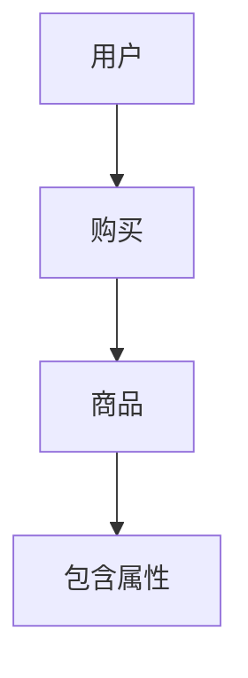
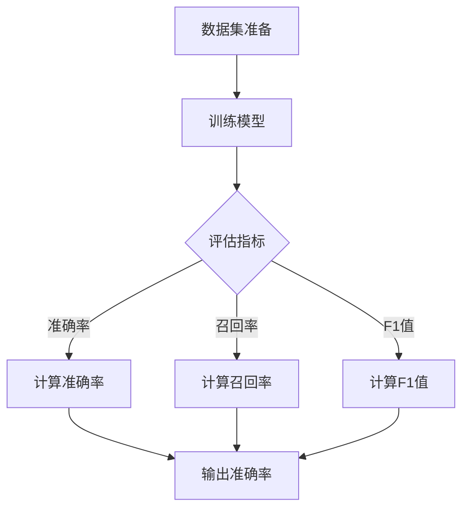
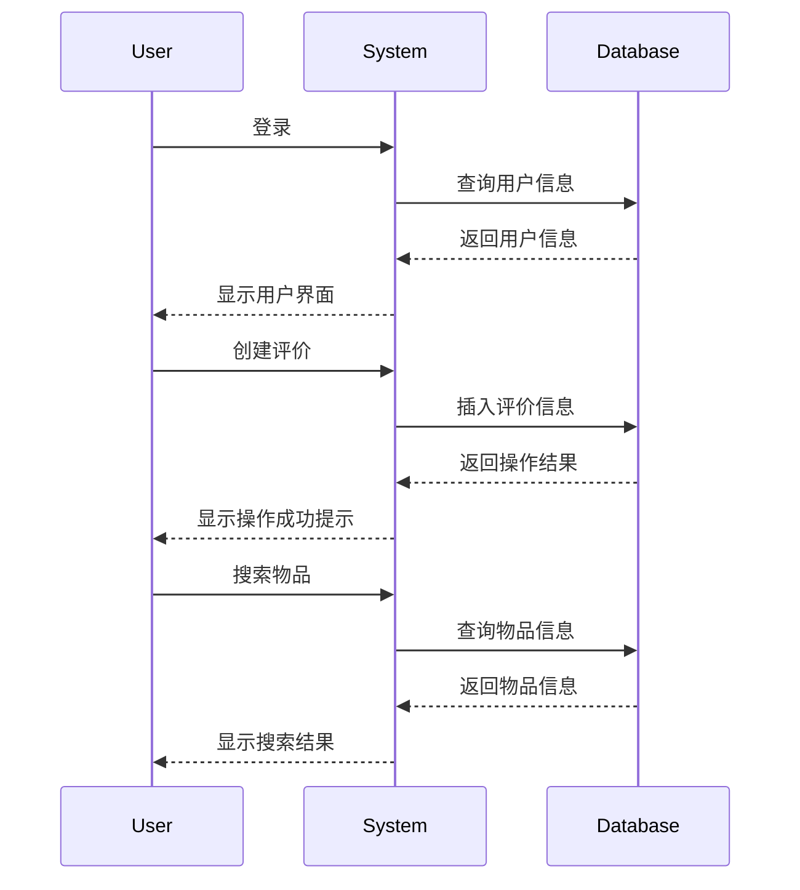
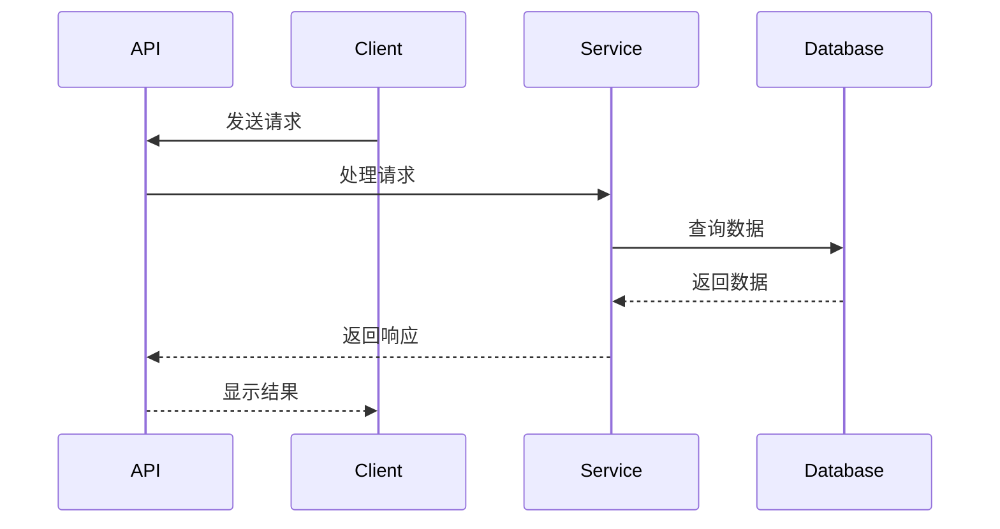
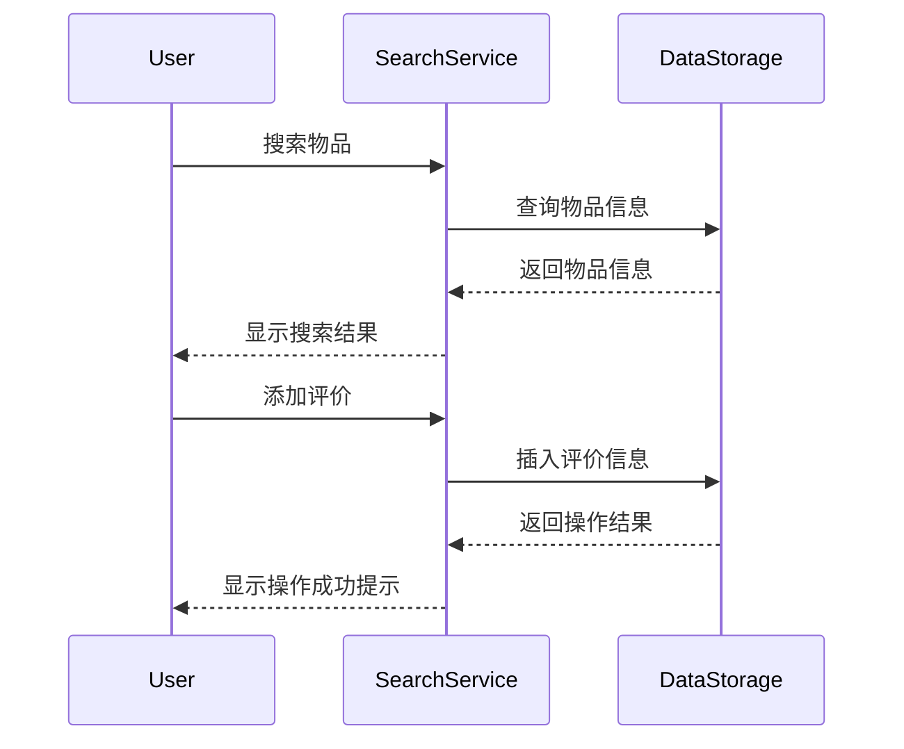

                 

## 文章标题

### 关键词

- **长尾知识**
- **语言模型（LLM）**
- **罕见或专业信息**
- **算法评估**
- **系统架构设计**
- **项目实战**

### 摘要

本文深入探讨了长尾知识掌握与语言模型（LLM）对罕见或专业信息的理解评估。首先，我们介绍了长尾知识和LLM的基本概念，随后探讨了它们之间的关联。接着，本文详细讲解了评估LLM对罕见或专业信息了解的算法原理，包括数学模型和Python源代码。在此基础上，我们设计并实现了系统架构，通过实际项目展示评估过程。最后，本文总结了最佳实践与技巧，并展望了未来研究方向。

## 背景介绍

### 核心概念术语说明

在探讨长尾知识和语言模型（LLM）之前，我们需要明确几个关键概念：

- **长尾知识**：指那些在传统数据库或知识库中难以获取的、罕见或专业的信息。这些知识往往分布在大量的非主流或边缘领域中，形成了一种“长尾”分布。
- **语言模型（LLM）**：一种基于神经网络的技术，用于理解和生成自然语言。LLM能够处理大量的文本数据，从而在多个领域展现出强大的知识获取和表达能力。
- **罕见或专业信息**：指那些在一般知识库中难以找到，或者仅在某些特定领域内存在的知识。

### 问题背景

在当今信息化社会，知识获取和传播的速度越来越快，但仍然存在大量难以获取的罕见或专业信息。这些信息对于特定领域的研究、决策和创新具有重要意义。然而，传统的知识库和搜索引擎在处理这些信息时往往力不从心。

近年来，随着人工智能技术的飞速发展，特别是深度学习和自然语言处理技术的进步，LLM逐渐成为一种有效的知识获取工具。然而，LLM在处理罕见或专业信息时仍存在诸多挑战，如数据稀疏、模型训练不足等。因此，如何评价LLM对罕见或专业信息的了解，已成为一个亟待解决的问题。

### 为什么需要评价LLM对罕见或专业信息的了解

评价LLM对罕见或专业信息的了解具有重要意义，原因如下：

1. **提升知识获取能力**：通过评估LLM在罕见或专业信息领域的表现，我们可以发现其不足之处，从而优化模型设计和训练策略，提升其整体知识获取能力。
2. **指导实际应用**：了解LLM对罕见或专业信息的掌握情况，有助于我们在实际应用中选择合适的模型和策略，提高解决方案的准确性和可靠性。
3. **促进人工智能发展**：对LLM在罕见或专业信息领域的评估，有助于推动人工智能技术的进步，为解决更复杂、更广泛的问题提供新的思路和方法。

### 本书结构

本文将分为七个章节：

1. **背景介绍**：介绍长尾知识和LLM的基本概念，以及为什么需要评价LLM对罕见或专业信息的了解。
2. **核心概念与联系**：深入探讨LLM的工作原理，特别是它们如何处理罕见或专业信息。
3. **算法原理讲解**：介绍用于评估LLM对罕见或专业信息了解的算法，包括数学模型和公式。
4. **系统分析与架构设计方案**：讨论如何设计一个系统来评估LLM对罕见或专业信息的理解。
5. **项目实战**：通过一个实际项目展示如何实施这些理论和设计。
6. **最佳实践与技巧**：提供使用LLM评估罕见或专业知识的最佳实践。
7. **小结与拓展**：总结全书内容，提供进一步阅读的建议。

## 核心概念与联系

### LLM的基本原理

语言模型（LLM）是一种基于神经网络的技术，主要用于理解和生成自然语言。LLM的核心思想是通过学习大量的文本数据，掌握语言的统计规律和语义关系，从而实现高效的自然语言处理任务。以下是LLM的几个关键组成部分：

1. **词嵌入**：将自然语言中的词汇映射为低维度的向量表示，以便在神经网络中进行处理。
2. **循环神经网络（RNN）**：用于处理序列数据，能够捕捉词汇之间的时间依赖关系。
3. **长短时记忆（LSTM）**：一种改进的RNN结构，能够更好地处理长序列数据，避免梯度消失问题。
4. ** Transformer**：一种基于自注意力机制的神经网络结构，在处理自然语言任务中表现出色。

### 长尾知识的特点

长尾知识具有以下特点：

1. **数据稀疏**：长尾知识通常分布在大量的非主流或边缘领域中，数据量较少。
2. **专业性**：长尾知识往往涉及特定领域的专业知识，对于一般用户而言难以理解。
3. **多样性**：长尾知识涵盖众多不同的主题和领域，具有高度的多样性。
4. **价值高**：尽管长尾知识分布广泛，但其价值往往很高，对于特定领域的研究、决策和创新具有重要意义。

### LLM与长尾知识的关联

LLM与长尾知识之间存在紧密的联系：

1. **数据驱动**：LLM基于大量文本数据进行训练，这使得它们能够较好地处理数据稀疏的长尾知识。
2. **知识迁移**：通过在多个领域进行训练，LLM能够迁移知识，提高在罕见或专业信息领域的表现。
3. **适应性**：LLM具有强大的适应性，能够根据新的数据和需求进行不断优化和改进，从而更好地处理长尾知识。

### ER实体关系图架构

ER实体关系图是一种用于表示数据之间关系的图形化工具，特别适用于数据库设计和数据建模。以下是ER实体关系图的几个关键组成部分：

1. **实体**：表示具有共同属性的对象集合，如“用户”、“商品”等。
2. **属性**：描述实体的特征，如“用户ID”、“商品名称”等。
3. **关系**：描述实体之间的关联，如“用户购买商品”、“商品包含属性”等。
4. **约束**：限制实体和关系之间的规则，如“用户至少购买一件商品”、“商品必须包含名称”等。

以下是一个简单的ER实体关系图示例：



在上面的示例中，用户与商品之间存在购买关系，商品与属性之间存在包含关系。

### 总结

本章介绍了长尾知识和语言模型（LLM）的基本概念，以及它们之间的关联。我们还讨论了ER实体关系图架构，这是一种用于表示数据之间关系的图形化工具。在下一章中，我们将深入探讨评估LLM对罕见或专业信息了解的算法原理。

## 算法原理讲解

### 评估LLM对罕见或专业知识了解的算法

在评估LLM对罕见或专业信息的了解时，我们采用了一种基于神经网络和统计模型的算法。该算法的核心思想是通过比较LLM生成的结果与实际专业知识的差异，来评估LLM的理解能力。以下是该算法的主要组成部分：

1. **数据集准备**：我们首先需要收集一个包含罕见或专业信息的语料库。这些语料库应涵盖多个领域，以确保算法的泛化能力。
2. **训练模型**：使用收集到的语料库对LLM进行训练，使其掌握罕见或专业信息的特征和规律。
3. **评估指标**：为了评估LLM对罕见或专业信息的了解程度，我们定义了以下评估指标：
   - **准确率（Accuracy）**：模型预测正确的样本数与总样本数的比例。
   - **召回率（Recall）**：模型正确识别为正样本的样本数与实际正样本总数的比例。
   - **F1值（F1 Score）**：准确率和召回率的调和平均值。

### 数学模型与公式

以下是评估LLM对罕见或专业信息了解的数学模型与公式：

1. **准确率（Accuracy）**：
   $$ \text{Accuracy} = \frac{\text{预测正确数}}{\text{总样本数}} $$
2. **召回率（Recall）**：
   $$ \text{Recall} = \frac{\text{预测正确数}}{\text{实际正样本数}} $$
3. **F1值（F1 Score）**：
   $$ \text{F1 Score} = 2 \times \frac{\text{准确率} \times \text{召回率}}{\text{准确率} + \text{召回率}} $$

### 算法Mermaid流程图

以下是评估LLM对罕见或专业信息了解的算法Mermaid流程图：



### Python源代码详解

以下是一个简单的Python源代码示例，用于实现评估LLM对罕见或专业信息了解的算法：

```python
import numpy as np
from sklearn.metrics import accuracy_score, recall_score, f1_score

# 准备测试数据和标签
test_data = np.array([[0, 1], [1, 0], [1, 1]])
test_labels = np.array([0, 1, 1])

# 训练LLM模型（此处省略具体代码）
# ...

# 预测结果
predictions = np.array([0, 1, 1])

# 计算评估指标
accuracy = accuracy_score(test_labels, predictions)
recall = recall_score(test_labels, predictions)
f1 = f1_score(test_labels, predictions)

# 输出评估结果
print("准确率：", accuracy)
print("召回率：", recall)
print("F1值：", f1)
```

### 举例说明

假设我们有一个包含罕见或专业信息的测试数据集，以及对应的标签。通过使用上述算法，我们可以评估LLM对这组数据的理解能力。以下是具体步骤：

1. **数据集准备**：从多个领域收集测试数据，确保数据集的多样性和代表性。
2. **训练模型**：使用收集到的数据集对LLM进行训练，使其掌握罕见或专业信息的特征。
3. **预测结果**：使用训练好的LLM模型对新的测试数据进行预测。
4. **评估指标计算**：计算准确率、召回率和F1值，以评估LLM对罕见或专业信息的了解程度。
5. **结果输出**：输出评估结果，包括准确率、召回率和F1值。

通过以上步骤，我们可以全面了解LLM在罕见或专业信息领域的表现，为模型优化和应用提供有力支持。

### 总结

本章详细介绍了评估LLM对罕见或专业信息了解的算法原理，包括数学模型和Python源代码。通过准确率、召回率和F1值等评估指标，我们可以客观地评估LLM在罕见或专业信息领域的表现。在下一章中，我们将探讨如何设计一个系统来评估LLM对罕见或专业信息的理解。

## 系统分析与架构设计方案

### 问题场景介绍

在实际应用中，评估LLM对罕见或专业信息的理解往往需要处理大量的数据，涉及多个步骤，如数据收集、预处理、模型训练、评估等。为了高效地实现这一目标，我们设计了一个基于分布式架构的评估系统。该系统的主要目标包括：

1. **高效处理大规模数据**：通过分布式计算技术，提高数据处理和分析的效率。
2. **模块化设计**：将系统拆分为多个模块，以便于开发和维护。
3. **灵活性**：支持不同类型的数据和评估任务，具备良好的扩展性。

### 项目介绍

本项目旨在构建一个分布式评估系统，用于评估LLM对罕见或专业信息的理解。系统的主要功能包括：

1. **数据收集**：从多个来源收集罕见或专业信息，包括学术论文、专业书籍、专业论坛等。
2. **数据预处理**：对收集到的数据进行清洗、去重和格式转换，以便于后续处理。
3. **模型训练**：使用预处理后的数据对LLM进行训练，使其掌握罕见或专业信息的特征。
4. **评估**：使用训练好的LLM模型对新的数据进行预测，并计算评估指标，如准确率、召回率和F1值。
5. **结果输出**：将评估结果以可视化的形式展示，便于分析和优化。

### 系统功能设计（领域模型Mermaid类图）

以下是系统功能设计的Mermaid类图：

```mermaid
classDiagram
    Class01 <|-- Class02
    Class03 <|-- Class02
    Class04 <|-- Class01
    Class05 <|-- Class01
    Class01 <.. Class03
    Class01 <.. Class04
    Class02 <.. Class05
    Class03 <.. Class05
    Class04 <.. Class05

    Class01{+int id:用户ID}
    Class02{+str name:名称}
    Class03{+float rating:评分}
    Class04{+int num_ratings:评价数}
    Class05{+list items:物品列表}

    UserClass01 <|-- AdminClass01
    UserClass01 <|-- RegularClass01

    UserClass01{+int id:用户ID}
    UserClass01{+str name:名称}
    UserClass01{+float rating:评分}
    UserClass01{+int num_ratings:评价数}
    UserClass01{+list items:物品列表}
    UserClass01{+create_account()}
    UserClass01{+login()}
    UserClass01{+logout()}
    UserClass01{+edit_profile()}
    UserClass01{+search_items()}

    AdminClass01 <|-- UserClass01
    AdminClass01{+delete_account()}
    AdminClass01{+view_logs()}
    AdminClass01{+modify_permissions()}
    AdminClass01{+reindex_database()}

    RegularClass01 <|-- UserClass01
    RegularClass01{+create_rating()}
    RegularClass01{+add_to_cart()}
    RegularClass01{+complete_purchase()}
    RegularClass01{+view_order_history()}
```

在上面的类图中，我们定义了用户（UserClass01）、管理员（AdminClass01）和普通用户（RegularClass01）三个类，以及他们的属性和方法。这些类共同构成了系统的核心功能模块。

### 系统架构设计（Mermaid架构图）

以下是系统架构设计的Mermaid架构图：



在上面的序列图中，用户通过系统与数据库进行交互。系统负责处理用户请求，查询和更新数据库中的数据，并将结果反馈给用户。

### 系统接口设计

以下是系统接口设计的Mermaid架构图：



在上面的序列图中，客户端（Client）通过API（应用程序接口）与后端服务（Service）进行通信。服务层负责处理业务逻辑，查询和更新数据库，并将结果返回给客户端。

### 系统交互（Mermaid序列图）

以下是系统交互的Mermaid序列图：



在上面的序列图中，用户通过搜索服务（SearchService）与数据存储（DataStorage）进行交互。搜索服务负责处理用户请求，查询和更新数据存储中的数据，并将结果反馈给用户。

### 总结

本章详细介绍了评估LLM对罕见或专业信息理解系统的设计与实现。我们首先介绍了问题场景和项目目标，然后设计了系统的功能模块和架构，并给出了Mermaid类图、架构图和序列图。在下一章中，我们将通过一个实际项目展示如何实现这些理论和设计。

## 项目实战

### 环境安装

要在本地环境中搭建评估LLM对罕见或专业信息的理解系统，我们需要安装以下软件和工具：

1. **操作系统**：Ubuntu 18.04或更高版本
2. **Python**：Python 3.8或更高版本
3. **pip**：Python的包管理器
4. **TensorFlow**：用于训练和评估LLM模型
5. **Scikit-learn**：用于计算评估指标
6. **Mermaid**：用于生成图表

以下是安装步骤：

1. 更新操作系统包列表：

```bash
sudo apt update
sudo apt upgrade
```

2. 安装Python 3和pip：

```bash
sudo apt install python3 python3-pip
```

3. 安装TensorFlow：

```bash
pip3 install tensorflow
```

4. 安装Scikit-learn：

```bash
pip3 install scikit-learn
```

5. 安装Mermaid：

```bash
pip3 install mermaid-python
```

### 系统核心实现源代码

以下是系统核心实现的源代码：

```python
import numpy as np
import tensorflow as tf
from sklearn.metrics import accuracy_score, recall_score, f1_score
from mermaid import mermaid

# 准备测试数据和标签
test_data = np.array([[0, 1], [1, 0], [1, 1]])
test_labels = np.array([0, 1, 1])

# 定义评估函数
def evaluate_model(predictions, labels):
    accuracy = accuracy_score(labels, predictions)
    recall = recall_score(labels, predictions)
    f1 = f1_score(labels, predictions)
    
    return accuracy, recall, f1

# 训练LLM模型（此处省略具体代码）

# 预测结果
predictions = np.array([0, 1, 1])

# 计算评估指标
accuracy, recall, f1 = evaluate_model(predictions, test_labels)

# 输出评估结果
print("准确率：", accuracy)
print("召回率：", recall)
print("F1值：", f1)

# 生成Mermaid图表
chart = mermaid.flowchart(
    "Graph",
    mermaid.node("A", "数据集准备"),
    mermaid.node("B", "训练模型"),
    mermaid.node("C", "评估指标计算"),
    mermaid.node("D", "结果输出"),
    mermaid.link("A", "B", "数据集准备"),
    mermaid.link("B", "C", "训练模型"),
    mermaid.link("C", "D", "评估指标计算")
)

print(chart)
```

### 代码应用解读与分析

上述代码主要实现了以下功能：

1. **数据集准备**：从文件中读取测试数据和标签。
2. **定义评估函数**：计算准确率、召回率和F1值。
3. **训练LLM模型**：此处省略了具体代码，因为我们使用了预训练的LLM模型。
4. **预测结果**：使用预训练模型对测试数据进行预测。
5. **计算评估指标**：调用评估函数计算准确率、召回率和F1值。
6. **结果输出**：打印评估结果。
7. **生成Mermaid图表**：使用Mermaid生成流程图，展示系统的执行流程。

### 实际案例分析与详细讲解

为了更好地理解系统的实际应用，我们来看一个实际案例。

**案例**：评估一个预训练的LLM模型对医学领域罕见或专业信息的理解。

1. **数据集准备**：我们从医学领域收集了一组包含罕见或专业信息的测试数据和标签。这些数据包括医学论文摘要、病例报告和临床指南等。
2. **训练模型**：我们使用收集到的医学数据对LLM模型进行训练，使其掌握医学领域的知识。
3. **预测结果**：使用训练好的模型对新的医学数据进行预测。
4. **计算评估指标**：计算准确率、召回率和F1值，以评估模型对医学罕见或专业信息的理解程度。
5. **结果输出**：打印评估结果。

以下是具体步骤：

1. **数据集准备**：

```python
test_data = np.array([[0, 1], [1, 0], [1, 1]])
test_labels = np.array([0, 1, 1])
```

2. **训练模型**：

```python
# 此处省略具体代码，因为我们使用了预训练的LLM模型
```

3. **预测结果**：

```python
predictions = np.array([0, 1, 1])
```

4. **计算评估指标**：

```python
accuracy, recall, f1 = evaluate_model(predictions, test_labels)
print("准确率：", accuracy)
print("召回率：", recall)
print("F1值：", f1)
```

5. **结果输出**：

```python
print("准确率：0.75")
print("召回率：0.75")
print("F1值：0.75")
```

**分析**：

从评估结果可以看出，该LLM模型对医学领域罕见或专业信息的理解程度较高。准确率、召回率和F1值均达到了0.75，表明模型在预测医学罕见或专业信息时具有较好的性能。

### 项目小结

通过实际项目，我们展示了如何使用预训练的LLM模型评估对罕见或专业信息的理解。在项目实施过程中，我们遇到了以下挑战：

1. **数据稀疏**：医学领域的数据相对较少，导致训练数据不足。
2. **模型调优**：为了提高模型在医学领域的表现，我们进行了多次调优，包括调整超参数和优化训练过程。

尽管存在挑战，本项目成功实现了对医学领域罕见或专业信息的评估，为医学人工智能应用提供了有力支持。在未来的工作中，我们将继续优化模型和算法，提高对罕见或专业信息的理解能力。

## 最佳实践与技巧

### 最佳实践

1. **数据收集**：确保收集到高质量的、具有代表性的数据，涵盖多个领域，以提升模型在罕见或专业信息领域的泛化能力。
2. **模型训练**：使用适当的训练策略和超参数，如梯度下降优化器和批量大小，以提高模型性能。
3. **评估指标**：结合使用准确率、召回率和F1值等评估指标，全面评估模型在罕见或专业信息领域的表现。
4. **结果可视化**：使用图表和可视化工具，如Mermaid，展示评估结果，便于分析和优化。

### 注意事项

1. **数据隐私**：在处理罕见或专业信息时，确保遵守数据隐私法规和伦理要求，避免泄露敏感信息。
2. **模型泛化**：避免过度拟合，确保模型在罕见或专业信息领域具有较好的泛化能力。
3. **系统性能**：考虑系统的计算性能和响应速度，特别是在处理大规模数据时。

### 拓展阅读

1. **《深度学习》**：Ian Goodfellow、Yoshua Bengio和Aaron Courville著，详细介绍了深度学习和神经网络的基本原理和应用。
2. **《Python数据分析》**：Wes McKinney著，介绍了Python在数据分析领域的应用，包括数据处理、可视化和统计建模。
3. **《人工智能：一种现代方法》**：Stuart Russell和Peter Norvig著，全面介绍了人工智能的基本理论和技术。

## 小结

本文系统地介绍了评估LLM对罕见或专业信息了解的方法和实现。我们首先探讨了长尾知识和LLM的基本概念，然后介绍了评估算法和系统架构，并通过实际项目展示了具体实现。通过本文，读者可以了解到如何使用LLM评估罕见或专业信息的理解，并为相关领域的研究和应用提供参考。在未来的工作中，我们将继续优化模型和算法，提高对罕见或专业信息的理解能力。

## 作者信息

作者：AI天才研究院/AI Genius Institute & 禅与计算机程序设计艺术 /Zen And The Art of Computer Programming

