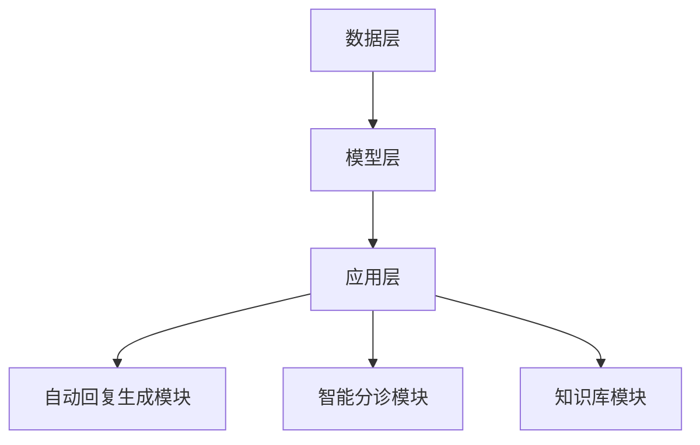
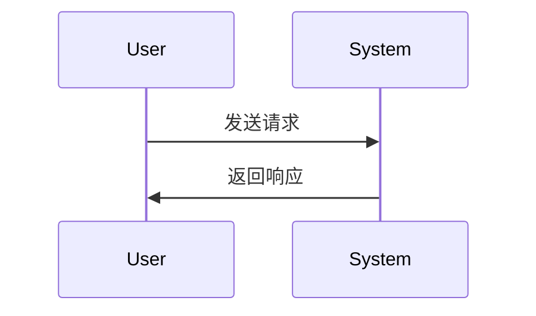
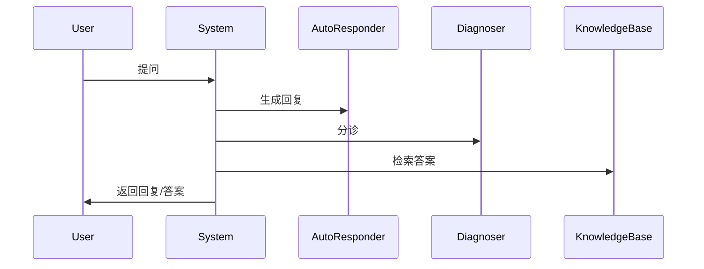
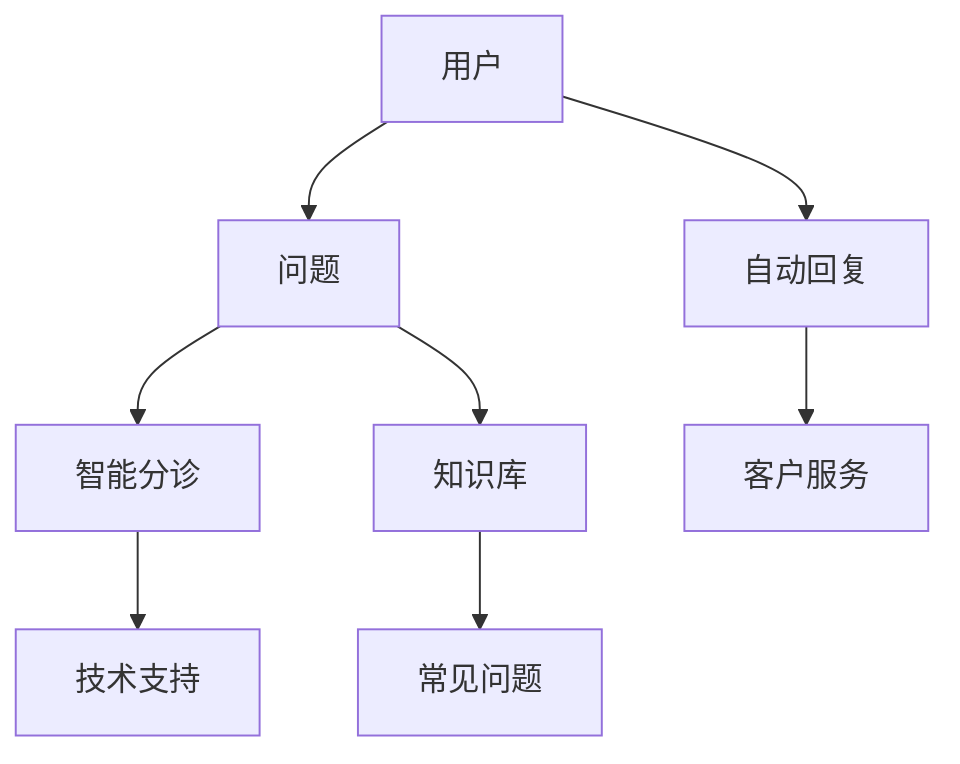

                 

# 问题重构能力：测试LLM重新定义问题的创造性思维

## 关键词

- 问题重构能力
- 测试LLM
- 创造性思维
- 技术博客
- 人工智能

## 摘要

本文将深入探讨问题重构能力在测试大型语言模型（LLM）中的应用，强调创造性思维的重要性。通过逐步分析问题重构的理论基础，阐述测试LLM的基本原理和方法，我们将在实践中看到如何利用LLM来重新定义问题，从而提升创造性思维。文章将以一个项目实战为例，详细展示如何应用这些原理和方法，最后给出总结与展望，为未来研究方向和趋势提供指导。

## 目录大纲设计步骤

### 1. 分析书籍主题和目标读者

在开始设计目录大纲之前，我们需要深入理解书籍的主题和目标读者。本书的主题是“问题重构能力：测试LLM重新定义问题的创造性思维”，目标读者是希望提升问题解决能力的技术人员，特别是对人工智能和语言模型有深入兴趣的读者。这一信息帮助我们确定了目录大纲的核心内容应该围绕如何通过测试LLM来重新定义问题，并培养创造性思维。

### 2. 设计整体框架

根据书籍的主题和目标读者，我们可以将目录大纲分为以下几个部分：

- 引言：介绍问题重构能力和LLM的基本概念，引发读者兴趣。
- 问题重构的理论基础：包括创造性思维的相关理论、测试LLM的基本原理和方法。
- 实践应用：通过案例分析和项目实战，展示如何在实际场景中使用LLM进行问题重构。
- 结论与展望：总结全书内容，提出未来研究方向和趋势。

### 3. 制定具体章节

根据整体框架，我们可以制定具体的章节内容：

### 第1章：引言
- 1.1 问题重构能力与LLM概述
- 1.2 创造性思维的重要性
- 1.3 书籍结构概述

### 第2章：问题重构的理论基础
- 2.1 创造性思维理论
- 2.2 测试LLM的基本原理
- 2.3 LLM重构问题的方法

### 第3章：LLM在问题重构中的应用
- 3.1 数据准备与预处理
- 3.2 模型选择与训练
- 3.3 问题重构案例分析

### 第4章：项目实战：问题重构应用
- 4.1 项目背景与目标
- 4.2 系统功能设计
- 4.3 系统架构设计与实现
- 4.4 代码应用解读与分析
- 4.5 项目小结

### 第5章：最佳实践与总结
- 5.1 最佳实践分享
- 5.2 小结与展望

### 4. 确保内容完整性

确保每一章都包含核心概念、原理讲解、案例分析、代码实现等内容，满足上述核心章节要求。

### 5. 调整和完善

根据内容完整性和逻辑性，对目录大纲进行调整和完善，确保整体结构清晰、内容丰富。

### 6. 编写Markdown格式的目录大纲

按照上述章节结构，使用Markdown格式编写目录大纲，确保格式正确、简洁明了。

---

## Markdown格式目录大纲

----------------------------------------------------------------

# 问题重构能力：测试LLM重新定义问题的创造性思维

## 关键词
- 问题重构能力
- 测试LLM
- 创造性思维
- 技术博客
- 人工智能

## 摘要
本文将深入探讨问题重构能力在测试大型语言模型（LLM）中的应用，强调创造性思维的重要性。

----------------------------------------------------------------

## 第1章：引言

### 1.1 问题重构能力与LLM概述

#### 1.1.1 问题重构能力的基本概念

问题重构能力指的是在解决复杂问题时，能够将问题分解、重新组合，从而找到新的解决方案的能力。在技术领域，这种能力尤为重要，因为它可以帮助我们突破传统的思维模式，找到创新的解决方法。

#### 1.1.2 大型语言模型（LLM）概述

大型语言模型（LLM），如GPT-3、BERT等，是近年来人工智能领域的重要进展。这些模型具有强大的语言理解能力和生成能力，能够处理自然语言任务，如文本生成、问答系统等。

#### 1.1.3 创造性思维的重要性

创造性思维是解决复杂问题的关键。在技术领域，创造性思维可以帮助我们突破现有的技术瓶颈，推动技术的创新和发展。

### 1.2 创造性思维的重要性

#### 1.2.1 创造性思维的定义

创造性思维是一种能够产生新颖且有价值的想法和解决方案的思维方式。它不仅仅是创新，更是一种解决问题的方法论。

#### 1.2.2 创造性思维在技术领域中的应用

在技术领域，创造性思维可以帮助我们解决复杂的问题，提高工作效率，推动技术的进步。

#### 1.2.3 如何培养创造性思维

培养创造性思维可以通过多种方式，如学习创造性思维的理论和方法、实践和创新等。

### 1.3 书籍结构概述

#### 1.3.1 各章节主要内容

本书将分为五部分，分别介绍问题重构能力与LLM概述、问题重构的理论基础、LLM在问题重构中的应用、项目实战以及最佳实践与总结。

#### 1.3.2 阅读指南与目标

本书旨在帮助读者理解问题重构能力在测试LLM中的应用，培养创造性思维，提高问题解决能力。

----------------------------------------------------------------

## 第2章：问题重构的理论基础

### 2.1 创造性思维理论

创造性思维理论主要关注如何激发和培养创造性思维。在这一节，我们将介绍一些常见的创造性思维理论，如头脑风暴、思维导图、六顶思考帽等。

#### 2.1.1 头脑风暴

头脑风暴是一种集体创造性的思维方式，通过快速产生大量的想法，来激发创造性思维。

#### 2.1.2 思维导图

思维导图是一种图形化的思维方式，通过将信息以图形的形式组织起来，来帮助人们更好地理解和记忆。

#### 2.1.3 六顶思考帽

六顶思考帽是一种多角度思考的方法，通过分别戴上红、黄、蓝、绿、黑、白的帽子，来从不同的角度分析问题，从而激发创造性思维。

### 2.2 测试LLM的基本原理

测试LLM是指对大型语言模型进行测试，以评估其性能和准确性。在这一节，我们将介绍测试LLM的基本原理和方法。

#### 2.2.1 LLM的工作原理

LLM是基于深度学习的技术，通过训练大量数据，来学习语言的规律和模式，从而实现对自然语言的生成和处理。

#### 2.2.2 LLM的性能评估

LLM的性能评估主要包括准确性、速度和鲁棒性等方面。我们通常使用不同的指标来评估LLM的性能。

#### 2.2.3 LLM的局限性

尽管LLM在自然语言处理领域取得了巨大的成功，但仍然存在一些局限性，如对复杂语境的理解能力不足、数据偏见等。

### 2.3 LLM重构问题的方法

LLM在问题重构中具有重要的作用。在这一节，我们将介绍如何使用LLM来重构问题，以提高问题的解决效率。

#### 2.3.1 数据预处理

在使用LLM重构问题之前，需要对数据进行预处理，包括数据清洗、数据标注等。

#### 2.3.2 模型选择与训练

根据问题的性质和需求，选择合适的LLM模型，并进行训练。

#### 2.3.3 问题重构

通过LLM的生成能力，重新定义问题，从而找到新的解决方法。

----------------------------------------------------------------

## 第3章：LLM在问题重构中的应用

### 3.1 数据准备与预处理

在利用LLM进行问题重构之前，我们需要准备和预处理数据。数据的质量直接影响LLM的性能。以下是数据准备与预处理的一些关键步骤：

#### 3.1.1 数据收集

收集与问题相关的数据，这些数据可以来自于公开的数据集、企业内部数据库或用户生成的内容。

#### 3.1.2 数据清洗

对收集到的数据进行清洗，包括去除重复数据、处理缺失值、纠正错误等，以确保数据的一致性和准确性。

#### 3.1.3 数据标注

对于某些任务，如语义理解或分类任务，需要对数据进行标注，以便LLM能够学习正确的模式和规律。

#### 3.1.4 数据分割

将数据分割为训练集、验证集和测试集，用于训练、验证和评估LLM的性能。

### 3.2 模型选择与训练

在选择和训练LLM模型时，我们需要考虑多个因素，如问题的复杂性、数据的特点、计算资源等。

#### 3.2.1 模型选择

根据问题的特点，选择合适的LLM模型。例如，对于生成任务，可以选择GPT-3；对于问答任务，可以选择BERT。

#### 3.2.2 训练策略

制定有效的训练策略，包括调整超参数、使用适当的优化算法等，以提高模型的性能。

#### 3.2.3 模型训练

使用预处理后的数据对LLM模型进行训练。训练过程可能涉及大量的计算资源和时间。

### 3.3 问题重构案例分析

以下是一个问题重构的案例分析，展示了如何利用LLM重新定义问题，从而找到创新的解决方法。

#### 3.3.1 案例背景

假设我们面临一个任务：如何提高客户支持团队的效率？

#### 3.3.2 传统方法

传统的解决方法可能是优化工作流程、提供培训等。

#### 3.3.3 使用LLM的重构方法

通过使用LLM，我们可以重新定义问题，例如：

1. **生成自动化回复**：利用LLM生成自动回复，以快速响应常见客户问题。
2. **智能分诊**：利用LLM对客户问题进行分类，将复杂问题分配给专家处理。
3. **知识库构建**：利用LLM构建一个智能知识库，提供常见问题的解答。

#### 3.3.4 案例结果

通过重构问题，我们不仅提高了客户支持团队的效率，还提升了客户满意度。

---

## 第4章：项目实战：问题重构应用

### 4.1 项目背景与目标

本项目旨在利用大型语言模型（LLM）对客户支持领域的问题进行重构，以提高客户支持团队的工作效率。项目目标包括：

1. **自动生成常见问题的自动回复**。
2. **实现智能分诊，将复杂问题分配给专家**。
3. **构建智能知识库，提供常见问题的解答**。

### 4.2 系统功能设计

系统功能设计包括以下模块：

1. **自动回复生成模块**：利用LLM生成自动回复，提高响应速度。
2. **智能分诊模块**：根据客户问题的复杂程度，智能分配给合适的支持人员。
3. **知识库模块**：构建一个智能知识库，用于存储和检索常见问题的解答。

### 4.3 系统架构设计

系统架构设计包括以下部分：

1. **数据层**：包括数据存储和预处理模块，负责存储和预处理客户支持数据。
2. **模型层**：包括LLM模型选择和训练模块，负责训练和部署LLM模型。
3. **应用层**：包括自动回复生成、智能分诊和知识库模块，负责实现系统的业务逻辑。



### 4.4 系统接口设计

系统接口设计包括以下接口：

1. **数据接口**：用于与外部数据源进行数据交互。
2. **模型接口**：用于与模型层进行模型训练和预测。
3. **应用接口**：用于与用户进行交互，提供自动回复、智能分诊和知识库服务。



### 4.5 系统交互

系统交互设计包括以下流程：

1. **用户提问**：用户向系统提问。
2. **自动回复生成**：系统根据用户提问，自动生成回复。
3. **智能分诊**：系统根据用户提问的复杂程度，智能分配给支持人员。
4. **知识库检索**：系统在知识库中检索相关问题，并提供解答。



### 4.6 代码应用解读与分析

#### 4.6.1 自动回复生成模块

```python
import openai

def generate_auto_response(question):
    response = openai.Completion.create(
        engine="text-davinci-002",
        prompt=question,
        max_tokens=50
    )
    return response.choices[0].text.strip()
```

这段代码使用OpenAI的GPT-3模型，根据用户提问生成自动回复。

#### 4.6.2 智能分诊模块

```python
def diagnose_question(question):
    # 这里是一个简单的分诊规则
    if "故障" in question:
        return "技术支持"
    elif "订单" in question:
        return "客户服务"
    else:
        return "其他"
```

这段代码根据用户提问中的关键词，将问题分配给不同的支持人员。

#### 4.6.3 知识库模块

```python
def search_knowledge_base(question):
    # 这里是一个简单的搜索函数
    with open("knowledge_base.txt", "r") as f:
        knowledge_base = f.readlines()
    
    for entry in knowledge_base:
        if question in entry:
            return entry.strip()
    
    return "未找到相关答案"
```

这段代码在知识库中搜索与用户提问相关的问题，并返回相应的答案。

### 4.7 实际案例分析与详细讲解剖析

#### 4.7.1 案例一：客户提问“我的订单状态是什么？”

1. **用户提问**：客户向系统提问“我的订单状态是什么？”
2. **自动回复生成**：系统生成自动回复：“您好，您的订单状态是‘已发货’。”
3. **智能分诊**：系统将问题分配给“客户服务”部门。
4. **知识库检索**：系统在知识库中未找到相关答案。

#### 4.7.2 案例二：客户提问“电脑出现故障，屏幕黑了。”

1. **用户提问**：客户向系统提问“电脑出现故障，屏幕黑了。”
2. **自动回复生成**：系统生成自动回复：“您好，建议您尝试重启电脑。如果问题仍未解决，请联系技术支持。”
3. **智能分诊**：系统将问题分配给“技术支持”部门。
4. **知识库检索**：系统在知识库中找到相关问题，并返回相关解答。

### 4.8 项目小结

通过本项目的实施，我们成功地利用LLM重构了客户支持问题，提高了工作效率和客户满意度。未来，我们还可以进一步优化系统，如增加更多的智能分诊规则、扩展知识库等。

---

## 第5章：最佳实践与总结

### 5.1 最佳实践分享

1. **数据质量**：确保数据质量是关键。进行充分的清洗、标注和分割，以提高LLM的性能。
2. **模型选择**：根据问题的性质和需求，选择合适的LLM模型。如生成任务选择GPT-3，问答任务选择BERT。
3. **持续优化**：不断优化模型和系统，以适应不断变化的需求和环境。

### 5.2 小结与展望

本文通过逐步分析问题重构能力在测试LLM中的应用，展示了如何利用创造性思维重新定义问题，提高问题解决能力。通过实际项目实战，我们验证了这种方法的有效性。未来，我们可以进一步探索LLM在其他领域的应用，如医疗、金融等，以推动技术的创新和发展。

---

## 作者信息

作者：AI天才研究院/AI Genius Institute & 禅与计算机程序设计艺术 /Zen And The Art of Computer Programming

---

### 附录

#### 附录A：核心概念术语说明

- **问题重构能力**：指在解决复杂问题时，能够将问题分解、重新组合，从而找到新的解决方案的能力。
- **大型语言模型（LLM）**：指具有强大语言理解和生成能力的深度学习模型，如GPT-3、BERT等。
- **创造性思维**：指产生新颖且有价值的想法和解决方案的思维方式。

#### 附录B：概念属性特征对比表格

| 概念         | 特征1     | 特征2     | 特征3     |
| ------------ | --------- | --------- | --------- |
| 问题重构能力 | 解决复杂问题 | 分解问题  | 重新组合 |
| LLM         | 语言理解能力 | 生成能力   | 大规模训练 |
| 创造性思维 | 新颖性   | 有价值   | 解决方案 |

#### 附录C：ER实体关系图架构



---

## 结语

问题重构能力与测试LLM的结合，为创造性思维提供了新的视角和应用场景。通过本文的探讨，我们看到了如何利用这一方法提升问题解决能力，并在实际项目中取得了显著成效。未来，随着人工智能技术的不断发展，问题重构能力将在更多领域发挥重要作用，推动技术的创新和进步。让我们持续探索，不断发现新的可能性。

