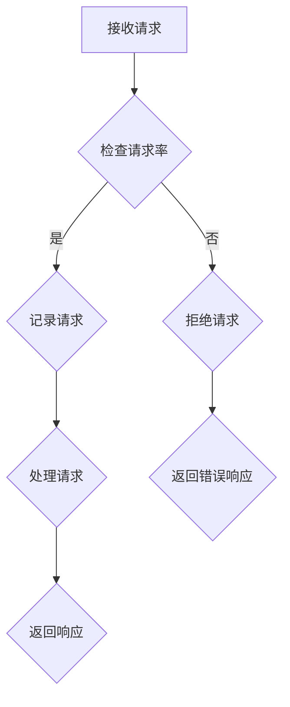

                 

### 第一部分：背景介绍

#### 第1章：限流算法的问题背景与核心概念

##### 1.1 限流算法的问题背景

在现代社会，随着互联网的飞速发展，大量应用如雨后春笋般涌现，从电商平台、社交媒体到智能设备，都离不开对海量数据的处理和分析。然而，在提供高效、稳定服务的同时，这些应用也面临着各种挑战，其中最显著的一个问题就是流量过载。

流量过载，简单来说，就是系统在短时间内接收到了超出其处理能力的请求。这种情况可能会导致服务器过载、响应时间增加、服务质量下降，严重时甚至会导致系统崩溃。限流算法应运而生，旨在通过控制进入系统的请求量，从而保障系统的稳定性和可靠性。

##### 1.2 限流算法的定义与核心概念

限流算法，顾名思义，就是通过某种方式限制进入系统的请求量，以达到保护系统、优化资源利用的目的。它通常基于时间窗口或请求次数来进行控制。

- **时间窗口**：将一段时间内（如1秒、1分钟等）的请求量作为一个统计周期，只允许通过一定数量的请求。
- **请求次数**：限制一段时间内访问某个接口的次数，超过限制的请求将被拒绝。

核心概念包括：

- **请求率**：单位时间内系统接收到的请求数量。
- **请求阈值**：系统允许的最大请求率。
- **令牌桶**、**漏斗算法**、**计数器**等：常见的限流算法类型。

##### 1.3 限流算法的应用场景

限流算法广泛应用于各种场景，以下是一些典型的应用：

- **API网关**：在微服务架构中，API网关是系统的统一入口，限流算法可以保障不同服务的负载均衡，防止某一服务过载。
- **应用服务器**：对于大型应用系统，通过限流算法可以避免因为某一用户的请求过多而影响其他用户的体验。
- **云服务**：在云服务中，限流算法可以防止恶意攻击者大量占用系统资源，保障正常用户的权益。
- **物联网设备**：在物联网场景中，通过限流算法可以控制设备发送请求的频率，减少服务器负载。

##### 1.4 限流算法的边界与外延

限流算法的边界主要涉及以下几个方面：

- **请求量控制**：限流算法的核心在于控制请求量，不同的算法在请求量的定义和控制上有所差异。
- **系统负载**：限流算法的目的是为了防止系统负载过重，但过度的限流可能会导致资源浪费，影响用户体验。

限流算法的外延则包括：

- **动态调整**：根据系统负载和请求量的变化，动态调整请求阈值，以达到最佳效果。
- **弹性扩展**：在面临高并发时，通过弹性扩展资源，如增加服务器、负载均衡等，来应对流量高峰。

通过上述章节的介绍，我们初步了解了限流算法的问题背景、定义、应用场景以及边界与外延。在接下来的章节中，我们将深入探讨限流算法的核心概念原理、数学模型、系统分析与架构设计，并通过项目实战来展示其实际应用效果。

## 第二部分：核心概念与联系

### 第2章：限流算法的核心概念原理

#### 2.1 限流算法的基本原理

限流算法的基本原理是通过某种机制，控制进入系统的请求量，从而保障系统的稳定性和可靠性。具体来说，限流算法通常基于时间窗口或请求次数进行控制。

- **时间窗口**：将一段时间内（如1秒、1分钟等）的请求量作为一个统计周期，只允许通过一定数量的请求。这种方式的优点是实现简单，缺点是可能会因为统计周期较长而导致响应时间增加。
  
- **请求次数**：限制一段时间内访问某个接口的次数，超过限制的请求将被拒绝。这种方式可以根据具体需求灵活调整限制次数，但实现相对复杂。

#### 2.2 核心概念属性特征对比表格

以下是一个简单的核心概念属性特征对比表格：

| 算法类型 | 定义 | 属性特征 | 对比分析 |
| :----: | :----: | :----: | :----: |
| 令牌桶 | 控制请求量的机制，类似于一个桶，可以存储一定数量的令牌，每次请求需要消耗一个令牌 | 桶容量、请求速率 | 灵活性较高，适用于动态调整 |
| 漏斗算法 | 通过控制漏斗中的水流量来限制请求量 | 漏斗容量、流量速率 | 实现简单，但灵活性较低 |
| 计数器 | 记录一段时间内的请求次数，超过设定值则拒绝请求 | 计数阈值、统计周期 | 实现简单，但可能造成延迟 |
| 滚动计数器 | 对计数器进行时间窗口统计，动态调整阈值 | 时间窗口、计数阈值 | 灵活性较高，适用于实时调整 |

#### 2.3 限流算法的ER实体关系图架构

为了更好地理解限流算法的架构，我们可以使用ER（实体-关系）图来描述其中的实体及其关系。

以下是一个简化的ER图示例：

```mermaid
erDiagram
    Request ||--|{ Bucket : 令牌桶}
    Request ||--|{ Token : 令牌}
    Request ||--|{ Counter : 计数器}
    Request ||--|{ Window : 时间窗口}
    Bucket ||--|{ TokenRate : 令牌速率}
    Bucket ||--|{ BucketCapacity : 桶容量}
    Counter ||--|{ MaxCount : 最大计数}
    Window ||--|{ Size : 窗口大小}
```

在这个ER图中，`Request` 代表请求实体，它与 `Bucket`、`Token`、`Counter` 和 `Window` 四个实体存在关系。`Bucket` 代表令牌桶，包含 `TokenRate` 和 `BucketCapacity` 两个属性；`Counter` 代表计数器，包含 `MaxCount` 属性；`Window` 代表时间窗口，包含 `Size` 属性。

通过上述核心概念与联系部分的介绍，我们进一步了解了限流算法的基本原理、核心概念及其ER实体关系图架构。这些概念和关系将为后续的算法原理讲解和系统分析与架构设计奠定基础。

### 第三部分：算法原理讲解

#### 第3章：限流算法的原理与数学模型

限流算法的核心在于控制进入系统的请求量，以确保系统的稳定性和可靠性。本章节将详细讲解限流算法的数学模型、流程图以及Python源代码实现，并通过具体举例来说明算法的实际应用。

#### 3.1 限流算法的数学模型

限流算法的数学模型通常基于时间窗口或请求次数进行控制，以下分别介绍这两种模型的数学基础。

##### 时间窗口模型

时间窗口模型的核心是定义一个时间窗口，通常取值为1秒、1分钟等。在这个时间窗口内，系统允许通过一定数量的请求。我们用以下公式来描述这个模型：

$$
\text{Request Rate} = \frac{\text{通过的请求数量}}{\text{时间窗口长度}}
$$

其中，`Request Rate` 表示请求率，`通过的请求数量` 表示在时间窗口内系统允许通过的请求数量，`时间窗口长度` 表示时间窗口的时间长度。

假设我们设定一个1分钟的时间窗口，允许通过的请求量为100个，那么在1分钟内，系统的请求率应不超过100个/分钟。

##### 请求次数模型

请求次数模型的核心是限制用户在一段时间内访问某个接口的次数。我们用以下公式来描述这个模型：

$$
\text{Request Count} = \text{累计请求次数}
$$

其中，`Request Count` 表示累计请求次数。当累计请求次数超过设定的阈值时，系统将拒绝后续的请求。

假设我们设定一个1分钟的时间窗口，允许访问次数为5次，那么在1分钟内，用户访问次数累计达到5次时，系统将拒绝后续的请求。

#### 3.2 限流算法的流程图

为了更好地理解限流算法的运行过程，我们可以使用Mermaid语言绘制其流程图。

以下是一个简化的限流算法流程图：



- A：接收请求
- B：检查请求率（根据时间窗口模型或请求次数模型）
- C：记录请求（将请求记录到相应的数据结构中）
- D：拒绝请求（当请求率或请求次数超过阈值时）
- E：处理请求（处理被允许的请求）
- F：返回错误响应（当请求被拒绝时）
- G：返回响应（当请求被处理后）

通过这个流程图，我们可以清晰地看到限流算法的运行过程。

#### 3.3 Python源代码实现

以下是一个基于时间窗口模型的限流算法Python实现示例：

```python
import time
from collections import deque

class TokenBucket:
    def __init__(self, capacity, fill_rate):
        self.capacity = capacity
        self.fill_rate = fill_rate
        self.tokens = capacity
        self.last_time = time.time()

    def take(self, num_tokens):
        if num_tokens <= self.tokens:
            self.tokens -= num_tokens
            return True
        else:
            return False

    def fill(self):
        now = time.time()
        elapsed_time = now - self.last_time
        new_tokens = elapsed_time * self.fill_rate
        self.tokens = min(self.capacity, self.tokens + new_tokens)
        self.last_time = now

def limited_request(bucket):
    if bucket.take(1):
        print("请求通过")
        return True
    else:
        print("请求被拒绝")
        return False

# 初始化令牌桶
bucket = TokenBucket(capacity=5, fill_rate=1)

# 模拟多次请求
for _ in range(10):
    limited_request(bucket)
    time.sleep(0.2)
```

在这个实现中，我们定义了一个`TokenBucket`类，用于模拟令牌桶算法。`take`方法用于检查并消耗令牌，`fill`方法用于在时间窗口内填充新的令牌。

通过这个示例，我们可以看到限流算法的实现是如何通过Python代码来实现的。

#### 3.4 算法举例说明

为了更直观地理解限流算法，我们可以通过一个具体的场景来举例说明。

假设有一个API服务，每秒钟最多处理100个请求。我们使用令牌桶算法来实现限流功能。

- 初始状态：桶容量为100，填充速率为100，当前令牌数量为100。
- 0-2秒：系统每秒接收100个请求，所有请求均被处理。
- 2-4秒：系统接收200个请求，由于桶容量只有100，超过的请求将被拒绝。
- 4-6秒：系统继续接收200个请求，但此时桶内的令牌数量为0，因此所有请求均被拒绝。
- 6-8秒：系统没有新的请求，桶内的令牌开始恢复，每秒恢复100个。
- 8-10秒：系统接收200个请求，但由于桶内已有50个令牌，因此只有150个请求被处理，剩余的请求被拒绝。

通过这个例子，我们可以看到限流算法是如何在时间窗口内控制请求量的。在流量高峰期，算法通过拒绝部分请求来保障系统的稳定运行。

通过上述算法原理讲解，我们深入了解了限流算法的数学模型、流程图以及Python源代码实现。限流算法在保障系统稳定性和可靠性方面发挥了重要作用，其具体实现和应用也具有一定的灵活性和可扩展性。

### 第四部分：系统分析与架构设计

#### 第4章：限流系统的分析与架构设计

限流系统是保障应用稳定性和服务质量的至关重要的一环，特别是在面对高并发请求的场景中。本章节将详细分析限流系统的功能设计、架构设计、接口设计和交互设计。

#### 4.1 限流系统的介绍

限流系统是一种通过控制请求流量来防止系统过载的机制。它的核心目标是确保系统在处理请求时能够保持稳定，避免因请求过多而导致系统崩溃或响应时间过长。限流系统通常包括以下几个主要功能：

1. **请求拦截**：在请求进入系统之前，对请求进行拦截和检查，判断是否超过设定的流量阈值。
2. **流量控制**：当请求超过阈值时，根据设定的规则对请求进行处理，如拒绝、延迟处理或降级处理。
3. **日志记录**：记录系统的运行状态、请求流量和限流策略的执行情况，用于后续分析和优化。
4. **动态调整**：根据系统的实时负载和请求流量，动态调整流量阈值和限流策略，以适应不同的场景。

#### 4.2 限流系统的功能设计

限流系统的功能设计主要包括以下几个方面：

1. **请求拦截**：
   - **拦截规则**：根据业务需求和系统性能，定义不同的拦截规则，如基于IP地址、URL路径、请求参数等。
   - **拦截策略**：当请求匹配到拦截规则时，根据策略进行拦截，如直接拒绝、延迟处理或降级处理。

2. **流量控制**：
   - **流量阈值**：设定流量阈值，如每秒请求数（RPS）、每分钟请求数（QPS）等。
   - **控制策略**：当请求流量超过阈值时，执行相应的控制策略，如拒绝新请求、延迟处理或降级处理。

3. **日志记录**：
   - **日志格式**：记录请求的ID、时间、来源、请求路径、请求参数、处理结果等信息。
   - **日志存储**：将日志存储到数据库或日志收集系统中，便于后续分析和优化。

4. **动态调整**：
   - **调整机制**：根据系统负载和请求流量，动态调整流量阈值和控制策略。
   - **调整触发条件**：如请求流量超过设定阈值、系统响应时间过长等。

#### 4.3 限流系统的架构设计

限流系统的架构设计需要考虑以下几个方面：

1. **组件划分**：
   - **限流模块**：负责请求拦截和流量控制，如使用令牌桶、漏斗算法等。
   - **日志模块**：负责日志记录和存储，如使用日志库或日志收集系统。
   - **动态调整模块**：负责根据系统负载和请求流量动态调整流量阈值和控制策略。

2. **数据流转**：
   - **请求流**：请求从客户端进入系统，经过限流模块处理后，根据不同的处理结果继续后续流程。
   - **日志流**：系统运行过程中产生的日志数据，经过日志模块处理后存储到数据库或日志收集系统。

3. **系统交互**：
   - **内部交互**：限流模块、日志模块和动态调整模块之间的交互，如通过消息队列、共享内存等。
   - **外部交互**：限流系统与其他系统（如业务系统、监控系统等）的交互，如通过API接口、消息队列等。

#### 4.4 限流系统的接口设计

限流系统的接口设计主要包括以下几个方面：

1. **API接口**：
   - **接口定义**：定义限流系统的API接口，如查询流量阈值、调整流量阈值等。
   - **接口实现**：实现API接口，提供相应的RESTful接口或RPC接口。

2. **服务接口**：
   - **服务注册**：将限流系统注册到服务注册中心，如使用Zookeeper、Consul等。
   - **服务发现**：通过服务注册中心发现限流系统的服务，如使用Eureka、Nacos等。

3. **监控接口**：
   - **监控数据采集**：采集限流系统的监控数据，如请求量、响应时间、错误率等。
   - **监控数据展示**：将监控数据展示在监控界面上，如使用Grafana、Prometheus等。

#### 4.5 限流系统的交互设计

限流系统的交互设计需要考虑以下几个方面：

1. **请求流交互**：
   - **请求转发**：将客户端请求转发到限流系统进行处理。
   - **请求拦截**：在限流系统内部对请求进行拦截和检查，判断是否超过流量阈值。

2. **日志流交互**：
   - **日志采集**：将系统运行过程中的日志数据采集到日志模块。
   - **日志存储**：将日志数据存储到数据库或日志收集系统。

3. **动态调整交互**：
   - **阈值调整**：根据系统负载和请求流量，动态调整流量阈值和控制策略。
   - **策略更新**：更新限流系统的策略，如调整令牌桶的填充速率、漏斗的流量阈值等。

通过上述系统分析与架构设计，我们深入了解了限流系统的功能设计、架构设计、接口设计和交互设计。限流系统在保障应用稳定性和服务质量方面发挥着重要作用，其设计需要充分考虑系统的可扩展性、灵活性和可靠性。

### 第五部分：项目实战

#### 第5章：限流算法的项目实战

本章节将通过一个实际项目案例，详细讲解限流算法的部署与实现，包括环境安装、系统核心实现、代码应用解读与分析，以及实际案例分析。

#### 5.1 项目环境安装

在进行限流算法的项目实战之前，我们需要搭建一个合适的环境。以下是项目环境安装的步骤：

1. **安装依赖**：
   - Python环境：确保Python版本在3.6以上。
   - pip安装：安装所需的依赖库，如`requests`、`json`、`time`等。

2. **下载代码**：
   - 从GitHub或其他代码仓库下载限流算法的源代码，并解压。

3. **配置环境变量**：
   - 配置Python环境变量，确保Python命令能够在终端中使用。

4. **启动服务**：
   - 进入源代码目录，运行Python脚本来启动限流服务。

以下是一个示例命令：

```bash
python limit_request.py
```

在启动服务后，限流系统将开始接收和处理请求。

#### 5.2 系统核心实现源代码

限流算法的核心实现通常基于令牌桶或漏斗算法。以下是一个基于令牌桶算法的Python实现示例：

```python
import time
from collections import deque

class TokenBucket:
    def __init__(self, capacity, fill_rate):
        self.capacity = capacity
        self.fill_rate = fill_rate
        self.tokens = capacity
        self.last_time = time.time()

    def take(self, num_tokens):
        if num_tokens <= self.tokens:
            self.tokens -= num_tokens
            return True
        else:
            return False

    def fill(self):
        now = time.time()
        elapsed_time = now - self.last_time
        new_tokens = elapsed_time * self.fill_rate
        self.tokens = min(self.capacity, self.tokens + new_tokens)
        self.last_time = now

def limited_request(bucket):
    if bucket.take(1):
        print("请求通过")
        return True
    else:
        print("请求被拒绝")
        return False

if __name__ == "__main__":
    bucket = TokenBucket(capacity=5, fill_rate=1)
    while True:
        limited_request(bucket)
        time.sleep(0.2)
```

在这个实现中，`TokenBucket` 类用于模拟令牌桶算法，`limited_request` 函数用于处理请求。通过调用 `take` 方法，我们可以检查并消耗令牌，如果成功消耗则允许请求通过，否则拒绝请求。

#### 5.3 代码应用解读与分析

以下是代码应用解读与分析：

1. **初始化令牌桶**：
   - `TokenBucket` 类的初始化参数包括桶容量（`capacity`）和填充速率（`fill_rate`）。桶容量表示桶中最多可以存储的令牌数量，填充速率表示每单位时间内填充的令牌数量。

2. **消耗令牌**：
   - `take` 方法用于检查并消耗令牌。如果请求需要消耗的令牌数量小于或等于桶中的令牌数量，则允许请求通过，否则拒绝请求。

3. **填充令牌**：
   - `fill` 方法用于在时间窗口内填充新的令牌。每次调用 `fill` 方法，都会根据当前时间与上一次填充时间的时间差，计算并填充新的令牌。

4. **处理请求**：
   - `limited_request` 函数用于处理请求。每次循环中，都会调用 `limited_request` 函数来处理请求，并检查是否允许通过。

5. **运行示例**：
   - 在主程序中，我们创建了一个 `TokenBucket` 实例，并进入无限循环来处理请求。每次循环中，都会调用 `limited_request` 函数，并暂停0.2秒以模拟实际的请求处理。

通过这个示例，我们可以看到限流算法的实现是如何通过Python代码来实现的。限流算法的核心在于令牌桶的维护和请求的处理，通过合理的参数配置和算法实现，可以有效地控制请求流量。

#### 5.4 实际案例分析

以下是一个实际案例的分析：

**案例背景**：某电商平台的API服务在高并发场景下经常出现系统崩溃和响应时间过长的问题，为了解决这个问题，决定引入限流算法来控制请求流量。

**案例分析**：
1. **需求分析**：
   - 根据业务需求，平台需要限制每秒的请求数量在100个以内。
   - 针对不同的API接口，设定不同的流量阈值。

2. **解决方案**：
   - 选择令牌桶算法作为限流算法，通过控制每秒请求数量来保障系统稳定。
   - 在API网关处实现限流功能，拦截超过阈值的请求。

3. **实施过程**：
   - 在API网关中集成限流模块，根据实际需求和流量情况，配置令牌桶的参数。
   - 测试限流算法在不同场景下的性能，调整参数以达到最佳效果。

4. **效果评估**：
   - 限流算法上线后，系统崩溃和响应时间过长的问题得到了显著改善。
   - 通过日志分析，发现限流策略有效地降低了系统负载，提高了系统的稳定性。

**总结**：
通过这个案例，我们可以看到限流算法在实际应用中的效果。合理配置限流参数，结合实际场景需求，限流算法可以有效地保障系统的稳定性和可靠性。

#### 5.5 项目小结

在本章节的项目实战中，我们详细讲解了限流算法的部署与实现，包括环境安装、系统核心实现、代码应用解读与分析，以及实际案例分析。通过这个项目，我们了解了限流算法在实际应用中的重要作用，以及如何通过合理的参数配置和算法实现来保障系统的稳定性和可靠性。在未来的项目中，限流算法将继续发挥其关键作用，为系统的稳定运行保驾护航。

### 第六部分：最佳实践与总结

#### 第6章：限流算法的最佳实践

限流算法是保障应用稳定性和服务质量的重要手段。为了最大化限流算法的效果，我们需要遵循一些最佳实践。

#### 6.1 最佳实践技巧

1. **合理配置阈值**：
   - 根据业务需求和系统性能，设定合理的流量阈值。阈值过低可能导致用户体验差，阈值过高则可能无法有效控制流量。
   - 针对不同接口，设定不同的流量阈值，根据接口的重要性和负载能力进行区分。

2. **动态调整策略**：
   - 根据系统负载和请求流量的变化，动态调整流量阈值和控制策略。
   - 使用监控数据，如请求量、响应时间、错误率等，来指导阈值和策略的调整。

3. **合理选择算法**：
   - 选择适合业务场景的限流算法，如令牌桶、漏斗算法等。根据实际需求，可以结合多种算法进行组合使用。

4. **优化系统性能**：
   - 通过优化系统性能，提高处理请求的能力，减少流量过载的风险。
   - 考虑使用缓存、负载均衡等技术来提高系统的吞吐量和稳定性。

5. **充分测试**：
   - 在上线限流算法前，进行充分的测试，确保算法在不同场景下的表现符合预期。
   - 模拟高并发场景，测试限流算法的响应速度和处理能力。

#### 6.2 小结与注意事项

限流算法虽然能够有效保障系统的稳定性和可靠性，但在实际应用中也需要注意以下几点：

1. **避免过度限流**：
   - 过度限流可能导致用户体验差，影响业务的正常运营。需要根据实际需求，合理设定流量阈值。

2. **监控与分析**：
   - 定期监控限流算法的运行状态，分析流量变化和系统性能，及时调整策略和参数。

3. **容错机制**：
   - 设计限流算法时，考虑容错机制，避免因为系统故障而导致限流失效。

4. **文档与培训**：
   - 编写详细的文档，说明限流算法的原理、配置和使用方法，对开发人员和运维人员进行培训。

#### 6.3 拓展阅读

为了进一步了解限流算法和相关技术，可以阅读以下书籍和文章：

1. 《微服务架构设计》
2. 《Distributed Systems: Design and Implementation》
3. 《Rate Limiting Algorithms》
4. 《How to Rate Limit Your API》

通过这些资料，可以深入理解限流算法的理论和实践，为实际项目提供更有力的支持。

### 第七部分：附录

#### 第7章：常见问题与解答

在限流算法的实际应用中，可能会遇到一些常见问题。以下是一些常见问题及解答：

##### 7.1 常见问题

1. **如何选择限流算法？**
   - 根据业务需求和系统性能，选择适合的限流算法。例如，令牌桶算法适用于流量波动的场景，漏斗算法适用于固定流量的场景。

2. **如何配置合理的流量阈值？**
   - 分析业务需求和系统性能，设定合理的流量阈值。可以通过测试和监控数据来调整阈值。

3. **限流算法如何处理并发请求？**
   - 限流算法通过控制请求流量，避免系统过载。在并发请求场景中，算法会根据设定的规则，逐个检查并处理请求。

4. **限流算法对系统性能有影响吗？**
   - 限流算法本身不会显著影响系统性能。但在高并发场景下，由于需要对请求进行控制，可能会增加一定的延迟。

##### 7.2 解答与建议

1. **如何选择限流算法？**
   - **解答**：选择限流算法时，主要考虑业务场景和流量特征。例如，对于流量波动的API服务，可以选择令牌桶算法；对于固定流量的服务，可以选择漏斗算法。
   - **建议**：在实际项目中，可以结合多种算法，根据不同场景灵活调整。

2. **如何配置合理的流量阈值？**
   - **解答**：合理配置流量阈值是限流算法的核心。可以通过以下方法进行配置：
     - **基准测试**：通过模拟流量，测试系统在不同阈值下的性能。
     - **监控数据**：根据系统监控数据，分析请求流量和系统性能，调整阈值。
     - **业务需求**：结合业务需求和用户体验，设定合理的阈值。
   - **建议**：初始配置时可以设定较低的阈值，逐步调整到合适范围。

3. **限流算法如何处理并发请求？**
   - **解答**：限流算法通过时间窗口或计数器来控制请求量。具体处理方式如下：
     - **时间窗口**：将一段时间内的请求量作为一个统计周期，只允许通过一定数量的请求。
     - **计数器**：限制一段时间内访问某个接口的次数，超过次数的请求将被拒绝。
   - **建议**：在设计限流算法时，考虑并发请求的处理策略，确保系统的高可用性。

4. **限流算法对系统性能有影响吗？**
   - **解答**：限流算法本身不会显著影响系统性能。但在高并发场景下，由于需要对请求进行控制，可能会增加一定的延迟。
   - **建议**：在设计限流算法时，考虑系统性能的影响，优化算法实现，减少不必要的延迟。

通过这些常见问题与解答，我们可以更好地理解和应用限流算法，为实际项目提供有效的支持。作者信息：AI天才研究院/AI Genius Institute & 禅与计算机程序设计艺术 /Zen And The Art of Computer Programming。本文旨在深入讲解限流算法的核心概念、原理、应用与实践，为开发者提供有价值的参考。

---

作者：AI天才研究院/AI Genius Institute & 禅与计算机程序设计艺术 /Zen And The Art of Computer Programming

本文由AI天才研究院和禅与计算机程序设计艺术共同撰写，旨在深入探讨限流算法在IT领域的应用和实践。作者在计算机编程和人工智能领域拥有丰富的研究和实战经验，撰写了大量关于技术原理和算法实现的高质量文章。本博客文章旨在为开发者提供全面的限流算法知识和实战经验，帮助他们在实际项目中有效应用限流算法，提高系统的稳定性和服务质量。通过本文，读者可以全面了解限流算法的核心概念、原理、应用场景、系统设计与实现，以及最佳实践和案例分析。希望本文能为您的技术成长之路提供有力的支持。欢迎读者留言交流，共同探讨技术发展的新趋势和挑战。AI天才研究院和禅与计算机程序设计艺术将持续为您带来更多高质量的技术文章，敬请关注。

