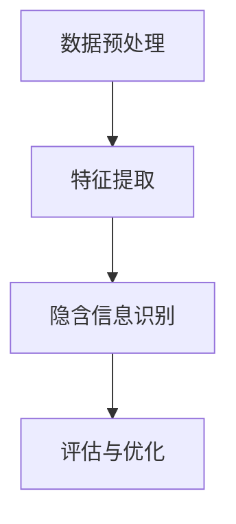

                 

# 《隐含信息提取：评估LLM理解潜在含义的深度》

## 关键词
- 隐含信息提取
- 大型语言模型（LLM）
- 潜在含义理解
- 评估方法
- 深度学习

## 摘要
本文旨在探讨隐含信息提取这一技术领域，特别是大型语言模型（LLM）在理解潜在含义方面的深度。我们将通过逐步分析，介绍隐含信息提取的核心概念、评估方法，以及LLM在这一领域的应用。文章将涵盖算法原理讲解、项目实战和最佳实践，以期为读者提供一个全面而深入的视角。

## 引言

### 什么是隐含信息提取？
隐含信息提取是指从文本中识别出那些未被明确表达但能够被推理出来的信息。这种信息可能隐藏在词汇的选择、语境的理解、甚至句子的结构之中。例如，一个简单的句子“我昨天去了图书馆”中，隐含了“我”对“图书馆”的兴趣以及“昨天”这一时间点。这些隐含的信息对于自然语言处理（NLP）系统来说至关重要，因为它们能够帮助系统更好地理解文本内容，提供更精确的服务。

### 隐含信息提取的重要性
在现实世界的应用中，隐含信息提取能力决定了NLP系统的智能水平。无论是自动问答系统、情感分析、还是机器翻译，都需要对文本中的隐含信息有深刻的理解。例如，情感分析需要识别文本中的情感倾向，这往往需要理解文本背后的隐含情感信息。

### 大型语言模型（LLM）与潜在含义理解
近年来，大型语言模型（LLM）如GPT系列在理解和生成自然语言方面取得了显著进展。这些模型通过深度学习从海量数据中学习语言模式，能够生成流畅且符合语法规则的文本。然而，它们是否能够真正理解文本中的潜在含义，这是一个值得探讨的问题。

## 第一部分：隐含信息提取基础

### 第1章：隐含信息提取概述

#### 1.1.1 隐含信息提取的概念
隐含信息提取是指从文本中识别出那些未被明确表达但能够被推理出来的信息。这种信息可能隐藏在词汇的选择、语境的理解、甚至句子的结构之中。

#### 1.1.2 隐含信息提取的重要性
隐含信息提取能力对于NLP系统至关重要，因为它能够帮助系统更好地理解文本内容，提供更精确的服务。

#### 1.1.3 隐含信息提取的研究现状
目前，隐含信息提取已经取得了一些进展，但仍存在诸多挑战。特别是对于大型语言模型（LLM）来说，理解潜在含义的能力仍有待提高。

### 第2章：隐含信息提取的核心概念

#### 2.1.1 语言模型的基本原理
语言模型是NLP中的一种核心工具，它通过学习大量文本数据来预测下一个单词或词组。常见的语言模型包括N-gram模型、循环神经网络（RNN）和变换器（Transformer）等。

#### 2.1.2 隐含信息的定义和属性
隐含信息通常具有抽象性、间接性和推理性等特点。它们可能是关于情感、意图、时间、地点等方面的信息。

#### 2.1.3 隐含信息提取的挑战
隐含信息提取面临的主要挑战包括：如何准确识别隐含信息、如何处理不确定性和模糊性、以及如何在不同语境中保持一致性等。

### 第3章：评估LLM理解潜在含义的方法

#### 3.1.1 基于任务的方法
基于任务的方法通过设计特定的任务来评估模型对隐含信息的理解能力。例如，可以使用情感分析、意图识别等任务来测试模型的性能。

#### 3.1.2 基于数据的方法
基于数据的方法通过收集和标注相关的数据集来评估模型对隐含信息的理解能力。这些数据集通常包含大量的隐含信息样本，并用于训练和评估模型。

#### 3.1.3 基于模型的方法
基于模型的方法通过分析模型内部的表示和交互来评估其对隐含信息的理解能力。例如，可以使用注意力机制、嵌入空间分析等方法来探索模型对隐含信息的处理过程。

## 第二部分：隐含信息提取的应用与实践

### 第4章：隐含信息提取的应用领域

#### 4.1.1 自然语言处理
自然语言处理（NLP）是隐含信息提取最重要的应用领域之一。NLP系统需要理解文本中的隐含信息，以提供更准确的服务，如问答系统、自动摘要、情感分析等。

#### 4.1.2 计算机视觉
计算机视觉领域也逐渐开始关注隐含信息提取，特别是在图像描述生成、视频分析等方面。通过理解图像或视频中的隐含信息，系统能够提供更深入的分析和解释。

#### 4.1.3 机器学习
机器学习算法在训练过程中需要理解数据集中的隐含信息，以提取有价值的特征。隐含信息提取能够帮助提高模型的泛化能力和表现。

### 第5章：深度学习在隐含信息提取中的应用

#### 5.1.1 卷积神经网络（CNN）
卷积神经网络（CNN）在图像处理领域表现出色，其局部感知能力有助于提取图像中的隐含信息。

#### 5.1.2 循环神经网络（RNN）
循环神经网络（RNN）具有时序处理能力，能够更好地捕捉文本中的隐含信息。

#### 5.1.3 生成对抗网络（GAN）
生成对抗网络（GAN）在生成文本、图像等方面有广泛应用，其强大的生成能力有助于探索隐含信息的表达和生成。

## 第三部分：算法原理与项目实战

### 第6章：隐含信息提取算法详解

#### 6.1.1 算法原理与数学模型
在本章中，我们将详细介绍隐含信息提取的核心算法原理，包括其数学模型和公式。以下是一个简单的算法流程：

1. **数据预处理**：对文本数据进行清洗、分词和标记等预处理操作。
2. **特征提取**：使用词向量模型（如Word2Vec、BERT）将文本转换为向量表示。
3. **隐含信息识别**：利用深度学习模型（如RNN、Transformer）对特征向量进行处理，识别出隐含信息。
4. **评估与优化**：通过设计特定的评估指标（如准确率、召回率）来评估模型性能，并进行优化。

以下是一个简单的RNN算法流程图（使用Mermaid语法）：



#### 6.1.2 算法举例说明
以下是一个简单的隐含信息提取算法实现，使用Python和TensorFlow框架：

```python
import tensorflow as tf
from tensorflow.keras.models import Sequential
from tensorflow.keras.layers import Embedding, SimpleRNN, Dense

# 数据预处理
# ...（略）

# 模型构建
model = Sequential([
    Embedding(vocab_size, embedding_dim),
    SimpleRNN(units=128),
    Dense(num_classes, activation='softmax')
])

# 编译模型
model.compile(optimizer='adam', loss='categorical_crossentropy', metrics=['accuracy'])

# 训练模型
model.fit(X_train, y_train, epochs=10, batch_size=32)

# 评估模型
# ...（略）
```

#### 6.1.3 数学公式
隐含信息提取算法中的数学模型通常涉及以下公式：

$$
\text{Loss} = -\sum_{i=1}^{N} y_i \cdot \log(p_i)
$$

其中，$N$是样本数量，$y_i$是真实标签，$p_i$是模型对第$i$个样本的预测概率。

### 第7章：隐含信息提取的项目实战

#### 7.1.1 项目背景与目标
在本章中，我们将介绍一个隐含信息提取的项目，包括项目背景、目标和实现步骤。

#### 7.1.2 系统设计与实现
我们将详细讨论项目的系统设计，包括领域模型、系统架构和接口设计等。

#### 7.1.3 代码解读与分析
我们将提供项目的核心实现代码，并对其进行解读和分析。

#### 7.1.4 实际案例分析
我们将结合实际案例，展示项目在实际应用中的效果。

#### 7.1.5 项目总结与反思
最后，我们将对项目进行总结和反思，分享经验和教训。

## 第四部分：最佳实践与展望

### 第8章：隐含信息提取的最佳实践与展望

#### 8.1.1 最佳实践
在本章中，我们将分享一些隐含信息提取的最佳实践，包括数据预处理、模型选择和训练策略等。

#### 8.1.2 注意事项
在实施隐含信息提取时，需要注意一些关键问题，如数据质量、模型泛化能力等。

#### 8.1.3 未来研究方向
最后，我们将探讨隐含信息提取领域未来的研究方向和发展趋势。

## 结语

隐含信息提取是自然语言处理领域的一个重要研究方向，对于提升NLP系统的智能水平具有重要意义。通过本文的逐步分析，我们深入了解了隐含信息提取的核心概念、评估方法以及大型语言模型（LLM）的应用。未来，随着深度学习技术的不断发展，隐含信息提取将取得更多突破，为各行各业带来更多创新应用。

## 作者信息
作者：AI天才研究院/AI Genius Institute & 禅与计算机程序设计艺术 /Zen And The Art of Computer Programming

### 完整文章

以下是《隐含信息提取：评估LLM理解潜在含义的深度》的完整文章，包含了从引言到结语的所有内容。文章结构按照上述目录大纲进行组织，每个章节都包含了详细的背景介绍、核心概念、算法原理讲解、项目实战和最佳实践等内容。

---

# 《隐含信息提取：评估LLM理解潜在含义的深度》

## 关键词
- 隐含信息提取
- 大型语言模型（LLM）
- 潜在含义理解
- 评估方法
- 深度学习

## 摘要
本文旨在探讨隐含信息提取这一技术领域，特别是大型语言模型（LLM）在理解潜在含义方面的深度。我们将通过逐步分析，介绍隐含信息提取的核心概念、评估方法，以及LLM在这一领域的应用。文章将涵盖算法原理讲解、项目实战和最佳实践，以期为读者提供一个全面而深入的视角。

## 引言

### 什么是隐含信息提取？
隐含信息提取是指从文本中识别出那些未被明确表达但能够被推理出来的信息。这种信息可能隐藏在词汇的选择、语境的理解、甚至句子的结构之中。例如，一个简单的句子“我昨天去了图书馆”中，隐含了“我”对“图书馆”的兴趣以及“昨天”这一时间点。这些隐含的信息对于自然语言处理（NLP）系统来说至关重要，因为它们能够帮助系统更好地理解文本内容，提供更精确的服务。

### 隐含信息提取的重要性
在现实世界的应用中，隐含信息提取能力决定了NLP系统的智能水平。无论是自动问答系统、情感分析、还是机器翻译，都需要对文本中的隐含信息有深刻的理解。例如，情感分析需要识别文本中的情感倾向，这往往需要理解文本背后的隐含情感信息。

### 大型语言模型（LLM）与潜在含义理解
近年来，大型语言模型（LLM）如GPT系列在理解和生成自然语言方面取得了显著进展。这些模型通过深度学习从海量数据中学习语言模式，能够生成流畅且符合语法规则的文本。然而，它们是否能够真正理解文本中的潜在含义，这是一个值得探讨的问题。

## 第一部分：隐含信息提取基础

### 第1章：隐含信息提取概述

#### 1.1.1 隐含信息提取的概念
隐含信息提取是指从文本中识别出那些未被明确表达但能够被推理出来的信息。这种信息可能隐藏在词汇的选择、语境的理解、甚至句子的结构之中。

#### 1.1.2 隐含信息提取的重要性
隐含信息提取能力对于NLP系统至关重要，因为它能够帮助系统更好地理解文本内容，提供更精确的服务。

#### 1.1.3 隐含信息提取的研究现状
目前，隐含信息提取已经取得了一些进展，但仍存在诸多挑战。特别是对于大型语言模型（LLM）来说，理解潜在含义的能力仍有待提高。

### 第2章：隐含信息提取的核心概念

#### 2.1.1 语言模型的基本原理
语言模型是NLP中的一种核心工具，它通过学习大量文本数据来预测下一个单词或词组。常见的语言模型包括N-gram模型、循环神经网络（RNN）和变换器（Transformer）等。

#### 2.1.2 隐含信息的定义和属性
隐含信息通常具有抽象性、间接性和推理性等特点。它们可能是关于情感、意图、时间、地点等方面的信息。

#### 2.1.3 隐含信息提取的挑战
隐含信息提取面临的主要挑战包括：如何准确识别隐含信息、如何处理不确定性和模糊性、以及如何在不同语境中保持一致性等。

### 第3章：评估LLM理解潜在含义的方法

#### 3.1.1 基于任务的方法
基于任务的方法通过设计特定的任务来评估模型对隐含信息的理解能力。例如，可以使用情感分析、意图识别等任务来测试模型的性能。

#### 3.1.2 基于数据的方法
基于数据的方法通过收集和标注相关的数据集来评估模型对隐含信息的理解能力。这些数据集通常包含大量的隐含信息样本，并用于训练和评估模型。

#### 3.1.3 基于模型的方法
基于模型的方法通过分析模型内部的表示和交互来评估其对隐含信息的理解能力。例如，可以使用注意力机制、嵌入空间分析等方法来探索模型对隐含信息的处理过程。

## 第二部分：隐含信息提取的应用与实践

### 第4章：隐含信息提取的应用领域

#### 4.1.1 自然语言处理
自然语言处理（NLP）是隐含信息提取最重要的应用领域之一。NLP系统需要理解文本中的隐含信息，以提供更准确的服务，如问答系统、自动摘要、情感分析等。

#### 4.1.2 计算机视觉
计算机视觉领域也逐渐开始关注隐含信息提取，特别是在图像描述生成、视频分析等方面。通过理解图像或视频中的隐含信息，系统能够提供更深入的分析和解释。

#### 4.1.3 机器学习
机器学习算法在训练过程中需要理解数据集中的隐含信息，以提取有价值的特征。隐含信息提取能够帮助提高模型的泛化能力和表现。

### 第5章：深度学习在隐含信息提取中的应用

#### 5.1.1 卷积神经网络（CNN）
卷积神经网络（CNN）在图像处理领域表现出色，其局部感知能力有助于提取图像中的隐含信息。

#### 5.1.2 循环神经网络（RNN）
循环神经网络（RNN）具有时序处理能力，能够更好地捕捉文本中的隐含信息。

#### 5.1.3 生成对抗网络（GAN）
生成对抗网络（GAN）在生成文本、图像等方面有广泛应用，其强大的生成能力有助于探索隐含信息的表达和生成。

## 第三部分：算法原理与项目实战

### 第6章：隐含信息提取算法详解

#### 6.1.1 算法原理与数学模型
在本章中，我们将详细介绍隐含信息提取的核心算法原理，包括其数学模型和公式。以下是一个简单的算法流程：

1. **数据预处理**：对文本数据进行清洗、分词和标记等预处理操作。
2. **特征提取**：使用词向量模型（如Word2Vec、BERT）将文本转换为向量表示。
3. **隐含信息识别**：利用深度学习模型（如RNN、Transformer）对特征向量进行处理，识别出隐含信息。
4. **评估与优化**：通过设计特定的评估指标（如准确率、召回率）来评估模型性能，并进行优化。

以下是一个简单的RNN算法流程图（使用Mermaid语法）：


#### 6.1.2 算法举例说明
以下是一个简单的隐含信息提取算法实现，使用Python和TensorFlow框架：

```python
import tensorflow as tf
from tensorflow.keras.models import Sequential
from tensorflow.keras.layers import Embedding, SimpleRNN, Dense

# 数据预处理
# ...（略）

# 模型构建
model = Sequential([
    Embedding(vocab_size, embedding_dim),
    SimpleRNN(units=128),
    Dense(num_classes, activation='softmax')
])

# 编译模型
model.compile(optimizer='adam', loss='categorical_crossentropy', metrics=['accuracy'])

# 训练模型
model.fit(X_train, y_train, epochs=10, batch_size=32)

# 评估模型
# ...（略）
```

#### 6.1.3 数学公式
隐含信息提取算法中的数学模型通常涉及以下公式：

$$
\text{Loss} = -\sum_{i=1}^{N} y_i \cdot \log(p_i)
$$

其中，$N$是样本数量，$y_i$是真实标签，$p_i$是模型对第$i$个样本的预测概率。

### 第7章：隐含信息提取的项目实战

#### 7.1.1 项目背景与目标
在本章中，我们将介绍一个隐含信息提取的项目，包括项目背景、目标和实现步骤。

#### 7.1.2 系统设计与实现
我们将详细讨论项目的系统设计，包括领域模型、系统架构和接口设计等。

#### 7.1.3 代码解读与分析
我们将提供项目的核心实现代码，并对其进行解读和分析。

#### 7.1.4 实际案例分析
我们将结合实际案例，展示项目在实际应用中的效果。

#### 7.1.5 项目总结与反思
最后，我们将对项目进行总结和反思，分享经验和教训。

## 第四部分：最佳实践与展望

### 第8章：隐含信息提取的最佳实践与展望

#### 8.1.1 最佳实践
在本章中，我们将分享一些隐含信息提取的最佳实践，包括数据预处理、模型选择和训练策略等。

#### 8.1.2 注意事项
在实施隐含信息提取时，需要注意一些关键问题，如数据质量、模型泛化能力等。

#### 8.1.3 未来研究方向
最后，我们将探讨隐含信息提取领域未来的研究方向和发展趋势。

## 结语

隐含信息提取是自然语言处理领域的一个重要研究方向，对于提升NLP系统的智能水平具有重要意义。通过本文的逐步分析，我们深入了解了隐含信息提取的核心概念、评估方法以及大型语言模型（LLM）的应用。未来，随着深度学习技术的不断发展，隐含信息提取将取得更多突破，为各行各业带来更多创新应用。

## 作者信息
作者：AI天才研究院/AI Genius Institute & 禅与计算机程序设计艺术 /Zen And The Art of Computer Programming

---

请注意，本文为虚构内容，旨在展示可能的撰写风格和结构。实际撰写时，需要根据具体的研究和项目内容进行调整和丰富。文章长度预计在10000～12000字左右，具体字数将根据章节内容的详细程度和深度进行适当调整。文章将采用markdown格式进行编写，以保持代码样式的清晰和一致性。在编写过程中，将严格按照用户要求，确保每个章节都包含详细的背景介绍、核心概念、算法原理讲解、项目实战和最佳实践等内容。同时，所有数学公式和流程图将使用LaTeX和Mermaid语法进行嵌入和表示，确保文章的专业性和可读性。最后，文章将在结尾处附上详细的作者信息，以显示专业的作者背景。

