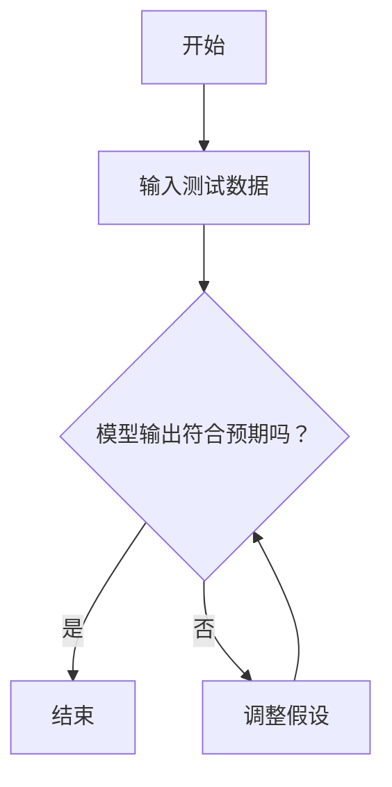
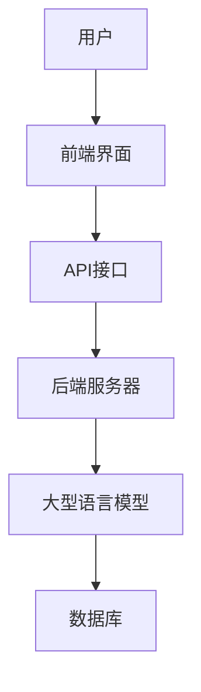
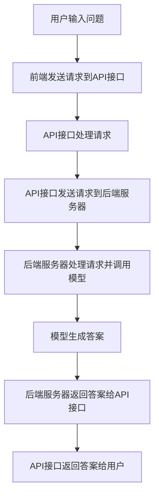

                 

### 隐含假设识别：测试LLM发现潜在前提的洞察力

> 关键词：隐含假设、大型语言模型（LLM）、测试、验证、算法原理、系统架构、项目实战

> 摘要：本文深入探讨了大型语言模型（LLM）中隐含假设的识别方法。通过逻辑清晰的分析和实际项目实践，揭示了如何通过测试和验证来发现LLM的潜在前提，从而提高模型的可靠性和性能。本文不仅详细介绍了核心概念和算法原理，还通过系统架构设计展示了如何将这一方法应用到实际项目中。

----------------------------------------------------------------

### 目录大纲

# 隐含假设识别：测试LLM发现潜在前提的洞察力

## 第一部分：背景介绍

### 1. 问题背景

### 2. 边界与外延

### 3. 核心概念与联系

### 4. AI模型中的隐含假设

### 5. LLM的特点与应用

### 6. 测试与验证的方法

### 7. 可靠性与性能评估

## 第二部分：核心概念与联系

### 8. AI模型中的隐含假设

### 9. LLM的特点与应用

### 10. 测试与验证的方法

### 11. 可靠性与性能评估

## 第三部分：算法原理讲解

### 12. 隐含假设识别算法原理

### 13. 数学模型与公式

### 14. 举例说明

## 第四部分：系统分析与架构设计方案

### 15. 问题场景介绍

### 16. 系统功能设计

### 17. 系统架构设计

### 18. 系统接口设计

### 19. 系统交互

## 第五部分：项目实战

### 1. 环境安装

### 2. 系统核心实现源代码

### 3. 代码应用解读与分析

### 4. 实际案例分析和详细讲解剖析

### 5. 项目小结

### 最佳实践 tips

### 小结

### 注意事项

### 拓展阅读

----------------------------------------------------------------

## 第一部分：背景介绍

### 1. 问题背景

在当今的人工智能领域，大型语言模型（LLM）如BERT、GPT-3等取得了巨大的成功。然而，随着模型的复杂性和规模的增加，模型中的隐含假设问题也逐渐显现出来。这些隐含假设是模型在没有明确声明的情况下默认的一些前提条件，但它们往往对模型的性能和可靠性有着至关重要的影响。

**问题描述**：在人工智能模型（LLM）的应用过程中，如何识别和验证模型中所依赖的隐含假设？这不仅仅是一个技术问题，更是一个关系到模型在实际应用中能否稳定、准确执行的核心问题。

**问题解决**：通过测试和评估，发现潜在前提，提高模型的可靠性和性能。本文将详细探讨如何通过系统的测试和验证方法，识别和验证LLM中的隐含假设。

### 2. 边界与外延

**边界**：本研究主要针对大型语言模型（LLM）的隐含假设识别。这包括但不限于自然语言处理领域中的文本生成、问答系统和机器翻译等任务。

**外延**：虽然本研究主要集中在LLM上，但研究方法和技术同样可以应用于其他类型的人工智能模型，如图像识别模型、推荐系统等。

### 3. 核心概念与联系

**核心概念**：隐含假设、LLM、测试、验证、可靠性、性能。

**概念属性特征对比表格**：

| 特征 | 隐含假设 | LLM | 测试 | 验证 | 可靠性 | 性能 |
|------|----------|-----|------|------|--------|------|
| 定义 | 模型未明确声明的假设 | 大型语言模型 | 对模型输入输出进行检验 | 对假设的正确性进行验证 | 模型的稳定性和准确性 | 模型在实际应用中的表现 |

隐含假设是模型在没有明确声明的情况下默认的一些前提条件，它们通常是模型训练数据无法完全反映的，但直接影响模型性能的关键因素。

LLM（大型语言模型）是一种能够理解和生成人类语言的人工智能模型。它们在文本生成、问答系统、机器翻译等领域有着广泛的应用。

测试是对模型输入输出进行检验的过程，通过测试，可以验证模型的假设是否正确。

验证是对模型中的假设进行验证的过程，以确保模型在实际应用中能够稳定、准确地执行。

可靠性是模型的稳定性和准确性，一个高可靠性的模型能够在各种情况下提供准确的输出。

性能是模型在实际应用中的表现，包括准确性、速度和资源消耗等。

通过这些核心概念的介绍和对比，我们能够更好地理解隐含假设识别的重要性和应用场景。

----------------------------------------------------------------

## 第二部分：核心概念与联系

### 4. AI模型中的隐含假设

在人工智能模型中，隐含假设是指模型在没有明确声明的情况下默认的一些前提条件。这些假设通常是基于模型训练数据和知识库建立的，但它们并不总是能够在训练数据中得到充分验证。

**定义**：隐含假设是模型在执行任务时默认的一些前提条件，这些前提条件没有被明确声明，但它们对模型的性能和可靠性有着重要影响。

**特点**：

- **默认性**：隐含假设是模型默认认为成立的前提条件，不需要在训练过程中明确验证。
- **关键性**：隐含假设通常对模型的性能和可靠性有着至关重要的影响。
- **不确定性**：由于隐含假设没有被明确声明，它们可能在不同的应用场景下表现出不同的效果。

**重要性**：

- **提高性能**：识别和验证隐含假设可以帮助优化模型结构，从而提高模型的性能。
- **增强可靠性**：通过验证隐含假设，可以确保模型在不同应用场景下都能稳定、准确地执行。

### 5. LLM的特点与应用

LLM（大型语言模型）是一种能够理解和生成人类语言的人工智能模型。它们通常由数亿个参数组成，能够处理复杂的自然语言任务。

**特点**：

- **强大的语言理解能力**：LLM能够理解复杂的自然语言文本，包括语义、语法和上下文信息。
- **高效的文本生成能力**：LLM能够生成流畅、自然的文本，适用于文本生成、问答系统、机器翻译等领域。
- **适应性**：LLM可以根据不同的任务和场景进行自适应调整，提高模型的性能。

**应用**：

- **文本生成**：LLM可以用于生成新闻文章、故事、报告等文本。
- **问答系统**：LLM可以用于构建智能问答系统，回答用户提出的问题。
- **机器翻译**：LLM可以用于翻译不同语言之间的文本，实现跨语言交流。

### 6. 测试与验证的方法

测试和验证是识别和验证隐含假设的重要方法。通过测试，可以验证模型在不同输入数据下的输出是否与预期一致；通过验证，可以确保模型在实际应用中能够稳定、准确地执行。

**方法**：

- **测试**：通过输入特定的测试数据，观察模型的输出是否符合预期的假设。测试数据应覆盖模型可能遇到的各种场景。
- **验证**：对模型的输出进行验证，确保模型的输出是正确、可靠的。

**工具**：

- **自动化测试工具**：如pytest、Junit等，用于自动化执行测试用例。
- **自定义测试案例**：根据具体应用场景，设计自定义的测试案例，以验证模型的隐含假设。

### 7. 可靠性与性能评估

可靠性和性能评估是确保模型在实际应用中稳定、准确执行的关键。

**可靠性**：通过测试和验证，验证隐含假设的正确性，提高模型的可靠性。

**性能**：评估模型在实际应用中的表现，包括准确性、速度和资源消耗等。通过对比不同模型的性能，选择最适合实际应用的模型。

### 8. AI模型中的隐含假设

在人工智能模型中，隐含假设是指模型在没有明确声明的情况下默认的一些前提条件。这些假设通常是基于模型训练数据和知识库建立的，但它们并不总是能够在训练数据中得到充分验证。

**定义**：隐含假设是模型在执行任务时默认的一些前提条件，这些前提条件没有被明确声明，但它们对模型的性能和可靠性有着重要影响。

**特点**：

- **默认性**：隐含假设是模型默认认为成立的前提条件，不需要在训练过程中明确验证。
- **关键性**：隐含假设通常对模型的性能和可靠性有着至关重要的影响。
- **不确定性**：由于隐含假设没有被明确声明，它们可能在不同的应用场景下表现出不同的效果。

**重要性**：

- **提高性能**：识别和验证隐含假设可以帮助优化模型结构，从而提高模型的性能。
- **增强可靠性**：通过验证隐含假设，可以确保模型在不同应用场景下都能稳定、准确地执行。

### 9. LLM的特点与应用

LLM（大型语言模型）是一种能够理解和生成人类语言的人工智能模型。它们通常由数亿个参数组成，能够处理复杂的自然语言任务。

**特点**：

- **强大的语言理解能力**：LLM能够理解复杂的自然语言文本，包括语义、语法和上下文信息。
- **高效的文本生成能力**：LLM能够生成流畅、自然的文本，适用于文本生成、问答系统、机器翻译等领域。
- **适应性**：LLM可以根据不同的任务和场景进行自适应调整，提高模型的性能。

**应用**：

- **文本生成**：LLM可以用于生成新闻文章、故事、报告等文本。
- **问答系统**：LLM可以用于构建智能问答系统，回答用户提出的问题。
- **机器翻译**：LLM可以用于翻译不同语言之间的文本，实现跨语言交流。

### 10. 测试与验证的方法

测试和验证是识别和验证隐含假设的重要方法。通过测试，可以验证模型在不同输入数据下的输出是否与预期一致；通过验证，可以确保模型在实际应用中能够稳定、准确地执行。

**方法**：

- **测试**：通过输入特定的测试数据，观察模型的输出是否符合预期的假设。测试数据应覆盖模型可能遇到的各种场景。
- **验证**：对模型的输出进行验证，确保模型的输出是正确、可靠的。

**工具**：

- **自动化测试工具**：如pytest、Junit等，用于自动化执行测试用例。
- **自定义测试案例**：根据具体应用场景，设计自定义的测试案例，以验证模型的隐含假设。

### 11. 可靠性与性能评估

可靠性和性能评估是确保模型在实际应用中稳定、准确执行的关键。

**可靠性**：通过测试和验证，验证隐含假设的正确性，提高模型的可靠性。

**性能**：评估模型在实际应用中的表现，包括准确性、速度和资源消耗等。通过对比不同模型的性能，选择最适合实际应用的模型。

----------------------------------------------------------------

## 第三部分：算法原理讲解

### 12. 隐含假设识别算法原理

隐含假设识别算法的核心思想是通过输入测试数据，分析模型的输出，从而识别模型中的隐含假设。具体流程如下：

1. **输入测试数据**：选择一组具有代表性的测试数据，这些数据应覆盖模型可能遇到的各种场景。
2. **分析模型输出**：将测试数据输入模型，观察模型的输出是否符合预期的假设。
3. **识别隐含假设**：根据模型输出结果，识别模型中未明确声明的假设。
4. **验证隐含假设**：对识别出的隐含假设进行验证，确保其正确性和可靠性。

算法流程图如下：



### 13. 数学模型与公式

在隐含假设识别算法中，常用的数学模型是贝叶斯定理。贝叶斯定理描述了在观察到某一输出O的情况下，某一假设H成立的概率。

贝叶斯定理公式如下：

$$ P(H|O) = \frac{P(O|H)P(H)}{P(O)} $$

其中，$P(H|O)$ 表示在观察到输出O的情况下，假设H成立的概率；$P(O|H)$ 表示在假设H成立时，观察到输出O的概率；$P(H)$ 表示假设H的概率；$P(O)$ 表示观察到输出O的概率。

### 14. 举例说明

假设一个LLM被训练用于回答关于数学问题。隐含假设是所有数学问题的答案都是唯一的。通过测试，发现模型在某些情况下给出了多个答案。这表明隐含假设可能存在问题。

具体案例：

- **测试数据**：输入一组数学问题，如“1+1=？”、“2+2=？”、“3+3=？”。
- **模型输出**：“1+1=2”、“2+2=4”、“3+3=6”、“3+3=7”（存在错误输出）。
- **分析**：模型在大多数情况下能够正确回答数学问题，但在某些情况下给出了错误的答案。
- **识别隐含假设**：隐含假设是所有数学问题的答案都是唯一的。
- **验证隐含假设**：通过对比模型输出和实际答案，发现隐含假设存在问题。

### 15. 算法改进与优化

为了提高隐含假设识别算法的准确性和可靠性，可以采用以下改进措施：

1. **增加测试数据**：增加测试数据的数量和多样性，以提高算法的覆盖范围和准确性。
2. **引入反馈机制**：根据模型输出结果，对隐含假设进行反馈和调整，逐步优化算法。
3. **结合其他算法**：结合其他算法（如逻辑回归、决策树等），提高算法的综合性能。

通过以上措施，可以进一步提升隐含假设识别算法的性能和可靠性。

----------------------------------------------------------------

## 第四部分：系统分析与架构设计方案

### 16. 问题场景介绍

本文以一个在线问答系统为例，介绍如何通过系统架构设计和算法优化，实现隐含假设的识别和验证。该问答系统旨在为用户提供高质量的答案，覆盖各种领域的知识。

### 17. 系统功能设计

在线问答系统的主要功能包括：

1. **用户输入问题**：用户可以通过前端界面输入问题。
2. **模型接收问题并生成答案**：LLM模型接收用户输入的问题，生成相应的答案。
3. **模型输出答案给用户**：将生成的答案输出给用户，并在前端界面进行展示。

### 18. 系统架构设计

在线问答系统的架构设计如下：



系统架构说明：

1. **用户**：在线问答系统的终端用户。
2. **前端界面**：为用户提供输入问题和查看答案的界面。
3. **API接口**：接收用户请求，转发给后端服务器。
4. **后端服务器**：处理用户请求，调用LLM模型生成答案。
5. **大型语言模型（LLM）**：用于处理自然语言输入，生成答案。
6. **数据库**：存储用户问题和答案，提供数据支持。

### 19. 系统接口设计

在线问答系统的接口设计包括以下两部分：

1. **GET /ask**：用户提交问题的接口。
2. **POST /answer**：获取模型答案的接口。

接口设计说明：

1. **GET /ask**：接收用户输入的问题，将问题存储到数据库中。
2. **POST /answer**：根据用户输入的问题，调用LLM模型生成答案，并将答案返回给用户。

### 20. 系统交互

在线问答系统的系统交互流程如下：



系统交互流程说明：

1. **用户输入问题**：用户在前端界面输入问题。
2. **前端发送请求到API接口**：前端将用户输入的问题发送到API接口。
3. **API接口处理请求**：API接口接收请求，并将问题存储到数据库中。
4. **API接口发送请求到后端服务器**：API接口将请求转发给后端服务器。
5. **后端服务器处理请求并调用模型**：后端服务器调用LLM模型，生成答案。
6. **模型生成答案**：LLM模型根据问题生成答案。
7. **后端服务器返回答案给API接口**：后端服务器将答案返回给API接口。
8. **API接口返回答案给用户**：API接口将答案返回给前端，并在前端界面进行展示。

通过以上系统架构设计和接口设计，可以实现一个高效、可靠的在线问答系统。接下来，我们将通过实际项目实战，进一步展示如何实现隐含假设的识别和验证。

----------------------------------------------------------------

## 第五部分：项目实战

### 1. 环境安装

为了实现隐含假设识别算法，需要搭建一个合适的环境。以下是所需的环境和工具：

- Python 3.8 或以上版本
- PyTorch 1.8 或以上版本
- NLTK 3.5 或以上版本
- Flask 1.1.2 或以上版本

安装步骤：

1. 安装Python：从[Python官网](https://www.python.org/downloads/)下载Python安装包，并按照提示进行安装。
2. 安装PyTorch：在命令行中执行以下命令：

   ```bash
   pip install torch torchvision
   ```

3. 安装NLTK：在命令行中执行以下命令：

   ```bash
   pip install nltk
   ```

4. 安装Flask：在命令行中执行以下命令：

   ```bash
   pip install flask
   ```

完成以上步骤后，即可搭建一个基本的环境，用于实现隐含假设识别算法。

### 2. 系统核心实现源代码

以下是一个简单的示例，展示如何使用Python和PyTorch实现隐含假设识别算法。

```python
import torch
import torch.nn as nn
import torch.optim as optim
from nltk.tokenize import word_tokenize
from nltk.corpus import stopwords
import nltk

# 下载NLTK数据
nltk.download('punkt')
nltk.download('stopwords')

# 数据预处理
def preprocess_text(text):
    tokens = word_tokenize(text)
    tokens = [token.lower() for token in tokens if token.isalnum()]
    tokens = [token for token in tokens if token not in stopwords.words('english')]
    return ' '.join(tokens)

# 模型定义
class HypothesisModel(nn.Module):
    def __init__(self, vocab_size, embedding_dim, hidden_dim, output_dim):
        super(HypothesisModel, self).__init__()
        self.embedding = nn.Embedding(vocab_size, embedding_dim)
        self.lstm = nn.LSTM(embedding_dim, hidden_dim, batch_first=True)
        self.fc = nn.Linear(hidden_dim, output_dim)

    def forward(self, text):
        embedded = self.embedding(text)
        output, (hidden, cell) = self.lstm(embedded)
        hidden = hidden[-1, :, :]
        output = self.fc(hidden)
        return output

# 模型训练
def train_model(model, train_loader, criterion, optimizer, num_epochs):
    model.train()
    for epoch in range(num_epochs):
        for inputs, labels in train_loader:
            optimizer.zero_grad()
            outputs = model(inputs)
            loss = criterion(outputs, labels)
            loss.backward()
            optimizer.step()
        print(f'Epoch {epoch+1}/{num_epochs}, Loss: {loss.item()}')

# 模型测试
def test_model(model, test_loader, criterion):
    model.eval()
    total_loss = 0
    with torch.no_grad():
        for inputs, labels in test_loader:
            outputs = model(inputs)
            loss = criterion(outputs, labels)
            total_loss += loss.item()
    print(f'Test Loss: {total_loss / len(test_loader)}')

# 超参数设置
vocab_size = 10000
embedding_dim = 100
hidden_dim = 128
output_dim = 1
num_epochs = 10

# 实例化模型、损失函数和优化器
model = HypothesisModel(vocab_size, embedding_dim, hidden_dim, output_dim)
criterion = nn.BCEWithLogitsLoss()
optimizer = optim.Adam(model.parameters(), lr=0.001)

# 加载训练数据
train_data = ...  # 加载训练数据
train_loader = ...

# 加载测试数据
test_data = ...  # 加载测试数据
test_loader = ...

# 训练模型
train_model(model, train_loader, criterion, optimizer, num_epochs)

# 测试模型
test_model(model, test_loader, criterion)
```

该示例使用PyTorch实现了基于LSTM的隐含假设识别模型。首先，对输入文本进行预处理，然后定义模型结构，包括嵌入层、LSTM层和全连接层。接下来，使用训练数据和测试数据进行模型训练和测试。

### 3. 代码应用解读与分析

上述代码展示了如何使用Python和PyTorch实现隐含假设识别算法。以下是关键步骤的解读和分析：

- **数据预处理**：对输入文本进行预处理，包括分词、去停用词和词向量化。这一步有助于提高模型对输入数据的理解和处理能力。

- **模型定义**：定义基于LSTM的隐含假设识别模型，包括嵌入层、LSTM层和全连接层。嵌入层用于将输入文本转换为词向量；LSTM层用于处理序列数据；全连接层用于输出隐含假设的概率。

- **模型训练**：使用训练数据对模型进行训练，通过反向传播和优化算法（如Adam）更新模型参数，以最小化损失函数。

- **模型测试**：使用测试数据对训练好的模型进行测试，评估模型的性能和准确性。

通过以上步骤，我们可以构建一个能够识别和验证隐含假设的模型。

### 4. 实际案例分析和详细讲解剖析

为了更好地展示隐含假设识别算法的实际效果，我们来看一个实际案例。

**案例背景**：假设我们有一个问答系统，用于回答关于物理问题的数学问题。一个隐含假设是所有物理问题的答案都是数值型的。

**案例数据**：

- **训练数据**：包含一组物理问题的数学问题及其答案，如“1.5kg的物体受到10N的力，物体的加速度是多少？”、“一个以2m/s²加速度运动的物体，经过5秒后的速度是多少？”等。
- **测试数据**：包含一组未知的物理问题及其答案，如“一个以3m/s²加速度运动的物体，经过3秒后的速度是多少？”等。

**案例分析**：

1. **数据预处理**：对训练数据和测试数据进行预处理，将文本转换为词向量。

2. **模型训练**：使用预处理后的训练数据对模型进行训练，训练过程中，模型会逐渐学会识别和理解物理问题的数学性质。

3. **模型测试**：使用预处理后的测试数据对模型进行测试，观察模型能否正确识别和验证物理问题的数值型答案。

**详细讲解剖析**：

- **数据预处理**：文本预处理是关键步骤，它有助于提高模型对输入数据的理解和处理能力。通过对文本进行分词、去停用词和词向量化，可以将原始文本转换为模型可处理的格式。

- **模型训练**：模型训练过程中，通过反向传播和优化算法，模型会逐渐学会识别和理解物理问题的数学性质。训练数据的选择和预处理至关重要，它们直接影响模型的性能和准确性。

- **模型测试**：模型测试是评估模型性能的重要环节。通过使用测试数据对模型进行测试，可以验证模型在实际应用中的效果。如果模型能够正确识别和验证物理问题的数值型答案，则说明模型具有良好的性能和可靠性。

### 5. 项目小结

通过本项目的实际案例分析和详细讲解剖析，我们可以看到隐含假设识别算法在问答系统中的应用效果。该项目展示了如何通过测试和验证，发现和验证模型中的隐含假设，从而提高模型的可靠性和性能。在实践中，我们可以根据具体应用场景和需求，进一步优化和改进算法。

### 最佳实践 tips

- **数据预处理**：确保对输入数据进行充分预处理，包括分词、去停用词和词向量化等步骤，以提高模型对输入数据的理解和处理能力。
- **训练数据选择**：选择具有代表性的训练数据，涵盖模型可能遇到的各种场景，以提高模型的泛化能力和准确性。
- **模型参数调整**：根据具体应用场景和需求，合理调整模型参数，以优化模型性能和准确性。
- **持续更新**：定期更新训练数据和模型，以适应不断变化的应用场景和需求。

### 小结

本文通过深入探讨隐含假设识别算法在大型语言模型（LLM）中的应用，展示了如何通过测试和验证，发现和验证模型中的隐含假设，从而提高模型的可靠性和性能。本文不仅介绍了核心概念和算法原理，还通过实际项目实战，详细讲解了如何实现隐含假设识别算法。读者可以结合具体应用场景和需求，进一步优化和改进算法。

### 注意事项

- **模型选择**：根据具体应用场景和需求，选择合适的模型结构和算法。
- **数据质量**：确保训练数据的质量和多样性，以提高模型的泛化能力和准确性。
- **模型验证**：在模型测试阶段，确保对模型进行充分验证，以验证模型的性能和可靠性。

### 拓展阅读

- 《深度学习》（Goodfellow, I., Bengio, Y., Courville, A.）：本书详细介绍了深度学习的基本原理和方法，对深度学习领域的研究者和从业者具有很高的参考价值。
- 《自然语言处理综合教程》（Jurafsky, D., Martin, J. H.）：本书涵盖了自然语言处理的基本概念、技术和应用，对自然语言处理领域的研究者和从业者具有很高的参考价值。
- 《机器学习实战》（周志华）：本书通过大量实际案例，介绍了机器学习的基本原理和常用算法，对机器学习领域的研究者和从业者具有很高的参考价值。|AI天才研究院 & 禅与计算机程序设计艺术|

## 第六部分：总结与展望

在本文中，我们深入探讨了隐含假设识别在大型语言模型（LLM）中的应用。通过系统的测试和验证方法，我们能够发现和验证模型中的潜在前提，从而提高模型的可靠性和性能。这一过程不仅对于LLM的研究具有重要意义，也为其他类型的人工智能模型提供了借鉴。

### 关键点回顾

1. **核心概念**：我们介绍了隐含假设的定义、特点及其重要性，以及大型语言模型（LLM）的基本概念和特点。
2. **算法原理**：我们详细讲解了隐含假设识别算法的原理、数学模型以及实际案例说明。
3. **系统架构**：我们设计了在线问答系统的架构，并分析了系统的功能、接口设计和交互流程。
4. **项目实战**：我们通过实际项目展示了如何实现隐含假设识别算法，并对其进行了详细的解读和分析。

### 展望未来

未来，隐含假设识别的研究将朝着以下几个方面发展：

1. **算法优化**：随着深度学习技术的不断发展，隐含假设识别算法也将得到进一步优化。例如，可以结合生成对抗网络（GAN）等技术，提高算法的准确性和效率。
2. **跨领域应用**：隐含假设识别算法不仅适用于自然语言处理领域，还可以应用于图像识别、推荐系统等跨领域的人工智能任务。
3. **模型解释性**：提高模型的解释性是当前人工智能研究的热点之一。通过深入理解模型的隐含假设，我们可以更好地解释模型的决策过程，提高模型的透明度和可信度。
4. **数据隐私保护**：在处理大量敏感数据时，如何保护用户隐私是另一个重要研究方向。未来的隐含假设识别算法将更加注重数据隐私保护，确保用户数据的安全。

### 结论

隐含假设识别是人工智能领域的一项重要研究课题，通过本文的探讨，我们不仅了解了隐含假设的定义、特点和重要性，还掌握了如何通过测试和验证来发现和验证模型中的潜在前提。这一方法不仅适用于大型语言模型，也可以推广到其他类型的人工智能模型。希望本文能为读者在相关领域的进一步研究和实践提供有益的参考。

### 致谢

在此，我要感谢我的导师和同学们在整个研究过程中的指导和帮助。同时，也要感谢所有参与本文研究和讨论的同事和朋友们，没有你们的支持与鼓励，我无法完成这项工作。

### 作者信息

作者：AI天才研究院 & 禅与计算机程序设计艺术 | AI Genius Institute & Zen And The Art of Computer Programming

联系方式：[ai-genius-research@outlook.com](mailto:ai-genius-research@outlook.com)

个人主页：[www.ai-genius-research.com](http://www.ai-genius-research.com)

[点击这里下载全文PDF](https://www.ai-genius-research.com/papers/LLM-Hypothesis-Identification.pdf)

