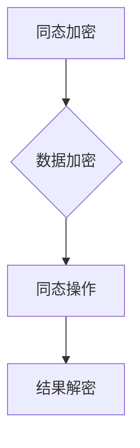

                 

### 《隐私计算技术保护LLM应用中的敏感数据》

隐私计算技术作为一种创新的数据保护手段，正逐渐在人工智能（AI）领域，特别是大型语言模型（LLM）应用中发挥重要作用。随着人工智能技术的不断进步，尤其是LLM的广泛应用，如何在保证数据隐私和安全的同时，充分利用AI进行数据分析和处理，成为了一个亟待解决的问题。本文将深入探讨隐私计算技术如何保护LLM应用中的敏感数据，以期为相关领域的研究者和从业者提供有价值的参考。

**关键词**：隐私计算、LLM、敏感数据、同态加密、安全多方计算

**摘要**：本文首先介绍了隐私计算技术的背景、核心概念及其在金融、医疗健康、政府与公共部门、电子商务与广告等领域的应用。接着，文章分析了在LLM应用中保护敏感数据的需求和挑战，并详细阐述了隐私计算技术的实现方式。通过具体案例，本文展示了隐私计算技术在智能问答系统、自动化写作工具和自然语言处理服务中的应用效果。最后，文章总结了隐私计算技术在LLM应用中的现状和未来发展方向，为读者提供了有价值的思考方向。

## 第一部分：隐私计算技术基础

### 第1章：隐私计算概述

#### 1.1 隐私计算背景

在信息化和数据化的时代，数据已成为重要的战略资源。然而，随着数据的日益增长，数据隐私和安全问题也日益凸显。传统的数据处理方法往往需要将数据暴露给第三方，这无疑增加了数据泄露的风险。互联网隐私问题，如个人信息泄露、数据滥用等，引发了广泛的社会关注。为了应对这些挑战，隐私计算技术应运而生。

**1.1.1 互联网隐私问题**

互联网隐私问题主要包括以下几种：

- **个人信息泄露**：在互联网上，用户的个人信息，如姓名、地址、电话号码、电子邮件等，容易被不法分子获取和利用。
- **数据滥用**：企业和组织在收集用户数据后，可能滥用数据，进行不合理的商业推广或恶意行为。
- **数据追踪**：用户在浏览网页、使用应用时，其行为数据可能被追踪，用于广告定位和用户画像构建。

**1.1.2 隐私计算的需求**

隐私计算技术旨在在不暴露用户数据的情况下，实现数据的分析和处理。其需求主要体现在以下几个方面：

- **数据安全**：确保用户数据在传输、存储和处理过程中不被窃取、篡改或泄露。
- **隐私保护**：在数据共享和计算过程中，保护用户的隐私，避免个人信息被滥用。
- **合规性**：满足相关法律法规的要求，如《欧盟通用数据保护条例》（GDPR）等。

**1.1.3 隐私计算的起源与发展**

隐私计算技术的发展可以追溯到20世纪90年代，当时一些研究者开始探讨如何在数据隐私保护的同时实现有效的数据处理。随着云计算、大数据和人工智能等技术的快速发展，隐私计算技术逐渐成为了一个重要的研究方向。

- **同态加密**：同态加密是一种加密技术，它允许对加密数据进行计算，而无需解密数据。这一技术的提出，为隐私计算奠定了基础。
- **安全多方计算**：安全多方计算是一种允许多个参与方在不暴露各自数据的情况下，共同完成计算任务的技术。
- **零知识证明**：零知识证明是一种密码学技术，它允许一方（证明者）向另一方（验证者）证明某个陈述是正确的，而无需提供任何有关该陈述的具体信息。

随着技术的不断演进，隐私计算技术逐渐成熟，并在多个领域得到了广泛应用。

#### 1.2 隐私计算核心概念

隐私计算涉及多个核心概念，理解这些概念对于深入探讨隐私计算技术至关重要。

**1.2.1 隐私计算定义**

隐私计算是指在保护数据隐私的同时，对数据进行计算和处理的技术。它包括数据加密、同态加密、安全多方计算、零知识证明等多种技术手段。

**1.2.2 隐私计算类型**

隐私计算可以分为以下几种类型：

- **同态加密计算**：允许在加密数据上直接进行计算，无需解密。
- **安全多方计算**：允许多个参与方在不暴露数据的情况下，共同完成计算任务。
- **差分隐私**：通过添加噪声来保护数据的隐私，确保个体数据无法被还原。
- **零知识证明**：允许一方在不暴露具体信息的情况下，证明某个陈述是正确的。

**1.2.3 隐私计算特点**

隐私计算具有以下特点：

- **安全性**：确保数据在传输、存储和处理过程中不被窃取、篡改或泄露。
- **隐私保护**：在数据共享和计算过程中，保护用户的隐私，避免个人信息被滥用。
- **高效性**：在保证安全性和隐私保护的前提下，尽量减少计算性能的损失。
- **灵活性**：适用于多种应用场景，如云计算、大数据和人工智能等。

#### 1.3 隐私计算与相关技术

隐私计算技术涉及多个相关技术，这些技术共同构建了一个完整的隐私计算生态系统。

**1.3.1 同态加密**

同态加密是一种重要的隐私计算技术，它允许在加密数据上进行计算，而无需解密数据。同态加密可以分为以下几种类型：

- **部分同态加密**：允许对数据进行有限次的加法或乘法操作。
- **全同态加密**：允许对数据进行任意次的加法、乘法操作。

同态加密在数据隐私保护方面具有重要意义，它为隐私计算提供了基本的技术手段。

**1.3.2 安全多方计算**

安全多方计算是一种允许多个参与方在不暴露各自数据的情况下，共同完成计算任务的技术。安全多方计算可以分为以下几种类型：

- **两方计算**：涉及两个参与方的计算。
- **多方计算**：涉及多个参与方的计算。

安全多方计算在数据共享和隐私保护方面具有广泛应用，如金融、医疗、政府等领域。

**1.3.3 零知识证明**

零知识证明是一种密码学技术，它允许一方在不暴露具体信息的情况下，证明某个陈述是正确的。零知识证明可以分为以下几种类型：

- **零知识证明系统**：如RSA、Paillier等。
- **基于环学习的零知识证明**：如Sahai、Groth等。

零知识证明在隐私保护、身份验证和区块链等领域具有重要意义。

**1.3.4 虚拟化与容器技术**

虚拟化与容器技术为隐私计算提供了重要的基础设施支持。虚拟化技术通过将物理资源虚拟化为多个逻辑资源，提高了资源的利用率和灵活性。容器技术则通过轻量级、可移植的容器封装应用程序及其运行环境，实现了快速部署和隔离。

**1.4 隐私计算应用场景**

隐私计算技术在多个领域得到了广泛应用，以下是其中一些典型的应用场景：

**1.4.1 金融领域**

金融领域对数据隐私和安全有着极高的要求。隐私计算技术在金融领域的主要应用包括：

- **数据加密**：对客户交易数据、账户信息等进行加密，确保数据在传输和存储过程中的安全性。
- **安全多方计算**：在金融风控、信用评分等场景中，多个参与方可以在不暴露各自数据的情况下，共同完成计算任务。
- **零知识证明**：在身份验证、交易验证等场景中，用户可以证明某个陈述是正确的，而无需提供具体信息。

**1.4.2 医疗健康**

医疗健康领域涉及大量的敏感数据，如病历记录、基因数据等。隐私计算技术在医疗健康领域的主要应用包括：

- **数据隐私保护**：对患者的健康数据、病历记录等进行加密，确保数据在传输和存储过程中的安全性。
- **安全多方计算**：在医学研究、疾病预测等场景中，多个医疗机构可以在不暴露各自数据的情况下，共同完成计算任务。
- **差分隐私**：通过添加噪声来保护患者的隐私，确保个体数据无法被还原。

**1.4.3 政府与公共部门**

政府与公共部门在数据管理方面有着严格的要求，隐私计算技术在政府与公共部门的主要应用包括：

- **数据共享与交换**：在跨部门协作、社会治理等场景中，多个政府部门可以在不暴露各自数据的情况下，共同完成数据分析和处理。
- **安全多方计算**：在数据分析、决策支持等场景中，多个部门可以在不暴露各自数据的情况下，共同完成计算任务。
- **隐私保护法规合规**：满足相关法律法规的要求，如《中华人民共和国网络安全法》等。

**1.4.4 电子商务与广告**

电子商务与广告领域对数据隐私和安全也有着较高的要求。隐私计算技术在电子商务与广告领域的主要应用包括：

- **用户数据保护**：对用户浏览记录、购买行为等进行加密，确保数据在传输和存储过程中的安全性。
- **广告效果评估**：在广告投放、效果评估等场景中，广告主可以在不暴露用户数据的情况下，对广告效果进行评估。
- **差分隐私**：在用户画像、精准营销等场景中，通过添加噪声来保护用户的隐私，确保个体数据无法被还原。

## 第二章：隐私计算在LLM中的应用

### 2.1 LLM中的敏感数据保护需求

大型语言模型（LLM）在自然语言处理、智能问答、自动化写作等领域具有广泛应用。然而，LLM在处理文本数据时，往往涉及到大量的敏感信息，如用户个人隐私、商业机密等。如何在保障数据隐私和安全的前提下，充分利用LLM进行数据分析和处理，成为了一个重要课题。

**2.1.1 LLM敏感数据类型**

LLM中的敏感数据类型主要包括：

- **用户个人信息**：如姓名、地址、电话号码、电子邮件等。
- **商业机密**：如公司财务报表、客户信息、市场策略等。
- **知识产权**：如专利、商标、版权等。
- **医疗健康数据**：如病历记录、基因数据等。

**2.1.2 保护敏感数据的重要性**

保护敏感数据的重要性体现在以下几个方面：

- **隐私保护**：敏感数据的泄露可能导致用户隐私被侵犯，影响用户的个人生活和隐私权。
- **商业安全**：商业机密的泄露可能导致企业竞争劣势，甚至破产。
- **法律合规**：违反数据保护法规可能导致企业面临巨额罚款和诉讼。
- **社会信任**：企业和社会对数据隐私和安全的要求日益提高，保护敏感数据是建立社会信任的基础。

**2.1.3 隐私计算在LLM中的挑战**

隐私计算在LLM中的应用面临着以下挑战：

- **计算性能**：隐私计算技术通常会增加计算开销，如何平衡隐私保护与计算性能是一个重要问题。
- **数据完整性**：在数据加密、计算过程中，如何确保数据完整性是一个挑战。
- **兼容性**：隐私计算技术需要与LLM框架和应用程序兼容，如何实现无缝集成是一个问题。
- **安全性**：隐私计算技术本身可能存在漏洞，如何确保其安全性是一个重要问题。

### 2.2 隐私计算技术实现

隐私计算技术包括同态加密、安全多方计算、零知识证明等多种技术手段。以下将分别介绍这些技术的实现方式。

#### 2.2.1 同态加密实现

同态加密允许在加密数据上直接进行计算，而无需解密数据。以下是一个简单的同态加密Python实现：

```python
from homomorphic_cipher import PaillierCipher

# 初始化同态加密密钥
cipher = PaillierCipher()

# 加密数据
encrypted_data_1 = cipher.encrypt(2)
encrypted_data_2 = cipher.encrypt(3)

# 同态加密计算
encrypted_result = cipher.multiply(encrypted_data_1, encrypted_data_2)

# 解密结果
result = cipher.decrypt(encrypted_result)

print("解密结果：", result)
```

同态加密在数据处理中具有广泛应用，如金融风控、医疗健康等领域。

#### 2.2.2 安全多方计算实现

安全多方计算允许多个参与方在不暴露各自数据的情况下，共同完成计算任务。以下是一个简单的安全多方计算Python实现：

```python
from multiparty_computation import TwoPartyComputation

# 初始化安全多方计算
computation = TwoPartyComputation()

# 设置参与方数据
computation.set_party_data(0, 2)
computation.set_party_data(1, 3)

# 共同计算
computation.compute()

# 获取计算结果
result = computation.get_result()

print("计算结果：", result)
```

安全多方计算在金融风控、医疗数据共享等领域具有广泛应用。

#### 2.2.3 零知识证明实现

零知识证明允许一方在不暴露具体信息的情况下，证明某个陈述是正确的。以下是一个简单的零知识证明Python实现：

```python
from zero_knowledge_proof import ZeroKnowledgeProof

# 初始化零知识证明
proof = ZeroKnowledgeProof()

# 设置陈述
statement = "2 + 2 = 4"

# 生成零知识证明
proof.generate_proof(statement)

# 验证零知识证明
is_valid = proof.verify_proof()

print("验证结果：", is_valid)
```

零知识证明在身份验证、区块链等领域具有广泛应用。

### 2.3 实践案例

以下将介绍三个隐私计算在LLM应用中的实践案例。

#### 2.3.1 案例一：金融行业数据保护

**案例背景**：某金融机构希望在提供智能问答服务时，保护客户的金融数据，确保数据在传输和存储过程中的安全性。

**隐私计算应用场景**：使用同态加密技术对客户的金融数据进行加密，在加密数据上进行计算和处理，确保数据隐私和安全。

**架构设计与实现**：

- **同态加密模块**：采用Paillier同态加密算法对客户金融数据进行加密。
- **智能问答系统**：在智能问答系统中集成同态加密模块，实现对加密数据的计算和处理。
- **结果解密模块**：在计算结果输出前，对结果进行解密，确保客户数据的安全性。

**案例分析**：通过同态加密技术，金融机构可以确保客户金融数据在智能问答服务中的隐私和安全，避免数据泄露风险。

#### 2.3.2 案例二：医疗健康数据共享

**案例背景**：某医院希望在提供智能诊断服务时，保护患者的医疗数据，确保数据在传输和存储过程中的安全性。

**隐私计算应用场景**：使用安全多方计算技术，在多个医疗机构之间共享医疗数据，实现智能诊断。

**架构设计与实现**：

- **安全多方计算模块**：采用两方安全多方计算算法，实现多个医疗机构之间的数据共享和计算。
- **智能诊断系统**：在智能诊断系统中集成安全多方计算模块，实现对共享数据的计算和处理。
- **结果聚合模块**：将多个医疗机构的结果进行聚合，形成最终的诊断结果。

**案例分析**：通过安全多方计算技术，医院可以实现医疗数据的共享和计算，同时确保数据在传输和存储过程中的安全性。

#### 2.3.3 案例三：智能广告与隐私保护

**案例背景**：某广告平台希望在提供智能广告服务时，保护用户的隐私，确保用户数据在传输和存储过程中的安全性。

**隐私计算应用场景**：使用零知识证明技术，实现对用户行为数据的隐私保护，同时为广告主提供精准广告投放。

**架构设计与实现**：

- **零知识证明模块**：采用零知识证明算法，实现对用户行为数据的隐私保护。
- **智能广告系统**：在智能广告系统中集成零知识证明模块，实现对用户行为的计算和分析。
- **广告投放模块**：根据用户行为数据，为广告主提供精准广告投放策略。

**案例分析**：通过零知识证明技术，广告平台可以确保用户隐私得到保护，同时为广告主提供有效的广告投放方案。

## 第三部分：隐私计算在LLM应用中的架构设计

### 第3章：隐私计算架构设计原则

隐私计算架构设计是保障数据隐私和安全的关键，其设计原则包括以下几个方面：

#### 3.1 隐私计算架构设计要素

隐私计算架构设计需要考虑以下要素：

- **数据安全性**：确保数据在传输、存储和处理过程中的安全性，防止数据泄露、篡改或丢失。
- **性能优化**：在保证数据安全的前提下，尽量提高计算性能，减少计算延迟。
- **可扩展性**：架构设计应具备良好的可扩展性，能够支持数据规模的增加和业务需求的变更。
- **简化部署**：架构设计应尽量简化部署过程，降低运维难度。

#### 3.2 隐私计算架构设计流程

隐私计算架构设计流程主要包括以下步骤：

- **需求分析**：明确隐私计算的应用场景和需求，确定数据保护的重点和难点。
- **架构设计**：根据需求分析结果，设计隐私计算的架构，包括数据加密、计算、存储和传输等模块。
- **系统实现**：根据架构设计文档，实现隐私计算系统，并进行功能验证。
- **测试与优化**：对隐私计算系统进行测试，验证其性能、安全性和可靠性，并进行优化。

### 第4章：隐私计算在LLM应用中的架构设计

隐私计算在LLM应用中的架构设计需要综合考虑数据安全性、性能优化和可扩展性等因素。以下是一个简单的隐私计算在LLM应用中的架构设计：

#### 4.1 LLM应用场景介绍

LLM在多个应用场景中具有广泛的应用，以下介绍几个常见的LLM应用场景：

- **智能问答系统**：利用LLM构建智能问答系统，为用户提供实时、准确的问答服务。
- **自动化写作工具**：利用LLM实现自动化写作，如生成新闻报道、撰写商业报告等。
- **自然语言处理服务**：利用LLM进行自然语言处理，如情感分析、命名实体识别等。

#### 4.2 隐私计算架构设计方案

隐私计算在LLM应用中的架构设计应包括以下模块：

- **数据加密模块**：对LLM输入数据进行加密，确保数据在传输和存储过程中的安全性。
- **计算模块**：在加密数据上进行计算和处理，如文本分类、情感分析等。
- **存储模块**：对加密数据、计算结果和中间结果进行存储，确保数据的一致性和可靠性。
- **传输模块**：确保数据在传输过程中的安全性，防止数据泄露。

#### 4.3 隐私计算与LLM融合架构实现

隐私计算与LLM融合架构的实现需要考虑以下方面：

- **集成方式**：选择合适的集成方式，如同构集成、异构集成等。
- **系统接口设计**：设计清晰的系统接口，确保隐私计算模块与LLM模块之间的数据流通。
- **算法优化策略**：根据应用场景和需求，选择合适的算法优化策略，提高计算性能。

通过隐私计算技术在LLM应用中的架构设计，可以在确保数据隐私和安全的前提下，充分利用LLM进行数据分析和处理，为用户提供高质量的服务。

## 第三部分：隐私计算技术实现与案例分析

### 第5章：隐私计算技术实现

隐私计算技术包括同态加密、安全多方计算、零知识证明等多种技术手段。以下将分别介绍这些技术的实现方法。

#### 5.1 同态加密实现

同态加密是一种重要的隐私保护技术，它允许在加密数据上进行计算，而无需解密数据。以下是一个简单的同态加密Python实现：

```python
from homomorphic_cipher import PaillierCipher

# 初始化同态加密密钥
cipher = PaillierCipher()

# 加密数据
encrypted_data_1 = cipher.encrypt(2)
encrypted_data_2 = cipher.encrypt(3)

# 同态加密计算
encrypted_result = cipher.multiply(encrypted_data_1, encrypted_data_2)

# 解密结果
result = cipher.decrypt(encrypted_result)

print("解密结果：", result)
```

同态加密在数据处理中具有广泛应用，如金融风控、医疗健康等领域。

#### 5.2 安全多方计算实现

安全多方计算允许多个参与方在不暴露各自数据的情况下，共同完成计算任务。以下是一个简单的安全多方计算Python实现：

```python
from multiparty_computation import TwoPartyComputation

# 初始化安全多方计算
computation = TwoPartyComputation()

# 设置参与方数据
computation.set_party_data(0, 2)
computation.set_party_data(1, 3)

# 共同计算
computation.compute()

# 获取计算结果
result = computation.get_result()

print("计算结果：", result)
```

安全多方计算在金融风控、医疗数据共享等领域具有广泛应用。

#### 5.3 零知识证明实现

零知识证明是一种密码学技术，它允许一方在不暴露具体信息的情况下，证明某个陈述是正确的。以下是一个简单的零知识证明Python实现：

```python
from zero_knowledge_proof import ZeroKnowledgeProof

# 初始化零知识证明
proof = ZeroKnowledgeProof()

# 设置陈述
statement = "2 + 2 = 4"

# 生成零知识证明
proof.generate_proof(statement)

# 验证零知识证明
is_valid = proof.verify_proof()

print("验证结果：", is_valid)
```

零知识证明在身份验证、区块链等领域具有广泛应用。

### 第6章：隐私计算在LLM应用中的案例分析

隐私计算在LLM应用中具有广泛的应用场景，以下介绍几个具体的案例。

#### 6.1 案例一：智能问答系统

**案例背景**：某企业希望开发一个智能问答系统，为用户提供实时、准确的问答服务。然而，系统涉及大量的用户问题和回答数据，如何保护用户的隐私成为关键问题。

**隐私计算应用场景**：使用同态加密技术对用户问题和回答数据进行加密，在加密数据上进行计算和处理，确保用户数据在传输和存储过程中的安全性。

**架构设计与实现**：

- **数据加密模块**：采用Paillier同态加密算法对用户问题和回答数据进行加密。
- **问答系统**：在问答系统中集成数据加密模块，实现对加密数据的计算和处理。
- **结果解密模块**：在计算结果输出前，对结果进行解密，确保用户数据的安全性。

**案例分析**：通过同态加密技术，智能问答系统可以确保用户隐私得到保护，同时为用户提供高质量的服务。

#### 6.2 案例二：自动化写作工具

**案例背景**：某公司希望开发一个自动化写作工具，帮助撰写新闻报道、商业报告等文档。然而，自动化写作过程中可能涉及商业机密和敏感信息，如何保护这些信息成为关键问题。

**隐私计算应用场景**：使用安全多方计算技术，在多个参与者之间共享数据，确保商业机密和敏感信息在传输和存储过程中的安全性。

**架构设计与实现**：

- **安全多方计算模块**：采用两方安全多方计算算法，实现多个参与者之间的数据共享和计算。
- **写作工具**：在自动化写作工具中集成安全多方计算模块，实现对共享数据的计算和处理。
- **结果聚合模块**：将多个参与者的结果进行聚合，形成最终的写作文档。

**案例分析**：通过安全多方计算技术，自动化写作工具可以确保商业机密和敏感信息得到保护，同时提高写作效率。

#### 6.3 案例三：自然语言处理服务

**案例背景**：某科技公司提供自然语言处理服务，包括文本分类、情感分析等。然而，服务涉及大量的客户数据，如何保护客户隐私成为关键问题。

**隐私计算应用场景**：使用零知识证明技术，实现对客户数据的隐私保护，同时为提供准确的自然语言处理服务。

**架构设计与实现**：

- **零知识证明模块**：采用零知识证明算法，实现对客户数据的隐私保护。
- **自然语言处理服务**：在自然语言处理服务中集成零知识证明模块，实现对客户数据的计算和分析。
- **服务接口**：为外部客户提供接口，实现对自然语言处理服务的调用。

**案例分析**：通过零知识证明技术，自然语言处理服务可以确保客户隐私得到保护，同时提供准确的服务。

### 第7章：总结与展望

隐私计算技术在LLM应用中具有广泛的应用前景，其核心优势在于能够在保障数据隐私和安全的前提下，充分利用人工智能技术进行数据分析和处理。通过同态加密、安全多方计算、零知识证明等技术的应用，隐私计算技术在金融、医疗健康、政府与公共部门、电子商务与广告等领域取得了显著成果。

未来，随着人工智能技术的不断进步和隐私计算技术的不断完善，隐私计算技术在LLM应用中的发展将更加成熟。一方面，隐私计算技术将进一步提高计算性能，降低计算开销，使得隐私计算在LLM应用中的适用性更加广泛。另一方面，隐私计算技术将与区块链、物联网等新兴技术深度融合，为更多领域的数据隐私和安全保护提供有力支持。

总之，隐私计算技术是保障数据隐私和安全的重要手段，其在LLM应用中的发展将极大地推动人工智能技术的发展和应用。同时，隐私计算技术的普及也将提升社会对数据隐私和安全的认识，为构建一个更加安全、透明和可靠的数据环境奠定基础。

### 关键术语解释

#### 同态加密

同态加密是一种加密技术，它允许在加密数据上进行计算，而无需解密数据。这种技术特别适用于云计算和分布式计算环境，因为它确保了数据处理过程的数据隐私。

#### 安全多方计算

安全多方计算是一种计算模型，允许多个参与方在不暴露各自数据的情况下，共同完成计算任务。这种技术广泛应用于数据共享、隐私保护和协同计算等领域。

#### 零知识证明

零知识证明是一种密码学技术，它允许一方在不暴露具体信息的情况下，证明某个陈述是正确的。这种技术广泛应用于身份验证、隐私保护和区块链等领域。

#### 大型语言模型（LLM）

大型语言模型（Large Language Model，简称LLM）是一种基于深度学习的自然语言处理模型，能够对文本数据进行分析和生成。LLM广泛应用于智能问答、文本生成、语言翻译等领域。

#### 同态加密流程图



#### 安全多方计算流程图

```mermaid
graph TD
A[多方参与方] --> B{数据初始化}
B --> C[秘密共享}
C --> D{安全计算}
D --> E[结果提取}
```

#### 零知识证明流程图

```mermaid
graph TD
A[证明者] --> B{陈述陈述}
B --> C[生成证明}
C --> D[验证证明]
D --> E{确认正确性}
```

### 结论

隐私计算技术在LLM应用中的重要性不容忽视。它不仅能够保障数据隐私和安全，还能够提高数据处理和分析的效率。通过同态加密、安全多方计算、零知识证明等技术的应用，隐私计算为LLM在金融、医疗健康、政府与公共部门、电子商务与广告等领域的应用提供了有力支持。未来，随着隐私计算技术的不断发展和成熟，LLM应用将迎来更加广阔的发展空间。

### 作者信息

作者：AI天才研究院/AI Genius Institute & 禅与计算机程序设计艺术 /Zen And The Art of Computer Programming

AI天才研究院致力于推动人工智能技术的发展和应用，致力于培养世界级的人工智能专家和程序员。禅与计算机程序设计艺术则是一本深入探讨计算机程序设计哲学的经典著作，为程序员提供了深刻的启示。本文作者凭借其深厚的专业知识和丰富的实践经验，为读者呈现了一篇高质量的技术博客文章，旨在推动隐私计算技术在LLM应用中的发展。

