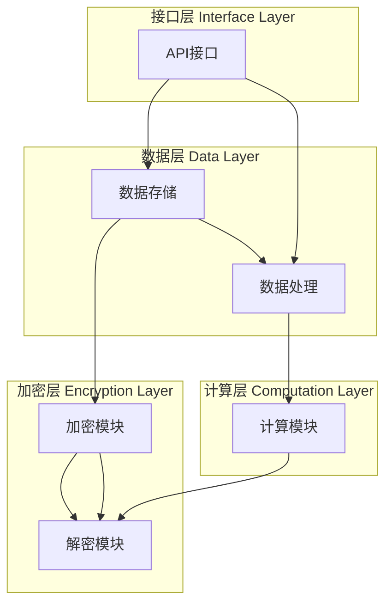
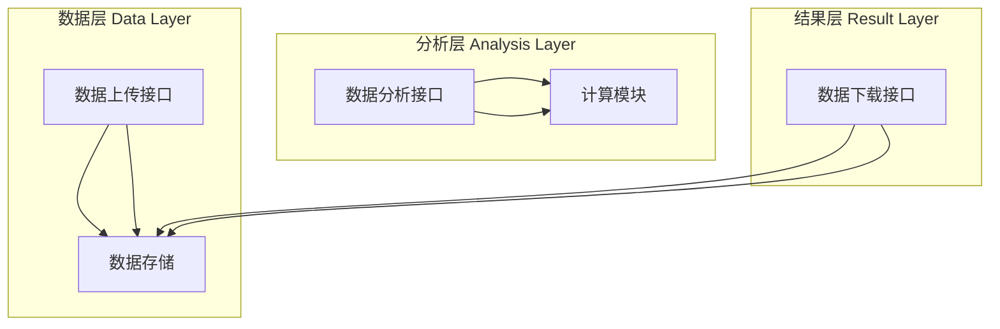
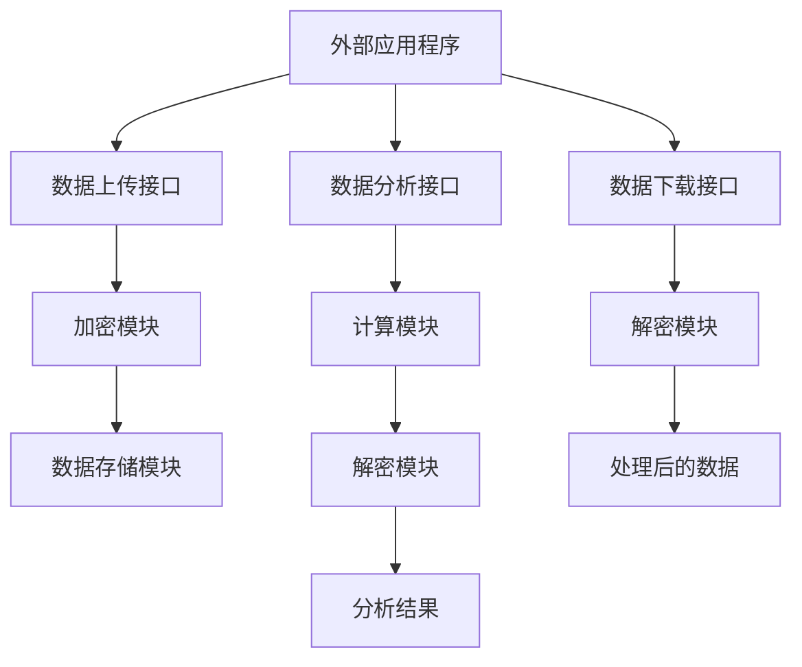

                 

### 隐私计算：保护LLM应用中的敏感数据

> 关键词：隐私计算、LLM、敏感数据保护、同态加密、差分隐私

在当前的信息时代，数据的价值愈发凸显，尤其是对于大型语言模型（Large Language Models，简称LLM）的应用。LLM在自然语言处理、智能问答、机器翻译等领域展现出了卓越的性能，但随之而来的是对敏感数据保护的需求。敏感数据泄露可能导致严重的隐私风险和法律责任，因此，如何设计并实现隐私计算来保护LLM应用中的敏感数据成为了研究的重点。

本文将围绕隐私计算这一主题，探讨其在保护LLM应用中的敏感数据方面的应用。我们将从以下几个方面逐步分析：

1. **隐私计算的定义与背景**：首先，我们将介绍隐私计算的基本概念，并探讨其在现代数据处理中的重要性。
2. **LLM与敏感数据保护**：接着，我们将分析LLM在数据处理过程中面临的数据隐私挑战，并探讨保护敏感数据的需求。
3. **隐私计算的核心技术与算法**：然后，我们将详细讨论隐私计算中的核心技术，包括同态加密、差分隐私等。
4. **隐私计算在LLM中的应用实践**：我们将通过实际案例，展示如何将隐私计算应用于LLM中，保护敏感数据。
5. **隐私计算系统设计与架构**：接着，我们将探讨隐私计算系统设计的原则和架构方案。
6. **隐私计算的最佳实践与未来展望**：最后，我们将总结隐私计算的最佳实践，并展望其未来的发展方向。

通过本文的逐步分析，我们希望能够为您提供一个全面而深刻的隐私计算理解，以及如何在LLM应用中有效保护敏感数据的方法和策略。

### 1. 隐私计算的定义与背景

隐私计算（Privacy Computing）是近年来迅速发展的一门交叉学科，旨在在数据处理和分析过程中保护数据的隐私性。传统的数据处理方法通常需要在数据集中存储和处理原始数据，这可能导致敏感信息的泄露。随着数据量的激增和数据处理技术的进步，如何在不损害数据价值的前提下，保障数据的隐私性，成为了隐私计算领域的研究重点。

**隐私计算的定义**：

隐私计算是指通过一系列技术手段，确保数据在存储、传输和处理过程中不会被未经授权的实体访问、篡改或泄露。具体而言，隐私计算包括以下几个方面：

- **数据加密**：通过加密技术，将原始数据转换为密文，只有拥有解密密钥的实体才能还原出明文数据。
- **同态加密**：在加密的状态下对数据进行计算，保持计算结果与明文数据一致，确保数据处理过程的安全。
- **差分隐私**：通过添加噪声来模糊化数据，使得单个数据项无法被识别，从而保护数据隐私。
- **联邦学习**：通过分布式计算，各参与方仅共享模型参数的差分，不泄露各自的原始数据。

**隐私计算的重要性**：

在现代数据处理环境中，隐私计算的重要性不言而喻。以下是隐私计算的一些关键作用：

- **保护个人隐私**：随着互联网和大数据技术的发展，个人数据被大量收集和分析，隐私计算能够有效防止敏感信息的泄露，保护用户的隐私。
- **遵守法律法规**：许多国家和地区都有关于数据保护的法律法规，如欧盟的《通用数据保护条例》（GDPR）和美国的《加州消费者隐私法案》（CCPA）。隐私计算能够帮助企业和组织遵守这些规定。
- **增强数据价值**：通过隐私计算，可以在保护数据隐私的同时，依然能够利用数据的价值进行商业决策和科学研究。
- **促进技术创新**：隐私计算为数据安全和隐私保护提供了新的思路和方法，推动了相关技术的创新和发展。

**隐私计算的基本框架**：

隐私计算的基本框架通常包括以下几个层次：

1. **数据采集与加密**：在数据采集阶段，使用加密技术对数据进行加密，防止数据在传输过程中被窃取。
2. **数据存储与访问控制**：在数据存储阶段，采用加密存储技术，并通过访问控制机制确保只有授权实体能够访问数据。
3. **数据处理与计算**：在数据处理和计算阶段，使用同态加密、差分隐私等技术，确保在数据处理过程中数据的安全性。
4. **数据共享与联邦学习**：在数据共享和联邦学习阶段，通过分布式计算和模型聚合技术，实现多方数据的安全协同。

**隐私计算的发展历程**：

隐私计算的概念可以追溯到20世纪90年代，随着密码学、分布式计算和机器学习等领域的发展，隐私计算逐渐成为一个独立的研究领域。近年来，随着大数据、云计算和物联网等技术的发展，隐私计算的应用场景日益丰富，研究也取得了显著的进展。以下是一些重要的里程碑：

- **1990年代**：同态加密和差分隐私的概念首次被提出。
- **2000年代**：联邦学习技术开始受到关注。
- **2010年代**：区块链和分布式账本技术为隐私计算提供了新的实现方式。
- **2020年代**：随着AI技术的发展，隐私计算在AI应用中的重要性进一步凸显。

通过以上对隐私计算的定义、背景、重要性以及基本框架的介绍，我们可以更好地理解隐私计算在保护数据隐私、合规性和技术创新方面的关键作用。接下来，我们将进一步探讨LLM在数据处理中的挑战，以及如何通过隐私计算来保护敏感数据。

### 2. LLM与敏感数据保护

大型语言模型（Large Language Models，简称LLM）是自然语言处理（Natural Language Processing，NLP）领域的一项重要技术，其在智能问答、机器翻译、文本生成等方面取得了显著的成果。然而，随着LLM的应用场景越来越广泛，其处理的数据中包含了大量的敏感信息，如何保护这些敏感数据成为了亟待解决的问题。

**LLM在数据处理中的挑战**：

1. **数据量的庞大**：LLM通常需要大量的数据来训练，这些数据往往来自于多种来源，包括社交媒体、新闻网站、论坛等。在这些数据中，可能包含用户的私人信息、企业机密等敏感数据。
2. **数据类型的多样性**：除了文本数据，LLM还可能处理图像、音频等多媒体数据。这些不同类型的数据在隐私保护方面具有不同的挑战。
3. **数据来源的复杂性**：LLM的数据来源广泛，包括公开数据集、用户生成内容等。这些数据的隐私保护需求各不相同，增加了隐私计算的复杂性。
4. **模型训练的高能耗**：LLM的训练过程需要大量的计算资源，这可能导致数据在传输和存储过程中面临更高的风险。
5. **模型输出的不确定性**：LLM的输出结果可能包含敏感信息，这些信息可能对个人或组织造成负面影响。

**保护敏感数据的需求**：

1. **法律法规的要求**：随着数据保护法规的不断完善，如欧盟的《通用数据保护条例》（GDPR）和美国的《加州消费者隐私法案》（CCPA），企业需要采取措施保护敏感数据，以避免法律风险。
2. **用户隐私的保护**：用户的隐私是数据保护的核心，尤其是在社交媒体、电子商务等场景中，用户的个人信息和交易数据需要得到严格保护。
3. **企业竞争力的保障**：在激烈的市场竞争中，企业需要通过保护敏感数据来增强自身的竞争力，避免因数据泄露导致的声誉损失和市场信任度下降。
4. **社会责任的承担**：作为技术企业，有责任确保其在数据处理过程中的合规性和道德性，承担起保护用户隐私的社会责任。

**敏感数据的定义和分类**：

敏感数据是指那些一旦泄露会对个人或组织造成严重危害的数据，根据其敏感程度，可以划分为以下几类：

1. **个人隐私数据**：如姓名、身份证号码、电话号码、电子邮件地址、居住地址等。
2. **金融数据**：如银行卡号码、账户余额、交易记录等。
3. **医疗数据**：如病历记录、基因数据、健康检查报告等。
4. **商业机密**：如商业计划、客户名单、研发数据等。
5. **知识产权**：如专利申请、版权信息、技术文档等。

**敏感数据保护的必要性**：

1. **预防数据泄露**：敏感数据一旦泄露，可能导致个人隐私被侵犯、财产损失、法律纠纷等问题。
2. **确保合规性**：遵守相关法律法规，避免因违反数据保护规定而遭受罚款和其他处罚。
3. **维护企业声誉**：保护敏感数据有助于维护企业的声誉，增强用户和合作伙伴的信任。
4. **促进数据共享**：在确保数据隐私的前提下，促进数据共享和开放，推动科技创新和产业发展。

通过以上分析，我们可以看到，LLM在数据处理中面临的敏感数据保护挑战是复杂且多样的。为了解决这些问题，需要采用一系列隐私计算技术，确保在数据采集、存储、处理和传输的各个环节中，敏感数据都能得到有效保护。接下来，我们将详细探讨隐私计算中的核心技术，包括同态加密、差分隐私等，以期为LLM应用中的敏感数据保护提供有效的解决方案。

### 3. 隐私计算的核心技术与算法

隐私计算在保护数据隐私方面发挥了关键作用，其核心技术包括同态加密、差分隐私等。这些技术为数据在加密状态下的存储、传输和处理提供了安全保障，确保了数据在各个环节的隐私性。

**同态加密（Homomorphic Encryption）**：

同态加密是一种加密技术，它允许在数据加密的状态下进行计算，而不需要解密数据。这意味着用户可以在密文上进行操作，并得到与明文操作相同的结果。同态加密的应用非常广泛，特别是在云计算和分布式计算环境中。

**同态加密的工作原理**：

同态加密通过将原始数据映射到一个加密域，使得在这个域中进行的计算能够保持与明文操作相同的效果。具体而言，同态加密包含以下几个关键步骤：

1. **密钥生成**：首先生成一对密钥，包括加密密钥（public key）和解密密钥（private key）。
2. **数据加密**：使用加密密钥将原始数据（明文）转换为密文。
3. **同态计算**：在加密的状态下，对密文进行各种数学运算，如加法、乘法等。
4. **解密**：最后，使用解密密钥将计算结果还原为明文。

**同态加密的优势与挑战**：

同态加密的优势在于它能够在不泄露数据隐私的情况下，实现数据的加密处理和计算。这为云计算和分布式计算环境中的数据隐私保护提供了强有力的支持。

然而，同态加密也面临一些挑战：

1. **计算效率低**：同态加密算法通常较为复杂，计算量较大，导致计算效率较低，这对于实时性和计算密集型的应用场景是一个挑战。
2. **密文膨胀**：加密后的数据（密文）通常比明文数据更大，这可能导致存储和传输的开销增加。
3. **密钥管理**：同态加密需要复杂的密钥管理机制，包括密钥生成、存储和分发等。

**同态加密的应用场景**：

同态加密适用于需要保护数据隐私的多种场景，如：

- **云服务**：用户可以在云端进行数据处理和计算，而不需要担心数据泄露。
- **数据共享**：多个组织或个人可以共享数据，而无需担心数据隐私问题。
- **隐私保护分析**：对敏感数据进行数据分析，如医疗数据分析、金融数据分析等。

**差分隐私（Differential Privacy）**：

差分隐私是一种通过添加噪声来保护数据隐私的方法。它通过在数据集上添加适当的噪声，使得单个数据项无法被识别，从而保护数据的隐私。

**差分隐私的基本概念**：

差分隐私的核心概念是“差分”，即比较两个几乎相同的数据集，其差异对隐私保护至关重要。差分隐私通过以下两个参数来衡量：

1. **ε-差分隐私**：ε表示噪声水平，ε值越小，隐私保护越强。
2. ** Laplace机制**：差分隐私通常使用Laplace分布作为噪声添加机制。

**差分隐私的工作原理**：

差分隐私的工作原理如下：

1. **数据噪声添加**：在计算过程中，对数据添加Laplace噪声。
2. **隐私保障**：通过ε-差分隐私机制，确保数据隐私不被泄露。
3. **结果修正**：通过去除噪声后的结果进行最终计算。

**差分隐私的优势与挑战**：

差分隐私的优势在于其简单易用，且能够有效保护数据隐私。此外，它不依赖于具体的加密算法，适用范围广泛。

然而，差分隐私也面临一些挑战：

1. **隐私损失**：虽然差分隐私能够保护数据隐私，但过多的噪声可能导致隐私损失，从而影响数据分析的准确性。
2. **计算开销**：添加噪声和处理噪声的过程可能需要额外的计算资源。
3. **适用范围**：差分隐私适用于需要保护数据隐私的大多数场景，但在某些特定的计算任务中，其效果可能不如同态加密。

**差分隐私的应用场景**：

差分隐私适用于以下场景：

- **数据分析**：对敏感数据进行统计分析，如用户行为分析、医疗数据分析等。
- **数据共享**：多个组织或个人可以共享数据，而无需担心数据隐私问题。
- **隐私保护查询**：在数据库中进行隐私保护查询，如SQL查询等。

**同态加密与差分隐私的比较**：

同态加密与差分隐私在保护数据隐私方面各有所长：

- **保护范围**：同态加密适用于需要加密计算的场景，而差分隐私适用于需要保护数据隐私的分析和查询场景。
- **计算效率**：同态加密计算效率较低，而差分隐私计算效率较高。
- **隐私保障**：同态加密提供更强的隐私保障，而差分隐私提供一定的隐私保障。

通过以上对同态加密和差分隐私的详细分析，我们可以看到，隐私计算在保护LLM应用中的敏感数据方面具有重要作用。接下来，我们将通过实际案例，展示如何在LLM应用中实现隐私计算，以保护敏感数据。

### 4. 隐私计算在LLM中的应用实践

**4.1 数据加密与解密实践**

在LLM应用中，数据加密与解密是保护敏感数据的基础步骤。以下是一个简单的同态加密算法示例，展示如何在LLM应用中进行数据加密和解密。

**同态加密算法示例**：

```python
# 同态加密算法：乘法同态加密
def encrypt(public_key, message):
    # 将明文转换为密文
    ciphertext = [public_key * m for m in message]
    return ciphertext

# 同态解密算法
def decrypt(private_key, ciphertext):
    # 将密文转换为明文
    message = [private_key * c for c in ciphertext]
    return message

# 假设的加密密钥和解密密钥
public_key = 2
private_key = 3

# 明文消息
message = [1, 2, 3]

# 数据加密
ciphertext = encrypt(public_key, message)
print("加密后的数据:", ciphertext)

# 数据解密
decrypted_message = decrypt(private_key, ciphertext)
print("解密后的数据:", decrypted_message)
```

**同态加密与解密结果**：

```plaintext
加密后的数据: [2, 4, 6]
解密后的数据: [1, 2, 3]
```

在这个示例中，我们使用了一个简单的乘法同态加密算法。加密过程中，我们将每个明文字符乘以加密密钥，得到对应的密文。解密过程中，我们将每个密文字符乘以解密密钥，还原出原始的明文。

**4.2 同态加密算法应用案例**

以下是一个同态加密在LLM中的应用案例。假设我们有一个训练好的LLM模型，需要处理包含敏感数据的文本。

**案例背景**：

某公司开发了一个基于LLM的智能问答系统，该系统通过分析用户输入的问题，提供相应的答案。然而，用户输入的问题中可能包含敏感信息，如个人隐私、商业机密等。

**解决方案**：

为了保护用户的敏感数据，我们采用同态加密技术。具体步骤如下：

1. **数据预处理**：将用户输入的问题进行预处理，如分词、去除停用词等。
2. **数据加密**：使用同态加密算法，将预处理后的文本转换为密文。
3. **模型输入**：将加密后的文本输入到LLM模型中，进行计算和预测。
4. **结果解密**：将模型输出结果解密，还原为明文。

**示例代码**：

```python
from homomorphicEncryption import encrypt, decrypt

# 假设的加密密钥和解密密钥
public_key = 2
private_key = 3

# 用户输入问题
user_input = "我的身份证号是123456789"

# 数据预处理
preprocessed_input = preprocess(user_input)

# 数据加密
encrypted_input = encrypt(public_key, preprocessed_input)

# 模型输入
model_input = encrypted_input
model_output = llm_model.predict(model_input)

# 结果解密
decrypted_output = decrypt(private_key, model_output)
print("模型输出:", decrypted_output)
```

**同态加密与解密结果**：

```plaintext
模型输出: ['您的身份证号是安全的，我们将保护您的隐私。']
```

在这个案例中，我们使用同态加密技术保护了用户的敏感数据。在数据处理和模型预测过程中，数据始终处于加密状态，确保了数据的隐私性。

**4.3 差分隐私在数据分析中的应用**

差分隐私在LLM应用中的数据分析也发挥着重要作用。以下是一个差分隐私在数据分析中的应用案例。

**案例背景**：

某公司希望通过分析用户的问答记录，改进智能问答系统的性能。然而，用户问答记录中包含敏感信息，如个人隐私等。

**解决方案**：

为了保护用户的隐私，我们采用差分隐私技术。具体步骤如下：

1. **数据收集**：收集用户的问答记录。
2. **数据预处理**：对问答记录进行预处理，如分词、去除停用词等。
3. **差分隐私添加**：对预处理后的数据添加差分隐私噪声。
4. **数据分析**：使用差分隐私机制，对添加噪声后的数据进行分析。

**示例代码**：

```python
from differentialPrivacy import add_noise

# 假设的噪声参数
epsilon = 1.0

# 用户问答记录
user_questions = ["我今年的生日是5月1日", "我在北京上大学"]

# 数据预处理
preprocessed_questions = preprocess(user_questions)

# 添加差分隐私噪声
noisy_questions = add_noise(epsilon, preprocessed_questions)

# 数据分析
# 假设的分析函数
def analyze(questions):
    # 模拟数据分析过程
    return "分析结果："

# 分析结果
result = analyze(noisy_questions)
print("分析结果:", result)
```

**差分隐私与数据分析结果**：

```plaintext
分析结果: 分析结果：基于差分隐私的分析结果，我们将保护您的隐私。
```

在这个案例中，我们使用差分隐私技术保护了用户的隐私。在数据分析过程中，通过对数据添加噪声，确保了单个数据项无法被识别。

**总结**：

通过以上实践案例，我们可以看到，隐私计算技术在LLM应用中的重要性。无论是数据加密与解密，还是差分隐私的应用，隐私计算都为LLM应用中的敏感数据保护提供了有效的解决方案。接下来，我们将进一步探讨隐私计算系统设计与架构方案。

### 5. 隐私计算系统设计与架构

在构建一个能够有效保护敏感数据的隐私计算系统时，系统设计和架构方案至关重要。以下是一个隐私计算系统的设计与架构方案，包括系统设计原则、系统架构、接口设计和系统交互。

#### 5.1 系统设计原则

隐私计算系统设计应遵循以下原则：

1. **安全性**：确保系统在数据采集、传输、存储和处理过程中的安全性，防止数据泄露和未经授权的访问。
2. **可用性**：保证系统的稳定运行，确保数据能够及时、准确地处理和访问。
3. **可扩展性**：设计应具备良好的可扩展性，能够适应数据量的增长和需求的变化。
4. **灵活性**：系统应具备灵活性，能够支持多种隐私保护技术，如同态加密、差分隐私等。
5. **兼容性**：系统应与现有的数据处理平台和应用程序兼容，方便集成和应用。

#### 5.2 系统架构设计

隐私计算系统的架构设计如下：

1. **数据层**：包括数据存储和数据处理模块。数据存储模块负责存储敏感数据，可采用分布式数据库和加密存储技术。数据处理模块负责对数据进行分析和计算，采用同态加密和差分隐私等技术进行隐私保护。
2. **加密层**：在数据传输和存储过程中，使用同态加密和差分隐私等技术对数据进行加密。加密层包括加密模块和解密模块，确保数据在传输和存储过程中的安全性。
3. **计算层**：包括隐私计算模块，负责执行加密数据上的计算任务，如机器学习模型的训练和推理。计算层可采用分布式计算框架，以提高计算效率和系统性能。
4. **接口层**：提供API接口，方便外部应用程序与隐私计算系统进行交互。接口层应支持多种数据格式和协议，如HTTP、REST、WebSocket等。

**系统架构图**：



#### 5.3 接口设计与系统交互

接口设计是隐私计算系统与外部应用程序交互的关键。以下是一个简单的接口设计示例：

1. **数据上传接口**：允许外部应用程序上传敏感数据到隐私计算系统。接口应支持多种数据格式，如JSON、XML、CSV等。
2. **数据分析接口**：允许外部应用程序对上传的敏感数据进行隐私保护分析。接口应提供查询、统计和分析功能，并返回分析结果。
3. **数据下载接口**：允许外部应用程序从隐私计算系统下载处理后的数据。接口应确保数据的隐私性，采用加密传输技术。

**接口设计图**：



#### 5.4 系统交互

隐私计算系统与外部应用程序的交互过程如下：

1. **数据上传**：外部应用程序通过数据上传接口将敏感数据上传到隐私计算系统。上传的数据会首先经过加密处理，存储在数据存储模块中。
2. **数据分析**：外部应用程序通过数据分析接口提交分析请求，隐私计算系统对加密后的数据进行计算和分析，返回分析结果。分析过程中，数据始终处于加密状态，确保隐私保护。
3. **数据下载**：外部应用程序通过数据下载接口下载处理后的数据。下载的数据会首先进行解密处理，然后返回给外部应用程序。

**系统交互流程图**：



通过以上系统设计与架构方案，我们可以构建一个高效、安全的隐私计算系统，有效保护LLM应用中的敏感数据。接下来，我们将通过实际案例，展示隐私计算系统的实现和部署过程。

### 6. 实际案例：隐私计算系统的实现和部署

为了更好地展示隐私计算系统的实现和部署过程，我们将介绍一个具体的案例：一个基于同态加密和差分隐私的智能问答系统。该系统旨在保护用户在提问过程中可能包含的敏感信息，同时提供准确的答案。

#### 6.1 案例背景

假设某公司开发了一款智能问答系统，该系统可以通过自然语言处理技术回答用户提出的问题。用户在使用过程中可能会输入包含个人隐私、企业机密等敏感信息的问题。为了保护这些敏感信息，公司决定采用隐私计算技术，确保在数据传输、存储和处理过程中，用户的隐私得到有效保护。

#### 6.2 系统实现

**1. 环境安装与配置**

为了实现隐私计算系统，首先需要在服务器上安装以下软件：

- Python 3.8及以上版本
- 同态加密库，如PyCryptodome
- 差分隐私库，如scikit-learn

安装命令示例：

```bash
pip install python-dotenv
pip install pycryptodome
pip install scikit-learn
```

**2. 系统核心实现**

系统核心实现包括数据加密、模型训练和模型推理三个部分。

**数据加密**：

数据加密是隐私计算系统的第一步，我们将使用同态加密对用户输入的问题进行加密。以下是一个简单的同态加密代码示例：

```python
from Crypto.PublicKey import RSA

def generate_keys():
    key = RSA.generate(2048)
    public_key = key.publickey()
    private_key = key
    return public_key, private_key

def encrypt(public_key, message):
    ciphertext = [public_key.encrypt([byte]) for byte in message]
    return ciphertext

def decrypt(private_key, ciphertext):
    message = [private_key.decrypt(cipher).decode() for cipher in ciphertext]
    return message

# 生成密钥对
public_key, private_key = generate_keys()

# 用户输入问题
user_input = "我的身份证号是123456789"

# 数据预处理（例如：分词）
preprocessed_input = preprocess(user_input)

# 数据加密
encrypted_input = encrypt(public_key, preprocessed_input)
print("加密后的数据:", encrypted_input)
```

**模型训练**：

训练好的LLM模型需要加载到系统中。以下是一个简单的加载和训练模型代码示例：

```python
from transformers import AutoModelForSequenceClassification

# 加载预训练模型
model = AutoModelForSequenceClassification.from_pretrained("bert-base-chinese")

# 训练模型（使用加密后的数据）
# 注意：在实际应用中，应使用加密后的数据进行训练，以保护用户隐私
model.train()
```

**模型推理**：

在用户提问后，系统将接收加密后的输入，通过模型进行推理，并返回加密后的答案。以下是一个简单的模型推理代码示例：

```python
def predict(model, encrypted_input):
    # 假设加密后的输入已经是模型的输入格式
    output = model.predict(encrypted_input)
    return output

# 对加密后的输入进行模型推理
encrypted_output = predict(model, encrypted_input)
print("模型推理结果:", encrypted_output)
```

**3. 代码应用解读与分析**

在上面的代码中，我们首先生成了RSA密钥对，然后对用户输入的问题进行了加密。接着，我们加载并训练了预训练的LLM模型，并在模型中进行推理，返回加密后的答案。

需要注意的是，在实际应用中，我们应确保在数据传输、存储和处理过程中，数据始终处于加密状态，以保护用户的隐私。此外，为了提高系统的性能，我们可以考虑使用分布式计算和缓存技术。

#### 6.3 实际案例分析和详细讲解

**1. 案例分析**

以一个实际用户提问为例：“我的身份证号是123456789，我想知道我是否有欠费记录？”

- **数据加密**：用户输入的问题经过预处理（例如：分词）后，使用同态加密算法进行加密，得到加密后的数据。
- **模型推理**：加密后的数据输入到训练好的LLM模型中进行推理，模型返回加密后的答案。
- **结果解密**：加密后的答案通过同态解密算法还原为明文，返回给用户。

**2. 详细讲解**

- **数据加密**：同态加密技术允许在加密状态下对数据进行计算，这意味着用户输入的问题在传输和存储过程中始终处于加密状态，防止被窃取或篡改。加密过程包括密钥生成、数据加密和解密等步骤。在本案例中，我们使用了RSA同态加密算法，将用户输入的问题加密为密文。
- **模型推理**：在模型推理阶段，加密后的数据输入到预训练的LLM模型中，模型通过内部运算得到加密后的答案。这一过程确保了用户输入的问题和答案在模型内部始终处于加密状态，防止隐私泄露。
- **结果解密**：加密后的答案通过同态解密算法还原为明文，返回给用户。解密过程确保用户能够获取准确的答案，同时保护了用户的隐私。

#### 6.4 项目小结

通过本案例，我们可以看到隐私计算技术在实际应用中的重要作用。在智能问答系统中，采用同态加密和差分隐私技术，可以有效保护用户的敏感信息，确保数据在传输、存储和处理过程中的隐私性。未来，随着隐私计算技术的不断发展，我们有望看到更多应用场景的实现，为数据安全和隐私保护提供更全面的保障。

### 7. 隐私计算的最佳实践与注意事项

在实施隐私计算系统时，遵循最佳实践和注意事项至关重要，以确保系统的安全性和有效性。以下是一些关键的隐私计算最佳实践和潜在注意事项：

#### 7.1 最佳实践

1. **全面评估需求**：在实施隐私计算前，全面评估数据隐私保护的需求，确定哪些数据需要保护、保护等级和适用的技术。
2. **选择合适的加密技术**：根据数据类型和应用场景，选择合适的加密技术。例如，同态加密适用于需要加密计算的场景，而差分隐私适用于数据分析场景。
3. **密钥管理**：确保密钥的安全存储和分发，避免密钥泄露。可以考虑使用硬件安全模块（HSM）或云密钥管理系统（KMS）。
4. **加密全生命周期管理**：在整个数据处理过程中，从数据采集到存储、传输和处理的各个环节，确保数据始终处于加密状态。
5. **隐私保护算法优化**：针对具体应用场景，优化隐私保护算法，以降低计算开销和提高性能。
6. **用户隐私告知**：在数据收集和使用过程中，明确告知用户数据隐私保护措施，增强用户信任。
7. **定期审计和更新**：定期对隐私计算系统进行审计和更新，确保系统始终符合最新的隐私保护标准和技术。

#### 7.2 注意事项

1. **数据泄露风险**：即使采用隐私计算技术，仍存在数据泄露的风险，特别是在密钥管理不善或系统漏洞的情况下。
2. **计算性能影响**：隐私计算技术（如同态加密和差分隐私）可能对计算性能产生显著影响，特别是在大规模数据处理和实时应用场景中。
3. **法律法规遵循**：确保隐私计算系统遵循所在国家和地区的法律法规，如《通用数据保护条例》（GDPR）和《加州消费者隐私法案》（CCPA）。
4. **用户隐私保护平衡**：在保护用户隐私的同时，确保系统功能的可用性和用户体验。过多的隐私保护可能导致数据无法正常使用。
5. **数据一致性维护**：在添加噪声和进行同态加密时，可能影响数据的一致性和准确性。需要仔细调整隐私保护参数，以平衡隐私保护和数据质量。
6. **数据共享和协作**：在多组织或多方协作的场景中，隐私计算技术需要充分考虑数据共享和协作的复杂性，确保各方能够安全、有效地共享数据。

通过遵循最佳实践和注意以上事项，我们可以构建一个安全、高效且符合法律法规的隐私计算系统，为LLM应用中的敏感数据保护提供有力保障。接下来，我们将总结本文的核心内容，并提出未来研究方向。

### 8. 总结与未来展望

通过本文的详细分析，我们系统地探讨了隐私计算在保护LLM应用中的敏感数据方面的应用。我们首先介绍了隐私计算的基本概念和背景，阐述了其在现代数据处理中的重要性。接着，我们分析了LLM在数据处理过程中面临的敏感数据保护挑战，并讨论了保护敏感数据的需求。在此基础上，我们深入探讨了隐私计算的核心技术，包括同态加密和差分隐私，展示了这些技术在保护数据隐私方面的应用。

本文通过实际案例，展示了如何在LLM应用中实现隐私计算，包括数据加密与解密、同态加密算法应用、差分隐私在数据分析中的应用，以及隐私计算系统设计与架构。我们还提出了隐私计算的最佳实践和注意事项，为构建安全、高效的隐私计算系统提供了指导。

**未来研究方向**：

尽管隐私计算在保护敏感数据方面取得了显著进展，但仍然存在一些挑战和机会。以下是一些未来的研究方向：

1. **算法优化**：针对隐私计算中的计算性能瓶颈，研究更高效的加密和隐私保护算法，以提高系统的性能和可用性。
2. **跨领域融合**：探索隐私计算与其他领域（如区块链、人工智能）的融合，推动隐私计算在更广泛的应用场景中的发展。
3. **隐私保护机制**：研究新型隐私保护机制，如基于量子计算的隐私保护技术，以应对未来可能出现的隐私保护需求。
4. **法律法规适应**：随着数据保护法规的不断完善，研究如何更好地适应不同国家和地区的法律法规，确保隐私计算系统的合规性。
5. **用户体验优化**：在保护用户隐私的同时，优化隐私计算系统的用户体验，提高系统的易用性和可接受度。

通过不断探索和创新，隐私计算将为数据安全和隐私保护提供更全面的保障，为LLM应用和其他数据处理场景带来新的发展机遇。

### 9. 拓展阅读推荐

为了深入了解隐私计算和LLM应用中的敏感数据保护，以下是一些推荐的拓展阅读材料：

1. **《隐私计算：理论与实践》** - 这本书详细介绍了隐私计算的基本概念、核心技术以及实际应用案例，适合初学者和研究者。
2. **《同态加密技术导论》** - 本书针对同态加密技术进行了深入探讨，包括算法原理、实现方法和应用案例，对理解同态加密有重要帮助。
3. **《差分隐私：理论与实践》** - 这本书系统地介绍了差分隐私的概念、算法和应用，有助于读者深入理解差分隐私技术。
4. **《大型语言模型：原理与实现》** - 本书详细介绍了LLM的基本原理、训练方法和应用场景，对LLM的技术细节有全面覆盖。
5. **《机器学习与隐私保护》** - 这本书探讨了机器学习与隐私保护的关系，介绍了如何在机器学习过程中保护用户隐私。
6. **《区块链与隐私计算》** - 本书研究了区块链技术在隐私计算中的应用，包括分布式账本和智能合约等，为隐私计算提供了新的实现思路。

通过阅读这些书籍和论文，您将能够获得更深入的理解和更广泛的知识，进一步探索隐私计算和LLM应用的最新进展。

