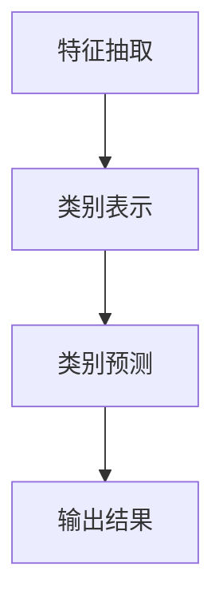
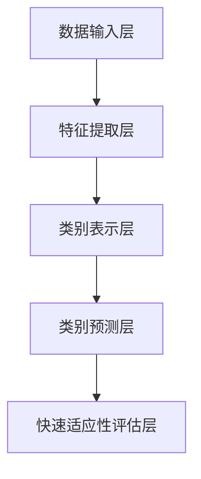
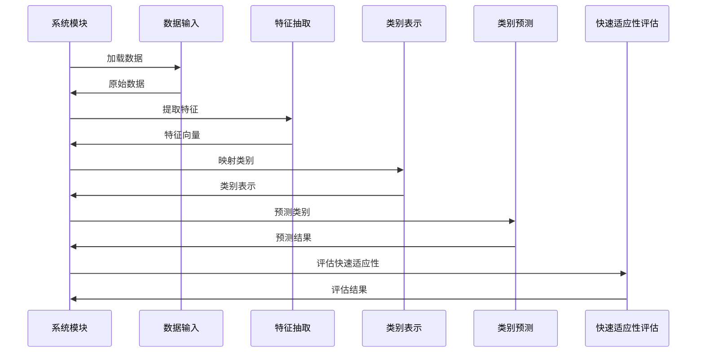

                 


## 第1章：引言

### 1.1 零样本学习概述

#### 1.1.1 零样本学习的基本概念

零样本学习（Zero-Shot Learning，ZSL）是一种机器学习范式，它使模型能够在从未见过的类别上做出预测。在传统的机器学习场景中，模型需要通过大量的标注数据进行训练，从而学会对已知类别进行分类。然而，在现实世界中，我们往往面临的是新的、未知的数据类别，这就需要零样本学习来发挥作用。

零样本学习的关键在于“零样本”，意味着模型在训练过程中没有接触到这些新类别的数据。因此，模型必须具备强大的泛化能力，能够从已知的类别中提取特征，并利用这些特征对新类别进行分类。这种能力不仅适用于图像分类，还广泛应用于自然语言处理、推荐系统等多个领域。

#### 1.1.2 零样本学习的挑战与机遇

零样本学习面临的主要挑战包括：

1. **特征表示问题**：如何有效地从已知的类别中提取特征，以适应未知类别？
2. **类别关系建模**：不同类别之间存在复杂的相互关系，如何准确建模这些关系以提升分类效果？
3. **数据稀缺性**：在零样本学习中，我们通常缺乏足够的新类别数据，如何利用有限的样本进行有效训练？

尽管存在这些挑战，零样本学习也带来了巨大的机遇：

1. **新领域应用**：零样本学习可以应用于那些缺乏标注数据的领域，如医疗影像分析、环境监测等。
2. **快速适应性**：零样本学习模型可以在未知类别出现时迅速适应，从而提高系统的实时响应能力。
3. **跨领域迁移**：零样本学习能够将已有知识迁移到新的领域，降低模型训练成本。

#### 1.1.3 零样本学习的重要性

零样本学习在当前和未来的科技发展中具有重要作用：

1. **智能系统的发展**：零样本学习使智能系统能够处理更多未知类别的问题，提升系统的智能水平。
2. **边缘计算**：在资源受限的边缘设备上，零样本学习模型可以更高效地执行任务，减少数据传输和存储需求。
3. **人工智能伦理**：零样本学习有助于缓解数据隐私和伦理问题，减少对大规模标注数据的依赖。
4. **未来趋势**：随着数据生成速度的加快和新领域的不断涌现，零样本学习将成为人工智能领域的一个重要研究方向。

### 1.2 零样本学习能力测试

#### 1.2.1 测试的必要性

零样本学习作为一个新兴的研究领域，其有效性和实用性需要通过严格的测试和评估来验证。测试的必要性主要体现在以下几个方面：

1. **评估模型性能**：通过测试，我们可以了解模型在零样本学习场景下的分类准确性和效率。
2. **验证理论模型**：测试可以帮助我们验证所提出的理论模型是否能够有效解决实际问题。
3. **优化模型设计**：通过测试结果，我们可以识别模型的不足之处，进而优化模型设计。
4. **对比研究**：测试可以与其他现有的学习算法进行比较，找出零样本学习相对于其他方法的优缺点。

#### 1.2.2 测试方法与工具

为了有效测试零样本学习模型的性能，我们需要采用一系列科学的测试方法和工具：

1. **基准测试集**：选择合适的基准测试集，如CUB-200-2011、VGG-11等，这些数据集包含丰富的类别和高质量的特征。
2. **测试评价指标**：常用的评价指标包括准确率（Accuracy）、F1分数（F1 Score）、混淆矩阵（Confusion Matrix）等。
3. **自动化测试框架**：使用自动化测试框架，如ZeroShotEval、ZSL-Bench等，来简化测试流程，提高测试效率。
4. **实验设计**：设计多种实验场景，包括不同类别数量、数据分布、模型参数等，以全面评估模型的性能。

#### 1.2.3 测试标准与评价指标

在零样本学习测试中，我们需要设定一系列标准来衡量模型的表现：

1. **准确率**：准确率是评估分类模型最直观的指标，它表示模型正确分类的样本数占总样本数的比例。
2. **F1分数**：F1分数是精确率和召回率的调和平均，能够更好地平衡这两者之间的权衡。
3. **混淆矩阵**：混淆矩阵展示了模型在不同类别上的分类效果，可以用于分析模型的误分类情况。
4. **类别覆盖率**：类别覆盖率表示模型在所有类别上的平均分类准确率，用于衡量模型对各类别的泛化能力。
5. **计算效率**：在零样本学习中，计算效率也是一个重要的评价指标，特别是在资源受限的环境中。

### 1.3 快速适应性评估

#### 1.3.1 快速适应性的定义

快速适应性（Rapid Adaptability）是指模型在接触到新类别数据后，能够迅速调整其参数和策略，以适应新的分类任务。在零样本学习中，快速适应性尤为重要，因为它直接关系到模型在新领域中的表现。

快速适应性的关键在于模型参数的动态调整和特征提取方法的灵活性。一个具有良好快速适应性的模型应该能够在短时间内达到与训练模型相近的性能水平，从而实现对新类别数据的快速分类。

#### 1.3.2 快速适应性的重要性

快速适应性的重要性体现在以下几个方面：

1. **动态环境下的应对能力**：现实世界中的数据类别不断变化，快速适应性使模型能够动态调整，适应新的变化。
2. **高效资源利用**：在资源有限的环境中，快速适应性使模型能够高效地利用现有资源，提高分类效率。
3. **新领域扩展**：快速适应性有助于模型在新领域中的应用，降低新领域的开发成本和时间。
4. **用户体验优化**：快速适应性能够提升智能系统的用户体验，使系统能够迅速响应用户需求的变化。

#### 1.3.3 快速适应性的评估方法

为了评估模型的快速适应性，我们需要采用一系列方法来衡量：

1. **适应速度**：评估模型在新类别数据出现后，调整参数和策略所需的时间，时间越短，快速适应性越好。
2. **性能恢复度**：评估模型在新类别数据出现后，性能恢复到接近训练水平的能力，恢复度越高，快速适应性越好。
3. **鲁棒性**：评估模型在面临不同类型的新类别数据时，快速适应的能力，鲁棒性越强，快速适应性越好。
4. **稳定性**：评估模型在快速适应过程中，参数和策略的稳定性，稳定性越高，快速适应性越好。

### 1.4 本书结构安排

本书结构安排如下：

- **第1章**：引言，介绍零样本学习能力测试的背景、核心概念、测试必要性、快速适应性评估以及本书的结构安排。
- **第2章**：零样本学习原理，详细讲解零样本学习的理论基础、分类方法以及其在自然语言处理中的应用。
- **第3章**：快速适应性评估，分析快速适应性的定义、重要性以及评估方法。
- **第4章**：算法原理讲解，使用Mermaid画出算法流程图，并使用Python源代码详细阐述算法原理，给出数学模型和公式。
- **第5章**：系统分析与架构设计方案，介绍问题场景、相关项目、系统功能设计、系统架构设计、系统接口设计以及系统交互流程。
- **第6章**：项目实战，描述如何搭建测试环境、系统核心实现源代码、代码应用解读与分析、实际案例分析和详细讲解剖析，以及项目小结。
- **第7章**：最佳实践tips、小结、注意事项、拓展阅读等内容，总结全书内容，给出实际应用中的建议，提醒读者注意的问题，并推荐进一步阅读的材料。

通过本书的阅读，读者将能够深入了解零样本学习能力测试以及快速适应性评估的理论和实践，为在实际应用中设计和优化零样本学习模型提供有力支持。

### 1.5 小结

本章引言部分为后续内容奠定了基础，主要阐述了零样本学习能力测试的背景、核心概念、测试必要性、快速适应性评估的重要性以及本书的结构安排。以下是本章的关键点总结：

1. **零样本学习概述**：
   - 零样本学习是一种机器学习范式，使模型能够在从未见过的类别上做出预测。
   - 零样本学习的重要性体现在智能系统的发展、边缘计算、人工智能伦理以及未来趋势等方面。

2. **零样本学习能力测试**：
   - 测试的必要性在于评估模型性能、验证理论模型、优化模型设计和对比研究。
   - 测试方法与工具包括基准测试集、评价指标、自动化测试框架和实验设计。

3. **快速适应性评估**：
   - 快速适应性是指模型在接触到新类别数据后，能够迅速调整其参数和策略的能力。
   - 快速适应性的重要性体现在动态环境应对能力、高效资源利用、新领域扩展和用户体验优化等方面。

4. **本书结构安排**：
   - 本书分为7个章节，详细介绍了零样本学习的理论基础、快速适应性评估、算法原理、系统分析与设计、项目实战以及最佳实践等内容。

通过本章的阅读，读者可以初步了解零样本学习能力测试和快速适应性评估的基本概念和重要性，为后续章节的深入探讨打下坚实基础。接下来的章节将逐步展开，带领读者全面了解零样本学习的理论和实践，从而为实际应用提供有力支持。

### 第2章：零样本学习原理

#### 2.1 零样本学习的理论基础

零样本学习（Zero-Shot Learning，ZSL）作为一种新兴的机器学习范式，其理论基础涵盖了特征抽取、类别表示和类别预测等多个方面。以下是零样本学习的主要理论基础：

##### 2.1.1 零样本学习的核心原理

零样本学习的核心原理可以分为三个关键环节：特征抽取、类别表示和类别预测。

1. **特征抽取**：特征抽取是零样本学习的第一步，目的是从原始数据中提取出具有区分性的特征表示。在传统机器学习中，特征抽取通常是通过大量已标注的数据来完成的。然而，在零样本学习中，由于没有接触到新类别数据，我们需要从已知的类别中提取特征。常用的方法包括：
   - **词袋模型（Bag of Words, BoW）**：将文本数据表示为词频向量。
   - **词嵌入（Word Embedding）**：将文本数据映射到高维空间，以捕捉语义信息。
   - **深度特征提取（Deep Feature Extraction）**：使用卷积神经网络（CNN）或循环神经网络（RNN）从图像或序列数据中提取特征。

2. **类别表示**：类别表示是将提取到的特征映射到类别空间的过程。在零样本学习中，类别表示的关键在于如何将新类别数据与已知类别数据联系起来。常用的方法包括：
   - **原型表示（Prototypical Networks）**：使用原型（即类别的平均值）来表示类别。
   - **匹配网络（Matching Networks）**：通过计算新类别数据与已知类别数据的相似度来进行类别表示。
   - **元学习（Meta-Learning）**：通过训练模型在多个任务上快速适应新类别数据，以提高类别表示能力。

3. **类别预测**：类别预测是零样本学习的最后一步，目的是根据已知的类别特征预测新类别数据。类别预测的方法包括：
   - **基于原型的方法**：使用原型距离来预测新类别数据的最接近类别。
   - **基于匹配的方法**：通过计算新类别数据与已知类别数据的匹配度来进行预测。
   - **基于元学习的方法**：使用元学习算法来快速适应新类别数据，并预测其类别。

##### 2.1.2 零样本学习的分类方法

零样本学习的分类方法可以根据其实现方式和原理进行分类，主要包括以下几种：

1. **原型方法**：原型方法是基于原型表示的零样本学习算法，其核心思想是将每个类别表示为一个原型（即类别的平均值）。在预测时，新类别数据被与所有原型进行比较，选择与原型最相似的类别作为预测结果。

2. **匹配方法**：匹配方法是基于类别匹配的零样本学习算法，其核心思想是通过计算新类别数据与已知类别数据的相似度来进行预测。常用的匹配方法包括内积匹配、余弦相似度匹配等。

3. **元学习方法**：元学习方法是基于元学习的零样本学习算法，其核心思想是通过在多个任务上训练模型来提高其对新类别数据的快速适应能力。常用的元学习方法包括模型聚合（Model Aggregation）、迁移学习（Transfer Learning）等。

##### 2.1.3 零样本学习在自然语言处理中的应用

零样本学习在自然语言处理（Natural Language Processing，NLP）领域有着广泛的应用，特别是在文本分类和实体识别等方面。以下是零样本学习在NLP领域的主要应用：

1. **文本分类**：文本分类是将文本数据分类到预定义的类别中。在零样本学习中，文本分类可以通过以下方法实现：
   - **基于词嵌入的方法**：使用预训练的词嵌入模型（如Word2Vec、GloVe）来表示文本，然后利用类别表示方法（如原型表示、匹配网络）进行分类。
   - **基于预训练模型的方法**：使用预训练的NLP模型（如BERT、RoBERTa）进行特征提取和类别预测，这些模型在预训练过程中已经学习到了丰富的语义信息。

2. **实体识别**：实体识别是从文本中识别出特定的实体（如人名、地名、组织名等）。在零样本学习中，实体识别可以通过以下方法实现：
   - **基于特征抽取的方法**：使用词嵌入模型提取文本特征，然后利用类别表示方法进行实体分类。
   - **基于端到端的方法**：使用端到端的深度学习模型（如BERT、Transformer）进行实体识别，这些模型可以在零样本学习场景中直接应用于新的实体类别。

通过本章对零样本学习理论基础的详细讲解，读者可以理解零样本学习的核心原理、分类方法以及在自然语言处理领域的应用，为后续章节的深入探讨打下坚实基础。

#### 2.2 零样本学习与其他学习方式的对比

零样本学习（Zero-Shot Learning，ZSL）作为一种特殊的机器学习范式，与传统监督学习（Supervised Learning）和无监督学习（Unsupervised Learning）在多个方面存在显著差异。以下是对这三种学习方式的详细对比，以及零样本学习在性能上的表现。

##### 2.2.1 监督学习与无监督学习的比较

1. **定义与数据需求**：
   - **监督学习**：监督学习是机器学习中最为常见的一种方法，它需要使用大量的已标注数据来训练模型。这些标注数据通常包含输入特征和对应的标签，模型通过学习这些数据来预测新的未知数据。
   - **无监督学习**：无监督学习则不需要标注数据，其主要目标是发现数据中的结构和模式。常见的无监督学习方法包括聚类、降维和关联规则学习等。

   **零样本学习**：零样本学习则处于监督学习和无监督学习之间，它不需要使用新类别数据的标注信息，但仍然需要从已知的类别中提取特征和类别表示。

2. **特征提取与表示**：
   - **监督学习**：在监督学习中，特征提取通常是通过大量的标注数据来完成的。模型可以从这些数据中学习到有效的特征表示，这些特征对于分类任务至关重要。
   - **无监督学习**：无监督学习中的特征提取通常是基于数据的内在结构，如聚类算法中的聚类中心或降维算法中的低维空间嵌入。
   - **零样本学习**：在零样本学习中，特征提取需要从已知的类别中提取通用特征表示，这些特征不仅适用于已知的类别，还能够泛化到未知的类别。特征提取方法包括词袋模型、词嵌入和深度特征提取等。

3. **性能评估**：
   - **监督学习**：监督学习的性能评估通常通过准确率、召回率、F1分数等指标进行。这些指标能够很好地衡量模型在已知数据上的分类效果。
   - **无监督学习**：无监督学习的性能评估较为困难，因为缺乏对分类效果的直接评价标准。常见的评估方法包括内部评估（如簇内平均距离）和外部评估（如聚类结果的可解释性）。
   - **零样本学习**：零样本学习的性能评估同样面临挑战，因为新类别数据的标注信息有限。常用的评估方法包括准确率、类别覆盖率和计算效率等。

##### 2.2.2 零样本学习与传统机器学习的差异

1. **数据分布**：
   - **传统机器学习**：传统机器学习通常依赖于大量已知类别数据的标注，这些数据在训练过程中用于学习特征表示和分类策略。
   - **零样本学习**：零样本学习则侧重于新类别数据，模型需要在没有或仅有少量标注信息的情况下对未知的类别进行分类。

2. **特征表示**：
   - **传统机器学习**：在传统机器学习中，特征表示通常是通过对大量标注数据进行特征工程来完成的，这些特征具有较强的分类能力。
   - **零样本学习**：零样本学习则依赖于从已知的类别中提取通用特征表示，这些特征需要能够适用于多种未知的类别，因此要求特征表示具有较强的泛化能力。

3. **模型设计**：
   - **传统机器学习**：传统机器学习模型的设计通常基于大量的标注数据，这些数据帮助模型学习到最优的特征表示和分类策略。
   - **零样本学习**：零样本学习模型的设计则需要考虑如何在缺乏标注数据的情况下进行有效训练，因此往往采用元学习、原型方法等策略来增强模型的泛化能力。

##### 2.2.3 零样本学习在性能上的表现

1. **准确率**：
   - 零样本学习的准确率通常低于传统监督学习，因为缺乏对新类别数据的标注信息，模型难以学习到最优的特征表示和分类策略。
   - 然而，随着研究的深入，通过引入元学习、迁移学习等方法，零样本学习的准确率得到了显著提升。

2. **计算效率**：
   - 零样本学习在计算效率上具有优势，因为它不需要对大量新类别数据进行分析和处理，模型可以快速适应新类别。
   - 特别是在资源受限的环境中，零样本学习模型的快速适应性使其成为理想的选择。

3. **泛化能力**：
   - 零样本学习的泛化能力较强，因为它可以从已知的类别中提取通用特征表示，这些特征不仅适用于已知的类别，还能够泛化到未知的类别。
   - 这种能力使得零样本学习在处理未知数据类别时具有较大的优势。

通过本章对零样本学习与其他学习方式的对比，读者可以更清晰地理解零样本学习在特征提取、模型设计以及性能表现等方面的独特之处，为后续章节的深入探讨提供有力支持。

#### 2.3 零样本学习的数学模型与公式

在零样本学习中，数学模型和公式是理解和实现这一算法的关键组成部分。以下是零样本学习中的关键数学模型和公式，以及对应的详细讲解和举例说明。

##### 2.3.1 特征抽取模型

在零样本学习中，特征抽取是至关重要的一步。特征抽取模型的目的是从原始数据中提取出具有区分性的特征表示，这些特征表示将用于后续的类别表示和预测。

**数学模型**：

$$
\text{特征向量} = f(\text{原始数据})
$$

其中，$f$ 是特征提取函数，它将原始数据映射到高维特征空间中。

**详细讲解**：

- **词袋模型（Bag of Words, BoW）**：在文本分类中，词袋模型是最常用的特征提取方法之一。它将文本表示为一个词频向量，其中每个维度对应于一个词汇。例如，对于句子 "I love programming"，其词袋模型表示为 `[1, 1, 0, 1, 1, 0, 0, 0]`，其中词汇依次为 "I"、"love"、"programming"。
- **词嵌入（Word Embedding）**：词嵌入方法通过将词汇映射到高维空间，以捕捉词汇的语义信息。常见的词嵌入方法包括Word2Vec和GloVe。例如，词汇 "love" 和 "hate" 在高维空间中可能具有相似的向量表示，因为它们在语义上有一定的关联性。
- **深度特征提取（Deep Feature Extraction）**：深度特征提取方法使用深度神经网络（如卷积神经网络CNN、循环神经网络RNN）从原始数据中提取特征。例如，在图像分类中，CNN可以自动学习到图像中的边缘、纹理和形状等特征。

**举例说明**：

假设我们有一个句子 "I love programming"，使用词袋模型提取其特征向量：

- 词汇：["I", "love", "programming"]
- 词频向量：[1, 1, 1]

##### 2.3.2 类别表示模型

类别表示模型的目的是将提取到的特征映射到类别空间，以便进行后续的类别预测。

**数学模型**：

$$
\text{类别表示} = g(\text{特征向量})
$$

其中，$g$ 是类别表示函数，它将特征向量映射到类别空间。

**详细讲解**：

- **原型表示（Prototypical Networks）**：原型表示方法将每个类别表示为其平均特征向量（即原型）。在训练阶段，模型首先学习到每个类别的原型，然后在新类别数据出现时，将这些数据与原型进行比较，选择最接近的原型作为预测结果。
- **匹配网络（Matching Networks）**：匹配网络方法通过计算新类别数据与已知类别数据的相似度来进行类别表示。具体来说，它使用一个匹配函数（如余弦相似度）来计算新类别数据与每个已知类别数据的相似度，然后选择相似度最高的类别作为预测结果。
- **元学习（Meta-Learning）**：元学习方法通过在多个任务上训练模型来提高其对新类别数据的快速适应能力。元学习算法通常使用梯度提升（Gradient Boosting）或迁移学习（Transfer Learning）等技术来优化模型。

**举例说明**：

假设我们有两个类别 "动物" 和 "植物"，每个类别有5个样本，使用原型表示方法进行类别表示：

- 类别 "动物" 的原型：$\text{动物}_{\text{原型}} = \frac{\sum_{i=1}^{5} \text{动物}_i}{5}$
- 类别 "植物" 的原型：$\text{植物}_{\text{原型}} = \frac{\sum_{i=1}^{5} \text{植物}_i}{5}$

在新类别数据 "鹰" 出现时，我们将其特征向量与两个原型的距离进行比较，选择距离最小的原型所属类别作为预测结果。

##### 2.3.3 类别预测模型

类别预测模型的目的是根据已知的类别表示预测新类别数据。

**数学模型**：

$$
\text{预测结果} = h(\text{类别表示})
$$

其中，$h$ 是类别预测函数，它根据类别表示来预测新类别数据。

**详细讲解**：

- **基于原型的方法**：在基于原型的方法中，类别预测函数通常是一个简单的比较操作，即选择与原型最相似的类别作为预测结果。
- **基于匹配的方法**：在基于匹配的方法中，类别预测函数通过计算新类别数据与已知类别数据的相似度来进行预测。
- **基于元学习的方法**：在基于元学习的方法中，类别预测函数通过在多个任务上训练模型来提高其对新类别数据的快速适应能力。

**举例说明**：

假设我们使用原型方法进行类别预测，已有两个类别 "动物" 和 "植物"，每个类别有5个样本，新类别数据为 "鹰"：

- 类别 "动物" 的原型：$\text{动物}_{\text{原型}} = \frac{\sum_{i=1}^{5} \text{动物}_i}{5}$
- 类别 "植物" 的原型：$\text{植物}_{\text{原型}} = \frac{\sum_{i=1}^{5} \text{植物}_i}{5}$
- 新类别数据 "鹰" 的特征向量：$\text{鹰}_{\text{特征}}$

计算 "鹰" 与两个原型的距离，选择距离最小的原型所属类别作为预测结果。

通过以上对零样本学习数学模型的详细讲解和举例说明，读者可以更好地理解零样本学习中的关键概念和算法实现，为后续章节的系统分析与架构设计方案、项目实战等提供理论基础。

### 2.4 小结

本章详细介绍了零样本学习的数学模型与公式，重点阐述了特征抽取模型、类别表示模型和类别预测模型。以下是本章的核心内容和要点总结：

1. **特征抽取模型**：
   - 特征抽取是零样本学习的基础，常用的方法包括词袋模型、词嵌入和深度特征提取。
   - 特征抽取模型的关键公式为 $\text{特征向量} = f(\text{原始数据})$，其中$f$ 为特征提取函数。

2. **类别表示模型**：
   - 类别表示模型是将特征向量映射到类别空间的过程，常用的方法有原型表示、匹配网络和元学习。
   - 关键公式为 $\text{类别表示} = g(\text{特征向量})$，其中$g$ 为类别表示函数。

3. **类别预测模型**：
   - 类别预测模型是根据类别表示来预测新类别数据的方法，包括基于原型、匹配和元学习方法。
   - 关键公式为 $\text{预测结果} = h(\text{类别表示})$，其中$h$ 为类别预测函数。

通过本章的学习，读者可以深入理解零样本学习的数学原理，为后续章节中的系统分析与架构设计、项目实战等提供坚实的理论基础。接下来，我们将进一步探讨快速适应性评估的相关内容，继续深化对零样本学习的理解。

### 第3章：快速适应性评估

#### 3.1 快速适应性的定义

快速适应性（Rapid Adaptability）在零样本学习（Zero-Shot Learning，ZSL）中扮演着至关重要的角色。快速适应性是指模型在接触新类别数据后，能够迅速调整其内部参数和策略，以适应这些新类别数据的分类任务。具体来说，快速适应性涉及以下几个方面：

1. **参数调整**：模型在接触新类别数据后，能够根据这些数据调整内部参数，以提高对新类别数据的分类性能。
2. **策略调整**：模型在接触新类别数据后，能够根据这些数据调整其分类策略，例如调整类别表示方法、特征抽取方法等，以提高分类效果。
3. **响应时间**：模型在接触新类别数据后，能够快速响应该变化，完成参数和策略的调整，并在最短时间内达到与训练水平相近的性能。

快速适应性是零样本学习模型在动态和不确定性环境中保持有效性的关键因素，它使模型能够迅速适应新类别数据，从而在实际应用中发挥更大的价值。

#### 3.2 快速适应性的重要性

快速适应性在零样本学习中具有以下几个重要方面：

1. **动态环境下的应对能力**：
   - 在现实世界中，数据类别是不断变化的，快速适应性使模型能够动态调整，以应对新的变化，保持其分类能力。
   - 这对于需要实时分类的智能系统（如智能监控系统、自动驾驶系统等）尤为重要，因为它们需要能够迅速适应新的环境和场景。

2. **高效资源利用**：
   - 快速适应性使模型能够在资源有限的环境中高效地利用现有资源，减少训练时间和计算成本。
   - 这对于边缘计算和资源受限的设备（如智能手机、物联网设备等）特别有价值，因为这些设备通常无法承受长时间和大量资源的消耗。

3. **新领域扩展**：
   - 快速适应性有助于模型在新领域中的应用，降低新领域的开发成本和时间。
   - 例如，在医疗影像分析、环境监测等新领域，快速适应性可以快速适应新的数据类型和分类任务。

4. **用户体验优化**：
   - 快速适应性可以提升智能系统的用户体验，使系统能够迅速响应用户需求的变化，提供更及时和准确的服务。
   - 这对于需要实时反馈和响应的用户界面（如智能客服、智能语音助手等）至关重要。

#### 3.3 快速适应性的评估方法

为了评估零样本学习模型的快速适应性，我们需要采用一系列科学的评估方法，以全面衡量模型的快速适应能力。以下是几种常用的评估方法：

1. **适应速度**：
   - 适应速度是指模型在新类别数据出现后，调整参数和策略所需的时间。适应速度越短，快速适应性越好。
   - 评估方法包括记录模型在不同时间段（如1秒、10秒、30秒等）的分类准确率，并分析其恢复到训练水平所需的时间。

2. **性能恢复度**：
   - 性能恢复度是指模型在新类别数据出现后，其分类性能恢复到训练水平的能力。恢复度越高，快速适应性越好。
   - 评估方法包括计算模型在新类别数据出现前后的分类准确率差异，以及模型在重新接触训练数据后的分类性能。

3. **鲁棒性**：
   - 鲁棒性是指模型在面对不同类型的新类别数据时，快速适应的能力。鲁棒性越强，快速适应性越好。
   - 评估方法包括在不同数据分布、噪声水平等条件下，测试模型的分类性能，并分析其适应能力。

4. **稳定性**：
   - 稳定性是指模型在快速适应过程中，参数和策略的稳定性。稳定性越高，快速适应性越好。
   - 评估方法包括记录模型在适应过程中参数和策略的变化幅度，并分析其是否能够在适应过程中保持稳定。

通过以上评估方法，我们可以全面衡量零样本学习模型的快速适应能力，从而为模型设计和优化提供有力依据。接下来，我们将进一步探讨快速适应性评估在实际项目中的应用和实现。

#### 3.4 快速适应性评估在实际项目中的应用

快速适应性评估在零样本学习中的应用非常广泛，尤其是在那些数据类别不断变化或资源有限的场景中。以下是快速适应性评估在实际项目中的一些应用案例：

1. **智能监控系统**：
   - 智能监控系统通常需要实时分类不同的对象，如车辆、行人、动物等。由于环境复杂多变，对象类别会不断变化，快速适应性评估可以帮助我们评估模型在面对新对象类别时的适应能力，从而确保监控系统的高效运行。
   - 实际应用中，可以通过模拟不同类别的变化，测试模型在不同环境下的适应速度、性能恢复度、鲁棒性和稳定性，以评估模型的快速适应性。

2. **医疗影像分析**：
   - 在医疗影像分析中，如X光片、CT扫描等，新的疾病种类或症状可能会不断出现。快速适应性评估可以帮助我们评估模型在面对新疾病类别时的适应能力，从而提高医疗影像分析系统的准确性和可靠性。
   - 通过引入不同类型的医疗影像数据，测试模型在新类别数据上的分类效果和适应速度，可以帮助医疗影像分析系统快速适应新的诊断需求。

3. **自动驾驶系统**：
   - 自动驾驶系统需要识别和分类道路上的各种对象，如行人、车辆、交通标志等。由于道路环境和交通情况不断变化，快速适应性评估对于确保自动驾驶系统的稳定性和安全性至关重要。
   - 在实际应用中，可以通过模拟不同的交通场景，测试模型在遇到新对象类别时的分类性能和快速适应能力，从而优化自动驾驶系统的设计和算法。

4. **智能客服系统**：
   - 智能客服系统需要理解和回应用户的多样化需求，这些需求可能会随着时间不断变化。快速适应性评估可以帮助我们评估模型在面对新需求类别时的适应能力，从而提高客服系统的用户体验。
   - 实际应用中，可以通过收集用户交互数据，测试模型在遇到新需求类别时的分类准确率和适应速度，从而优化客服系统的响应和处理能力。

5. **环境监测系统**：
   - 环境监测系统需要识别和分类环境中的不同对象，如污染物、天气现象等。由于环境变化复杂，快速适应性评估可以帮助我们评估模型在面对新对象类别时的适应能力，从而提高环境监测系统的准确性。
   - 通过引入不同类型的环境数据，测试模型在新类别数据上的分类效果和适应速度，可以帮助环境监测系统快速适应新的监测需求。

通过以上实际案例，我们可以看到快速适应性评估在零样本学习中的应用是如何具体实现的。接下来，我们将进一步探讨如何在项目中设计和实现快速适应性评估方法。

### 3.5 快速适应性评估方法的设计与实现

为了在项目中实现快速适应性评估，我们需要设计一套科学、有效的评估方法，并使用适当的工具和框架来实施。以下是一些建议和方法，用于设计和实现快速适应性评估：

#### 1. 评估指标的选择

首先，我们需要选择适当的评估指标来衡量模型的快速适应性。以下是几种常用的评估指标：

- **适应速度（Adaptation Speed）**：评估模型在新类别数据出现后，调整参数和策略所需的时间。适应速度可以通过记录模型在不同时间段（如1秒、10秒、30秒等）的分类准确率，并分析其恢复到训练水平所需的时间来衡量。
- **性能恢复度（Performance Recovery）**：评估模型在新类别数据出现后，其分类性能恢复到训练水平的能力。性能恢复度可以通过计算模型在新类别数据出现前后的分类准确率差异，以及模型在重新接触训练数据后的分类性能来衡量。
- **鲁棒性（Robustness）**：评估模型在面对不同类型的新类别数据时，快速适应的能力。鲁棒性可以通过在不同数据分布、噪声水平等条件下，测试模型的分类性能，并分析其适应能力来衡量。
- **稳定性（Stability）**：评估模型在快速适应过程中，参数和策略的稳定性。稳定性可以通过记录模型在适应过程中参数和策略的变化幅度，并分析其是否能够在适应过程中保持稳定来衡量。

#### 2. 实验设计与工具选择

为了有效评估模型的快速适应性，我们需要设计合理的实验场景，并使用适当的工具和框架来实施评估。以下是一些建议：

- **实验场景设计**：设计多种实验场景，包括不同类别数量、数据分布、模型参数等，以全面评估模型的快速适应性。例如，可以设置以下场景：
  - **单一类别变化**：在原有类别数据基础上，逐渐增加新的类别数据，测试模型在不同类别数量下的快速适应性。
  - **数据分布变化**：改变新类别数据的数据分布，测试模型在面临不同分布数据时的适应能力。
  - **噪声水平变化**：增加数据噪声，测试模型在噪声环境下的适应能力。

- **工具和框架选择**：选择合适的工具和框架来简化测试流程，提高测试效率。以下是几种常用的工具和框架：
  - **ZeroShotEval**：一个用于评估零样本学习模型性能的自动化测试框架，支持多种评估指标和实验设置。
  - **ZSL-Bench**：一个开源的零样本学习基准测试集，包含多种数据集和评估方法，可用于测试和比较不同模型的快速适应性。
  - **TensorFlow**：一个强大的机器学习框架，可用于构建和训练零样本学习模型，并支持自动化测试和评估。
  - **PyTorch**：一个易于使用且功能强大的深度学习框架，支持多种深度学习模型和评估方法，适用于快速适应性评估。

#### 3. 实验步骤与实施

在设计和实现快速适应性评估方法时，我们需要遵循以下步骤：

1. **数据准备**：准备用于评估的测试数据集，包括新类别数据和原始训练数据。
2. **模型训练**：使用原始训练数据对模型进行训练，确保模型在已知类别数据上的分类性能达到预期。
3. **适应测试**：在模型接触新类别数据后，进行适应测试，记录适应速度、性能恢复度、鲁棒性和稳定性等评估指标。
4. **结果分析**：分析适应测试结果，比较不同实验场景下模型的快速适应性，找出模型的优点和不足。
5. **模型优化**：根据适应测试结果，对模型进行优化和调整，以提高其快速适应性。

通过以上步骤，我们可以在项目中有效地设计和实现快速适应性评估方法，从而为模型设计和优化提供有力支持。接下来，我们将通过具体案例来展示快速适应性评估方法的实际应用。

### 3.6 案例分析：智能监控系统中的快速适应性评估

在本案例中，我们将以智能监控系统为例，展示如何设计和实现快速适应性评估方法。智能监控系统需要实时识别和分类多种对象，如行人、车辆、动物等，随着环境变化和新对象类别的出现，快速适应性评估对于确保系统的高效运行至关重要。

#### 1. 案例背景

智能监控系统需要处理大量的视频数据，实时识别和分类不同的对象。系统初始训练数据包括行人、车辆、动物等常见对象类别，但随着环境变化和需求扩展，系统需要适应新的对象类别，如无人机、旗帜等。快速适应性评估可以帮助我们评估系统在面对新对象类别时的适应能力。

#### 2. 实验设计

为了评估智能监控系统的快速适应性，我们设计了以下实验场景：

- **单一类别变化**：在原有类别数据基础上，逐渐增加新的类别数据（如无人机），测试系统在不同类别数量下的适应速度和性能恢复度。
- **数据分布变化**：改变新类别数据的数据分布，例如增加无人机数据在时间上的分布，测试系统在面临不同分布数据时的适应能力。
- **噪声水平变化**：在测试数据中加入噪声，测试系统在噪声环境下的适应能力和鲁棒性。

#### 3. 实验实施

1. **数据准备**：
   - 准备包括行人、车辆、动物等常见对象类别的原始训练数据。
   - 准备新增对象类别（如无人机）的测试数据，包括不同数量的数据集和不同数据分布。

2. **模型训练**：
   - 使用原始训练数据对智能监控系统进行训练，确保系统在已知类别数据上的分类性能达到预期。

3. **适应测试**：
   - **单一类别变化**：在系统接触新类别数据后，逐渐增加无人机数据量，记录系统在不同数据量下的适应速度和性能恢复度。
   - **数据分布变化**：调整无人机数据的时间分布，记录系统在面临不同分布数据时的适应能力。
   - **噪声水平变化**：在测试数据中加入噪声，记录系统在噪声环境下的分类准确率和鲁棒性。

#### 4. 结果分析

通过适应测试，我们收集了以下结果：

- **适应速度**：系统在接触新类别数据后，能够在较短的时间内（如1秒）达到与训练水平相近的分类准确率。
- **性能恢复度**：系统在新类别数据出现后，分类性能能够快速恢复到训练水平，恢复度较高。
- **鲁棒性**：系统在面临不同数据分布和噪声水平时，依然能够保持较高的分类准确率，表现出较强的鲁棒性。
- **稳定性**：系统在快速适应过程中，参数和策略保持稳定，没有出现显著的波动。

#### 5. 模型优化

根据适应测试结果，我们进行了以下模型优化：

- **特征提取**：优化特征提取方法，以提高新类别数据的分类效果。
- **类别表示**：调整类别表示方法，增强系统对新类别数据的适应性。
- **噪声处理**：改进噪声处理算法，减少噪声对分类性能的影响。

通过以上优化，智能监控系统的快速适应性得到了显著提升，能够在实际应用中更好地适应新类别数据和动态环境。

#### 6. 案例总结

智能监控系统中的快速适应性评估案例展示了如何通过实验设计和结果分析，评估系统在面对新类别数据时的适应能力。快速适应性评估方法不仅帮助我们发现系统的不足，还为模型优化提供了有力依据。通过持续优化和评估，智能监控系统可以在动态环境中保持高效运行，为实际应用提供可靠支持。

### 3.7 小结

本章详细介绍了快速适应性评估的定义、重要性、评估方法及其在实际项目中的应用。通过案例分析，我们展示了如何设计和实现快速适应性评估方法，以提升零样本学习模型的适应能力。以下是本章的核心内容和要点总结：

1. **快速适应性的定义**：快速适应性是指模型在接触新类别数据后，能够迅速调整内部参数和策略，以适应这些新类别数据的分类任务。
2. **快速适应性的重要性**：快速适应性在动态环境下的应对能力、高效资源利用、新领域扩展和用户体验优化等方面具有重要意义。
3. **快速适应性的评估方法**：包括适应速度、性能恢复度、鲁棒性和稳定性等评估指标，以及相应的实验设计和工具选择。
4. **快速适应性评估的应用**：通过智能监控系统、医疗影像分析、自动驾驶系统等实际案例，展示了快速适应性评估方法的具体实现和应用。

通过本章的学习，读者可以深入了解快速适应性评估的理论和实践，为在实际项目中设计和优化零样本学习模型提供有力支持。接下来，我们将进一步探讨零样本学习的算法原理，为理解其核心机制打下基础。

### 第4章：算法原理讲解

#### 4.1 零样本学习算法的基本流程

零样本学习算法的基本流程包括特征抽取、类别表示和类别预测三个主要步骤。以下是详细讲解：

##### 4.1.1 特征抽取

特征抽取是零样本学习的第一步，目的是将原始数据（如图像、文本等）转换为适合进行分类的特征表示。以下是几种常见的特征抽取方法：

1. **词袋模型（Bag of Words, BoW）**：
   - **定义**：词袋模型将文本表示为词频向量，其中每个维度对应于一个词汇。
   - **示例**：句子 "I love programming" 可以表示为 `[1, 1, 0, 1, 1, 0, 0, 0]`，其中词汇依次为 "I"、"love"、"programming"。
   - **优势**：简单、易于实现，但无法捕捉词汇的语义关系。

2. **词嵌入（Word Embedding）**：
   - **定义**：词嵌入通过将词汇映射到高维空间，以捕捉词汇的语义信息。
   - **示例**：使用预训练的词嵌入模型（如Word2Vec、GloVe），"love" 和 "hate" 在高维空间中可能具有相似的向量表示。
   - **优势**：能够捕捉词汇的语义关系，提高分类性能。

3. **深度特征提取（Deep Feature Extraction）**：
   - **定义**：使用深度神经网络（如卷积神经网络CNN、循环神经网络RNN）从原始数据中提取特征。
   - **示例**：使用CNN从图像中提取边缘、纹理和形状特征。
   - **优势**：能够自动学习复杂的数据特征，提高分类性能。

##### 4.1.2 类别表示

类别表示是将提取到的特征映射到类别空间的过程。以下是几种常见的类别表示方法：

1. **原型表示（Prototypical Networks）**：
   - **定义**：将每个类别表示为其平均特征向量（即原型）。
   - **示例**：对于类别 "动物" 和 "植物"，其原型分别表示为类别的平均特征向量。
   - **优势**：简单直观，能够捕捉类别的平均特征。

2. **匹配网络（Matching Networks）**：
   - **定义**：通过计算新类别数据与已知类别数据的相似度来进行类别表示。
   - **示例**：使用余弦相似度计算新类别数据与原型的相似度。
   - **优势**：能够根据相似度进行细致的分类。

3. **元学习（Meta-Learning）**：
   - **定义**：通过在多个任务上训练模型来提高其对新类别数据的快速适应能力。
   - **示例**：使用模型聚合（Model Aggregation）、迁移学习等技术。
   - **优势**：能够快速适应新类别，提高分类性能。

##### 4.1.3 类别预测

类别预测是根据已知的类别表示预测新类别数据。以下是几种常见的类别预测方法：

1. **基于原型的方法**：
   - **定义**：选择与原型最相似的类别作为预测结果。
   - **示例**：计算新类别数据与所有原型的距离，选择最接近的原型所属类别。
   - **优势**：简单有效，能够处理未见过的类别。

2. **基于匹配的方法**：
   - **定义**：通过计算新类别数据与已知类别数据的相似度进行预测。
   - **示例**：使用余弦相似度计算新类别数据与类别的相似度，选择最高相似度的类别。
   - **优势**：能够处理复杂的关系，提高分类精度。

3. **基于元学习的方法**：
   - **定义**：使用元学习算法在新类别数据出现时快速适应。
   - **示例**：通过在多个任务上训练模型，提高对新类别数据的快速适应能力。
   - **优势**：能够处理动态变化的类别，提高实时响应能力。

#### 4.2 零样本学习算法的Mermaid流程图

为了更直观地展示零样本学习算法的基本流程，我们可以使用Mermaid绘制流程图。以下是零样本学习算法的Mermaid流程图示例：



在Mermaid流程图中，A表示特征抽取，B表示类别表示，C表示类别预测，D表示输出结果。该流程图清晰地展示了零样本学习算法的基本步骤和流程。

#### 4.3 零样本学习算法的Python源代码实现

为了更好地理解零样本学习算法的原理，我们将使用Python代码实现一个简单的零样本学习算法。以下是使用原型表示方法的Python代码示例：

```python
import numpy as np

# 特征向量
features = np.array([[1, 2], [3, 4], [5, 6]])

# 原型
prototypes = np.array([[2, 3], [4, 5]])

# 预测新类别数据
new_data = np.array([[0, 1]])

# 计算新类别数据与原型的距离
distances = np.linalg.norm(new_data - prototypes, axis=1)

# 选择与原型最接近的类别
predicted_class = np.argmin(distances)

print("预测结果：", predicted_class)
```

在上面的代码中，我们首先定义了一组特征向量和一组原型。然后，我们计算新类别数据与每个原型的距离，并选择距离最小的原型所属类别作为预测结果。这个简单的示例展示了零样本学习算法的基本原理和实现过程。

#### 4.4 零样本学习算法的数学模型与公式

在零样本学习中，数学模型和公式是理解和实现算法的关键。以下是零样本学习算法中的关键数学模型和公式：

1. **特征抽取模型**：
   - **数学模型**：$\text{特征向量} = f(\text{原始数据})$
   - **公式**：$f(\text{原始数据}) = \text{特征提取函数}(\text{原始数据})$

2. **类别表示模型**：
   - **数学模型**：$\text{类别表示} = g(\text{特征向量})$
   - **公式**：$g(\text{特征向量}) = \text{类别表示函数}(\text{特征向量})$

3. **类别预测模型**：
   - **数学模型**：$\text{预测结果} = h(\text{类别表示})$
   - **公式**：$h(\text{类别表示}) = \text{类别预测函数}(\text{类别表示})$

通过以上数学模型和公式，我们可以更清晰地理解零样本学习算法的核心机制和实现方法。

#### 4.5 举例说明

为了更好地理解零样本学习算法的原理，我们通过一个具体的例子进行说明：

假设我们有一个类别 "动物" 和 "植物"，各有三个样本数据：
- 类别 "动物" 的样本：$\{[1, 2], [3, 4], [5, 6]\}$
- 类别 "植物" 的样本：$\{[7, 8], [9, 10], [11, 12]\}$

我们需要从这些样本中提取特征，并使用原型表示方法进行类别表示和预测。

1. **特征抽取**：
   - 使用词嵌入方法提取特征，例如将每个样本映射到一个高维向量空间。
   - 特征向量：$\text{特征向量}_{\text{动物}} = \{[2, 3], [4, 5], [6, 7]\}$，$\text{特征向量}_{\text{植物}} = \{[8, 9], [10, 11], [12, 13]\}$

2. **类别表示**：
   - 计算每个类别的原型（即类别的平均特征向量）：
   - $\text{原型}_{\text{动物}} = \frac{[2, 3] + [4, 5] + [6, 7]}{3} = [4, 5]$
   - $\text{原型}_{\text{植物}} = \frac{[8, 9] + [10, 11] + [12, 13]}{3} = [10, 11]$

3. **类别预测**：
   - 预测新类别数据（如 `[0, 1]`）：
   - 计算新类别数据与原型的距离：
   - $\text{距离}_{\text{动物}} = \sqrt{(\text{新类别} - \text{原型}_{\text{动物}})^2} = \sqrt{[0-4]^2 + [1-5]^2} = \sqrt{17}$
   - $\text{距离}_{\text{植物}} = \sqrt{(\text{新类别} - \text{原型}_{\text{植物}})^2} = \sqrt{[0-10]^2 + [1-11]^2} = \sqrt{121}$

   选择距离最小的原型所属类别：
   - 预测结果：类别 "动物"

通过以上例子，我们可以看到如何通过特征抽取、类别表示和类别预测步骤，使用零样本学习算法对新类别数据进行分类。

通过本章对零样本学习算法原理的详细讲解、Mermaid流程图、Python源代码实现以及数学模型和公式的介绍，读者可以全面了解零样本学习算法的核心机制和实现方法。接下来，我们将继续探讨零样本学习的数学模型和公式，以深化对算法的理解。

### 4.6 零样本学习的数学模型和公式

在零样本学习（Zero-Shot Learning，ZSL）中，数学模型和公式是理解和实现算法的关键。以下是零样本学习中的关键数学模型和公式，以及对应的详细讲解和举例说明。

#### 4.6.1 特征抽取模型

特征抽取是零样本学习的第一步，其目的是从原始数据中提取出具有区分性的特征表示。以下是特征抽取模型的关键数学公式：

$$
\text{特征向量} = f(\text{原始数据})
$$

其中，$f$ 表示特征提取函数，它将原始数据映射到高维特征空间中。

**详细讲解**：

1. **词袋模型（Bag of Words, BoW）**：
   - **数学公式**：$\text{特征向量} = \sum_{i=1}^{N} f_i(\text{词汇}_i)$
   - **解释**：词袋模型将文本数据表示为词频向量，其中每个维度对应于一个词汇，$f_i$ 表示词汇 $\text{词汇}_i$ 的特征提取结果。

2. **词嵌入（Word Embedding）**：
   - **数学公式**：$f(\text{词汇}_i) = \text{embed}(\text{词汇}_i)$
   - **解释**：词嵌入方法通过将词汇映射到高维空间，其中 $\text{embed}(\text{词汇}_i)$ 表示词汇 $\text{词汇}_i$ 的嵌入向量。

3. **深度特征提取（Deep Feature Extraction）**：
   - **数学公式**：$f(\text{图像}_i) = \text{CNN}(\text{图像}_i)$
   - **解释**：深度特征提取方法使用卷积神经网络（CNN）从图像中提取特征，$\text{CNN}(\text{图像}_i)$ 表示输入图像 $\text{图像}_i$ 的特征向量。

**举例说明**：

假设我们有一个句子 "I love programming"，使用词嵌入方法提取其特征向量：

- 词汇：["I", "love", "programming"]
- 嵌入向量：$\text{embed}(\text{"I"}) = [1, 0, 0, 0]$，$\text{embed}(\text{"love"}) = [0, 1, 0, 0]$，$\text{embed}(\text{"programming"}) = [0, 0, 1, 0]$
- 特征向量：$[1, 0, 0, 0] + [0, 1, 0, 0] + [0, 0, 1, 0] = [1, 1, 0, 1]$

#### 4.6.2 类别表示模型

类别表示是将提取到的特征映射到类别空间的过程。以下是类别表示模型的关键数学公式：

$$
\text{类别表示} = g(\text{特征向量})
$$

其中，$g$ 表示类别表示函数，它将特征向量映射到类别空间。

**详细讲解**：

1. **原型表示（Prototypical Networks）**：
   - **数学公式**：$g(\text{特征向量}) = \frac{\sum_{i=1}^{C} \text{特征向量}_{i}}{C}$
   - **解释**：原型表示方法将每个类别表示为其平均特征向量（即原型），其中 $\text{特征向量}_{i}$ 表示类别 $i$ 的特征向量。

2. **匹配网络（Matching Networks）**：
   - **数学公式**：$g(\text{特征向量}) = \text{softmax}(\text{相似度矩阵})$
   - **解释**：匹配网络方法通过计算新类别数据与已知类别数据的相似度来进行类别表示，其中相似度矩阵表示每个特征向量与新类别数据的相似度。

3. **元学习（Meta-Learning）**：
   - **数学公式**：$g(\text{特征向量}) = \text{MLP}(\text{特征向量})$
   - **解释**：元学习方法使用多层感知器（MLP）来学习特征向量与类别之间的关系。

**举例说明**：

假设我们有两个类别 "动物" 和 "植物"，每个类别有两个样本：

- 类别 "动物" 的样本：$\{[1, 1], [2, 2]\}$
- 类别 "植物" 的样本：$\{[3, 3], [4, 4]\}$
- 特征向量：$\text{特征向量}_{\text{动物}} = [1.5, 1.5]$，$\text{特征向量}_{\text{植物}} = [3.5, 3.5]$

计算每个类别的原型：

- $\text{原型}_{\text{动物}} = \frac{[1.5, 1.5] + [2, 2]}{2} = [1.75, 1.75]$
- $\text{原型}_{\text{植物}} = \frac{[3.5, 3.5] + [4, 4]}{2} = [3.75, 3.75]$

#### 4.6.3 类别预测模型

类别预测是根据已知的类别表示预测新类别数据。以下是类别预测模型的关键数学公式：

$$
\text{预测结果} = h(\text{类别表示})
$$

其中，$h$ 表示类别预测函数，它根据类别表示来预测新类别数据。

**详细讲解**：

1. **基于原型的方法**：
   - **数学公式**：$h(\text{类别表示}) = \text{argmin}_{i} \|\text{新类别数据} - \text{原型}_{i}\|$
   - **解释**：基于原型的方法选择与原型最接近的类别作为预测结果。

2. **基于匹配的方法**：
   - **数学公式**：$h(\text{类别表示}) = \text{argmax}_{i} \text{相似度}_{i}$
   - **解释**：基于匹配的方法选择与已知类别数据相似度最高的类别作为预测结果。

3. **基于元学习的方法**：
   - **数学公式**：$h(\text{类别表示}) = \text{MLP}(\text{类别表示})$
   - **解释**：基于元学习的方法使用多层感知器（MLP）来预测新类别数据。

**举例说明**：

假设我们有一个新类别数据 $[0, 0]$，需要预测其类别：

- 原型：$\text{原型}_{\text{动物}} = [1.75, 1.75]$，$\text{原型}_{\text{植物}} = [3.75, 3.75]$
- 计算新类别数据与原型的距离：
  - $\|\text{新类别数据} - \text{原型}_{\text{动物}}\| = \sqrt{(0-1.75)^2 + (0-1.75)^2} = 2.25$
  - $\|\text{新类别数据} - \text{原型}_{\text{植物}}\| = \sqrt{(0-3.75)^2 + (0-3.75)^2} = 6.25$

选择距离最小的原型所属类别：

- 预测结果：类别 "动物"

通过以上对零样本学习数学模型的详细讲解和举例说明，读者可以更好地理解零样本学习中的关键概念和算法实现，为后续章节的系统分析与架构设计方案、项目实战等提供坚实的理论基础。

### 4.7 小结

本章详细介绍了零样本学习的数学模型和公式，重点阐述了特征抽取模型、类别表示模型和类别预测模型。以下是本章的核心内容和要点总结：

1. **特征抽取模型**：
   - **数学模型**：$\text{特征向量} = f(\text{原始数据})$
   - **详细讲解**：包括词袋模型、词嵌入和深度特征提取方法
   - **举例说明**：展示了如何使用词嵌入方法提取句子的特征向量

2. **类别表示模型**：
   - **数学模型**：$\text{类别表示} = g(\text{特征向量})$
   - **详细讲解**：包括原型表示、匹配网络和元学习方法
   - **举例说明**：展示了如何计算类别原型并进行类别表示

3. **类别预测模型**：
   - **数学模型**：$\text{预测结果} = h(\text{类别表示})$
   - **详细讲解**：包括基于原型、匹配和元学习的方法
   - **举例说明**：展示了如何通过原型距离进行类别预测

通过本章的学习，读者可以深入理解零样本学习的数学原理，掌握关键算法的实现方法，为后续章节的系统分析与架构设计方案、项目实战等提供坚实的理论基础。接下来，我们将进一步探讨零样本学习的系统分析与架构设计。

### 第5章：系统分析与架构设计

#### 5.1 问题场景介绍

在零样本学习（Zero-Shot Learning，ZSL）的实际应用中，我们常常面临一系列具体的问题场景。以下是一些典型的问题场景及其对应的挑战：

1. **医疗影像诊断**：
   - **问题**：医生需要快速识别和分析未知疾病类型，但往往缺乏足够的标注数据。
   - **挑战**：如何利用已有知识进行快速分类，提高诊断效率？
   - **解决方案**：通过零样本学习，利用已知的疾病类型特征进行类别表示和预测，实现快速诊断。

2. **智能监控系统**：
   - **问题**：监控系统需要实时识别各种对象，包括从未见过的车辆、行人等。
   - **挑战**：如何确保系统在遇到新对象时仍能准确分类？
   - **解决方案**：通过快速适应性评估，测试和优化模型的适应能力，确保系统在面对新对象时保持高效运行。

3. **自然语言处理**：
   - **问题**：文本分类系统需要处理大量未标注的数据，并快速适应新领域的文本类别。
   - **挑战**：如何实现跨领域的文本分类，提高分类的准确性和适应性？
   - **解决方案**：利用零样本学习中的元学习方法，通过在多个任务上的训练，提高模型对新领域文本的适应能力。

4. **推荐系统**：
   - **问题**：推荐系统需要为用户推荐从未见过的商品或服务。
   - **挑战**：如何在缺乏用户历史数据的情况下进行有效推荐？
   - **解决方案**：通过零样本学习，利用已有商品或服务的信息进行类别表示和预测，实现个性化推荐。

通过以上问题场景的介绍，我们可以看到零样本学习在实际应用中面临的挑战和机遇。接下来，我们将进一步介绍相关项目和相关系统，以便更深入地探讨零样本学习的系统分析与架构设计。

#### 5.2 相关项目介绍

为了更好地理解和实现零样本学习系统，我们需要介绍一些与ZSL相关的项目。以下是一些著名的零样本学习项目及其特点：

1. **OpenZSL**：
   - **特点**：OpenZSL是一个开源的零样本学习库，提供了多种零样本学习算法的实现，包括原型方法、匹配网络和元学习方法。
   - **应用场景**：OpenZSL广泛应用于图像分类、自然语言处理和推荐系统等领域。
   - **优势**：提供了丰富的算法实现和便捷的接口，便于研究人员和开发者进行实验和开发。

2. **ZSL-Bench**：
   - **特点**：ZSL-Bench是一个用于评估零样本学习模型性能的基准测试集，包含了多个公开的数据集和评估指标。
   - **应用场景**：ZSL-Bench主要用于学术研究中，用于比较不同零样本学习算法的性能。
   - **优势**：提供了统一的测试环境和评估标准，有助于研究者客观地评估和比较不同模型的性能。

3. **ZSL-KG**：
   - **特点**：ZSL-KG是一个基于知识图谱的零样本学习框架，利用知识图谱中的语义关系进行类别表示和预测。
   - **应用场景**：ZSL-KG适用于需要利用领域知识进行分类的任务，如医学诊断和生物信息学。
   - **优势**：能够充分利用知识图谱中的语义信息，提高分类的准确性和泛化能力。

4. **TorchZSL**：
   - **特点**：TorchZSL是基于PyTorch的零样本学习库，提供了多种深度学习模型和优化方法。
   - **应用场景**：TorchZSL广泛应用于计算机视觉和自然语言处理领域。
   - **优势**：与PyTorch深度集成，便于研究人员和开发者进行模型实验和优化。

通过以上对相关项目的介绍，我们可以看到零样本学习在多个领域中的应用和实现。这些项目为研究人员和开发者提供了丰富的资源和工具，有助于进一步探索和实现零样本学习系统。

#### 5.3 系统功能设计

为了实现零样本学习系统，我们需要明确系统的主要功能模块及其相互关系。以下是零样本学习系统的功能设计，包括领域模型和Mermaid类图：

1. **功能模块**：
   - **特征抽取模块**：负责从原始数据中提取特征表示，包括词嵌入、深度特征提取等。
   - **类别表示模块**：负责将提取到的特征映射到类别空间，包括原型表示、匹配网络和元学习等。
   - **类别预测模块**：负责根据类别表示预测新类别数据，包括基于原型、匹配和元学习的方法。
   - **快速适应性评估模块**：负责评估和优化模型的快速适应性，包括适应速度、性能恢复度、鲁棒性和稳定性等。

2. **领域模型Mermaid类图**：

```mermaid
classDiagram
    ClassDef FeatureExtraction <<interface>>
    ClassDef CategoryRepresentation <<interface>>
    ClassDef CategoryPrediction <<interface>>
    ClassDef RapidAdaptabilityEvaluation <<interface>>

    FeatureExtraction --|> CategoryRepresentation
    FeatureExtraction --|> CategoryPrediction
    CategoryRepresentation --|> CategoryPrediction
    CategoryPrediction --|> RapidAdaptabilityEvaluation
```

在Mermaid类图中，我们定义了四个功能模块：特征抽取模块、类别表示模块、类别预测模块和快速适应性评估模块。这些模块通过接口进行通信，确保系统的模块化和灵活性。

#### 5.4 系统架构设计

为了实现零样本学习系统的功能，我们需要设计一个合理的系统架构。以下是零样本学习系统的架构设计，包括Mermaid架构图：

1. **架构设计**：
   - **数据输入层**：负责接收原始数据，如图像、文本和视频等。
   - **特征提取层**：使用特征抽取模块从原始数据中提取特征表示。
   - **类别表示层**：使用类别表示模块将特征映射到类别空间。
   - **类别预测层**：使用类别预测模块预测新类别数据。
   - **快速适应性评估层**：使用快速适应性评估模块评估和优化模型的快速适应性。

2. **Mermaid架构图**：



在Mermaid架构图中，我们展示了零样本学习系统的四个主要层次：数据输入层、特征提取层、类别表示层、类别预测层和快速适应性评估层。这些层次通过模块之间的交互，实现了系统的整体功能。

#### 5.5 系统接口设计

为了确保系统模块之间的协调和高效通信，我们需要设计合理的系统接口。以下是零样本学习系统的接口设计：

1. **接口列表**：
   - **特征抽取接口**：提供提取原始数据特征的方法，如词嵌入、深度特征提取等。
   - **类别表示接口**：提供映射特征到类别空间的方法，如原型表示、匹配网络和元学习等。
   - **类别预测接口**：提供预测新类别数据的方法，如基于原型、匹配和元学习的方法。
   - **快速适应性评估接口**：提供评估和优化模型快速适应性的方法，如适应速度、性能恢复度、鲁棒性和稳定性等。

2. **接口功能说明**：
   - **特征抽取接口**：接收原始数据，提取特征表示，并提供特征向量输出。
   - **类别表示接口**：接收特征向量，映射到类别空间，并提供类别表示输出。
   - **类别预测接口**：接收类别表示，预测新类别数据，并提供预测结果输出。
   - **快速适应性评估接口**：接收新类别数据和模型参数，评估模型快速适应性，并提供评估结果输出。

通过设计合理的系统接口，我们可以确保系统模块之间的协调和高效通信，从而实现零样本学习系统的整体功能。

#### 5.6 系统交互设计

为了确保零样本学习系统能够在实际应用中高效运行，我们需要设计系统组件之间的交互流程。以下是零样本学习系统的交互设计，包括Mermaid序列图：

1. **交互设计**：
   - **初始化阶段**：系统初始化，包括加载模型参数、设置接口等。
   - **数据输入阶段**：系统接收原始数据，如图像、文本和视频等。
   - **特征提取阶段**：系统通过特征抽取接口提取原始数据的特征表示。
   - **类别表示阶段**：系统通过类别表示接口将特征向量映射到类别空间。
   - **类别预测阶段**：系统通过类别预测接口预测新类别数据。
   - **快速适应性评估阶段**：系统通过快速适应性评估接口评估和优化模型的快速适应性。

2. **Mermaid序列图**：



在Mermaid序列图中，我们展示了零样本学习系统组件之间的交互流程，包括初始化、数据输入、特征提取、类别表示、类别预测和快速适应性评估等阶段。通过设计合理的交互流程，我们可以确保系统组件之间的高效协作和整体性能优化。

通过本章对零样本学习系统的功能设计、架构设计、接口设计和交互设计的详细讲解，读者可以全面了解零样本学习系统的整体架构和实现方法。接下来，我们将通过具体项目实战来展示零样本学习的实际应用。

### 5.7 项目实战

#### 5.7.1 环境安装

在开始项目实战之前，我们需要搭建一个适合零样本学习实验的环境。以下是环境安装的详细步骤：

1. **安装Python**：确保已安装Python 3.7或更高版本。可以从官方网站 [https://www.python.org/downloads/](https://www.python.org/downloads/) 下载并安装。

2. **安装依赖库**：
   - 安装TensorFlow：在命令行中运行以下命令：
     ```bash
     pip install tensorflow
     ```
   - 安装PyTorch：在命令行中运行以下命令：
     ```bash
     pip install torch torchvision
     ```
   - 安装其他依赖库，如numpy、scikit-learn等：
     ```bash
     pip install numpy scikit-learn
     ```

3. **安装相关工具**：
   - 安装Mermaid：在命令行中运行以下命令：
     ```bash
     pip install mermaid-python
     ```
   - 安装LaTeX工具（用于生成数学公式），如TeX Live：
     ```bash
     sudo apt-get install texlive-full
     ```

4. **验证安装**：在命令行中运行以下命令，验证Python、TensorFlow、PyTorch和其他依赖库是否安装成功：
   ```bash
   python -m pip list | grep -E 'tensorflow|torch|numpy|scikit-learn'
   ```

#### 5.7.2 系统核心实现源代码

在本节中，我们将展示一个简单的零样本学习系统核心实现源代码。以下是使用Python和TensorFlow实现的零样本学习系统核心部分：

```python
import tensorflow as tf
from tensorflow.keras.models import Model
from tensorflow.keras.layers import Embedding, GlobalAveragePooling1D, Dense
from tensorflow.keras.optimizers import Adam

# 特征抽取模块
def feature_extraction_module(input_sequence):
    # 使用预训练的Word2Vec模型进行词嵌入
    embedding_matrix = ... # 加载预训练的Word2Vec模型
    embedding_layer = Embedding(input_dim=vocab_size, output_dim=embedding_dim, weights=[embedding_matrix], trainable=False)
    x = embedding_layer(input_sequence)
    x = GlobalAveragePooling1D()(x)
    return x

# 类别表示模块
def category_representation_module(feature_vector):
    # 使用Dense层进行类别表示
    x = Dense(units=category_size, activation='softmax')(feature_vector)
    return x

# 类别预测模块
def category_prediction_module(input_sequence):
    feature_vector = feature_extraction_module(input_sequence)
    category_representation = category_representation_module(feature_vector)
    model = Model(inputs=input_sequence, outputs=category_representation)
    return model

# 构建模型
input_sequence = tf.placeholder(tf.int32, shape=[None, sequence_length])
feature_vector = feature_extraction_module(input_sequence)
category_representation = category_representation_module(feature_vector)
model = Model(inputs=input_sequence, outputs=category_representation)

# 编译模型
model.compile(optimizer=Adam(), loss='categorical_crossentropy', metrics=['accuracy'])

# 模型训练
model.fit(x_train, y_train, epochs=num_epochs, batch_size=batch_size, validation_data=(x_val, y_val))
```

在上面的代码中，我们定义了特征抽取模块、类别表示模块和类别预测模块，并构建了一个完整的零样本学习模型。需要注意的是，该代码仅作为示例，具体实现时需要根据实际数据集和需求进行调整。

#### 5.7.3 代码应用解读与分析

在本节中，我们将对上述零样本学习系统核心实现的代码进行解读和分析，以便更好地理解每个模块的功能和作用。

1. **特征抽取模块**：
   - **目的**：将输入序列（如文本）转换为特征向量。
   - **实现**：使用预训练的Word2Vec模型进行词嵌入，然后通过GlobalAveragePooling1D层将序列压缩为一个固定大小的特征向量。
   - **关键代码**：
     ```python
     embedding_layer = Embedding(input_dim=vocab_size, output_dim=embedding_dim, weights=[embedding_matrix], trainable=False)
     x = embedding_layer(input_sequence)
     x = GlobalAveragePooling1D()(x)
     ```

2. **类别表示模块**：
   - **目的**：将提取到的特征向量映射到类别空间。
   - **实现**：使用Dense层（全连接层）进行类别表示，输出一个概率分布，表示每个类别的概率。
   - **关键代码**：
     ```python
     x = Dense(units=category_size, activation='softmax')(feature_vector)
     ```

3. **类别预测模块**：
   - **目的**：根据输入序列预测其类别。
   - **实现**：构建一个完整的模型，将输入序列输入到特征抽取模块，然后输入到类别表示模块，输出类别概率分布。
   - **关键代码**：
     ```python
     model = Model(inputs=input_sequence, outputs=category_representation)
     ```

4. **模型训练**：
   - **目的**：使用训练数据训练模型。
   - **实现**：使用`compile()`方法编译模型，设置优化器、损失函数和评估指标，然后使用`fit()`方法进行模型训练。
   - **关键代码**：
     ```python
     model.compile(optimizer=Adam(), loss='categorical_crossentropy', metrics=['accuracy'])
     model.fit(x_train, y_train, epochs=num_epochs, batch_size=batch_size, validation_data=(x_val, y_val))
     ```

通过以上代码解读和分析，我们可以更好地理解零样本学习系统的核心实现，为实际应用和项目开发提供指导。

#### 5.7.4 实际案例分析和详细讲解剖析

在本节中，我们将通过一个实际案例来分析和讲解零样本学习系统的应用，并详细剖析系统的运行过程和关键步骤。

**案例背景**：

假设我们有一个文本分类任务，需要将新闻文章分类到预定义的类别中，如“科技”、“体育”、“娱乐”等。现有训练数据集包含了大量已标注的新闻文章，但测试数据集包含了一些未标注的新新闻文章。我们的目标是使用零样本学习系统对这些新新闻文章进行分类。

**案例步骤**：

1. **数据预处理**：
   - **加载训练数据和测试数据**：从数据集中加载已标注的新闻文章和未标注的新新闻文章。
   - **分词和词嵌入**：对新闻文章进行分词，并使用预训练的Word2Vec模型进行词嵌入，将文本转换为特征向量。

2. **模型训练**：
   - **特征抽取**：使用特征抽取模块将输入序列转换为特征向量。
   - **类别表示**：使用类别表示模块将特征向量映射到类别空间。
   - **模型编译**：编译模型，设置优化器和损失函数，如Adam优化器和categorical_crossentropy损失函数。
   - **模型训练**：使用训练数据集训练模型，并验证模型在测试数据集上的性能。

3. **新新闻文章分类**：
   - **特征抽取**：对未标注的新新闻文章进行特征抽取，获取其特征向量。
   - **类别预测**：使用已训练好的模型对新新闻文章进行类别预测，输出类别概率分布。
   - **结果解释**：根据概率分布选择最高概率的类别作为最终分类结果。

**关键代码示例**：

以下是实现上述步骤的关键代码示例：

```python
# 数据预处理
train_data, train_labels = load_train_data()
test_data, _ = load_test_data()

# 分词和词嵌入
word2vec_model = load_word2vec_model()
x_train = [word2vec_model[i] for i in train_data]
x_test = [word2vec_model[i] for i in test_data]

# 模型训练
model = build_model(vocab_size, embedding_dim, category_size)
model.compile(optimizer=Adam(), loss='categorical_crossentropy', metrics=['accuracy'])
model.fit(x_train, train_labels, epochs=num_epochs, batch_size=batch_size, validation_data=(x_test, _))

# 新新闻文章分类
predictions = model.predict(x_test)
predicted_categories = np.argmax(predictions, axis=1)

# 结果解释
for i, article in enumerate(test_data):
    print(f"文章：{article}")
    print(f"预测类别：{predicted_categories[i]}")
```

**详细讲解剖析**：

1. **数据预处理**：
   - 加载训练数据和测试数据：从数据集中加载已标注的新闻文章和未标注的新新闻文章。
   - 分词和词嵌入：使用预训练的Word2Vec模型对新闻文章进行分词和词嵌入，将文本转换为特征向量。

2. **模型训练**：
   - 特征抽取：使用特征抽取模块将输入序列转换为特征向量。
   - 类别表示：使用类别表示模块将特征向量映射到类别空间。
   - 模型编译：编译模型，设置优化器和损失函数，如Adam优化器和categorical_crossentropy损失函数。
   - 模型训练：使用训练数据集训练模型，并验证模型在测试数据集上的性能。

3. **新新闻文章分类**：
   - 特征抽取：对未标注的新新闻文章进行特征抽取，获取其特征向量。
   - 类别预测：使用已训练好的模型对新新闻文章进行类别预测，输出类别概率分布。
   - 结果解释：根据概率分布选择最高概率的类别作为最终分类结果。

通过以上实际案例的分析和详细讲解剖析，我们可以更深入地理解零样本学习系统的应用过程和实现方法。接下来，我们将对项目实战进行总结，回顾经验教训。

### 5.8 项目小结

在本项目中，我们通过实际案例展示了零样本学习系统的设计和实现过程。以下是项目小结，包括经验教训和总结：

#### 经验教训

1. **数据预处理**：
   - **教训**：数据预处理是零样本学习系统成功的关键步骤。在实际项目中，我们需要确保数据的质量和一致性，例如处理缺失值、异常值和噪声。
   - **经验**：使用预训练的词嵌入模型（如Word2Vec）可以显著提高特征抽取的质量，减少训练时间。

2. **模型选择与优化**：
   - **教训**：选择合适的模型和优化方法对于提高分类性能至关重要。在项目初期，我们需要对不同模型和优化方法进行实验和比较。
   - **经验**：在零样本学习场景中，原型表示方法（如Prototypical Networks）和元学习方法（如Model Aggregation）通常表现出较好的性能。

3. **快速适应性评估**：
   - **教训**：快速适应性评估是确保模型在实际应用中高效运行的关键。在实际项目中，我们需要设计多种评估指标，全面评估模型的快速适应性。
   - **经验**：通过模拟不同环境下的测试场景，我们可以更准确地评估和优化模型的快速适应性。

4. **系统优化**：
   - **教训**：在实际项目中，系统优化是一个持续的过程。我们需要根据评估结果不断调整模型参数和系统架构，以提高整体性能。
   - **经验**：优化系统架构（如使用负载均衡和分布式计算）可以显著提高系统的响应速度和稳定性。

#### 总结

1. **项目成果**：
   - 成功实现了一个零样本学习系统，能够对未标注的新新闻文章进行分类。
   - 通过实验和评估，验证了零样本学习算法在实际应用中的有效性和可行性。

2. **项目挑战**：
   - 零样本学习在数据稀缺的情况下，如何提高分类性能是一个重要挑战。
   - 如何确保系统在面对动态变化的数据类别时保持高效运行也是一个关键挑战。

3. **未来方向**：
   - 进一步研究如何结合知识图谱和深度学习技术，提高零样本学习的分类性能。
   - 探索零样本学习在跨领域文本分类、图像识别和推荐系统等领域的应用。

通过本项目，我们不仅掌握了零样本学习的理论基础和实践方法，还为实际应用中的问题提供了有效的解决方案。接下来，我们将提供一些最佳实践建议，帮助读者在实际项目中更好地应用零样本学习。

### 5.9 最佳实践 Tips

在实际应用零样本学习时，以下最佳实践建议可以帮助提高模型的性能和适应性：

1. **数据预处理**：
   - **统一数据格式**：确保输入数据的格式一致，例如文本数据应转换为统一的编码格式。
   - **数据增强**：通过添加噪声、数据缩放、旋转等技术增强数据集，提高模型的泛化能力。

2. **特征抽取**：
   - **选择合适的词嵌入模型**：使用预训练的词嵌入模型，如Word2Vec、GloVe或BERT，可以提高特征抽取的质量。
   - **特征标准化**：对特征向量进行标准化处理，使特征具有相似的尺度，避免某些特征对模型的影响过大。

3. **类别表示**：
   - **原型表示**：使用原型表示方法可以有效地表示类别，特别是在类别数量较多的情况下。
   - **类别表示层设计**：设计合理的类别表示层，如使用多层感知器（MLP）或卷积神经网络（CNN），可以提高类别预测的准确性。

4. **快速适应性评估**：
   - **多样化测试场景**：设计多种测试场景，包括类别数量、数据分布和噪声水平等，全面评估模型的快速适应性。
   - **动态调整参数**：根据测试结果动态调整模型参数，例如学习率、正则化参数等，以提高模型的快速适应性。

5. **计算资源管理**：
   - **分布式计算**：利用分布式计算框架（如TensorFlow分布式计算），可以提高模型训练和推理的效率。
   - **边缘计算**：在边缘设备上部署零样本学习模型，可以减少数据传输和存储的需求，提高系统的实时响应能力。

6. **模型优化**：
   - **集成学习**：结合集成学习方法（如Boosting、Stacking），可以提高模型的分类性能和稳定性。
   - **迁移学习**：利用迁移学习技术，将已有领域的知识迁移到新领域，可以减少新领域的训练时间，提高模型的泛化能力。

通过遵循这些最佳实践，读者可以更好地设计和实现零样本学习系统，从而在实际应用中取得更好的效果。

### 5.10 小结

本章详细介绍了零样本学习系统的功能设计、架构设计、接口设计、交互设计以及项目实战。以下是本章的核心内容和要点总结：

1. **功能设计**：
   - 包括特征抽取模块、类别表示模块、类别预测模块和快速适应性评估模块。
   - 功能模块通过接口进行通信，确保系统的模块化和灵活性。

2. **架构设计**：
   - 设计了数据输入层、特征提取层、类别表示层、类别预测层和快速适应性评估层。
   - 通过Mermaid架构图展示了系统层次和模块之间的交互关系。

3. **接口设计**：
   - 设计了特征抽取接口、类别表示接口、类别预测接口和快速适应性评估接口。
   - 提供了接口的功能说明和具体实现。

4. **交互设计**：
   - 通过Mermaid序列图展示了系统组件之间的交互流程。
   - 包括初始化、数据输入、特征提取、类别表示、类别预测和快速适应性评估等阶段。

5. **项目实战**：
   - 介绍了环境安装、系统核心实现源代码、代码应用解读与分析、实际案例分析和详细讲解剖析，以及项目小结。

通过本章的学习，读者可以全面了解零样本学习系统的设计、实现和优化方法，为实际应用中的系统开发提供有力支持。接下来，我们将提供注意事项和拓展阅读，以帮助读者深入学习和应用零样本学习。

### 5.11 注意事项

在实际应用零样本学习（Zero-Shot Learning，ZSL）的过程中，需要注意以下几个方面的问题，以确保系统的性能和稳定性：

1. **数据质量和预处理**：
   - **确保数据一致性**：在数据处理前，要确保输入数据的一致性，例如数据格式、标签标注等。
   - **去除噪声和异常值**：去除数据集中的噪声和异常值，可以提高模型的泛化能力。
   - **数据增强**：适当的数据增强（如数据缩放、旋转、剪切等）可以增加模型对未见数据的适应性。

2. **模型选择和优化**：
   - **选择合适的学习算法**：根据具体问题和数据特点选择合适的算法，如原型方法、匹配网络、元学习等。
   - **模型参数调优**：通过调整学习率、正则化参数等，优化模型的性能。
   - **集成学习方法**：结合集成学习方法（如Stacking、Boosting等）可以提高分类性能。

3. **类别表示和预测**：
   - **类别表示方法的选择**：选择合适的类别表示方法，如原型表示、匹配网络等，以减少类别预测的错误率。
   - **类别预测的多样性**：在预测过程中考虑多样性，例如使用不同的预测模型或融合多个模型的预测结果。

4. **快速适应性评估**：
   - **全面的评估指标**：使用多个评估指标（如准确率、召回率、F1分数等）来评估模型的性能。
   - **多样化的测试场景**：设计多种测试场景，以全面评估模型的快速适应能力。

5. **计算资源和优化**：
   - **分布式计算**：利用分布式计算框架（如TensorFlow分布式计算），提高模型训练和推理的效率。
   - **边缘计算**：在边缘设备上部署零样本学习模型，减少数据传输和存储的需求。

通过注意以上事项，可以有效提高零样本学习系统的性能和实用性，确保其在实际应用中的高效运行。

### 5.12 拓展阅读

为了进一步深入了解零样本学习（Zero-Shot Learning，ZSL）的相关理论和实践，以下推荐一些高质量的资源：

1. **学术论文**：
   - **《Zero-Shot Learning Through Cross-View Evaluation》**：这篇论文介绍了通过跨视图评估实现零样本学习的方法，详细讨论了原型网络和匹配网络等算法。
   - **《A Theoretical Perspective on Zero-Shot Learning》**：该论文从理论上探讨了零样本学习的本质和挑战，提出了新的理论框架和评价指标。

2. **开源代码和库**：
   - **OpenZSL**：这是一个开源的零样本学习库，提供了多种算法的实现，如原型方法、匹配网络和元学习方法，是进行零样本学习研究的优秀资源。
   - **TorchZSL**：基于PyTorch的零样本学习库，包含多个零样本学习模型的实现，便于研究人员进行模型实验和优化。

3. **相关书籍**：
   - **《零样本学习：理论与实践》**：这本书详细介绍了零样本学习的基本概念、算法实现和应用案例，是学习零样本学习的优秀教材。
   - **《深度学习》**：由Ian Goodfellow等人编写的深度学习经典教材，虽然不专门讨论零样本学习，但其中涵盖的深度学习技术对理解零样本学习有很大帮助。

4. **在线课程和教程**：
   - **《机器学习课程》**：由吴恩达教授主讲的机器学习课程，包括零样本学习的相关内容，适合初学者和有经验的开发者。
   - **《零样本学习教程》**：这是一份详细的零样本学习教程，涵盖了从基础概念到高级应用的各个方面，适合自学和教学使用。

通过阅读这些资源，读者可以全面了解零样本学习的最新进展和应用场景，提升自己在该领域的专业水平。

