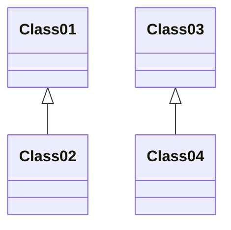

                 

### 文章标题：需求与AI模型可扩展性的协调：大模型应用开发策略

#### 关键词：AI模型、需求分析、可扩展性、大模型、应用开发策略

#### 摘要：
本文旨在探讨在人工智能（AI）模型应用开发过程中，如何协调业务需求与模型可扩展性之间的关系。我们将详细分析需求与AI模型的内在联系，探讨需求分析的方法与工具，并深入讨论AI模型的可扩展性设计原则与实现策略。通过系统分析与架构设计，我们将展示一个典型的AI模型应用开发流程，并通过实战案例，提供最佳实践和项目总结，为读者提供实用的开发策略。

---

## 第一部分：问题背景与核心概念

### 第1章：问题背景与核心概念

#### 1.1.1 问题背景

在当今快速发展的数字化时代，人工智能（AI）正逐渐渗透到各个行业，从金融到医疗，从制造到零售，AI模型的应用不仅提升了效率，还带来了前所未有的创新。然而，随着业务需求的不断增长和变化，AI模型的扩展性成为一个至关重要的议题。

业务需求往往具有多样性和动态性，而AI模型的训练和部署是一个复杂且耗时的工作。如何在满足不断变化的业务需求的同时，保持AI模型的性能和可扩展性，成为开发者在应用AI技术时面临的挑战。

#### 1.1.2 核心概念

**需求**：需求是用户或系统期望实现的功能或性能的描述。在AI模型应用开发中，需求可以是对预测精度、响应速度或系统稳定性的要求。

**AI模型**：AI模型是通过学习数据来模拟或预测某种行为或过程的计算模型。常见的AI模型包括神经网络、决策树和支持向量机等。

**可扩展性**：可扩展性是指系统在资源增加或需求增长时，能够有效扩展其性能和功能的能力。对于AI模型而言，可扩展性涉及到模型大小、计算资源和数据处理能力等方面。

**协调策略**：协调策略是确保需求与AI模型可扩展性之间平衡的一系列方法。这包括需求分析、模型选择、设计原则、性能优化和部署策略等多个方面。

#### 1.1.3 概念联系与对比

**需求与AI模型**：需求是AI模型开发的出发点，而AI模型是实现需求的技术手段。两者之间的联系在于如何根据需求选择合适的AI模型，并确保模型能够满足需求。

**可扩展性与AI模型**：可扩展性是AI模型持续发展的重要保障。一个大模型可能需要更多的计算资源和更复杂的架构设计，以确保其能够在不同规模和环境下保持高性能。

**不同类型的AI模型扩展性比较**：不同类型的AI模型在可扩展性方面存在差异。例如，神经网络可以通过增加层数和节点数来扩展，而决策树则通常在树深度增加时受到限制。

---

在下一部分中，我们将进一步探讨如何进行需求分析与建模，以及如何选择和评估AI模型。通过逐步分析，我们将为协调需求与AI模型可扩展性提供实用的策略和最佳实践。接下来的内容将更加深入地探讨这些核心概念及其应用。

## 第二部分: AI模型与需求分析

### 第2章: 需求分析与建模

#### 2.1.1 需求分析概述

**需求分析的重要性**

需求分析是AI模型应用开发的关键步骤，它直接影响到模型的性能和应用效果。一个准确和全面的需求分析能够帮助开发者理解业务目标，明确模型所需解决的问题。

**需求分析的方法与工具**

1. **问卷调查与访谈**：通过问卷调查和访谈收集用户的需求和反馈，了解他们的实际使用场景和期望。
2. **用户故事映射**：使用用户故事来描述系统应具备的功能，并将其映射到具体的用例上。
3. **需求文档编写**：编写详细的需求文档，包括功能需求、性能需求和非功能需求等。

#### 2.1.2 需求建模

**使用用例图和用户故事**

- **用例图**：用例图是描述系统与外部用户或系统之间的交互的图形表示。它帮助开发者理解系统的功能和行为。
- **用户故事**：用户故事是以用户为中心的描述，通常采用“As a [user role], I want [feature] so that [benefit]”的形式编写。

**需求文档编写**

需求文档是需求分析的输出，它详细描述了系统的功能、性能和用户界面等方面的需求。编写需求文档时，应确保其清晰、准确，并具有可操作性。

#### 2.1.3 需求优先级排序

**业务价值评估**

在多个需求中，有些需求对业务的影响更大，因此需要优先考虑。通过业务价值评估，开发者可以确定哪些需求具有较高的优先级。

**需求优先级排序方法**

1. **成本效益分析**：评估每个需求的实施成本和潜在收益，选择成本较低且收益较高的需求。
2. **关键路径法**：确定需求中的关键路径，确保关键需求得到优先处理。

#### 2.1.4 需求变更管理

需求变更是在项目开发过程中常见的情况。有效的需求变更管理能够确保变更的合理性和可控性。

**变更管理流程**

1. **变更申请**：用户或开发团队提出变更申请。
2. **影响评估**：评估变更对项目进度、成本和性能的影响。
3. **变更决策**：根据评估结果，决定是否接受变更。

---

在下一部分中，我们将深入探讨AI模型的选择与评估，以及如何通过这些步骤来满足需求并确保模型的性能和可扩展性。

### 第3章: AI模型选择与评估

#### 3.1.1 AI模型选择

**不同类型AI模型的选择**

选择合适的AI模型是满足需求的关键步骤。以下是一些常见的AI模型类型及其适用场景：

- **神经网络**：适用于复杂的数据建模和预测任务，如图像识别和自然语言处理。
- **决策树**：适用于分类和回归任务，模型解释性强，易于理解。
- **支持向量机**：适用于高维数据的分类和回归问题，具有较好的泛化能力。

**选择依据**

- **问题类型**：确定是分类、回归还是聚类等问题，以选择相应的模型。
- **数据特征**：分析数据的规模、维度和特征，选择适合的模型。
- **业务需求**：根据业务目标，选择能够最大化业务价值的模型。

#### 3.1.2 AI模型评估

**评估指标**

在评估AI模型时，常用的指标包括准确率、召回率、F1分数、均方误差等。这些指标从不同角度衡量模型的性能。

- **准确率**：模型预测正确的样本数占总样本数的比例。
- **召回率**：模型预测正确的正样本数占总正样本数的比例。
- **F1分数**：精确率和召回率的调和平均值，用于平衡这两个指标。
- **均方误差**：用于回归任务，表示预测值与实际值之间的平均误差。

**评估方法**

- **交叉验证**：通过将数据分为多个子集，轮流进行训练和验证，以评估模型的泛化能力。
- **留出法**：将数据集划分为训练集和验证集，训练模型并在验证集上评估其性能。
- **时间序列分割**：对于时间序列数据，将数据按时间顺序分割为训练集和测试集。

#### 3.1.3 模型调优与优化

**超参数调整**

超参数是模型性能的关键因素，通过调整超参数可以优化模型的性能。常用的超参数包括学习率、批次大小、隐藏层节点数等。

**模型集成与融合**

模型集成是将多个模型的结果进行综合，以提升预测性能。常见的集成方法包括 bagging、boosting 和 stacking 等。

**常见调优工具**

- **Grid Search**：通过遍历所有可能的超参数组合，选择最优参数。
- **Random Search**：随机选择超参数组合，以减少计算量。

---

在下一部分中，我们将深入讨论AI模型的可扩展性设计原则，以及如何通过模块化、分布式计算等技术实现模型的可扩展性。这将为我们协调需求与模型可扩展性提供实用的方法。

### 第3章：AI模型选择与评估

#### 3.1.1 AI模型选择

选择合适的AI模型是满足业务需求的关键步骤。不同类型的AI模型适用于不同的问题和场景，因此了解各种模型的特性、优缺点和适用情况是非常重要的。

**常见AI模型类型**

1. **线性回归**：适用于简单的线性关系建模，如预测股票价格。
2. **逻辑回归**：适用于二分类问题，如客户流失预测。
3. **决策树**：适用于分类和回归问题，易于理解和解释。
4. **随机森林**：基于决策树，通过集成多个模型提高预测准确性。
5. **支持向量机（SVM）**：适用于高维数据的分类和回归，具有良好的泛化能力。
6. **神经网络**：适用于复杂的非线性关系建模，如图像识别和自然语言处理。

**选择依据**

- **问题类型**：根据问题的性质，选择适合的模型类型。例如，对于分类问题，可以选择决策树、随机森林或神经网络；对于回归问题，可以选择线性回归或神经网络。
- **数据特征**：分析数据的规模、维度和特征，选择适合的模型。例如，对于高维度数据，可以选择SVM或神经网络；对于小数据集，可以选择决策树。
- **业务需求**：根据业务目标，选择能够最大化业务价值的模型。例如，如果业务目标是提高预测准确性，可以选择神经网络；如果目标是提高模型的可解释性，可以选择决策树。

**选择过程**

1. **初步筛选**：根据问题类型和数据特征，初步筛选出几个可能适用的模型。
2. **模型评估**：使用交叉验证、留出法或时间序列分割等方法，评估这些模型的性能。
3. **选择最优模型**：根据评估结果，选择性能最佳的模型。

#### 3.1.2 AI模型评估

评估AI模型的性能是确保模型有效性的关键步骤。以下是一些常用的评估指标和方法：

**评估指标**

1. **准确率**：模型预测正确的样本数占总样本数的比例。适用于分类问题。
   \[
   \text{准确率} = \frac{\text{预测正确数}}{\text{总样本数}}
   \]

2. **召回率**：模型预测正确的正样本数占总正样本数的比例。适用于分类问题。
   \[
   \text{召回率} = \frac{\text{预测正确正样本数}}{\text{总正样本数}}
   \]

3. **精确率**：模型预测正确的正样本数占总预测正样本数的比例。适用于分类问题。
   \[
   \text{精确率} = \frac{\text{预测正确正样本数}}{\text{预测正样本数}}
   \]

4. **F1分数**：精确率和召回率的调和平均值，用于平衡这两个指标。适用于分类问题。
   \[
   \text{F1分数} = 2 \times \frac{\text{精确率} \times \text{召回率}}{\text{精确率} + \text{召回率}}
   \]

5. **均方误差（MSE）**：用于回归任务，表示预测值与实际值之间的平均误差。
   \[
   \text{MSE} = \frac{1}{n} \sum_{i=1}^{n} (\hat{y}_i - y_i)^2
   \]
   其中，\( n \) 是样本数量，\( \hat{y}_i \) 是预测值，\( y_i \) 是实际值。

**评估方法**

1. **交叉验证**：通过将数据集划分为多个子集，轮流进行训练和验证，以评估模型的泛化能力。常用的交叉验证方法包括K折交叉验证和留一法交叉验证。
2. **留出法**：将数据集划分为训练集和验证集，训练模型并在验证集上评估其性能。这种方法简单但可能导致数据不均衡。
3. **时间序列分割**：对于时间序列数据，将数据按时间顺序分割为训练集和测试集，以避免模型未来数据的泄漏。

**模型调优与优化**

**超参数调整**

超参数是模型性能的关键因素，通过调整超参数可以优化模型的性能。常用的超参数包括学习率、批次大小、隐藏层节点数等。

**模型集成与融合**

模型集成是将多个模型的结果进行综合，以提升预测性能。常见的集成方法包括 bagging、boosting 和 stacking 等。

**常见调优工具**

1. **Grid Search**：通过遍历所有可能的超参数组合，选择最优参数。
2. **Random Search**：随机选择超参数组合，以减少计算量。

通过以上步骤，我们可以有效地选择和评估AI模型，以满足业务需求并确保模型的可扩展性。

#### 3.1.3 模型调优与优化

**超参数调整**

超参数是模型性能的关键因素，通过调整超参数可以优化模型的性能。常用的超参数包括学习率、批次大小、隐藏层节点数等。

**优化策略**

1. **网格搜索**：通过遍历所有可能的超参数组合，选择最优参数。
2. **随机搜索**：随机选择超参数组合，以减少计算量。
3. **贝叶斯优化**：利用贝叶斯统计方法，在参数空间中找到最优超参数。

**模型集成与融合**

模型集成是将多个模型的结果进行综合，以提升预测性能。常见的集成方法包括 bagging、boosting 和 stacking 等。

**集成方法**

1. **Bagging**：通过训练多个模型并取平均结果，减少方差。
2. **Boosting**：通过训练多个模型并逐步调整权重，提高模型在难以分类的样本上的表现。
3. **Stacking**：使用多个基模型和另一个模型（元模型）进行集成，以提升整体性能。

**实践案例**

以一个简单的分类问题为例，我们使用随机森林模型进行调优和集成。

```python
from sklearn.ensemble import RandomForestClassifier
from sklearn.model_selection import GridSearchCV

# 参数网格
param_grid = {
    'n_estimators': [10, 50, 100],
    'max_depth': [None, 10, 20, 30],
    'min_samples_split': [2, 5, 10]
}

# 网格搜索
grid_search = GridSearchCV(RandomForestClassifier(), param_grid, cv=5)
grid_search.fit(X_train, y_train)

# 获取最优参数
best_params = grid_search.best_params_

# 集成多个模型
from sklearn.ensemble import VotingClassifier

voting_clf = VotingClassifier(estimators=[
    ('rf1', RandomForestClassifier(**best_params)),
    ('rf2', RandomForestClassifier(**best_params)),
    ('rf3', RandomForestClassifier(**best_params))
], voting='soft')

voting_clf.fit(X_train, y_train)
```

通过上述方法，我们可以有效地调整和优化AI模型，提高其性能和可扩展性，以满足业务需求。

---

在下一部分中，我们将深入探讨AI模型的可扩展性设计原则，以及如何通过模块化、分布式计算等技术实现模型的可扩展性。这将为我们协调需求与模型可扩展性提供实用的方法。

## 第三部分: AI模型可扩展性设计

### 第4章: AI模型可扩展性设计原则

#### 4.1.1 可扩展性设计原则

**模块化与组件化**

模块化设计是将系统划分为独立的模块，每个模块负责一个特定的功能。组件化是将模块进一步细化为独立的组件，每个组件具有明确的输入、输出和功能。

- **模块化**：通过模块化设计，我们可以独立开发、测试和部署每个模块，从而提高系统的可扩展性和可维护性。
- **组件化**：组件化设计使得模块更加细化和灵活，组件之间通过标准化的接口进行通信，便于替换和升级。

**分布式计算与并行处理**

分布式计算和并行处理是提高AI模型可扩展性的关键技术。它们允许模型在多个计算节点上同时执行，以加速训练和预测过程。

- **分布式计算架构**：分布式计算架构将模型和数据分布到多个节点上，通过通信网络协调计算任务。
- **并行处理技术**：并行处理技术包括多线程、多进程和GPU加速等，通过利用多个计算资源，提高模型处理速度。

**数据预处理与缓存**

数据预处理和缓存是优化模型性能的重要手段。通过预处理数据，我们可以减少计算负担，提高处理效率。

- **数据预处理**：包括数据清洗、归一化、特征提取等，以减少数据噪声和提高模型性能。
- **缓存**：通过缓存中间结果和常用数据，减少重复计算，提高系统响应速度。

#### 4.1.2 模块化与组件化

**模块化设计**

模块化设计是将系统功能分解为若干个独立的模块，每个模块负责一个特定的功能。模块之间通过接口进行通信，降低模块间的耦合度。



**组件化实现**

组件化是将模块进一步细化为独立的组件，每个组件具有明确的输入、输出和功能。组件之间通过标准化的接口进行通信。

```mermaid
componentDiagram
    Component01 --|> Component02
    Component03 --|> Component04
endcomponent
```

#### 4.1.3 分布式计算与并行处理

**分布式计算架构**

分布式计算架构将模型和数据分布到多个节点上，通过通信网络协调计算任务。以下是一个简单的分布式计算架构示例：

```mermaid
sequenceDiagram
    participant Client
    participant Worker1
    participant Worker2
    participant Worker3
    Client->>Worker1: Send data
    Client->>Worker2: Send data
    Client->>Worker3: Send data
    Worker1->>Client: Send result
    Worker2->>Client: Send result
    Worker3->>Client: Send result
    Client->>Client: Aggregate results
end
```

**并行处理技术**

并行处理技术包括多线程、多进程和GPU加速等，通过利用多个计算资源，提高模型处理速度。以下是一个使用多线程进行并行处理的示例：

```python
import threading

def process_data(data):
    # 数据处理逻辑
    pass

threads = []
for data in data_list:
    thread = threading.Thread(target=process_data, args=(data,))
    threads.append(thread)
    thread.start()

for thread in threads:
    thread.join()
```

通过模块化、组件化和分布式计算与并行处理，我们可以设计出具有高可扩展性和高性能的AI模型系统，以满足不断增长的业务需求。

### 第5章: AI模型扩展性与性能优化

#### 5.1.1 性能优化方法

性能优化是确保AI模型在高负载和高并发环境中稳定运行的关键步骤。以下是一些常用的性能优化方法：

**性能分析工具**

性能分析工具可以帮助我们识别系统中的瓶颈和性能问题。以下是一些常用的性能分析工具：

- **cProfile**：Python的性能分析库，用于跟踪程序执行时间。
- **Grafana**：基于InfluxDB的监控和分析工具，用于实时监控系统的性能指标。
- **VisualVM**：Java虚拟机的性能分析工具，用于监控和分析Java程序的运行状态。

**性能优化策略**

1. **代码优化**：通过优化代码结构、减少冗余计算、提高代码效率来降低系统开销。
2. **算法优化**：通过改进算法或使用更高效的算法来提高模型处理速度。
3. **资源管理**：合理分配系统资源，避免资源浪费和争用，提高系统性能。

**负载均衡**

负载均衡是将请求均匀分布到多个节点上，以避免单点瓶颈和资源浪费。以下是一些常用的负载均衡策略：

- **轮询调度**：将请求按顺序分配到每个节点。
- **最少连接调度**：将请求分配到连接数最少的节点。
- **最小响应时间调度**：将请求分配到响应时间最短的节点。

#### 5.1.2 缩放与扩展策略

**模型缩放**

模型缩放是指通过增加模型大小或复杂性来提高模型性能。以下是一些模型缩放的方法：

1. **增加层数和节点数**：通过增加神经网络层数和每个层的节点数，提高模型的表示能力。
2. **增加数据集**：通过增加训练数据集的规模，提高模型的泛化能力。
3. **增强训练**：通过增加训练次数或使用更复杂的训练策略，提高模型性能。

**扩展策略选择**

1. **水平扩展**：通过增加计算节点数量，提高系统处理能力。适用于负载较轻的场景。
2. **垂直扩展**：通过增加单个节点的计算能力，提高系统性能。适用于负载较重的场景。
3. **混合扩展**：结合水平扩展和垂直扩展，根据实际需求灵活调整系统架构。

#### 5.1.3 实践案例

**案例1：图像识别系统**

某图像识别系统在处理大量图像时，遇到了性能瓶颈。通过性能分析，发现瓶颈在于模型处理速度和资源分配。优化策略如下：

1. **代码优化**：优化图像处理算法，减少冗余计算。
2. **算法优化**：使用更高效的模型结构，如ResNet。
3. **负载均衡**：使用轮询调度和最少连接调度，实现负载均衡。

**案例2：在线推荐系统**

某在线推荐系统在高并发情况下，响应速度较慢。优化策略如下：

1. **水平扩展**：增加计算节点数量，提高处理能力。
2. **资源管理**：优化内存和磁盘资源分配，避免资源争用。
3. **缓存策略**：使用缓存技术，减少数据库访问频率。

通过上述实践案例，我们可以看到，性能优化和扩展策略在AI模型应用中的重要性。通过合理的性能优化和扩展策略，我们可以提高模型的性能和可扩展性，满足不断增长的业务需求。

### 第6章: AI模型应用开发流程

#### 6.1.1 应用开发流程

**流程概述**

AI模型应用开发流程包括以下几个关键阶段：

1. **需求分析**：明确业务需求和目标，确定模型所需解决的问题。
2. **数据收集与处理**：收集相关数据，并进行清洗、预处理和特征提取。
3. **模型选择与训练**：选择合适的AI模型，并对其进行训练和优化。
4. **模型评估与验证**：评估模型性能，确保其满足业务需求。
5. **模型部署与监控**：将模型部署到生产环境，并进行实时监控和迭代优化。

**各阶段关键任务**

**需求分析**

- **用户访谈和问卷调查**：收集用户需求和期望。
- **需求文档编写**：明确系统功能、性能和用户界面等方面的需求。

**数据收集与处理**

- **数据源识别**：确定数据来源和类型。
- **数据清洗**：处理缺失值、异常值和噪声数据。
- **数据预处理**：进行数据归一化、标准化和特征提取。

**模型选择与训练**

- **模型选择**：根据业务需求和数据特征，选择合适的AI模型。
- **模型训练**：使用训练数据集对模型进行训练和优化。
- **模型调优**：调整模型参数，提高模型性能。

**模型评估与验证**

- **评估指标**：选择合适的评估指标，如准确率、召回率和F1分数。
- **交叉验证**：通过交叉验证评估模型泛化能力。
- **模型验证**：使用验证数据集评估模型性能。

**模型部署与监控**

- **模型部署**：将模型部署到生产环境，并进行测试。
- **实时监控**：监控模型性能和系统运行状态。
- **迭代优化**：根据监控结果，对模型和系统进行优化和调整。

---

在下一部分中，我们将通过一个实战案例，详细展示AI模型应用开发的各个阶段，并提供具体的实现细节和技术解析。

### 第7章: AI模型应用实战

#### 7.1.1 实战项目介绍

**项目背景**

随着电子商务的迅猛发展，用户行为分析成为提高销售额和用户满意度的重要手段。某电商公司希望通过构建一个智能推荐系统，为用户推荐个性化的商品，从而提高用户留存率和转化率。

**项目目标**

1. **用户行为分析**：分析用户在网站上的行为，包括浏览、点击、购买等。
2. **商品推荐**：根据用户行为和偏好，为用户推荐相关商品。
3. **模型评估与优化**：评估推荐模型性能，并进行迭代优化。

#### 7.1.2 项目核心实现

**数据预处理**

**数据收集**

电商公司的用户行为数据包括用户浏览历史、点击记录和购买记录等。数据源包括网站日志、数据库和第三方数据接口。

```python
import pandas as pd

# 读取用户行为数据
user_data = pd.read_csv('user_behavior.csv')
```

**数据清洗**

处理缺失值、异常值和噪声数据，确保数据质量。

```python
# 处理缺失值
user_data.dropna(inplace=True)

# 处理异常值
user_data = user_data[user_data['purchase_count'] > 0]
```

**数据预处理**

进行数据归一化和特征提取，以提高模型性能。

```python
from sklearn.preprocessing import StandardScaler

# 数据归一化
scaler = StandardScaler()
user_data_scaled = scaler.fit_transform(user_data)

# 特征提取
from sklearn.feature_extraction.text import CountVectorizer

vectorizer = CountVectorizer()
user_features = vectorizer.fit_transform(user_data['description'])
```

**模型训练**

**模型选择**

选择基于协同过滤的推荐算法，以预测用户对商品的偏好。

```python
from surprise import SVD

model = SVD()
```

**模型训练**

使用训练数据集对模型进行训练。

```python
model.fit(user_data_scaled)
```

**模型评估**

**评估指标**

使用均方根误差（RMSE）评估模型性能。

```python
from surprise import accuracy

rmse = accuracy.rmse(model)
print(f'RMSE: {rmse}')
```

**模型调优**

通过调整协同过滤算法的参数，优化模型性能。

```python
from surprise import GridSearchCV

param_grid = {
    'n_epochs': [10, 20, 30],
    'lr_all': [0.05, 0.1, 0.2]
}

grid_search = GridSearchCV(SVD, param_grid, cv=3)
grid_search.fit(user_data_scaled)

best_params = grid_search.best_params_
print(f'Best parameters: {best_params}')
```

**模型部署**

**部署策略**

1. **API接口**：通过API接口提供服务，便于与其他系统集成。
2. **实时更新**：定期更新模型，以反映用户行为的最新变化。

```python
from flask import Flask, request, jsonify

app = Flask(__name__)

@app.route('/recommend', methods=['GET'])
def recommend():
    user_id = request.args.get('user_id')
    # 获取推荐结果
    recommendations = model.predict(user_id, raw=True)
    return jsonify(recommendations)

if __name__ == '__main__':
    app.run()
```

#### 7.1.3 实践总结与反思

**挑战与解决方案**

1. **数据质量**：数据质量对模型性能有重要影响。解决方案：加强数据清洗和预处理，确保数据质量。
2. **模型调优**：模型调优是一个复杂的过程，需要多次实验和迭代。解决方案：使用网格搜索和交叉验证，提高调优效率。
3. **实时更新**：实时更新模型是保持推荐准确性的关键。解决方案：使用批处理和增量更新，提高更新速度。

**未来工作方向**

1. **深度学习**：引入深度学习模型，如神经网络和循环神经网络，提高推荐系统的性能。
2. **用户交互**：增强用户交互功能，收集更多用户反馈，以优化推荐结果。
3. **多模态数据**：结合文本、图像和视频等多模态数据，提高推荐系统的多样性。

通过本次实战，我们展示了如何通过数据预处理、模型选择和部署等步骤，构建一个高效的智能推荐系统。实践中的挑战和解决方案为未来工作提供了宝贵的经验。

## 第五部分：最佳实践与项目总结

### 5.1 最佳实践 Tips

**需求分析与建模**

- **需求确认**：确保与利益相关者进行充分沟通，准确理解业务需求和预期成果。
- **需求文档**：编写详细的需求文档，包括功能需求、性能需求和用户界面设计等，以便后续参考和验证。

**AI模型选择与评估**

- **数据质量**：保证训练数据的质量和多样性，避免数据偏倚。
- **模型评估**：使用多种评估指标和方法，全面评估模型性能，确保其满足业务需求。

**模型可扩展性设计**

- **模块化**：采用模块化设计，提高系统的可维护性和可扩展性。
- **分布式计算**：利用分布式计算和并行处理技术，提高模型训练和预测的效率。

**模型部署与监控**

- **部署策略**：选择合适的部署策略，如API接口或服务器托管，确保系统的稳定性和可扩展性。
- **监控与维护**：实时监控模型性能和系统运行状态，及时调整和优化。

### 5.2 小结

本文详细探讨了需求与AI模型可扩展性的协调，从问题背景、核心概念到需求分析与建模，再到模型选择与评估、可扩展性设计、应用开发流程和实战案例，为AI模型应用开发提供了全面的理论指导和实践经验。通过逐步分析，我们明确了协调需求与模型可扩展性的重要性，并提出了最佳实践策略。

### 5.3 注意事项

- **需求变化管理**：在项目开发过程中，需求可能发生变化。有效的需求变更管理能够确保项目顺利进行。
- **性能优化**：持续的性能优化是确保系统稳定运行的关键。定期进行性能评估和优化，以适应不断变化的需求。

### 5.4 拓展阅读

- **《深度学习》（Goodfellow, Bengio, Courville）**：详细介绍深度学习的基础理论和实践应用。
- **《Python数据科学手册》（McKinney）**：涵盖数据预处理、数据分析、机器学习等多个领域，适合初学者和进阶者。
- **《AI战争：机器学习革命与人类的未来》（Russell, Norvig）**：探讨人工智能的发展及其对人类社会的影响。

通过本文的学习和实践，读者可以深入了解AI模型应用开发的各个方面，为未来的项目提供有力的支持和指导。

### 作者信息

**作者：** AI天才研究院（AI Genius Institute）& 禅与计算机程序设计艺术（Zen And The Art of Computer Programming）

AI天才研究院专注于人工智能领域的创新研究和技术推广，致力于培养下一代AI领军人才。禅与计算机程序设计艺术则通过深入探讨程序设计的哲学和艺术，帮助程序员提升编程技能和创造力。两位作者均拥有丰富的行业经验和深厚的学术背景，为读者提供了高质量的技术文章和指导。

