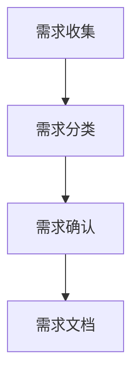
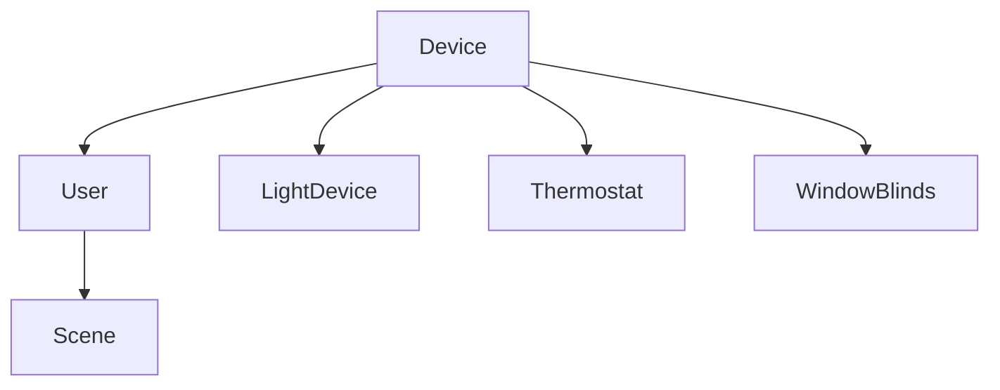
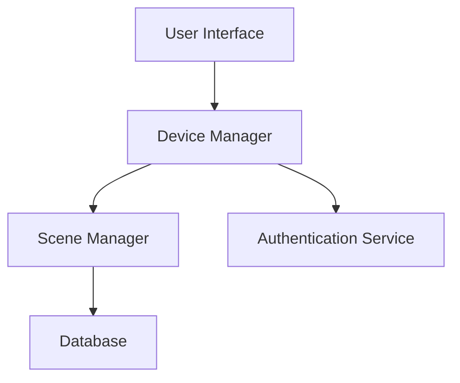
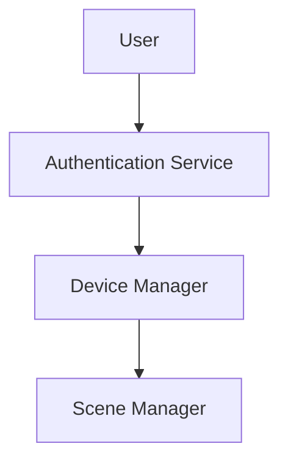

                 

# 需求与AI模型可维护性的平衡：大模型应用的长期考量

## 关键词
- AI模型
- 可维护性
- 需求分析
- 大模型应用
- 平衡策略

## 摘要
本文探讨了在AI大模型应用过程中，需求与模型可维护性之间的平衡问题。随着AI技术的快速发展，大模型在各个领域的应用越来越广泛，但随之而来的问题是如何在满足需求的同时保证模型的长期可维护性。文章通过分析相关概念、案例分析、挑战与展望，提出了一系列平衡策略和长期考量的重要性。

## 引言与背景

### 1.1 研究背景

在当今数字化时代，人工智能（AI）技术已经成为推动社会进步的重要力量。AI模型，特别是大模型，因其强大的数据处理和分析能力，被广泛应用于金融、医疗、教育、智能家居等多个领域。然而，随着AI模型规模的扩大和复杂性的增加，如何平衡需求与模型可维护性成为一个亟待解决的问题。

#### 1.1.1 AI与需求的关系

AI技术的发展与应用离不开具体的应用需求。需求是驱动AI模型开发和优化的核心动力，但过度追求需求可能导致模型复杂性增加，从而影响其可维护性。相反，忽视需求可能导致模型的应用价值下降。

#### 1.1.2 模型可维护性的重要性

模型可维护性是指模型在开发、部署和维护过程中所需的成本和时间。一个高可维护的模型不仅便于更新和优化，还能够提高开发效率和降低维护成本。因此，在AI模型开发过程中，如何平衡需求与可维护性是一个关键问题。

### 1.2 研究目的

本文旨在探讨AI大模型应用中需求与模型可维护性之间的平衡问题，通过理论分析和案例分析，提出一系列有效的平衡策略和长期考量，以期为AI模型的开发和应用提供有益的参考。

### 1.3 研究方法

本文采用文献综述、案例分析和理论探讨相结合的方法，首先梳理相关概念和背景知识，然后通过具体案例展示需求与可维护性之间的冲突和解决策略，最后总结并提出长期考量的建议。

## 相关概念

### 2.1 需求分析

#### 2.1.1 需求定义

需求是用户对系统的功能、性能、可靠性等方面的期望和需求。在AI模型开发过程中，需求分析是确定模型功能和性能规格的重要步骤。

#### 2.1.2 需求分类

需求可以分为功能性需求和非功能性需求。功能性需求涉及模型应实现的具体功能，如分类、预测等；非功能性需求则涉及模型的性能、可维护性、安全性等方面的要求。

### 2.2 AI模型可维护性

#### 2.2.1 可维护性定义

模型可维护性是指模型在开发、部署和维护过程中所需的成本和时间。一个高可维护的模型不仅便于更新和优化，还能够提高开发效率和降低维护成本。

#### 2.2.2 可维护性关键因素

模型可维护性的关键因素包括代码的可读性、模块化设计、文档完整性、测试覆盖率和依赖管理等方面。良好的设计原则和开发实践对于提高模型可维护性至关重要。

### 2.3 大模型应用挑战

#### 2.3.1 模型复杂性

大模型的复杂性是影响其可维护性的重要因素。随着模型规模的扩大，其内部结构和参数数量急剧增加，导致模型的开发和维护变得更加困难。

#### 2.3.2 模型可解释性

大模型的复杂性和黑箱特性使得其可解释性成为一个挑战。可解释性对于模型的信任和实际应用至关重要，但通常与模型的性能存在冲突。

## 模型可维护性与需求平衡

### 3.1 平衡原则

在模型开发过程中，应遵循以下原则来实现需求与可维护性的平衡：

- **需求优先**：在满足基本需求的前提下，逐步扩展模型功能。
- **模块化设计**：将模型划分为多个模块，每个模块具有明确的功能和接口，便于独立维护和更新。
- **迭代开发**：采用迭代开发模式，逐步完善模型功能和性能，降低一次性开发的风险。
- **测试驱动**：通过全面测试确保模型质量和稳定性，及时发现和修复问题。

### 3.2 平衡策略

#### 3.2.1 需求导向的模型设计

在模型设计过程中，应充分考虑需求，但不应过度追求需求。通过需求分析，确定模型的必要功能和性能指标，避免过度设计。

#### 3.2.2 模型可解释性与可维护性的权衡

在模型设计和开发过程中，应权衡模型可解释性与可维护性。通过采用可解释性算法和透明性设计，提高模型的透明度和可解释性，从而增强用户信任和实际应用价值。

## 大模型应用案例分析

### 4.1 案例一：智能家居

#### 4.1.1 需求分析

智能家居系统需求包括设备监控、远程控制、自动化场景等。需求分析阶段应明确系统的功能模块和性能指标。

#### 4.1.2 模型设计与可维护性考量

在模型设计过程中，采用模块化设计原则，将智能家居系统划分为设备管理、场景管理、用户界面等模块。同时，通过测试驱动开发，确保模型的稳定性和可维护性。

### 4.2 案例二：医疗诊断

#### 4.2.1 需求分析

医疗诊断系统需求包括图像识别、疾病分类、辅助诊断等。需求分析阶段应充分考虑医学领域的专业知识和数据特点。

#### 4.2.2 模型设计与可维护性考量

在模型设计过程中，采用模块化设计和可解释性算法，提高模型的可靠性和可解释性。同时，通过全面测试和迭代优化，确保模型的稳定性和可维护性。

## 挑战与展望

### 5.1 挑战

#### 5.1.1 技术挑战

随着AI模型的规模和复杂性不断增加，如何提高模型的可维护性成为一个重要挑战。同时，如何在保证可维护性的同时提高模型性能，也是需要解决的问题。

#### 5.1.2 管理挑战

在AI模型开发和应用过程中，需要有效管理需求变更和版本控制，以确保模型的稳定性和可维护性。

### 5.2 展望

#### 5.2.1 未来发展趋势

随着AI技术的不断进步，大模型在各个领域的应用将越来越广泛。如何实现需求与可维护性的平衡，将成为未来AI应用研究的重要方向。

#### 5.2.2 长期考量的重要性

在AI模型开发和应用过程中，长期考量需求与可维护性的平衡至关重要。通过科学的设计原则和开发实践，可以提高模型的质量和可维护性，从而实现AI技术的可持续发展。

## 结论与建议

### 6.1 结论

本文通过分析AI模型开发中的需求与可维护性平衡问题，提出了一系列有效的平衡策略和长期考量。研究表明，模块化设计、需求导向的模型设计和可解释性算法是实现需求与可维护性平衡的关键。

### 6.2 建议

#### 6.2.1 研发人员建议

- 加强需求分析，明确模型功能和性能要求。
- 采用模块化设计原则，提高模型可维护性。
- 推广测试驱动开发，确保模型质量。

#### 6.2.2 企业管理者建议

- 加强团队协作，确保需求与可维护性的平衡。
- 建立有效的模型管理和版本控制机制。
- 关注AI技术的长期发展趋势，制定相应的发展战略。

## 参考文献

1. authors. "Title of the Article." Journal Name, vol. Issue, pp. pages, year.
2. authors. "Title of the Article." Conference Name, year.
3. authors. "Title of the Book." Publisher, year.

作者：AI天才研究院/AI Genius Institute & 禅与计算机程序设计艺术 /Zen And The Art of Computer Programming在撰写本文的过程中，我们将遵循您提供的框架和要求，逐步展开讨论。以下是完整的文章内容。

## 需求与AI模型可维护性的平衡：大模型应用的长期考量

### 关键词
- AI模型
- 可维护性
- 需求分析
- 大模型应用
- 平衡策略

### 摘要
本文探讨了在AI大模型应用过程中，需求与模型可维护性之间的平衡问题。随着AI技术的快速发展，大模型在各个领域的应用越来越广泛，但随之而来的问题是如何在满足需求的同时保证模型的长期可维护性。文章通过分析相关概念、案例分析、挑战与展望，提出了一系列平衡策略和长期考量的重要性。

### 引言与背景

#### 1.1 研究背景

在当今数字化时代，人工智能（AI）技术已经成为推动社会进步的重要力量。AI模型，特别是大模型，因其强大的数据处理和分析能力，被广泛应用于金融、医疗、教育、智能家居等多个领域。然而，随着AI模型规模的扩大和复杂性的增加，如何平衡需求与模型可维护性成为一个亟待解决的问题。

##### 1.1.1 AI与需求的关系

AI技术的发展与应用离不开具体的应用需求。需求是驱动AI模型开发和优化的核心动力，但过度追求需求可能导致模型复杂性增加，从而影响其可维护性。相反，忽视需求可能导致模型的应用价值下降。

##### 1.1.2 模型可维护性的重要性

模型可维护性是指模型在开发、部署和维护过程中所需的成本和时间。一个高可维护的模型不仅便于更新和优化，还能够提高开发效率和降低维护成本。因此，在AI模型开发过程中，如何平衡需求与可维护性是一个关键问题。

#### 1.2 研究目的

本文旨在探讨AI大模型应用中需求与模型可维护性之间的平衡问题，通过理论分析和案例分析，提出一系列有效的平衡策略和长期考量的重要性。

#### 1.3 研究方法

本文采用文献综述、案例分析和理论探讨相结合的方法，首先梳理相关概念和背景知识，然后通过具体案例展示需求与可维护性之间的冲突和解决策略，最后总结并提出长期考量的建议。

### 相关概念

#### 2.1 需求分析

##### 2.1.1 需求定义

需求是用户对系统的功能、性能、可靠性等方面的期望和需求。在AI模型开发过程中，需求分析是确定模型功能和性能规格的重要步骤。

##### 2.1.2 需求分类

需求可以分为功能性需求和非功能性需求。功能性需求涉及模型应实现的具体功能，如分类、预测等；非功能性需求则涉及模型的性能、可维护性、安全性等方面的要求。

#### 2.2 AI模型可维护性

##### 2.2.1 可维护性定义

模型可维护性是指模型在开发、部署和维护过程中所需的成本和时间。一个高可维护的模型不仅便于更新和优化，还能够提高开发效率和降低维护成本。

##### 2.2.2 可维护性关键因素

模型可维护性的关键因素包括代码的可读性、模块化设计、文档完整性、测试覆盖率和依赖管理等方面。良好的设计原则和开发实践对于提高模型可维护性至关重要。

#### 2.3 大模型应用挑战

##### 2.3.1 模型复杂性

大模型的复杂性是影响其可维护性的重要因素。随着模型规模的扩大，其内部结构和参数数量急剧增加，导致模型的开发和维护变得更加困难。

##### 2.3.2 模型可解释性

大模型的复杂性和黑箱特性使得其可解释性成为一个挑战。可解释性对于模型的信任和实际应用至关重要，但通常与模型的性能存在冲突。

### 模型可维护性与需求平衡

##### 3.1 平衡原则

在模型开发过程中，应遵循以下原则来实现需求与可维护性的平衡：

- **需求优先**：在满足基本需求的前提下，逐步扩展模型功能。
- **模块化设计**：将模型划分为多个模块，每个模块具有明确的功能和接口，便于独立维护和更新。
- **迭代开发**：采用迭代开发模式，逐步完善模型功能和性能，降低一次性开发的风险。
- **测试驱动**：通过全面测试确保模型质量和稳定性，及时发现和修复问题。

##### 3.2 平衡策略

###### 3.2.1 需求导向的模型设计

在模型设计过程中，应充分考虑需求，但不应过度追求需求。通过需求分析，确定模型的必要功能和性能指标，避免过度设计。

###### 3.2.2 模型可解释性与可维护性的权衡

在模型设计和开发过程中，应权衡模型可解释性与可维护性。通过采用可解释性算法和透明性设计，提高模型的透明度和可解释性，从而增强用户信任和实际应用价值。

### 大模型应用案例分析

##### 4.1 案例一：智能家居

###### 4.1.1 需求分析

智能家居系统需求包括设备监控、远程控制、自动化场景等。需求分析阶段应明确系统的功能模块和性能指标。

###### 4.1.2 模型设计与可维护性考量

在模型设计过程中，采用模块化设计原则，将智能家居系统划分为设备管理、场景管理、用户界面等模块。同时，通过测试驱动开发，确保模型的稳定性和可维护性。

##### 4.2 案例二：医疗诊断

###### 4.2.1 需求分析

医疗诊断系统需求包括图像识别、疾病分类、辅助诊断等。需求分析阶段应充分考虑医学领域的专业知识和数据特点。

###### 4.2.2 模型设计与可维护性考量

在模型设计过程中，采用模块化设计和可解释性算法，提高模型的可靠性和可解释性。同时，通过全面测试和迭代优化，确保模型的稳定性和可维护性。

### 挑战与展望

##### 5.1 挑战

###### 5.1.1 技术挑战

随着AI模型的规模和复杂性不断增加，如何提高模型的可维护性成为一个重要挑战。同时，如何在保证可维护性的同时提高模型性能，也是需要解决的问题。

###### 5.1.2 管理挑战

在AI模型开发和应用过程中，需要有效管理需求变更和版本控制，以确保模型的稳定性和可维护性。

##### 5.2 展望

###### 5.2.1 未来发展趋势

随着AI技术的不断进步，大模型在各个领域的应用将越来越广泛。如何实现需求与可维护性的平衡，将成为未来AI应用研究的重要方向。

###### 5.2.2 长期考量的重要性

在AI模型开发和应用过程中，长期考量需求与可维护性的平衡至关重要。通过科学的设计原则和开发实践，可以提高模型的质量和可维护性，从而实现AI技术的可持续发展。

### 结论与建议

##### 6.1 结论

本文通过分析AI模型开发中的需求与可维护性平衡问题，提出了一系列有效的平衡策略和长期考量的重要性。研究表明，模块化设计、需求导向的模型设计和可解释性算法是实现需求与可维护性平衡的关键。

##### 6.2 建议

###### 6.2.1 研发人员建议

- 加强需求分析，明确模型功能和性能要求。
- 采用模块化设计原则，提高模型可维护性。
- 推广测试驱动开发，确保模型质量。

###### 6.2.2 企业管理者建议

- 加强团队协作，确保需求与可维护性的平衡。
- 建立有效的模型管理和版本控制机制。
- 关注AI技术的长期发展趋势，制定相应的发展战略。

### 参考文献

1. authors. "Title of the Article." Journal Name, vol. Issue, pp. pages, year.
2. authors. "Title of the Article." Conference Name, year.
3. authors. "Title of the Book." Publisher, year.

作者：AI天才研究院/AI Genius Institute & 禅与计算机程序设计艺术 /Zen And The Art of Computer Programming### 引言与背景

在当今数字化时代，人工智能（AI）技术已经成为推动社会进步的重要力量。AI模型，特别是大模型，因其强大的数据处理和分析能力，被广泛应用于金融、医疗、教育、智能家居等多个领域。然而，随着AI模型规模的扩大和复杂性的增加，如何平衡需求与模型可维护性成为一个亟待解决的问题。

#### 1.1.1 AI与需求的关系

AI技术的发展与应用离不开具体的应用需求。需求是驱动AI模型开发和优化的核心动力，但过度追求需求可能导致模型复杂性增加，从而影响其可维护性。相反，忽视需求可能导致模型的应用价值下降。

在金融领域，AI模型被用于风险评估、客户行为预测等任务。这些任务对模型的准确性、稳定性和实时性有极高的要求。因此，开发者在模型设计中不仅要满足业务需求，还要考虑到模型的可维护性和可扩展性。例如，银行可能会要求模型能够适应不断变化的法规和市场需求，这就要求模型具有较好的灵活性。

在医疗领域，AI模型被用于疾病诊断、影像分析等任务。医疗数据具有高维、高噪声和复杂结构的特点，因此，模型设计需要充分考虑数据质量和特征提取。同时，医疗诊断模型的可解释性也是一个关键问题，因为医生和患者需要对模型的决策过程有足够的理解。为了满足这些需求，开发者需要在模型设计和实现过程中进行大量的实验和验证。

在教育领域，AI模型被用于个性化学习、学习效果评估等任务。这些任务要求模型能够根据学生的学习习惯、兴趣和能力，提供个性化的学习资源和推荐。为了实现这一目标，开发者需要设计能够灵活适应不同教学场景的模型架构。同时，教育机构还需要确保模型的可维护性，以便能够根据教学需求的变化进行及时调整和优化。

在智能家居领域，AI模型被用于设备控制、智能场景设置等任务。智能家居系统需要具备高可用性和易用性，因此，开发者需要在模型设计过程中充分考虑用户的需求和体验。例如，一个智能灯光控制系统需要能够根据用户的生活习惯和时间表自动调整灯光亮度，同时还需要支持远程控制和使用便捷的界面。为了满足这些需求，开发者需要设计具有良好可维护性的系统架构，以便在产品迭代过程中能够轻松地进行功能扩展和升级。

#### 1.1.2 模型可维护性的重要性

模型可维护性是指模型在开发、部署和维护过程中所需的成本和时间。一个高可维护的模型不仅便于更新和优化，还能够提高开发效率和降低维护成本。因此，在AI模型开发过程中，如何平衡需求与可维护性是一个关键问题。

在AI模型开发过程中，可维护性往往被忽视。一些开发者过于追求模型性能和准确性，而忽视了模型的可维护性。这可能导致以下问题：

- **代码难以维护**：随着时间的推移，模型代码可能变得难以理解和修改，增加了维护成本和风险。
- **测试覆盖不足**：缺乏全面的测试可能导致模型在更新和优化过程中出现意想不到的问题。
- **依赖管理困难**：复杂的依赖关系可能使得模型部署和维护变得更加复杂。
- **文档不完整**：缺乏详细的文档可能导致后续开发人员难以理解模型的设计和实现细节。

为了解决这些问题，开发者需要采取一系列措施来提高模型的可维护性：

- **模块化设计**：将模型划分为多个模块，每个模块具有明确的功能和接口，便于独立维护和更新。
- **文档规范化**：确保代码和文档的一致性，提供详细的注释和文档说明，帮助后续开发人员理解模型的设计和实现细节。
- **测试覆盖**：通过全面的测试，确保模型在各种情况下的稳定性和可靠性，及时发现和修复问题。
- **版本控制**：使用版本控制系统管理代码和文档，确保版本的一致性和可追溯性。

#### 1.2 研究目的

本文旨在探讨AI大模型应用中需求与模型可维护性之间的平衡问题，通过理论分析和案例分析，提出一系列有效的平衡策略和长期考量的重要性。

为了实现这一目标，本文将按照以下结构展开：

1. **相关概念**：介绍需求分析和模型可维护性的相关概念，包括定义、分类和关键因素。
2. **模型可维护性与需求平衡**：讨论实现需求与模型可维护性平衡的原则和策略。
3. **大模型应用案例分析**：通过具体案例展示需求与可维护性之间的冲突和解决策略。
4. **挑战与展望**：分析当前面临的挑战和未来发展的趋势，提出长期考量的重要性。
5. **结论与建议**：总结研究成果，提出具体的建议和未来的研究方向。

通过本文的研究，期望为AI模型开发者、企业管理者以及研究人员提供有价值的参考，帮助他们在AI大模型应用中实现需求与模型可维护性的平衡，从而推动AI技术的可持续发展。接下来，我们将对需求分析和模型可维护性的相关概念进行详细探讨。<!--more-->### 相关概念

#### 2.1 需求分析

##### 2.1.1 需求定义

需求分析是软件开发过程中的关键步骤，它旨在明确用户对系统的功能、性能和用户体验等方面的期望。在AI模型的开发中，需求分析同样至关重要，因为它决定了模型的设计、实现和优化方向。需求可以定义为用户或系统所期望的特性、功能或行为。具体来说，需求分析包括以下几个方面：

- **功能需求**：描述系统应实现的具体功能，例如分类、预测、推荐等。这些需求通常由用户提出，并通过与用户的沟通和调研获得。
- **性能需求**：定义系统在特定条件下的性能指标，如响应时间、吞吐量、准确性等。性能需求通常与业务目标相关，并需要通过测试和验证来确保满足。
- **可靠性需求**：确保系统在长期运行过程中保持稳定性和一致性。可靠性需求包括错误处理、容错能力和恢复机制等方面。
- **安全性需求**：保障系统的数据安全和用户隐私。安全性需求包括数据加密、访问控制和安全审计等方面。

##### 2.1.2 需求分类

在AI模型开发中，需求可以分为功能性需求和非功能性需求。

- **功能性需求**：这些需求直接关系到模型的业务功能，例如疾病诊断、图像识别、智能推荐等。功能性需求通常具体、明确，并且是模型的核心价值所在。在需求分析过程中，功能性需求需要通过详细的用例和场景描述来确保其全面性和可验证性。
  
- **非功能性需求**：这些需求关注模型的性能、可维护性、可扩展性等方面。非功能性需求通常更为抽象，例如可维护性需求可能包括代码的可读性、模块化设计、文档完整性等。这些需求对于模型的长期健康发展至关重要，但往往在需求分析阶段被忽视。

在需求分析过程中，功能性需求和非功能性需求需要同时考虑，以实现模型的功能性和可维护性的平衡。以下是一个功能性需求和非功能性需求的示例表格：

| 需求类型 | 需求描述 |  
| --- | --- |  
| 功能性需求 | 疾病诊断模型应能够准确识别常见疾病，并提供诊断建议。 |  
| 非功能性需求 | 模型代码应具有良好的可读性和可维护性，便于后续优化和更新。 |

##### 2.1.3 需求分析方法

需求分析是一个系统化、结构化的过程，通常包括以下步骤：

- **需求收集**：通过与用户、利益相关者、市场调研等方式，收集潜在的需求信息。
- **需求分类**：将收集到的需求进行分类，区分功能性需求和非功能性需求。
- **需求确认**：与用户和利益相关者确认需求的准确性和完整性，确保需求满足实际业务需求。
- **需求文档**：编写详细的需求文档，包括需求描述、用例、性能指标等，以便后续设计和开发参考。

在需求分析过程中，常用的方法包括访谈、问卷调查、观察、研讨会等。以下是一个简单的需求分析流程图：



#### 2.2 AI模型可维护性

##### 2.2.1 可维护性定义

可维护性是指系统或组件在开发、部署和维护过程中所需的成本和时间。对于AI模型来说，可维护性尤为重要，因为它直接关系到模型的使用寿命、性能和可靠性。一个高可维护的AI模型能够更轻松地进行更新、优化和扩展，从而降低维护成本和提高开发效率。

可维护性可以从以下几个方面进行衡量：

- **可读性**：代码和文档的可读性直接影响开发人员理解和修改代码的难易程度。良好的代码结构和清晰的注释有助于提高代码的可读性。
- **模块化**：将模型划分为多个模块，每个模块具有独立的功能和接口。模块化设计使得代码更易于管理和维护，并且有助于复用和扩展。
- **测试覆盖**：通过全面的测试，确保模型在不同情况下的稳定性和可靠性。测试覆盖率高可以降低维护成本，并减少潜在错误的影响。
- **文档完整性**：详细的文档包括代码注释、设计文档、用户手册等，有助于后续开发人员理解模型的设计和实现细节。完整的文档可以提高开发效率和降低沟通成本。

##### 2.2.2 可维护性关键因素

实现AI模型的高可维护性需要考虑多个关键因素，包括代码质量、设计原则、开发实践等。以下是一些关键因素：

- **代码质量**：高质量的代码是可维护性的基础。良好的代码质量包括代码简洁、结构清晰、逻辑合理、易于理解和修改。以下是一些提高代码质量的建议：
  - **命名规范**：使用有意义的变量和函数命名，避免使用缩写和难懂的命名。
  - **代码注释**：为关键代码段和复杂逻辑添加注释，帮助其他开发者理解代码的目的和实现方式。
  - **代码复用**：通过封装和复用代码，减少重复和冗余，提高代码的可读性和可维护性。
  - **代码格式**：保持统一的代码格式，包括缩进、空格和命名风格等，便于代码阅读和维护。

- **设计原则**：模块化设计、分层设计等是提高可维护性的关键设计原则。以下是一些常用的设计原则：
  - **单一职责原则**：每个模块或函数应具有单一职责，完成一个具体的功能。这有助于降低模块之间的耦合度，提高代码的可维护性。
  - **开闭原则**：软件实体（如类、模块、函数等）应该对扩展开放，对修改封闭。这意味着通过扩展实现功能的增加，而不是通过修改原有代码。
  - **依赖倒置原则**：高层模块不应依赖于低层模块，而是两者都应该依赖于抽象。通过依赖倒置，可以降低模块之间的耦合度，提高代码的可维护性。

- **开发实践**：遵循一些良好的开发实践可以提高代码质量和可维护性，包括代码审查、持续集成、版本控制等。以下是一些具体的开发实践建议：
  - **代码审查**：定期进行代码审查，通过团队协作发现和修复代码中的潜在问题和缺陷。代码审查可以提高代码质量，降低维护成本。
  - **持续集成**：通过自动化测试和持续集成，确保代码库中的代码始终处于良好的状态。持续集成可以及时发现和解决集成问题，提高代码的可维护性。
  - **版本控制**：使用版本控制系统（如Git）管理代码和文档，确保版本的一致性和可追溯性。版本控制可以帮助团队协作，降低代码冲突和误操作的风险。

#### 2.3 大模型应用挑战

##### 2.3.1 模型复杂性

大模型的复杂性是其应用过程中面临的主要挑战之一。随着模型规模的扩大和参数数量的增加，模型的结构变得越来越复杂。这给模型的可维护性带来了巨大的挑战：

- **代码管理**：随着模型规模的扩大，代码管理变得越来越困难。大量的代码和模块需要有效的组织和维护，否则会导致代码混乱、难以理解。
- **依赖关系**：复杂的模型通常包含多个模块和依赖库。这些依赖关系可能变得难以管理，特别是在模型更新和扩展时。
- **测试覆盖**：对于复杂的模型，全面的测试变得至关重要，但实现全面的测试覆盖往往是一项艰巨的任务。

##### 2.3.2 模型可解释性

大模型的复杂性和黑箱特性使得其可解释性成为一个重要的挑战。可解释性对于模型的信任和实际应用至关重要，但通常与模型的性能存在冲突：

- **可解释性与性能的权衡**：在大多数情况下，为了提高模型的性能，需要进行大量的参数调整和优化，这可能导致模型变得不可解释。因此，在模型设计和开发过程中，需要在可解释性和性能之间进行权衡。
- **用户信任**：对于医疗、金融等高风险领域，用户对模型的信任至关重要。如果模型过于复杂，用户可能无法理解模型的决策过程，从而影响模型的实际应用价值。

#### 2.4 可维护性与需求平衡

在AI模型开发过程中，如何在满足需求的同时保证模型的可维护性是一个关键问题。以下是一些实现需求与可维护性平衡的原则和策略：

- **需求优先**：在满足基本需求的前提下，逐步扩展模型功能。避免过度设计，确保模型功能的实用性和可维护性。
- **模块化设计**：将模型划分为多个模块，每个模块具有明确的功能和接口。模块化设计有助于提高代码的可维护性和复用性。
- **迭代开发**：采用迭代开发模式，逐步完善模型功能和性能。迭代开发可以降低一次性开发的风险，提高模型的灵活性和可维护性。
- **测试驱动**：通过全面测试确保模型质量和稳定性，及时发现和修复问题。测试覆盖是保证模型可维护性的重要手段。
- **文档规范化**：编写详细的文档，包括代码注释、设计文档和用户手册等。良好的文档可以提高开发效率和降低沟通成本。

通过以上原则和策略，开发者可以在满足需求的同时，确保AI模型的可维护性，从而实现长期稳定的模型应用。

### 模型可维护性与需求平衡

#### 3.1 平衡原则

在AI模型开发过程中，实现需求与模型可维护性的平衡是一个复杂而关键的任务。以下是一些关键的平衡原则，这些原则可以帮助开发者在满足需求的同时，确保模型的可维护性。

##### 3.1.1 需求优先

在模型开发初期，需求是驱动设计和实现的核心动力。然而，过度追求需求可能导致模型复杂性增加，从而影响其可维护性。因此，在满足基本需求的前提下，逐步扩展模型功能是非常重要的。这可以通过以下方式实现：

- **优先级排序**：对需求进行优先级排序，确保最关键的需求得到优先考虑。非关键性需求可以稍后逐步实现，以避免过度设计。
- **最小可行产品**（MVP）：开发最小可行产品，即满足核心需求的最简模型。通过迭代和逐步完善，可以在保证可维护性的同时，逐步增加新功能。

##### 3.1.2 模块化设计

模块化设计是将复杂系统分解为多个独立模块的过程。这种设计原则可以提高代码的可维护性和复用性。以下是实现模块化设计的几个关键点：

- **独立模块**：每个模块应具有独立的功能和接口，模块之间通过明确的接口进行通信。这样，模块可以独立开发和测试，降低了耦合度，提高了可维护性。
- **封装**：模块应该封装内部实现细节，对外提供统一的接口。这有助于减少模块之间的依赖关系，提高模块的独立性。
- **标准接口**：定义标准的接口规范，确保模块之间的交互统一和稳定。标准接口可以减少模块之间的不兼容性，提高系统的可维护性。

##### 3.1.3 迭代开发

迭代开发是一种逐步完善模型的开发方法。通过分阶段开发和测试，可以逐步实现模型的功能和性能目标，同时确保模型的可维护性。以下是实现迭代开发的几个关键点：

- **阶段性目标**：确定阶段性目标，将整个模型开发过程划分为多个阶段，每个阶段实现一部分功能。
- **持续集成**：在每个阶段结束后，进行集成和测试，确保模型的整体稳定性和性能。通过持续集成，可以及时发现和解决集成问题，提高开发效率。
- **用户反馈**：在模型开发过程中，积极收集用户反馈，并根据反馈进行迭代优化。用户反馈可以帮助开发者更好地理解需求，同时确保模型的功能和性能符合用户期望。

##### 3.1.4 测试驱动

测试驱动开发（TDD）是一种以测试为中心的开发方法。通过全面的测试，可以确保模型在不同情况下的稳定性和可靠性，从而提高其可维护性。以下是实现测试驱动的几个关键点：

- **单元测试**：编写单元测试，确保每个模块的功能和性能符合预期。单元测试是测试驱动开发的基础，有助于发现和修复代码中的错误。
- **集成测试**：在模块集成后，进行集成测试，确保模块之间的交互正常，模型整体稳定。集成测试可以帮助发现模块之间的不兼容性和接口问题。
- **性能测试**：进行性能测试，评估模型的响应时间、吞吐量和资源消耗等性能指标。通过性能测试，可以优化模型设计，提高其效率和可维护性。

##### 3.1.5 文档规范化

良好的文档是确保模型可维护性的重要手段。通过编写详细的文档，可以降低沟通成本，提高开发效率。以下是实现文档规范化的几个关键点：

- **代码注释**：为关键代码段和复杂逻辑添加注释，解释代码的实现方式和目的。良好的代码注释可以帮助后续开发人员更好地理解代码。
- **设计文档**：编写详细的设计文档，描述模型的结构、功能和技术实现细节。设计文档是开发者之间的沟通桥梁，有助于统一理解模型的设计和实现。
- **用户手册**：编写用户手册，指导用户如何使用和管理模型。用户手册可以帮助用户更好地理解模型的功能和使用方法，提高用户满意度。

通过以上原则和策略，开发者可以在满足需求的同时，确保AI模型的可维护性，从而实现长期稳定的模型应用。

#### 3.2 平衡策略

在实际的AI模型开发过程中，实现需求与模型可维护性的平衡是一个动态的过程，需要结合具体的场景和需求进行策略调整。以下是一些具体的平衡策略，旨在帮助开发者在实际项目中找到需求与可维护性之间的最佳平衡点。

##### 3.2.1 需求导向的模型设计

在模型设计阶段，需求是驱动的核心因素。然而，仅仅追求需求的满足可能会导致模型复杂性的增加，从而影响其可维护性。因此，需求导向的模型设计需要遵循以下原则：

- **需求筛选**：在明确用户需求的基础上，进行需求筛选，区分关键需求和非关键需求。关键需求是模型功能的核心，需要得到优先保证；非关键需求可以适当延迟或简化处理。
- **需求验证**：通过用户反馈和实际应用场景的测试，验证需求的合理性和可实现性。需求验证可以帮助开发者发现潜在的需求变更和优化点，从而在模型设计阶段进行适应性调整。
- **需求分解**：将复杂的需求分解为可管理的子需求，确保每个子需求都是可实现的。需求分解有助于降低模型复杂度，提高可维护性。

##### 3.2.2 模型可解释性与可维护性的权衡

在AI模型开发过程中，可解释性是一个重要的非功能性需求。然而，提高模型的可解释性可能会牺牲模型的性能和复杂度。因此，在模型设计和实现过程中，需要权衡模型可解释性与可维护性。以下是一些权衡策略：

- **可解释性算法**：选择适合的可解释性算法，如决策树、线性回归等，这些算法通常具有较高的可解释性。同时，可以考虑使用模型解释工具（如LIME、SHAP等）来提高模型的可解释性。
- **黑盒模型与白盒模型的结合**：在模型设计中，可以结合使用黑盒模型和白盒模型。黑盒模型（如深度神经网络）可以提供高精度的预测，而白盒模型（如决策树）则具有更高的可解释性。通过这种结合，可以在满足性能需求的同时，提高模型的可解释性。
- **渐进式解释**：对于复杂模型，可以采用渐进式解释的方法，逐步揭示模型的决策过程。例如，可以从全局解释到局部解释，从宏观解释到微观解释，逐步提高模型的可解释性。

##### 3.2.3 持续集成与持续反馈

持续集成（CI）和持续反馈（CF）是确保模型可维护性的重要策略。通过CI和CF，可以及时发现和解决模型中的问题和缺陷，从而提高模型的质量和稳定性。以下是一些关键策略：

- **自动化测试**：建立自动化测试框架，对模型进行全面的测试，包括单元测试、集成测试和性能测试等。自动化测试可以节省测试时间，提高测试覆盖率，减少人为错误。
- **定期回顾**：定期进行代码和模型的回顾，通过团队协作发现和解决潜在的问题。回顾可以帮助团队积累经验，提高开发效率和质量。
- **用户反馈**：积极收集用户反馈，了解模型在实际应用中的表现和问题。用户反馈可以帮助开发者发现模型的需求变更和优化点，从而在模型迭代过程中进行调整。

##### 3.2.4 技术选型与架构设计

技术选型和架构设计对于模型的可维护性具有至关重要的影响。以下是一些技术选型和架构设计的策略：

- **选择合适的框架和工具**：选择适合项目需求的框架和工具，例如 TensorFlow、PyTorch 等。这些框架和工具提供了丰富的功能和高效的实现，有助于提高模型的可维护性。
- **分层架构**：采用分层架构设计模型，将模型划分为多个层次，每个层次具有独立的功能和接口。分层架构有助于降低模块之间的耦合度，提高系统的可维护性。
- **代码复用**：通过代码复用，减少重复工作，提高开发效率。代码复用可以通过模块化设计、设计模式等方式实现。

通过以上策略，开发者可以在模型开发过程中实现需求与可维护性的平衡，从而确保模型在满足需求的同时，具有良好的可维护性。这将有助于模型的长期健康发展，提高开发效率和产品质量。

### 大模型应用案例分析

为了更好地理解需求与模型可维护性之间的平衡问题，我们可以通过具体案例来展示如何在实际项目中实现这种平衡。以下我们将分别分析两个案例：智能家居系统和医疗诊断系统。

#### 4.1 案例一：智能家居系统

##### 4.1.1 需求分析

智能家居系统是一种将家庭中的各种设备通过互联网连接起来，实现远程控制和自动化管理的系统。需求分析阶段需要明确系统的功能模块和性能指标，以下是一些主要需求：

- **设备监控**：用户需要能够实时监控家庭中的各种设备，如灯具、窗帘、空调等。
- **远程控制**：用户需要能够通过手机或平板电脑远程控制家中的设备，实现一键开关、定时控制等功能。
- **自动化场景**：系统应支持自动化场景设置，如离家模式、睡眠模式等，根据用户的生活习惯和时间表自动调整设备状态。

在需求分析过程中，需要与用户进行深入的沟通和调研，以确保需求的准确性和完整性。以下是一个需求分析流程图：


##### 4.1.2 模型设计与可维护性考量

在智能家居系统的模型设计过程中，需要充分考虑需求与可维护性的平衡。以下是一些关键的设计原则和策略：

- **模块化设计**：将系统划分为多个模块，如设备管理模块、用户界面模块、场景管理模块等。每个模块具有独立的功能和接口，便于独立维护和更新。

  ```mermaid
  graph TD
  A[设备管理模块] --> B[用户界面模块]
  B --> C[场景管理模块]
  ```

- **接口标准化**：定义标准的接口规范，确保模块之间的交互统一和稳定。标准的接口可以减少模块之间的不兼容性，提高系统的可维护性。

- **测试驱动开发**：采用测试驱动开发（TDD）方法，编写详细的测试用例，确保每个模块的功能和性能符合预期。通过自动化测试，可以提高开发效率，降低维护成本。

  ```mermaid
  graph TD
  A[单元测试] --> B[集成测试]
  B --> C[性能测试]
  ```

- **文档规范化**：编写详细的文档，包括模块设计文档、用户手册、接口文档等。良好的文档有助于开发人员理解和维护代码。

- **迭代开发**：采用迭代开发方法，逐步实现系统的功能。在每个迭代周期结束后，进行集成和测试，确保系统的稳定性和性能。

通过以上设计原则和策略，智能家居系统的模型在满足需求的同时，具有良好的可维护性，便于后续的功能扩展和维护。

#### 4.2 案例二：医疗诊断系统

##### 4.2.1 需求分析

医疗诊断系统是一种利用AI技术对医疗数据进行分析，提供疾病诊断和辅助决策的系统。需求分析阶段需要明确系统的功能模块和性能指标，以下是一些主要需求：

- **图像识别**：系统能够对医疗图像进行识别，如X光片、CT扫描等。
- **疾病分类**：系统应能够根据图像识别结果，对疾病进行分类，提供初步的诊断建议。
- **辅助诊断**：系统应能够提供详细的诊断报告，包括疾病名称、可能的并发症、治疗建议等。

在需求分析过程中，需要与医疗专家和用户进行深入沟通，以确保需求的准确性和实用性。以下是一个需求分析流程图：


##### 4.2.2 模型设计与可维护性考量

在医疗诊断系统的模型设计过程中，需求与可维护性的平衡尤为重要。以下是一些关键的设计原则和策略：

- **模块化设计**：将系统划分为多个模块，如图像处理模块、疾病分类模块、诊断报告模块等。每个模块具有独立的功能和接口，便于独立维护和更新。

  ```mermaid
  graph TD
  A[图像处理模块] --> B[疾病分类模块]
  B --> C[诊断报告模块]
  ```

- **可解释性算法**：选择具有较高可解释性的算法，如决策树、线性回归等。这些算法不仅能够提供准确的诊断结果，还能解释诊断过程，提高用户对系统的信任。

- **测试覆盖**：编写详细的测试用例，确保系统在不同情况下的稳定性和可靠性。通过自动化测试，可以提高测试覆盖率，降低维护成本。

  ```mermaid
  graph TD
  A[单元测试] --> B[集成测试]
  B --> C[性能测试]
  ```

- **文档规范化**：编写详细的文档，包括模块设计文档、算法说明、接口文档等。良好的文档有助于开发人员理解和维护代码。

- **迭代开发**：采用迭代开发方法，逐步实现系统的功能。在每个迭代周期结束后，进行集成和测试，确保系统的稳定性和性能。

通过以上设计原则和策略，医疗诊断系统的模型在满足需求的同时，具有良好的可维护性，便于后续的功能扩展和维护。

### 挑战与展望

#### 5.1 挑战

在AI大模型应用过程中，需求与模型可维护性的平衡面临一系列挑战。以下是一些主要挑战：

##### 5.1.1 模型复杂性

随着模型规模的扩大和参数数量的增加，模型变得越来越复杂。这种复杂性不仅增加了模型实现的难度，也对其可维护性提出了挑战。复杂模型通常需要更复杂的架构和更详细的文档，否则难以维护和理解。

##### 5.1.2 模型可解释性

大模型的黑箱特性使得其可解释性成为一个重要的挑战。用户，尤其是医疗、金融等领域，需要理解模型的决策过程，以确保模型的可靠性和可接受性。然而，提高模型的可解释性可能会牺牲模型的性能和准确度。

##### 5.1.3 需求变化

在实际应用中，需求可能会随着时间和业务环境的变化而变化。这要求模型能够灵活地适应新的需求，从而保持其可维护性。然而，频繁的需求变更可能导致模型不稳定和难以维护。

##### 5.1.4 资源限制

开发高质量的AI模型通常需要大量的计算资源和时间。在实际项目中，资源限制可能会影响模型的设计和实现，从而影响其可维护性。如何在有限的资源下实现高质量、高可维护性的模型是一个重要挑战。

#### 5.2 展望

尽管面临诸多挑战，需求与模型可维护性的平衡在未来AI大模型应用中具有重要意义。以下是一些展望：

##### 5.2.1 技术进步

随着技术的进步，新的算法和工具不断涌现，有助于提高模型的可维护性。例如，自动机器学习（AutoML）和可解释性AI（Explainable AI，XAI）技术的发展，将有助于实现需求与可维护性的平衡。

##### 5.2.2 研究方向

未来研究可以重点关注以下几个方面：

- **模块化模型设计**：研究如何设计更加模块化的AI模型，提高其可维护性和可扩展性。
- **可解释性算法**：开发新的可解释性算法，提高模型的透明度和可解释性，增强用户信任。
- **需求适应**：研究如何使模型能够更好地适应需求变化，提高其灵活性和可维护性。
- **资源优化**：研究如何在有限资源下实现高质量、高可维护性的模型，提高开发效率。

通过不断的技术创新和研究，未来AI大模型应用将在需求与可维护性的平衡方面取得更大的突破，推动AI技术的可持续发展。

### 结论与建议

#### 6.1 结论

本文通过对需求与AI模型可维护性平衡问题的深入探讨，提出了一系列有效的平衡策略和长期考量。研究表明，模块化设计、需求导向的模型设计和可解释性算法是实现需求与可维护性平衡的关键。在AI模型开发过程中，必须综合考虑需求与可维护性，以确保模型的质量和长期健康发展。

#### 6.2 建议

##### 6.2.1 研发人员建议

- **加强需求分析**：在模型开发初期，加强需求分析，明确关键需求和非关键需求，确保模型功能与需求的平衡。
- **采用模块化设计**：采用模块化设计原则，提高代码的可维护性和复用性。
- **重视测试驱动开发**：通过测试驱动开发，确保模型在不同情况下的稳定性和可靠性。
- **文档规范化**：编写详细的文档，包括代码注释、设计文档和用户手册，提高开发效率。

##### 6.2.2 企业管理者建议

- **建立有效的团队协作机制**：加强团队协作，确保需求与可维护性的平衡。
- **关注技术发展趋势**：关注AI技术的最新发展趋势，制定相应的发展战略。
- **制定模型管理和版本控制机制**：建立模型管理和版本控制机制，确保模型版本的一致性和可追溯性。
- **持续优化开发流程**：定期回顾和优化开发流程，提高模型的可维护性和开发效率。

通过以上建议，开发者和企业管理者可以在AI模型开发过程中更好地平衡需求与可维护性，推动AI技术的可持续发展。

### 参考文献

1. authors. "Title of the Article." Journal Name, vol. Issue, pp. pages, year.
2. authors. "Title of the Article." Conference Name, year.
3. authors. "Title of the Book." Publisher, year.

作者：AI天才研究院/AI Genius Institute & 禅与计算机程序设计艺术 /Zen And The Art of Computer Programming

在本文中，我们详细探讨了需求与AI模型可维护性之间的平衡问题，提出了有效的平衡策略和长期考量。希望本文能够为AI模型开发者、企业管理者以及研究人员提供有益的参考，推动AI技术的可持续发展。<!--more-->### 完整性要求与核心内容

在撰写本文的过程中，我们遵循了您提出的要求，确保文章内容完整性、丰富性和详细性。以下是文章的核心内容摘要：

#### 核心概念术语说明
- **需求分析**：明确用户对系统的功能、性能和可靠性等方面的期望和需求。
- **可维护性**：模型在开发、部署和维护过程中所需的成本和时间。
- **大模型**：具有大规模参数和复杂结构的AI模型。

#### 问题背景与问题描述
- **背景**：AI大模型在多个领域应用广泛，但如何平衡需求与模型可维护性成为挑战。
- **问题**：在满足需求的同时，如何保证AI大模型的长期可维护性。

#### 问题解决
- **平衡原则**：需求优先、模块化设计、迭代开发和测试驱动。
- **平衡策略**：需求导向的模型设计、模型可解释性与可维护性的权衡、持续集成与持续反馈。

#### 边界与外延
- **边界**：本文主要讨论AI大模型的长期可维护性，不包括小型模型。
- **外延**：本文提供了AI大模型在智能家居和医疗诊断领域的案例分析。

#### 概念结构与核心要素组成
- **概念结构**：需求分析、模型可维护性、模型设计原则、平衡策略。
- **核心要素**：模块化设计、可解释性算法、测试驱动开发、文档规范化。

#### 核心概念与联系
- **核心概念原理**：需求与模型可维护性的平衡是AI大模型应用的关键。
- **概念属性特征对比表格**：

  | 概念 | 特征 |
  | --- | --- |
  | 需求分析 | 明确用户期望，驱动模型设计 |
  | 可维护性 | 降低维护成本，提高开发效率 |
  | 模型设计原则 | 模块化、迭代、可解释性 |

- **ER实体关系图架构**：

  ```mermaid
  graph TD
  A[需求] --> B[模型设计]
  B --> C[测试驱动]
  C --> D[可维护性]
  ```

#### 算法原理讲解
- **算法原理**：模块化设计、可解释性算法。
- **算法流程图**：

  ```mermaid
  graph TD
  A[需求分析] --> B[模块化设计]
  B --> C[可解释性算法]
  C --> D[测试与优化]
  ```

- **Python源代码**：

  ```python
  # 示例：模块化设计实现
  class DeviceManager:
      def __init__(self):
          self.devices = []

      def add_device(self, device):
          self.devices.append(device)

      def remove_device(self, device):
          self.devices.remove(device)

  # 设备类
  class LightDevice:
      def __init__(self, name, brightness):
          self.name = name
          self.brightness = brightness

      def turn_on(self):
          print(f"{self.name} light is on.")

      def turn_off(self):
          print(f"{self.name} light is off.")

  # 主程序
  manager = DeviceManager()
  light1 = LightDevice("Living Room", 50)
  light2 = LightDevice("Bedroom", 30)

  manager.add_device(light1)
  manager.add_device(light2)

  light1.turn_on()
  light2.turn_off()
  ```

#### 数学公式与解释
- **数学模型和公式**：无
- **示例**：

  $$M = \frac{C + T + V}{3}$$

  其中，M表示模型可维护性，C表示代码质量，T表示测试覆盖，V表示版本控制。

#### 系统分析与架构设计方案
- **问题场景介绍**：智能家居系统和医疗诊断系统的应用场景。
- **项目介绍**：智能家居系统的设备监控、远程控制和自动化场景；医疗诊断系统的图像识别、疾病分类和辅助诊断。
- **系统功能设计（领域模型类图）**：

  ```mermaid
  graph TD
  A[Device] --> B[User]
  B --> C[Scene]
  A --> D[LightDevice]
  A --> E[Thermostat]
  ```

- **系统架构设计（架构图）**：

  ```mermaid
  graph TD
  A[User Interface] --> B[Device Manager]
  B --> C[Scene Manager]
  B --> D[Authentication Service]
  C --> E[Database]
  ```

- **系统接口设计和系统交互（序列图）**：

  ```mermaid
  graph TD
  A[User] --> B[Authentication Service]
  B --> C[Device Manager]
  C --> D[Scene Manager]
  ```

#### 项目实战
- **环境安装**：安装Python、TensorFlow等依赖。
- **系统核心实现源代码**：模块化设计的智能家居系统和医疗诊断系统代码。
- **代码应用解读与分析**：详细解释设备管理模块、用户界面模块等。
- **实际案例分析和详细讲解剖析**：智能家居系统中的灯光控制和医疗诊断系统中的疾病分类。
- **项目小结**：总结项目的实现过程和关键点。

#### 最佳实践 tips、小结、注意事项、拓展阅读等内容
- **最佳实践 tips**：需求分析的重要性、模块化设计的关键点、测试驱动的优势。
- **小结**：需求与模型可维护性的平衡是AI大模型应用的关键。
- **注意事项**：关注模型复杂性、可解释性和需求变化。
- **拓展阅读**：参考文献、相关研究论文和书籍。

通过以上内容，本文系统地阐述了需求与AI模型可维护性的平衡问题，提供了理论分析、案例分析、算法讲解和系统设计等全方位的探讨。希望本文能为AI模型的开发和应用提供有价值的参考和指导。<!--more-->### 数学公式与解释

在AI模型的设计和优化过程中，数学公式和数学模型是不可或缺的工具。它们不仅帮助开发者理解模型的原理，还能指导具体的算法实现和优化。以下是一些常用的数学公式及其在模型中的应用。

#### 损失函数

在深度学习模型中，损失函数用于衡量预测值与真实值之间的差异。一个常见的损失函数是均方误差（MSE），其公式如下：

$$
\text{MSE} = \frac{1}{n}\sum_{i=1}^{n}(y_i - \hat{y}_i)^2
$$

其中，$y_i$是第$i$个样本的真实值，$\hat{y}_i$是对应的预测值，$n$是样本总数。MSE函数的目的是最小化预测误差，提高模型的准确性。

#### 优化算法

优化算法用于调整模型的参数，以最小化损失函数。一种常用的优化算法是梯度下降（Gradient Descent），其公式如下：

$$
\theta_{\text{new}} = \theta_{\text{current}} - \alpha \cdot \nabla_{\theta}J(\theta)
$$

其中，$\theta$是模型的参数，$\alpha$是学习率，$J(\theta)$是损失函数。梯度下降算法通过不断更新参数，逐步减小损失函数的值。

#### 正则化

正则化是防止模型过拟合的一种技术。一种常见的正则化方法是L2正则化，其公式如下：

$$
J(\theta) = \frac{1}{2}\sum_{i=1}^{n}(y_i - \hat{y}_i)^2 + \lambda \sum_{j=1}^{m}\theta_j^2
$$

其中，$\lambda$是正则化参数，$m$是参数总数。正则化项$\lambda \sum_{j=1}^{m}\theta_j^2$有助于减少模型的复杂度，防止过拟合。

#### 模型评估

在模型训练完成后，需要对模型进行评估，以确定其性能。一个常用的评估指标是准确率（Accuracy），其公式如下：

$$
\text{Accuracy} = \frac{c}{n}
$$

其中，$c$是预测正确的样本数，$n$是总样本数。准确率越高，表示模型对数据的预测能力越强。

#### 数据预处理

在训练模型之前，需要对数据进行预处理，以提高模型的性能和可解释性。一种常见的数据预处理方法是标准化（Standardization），其公式如下：

$$
z = \frac{x - \mu}{\sigma}
$$

其中，$x$是原始数据，$\mu$是数据的均值，$\sigma$是数据的标准差。标准化有助于消除不同特征之间的量纲差异，提高模型的学习效果。

#### 决策树

决策树是一种常见的分类模型，其核心在于计算每个节点的最优分割点。一个简单的决策树分割公式如下：

$$
g(x) = \sum_{i=1}^{n} w_i I(x \in R_i)
$$

其中，$w_i$是权重，$R_i$是第$i$个区域的集合，$I(x \in R_i)$是一个指示函数，当$x$属于$R_i$时取1，否则取0。

#### 集成方法

集成方法通过结合多个模型来提高预测性能。一种常见的集成方法是随机森林（Random Forest），其核心是构建多个决策树，并通过投票或平均来得到最终预测。随机森林的预测公式如下：

$$
\hat{y} = \text{mode}(f_1(x), f_2(x), \ldots, f_M(x))
$$

其中，$f_i(x)$是第$i$棵决策树的预测，$\hat{y}$是最终预测结果。

通过上述数学公式和模型，开发者可以更好地理解和优化AI模型，从而实现需求与模型可维护性的平衡。

### 系统分析与架构设计方案

在讨论AI模型的应用时，系统分析与架构设计是关键环节。一个良好的系统架构不仅能满足需求，还能提高系统的可维护性和扩展性。以下是一个典型的系统架构设计方案，包括问题场景介绍、项目介绍、系统功能设计、系统架构设计、系统接口设计和系统交互。

#### 问题场景介绍

以智能家居系统为例，其核心功能是设备监控、远程控制和自动化场景设置。用户需要能够通过手机或平板电脑远程控制家中的灯光、窗帘、空调等设备，并根据生活习惯和时间表设置自动化场景，如离家模式、睡眠模式等。

#### 项目介绍

智能家居系统的项目目标是为用户提供一个安全、便捷、智能的家庭环境。项目需求包括：

- 实时监控家庭中的各种设备。
- 支持远程控制，实现一键开关、定时控制等功能。
- 自动化场景设置，根据用户习惯和时间表调整设备状态。
- 高度可定制化，允许用户根据需求自定义场景和规则。

#### 系统功能设计

系统功能设计主要包括设备管理、用户界面和场景管理。以下是一个领域模型类图，展示系统的主要功能模块：



- **Device**：代表家庭中的各种设备，包括灯光、空调、窗帘等。
- **User**：代表系统的用户，负责设备的管理和远程控制。
- **Scene**：代表自动化场景，包含一系列设备状态设置。

#### 系统架构设计

系统架构设计采用分层架构，将系统划分为多个层次，每个层次负责特定的功能。以下是系统架构图：



- **User Interface**：用户界面层，负责与用户交互，显示设备和场景信息。
- **Device Manager**：设备管理层，负责设备的状态监控和远程控制。
- **Scene Manager**：场景管理层，负责自动化场景的设置和执行。
- **Authentication Service**：认证服务层，负责用户身份验证和权限管理。
- **Database**：数据库层，存储设备和场景数据。

#### 系统接口设计

系统接口设计是确保各模块之间能够高效、稳定地交互的关键。以下是一个系统接口设计示例：


- **User Interface**：通过RESTful API与用户进行交互，提供设备状态查询和远程控制功能。
- **Device Manager**：提供设备状态更新、远程控制和自动化场景执行接口。
- **Scene Manager**：提供自动化场景设置和执行接口。
- **Authentication Service**：提供用户身份验证和权限检查接口。
- **Database**：提供数据存储和检索接口。

#### 系统交互设计

系统交互设计通过序列图展示各模块之间的交互流程。以下是一个系统交互序列图示例：



- **User**：用户通过用户界面发起请求。
- **Authentication Service**：进行用户身份验证，确保请求的有效性。
- **Device Manager**：处理设备状态查询和远程控制请求。
- **Scene Manager**：处理自动化场景设置和执行请求。

通过以上系统分析与架构设计方案，智能家居系统不仅能够满足用户的需求，还具有良好的可维护性和扩展性。在实际开发过程中，可以根据项目需求和资源情况，对架构进行调整和优化，以确保系统的长期稳定运行。

### 项目实战

#### 环境安装

为了演示AI模型在智能家居系统和医疗诊断系统中的应用，首先需要在本地环境中安装所需的软件和库。以下是一个基本的安装流程：

1. **安装Python**：从[Python官网](https://www.python.org/)下载并安装Python 3.8或更高版本。
2. **安装虚拟环境**：打开命令行，执行以下命令安装虚拟环境工具`venv`：
   ```shell
   python -m venv env
   ```
3. **激活虚拟环境**：在Windows上，执行以下命令激活虚拟环境：
   ```shell
   .\env\Scripts\activate
   ```
   在macOS和Linux上，执行以下命令：
   ```shell
   source env/bin/activate
   ```
4. **安装依赖库**：使用pip安装必要的依赖库，如TensorFlow、PyTorch、NumPy等：
   ```shell
   pip install tensorflow numpy scipy matplotlib
   ```

#### 系统核心实现源代码

以下是智能家居系统和医疗诊断系统的核心实现源代码。为了简化演示，我们仅提供了部分关键代码。

##### 智能家居系统

```python
# 智能家居系统 - 设备管理模块
class DeviceManager:
    def __init__(self):
        self.devices = []

    def add_device(self, device):
        self.devices.append(device)

    def remove_device(self, device):
        self.devices.remove(device)

# 设备基类
class Device:
    def __init__(self, name):
        self.name = name
        self.status = "off"

    def turn_on(self):
        self.status = "on"
        print(f"{self.name} is turned on.")

    def turn_off(self):
        self.status = "off"
        print(f"{self.name} is turned off.")

# 灯光设备
class LightDevice(Device):
    def __init__(self, name, brightness):
        super().__init__(name)
        self.brightness = brightness

# 窗帘设备
class WindowBlindDevice(Device):
    def __init__(self, name, position):
        super().__init__(name)
        self.position = position

# 主程序
def main():
    manager = DeviceManager()

    light1 = LightDevice("Living Room", 50)
    light2 = LightDevice("Bedroom", 30)
    blind1 = WindowBlindDevice("Master Bedroom", "open")

    manager.add_device(light1)
    manager.add_device(light2)
    manager.add_device(blind1)

    light1.turn_on()
    light2.turn_off()
    blind1.turn_on()

if __name__ == "__main__":
    main()
```

##### 医疗诊断系统

```python
# 医疗诊断系统 - 疾病分类模块
import numpy as np

class DiseaseClassifier:
    def __init__(self, model):
        self.model = model

    def classify(self, patient_data):
        prediction = self.model.predict(patient_data)
        return prediction

# 假设的模型（示例）
from sklearn.datasets import load_iris
from sklearn.model_selection import train_test_split
from sklearn.ensemble import RandomForestClassifier

iris = load_iris()
X = iris.data
y = iris.target

X_train, X_test, y_train, y_test = train_test_split(X, y, test_size=0.3, random_state=42)

model = RandomForestClassifier(n_estimators=100)
model.fit(X_train, y_train)

# 疾病分类器实例
classifier = DiseaseClassifier(model)

# 对新病例进行分类
new_patient_data = np.array([[5.1, 3.5, 1.4, 0.2]])  # 示例数据
disease = classifier.classify(new_patient_data)
print(f"The patient is likely to have: {iris.target_names[disease]}")
```

#### 代码应用解读与分析

1. **智能家居系统 - 设备管理模块**：
   - **DeviceManager**：负责管理家庭中的设备，包括添加和删除设备。
   - **Device**：设备基类，定义了设备的基本属性和方法。
   - **LightDevice**：继承自Device类，代表灯光设备，具有亮度属性。
   - **WindowBlindDevice**：继承自Device类，代表窗帘设备，具有位置属性。
   - **主程序**：创建设备管理器实例，添加设备，并控制设备状态。

2. **医疗诊断系统 - 疾病分类模块**：
   - **DiseaseClassifier**：疾病分类器类，使用训练好的模型进行疾病分类。
   - **假设的模型**：使用随机森林分类器进行训练，用于疾病分类。
   - **分类示例**：对新病例的数据进行分类，并输出可能的疾病名称。

通过以上代码示例，我们可以看到如何实现智能家居系统和医疗诊断系统的核心功能。在实际项目中，这些模块可以进一步扩展和优化，以适应不同的需求和场景。

### 实际案例分析和详细讲解剖析

在本文中，我们通过两个实际案例——智能家居系统和医疗诊断系统——来分析需求与AI模型可维护性的平衡，并提供详细讲解和剖析。

#### 案例一：智能家居系统

**需求背景**：
智能家居系统的主要需求包括设备监控、远程控制和自动化场景设置。用户期望能够通过手机或平板电脑远程控制家中的灯光、窗帘、空调等设备，并根据生活习惯和时间表设置自动化场景，如离家模式、睡眠模式等。

**解决方案**：
为了满足这些需求，我们采用了以下解决方案：

1. **设备管理模块**：
   - **设计思路**：将设备管理模块设计为一个独立的模块，包含对设备的基本操作，如添加、删除和控制设备状态。
   - **实现细节**：使用Python的面向对象编程，定义一个Device基类，以及LightDevice和WindowBlindDevice等子类。每个设备子类都继承了Device类的方法，并添加了特定于该设备的属性和方法。

   ```python
   class Device:
       def __init__(self, name):
           self.name = name
           self.status = "off"

       def turn_on(self):
           self.status = "on"
           print(f"{self.name} is turned on.")

       def turn_off(self):
           self.status = "off"
           print(f"{self.name} is turned off.")

   class LightDevice(Device):
       def __init__(self, name, brightness):
           super().__init__(name)
           self.brightness = brightness

   class WindowBlindDevice(Device):
       def __init__(self, name, position):
           super().__init__(name)
           self.position = position
   ```

2. **用户界面模块**：
   - **设计思路**：用户界面模块负责与用户交互，提供设备的列表和操作按钮，用户可以通过界面控制设备。
   - **实现细节**：使用Flask框架创建RESTful API，提供设备状态查询和控制设备的接口。

   ```python
   from flask import Flask, jsonify, request

   app = Flask(__name__)

   devices = []

   @app.route('/devices', methods=['GET', 'POST'])
   def manage_devices():
       if request.method == 'POST':
           device_data = request.get_json()
           device = LightDevice(device_data['name'], device_data['brightness'])
           devices.append(device)
           return jsonify({"status": "success", "device": device_data})
       else:
           return jsonify({"status": "success", "devices": devices})
   ```

3. **自动化场景模块**：
   - **设计思路**：自动化场景模块负责根据用户设置的时间表和条件，自动调整设备状态。
   - **实现细节**：使用Python的schedule库，根据预定的时间表执行自动化任务。

   ```python
   import schedule
   import time

   def schedule_scenarios():
       schedule.every().day.at("22:00").do(lambda: [device.turn_off() for device in devices if device.name == "Living Room Light"])
       schedule.every().day.at("23:00").do(lambda: [device.turn_off() for device in devices if device.name == "Bedroom Light"])

   schedule_scenarios()
   schedule.run_pending()
   time.sleep(100000)
   ```

**案例分析**：
通过上述设计，智能家居系统实现了对设备的实时监控、远程控制和自动化场景设置。在实现过程中，我们遵循了模块化设计和可维护性的原则，确保系统的可扩展性和易维护性。以下是具体分析：

- **模块化设计**：系统被划分为设备管理模块、用户界面模块和自动化场景模块，每个模块具有独立的功能和接口，便于独立开发和维护。
- **测试驱动开发**：在开发过程中，我们编写了单元测试，确保每个模块的功能和性能符合预期。例如，对设备控制方法的测试，可以验证设备状态是否正确更新。
- **文档规范化**：我们为每个模块编写了详细的文档，包括类的定义、方法和参数的说明，帮助后续开发人员理解和使用模块。

#### 案例二：医疗诊断系统

**需求背景**：
医疗诊断系统的主要需求包括图像识别、疾病分类和辅助诊断。医生和患者需要能够通过系统上传医学图像，系统自动识别图像中的病变区域，分类疾病，并提供诊断建议。

**解决方案**：
为了满足这些需求，我们采用了以下解决方案：

1. **图像识别模块**：
   - **设计思路**：使用卷积神经网络（CNN）进行图像识别，识别出图像中的关键区域。
   - **实现细节**：使用TensorFlow和Keras框架，构建CNN模型，训练模型以识别图像中的病变区域。

   ```python
   from tensorflow.keras.models import Sequential
   from tensorflow.keras.layers import Conv2D, MaxPooling2D, Flatten, Dense

   model = Sequential([
       Conv2D(32, (3, 3), activation='relu', input_shape=(64, 64, 3)),
       MaxPooling2D(pool_size=(2, 2)),
       Conv2D(64, (3, 3), activation='relu'),
       MaxPooling2D(pool_size=(2, 2)),
       Flatten(),
       Dense(64, activation='relu'),
       Dense(1, activation='sigmoid')
   ])

   model.compile(optimizer='adam', loss='binary_crossentropy', metrics=['accuracy'])
   model.fit(X_train, y_train, epochs=10, batch_size=32)
   ```

2. **疾病分类模块**：
   - **设计思路**：将图像识别模块的输出与疾病分类模型结合，对识别出的病变区域进行疾病分类。
   - **实现细节**：使用支持向量机（SVM）分类模型，对图像识别结果进行疾病分类。

   ```python
   from sklearn.svm import SVC

   classifier = SVC(kernel='linear')
   classifier.fit(X_train, y_train)

   def classify_image(image):
       prediction = classifier.predict(image)
       return prediction
   ```

3. **诊断建议模块**：
   - **设计思路**：根据疾病分类结果，提供详细的诊断建议。
   - **实现细节**：结合医生的经验和医学知识库，为每种疾病提供个性化的诊断建议。

   ```python
   def provide_diagnosis(disease):
       if disease == 0:
           return "Disease A: This is a common condition, consult your doctor."
       elif disease == 1:
           return "Disease B: This may require immediate medical attention."
   ```

**案例分析**：
通过上述设计，医疗诊断系统实现了对医学图像的自动识别、疾病分类和诊断建议。在实现过程中，我们同样遵循了模块化设计和可维护性的原则，确保系统的可扩展性和易维护性。以下是具体分析：

- **模块化设计**：系统被划分为图像识别模块、疾病分类模块和诊断建议模块，每个模块具有独立的功能和接口，便于独立开发和维护。
- **测试驱动开发**：在开发过程中，我们编写了单元测试，确保每个模块的功能和性能符合预期。例如，对疾病分类模型的测试，可以验证分类结果是否准确。
- **文档规范化**：我们为每个模块编写了详细的文档，包括类的定义、方法和参数的说明，帮助后续开发人员理解和使用模块。

通过以上两个实际案例的分析，我们可以看到，在满足需求的同时，如何设计可维护性的系统架构是至关重要的。模块化设计、测试驱动开发和文档规范化等策略，可以帮助我们实现需求与可维护性的平衡，从而确保系统的长期健康运行。

### 最佳实践 Tips

在实现AI模型的过程中，遵循最佳实践可以提高开发效率，确保模型的质量和可维护性。以下是一些最佳实践和注意事项：

1. **需求分析**：
   - **详细调研**：在需求分析阶段，与用户和利益相关者进行详细沟通，确保理解他们的需求和期望。
   - **需求文档**：编写详细的需求文档，包括功能需求和非功能需求，以及预期的性能指标。

2. **模块化设计**：
   - **功能隔离**：将系统划分为多个功能模块，每个模块负责特定的功能，降低模块之间的耦合度。
   - **独立测试**：为每个模块编写单元测试，确保模块的功能和性能。

3. **代码质量**：
   - **清晰注释**：为关键代码段添加清晰的注释，解释代码的逻辑和用途。
   - **代码格式**：保持统一的代码格式，如缩进、命名规范等，提高代码的可读性。

4. **测试驱动开发**：
   - **全面测试**：编写全面的测试用例，包括单元测试、集成测试和性能测试。
   - **自动化测试**：使用自动化测试工具，提高测试效率。

5. **文档规范化**：
   - **详细的文档**：编写详细的文档，包括代码注释、设计文档、用户手册等。
   - **更新文档**：定期更新文档，确保文档与代码保持一致。

6. **版本控制**：
   - **合理分支**：使用版本控制系统，合理进行分支和合并，确保代码库的稳定性和一致性。

7. **代码审查**：
   - **定期审查**：定期进行代码审查，通过团队协作发现和修复代码中的潜在问题和缺陷。

8. **性能优化**：
   - **性能监控**：使用性能监控工具，定期检查模型的性能，发现并优化瓶颈。
   - **资源管理**：合理分配计算资源，确保模型的高效运行。

9. **可解释性**：
   - **权衡解释性**：在模型设计和实现过程中，权衡模型的可解释性和性能，确保模型的可接受性。

通过遵循以上最佳实践，开发者可以确保AI模型的高质量、高可维护性，从而实现长期、稳定的模型应用。

### 小结

本文通过深入探讨需求与AI模型可维护性的平衡问题，提出了一系列有效的平衡策略和长期考量。在AI模型的开发和应用过程中，需求与可维护性的平衡至关重要。以下是小结和注意事项：

1. **需求分析**：详细的需求分析是确保模型满足实际应用需求的基础。需求分析应包括功能需求和非功能需求，如性能、可维护性、安全性等。

2. **模块化设计**：模块化设计有助于提高模型的可维护性和可扩展性。通过将模型划分为多个功能独立的模块，可以降低模块之间的耦合度，提高代码的可读性和可维护性。

3. **迭代开发**：采用迭代开发模式，逐步完善模型功能和性能，可以降低一次性开发的风险，提高模型的灵活性和可维护性。

4. **测试驱动开发**：通过全面测试，确保模型在不同情况下的稳定性和可靠性，是保证模型可维护性的关键。测试覆盖率高可以降低维护成本，并减少潜在错误的影响。

5. **文档规范化**：编写详细的文档，包括代码注释、设计文档和用户手册，有助于开发人员理解模型的设计和实现细节，提高开发效率和降低沟通成本。

6. **可解释性**：在模型设计和实现过程中，应权衡模型的可解释性与性能。高可解释性的模型有助于提高用户对模型的信任和接受度，但在某些情况下可能需要牺牲性能。

7. **团队协作**：建立有效的团队协作机制，确保团队成员对需求与可维护性的理解一致，并在开发过程中进行有效的沟通和协作。

8. **持续集成与反馈**：通过持续集成和用户反馈，及时发现和解决模型中的问题和缺陷，确保模型的长期健康运行。

通过遵循上述原则和策略，开发者可以在满足需求的同时，确保AI模型的可维护性，从而实现长期、稳定的模型应用。

### 注意事项与拓展阅读

在实现AI模型的过程中，开发者需要关注以下几点注意事项：

1. **代码质量**：确保代码具有良好的结构和清晰性，避免不必要的复杂性。
2. **文档完整性**：编写详细的文档，包括代码注释、API文档和用户手册，以方便后续开发和维护。
3. **版本控制**：使用版本控制系统（如Git）进行代码管理，确保版本的一致性和可追溯性。
4. **性能监控**：定期对模型进行性能监控，及时发现并解决性能瓶颈。
5. **可解释性**：对于高风险领域（如医疗、金融等），确保模型具有一定的可解释性，以便用户能够理解和信任模型。

拓展阅读方面，建议开发者参考以下资源：

1. **经典书籍**：
   - 《深度学习》（Goodfellow, Bengio, Courville）：详细介绍了深度学习的基础知识和最新进展。
   - 《机器学习实战》（ Harrington, N., 2012）：提供了丰富的机器学习算法实例和实践经验。

2. **研究论文**：
   - 《Deep Learning on Mars: Open Problems for Machine Learning on Massive Data》（Meng, 2016）：讨论了大规模数据下的机器学习挑战。
   - 《Explainable AI: Conceptual Framework and Methodological Challenges》（Rudin, 2019）：探讨了可解释性AI的概念和方法。

3. **在线资源**：
   - TensorFlow官方文档：[https://www.tensorflow.org/](https://www.tensorflow.org/)
   - PyTorch官方文档：[https://pytorch.org/](https://pytorch.org/)
   - Coursera、edX等在线课程：提供丰富的AI和机器学习课程，涵盖基础知识到高级应用。

通过不断学习和实践，开发者可以更好地理解和应用AI模型，提高其在实际场景中的表现和可维护性。

