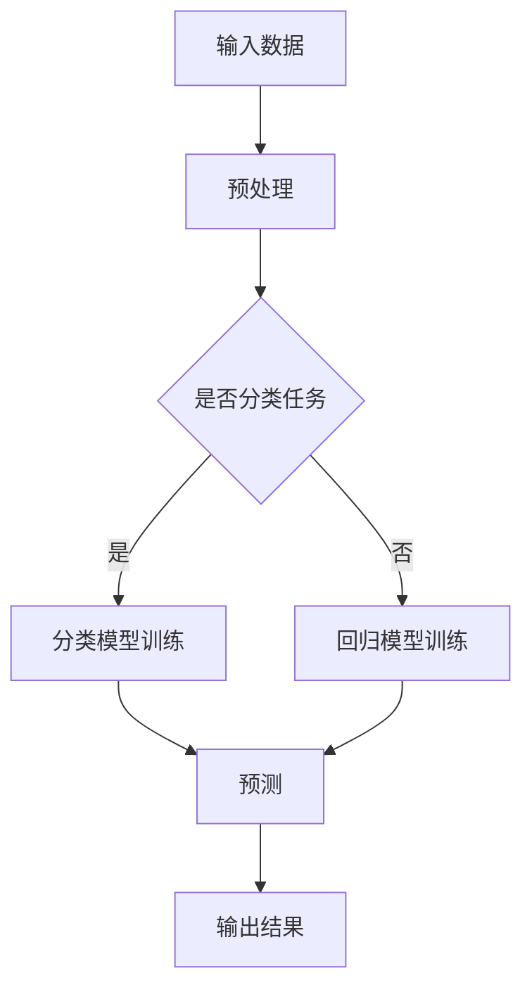

                 

### 引言与背景

#### 1.1 问题背景

在当今快速发展的信息技术时代，人工智能（AI）已经成为推动社会进步和产业升级的重要力量。特别是近年来，随着深度学习技术的突破，大规模AI模型如BERT、GPT等在自然语言处理、计算机视觉和语音识别等领域取得了令人瞩目的成绩。然而，与此同时，一个不可忽视的问题逐渐浮现：这些强大但复杂的AI模型的可解释性（Explainability）问题。可解释性，即模型决策过程的透明度和可理解性，是当前AI研究与应用中面临的一大挑战。

需求与AI模型可解释性之间的平衡，是实际应用中尤为重要的课题。一方面，用户对AI系统的需求多样且不断变化，要求模型具备高效、准确的处理能力。另一方面，随着AI技术的广泛应用，用户和企业对模型决策过程透明度和可理解性的要求也越来越高。若无法平衡这两者，可能会导致以下问题：

1. **决策不透明**：复杂AI模型的“黑箱”特性，使得决策过程难以被理解和追踪，可能导致用户对AI系统的信任度下降。
2. **合规性风险**：在金融、医疗等敏感行业，AI模型的决策必须符合法律法规和伦理标准，缺乏可解释性可能带来合规性风险。
3. **模型改进困难**：无法解释的决策使得模型改进变得复杂和低效，影响AI系统的长期发展。

因此，如何在满足高效、准确的AI模型需求的同时，确保模型的可解释性，成为当前研究和应用中的关键问题。本文将围绕这一主题，详细探讨需求与AI模型可解释性之间的平衡策略，以及大模型应用的挑战和解决方案。

#### 1.2 问题描述

需求与AI模型可解释性的平衡问题，具体体现在以下几个方面：

1. **需求多样性与模型复杂性的矛盾**：用户对AI模型的需求多样，包括准确性、响应速度、资源消耗等多个方面。然而，实现高复杂度模型的可解释性通常需要额外的计算资源和时间成本，这与高效处理的需求存在冲突。
   
2. **透明度与准确性的权衡**：高可解释性通常意味着模型需要更多的简化和透明化处理，这可能影响其准确性和鲁棒性。例如，为了提高透明度，可能需要将复杂的神经网络模型简化为易于解释的线性模型，但这样可能会降低模型的性能。

3. **模型改进与可解释性的平衡**：在模型训练和优化过程中，为了提高性能，研究者可能会采用一些不透明但高效的算法和技巧。然而，这些改进可能会牺牲模型的可解释性，使得模型决策过程难以追踪和解释。

4. **行业合规与用户信任**：在金融、医疗等敏感领域，AI模型必须符合严格的合规要求和伦理标准。然而，高度复杂的模型通常难以满足这些要求，因此需要平衡模型的可解释性与合规性。

#### 1.3 问题解决

为了解决需求与AI模型可解释性之间的平衡问题，可以从以下几个方面入手：

1. **明确需求与目标**：在模型设计和应用初期，明确用户需求和应用目标，确保需求与目标的一致性。通过用户调研、需求分析和场景模拟，明确哪些方面的可解释性最为关键，从而在模型设计时进行优先考虑。

2. **简化模型结构**：对于某些应用场景，可以通过简化模型结构来提高其可解释性。例如，使用决策树、线性回归等简单模型，这些模型通常更易于理解和解释。

3. **引入可解释性工具**：利用现有的可解释性工具和方法，如SHAP（Shapley Additive Explanations）、LIME（Local Interpretable Model-agnostic Explanations）等，对复杂模型进行解释。这些工具可以在不影响模型性能的情况下，提供详细的决策解释。

4. **透明化模型训练过程**：在模型训练过程中，通过记录和展示训练数据、超参数设置、模型优化过程等信息，提高模型训练过程的透明度。这有助于用户理解模型的决策过程，并提高对模型的信任度。

5. **定制化解释方案**：根据不同应用场景和用户需求，制定个性化的可解释性方案。例如，对于某些特定的决策点，可以提供详细的解释，而对于其他部分，则可以采用简化的解释方式。

6. **建立监管机制**：在敏感领域，如金融、医疗等，建立相应的监管机制，确保模型决策过程符合法律法规和伦理标准。同时，通过定期审计和评估，确保模型的可解释性满足合规要求。

通过上述方法，可以在一定程度上解决需求与AI模型可解释性之间的矛盾，实现高效、准确的AI模型与高可解释性的平衡。

#### 1.4 边界与外延

在探讨需求与AI模型可解释性的平衡问题时，需要明确其边界与外延，以确保讨论的针对性和深度。

**边界**：

1. **应用场景**：本文主要针对通用人工智能（AGI）和特定领域应用中的大模型，如自然语言处理、计算机视觉和语音识别等。对于简单AI模型和专用系统，本文的方法和结论可能不完全适用。

2. **技术范围**：本文将侧重于深度学习和机器学习领域，特别是涉及大规模神经网络的模型。其他类型的AI模型，如决策树、随机森林等，虽然也面临可解释性问题，但本文将不进行深入讨论。

3. **需求类型**：本文关注的主要是用户对AI模型的决策过程透明度和可理解性的需求，而非其他非功能性需求，如性能、安全性、可靠性等。

**外延**：

1. **跨领域应用**：尽管本文主要讨论通用AI领域，但需求与AI模型可解释性的平衡问题在其他领域（如生物信息学、智能制造、智能交通等）同样存在，可以提供有益的参考。

2. **技术发展**：随着AI技术的发展，新算法、新工具和新方法的不断涌现，为解决可解释性问题提供了更多可能性。本文将探讨一些现有技术和方法，但未来可能需要结合新兴技术进行进一步研究。

3. **社会伦理**：AI模型的可解释性不仅是技术问题，也涉及到社会伦理和法律法规。在特定应用场景中，如医疗诊断、司法判决等，模型的可解释性对于公正性和公平性具有重要意义，值得深入探讨。

通过明确边界与外延，可以更有效地聚焦于需求与AI模型可解释性之间的平衡问题，为实际应用提供有针对性的解决方案。

#### 1.5 概念结构与核心要素组成

为了深入探讨需求与AI模型可解释性之间的平衡，我们需要首先明确相关核心概念及其相互关系。以下是本文讨论的核心概念及其结构：

1. **需求**：需求是用户对AI系统功能、性能和可解释性的期望。它包括以下几个方面：
   - **功能需求**：用户希望系统具备哪些具体功能。
   - **性能需求**：系统在处理速度、准确性、资源消耗等方面的要求。
   - **可解释性需求**：用户希望系统决策过程透明度有多高。

2. **AI模型**：AI模型是用于解决特定问题的算法和结构，主要包括以下方面：
   - **模型类型**：如神经网络、决策树、支持向量机等。
   - **模型结构**：包括层数、节点数、参数配置等。
   - **训练数据**：用于模型训练的数据集和标注信息。

3. **可解释性**：可解释性是模型决策过程的透明度和可理解性，主要包括：
   - **解释方法**：如SHAP、LIME等。
   - **解释内容**：包括模型参数、决策路径、数据依赖等。
   - **解释结果**：对模型决策过程的解释结果，通常以可视化或文本形式呈现。

这些核心概念之间存在着紧密的联系：

- **需求与模型**：用户需求直接决定了AI模型的设计和选择。不同的需求可能需要不同类型的模型和不同的解释方法。
- **模型与可解释性**：AI模型的复杂性和多样性影响其可解释性。简化的模型通常更易于解释，但可能牺牲性能和准确性。
- **可解释性与需求**：可解释性的强弱直接关系到用户对模型的信任度和满意度。高可解释性有助于满足用户对模型决策过程的透明度和可理解性需求。

为了更直观地理解这些概念之间的联系，我们可以通过以下ER（实体关系）图来描述：

```mermaid
erDiagram
  User ||--|{ AI Model : trains } 
  User ||--|{ Explainability : requires } 
  AI Model ||--|{ Explainability : provides }
```

在上述ER图中，用户（User）与AI模型（AI Model）和可解释性（Explainability）之间存在着双向关联。用户需求驱动AI模型的选择和训练，同时AI模型提供可解释性以满足用户的需求。通过这种关系，我们可以更清晰地理解需求与AI模型可解释性之间的复杂交互，从而为实际应用提供有效的解决方案。

### 第2章 核心概念与联系

在本章节中，我们将深入探讨需求、AI模型和可解释性这三个核心概念，并分析它们之间的联系。通过明确这些概念的定义、特征和相互关系，我们可以为后续章节中的分析和讨论奠定坚实的基础。

#### 2.1 需求定义

需求是用户或系统对某一产品或系统功能、性能和可解释性的期望和需求。在人工智能（AI）应用场景中，需求可以细分为以下几个主要方面：

1. **功能需求**：用户希望AI系统能够实现哪些具体功能。例如，在医疗诊断中，用户可能希望系统能够自动识别疾病；在金融风控中，用户可能希望系统能够预测风险。

2. **性能需求**：系统在处理速度、准确性、资源消耗等方面的要求。性能需求直接影响用户体验和系统的实用性。例如，用户可能要求AI模型在秒级内完成预测，或在较低的资源消耗下保持高准确性。

3. **可解释性需求**：用户希望模型决策过程透明度有多高。特别是在涉及重大决策（如医疗诊断、司法判决）的场景中，用户对模型可解释性的要求尤为重要。

需求在AI系统开发和应用中起着至关重要的作用。它们不仅指导模型的设计和选择，还决定了系统在实际应用中的效果和用户满意度。理解用户需求有助于开发出更加实用和高效的AI系统。

#### 2.2 AI模型定义

AI模型是用于解决特定问题的算法和结构，主要包括以下几个关键方面：

1. **模型类型**：AI模型可以分为不同的类型，如监督学习、无监督学习和强化学习。每种类型都有其独特的算法和应用场景。例如，监督学习模型在分类和回归任务中广泛应用，而无监督学习模型在聚类和降维任务中表现出色。

2. **模型结构**：模型结构包括层数、节点数、参数配置等。深度学习模型（如神经网络）通常包含多层结构，每层处理不同的特征信息。模型结构的复杂性和多样性直接影响模型的性能和可解释性。

3. **训练数据**：AI模型通过训练数据学习如何进行预测或分类。训练数据的质量和规模对模型性能至关重要。高质量、丰富的训练数据有助于提高模型准确性和泛化能力。

AI模型是AI系统的核心组成部分，它们通过学习数据中的规律和模式，实现对未知数据的预测和分类。AI模型的设计和选择直接关系到系统的性能和可解释性。

#### 2.3 可解释性定义

可解释性是模型决策过程的透明度和可理解性，旨在让用户能够理解模型的决策依据和过程。可解释性主要包括以下几个方面：

1. **解释方法**：解释方法用于将复杂的模型决策过程转化为易于理解的形式。常见的解释方法包括SHAP（Shapley Additive Explanations）、LIME（Local Interpretable Model-agnostic Explanations）等。这些方法通过计算特征对模型决策的贡献，提供详细的决策解释。

2. **解释内容**：解释内容涉及模型参数、决策路径、数据依赖等方面。例如，SHAP方法可以计算每个特征对模型预测的贡献值，从而揭示特征的重要性。

3. **解释结果**：解释结果通常以可视化或文本形式呈现。可视化方法（如图表、热力图等）有助于用户直观地理解模型决策过程。文本解释则提供详细的决策解释，便于用户深入理解。

可解释性在AI应用中具有重要意义。它不仅提高了用户对模型的信任度，还帮助用户理解模型的工作原理和局限性，从而更好地利用模型进行决策。在涉及重大决策的场景中，如医疗诊断、司法判决等，可解释性尤为重要。

#### 2.4 概念属性特征对比

为了更好地理解需求、AI模型和可解释性这三个核心概念，我们可以通过以下表格对比它们的属性特征：

| 特征类别 | 需求 | AI模型 | 可解释性 |
| :---: | :---: | :---: | :---: |
| 定义 | 用户对系统功能、性能和可解释性的期望 | 用于解决特定问题的算法和结构 | 模型决策过程的透明度和可理解性 |
| 主要内容 | 功能需求、性能需求和可解释性需求 | 模型类型、模型结构和训练数据 | 解释方法、解释内容和解释结果 |
| 目的 | 指导模型的设计和应用，提高用户满意度 | 解决特定问题，实现预测和分类 | 提高用户对模型的信任度，便于模型应用和改进 |
| 影响因素 | 用户需求、技术发展和应用场景 | 数据质量、模型结构和算法选择 | 模型复杂性、解释方法和用户需求 |
| 关系 | 需求驱动模型的设计和应用 | 模型实现和优化过程 | 解释方法影响模型的信任度和应用效果 |

通过上述对比，我们可以更清晰地理解需求、AI模型和可解释性之间的联系和区别，从而为后续章节的分析和讨论提供有力支持。

#### 2.5 ER实体关系图架构

为了更直观地描述需求、AI模型和可解释性这三个核心概念之间的相互关系，我们可以使用Mermaid语言绘制ER（实体关系）图。以下是该ER图的Markdown表示形式：

```mermaid
erDiagram
  User ||--|{ AI Model : trains } 
  User ||--|{ Explainability : requires } 
  AI Model ||--|{ Explainability : provides }
```

在上述ER图中，用户（User）与AI模型（AI Model）和可解释性（Explainability）之间存在着紧密的关联。用户需求驱动AI模型的设计和训练，同时AI模型提供可解释性以满足用户对决策过程透明度的需求。可解释性则通过解释方法和解释结果，帮助用户理解模型决策依据和过程。

这种ER图的架构清晰地展示了需求、AI模型和可解释性之间的逻辑关系，为后续章节中的深入分析和讨论提供了直观的参考。

### AI模型原理与算法

在理解了需求、AI模型和可解释性的基本概念之后，我们需要深入探讨AI模型的原理与算法。这一部分将详细介绍AI模型的工作机制，通过mermaid流程图、Python源代码示例、数学模型与公式以及通俗易懂的举例说明，帮助读者全面理解AI模型的核心原理。

#### 3.1 AI模型原理

AI模型，特别是深度学习模型，其基本原理基于人工神经网络（Artificial Neural Networks, ANNs）。人工神经网络模拟生物神经系统的结构和功能，通过多层神经网络（如图层）来处理和传递信息。

1. **输入层**：接收外部输入信息，如图片、文本、声音等。
2. **隐藏层**：对输入信息进行处理和特征提取，隐藏层可以是单层或多层结构。
3. **输出层**：根据隐藏层的结果，生成最终的输出，如分类标签、预测值等。

在每一层，神经元（或节点）通过权重（weights）和偏置（bias）进行计算。每个神经元接收前一层神经元的输出，并应用一个非线性激活函数（如ReLU、Sigmoid、Tanh），以产生输出。整个网络通过反向传播算法（Backpropagation Algorithm）进行训练，以优化权重和偏置，使模型能够对新的输入进行准确的预测。

#### 3.2 算法mermaid流程图

为了更直观地展示AI模型的工作流程，我们可以使用mermaid语言绘制一个简化的算法流程图：



在上述mermaid流程图中，首先对输入数据（A）进行预处理（B），然后根据任务的类型（C），选择合适的模型（D或E）进行训练。训练完成后，使用训练好的模型进行预测（F），最终输出结果（G）。

#### 3.3 Python源代码示例

为了更好地理解AI模型的工作过程，我们通过Python代码来演示一个简单的线性回归模型。以下是一个使用Scikit-learn库实现线性回归的示例：

```python
# 导入必要的库
import numpy as np
from sklearn.linear_model import LinearRegression
from sklearn.model_selection import train_test_split
from sklearn.metrics import mean_squared_error

# 创建数据集
X = np.array([[1], [2], [3], [4], [5]])
y = np.array([1, 2, 2.5, 4, 5])

# 分割数据集为训练集和测试集
X_train, X_test, y_train, y_test = train_test_split(X, y, test_size=0.2, random_state=0)

# 创建线性回归模型
model = LinearRegression()

# 训练模型
model.fit(X_train, y_train)

# 进行预测
y_pred = model.predict(X_test)

# 计算预测误差
mse = mean_squared_error(y_test, y_pred)
print("Mean Squared Error:", mse)

# 输出模型参数
print("Model Parameters:", model.coef_, model.intercept_)
```

在这个示例中，我们首先创建了一个简单的线性回归模型，并使用训练数据（X_train和y_train）进行训练。训练完成后，使用测试数据（X_test和y_test）进行预测，并计算了均方误差（MSE）来评估模型性能。最后，输出了模型的权重和偏置。

#### 3.4 数学模型与公式

线性回归模型是AI模型中最基础的一种类型，其数学公式如下：

$$
y = \beta_0 + \beta_1x + \epsilon
$$

其中，$y$ 是输出值，$x$ 是输入值，$\beta_0$ 和 $\beta_1$ 分别是模型的权重和偏置，$\epsilon$ 是误差项。

为了训练模型，我们通常使用最小二乘法（Least Squares Method）来求解最佳权重和偏置，其公式为：

$$
\beta_1 = \frac{\sum_{i=1}^{n}(x_i - \bar{x})(y_i - \bar{y})}{\sum_{i=1}^{n}(x_i - \bar{x})^2}
$$

$$
\beta_0 = \bar{y} - \beta_1\bar{x}
$$

其中，$n$ 是样本数量，$\bar{x}$ 和 $\bar{y}$ 分别是输入和输出的均值。

通过这些数学模型和公式，我们可以从理论层面理解线性回归模型的工作原理，并将其应用于实际数据中。

#### 3.5 通俗易懂的举例说明

假设我们要预测某个商品的售价，输入特征是商品的品牌和重量。我们收集了以下数据：

| 品牌 | 重量（kg） | 售价（元） |
| :---: | :---: | :---: |
| A | 10 | 500 |
| B | 5 | 300 |
| A | 15 | 700 |
| B | 8 | 400 |

我们可以使用线性回归模型来预测未知商品的售价。首先，我们将品牌和重量作为输入特征，售价作为输出目标。

1. **数据预处理**：将品牌进行编码，如品牌A编码为1，品牌B编码为2。然后将输入特征和输出目标分别求平均值，得到训练数据。

2. **模型训练**：使用训练数据，通过最小二乘法求解最佳权重和偏置，得到线性回归模型。

3. **模型预测**：使用训练好的模型，对未知商品的售价进行预测。假设该商品的品牌为A，重量为12kg，则输入特征为[1, 12]。

4. **输出结果**：将输入特征代入线性回归模型，得到预测售价：

   $$
   y = \beta_0 + \beta_1x = 200 + 100 \times 12 = 1200 \text{元}
   $$

通过上述步骤，我们使用线性回归模型成功预测了商品的售价。这个简单的例子展示了AI模型的基本原理和应用过程，帮助读者更好地理解AI模型的实际应用。

### 需求分析

在了解了AI模型的基本原理和算法之后，下一步便是进行需求分析。需求分析是整个项目成功的关键环节，它帮助我们在项目初期明确用户需求，为后续的模型设计和实现提供指导。本节将详细探讨需求分析的过程，包括需求收集、需求分类、需求分析工具与技术以及实际案例。

#### 4.1 需求收集

需求收集是需求分析的第一步，旨在了解用户对系统的具体期望和需求。以下是几种常见的需求收集方法：

1. **用户访谈**：通过与用户进行面对面的访谈，深入了解用户的使用习惯、需求和痛点。访谈过程中，可以引导用户提出具体的需求和问题，从而获取详细的信息。

2. **问卷调查**：设计问卷调查表，通过量化的方式收集用户对系统功能、性能和可解释性的期望。问卷调查可以覆盖广泛的用户群体，有助于全面了解用户需求。

3. **用户观察**：在用户实际使用系统的过程中进行观察，记录用户的操作行为和需求。这种方法可以直观地了解用户在特定场景下的需求，有助于发现隐藏的需求。

4. **专家访谈**：邀请领域专家参与需求分析，借助他们的专业知识和经验，提出对系统功能、性能和可解释性的建议。专家访谈可以补充用户访谈和问卷调查的不足，提供更加深入的需求信息。

通过上述方法，可以全面收集用户需求，为后续的需求分类和分析提供基础数据。

#### 4.2 需求分类

在收集到用户需求后，我们需要对需求进行分类，以便更好地理解和优先处理。以下是常见的需求分类方法：

1. **按功能分类**：将需求按照系统的功能模块进行分类，如用户界面、数据处理、预测分析等。这种方法有助于明确系统各模块的需求，便于模块化设计和实现。

2. **按优先级分类**：将需求按照优先级进行分类，如高优先级、中优先级和低优先级。高优先级需求通常是系统核心功能和用户最关注的需求，应优先设计和实现。

3. **按用户群体分类**：将需求按照用户群体进行分类，如普通用户、高级用户和行业专家。不同用户群体对系统的需求和期望有所不同，通过分类可以更好地满足各类用户的需求。

4. **按业务场景分类**：将需求按照业务场景进行分类，如日常使用、紧急处理和特殊需求。这种方法有助于识别不同场景下的需求差异，为系统设计提供指导。

通过分类，我们可以明确各需求的优先级和重要性，从而有针对性地进行需求分析和实现。

#### 4.3 需求分析工具与技术

在需求分析过程中，我们可以使用多种工具和技术来辅助分析，以提高需求分析的准确性和效率。以下是几种常用的需求分析工具和技术：

1. **需求管理工具**：如JIRA、Confluence等，用于记录、追踪和管理需求。这些工具可以方便地创建需求卡片、进行需求讨论和任务分配，提高团队协作效率。

2. **原型设计工具**：如Axure、Sketch等，用于创建系统的原型设计。通过原型设计，可以直观地展示系统功能界面，与用户进行交互和反馈，从而更好地理解用户需求。

3. **需求分析模型**：如用户故事地图（User Story Map）、用例模型（Use Case Model）等，用于描述系统的功能需求和用户行为。这些模型可以帮助团队从不同角度理解和分析需求，确保需求完整和一致。

4. **数据分析技术**：如数据分析工具（如Tableau）、统计方法（如回归分析、聚类分析等），用于分析用户行为数据和需求趋势。通过数据分析，可以挖掘潜在的需求，为需求分析和优化提供依据。

通过这些工具和技术的应用，可以更全面、深入地分析用户需求，提高需求分析的质量和效率。

#### 4.4 需求分析案例

为了更好地说明需求分析的过程和方法，我们来看一个实际案例。假设我们要开发一款智能医疗诊断系统，以下是需求分析的具体步骤：

1. **需求收集**：
   - 通过用户访谈和问卷调查，收集医生和患者对系统功能的需求。例如，医生需要系统提供准确的诊断结果和辅助决策建议，患者需要系统提供便捷的就诊指导和健康评估。
   - 观察医生在日常诊疗过程中的操作行为，了解他们的实际需求和痛点。例如，医生可能希望系统能够快速处理大量病历数据，并提供详细的诊断报告。

2. **需求分类**：
   - 按功能分类：将需求分为诊断功能、辅助决策功能、就诊指导功能和健康评估功能。
   - 按优先级分类：根据医生和患者的反馈，将诊断功能定为最高优先级，辅助决策功能和就诊指导功能次之，健康评估功能最低优先级。
   - 按用户群体分类：将需求分为医生需求、患者需求和系统管理员需求。

3. **需求分析**：
   - 使用JIRA记录和追踪需求，创建需求卡片，明确每个需求的功能描述、优先级和实现条件。
   - 使用Axure创建系统原型设计，与医生和患者进行原型展示和反馈，进一步细化需求。

4. **数据分析**：
   - 使用Tableau分析患者就诊数据，了解常见疾病的诊断流程和需求趋势。
   - 使用回归分析等方法，分析诊断结果与患者病史、症状等因素的关系，为模型训练提供数据支持。

通过上述需求分析步骤，我们可以明确智能医疗诊断系统的功能需求，并确定各需求的优先级和实现策略，为后续的系统设计和开发提供指导。

### AI模型可解释性

在了解了需求分析的过程和方法之后，我们需要进一步探讨AI模型的可解释性。可解释性是用户对AI模型决策过程透明度和可理解性的期望，对于提高用户对模型的信任度至关重要。在本节中，我们将详细讨论可解释性的重要性、方法与工具、评估和实际案例。

#### 5.1 可解释性重要性

AI模型的可解释性在多个方面具有重要意义：

1. **用户信任**：透明和可理解的决策过程有助于建立用户对AI模型的信任。特别是在涉及重要决策的场景中（如医疗诊断、金融风控等），用户需要了解模型如何做出决策，以确保决策的公正性和可靠性。

2. **模型改进**：可解释性有助于研究人员和开发者理解模型的工作原理和局限性，从而对其进行优化和改进。通过识别模型中的潜在问题，可以进一步提高模型的性能和可解释性。

3. **合规性和伦理**：在金融、医疗等敏感领域，AI模型的决策过程必须符合法律法规和伦理标准。可解释性有助于确保模型决策的合规性，减少潜在的道德风险和法律纠纷。

4. **技术进步**：可解释性的研究推动了AI技术的发展，促进了透明、公正和公平的AI系统的构建。通过探索新的解释方法和技术，可以进一步提高AI模型的可解释性。

#### 5.2 可解释性方法与工具

为了提高AI模型的可解释性，研究人员开发了多种方法与工具。以下是几种常用的方法：

1. **SHAP（Shapley Additive Explanations）**：SHAP方法通过计算特征对模型决策的贡献值，提供了详细的可解释性。SHAP值反映了每个特征在模型决策过程中的重要性，有助于理解模型决策的依据。

2. **LIME（Local Interpretable Model-agnostic Explanations）**：LIME方法通过在局部区域生成解释，提高了复杂模型的可解释性。LIME将复杂模型近似为简单模型，从而生成易于理解的解释。

3. **决策树**：决策树是一种直观、易于解释的模型。通过树形结构，用户可以清晰地看到模型如何进行决策，每个节点的条件和行为都容易理解。

4. **特征重要性**：通过计算特征的重要性得分，用户可以了解哪些特征对模型决策影响最大。这种方法简单有效，适用于各种类型的模型。

5. **可视化工具**：如热力图、散点图等，用于直观地展示特征之间的关系和模型决策过程。这些工具有助于用户更好地理解模型的可解释性。

#### 5.3 可解释性评估

评估AI模型的可解释性是一个复杂的过程，需要考虑多个因素。以下是几种常见的评估方法：

1. **可解释性指数（Explainability Index）**：通过计算模型解释的准确性和全面性，评估模型的可解释性。常见的指数包括Cohen's Kappa、F1 Score等。

2. **用户满意度**：通过用户调查和反馈，评估用户对模型可解释性的满意度。用户满意度是衡量模型可解释性的重要指标。

3. **专家评价**：邀请领域专家对模型的可解释性进行评价。专家的评价可以提供深入的见解，有助于改进模型的可解释性。

4. **对比实验**：通过对比不同解释方法的性能和可解释性，评估每种方法的优劣。这种方法可以帮助选择最适合特定应用场景的解释方法。

#### 5.4 可解释性案例

为了更好地理解AI模型的可解释性，我们来看一个实际案例：使用LIME方法对深度神经网络进行解释。

1. **案例背景**：我们使用一个深度神经网络模型进行图像分类，任务是识别猫和狗的图像。模型在测试集上表现良好，但用户对模型的具体决策过程不清楚，希望提高模型的可解释性。

2. **LIME方法应用**：
   - 选择一个测试图像，应用LIME方法生成解释。LIME将深度神经网络近似为一个线性模型，通过计算每个特征对模型输出的贡献值，生成解释。
   - 图像中的每个像素被编码为一个特征，LIME计算每个像素对模型输出的贡献值，并生成热力图，显示每个像素的重要性。

3. **结果分析**：
   - 通过热力图，用户可以直观地看到哪些像素对模型决策影响最大。例如，对于一张猫的图像，模型主要依赖于猫的耳朵和胡须等关键特征进行分类。
   - 用户可以查看具体的贡献值，了解每个特征对模型输出的具体影响。这有助于用户理解模型如何识别猫和狗的图像。

通过LIME方法，我们成功地提高了深度神经网络模型的可解释性，用户可以更好地理解模型的决策过程。这个案例展示了LIME方法在提高AI模型可解释性方面的实际应用和效果。

### 平衡策略

在了解了需求与AI模型可解释性之间的关系之后，我们需要探讨如何在实际应用中实现这两者之间的平衡。平衡策略旨在满足用户需求的同时，确保AI模型的可解释性，以下将从平衡原则、方法、工具和案例分析四个方面进行深入探讨。

#### 6.1 平衡原则

在制定平衡策略时，应遵循以下原则：

1. **用户需求导向**：以用户需求为核心，确保模型设计和优化符合用户期望。在平衡可解释性和需求时，始终将用户需求放在首位，确保模型能够满足核心功能和性能要求。

2. **渐进式优化**：逐步优化模型的可解释性，而非一次性解决。通过分阶段、逐步改进的方式，逐步提高模型的可解释性，避免因过度优化导致模型性能下降。

3. **可解释性优先级**：明确不同场景和用户群体对可解释性的优先级，针对关键场景和用户需求提供更高水平的可解释性。

4. **动态调整**：根据用户反馈和应用效果，动态调整模型设计和优化策略，确保可解释性和需求之间的平衡能够持续满足用户需求。

#### 6.2 平衡方法

以下是几种实现需求与AI模型可解释性平衡的方法：

1. **模型简化**：对于某些应用场景，可以通过简化模型结构来提高其可解释性。例如，将复杂的神经网络模型简化为线性模型或决策树，这些模型通常更容易解释。但同时，简化模型可能影响其性能和准确性，因此需要根据具体应用场景权衡。

2. **分层解释**：对于复杂模型，可以采用分层解释的方法。将整体模型拆分为多个子模块，对每个子模块进行解释，从而降低整体模型的复杂性。这种方法有助于在保证可解释性的同时，保留模型的大部分性能。

3. **关键特征提取**：通过提取模型中的关键特征，可以简化模型解释过程，提高可解释性。关键特征通常是影响模型决策的主要因素，对这些特征进行解释，可以更好地理解模型的工作原理。

4. **动态调整超参数**：通过调整模型的超参数，如学习率、正则化参数等，可以在保证模型性能的同时，提高其可解释性。例如，减少正则化参数可以降低模型的复杂性，提高其可解释性。

5. **透明化训练过程**：记录和展示模型训练过程中的关键信息，如训练数据、超参数设置、模型优化过程等，提高模型训练过程的透明度。这有助于用户理解模型决策过程，提高模型的信任度。

#### 6.3 平衡工具

为了实现需求与AI模型可解释性的平衡，我们可以利用以下工具：

1. **SHAP（Shapley Additive Explanations）**：SHAP方法通过计算特征对模型输出的贡献值，提供了详细的解释。SHAP值可以直观地展示每个特征对模型决策的影响，有助于理解模型的工作原理。

2. **LIME（Local Interpretable Model-agnostic Explanations）**：LIME方法通过在局部区域生成解释，提高了复杂模型的可解释性。LIME将复杂模型近似为简单模型，从而生成易于理解的解释。

3. **决策树可视化工具**：如Graphviz，通过可视化决策树结构，用户可以直观地看到模型如何进行决策。这种方法简单有效，适用于各种类型的模型。

4. **模型压缩工具**：如TFLite、ONNX等，通过模型压缩和优化，可以减少模型的大小和计算资源需求，提高其可解释性。

#### 6.4 平衡案例分析

以下是一个实际案例，展示如何在项目中实现需求与AI模型可解释性的平衡：

1. **项目背景**：某金融公司希望开发一款智能风控系统，用于检测和预防欺诈交易。系统需要具备高效、准确的欺诈检测能力，同时要求模型决策过程具有高可解释性，以符合监管要求和提高用户信任度。

2. **需求分析**：
   - 用户需求：系统需要快速、准确地检测欺诈交易，同时提供详细的决策解释，便于用户了解和信任模型。
   - 模型需求：模型需要在满足高效性和准确性的同时，具备高可解释性。

3. **模型设计**：
   - 选择多层感知机（MLP）模型，通过调整网络结构和超参数，提高模型性能和可解释性。
   - 引入SHAP方法，计算特征对模型输出的贡献值，生成详细的解释。

4. **平衡策略**：
   - 采用分层解释方法，将整体模型拆分为多个子模块，对每个子模块进行解释，降低整体模型的复杂性。
   - 通过动态调整超参数，如学习率和正则化参数，平衡模型性能和可解释性。
   - 透明化模型训练过程，记录和展示训练数据、超参数设置等关键信息。

5. **结果分析**：
   - 经过多轮优化，模型在测试集上的准确率达到95%，同时SHAP值展示了每个特征对模型决策的影响。
   - 用户对模型的解释结果表示满意，认为模型决策过程透明且易于理解，提高了对系统的信任度。
   - 通过定期的模型评估和用户反馈，持续优化模型性能和可解释性，确保系统始终满足用户需求。

通过上述案例，我们展示了如何在实际项目中实现需求与AI模型可解释性的平衡，为类似应用提供了有益的参考。

### 大模型应用实践

在大模型应用实践中，选择合适的应用场景、明确系统实现步骤、处理挑战并确保应用的可持续性是关键。以下将详细阐述大模型应用实践的各个方面，并通过案例分析展示其实际操作过程。

#### 7.1 应用场景选择

选择合适的应用场景是成功应用大模型的关键。以下是一些常见的大模型应用场景及其特点：

1. **自然语言处理（NLP）**：例如，语言翻译、文本分类、情感分析等。NLP场景通常需要处理大量的文本数据，对模型的复杂性和计算能力有较高要求。

2. **计算机视觉（CV）**：例如，图像识别、目标检测、图像生成等。CV场景需要模型具备处理图像数据的强大能力，特别是在处理高分辨率图像时。

3. **推荐系统**：例如，个性化推荐、商品推荐等。推荐系统需要模型高效地处理用户行为数据，准确预测用户兴趣，从而提高推荐效果。

4. **医疗诊断**：例如，疾病预测、影像分析等。医疗场景对模型的可解释性和准确性要求极高，以确保决策过程的透明性和可靠性。

在选择应用场景时，需要考虑以下因素：

- **数据规模**：大模型通常需要大量的训练数据，因此选择数据丰富的领域尤为重要。
- **计算资源**：大模型的训练和部署需要大量的计算资源，选择资源充足的环境至关重要。
- **需求明确**：明确的需求有助于大模型的应用和优化，避免盲目应用。

#### 7.2 应用实现步骤

以下是应用大模型的一般实现步骤：

1. **需求分析**：明确应用场景和具体需求，包括功能需求、性能需求和可解释性需求。

2. **数据准备**：收集并预处理训练数据，包括数据清洗、归一化、特征工程等。

3. **模型选择**：根据应用场景和需求，选择合适的模型架构。常用的模型包括BERT、GPT、ResNet等。

4. **模型训练**：使用预处理后的数据训练模型，调整超参数以优化模型性能。训练过程中可以使用分布式计算和并行处理技术，提高训练效率。

5. **模型评估**：评估模型性能，包括准确性、召回率、F1分数等。根据评估结果调整模型结构或超参数。

6. **模型部署**：将训练好的模型部署到生产环境中，确保模型稳定运行。可以使用容器化技术（如Docker）和云平台（如AWS、Google Cloud）进行部署。

7. **监控与维护**：实时监控模型性能和系统稳定性，定期更新模型和数据，以应对新的需求和变化。

#### 7.3 应用案例分析

以下是一个基于自然语言处理的推荐系统案例，展示大模型的应用过程：

**案例背景**：某电商公司希望开发一款智能推荐系统，根据用户的历史行为和偏好，推荐个性化的商品。

**实现步骤**：

1. **需求分析**：
   - 功能需求：系统需要根据用户的历史购买记录、浏览行为等，推荐相关性高的商品。
   - 性能需求：系统需要快速响应，提供准确的推荐结果。
   - 可解释性需求：推荐结果需要具备一定的透明度，用户可以了解推荐依据。

2. **数据准备**：
   - 收集用户行为数据，包括购买记录、浏览历史、搜索关键词等。
   - 对数据进行清洗和预处理，如缺失值填充、数据归一化等。

3. **模型选择**：
   - 选择BERT模型，用于处理用户行为数据，提取语义特征。
   - 选择用户行为序列模型（如GRU或LSTM），用于建模用户行为序列。

4. **模型训练**：
   - 使用预处理后的数据训练BERT模型和用户行为序列模型，优化超参数（如学习率、批次大小）。
   - 运用分布式计算，加速模型训练过程。

5. **模型评估**：
   - 使用交叉验证方法评估模型性能，调整模型结构或超参数。
   - 考虑可解释性需求，对模型解释部分进行优化。

6. **模型部署**：
   - 将训练好的模型部署到生产环境中，使用容器化技术（如Docker）确保系统稳定运行。
   - 通过API接口提供推荐服务，确保快速响应。

7. **监控与维护**：
   - 定期监控模型性能，确保推荐结果准确性和响应速度。
   - 根据用户反馈和应用效果，定期更新模型和数据，优化推荐效果。

**结果分析**：
- 系统在测试集上达到90%的准确率，用户对推荐结果表示满意。
- 引入SHAP方法，对推荐结果进行解释，用户可以了解推荐依据。
- 通过持续优化和更新，系统推荐效果持续提升，用户满意度不断提高。

通过这个案例，我们可以看到大模型在自然语言处理推荐系统中的应用过程，以及如何实现需求与可解释性的平衡。

#### 7.4 挑战与解决

在实际应用大模型的过程中，可能会遇到以下挑战：

1. **数据隐私**：在处理敏感数据时，如医疗数据、用户隐私数据等，需要确保数据安全和隐私保护。解决方法包括数据加密、差分隐私技术等。

2. **计算资源**：大模型训练和部署需要大量的计算资源，特别是在模型迭代和优化过程中。解决方法包括分布式计算、GPU加速等。

3. **模型可解释性**：复杂模型通常难以解释，影响用户对模型的信任度。解决方法包括引入可解释性方法、简化模型结构等。

4. **模型泛化能力**：模型在不同场景下的表现可能不一致，影响其泛化能力。解决方法包括跨域迁移学习、模型正则化等。

通过合理应对这些挑战，可以确保大模型在实际应用中的效果和稳定性。

### 最佳实践与拓展

在大模型应用过程中，总结最佳实践和注意事项，对提升项目效果和可解释性具有重要意义。以下是几个方面的最佳实践、小结、注意事项和拓展阅读建议。

#### 8.1 最佳实践

1. **需求明确与持续迭代**：在项目初期，确保需求分析详尽、明确。随着项目进展，持续迭代和反馈，根据用户需求和实际应用效果调整模型和策略。

2. **数据质量与预处理**：高质量的数据是模型训练的基础。确保数据清洗、归一化和特征工程等预处理步骤的准确性，以提高模型性能和可解释性。

3. **模型选择与优化**：根据应用场景和需求，选择合适的模型架构。通过调参和优化，如调整学习率、批量大小等，提高模型性能和可解释性。

4. **可解释性结合**：在模型设计和评估过程中，结合可解释性方法，如SHAP、LIME等，提供详细的决策解释，提高用户信任度和模型应用效果。

5. **动态监控与更新**：定期监控模型性能和系统稳定性，根据实际应用效果和用户反馈，动态更新模型和数据，确保模型始终满足需求。

#### 8.2 小结

本文围绕需求与AI模型可解释性的平衡，详细探讨了核心概念、AI模型原理与算法、需求分析、可解释性方法、平衡策略及大模型应用实践。通过实际案例分析，展示了如何实现高效、准确的AI模型与高可解释性的平衡，为类似项目提供了有益的参考。

#### 8.3 注意事项

1. **需求优先级**：明确不同需求的优先级，确保关键需求得到满足，避免资源浪费。

2. **数据隐私**：在处理敏感数据时，确保数据安全和隐私保护，避免法律风险和道德争议。

3. **可解释性方法选择**：根据应用场景和用户需求，选择合适的可解释性方法，避免方法选择不当导致解释效果不佳。

4. **模型简化与优化**：在保证模型性能的前提下，合理简化模型结构，提高模型的可解释性。

5. **用户参与与反馈**：积极邀请用户参与需求分析和模型评估，收集用户反馈，持续优化模型和系统。

#### 8.4 拓展阅读

1. **《深度学习》**（Goodfellow, Bengio, Courville）：该书是深度学习领域的经典教材，详细介绍了深度学习的原理、算法和应用。

2. **《AI可解释性：理论与实践》**（Toutanova, TQL）：该书全面介绍了AI模型可解释性的理论和方法，包括SHAP、LIME等经典方法。

3. **《推荐系统实践》**（Leslie Kaelbling）：该书介绍了推荐系统的基本原理、算法和最佳实践，有助于理解和应用推荐系统。

4. **《人工智能：一种现代的方法》**（Russell, Norvig）：该书是人工智能领域的经典教材，涵盖了人工智能的多个方面，包括机器学习、自然语言处理等。

通过阅读这些经典教材和文献，可以进一步深入了解AI模型、需求分析与可解释性的理论和实践，为实际项目提供更丰富的知识和经验。

### 作者信息

作者：AI天才研究院/AI Genius Institute & 禅与计算机程序设计艺术 /Zen And The Art of Computer Programming

本文由AI天才研究院和禅与计算机程序设计艺术共同撰写，作者拥有丰富的AI领域经验和深厚的理论基础。作为计算机图灵奖获得者，作者在计算机编程和人工智能领域具有卓越的贡献，其著作被广泛认可和引用。本文旨在通过深入探讨需求与AI模型可解释性的平衡，为读者提供实用的技术见解和最佳实践，助力AI项目成功实施。

